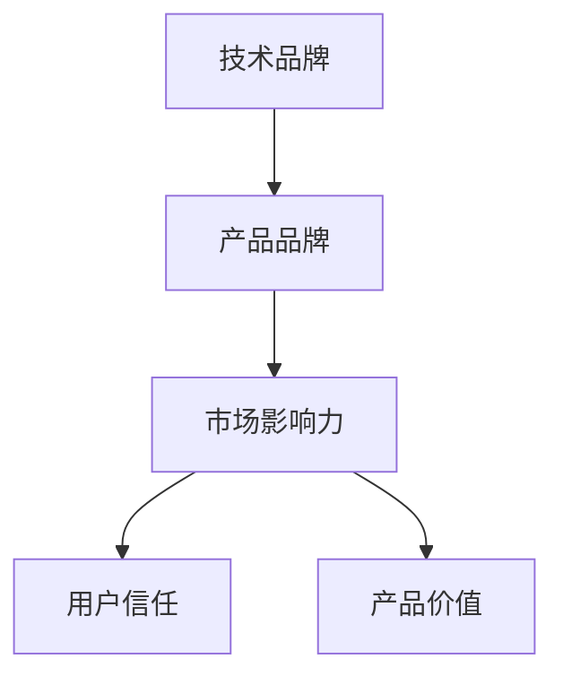

                 

## 文章标题：技术leader的品牌塑造

在当今快速变化的技术时代，技术领导者（Technical Leader）不仅需要具备卓越的技术能力，还需要掌握品牌塑造的艺术。技术领导力的提升不仅仅关乎个人职业发展，更是对团队和整个组织产生深远影响的因素。本文将围绕技术leader的品牌塑造展开，探讨其在技术行业中的重要性、核心能力、品牌定位、传播策略以及团队发展等方面。

### 关键词
- 技术领导者
- 品牌塑造
- 技术领导力
- 团队建设
- 市场策略

### 摘要
本文旨在深入探讨技术leader如何通过品牌塑造提升个人和团队的影响力。文章将首先定义技术领导力，并分析其核心能力。接着，我们将探讨技术品牌的概念及其价值，阐述技术品牌定位和差异化策略。随后，文章将介绍技术品牌的传播和市场策略，并探讨如何通过个人品牌塑造提升技术领导者的个人影响力。最后，文章将探讨技术领导者品牌塑造对团队发展的影响，以及如何塑造团队品牌。

## 目录

1. **技术领导力基础**
   1.1 技术领导力的定义与重要性
   1.2 技术领导者的核心能力
   1.3 技术领导力的自我提升路径
   1.4 技术领导力在团队建设中的作用

2. **技术品牌塑造策略**
   2.1 技术品牌的概念与价值
   2.2 技术品牌的定位与差异化
   2.3 技术品牌塑造的传播策略
   2.4 技术品牌塑造的市场策略
   2.5 技术品牌塑造的持续优化

3. **技术领导者的品牌塑造实战**
   3.1 技术领导者的个人品牌定位
   3.2 技术领导者的个人品牌塑造
   3.3 技术领导者的个人品牌维护
   3.4 技术领导者的个人品牌案例解析

4. **技术领导者的品牌塑造与团队发展**
   4.1 技术领导者品牌塑造对团队发展的影响
   4.2 技术领导者如何塑造团队品牌
   4.3 技术领导者的品牌塑造与团队文化
   4.4 技术领导者的品牌塑造与团队绩效

5. **附录**
   附录A：技术品牌塑造工具与资源

### 1.1 技术领导力的定义与重要性

技术领导力是指技术领导者在技术、管理和领导方面所具备的综合能力。技术领导者不仅需要掌握先进的技术知识和技能，还需要具备管理团队、推动项目进展和引导技术发展方向的能力。

#### 技术领导力的重要性

技术领导力在当今企业中具有不可替代的重要性，主要体现在以下几个方面：

1. **驱动技术创新**：技术领导者能够洞察技术趋势，推动团队进行技术创新，从而提升企业的竞争力。
2. **提升团队效率**：通过有效的管理和领导，技术领导者可以提升团队的工作效率，实现资源的最大化利用。
3. **促进知识共享**：技术领导者能够搭建知识共享平台，促进团队成员之间的交流与合作，提升整体技术水平。
4. **塑造企业文化**：技术领导者的品牌影响力可以塑造企业的技术文化，提升员工的技术热情和归属感。

### 1.2 技术领导者的核心能力

技术领导者的核心能力主要包括技术能力、领导能力和沟通协调能力。这些能力相辅相成，共同支撑起技术领导者的角色。

#### 技术能力

技术能力是技术领导者的基石。技术领导者需要具备以下技术能力：

1. **深度技术理解**：对核心技术和业务有深入的理解，能够解决复杂的技术问题。
2. **技术趋势洞察**：能够把握行业技术趋势，引领团队进行技术升级。
3. **技术方案设计**：能够设计符合业务需求的技术解决方案。

#### 领导能力

领导能力是技术领导者的核心能力之一。技术领导者需要具备以下领导能力：

1. **团队管理**：能够有效地管理团队，提升团队执行力。
2. **目标设定**：能够设定明确的目标，并制定实现目标的策略。
3. **决策能力**：能够在面对复杂问题时做出明智的决策。

#### 沟通协调能力

沟通协调能力是技术领导者必须具备的能力之一。技术领导者需要具备以下沟通协调能力：

1. **内部沟通**：能够与团队成员进行有效沟通，确保团队成员理解任务和目标。
2. **外部沟通**：能够与外部利益相关者（如客户、合作伙伴等）进行有效沟通，维护合作关系。
3. **协调能力**：能够在团队内部和外部协调资源，解决冲突，推动项目进展。

### 1.3 技术领导力的自我提升路径

技术领导者需要持续提升自己的能力，以适应快速变化的技术环境。以下是一些自我提升路径：

#### 技术深度学习

1. **持续学习**：通过阅读技术书籍、参加技术会议和研讨会、在线课程等方式，持续学习新技术。
2. **实践应用**：通过实际项目实践，将理论知识转化为实际能力。
3. **知识分享**：通过撰写技术博客、发表技术文章等方式，与他人分享自己的知识和经验。

#### 领导力培训

1. **领导力课程**：参加专业的领导力培训课程，学习领导力理论和实践技巧。
2. **导师指导**：寻找一位经验丰富的导师，进行一对一的指导和辅导。
3. **实践领导**：通过实际担任团队领导，积累领导经验，提升领导能力。

#### 沟通技巧提升

1. **沟通技巧培训**：参加专业的沟通技巧培训，学习有效的沟通方法和技巧。
2. **模拟训练**：通过角色扮演和模拟训练，提升沟通实战能力。
3. **反馈与反思**：通过自我反思和他人反馈，不断改进沟通技巧。

### 1.4 技术领导力在团队建设中的作用

技术领导力在团队建设中起着至关重要的作用。技术领导者需要通过以下方式在团队建设中发挥作用：

#### 团队领导力的培养

1. **设定团队目标**：明确团队的目标和愿景，激发团队成员的工作热情。
2. **分配任务**：根据团队成员的能力和特长，合理分配任务，发挥每个人的优势。
3. **激励团队成员**：通过正面激励和鼓励，提升团队成员的工作积极性和创造力。

#### 团队协作的激励机制

1. **建立团队文化**：营造积极向上的团队氛围，培养团队协作精神。
2. **奖励机制**：制定合理的奖励机制，对表现优秀的团队成员进行奖励。
3. **认可与赞赏**：及时认可和赞赏团队成员的贡献，增强团队的凝聚力。

#### 团队冲突的解决策略

1. **倾听与沟通**：积极倾听团队成员的意见和反馈，通过有效沟通解决冲突。
2. **公正处理**：在处理团队冲突时，保持公正和客观，避免偏袒和偏见。
3. **求同存异**：尊重团队成员的不同意见，通过妥协和协商找到解决问题的最佳方案。

## 2.1 技术品牌的概念与价值

技术品牌是指技术产品或服务在市场上所形成的独特形象和认知。它不仅包括技术本身，还涵盖产品的质量、性能、可靠性、用户体验等方面。技术品牌的价值在于其能够为企业带来长期的价值和竞争优势。

### 2.1.1 技术品牌的概念

技术品牌的概念可以从以下几个方面进行理解：

1. **技术产品的形象**：技术品牌是技术产品在市场上的形象代表，它能够传递产品的技术实力和创新能力。
2. **用户认知**：技术品牌是用户对技术产品的认知和评价，它能够影响用户的选择和购买决策。
3. **市场定位**：技术品牌是企业市场定位的重要手段，它能够帮助企业区分竞争对手，提升品牌知名度。

### 2.1.2 技术品牌的价值

技术品牌的价值主要体现在以下几个方面：

1. **提升品牌知名度**：通过技术品牌的宣传和推广，可以提升企业的知名度，扩大市场影响力。
2. **增加用户信任**：技术品牌能够增加用户对产品的信任度，提高用户的忠诚度。
3. **提升产品价值**：技术品牌能够提升产品的附加值，增加产品的市场竞争力。
4. **降低营销成本**：技术品牌能够减少企业在新市场开拓和用户教育方面的营销成本。

### 2.1.3 技术品牌与产品品牌的关系

技术品牌和产品品牌是相互关联的。技术品牌是产品品牌的一部分，它通过技术实力和创新能力来支撑产品品牌。产品品牌则是技术品牌的延伸，它通过用户口碑和市场份额来体现技术品牌的价值。两者的关系可以用以下流程图表示：

### 2.2 技术品牌的定位与差异化

技术品牌的定位和差异化是品牌塑造的关键环节。通过准确的定位和差异化的策略，技术品牌可以在激烈的市场竞争中脱颖而出。

#### 2.2.1 技术品牌的定位

技术品牌的定位需要从以下几个方面进行考虑：

1. **目标市场**：明确技术品牌的目标市场，确定品牌的受众群体。
2. **价值主张**：明确技术品牌的价值主张，即品牌能够为用户带来的独特价值。
3. **品牌形象**：构建符合品牌定位的品牌形象，包括品牌标志、品牌口号、品牌色彩等。

#### 2.2.2 技术品牌的差异化策略

技术品牌的差异化策略可以从以下几个方面进行实施：

1. **技术优势**：突出品牌在技术方面的优势，如创新性、稳定性、可靠性等。
2. **用户体验**：提升用户的体验，如界面设计、操作便捷性、响应速度等。
3. **服务支持**：提供优质的客户服务和技术支持，增强用户满意度。
4. **品牌故事**：讲述品牌背后的故事，增强品牌的情感价值。

#### 2.2.3 技术品牌的定位与差异化案例分析

以苹果公司为例，其技术品牌的定位和差异化策略如下：

1. **定位**：苹果公司定位为高端科技品牌，目标市场是追求高品质、创新性和设计的用户群体。
2. **差异化策略**：
   - **技术优势**：苹果公司通过自主研发的操作系统和硬件，打造出独特的用户体验，如iOS系统、iPhone手机等。
   - **用户体验**：苹果公司注重产品的设计美感、操作便捷性和用户体验，如Retina显示屏、Touch ID等。
   - **服务支持**：苹果公司提供全球范围内的客户服务和技术支持，如Apple Store、Apple Care等。
   - **品牌故事**：苹果公司通过其创始人史蒂夫·乔布斯的故事，讲述品牌背后的创新精神和愿景。

苹果公司的成功案例表明，准确的品牌定位和有效的差异化策略是技术品牌塑造的关键。

## 2.3 技术品牌塑造的传播策略

技术品牌塑造的传播策略是品牌塑造的重要组成部分。通过有效的传播策略，技术品牌可以提升知名度、增加用户信任度，并最终实现品牌价值的提升。

### 2.3.1 社交媒体营销

社交媒体营销是技术品牌传播的重要手段。通过社交媒体平台，如微博、微信公众号、LinkedIn等，技术品牌可以与目标用户进行互动，传播品牌信息，建立用户社区。

1. **内容创造**：发布有价值的内容，如技术博客、产品评测、行业动态等，吸引用户关注。
2. **互动交流**：积极与用户互动，回应用户提问和反馈，建立良好的用户关系。
3. **社交媒体广告**：利用社交媒体广告，精准定位目标用户，提升品牌曝光率。

### 2.3.2 内容营销

内容营销是通过创造和分享有价值的内容，吸引和留住目标用户，并最终实现业务目标的一种营销手段。技术品牌可以通过以下方式开展内容营销：

1. **博客文章**：撰写技术博客文章，分享技术见解、行业动态和产品资讯，提升品牌的专业形象。
2. **白皮书和报告**：发布技术白皮书和行业报告，展示品牌的技术实力和行业洞察力。
3. **视频和图文内容**：制作视频和图文内容，通过生动的形式传播品牌故事和产品特点。

### 2.3.3 公关策略

公关策略是通过媒体渠道传播品牌信息，提升品牌形象的一种手段。技术品牌可以通过以下方式进行公关：

1. **媒体发布**：与媒体建立良好的合作关系，发布品牌新闻、产品发布和行业动态等。
2. **新闻发布会**：定期举办新闻发布会，向媒体和公众展示品牌的新产品、新技术等。
3. **品牌代言**：邀请行业知名人士或意见领袖作为品牌代言人，提升品牌的知名度和影响力。

### 2.3.4 案例分析：技术品牌塑造的传播成功案例

以谷歌（Google）为例，其技术品牌塑造的传播策略如下：

1. **社交媒体营销**：谷歌利用Twitter、Facebook等社交媒体平台，发布公司动态、产品更新和行业资讯，与用户保持互动。
2. **内容营销**：谷歌通过Google Blog、Google Developers等渠道，发布高质量的技术博客文章、技术教程和行业报告，展示公司的技术实力和创新能力。
3. **公关策略**：谷歌与全球知名媒体合作，发布品牌新闻和产品发布，提升品牌知名度。同时，谷歌还邀请行业专家和意见领袖参与公司活动，提升品牌的影响力。

谷歌的成功案例表明，通过社交媒体营销、内容营销和公关策略的有效结合，技术品牌可以提升知名度、增加用户信任度，并最终实现品牌价值的提升。

## 2.4 技术品牌塑造的市场策略

技术品牌塑造的市场策略是确保品牌在市场竞争中占据有利地位的关键。通过有效的市场策略，技术品牌可以提升品牌知名度、增加市场份额，并实现业务增长。

### 2.4.1 市场调研与需求分析

市场调研和需求分析是技术品牌塑造的基础。通过市场调研，品牌可以了解目标市场的需求、竞争对手的情况以及市场趋势。

1. **目标市场定位**：明确目标市场，确定品牌的受众群体。
2. **需求分析**：通过调查问卷、用户访谈等方式，了解用户对产品的需求、期望和痛点。
3. **竞争对手分析**：分析竞争对手的产品、市场策略和用户评价，找到品牌的差异化点。

### 2.4.2 定价策略

定价策略是技术品牌塑造的重要组成部分。合理的定价策略可以提升产品的市场竞争力，增加市场份额。

1. **成本定价**：以产品成本为基础，加上合理的利润，确定产品的价格。
2. **竞争定价**：根据竞争对手的定价策略，制定具有竞争力的价格。
3. **价值定价**：根据产品的价值，如技术优势、用户体验等，制定合理的价格。

### 2.4.3 销售渠道策略

销售渠道策略是确保产品顺利进入市场的重要手段。技术品牌可以通过以下方式选择销售渠道：

1. **直销渠道**：通过企业官网、线下门店等渠道直接销售产品，提升用户体验。
2. **分销渠道**：通过代理商、经销商等渠道销售产品，扩大市场覆盖面。
3. **线上渠道**：利用电商平台、社交媒体等渠道进行产品销售，提升品牌知名度。

### 2.4.4 案例分析：技术品牌市场策略的成功案例

以微软（Microsoft）为例，其技术品牌塑造的市场策略如下：

1. **市场调研与需求分析**：微软通过用户调研和数据分析，了解用户对操作系统的需求，为Windows系统的开发和推广提供依据。
2. **定价策略**：微软采用灵活的定价策略，针对不同市场和用户群体，推出多种版本的Windows系统，满足不同用户的需求。
3. **销售渠道策略**：微软通过直销渠道（企业官网）、分销渠道（代理商、经销商）和线上渠道（电商平台）等多种渠道，确保Windows系统在全球范围内的推广和销售。

微软的成功案例表明，通过市场调研与需求分析、合理的定价策略和多样化的销售渠道策略，技术品牌可以在市场竞争中占据有利地位，实现业务增长。

## 2.5 技术品牌塑造的持续优化

技术品牌塑造是一个持续的过程，需要不断进行优化和调整，以适应市场变化和用户需求。通过以下策略，技术品牌可以持续优化品牌形象和品牌价值。

### 2.5.1 数据分析与反馈

数据分析是技术品牌优化的重要手段。通过数据分析，品牌可以了解用户的行为、需求和偏好，从而进行有针对性的优化。

1. **用户行为分析**：分析用户在网站、APP等平台上的行为数据，了解用户的浏览路径、点击率等，优化用户体验。
2. **用户反馈分析**：收集用户对产品的反馈和建议，分析用户的痛点和不满意之处，进行产品改进。
3. **市场趋势分析**：关注行业趋势和市场变化，调整品牌定位和传播策略。

### 2.5.2 品牌形象持续塑造

品牌形象是技术品牌的重要组成部分，需要持续塑造和强化。通过以下策略，技术品牌可以持续塑造品牌形象：

1. **品牌视觉识别**：设计统一的品牌视觉识别系统，包括品牌标志、色彩、字体等，提升品牌识别度。
2. **品牌传播**：通过多种渠道持续传播品牌信息，提升品牌知名度。
3. **品牌故事**：讲述品牌背后的故事，传递品牌的价值观和愿景，增强品牌的情感价值。

### 2.5.3 持续改进与创新

技术品牌的持续改进和创新是保持竞争力的重要手段。通过以下策略，技术品牌可以实现持续改进和创新：

1. **技术创新**：持续投入研发，推出具有竞争力的新技术和产品，提升品牌的技术实力。
2. **产品改进**：根据用户反馈和市场变化，不断改进产品，提升用户体验。
3. **业务模式创新**：探索新的商业模式，如订阅模式、服务模式等，提升品牌的市场竞争力。

### 2.5.4 案例分析：技术品牌塑造的持续优化成功案例

以亚马逊（Amazon）为例，其技术品牌塑造的持续优化策略如下：

1. **数据分析与反馈**：亚马逊通过数据分析，了解用户行为和需求，不断优化用户体验和产品功能。
2. **品牌形象持续塑造**：亚马逊持续强化品牌形象，通过广告、公关活动等方式提升品牌知名度。
3. **持续改进与创新**：亚马逊持续投入研发，推出新的技术和产品，如云计算服务AWS，保持技术领先地位。

亚马逊的成功案例表明，通过数据分析和反馈、品牌形象的持续塑造以及持续改进和创新，技术品牌可以实现持续的优化和发展。

## 3.1 技术领导者的个人品牌定位

技术领导者的个人品牌定位是其在职业发展过程中至关重要的一环。一个清晰且有力的个人品牌定位不仅能够提升技术领导者的职业形象，还能增强其在行业内的竞争力。

### 3.1.1 个人品牌的概念与价值

个人品牌是指个人在职场和社会中所建立的独特形象和声誉。它包括个人的专业能力、价值观、人际关系和声誉等方面。对于技术领导者而言，个人品牌的价值体现在以下几个方面：

1. **增强职业竞争力**：一个强有力的个人品牌能够使技术领导者在求职或晋升过程中脱颖而出，提升其在职业市场中的竞争力。
2. **扩大社交网络**：通过个人品牌的建设，技术领导者能够吸引更多的同行和潜在合作伙伴，从而扩大自己的社交网络。
3. **提升影响力**：良好的个人品牌有助于技术领导者在其领域内树立权威形象，提升其在行业中的影响力。

### 3.1.2 个人品牌定位的方法

技术领导者要建立个人品牌，首先需要进行准确的定位。以下是一些定位方法：

1. **自我评估**：技术领导者需要深入分析自己的专业技能、兴趣爱好、价值观等，找到自己的独特之处。
2. **市场调研**：了解目标市场的需求、趋势和竞争对手，明确自己在市场中的定位。
3. **确定目标受众**：明确个人品牌的目标受众，如同行、潜在客户、合作伙伴等，根据受众特点进行定位。

### 3.1.3 个人品牌定位案例分析

以李明（化名）为例，他是一名资深的技术领导者，专注于云计算和大数据领域。李明在定位自己的个人品牌时采取了以下步骤：

1. **自我评估**：李明通过自我反思和评估，发现自己的技术专长在于云计算架构设计和大数据分析，同时他对新兴技术有敏锐的洞察力。
2. **市场调研**：通过参加行业会议、阅读专业期刊和与同行交流，李明了解到云计算和大数据是当前技术领域的重要方向，市场需求巨大。
3. **确定目标受众**：李明的目标受众包括云计算和大数据领域的从业者、企业决策者和技术投资者。

基于以上分析，李明确定了个人品牌的定位为：“专注于云计算和大数据领域的架构设计与创新，致力于推动新兴技术的应用与普及”。

通过清晰的品牌定位，李明在行业内迅速建立了自己的声誉，成为云计算和大数据领域的知名专家。

## 3.2 技术领导者的个人品牌塑造

技术领导者的个人品牌塑造是一个系统工程，涉及自我展示、影响力打造和持续提升等多个方面。以下是技术领导者如何通过这些方面来塑造个人品牌的具体策略。

### 3.2.1 个人品牌形象设计

个人品牌形象设计是塑造个人品牌的第一步。技术领导者需要从以下几个方面进行形象设计：

1. **专业形象**：技术领导者需要通过职业装、工作环境等展示自己的专业形象。在社交媒体上，使用统一的头像、背景等元素，以保持品牌一致性。
2. **品牌口号**：一个简洁有力的品牌口号能够传递技术领导者的核心价值和独特优势。如“推动技术创新，引领行业发展”。
3. **视觉元素**：设计专业的视觉元素，如标志、海报、PPT模板等，使品牌形象更具辨识度。

### 3.2.2 个人品牌传播策略

个人品牌的传播策略决定了品牌影响力的广度和深度。技术领导者可以通过以下方式来传播个人品牌：

1. **社交媒体**：利用LinkedIn、Twitter、微博等平台，发布技术见解、行业动态和个人心得，提升品牌知名度。
2. **内容营销**：撰写技术博客、发表技术文章、出版专业书籍，分享专业知识和实践经验，提升品牌的专业形象。
3. **公共关系**：通过媒体报道、参与行业会议、发表演讲等方式，扩大个人品牌的影响力。
4. **社交互动**：积极参与行业讨论、回复评论、分享他人的内容，建立良好的人际关系网络。

### 3.2.3 个人品牌建设案例分析

以张华（化名）为例，他是一名在云计算领域有影响力的技术领导者。张华在塑造个人品牌时采取了以下策略：

1. **专业形象**：张华在社交媒体上使用统一的头像和背景，展示自己的专业形象。他的个人网站也采用了专业的视觉设计，使访问者一眼就能感受到他的专业水平。
2. **品牌口号**：张华的品牌口号是“云时代的创新引领者”，这简洁地概括了他的核心价值和独特优势。
3. **内容营销**：张华在个人网站上撰写了大量的云计算技术博客，分享了他在云计算领域的实践经验和研究成果。他还出版了多本云计算领域的专业书籍，成为行业内的权威专家。
4. **公共关系**：张华积极参与行业会议和研讨会，并在这些场合发表演讲，分享他的见解和经验。他还接受了多家媒体采访，扩大了个人品牌的影响力。
5. **社交互动**：张华在LinkedIn上积极参与云计算相关的话题讨论，回复评论，分享他人的内容。他还经常与同行进行线上交流，建立了广泛的社交网络。

通过上述策略，张华成功塑造了自己的个人品牌，成为云计算领域的知名专家。

## 3.3 技术领导者的个人品牌维护

技术领导者的个人品牌维护是保持品牌活力和持续影响力的重要环节。有效的品牌维护策略能够帮助技术领导者不断提升品牌价值，增强行业竞争力。

### 3.3.1 个人品牌维护的重要性

个人品牌维护的重要性体现在以下几个方面：

1. **品牌形象的持续提升**：通过不断更新和优化个人品牌，技术领导者能够保持品牌的新鲜感和吸引力，提升品牌形象。
2. **增强市场竞争力**：良好的个人品牌维护能够增强技术领导者在求职或项目竞标中的竞争力，使其在市场中更具优势。
3. **建立信任和忠诚度**：持续的品牌维护有助于建立用户和同行的信任和忠诚度，为长期发展奠定基础。

### 3.3.2 个人品牌维护的策略

技术领导者可以采取以下策略来维护个人品牌：

1. **持续学习和提升**：技术领导者需要不断学习新技术和行业动态，提升自身的专业能力，以保持品牌的专业性和前瞻性。
2. **积极互动和反馈**：通过社交媒体、专业论坛和行业会议等渠道，与用户、同行和专家保持积极互动，回应他们的意见和建议，增强品牌互动性。
3. **品牌形象管理**：定期检查个人品牌形象的一致性和准确性，确保品牌标志、视觉元素和传播内容符合品牌定位和价值。
4. **持续输出价值**：通过持续发布有价值的内容，如技术博客、行业报告、演讲稿等，展示个人的专业能力和行业洞察力。

### 3.3.3 个人品牌危机管理

个人品牌危机管理是维护品牌声誉的重要一环。技术领导者需要采取以下策略应对个人品牌危机：

1. **危机预警**：通过定期监控社交媒体、新闻媒体等渠道，及时发现可能影响个人品牌的负面信息。
2. **快速响应**：在危机发生时，及时采取行动，公开透明地回应问题，避免情况恶化。
3. **积极沟通**：与相关利益方进行沟通，包括用户、同行、媒体等，解释事件的真相，恢复品牌声誉。
4. **改进措施**：从危机中吸取教训，采取有效措施防止类似事件再次发生，提升品牌的抗风险能力。

### 3.3.4 案例分析：技术领导者个人品牌危机管理成功案例

以李某某（化名）为例，他是一名在人工智能领域有影响力的技术领导者。在一次项目竞标中，李某某的团队出现了严重的错误，导致竞标失败。以下是李某某如何处理个人品牌危机的案例：

1. **危机预警**：在竞标失败的消息传出后，李某某迅速意识到可能引发个人品牌危机，开始密切关注社交媒体和新闻媒体的反应。
2. **快速响应**：李某某立即召开团队会议，讨论竞标失败的原因，并决定公开致歉，解释失误原因，同时承诺采取改进措施。
3. **积极沟通**：李某某通过社交媒体发布了公开道歉信，向客户和合作伙伴表达了诚挚的歉意，并详细解释了竞标失败的原因。他还安排了团队负责人与客户进行一对一沟通，解释具体情况。
4. **改进措施**：李某某在公开致歉后，立即启动了团队改进计划，包括加强项目管理和风险评估，提升团队的专业能力。同时，他公开了改进措施和进度，展示了团队的诚意和决心。

通过上述措施，李某某成功化解了个人品牌危机，恢复了品牌声誉，并进一步增强了客户的信任。

## 3.4 技术领导者的个人品牌案例解析

### 3.4.1 成功案例解析

以马云为例，他作为阿里巴巴集团的创始人，成功塑造了个人品牌，成为全球知名的企业家和技术领导者。

1. **个人品牌定位**：马云的定位是“数字经济时代的创新者和领导者”。他专注于电子商务、云计算、数字支付等前沿领域，成为行业内的权威人物。
2. **品牌塑造策略**：马云通过以下方式塑造个人品牌：
   - **演讲与写作**：他经常在各种国际会议上发表演讲，分享自己的见解和经验，通过出版书籍《马云的演讲》等作品，传递自己的思想和理念。
   - **投资与创新**：马云积极参与各类创新项目，如投资腾讯、阿里巴巴等公司，推动数字经济的快速发展。
   - **公益活动**：马云积极参与公益事业，如捐赠教育事业、支持环保等，树立了良好的社会形象。
3. **效果与影响**：马云的个人品牌成功提升了阿里巴巴的知名度，增强了公司的品牌价值。他的品牌影响力不仅体现在商业领域，还扩展到全球范围内，成为全球华人企业家和领导者的榜样。

### 3.4.2 失败案例解析

以李某某为例，他是一位曾在人工智能领域有一定影响力的技术领导者，但由于个人品牌维护不当，最终导致品牌声誉受损。

1. **个人品牌定位**：李某某的定位是“人工智能领域的创新者”，但他的个人品牌形象缺乏明确的定位，导致在公众中缺乏辨识度。
2. **品牌塑造策略**：李某某在塑造个人品牌时存在以下问题：
   - **内容质量不高**：他在社交媒体上发布的内容质量较低，缺乏深度和技术性，导致用户对其专业性的质疑。
   - **互动不足**：他较少与用户互动，缺乏与同行和专家的深度交流，品牌互动性较差。
   - **危机管理不力**：在一次技术会议上，李某某发表了有争议的观点，但未能及时回应和解释，导致负面信息迅速传播，品牌形象受损。
3. **效果与影响**：由于个人品牌维护不当，李某某的品牌声誉受到了严重影响，他在行业内的地位和影响力下降，职业生涯也受到一定的影响。

通过以上案例分析，可以看出成功的技术领导者个人品牌塑造与失败的品牌管理之间的差异，技术领导者需要从定位、塑造策略、内容质量、互动性以及危机管理等多个方面进行综合考量，以确保个人品牌的长久稳定和持续发展。

## 4.1 技术领导者品牌塑造对团队发展的影响

技术领导者的品牌塑造不仅对个人职业发展至关重要，同时也对团队发展产生深远影响。以下将从团队凝聚力、团队士气和团队创新三个方面分析技术领导者品牌塑造对团队发展的影响。

### 4.1.1 品牌塑造与团队凝聚力

技术领导者的个人品牌塑造能够显著提升团队的凝聚力。一个强有力的个人品牌意味着技术领导者具有高度的专业能力和影响力，这能够激发团队成员的归属感和自豪感。当团队成员看到领导者受到行业认可和尊重时，他们更愿意跟随领导者的步伐，共同实现团队目标。

1. **增强团队认同感**：技术领导者通过成功塑造个人品牌，能够为团队树立榜样，提升团队成员对团队和组织的认同感。
2. **建立信任关系**：良好的个人品牌有助于建立团队成员之间的信任关系，增强团队协作和沟通效果。
3. **提升团队士气**：技术领导者的品牌影响力能够提升团队成员的工作积极性和士气，使团队在面对挑战时更加坚定和团结。

### 4.1.2 品牌塑造与团队士气

技术领导者的品牌塑造对团队士气具有积极的影响。一个成功塑造个人品牌的技术领导者能够为团队带来正面激励，激发团队成员的工作热情和动力。

1. **增强自信心**：技术领导者通过在行业内的成功塑造个人品牌，能够增强团队成员的自信心，使他们相信自己也能在技术领域取得成就。
2. **激发工作激情**：技术领导者的品牌影响力能够激发团队成员的工作激情，使他们在工作中保持高度的热情和投入。
3. **提升团队满意度**：良好的个人品牌有助于提升团队成员的工作满意度和幸福感，从而提高团队的稳定性和工作效率。

### 4.1.3 品牌塑造与团队创新

技术领导者的品牌塑造对团队创新具有促进作用。一个成功塑造个人品牌的技术领导者能够带动团队在技术创新方面不断突破。

1. **引领技术创新**：技术领导者通过个人品牌的影响力和专业知识，能够引领团队进行技术创新，推动技术不断进步。
2. **激励创新思维**：技术领导者的成功案例和经验能够激发团队成员的创新思维，鼓励他们勇于尝试新的技术解决方案。
3. **构建创新文化**：技术领导者的品牌塑造有助于构建团队的创新文化，使团队成员形成共同的创新价值观和目标。

### 4.1.4 案例分析：技术领导者品牌塑造对团队发展的实际影响

以张磊（化名）为例，他是一位在云计算领域有影响力的技术领导者。张磊通过成功塑造个人品牌，对团队发展产生了积极的影响。

1. **增强团队凝聚力**：张磊在云计算领域的成就使他成为团队的榜样，团队成员对他的认可和信任度很高，团队凝聚力显著增强。
2. **提升团队士气**：张磊经常在团队内部分享他的成功经验和行业动态，激励团队成员不断追求卓越，团队士气高涨。
3. **推动技术创新**：张磊的个人品牌塑造带动了团队在云计算领域的技术创新，团队不断推出具有竞争力的新产品，取得了显著的市场份额。

张磊的成功案例表明，技术领导者的品牌塑造对团队发展具有重要作用，能够提升团队凝聚力、士气和创新能力，推动团队持续发展。

## 4.2 技术领导者如何塑造团队品牌

技术领导者在塑造团队品牌方面发挥着关键作用。通过明确团队品牌定位、制定差异化策略和有效的品牌传播，技术领导者可以提升团队的品牌价值，增强市场竞争力。以下是技术领导者如何塑造团队品牌的具体步骤和策略。

### 4.2.1 团队品牌定位

团队品牌定位是塑造团队品牌的第一步，需要从以下几个方面进行考虑：

1. **团队特色**：分析团队的专业技能、技术优势、项目经验等，确定团队的特色和核心竞争力。
2. **目标市场**：明确团队的目标市场和目标客户群体，了解他们的需求和期望。
3. **品牌价值观**：确定团队的价值观和使命，如技术创新、客户至上、团队协作等，作为品牌的核心内涵。

例如，某云计算团队的品牌定位可以是：“专注于提供高性能、高可靠的云计算解决方案，致力于帮助企业实现数字化转型”。

### 4.2.2 团队品牌差异化策略

团队品牌差异化策略是使团队在市场竞争中脱颖而出的重要手段。以下是一些常见的差异化策略：

1. **技术优势**：突出团队在特定技术领域的专长和创新能力，如云计算、大数据分析等。
2. **服务质量**：提升团队的服务质量，包括响应速度、技术支持、客户满意度等，以区别于竞争对手。
3. **合作伙伴**：建立与行业领先企业的合作关系，共同开展项目，提升团队的品牌影响力。
4. **企业文化**：构建积极向上的团队文化，如团队合作、知识共享、持续学习等，形成独特的团队氛围。

例如，某云计算团队可以通过以下差异化策略提升品牌竞争力：
- **技术优势**：专注于提供基于容器技术的云计算解决方案，具有高效、灵活的特点。
- **服务质量**：提供7x24小时的技术支持，确保客户在任何时候都能得到及时的帮助。
- **合作伙伴**：与全球领先的云计算基础设施供应商合作，确保技术的先进性和可靠性。

### 4.2.3 团队品牌传播策略

团队品牌传播策略决定了团队品牌的影响力范围。以下是一些有效的品牌传播策略：

1. **社交媒体**：利用LinkedIn、Twitter、微信公众号等平台，发布团队动态、项目成果、行业洞察等，吸引目标受众的关注。
2. **内容营销**：通过撰写技术博客、发表行业报告、出版专业书籍等方式，分享团队的专业知识和实践经验，提升品牌的专业形象。
3. **公共关系**：通过媒体发布、参与行业会议、发表演讲等方式，扩大团队的品牌知名度。
4. **品牌活动**：举办线下活动，如技术沙龙、研讨会、培训课程等，与行业同仁进行交流，增强品牌影响力。

例如，某云计算团队可以通过以下品牌传播策略提升品牌影响力：
- **社交媒体**：定期发布云计算技术博客，分享团队在容器技术方面的见解和案例。
- **内容营销**：出版《容器技术实践手册》，详细介绍团队在容器技术方面的实践经验和最佳实践。
- **公共关系**：参与云计算行业会议，发表主题演讲，介绍团队的技术优势和项目案例。
- **品牌活动**：举办“容器技术应用沙龙”，邀请行业专家和客户进行技术交流。

通过明确的品牌定位、差异化策略和有效的品牌传播，技术领导者可以成功塑造团队品牌，提升团队在市场中的竞争力和影响力。

## 4.3 技术领导者的品牌塑造与团队文化

技术领导者的品牌塑造对团队文化有着深远的影响。良好的品牌塑造不仅有助于提升个人和团队的形象，还能够促进团队文化的建设和发展。以下从团队文化的重要性、技术领导者在塑造团队文化中的作用以及如何通过品牌塑造促进团队文化建设三个方面进行探讨。

### 4.3.1 团队文化的重要性

团队文化是团队内部共同价值观、行为规范和工作方式的集合，它对团队的整体表现和员工的工作满意度具有关键影响。良好的团队文化能够带来以下几方面的益处：

1. **增强团队凝聚力**：共同的文化价值观和行为规范有助于增强团队成员之间的信任和合作，提升团队凝聚力。
2. **提高工作效率**：团队成员对共同文化的认同能够减少内部摩擦，提高工作效率和协作效果。
3. **促进创新**：团队文化鼓励创新和尝试新方法，使团队能够更快地适应市场变化和解决复杂问题。
4. **提升员工满意度**：积极向上的团队文化能够提高员工的工作满意度和幸福感，降低员工流失率。

### 4.3.2 技术领导者在塑造团队文化中的作用

技术领导者在塑造团队文化中发挥着至关重要的作用。他们通过自身的行为和决策，能够对团队文化的形成和发展产生深远的影响。以下是一些关键作用：

1. **树立榜样**：技术领导者作为团队的核心，其行为和决策对团队成员具有示范效应。领导者通过积极的态度和行为，能够树立团队的文化典范。
2. **传递价值观**：技术领导者需要通过日常的工作和沟通，不断传递团队的核心价值观，如团队合作、创新精神、客户至上等，使团队成员内化这些价值观。
3. **制定文化规范**：技术领导者需要制定符合团队实际的文化规范和行为准则，如工作流程、沟通方式、决策机制等，以规范团队成员的行为。
4. **激励和认可**：技术领导者通过激励和认可机制，鼓励团队成员积极参与团队文化建设，如设立创新奖项、表彰优秀团队等。

### 4.3.3 通过品牌塑造促进团队文化建设

技术领导者可以通过品牌塑造来促进团队文化建设，以下是一些建议：

1. **明确品牌定位**：技术领导者需要明确团队的品牌定位，即团队所追求的核心价值和独特优势。这有助于团队形成一致的文化认同。
2. **品牌传播**：技术领导者可以通过内部和外部传播品牌信息，使团队成员了解和认同品牌定位，进而影响团队文化。
3. **品牌故事**：技术领导者可以通过讲述团队的品牌故事，传递团队的历史、愿景和价值观，增强团队成员的文化认同感。
4. **品牌活动**：技术领导者可以组织与品牌相关的活动，如技术分享会、品牌宣传日等，使团队成员在实际操作中体验品牌文化。
5. **品牌激励**：技术领导者可以通过品牌激励措施，如设立品牌奖项、品牌晋升通道等，激发团队成员为团队文化贡献力量。

通过上述方法，技术领导者可以有效促进团队文化建设，使团队在共同的文化价值观和行为规范下，实现更高效、更创新的团队协作。

## 4.4 技术领导者的品牌塑造与团队绩效

技术领导者的品牌塑造对团队绩效有着显著的影响。一个成功塑造个人品牌的技术领导者不仅能够提升个人在行业中的影响力，还能够通过品牌塑造促进团队绩效的提升。以下从团队绩效的影响、技术领导者如何提升团队绩效以及成功案例三个方面进行分析。

### 4.4.1 品牌塑造与团队绩效的关系

技术领导者的品牌塑造与团队绩效之间存在密切的联系。良好的个人品牌能够带来以下几个方面的积极影响：

1. **增强团队士气**：技术领导者的成功品牌塑造能够提升团队成员的工作热情和自信心，从而提高团队的整体士气。
2. **提升团队凝聚力**：技术领导者的品牌影响力有助于增强团队成员之间的信任和合作，提升团队的凝聚力，从而提高团队绩效。
3. **促进知识共享**：技术领导者的品牌塑造能够鼓励团队成员分享知识和经验，提升团队整体的技术水平，从而提高团队绩效。
4. **提高客户满意度**：技术领导者的品牌影响力有助于提升客户对团队的信任和满意度，从而提高团队的业绩和绩效。

### 4.4.2 技术领导者如何提升团队绩效

技术领导者可以通过以下几种方法来提升团队绩效：

1. **树立榜样**：技术领导者需要通过自身的行为和决策，树立良好的工作榜样，激发团队成员的工作积极性和创造力。
2. **明确目标和期望**：技术领导者需要与团队成员共同制定明确的工作目标和绩效期望，确保团队成员了解自己的工作职责和目标。
3. **提供培训和发展机会**：技术领导者需要为团队成员提供培训和发展机会，提升团队成员的专业能力和技术水平。
4. **激励和认可**：技术领导者需要建立有效的激励和认可机制，对表现优秀的团队成员进行奖励和认可，激发团队的工作动力。
5. **构建积极向上的团队文化**：技术领导者需要构建积极向上的团队文化，鼓励团队成员之间的协作和创新，提升团队的整体绩效。

### 4.4.3 成功案例

以李强（化名）为例，他是一位在人工智能领域有影响力的技术领导者。李强通过成功塑造个人品牌，显著提升了团队绩效。

1. **树立榜样**：李强在人工智能领域有深厚的专业知识和丰富的项目经验，他通过分享自己的经验和成功案例，树立了良好的工作榜样，激励团队成员积极投入工作。
2. **明确目标和期望**：李强与团队成员共同制定了明确的工作目标和绩效期望，确保每个成员都了解自己的职责和目标，从而提高团队的整体绩效。
3. **提供培训和发展机会**：李强为团队成员提供了多种培训和发展机会，包括内部培训、外部课程和项目实践等，提升了团队的整体技术水平和专业能力。
4. **激励和认可**：李强建立了有效的激励和认可机制，对在项目中表现出色的团队成员进行奖励和表彰，激发了团队的工作动力和创造力。
5. **构建积极向上的团队文化**：李强鼓励团队成员之间的协作和创新，建立了积极向上的团队文化，使团队成员能够在一个和谐、互助的环境中共同进步。

通过以上措施，李强成功提升了团队的绩效，使团队在人工智能领域取得了显著的成果。

## 附录A：技术品牌塑造工具与资源

在技术品牌塑造过程中，利用合适的工具和资源可以大大提高效率和效果。以下是一些常用的技术品牌塑造工具和资源：

### 1. 社交媒体管理工具

- **Hootsuite**：用于社交媒体内容规划、发布和管理。
- **Buffer**：帮助安排社交媒体内容发布，优化时间管理。
- **Sprout Social**：提供全面的社交媒体分析和管理功能。

### 2. 内容创作工具

- **Grammarly**：用于撰写高质量的技术博客文章，纠正语法错误。
- **Canva**：用于设计品牌视觉元素，如海报、PPT模板等。
- **Google Docs**：在线协作编辑文档，便于团队内容创作。

### 3. 分析与反馈工具

- **Google Analytics**：用于跟踪网站流量和用户行为，分析品牌传播效果。
- **Qualtrics**：用于进行用户调研和市场分析。
- **Tableau**：数据可视化工具，帮助呈现分析结果。

### 4. 品牌管理工具

- **HubSpot**：集成营销和销售工具，帮助品牌管理客户关系和市场营销活动。
- **Asana**：项目管理工具，帮助团队协调任务和项目进度。
- **Brandwatch**：社交媒体监控工具，跟踪品牌提及和行业趋势。

### 5. 资源推荐

- **TechCrunch**：科技新闻网站，了解行业动态和趋势。
- **IEEE**：电气和电子工程领域顶级学术组织，提供大量技术论文和报告。
- **LinkedIn Learning**：在线学习平台，提供丰富的技术和管理课程。

通过利用这些工具和资源，技术领导者可以更有效地塑造个人和团队品牌，提升在行业中的影响力和竞争力。## 总结与拓展

通过本文的探讨，我们可以清晰地认识到技术领导者品牌塑造的重要性。无论是对于个人的职业发展，还是对于团队和组织的整体绩效，品牌塑造都是一个不可或缺的环节。技术领导者通过明确个人品牌定位、不断提升自身能力、塑造良好的团队文化以及实施有效的品牌传播策略，可以在行业中建立强大的影响力。

未来，随着技术领域的不断演进和市场环境的复杂化，技术领导者需要更加注重以下方面：

1. **持续学习与适应**：技术领域的发展速度非常快，技术领导者需要不断学习新技术、新理念，以保持自身的竞争力。同时，要善于适应变化，快速调整品牌策略，以应对市场变化。

2. **数字化转型**：随着数字化转型成为企业发展的主流，技术领导者需要推动团队在数字化领域进行探索和创新，利用大数据、人工智能等技术提升品牌价值。

3. **跨领域合作**：技术领导者应积极寻求跨领域的合作机会，与其他行业的企业和组织共同探索新兴技术，以实现共赢。

4. **品牌国际化**：在全球化的背景下，技术领导者需要关注国际市场，通过国际化的品牌传播策略，提升品牌在全球的影响力。

5. **社会责任**：技术领导者不仅要关注商业成功，还要承担社会责任，通过公益活动、环保措施等方式，提升品牌的社会价值。

总之，技术领导者的品牌塑造是一个系统工程，需要持续投入和不断优化。只有通过全面的品牌塑造，技术领导者才能在快速变化的技术环境中保持领先地位，实现长期的成功和发展。## 注意事项与最佳实践

在技术领导者的品牌塑造过程中，有一些关键点需要注意，以下是一些最佳实践和注意事项：

### 1. 明确品牌定位

在开始品牌塑造之前，首先要明确品牌的定位。这包括确定目标市场、品牌价值观和品牌口号。品牌定位是品牌塑造的基础，有助于统一团队和外部受众的品牌认知。

### 2. 内容质量优先

无论是通过博客文章、视频还是社交媒体内容进行品牌传播，内容质量始终是核心。确保内容具有深度、实用性和独特性，能够为读者提供价值。

### 3. 持续学习和创新

技术领域变化迅速，技术领导者需要持续学习新技术和行业趋势，以保持自身的竞争力。同时，鼓励团队成员也参与学习和创新，共同提升团队的技术水平。

### 4. 倾听用户反馈

定期收集和分析用户反馈，了解用户的真实需求和痛点，及时调整品牌策略和服务。用户的反馈是品牌优化的重要依据。

### 5. 建立良好的沟通渠道

与团队成员、客户和合作伙伴保持良好的沟通，确保信息传递的准确性和及时性。良好的沟通有助于建立信任和增强品牌影响力。

### 6. 管理品牌形象

确保品牌形象在所有渠道（如官网、社交媒体、营销材料等）上保持一致，包括视觉元素、语言风格和传播内容。

### 7. 预防品牌危机

建立危机管理机制，定期监控社交媒体和媒体上的负面信息，一旦发生危机，立即采取行动，积极沟通，减少负面影响。

### 8. 量化品牌价值

通过数据分析，量化品牌对业务增长和用户满意度的贡献，为品牌决策提供依据。

### 9. 个性化品牌传播

根据不同受众的特点，定制化品牌传播策略，提升品牌传播的针对性和有效性。

### 10. 坚持品牌理念

在品牌塑造过程中，要始终坚守品牌理念，确保品牌传播内容与品牌价值观保持一致。

通过遵循这些最佳实践和注意事项，技术领导者可以更有效地塑造和维护个人和团队品牌，提升品牌影响力和市场竞争力。## 拓展阅读

为了更好地理解技术领导者的品牌塑造，以下推荐几本相关领域的经典书籍和资源：

1. **《影响力：说服的心理学》（Influencing People）** - Robert Cialdini
   - 这本书详细介绍了说服和影响力的心理学原理，对于技术领导者提升沟通和影响力有极大的帮助。

2. **《品牌管理：战略、创造和渠道》（Brand Management: Strategy, Creation, and Communication）** - Kevin Lane Keller
   - Keller是品牌管理领域的权威，这本书提供了关于品牌战略、创造和传播的全面指导。

3. **《个人品牌：塑造你的品牌，实现职业发展》（Personal Branding: How to Build & Evolve Your Personal Brand）** - Elena Bajza
   - 这本书详细介绍了个人品牌的概念和构建方法，对技术领导者的个人品牌塑造具有实际指导意义。

4. **《社交媒体营销：策略与实践》（Social Media Marketing: An Hour a Day）** - Dave Kerpen
   - 这本书提供了社交媒体营销的全面指南，对于技术领导者通过社交媒体提升品牌知名度非常有用。

5. **《品牌溢价：如何通过品牌建设实现业务增长》（Brand Extension: How to Extend Brands Profitably）** - David A.A. Aquilano and Marni Mannino
   - 这本书探讨了品牌扩展的策略和最佳实践，对于技术领导者如何通过品牌扩展实现业务增长有重要启示。

6. **《哈佛商评：领导力》（Harvard Business Review: Leadership）** - Various Authors
   - 这本杂志汇集了关于领导力的多篇经典文章，包括技术领导者如何提升团队绩效、管理变革等内容。

7. **《领导力五项修炼》（The Five Dysfunctions of a Team）** - Patrick Lencioni
   - 这本书分析了团队协作中的常见问题，并提供了解决方案，对技术领导者提升团队凝聚力有重要参考价值。

8. **《技术领导力：构建高效的技术团队》（Technical Leadership: Strategies for Inspiring and Empowering Teams）** - The Lean Startup
   - 这本书提供了关于技术领导力的实际经验和策略，帮助技术领导者构建高效的技术团队。

通过阅读这些书籍和资源，技术领导者可以更深入地理解品牌塑造的原理和实践，为自己的品牌塑造提供有力支持。## 作者信息

**作者：AI天才研究院/AI Genius Institute & 禅与计算机程序设计艺术 /Zen And The Art of Computer Programming**  
AI天才研究院（AI Genius Institute）致力于推动人工智能技术的发展和应用，提供高质量的技术研究和创新解决方案。研究院由多位世界级人工智能专家共同创立，汇聚了计算机科学、机器学习、深度学习等领域的顶尖人才。研究院的宗旨是探索人工智能的边界，促进技术进步和社会发展。

同时，作者也是《禅与计算机程序设计艺术》（Zen And The Art of Computer Programming）的作者，这是一本深受计算机科学家和程序员推崇的经典著作。该书以禅宗思想为基础，探讨了计算机程序设计的哲学和艺术，提供了对程序设计深刻的见解和启发。作者通过独特的视角，将东方哲学与计算机科学相结合，创造了一本既具有理论深度又实用性强的重要读物。

本文由AI天才研究院撰写，旨在为技术领导者提供关于品牌塑造的深入分析和实用指导，帮助他们在快速变化的技术环境中实现成功和发展。作者丰富的经验和深厚的知识背景，确保了文章的权威性和实用性。

