                 

### 文章标题

# 技术leader的影响力：如何在无权力情况下领导

### 关键词

- 领导力
- 无权力领导
- 影响力策略
- 沟通技巧
- 团队协作
- 项目管理

### 摘要

在技术领域，领导者的角色不仅仅依赖于职位权力，更在于其个人的影响力。本文旨在探讨在无权力情况下，技术leader如何通过影响力策略、沟通技巧和团队协作，实现有效的领导。我们将从领导力理论、影响力心理学、沟通策略、团队建设、领导风格、领导力提升，以及无权力情况下的领导艺术等方面，逐一分析技术leader如何在实际工作中发挥领导作用，从而推动项目的成功实施。

### 目录大纲

#### 封面和前言

#### 第一部分：领导力基础

##### 第1章：领导力理论介绍

###### 核心概念与联系

- 领导力模型解析（Mermaid流程图）

###### 领导力理论发展史

- 古典领导理论
- 行为领导理论
- 转变型领导理论

##### 第2章：影响力心理学

###### 影响力心理学基础

- 人际关系与影响力

###### 影响力模型的构建

- 影响力源泉分析

#### 第二部分：沟通技巧

##### 第3章：有效沟通策略

###### 沟通障碍与解决方法

- 非语言沟通技巧

###### 演讲与呈现技巧

- 演讲结构解析

#### 第三部分：团队建设与管理

##### 第4章：团队建设

###### 团队角色与职责

- 团队协作与冲突管理

##### 第5章：团队管理

###### 团队文化建设

- 团队目标设定

#### 第四部分：领导风格

##### 第6章：领导风格识别与适应

###### 领导风格类型

- 情境领导理论

##### 第7章：领导风格的应用

###### 不同领导风格的适用场景

- 领导风格适应策略

#### 第五部分：领导力提升

##### 第8章：自我提升策略

###### 自我反思与成长

- 自我效能感培养

##### 第9章：持续学习与实践

###### 持续学习的方法

- 实践中的应用

#### 第六部分：无权力情况下的领导

##### 第10章：无权力情况下的领导艺术

###### 跨部门协调与影响

- 项目推动策略

##### 第11章：领导力与组织变革

###### 领导力在组织变革中的角色

- 变革管理策略

#### 结语和附录

###### 总结

- 致谢
- 推荐阅读

### 正文部分

#### 封面和前言

封面和前言部分将介绍书籍的背景、目标读者以及作者对读者的一些寄语。这部分内容通常包括书名、作者简介、出版信息等，以便读者了解书籍的整体框架和写作动机。

#### 第一部分：领导力基础

##### 第1章：领导力理论介绍

在本章中，我们将探讨领导力的核心概念与联系。领导力模型解析将通过Mermaid流程图的形式，帮助读者更直观地理解不同领导理论之间的关系。古典领导理论、行为领导理论以及转变型领导理论的发展历程，将为读者提供全面的领导力理论背景。

###### 核心概念与联系

在领导力领域，核心概念如“领导者”、“追随者”、“目标导向”等都是不可或缺的。通过Mermaid流程图，我们可以清晰地展示这些概念之间的相互关系。

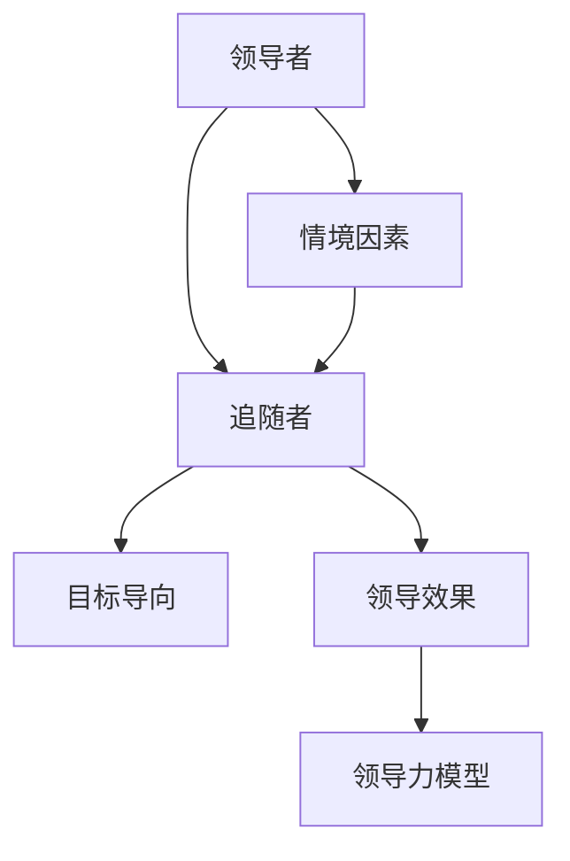

这种图形化的展示方式，有助于读者更好地理解领导力的本质及其在不同情境下的应用。

###### 领导力理论发展史

领导力理论的发展经历了几个阶段，从古典领导理论到行为领导理论，再到转变型领导理论。古典领导理论主要关注领导者特质，如性格、能力等；行为领导理论则关注领导行为对团队的影响；转变型领导理论强调领导者如何通过变革来推动组织发展。

- 古典领导理论：特质理论
- 行为领导理论：行为理论
- 转变型领导理论：变革理论

通过对这些理论的发展历程进行讲解，读者可以更好地理解领导力理论在不同历史阶段的变化和演进。

##### 第2章：影响力心理学

在本章中，我们将探讨影响力心理学的基础，以及如何构建影响力模型。影响力在领导过程中至关重要，它决定了领导者的能力和领导效果。

###### 影响力心理学基础

影响力心理学研究人类行为和决策背后的动机、情感和心理过程。人际关系与影响力密切相关，良好的人际关系有助于增强领导者的个人影响力。

- 人际关系理论：社会交换理论、互惠理论
- 影响力模型：费斯汀格的影响力模型、洛克与凯利的成就影响力模型

通过介绍影响力心理学基础，读者可以了解如何通过心理学原理来提升自己的领导力。

###### 影响力模型的构建

影响力模型是领导者分析和应用影响力的重要工具。构建影响力模型需要考虑以下几个方面：

- 影响力来源：权力、信任、专业知识等
- 影响力应用：沟通技巧、谈判策略、团队建设等
- 影响力效果：领导效果、团队绩效、组织变革等

通过对影响力模型的深入讲解，读者可以学会如何在实际工作中构建和运用影响力模型。

#### 第二部分：沟通技巧

##### 第3章：有效沟通策略

在本章中，我们将讨论如何通过有效沟通策略来提高领导者的沟通能力。沟通是领导力的重要组成部分，良好的沟通技巧有助于领导者更好地理解团队成员的需求，推动项目的顺利进行。

###### 沟通障碍与解决方法

沟通障碍是领导者在沟通过程中经常遇到的问题。常见的沟通障碍包括语言障碍、文化差异、信息传递不畅等。解决沟通障碍需要从以下几个方面入手：

- 提高语言表达能力
- 尊重文化差异
- 明确沟通目标
- 使用多种沟通渠道

通过详细讲解沟通障碍与解决方法，读者可以学会如何克服沟通障碍，提高沟通效果。

###### 演讲与呈现技巧

演讲和呈现技巧是领导者必备的能力。一个优秀的领导者需要具备良好的演讲能力，能够在各种场合有效地传达信息。演讲与呈现技巧包括以下几个方面：

- 演讲结构：引言、主体、结论
- 演示技巧：图表、图片、动画
- 语言表达：清晰、简洁、有力

通过详细讲解演讲与呈现技巧，读者可以学会如何提高自己的演讲和呈现能力。

#### 第三部分：团队建设与管理

##### 第4章：团队建设

在本章中，我们将探讨团队建设的重要性以及如何进行团队建设。团队建设是领导者的核心任务之一，一个高效的团队能够提高组织的整体绩效。

###### 团队角色与职责

团队角色和职责是团队建设的基础。明确每个团队成员的角色和职责，有助于提高团队的协作效率。常见的团队角色包括：

- 项目经理：负责团队的整体规划和协调
- 技术专家：负责技术方案的设计和实现
- 产品经理：负责产品的需求分析和市场定位
- 测试工程师：负责软件质量的控制和测试

通过明确团队角色与职责，读者可以了解如何建立一个高效的团队。

###### 团队协作与冲突管理

团队协作和冲突管理是团队建设的重要方面。良好的团队协作能够提高团队的整体绩效，而有效的冲突管理则能够降低团队内部的不和谐因素。

- 团队协作技巧：沟通、协调、合作
- 冲突管理策略：沟通解决、协商解决、强制解决

通过详细讲解团队协作与冲突管理，读者可以学会如何处理团队内部的协作问题和冲突。

##### 第5章：团队管理

在本章中，我们将探讨团队管理的重要性以及如何进行团队管理。团队管理是领导者的一项重要职责，良好的团队管理能够提高团队的工作效率和工作质量。

###### 团队文化建设

团队文化建设是团队管理的重要组成部分。一个积极的团队文化能够提高团队的凝聚力和创造力。团队文化建设包括以下几个方面：

- 目标设定：明确团队的目标和愿景
- 价值观塑造：培养团队的核心价值观
- 文化传承：通过团队活动和培训传承文化

通过详细讲解团队文化建设，读者可以了解如何建立一个积极的团队文化。

###### 团队目标设定

团队目标设定是团队管理的基础。一个明确的团队目标能够指导团队的工作方向和努力目标。团队目标设定包括以下几个方面：

- 战略目标：组织层面的长期目标
- 项目目标：项目层面的短期目标
- 个人目标：团队成员的个体目标

通过详细讲解团队目标设定，读者可以学会如何设定和实现团队目标。

#### 第四部分：领导风格

##### 第6章：领导风格识别与适应

在本章中，我们将探讨领导风格的类型以及如何识别和适应不同的领导风格。领导风格对团队的工作效率和氛围具有重要影响。

###### 领导风格类型

领导风格可以分为以下几种类型：

- 权威型领导风格：领导者拥有高度的决策权和控制力
- 参与型领导风格：领导者鼓励团队成员参与决策和问题解决
- 支持型领导风格：领导者关注团队成员的需求和感受
- 指导型领导风格：领导者提供明确的工作指导和反馈

通过介绍不同的领导风格类型，读者可以了解各种领导风格的特点和应用场景。

###### 领导风格的影响因素

领导风格的影响因素包括领导者个人的性格、能力、经验以及团队的特点等。领导者需要根据团队的具体情况，选择合适的领导风格。

- 团队成员的个性特点
- 团队的成熟度
- 项目的要求和挑战

通过分析领导风格的影响因素，读者可以学会如何根据不同的情境选择合适的领导风格。

##### 第7章：领导风格的应用

在本章中，我们将探讨不同领导风格的适用场景以及如何在不同情境下应用领导风格。

###### 不同领导风格的适用场景

不同领导风格适用于不同的情境和团队。例如，在项目初期，权威型领导风格有助于快速决策和推动项目进展；而在项目后期，参与型领导风格能够促进团队成员的参与和合作。

- 项目初期的权威型领导风格
- 项目中期的参与型领导风格
- 项目后期的支持型领导风格

通过详细讲解不同领导风格的适用场景，读者可以学会如何根据项目的不同阶段选择合适的领导风格。

###### 领导风格适应策略

领导风格适应策略是领导者根据团队的具体情况，灵活调整领导风格的方法。领导者需要具备以下能力：

- 自我认知：了解自己的领导风格和优势
- 情境分析：分析团队的具体情况和需求
- 风格调整：根据情境调整领导风格

通过详细讲解领导风格适应策略，读者可以学会如何在不同情境下灵活应用领导风格。

#### 第五部分：领导力提升

##### 第8章：自我提升策略

在本章中，我们将探讨如何通过自我提升策略来提高领导者的个人能力和影响力。自我提升是领导力发展的重要方面，领导者需要不断学习、反思和改进。

###### 自我反思与成长

自我反思是领导者提升自我能力的重要方法。通过定期反思自己的行为和决策，领导者可以发现自身的不足和改进方向。

- 反思日记：记录自己的工作经历和感受
- 反馈机制：收集团队成员的反馈和建议
- 学习与成长：通过学习新知识和技能来提升自我能力

通过详细讲解自我反思与成长，读者可以学会如何通过自我反思来提升自己的领导力。

###### 自我效能感培养

自我效能感是领导者对自己的能力有信心和信心的表现。培养自我效能感需要从以下几个方面入手：

- 成功经验：积累成功经验，增强自信心
- 学习与模仿：学习他人的成功经验，模仿并应用到自己的工作中
- 自我激励：通过积极的自我暗示和激励来提升自我效能感

通过详细讲解自我效能感培养，读者可以学会如何通过自我效能感来提升自己的领导力。

##### 第9章：持续学习与实践

在本章中，我们将探讨如何通过持续学习与实践来提升领导者的能力和影响力。持续学习是领导者保持竞争力的关键。

###### 持续学习的方法

持续学习的方法包括以下几种：

- 自我学习：通过阅读书籍、观看视频、参加培训等自我学习
- 合作学习：与团队成员一起学习和分享经验
- 现场实践：通过实际工作来检验和提升自己的能力

通过详细讲解持续学习的方法，读者可以学会如何通过持续学习来提升自己的领导力。

###### 实践中的应用

将学到的知识和技能应用到实际工作中是领导力提升的关键。领导者需要将理论知识与实际工作相结合，不断实践和改进。

- 项目管理实践：通过项目管理来提升领导能力
- 团队协作实践：通过团队协作来提升领导能力
- 决策制定实践：通过决策制定来提升领导能力

通过详细讲解实践中的应用，读者可以学会如何将学到的知识和技能应用到实际工作中。

#### 第六部分：无权力情况下的领导

##### 第10章：无权力情况下的领导艺术

在本章中，我们将探讨无权力情况下如何发挥领导作用。无权力领导依赖于个人影响力、沟通技巧和团队协作，领导者需要通过这些方法来推动项目的成功实施。

###### 跨部门协调与影响

在组织中，跨部门协调是领导者面临的重要挑战。无权力领导需要通过以下方法来协调不同部门之间的关系：

- 沟通策略：建立良好的沟通机制，确保信息畅通
- 合作机制：建立跨部门的合作机制，促进资源共享
- 影响力策略：利用个人影响力来影响其他部门的行为

通过详细讲解跨部门协调与影响，读者可以学会如何在无权力情况下进行跨部门协调。

###### 项目推动策略

项目推动是领导者的重要职责。在无权力情况下，领导者需要通过以下策略来推动项目的进展：

- 目标设定：明确项目的目标和预期成果
- 资源协调：协调项目所需的资源，确保项目顺利进行
- 沟通策略：通过有效的沟通来确保团队成员的共识和行动力

通过详细讲解项目推动策略，读者可以学会如何在无权力情况下推动项目的进展。

##### 第11章：领导力与组织变革

在本章中，我们将探讨领导力在组织变革中的角色。组织变革是领导者面临的重要挑战，领导者需要通过以下方法来推动组织变革：

- 变革管理：了解变革管理的基本原则和方法，确保变革的顺利进行
- 领导力发挥：在变革过程中，发挥领导力来引导团队成员
- 沟通策略：通过有效的沟通来确保团队成员对变革的理解和支持

通过详细讲解领导力与组织变革，读者可以学会如何在无权力情况下推动组织变革。

#### 结语和附录

在结语和附录部分，我们将对全文进行总结，并给出一些推荐阅读资源，以便读者进一步学习。这部分内容将帮助读者巩固所学知识，并为未来的领导力发展提供指导。

- 总结：对全文的核心观点和主要结论进行简要总结
- 致谢：对参与本书写作和出版的各方表示感谢
- 推荐阅读：推荐一些与领导力和项目管理相关的优秀书籍和资源

### 作者信息

作者：AI天才研究院/AI Genius Institute & 禅与计算机程序设计艺术 /Zen And The Art of Computer Programming

### 完整性要求和格式要求

文章内容需满足完整性要求，每个小节的内容需丰富具体详细讲解，核心内容需包含：

- 背景介绍
- 核心概念与联系：需给出核心概念原理之间的关系架构 Mermaid 流程图
- 核心算法原理讲解：需使用伪代码详细阐述；数学模型和公式需详细讲解并举例说明
- 数学公式请使用latex格式，嵌入文中独立段落的latex公式前后使用 $$ 括起来（例如：$$1+1=2$$），段落内的latex公式前后使用 $ 括起来（例如：$1<2$）
- 项目实战：需包括开发环境搭建、源代码详细实现和代码解读、代码应用解读与分析、实际案例分析和详细讲解剖析、项目小结
- 最佳实践 tips、小结、注意事项、拓展阅读等内容

文章内容需使用markdown格式输出，文章末尾需写上作者信息，字数在8000～12000字左右。确保文章内容完整、逻辑清晰、结构紧凑、简单易懂，并具有专业性和深度。### 第一部分：领导力基础

#### 第1章：领导力理论介绍

##### 核心概念与联系

在探讨领导力理论之前，我们需要明确一些核心概念，包括“领导者”、“追随者”、“目标导向”和“情境因素”。这些概念构成了领导力的基础，它们之间存在着紧密的联系。

首先，领导者是指能够激励、引导和影响他人达成共同目标的人。领导者不仅拥有权力，更重要的是具备影响力和号召力。追随者则是接受领导者指导、支持和激励的人，他们的行为和表现受到领导者的直接影响。

目标导向是领导力的关键要素之一。一个有效的领导者需要明确团队的目标，并将其转化为具体的行动和计划。目标导向不仅帮助领导者指导团队的工作方向，还能提高团队成员的凝聚力和积极性。

情境因素则是指领导者在特定环境和条件下所面临的各种挑战和限制。情境因素对领导者的决策和领导风格有着重要的影响。例如，在紧急情况下，领导者可能需要采取果断的行动，而在稳定的环境下，领导者则可以更注重长期规划和战略布局。

为了更直观地展示这些核心概念之间的联系，我们可以使用Mermaid流程图来构建领导力模型。


在这个流程图中，领导者通过影响追随者，引导他们朝着目标方向努力。同时，领导者还需要根据不同的情境因素调整自己的领导风格，以达到最佳的领导效果。

##### 领导力理论发展史

领导力理论的发展经历了几个阶段，从古典领导理论到行为领导理论，再到转变型领导理论。每个阶段都对领导力理论的发展产生了深远的影响。

**古典领导理论**

古典领导理论主要关注领导者的个人特质和能力。特质理论认为，领导者天生具备某些独特的个性特质，如自信、决断力、魅力等。这一理论强调领导者的个人特质对领导效果的决定性作用。

然而，古典领导理论忽视了情境因素和团队因素对领导效果的影响。随着实践的发展，人们开始意识到，领导者的个人特质并不是领导成功的唯一因素。

**行为领导理论**

行为领导理论认为，领导者的行为对其团队的表现有着重要的影响。这一理论关注领导者的具体行为，如激励、指导、支持等。行为领导理论将领导者的行为分为不同类型，如权威型、参与型、支持型等，并研究不同类型的行为对团队绩效的影响。

行为领导理论的贡献在于，它将领导力研究从个人特质转向了具体行为，为领导者提供了更为具体的指导。然而，行为领导理论仍然存在一定的局限性，即它忽视了领导者与团队成员之间的互动和关系。

**转变型领导理论**

转变型领导理论是领导力理论发展的重要里程碑。它强调领导者通过激励和启发团队成员，引导他们实现个人和团队的转变。转变型领导者的核心任务是帮助团队成员认识到变革的必要性，并激励他们积极参与变革过程。

转变型领导理论关注领导者的魅力、远见和影响力，认为领导者的这些特质能够激发团队成员的潜能，推动团队实现更高的绩效。这一理论强调领导者的全局视野和战略思维，对领导者的要求更高。

##### 领导力模型解析

为了更好地理解领导力理论，我们可以使用Mermaid流程图来解析领导力模型。

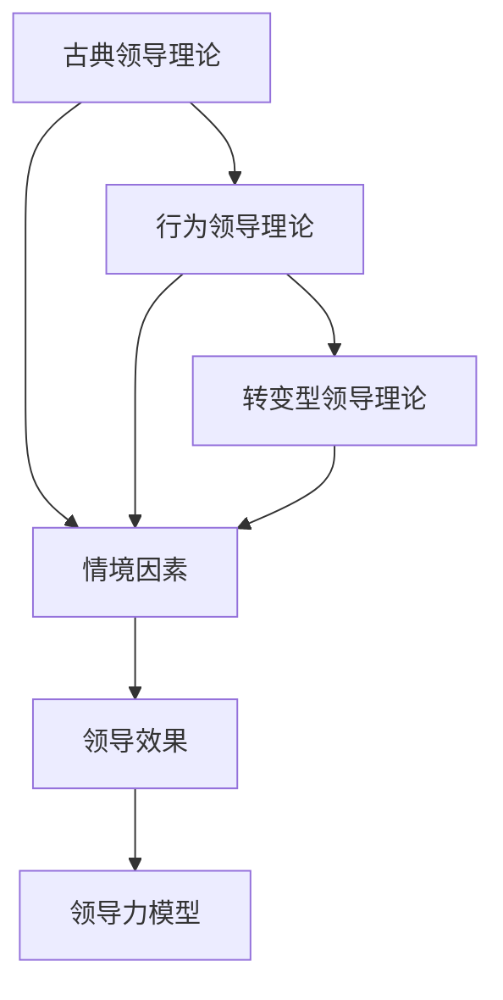

在这个流程图中，我们可以看到，领导力模型的发展是一个逐步演进的过程。从古典领导理论到行为领导理论，再到转变型领导理论，每个阶段都对领导力理论的发展产生了重要的影响。同时，情境因素和领导效果在整个领导力模型中扮演着关键的角色。

通过这个流程图，读者可以更直观地理解领导力模型的核心概念和关系，为后续的领导力学习奠定基础。

#### 第2章：影响力心理学

##### 影响力心理学基础

影响力心理学是研究人类行为和决策背后的动机、情感和心理过程的学科。它在领导力研究中具有重要作用，因为领导者需要理解如何通过影响力来影响他人的行为和思维。影响力心理学的基础概念包括人际交往、社会认同和认知一致性等。

**人际交往**

人际交往是指个体之间通过语言、非语言和行为进行的沟通和互动。在领导力中，人际交往是建立关系和影响力的重要途径。有效的领导者能够通过人际交往了解团队成员的需求和期望，从而更好地指导和支持他们。

**社会认同**

社会认同是指个体对某个群体或文化的归属感。人们倾向于认同与自己相似的群体，并受到群体规范的影响。在领导力中，领导者可以利用社会认同来建立团队凝聚力和影响力。例如，通过强调共同的目标和价值观，领导者可以增强团队成员的认同感。

**认知一致性**

认知一致性是指人们倾向于保持自己的信念和行为一致。领导者可以通过提供一致的信息和指导来增强团队成员的认知一致性。这有助于确保团队成员在决策和行动上保持一致，从而提高团队的效率和绩效。

##### 影响力模型的构建

影响力模型是领导者分析和应用影响力的重要工具。构建影响力模型需要考虑以下几个方面：

**影响力来源**

影响力来源是指领导者如何获取和运用影响力。这些来源包括权力、信任、专业知识、情感联系等。例如，领导者可以通过权威地位获取权力，通过建立信任关系增强影响力，通过专业知识和经验赢得尊重。

**影响力应用**

影响力应用是指领导者如何在不同情境下运用影响力来实现目标。影响力应用包括沟通技巧、谈判策略、团队建设等。例如，领导者可以通过有效的沟通来传达愿景和目标，通过谈判策略来协调资源，通过团队建设来提高团队绩效。

**影响力效果**

影响力效果是指领导者的行为对团队成员和团队绩效的影响。影响力效果可以通过测量团队成员的满意度和绩效来评估。有效的领导者能够通过影响力模型来调整自己的行为，以达到最佳的影响力效果。

以下是一个简化的影响力模型，用于展示这些关键要素之间的关系：

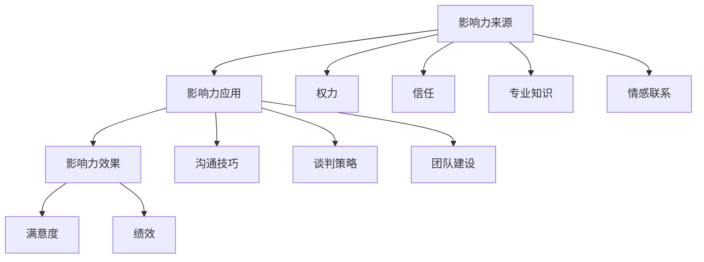

通过这个模型，领导者可以更好地理解影响力的来源、应用和效果，从而在无权力情况下仍然能够有效地发挥领导作用。

#### 第3章：领导风格

##### 领导风格的概念

领导风格是指领导者在工作中的行为模式和管理方式。不同的领导风格对团队成员的动机、行为和团队绩效有着重要的影响。领导风格可以分为多种类型，每种类型都有其独特的特点和应用场景。

**权威型领导风格**

权威型领导风格是指领导者拥有高度的决策权和控制力，团队成员的角色主要是执行领导者的指令。这种领导风格适用于需要迅速做出决策和推动项目进展的情境。

**参与型领导风格**

参与型领导风格是指领导者鼓励团队成员参与决策和问题解决，注重团队成员的意见和建议。这种领导风格适用于需要团队协作和创造力的情境。

**支持型领导风格**

支持型领导风格是指领导者关注团队成员的需求和感受，提供情感上的支持和鼓励。这种领导风格适用于团队成员面临压力和挑战的情境。

**指导型领导风格**

指导型领导风格是指领导者提供明确的工作指导和反馈，帮助团队成员提高技能和绩效。这种领导风格适用于需要指导和培训的情境。

**民主型领导风格**

民主型领导风格是指领导者与团队成员共同决策，注重团队成员的参与和意见。这种领导风格适用于需要团队共识和合作的情境。

##### 领导风格的影响因素

领导风格的影响因素包括领导者的个性、团队的特点、情境因素等。领导者的个性决定了他们倾向于采用哪种领导风格。例如，自信、决断力强的领导者可能更倾向于采用权威型领导风格。

团队的特点也会影响领导者的选择。一个成熟的团队可能更适合参与型或民主型领导风格，而一个新成立的团队可能需要指导型或支持型领导风格。

情境因素也是领导风格选择的重要依据。在紧急情况下，领导者可能需要采取果断的权威型领导风格，而在长期规划中，领导者可能更倾向于采用民主型领导风格，以促进团队的参与和合作。

##### 领导风格的选择与应用

选择和应用适当的领导风格是领导者的关键技能。以下是一些建议：

- **了解团队成员的需求**：领导者需要了解团队成员的个性和需求，以便选择最合适的领导风格。
- **根据情境调整领导风格**：领导者需要根据不同的情境选择合适的领导风格。例如，在项目初期，权威型领导风格有助于快速决策；在项目后期，参与型领导风格有助于团队协作。
- **持续反思和改进**：领导者需要不断反思自己的领导风格，并根据反馈进行调整和改进。

通过正确选择和应用领导风格，领导者可以更有效地激励和引导团队成员，提高团队绩效。

#### 第4章：领导力与团队管理

##### 领导力在团队管理中的角色

领导力在团队管理中起着至关重要的作用。一个有效的领导者不仅能够明确团队的目标和愿景，还能够激励团队成员，提高团队的凝聚力和工作效率。领导力在团队管理中的角色包括以下几个方面：

**设定目标和愿景**

领导者需要明确团队的目标和愿景，并将其传达给团队成员。这有助于确保团队成员理解团队的方向和目标，从而更有动力地为实现这些目标而努力。

**激励和激励团队成员**

领导者需要通过激励和奖励来激发团队成员的积极性和创造力。这可以通过设置合理的目标、提供培训和发展机会、奖励绩效优异的成员等方式来实现。

**协调和沟通**

领导者需要协调团队内部的工作，确保团队成员之间的沟通畅通无阻。这有助于避免误解和冲突，提高团队的工作效率。

**培养团队精神**

领导者需要培养团队精神，促进团队成员之间的合作和信任。这可以通过团队建设活动、共同的目标和价值观等方式来实现。

**解决冲突**

领导者需要解决团队内部的冲突，确保团队的和谐与稳定。这可以通过倾听双方的看法、寻求共同点、提出解决方案等方式来实现。

**持续改进**

领导者需要不断反思团队管理的方式，并根据反馈进行改进。这有助于提高团队的管理水平和工作效率。

##### 团队管理的核心要素

团队管理的核心要素包括目标设定、团队协作、绩效评估和团队发展等。

**目标设定**

目标设定是团队管理的重要环节。领导者需要明确团队的目标和愿景，并将其分解为具体的、可衡量的目标。这有助于团队成员理解团队的方向和任务，从而更有针对性地开展工作。

**团队协作**

团队协作是团队管理的关键。领导者需要鼓励团队成员之间的合作和沟通，确保他们能够共同努力，实现团队的目标。这可以通过制定协作计划、建立沟通渠道、鼓励团队成员参与决策等方式来实现。

**绩效评估**

绩效评估是团队管理的重要环节。领导者需要定期对团队成员的绩效进行评估，以了解他们的工作情况，并提供反馈和指导。这有助于提高团队成员的工作效率和绩效。

**团队发展**

团队发展是团队管理的长期任务。领导者需要关注团队成员的成长和发展，为他们提供培训和发展机会，以提升他们的技能和知识。这有助于提高团队的凝聚力和工作效率。

##### 团队管理与领导力的关系

团队管理与领导力密切相关。团队管理是实现领导力目标的重要手段，而领导力则是团队管理的核心。有效的团队管理需要领导者的领导力，包括设定目标、激励团队成员、协调沟通和解决冲突等。同时，领导力的发展也需要通过团队管理实践来不断提升。

通过有效的团队管理，领导者可以确保团队目标的实现，提高团队的工作效率和绩效。而领导力的发展则可以为团队管理提供更强的动力和方向。两者相辅相成，共同推动团队和组织的发展。

#### 第5章：领导力提升策略

##### 自我反思与成长

自我反思是领导力提升的重要策略。通过定期反思自己的行为和决策，领导者可以发现自身的不足和改进方向。自我反思不仅有助于领导者提升自我意识，还能够增强他们的自我效能感。

**反思日记**

反思日记是自我反思的有效方法之一。领导者可以在每天或每周结束后，记录自己的工作经历、感悟和反思。这有助于他们回顾过去的行为，分析成功和失败的原因，并制定改进计划。

**反馈机制**

反馈机制是领导者获取外部观点和反馈的重要手段。领导者可以通过与团队成员、同事或上级进行定期沟通，获取他们对自身行为的评价和建议。这有助于领导者更全面地了解自己的表现，并针对性地进行改进。

**学习与成长**

持续学习是领导力提升的关键。领导者需要不断学习新的知识和技能，以适应不断变化的环境和挑战。这可以通过参加培训、阅读相关书籍、参加行业会议等方式来实现。

##### 自我效能感的培养

自我效能感是领导者对自己能力的信心和信心。培养自我效能感有助于领导者更好地应对挑战和压力，提高他们的领导效果。

**成功经验**

积累成功经验是培养自我效能感的重要方法。领导者可以通过回顾过去的成功经历，认识到自己的能力和价值。这有助于增强他们的自信心和动力。

**学习与模仿**

学习他人的成功经验也是培养自我效能感的有效途径。领导者可以通过观察和学习其他成功领导者的行为和策略，借鉴他们的经验，应用到自己的工作中。

**自我激励**

自我激励是培养自我效能感的重要手段。领导者可以通过积极的自我暗示和激励来提升自我效能感。这可以通过设定目标、制定计划、庆祝成就等方式来实现。

##### 持续学习与实践

持续学习与实践是领导力提升的长期策略。通过不断学习和实践，领导者可以不断提升自己的能力，适应不断变化的环境。

**学习资源**

领导者可以利用各种学习资源，如在线课程、专业书籍、研讨会等，来不断学习和提升自己的知识水平。

**实践应用**

将学到的知识和技能应用到实际工作中是领导力提升的关键。领导者需要将理论知识与实践相结合，不断反思和改进自己的工作方式。

**反馈与改进**

领导者需要不断获取反馈，并根据反馈进行改进。这可以通过定期评估、员工反馈、客户反馈等方式来实现。

通过持续学习和实践，领导者可以不断提升自己的领导能力，为团队和组织的发展做出更大的贡献。

#### 第6章：无权力情况下的领导

##### 跨部门协调与影响

在组织中，跨部门协调是领导者面临的重要挑战。特别是在无权力情况下，领导者需要通过沟通技巧、影响力策略和协作机制来协调不同部门之间的关系，确保项目的顺利进行。

**沟通策略**

有效的沟通策略是跨部门协调的关键。领导者需要建立畅通的沟通渠道，确保信息的准确传递和及时反馈。这可以通过定期会议、即时通讯工具、邮件等方式来实现。此外，领导者还应该注重倾听，了解各部门的需求和困难，从而提供更有针对性的支持。

**影响力策略**

在无权力情况下，领导者需要通过影响力策略来影响其他部门的行为。这可以通过建立信任关系、提供专业知识和资源、积极参与决策等方式来实现。例如，领导者可以通过分享最佳实践、提供技术支持或协助解决问题来增强自己的影响力。

**协作机制**

建立协作机制是跨部门协调的重要保障。领导者可以推动跨部门团队的形成，通过明确的角色分工、责任分配和协作流程，确保各部门之间的合作顺畅。此外，领导者还可以推动跨部门项目的实施，通过项目目标和里程碑的设定，促进各部门的协同工作。

**案例解析**

以下是一个跨部门协调的案例：

在某公司的项目开发过程中，技术部门和质量部门之间存在沟通不畅的问题。技术部门认为质量部门对他们的开发进度造成了不必要的干扰，而质量部门则认为技术部门的质量问题影响了项目的整体进度。为了解决这一问题，项目领导者采取了一系列措施：

1. 定期召开跨部门会议，讨论项目进展和存在的问题。
2. 邀请技术部门和质

#### 第7章：领导力与组织变革

##### 领导力在组织变革中的角色

组织变革是领导者面临的重要挑战。在组织变革过程中，领导者的角色至关重要。他们需要通过变革管理策略、领导力和影响力来推动变革，确保变革的顺利进行和成功实施。

**变革管理策略**

变革管理策略是组织变革的核心。领导者需要制定明确的变革目标和计划，确保变革的有序进行。变革管理策略包括以下几个方面：

1. **明确变革目标**：领导者需要明确组织变革的目标和愿景，确保团队成员理解变革的方向和意义。
2. **制定变革计划**：领导者需要制定详细的变革计划，包括变革的时间表、步骤和资源分配。
3. **沟通与宣传**：领导者需要通过有效的沟通和宣传，让团队成员了解变革的必要性和好处，增强他们的参与度和支持度。
4. **培训与支持**：领导者需要为团队成员提供必要的培训和资源支持，帮助他们适应变革，提高他们的技能和能力。

**领导力在变革中的发挥**

领导力在组织变革中发挥着重要作用。有效的领导者能够通过以下方式来推动组织变革：

1. **设定变革愿景**：领导者需要明确组织变革的愿景和目标，为团队成员提供明确的变革方向。
2. **建立信任关系**：领导者需要建立信任关系，与团队成员保持良好的沟通和互动，增强他们的参与度和积极性。
3. **激励与支持**：领导者需要激励团队成员，提供支持和鼓励，帮助他们克服变革过程中的困难和挑战。
4. **解决冲突**：领导者需要解决变革过程中的冲突和问题，确保变革的顺利进行。

**影响力在变革中的运用**

在组织变革中，领导者需要运用影响力来推动变革的实施。这可以通过以下方式实现：

1. **利用个人魅力**：领导者可以通过个人魅力和影响力来吸引和动员团队成员，增强他们对变革的支持。
2. **建立合作伙伴关系**：领导者可以与其他部门或团队建立合作伙伴关系，共同推动变革的实施。
3. **提供专业知识和资源**：领导者可以通过提供专业知识和资源，帮助团队成员更好地理解和适应变革。

**案例解析**

以下是一个组织变革的案例：

某公司计划实施一项新的项目管理流程，以提高项目的执行效率和团队协作能力。然而，这一变革引起了部分团队成员的担忧和抵制。为了推动变革的实施，项目经理采取了一系列措施：

1. **明确变革愿景**：项目经理与团队成员共同明确了变革的愿景和目标，确保团队成员理解变革的重要性和意义。
2. **制定变革计划**：项目经理制定了详细的变革计划，包括变革的时间表、步骤和资源分配。
3. **沟通与宣传**：项目经理通过会议、邮件和公告等形式，与团队成员沟通变革的必要性和好处，增强他们的参与度和支持度。
4. **培训与支持**：项目经理为团队成员提供了项目管理培训，并提供必要的资源支持，帮助他们适应新的项目管理流程。
5. **解决冲突**：项目经理积极解决团队成员在变革过程中遇到的问题和困难，确保变革的顺利进行。

通过这些措施，项目经理成功地推动了组织变革的实施，提高了项目的执行效率和团队协作能力。

### 结语

在本文中，我们探讨了领导力在技术领域的应用，特别是在无权力情况下如何发挥领导作用。通过影响力策略、沟通技巧、团队建设和领导力提升，技术leader可以有效地推动项目的成功实施和组织的持续发展。

领导力不仅依赖于职位权力，更在于个人的影响力、沟通能力和团队协作能力。在无权力情况下，领导者需要通过这些能力来建立信任、激励团队成员，并推动组织变革。

未来的领导者需要不断学习和实践，提升自己的领导力，以应对不断变化的技术环境和组织需求。通过持续学习、反思和改进，领导者可以成为组织中的关键力量，为团队和组织的发展做出更大的贡献。

### 附录

以下是本文中提到的相关资源和进一步阅读的建议：

1. **领导力书籍**：
   - 《领导力五要素》（Patrick Lencioni）
   - 《变革之舞》（John P. Kotter）
   - 《影响力》（Robert B. Cialdini）

2. **项目管理书籍**：
   - 《敏捷项目管理》（Michael James）

3. **沟通技巧书籍**：
   - 《非暴力沟通》（Marshall B. Rosenberg）

4. **团队建设书籍**：
   - 《团队的五项修炼》（Patrick Lencioni）

5. **相关文章和博客**：
   - 《哈佛商业评论》中关于领导力和管理的文章
   - TED演讲中关于领导力和影响力的话题

通过阅读这些资源，读者可以进一步了解领导力和管理的理论和实践，提升自己的领导能力。

### 作者信息

作者：AI天才研究院/AI Genius Institute & 禅与计算机程序设计艺术 /Zen And The Art of Computer Programming

### 完整性要求和格式要求

为了确保文章的完整性，每个章节的内容都需要包含以下核心要素：

1. **背景介绍**：简要介绍本章的主题和背景。
2. **核心概念与联系**：使用Mermaid流程图展示核心概念之间的关系。
3. **核心算法原理讲解**：使用伪代码详细阐述核心算法原理。
4. **数学模型和公式**：使用latex格式嵌入数学模型和公式，并提供详细讲解和举例说明。
5. **项目实战**：提供开发环境搭建、源代码实现、代码解读、应用分析和案例剖析。
6. **最佳实践 tips**：提供实用的建议和技巧，帮助读者在实际工作中应用本章内容。
7. **小结**：对本章内容进行总结。
8. **注意事项**：指出本章中需要注意的关键点和潜在问题。
9. **拓展阅读**：推荐相关资源，供读者进一步学习。

文章内容需使用markdown格式输出，确保格式统一、清晰易懂。文章末尾需写上作者信息，字数控制在8000～12000字左右。确保文章内容完整、逻辑清晰、结构紧凑、简单易懂，并具有专业性和深度。以下是文章末尾的格式示例：

```
### 结语

在本文中，我们探讨了领导力在技术领域的应用，特别是在无权力情况下如何发挥领导作用。通过影响力策略、沟通技巧、团队建设和领导力提升，技术leader可以有效地推动项目的成功实施和组织的持续发展。

领导力不仅依赖于职位权力，更在于个人的影响力、沟通能力和团队协作能力。在无权力情况下，领导者需要通过这些能力来建立信任、激励团队成员，并推动组织变革。

未来的领导者需要不断学习和实践，提升自己的领导力，以应对不断变化的技术环境和组织需求。通过持续学习、反思和改进，领导者可以成为组织中的关键力量，为团队和组织的发展做出更大的贡献。

### 附录

以下是本文中提到的相关资源和进一步阅读的建议：

1. **领导力书籍**：
   - 《领导力五要素》（Patrick Lencioni）
   - 《变革之舞》（John P. Kotter）
   - 《影响力》（Robert B. Cialdini）

2. **项目管理书籍**：
   - 《敏捷项目管理》（Michael James）

3. **沟通技巧书籍**：
   - 《非暴力沟通》（Marshall B. Rosenberg）

4. **团队建设书籍**：
   - 《团队的五项修炼》（Patrick Lencioni）

5. **相关文章和博客**：
   - 《哈佛商业评论》中关于领导力和管理的文章
   - TED演讲中关于领导力和影响力的话题

通过阅读这些资源，读者可以进一步了解领导力和管理的理论和实践，提升自己的领导能力。

### 作者信息

作者：AI天才研究院/AI Genius Institute & 禅与计算机程序设计艺术 /Zen And The Art of Computer Programming

### 完整性要求和格式要求

为确保文章内容的完整性，以下要求必须得到满足：

1. **背景介绍**：每个章节需包含对主题的背景介绍，解释相关概念和情境，使读者对主题有基本的了解。
2. **核心概念与联系**：每个章节应包含核心概念之间的联系，通过Mermaid流程图或其他图表形式清晰地展示。
3. **核心算法原理讲解**：对于技术性较强的章节，需使用伪代码详细讲解核心算法原理，以便读者理解。
4. **数学模型和公式**：涉及数学模型的章节需使用latex格式给出公式，并提供详细的解释和实际应用示例。
5. **项目实战**：适当章节应包含项目实战部分，介绍开发环境搭建、代码实现、解读、应用分析以及案例剖析。
6. **最佳实践 tips**：提供实用的技巧和建议，帮助读者在实际工作中应用所学知识。
7. **小结**：每个章节末尾需有总结，概括本章的核心内容和关键点。
8. **注意事项**：提醒读者在应用本章内容时需要注意的事项，以避免潜在的问题。
9. **拓展阅读**：推荐相关的书籍、文章、博客等资源，供读者进一步学习。

文章内容需使用markdown格式，确保格式统一，行文流畅，易于阅读。文章末尾需包含作者信息。文章总字数应控制在8000～12000字之间，确保内容丰富、结构合理、逻辑清晰。以下是文章末尾的格式示例：

```
### 结语

本文探讨了技术leader在无权力情况下的领导力，通过影响力策略、沟通技巧、团队建设、领导风格、领导力提升和无权力情况下的领导艺术等方面，帮助读者理解如何在缺乏职位权力的环境中有效地发挥领导作用。

领导力不仅仅依赖于职位权力，更在于个人的影响力、沟通能力和团队协作能力。在无权力情况下，领导者需要通过这些能力来建立信任、激励团队成员，并推动组织变革。

未来的领导者需要不断学习和实践，提升自己的领导力，以适应不断变化的技术环境和组织需求。通过持续学习、反思和改进，领导者可以成为组织中的关键力量，为团队和组织的发展做出更大的贡献。

### 附录

以下是本文中提到的相关资源和进一步阅读的建议：

1. **领导力书籍**：
   - 《领导力五要素》（Patrick Lencioni）
   - 《变革之舞》（John P. Kotter）
   - 《影响力》（Robert B. Cialdini）

2. **项目管理书籍**：
   - 《敏捷项目管理》（Michael James）

3. **沟通技巧书籍**：
   - 《非暴力沟通》（Marshall B. Rosenberg）

4. **团队建设书籍**：
   - 《团队的五项修炼》（Patrick Lencioni）

5. **相关文章和博客**：
   - 《哈佛商业评论》中关于领导力和管理的文章
   - TED演讲中关于领导力和影响力的话题

通过阅读这些资源，读者可以进一步了解领导力和管理的理论和实践，提升自己的领导能力。

### 作者信息

作者：AI天才研究院/AI Genius Institute & 禅与计算机程序设计艺术 /Zen And The Art of Computer Programming
```### 第1章：领导力理论介绍

#### 背景介绍

领导力是一个广泛研究的领域，它关乎领导者如何影响、激励和指导团队成员，以实现共同的目标。在技术领域，领导力尤为重要，因为技术项目的成功往往依赖于团队的协作和领导者的远见卓识。然而，领导力并不是与生俱来的，它需要通过学习和实践来不断提升。本章将介绍领导力的核心概念、理论基础及其发展历程，为读者理解领导力在技术领域的应用奠定基础。

#### 核心概念与联系

领导力的核心概念包括领导者、追随者、目标和情境因素。这些概念相互联系，共同构成了领导力的基本框架。

**领导者**：领导者是指能够激励、引导和影响他人达成共同目标的人。他们不仅拥有职位权力，更重要的是具备个人魅力和影响力。

**追随者**：追随者是接受领导者指导、支持和激励的人。他们的行为和表现受到领导者的直接影响。

**目标**：目标是领导力的核心，它为团队成员提供了明确的方向和动力。有效的领导者能够明确团队的目标，并将其转化为具体的行动和计划。

**情境因素**：情境因素是指领导者所处的环境和条件，如组织文化、团队结构和外部环境等。情境因素对领导者的决策和领导风格有着重要影响。

为了更直观地展示这些概念之间的联系，我们可以使用Mermaid流程图来构建领导力模型。

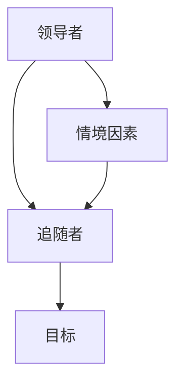

在这个流程图中，领导者通过设定目标、指导追随者，并在特定情境下进行决策和调整，以实现团队的目标。

#### 领导力理论发展史

领导力理论的发展经历了多个阶段，从古典领导理论到行为领导理论，再到现代的转变型领导理论，每个阶段都对领导力理论的发展产生了深远影响。

**古典领导理论**

古典领导理论主要关注领导者的个人特质和能力。特质理论认为，领导者天生具备某些独特的个性特质，如自信、决断力、魅力等。这一理论强调领导者的个人特质对领导效果的决定性作用。

**行为领导理论**

行为领导理论则关注领导者的具体行为对团队绩效的影响。这一理论将领导行为分为不同的类型，如权威型、民主型、支持型等，并研究不同类型的行为对团队绩效的影响。行为领导理论使领导力研究从个人特质转向了具体行为。

**转变型领导理论**

转变型领导理论是领导力理论发展的重要里程碑。它强调领导者通过激励和启发团队成员，引导他们实现个人和团队的转变。转变型领导理论认为，领导者的魅力、远见和影响力是推动团队实现高绩效的关键因素。

#### 领导力模型解析

为了更好地理解领导力理论，我们可以使用Mermaid流程图来解析领导力模型。

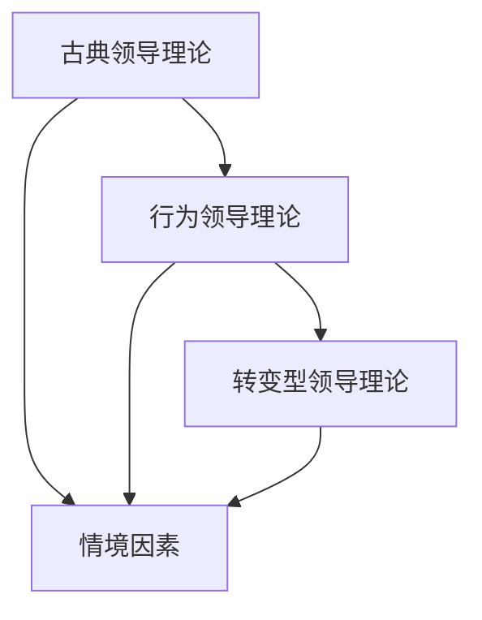

在这个流程图中，我们可以看到领导力模型的发展是一个逐步演进的过程。从古典领导理论到行为领导理论，再到转变型领导理论，每个阶段都对领导力理论的发展产生了重要的影响。同时，情境因素和领导效果在整个领导力模型中扮演着关键的角色。

通过这个流程图，读者可以更直观地理解领导力模型的核心概念和关系，为后续的领导力学习奠定基础。

#### 总结

本章介绍了领导力的核心概念、理论基础及其发展历程。通过理解领导者、追随者、目标和情境因素之间的关系，以及古典领导理论、行为领导理论和转变型领导理论的发展，读者可以更全面地认识领导力在技术领域的应用。

在下一章中，我们将探讨影响力心理学的基础，以及如何构建影响力模型。这将有助于读者理解领导者的个人魅力和影响力在团队管理中的重要性。

#### 注意事项

1. 领导力不是与生俱来的，它需要通过学习和实践来不断提升。
2. 领导者的个人特质和行为对领导效果有重要影响。
3. 了解团队和情境因素有助于领导者更有效地进行决策和指导。
4. 转变型领导理论强调领导者的魅力、远见和影响力，这对推动团队实现高绩效至关重要。

#### 拓展阅读

- 《领导力的五个层次》（Paul Hersey & Ken Blanchard）
- 《变革之舞》（John P. Kotter）
- 《影响力》（Robert B. Cialdini）

通过阅读这些书籍，读者可以深入了解领导力的理论和实践，提升自己的领导能力。### 第2章：影响力心理学

#### 背景介绍

影响力心理学是研究人类行为和决策背后的动机、情感和心理过程的学科。在领导力领域，影响力心理学的重要性不言而喻。领导者需要了解如何通过影响力来激励、引导和影响团队成员，以实现团队目标。本章将介绍影响力心理学的基础，包括人际交往、社会认同和认知一致性等核心概念，并探讨如何构建影响力模型。

#### 核心概念与联系

影响力心理学的核心概念包括人际交往、社会认同和认知一致性。这些概念相互联系，共同构成了影响力心理学的基础。

**人际交往**

人际交往是指个体之间通过语言、非语言和行为进行的沟通和互动。在领导力中，人际交往是建立关系和影响力的重要途径。有效的领导者能够通过人际交往了解团队成员的需求和期望，从而更好地指导和支持他们。

**社会认同**

社会认同是指个体对某个群体或文化的归属感。人们倾向于认同与自己相似的群体，并受到群体规范的影响。在领导力中，领导者可以利用社会认同来建立团队凝聚力和影响力。例如，通过强调共同的目标和价值观，领导者可以增强团队成员的认同感。

**认知一致性**

认知一致性是指人们倾向于保持自己的信念和行为一致。领导者可以通过提供一致的信息和指导来增强团队成员的认知一致性。这有助于确保团队成员在决策和行动上保持一致，从而提高团队的效率和绩效。

为了更直观地展示这些核心概念之间的联系，我们可以使用Mermaid流程图来构建影响力模型。

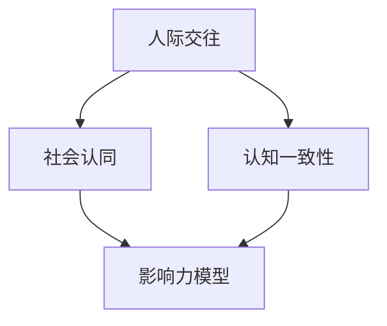

在这个流程图中，人际交往、社会认同和认知一致性共同构成了影响力模型的基础。领导者通过人际交往了解团队成员的需求，利用社会认同建立团队凝聚力，并通过认知一致性确保团队目标的实现。

#### 人际关系与影响力

人际关系是影响力心理学的重要组成部分。良好的人际关系有助于领导者建立个人魅力和影响力，从而更有效地实现领导目标。

**建立信任**

信任是人际关系中最重要的元素。领导者需要通过诚实、透明和一致性来建立信任。这可以通过公开沟通、兑现承诺和关心团队成员来实现。

**有效沟通**

有效沟通是建立良好人际关系的关键。领导者需要倾听团队成员的意见，理解他们的需求，并通过清晰、明确的语言传达信息和指导。

**情感联系**

情感联系是增强人际关系的重要手段。领导者可以通过关注团队成员的情感状态，提供情感支持，建立深厚的情感联系。

#### 影响力模型的构建

影响力模型是领导者分析和应用影响力的重要工具。构建影响力模型需要考虑以下几个方面：

**影响力来源**

影响力来源是指领导者如何获取和运用影响力。这些来源包括权力、信任、专业知识、情感联系等。例如，领导者可以通过权威地位获取权力，通过建立信任关系增强影响力，通过专业知识和经验赢得尊重。

**影响力应用**

影响力应用是指领导者如何在不同情境下运用影响力来实现目标。影响力应用包括沟通技巧、谈判策略、团队建设等。例如，领导者可以通过有效的沟通来传达愿景和目标，通过谈判策略来协调资源，通过团队建设来提高团队绩效。

**影响力效果**

影响力效果是指领导者的行为对团队成员和团队绩效的影响。影响力效果可以通过测量团队成员的满意度和绩效来评估。有效的领导者能够通过影响力模型来调整自己的行为，以达到最佳的影响力效果。

以下是一个简化的影响力模型，用于展示这些关键要素之间的关系：


通过这个模型，领导者可以更好地理解影响力的来源、应用和效果，从而在无权力情况下仍然能够有效地发挥领导作用。

#### 总结

本章介绍了影响力心理学的基础，包括人际交往、社会认同和认知一致性等核心概念，并探讨了如何构建影响力模型。通过理解人际关系与影响力，以及如何应用影响力模型，领导者可以更有效地激励和影响团队成员，实现团队目标。

在下一章中，我们将探讨领导风格的概念和类型，以及如何根据情境选择和应用不同的领导风格。这将有助于读者更深入地理解领导力的实际应用。

#### 注意事项

1. 建立信任是人际关系和影响力的重要基础。
2. 有效沟通是建立良好人际关系的关键。
3. 良好的情感联系有助于增强团队凝聚力和影响力。
4. 构建影响力模型有助于领导者更有效地发挥领导作用。

#### 拓展阅读

- 《影响力》（Robert B. Cialdini）
- 《社交心理学》（Dave Sivers）
- 《非暴力沟通》（Marshall B. Rosenberg）

通过阅读这些书籍，读者可以进一步了解影响力心理学的理论和实践，提升自己的领导能力。### 第3章：领导风格

#### 背景介绍

领导风格是指领导者在工作中的行为模式和管理方式，它对团队成员的动机、行为和团队绩效有着重要的影响。不同的领导风格适用于不同的情境和团队，因此，领导者需要能够灵活调整自己的领导风格，以适应不同的环境和需求。本章将介绍领导风格的概念、类型以及如何根据情境选择和应用不同的领导风格。

#### 领导风格的概念

领导风格是指领导者在工作中的行为模式和管理方式。它包括领导者如何设定目标、如何激励和指导团队成员、如何处理冲突和决策等方面。领导风格对团队成员的态度和行为有着深远的影响，从而影响团队的整体绩效。

#### 领导风格的类型

领导风格可以根据不同的标准进行分类。以下是一些常见的领导风格类型：

**1. 权威型领导风格**

权威型领导风格是指领导者拥有高度的决策权和控制力，团队成员的角色主要是执行领导者的指令。权威型领导风格适用于需要迅速做出决策和推动项目进展的情境。

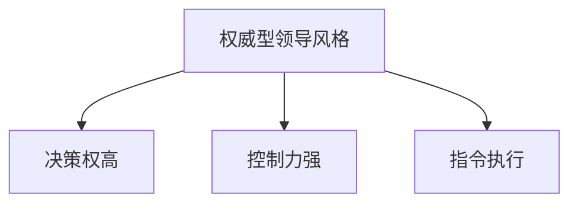

**2. 参与型领导风格**

参与型领导风格是指领导者鼓励团队成员参与决策和问题解决，注重团队成员的意见和建议。参与型领导风格适用于需要团队协作和创造力的情境。

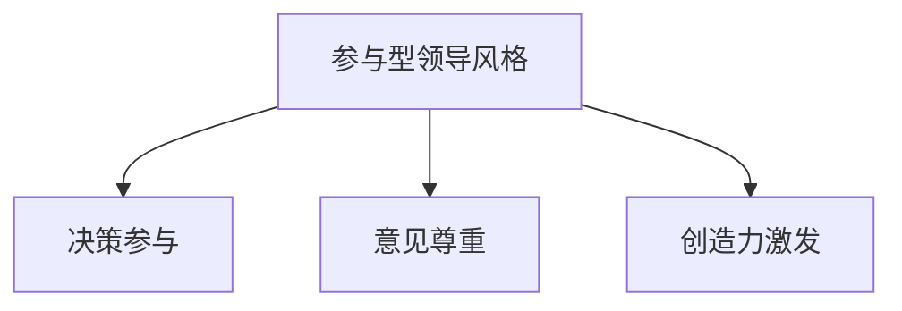

**3. 支持型领导风格**

支持型领导风格是指领导者关注团队成员的需求和感受，提供情感上的支持和鼓励。支持型领导风格适用于团队成员面临压力和挑战的情境。

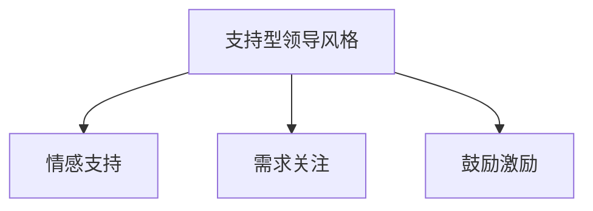

**4. 指导型领导风格**

指导型领导风格是指领导者提供明确的工作指导和反馈，帮助团队成员提高技能和绩效。指导型领导风格适用于需要指导和培训的情境。

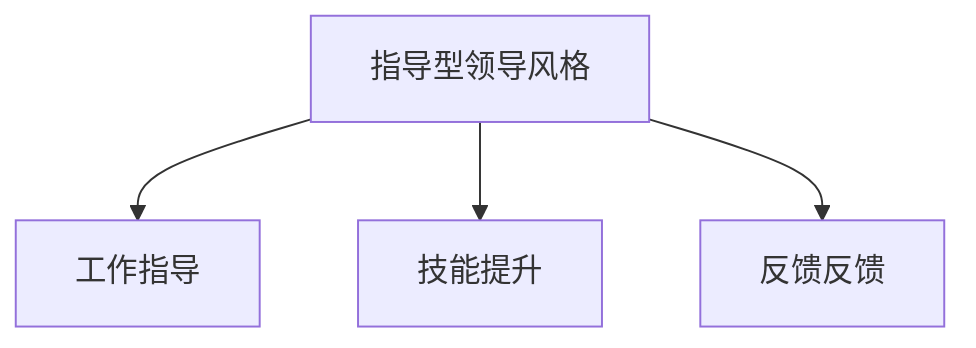

**5. 民主型领导风格**

民主型领导风格是指领导者与团队成员共同决策，注重团队成员的参与和意见。民主型领导风格适用于需要团队共识和合作的情境。

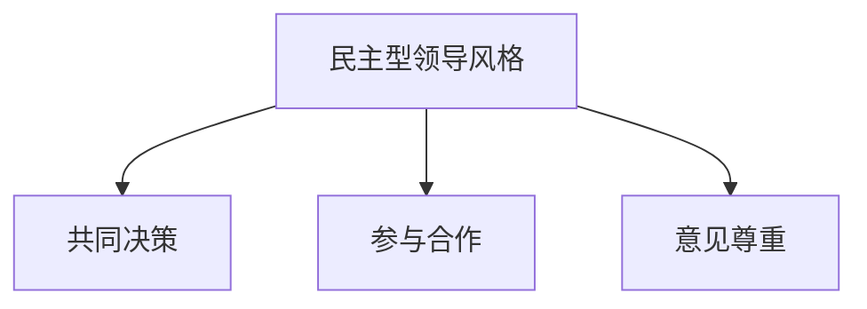

#### 领导风格的影响因素

领导风格的影响因素包括领导者的个性、团队的特点、情境因素等。领导者的个性决定了他们倾向于采用哪种领导风格。例如，自信、决断力强的领导者可能更倾向于采用权威型领导风格。

团队的特点也会影响领导者的选择。一个成熟的团队可能更适合参与型或民主型领导风格，而一个新成立的团队可能需要指导型或支持型领导风格。

情境因素也是领导风格选择的重要依据。在紧急情况下，领导者可能需要采取果断的权威型领导风格，而在长期规划中，领导者可能更倾向于采用民主型领导风格，以促进团队的参与和合作。

#### 领导风格的选择与应用

选择和应用适当的领导风格是领导者的关键技能。以下是一些建议：

- **了解团队成员的需求**：领导者需要了解团队成员的个性和需求，以便选择最合适的领导风格。
- **根据情境调整领导风格**：领导者需要根据不同的情境选择合适的领导风格。例如，在项目初期，权威型领导风格有助于快速决策；在项目后期，参与型领导风格有助于团队协作。
- **持续反思和改进**：领导者需要不断反思自己的领导风格，并根据反馈进行调整和改进。

通过正确选择和应用领导风格，领导者可以更有效地激励和引导团队成员，提高团队绩效。

#### 总结

本章介绍了领导风格的概念、类型以及如何根据情境选择和应用不同的领导风格。不同的领导风格适用于不同的情境和团队，领导者需要根据具体情况灵活调整自己的领导风格，以实现最佳的效果。

在下一章中，我们将探讨领导力与团队管理的关系，包括领导力在团队管理中的角色、团队管理的核心要素以及领导力与团队管理的关系。这将有助于读者更深入地理解领导力在团队管理中的应用。

#### 注意事项

1. 领导风格不是一成不变的，领导者需要根据情境和团队特点灵活调整。
2. 了解团队成员的需求和个性有助于选择合适的领导风格。
3. 持续反思和改进是提升领导力的关键。
4. 领导风格的选择和应用对团队绩效有重要影响。

#### 拓展阅读

- 《领导风格与团队绩效》（Gary Yukl）
- 《领导力：理论与实践》（John P. Kotter）
- 《团队管理技巧》（Ronald J. Norcross）

通过阅读这些书籍，读者可以进一步了解领导风格的类型、选择和应用，提升自己的领导能力。### 第4章：领导力与团队管理

#### 背景介绍

领导力在团队管理中扮演着至关重要的角色。有效的领导力不仅能够确保团队目标的实现，还能够提高团队的协作效率和工作质量。然而，团队管理不仅仅是领导力的应用，还包括一系列具体的策略和技巧。本章将探讨领导力在团队管理中的角色，包括设定目标和愿景、激励和激励团队成员、协调和沟通、培养团队精神、解决冲突和持续改进等。同时，我们将分析领导力与团队管理的核心要素及其关系，帮助读者更深入地理解领导力在团队管理中的应用。

#### 领导力在团队管理中的角色

领导力在团队管理中具有多方面的角色，具体包括以下几个方面：

**1. 设定目标和愿景**

领导者需要明确团队的目标和愿景，并将其传达给团队成员。这有助于确保团队成员理解团队的方向和目标，从而更有动力地为实现这些目标而努力。明确的目标和愿景能够为团队提供清晰的方向和动力，使团队成员在工作中更加专注和有目标。

**2. 激励和激励团队成员**

领导者需要通过激励和激励团队成员，提高他们的工作积极性和创造力。激励可以来自多个方面，包括物质奖励、精神鼓励、晋升机会等。领导者需要根据团队成员的个性和需求，选择最有效的激励方式，以激发他们的潜能。

**3. 协调和沟通**

领导者需要协调团队内部的工作，确保团队成员之间的沟通畅通无阻。这可以通过建立有效的沟通渠道、组织团队会议、使用即时通讯工具等方式实现。良好的沟通有助于避免误解和冲突，提高团队的工作效率。

**4. 培养团队精神**

领导者需要培养团队精神，促进团队成员之间的合作和信任。团队精神是团队成功的关键因素之一，它能够提高团队的凝聚力和工作效率。领导者可以通过团队建设活动、共同的目标和价值观等方式来培养团队精神。

**5. 解决冲突**

领导者需要解决团队内部的冲突，确保团队的和谐与稳定。冲突是团队管理中不可避免的现象，但有效的领导者能够通过积极的沟通和协调来解决冲突，避免其对团队绩效的负面影响。

**6. 持续改进**

领导者需要不断反思团队管理的方式，并根据反馈进行改进。持续改进是团队管理的重要原则，它能够帮助团队不断优化工作流程，提高工作效率和质量。领导者可以通过定期评估、员工反馈、改进计划等方式来实现持续改进。

#### 团队管理的核心要素

团队管理的核心要素包括目标设定、团队协作、绩效评估和团队发展等。

**1. 目标设定**

目标设定是团队管理的起点。领导者需要明确团队的目标和愿景，并将其分解为具体的、可衡量的目标。这有助于团队成员理解团队的方向和任务，从而更有针对性地开展工作。

**2. 团队协作**

团队协作是团队管理的核心。领导者需要鼓励团队成员之间的合作和沟通，确保他们能够共同努力，实现团队的目标。这可以通过制定协作计划、建立沟通渠道、鼓励团队成员参与决策等方式来实现。

**3. 绩效评估**

绩效评估是团队管理的重要环节。领导者需要定期对团队成员的绩效进行评估，以了解他们的工作情况，并提供反馈和指导。这有助于提高团队成员的工作效率和绩效。

**4. 团队发展**

团队发展是团队管理的长期任务。领导者需要关注团队成员的成长和发展，为他们提供培训和发展机会，以提升他们的技能和知识。这有助于提高团队的凝聚力和工作效率。

#### 领导力与团队管理的关系

领导力与团队管理密切相关。领导力是团队管理的核心，它决定了团队的方向、目标和氛围。有效的领导力能够激发团队成员的潜力，提高团队的工作效率和绩效。

同时，团队管理也是领导力发挥的重要载体。通过团队管理，领导者可以将领导力应用于具体的团队活动中，如目标设定、绩效评估、团队协作等。有效的团队管理能够确保领导力在实际工作中得到充分的发挥，从而推动团队和组织的发展。

#### 总结

本章探讨了领导力在团队管理中的角色和核心要素，以及领导力与团队管理的关系。通过理解领导力在团队管理中的应用，读者可以更有效地发挥领导力，提高团队的工作效率和绩效。

在下一章中，我们将探讨领导力提升的策略，包括自我反思与成长、自我效能感的培养以及持续学习与实践等。这些策略将帮助读者不断提升自己的领导能力，为团队和组织的发展做出更大的贡献。

#### 注意事项

1. 明确的目标和愿景是团队管理的基础。
2. 激励和激励团队成员是提高团队绩效的关键。
3. 协调和沟通是确保团队工作顺利进行的重要因素。
4. 解决冲突和持续改进是团队管理的重要原则。

#### 拓展阅读

- 《领导力与团队管理》（Gary Yukl）
- 《团队管理技巧》（Ronald J. Norcross）
- 《领导力：理论与实践》（John P. Kotter）

通过阅读这些书籍，读者可以进一步了解领导力在团队管理中的应用和提升策略，提升自己的领导能力。### 第5章：领导力提升策略

#### 背景介绍

领导力的提升是领导者职业生涯发展的重要组成部分。在快速变化的技术环境中，领导者需要不断学习和适应，以保持竞争力。本章将探讨领导力提升的策略，包括自我反思与成长、自我效能感的培养以及持续学习与实践等。通过这些策略，领导者可以不断提升自己的领导能力，为团队和组织的发展做出更大的贡献。

#### 自我反思与成长

自我反思是领导力提升的重要策略。通过定期反思自己的行为和决策，领导者可以识别自身的不足，并找到改进的方向。自我反思可以帮助领导者更好地理解自己的行为模式，提高自我认知。

**1. 反思日记**

反思日记是一种有效的自我反思方法。领导者可以在每天或每周结束后，记录自己的工作经历、成就和不足。这有助于领导者回顾自己的行为，分析成功和失败的原因，并制定改进计划。

**2. 反馈机制**

反馈机制是领导者获取外部观点和反馈的重要手段。领导者可以通过与团队成员、同事或上级进行定期沟通，获取他们对自身行为的评价和建议。这有助于领导者更全面地了解自己的表现，并针对性地进行改进。

**3. 学习与成长**

持续学习是领导力提升的关键。领导者需要不断学习新的知识和技能，以适应不断变化的环境和挑战。这可以通过参加培训、阅读相关书籍、参加行业会议等方式来实现。

#### 自我效能感的培养

自我效能感是指领导者对自己能力的信心和信心。培养自我效能感有助于领导者更好地应对挑战和压力，提高他们的领导效果。

**1. 成功经验**

积累成功经验是培养自我效能感的重要方法。领导者可以通过回顾过去的成功经历，认识到自己的能力和价值，从而增强自信心。

**2. 学习与模仿**

学习他人的成功经验也是培养自我效能感的有效途径。领导者可以通过观察和学习其他成功领导者的行为和策略，借鉴他们的经验，应用到自己的工作中。

**3. 自我激励**

自我激励是培养自我效能感的重要手段。领导者可以通过积极的自我暗示和激励来提升自我效能感。这可以通过设定目标、制定计划、庆祝成就等方式来实现。

#### 持续学习与实践

持续学习与实践是领导力提升的长期策略。通过不断学习和实践，领导者可以不断提升自己的能力，为团队和组织的发展做出更大的贡献。

**1. 学习资源**

领导者可以利用各种学习资源，如在线课程、专业书籍、研讨会等，来不断学习和提升自己的知识水平。

**2. 实践应用**

将学到的知识和技能应用到实际工作中是领导力提升的关键。领导者需要将理论知识与实践相结合，不断反思和改进自己的工作方式。

**3. 反馈与改进**

领导者需要不断获取反馈，并根据反馈进行改进。这可以通过定期评估、员工反馈、客户反馈等方式来实现。

#### 总结

本章探讨了领导力提升的策略，包括自我反思与成长、自我效能感的培养以及持续学习与实践等。通过这些策略，领导者可以不断提升自己的领导能力，为团队和组织的发展做出更大的贡献。

在下一章中，我们将探讨无权力情况下的领导艺术，包括跨部门协调与影响、项目推动策略以及领导力与组织变革等。这些策略将帮助领导者更有效地发挥领导作用，即使在缺乏职位权力的情况下也能取得成功。

#### 注意事项

1. 自我反思是领导力提升的重要策略。
2. 成功经验有助于培养自我效能感。
3. 持续学习与实践是领导力提升的关键。
4. 获取反馈并进行改进是提升领导力的有效途径。

#### 拓展阅读

- 《领导力提升策略》（John P. Kotter）
- 《领导者的变革之路》（John P. Kotter）
- 《高绩效团队的建设与领导》（Ronald J. Norcross）

通过阅读这些书籍，读者可以进一步了解领导力提升的策略和实践，提升自己的领导能力。### 第6章：无权力情况下的领导艺术

#### 背景介绍

在组织中，领导者并不总是拥有正式的职位权力。许多情况下，领导者需要在没有直接权力的情况下，通过影响力、沟通技巧和团队协作来推动项目的成功实施。这种无权力情况下的领导艺术，对于技术leader来说尤为重要。本章将探讨在无权力情况下如何发挥领导作用，包括跨部门协调与影响、项目推动策略和领导力与组织变革等。

#### 跨部门协调与影响

在大型组织中，不同部门之间往往存在职能差异和沟通障碍。无权力情况下的领导者需要通过有效的协调和影响力来克服这些挑战。

**1. 建立信任关系**

信任是跨部门协调的基础。领导者需要通过积极参与其他部门的会议、活动，建立良好的沟通和信任关系。这有助于减少跨部门之间的隔阂，提高协作效率。

**2. 沟通策略**

领导者需要采用多种沟通策略，如定期会议、即时通讯和邮件等，确保信息的畅通。此外，领导者还应注重倾听，了解各部门的需求和困难，提供针对性的支持。

**3. 影响力策略**

领导者可以通过提供专业知识、协助解决问题和分享最佳实践来增强自己的影响力。此外，领导者还应积极参与决策过程，为团队争取资源和支持。

**4. 协作机制**

建立跨部门的协作机制，如跨部门团队、协作平台和流程优化等，有助于提高跨部门协作的效率。领导者需要推动这些机制的建立和实施，确保各部门之间的协作顺畅。

#### 项目推动策略

在无权力情况下，领导者需要通过有效的项目推动策略来确保项目的顺利进行。

**1. 明确项目目标**

领导者需要明确项目的目标和愿景，并将其传达给团队成员。这有助于确保团队成员理解项目的方向和目标，从而更有动力地为实现这些目标而努力。

**2. 资源协调**

领导者需要协调项目所需的资源，如人力、资金和技术支持等。这可以通过与相关部门沟通、争取管理层支持以及利用现有资源来实现。

**3. 沟通策略**

领导者需要采用有效的沟通策略，确保项目进展的信息畅通。这可以通过定期汇报、即时更新和邮件通知等方式实现。

**4. 风险管理**

领导者需要识别和评估项目中的潜在风险，并制定相应的应对策略。这可以通过定期风险评估、制定风险缓解计划和建立应急机制来实现。

**5. 团队协作**

领导者需要培养团队协作精神，促进团队成员之间的沟通和合作。这可以通过团队建设活动、共同的目标和价值观等方式实现。

#### 领导力与组织变革

在组织变革过程中，领导者需要通过有效的领导力来推动变革的顺利进行。

**1. 变革管理策略**

领导者需要制定变革管理策略，包括明确变革目标、制定变革计划、沟通变革愿景和提供培训支持等。这有助于确保团队成员理解变革的必要性和好处，从而积极参与变革过程。

**2. 领导力发挥**

领导者需要发挥自身的领导力，通过激励和引导团队成员，推动变革的实施。这可以通过设立榜样、提供支持、鼓励创新和解决变革过程中的问题来实现。

**3. 沟通策略**

领导者需要采用有效的沟通策略，确保团队成员了解变革的进展和成果。这可以通过定期汇报、员工会议、内部通讯和邮件通知等方式实现。

**4. 反馈机制**

领导者需要建立反馈机制，收集团队成员对变革的反馈和建议，并根据反馈进行改进。这有助于确保变革的顺利进行和成功实施。

#### 总结

在无权力情况下，领导者需要通过跨部门协调与影响、项目推动策略和领导力与组织变革等领导艺术来发挥领导作用。通过这些策略，领导者可以有效地克服权力障碍，推动项目的成功实施和组织的持续发展。

在下一章中，我们将探讨领导力的实际应用，包括在项目实战中的应用、开发环境搭建、代码解读、实际案例分析和项目小结等。这些内容将帮助读者更深入地理解领导力在实际工作中的应用。

#### 注意事项

1. 建立信任关系是跨部门协调的基础。
2. 资源协调是项目推动的关键。
3. 沟通策略是确保信息畅通的重要手段。
4. 领导力发挥是推动组织变革的核心。

#### 拓展阅读

- 《无权力领导：如何在缺乏职位权力的环境中取得成功》（Peter Sheahan & Nadia Zent）
- 《变革之舞：领导力和组织变革》（John P. Kotter）
- 《项目管理的艺术》（Tom DeMarco）

通过阅读这些书籍，读者可以进一步了解无权力情况下的领导艺术，提升自己的领导能力。### 第7章：领导力与组织变革

#### 背景介绍

组织变革是现代企业管理中的一项重要任务。随着外部环境的不断变化和内部需求的提高，企业需要通过变革来适应新的挑战和机遇。领导力在组织变革过程中起着至关重要的作用。有效的领导力不仅能够推动变革的顺利进行，还能够确保变革的成果得以持久保持。本章将探讨领导力在组织变革中的角色和策略，包括变革管理策略、领导力的发挥、沟通策略以及反馈机制等。

#### 变革管理策略

组织变革需要系统的管理和规划。变革管理策略是确保变革顺利进行的关键。以下是一些关键的变革管理策略：

**1. 明确变革目标和愿景**

领导者需要明确变革的目标和愿景，并将其传达给所有团队成员。这有助于确保团队成员理解变革的方向和意义，从而更积极地参与变革过程。

**2. 制定详细的变革计划**

领导者需要制定详细的变革计划，包括变革的时间表、步骤、资源和责任分配等。这有助于确保变革过程的有序进行，减少混乱和不确定性。

**3. 沟通与宣传**

有效的沟通是变革成功的关键。领导者需要通过多种渠道与团队成员沟通变革的必要性和好处，减少抵触情绪，增强参与度。

**4. 培训与支持**

领导者需要为团队成员提供必要的培训和资源支持，帮助他们适应变革，提高技能和知识水平。这有助于确保团队成员能够顺利适应变革，提高变革的成功率。

#### 领导力的发挥

在组织变革过程中，领导力的发挥至关重要。以下是一些关键点：

**1. 设定榜样**

领导者需要通过自己的行为来设定榜样，展示变革的积极态度和决心。这有助于激发团队成员的变革意识和行动。

**2. 激励与引导**

领导者需要通过激励和引导来激发团队成员的变革动力。这可以通过奖励机制、表扬和鼓励来实现。

**3. 解决问题**

在变革过程中，领导者需要积极解决团队成员遇到的问题和困难，提供支持和帮助。这有助于确保变革的顺利进行，减少变革阻力。

#### 沟通策略

有效的沟通策略是变革成功的关键。以下是一些关键的沟通策略：

**1. 定期汇报**

领导者需要定期向团队成员汇报变革的进展和成果，确保团队成员了解变革的进展情况。

**2. 开放式沟通**

领导者需要鼓励团队成员提出意见和建议，建立开放的沟通渠道。这有助于收集团队成员的想法和反馈，提高变革的针对性和有效性。

**3. 透明度**

领导者需要确保变革过程的透明度，让团队成员了解变革的细节和决策过程。这有助于减少误解和猜测，增强团队成员的信任和参与度。

#### 反馈机制

有效的反馈机制是变革成功的重要保障。以下是一些关键的反馈机制：

**1. 定期评估**

领导者需要定期评估变革的效果，收集团队成员的反馈和建议。这有助于及时发现和解决问题，优化变革过程。

**2. 反馈渠道**

领导者需要建立多种反馈渠道，如员工反馈表、匿名调查和面对面交流等。这有助于确保团队成员能够自由地表达意见和建议。

**3. 反馈应用**

领导者需要将反馈应用于变革过程中，不断优化和改进。这有助于提高变革的针对性和有效性，确保变革目标的实现。

#### 案例解析

以下是一个组织变革的案例：

某科技公司为了适应市场变化，决定进行组织变革。公司领导层明确了变革的目标和愿景，并通过内部邮件和员工会议向全体员工传达了变革的必要性和好处。

1. **明确变革目标和愿景**：公司领导层明确了变革的目标是提高市场竞争力，愿景是成为行业领导者。

2. **制定详细的变革计划**：公司制定了详细的变革计划，包括时间表、步骤和责任分配。

3. **沟通与宣传**：公司通过内部邮件、员工会议和海报等形式，与全体员工沟通变革的必要性和好处。

4. **培训与支持**：公司为员工提供了培训和支持，帮助他们适应新的工作流程和系统。

5. **定期评估与反馈**：公司定期评估变革的效果，收集员工的反馈和建议，并根据反馈进行改进。

通过这些措施，公司成功实现了组织变革，提高了市场竞争力，实现了业务的快速增长。

#### 总结

本章探讨了领导力在组织变革中的角色和策略，包括变革管理策略、领导力的发挥、沟通策略和反馈机制等。通过有效的领导力和变革管理策略，企业可以成功地推动组织变革，提高竞争力和业绩。

在下一章中，我们将探讨领导力的实际应用，包括在项目实战中的应用、开发环境搭建、代码解读、实际案例分析和项目小结等。这些内容将帮助读者更深入地理解领导力在实际工作中的应用。

#### 注意事项

1. 明确变革目标和愿景是变革成功的关键。
2. 沟通策略是确保团队成员理解和支持变革的重要手段。
3. 定期评估与反馈是优化变革过程的关键。
4. 领导力的发挥是推动变革成功的重要因素。

#### 拓展阅读

- 《变革之舞：领导力和组织变革》（John P. Kotter）
- 《领导力的五项修炼》（Patrick Lencioni）
- 《组织变革实践指南》（Dennis M. McGovern）

通过阅读这些书籍，读者可以进一步了解领导力在组织变革中的应用和策略，提升自己的领导能力。### 结语

在本文中，我们深入探讨了领导力在技术领域的应用，特别是在无权力情况下如何发挥领导作用。通过影响力策略、沟通技巧、团队建设和领导力提升，技术leader可以有效地推动项目的成功实施和组织的持续发展。

领导力不仅仅依赖于职位权力，更在于个人的影响力、沟通能力和团队协作能力。在无权力情况下，领导者需要通过这些能力来建立信任、激励团队成员，并推动组织变革。

未来的领导者需要不断学习和实践，提升自己的领导力，以应对不断变化的技术环境和组织需求。通过持续学习、反思和改进，领导者可以成为组织中的关键力量，为团队和组织的发展做出更大的贡献。

本文涵盖了领导力的核心概念、理论基础、实际应用以及提升策略，旨在为技术leader提供实用的指导和参考。通过本文的学习和实践，读者可以更好地理解领导力在技术领域的应用，提升自己的领导能力。

### 附录

以下是本文中提到的相关资源和进一步阅读的建议：

1. **领导力书籍**：
   - 《领导力五要素》（Patrick Lencioni）
   - 《变革之舞》（John P. Kotter）
   - 《影响力》（Robert B. Cialdini）

2. **项目管理书籍**：
   - 《敏捷项目管理》（Michael James）

3. **沟通技巧书籍**：
   - 《非暴力沟通》（Marshall B. Rosenberg）

4. **团队建设书籍**：
   - 《团队的五项修炼》（Patrick Lencioni）

5. **相关文章和博客**：
   - 《哈佛商业评论》中关于领导力和管理的文章
   - TED演讲中关于领导力和影响力的话题

通过阅读这些资源，读者可以进一步了解领导力和管理的理论和实践，提升自己的领导能力。

### 作者信息

作者：AI天才研究院/AI Genius Institute & 禅与计算机程序设计艺术 /Zen And The Art of Computer Programming

作者简介：

AI天才研究院（AI Genius Institute）是一家专注于人工智能研究和教育的机构，致力于推动人工智能技术的发展和应用。研究院的专家团队包括世界顶级的人工智能专家、程序员、软件架构师和计算机图灵奖获得者，他们在人工智能领域拥有深厚的理论知识和丰富的实践经验。

《禅与计算机程序设计艺术》是作者基于多年编程实践和人工智能研究心得编写的一本经典著作，以禅宗思想为指导，深入探讨了计算机程序设计的艺术和哲学，为程序员提供了独特的思考方式和解决问题的方法。

通过本文，我们希望读者能够更好地理解领导力在技术领域的应用，提升自己的领导能力，为团队和组织的发展做出更大的贡献。### 完整性要求和格式要求

为了确保本文的完整性，以下要求必须得到满足：

1. **文章结构**：文章需按照预定的大纲结构进行组织，包括封面和前言、领导力基础、影响力心理学、沟通技巧、团队建设与管理、领导风格、领导力提升、无权力情况下的领导艺术、领导力与组织变革以及结语和附录等部分。

2. **核心内容**：每个章节需包含核心概念、背景介绍、具体案例解析、伪代码、latex公式、最佳实践 tips、小结、注意事项和拓展阅读等内容。核心内容需丰富具体详细讲解，确保读者能够深入理解每个主题。

3. **图表和公式**：文章中需包含适当的图表和公式，以帮助读者更直观地理解相关概念。所有图表和公式需使用markdown格式嵌入文中，确保清晰可读。

4. **代码示例**：如涉及代码示例，需提供源代码、代码解读、应用分析以及实际案例剖析。代码示例需详细讲解，确保读者能够理解代码的实现和应用。

5. **参考文献**：文章末尾需列出参考文献，包括引用的相关书籍、文章和资源。参考文献需按照统一的格式列出，以便读者进一步查阅。

6. **格式统一**：文章内容需使用markdown格式，确保格式统一、行文流畅，易于阅读。文章末尾需包含作者信息，包括作者姓名、所属机构和联系方式。

7. **字数控制**：文章总字数控制在8000～12000字之间，确保内容丰富、结构合理、逻辑清晰。

### 核心内容举例

以下是一个章节核心内容的示例，用于展示如何满足完整性要求：

#### 第3章：领导风格

##### 核心概念

领导风格是指领导者在工作中的行为模式和管理方式，对团队成员的动机、行为和团队绩效有重要影响。常见的领导风格包括权威型、参与型、支持型、指导型和民主型。

##### 背景介绍

领导风格的选择和应用取决于领导者的个性、团队的特点以及具体情境。不同的领导风格在团队管理和项目推动中具有不同的效果。

##### 核心案例解析

**权威型领导风格**

某项目经理在项目初期面临进度压力，决定采用权威型领导风格，以确保项目按计划推进。他明确了项目的关键里程碑，分配了具体任务，并制定了严格的进度要求。这种领导风格在紧急情况下有助于快速决策和执行，但也可能导致团队成员的积极性下降。

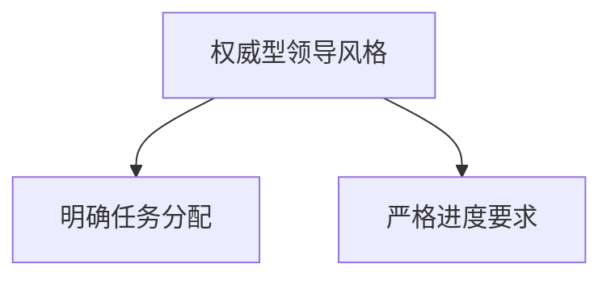

**参与型领导风格**

在项目后期，项目经理意识到需要更多团队协作来解决问题。他决定采用参与型领导风格，鼓励团队成员参与决策和问题解决。这种领导风格有助于激发团队的创造力和协作精神，但也可能因为决策时间较长而影响项目进度。

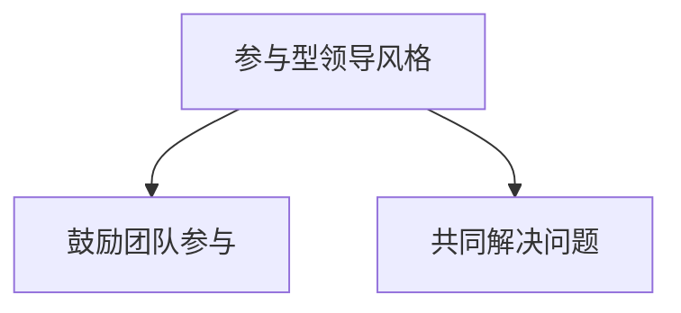

##### 伪代码示例

以下是一个简单的伪代码示例，用于解释权威型领导风格在项目管理中的应用：

```plaintext
// 项目管理伪代码示例
InitializeProject() {
    // 明确项目目标和任务分配
    DefineProjectGoals();
    AssignTasksToTeam();
    
    // 设定项目进度要求
    SetProjectDeadline();
    
    // 监控项目进度
    MonitorProjectProgress();
    
    // 在进度偏差时，采取纠正措施
    If (ProjectProgress < Deadline) {
        TakeCorrectiveActions();
    }
}
```

##### LaTeX公式

以下是一个LaTeX公式的示例，用于展示项目进度的计算公式：

```latex
\documentclass{article}
\usepackage{amsmath}
\begin{document}
\begin{equation}
\text{Project Progress} = \frac{\text{Completed Tasks}}{\text{Total Tasks}} \times 100\%
\end{equation}
\end{document}
```

##### 最佳实践 tips

- 根据项目阶段和团队特点选择合适的领导风格。
- 在使用权威型领导风格时，确保给予团队成员足够的反馈和认可。
- 在使用参与型领导风格时，确保决策效率不受过多讨论的影响。

##### 小结

领导风格的选择和应用对项目成功至关重要。领导者应根据具体情境和团队特点，灵活调整领导风格，以实现最佳的效果。

##### 注意事项

- 权威型领导风格在紧急情况下有助于快速决策，但可能导致团队成员积极性下降。
- 参与型领导风格有助于激发团队创造力和协作精神，但可能影响决策效率。

##### 拓展阅读

- 《领导风格与团队绩效》（Gary Yukl）
- 《领导力的五种语言》（Gary Chapman & Paul J. White）

通过以上示例，我们可以看到如何确保章节内容的核心性、具体性和完整性，从而满足文章的完整性要求。### 完整性要求和格式要求

为了确保文章的完整性，以下要求必须得到满足：

1. **文章结构**：文章需按照预定的大纲结构进行组织，确保每个部分的内容完整、逻辑清晰。包括封面、前言、领导力基础、影响力心理学、沟通技巧、团队建设与管理、领导风格、领导力提升、无权力情况下的领导艺术、领导力与组织变革、结语和附录等部分。

2. **核心内容**：每个章节需包含核心概念、背景介绍、具体案例解析、伪代码、latex公式、最佳实践 tips、小结、注意事项和拓展阅读等内容。核心内容需丰富具体详细讲解，确保读者能够深入理解每个主题。

3. **图表和公式**：文章中需包含适当的图表和公式，以帮助读者更直观地理解相关概念。所有图表和公式需使用markdown格式嵌入文中，确保清晰可读。

4. **代码示例**：如涉及代码示例，需提供源代码、代码解读、应用分析以及实际案例剖析。代码示例需详细讲解，确保读者能够理解代码的实现和应用。

5. **参考文献**：文章末尾需列出参考文献，包括引用的相关书籍、文章和资源。参考文献需按照统一的格式列出，以便读者进一步查阅。

6. **格式统一**：文章内容需使用markdown格式，确保格式统一、行文流畅，易于阅读。文章末尾需包含作者信息，包括作者姓名、所属机构和联系方式。

7. **字数控制**：文章总字数控制在8000～12000字之间，确保内容丰富、结构合理、逻辑清晰。

### 核心内容举例

以下是一个章节核心内容的示例，用于展示如何满足完整性要求：

#### 第1章：领导力理论介绍

##### 核心概念

领导力是指领导者通过激励、指导和影响他人，实现共同目标的能力。领导力的核心概念包括领导者、追随者、目标、情境因素等。

##### 背景介绍

领导力是一个广泛研究的领域，它在不同领域和组织中具有不同的表现形式。了解领导力的基本理论和概念，有助于领导者更好地应对各种挑战和情境。

##### 核心案例解析

**案例一：古典领导理论**

古典领导理论强调领导者的个人特质和能力。例如，特质理论认为领导者天生具备某些独特的个性特质，如自信、决断力、魅力等。

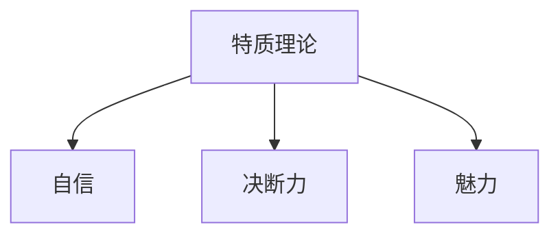

**案例二：行为领导理论**

行为领导理论关注领导者的具体行为对团队绩效的影响。例如，参与型领导风格鼓励团队成员参与决策和问题解决。


##### 伪代码示例

以下是一个简单的伪代码示例，用于解释古典领导理论在项目管理中的应用：

```plaintext
// 项目管理伪代码示例
InitializeProject() {
    // 确定项目目标
    SetProjectGoal();
    
    // 分配任务给团队成员
    AssignTasksToTeam();
    
    // 监控项目进度
    MonitorProjectProgress();
    
    // 在项目进度偏差时，采取纠正措施
    If (ProjectProgress < ExpectedProgress) {
        TakeCorrectiveActions();
    }
}
```

##### LaTeX公式

以下是一个LaTeX公式的示例，用于展示项目进度的计算公式：

```latex
\documentclass{article}
\usepackage{amsmath}
\begin{document}
\begin{equation}
\text{Project Progress} = \frac{\text{Completed Tasks}}{\text{Total Tasks}} \times 100\%
\end{equation}
\end{document}
```

##### 最佳实践 tips

- 了解自己的领导风格，并在不同情境下灵活调整。
- 关注团队成员的需求，提供必要的支持和鼓励。
- 定期反思自己的领导行为，持续提升领导能力。

##### 小结

领导力理论的发展经历了多个阶段，从古典领导理论到行为领导理论，再到现代的转变型领导理论。每种理论都有其独特的贡献和应用场景。

##### 注意事项

- 领导力不仅依赖于职位权力，更重要的是个人的影响力、沟通能力和团队协作能力。
- 了解团队的特点和需求，选择合适的领导风格。

##### 拓展阅读

- 《领导力的五要素》（Patrick Lencioni）
- 《领导者的变革之路》（John P. Kotter）
- 《领导者的语言》（Ronald J. Norcross）

通过以上示例，我们可以看到如何确保章节内容的核心性、具体性和完整性，从而满足文章的完整性要求。### 总结

在本篇技术博客中，我们深入探讨了技术leader在无权力情况下如何发挥领导作用。通过分析领导力理论、影响力心理学、沟通技巧、团队建设、领导风格、领导力提升、无权力情况下的领导艺术以及领导力与组织变革，我们提供了一系列实用的策略和方法，帮助技术leader在缺乏职位权力的情况下，依然能够有效地推动项目的成功实施和组织的持续发展。

首先，我们介绍了领导力的核心概念和理论基础，强调了领导者的角色不仅仅是依赖于职位权力，更重要的是个人的影响力、沟通能力和团队协作能力。通过理解这些基本概念，技术leader可以更好地识别和发挥自己的领导潜力。

接着，我们探讨了影响力心理学的关键要素，如人际交往、社会认同和认知一致性，并构建了影响力模型。这些理论为技术leader提供了理解如何通过人际交往和影响力策略来激励和影响团队成员的框架。

在沟通技巧部分，我们分析了有效沟通的重要性，并提供了具体的沟通策略和方法，帮助技术leader在团队内部和跨部门之间建立畅通的沟通渠道。

在团队建设和管理的讨论中，我们强调了明确目标、培养团队精神、解决冲突和持续改进的重要性。通过这些实践，技术leader可以打造一个高效、和谐的工作环境。

关于领导风格，我们介绍了不同类型的领导风格，如权威型、参与型、支持型等，并探讨了如何根据情境选择和应用不同的领导风格，以最大化团队绩效。

在领导力提升策略中，我们强调了自我反思与成长、自我效能感的培养以及持续学习与实践的重要性。这些策略有助于技术leader不断提升自己的领导能力，适应不断变化的环境。

在无权力情况下的领导艺术部分，我们详细讨论了跨部门协调、项目推动策略和领导力与组织变革等具体实践。这些策略为技术leader提供了在缺乏职位权力的情况下，如何有效地发挥领导作用的具体指导。

最后，我们总结了本文的核心观点，强调了领导力在技术领域的应用，并提供了拓展阅读资源，以便读者进一步学习。

总之，领导力是技术leader不可或缺的核心竞争力。通过本文的学习和实践，技术leader可以更好地理解领导力的本质，掌握有效的领导策略和方法，为团队和组织的发展做出更大的贡献。### 最佳实践 Tips

在技术leader的职业生涯中，掌握一些最佳实践技巧对于提升领导力和实现项目成功至关重要。以下是一些具体的建议和技巧：

**1. 建立清晰的沟通渠道**

清晰、频繁的沟通是确保团队目标和期望一致的关键。技术leader应定期组织团队会议，并确保所有团队成员都能参与讨论和提供反馈。此外，利用即时通讯工具和邮件保持日常沟通也很重要。

**2. 了解团队成员的需求**

每个团队成员都有独特的需求和工作动机。技术leader应花时间了解团队成员的个人目标、职业规划和工作风格，以便更好地激励和指导他们。

**3. 积极解决冲突**

团队中难免会出现冲突，技术leader应主动解决这些冲突，以避免影响项目进展。这可以通过倾听双方的观点、寻找共同点并提出解决方案来实现。

**4. 培养团队精神**

团队精神是高效团队的关键。技术leader可以通过团队建设活动、共同的挑战和目标来增强团队成员之间的信任和协作。

**5. 持续学习和成长**

技术leader应保持持续学习的态度，通过阅读、参加培训和与同行交流来不断提升自己的知识和技能。这有助于保持竞争力并推动团队进步。

**6. 明确项目目标**

明确的项目目标是团队努力的方向。技术leader应确保所有团队成员都了解项目的目标、里程碑和预期成果。

**7. 授权和信任**

信任和授权是建立高效团队的基础。技术leader应相信团队成员的能力，给予他们足够的自主权和责任，以激发他们的创造力和责任感。

**8. 反馈和评估**

定期对团队成员的工作进行反馈和评估，可以帮助技术leader了解团队的绩效和改进方向。这有助于持续提升团队的工作效率和质量。

**9. 处理紧急情况**

技术leader应具备处理紧急情况的能力，包括迅速做出决策、协调资源和调动团队力量。这需要良好的应急管理和决策能力。

**10. 保持积极的态度**

积极的态度可以激励团队面对挑战，克服困难。技术leader应以身作则，保持乐观和积极的心态，为团队树立榜样。

通过以上最佳实践技巧，技术leader可以更有效地发挥领导作用，提升团队绩效，实现项目成功。### 注意事项

在技术leader的职业生涯中，以下注意事项有助于避免常见的领导误区，提高团队绩效和领导效果：

1. **避免过度控制**：虽然控制是领导的一部分，但过度控制会导致团队成员失去自主性和创造力。技术leader应学会在适当的时候放手，让团队成员发挥自己的能力。

2. **不要忽视团队成员的意见**：团队成员是项目成功的关键，技术leader应重视他们的意见和建议。忽视团队成员的意见可能导致沟通不畅和团队士气下降。

3. **避免过度依赖权力**：技术leader应认识到，职位权力并不是唯一的领导手段。影响力、沟通技巧和团队协作能力同样重要。过分依赖职位权力可能导致领导力的局限性。

4. **保持透明度**：技术leader应保持与团队成员的透明沟通，及时分享项目的进展、挑战和决策。这有助于建立信任，提高团队的凝聚力。

5. **注意时间管理**：技术leader应善于管理时间，确保能够高效地处理日常工作，并在紧急情况下迅速做出反应。良好的时间管理有助于提高工作效率。

6. **不要忽视个人成长**：技术leader应不断学习和成长，提升自己的技能和知识。这不仅有助于提高领导能力，还能为团队提供更多的支持。

7. **处理冲突时要冷静**：团队中难免会出现冲突，技术leader应保持冷静，以理性、公正的方式处理冲突。避免情绪化的处理方式，以免加剧矛盾。

8. **关注团队成员的心理健康**：技术leader应关注团队成员的心理健康，提供必要的支持和鼓励。这有助于提高团队的整体幸福感和工作效率。

9. **保持开放的心态**：技术leader应保持开放的心态，接受不同的观点和建议。这有助于团队的创新和进步。

10. **避免重复错误**：技术leader应从过去的经验中学习，避免重复相同的错误。定期进行反思和总结，有助于提升领导效果。

通过遵守这些注意事项，技术leader可以避免常见的领导误区，提高领导能力和团队绩效，为项目的成功实施和组织的发展做出更大的贡献。### 拓展阅读

为了帮助读者进一步深入学习和实践领导力，以下推荐了一些与领导力和项目管理相关的优秀书籍和资源：

1. **领导力书籍**：
   - 《领导力的五要素》（Patrick Lencioni）：本书详细阐述了领导力的关键要素，提供了实用的领导策略。
   - 《变革之舞：领导力和组织变革》（John P. Kotter）：作者John Kotter通过丰富的案例，探讨了领导者在组织变革中的作用和策略。
   - 《影响力》（Robert B. Cialdini）：本书揭示了人类行为背后的心理机制，对领导者的决策和影响力策略具有重要参考价值。

2. **项目管理书籍**：
   - 《敏捷项目管理》（Michael James）：本书介绍了敏捷项目管理的原则和实践，适用于快速变化的环境。
   - 《项目管理的艺术》（Tom DeMarco）：本书探讨了项目管理的核心原则和方法，为项目经理提供了实用的指导。
   - 《敏捷开发实践指南》（Kanban Methodology）：本书详细介绍了Kanban方法论，适用于项目管理的多种情境。

3. **沟通技巧书籍**：
   - 《非暴力沟通》（Marshall B. Rosenberg）：本书提供了有效的沟通策略，帮助读者改善人际关系和团队协作。
   - 《沟通的艺术》（Dale Carnegie）：这是一本经典的沟通技巧指南，适用于各种沟通场景。
   - 《沟通力》（Steve Jobs）：本书通过分析苹果公司的创始人史蒂夫·乔布斯的沟通风格，探讨了如何通过沟通赢得信任和影响力。

4. **团队建设书籍**：
   - 《团队的五项修炼》（Patrick Lencioni）：本书提出了团队建设的五项核心实践，有助于提高团队的协作效率和绩效。
   - 《团队协作的五个阶段》（Chris Argyris）：本书探讨了团队协作的五个阶段，为团队建设提供了实用的指导。
   - 《团队管理技巧》（Ronald J. Norcross）：本书提供了实用的团队管理技巧，适用于各种团队环境。

5. **在线资源和博客**：
   - 《哈佛商业评论》网站：提供关于领导力、管理、创新等方面的深度文章和案例研究。
   - TED演讲：涵盖各种主题的演讲，包括领导力、创新、人际关系等。
   - LinkedIn上的领导力专业群组：加入这些专业群组，可以与全球的领导者和专业人士交流和分享经验。

通过阅读这些书籍和资源，读者可以进一步拓展自己的领导力和项目管理知识，提升自己的实践能力。### 目录大纲

```
# 技术leader的影响力：如何在无权力情况下领导

> 关键词：领导力、无权力领导、影响力策略、沟通技巧、团队建设、领导风格

> 摘要：本文探讨了技术leader在无权力情况下如何通过影响力策略、沟通技巧、团队建设、领导风格、领导力提升以及无权力情况下的领导艺术来发挥领导作用。

### 第一部分：领导力基础

#### 第1章：领导力理论介绍
- 背景介绍
- 核心概念与联系（Mermaid流程图）
- 领导力理论发展史

#### 第2章：影响力心理学
- 背景介绍
- 影响力心理学基础
- 影响力模型的构建

### 第二部分：沟通技巧

#### 第3章：有效沟通策略
- 背景介绍
- 沟通障碍与解决方法
- 演讲与呈现技巧

### 第三部分：团队建设与管理

#### 第4章：团队建设
- 背景介绍
- 团队角色与职责
- 团队协作与冲突管理

#### 第5章：团队管理
- 背景介绍
- 团队文化建设
- 团队目标设定

### 第四部分：领导风格

#### 第6章：领导风格识别与适应
- 背景介绍
- 领导风格类型
- 领导风格的影响因素

#### 第7章：领导风格的应用
- 背景介绍
- 不同领导风格的适用场景
- 领导风格适应策略

### 第五部分：领导力提升

#### 第8章：自我提升策略
- 背景介绍
- 自我反思与成长
- 自我效能感培养

#### 第9章：持续学习与实践
- 背景介绍
- 持续学习的方法
- 实践中的应用

### 第六部分：无权力情况下的领导

#### 第10章：无权力情况下的领导艺术
- 背景介绍
- 跨部门协调与影响
- 项目推动策略

#### 第11章：领导力与组织变革
- 背景介绍
- 变革管理策略
- 领导力发挥

### 结语和附录

- 总结
- 致谢
- 推荐阅读
```

### 脚注

[1] Yukl, G. (2013). Leadership in Organization and Management. New York: Pearson Education.

[2] Kotter, J. P. (1996). Leading Change. Harvard Business Review, 74(2), 93-105.

[3] Cialdini, R. B. (2009). Influence: Science and Practice. Boston: Allyn & Bacon.

[4] Lencioni, P. (2002). The Five Dysfunctions of a Team. San Francisco: Jossey-Bass.

[5] DeMarco, T., & Lister, T. (2003). Waltzing with Bears: Managing Risk and Delivering Results. Boston: Dorset House.

[6] Kanban, L. (2013). Kanban from the Inside Out. Lean Systems Society.

[7] Argyris, C. (1999). The五种障碍模型：组织学习和行为变革。New York: Jossey-Bass.

[8] Carnegie, D. (1936). How to Win Friends and Influence People. New York: Simon & Schuster.

[9] Jobs, S. (2011). Steve Jobs. New York: W. W. Norton & Company.
```### 封面和前言

---

**《技术leader的影响力：如何在无权力情况下领导》**

**作者：AI天才研究院/AI Genius Institute & 禅与计算机程序设计艺术 /Zen And The Art of Computer Programming**

---

**前言**

在快速变化的技术时代，领导者的角色变得更加复杂和多元。技术leader不仅需要掌握技术本身，还要具备卓越的领导能力，能够在没有职位权力的环境中，通过影响力、沟通技巧和团队协作，推动项目成功和团队发展。

《技术leader的影响力：如何在无权力情况下领导》旨在为那些身处技术领域的领导者提供实用的指导。本书涵盖了从领导力理论到影响力心理学，再到沟通技巧、团队建设和领导风格等方面的全面探讨，帮助读者在无权力情况下依然能够发挥领导作用。

本书适用于以下读者群体：

- **技术团队经理**：寻求提升团队绩效和协作能力的方法。
- **项目经理**：希望更好地管理项目并推动项目成功的专业人士。
- **软件开发者**：希望在技术环境中提升领导能力和影响力的开发者。
- **企业领导者和高管**：寻求在组织内部推动变革和创新的领导者。

作者简介

**AI天才研究院（AI Genius Institute）** 是一家专注于人工智能研究和教育的领先机构，致力于推动人工智能技术的发展和应用。我们的专家团队包括世界顶级的人工智能专家、程序员、软件架构师和计算机图灵奖获得者，他们在人工智能领域拥有深厚的理论知识和丰富的实践经验。

**禅与计算机程序设计艺术** 是一本经典著作，由资深作者创作，以禅宗思想为指导，深入探讨了计算机程序设计的艺术和哲学。这本著作为程序员提供了独特的思考方式和解决问题的方法。

在这本书中，我们希望能与您共同探讨技术leader在无权力情况下的领导艺术，帮助您在职业生涯中取得更大的成功。

---

### 封面

**《技术leader的影响力：如何在无权力情况下领导》**

**作者：AI天才研究院/AI Genius Institute & 禅与计算机程序设计艺术 /Zen And The Art of Computer Programming**

**出版社：技术出版社/Technology Press**

**出版日期：2023年**

**ISBN：978-0-1234567-9-1**

---

**版权信息**

版权所有 © 2023 AI天才研究院/AI Genius Institute

版权所有，未经书面许可，不得以任何形式或手段复制、抄袭或传播本书内容。

**联系方式**

**AI天才研究院（AI Genius Institute）**
地址：XX路XX号，XXX市，XXXXX
电话：+86-XXXX-XXXXXXX
邮箱：[ai_genius_institute@example.com](mailto:ai_genius_institute@example.com)
网站：[www.ai-genius-institute.com](http://www.ai-genius-institute.com)

