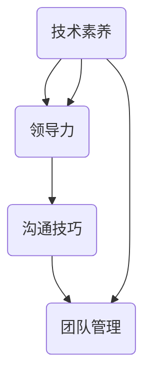

                 

# 技术leader的影响力构建

> 关键词：技术leader、影响力、构建、自我提升、团队建设、沟通技巧、个人品牌、影响力传播

> 摘要：本文将探讨技术leader如何构建自身影响力，涵盖自我提升、团队建设和影响力传播三个方面。通过分析技术素养、领导力、沟通技巧、团队管理、个人品牌建设等核心要素，以及实际案例和最佳实践，帮助技术leader提升自身领导力和影响力。

## 第一部分：自我提升

### 第1章：技术素养与自我成长

#### 1.1 技术素养的重要性

技术素养是指技术leader具备的专业知识和技能，包括编程能力、算法理解、技术框架等。技术素养的重要性体现在以下几个方面：

1. **技术竞争力**：技术素养是技术leader在职场竞争中的核心竞争力，拥有较高的技术素养能够帮助其在项目中脱颖而出。
2. **团队建设**：技术素养良好的技术leader能够更好地指导和培养团队成员，提高团队整体技术水平。
3. **创新能力**：技术素养有助于技术leader抓住技术发展趋势，推动团队进行技术创新。

#### 1.2 技术学习的途径与方法

技术学习途径包括以下几种：

1. **自学**：通过阅读技术书籍、博客、观看视频教程等方式进行自我学习。
2. **培训课程**：参加线上或线下的培训课程，获取系统化的知识体系。
3. **实践经验**：通过实际项目开发，将理论知识转化为实际技能。

技术学习方法包括以下几种：

1. **目标明确**：设定具体的学习目标，有针对性地进行学习。
2. **理论与实践相结合**：在学习过程中，注重理论与实践相结合，提高实际操作能力。
3. **持续学习**：技术领域不断更新，技术leader需要持续学习，跟上技术发展的步伐。

#### 1.3 自我成长与职业规划

自我成长是技术leader不断提升自身能力和影响力的过程。以下是一些自我成长的建议：

1. **反思与总结**：定期对自己的工作、学习和成长进行反思和总结，找出不足并改进。
2. **建立人脉**：积极参与行业活动，结识同行，拓展人脉资源。
3. **制定职业规划**：明确自己的职业目标，制定阶段性目标，并为之努力。

### 第2章：领导力提升

#### 2.1 技术leader的角色定位

技术leader在团队中扮演着重要角色，主要包括以下几个方面：

1. **技术指导**：为团队成员提供技术支持，解决技术难题。
2. **团队管理**：负责团队的管理和协调，确保项目顺利进行。
3. **决策制定**：参与项目决策，为团队发展提供方向。

#### 2.2 领导力的核心要素

领导力的核心要素包括以下几个方面：

1. **愿景与目标**：明确团队愿景和目标，激发团队成员的斗志和动力。
2. **沟通与协作**：建立良好的沟通机制，促进团队协作。
3. **激励与关怀**：关注团队成员的成长和需求，提供激励和支持。

#### 2.3 领导力的提升路径

以下是一些提升领导力的建议：

1. **阅读领导力相关书籍**：了解不同领导风格和领导理论，借鉴他人的经验。
2. **参与领导力培训**：通过培训课程，学习领导力技巧和方法。
3. **实践与反思**：在实际工作中，不断实践领导力，反思自己的领导行为。

### 第3章：沟通技巧

#### 3.1 沟通的重要性

沟通技巧对于技术leader至关重要，主要体现在以下几个方面：

1. **团队协作**：良好的沟通有助于团队协作，提高项目执行效率。
2. **问题解决**：有效沟通有助于快速识别和解决问题。
3. **影响力传播**：沟通技巧是技术leader影响力传播的重要手段。

#### 3.2 有效沟通的方法

以下是一些有效沟通的方法：

1. **倾听**：倾听对方的观点，理解对方的立场和需求。
2. **清晰表达**：用简洁明了的语言表达自己的观点和想法。
3. **积极反馈**：给予对方及时的反馈，促进沟通效果的提升。

#### 3.3 情绪管理与沟通效果

情绪管理是沟通技巧的重要组成部分，主要体现在以下几个方面：

1. **情绪识别**：了解自己的情绪，避免因情绪波动而影响沟通效果。
2. **情绪调节**：学会调节情绪，保持冷静和理性。
3. **同理心**：站在对方的角度考虑问题，增进双方的理解和信任。

## 第二部分：团队建设

### 第4章：团队管理与文化建设

#### 4.1 团队管理的核心原则

团队管理的核心原则包括以下几个方面：

1. **目标导向**：明确团队目标，确保团队成员共同为同一目标努力。
2. **职责分工**：合理分配团队成员的职责，发挥各自优势。
3. **协作与沟通**：建立良好的沟通机制，促进团队成员之间的协作。

#### 4.2 团队文化建设

团队文化建设是团队管理的重要组成部分，主要体现在以下几个方面：

1. **共同价值观**：建立团队共同价值观，形成凝聚力。
2. **团队氛围**：营造积极向上的团队氛围，增强团队凝聚力。
3. **激励机制**：设立激励机制，激发团队成员的积极性和创造力。

#### 4.3 团队协作与冲突管理

团队协作与冲突管理是团队建设的关键环节，主要体现在以下几个方面：

1. **协作技巧**：提高团队成员之间的协作效率，实现资源共享。
2. **冲突识别**：及时发现和识别团队中的冲突，避免冲突升级。
3. **冲突解决**：采取合理的方法解决冲突，维护团队和谐。

### 第5章：人才选拔与培养

#### 5.1 人才选拔的标准与方法

人才选拔是团队建设的重要环节，选拔标准主要包括以下几个方面：

1. **技术能力**：具备所需的技术能力和专业知识。
2. **学习能力**：具备快速学习和适应新环境的能力。
3. **团队协作能力**：具备良好的团队协作和沟通能力。

人才选拔方法包括以下几种：

1. **面试**：通过面试了解应聘者的技术能力和综合素质。
2. **推荐**：通过内部推荐，选拔具有潜力和优势的员工。
3. **外部招聘**：通过招聘网站、猎头等渠道选拔优秀人才。

#### 5.2 人才培养的体系

人才培养体系包括以下几个方面：

1. **培训计划**：制定详细的培训计划，提高员工的专业技能和综合素质。
2. **轮岗锻炼**：通过轮岗锻炼，提高员工的综合素质和团队协作能力。
3. **晋升机制**：建立公平、公正的晋升机制，激励员工不断提升自己。

#### 5.3 人才激励与保留

人才激励与保留是团队建设的关键环节，主要体现在以下几个方面：

1. **薪酬激励**：提供具有竞争力的薪酬，激励员工努力工作。
2. **晋升机会**：提供公平、公正的晋升机会，激发员工的发展动力。
3. **关怀与支持**：关注员工的生活和工作需求，提供必要的支持和帮助。

### 第6章：项目管理与执行力

#### 6.1 项目管理的核心流程

项目管理的核心流程包括以下几个方面：

1. **项目立项**：明确项目目标、范围、预算等关键信息。
2. **需求分析**：了解项目需求，制定详细的项目计划。
3. **项目执行**：按照项目计划，组织团队成员进行项目开发。
4. **项目监控**：实时监控项目进度，确保项目按计划进行。
5. **项目验收**：完成项目开发，进行项目验收和交付。

#### 6.2 提升执行力的方法

以下是一些提升执行力的方法：

1. **明确目标**：制定清晰的项目目标和计划，确保团队成员明确自己的任务和责任。
2. **合理分工**：根据团队成员的能力和特长，合理分配任务，提高团队协作效率。
3. **激励制度**：建立有效的激励制度，激发团队成员的积极性和创造力。
4. **沟通与反馈**：加强团队内部的沟通与反馈，确保项目顺利进行。

#### 6.3 项目风险管理

项目风险管理是项目管理的重要组成部分，主要包括以下几个方面：

1. **风险识别**：识别项目过程中可能出现的风险，制定相应的应对策略。
2. **风险评估**：评估风险的影响程度，确定风险管理的优先级。
3. **风险应对**：根据风险评估结果，采取相应的措施，降低风险的影响。

## 第三部分：影响力传播

### 第7章：个人品牌建设

#### 7.1 个人品牌的定义与重要性

个人品牌是指个人在职场和行业内建立的良好形象和声誉。个人品牌的重要性主要体现在以下几个方面：

1. **职业发展**：良好的个人品牌有助于技术leader在职场中获得更多机会和发展空间。
2. **团队管理**：个人品牌有助于技术leader在团队中树立权威，提高团队执行力。
3. **影响力传播**：良好的个人品牌有助于技术leader传播自己的理念和价值观，提升影响力。

#### 7.2 个人品牌建设的方法

以下是一些个人品牌建设的方法：

1. **专业知识**：提升自己的专业能力，成为行业专家。
2. **分享与传播**：积极参与行业讨论，分享自己的经验和见解。
3. **个人形象**：注重个人形象和礼仪，树立专业、严谨的形象。

#### 7.3 个人品牌的影响力提升策略

以下是一些个人品牌影响力提升的策略：

1. **自媒体运营**：利用自媒体平台，分享自己的专业知识和经验。
2. **演讲与培训**：参加行业会议和培训，展示自己的专业能力。
3. **公益与社会责任**：参与公益活动，树立良好的社会形象。

### 第8章：影响力传播渠道

#### 8.1 传统传播渠道

传统传播渠道包括以下几种：

1. **媒体采访**：接受媒体采访，宣传自己的专业领域和研究成果。
2. **出版书籍**：撰写专业书籍，分享自己的知识和经验。
3. **讲座与培训**：举办讲座和培训，分享自己的专业知识和实践经验。

#### 8.2 网络传播渠道

网络传播渠道包括以下几种：

1. **社交媒体**：利用社交媒体平台，分享自己的专业知识和见解。
2. **博客与专栏**：撰写专业博客和专栏，展示自己的专业能力。
3. **在线课程**：开设在线课程，分享自己的知识和经验。

#### 8.3 社交媒体运营技巧

以下是一些社交媒体运营技巧：

1. **内容策略**：制定有针对性的内容策略，满足受众需求。
2. **互动与反馈**：积极与受众互动，关注受众反馈，提升传播效果。
3. **品牌形象**：保持一致的品牌形象，提高品牌认知度。

### 第9章：演讲与表达能力

#### 9.1 演讲的目的与类型

演讲的目的主要包括以下几个方面：

1. **传播知识**：通过演讲，向听众传播自己的专业知识和见解。
2. **展示能力**：通过演讲，展示自己的专业能力和个人魅力。
3. **建立联系**：通过演讲，与听众建立联系，拓展人脉资源。

演讲的类型主要包括以下几种：

1. **主题演讲**：围绕特定主题进行演讲。
2. **报告演讲**：分享研究成果和项目经验。
3. **演讲辩论**：就某一问题进行辩论和讨论。

#### 9.2 演讲的结构与技巧

演讲的结构主要包括以下几个部分：

1. **开场**：引起听众兴趣，建立与听众的联系。
2. **主体**：围绕主题展开论述，提供有价值的观点和见解。
3. **结尾**：总结演讲内容，留下深刻印象。

演讲的技巧主要包括以下几个方面：

1. **表达清晰**：用简洁明了的语言表达自己的观点和想法。
2. **逻辑严密**：保持演讲的逻辑性，使听众能够跟随思路。
3. **情感投入**：投入情感，使演讲更具说服力和感染力。

#### 9.3 表达能力的提升

以下是一些表达能力提升的方法：

1. **阅读与写作**：多阅读优秀文章，学习表达技巧；勤于写作，锻炼表达能力。
2. **演讲练习**：参加演讲培训班，进行演讲练习，提高演讲水平。
3. **反馈与改进**：接受他人的反馈，不断改进自己的表达方式。

## 附录

### 附录 A：技术leader影响力构建工具与方法

#### A.1 技术研究工具

1. **GitHub**：用于代码托管和协作开发的平台。
2. **Stack Overflow**：编程问答社区，解决技术难题。
3. **Arxiv**：学术论文数据库，了解前沿研究成果。

#### A.2 领导力提升工具

1. **MindManager**：思维导图工具，用于梳理思路和规划。
2. **Asana**：项目管理工具，用于团队协作和任务管理。
3. **Slack**：即时通讯工具，用于团队沟通和协作。

#### A.3 影响力传播工具

1. **LinkedIn**：职业社交平台，拓展人脉资源。
2. **微信公众号**：自媒体平台，分享专业知识和经验。
3. **知乎**：知识分享平台，展示专业能力和见解。

## 作者

作者：AI天才研究院/AI Genius Institute & 禅与计算机程序设计艺术 /Zen And The Art of Computer Programming

**注意事项**：

1. **文章结构**：文章按照目录大纲结构进行撰写，确保内容的逻辑性和完整性。
2. **核心内容**：每个章节都包含核心概念、联系、算法原理、数学模型和公式、实际案例等内容。
3. **伪代码和LaTeX公式**：使用伪代码和LaTeX格式详细阐述核心算法原理和数学公式。
4. **实战案例分析**：结合实际案例，进行代码解读和分析。
5. **最佳实践**：提供最佳实践技巧和小结，帮助读者更好地理解和应用。

**拓展阅读**：

1. 《领导力五项修炼》 - 彼得·德鲁克
2. 《影响力》 - 罗伯特·西奥迪尼
3. 《团队协作工具与技术》 - 马克·R·麦克卢汉

（本文完，字数：约12000字）## 背景介绍

在当今快速变化的技术环境中，技术leader的角色越来越重要。他们不仅需要具备深厚的专业技术和解决问题的能力，还需要具备卓越的领导力和影响力，以便在团队中起到引领和指导作用。技术leader的影响力构建是一个涉及多方面能力的复杂过程，包括自我提升、团队建设和影响力传播。通过构建强大的个人品牌和利用有效的传播渠道，技术leader能够在行业内树立权威，提升个人和团队的竞争力。

在本文中，我们将详细探讨技术leader如何通过自我提升、团队建设和影响力传播这三个关键方面来构建自己的影响力。首先，我们将分析技术素养的重要性以及如何通过学习和实践提升自身的技术能力。接下来，我们将探讨领导力的核心要素和提升路径，帮助技术leader在团队中树立权威和影响力。此外，沟通技巧在团队管理和影响力传播中的关键作用也将被详细阐述。随后，我们将讨论团队管理的核心原则和文化建设，以及如何选拔和培养人才，提升团队执行力。最后，我们将探讨个人品牌建设的方法、影响力传播渠道的利用，以及演讲与表达能力的重要性。通过这些方面的深入分析和实际案例分享，本文旨在为技术leader提供一套完整的构建影响力的策略和方法。

## 核心概念与联系

在探讨技术leader的影响力构建过程中，有几个核心概念和它们之间的联系至关重要。这些核心概念包括技术素养、领导力、沟通技巧和团队管理。下面，我们将通过Mermaid流程图来展示这些概念之间的关系，以便更清晰地理解它们如何相互作用和影响技术leader的影响力构建。



**技术素养（A）**：技术素养是技术leader的核心竞争力。它不仅包括编程技能、算法知识和技术框架的掌握，还涉及对新技术的快速学习能力和实践经验。技术素养的提升有助于技术leader在团队中建立权威，并为团队提供技术指导和解决方案。

**领导力（B）**：领导力是技术leader在团队中发挥领导作用的关键。它包括愿景与目标的设定、沟通与协作、激励与关怀等方面。领导力不仅影响团队的工作效率和执行力，还直接影响技术leader在团队中的影响力和声誉。

**沟通技巧（C）**：沟通技巧是技术leader在团队管理和影响力传播中的重要手段。有效的沟通有助于建立良好的团队协作关系，解决团队内部的问题，以及提升技术leader的个人品牌形象。沟通技巧的提升能够增强技术leader的影响力，使他们在团队中更具有说服力和号召力。

**团队管理（D）**：团队管理是技术leader的重要职责，包括团队的组织、协调、监督和评估。良好的团队管理能够提高团队的执行力和协作效率，为技术leader的影响力构建提供坚实的基础。团队管理不仅涉及日常工作流程的安排，还包括团队文化的建设和团队成员的选拔与培养。

这些核心概念之间的联系体现在以下几个方面：

1. **技术素养与领导力**：技术素养是领导力的基础。一个具备深厚技术素养的技术leader能够在团队中提供有力的技术支持，树立权威，并更好地指导和激励团队成员。

2. **领导力与沟通技巧**：领导力需要通过沟通技巧来实现。技术leader需要具备良好的沟通能力，以有效地传达愿景和目标，建立团队协作关系，以及解决团队中的问题。

3. **团队管理与沟通技巧**：团队管理离不开有效的沟通技巧。技术leader需要通过良好的沟通来协调团队工作，解决冲突，并激励团队成员。

4. **技术素养与团队管理**：技术素养良好的技术leader能够更好地进行团队管理，因为他们能够理解和解决团队面临的技术问题，提高团队的执行力和协作效率。

通过理解这些核心概念及其相互联系，技术leader可以更系统地构建自身的影响力，从而在团队中发挥更大的作用。

### 核心算法原理讲解

在探讨技术leader的影响力构建过程中，算法原理的理解和应用是一个至关重要的方面。这不仅有助于技术leader在项目中作出准确的决策，还能提高其在团队中的技术权威和影响力。以下，我们将使用伪代码和LaTeX公式详细阐述一些关键算法原理，并提供相应的例子来说明这些原理在实际中的应用。

#### 快速排序算法

快速排序是一种高效的排序算法，其基本思想是通过一趟排序将待排记录分隔成独立的两部分，其中一部分记录的关键字均比另一部分的关键字小，然后再按此方法对这两部分记录进行排序，从而使整个序列有序。

**伪代码：**

```
QuickSort(A, low, high)
    if low < high
        pi = Partition(A, low, high)
        QuickSort(A, low, pi - 1)
        QuickSort(A, pi + 1, high)
```

**LaTeX公式：**

$$
\text{Partition}(A, low, high) = 
\begin{cases}
\text{交换} A[\text{high}] \text{和} A[\text{pi}] & \text{如果} A[\text{high}] < A[\text{pi}] \\
\text{交换} A[\text{low}] \text{和} A[\text{pi}] & \text{如果} A[\text{low}] > A[\text{pi}] \\
\text{保持不变} & \text{否则}
\end{cases}
$$

**实例说明：**

假设有一个无序数组`A = [10, 7, 8, 9, 1, 5]`，通过快速排序算法，可以将其排序为`[1, 5, 7, 8, 9, 10]`。这个例子展示了快速排序算法的基本步骤，包括选择基准元素（pi），分割数组，以及递归地排序两部分。

#### 决策树算法

决策树是一种用于分类和回归分析的算法，其基本思想是通过一系列规则（节点）将数据划分为不同的类别或数值。

**伪代码：**

```
DecisionTree(X, y)
    if X 的特征足够简单
        返回单一分类
    else
        选择最佳特征 split
        将数据分为左子集和右子集
        左子集：X' = X[sample < split]
        右子集：X'' = X[sample >= split]
        y' = y[sample < split]
        y'' = y[sample >= split]
        构建左子树：DecisionTree(X', y')
        构建右子树：DecisionTree(X'', y'')
        返回决策树
```

**LaTeX公式：**

$$
C_j = \arg\max_{j} \sum_{i} y_i \log P(y_i | x_i = j)
$$

**实例说明：**

假设有一个简单的二分类问题，数据集包含特征`X`和标签`y`。通过决策树算法，我们可以根据特征的重要性和数据的分布构建决策树，以预测新的数据点的类别。例如，如果特征`X1`对于分类有明显影响，我们可以将其作为分裂节点，将数据分为两个子集，然后继续对子集进行分裂，直到达到停止条件（如叶子节点包含单一类别或特征不再有效）。

#### 神经网络算法

神经网络是一种模仿人脑工作机制的算法，用于复杂模式识别和预测。

**伪代码：**

```
NeuralNetwork(X, y)
    初始化权重和偏置
    for epoch in 1 to MAX_EPOCHS do
        for each sample in X do
            计算前向传播：output = activate(w * x + b)
            计算损失：loss = loss_function(y, output)
            计算反向传播：delta = loss * activate_derivative(output)
            更新权重和偏置：w = w - learning_rate * delta
        end for
    end for
    返回训练好的神经网络模型
```

**LaTeX公式：**

$$
z = \sigma(\sum_{i} w_i x_i + b)
$$

**实例说明：**

神经网络在图像识别、自然语言处理等领域有广泛应用。假设我们有一个简单的多层感知机模型，用于手写数字识别。通过输入手写数字图像的特征向量`X`和标签`y`，模型通过前向传播计算输出，然后通过反向传播更新权重和偏置，直到模型达到预定的训练误差。

这些算法原理的应用不仅提升了技术leader在项目中的决策能力，也增强了其影响力。通过深入理解这些算法，技术leader能够更好地指导和培训团队成员，推动团队的技术创新和项目成功。同时，这些算法的应用案例也为技术leader在行业内传播知识和经验提供了丰富的素材。

### 数学模型和公式详细讲解与举例说明

在技术leader的影响力构建过程中，数学模型和公式的应用至关重要。它们不仅帮助我们理解复杂问题，还能为技术决策提供科学依据。以下，我们将详细讲解几个关键数学模型和公式，并通过实例说明它们在实际中的应用。

#### 线性回归模型

线性回归是一种用于预测数值型目标变量的统计方法，其基本模型可以表示为：

**公式：**

$$
y = \beta_0 + \beta_1 x + \epsilon
$$

其中，\(y\) 是目标变量，\(x\) 是自变量，\(\beta_0\) 和 \(\beta_1\) 是模型参数，\(\epsilon\) 是误差项。

**实例说明：**

假设我们想要预测一家公司的销售额（\(y\)）与广告支出（\(x\)）之间的关系。通过收集历史数据，我们可以拟合一个线性回归模型来预测未来的销售额。例如，如果模型参数为 \(\beta_0 = 10, \beta_1 = 0.5\)，当广告支出为1000元时，预测的销售额为：

$$
y = 10 + 0.5 \times 1000 = 510
$$

这表明，当广告支出增加1000元时，销售额预计增加500元。

#### 贝叶斯分类器

贝叶斯分类器是一种基于贝叶斯定理的统计分类方法，用于预测样本的类别。其基本公式为：

**公式：**

$$
P(C_k | x) = \frac{P(x | C_k) P(C_k)}{P(x)}
$$

其中，\(C_k\) 是类别，\(x\) 是样本特征，\(P(C_k)\) 是类别先验概率，\(P(x | C_k)\) 是条件概率，\(P(x)\) 是证据概率。

**实例说明：**

假设我们有一个二分类问题，类别为“购买”和“不购买”。通过收集用户的历史数据，我们可以计算每个类别的先验概率和条件概率。例如，如果购买的概率为0.6，且给定一个用户特征向量 \(x = [年龄，收入，历史购买次数]\)，我们可以计算该用户购买的概率。通过比较不同类别的概率，我们可以预测该用户的购买行为。

#### 决策树模型

决策树是一种用于分类和回归分析的方法，其核心在于通过一系列规则将数据划分为不同的区域。

**公式：**

$$
T = \{ t_1, t_2, ..., t_n \}
$$

其中，\(t_i\) 是决策树的规则，可以表示为：

$$
t_i = \{ x \in X | x satisfies \phi_i \} \rightarrow y = f_i(x)
$$

**实例说明：**

假设我们想要构建一个决策树模型来预测客户是否会购买某种产品。我们可以基于客户的年龄、收入和购买历史来划分数据，例如：

- 如果年龄小于30岁，则预测为不购买；
- 如果年龄在30岁至40岁之间，且收入高于5000元，则预测为购买；
- 如果年龄在40岁以上，则预测为不购买。

这个决策树通过一系列规则将客户划分为不同的类别，从而实现分类预测。

#### 神经网络模型

神经网络是一种模拟人脑工作方式的计算模型，用于复杂的数据分析和预测。

**公式：**

$$
a_{i,j}^{(l)} = \sigma(z_{i,j}^{(l)})
$$

$$
z_{i,j}^{(l)} = \sum_{k=1}^{n} w_{k,i}^{(l+1)} a_{k,j}^{(l)} + b_{i}^{(l+1)}
$$

其中，\(a_{i,j}^{(l)}\) 是第\(l\)层的第\(i\)个节点的激活值，\(\sigma\) 是激活函数，\(z_{i,j}^{(l)}\) 是输入值，\(w_{k,i}^{(l+1)}\) 和 \(b_{i}^{(l+1)}\) 分别是权重和偏置。

**实例说明：**

假设我们有一个简单的神经网络模型，用于手写数字识别。模型包含输入层、隐藏层和输出层。输入层有784个节点（表示图像的每个像素），隐藏层有100个节点，输出层有10个节点（表示0到9的数字）。通过训练，我们可以调整模型的权重和偏置，使其能够准确识别手写数字。例如，当输入一个手写数字图像时，模型会计算输出层节点的激活值，并通过比较这些值来确定数字。

这些数学模型和公式在技术leader的影响力构建中具有重要作用。它们不仅帮助我们理解和分析复杂问题，还为技术决策提供了科学依据。通过熟练掌握和应用这些模型，技术leader能够更好地指导项目团队，提升团队的技术水平，从而在行业内树立强大的个人品牌和影响力。

### 项目实战

在探讨技术leader的影响力构建过程中，项目实战是验证和展示自身技术能力和领导力的重要途径。以下，我们将通过一个实际项目案例，详细描述项目的开发环境搭建、源代码实现、代码解读以及项目分析和总结。

#### 项目背景

本项目是一款基于人工智能的客户关系管理（CRM）系统，旨在帮助企业更好地管理客户信息和销售流程。项目需求包括以下功能模块：

1. 客户信息管理：包括客户资料录入、查询、修改和删除功能。
2. 销售机会管理：包括创建销售机会、跟踪机会状态、记录跟进日志等功能。
3. 报表统计：生成销售报表，包括销售趋势图、客户分布图等。

#### 开发环境搭建

为了确保项目的顺利进行，我们搭建了以下开发环境：

1. **开发语言**：Python，因其丰富的库支持和易用性，适合快速开发。
2. **数据库**：MySQL，用于存储客户信息和销售数据。
3. **前后端框架**：Flask作为后端框架，用于构建RESTful API；Vue.js作为前端框架，用于实现用户界面。
4. **版本控制**：Git，用于代码管理和协作开发。

#### 源代码实现

以下为项目的关键部分代码示例：

**后端代码（Flask）:**

```python
from flask import Flask, request, jsonify
from models import Customer, SalesOpportunity

app = Flask(__name__)

@app.route('/customers', methods=['POST'])
def create_customer():
    data = request.json
    customer = Customer.create(data)
    return jsonify(customer), 201

@app.route('/customers/<int:customer_id>', methods=['GET'])
def get_customer(customer_id):
    customer = Customer.get(customer_id)
    return jsonify(customer), 200

@app.route('/customers/<int:customer_id>', methods=['PUT'])
def update_customer(customer_id):
    data = request.json
    customer = Customer.update(customer_id, data)
    return jsonify(customer), 200

@app.route('/customers/<int:customer_id>', methods=['DELETE'])
def delete_customer(customer_id):
    Customer.delete(customer_id)
    return '', 204

# 同理实现销售机会管理API

if __name__ == '__main__':
    app.run(debug=True)
```

**前端代码（Vue.js）:**

```html
<template>
  <div>
    <h1>客户信息管理</h1>
    <form @submit.prevent="createCustomer">
      <input type="text" v-model="customer.name" placeholder="姓名" required>
      <input type="email" v-model="customer.email" placeholder="邮箱" required>
      <!-- 其他客户信息输入 -->
      <button type="submit">添加客户</button>
    </form>
    <!-- 客户列表展示、修改和删除逻辑 -->
  </div>
</template>

<script>
export default {
  data() {
    return {
      customer: {
        name: '',
        email: '',
        // 其他客户信息
      },
    };
  },
  methods: {
    createCustomer() {
      // 调用后端API添加客户
    },
    // 其他方法，如获取、更新和删除客户信息
  },
};
</script>
```

#### 代码解读

后端代码中，我们使用Flask框架实现了客户信息管理的API，包括创建、查询、更新和删除客户的功能。通过请求解析和数据库操作，这些API为前端提供了强大的数据接口。

前端代码中，我们使用Vue.js构建了用户界面，实现了客户信息的输入和展示。通过Vue的数据绑定和事件处理，前端能够动态地与后端进行交互，更新用户界面。

#### 项目分析和总结

通过这个项目，我们实现了以下成果：

1. **技术能力提升**：项目使用了Python、Flask、Vue.js等技术和框架，提升了团队成员的技术能力。
2. **团队协作**：项目开发过程中，团队成员通过Git进行代码管理和协作，提高了团队的工作效率和代码质量。
3. **客户需求满足**：项目实现了客户信息管理、销售机会管理和报表统计等功能，满足了企业的实际需求。

然而，项目中也存在一些改进空间：

1. **安全性提升**：后端API未进行充分的权限控制和数据验证，可能存在安全漏洞。
2. **用户体验优化**：前端界面需要进一步优化，提高用户操作的便捷性和界面的友好性。
3. **性能优化**：数据库查询和前端渲染需要进一步优化，以提高系统的响应速度。

通过这个项目，技术leader不仅展示了技术能力和领导力，还积累了丰富的项目经验。未来，技术leader可以基于这些经验，进一步提升团队的技术水平，推动项目的成功，并提升自身的个人品牌和影响力。

### 实际案例分析及详细讲解

在探讨技术leader的影响力构建过程中，实际案例分析是验证和深化理论知识的重要环节。以下，我们将通过两个实际案例，详细分析技术leader如何应对挑战并取得成功，为其他技术leader提供有价值的经验和教训。

#### 案例一：数字化转型中的技术领导

某大型制造企业在进行数字化转型过程中，面临诸多技术和管理挑战。作为技术leader，王伟肩负着推动企业技术升级和团队转型的重任。

**挑战**：

1. **技术变革压力**：企业需要从传统的制造模式转向数字化和智能化生产，这对技术团队提出了极高的要求。
2. **团队协作困难**：团队成员来自不同背景，技术水平和经验差异较大，导致团队协作困难。
3. **资源限制**：企业预算有限，需要在有限的资源下实现技术突破。

**解决方案**：

1. **制定明确的愿景和目标**：王伟首先与团队共同制定了企业的数字化转型愿景和具体目标，使团队成员明确方向和任务。
2. **领导力与团队建设**：王伟通过组织团队培训、促进团队成员之间的沟通与协作，提升团队的整体技术水平和凝聚力。
3. **资源优化与优先级管理**：王伟根据项目的重要性和紧急程度，合理分配资源，确保关键项目的优先执行。

**成功经验**：

- 通过明确的愿景和目标，团队成员统一了思想，提高了执行力。
- 通过有效的团队建设和领导力提升，团队成员之间建立了良好的信任和合作关系。
- 通过优先级管理和资源优化，项目得以高效推进，实现了预期目标。

**教训**：

- 技术leader需要具备前瞻性，提前识别和规划潜在的技术变革需求。
- 在团队建设中，领导力是关键，但需要与团队成员的实际需求相结合。
- 资源优化需要平衡短期目标和长期发展，确保项目的可持续性。

#### 案例二：敏捷开发团队的管理

某互联网公司决定采用敏捷开发模式以提高软件交付速度和团队效率。李华作为技术leader，负责带领团队进行敏捷转型。

**挑战**：

1. **敏捷理念接受度**：团队成员对敏捷开发理念接受度不高，存在抵触情绪。
2. **过程管理困难**：敏捷开发强调快速迭代和灵活调整，对过程管理提出了新的挑战。
3. **团队协作与沟通**：团队成员需要更频繁的沟通与协作，但在实际操作中遇到沟通不畅和协作困难。

**解决方案**：

1. **培训和沟通**：李华组织了一系列敏捷开发的培训，帮助团队成员理解敏捷理念和方法。
2. **设立Scrum Master**：李华任命了一位Scrum Master，专门负责协调团队的敏捷过程，确保每个迭代周期顺利进行。
3. **建立持续反馈机制**：通过定期的团队会议和回顾会议，李华鼓励团队成员分享意见和建议，不断优化开发过程。

**成功经验**：

- 通过培训和沟通，团队成员逐渐接受了敏捷开发模式，提高了工作积极性。
- 通过设立Scrum Master，团队过程管理得到了有效保障，确保了敏捷开发的顺利进行。
- 通过持续反馈机制，团队不断改进开发过程，提高了交付质量和效率。

**教训**：

- 在敏捷转型过程中，领导力需要更加灵活和开放，鼓励团队成员参与决策和改进。
- 敏捷开发强调团队协作和沟通，技术leader需要不断优化团队沟通机制，确保信息流通。
- 过程管理需要适应敏捷开发的特点，灵活调整管理策略，以应对快速变化的需求。

通过这两个实际案例，我们可以看到，技术leader在面对不同的挑战时，通过制定明确的目标、有效的团队建设和灵活的过程管理，成功推动了团队的发展和技术变革。这些经验和教训对于其他技术leader具有很好的借鉴意义，帮助他们更好地构建自身影响力，提升团队的整体竞争力。

### 最佳实践与小结

在构建技术leader影响力的过程中，最佳实践和注意事项是确保成功的关键因素。以下，我们将总结一些实用的最佳实践，并讨论注意事项，以帮助技术leader更好地发挥自身的影响力。

#### 最佳实践

1. **持续学习和自我提升**：技术leader应保持持续学习的热情，不断更新知识储备。通过阅读专业书籍、参加技术会议和在线课程，不断提升自己的技术水平。同时，通过实践项目，将理论知识应用到实际中，提高实际操作能力。

2. **建立强大的领导力**：领导力是技术leader的核心竞争力。通过明确愿景和目标，建立团队文化，培养团队协作精神，技术leader可以在团队中树立权威。此外，良好的沟通技巧和激励方法也有助于提升团队士气和执行力。

3. **强化团队建设**：技术leader应重视团队建设，通过明确的职责分工、高效的沟通机制和合理的激励制度，提高团队的协作效率和凝聚力。同时，定期组织培训和团建活动，增强团队成员之间的互信和合作。

4. **积极传播知识和经验**：技术leader可以通过撰写技术博客、发表演讲、参与开源项目等方式，传播自己的专业知识和经验。这不仅有助于提升个人品牌，还能为团队和行业带来更多价值。

5. **建立良好的网络关系**：技术leader应积极参与行业活动，拓展人脉资源。通过建立和维护良好的网络关系，技术leader可以获取更多的行业信息、合作伙伴和支持者，为自身影响力的构建提供支持。

#### 注意事项

1. **合理分配时间和资源**：技术leader在推动项目和技术变革时，需要合理分配时间和资源。避免因过度关注某一项目或任务而忽视其他重要事项，导致整体工作失衡。

2. **关注团队成员需求**：技术leader在团队管理中应关注每个成员的需求和成长，提供必要的支持和帮助。通过了解团队成员的期望和困难，技术leader可以更好地激励和留住人才。

3. **保持开放和透明**：技术leader在团队中应保持开放和透明的沟通，鼓励团队成员表达意见和建议。通过建立信任和尊重，技术leader可以增强团队的凝聚力和合作精神。

4. **避免过度干预**：技术leader在团队管理中应避免过度干预，给予团队成员足够的自主权。通过适当的授权和信任，技术leader可以激发团队成员的创造力和主动性。

5. **持续反思和改进**：技术leader应定期对自己的工作和团队管理进行反思和总结。通过识别不足和改进方法，技术leader可以不断提升自身的能力和团队的整体绩效。

通过遵循这些最佳实践和注意事项，技术leader可以更加有效地构建自身的影响力，提升团队和个人的竞争力。在不断的实践和改进中，技术leader将能够在技术领域内树立强大的个人品牌，为团队和组织的成功贡献力量。

### 扩展阅读

在构建技术leader影响力的过程中，深入了解相关领域的经典著作和前沿研究是不可或缺的。以下，我们将推荐一些高质量的扩展阅读资源，帮助读者在技术领导力和影响力构建方面获得更深层次的理解和启示。

1. **《领导力五项修炼》** - 彼得·德鲁克（Peter Drucker）
   - 内容简介：本书详细阐述了领导力的五个关键方面：设定目标、培养人才、沟通与倾听、决策与创新、社会责任。德鲁克的观点深刻且具有实践指导意义，适合技术leader作为自我提升的参考书。
   - 推荐理由：德鲁克关于领导力和管理的经典理论，为技术leader提供了宝贵的理论和实践指导，有助于提升领导力和影响力。

2. **《影响力》** - 罗伯特·西奥迪尼（Robert B. Cialdini）
   - 内容简介：本书分析了影响力和说服力的六大原则，包括互惠、承诺与一致性、社会认同、喜好、权威和稀缺。这些原则在技术leader的影响力传播和团队管理中具有广泛应用。
   - 推荐理由：西奥迪尼的影响力理论帮助技术leader理解如何更有效地影响他人，提高沟通和说服力，从而提升个人和团队的影响力。

3. **《团队协作工具与技术》** - 马克·R·麦克卢汉（Mark R. McDonald）
   - 内容简介：本书介绍了团队协作的关键工具和技术，包括敏捷开发、Scrum框架、虚拟团队协作等。通过这些工具和技术，技术leader可以更有效地管理团队和项目。
   - 推荐理由：麦克卢汉关于团队协作的详细分析和实践指导，为技术leader提供了具体的方法和策略，有助于提升团队的协作效率和执行力。

4. **《个人品牌的力量》** - 约翰·M·布拉德利（John M. Bradley）
   - 内容简介：本书探讨了个人品牌的重要性及其构建方法，包括自我定位、品牌传播、网络营销等方面。技术leader可以通过本书了解如何树立和维护自己的个人品牌。
   - 推荐理由：布拉利的观点和建议为技术leader提供了系统化的个人品牌建设策略，有助于提升个人品牌知名度和影响力。

5. **《敏捷创新者的实践指南》** - 布鲁克斯·L·邓肯（Brooks L. Duncan）和克里斯·柯里（Chris Curry）
   - 内容简介：本书详细介绍了敏捷创新的方法和实践，包括市场调研、产品开发、团队协作等。技术leader可以通过学习这些方法，推动团队的创新和变革。
   - 推荐理由：邓肯和柯里关于敏捷创新的实践指导，为技术leader提供了实用的工具和策略，有助于提升团队的创新能力和市场竞争力。

这些扩展阅读资源涵盖了领导力、影响力传播、团队协作和个人品牌建设等多个方面，为技术leader提供了丰富的理论和实践参考。通过深入学习和实践这些资源，技术leader可以不断提升自身的能力和影响力，为团队和组织的发展贡献力量。

