                 

### 摘要

本文旨在探讨技术leader如何构建和提升自己的影响力。首先，我们将概述影响力的定义、类型及其在技术领导中的重要性。接着，本文将深入分析领导力与影响力之间的关系，并详细阐述如何提升个人领导力和技术能力。在此基础上，本文将探讨团队建设、沟通技巧和战略规划在构建影响力中的关键作用，并给出具体的方法和策略。此外，本文还将通过实际案例，展示技术leader在项目实战中的影响力构建过程。最后，本文将对未来趋势和挑战进行展望，为技术leader提供持续优化影响力的方向。通过系统性地介绍这些内容，本文旨在为技术leader提供全面、实用的构建影响力方法。

### 文章关键词

- 技术leader
- 影响力
- 领导力
- 团队建设
- 沟通技巧
- 战略规划
- 项目实战

### 第一部分：影响力构建基础

#### 第1章：影响力概述

影响力是技术leader在团队和项目中发挥关键作用的重要能力。它不仅仅是一个人的个人魅力，更是一种能够激励、引导和影响他人行为的综合能力。在技术领域，影响力可以体现在多个方面，如技术决策的制定、团队动力的激发、项目执行的效率提升等。

首先，我们需要明确影响力的定义和类型。影响力可以被定义为一种能够影响他人态度、行为和决策的能力。它可以分为三种主要类型：权威性影响、情感性影响和理性性影响。权威性影响基于技术leader的专业地位和决策权力；情感性影响则依赖于技术leader的人际关系和情感共鸣；理性性影响则通过逻辑分析和数据支持来影响他人。

在技术领导中，影响力的重要性不容忽视。技术leader的影响力可以影响团队的士气和动力，提升团队成员的技能水平和创新能力，以及确保项目目标的顺利实现。一个具有强大影响力的技术leader能够更好地协调团队成员之间的合作，解决冲突，并且在关键时刻做出正确的决策。

本文将从多个方面探讨技术leader如何提升自己的影响力，包括领导力、技术能力、团队建设、沟通技巧和战略规划等。通过这些方法，技术leader不仅可以提升个人的职业发展，更可以在团队和项目中发挥更大的作用，实现更高的绩效。

#### 核心概念与联系：领导力与影响力的关系

在技术领导中，领导力和影响力是两个密不可分的核心概念。领导力是指领导者通过激励、指导和影响他人来实现团队目标的能力。而影响力则是指领导者能够对团队成员的态度、行为和决策产生影响的程度。两者之间的关系可以理解为领导力是影响力的基础，而影响力则是领导力的外在表现。

首先，领导力是构建影响力的基础。一个具备强大领导力的技术leader能够通过清晰的目标设定、有效的激励策略和积极的团队管理来提升团队的整体效能。这种领导力不仅能够提高团队成员的工作热情和动力，还能增强团队成员对技术leader的信任和尊重，从而为影响力的构建奠定坚实的基础。

其次，影响力是领导力的重要体现。技术leader的影响力体现在他们能够影响团队成员的态度和行为，使其愿意跟随领导者的方向前进。这种影响可以通过权威性、情感性和理性性等方式实现。例如，技术leader通过专业的技术知识和卓越的决策能力来获得团队成员的尊重和信任，这就是权威性影响力；通过建立良好的人际关系和情感共鸣来激发团队成员的热情和动力，这是情感性影响力；通过逻辑分析和数据支持来说服团队成员接受某些决策或策略，这是理性性影响力。

此外，领导力和影响力之间还存在着相互作用和相互强化的关系。一个技术leader的领导力水平越高，他们的影响力通常也会越强。因为强大的领导力能够更好地激发团队成员的潜力，提升团队的整体表现，从而增强技术leader在团队中的影响力。反之，一个具有强大影响力但领导力不足的技术leader可能会面临团队管理和项目执行的困境。

总的来说，领导力和影响力是技术leader在团队和项目中取得成功的关键要素。领导力是影响力的基础，而影响力则是领导力的外在表现。通过不断提升领导力和影响力，技术leader可以更好地发挥自己的作用，推动团队和项目的成功。

#### Mermaid 流程图：领导力与影响力的关系

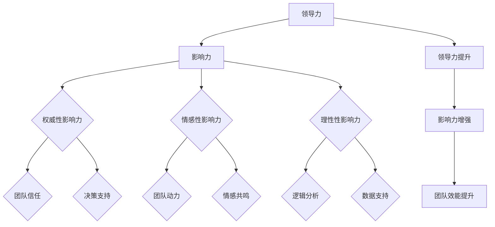

#### 第2章：领导力与影响力

领导力是技术leader的一项核心能力，它不仅决定了团队的整体效能，也直接影响了技术leader的影响力。领导力的本质在于通过激励、指导和影响他人，实现团队目标。一个强大的领导者不仅能够明确团队的方向，还能在关键时刻做出正确的决策，引导团队克服各种困难和挑战。

首先，领导力的核心要素包括：愿景、信任、激励、决策能力和沟通技巧。一个成功的领导者需要具备清晰的愿景，能够为团队指明前进的方向。同时，建立与团队成员之间的信任关系是领导力的基础。领导者应该通过透明的沟通和一致的行为，赢得团队成员的信任。

**愿景**

愿景是领导者为团队设定的长远目标和方向。一个明确的愿景能够激发团队成员的激情和动力，使团队在面临挑战时保持一致的目标和方向。领导者需要通过定期的沟通和共享，确保团队成员对愿景有清晰的理解和认同。

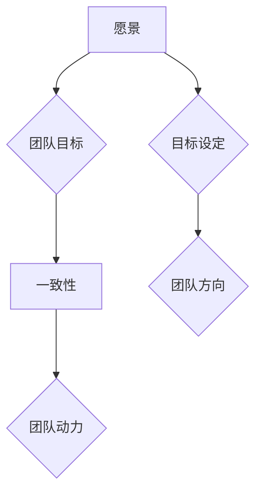

**信任**

信任是领导力的基石。一个缺乏信任的团队往往难以发挥出最佳效能。领导者需要通过透明、公正的行为来建立和维护与团队成员之间的信任。这包括在决策过程中保持开放性，尊重团队成员的意见，以及公平地处理团队中的问题。

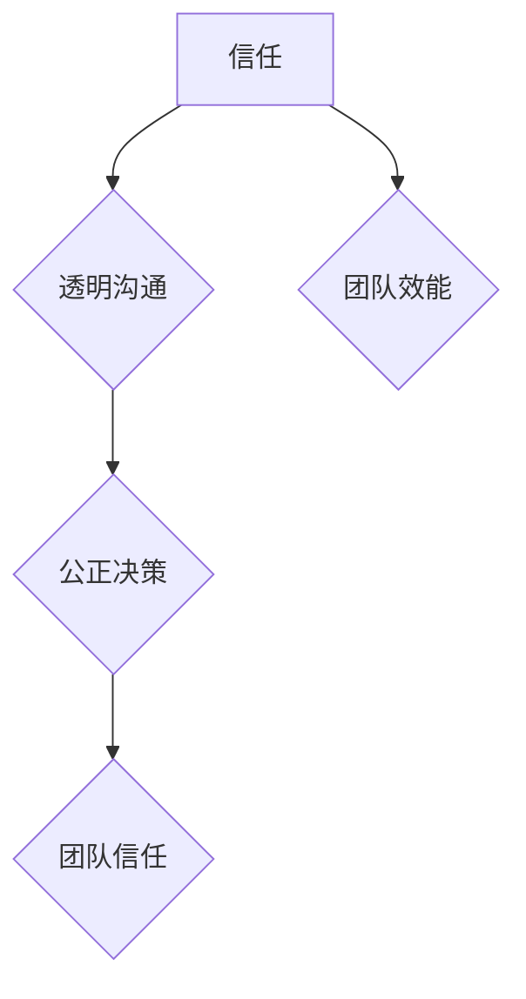

**激励**

激励是领导者激发团队成员潜力的重要手段。通过提供奖励、认可和成长机会，领导者可以激发团队成员的工作热情和动力。有效的激励策略能够增强团队的凝聚力，提升整体效能。

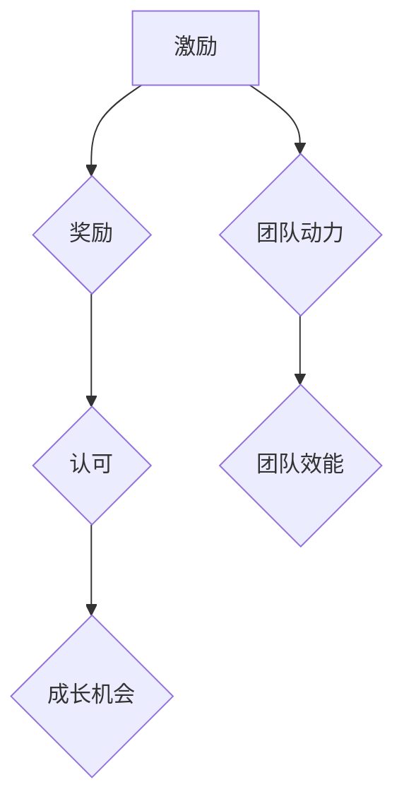

**决策能力**

决策能力是领导者的一项重要技能。在面对复杂多变的环境时，领导者需要能够快速做出明智的决策。强大的决策能力不仅能够帮助团队应对挑战，还能树立领导者的权威和信任。

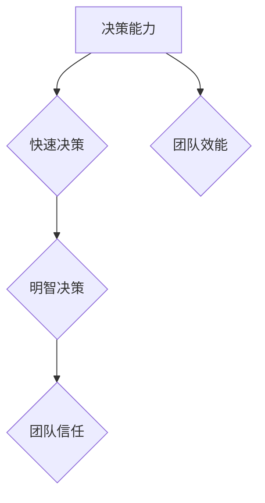

**沟通技巧**

有效的沟通技巧是领导者成功的关键。通过清晰、简洁、及时的沟通，领导者可以确保团队成员对项目的理解和目标有统一的认识，减少误解和冲突。

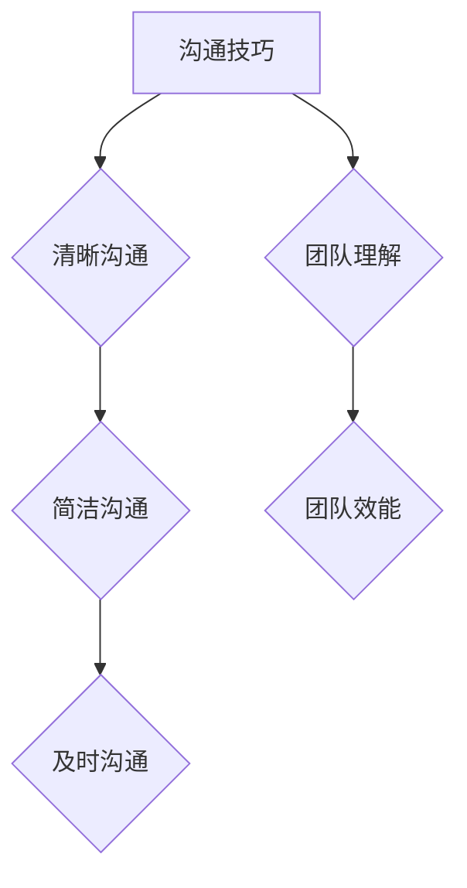

总的来说，领导力的核心要素不仅包括愿景、信任、激励、决策能力和沟通技巧，还包括对这些要素的综合运用。一个具备强大领导力的技术leader能够在团队中建立明确的愿景，建立与团队成员之间的信任，激励团队成员发挥潜力，做出明智的决策，并通过有效的沟通确保团队的一致性和效能。

#### 核心算法原理讲解：领导力的提升策略

为了提升领导力，技术leader可以采用一系列的策略和方法。以下是一些关键的核心算法原理，通过这些方法，技术leader可以逐步提升自身的领导力。

1. **目标设定与分解**

   目标设定是领导力的重要组成部分。领导者需要设定清晰的、可实现的团队目标，并将其分解为具体的、可操作的任务。这一过程可以采用以下步骤：

   ```mermaid
   graph TD
       A[设定目标] --> B{目标具体化}
       B --> C{目标分解}
       C --> D{任务分配}
       A --> E{反馈与调整}
   ```

   伪代码示例：

   ```python
   def set_goals(team_goals, task_details):
       # 具体化目标
       specific_goals = [make_specific(goal) for goal in team_goals]
       
       # 分解目标为任务
       tasks = [分解(goal) for goal in specific_goals]
       
       # 分配任务到团队成员
       assign_tasks_to_members(tasks)
       
       # 定期反馈与调整
       while not all_goals_met():
           feedback = get_feedback()
           adjust_goals(feedback)
   ```

2. **激励与认可系统**

   激励和认可系统是提升领导力的关键策略之一。通过设立奖励机制、提供认可和反馈，领导者可以激励团队成员的工作热情和积极性。以下是一个简化的伪代码示例：

   ```mermaid
   graph TD
       A[完成任务] --> B{获取奖励}
       B --> C{认可与反馈}
       C --> D{持续激励}
   ```

   伪代码示例：

   ```python
   def reward_and_recognition(completed_tasks, team_members):
       for task in completed_tasks:
           if task.is_completed():
               reward = get_reward(task)
               provide_recognition(task, team_members)
       
       # 定期提供反馈
       provide_feedback_to_members(team_members)
   ```

3. **持续学习与自我提升**

   领导力不仅依赖于现有的知识和技能，还需要通过持续学习和自我提升来保持竞争力。以下是一个简单的伪代码示例，用于描述领导者的学习和提升过程：

   ```mermaid
   graph TD
       A[学习新知识] --> B{技能提升}
       B --> C{经验积累}
       C --> D{领导力提升}
   ```

   伪代码示例：

   ```python
   def continuous_learning_and_improvement():
       while True:
           learn_new_knowledge()
           improve_skills()
           accumulate_experience()
           if is_leadership_improved():
               break
   ```

4. **有效沟通与反馈**

   沟通是领导力的重要组成部分。通过有效的沟通和反馈，领导者可以确保团队成员对项目有统一的理解，并能够及时解决问题。以下是一个简化的伪代码示例，用于描述沟通和反馈的过程：

   ```mermaid
   graph TD
       A[沟通与反馈] --> B{信息传递}
       B --> C{问题解决}
       C --> D{团队协调}
   ```

   伪代码示例：

   ```python
   def effective_communication_and_feedback():
       send_messages_to_members()
       while True:
           feedback = get_feedback()
           resolve_issues(feedback)
           if all_issues_resolved():
               break
   ```

通过以上核心算法原理的讲解，技术leader可以系统地提升自身的领导力。这些方法不仅提供了理论指导，还通过伪代码的形式展示了具体的实现步骤，帮助技术leader在实践中运用这些原则，逐步提升自己的领导能力。

#### 数学模型和数学公式：领导力评价体系

在技术leader的领导力提升过程中，建立一套科学的评价体系是非常重要的。这有助于领导者了解自身的优势和不足，从而制定针对性的提升计划。以下是一个简化的数学模型，用于评价技术leader的领导力。

**领导力评价模型**：

该模型基于以下四个主要维度：愿景、信任、激励和沟通。每个维度都有具体的评价指标，通过评分和权重计算总得分。

```latex
\begin{aligned}
    \text{领导力得分} &= w_1 \cdot \text{愿景得分} + w_2 \cdot \text{信任得分} + w_3 \cdot \text{激励得分} + w_4 \cdot \text{沟通得分} \\
    \text{愿景得分} &= \sum_{i=1}^{n} p_i \cdot s_i \\
    \text{信任得分} &= \sum_{i=1}^{n} q_i \cdot t_i \\
    \text{激励得分} &= \sum_{i=1}^{n} r_i \cdot e_i \\
    \text{沟通得分} &= \sum_{i=1}^{n} s_i \cdot c_i
\end{aligned}
```

**变量定义**：

- \( w_1, w_2, w_3, w_4 \)：各维度的权重，满足 \( w_1 + w_2 + w_3 + w_4 = 1 \)
- \( p_i, q_i, r_i, s_i \)：各维度的评价指标，取值范围为 [0, 10]
- \( s_i, t_i, e_i, c_i \)：各评价指标的得分，取值范围为 [0, 10]

**举例说明**：

假设技术leader的愿景维度有3个评价指标（创新能力、目标明确性、团队激励），信任维度有2个评价指标（透明度、公平性），激励维度有2个评价指标（奖励机制、反馈机制），沟通维度有3个评价指标（信息传递效率、沟通频率、团队反馈）。权重分别为 \( w_1 = 0.3, w_2 = 0.25, w_3 = 0.25, w_4 = 0.2 \)。

**计算过程**：

1. 收集评价指标得分：

   - 愿景得分：\( p_1 = 8, p_2 = 7, p_3 = 9 \)
   - 信任得分：\( q_1 = 8, q_2 = 7 \)
   - 激励得分：\( r_1 = 7, r_2 = 8 \)
   - 沟通得分：\( s_1 = 8, s_2 = 9, s_3 = 7 \)

2. 计算各维度得分：

   - 愿景得分：\( 0.3 \cdot (8 + 7 + 9) = 8.2 \)
   - 信任得分：\( 0.25 \cdot (8 + 7) = 8.25 \)
   - 激励得分：\( 0.25 \cdot (7 + 8) = 7.75 \)
   - 沟通得分：\( 0.2 \cdot (8 + 9 + 7) = 8.2 \)

3. 计算总得分：

   \( 0.3 \cdot 8.2 + 0.25 \cdot 8.25 + 0.25 \cdot 7.75 + 0.2 \cdot 8.2 = 8.06 + 2.0625 + 1.9375 + 1.64 = 13.66 \)

通过以上模型，技术leader可以量化自身的领导力表现，并根据得分情况制定提升计划。例如，如果愿景得分为最高，但信任得分较低，则可以重点提升透明度和公平性，增强团队成员之间的信任。

#### 数学模型和数学公式：团队绩效评估模型

为了更全面地评估技术leader的领导力，我们可以构建一个团队绩效评估模型。该模型通过多个维度来综合评价团队的整体表现，从而为技术leader提供反馈和改进方向。

**团队绩效评估模型**：

该模型包括以下几个主要维度：项目完成度、团队协作、创新能力、客户满意度、员工满意度。

```latex
\begin{aligned}
    \text{团队绩效得分} &= w_1 \cdot \text{项目完成度得分} + w_2 \cdot \text{团队协作得分} + w_3 \cdot \text{创新能力得分} + w_4 \cdot \text{客户满意度得分} + w_5 \cdot \text{员工满意度得分} \\
    \text{项目完成度得分} &= \sum_{i=1}^{n} p_i \cdot s_i \\
    \text{团队协作得分} &= \sum_{i=1}^{n} q_i \cdot t_i \\
    \text{创新能力得分} &= \sum_{i=1}^{n} r_i \cdot e_i \\
    \text{客户满意度得分} &= \sum_{i=1}^{n} s_i \cdot c_i \\
    \text{员工满意度得分} &= \sum_{i=1}^{n} u_i \cdot v_i
\end{aligned}
```

**变量定义**：

- \( w_1, w_2, w_3, w_4, w_5 \)：各维度的权重，满足 \( w_1 + w_2 + w_3 + w_4 + w_5 = 1 \)
- \( p_i, q_i, r_i, s_i, u_i \)：各维度的评价指标，取值范围为 [0, 10]
- \( s_i, t_i, e_i, c_i, v_i \)：各评价指标的得分，取值范围为 [0, 10]

**举例说明**：

假设团队绩效评估模型中，各维度的权重分别为 \( w_1 = 0.3, w_2 = 0.2, w_3 = 0.2, w_4 = 0.2, w_5 = 0.1 \)。

**计算过程**：

1. 收集评价指标得分：

   - 项目完成度：\( p_1 = 9, p_2 = 8, p_3 = 7 \)
   - 团队协作：\( q_1 = 8, q_2 = 7 \)
   - 创新能力：\( r_1 = 8, r_2 = 9 \)
   - 客户满意度：\( s_1 = 9, s_2 = 8 \)
   - 员工满意度：\( u_1 = 8, u_2 = 9 \)

2. 计算各维度得分：

   - 项目完成度得分：\( 0.3 \cdot (9 + 8 + 7) = 8.4 \)
   - 团队协作得分：\( 0.2 \cdot (8 + 7) = 8.2 \)
   - 创新能力得分：\( 0.2 \cdot (8 + 9) = 8.6 \)
   - 客户满意度得分：\( 0.2 \cdot (9 + 8) = 8.6 \)
   - 员工满意度得分：\( 0.1 \cdot (8 + 9) = 8.5 \)

3. 计算总得分：

   \( 0.3 \cdot 8.4 + 0.2 \cdot 8.2 + 0.2 \cdot 8.6 + 0.2 \cdot 8.6 + 0.1 \cdot 8.5 = 8.02 + 1.64 + 1.72 + 1.72 + 0.85 = 13.95 \)

通过该模型，技术leader可以全面了解团队在不同维度的表现，从而有针对性地进行改进和提升。

#### 项目实战：技术leader如何提升影响力

为了更好地理解技术leader如何提升影响力，我们可以通过一个实际的项目实战案例来详细探讨。以下是一个虚构的项目案例，展示了技术leader在项目中的影响力构建过程。

**项目背景**：

某科技公司（TechCo）正在开发一款新兴的智能家居系统，该系统需要整合多个智能设备，并通过一个中心控制平台实现远程管理和自动化控制。项目周期为12个月，团队规模约为20人，包括软件开发、硬件集成、测试和用户体验等不同职能领域的专家。

**项目目标**：

1. 完成智能家居系统的核心功能开发。
2. 确保系统稳定可靠，用户满意度高。
3. 提升团队的整体技术水平和创新能力。

**技术leader的角色与责任**：

作为项目的技术leader，John的主要职责包括：

1. 制定项目规划和进度安排。
2. 指导和协调各职能团队的工作。
3. 确保技术决策的合理性和可行性。
4. 建立和维护团队内部的沟通机制。

**提升影响力的步骤**：

**1. 明确愿景和目标**

在项目初期，John首先与团队成员进行了深入交流，明确了项目的愿景和目标。他制定了详细的项目规划和进度表，并确保每个团队成员都理解项目的整体方向和自己的职责。

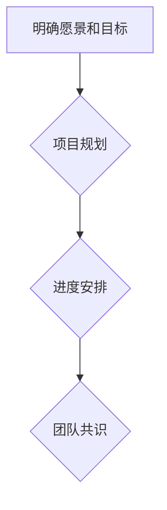

**2. 建立高效的沟通机制**

为了确保团队成员之间的信息流畅和沟通有效，John建立了一个定期的项目会议机制，每周举行一次全体会议和多次小组讨论会议。此外，他还利用在线协作工具，如Slack和Trello，来跟踪项目进度和任务分配。

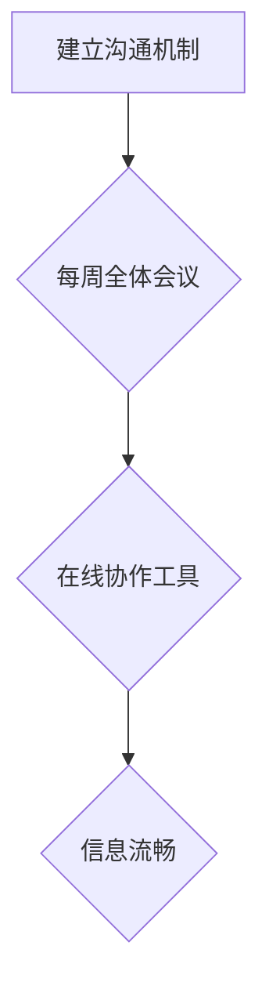

**3. 提升团队技术水平**

John意识到团队的技术水平是项目成功的关键。他组织了一系列的技术培训和研讨会，邀请行业专家分享最新的技术趋势和最佳实践。此外，他还鼓励团队成员参加外部技术会议和研讨会，以拓宽视野和提升技能。

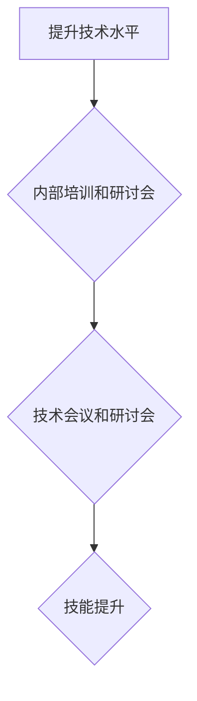

**4. 激励和认可**

为了激励团队成员，John建立了一套奖励和认可机制。每当团队成员完成重要任务或提出有价值的建议，他都会及时给予奖励和公开认可。这种激励机制不仅提升了团队成员的工作热情，还增强了团队的凝聚力。

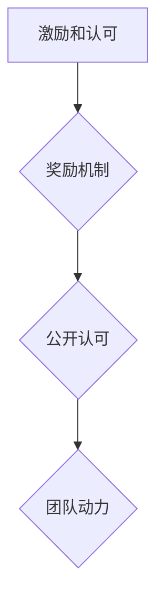

**5. 面对挑战和冲突**

在项目执行过程中，John遇到了一些技术难题和团队内部的冲突。他通过积极的沟通和协调，与团队成员共同分析问题，找到解决方案。他强调了团队合作的重要性，并鼓励团队成员在面对困难时相互支持。

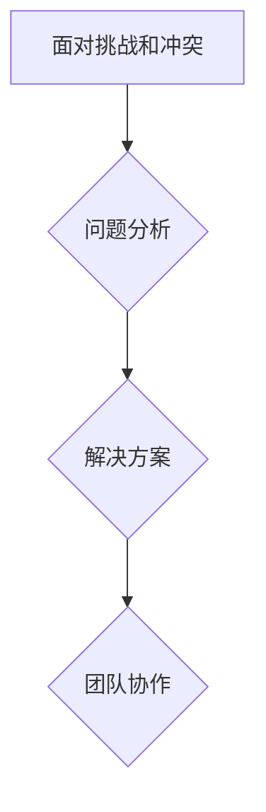

**项目成果与影响力分析**

通过John的一系列努力，项目最终如期完成，并且获得了客户的高度评价。团队成员的技术水平和创新能力也得到了显著提升。John的影响力不仅在团队内部得到了认可，还在公司内部树立了技术领导的榜样。

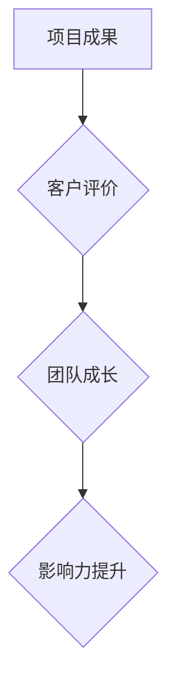

**项目小结**

通过这个实际案例，我们可以看到技术leader在项目中的影响力构建过程。John通过明确愿景和目标、建立高效的沟通机制、提升团队技术水平、激励和认可团队成员、以及积极面对挑战和冲突，成功地提升了团队的整体效能，并在项目中发挥了关键作用。这些方法和策略不仅帮助项目成功完成，也为John自身的影响力构建提供了宝贵经验。

#### 最佳实践 Tips、小结、注意事项

在构建技术leader影响力时，以下是一些最佳实践、小结和注意事项，供读者参考：

**最佳实践 Tips**：

1. **明确愿景与目标**：作为技术leader，首先要明确团队的愿景和目标，确保团队成员对项目方向有清晰的理解。
2. **建立高效沟通机制**：定期举行会议和利用在线协作工具，确保信息流畅和沟通有效。
3. **持续提升技术水平**：通过培训和研讨会，不断提升团队成员的技术能力和创新能力。
4. **激励与认可**：建立奖励和认可机制，及时激励团队成员，增强团队凝聚力。
5. **积极面对挑战**：遇到问题和冲突时，要冷静分析，寻找解决方案，并鼓励团队合作。

**小结**：

本文通过多个章节详细探讨了技术leader如何构建和提升影响力。从领导力的核心要素，到团队建设、沟通技巧和战略规划，再到实际项目中的实战应用，技术leader需要在多个方面不断努力，才能在团队和项目中发挥关键作用。

**注意事项**：

1. **平衡工作量**：在推动项目进展的同时，要注意团队成员的工作量和心理压力，避免过度工作导致团队成员疲惫。
2. **保持透明与公正**：在团队管理和决策过程中，保持透明度和公正性，赢得团队成员的信任。
3. **持续反思与改进**：定期反思自身领导力和团队绩效，并根据反馈进行改进，不断提升领导力水平。

通过遵循这些最佳实践和注意事项，技术leader可以更加有效地构建和提升自身的影响力，推动团队和项目的成功。

#### 拓展阅读

对于希望深入了解技术leader影响力构建方法的读者，以下是一些推荐阅读材料：

1. **《影响力：说服与改变的心理学》**（罗伯特·西奥迪尼著）：这本书详细介绍了影响力背后的心理学原理，对提升个人和团队的影响力有重要参考价值。
2. **《团队的智慧》**（杰里·魏斯巴赫著）：探讨团队建设、协作和领导力，提供了丰富的实践案例和策略。
3. **《敏捷领导者：在不确定性的世界中取得成功》**（施密特著）：介绍如何在不确定的环境中灵活应对，提升领导力和团队效能。
4. **《领导力与决策》**（彼得·德鲁克著）：全面探讨领导力的各个方面，包括决策、团队管理和个人发展。
5. **《团队智慧：团队合作的艺术》**（迈克尔·马奇著）：探讨团队合作的关键要素，提供实用的团队管理策略。

通过这些书籍和文章，读者可以进一步深入了解技术leader所需的能力和方法，提升自身的影响力。

