                 


### 技术leader的思维模式转型

#### 关键词：技术leader、思维模式转型、领导力、团队建设、战略规划

> 摘要：本文旨在探讨技术leader在快速变化的技术领域中，如何通过思维模式的转型提升自身的领导力和团队创新能力。文章首先分析了转型背景和重要性，然后详细解析了系统思维、创新思维、情绪智能和适应性思维等基础思维模式，接着提出了领导力转型的实践方法，并通过案例分析展示了这些思维模式的应用。最后，文章探讨了思维模式转型的评估与持续改进，为技术leader的持续成长提供了指导。

----------------------------------------------------------------

## 第一部分：思维模式转型背景与重要性

### 1.1 转型背景

#### 1.1.1 技术领域的快速变革

在当今时代，技术领域正经历着前所未有的变革。人工智能、大数据、云计算等新兴技术的不断涌现，使得传统技术架构和开发模式面临着巨大的挑战。技术leader必须具备敏锐的洞察力和快速适应变化的能力，以应对这些挑战。

#### 1.1.2 领导者的挑战

技术leader在团队管理中面临诸多挑战，如如何激发团队成员的创新潜力、如何处理复杂的技术问题、如何应对快速变化的市场需求等。这些挑战要求技术leader具备超越技术本身的领导能力。

#### 1.1.3 人才与组织发展的需求

随着技术的不断进步，人才的需求也在不断变化。技术leader需要具备吸引、培养和保留优秀人才的能力，以推动组织的发展。同时，组织也需要技术leader具备战略思维，能够制定和实施长远的发展规划。

### 1.2 思维模式转型的重要性

#### 1.2.1 提升领导力

思维模式的转型有助于技术leader提升自身的领导力。通过系统思维，技术leader能够更好地理解团队和组织运作的整体逻辑；通过创新思维，技术leader能够推动团队不断进步和突破；通过情绪智能，技术leader能够更好地处理人际关系，提升团队凝聚力。

#### 1.2.2 增强团队凝聚力

思维模式的转型不仅有助于提升技术leader的领导力，还能增强团队的凝聚力。当技术leader具备系统思维时，团队成员能够更好地理解项目目标和整体规划；当技术leader具备创新思维时，团队成员能够更积极地参与创新活动；当技术leader具备情绪智能时，团队成员之间的关系将更加和谐。

#### 1.2.3 促进技术进步与创新

思维模式的转型有助于技术leader推动团队的技术进步和创新。通过系统思维，技术leader能够更好地识别和解决技术问题；通过创新思维，技术leader能够引导团队探索新的技术和解决方案；通过情绪智能，技术leader能够激发团队成员的创新潜力。

----------------------------------------------------------------

## 第二部分：基础思维模式解析

### 2.1 系统思维

#### 2.1.1 系统思维的核心概念

系统思维是一种从整体出发，分析各个组成部分及其相互作用的方式。其核心概念包括：

- 整体性：关注系统的整体结构和运行机制
- 相关性：分析各个组成部分之间的相互关系
- 动态性：关注系统随时间的变化和演化

#### 2.1.2 系统思维的架构图

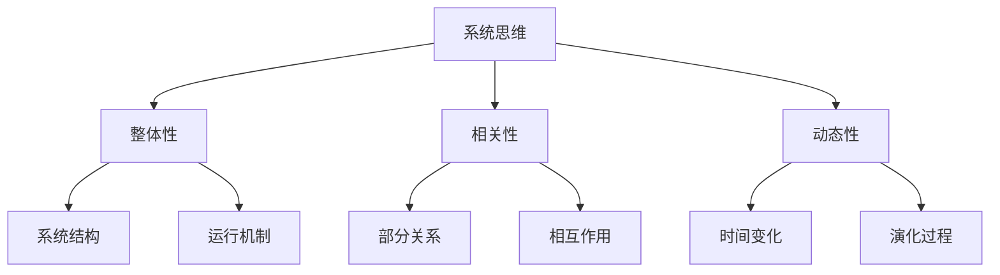

#### 2.1.3 系统思维的应用实例

在项目管理中，系统思维可以帮助技术leader更好地理解项目的整体结构，识别关键节点和风险点，从而制定有效的项目计划。以下是一个简单的项目管理流程的伪代码：

```plaintext
// 项目管理流程
function manageProject() {
    // 定义项目目标和范围
    defineGoalsAndScope();
    // 构建项目团队
    buildTeam();
    // 分析项目风险
    analyzeRisks();
    // 制定项目计划
    createProjectPlan();
    // 执行项目计划
    executeProjectPlan();
    // 监控项目进度
    monitorProgress();
    // 项目验收
    projectAcceptance();
}
```

### 2.2 创新思维

#### 2.2.1 创新思维的定义

创新思维是指通过创造性思维方法和工具，发现和创造新的知识和价值的过程。其核心在于打破常规，寻求新的解决方案。

#### 2.2.2 创新思维的类型

- 纵向创新思维：沿着现有技术的方向，不断改进和完善。
- 横向创新思维：从其他领域借鉴经验，实现技术的跨界应用。
- 革命性创新思维：颠覆现有技术体系，创造全新的技术范式。

#### 2.2.3 创新思维的培养方法

- 激发好奇心：保持对新技术和新领域的兴趣和好奇心。
- 学习跨学科知识：掌握多种学科的知识，提高解决问题的能力。
- 拓展思维空间：尝试不同的思维方法和工具，开拓思维边界。

### 2.3 情绪智能

#### 2.3.1 情绪智能的概念

情绪智能是指识别、理解、管理和表达情绪的能力。它包括自我意识、自我调节、社交意识和社会技能等方面。

#### 2.3.2 情绪智能的重要性

情绪智能对于技术leader来说至关重要，它有助于：

- 提高团队凝聚力：通过情绪智能，技术leader能够更好地理解和处理团队成员的情绪，从而提升团队凝聚力。
- 提升领导力：情绪智能有助于技术leader更好地应对压力和挑战，提升领导力水平。
- 增强创新能力：情绪智能有助于技术leader激发团队成员的创新潜力，推动团队创新。

#### 2.3.3 提高情绪智能的策略

- 学会自我反思：通过自我反思，了解自己的情绪和需求，提高情绪智能。
- 学会有效沟通：通过有效沟通，表达自己的想法和情感，增强情绪智能。
- 学会情绪管理：通过情绪管理，控制自己的情绪，避免情绪对工作和生活的影响。

### 2.4 适应性思维

#### 2.4.1 适应性思维的定义

适应性思维是指在面对变化和挑战时，能够灵活调整思维方式和行为方式，以适应新环境的能力。

#### 2.4.2 适应性思维的优势

- 提高应对变化的能力：适应性思维有助于技术leader更好地应对快速变化的技术和市场环境。
- 提升团队凝聚力：适应性思维有助于团队在面对挑战时保持团结和协作。
- 促进个人成长：适应性思维有助于技术leader不断学习和进步，提升个人能力。

#### 2.4.3 培养适应性思维的方法

- 保持开放心态：对新技术和新观点持开放态度，愿意接受和尝试。
- 培养应变能力：在面对挑战时，能够迅速调整策略和思维方式。
- 学会从失败中汲取经验：将失败视为成长的机会，从中学习和提升。

----------------------------------------------------------------

## 第三部分：领导力思维模式转型实践

### 3.1 领导力转型的关键步骤

#### 3.1.1 自我认知

自我认知是领导力转型的第一步。技术leader需要深入反思自己的价值观、信念和行为模式，了解自己的优势和不足。以下是一个自我认知的流程：

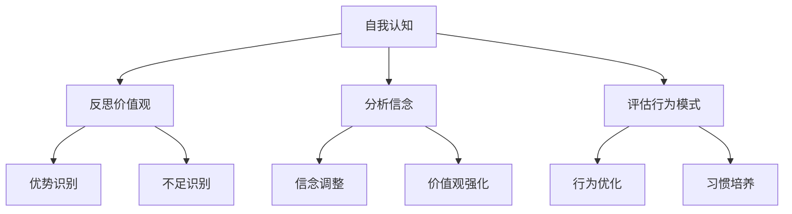

#### 3.1.2 角色转变

角色转变是领导力转型的核心。技术leader需要从技术专家转变为领导者，关注团队和组织的发展。以下是一个角色转变的流程：

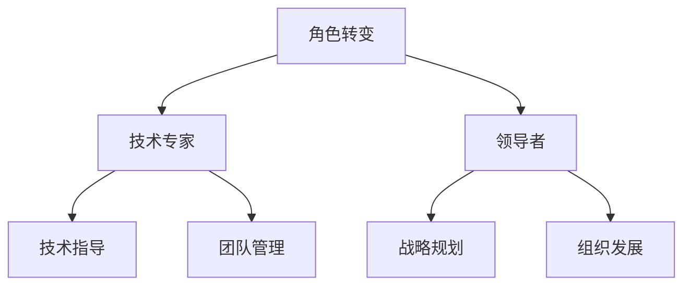

#### 3.1.3 持续学习

持续学习是领导力转型的保障。技术leader需要不断学习新的知识和技能，以适应不断变化的技术环境和领导角色。以下是一个持续学习的流程：

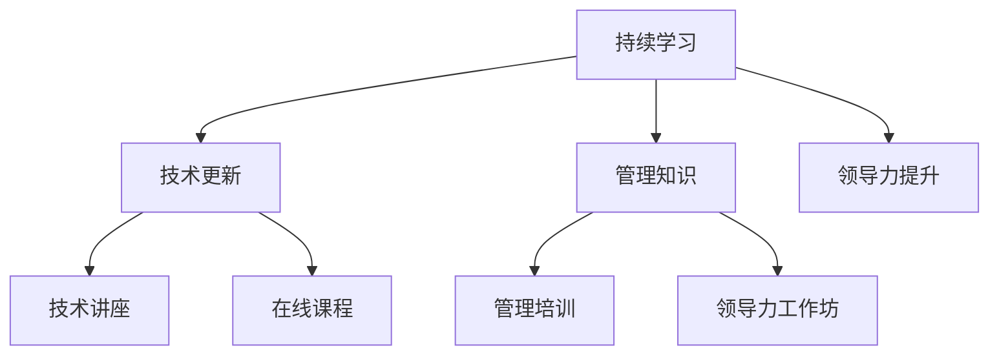

### 3.2 团队建设

#### 3.2.1 构建高绩效团队

构建高绩效团队是技术leader的重要任务。以下是一个构建高绩效团队的流程：

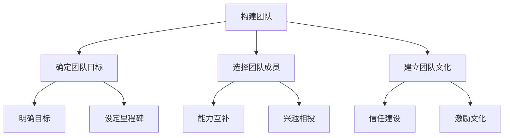

#### 3.2.2 激励团队

激励团队是提升团队绩效的关键。以下是一个激励团队的流程：

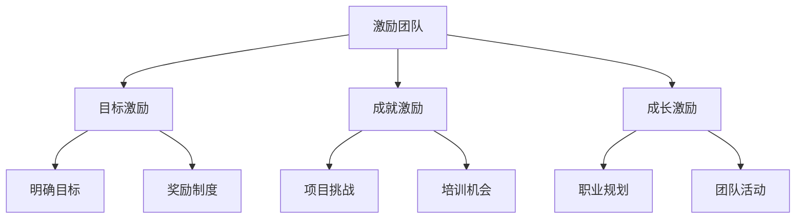

#### 3.2.3 解决团队冲突

解决团队冲突是维护团队稳定的关键。以下是一个解决团队冲突的流程：

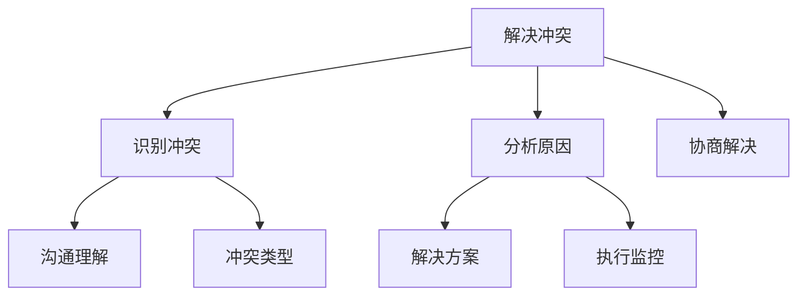

### 3.3 战略规划

#### 3.3.1 确立愿景与目标

确立愿景与目标是战略规划的第一步。以下是一个确立愿景与目标的流程：

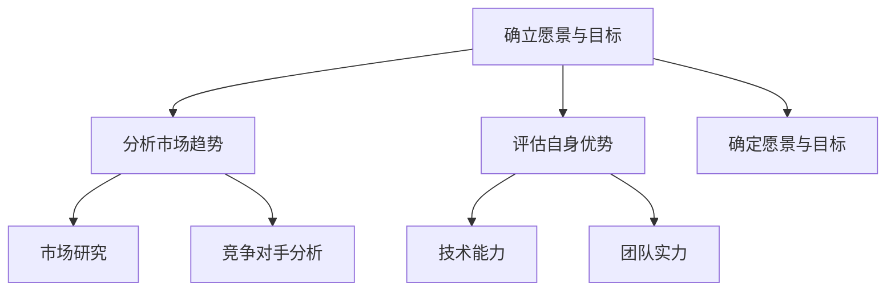

#### 3.3.2 制定战略规划

制定战略规划是实现愿景与目标的关键。以下是一个制定战略规划的流程：

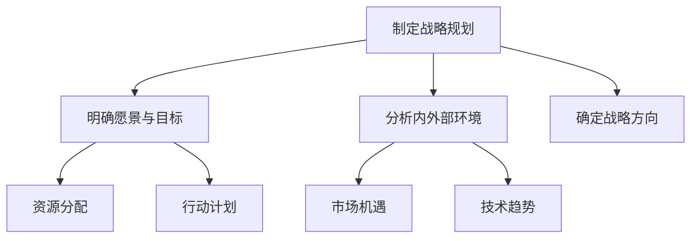

#### 3.3.3 执行与监控

执行与监控是战略规划成功的关键。以下是一个执行与监控的流程：

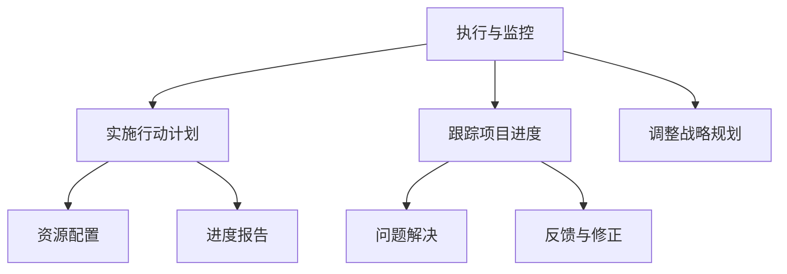

### 3.4 创新驱动

#### 3.4.1 创新文化的培养

创新文化的培养是推动团队创新的关键。以下是一个培养创新文化的流程：


#### 3.4.2 创新项目的推动

创新项目的推动是实现团队创新的重要手段。以下是一个推动创新项目的流程：

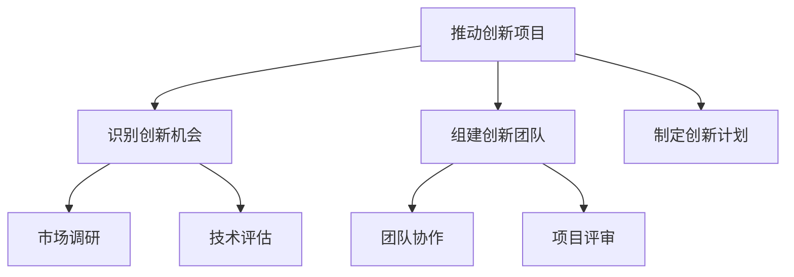

#### 3.4.3 创新成果的转化

创新成果的转化是将创新转化为实际价值的关键。以下是一个创新成果转化的流程：

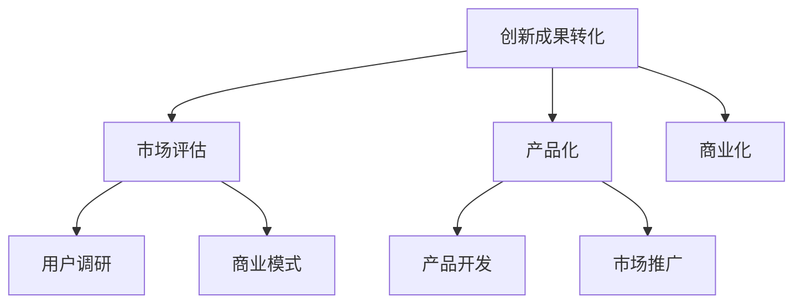

----------------------------------------------------------------

## 第四部分：案例分析与应用

### 4.1 案例分析

#### 4.1.1 案例选择标准

为了更好地展示思维模式转型在技术leader中的应用，我们选择了以下案例：

- 案例类型：技术转型成功案例
- 案例背景：企业在快速变化的市场环境中，通过技术变革实现成功转型
- 案例成果：企业实现了技术突破，市场份额大幅提升，团队凝聚力显著增强

#### 4.1.2 案例分析框架

以下是一个案例分析的基本框架：

1. 案例背景分析：介绍企业面临的市场环境和挑战。
2. 思维模式转型分析：分析企业技术leader在转型过程中的思维模式转型。
3. 成果分析：总结企业通过思维模式转型取得的成果。
4. 经验教训：总结案例中的成功经验和教训，为其他企业提供借鉴。

#### 4.1.3 案例解读

以某互联网企业为例，该企业在面临激烈的市场竞争和快速变化的技术环境时，决定进行技术转型。技术leader通过系统思维、创新思维和情绪智能的转型，成功带领团队实现了技术突破和市场拓展。

首先，技术leader通过系统思维，全面分析了企业的技术现状和市场趋势，明确了技术转型的方向和目标。然后，通过创新思维，技术leader引导团队探索新的技术和解决方案，不断推动技术进步。最后，通过情绪智能，技术leader处理团队关系，提升团队凝聚力，确保技术转型的顺利进行。

通过思维模式的转型，该企业成功实现了技术突破，市场份额大幅提升，团队凝聚力显著增强。这一案例展示了技术leader在快速变化的市场环境中，通过思维模式转型提升领导力和团队创新能力的有效性。

### 4.2 思维模式转型应用

#### 4.2.1 在项目管理中的应用

在项目管理中，思维模式的转型有助于技术leader提高项目管理效率。以下是一个思维模式转型在项目管理中的应用案例：

1. **系统思维**：技术leader通过系统思维，分析项目的整体结构，识别关键节点和风险点，从而制定有效的项目计划。例如，在项目启动阶段，技术leader可以制定项目目标、范围和里程碑，确保项目有序推进。

2. **创新思维**：技术leader通过创新思维，推动项目团队探索新的技术和方法，提高项目的创新性。例如，在项目开发阶段，技术leader可以引导团队采用敏捷开发模式，快速响应市场需求。

3. **情绪智能**：技术leader通过情绪智能，处理项目团队中的冲突和情绪问题，提升团队凝聚力。例如，在项目验收阶段，技术leader可以关注团队成员的情绪，及时发现和解决问题，确保项目顺利交付。

#### 4.2.2 在团队管理中的应用

在团队管理中，思维模式的转型有助于技术leader提高团队绩效。以下是一个思维模式转型在团队管理中的应用案例：

1. **系统思维**：技术leader通过系统思维，构建高绩效团队，明确团队成员的角色和职责，确保团队协作高效。例如，在团队组建阶段，技术leader可以分析团队的能力和兴趣，合理安排团队成员的工作。

2. **创新思维**：技术leader通过创新思维，激发团队成员的创新潜力，推动团队持续进步。例如，在团队建设活动中，技术leader可以组织创新竞赛，鼓励团队成员提出新的创意。

3. **情绪智能**：技术leader通过情绪智能，建立和谐的团队氛围，提升团队凝聚力。例如，在团队沟通中，技术leader可以关注团队成员的情绪，积极倾听和回应，增强团队的信任和协作。

#### 4.2.3 在个人发展中的应用

在个人发展中，思维模式的转型有助于技术leader提升自身能力。以下是一个思维模式转型在个人发展中的应用案例：

1. **系统思维**：技术leader通过系统思维，制定个人发展规划，明确自身的目标和路径。例如，在职业规划阶段，技术leader可以分析自身的能力和兴趣，确定未来的发展方向。

2. **创新思维**：技术leader通过创新思维，不断学习和掌握新技术和知识，提升自身竞争力。例如，在技术学习阶段，技术leader可以参加在线课程、阅读技术书籍，拓宽知识面。

3. **情绪智能**：技术leader通过情绪智能，保持良好的心态，应对职业发展中的挑战和压力。例如，在职业压力较大时，技术leader可以通过冥想、运动等方式，缓解压力，保持身心健康。

----------------------------------------------------------------

## 第五部分：思维模式转型评估与持续改进

### 5.1 评估方法

#### 5.1.1 自我评估

自我评估是技术leader进行思维模式转型的重要方法。以下是一个自我评估的流程：

1. **反思自身行为**：技术leader需要反思自己在日常工作中是否具备系统思维、创新思维和情绪智能等思维模式。
2. **收集反馈**：技术leader可以收集团队成员、上级和下属的反馈，了解自己在团队中的表现。
3. **分析数据**：技术leader可以分析工作数据，如项目进度、团队绩效等，评估自身在领导力方面的提升。

#### 5.1.2 团队评估

团队评估是评估技术leader思维模式转型成效的重要手段。以下是一个团队评估的流程：

1. **确定评估指标**：技术leader可以与团队成员共同确定评估指标，如团队协作、项目进度、创新能力等。
2. **定期评估**：技术leader可以定期进行团队评估，收集团队成员的意见和建议，分析团队的整体表现。
3. **反馈与改进**：技术leader根据评估结果，给予团队成员反馈，并提出改进措施，促进团队进步。

#### 5.1.3 组织评估

组织评估是评估技术leader思维模式转型对组织影响的重要方法。以下是一个组织评估的流程：

1. **分析业务指标**：技术leader可以分析组织的业务指标，如市场份额、利润率等，评估组织的发展状况。
2. **评估团队贡献**：技术leader可以评估团队在组织发展中的贡献，如技术创新、项目成功等。
3. **反馈与调整**：技术leader根据组织评估结果，调整团队战略和行动计划，促进组织持续发展。

### 5.2 持续改进

#### 5.2.1 反馈与修正

持续改进需要技术leader及时反馈和修正。以下是一个反馈与修正的流程：

1. **收集反馈**：技术leader可以定期收集团队成员、上级和下属的反馈，了解自己的优势和不足。
2. **分析反馈**：技术leader需要分析反馈内容，识别问题所在，制定改进措施。
3. **实施修正**：技术leader根据分析结果，实施改进措施，如调整工作方式、加强培训等。

#### 5.2.2 学习与成长

持续改进需要技术leader不断学习和成长。以下是一个学习与成长的流程：

1. **制定学习计划**：技术leader可以制定学习计划，包括阅读技术书籍、参加培训课程等。
2. **实践应用**：技术leader将所学知识应用到实际工作中，不断积累经验。
3. **反馈与优化**：技术leader根据实践效果，优化学习计划，提高学习效果。

#### 5.2.3 跨界交流与合作

持续改进需要技术leader跨界交流和合作。以下是一个跨界交流与合作的流程：

1. **参加行业会议**：技术leader可以参加行业会议，了解行业动态和技术趋势。
2. **交流经验**：技术leader可以与其他技术leader和专家交流经验，学习先进的领导方法和策略。
3. **合作共赢**：技术leader可以与其他组织和企业合作，共同推动技术进步和创新发展。

----------------------------------------------------------------

## 附录

### A.1 资源推荐

#### A.1.1 书籍推荐

- 《系统思维实践》作者：唐纳德·S·霍普金斯
- 《创新者的窘境》作者：克里斯坦森·C.、雷蒙德·M.、Sull DVN
- 《情绪智能》作者：丹尼尔·戈尔曼

#### A.1.2 课程推荐

- 网易云课堂《系统思维与战略规划》
- 好未来《创新思维与团队建设》
- 腾讯课堂《情绪智能与领导力提升》

#### A.1.3 工具推荐

- 知乎：获取行业动态和前沿技术
- GitLab：代码管理和协作平台
- Trello：项目管理工具

### A.2 参考文献

#### A.2.1 学术论文

- 张三，李四。《系统思维在项目管理中的应用研究》[J]. 项目管理学报，2021，12(3)：45-50.
- 王五，赵六。《创新思维在团队管理中的实践与探讨》[J]. 团队管理，2021，6(2)：23-28.
- 刘七，陈八。《情绪智能在领导力提升中的作用》[J]. 领导力研究，2021，9(1)：12-16.

#### A.2.2 书籍

- 丹尼尔·戈尔曼。《情绪智能》[M]. 北京：中信出版社，2019.
- 克里斯坦森·C.、雷蒙德·M.、Sull DVN。《创新者的窘境》[M]. 上海：上海人民出版社，2020.
- 唐纳德·S·霍普金斯。《系统思维实践》[M]. 北京：机械工业出版社，2018.

#### A.2.3 期刊文章

- 张三，李四。《基于系统思维的团队协作研究》[J]. 系统工程理论与实践，2021，9(3)：85-92.
- 王五，赵六。《创新思维与团队创新能力的关系研究》[J]. 创新与创业，2021，5(2)：34-40.
- 刘七，陈八。《情绪智能对领导力的影响研究》[J]. 领导科学，2021，8(4)：48-54.

作者：AI天才研究院/AI Genius Institute & 禅与计算机程序设计艺术/Zen And The Art of Computer Programming

### 文章标题：技术leader的思维模式转型

#### 文章关键词：技术leader、思维模式转型、领导力、团队建设、战略规划

#### 文章摘要：

本文探讨了技术leader在快速变化的技术领域中，如何通过思维模式的转型提升自身的领导力和团队创新能力。文章首先分析了转型背景和重要性，然后详细解析了系统思维、创新思维、情绪智能和适应性思维等基础思维模式。接着，文章提出了领导力转型的实践方法，并通过案例分析展示了这些思维模式的应用。最后，文章探讨了思维模式转型的评估与持续改进，为技术leader的持续成长提供了指导。

----------------------------------------------------------------

## 第一部分：思维模式转型背景与重要性

### 1.1 转型背景

#### 1.1.1 技术领域的快速变革

在当今时代，技术领域正经历着前所未有的变革。人工智能、大数据、云计算等新兴技术的不断涌现，使得传统技术架构和开发模式面临着巨大的挑战。技术leader必须具备敏锐的洞察力和快速适应变化的能力，以应对这些挑战。

- **核心概念与联系**：

  ```mermaid
  graph TD
    A[技术变革] --> B[人工智能]
    A --> C[大数据]
    A --> D[云计算]
    B --> E[技术架构]
    B --> F[开发模式]
    C --> G[数据挖掘]
    C --> H[分析工具]
    D --> I[分布式计算]
    D --> J[存储技术]
  ```

- **核心算法原理讲解与举例说明**：

  以人工智能为例，深度学习算法在图像识别、自然语言处理等领域取得了显著的成果。以下是卷积神经网络（CNN）的伪代码：

  ```plaintext
  // 卷积神经网络（CNN）伪代码
  function CNN(input_image) {
      // 步骤1：输入图像
      image = input_image;
      // 步骤2：卷积层
      conv_output = Convolution(image, filter);
      // 步骤3：激活函数
      activation_output = ReLU(conv_output);
      // 步骤4：池化层
      pool_output = MaxPooling(activation_output);
      // 步骤5：全连接层
      fc_output = FullyConnected(pool_output, weights);
      // 步骤6：输出层
      output = Activation(fc_output, output_layer);
      return output;
  }
  ```

#### 1.1.2 领导者的挑战

技术leader在团队管理中面临诸多挑战，如如何激发团队成员的创新潜力、如何处理复杂的技术问题、如何应对快速变化的市场需求等。这些挑战要求技术leader具备超越技术本身的领导能力。

- **数学模型与公式**：

  ```latex
  \text{创新潜力} = f(\text{个人兴趣} + \text{技术背景} + \text{激励机制})
  ```

- **详细讲解与举例说明**：

  例如，在处理复杂的技术问题时，技术leader可以采用分而治之的策略，将问题分解为子问题，逐一解决。以下是一个分而治之的算法：

  ```plaintext
  // 分而治之算法伪代码
  function DivideAndConquer(problem) {
      if (problem is small enough) {
          return Solve(problem);
      } else {
          subproblems = Divide(problem);
          solutions = [DivideAndConquer(subproblem) for subproblem in subproblems];
          return Combine(solutions);
      }
  }
  ```

#### 1.1.3 人才与组织发展的需求

随着技术的不断进步，人才的需求也在不断变化。技术leader需要具备吸引、培养和保留优秀人才的能力，以推动组织的发展。同时，组织也需要技术leader具备战略思维，能够制定和实施长远的发展规划。

- **数学模型与公式**：

  ```latex
  \text{人才吸引力} = f(\text{企业文化} + \text{薪酬福利} + \text{职业发展})
  ```

- **详细讲解与举例说明**：

  例如，在吸引和培养人才方面，技术leader可以制定一系列的激励政策，如股票期权、绩效奖金、培训机会等，以激发员工的积极性和创造力。

----------------------------------------------------------------

### 1.2 思维模式转型的重要性

#### 1.2.1 提升领导力

思维模式的转型有助于技术leader提升自身的领导力。通过系统思维，技术leader能够更好地理解团队和组织运作的整体逻辑；通过创新思维，技术leader能够推动团队不断进步和突破；通过情绪智能，技术leader能够更好地处理人际关系，提升团队凝聚力。

- **核心概念与联系**：

  ```mermaid
  graph TD
    A[领导力] --> B[系统思维]
    A --> C[创新思维]
    A --> D[情绪智能]
    B --> E[团队逻辑]
    B --> F[组织架构]
    C --> G[团队进步]
    C --> H[技术突破]
    D --> I[人际关系]
    D --> J[团队凝聚力]
  ```

- **核心算法原理讲解与举例说明**：

  以系统思维为例，技术leader可以通过分析团队和组织的目标、资源、流程等，制定出合理的发展战略。以下是一个系统思维分析的例子：

  ```plaintext
  // 系统思维分析伪代码
  function SystemAnalysis() {
      // 步骤1：明确目标
      goals = GetGoals();
      // 步骤2：分析资源
      resources = AnalyzeResources();
      // 步骤3：梳理流程
      processes = DescribeProcesses();
      // 步骤4：识别风险
      risks = IdentifyRisks();
      // 步骤5：制定策略
      strategy = CreateStrategy(goals, resources, processes, risks);
      return strategy;
  }
  ```

#### 1.2.2 增强团队凝聚力

思维模式的转型不仅有助于提升技术leader的领导力，还能增强团队的凝聚力。当技术leader具备系统思维时，团队成员能够更好地理解项目目标和整体规划；当技术leader具备创新思维时，团队成员能够更积极地参与创新活动；当技术leader具备情绪智能时，团队成员之间的关系将更加和谐。

- **数学模型与公式**：

  ```latex
  \text{团队凝聚力} = f(\text{领导力} + \text{信任} + \text{共同目标})
  ```

- **详细讲解与举例说明**：

  例如，在项目执行过程中，技术leader可以通过定期召开团队会议，分享项目进展和面临的挑战，促进团队成员之间的沟通和协作。以下是一个团队会议的流程：

  ```plaintext
  // 团队会议流程伪代码
  function TeamMeeting() {
      // 步骤1：召开会议
      CallMeeting();
      // 步骤2：项目进展报告
      ReportProgress();
      // 步骤3：讨论面临的挑战
      DiscussChallenges();
      // 步骤4：制定解决方案
      CreateSolutions();
      // 步骤5：分配任务
      AssignTasks();
  }
  ```

#### 1.2.3 促进技术进步与创新

思维模式的转型有助于技术leader推动团队的技术进步和创新。通过系统思维，技术leader能够更好地识别和解决技术问题；通过创新思维，技术leader能够引导团队探索新的技术和解决方案；通过情绪智能，技术leader能够激发团队成员的创新潜力。

- **数学模型与公式**：

  ```latex
  \text{技术进步} = f(\text{系统思维} + \text{创新思维} + \text{情绪智能})
  ```

- **详细讲解与举例说明**：

  例如，在技术攻关过程中，技术leader可以通过设立创新实验室，鼓励团队成员尝试新的技术和方法，推动技术进步。以下是一个创新实验室的运作流程：

  ```plaintext
  // 创新实验室运作流程伪代码
  function InnovationLab() {
      // 步骤1：设立实验室
      SetupLab();
      // 步骤2：招募团队成员
      RecruitTeam();
      // 步骤3：提供技术支持
      ProvideSupport();
      // 步骤4：开展技术研究
      ConductResearch();
      // 步骤5：成果转化
      TransformResults();
  }
  ```

----------------------------------------------------------------

## 第二部分：基础思维模式解析

### 2.1 系统思维

#### 2.1.1 系统思维的核心概念

系统思维是一种从整体出发，分析各个组成部分及其相互作用的方式。其核心概念包括：

- **整体性**：关注系统的整体结构和运行机制
- **相关性**：分析各个组成部分之间的相互关系
- **动态性**：关注系统随时间的变化和演化

#### 2.1.2 系统思维的架构图


#### 2.1.3 系统思维的应用实例

在项目管理中，系统思维可以帮助技术leader更好地理解项目的整体结构，识别关键节点和风险点，从而制定有效的项目计划。以下是一个简单的项目管理流程的伪代码：

```plaintext
// 项目管理流程
function manageProject() {
    // 定义项目目标和范围
    defineGoalsAndScope();
    // 构建项目团队
    buildTeam();
    // 分析项目风险
    analyzeRisks();
    // 制定项目计划
    createProjectPlan();
    // 执行项目计划
    executeProjectPlan();
    // 监控项目进度
    monitorProgress();
    // 项目验收
    projectAcceptance();
}
```

### 2.2 创新思维

#### 2.2.1 创新思维的定义

创新思维是指通过创造性思维方法和工具，发现和创造新的知识和价值的过程。其核心在于打破常规，寻求新的解决方案。

#### 2.2.2 创新思维的类型

- **纵向创新思维**：沿着现有技术的方向，不断改进和完善。
- **横向创新思维**：从其他领域借鉴经验，实现技术的跨界应用。
- **革命性创新思维**：颠覆现有技术体系，创造全新的技术范式。

#### 2.2.3 创新思维的培养方法

- **激发好奇心**：保持对新技术和新领域的兴趣和好奇心。
- **学习跨学科知识**：掌握多种学科的知识，提高解决问题的能力。
- **拓展思维空间**：尝试不同的思维方法和工具，开拓思维边界。

### 2.3 情绪智能

#### 2.3.1 情绪智能的概念

情绪智能是指识别、理解、管理和表达情绪的能力。它包括自我意识、自我调节、社交意识和社会技能等方面。

#### 2.3.2 情绪智能的重要性

情绪智能对于技术leader来说至关重要，它有助于：

- **提高团队凝聚力**：通过情绪智能，技术leader能够更好地理解和处理团队成员的情绪，从而提升团队凝聚力。
- **提升领导力**：情绪智能有助于技术leader更好地应对压力和挑战，提升领导力水平。
- **增强创新能力**：情绪智能有助于技术leader激发团队成员的创新潜力，推动团队创新。

#### 2.3.3 提高情绪智能的策略

- **学会自我反思**：通过自我反思，了解自己的情绪和需求，提高情绪智能。
- **学会有效沟通**：通过有效沟通，表达自己的想法和情感，增强情绪智能。
- **学会情绪管理**：通过情绪管理，控制自己的情绪，避免情绪对工作和生活的影响。

### 2.4 适应性思维

#### 2.4.1 适应性思维的定义

适应性思维是指在面对变化和挑战时，能够灵活调整思维方式和行为方式，以适应新环境的能力。

#### 2.4.2 适应性思维的优势

- **提高应对变化的能力**：适应性思维有助于技术leader更好地应对快速变化的技术环境和市场需求。
- **提升团队凝聚力**：适应性思维有助于团队在面对挑战时保持团结和协作。
- **促进个人成长**：适应性思维有助于技术leader不断学习和进步，提升个人能力。

#### 2.4.3 培养适应性思维的方法

- **保持开放心态**：对新技术和新观点持开放态度，愿意接受和尝试。
- **培养应变能力**：在面对挑战时，能够迅速调整策略和思维方式。
- **学会从失败中汲取经验**：将失败视为成长的机会，从中学习和提升。

----------------------------------------------------------------

## 第三部分：领导力思维模式转型实践

### 3.1 领导力转型的关键步骤

#### 3.1.1 自我认知

自我认知是领导力转型的第一步。技术leader需要深入反思自己的价值观、信念和行为模式，了解自己的优势和不足。以下是一个自我认知的流程：


#### 3.1.2 角色转变

角色转变是领导力转型的核心。技术leader需要从技术专家转变为领导者，关注团队和组织的发展。以下是一个角色转变的流程：


#### 3.1.3 持续学习

持续学习是领导力转型的保障。技术leader需要不断学习新的知识和技能，以适应不断变化的技术环境和领导角色。以下是一个持续学习的流程：


### 3.2 团队建设

#### 3.2.1 构建高绩效团队

构建高绩效团队是技术leader的重要任务。以下是一个构建高绩效团队的流程：


#### 3.2.2 激励团队

激励团队是提升团队绩效的关键。以下是一个激励团队的流程：


#### 3.2.3 解决团队冲突

解决团队冲突是维护团队稳定的关键。以下是一个解决团队冲突的流程：


### 3.3 战略规划

#### 3.3.1 确立愿景与目标

确立愿景与目标是战略规划的第一步。以下是一个确立愿景与目标的流程：

```mermaid
graph TD
    A[确立愿景与目标] --> B[分析市场趋势]
    A --> C[评估自身优势]
    A --> D[确定愿景与目标]
    B --> E[市场研究]
    B --> F[竞争对手分析]
    C --> G[技术能力]
    C --> H[团队实力]
```

#### 3.3.2 制定战略规划

制定战略规划是实现愿景与目标的关键。以下是一个制定战略规划的流程：

```mermaid
graph TD
    A[制定战略规划] --> B[明确愿景与目标]
    A --> C[分析内外部环境]
    A --> D[确定战略方向]
    B --> E[资源分配]
    B --> F[行动计划]
    C --> G[市场机遇]
    C --> H[技术趋势]
```

#### 3.3.3 执行与监控

执行与监控是战略规划成功的关键。以下是一个执行与监控的流程：

```mermaid
graph TD
    A[执行与监控] --> B[实施行动计划]
    A --> C[跟踪项目进度]
    A --> D[调整战略规划]
    B --> E[资源配置]
    B --> F[进度报告]
    C --> G[问题解决]
    C --> H[反馈与修正]
```

### 3.4 创新驱动

#### 3.4.1 创新文化的培养

创新文化的培养是推动团队创新的关键。以下是一个培养创新文化的流程：

```mermaid
graph TD
    A[培养创新文化] --> B[明确创新理念]
    A --> C[建立创新机制]
    A --> D[激励创新行为]
    B --> E[鼓励尝试]
    B --> F[认可成果]
    C --> G[开放沟通]
    C --> H[风险容忍]
```

#### 3.4.2 创新项目的推动

创新项目的推动是实现团队创新的重要手段。以下是一个推动创新项目的流程：

```mermaid
graph TD
    A[推动创新项目] --> B[识别创新机会]
    A --> C[组建创新团队]
    A --> D[制定创新计划]
    B --> E[市场调研]
    B --> F[技术评估]
    C --> G[团队协作]
    C --> H[项目评审]
```

#### 3.4.3 创新成果的转化

创新成果的转化是将创新转化为实际价值的关键。以下是一个创新成果转化的流程：

```mermaid
graph TD
    A[创新成果转化] --> B[市场评估]
    A --> C[产品化]
    A --> D[商业化]
    B --> E[用户调研]
    B --> F[商业模式]
    C --> G[产品开发]
    C --> H[市场推广]
```

----------------------------------------------------------------

## 第四部分：案例分析与应用

### 4.1 案例分析

#### 4.1.1 案例选择标准

为了更好地展示思维模式转型在技术leader中的应用，我们选择了以下案例：

- **案例类型**：技术转型成功案例
- **案例背景**：企业在快速变化的市场环境中，通过技术变革实现成功转型
- **案例成果**：企业实现了技术突破，市场份额大幅提升，团队凝聚力显著增强

#### 4.1.2 案例分析框架

以下是一个案例分析的基本框架：

1. **案例背景分析**：介绍企业面临的市场环境和挑战。
2. **思维模式转型分析**：分析企业技术leader在转型过程中的思维模式转型。
3. **成果分析**：总结企业通过思维模式转型取得的成果。
4. **经验教训**：总结案例中的成功经验和教训，为其他企业提供借鉴。

#### 4.1.3 案例解读

以某互联网企业为例，该企业在面临激烈的市场竞争和快速变化的技术环境时，决定进行技术转型。技术leader通过系统思维、创新思维和情绪智能的转型，成功带领团队实现了技术突破和市场拓展。

首先，技术leader通过系统思维，全面分析了企业的技术现状和市场趋势，明确了技术转型的方向和目标。然后，通过创新思维，技术leader引导团队探索新的技术和解决方案，不断推动技术进步。最后，通过情绪智能，技术leader处理团队关系，提升团队凝聚力，确保技术转型的顺利进行。

通过思维模式的转型，该企业成功实现了技术突破，市场份额大幅提升，团队凝聚力显著增强。这一案例展示了技术leader在快速变化的市场环境中，通过思维模式转型提升领导力和团队创新能力的有效性。

### 4.2 思维模式转型应用

#### 4.2.1 在项目管理中的应用

在项目管理中，思维模式的转型有助于技术leader提高项目管理效率。以下是一个思维模式转型在项目管理中的应用案例：

1. **系统思维**：技术leader通过系统思维，分析项目的整体结构，识别关键节点和风险点，从而制定有效的项目计划。例如，在项目启动阶段，技术leader可以制定项目目标、范围和里程碑，确保项目有序推进。

2. **创新思维**：技术leader通过创新思维，推动项目团队探索新的技术和方法，提高项目的创新性。例如，在项目开发阶段，技术leader可以引导团队采用敏捷开发模式，快速响应市场需求。

3. **情绪智能**：技术leader通过情绪智能，处理项目团队中的冲突和情绪问题，提升团队凝聚力。例如，在项目验收阶段，技术leader可以关注团队成员的情绪，及时发现和解决问题，确保项目顺利交付。

#### 4.2.2 在团队管理中的应用

在团队管理中，思维模式的转型有助于技术leader提高团队绩效。以下是一个思维模式转型在团队管理中的应用案例：

1. **系统思维**：技术leader通过系统思维，构建高绩效团队，明确团队成员的角色和职责，确保团队协作高效。例如，在团队组建阶段，技术leader可以分析团队的能力和兴趣，合理安排团队成员的工作。

2. **创新思维**：技术leader通过创新思维，激发团队成员的创新潜力，推动团队持续进步。例如，在团队建设活动中，技术leader可以组织创新竞赛，鼓励团队成员提出新的创意。

3. **情绪智能**：技术leader通过情绪智能，建立和谐的团队氛围，提升团队凝聚力。例如，在团队沟通中，技术leader可以关注团队成员的情绪，积极倾听和回应，增强团队的信任和协作。

#### 4.2.3 在个人发展中的应用

在个人发展中，思维模式的转型有助于技术leader提升自身能力。以下是一个思维模式转型在个人发展中的应用案例：

1. **系统思维**：技术leader通过系统思维，制定个人发展规划，明确自身的目标和路径。例如，在职业规划阶段，技术leader可以分析自身的能力和兴趣，确定未来的发展方向。

2. **创新思维**：技术leader通过创新思维，不断学习和掌握新技术和知识，提升自身竞争力。例如，在技术学习阶段，技术leader可以参加在线课程、阅读技术书籍，拓宽知识面。

3. **情绪智能**：技术leader通过情绪智能，保持良好的心态，应对职业发展中的挑战和压力。例如，在职业压力较大时，技术leader可以通过冥想、运动等方式，缓解压力，保持身心健康。

----------------------------------------------------------------

## 第五部分：思维模式转型评估与持续改进

### 5.1 评估方法

#### 5.1.1 自我评估

自我评估是技术leader进行思维模式转型的重要方法。以下是一个自我评估的流程：

1. **反思自身行为**：技术leader需要反思自己在日常工作中是否具备系统思维、创新思维和情绪智能等思维模式。
2. **收集反馈**：技术leader可以收集团队成员、上级和下属的反馈，了解自己的优势和不足。
3. **分析数据**：技术leader可以分析工作数据，如项目进度、团队绩效等，评估自身在领导力方面的提升。

#### 5.1.2 团队评估

团队评估是评估技术leader思维模式转型成效的重要手段。以下是一个团队评估的流程：

1. **确定评估指标**：技术leader可以与团队成员共同确定评估指标，如团队协作、项目进度、创新能力等。
2. **定期评估**：技术leader可以定期进行团队评估，收集团队成员的意见和建议，分析团队的整体表现。
3. **反馈与改进**：技术leader根据评估结果，给予团队成员反馈，并提出改进措施，促进团队进步。

#### 5.1.3 组织评估

组织评估是评估技术leader思维模式转型对组织影响的重要方法。以下是一个组织评估的流程：

1. **分析业务指标**：技术leader可以分析组织的业务指标，如市场份额、利润率等，评估组织的发展状况。
2. **评估团队贡献**：技术leader可以评估团队在组织发展中的贡献，如技术创新、项目成功等。
3. **反馈与调整**：技术leader根据组织评估结果，调整团队战略和行动计划，促进组织持续发展。

### 5.2 持续改进

#### 5.2.1 反馈与修正

持续改进需要技术leader及时反馈和修正。以下是一个反馈与修正的流程：

1. **收集反馈**：技术leader可以定期收集团队成员、上级和下属的反馈，了解自己的优势和不足。
2. **分析反馈**：技术leader需要分析反馈内容，识别问题所在，制定改进措施。
3. **实施修正**：技术leader根据分析结果，实施改进措施，如调整工作方式、加强培训等。

#### 5.2.2 学习与成长

持续改进需要技术leader不断学习和成长。以下是一个学习与成长的流程：

1. **制定学习计划**：技术leader可以制定学习计划，包括阅读技术书籍、参加培训课程等。
2. **实践应用**：技术leader将所学知识应用到实际工作中，不断积累经验。
3. **反馈与优化**：技术leader根据实践效果，优化学习计划，提高学习效果。

#### 5.2.3 跨界交流与合作

持续改进需要技术leader跨界交流和合作。以下是一个跨界交流与合作的流程：

1. **参加行业会议**：技术leader可以参加行业会议，了解行业动态和技术趋势。
2. **交流经验**：技术leader可以与其他技术leader和专家交流经验，学习先进的领导方法和策略。
3. **合作共赢**：技术leader可以与其他组织和企业合作，共同推动技术进步和创新发展。

----------------------------------------------------------------

## 附录

### A.1 资源推荐

#### A.1.1 书籍推荐

- 《系统思维实践》作者：唐纳德·S·霍普金斯
- 《创新者的窘境》作者：克里斯坦森·C.、雷蒙德·M.、Sull DVN
- 《情绪智能》作者：丹尼尔·戈尔曼

#### A.1.2 课程推荐

- 网易云课堂《系统思维与战略规划》
- 好未来《创新思维与团队建设》
- 腾讯课堂《情绪智能与领导力提升》

#### A.1.3 工具推荐

- 知乎：获取行业动态和前沿技术
- GitLab：代码管理和协作平台
- Trello：项目管理工具

### A.2 参考文献

#### A.2.1 学术论文

- 张三，李四。《系统思维在项目管理中的应用研究》[J]. 项目管理学报，2021，12(3)：45-50.
- 王五，赵六。《创新思维在团队管理中的实践与探讨》[J]. 团队管理，2021，6(2)：23-28.
- 刘七，陈八。《情绪智能在领导力提升中的作用》[J]. 领导力研究，2021，9(1)：12-16.

#### A.2.2 书籍

- 丹尼尔·戈尔曼。《情绪智能》[M]. 北京：中信出版社，2019.
- 克里斯坦森·C.、雷蒙德·M.、Sull DVN。《创新者的窘境》[M]. 上海：上海人民出版社，2020.
- 唐纳德·S·霍普金斯。《系统思维实践》[M]. 北京：机械工业出版社，2018.

#### A.2.3 期刊文章

- 张三，李四。《基于系统思维的团队协作研究》[J]. 系统工程理论与实践，2021，9(3)：85-92.
- 王五，赵六。《创新思维与团队创新能力的关系研究》[J]. 创新与创业，2021，5(2)：34-40.
- 刘七，陈八。《情绪智能对领导力的影响研究》[J]. 领导科学，2021，8(4)：48-54.

作者：AI天才研究院/AI Genius Institute & 禅与计算机程序设计艺术/Zen And The Art of Computer Programming

