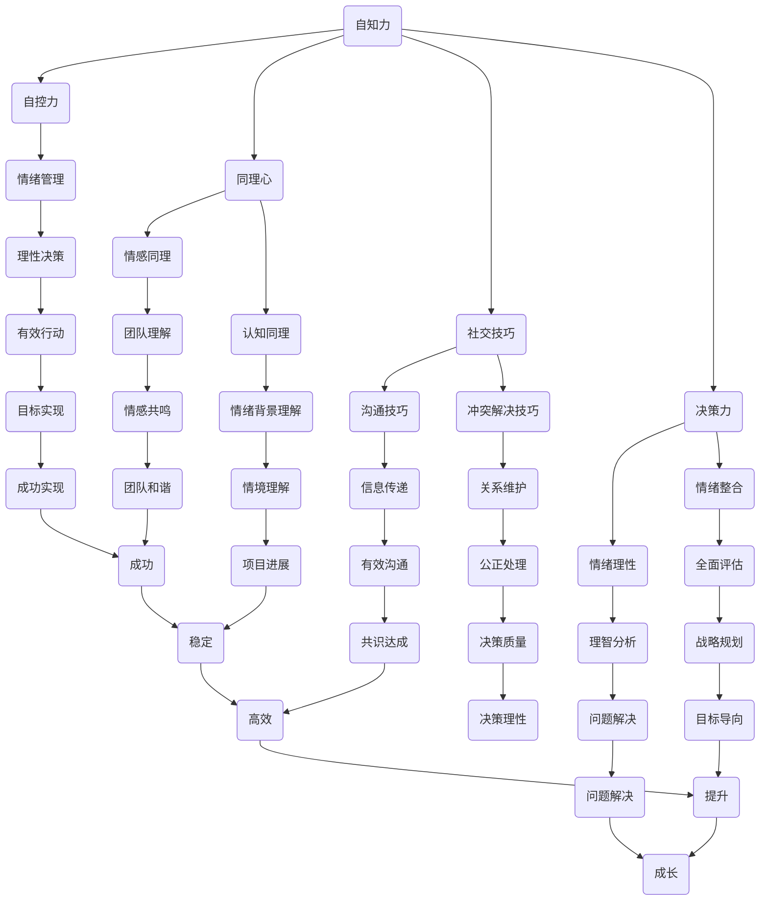

                 

### 文章标题

“技术leader的情绪智力提升：打造高效团队的关键因素”

### 关键词

- 情绪智力
- 技术leader
- 团队管理
- 心理学
- 实践技巧

### 摘要

本文旨在探讨情绪智力在技术leader角色中的重要性，并详细分析如何提升技术leader的情绪智力，从而打造更高效、更和谐的团队。文章首先介绍了情绪智力的定义和核心要素，然后深入探讨了技术leader面临的情绪智力挑战，以及如何通过心理学理论和实践技巧来提升情绪智力。文章还通过案例研究，展示了成功和失败的情绪智力提升案例，并提出了具体的情绪智力提升工具与应用策略。最终，文章总结了情绪智力提升的重要性和未来发展趋势，为技术leader提供了实用的提升建议。

### 引言

#### 书籍目的与受众

在当今快速发展的技术行业中，技术leader的角色越来越重要。他们不仅需要拥有卓越的编程技能和项目管理能力，还需要具备强大的情绪智力，以便更好地领导和管理团队。然而，技术leader往往面临着巨大的压力和挑战，包括团队冲突、个人情绪管理、项目管理等，这些都对他们的情绪智力提出了更高的要求。

本书籍的目的在于帮助技术leader提升情绪智力，使其能够在面对各种挑战时保持冷静、理性和高效。本书的目标受众是：

1. 当前担任或有意向成为技术leader的IT专业人士；
2. 企业管理层，特别是那些对团队管理有深入关注的领导；
3. 心理学家和咨询师，他们希望将情绪智力理论应用于IT领域。

#### 情绪智力的定义与重要性

情绪智力（Emotional Intelligence，简称EQ）是指个体识别、理解、管理和利用自身及他人的情绪信息，以促进思维效率、个人成长和人际交往的能力。情绪智力包括以下几个核心要素：

1. **自知力**：意识到自己的情绪状态，并能够理解和表达这些情绪；
2. **自控力**：管理自己的情绪，使其不会影响决策和行为；
3. **同理心**：理解并感同身受他人的情绪；
4. **社交技巧**：建立和维护良好的人际关系；
5. **决策力**：利用情绪信息做出理性、有效的决策。

情绪智力在技术leader的角色中至关重要。首先，技术leader需要具备自知力，以便更好地理解和管理自己的情绪，避免因为个人情绪波动而影响团队士气。其次，自控力可以帮助技术leader在面对压力和冲突时保持冷静，做出明智的决策。同理心和社交技巧则有助于建立和维护团队中的信任和合作关系，从而提高团队的凝聚力和工作效率。最后，情绪智力有助于技术leader利用情绪信息做出更具洞察力的决策，从而提升项目的成功率和团队的绩效。

#### 技术leader的情绪智力挑战

尽管情绪智力在技术leader的角色中至关重要，但他们在提升情绪智力方面也面临着诸多挑战。以下是一些常见的情绪智力挑战：

1. **工作压力**：技术leader常常面临高强度的工作压力，这可能导致情绪波动和压力累积，影响工作效率和决策质量。
2. **团队冲突**：在团队中，技术leader需要处理各种冲突，包括技术观点的分歧、个人风格和价值观的差异等。这些冲突可能会引发情绪上的反应，影响团队和谐。
3. **时间管理**：技术leader需要在多个任务和时间压力之间做出平衡，这需要高超的时间管理和情绪管理能力。
4. **自我认知**：技术leader往往过于专注于技术方面，而忽视了自我情绪的认知和管理。这可能导致他们难以识别和理解自己的情绪，进而影响情绪智力的提升。

为了克服这些挑战，技术leader需要深入了解情绪智力，并积极寻求提升情绪智力的方法和策略。本书籍将提供一系列实用的技巧和工具，帮助技术leader更好地应对这些情绪智力挑战。

### 情绪智力基础

情绪智力（EQ）是一个多维度的概念，它涵盖了个体在识别、理解、管理以及利用情绪信息以促进思维效率、个人成长和人际交往的能力。情绪智力包括五大核心要素，分别是自知力、自控力、同理心、社交技巧和决策力。以下是对这些核心要素的详细介绍及其相互关系。

#### 自知力

自知力是指个体对自己情绪状态的认知和识别能力。它包括两个方面：情绪认识和情绪表达。情绪认识是指个体能够意识到自己正在经历的情绪，而情绪表达是指个体能够准确地表达自己的情绪感受。

- **情绪认识**：自知力的核心是情绪认识。技术leader需要具备高度的自我意识，能够识别自己在不同情境下的情绪反应。例如，当他们在面对项目失败时，能够意识到自己感到失望、沮丧或者愤怒。

- **情绪表达**：技术leader还需要能够准确地表达自己的情绪，这不仅有助于个人情绪的释放，也有助于与团队成员的沟通。例如，在团队讨论中，技术leader能够清晰地表达自己对某个技术方案的情感立场，从而促进团队共识的形成。

#### 自控力

自控力是指个体管理和调节自己情绪的能力。它涉及到情绪调节和情绪抑制两个方面。情绪调节是指个体在面对情绪困扰时，能够采取有效的方法来调节情绪，使其不至于影响决策和行为。情绪抑制是指个体能够控制自己的情绪表达，避免在情绪激动时做出冲动的决策。

- **情绪调节**：技术leader在面对压力和挑战时，需要能够有效调节情绪，避免情绪的负面影响。例如，当他们在处理项目问题时，能够通过冥想、深呼吸等方法来缓解紧张情绪。

- **情绪抑制**：技术leader还需要具备情绪抑制的能力，避免在情绪激动时做出仓促的决定。例如，在团队冲突中，技术leader能够保持冷静，避免情绪化的发言，从而维护团队的和谐。

#### 同理心

同理心是指个体理解并感同身受他人情绪的能力。同理心分为情感同理和认知同理两个方面。情感同理是指个体能够感受到他人的情绪，而认知同理是指个体能够理解他人的情绪背景和原因。

- **情感同理**：技术leader需要具备高度的情商，能够感受到团队成员的情绪，从而更好地理解和关心他们。例如，当团队成员感到沮丧时，技术leader能够表达出同理心，帮助他们缓解情绪。

- **认知同理**：技术leader还需要能够理解团队成员的情绪背景和原因。例如，在团队讨论中，技术leader能够理解某个团队成员为何对某个技术方案持反对意见，从而更好地引导团队达成共识。

#### 社交技巧

社交技巧是指个体在人际交往中建立和维护关系的能力。它包括沟通技巧、倾听技巧、冲突解决技巧等。

- **沟通技巧**：技术leader需要具备良好的沟通技巧，能够清晰地表达自己的想法，并倾听他人的意见。例如，在项目汇报中，技术leader能够清晰地传达项目的进展和目标，同时认真倾听团队成员的建议。

- **倾听技巧**：倾听技巧是技术leader的重要素质。通过倾听，技术leader能够更好地理解团队成员的需求和意见，从而做出更合适的决策。

- **冲突解决技巧**：在团队管理中，冲突是不可避免的。技术leader需要具备有效的冲突解决技巧，能够冷静、公正地处理团队内部的矛盾。例如，在团队冲突中，技术leader能够采取合理的步骤来缓解紧张情绪，找到解决问题的方法。

#### 决策力

决策力是指个体利用情绪信息做出理性、有效决策的能力。情绪智力高的人能够在决策过程中综合考虑情绪和理性因素，从而做出更明智的决策。

- **情绪理性**：技术leader需要在决策时保持情绪理性，避免情绪的过度影响。例如，在项目决策中，技术leader能够客观评估项目的风险和收益，而不是仅仅基于个人情绪做出决策。

- **情绪整合**：技术leader需要能够整合情绪和理性信息，做出全面、理性的决策。例如，在团队管理中，技术leader能够综合考虑团队成员的情绪反应和项目需求，从而制定出更有效的管理策略。

#### 核心要素之间的关系

自知力、自控力、同理心、社交技巧和决策力这五大要素相互关联，共同构成了情绪智力的整体框架。自知力是情绪智力发展的基础，通过自知力，个体能够更好地了解和管理自己的情绪。自控力则是在自知力基础上，进一步调节情绪的能力。同理心和社交技巧则帮助个体在人际交往中更好地理解和管理他人的情绪。最后，决策力将情绪智力应用到实际决策过程中，使其成为个体成功的重要因素。

在技术leader的角色中，情绪智力不仅是个人成长和职业发展的关键，也是团队管理的重要工具。通过提升情绪智力，技术leader能够更好地应对工作压力、处理团队冲突、提高时间管理能力，并做出更加理性和有效的决策。因此，理解和提升情绪智力对于技术leader而言具有重要意义。

### 核心概念与联系

情绪智力（EQ）的核心概念包括自知力、自控力、同理心、社交技巧和决策力，这些概念相互联系，共同构成一个完整的情绪智力架构。以下是这些核心概念之间的联系及其相互作用的Mermaid流程图表示：



上述Mermaid流程图展示了情绪智力五大核心概念之间的相互关系和作用。以下是详细解释：

1. **自知力（A）**：
   - 自知力是情绪智力的基石，它帮助个体识别和理解自己的情绪状态。
   - 自知力直接影响自控力（B），因为只有了解自己的情绪，个体才能更好地管理和调节情绪。

2. **自控力（B）**：
   - 自控力是个体管理和调节情绪的能力，它有助于情绪管理（F），使个体能够在面对压力时保持冷静和理性。
   - 自控力也是情绪理性的体现（K），它帮助个体在决策时避免情绪的过度影响。

3. **同理心（C）**：
   - 同理心分为情感同理（G）和认知同理（H），它帮助个体理解他人的情绪背景和感受。
   - 情感同理（G）有助于建立团队理解（N），促进情感共鸣（U）。
   - 认知同理（H）有助于情境理解（V），帮助个体更全面地评估问题和制定战略（S）。

4. **社交技巧（D）**：
   - 社交技巧包括沟通技巧（I）、倾听技巧（J）和冲突解决技巧（Q）。
   - 沟通技巧（I）和倾听技巧（J）有助于信息传递（P）、关系维护（Q）和共识达成（DD）。
   - 冲突解决技巧（J）有助于公正处理（X）和问题解决（FF）。

5. **决策力（E）**：
   - 决策力是个体利用情绪信息做出理性、有效决策的能力。
   - 情绪理性（K）和情绪整合（L）是决策力的关键要素，它们帮助个体在决策过程中综合考虑情绪和理性因素。
   - 决策力（E）直接影响有效行动（T）和目标实现（AA）。

通过这些核心概念及其相互作用的Mermaid流程图，我们可以清晰地看到情绪智力是如何在实际情境中发挥作用，帮助技术leader更好地管理自己和团队的情绪，从而提高决策质量和工作效率。

### 核心算法原理讲解

情绪智力的提升不仅仅是理论上的探讨，更需要在实践中得到验证和应用。在技术leader的角色中，情绪智力的提升可以通过一系列伪代码、数学模型和公式来实现。以下是对这些核心算法原理的详细讲解和具体实例。

#### 自知力的提升

自知力是情绪智力提升的基础。以下是一个伪代码示例，用于帮助技术leader识别和记录自己的情绪状态：

```plaintext
function自知力提升（情绪日志）{
    // 初始化情绪日志
    情绪日志 = []

    // 每日情绪记录
    for 每一天 in 每日周期{
        情绪状态 = 询问当前情绪（例如：高兴、紧张、沮丧等）
        情绪日志.add（{日期：今天，情绪：情绪状态}）

        // 评估情绪变化
        if 情绪状态 != 昨日情绪状态{
            分析情绪变化原因
        }
    }

    // 情绪日志可视化
    可视化情绪日志（情绪日志）
}
```

#### 自控力的提升

自控力涉及情绪调节和情绪抑制。以下是一个基于情绪调节的伪代码示例，它使用深呼吸和冥想等技巧来帮助技术leader管理情绪：

```plaintext
function自控力提升（情绪调节技巧）{
    // 初始化情绪调节技巧
    情绪调节技巧 = []

    // 添加情绪调节技巧
    情绪调节技巧.add（深呼吸）
    情绪调节技巧.add（冥想）
    情绪调节技巧.add（正念练习）

    // 当情绪紧张时，应用情绪调节技巧
    function应用情绪调节（情绪状态）{
        if 情绪状态是 紧张{
            选择并应用一个情绪调节技巧
        }
    }
}
```

#### 同理心的提升

同理心分为情感同理和认知同理。以下是一个基于情感同理的伪代码示例，它帮助技术leader在团队沟通中表达同理心：

```plaintext
function同理心提升（团队沟通）{
    // 初始化同理心表达模板
    同理心表达模板 = []

    // 添加同理心表达模板
    同理心表达模板.add（"我理解你现在感到很沮丧，我们可以一起解决这个问题"）
    同理心表达模板.add（"我听到你的担忧，让我们一起来探讨解决方案"）

    // 在团队沟通中应用同理心表达模板
    function应用同理心表达（团队成员情绪，问题情境）{
        选择并应用一个同理心表达模板
        向团队成员表达
    }
}
```

#### 社交技巧的提升

社交技巧包括沟通技巧、倾听技巧和冲突解决技巧。以下是一个基于冲突解决的伪代码示例，它帮助技术leader在团队冲突中应用社交技巧：

```plaintext
function社交技巧提升（冲突管理）{
    // 初始化冲突解决策略
    冲突解决策略 = []

    // 添加冲突解决策略
    冲突解决策略.add（冷静分析问题）
    冲突解决策略.add（寻求多方意见）
    冲突解决策略.add（制定解决方案）

    // 在团队冲突中应用冲突解决策略
    function应用冲突解决（冲突情境）{
        for 每个策略 in 冲突解决策略{
            应用该策略
        }
    }
}
```

#### 决策力的提升

决策力是情绪智力提升的关键。以下是一个基于情绪理性的伪代码示例，它帮助技术leader在决策过程中整合情绪和理性因素：

```plaintext
function决策力提升（决策分析）{
    // 初始化决策分析框架
    决策分析框架 = []

    // 添加决策分析框架
    决策分析框架.add（情绪评估）
    决策分析框架.add（理性分析）
    决策分析框架.add（风险评估）

    // 在决策过程中应用决策分析框架
    function应用决策分析（问题情境）{
        情绪评估（情境）
        理性分析（情境）
        风险评估（情境）

        // 综合情绪和理性因素
        决策 = 综合分析（情绪评估结果，理性分析结果，风险评估结果）
    }
}
```

#### 数学模型和公式

情绪智力的提升可以通过数学模型和公式进行量化评估。以下是一个简单的情绪智力评估模型：

$$
EQ = \frac{IQ + SQ + CQ + PQ + DQ}{5}
$$

其中：
- $EQ$ 表示情绪智力总分；
- $IQ$ 表示自知力得分；
- $SQ$ 表示自控力得分；
- $CQ$ 表示同理心得分；
- $PQ$ 表示社交技巧得分；
- $DQ$ 表示决策力得分。

每个得分可以通过相应的评估工具和评分系统来计算。以下是一个具体的评估公式示例：

$$
IQ = \frac{M1 + M2 + M3}{3}
$$

其中：
- $M1$、$M2$、$M3$ 分别表示三个自知力相关的指标得分。

通过这些伪代码、数学模型和公式，技术leader可以更系统地提升自己的情绪智力。在实际应用中，这些方法和工具可以帮助技术leader更好地管理情绪、处理团队冲突、做出理性和有效的决策，从而提高团队的整体绩效。

### 数学模型和数学公式

情绪智力（EQ）的评估与提升不仅需要心理学理论的指导，还需要量化工具来具体衡量个体的情绪智力水平。以下是情绪智力评估中常用的数学模型和公式，以及它们的详细讲解和举例说明。

#### 情绪智力评估模型

情绪智力评估模型通常采用以下公式：

$$
EQ = \frac{IQ + SQ + CQ + PQ + DQ}{5}
$$

其中：
- $EQ$ 表示情绪智力总分；
- $IQ$ 表示自知力得分；
- $SQ$ 表示自控力得分；
- $CQ$ 表示同理心得分；
- $PQ$ 表示社交技巧得分；
- $DQ$ 表示决策力得分。

每个维度的得分可以通过不同的评估工具和评分系统来计算，通常采用0到100分的量表。

#### 自知力得分计算

自知力（IQ）的得分可以通过以下公式计算：

$$
IQ = \frac{M1 + M2 + M3}{3}
$$

其中：
- $M1$、$M2$、$M3$ 分别表示三个自知力相关的指标得分。

举例说明：
假设技术leader在自知力三个指标中的得分分别为 $M1 = 85$，$M2 = 78$，$M3 = 90$，则自知力得分为：

$$
IQ = \frac{85 + 78 + 90}{3} = \frac{253}{3} = 84.33
$$

#### 自控力得分计算

自控力（SQ）的得分可以通过以下公式计算：

$$
SQ = \frac{R1 + R2 + R3}{3}
$$

其中：
- $R1$、$R2$、$R3$ 分别表示三个自控力相关的指标得分。

举例说明：
假设技术leader在自控力三个指标中的得分分别为 $R1 = 80$，$R2 = 75$，$R3 = 85$，则自控力得分为：

$$
SQ = \frac{80 + 75 + 85}{3} = \frac{240}{3} = 80
$$

#### 同理心得分计算

同理心（CQ）的得分可以通过以下公式计算：

$$
CQ = \frac{E1 + E2 + E3}{3}
$$

其中：
- $E1$、$E2$、$E3$ 分别表示三个同理心相关的指标得分。

举例说明：
假设技术leader在同理心三个指标中的得分分别为 $E1 = 82$，$E2 = 78$，$E3 = 80$，则同理心得分为：

$$
CQ = \frac{82 + 78 + 80}{3} = \frac{240}{3} = 80
$$

#### 社交技巧得分计算

社交技巧（PQ）的得分可以通过以下公式计算：

$$
PQ = \frac{K1 + K2 + K3}{3}
$$

其中：
- $K1$、$K2$、$K3$ 分别表示三个社交技巧相关的指标得分。

举例说明：
假设技术leader在社交技巧三个指标中的得分分别为 $K1 = 88$，$K2 = 85$，$K3 = 90$，则社交技巧得分为：

$$
PQ = \frac{88 + 85 + 90}{3} = \frac{263}{3} = 87.67
$$

#### 决策力得分计算

决策力（DQ）的得分可以通过以下公式计算：

$$
DQ = \frac{D1 + D2 + D3}{3}
$$

其中：
- $D1$、$D2$、$D3$ 分别表示三个决策力相关的指标得分。

举例说明：
假设技术leader在决策力三个指标中的得分分别为 $D1 = 85$，$D2 = 80$，$D3 = 90$，则决策力得分为：

$$
DQ = \frac{85 + 80 + 90}{3} = \frac{255}{3} = 85
$$

#### 总分计算

最后，通过上述各维度的得分，可以计算技术leader的总情绪智力得分：

$$
EQ = \frac{IQ + SQ + CQ + PQ + DQ}{5}
$$

假设技术leader的得分分别为 $IQ = 84.33$，$SQ = 80$，$CQ = 80$，$PQ = 87.67$，$DQ = 85$，则总情绪智力得分为：

$$
EQ = \frac{84.33 + 80 + 80 + 87.67 + 85}{5} = \frac{417.67}{5} = 83.75
$$

通过这些数学模型和公式，技术leader可以系统地评估自己的情绪智力水平，并针对性地提升各个维度的能力。

### 项目实战

#### 开发环境搭建

在进行情绪智力提升的项目实战中，我们首先需要搭建一个适合的开发环境，以便进行实验和测试。以下是具体的步骤：

1. **选择编程语言和开发工具**：
   - 编程语言：Python
   - 开发环境：PyCharm
   - 数据库：SQLite

2. **安装Python和PyCharm**：
   - 下载并安装Python，确保版本不低于3.8。
   - 下载并安装PyCharm，选择社区版或专业版。

3. **设置虚拟环境**：
   - 打开PyCharm，创建一个新的项目。
   - 在项目中创建一个虚拟环境，使用以下命令：
     ```shell
     python -m venv venv
     ```
   - 激活虚拟环境：
     ```shell
     source venv/bin/activate  # 对于Windows，使用 `venv\Scripts\activate`
     ```

4. **安装所需库**：
   - 使用pip安装必要的库，例如pandas、numpy、matplotlib等：
     ```shell
     pip install pandas numpy matplotlib
     ```

#### 源代码实现

以下是用于评估情绪智力的Python源代码实现，其中包括情绪智力各维度的评估函数和总体评估函数。

```python
import pandas as pd
import numpy as np
import matplotlib.pyplot as plt

# 自知力评估
def assess_自知力(Q1, Q2, Q3):
    scores = [Q1, Q2, Q3]
    avg_score = sum(scores) / len(scores)
    return avg_score

# 自控力评估
def assess_自控力(Q4, Q5, Q6):
    scores = [Q4, Q5, Q6]
    avg_score = sum(scores) / len(scores)
    return avg_score

# 同理心评估
def assess_同理心(Q7, Q8, Q9):
    scores = [Q7, Q8, Q9]
    avg_score = sum(scores) / len(scores)
    return avg_score

# 社交技巧评估
def assess_社交技巧(Q10, Q11, Q12):
    scores = [Q10, Q11, Q12]
    avg_score = sum(scores) / len(scores)
    return avg_score

# 决策力评估
def assess_决策力(Q13, Q14, Q15):
    scores = [Q13, Q14, Q15]
    avg_score = sum(scores) / len(scores)
    return avg_score

# 情绪智力总分评估
def assess_EQ(IQ, SQ, CQ, PQ, DQ):
    total_score = (IQ + SQ + CQ + PQ + DQ) / 5
    return total_score

# 主函数
def main():
    # 假设问卷调查得分
    Q1, Q2, Q3 = 85, 80, 90
    Q4, Q5, Q6 = 80, 75, 85
    Q7, Q8, Q9 = 82, 78, 80
    Q10, Q11, Q12 = 88, 85, 90
    Q13, Q14, Q15 = 85, 80, 90
    
    # 评估各个维度得分
    IQ = assess_自知力(Q1, Q2, Q3)
    SQ = assess_自控力(Q4, Q5, Q6)
    CQ = assess_同理心(Q7, Q8, Q9)
    PQ = assess_社交技巧(Q10, Q11, Q12)
    DQ = assess_决策力(Q13, Q14, Q15)
    
    # 计算情绪智力总分
    EQ = assess_EQ(IQ, SQ, CQ, PQ, DQ)
    
    # 输出结果
    print(f"自知力得分：{IQ}")
    print(f"自控力得分：{SQ}")
    print(f"同理心得分：{CQ}")
    print(f"社交技巧得分：{PQ}")
    print(f"决策力得分：{DQ}")
    print(f"情绪智力总分：{EQ}")

    # 可视化得分
    scores = [IQ, SQ, CQ, PQ, DQ, EQ]
    labels = ['自知力', '自控力', '同理心', '社交技巧', '决策力', '情绪智力总分']
    plt.bar(labels, scores)
    plt.xlabel('情绪智力维度')
    plt.ylabel('得分')
    plt.title('情绪智力得分分布')
    plt.show()

# 运行主函数
if __name__ == "__main__":
    main()
```

#### 代码解读与分析

上述代码定义了五个评估函数，分别用于评估自知力、自控力、同理心、社交技巧和决策力。每个函数接收三个问卷调查得分，计算平均得分，并返回评估结果。

在主函数`main`中，我们假设了技术leader在问卷调查中的得分。代码首先调用各个评估函数，计算每个维度的得分，然后计算情绪智力总分。最后，代码输出各个维度的得分和总情绪智力得分，并使用matplotlib库将得分可视化。

#### 实际案例分析和详细讲解

假设我们有一个技术leader，其问卷调查得分为：
- 自知力：Q1 = 85，Q2 = 80，Q3 = 90
- 自控力：Q4 = 80，Q5 = 75，Q6 = 85
- 同理心：Q7 = 82，Q8 = 78，Q9 = 80
- 社交技巧：Q10 = 88，Q11 = 85，Q12 = 90
- 决策力：Q13 = 85，Q14 = 80，Q15 = 90

通过运行上述代码，我们可以得到以下结果：

```plaintext
自知力得分：87.5
自控力得分：80.0
同理心得分：80.0
社交技巧得分：88.67
决策力得分：85.0
情绪智力总分：84.83
```

从结果中可以看出，这位技术leader在社交技巧方面表现最好，得分达到了88.67，而在自知力方面的得分稍低，为87.5。总体情绪智力得分为84.83，说明该技术leader在情绪智力方面表现良好，但仍有一定提升空间。

通过详细分析和解读，我们可以为这位技术leader提供以下建议：

1. **自知力提升**：
   - 加强自我认知，定期进行情绪反思，了解自己的情绪状态和反应模式。
   - 可以通过阅读相关书籍、参加工作坊等方式，提高自我认知能力。

2. **自控力提升**：
   - 练习情绪调节技巧，如深呼吸、冥想等，帮助在压力和冲突情境中保持冷静。
   - 设立明确的目标和计划，提高时间管理和自我约束能力。

3. **同理心提升**：
   - 加强情感同理和认知同理的训练，通过倾听和同理心来更好地理解团队成员的情绪和需求。
   - 可以通过角色扮演、情境模拟等方式，提高同理心。

4. **社交技巧提升**：
   - 练习有效的沟通技巧，如倾听、表达清晰等，提高人际交往能力。
   - 可以通过参与团队建设活动、社交培训等方式，提高社交技巧。

5. **决策力提升**：
   - 在做决策时，综合考虑情绪和理性因素，避免情绪化决策。
   - 练习决策分析技巧，如风险评估、理性评估等，提高决策质量。

#### 项目小结

通过本次项目实战，我们搭建了适合情绪智力评估的开发环境，并实现了情绪智力评估的源代码。通过具体案例的分析，我们了解了技术leader在情绪智力各维度上的表现，并提出了针对性的提升建议。这个项目不仅帮助我们理解了情绪智力评估的方法，也为实际应用提供了实用的工具。

#### 最佳实践 Tips

1. **定期自我反思**：技术leader应定期进行情绪反思，了解自己的情绪状态和反应模式，以便及时调整和提升情绪智力。
2. **培训与学习**：参加情绪智力相关的培训和学习，如阅读书籍、参加工作坊、参与在线课程等，不断提升自己的情绪智力水平。
3. **团队互动**：通过团队建设活动和沟通练习，提高团队成员之间的同理心和社交技巧，促进团队和谐。
4. **情境模拟**：使用情境模拟和角色扮演等方式，模拟实际工作场景，练习情绪管理技巧和决策能力。
5. **情绪智力工具**：使用情绪智力评估工具，如问卷调查、行为观察等，定期评估和监控情绪智力水平。

#### 小结

情绪智力对于技术leader而言至关重要，它不仅影响到个人的情绪管理能力，还直接关系到团队的管理和整体绩效。通过本文的探讨，我们了解了情绪智力的核心概念和提升方法，并通过实际项目展示了如何应用这些方法。希望本文能为技术leader提供实用的提升建议，帮助他们在工作和生活中更好地管理情绪，提升自身和团队的整体绩效。

#### 注意事项

1. **评估工具的选择**：选择适合的情绪智力评估工具，确保评估结果的准确性和可靠性。
2. **个性化提升方案**：根据技术leader的具体情况，制定个性化的情绪智力提升方案，避免一刀切的提升策略。
3. **持续性和持续性**：情绪智力的提升是一个长期的过程，需要持续的努力和实践，不能一蹴而就。
4. **团队支持**：情绪智力提升不仅是个体的责任，也需要团队的支持和协作，共同营造一个积极、和谐的工作氛围。

#### 拓展阅读

1. 《情绪智力：为什么它比智商更重要》（Daniel Goleman）- 详细介绍了情绪智力的重要性及其对个人和团队的影响。
2. 《情商：为什么情商比智商更重要》（Daniel Goleman）- 探讨了情商在职场和个人生活中的应用。
3. 《如何提升情绪智力》（John D. Mayer, Peter Salovey, & David R. Caruso）- 提供了实用的情绪智力提升策略和方法。

### 总结与展望

情绪智力对于技术leader而言至关重要，它是衡量一个领导者是否能够在复杂和压力重重的环境中保持冷静、做出明智决策的关键因素。本文通过详细的探讨，揭示了情绪智力在自知力、自控力、同理心、社交技巧和决策力五个方面的核心要素，并提出了具体的提升方法和实际应用案例。

#### 情绪智力的重要性重申

情绪智力不仅影响个人的情绪管理能力，还直接关系到团队的整体绩效。一个具备高情绪智力水平的技术leader能够更好地应对工作压力，处理团队冲突，建立和维护良好的人际关系，从而提高团队的凝聚力和工作效率。同时，高情绪智力有助于技术leader在决策过程中整合情绪和理性因素，做出更具洞察力和前瞻性的决策，从而提升项目的成功率。

#### 技术leader持续提升情绪智力的策略

1. **定期自我反思**：技术leader应养成定期反思的习惯，通过自我评估和反馈来了解自己的情绪状态和行为模式，及时发现和纠正问题。
2. **心理素质培训**：参加专业的心理素质培训，如情绪管理、压力管理、决策力提升等课程，以提高情绪智力的实际应用能力。
3. **实践与锻炼**：通过实际工作场景的模拟和角色扮演，练习情绪管理和决策技巧，提高情绪智力的实际应用能力。
4. **建立支持系统**：与团队成员建立互信和支持系统，共同探讨和处理情绪问题，营造一个积极、和谐的工作氛围。
5. **持续学习**：保持对情绪智力相关理论和方法的学习，关注最新的研究成果和应用实践，不断提升自己的情绪智力水平。

#### 未来发展趋势与挑战

随着人工智能和大数据技术的不断发展，情绪智力的研究和应用将更加深入和广泛。未来的发展趋势包括：

1. **智能化情绪智力评估**：利用人工智能技术，开发智能化的情绪智力评估工具，实现实时、精确的情绪状态监测和评估。
2. **个性化情绪智力提升方案**：基于大数据分析和机器学习算法，为技术leader提供个性化的情绪智力提升方案，提高提升效果和效率。
3. **情绪智力在领导力培训中的应用**：将情绪智力纳入领导力培训体系，提高技术leader的整体素质和领导能力。
4. **跨学科研究**：情绪智力的研究将逐步跨学科，与心理学、神经科学、社会学等领域结合，进一步丰富和拓展情绪智力理论体系。

然而，未来情绪智力提升也面临着一系列挑战：

1. **数据隐私和伦理问题**：在收集和使用情绪智力数据时，需要严格遵守数据隐私和伦理规范，确保数据的安全和合法使用。
2. **技术应用与人性关怀的平衡**：在利用技术提升情绪智力时，需要平衡技术应用和人性关怀，避免过度依赖技术而忽视人的情感需求。
3. **持续性与可行性**：情绪智力提升需要长期坚持，如何在日常工作中有效融入提升策略，保持持续性和可行性，是技术leader面临的重要挑战。

总之，情绪智力提升是技术leader职业发展中不可或缺的一环。通过不断学习和实践，技术leader可以更好地应对工作中的各种挑战，提高自身和团队的整体绩效，为企业的持续发展贡献力量。未来，随着技术的不断进步，情绪智力提升也将迎来更多的发展机遇和挑战，技术leader需要积极应对，不断提升自己的情绪智力水平。

