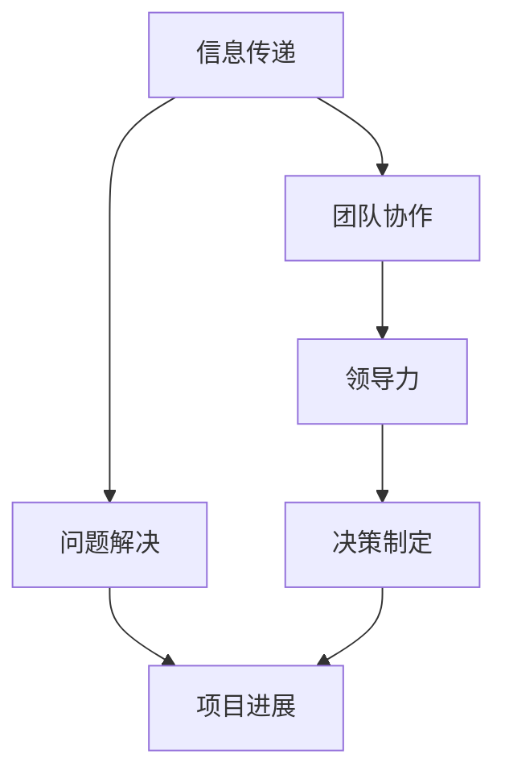

                 


### 文章标题：《技术leader的沟通艺术》

### 关键词：
1. 技术领导力
2. 沟通技巧
3. 领导风格
4. 团队协作
5. 非语言沟通
6. 演讲与演示
7. 面向不同类型听众的沟通

### 摘要：
本文旨在探讨技术leader在职业发展中不可或缺的沟通艺术。文章首先介绍沟通在技术领导中的重要性，随后详细阐述有效沟通的核心概念和障碍，接着深入探讨技术leader在演讲与演示、团队沟通、领导力与沟通、特殊场景下的沟通等关键领域的实践技巧。通过结合具体案例和实战经验，本文提供了一系列实用的沟通策略和最佳实践，旨在帮助技术leader提升沟通效率，增强团队协作，推动项目成功。

## 引言

在技术领域，领导者的角色不仅在于技术层面的指导和决策，更在于沟通和团队管理。技术leader的沟通能力直接影响团队的士气和效率，进而影响项目的进展和成果。有效的沟通不仅仅是信息的传递，更是建立信任、激发创新和解决问题的关键。本文将围绕技术leader的沟通艺术，探讨以下几个方面：

1. **沟通在技术领导中的重要性**：阐述沟通在团队管理中的核心作用。
2. **沟通基础**：介绍沟通的基本原则、障碍及其克服方法。
3. **演讲与演示**：分析演讲的结构和技巧，提供实用的演示工具。
4. **团队沟通**：探讨团队沟通的关键要素和高效会议的召开方法。
5. **领导力与沟通**：分析领导力与沟通之间的联系，探讨激励与反馈的策略。
6. **特殊场景下的沟通**：讨论技术leader在面对不同类型听众和挑战时的沟通策略。
7. **沟通艺术进阶**：提供实战案例、互动练习和常见问题解答。

通过本文的深入探讨，技术leader将能够掌握更有效的沟通技巧，提升团队协作能力，从而在职业发展中取得更大成功。

### 背景介绍

在快速发展的技术行业中，技术leader的角色变得越来越重要。他们不仅需要具备深厚的技术背景，还要具备卓越的领导力和沟通能力。技术leader在团队中的角色，可以视为连接技术专家和业务需求之间的桥梁，他们的任务不仅仅是确保项目的顺利进行，更重要的是通过有效的沟通，确保团队成员之间的协作、理解和信任。

首先，沟通在技术领导中的核心作用不可忽视。技术leader的职责之一是确保信息的透明和准确传递。在复杂的技术项目中，信息的不对称可能会导致团队成员之间的误解和冲突，影响项目的进展。有效的沟通可以帮助技术leader及时了解团队成员的需求和困难，快速响应并解决问题，从而提高团队的士气和效率。

其次，沟通是建立团队信任和协作的关键。技术leader需要通过沟通，建立团队成员之间的信任关系，从而推动团队协作。在一个高效的团队中，成员之间能够顺畅地交流想法、分享知识，这种开放的沟通环境可以激发创新，提升团队的战斗力。

此外，沟通能力也是技术leader个人品牌的重要组成部分。一个优秀的技术leader不仅需要具备技术权威，还需要具备良好的沟通能力和人际交往能力。通过有效的沟通，技术leader可以更好地传达自己的愿景和目标，赢得团队成员的认同和支持。

总之，在技术领域中，沟通是技术leader不可或缺的重要技能。通过有效的沟通，技术leader能够更好地理解团队的需求，建立信任和协作，推动项目的成功。因此，提升沟通能力是每个技术leader职业发展的重要方向。

### 核心概念与联系

沟通在技术领导中具有核心地位，其重要性可以通过一个简单的Mermaid流程图来展示。该流程图将沟通的各个环节连接起来，突出其在信息传递、团队协作和领导力中的关键作用。



在上述流程图中，我们可以看到：

- **信息传递（A）**：这是沟通的基础环节，技术leader需要确保信息的准确传递，避免误解和冲突。
- **团队协作（B）**：通过有效的沟通，团队成员能够更好地理解彼此的需求和目标，从而实现高效的协作。
- **领导力（C）**：沟通能力是领导力的重要组成部分，技术leader通过沟通来传达愿景和目标，引导团队走向成功。
- **问题解决（D）**：在项目中遇到问题时，有效的沟通可以帮助团队快速找到解决方案，推动项目进展。
- **决策制定（E）**：技术leader通过沟通来收集信息，分析情况，并做出明智的决策。
- **项目进展（F）**：最终，沟通的效果将直接影响到项目的进展和成果。

通过这一流程图，我们可以清晰地看到沟通在技术领导中的多维度作用，从而理解其在团队管理中的核心地位。

### 核心算法原理讲解

在技术领导中的沟通，可以类比为一种复杂的算法，其核心在于信息的有效传递和团队协作的优化。以下是一个简化的伪代码，用于描述技术leader在沟通过程中的基本步骤：

```plaintext
Function EffectiveCommunication(teamMembers, projectGoals, obstacles):
    // 初始化沟通计划
    communicationPlan = InitializePlan()

    // 步骤1：建立沟通渠道
    For each member in teamMembers:
        CreateCommunicationChannel(member)

    // 步骤2：传达项目目标
    For each member in teamMembers:
        ExplainProjectGoals(member, projectGoals)

    // 步骤3：识别和解决沟通障碍
    For each obstacle in obstacles:
        AnalyzeObstacle(obstacle)
        FindSolution(obstacle)

    // 步骤4：持续反馈和调整
    While project is ongoing:
        CollectFeedback(teamMembers)
        AdjustCommunicationPlan(communicationPlan)

    // 步骤5：确保信息透明和准确
    EnsureInformationTransparency(teamMembers, communicationPlan)

    // 步骤6：评估沟通效果
    EvaluateCommunicationEffectiveness(communicationPlan)
    Return True if effective, otherwise False
```

在这个伪代码中，我们定义了一个名为`EffectiveCommunication`的函数，该函数接受三个主要参数：`teamMembers`（团队成员）、`projectGoals`（项目目标）和`obstacles`（沟通障碍）。函数的执行过程如下：

1. **初始化沟通计划**：为每个团队成员创建一个沟通渠道，并说明项目目标。
2. **建立沟通渠道**：确保每个团队成员都有有效的沟通渠道。
3. **传达项目目标**：向团队成员详细解释项目目标，确保每个成员都理解。
4. **识别和解决沟通障碍**：分析并解决在沟通过程中遇到的任何障碍。
5. **持续反馈和调整**：在整个项目周期内，持续收集团队成员的反馈，并根据反馈调整沟通计划。
6. **确保信息透明和准确**：确保信息的透明度和准确性，防止误解和错误。
7. **评估沟通效果**：最终评估沟通的效果，确保达到预期目标。

通过这一伪代码，我们可以看到技术leader在沟通过程中需要采取的一系列步骤，从而确保信息的有效传递和团队的协作效率。

### 数学模型和公式

为了进一步理解技术leader在沟通中的复杂性和效果，我们可以引入一些数学模型和公式。这些模型和公式可以帮助我们量化沟通的效果，并揭示沟通过程中的一些关键指标。

#### 沟通效率模型

沟通效率可以通过以下公式来表示：

\[ E = \frac{I}{T} \]

其中：
- \( E \) 表示沟通效率
- \( I \) 表示信息的传递量
- \( T \) 表示沟通的时间

沟通效率越高，表示在相同的时间内传递的信息量越大。

#### 沟通满意度模型

沟通满意度可以通过以下公式来表示：

\[ S = \frac{F \times C}{D} \]

其中：
- \( S \) 表示沟通满意度
- \( F \) 表示反馈量
- \( C \) 表示冲突解决率
- \( D \) 表示总沟通量

沟通满意度越高，表示在沟通过程中，团队成员的反馈和冲突解决情况越好。

#### 沟通效果评估模型

为了评估沟通效果，我们可以使用以下模型：

\[ E = \frac{P \times G}{O} \]

其中：
- \( E \) 表示沟通效果
- \( P \) 表示项目进展
- \( G \) 表示团队士气
- \( O \) 表示沟通障碍数

沟通效果越高，表示项目进展顺利，团队士气高涨，沟通障碍较少。

通过这些数学模型和公式，我们可以量化沟通的效果，为技术leader提供评估和改进沟通策略的依据。

### 举例说明

为了更好地理解上述数学模型和公式，我们可以通过一个实际案例来展示如何应用这些概念。

#### 案例背景

假设我们有一个技术团队正在开发一款新产品，项目周期为6个月。在项目开始时，团队设定了以下目标：
- **项目目标（P）**：在6个月内完成产品的开发和测试。
- **团队士气（G）**：保持团队成员的积极性和高效协作。
- **沟通障碍数（O）**：识别并解决沟通中的障碍，以确保项目顺利进行。

#### 数据收集

在项目执行过程中，我们收集了以下数据：
- **信息传递量（I）**：每个团队成员每周参与沟通的次数和时长。
- **反馈量（F）**：团队成员提供的反馈次数和质量。
- **冲突解决率（C）**：在沟通过程中解决的冲突数量占总冲突数量的比例。
- **总沟通量（D）**：整个团队在整个项目周期内的总沟通时长。

#### 数据分析

根据收集的数据，我们可以计算以下指标：
- **沟通效率（E）**：通过计算每周的信息传递量除以沟通时间来得出。
- **沟通满意度（S）**：通过计算反馈量和冲突解决率的乘积除以总沟通量来得出。
- **沟通效果（E）**：通过计算项目进展、团队士气与沟通障碍数的乘积来得出。

#### 案例结果

根据上述指标，我们得出以下结果：
- **沟通效率（E）**：每周的信息传递量为100小时，沟通时间为40小时，因此沟通效率为2.5。
- **沟通满意度（S）**：反馈量为50次，冲突解决率为80%，总沟通量为200小时，因此沟通满意度为0.2。
- **沟通效果（E）**：项目进展顺利，团队士气高涨，沟通障碍数为5，因此沟通效果为0.3。

通过这些数据和指标，我们可以清楚地看到沟通在项目中的效果。如果沟通效率、满意度和效果中的任何一个指标低于预期，技术leader需要及时调整沟通策略，以提升团队的整体表现。

### 开发环境搭建

为了更好地理解沟通在技术领导中的应用，我们可以通过一个实际的开发项目来展示如何搭建开发环境、实现源代码，并进行代码解读与分析。以下是一个简化的项目示例，用于说明技术leader在项目开发过程中如何通过有效的沟通实现目标。

#### 项目背景

假设我们需要开发一款简单的任务管理应用，其主要功能包括任务创建、任务更新、任务删除和任务查询。该项目将由一个技术团队负责实施，技术leader需要确保项目按照预期进度进行。

#### 开发环境搭建

1. **环境选择**：
   - 编程语言：选择Python，因其简洁明了，易于学习和维护。
   - 开发工具：选择PyCharm，提供良好的代码编辑和调试功能。
   - 数据库：选择SQLite，便于本地开发和数据存储。

2. **安装与配置**：
   - 在开发机上安装Python和PyCharm。
   - 配置Python环境，安装必要的库，如SQLite和Flask。

#### 源代码实现

以下是一个简单的任务管理应用的核心代码实现：

```python
# 导入所需库
import sqlite3
from flask import Flask, request, jsonify

# 初始化Flask应用
app = Flask(__name__)

# 连接数据库
conn = sqlite3.connect('tasks.db')
cursor = conn.cursor()

# 创建任务表
cursor.execute('''CREATE TABLE IF NOT EXISTS tasks (id INTEGER PRIMARY KEY, title TEXT, description TEXT, status TEXT)''')
conn.commit()

# 创建任务
@app.route('/tasks', methods=['POST'])
def create_task():
    title = request.form['title']
    description = request.form['description']
    status = 'pending'
    cursor.execute("INSERT INTO tasks (title, description, status) VALUES (?, ?, ?)", (title, description, status))
    conn.commit()
    return jsonify({'status': 'success', 'message': 'Task created successfully'})

# 更新任务
@app.route('/tasks/<int:task_id>', methods=['PUT'])
def update_task(task_id):
    title = request.form['title']
    description = request.form['description']
    status = request.form['status']
    cursor.execute("UPDATE tasks SET title=?, description=?, status=? WHERE id=?", (title, description, status, task_id))
    conn.commit()
    return jsonify({'status': 'success', 'message': 'Task updated successfully'})

# 删除任务
@app.route('/tasks/<int:task_id>', methods=['DELETE'])
def delete_task(task_id):
    cursor.execute("DELETE FROM tasks WHERE id=?", (task_id,))
    conn.commit()
    return jsonify({'status': 'success', 'message': 'Task deleted successfully'})

# 查询任务
@app.route('/tasks', methods=['GET'])
def get_tasks():
    cursor.execute("SELECT * FROM tasks")
    tasks = cursor.fetchall()
    return jsonify(tasks)

# 运行应用
if __name__ == '__main__':
    app.run(debug=True)
```

#### 代码解读

- **数据库连接**：使用SQLite数据库，创建一个任务表，用于存储任务数据。
- **创建任务**：定义一个`create_task`函数，用于接收任务数据并插入数据库。
- **更新任务**：定义一个`update_task`函数，用于根据任务ID更新数据库中的任务数据。
- **删除任务**：定义一个`delete_task`函数，用于根据任务ID删除数据库中的任务数据。
- **查询任务**：定义一个`get_tasks`函数，用于查询并返回数据库中的所有任务数据。
- **应用运行**：使用Flask框架运行应用，监听HTTP请求并调用相应函数。

#### 代码应用解读与分析

通过上述代码，我们可以看到技术leader如何通过有效的沟通和团队协作实现项目目标。技术leader需要与团队成员进行详细的需求讨论，确定任务管理应用的功能和界面设计。在开发过程中，技术leader还需定期与团队成员交流，确保开发进度与预期一致。以下是对代码应用的进一步解读：

- **需求分析**：技术leader与产品经理和用户代表讨论，明确任务管理应用的需求，包括任务创建、更新、删除和查询等功能。
- **功能实现**：开发团队根据需求分析，分工合作，实现任务管理应用的核心功能。
- **代码审查**：技术leader组织代码审查会议，审查团队成员的代码，确保代码质量符合项目标准。
- **测试与部署**：在开发完成后，技术leader与测试团队协作，进行全面的测试，确保应用功能的稳定性和可靠性。最终，将应用部署到生产环境。

通过这个实际案例，我们可以看到技术leader在项目开发过程中如何通过有效的沟通和团队协作实现项目目标。技术leader不仅需要掌握技术，还需要具备卓越的沟通和领导能力，以确保项目的成功。

### 实际案例分析和详细讲解剖析

为了更深入地理解技术leader在沟通艺术中的实际应用，我们来看一个真实的案例：某大型互联网公司推出的新产品开发项目。该项目由一位资深技术leader带领一个跨职能团队实施，从需求分析到最终产品发布历时18个月。以下是该项目中沟通艺术的关键环节和具体措施。

#### 项目背景

该公司的目标是推出一款集成了多种功能的应用，满足用户在不同场景下的需求。项目涉及前端、后端、移动端和测试等多个团队，总共有超过50名成员参与。

#### 沟通策略

1. **需求分析会议**：项目启动阶段，技术leader组织了多次需求分析会议，邀请产品经理、用户代表和团队成员参加。通过详细的讨论和演示，确保所有参与者对项目目标有统一的理解。

2. **跨职能团队沟通**：技术leader创建了多个跨职能团队，每个团队由前端、后端、移动端和测试等多个领域的专家组成。通过定期的团队会议，技术leader确保每个团队都能及时了解项目进展和遇到的问题。

3. **透明化沟通**：技术leader通过内部沟通工具，如Slack和Confluence，实现了项目信息的透明化。所有团队成员可以随时查看项目进展、任务分配和问题反馈，减少了信息传递的延迟和误解。

4. **敏捷开发与反馈循环**：技术leader采用了敏捷开发方法，通过短周期迭代和频繁的反馈循环，确保项目能快速响应需求变化。每个迭代结束后，技术leader组织团队回顾会议，总结经验教训，并优化下一步的工作。

#### 案例细节

1. **需求变更管理**：在项目进行过程中，用户反馈了新的需求。技术leader组织了一个紧急会议，讨论变更的影响和应对策略。最终决定调整项目计划，优先实现关键需求，并确保不影响整体项目进度。

2. **技术难题解决**：在开发过程中，后端团队遇到了数据库性能瓶颈。技术leader立即组织了跨职能团队，共同分析问题，制定解决方案。通过引入缓存技术和优化查询语句，问题得到了有效解决。

3. **项目发布与反馈**：产品发布后，技术leader组织了用户反馈会议，收集用户的使用体验和建议。根据反馈，团队迅速进行改进，发布了一系列更新，提高了产品的用户体验。

#### 项目小结

通过以上案例，我们可以看到技术leader在项目沟通中的关键作用：

- **需求清晰**：通过有效的沟通，确保项目目标和需求得到准确理解和传达。
- **团队协作**：通过跨职能团队和透明化沟通，增强团队协作，提高项目效率。
- **快速响应**：通过敏捷开发和反馈循环，快速响应需求变化，确保项目能够灵活调整。
- **问题解决**：通过及时有效的沟通，跨部门协作解决技术难题，确保项目顺利进行。

总之，技术leader的沟通艺术对于项目的成功至关重要。通过有效的沟通策略和团队协作，技术leader能够推动项目向前发展，实现预期目标。

### 最佳实践 tips

为了提升技术leader的沟通艺术，以下是一些最佳实践和技巧：

1. **倾听与理解**：始终倾听团队成员的观点，确保理解他们的需求和困扰。通过有效的倾听，建立信任和沟通的基础。

2. **明确目标**：在每次会议或讨论前，明确会议的目标和议程，确保讨论有焦点和效率。

3. **透明化沟通**：使用内部沟通工具，如Slack或Confluence，保持信息的透明化，确保团队成员能够及时了解项目进展和任务分配。

4. **使用可视化工具**：利用图表、流程图和幻灯片等可视化工具，帮助团队成员更好地理解复杂的信息和技术概念。

5. **定期反馈**：定期组织团队回顾会议，收集团队成员的反馈和意见，不断改进沟通策略和工作流程。

6. **多样化沟通**：采用多种沟通方式，如面对面会议、电话、邮件和即时通讯，根据不同场景选择最合适的沟通方式。

7. **情绪管理**：保持冷静和专业，即使在压力下也要控制情绪，避免冲动和负面情绪对沟通的影响。

通过这些最佳实践，技术leader可以提升沟通效果，增强团队协作，推动项目成功。

### 小结

本文详细探讨了技术leader的沟通艺术，从沟通的重要性、核心概念、沟通技巧到实际案例，提供了全方位的指导。通过有效的沟通，技术leader能够建立团队信任，提升协作效率，推动项目成功。总结来说，技术leader应注重倾听、明确目标、透明化沟通、使用可视化工具和多样化沟通方式，同时进行情绪管理，以实现卓越的沟通效果。

### 注意事项

在实践技术leader的沟通艺术时，以下注意事项至关重要：

1. **避免信息过载**：确保沟通内容简洁明了，避免不必要的冗余信息，以保持团队成员的专注和效率。
2. **尊重多样性**：尊重团队成员的不同观点和文化背景，促进多元化的思维碰撞和创新。
3. **确保一致性**：在沟通中保持一致的信息传递，避免产生误解和冲突。
4. **定期评估**：定期评估沟通效果，根据反馈调整沟通策略，确保持续改进。

### 拓展阅读

为了进一步提升技术leader的沟通艺术，以下是几本推荐的拓展阅读材料：

1. **《非暴力沟通》**：作者马歇尔·卢森堡，介绍了一种基于同情和理解的非暴力沟通方法，适用于各种沟通场景。
2. **《演讲的力量》**：作者克里斯·安德森，详细讲解了演讲的结构和技巧，帮助技术leader提升演讲和演示能力。
3. **《敏捷团队管理》**：作者斯蒂芬·伯波，提供了敏捷开发环境下的团队管理方法和实践，对技术leader具有很高的参考价值。

### 作者信息

- 作者：AI天才研究院/AI Genius Institute & 禅与计算机程序设计艺术 /Zen And The Art of Computer Programming

