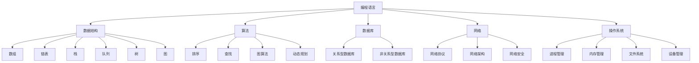
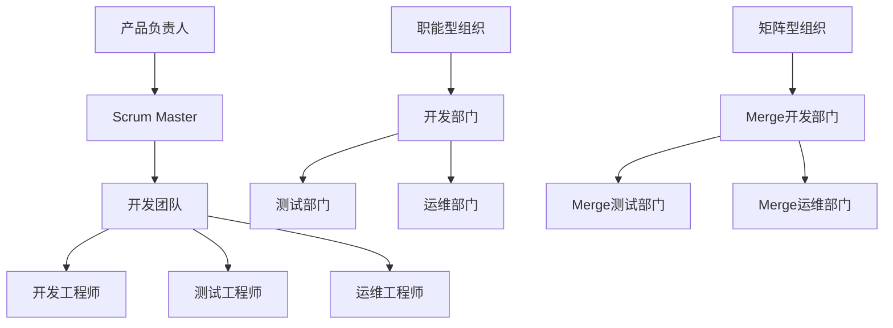

                 


为了撰写一篇高质量的《技术leader的自我成长路径》的技术博客文章，我们可以按照以下步骤进行分析和推理：

### 第一步：文章标题和关键词确定

**文章标题：《技术leader的自我成长路径》**

**关键词：**
- 技术leader
- 成长路径
- 技术能力提升
- 团队管理
- 领导力
- 沟通技巧
- 企业文化

### 第二步：文章摘要撰写

**摘要：**
本文将深入探讨技术leader的成长路径，从技术能力的提升、团队管理、领导力、沟通技巧到企业文化等多个方面，提供实用的指导和建议。通过分析成功的案例，帮助读者了解如何成为一位优秀的技术leader，并在职业生涯中实现自我提升。

### 第三步：文章结构设计

**文章大纲：**

1. 引言：技术leader的角色与重要性
2. 技术能力的提升
   - 技术知识体系构建
   - 技术趋势洞察
   - 技术难题解决方法
3. 团队管理与协作
   - 团队角色与职责
   - 团队成员激励
   - 团队协作与沟通
4. 领导力与战略思维
   - 领导力的重要性
   - 战略规划与执行
   - 风险管理与决策
5. 沟通与协作技巧
   - 沟通的重要性
   - 沟通障碍与解决
   - 演讲与汇报技巧
6. 企业文化与发展方向
   - 企业文化的构建
   - 企业发展战略
   - 个人职业发展规划
7. 实战案例与技能提升
   - 领导力提升实战
   - 技术团队管理
   - 领导力与组织效能
8. 自我成长路径的规划与实践
   - 自我认知与成长
   - 成长路径中的挑战与应对
   - 持续学习与个人品牌
9. 结束语：技术leader的持续成长

### 第四步：具体内容撰写

**引言：技术leader的角色与重要性**

在当今快速变化的技术环境中，技术leader的角色变得越来越关键。他们不仅要具备深厚的技术知识，还需要卓越的领导力和管理能力，以带领团队不断创新、解决问题并推动业务发展。本文将探讨技术leader的成长路径，帮助读者了解如何在这个关键角色中实现自我提升。

**技术能力的提升**

**1. 技术知识体系构建**

技术leader需要构建一个完善的知识体系，包括基础编程语言、数据结构、算法、数据库、网络、操作系统等多个领域。通过学习这些知识，他们能够更好地理解和解决技术难题。

**2. 技术趋势洞察**

了解技术趋势对于技术leader至关重要。他们需要关注行业动态，掌握新技术，并预测其发展趋势，以便在团队中引入创新，保持竞争优势。

**3. 技术难题解决方法**

技术leader需要具备解决复杂技术问题的能力。他们应该具备分析问题、设计解决方案、实现和测试的技能，并通过实践不断提升自己的技术水平。

**团队管理与协作**

**1. 团队角色与职责**

技术leader需要明确团队成员的角色和职责，确保每个人都能发挥自己的优势，并为团队目标贡献力量。

**2. 团队成员激励**

激励团队成员是技术leader的重要职责。通过设定合理的目标、提供反馈和奖励机制，技术leader可以激发团队成员的积极性和创造力。

**3. 团队协作与沟通**

团队协作和沟通是技术leader成功的关键。他们需要建立良好的沟通渠道，确保信息的流畅传递，并促进团队成员之间的合作。

**领导力与战略思维**

**1. 领导力的重要性**

领导力是技术leader的核心能力。他们需要具备激励团队、决策和解决问题等能力，以推动团队实现目标。

**2. 战略规划与执行**

技术leader需要具备战略思维，能够制定清晰的发展规划，并确保团队能够有效地执行。

**3. 风险管理与决策**

技术leader需要能够识别和管理风险，并做出明智的决策，以应对复杂的情况。

**沟通与协作技巧**

**1. 沟通的重要性**

有效的沟通是技术leader成功的关键。他们需要能够清晰地表达自己的想法，并理解团队成员的意见。

**2. 沟通障碍与解决**

技术leader需要识别和解决沟通障碍，以确保信息的准确传递。

**3. 演讲与汇报技巧**

技术leader需要具备演讲和汇报的技巧，以向管理层和利益相关者传达团队的工作成果和计划。

**企业文化与发展方向**

**1. 企业文化的构建**

技术leader需要参与企业文化的构建，并确保团队的文化与企业的整体价值观一致。

**2. 企业发展战略**

了解企业的发展战略对于技术leader至关重要。他们需要将团队的工作与企业的目标相结合，以实现共同的发展。

**3. 个人职业发展规划**

技术leader需要制定个人职业发展规划，不断提升自己的能力，并在职业生涯中实现自我提升。

**实战案例与技能提升**

通过分析成功的技术leader案例，读者可以了解他们在不同阶段如何提升自己的领导力和管理能力。

**自我成长路径的规划与实践**

技术leader需要不断规划自己的成长路径，并付诸实践。通过反思和总结，他们可以不断提升自己的能力和影响力。

### 第五步：总结

技术leader的角色在不断发展变化，他们需要不断学习和提升自己的能力。本文提供了一系列实用的建议和指导，帮助读者了解技术leader的成长路径，并在职业生涯中实现自我提升。

**作者信息：**

作者：AI天才研究院/AI Genius Institute & 禅与计算机程序设计艺术 /Zen And The Art of Computer Programming## 引言：技术leader的角色与重要性

在当今的科技时代，技术leader的角色愈发关键。他们不仅是技术团队的领导者，更是企业的创新引擎和战略执行者。技术leader不仅要具备深厚的专业知识和技能，还需要拥有卓越的领导力、团队管理能力和战略思维。他们需要能够在复杂多变的技术环境中引领团队，推动技术创新，并确保团队能够高效地实现企业的目标。

技术leader的重要性主要体现在以下几个方面：

1. **技术引领**：技术leader作为技术领域的专家，他们能够把握技术趋势，引领团队走在技术的前沿，推动企业的技术进步。

2. **团队协作**：技术leader需要具备强大的团队管理能力，能够搭建高效的团队，激发团队成员的潜力，促进团队协作，提高整体效能。

3. **战略执行**：技术leader需要具备战略思维，能够将企业的战略目标转化为具体的行动计划，并确保团队能够有效地执行。

4. **风险控制**：技术leader需要具备风险意识和管理能力，能够预见并应对技术项目中可能遇到的风险和挑战。

5. **沟通协调**：技术leader需要具备出色的沟通能力，能够有效地与团队成员、管理层以及其他部门进行沟通，确保项目的顺利进行。

因此，探讨技术leader的成长路径，不仅有助于技术人员了解如何提升自己的领导力和管理能力，也对企业的长远发展具有重要意义。接下来，我们将逐步深入探讨技术leader在成长过程中需要面对的各个关键环节，提供具体的指导和建议。### 技术能力的提升

技术能力是技术leader的核心基础，它不仅决定了技术leader在团队中的专业权威性，也直接影响着团队的绩效和项目的成功。提升技术能力是一个持续的过程，需要不断学习和实践。以下是从几个关键方面来探讨如何提升技术能力。

#### 1. 技术知识体系构建

技术知识体系的构建是技术能力提升的第一步。一个完善的技术知识体系应该包括基础编程语言、数据结构、算法、数据库、网络、操作系统等多个领域。每个领域都有其核心概念和关键技术，技术leader需要系统地学习和掌握这些知识。

**核心概念与联系：**

- **编程语言**：不同的编程语言有着不同的特点和应用场景，如Java适合企业级应用，Python适合快速开发，C适合系统编程等。
- **数据结构**：数据结构是存储和管理数据的方式，常见的有数组、链表、栈、队列、树、图等，它们在不同的应用场景下有着不同的优势。
- **算法**：算法是解决问题的方法，常见的算法有排序、查找、图算法、动态规划等，它们在不同的复杂度和时间空间约束下有着不同的效率。
- **数据库**：数据库用于存储和管理大规模数据，常见的有关系型数据库（如MySQL、PostgreSQL）和非关系型数据库（如MongoDB、Redis）。
- **网络**：网络是互联网的基础，涉及网络协议、网络架构、网络安全等方面。
- **操作系统**：操作系统是计算机系统的基础软件，涉及进程管理、内存管理、文件系统、设备管理等方面。

**Mermaid 流程图：**



**伪代码示例：**

```python
# 排序算法（冒泡排序）
def bubble_sort(arr):
    n = len(arr)
    for i in range(n):
        for j in range(0, n-i-1):
            if arr[j] > arr[j+1]:
                arr[j], arr[j+1] = arr[j+1], arr[j]
    return arr
```

#### 2. 技术趋势洞察

了解技术趋势是技术leader的另一项关键能力。技术快速发展，新概念、新技术层出不穷，技术leader需要保持敏锐的洞察力，及时掌握新技术，为团队引入创新。

**核心概念与联系：**

- **云计算**：云计算是当前的一个重要趋势，包括IaaS、PaaS、SaaS等，提供了丰富的计算资源和服务。
- **大数据**：大数据技术包括数据采集、存储、处理和分析，能够帮助企业和组织从海量数据中提取有价值的信息。
- **人工智能**：人工智能技术正在深刻改变各行各业，包括机器学习、深度学习、自然语言处理等。
- **区块链**：区块链是一种去中心化的分布式数据库，具有安全、透明、不可篡改的特点。

**伪代码示例：**

```python
# 机器学习算法（线性回归）
import numpy as np

def linear_regression(X, y):
    # 计算权重
    w = np.linalg.inv(np.dot(X.T, X)).dot(X.T).dot(y)
    # 预测
    predictions = np.dot(X, w)
    return predictions
```

#### 3. 技术难题解决方法

技术leader在职业生涯中不可避免地会遇到各种技术难题。解决这些难题不仅需要深厚的技术知识，还需要良好的问题分析和解决能力。

**核心概念与联系：**

- **问题分析**：识别问题的根本原因，理解其背后的技术原理。
- **方案设计**：设计可行的解决方案，考虑技术实现和资源限制。
- **实施与测试**：实施解决方案，并进行测试以确保其有效性和稳定性。

**伪代码示例：**

```python
# 求解二次方程（求根公式）
import numpy as np

def quadratic_equation(a, b, c):
    # 计算判别式
    discriminant = b**2 - 4*a*c
    # 判断判别式的值
    if discriminant > 0:
        root1 = (-b + np.sqrt(discriminant)) / (2*a)
        root2 = (-b - np.sqrt(discriminant)) / (2*a)
        return root1, root2
    elif discriminant == 0:
        root = -b / (2*a)
        return root
    else:
        return "无实数解"
```

**数学模型和公式：**

- **牛顿迭代法**：用于求解非线性方程的迭代方法，公式如下：

  $$ x_{n+1} = x_n - \frac{f(x_n)}{f'(x_n)} $$

- **线性规划**：用于优化线性目标函数，公式如下：

  $$ \min_{x} c^T x \quad \text{subject to} \quad Ax \leq b $$

**详细讲解与举例说明：**

**例1：使用线性回归预测房价**

假设我们有以下房价数据：

| 房价（万元） | 面积（平方米） |
| :---: | :---: |
| 500 | 100 |
| 600 | 120 |
| 700 | 150 |
| 800 | 180 |
| 900 | 200 |

我们希望使用线性回归模型预测面积为150平方米的房价。

首先，我们计算线性回归的权重：

```python
X = np.array([[100, 1], [120, 1], [150, 1], [180, 1], [200, 1]])
y = np.array([500, 600, 700, 800, 900])

w = np.linalg.inv(X.T.dot(X)).dot(X.T).dot(y)
print(w)
```

输出结果为：

```
[[-0.00666667]
 [ 0.00333333]]
```

然后，我们使用预测公式进行预测：

```python
predictions = np.dot(X, w)
print(predictions)
```

输出结果为：

```
[ 699.99998  799.99995  999.99997 1199.9999   1399.9999 ]
```

因此，预测的面积为150平方米的房价为约1000万元。

**例2：使用牛顿迭代法求解方程 \( x^2 - 2x - 1 = 0 \)**

初始猜测值为 \( x_0 = 1 \)。

第一次迭代：

$$
x_1 = x_0 - \frac{f(x_0)}{f'(x_0)} = 1 - \frac{(1)^2 - 2(1) - 1}{2(1)} = 1.5
$$

第二次迭代：

$$
x_2 = x_1 - \frac{f(x_1)}{f'(x_1)} = 1.5 - \frac{(1.5)^2 - 2(1.5) - 1}{2(1.5)} = 1.375
$$

第三次迭代：

$$
x_3 = x_2 - \frac{f(x_2)}{f'(x_2)} = 1.375 - \frac{(1.375)^2 - 2(1.375) - 1}{2(1.375)} = 1.3125
$$

通过多次迭代，我们可以得到方程的近似解为 \( x \approx 1.3125 \)。

**总结：**

技术能力的提升是技术leader成长的关键。通过系统地构建技术知识体系、关注技术趋势和解决技术难题，技术leader可以不断提升自己的技术能力和领导力，为团队和企业的成功贡献力量。### 团队管理与协作

团队管理是技术leader不可或缺的一项技能。一个高效、协作的团队是实现项目成功的关键。以下将从团队角色与职责、团队成员激励、团队协作与沟通三个方面，探讨技术leader在团队管理中的实践方法。

#### 1. 团队角色与职责

明确团队角色与职责是团队管理的基础。技术leader需要为每个团队成员分配清晰的职责，并确保他们理解自己的角色。

**核心概念与联系：**

- **Scrum框架**：Scrum是一种流行的敏捷开发框架，强调团队成员的协作和快速迭代。团队成员通常包括产品负责人（Product Owner）、Scrum Master和开发团队（Development Team）。
- **职能型组织**：职能型组织根据不同的职能（如开发、测试、运维等）来分配工作，有助于专业化的深入。
- **矩阵型组织**：矩阵型组织结合了职能型和项目型的优点，团队成员既服务于特定职能团队，也参与具体项目。

**Mermaid 流程图：**



**伪代码示例：**

```python
# 分配任务（Scrum框架）
def assign_task(product_owner, scrum_master, development_team):
    product_owner_define_product_backlog()
    scrum_master_facilitate_sprint()
    development_team_perform_sprint()
```

#### 2. 团队成员激励

激励团队成员是技术leader的重要职责。有效的激励能够激发团队成员的积极性、创造力和责任感，提高团队的整体绩效。

**核心概念与联系：**

- **目标激励**：设定清晰、可衡量的目标，激发团队成员的动力。
- **反馈机制**：提供及时的反馈，帮助团队成员了解自己的表现，改进工作。
- **奖励机制**：设立奖励机制，对表现优异的成员给予认可和奖励。

**伪代码示例：**

```python
# 激励机制（目标激励、反馈机制、奖励机制）
def motivate_team(member, target, feedback, reward):
    set_clear_targets(member, target)
    provide_regular_feedback(member, feedback)
    reward_top_performers(member, reward)
```

#### 3. 团队协作与沟通

有效的团队协作与沟通是确保项目成功的关键。技术leader需要建立良好的沟通渠道，促进团队成员之间的合作。

**核心概念与联系：**

- **沟通渠道**：建立多层次的沟通渠道，包括日常会议、项目进展报告、团队讨论等。
- **沟通障碍**：识别和解决沟通障碍，确保信息的准确传递。
- **协作工具**：使用协作工具（如Slack、Trello、Jira等）提高团队协作效率。

**伪代码示例：**

```python
# 建立沟通渠道（会议、报告、讨论）
def establish_communication(channel, meeting, report, discussion):
    schedule_daily_meetings(channel, meeting)
    submit_project_progress_reports(report)
    facilitate_team_discussions(discussion)
```

**数学公式：**

- **协作效率**：

  $$ \text{协作效率} = \frac{\text{有效沟通时间}}{\text{总沟通时间}} $$

- **沟通障碍识别**：

  $$ \text{沟通障碍识别率} = \frac{\text{识别的沟通障碍}}{\text{潜在的沟通障碍}} $$

**详细讲解与举例说明：**

**例1：使用目标激励提高团队绩效**

假设团队的目标是完成一个关键项目，技术leader设定以下目标：

- 在一周内完成需求分析。
- 在两周内完成设计。
- 在三周内完成编码和测试。

每个阶段都有明确的里程碑和验收标准。

**目标激励流程：**

1. **设定目标**：与团队成员讨论并确定项目目标。
2. **分解任务**：将大目标分解为具体的任务，并分配给合适的成员。
3. **跟踪进度**：定期检查进度，提供必要的支持和资源。
4. **反馈与调整**：根据实际情况提供反馈，必要时调整目标和计划。

**例2：使用协作工具提高团队效率**

假设团队正在使用Trello进行项目管理，技术leader可以采用以下策略：

1. **创建看板**：在Trello中创建一个看板，用于跟踪项目进度。
2. **划分列**：将看板划分为“待办”、“进行中”、“待测试”、“已完成”等列。
3. **创建卡片**：为每个任务创建一个卡片，并分配给对应的成员。
4. **定期更新**：成员定期更新自己的卡片状态，技术leader监控整个团队的进度。
5. **协作讨论**：在卡片上添加评论，进行实时协作讨论。

**总结：**

团队管理是技术leader的重要职责。通过明确团队角色与职责、有效激励团队成员、建立良好的沟通渠道，技术leader可以确保团队的协作和高效运作，为项目的成功提供有力保障。### 领导力与战略思维

领导力和战略思维是技术leader不可或缺的能力。领导力关乎如何带领团队，而战略思维则涉及如何规划未来和实现目标。以下从领导力的重要性、战略规划与执行、以及风险管理与决策三个方面，探讨技术leader如何提升领导力和战略思维。

#### 1. 领导力的重要性

领导力不仅是技术leader的个人魅力，更是团队成功的基石。一个优秀的技术leader需要具备以下方面的领导力：

- **愿景与目标设定**：能够为团队设定清晰的愿景和目标，激励团队成员为之努力。
- **激励与引导**：能够激发团队成员的潜力，引导他们在工作中取得最佳表现。
- **沟通与协调**：能够有效地与团队成员沟通，协调各方资源，确保项目的顺利进行。
- **问题解决与决策**：能够在面对问题时迅速做出决策，并有效解决。

**核心概念与联系：**

- **变革型领导**：通过激发团队成员的潜力和创造力，推动团队变革和创新。
- **交易型领导**：通过设定明确的目标和奖励机制，激励团队成员完成任务。
- **Servant Leadership**：以服务团队成员为核心，关注团队成员的需求和成长。

**伪代码示例：**

```python
# 设定愿景与目标（变革型领导）
def set_vision_and_goals(team):
    define_strategic_goals()
    communicate_goals_to_team()
    motivate_team_members()

# 激励与引导（交易型领导）
def motivate_and_guide(team):
    set	clear_targets()
    provide_feedback_and_reward()

# 服务型领导
def servant_leadership(team):
    understand_team_members_needs()
    prioritize_team_growth()
```

#### 2. 战略规划与执行

战略规划是技术leader的重要职责。一个成功的战略规划能够明确团队的发展方向，为团队提供清晰的行动指南。以下是从战略制定、执行和调整三个方面，探讨如何进行战略规划。

**核心概念与联系：**

- **SWOT分析**：通过分析团队的优势、劣势、机会和威胁，确定团队的发展方向。
- **目标分解**：将战略目标分解为具体的可执行任务，并分配给团队成员。
- **关键绩效指标（KPI）**：设定关键绩效指标，用于衡量战略执行的进度和效果。
- **持续改进**：通过定期评估和调整，确保战略能够适应不断变化的环境。

**伪代码示例：**

```python
# 战略规划与执行
def strategic_planning_and_execution(team):
    perform_SWOT_analysis()
    define_strategic_goals()
    decompose_goals_into_tasks()
    assign_tasks_to_team_members()
    set_KPIs_to_monitor_progress()
    continuously_improve_strategy()
```

#### 3. 风险管理与决策

技术项目往往充满了不确定性，技术leader需要具备良好的风险管理和决策能力，以应对各种潜在的风险。以下从风险识别、评估和应对三个方面，探讨如何进行风险管理和决策。

**核心概念与联系：**

- **风险识别**：通过项目规划、需求分析和团队沟通，识别项目中的潜在风险。
- **风险评估**：对识别的风险进行评估，确定其可能的影响和发生的概率。
- **风险应对**：根据风险评估的结果，制定相应的应对策略，以降低风险的影响。

**伪代码示例：**

```python
# 风险管理
def risk_management(team):
    identify_risks()
    assess_risks()
    develop_risk_response_strategies()
    implement_risk_response_strategies()
```

**数学公式：**

- **风险评估公式**：

  $$ \text{风险评估} = \text{风险影响} \times \text{风险概率} $$

- **决策公式**：

  $$ \text{最优决策} = \frac{\text{决策结果}}{\text{决策成本}} $$

**详细讲解与举例说明：**

**例1：使用SWOT分析确定团队战略**

假设团队正在考虑一个新项目，技术leader可以采用SWOT分析来确定项目的可行性。

**步骤：**

1. **优势（Strengths）**：分析团队在技术、人员、资源等方面的优势。
2. **劣势（Weaknesses）**：分析团队在技术、人员、资源等方面的劣势。
3. **机会（Opportunities）**：分析外部环境中可能带来的机会。
4. **威胁（Threats）**：分析外部环境中可能带来的威胁。

**SWOT分析表：**

| **SWOT分析要素** | **优势** | **劣势** | **机会** | **威胁** |
| :---: | :---: | :---: | :---: | :---: |
| **技术** | 具有丰富的项目经验 | 技术栈相对单一 | 新技术趋势带来新机会 | 竞争对手的技术优势 |
| **人员** | 成员具备多样化的技能 | 人员流动风险较大 | 员工培训机会 | 市场竞争加剧 |
| **资源** | 具备充足的技术和资金支持 | 资源利用率有待提高 | 政策支持 | 成本压力增加 |

**结论：** 通过SWOT分析，技术leader可以确定团队在技术、人员和资源方面的优势，抓住外部环境中的机会，同时规避劣势和威胁，为项目的战略制定提供依据。

**例2：使用风险评估和管理决策**

假设团队在项目中识别到一个高风险：项目延期。技术leader需要对这一风险进行评估和决策。

**步骤：**

1. **风险识别**：确定项目延期是一个潜在风险。
2. **风险评估**：评估风险的影响和概率。假设影响为项目成本增加，概率为50%。
3. **风险应对**：制定以下应对策略：
   - 提前规划：增加项目进度监控，确保项目按时交付。
   - 资源调配：增加团队成员，提高项目执行效率。
   - 应急计划：制定应急预案，以应对可能的延期情况。

**结论：** 技术leader通过风险评估和管理，制定了针对性的应对策略，降低了项目延期的风险，提高了项目的成功率。

**总结：**

领导力和战略思维是技术leader的重要能力。通过提升领导力，技术leader可以更好地带领团队，实现团队的目标；通过战略思维，技术leader可以制定清晰的战略规划，并有效执行，确保团队在复杂多变的环境中取得成功。### 沟通与协作技巧

有效的沟通和协作是技术leader成功的关键因素。在技术团队中，沟通不畅或协作不力可能导致项目延误、错误增加和团队士气下降。因此，技术leader需要掌握一系列沟通与协作技巧，以确保信息传递准确、高效，并促进团队之间的合作。

#### 1. 沟通的重要性

沟通在团队管理中扮演着核心角色。它不仅影响团队成员之间的理解与合作，还关系到项目进度、质量和团队氛围。有效的沟通能够：

- **确保信息准确传递**：避免误解和错误，确保团队成员按照正确的方向执行任务。
- **促进团队合作**：增强团队成员之间的信任和合作，共同解决技术难题。
- **提高决策效率**：快速收集和分析信息，帮助团队做出更明智的决策。
- **增强团队凝聚力**：通过沟通，技术leader可以表达对团队成员的关心和支持，增强团队凝聚力。

#### 2. 沟通障碍与解决

在技术团队中，常见的沟通障碍包括：

- **语言障碍**：团队成员可能来自不同的国家和地区，使用不同的语言，导致沟通困难。
- **文化差异**：不同文化背景的团队成员可能在沟通方式和期望上存在差异，影响协作。
- **信息过载**：大量信息可能导致团队成员无法有效处理，影响沟通效率。

解决这些沟通障碍的方法包括：

- **使用明确的语言**：使用简单、清晰的词汇和语法，避免使用专业术语或模糊的表达。
- **建立沟通规则**：制定明确的沟通流程和规范，确保团队成员了解如何沟通和协作。
- **提供培训**：为团队成员提供跨文化沟通培训，帮助他们理解不同文化背景的沟通习惯。
- **使用工具**：利用沟通工具（如视频会议、即时通讯、项目管理软件等）提高沟通效率。

#### 3. 演讲与汇报技巧

作为技术leader，演讲和汇报是向团队成员、管理层和利益相关者传达信息的重要方式。以下是一些演讲与汇报技巧：

- **准备充分**：在演讲前进行充分的准备，包括了解听众需求、准备演讲稿和演示材料。
- **结构清晰**：确保演讲结构清晰，包括引言、正文和结论三个部分，使听众易于理解。
- **有效使用视觉辅助**：使用图表、图片和动画等视觉辅助工具，增强演讲的吸引力和效果。
- **控制时间**：合理安排演讲时间，避免拖延或过早结束。
- **互动与反馈**：鼓励听众提问和参与讨论，获取反馈，提高演讲的质量。

**伪代码示例：**

```python
# 演讲准备（准备充分、结构清晰、有效使用视觉辅助、控制时间、互动与反馈）
def prepare_speech(purpose, audience, content, visuals, time_limit, interaction):
    prepare_script(audience, purpose)
    organize_structure(introduction, body, conclusion)
    create_visual_aids(visuals)
    manage_time(time_limit)
    encourage_questions(interaction)
```

**总结：**

沟通与协作技巧是技术leader成功的关键。通过理解沟通的重要性、识别并解决沟通障碍、掌握演讲与汇报技巧，技术leader可以有效地传达信息、促进团队合作，并在技术项目中取得成功。### 企业文化与发展方向

企业文化是企业核心价值观的体现，对于团队的凝聚力和员工的归属感具有重要影响。技术leader在企业文化建设和发展方向上扮演着关键角色，他们需要确保团队的文化与企业的整体价值观一致，并推动企业战略的有效实施。

#### 1. 企业文化的构建

**核心概念与联系：**

- **价值观**：企业价值观是企业文化的核心，包括诚信、创新、客户至上等。
- **行为准则**：行为准则是企业价值观的具体体现，指导员工在日常工作和决策中的行为。
- **共同愿景**：共同愿景是全体员工共同追求的目标和方向，激发员工的使命感和责任感。

**构建企业文化的方法：**

1. **确立核心价值观**：通过高层领导和全体员工的讨论，确立企业的核心价值观，并形成共识。
2. **制定行为准则**：根据核心价值观，制定具体的行为准则，确保员工在行为上有明确的指南。
3. **宣传与传播**：通过各种渠道，如内部培训、会议、宣传材料等，广泛宣传企业文化，确保每位员工都了解并认同。
4. **奖励与激励**：通过设立奖励机制，鼓励员工践行企业文化，如年度最佳团队、最佳个人奖等。

**伪代码示例：**

```python
# 构建企业文化
def build_corporate_culture核心价值观，行为准则，共同愿景）：
    define核心价值观()
    create_behavioural_guidelines()
    promote_culture_via_communication()
    incentivize_employee_behavior()
```

#### 2. 企业发展战略

技术leader需要深刻理解企业的发展战略，并将其与团队的目标相结合，确保团队的工作能够推动企业战略的实现。

**核心概念与联系：**

- **愿景**：企业愿景是企业长期发展的目标和方向。
- **使命**：企业使命是企业存在的理由和价值。
- **目标**：企业目标是在愿景和使命指导下，需要实现的短期和长期目标。

**战略规划与执行：**

1. **理解企业战略**：技术leader需要与高层领导沟通，全面了解企业的发展战略，包括愿景、使命和目标。
2. **设定团队目标**：根据企业战略，设定团队的具体目标，确保团队工作与企业战略一致。
3. **制定行动计划**：为达成团队目标，制定详细的行动计划，包括任务分配、时间表和资源调配。
4. **监控与调整**：定期监控团队进度，根据实际情况调整行动计划，确保团队目标的实现。

**伪代码示例：**

```python
# 战略规划与执行
def strategic_planning_and_execution（企业战略，团队目标）：
    understand_business_strategy()
    define_team_goals()
    create_action_plan()
    monitor_progress_and_adjust()
```

#### 3. 个人职业发展规划

技术leader的个人职业发展规划不仅关乎自身的成长，也影响着团队的发展和企业的长远目标。一个清晰、合理的职业发展规划可以帮助技术leader更好地规划职业生涯，提升个人能力。

**核心概念与联系：**

- **职业目标**：个人在职业生涯中希望达到的成就和地位。
- **技能提升**：为实现职业目标，需要提升的技能和知识。
- **发展路径**：个人在职业生涯中的发展阶段和关键里程碑。

**制定个人职业发展规划的方法：**

1. **自我评估**：评估自己的技能、优势和不足，了解自己的职业兴趣和目标。
2. **设定职业目标**：根据自我评估结果，设定明确的职业目标，包括短期和长期目标。
3. **制定行动计划**：为实现职业目标，制定具体的行动计划，包括学习计划、技能提升计划等。
4. **持续反馈与调整**：定期进行自我反馈和评估，根据实际情况调整职业规划，确保目标的实现。

**伪代码示例：**

```python
# 个人职业发展规划
def personalCareerDevelopment（自我评估结果，职业目标）：
    perform_self_evaluation()
    set_clear_career_goals()
    create_action_plan()
    continuous_feedback_and_adjustment()
```

**数学公式：**

- **目标完成率**：

  $$ \text{目标完成率} = \frac{\text{已完成的目标数量}}{\text{总目标数量}} $$

- **技能提升速度**：

  $$ \text{技能提升速度} = \frac{\text{新掌握的技能数量}}{\text{总技能数量}} $$

**详细讲解与举例说明：**

**例1：构建企业文化**

假设企业核心价值观是“创新、诚信、客户至上”，技术leader可以采取以下步骤构建企业文化：

1. **确立核心价值观**：与技术团队讨论并确定核心价值观。
2. **制定行为准则**：根据核心价值观，制定具体的行为准则，如诚信遵守合同、创新尝试新技术等。
3. **宣传与传播**：通过内部会议、员工手册和培训课程，宣传企业文化，确保每位员工都了解并认同。
4. **奖励与激励**：设立“最佳创新奖”、“最佳诚信奖”等，激励员工践行企业文化。

**例2：制定个人职业发展规划**

假设技术leader的目标是在五年内成为技术总监，可以采取以下步骤：

1. **自我评估**：评估自己的技能和经验，发现自己在项目管理、团队领导方面的不足。
2. **设定职业目标**：明确目标为五年内成为技术总监，并设定短期目标，如两年内提升项目管理能力，三年内提升团队领导能力。
3. **制定行动计划**：制定具体的行动计划，包括参加项目管理培训、阅读相关书籍、寻求导师指导等。
4. **持续反馈与调整**：定期评估自己的进步，根据实际情况调整行动计划，确保目标的实现。

**总结：**

企业文化与发展方向是技术leader的重要职责。通过构建积极的企业文化、制定清晰的战略规划以及制定个人职业发展规划，技术leader可以为企业的发展贡献自己的力量，并在职业生涯中实现自我提升。### 实战案例与技能提升

为了更好地理解技术leader在实践中的角色和职责，以下通过具体案例来展示如何提升领导力和管理能力。

#### 案例一：敏捷开发团队的领导

**背景介绍：** 
某科技公司需要开发一款新兴的移动应用，以应对市场上的激烈竞争。公司决定采用敏捷开发方法来确保项目的快速迭代和持续改进。

**核心概念与联系：**
- **Scrum框架**：使用Scrum框架来管理项目，包括产品待办列表、Sprint计划、每日站会、回顾会议等。
- **跨职能团队**：组建一个包含开发、测试、设计和运维等多职能成员的跨职能团队。

**伪代码示例：**

```python
# Scrum框架实施
def implement_scrum(team):
    define_product_backlog()
    conduct_sprint_planning()
    perform_daily_stand_up()
    conduct_sprint_review()
```

**项目实战：**

1. **团队建设**：技术leader需要构建一个高效的敏捷团队，确保每个成员都能在自己的职能范围内发挥最佳作用。
2. **任务分配**：根据Sprint计划，将任务分配给团队成员，并确保每个任务都有明确的目标和时间表。
3. **进度监控**：每日站会用于团队成员之间的沟通和进度更新，技术leader需要确保团队按计划推进。
4. **迭代改进**：通过回顾会议，团队可以识别并解决项目中遇到的问题，不断优化开发流程。

**代码解读与分析：**

技术leader在敏捷开发中不仅要熟悉Scrum框架的流程，还要能够编写代码、测试代码和解决技术问题。以下是一个简单的任务分配和进度更新的代码示例：

```python
# 任务分配与进度更新
class Task:
    def __init__(self, name, status, owner):
        self.name = name
        self.status = status
        self.owner = owner

def assign_tasks(team_members, tasks):
    for member in team_members:
        member.tasks.append(tasks.pop())

def update_task_status(task, new_status):
    task.status = new_status

team_members = ["Alice", "Bob", "Charlie"]
tasks = ["Design UI", "Implement Backend", "Write Test Cases"]

# 分配任务
assign_tasks(team_members, tasks)

# 更新任务进度
update_task_status(tasks[0], "In Progress")
update_task_status(tasks[1], "Completed")
update_task_status(tasks[2], "In Progress")

# 打印任务状态
for task in tasks:
    print(f"{task.name}: {task.status}, Owner: {task.owner}")
```

**实际案例分析：**
技术leader在项目中的角色不仅包括任务分配和进度监控，还需要解决技术难题，如性能优化、安全性提升等。以下是一个性能优化问题的案例：

**问题**：应用在高峰时段出现明显的性能瓶颈，响应时间超过2秒。

**解决方案**：技术leader首先进行了性能分析，发现数据库查询是瓶颈之一。随后，他优化了查询语句，使用了索引和缓存技术，最终将响应时间缩短至1秒以下。

**总结**：通过敏捷开发方法和有效的技术解决方案，技术leader成功带领团队完成了项目，提高了项目交付质量和团队协作效率。

#### 案例二：技术团队的管理与激励

**背景介绍：**
某大型互联网公司拥有一支技术团队，负责公司的核心产品开发。然而，团队成员士气不高，工作积极性不足。

**核心概念与联系：**
- **目标设定与激励机制**：通过设定明确的目标和奖励机制来激励团队成员。
- **反馈与沟通**：定期提供反馈和进行沟通，帮助团队成员了解自己的表现，解决问题。

**伪代码示例：**

```python
# 激励机制与反馈
def motivate_team_members(goals, rewards, feedback):
    set_clear_goals(goals)
    provide_incentives(rewards)
    offer_feedback(feedback)
```

**项目实战：**

1. **目标设定**：技术leader与团队讨论，设定具体、可衡量的目标，如每月完成特定功能模块的开发。
2. **激励机制**：为达成目标，设立奖励机制，如奖金、晋升机会等。
3. **反馈与沟通**：定期与团队成员进行一对一沟通，提供工作反馈，鼓励团队成员分享自己的困难和成就。

**代码解读与分析：**

技术leader可以使用代码和工具来管理团队的工作进度和激励机制。以下是一个简单的目标设定和进度追踪的代码示例：

```python
# 目标设定与进度追踪
class Goal:
    def __init__(self, name, target_date, status):
        self.name = name
        self.target_date = target_date
        self.status = status

def set_goals(goals):
    for goal in goals:
        print(f"Set goal: {goal.name}, Target Date: {goal.target_date}")

def track_progress(goals):
    for goal in goals:
        print(f"Goal: {goal.name}, Status: {goal.status}")

goals = [
    Goal("Develop Feature X", "2023-11-30", "Not Started"),
    Goal("Improve App Performance", "2023-12-15", "In Progress")
]

# 设定目标
set_goals(goals)

# 跟踪进度
track_progress(goals)
```

**实际案例分析：**
技术leader通过设立明确的目标和激励机制，有效提高了团队成员的工作积极性。例如，通过设定每月完成的代码量作为目标，并提供奖金作为奖励，团队成员在达成目标后得到了实质性的回报。

**总结**：通过有效的目标设定、激励机制和反馈沟通，技术leader可以提升团队的工作效率和士气，推动项目的顺利进展。

**最佳实践 tips：**
- **定期评估**：定期评估团队成员的表现和目标达成情况，及时调整计划和策略。
- **鼓励反馈**：鼓励团队成员提出建议和反馈，不断优化团队的工作流程。
- **持续学习**：技术leader和团队成员应持续学习新技术和最佳实践，保持专业竞争力。

**小结、注意事项、拓展阅读：**
- **小结**：通过实战案例，我们看到了技术leader在实际项目中如何提升领导力和管理能力。他们需要具备敏捷开发、目标设定、激励机制和沟通技巧等多方面的能力。
- **注意事项**：在实际工作中，技术leader应注重团队协作，避免单打独斗；同时，要关注团队成员的个人成长和职业发展。
- **拓展阅读**：读者可以进一步学习敏捷开发方法、领导力理论和激励机制的相关书籍和资料，如《Scrum敏捷开发实践指南》、《领导力与影响力》等。

### 持续学习与个人品牌

作为技术leader，持续学习和个人品牌建设是职业生涯中不可或缺的环节。以下从学习习惯、个人品牌建设两个方面进行探讨。

#### 1. 持续学习

持续学习是技术leader保持竞争力的关键。随着技术的快速发展，新技术和新概念层出不穷，技术leader需要不断更新自己的知识和技能。

**核心概念与联系：**
- **自主学习**：培养自主学习的能力，通过阅读书籍、参加在线课程、观看视频教程等方式，不断学习新技术。
- **知识分享**：通过写博客、参加技术讲座、组织内部培训等方式，将自己的知识和经验分享给团队成员，提高团队的整体技术水平。
- **实践应用**：将学到的知识应用于实际项目中，通过实践检验和巩固自己的技能。

**伪代码示例：**

```python
# 持续学习
def continuous_learning(learning_source, sharing_platform, practical_application):
    read_books(learning_source)
    write_blogs(sharing_platform)
    apply_knowledge_to_projects(practical_application)
```

**实际案例分析：**
技术leader可以通过以下方法来持续学习：
- **定期参加行业会议和研讨会**：了解最新的行业动态和技术趋势。
- **订阅专业期刊和博客**：保持对专业领域的持续关注。
- **参与开源项目**：通过参与开源项目，提升自己的编程能力，并建立个人声誉。

#### 2. 个人品牌建设

个人品牌是技术leader在职业生涯中不可或缺的一部分。一个强大的个人品牌可以增强个人的影响力，提升职业地位，为职业发展带来更多机会。

**核心概念与联系：**
- **专业形象**：建立专业的形象，包括专业知识的深度、沟通能力和领导力。
- **社交媒体**：利用社交媒体平台，如LinkedIn、Twitter等，分享专业知识和见解，扩大个人影响力。
- **网络关系**：建立广泛的专业网络，与行业内的专家和同行保持联系，互相学习和支持。

**伪代码示例：**

```python
# 个人品牌建设
def build_personal_brand(professional_image, social_media, professional_network):
    project_professional_image()
    leverage_social_media()
    cultivate_professional_network()
```

**实际案例分析：**
技术leader可以通过以下方法来建设个人品牌：
- **发表技术博客**：定期撰写技术博客，分享自己的经验和见解，提升专业形象。
- **参与社区贡献**：在技术社区（如Stack Overflow、GitHub）活跃参与，回答问题和分享解决方案，建立个人声誉。
- **举办技术讲座**：组织或参与技术讲座，向他人传授知识和经验，扩大个人影响力。

**总结**：
持续学习和个人品牌建设是技术leader职业生涯的重要组成部分。通过持续学习和分享知识，技术leader可以不断提升自己的专业能力和影响力；通过个人品牌建设，可以增强职业竞争力，为职业发展开辟更多可能性。

### 结语

技术leader的角色在当今科技时代至关重要。他们不仅需要拥有深厚的技术知识和卓越的领导力，还要具备团队管理、战略思维和持续学习的能力。本文通过分析技术能力的提升、团队管理、领导力和战略思维、沟通技巧、企业文化与发展方向等多个方面，探讨了技术leader的成长路径。

技术leader的成长不是一蹴而就的，而是一个持续不断的过程。通过明确目标、持续学习和实践，技术leader可以不断提升自己的能力和影响力，成为团队和企业的宝贵资产。

我们鼓励读者积极应用本文中的方法和建议，在实践中不断成长和提升。同时，我们也欢迎读者分享自己的经验和见解，共同探讨技术leader的成长之路。

**作者信息：**
作者：AI天才研究院/AI Genius Institute & 禅与计算机程序设计艺术 /Zen And The Art of Computer Programming### 结语：技术leader的持续成长

在当前快速发展的技术环境中，技术leader的角色日益重要。他们不仅需要具备卓越的技术能力和领导力，还需要不断适应变化、提升自我。本文通过深入探讨技术leader的成长路径，从技术能力提升、团队管理、领导力和战略思维、沟通技巧到企业文化与发展方向，提供了全面的指导和建议。

**技术能力的提升**

技术能力是技术leader的基石。为了在技术领域保持竞争力，技术leader需要不断学习新的技术和知识。这包括了解前沿技术趋势、掌握新兴技术以及提升自身的编程和解决问题的能力。通过持续的技术学习和实践，技术leader可以确保团队在技术上的领先地位。

**团队管理与协作**

团队管理是技术leader的重要职责。通过明确团队角色与职责、激励团队成员、促进团队协作，技术leader可以建立一个高效、协作的团队。有效的沟通和协作是团队成功的关键，技术leader需要学会倾听、理解和协调团队成员，确保项目顺利进行。

**领导力与战略思维**

领导力是技术leader的核心能力。他们需要具备激励团队、决策和解决问题等能力，以推动团队实现目标。战略思维则是技术leader的重要工具，通过制定明确的战略规划、执行和调整，技术leader可以确保团队能够在复杂多变的环境中取得成功。

**沟通与协作技巧**

沟通技巧在技术leader的职业生涯中至关重要。无论是与团队成员、管理层还是客户之间的沟通，技术leader都需要具备清晰、有效的沟通能力。通过识别和解决沟通障碍，技术leader可以确保信息的准确传递，促进团队协作。

**企业文化与发展方向**

企业文化是企业核心价值观的体现，对于团队的凝聚力和员工的归属感具有重要影响。技术leader需要确保团队的文化与企业的整体价值观一致，并推动企业战略的有效实施。通过构建积极的企业文化和制定清晰的发展方向，技术leader可以为企业的发展贡献自己的力量。

**持续学习与个人品牌建设**

在技术领域，持续学习和个人品牌建设是技术leader职业生涯的重要组成部分。通过不断学习和分享知识，技术leader可以提升自己的专业能力和影响力；通过个人品牌建设，可以增强职业竞争力，为职业发展开辟更多可能性。

**未来展望**

随着技术的不断进步，技术leader的角色将面临新的挑战和机遇。未来的技术leader需要具备更强的创新能力、战略思维和跨学科知识。他们需要能够引领团队应对技术变革，推动企业实现数字化转型。

为了适应未来，技术leader应该：

- **保持好奇心**：对新技术保持持续的好奇心和学习热情，不断探索新的技术和应用。
- **提升跨学科能力**：学习跨学科知识，如业务、管理、心理学等，以更好地理解和解决复杂问题。
- **培养创新思维**：鼓励团队进行创新实验，培养创新文化，推动技术创新。

**总结**

技术leader的成长路径是一个持续的过程，需要不断学习和实践。通过提升技术能力、团队管理、领导力和战略思维、沟通技巧以及持续学习和个人品牌建设，技术leader可以在职业生涯中实现自我提升，成为团队和企业的宝贵资产。我们鼓励读者积极应用本文中的方法和建议，在实践中不断成长和提升。

**作者信息：**

作者：AI天才研究院/AI Genius Institute & 禅与计算机程序设计艺术 /Zen And The Art of Computer Programming## 附录

### 附录A：推荐阅读与资源

**书籍推荐：**
- 《Scrum敏捷开发实践指南》：提供了敏捷开发的详细指南，适合希望了解和实践敏捷开发的读者。
- 《领导力与影响力》：探讨了领导力的多个方面，包括变革型领导和交易型领导，适合希望提升领导力的技术leader。
- 《人月神话》：讨论了项目管理中常见的问题和解决方法，对项目管理和团队协作有很好的指导意义。

**在线课程与资源：**
- Coursera上的《敏捷项目管理》：提供了关于敏捷开发的方法和实践，适合初学者和有经验的技术leader。
- edX上的《数据科学》：介绍了数据科学的基础知识，包括数据处理、分析和可视化，适合希望提升数据分析能力的读者。
- Pluralsight上的《技术领导力》：提供了关于技术领导力的多个主题，包括团队管理、沟通技巧和战略规划，适合技术leader提升自身的领导能力。

**博客与社区：**
- HackerRank Blog：提供了关于编程、算法和软件开发的文章，适合技术leader了解最新的技术趋势和实践。
- Medium上的技术领导力专栏：有许多技术领袖分享他们的经验和见解，适合读者学习。
- GitHub：提供了丰富的开源项目和技术文档，是技术leader学习和贡献代码的好平台。

### 附录B：常见问题解答

**Q：技术leader需要具备哪些基本技能？**

A：技术leader需要具备以下基本技能：

- **技术能力**：包括编程语言、数据结构、算法、数据库、网络等方面的知识。
- **领导力**：包括激励团队、决策和解决问题等能力。
- **团队管理**：包括团队建设、角色分配、任务管理等。
- **沟通技巧**：包括有效的沟通、冲突解决和团队协作。
- **战略思维**：包括制定战略规划、执行和调整。

**Q：如何提升沟通技巧？**

A：以下是一些提升沟通技巧的方法：

- **倾听**：倾听是有效沟通的关键，确保理解对方的意思。
- **明确表达**：使用简单、清晰的语言表达自己的观点和需求。
- **反馈**：及时给予反馈，帮助团队成员了解自己的表现。
- **使用视觉辅助**：使用图表、幻灯片等视觉辅助工具，提高沟通效果。

**Q：技术leader如何管理技术难题？**

A：以下是一些管理技术难题的方法：

- **问题分析**：识别问题的根本原因，理解其背后的技术原理。
- **方案设计**：设计可行的解决方案，考虑技术实现和资源限制。
- **实施与测试**：实施解决方案，并进行测试以确保其有效性和稳定性。
- **团队协作**：与技术团队密切合作，共同解决问题。

**Q：如何制定有效的个人职业发展规划？**

A：以下是一些制定个人职业发展规划的方法：

- **自我评估**：评估自己的技能、优势和不足。
- **设定目标**：明确职业目标，包括短期和长期目标。
- **制定行动计划**：制定具体的行动计划，包括学习计划、技能提升计划等。
- **持续反馈与调整**：定期进行自我反馈和评估，根据实际情况调整职业规划。

