                 

### 文章标题

# 技术leader的自我认知

> 关键词：技术leader，自我认知，团队管理，产业趋势，职业发展

> 摘要：本文旨在深入探讨技术leader的自我认知，从角色认知、技能提升、团队管理、产业趋势以及个人成长等多个维度，全面分析技术leader所需的素质和能力，帮助读者理解技术leader的角色定位，提升自身领导力，以实现职业发展和个人成长。

### 引言和背景知识

在信息技术飞速发展的时代，技术leader的角色日益凸显。他们不仅需要具备深厚的专业知识和技能，还必须具备卓越的领导力和管理能力。技术leader的角色和职责与传统开发者有显著区别。传统开发者主要关注代码编写和系统开发，而技术leader则需要在更高层次上对项目进行规划、管理和决策。

#### 技术leader的角色定义

技术leader通常是指在技术团队中负责指导、管理和技术决策的高级职位。他们需要承担以下几项关键职责：

1. **技术决策**：根据项目需求和市场趋势，做出技术选型和架构决策。
2. **团队管理**：负责团队的组织、协调和绩效管理。
3. **知识传承**：将自身的经验和知识传授给团队成员，提升团队整体技术水平。
4. **沟通协调**：与项目团队、业务团队以及外部合作伙伴进行有效沟通，确保项目顺利进行。
5. **战略规划**：制定和实施技术战略，推动企业技术发展和创新。

#### 技术leader的职责与挑战

技术leader的职责多样且复杂，面临以下几项主要挑战：

1. **技术深度与广度**：技术leader需要不断更新自己的技术知识，保持专业领域的深度和广度。
2. **团队管理**：如何高效管理团队，提升团队绩效，是技术leader面临的重大挑战。
3. **沟通协调**：技术leader需要具备出色的沟通技巧，确保项目团队能够理解并执行技术决策。
4. **创新思维**：技术leader需要具备创新思维，推动技术发展和业务创新。
5. **压力应对**：技术leader在项目中往往需要承担更多的责任和压力，如何有效应对和缓解压力也是一大挑战。

#### 技术leader与传统开发者的区别

与传统开发者相比，技术leader在以下几个方面有明显区别：

1. **角色定位**：技术leader是团队的核心和领导者，而传统开发者更多是执行者。
2. **职责范围**：技术leader不仅需要编写代码，还需要负责项目管理和决策。
3. **知识要求**：技术leader需要具备更广泛的知识和技能，不仅要精通技术，还要了解业务和市场。
4. **领导力**：技术leader需要具备领导力和管理能力，以指导和激励团队成员。

#### 技术leader的成功要素

成功的技术leader通常具备以下几项关键要素：

1. **技术能力**：深厚的专业知识和技术背景是技术leader的基本要求。
2. **领导力**：卓越的领导力和管理能力，能够指导和激励团队成员。
3. **沟通能力**：出色的沟通技巧，能够与团队成员、业务团队和外部合作伙伴有效沟通。
4. **决策能力**：敏锐的洞察力和果断的决策能力，能够在关键时刻做出正确的技术决策。
5. **团队建设**：能够建立高效的团队，提升团队整体绩效。

### 技术领导力的概念与重要性

技术领导力是指技术leader在技术团队中通过影响、指导和激励，推动团队达成目标的能力。它不仅包括技术知识和技能，还涵盖了领导力和管理能力。

#### 技术领导力的定义

技术领导力是指技术leader在技术团队中通过影响、指导和激励，推动团队达成目标的能力。它包括以下几个核心要素：

1. **技术视野**：对技术发展趋势和未来方向的深刻理解。
2. **沟通能力**：与团队成员、业务团队和外部合作伙伴的有效沟通。
3. **决策能力**：在面对复杂问题时，能够迅速做出正确决策。
4. **团队建设能力**：能够建立高效团队，提升团队整体绩效。
5. **自我认知能力**：对自己的优点和不足有清晰的认识，不断自我提升。

#### 技术领导力与传统管理的区别

技术领导力与传统管理有以下几点区别：

1. **管理目标**：传统管理更多关注任务的完成，而技术领导力更关注团队的发展和成长。
2. **管理方式**：传统管理更多依赖于规章制度，而技术领导力更多依赖于影响力和领导力。
3. **管理内容**：传统管理更多关注资源和流程，而技术领导力更多关注技术和人才。
4. **管理效果**：传统管理追求短期效益，而技术领导力追求长期发展和创新。

#### 技术领导力的重要性

技术领导力在企业发展中具有重要作用：

1. **推动技术发展**：技术领导力能够引领团队走向技术前沿，推动企业技术进步。
2. **提升团队绩效**：技术领导力能够激发团队潜力，提升团队整体绩效。
3. **促进业务创新**：技术领导力能够推动业务创新，为企业带来新的增长点。
4. **培养人才**：技术领导力能够培养和传承技术人才，为企业可持续发展提供人才保障。

### 总结

技术leader的角色和职责独特，他们需要具备深厚的技术能力、卓越的领导力和管理能力。技术领导力在企业发展中具有重要作用，是推动技术发展、提升团队绩效和促进业务创新的关键力量。通过深入理解和培养技术领导力，技术leader能够更好地应对挑战，实现个人和团队的成长。在接下来的章节中，我们将进一步探讨技术技能提升、团队管理与领导力、产业趋势与战略、个人成长与职业发展等多个维度，帮助技术leader全面提升自我认知，实现职业发展和个人成长。**  
**

## 第2章 技术领导力概述

### 2.1 技术领导力的核心要素

技术领导力是技术leader在技术团队中通过影响、指导和激励，推动团队达成目标的能力。它不仅仅是对技术知识和技能的掌握，更包含了领导力和管理能力的全面提升。下面，我们将深入探讨技术领导力的核心要素，包括技术视野、沟通能力、技术决策能力、团队建设能力和自我认知能力。

#### 技术视野

技术视野是指技术leader对技术发展趋势、未来方向以及潜在风险的深刻理解和洞察。一个具备技术视野的技术leader能够：

1. **前瞻性**：预见技术发展的趋势和方向，为团队提供明确的指导。
2. **风险识别**：识别潜在的技术风险，提前制定应对策略。
3. **创新思维**：不断探索新技术和新方法，推动技术创新和业务发展。

**关联关系架构图：**

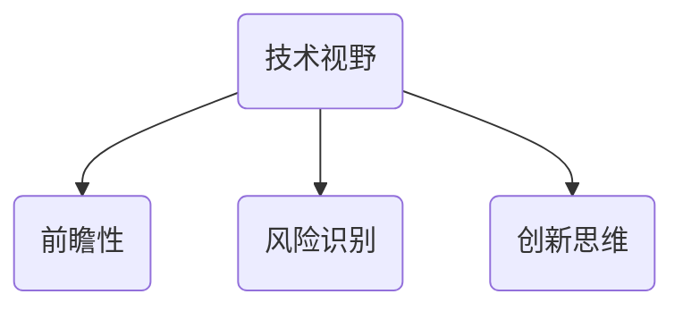

#### 沟通能力

沟通能力是技术leader的一项关键能力，它决定了技术leader能否有效地与团队成员、业务团队和外部合作伙伴进行沟通。良好的沟通能力包括：

1. **倾听**：积极倾听团队成员的意见和建议，理解他们的需求和困扰。
2. **表达**：清晰、准确地表达自己的想法和决策，确保团队理解和执行。
3. **协调**：在团队内部和外部之间建立有效的沟通桥梁，协调各方利益。

**关联关系架构图：**

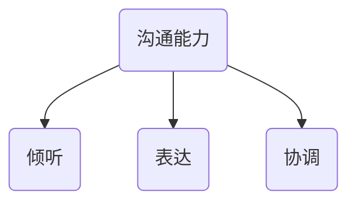

#### 技术决策能力

技术决策能力是技术leader在面对复杂问题时，能够迅速做出正确决策的能力。这包括：

1. **分析**：对问题进行深入分析，理解问题的本质和影响。
2. **判断**：基于分析结果，做出合理的判断和决策。
3. **执行**：确保决策能够被有效执行，推动项目进展。

**关联关系架构图：**

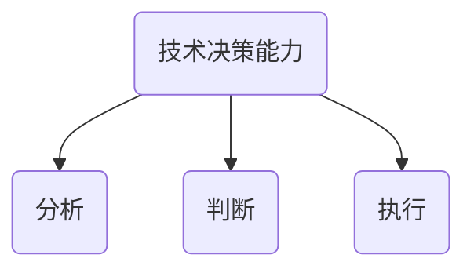

#### 团队建设能力

团队建设能力是指技术leader能够建立和维持一个高效、协作的团队。这包括：

1. **目标设定**：明确团队的目标和期望，确保团队成员清晰了解自己的职责和任务。
2. **能力培养**：培养团队成员的技能和能力，提升团队整体水平。
3. **激励**：通过激励措施，激发团队成员的积极性和创造力。

**关联关系架构图：**

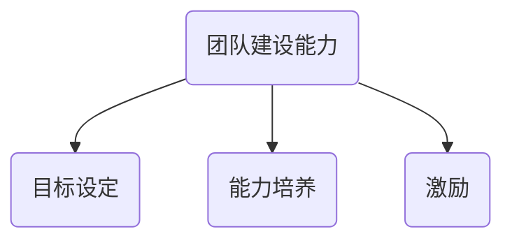

#### 自我认知能力

自我认知能力是指技术leader对自己的优点和不足有清晰的认识，并能够不断自我提升。这包括：

1. **自我反思**：定期反思自己的行为和决策，识别自身的不足。
2. **持续学习**：保持学习的热情，不断提升自己的知识和技能。
3. **适应变化**：面对变化和挑战，能够迅速调整自己的心态和策略。

**关联关系架构图：**

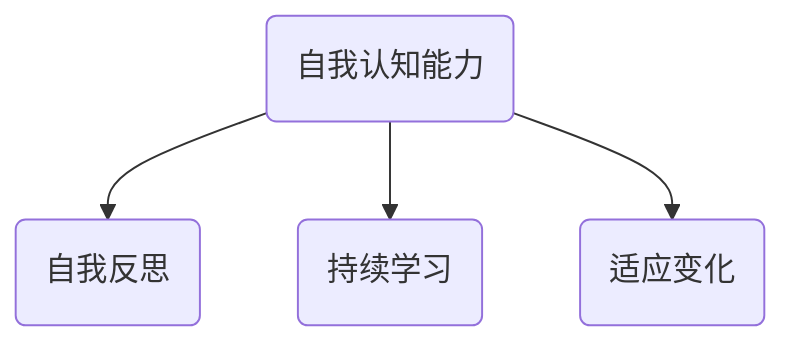

#### 技术领导力的整合

技术领导力的各个核心要素相互关联，共同构成了技术leader的综合能力。技术视野提供了方向和前瞻性，沟通能力确保了信息的传递和团队的协作，技术决策能力保证了决策的准确性和执行力，团队建设能力提升了团队的整体水平，自我认知能力则确保了技术leader的不断进步。

**整合关系架构图：**

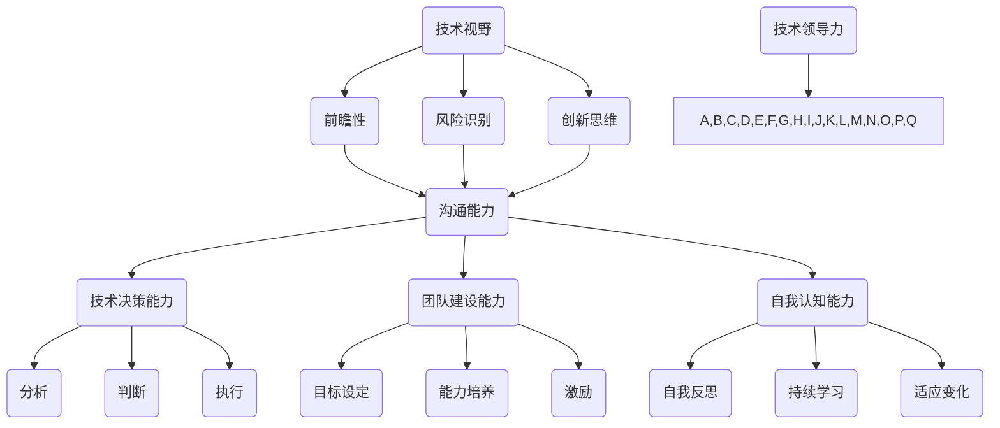

通过深入理解和培养这些核心要素，技术leader能够全面提升自身能力，更好地应对挑战，实现团队和个人的共同成长。

### 2.2 技术领导力的成长路径

技术leader的成长路径并非一蹴而就，而是需要经过不断的学习、实践和反思。从技术专家到技术leader的转型是一个系统的过程，涉及到技能提升、经验积累、角色转变等多个方面。下面，我们将探讨技术leader的成长路径，包括转型过程、职业发展和晋升标准。

#### 从技术专家到技术leader的转型

1. **技能提升**：技术专家在转型为技术leader的过程中，需要进一步提升自己的技能，包括项目管理、团队管理、沟通技巧等。通过学习相关知识和技能，技术专家可以更好地应对技术leader的角色需求。

2. **经验积累**：通过参与更多的项目，积累实际经验，特别是在项目规划、团队协作、决策执行等方面。这些经验将帮助技术专家更好地理解技术leader的工作内容和职责。

3. **角色转变**：技术专家需要从关注技术细节转向关注团队和项目整体，培养领导力和管理能力。这包括如何激励团队成员、如何处理团队冲突、如何进行项目规划等。

**成长路径图：**

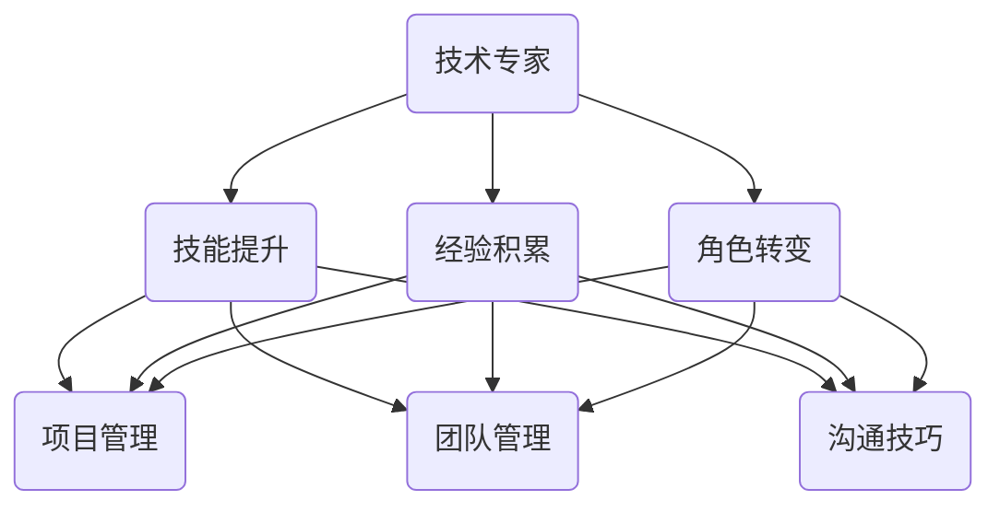

#### 技术leader的职业发展

1. **初级技术leader**：在初级阶段，技术leader主要关注团队的技术发展和项目执行。这个阶段的核心目标是提升团队绩效和项目成功率。

2. **中级技术leader**：在中级阶段，技术leader需要开始关注团队建设和战略规划。这个阶段的核心目标是培养团队，提升团队的整体能力和竞争力。

3. **高级技术leader**：在高级阶段，技术leader需要具备战略视野，能够制定和执行企业级的技术战略。这个阶段的核心目标是推动企业技术创新和业务发展。

**职业发展图：**

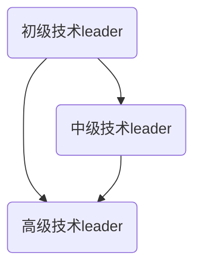

#### 技术leader的晋升标准

1. **技术能力**：技术leader需要具备深厚的专业知识和技能，能够解决复杂的技术问题，并在团队中发挥技术指导作用。

2. **管理能力**：技术leader需要具备出色的管理能力，包括团队管理、项目管理、决策能力等。

3. **领导力**：技术leader需要具备卓越的领导力，能够激励和指导团队成员，推动团队和企业的共同发展。

4. **业务理解**：技术leader需要具备对业务的深刻理解，能够将技术战略与业务目标紧密结合。

5. **团队绩效**：技术leader需要能够提升团队的绩效和整体竞争力，实现企业目标。

**晋升标准图：**

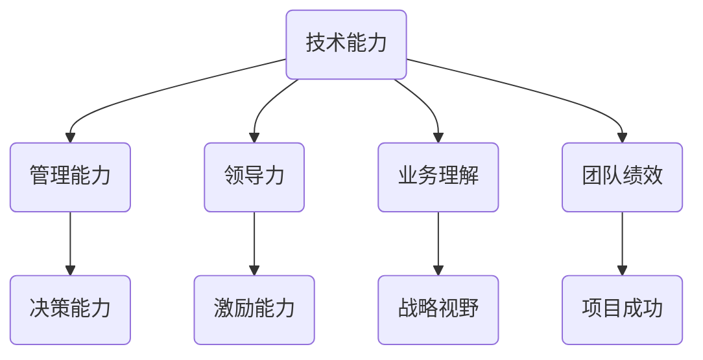

通过明确成长路径和晋升标准，技术leader可以更好地规划自己的职业发展，不断提升自身能力和素质，实现个人和团队的共同成长。

### 2.3 技术领导力对团队的影响

技术领导力不仅对技术leader个人的成长至关重要，也对团队的绩效和发展产生深远影响。一个具备技术领导力的技术leader能够有效推动团队的整体进步，提升团队的协作能力和创新能力。下面，我们将探讨技术领导力对团队的多方面影响。

#### 推动团队技术发展

1. **技术愿景**：技术领导力为团队提供了清晰的技术愿景，使得团队成员能够明确技术发展方向和目标。
2. **知识传承**：技术leader通过自身的经验和知识，指导团队成员，促进团队整体技术水平的提高。
3. **创新推动**：技术领导力鼓励团队成员探索新技术和新方法，推动技术革新和业务创新。

#### 提升团队协作能力

1. **沟通机制**：技术leader建立有效的沟通机制，确保团队成员之间能够顺畅交流，提升协作效率。
2. **目标一致性**：技术leader确保团队目标与个人目标一致，增强团队成员的凝聚力和合作意愿。
3. **冲突管理**：技术leader具备处理团队冲突的能力，保持团队的稳定和和谐。

#### 增强团队创新能力

1. **思维开放**：技术领导力鼓励团队成员保持开放的思维方式，勇于尝试新思路和新方法。
2. **资源整合**：技术leader能够整合团队内外部资源，为团队创新提供支持。
3. **激励创新**：技术leader通过激励机制，激发团队成员的创新潜力，推动团队持续创新。

**技术领导力对团队影响的综合图：**

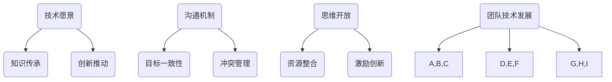

通过技术领导力，技术leader能够全面提升团队的技术水平、协作能力和创新能力，推动团队实现长期稳定的发展和持续的创新。这不仅有助于团队在竞争中保持优势，也为企业的长期发展提供了强大的支持。

### 2.4 技术领导力的挑战与应对策略

尽管技术领导力在团队中具有重要作用，但在实际工作中，技术leader也会面临诸多挑战。这些挑战不仅来自于技术本身，还包括团队管理、沟通协调等方面。下面，我们将探讨技术领导力面临的几个主要挑战，并提出相应的应对策略。

#### 挑战一：技术深度与广度的平衡

技术leader需要在技术深度和技术广度之间找到平衡。技术深度涉及专业领域的深入理解和掌握，而技术广度则要求对多个技术领域有所了解。

**应对策略**：

1. **持续学习**：技术leader应保持持续学习的态度，关注行业动态，不断提升自己的技术深度和广度。
2. **知识分享**：通过内部培训和知识分享，将自身的知识和技术经验传递给团队成员，提升团队整体技术水平。
3. **资源整合**：借助外部资源和专家，弥补自身在技术广度方面的不足，实现资源共享和互补。

#### 挑战二：团队管理

团队管理是技术leader面临的一个重要挑战。团队中成员的多样性和个性差异可能导致管理难度增加。

**应对策略**：

1. **个性化管理**：根据团队成员的个性和特点，制定个性化的管理策略，激励团队成员发挥最大潜力。
2. **沟通与反馈**：建立有效的沟通机制，确保团队成员之间的信息畅通，及时反馈问题和建议，促进团队协作。
3. **激励机制**：通过合理的激励机制，激发团队成员的积极性和创造力，提升团队整体绩效。

#### 挑战三：技术决策

技术决策是技术leader的一项关键任务，但往往面临信息不全、风险未知等挑战。

**应对策略**：

1. **数据分析**：在做出技术决策前，进行充分的数据分析和风险评估，确保决策的科学性和合理性。
2. **团队协作**：与技术团队成员进行深入讨论，集思广益，确保决策的全面性和多样性。
3. **迭代优化**：在决策实施过程中，不断监控和评估效果，根据实际情况进行迭代优化。

#### 挑战四：沟通协调

技术leader需要与不同部门和团队进行有效沟通协调，确保项目的顺利进行。

**应对策略**：

1. **建立信任**：通过透明的沟通和积极的互动，建立与各部门的信任关系，减少沟通障碍。
2. **统一目标**：明确团队和项目的目标，确保各部门和团队成员朝着共同的目标努力。
3. **沟通技巧**：提升自身的沟通技巧，包括倾听、表达和协调能力，确保信息传递准确无误。

**综合应对策略图：**

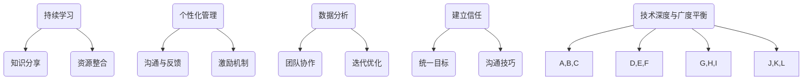

通过有效应对这些挑战，技术leader能够更好地发挥自己的领导力，推动团队和项目的成功。持续学习、个性化管理、科学决策和有效沟通，是技术leader成功的关键要素。

### 2.5 技术领导力的培养与提升

技术领导力的培养与提升是技术leader职业发展的关键环节。通过系统性的学习、实践和反思，技术leader可以逐步提升自身的领导力和管理能力，实现从技术专家到卓越领导者的转变。以下，我们将探讨技术领导力的培养与提升途径，包括学习资源、实践方法和个人成长策略。

#### 学习资源

1. **专业书籍**：技术leader可以通过阅读专业书籍来系统学习相关领域的知识，例如《敏捷软件开发的艺术》、《人月神话》、《领导力的五项修炼》等。
2. **在线课程**：在线平台如Coursera、edX、Udemy等提供了丰富的技术和管理课程，技术leader可以选择与自己职业发展相关的课程进行学习。
3. **技术社区**：技术社区如GitHub、Stack Overflow、Reddit等技术论坛，提供了丰富的技术资源和交流机会，技术leader可以通过参与社区讨论和贡献代码来提升自身技能。

#### 实践方法

1. **项目管理实践**：通过参与实际项目，技术leader可以锻炼项目规划、团队管理和决策执行等技能。在实践中，技术leader可以学习如何应对项目中的各种挑战，提升自身的管理能力。
2. **团队建设实践**：技术leader可以通过组织团队活动、团队培训等方式，提升团队的凝聚力和协作能力。这些实践活动可以帮助技术leader更好地理解团队成员的需求，提升团队绩效。
3. **技术分享与交流**：技术leader可以通过内部技术分享、外部分享会议等方式，与团队成员和其他技术专家进行交流。通过分享知识和经验，技术leader可以提升自身的表达能力，同时吸收他人的意见和建议，不断优化自己的技术视野和领导力。

#### 个人成长策略

1. **自我反思**：技术leader应定期进行自我反思，评估自己在技术、管理、领导力等方面的表现，识别自身的优势和不足，制定针对性的改进计划。
2. **持续学习**：技术leader应保持持续学习的态度，不断更新自己的知识库，紧跟技术发展趋势。通过学习新技术、新方法，技术leader可以提升自身的专业能力和竞争力。
3. **时间管理**：技术leader应学会有效管理时间，合理分配工作和学习时间，确保在繁忙的工作中仍然能够保持学习状态。
4. **心理调适**：技术leader在工作中往往会面临压力和挑战，应学会进行心理调适，保持良好的心态。通过锻炼、休息、放松等方式，技术leader可以缓解压力，保持高效的工作状态。

**综合提升策略图：**

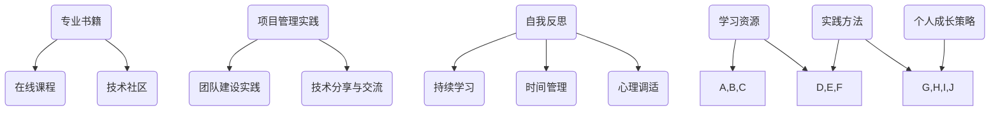

通过系统性的学习和实践，技术leader可以不断提升自身的领导力和管理能力，实现从技术专家到卓越领导者的转变。持续学习、实践反思和个人成长，是技术leader不断提升自我、引领团队和实现职业发展的关键。

### 2.6 技术领导力的成功案例分析

技术领导力的成功案例能够为其他技术leader提供宝贵的经验和启示。以下，我们将通过几个典型的成功案例，深入分析技术领导力在实际工作中的应用和效果。

#### 案例一：谷歌的工程文化

谷歌以其卓越的工程文化而闻名，这离不开其技术领导层的远见和领导力。谷歌的技术领导团队，如Google X实验室的负责人，通过推动技术创新和跨领域合作，成功研发了多项颠覆性技术，如Google Glass和自动驾驶汽车。这些成功背后的关键因素包括：

1. **技术视野**：谷歌的技术领导层具备前瞻性的技术视野，能够预见未来的技术趋势，并投入资源进行研究和开发。
2. **团队建设**：谷歌注重团队建设，鼓励跨领域合作和内部竞争，激发团队成员的创新潜力。
3. **激励机制**：谷歌通过灵活的工作安排、优厚的薪酬和福利，以及明确的激励机制，吸引并留住顶尖技术人才。

**核心要点**：

- 技术领导力需要具备前瞻性的技术视野。
- 跨领域合作和团队建设是推动技术创新的关键。
- 激励机制是吸引和留住顶尖人才的重要手段。

#### 案例二：亚马逊的云计算战略

亚马逊在云计算领域占据领先地位，这得益于其首席技术官瓦谢克·帕帕奇的卓越领导力。帕帕奇通过一系列战略决策和资源配置，成功将亚马逊云服务（AWS）打造成为全球最大的云计算平台。以下是其成功的关键因素：

1. **技术决策**：帕帕奇在技术选型和架构设计上做出了一系列正确的决策，确保AWS在性能、可靠性和安全性方面保持领先。
2. **团队协作**：帕帕奇重视团队协作，通过明确的目标和责任分配，确保团队成员高效协同工作。
3. **战略规划**：帕帕奇制定了长期的技术战略，不断扩展AWS的服务范围和功能，满足不同客户的需求。

**核心要点**：

- 技术领导力需要具备敏锐的技术决策能力。
- 团队协作和有效的资源配置是成功的关键。
- 长期战略规划能够确保企业的持续发展和创新。

#### 案例三：微软的技术转型

微软在近年来进行了重大技术转型，从传统的软件企业转型成为云计算和人工智能领域的领导者。这一转型离不开其技术领导团队的领导和推动。以下是微软技术转型成功的关键因素：

1. **技术视野**：微软的技术领导层看到了云计算和人工智能的巨大潜力，果断进行了战略调整，加大在这些领域的投资。
2. **团队建设**：微软通过内部培训和人才引进，提升了团队在云计算和人工智能方面的技能和经验。
3. **文化变革**：微软进行了文化变革，鼓励创新和开放，营造了一个有利于技术发展和创新的氛围。

**核心要点**：

- 技术领导力需要具备前瞻性的技术视野。
- 团队建设和文化变革是推动企业技术转型的关键。
- 创新的文化和激励机制能够激发团队的潜力。

**综合分析**：

这些成功案例表明，技术领导力不仅需要具备前瞻性的技术视野，还需要出色的团队建设和领导力。技术领导力在推动技术创新、团队协作和企业转型中发挥着至关重要的作用。通过深入分析这些成功案例，技术leader可以汲取经验，不断提升自身的领导力和管理能力，实现个人和团队的共同成长。

### 2.7 技术领导力的发展趋势与未来展望

随着信息技术的飞速发展，技术领导力也在不断演变和提升。以下，我们将探讨技术领导力的发展趋势，并展望其未来的发展方向。

#### 人工智能与大数据的兴起

人工智能（AI）和大数据技术正在深刻改变各个行业，技术leader需要适应这些变化，提升自身在AI和大数据领域的领导力。具体趋势包括：

1. **AI技术的普及**：随着AI技术的不断成熟和成本降低，越来越多的企业将AI应用于业务流程和决策制定。技术leader需要掌握AI的基本原理和运用方法，引领团队在AI领域的发展。
2. **大数据分析的深化**：大数据分析已经成为企业决策的重要依据。技术leader需要具备大数据处理和分析能力，能够利用大数据为企业带来实际价值。

#### 云计算与物联网的融合

云计算和物联网（IoT）的结合正推动企业实现更加智能和高效的管理。技术leader需要关注以下趋势：

1. **云计算服务的多样化**：云服务提供商不断推出新的服务，如边缘计算、混合云等。技术leader需要了解这些服务，并根据企业需求进行合理配置。
2. **物联网的数据处理**：物联网设备产生的海量数据需要高效处理和存储。技术leader需要掌握物联网数据处理技术，确保数据能够及时、准确地被分析和利用。

#### 区块链技术的应用

区块链技术以其去中心化、不可篡改的特点，在金融、供应链等领域具有广泛的应用前景。技术leader需要关注以下趋势：

1. **区块链与金融的结合**：区块链在金融领域的应用，如数字货币、智能合约等，正在不断拓展。技术leader需要了解区块链技术在金融领域的应用，推动企业实现数字化转型。
2. **区块链与其他技术的融合**：区块链与其他技术的融合，如人工智能、物联网等，将带来更多创新应用。技术leader需要掌握这些融合技术，为企业带来新的增长点。

#### 数字化转型的深化

数字化转型已经成为企业发展的必然趋势。技术leader需要关注以下趋势：

1. **数字化的战略规划**：技术leader需要参与企业的数字化转型战略规划，明确数字化目标和发展路径。
2. **数字化技能的培养**：技术leader需要提升自身的数字化技能，包括数据分析、云计算、人工智能等，以适应数字化时代的需求。

#### 未来展望

未来，技术领导力的发展将更加注重以下几个方面：

1. **跨领域的领导能力**：技术leader需要具备跨领域的领导能力，能够整合不同领域的知识和技术，推动企业创新。
2. **持续学习和适应能力**：技术leader需要具备持续学习和适应变化的能力，不断更新自己的知识和技能，以应对快速变化的技术环境。
3. **人本管理**：技术leader需要更加关注团队成员的需求和成长，通过人本管理提升团队的凝聚力和创造力。

**综合趋势与展望图：**

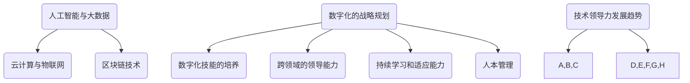

通过深入理解和把握技术领导力的发展趋势，技术leader可以更好地应对未来挑战，推动企业实现持续创新和快速发展。

### 总结

技术领导力是技术leader在技术团队中通过影响、指导和激励，推动团队达成目标的能力。它包括技术视野、沟通能力、技术决策能力、团队建设能力和自我认知能力等核心要素。技术领导力不仅对个人成长至关重要，也对团队绩效和业务发展产生深远影响。

通过深入理解和培养技术领导力，技术leader能够更好地应对各种挑战，推动团队实现技术创新和业务增长。技术领导力的成功案例展示了其在实际工作中的应用效果，为我们提供了宝贵的经验和启示。

随着信息技术的不断进步，技术领导力也将继续演变和提升。技术leader需要具备前瞻性的技术视野、跨领域的领导能力以及持续学习和适应变化的能力，以应对未来的挑战。

通过持续学习和实践，技术leader可以不断提升自身的能力，实现个人和团队的共同成长，成为卓越的技术领导者。

### 附录

#### 7.1 技术leader成长资源推荐

为了帮助技术leader在自我认知和成长过程中获取更多的知识和资源，以下是一些建议的书籍、在线课程和技术社区：

**书籍推荐：**

1. **《技术领导力：技术团队成功的关键》**：本书详细介绍了技术领导力的各个方面，包括技术视野、团队管理、沟通技巧等，适合技术leader阅读。
2. **《敏捷软件开发的艺术》**：该书介绍了敏捷开发方法，对技术leader提升项目管理和团队协作能力有很好的参考价值。
3. **《人月神话》**：这本书探讨了软件开发中常见的挑战，为技术leader提供了解决复杂问题的方法论和策略。

**在线课程推荐：**

1. **Coursera上的《领导力与战略管理》**：该课程由知名大学提供，涵盖了领导力、战略管理等多个方面的内容。
2. **Udemy上的《项目管理基础》**：该课程适合技术leader学习项目管理的基本知识和技能。
3. **edX上的《人工智能导论》**：该课程介绍了人工智能的基础知识，有助于技术leader了解和掌握AI技术。

**技术社区推荐：**

1. **GitHub**：GitHub是全球最大的代码托管平台，技术leader可以通过GitHub参与开源项目，学习最新的技术趋势。
2. **Stack Overflow**：Stack Overflow是一个问答社区，技术leader可以在这里提问和解答技术问题，提升自身技能。
3. **Reddit的技术板块**：Reddit上有许多关于技术的话题板块，技术leader可以在这里与其他技术爱好者交流，获取最新的技术资讯。

通过利用这些资源，技术leader可以不断提升自己的知识和技能，实现个人和团队的共同成长。

### 作者信息

**作者：AI天才研究院/AI Genius Institute & 禅与计算机程序设计艺术 /Zen And The Art of Computer Programming**

