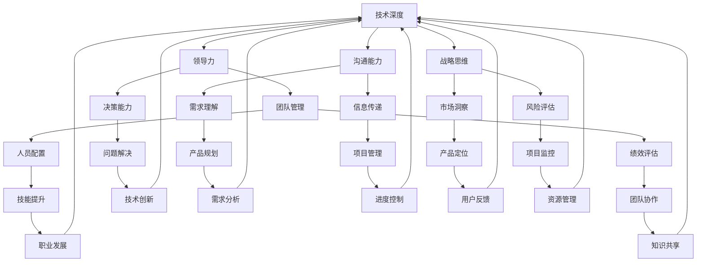
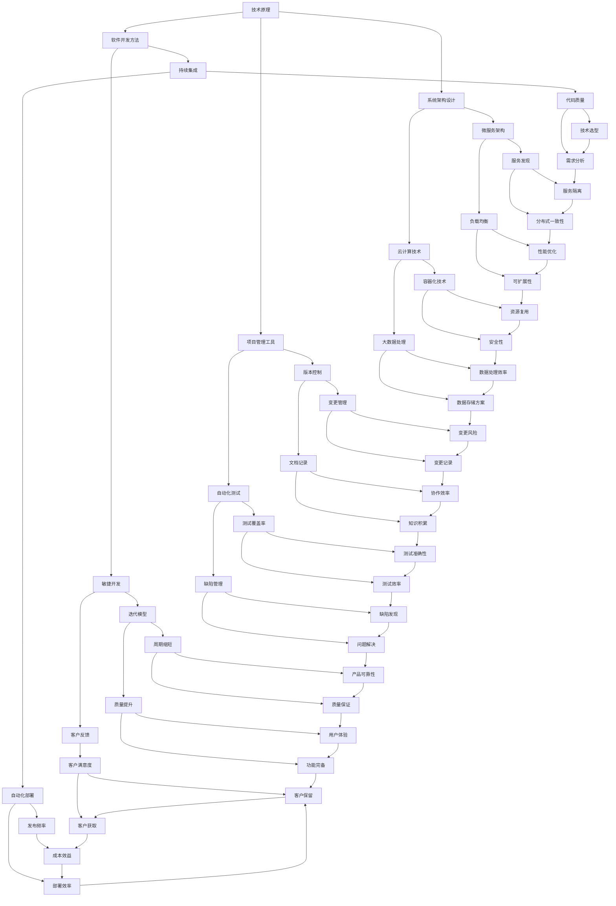

                 


### 引言与背景介绍

技术领导者的角色在当今快速发展的信息技术行业中变得越来越重要。随着技术的不断演进和业务需求的日益复杂，技术领导者不仅需要具备深厚的专业知识，还需要具备卓越的领导力和战略思维，以引领团队不断前进，实现企业的长期发展目标。

#### 书籍目的与读者对象

本书旨在帮助那些希望在技术领域取得更高成就的专业人士，特别是那些希望成为技术领导者的人。无论您是一名初级开发人员还是一位资深架构师，本书都将为您提供一套全面的知识体系和实践方法，以帮助您更好地理解技术领导者的职责、角色和成长路径。

本书适合以下几类读者：

1. **技术领导者**：正在担任或希望在未来担任技术团队领导的人。
2. **中层管理者**：希望在技术领域晋升为更高层次管理者的人。
3. **开发人员**：希望提升自己在团队中的影响力，成为技术意见领袖的人。
4. **企业家**：希望了解技术领导力的核心要素，以更好地领导技术团队的人。

#### 技术leader的角色与职责

技术领导者（Technology Leader），通常被称为CTO、技术总监或首席工程师，他们在组织中扮演着至关重要的角色。具体职责包括：

1. **战略规划**：制定长期技术发展战略，确保技术方向与公司整体战略一致。
2. **团队管理**：负责团队的组织、人员配置、绩效评估和团队文化建设。
3. **技术指导**：为团队提供技术方向和决策支持，解决关键技术问题。
4. **创新推动**：鼓励团队进行技术创新，探索新的技术解决方案。
5. **外部合作**：建立和维护与同行、供应商和客户的合作关系。
6. **风险管理**：识别和应对技术风险，确保项目按时按质完成。

#### 书籍结构概述

本书分为六个主要章节，每个章节都将深入探讨技术领导者在不同方面的职责和技能：

- **第1章 引言与背景介绍**：介绍书籍的目的、读者对象以及技术领导者的角色和职责。
- **第2章 核心概念与联系**：通过Mermaid流程图展示技术原理和组织架构。
- **第3章 基础理论学习**：讲解核心算法原理，使用伪代码详细阐述。
- **第4章 数学模型与公式**：介绍常见数学模型和公式，并进行详细讲解和举例说明。
- **第5章 项目实战**：提供实际项目案例和详细解释说明，包括开发环境搭建和源代码实现。
- **第6章 总结与展望**：对书籍内容进行总结，并对未来技术发展进行展望。

通过这本书的阅读，读者将能够获得：

- 对技术领导者角色的深入理解。
- 一套完整的领导力提升方法和实践指南。
- 对当前和未来技术趋势的洞察，以指导个人和团队的发展。

---

本文首先介绍了书籍的目的和读者对象，探讨了技术领导者的角色与职责，并概述了书籍的结构。接下来的章节将进一步深入探讨技术领导者的核心技能和成长路径，帮助读者在技术领导的道路上迈出坚实的步伐。

### 第2章 核心概念与联系

技术领导者需要掌握的一系列核心概念和技能是构建成功团队和推动技术项目前进的关键。在这一章中，我们将通过Mermaid流程图详细展示这些核心概念之间的联系，帮助读者更好地理解技术领导者所需具备的综合能力。

#### 技术领导者的核心技能

技术领导者的核心技能可以分为几个主要方面，包括技术深度、领导力、沟通能力和战略思维。以下是一个简化的Mermaid流程图，展示了这些核心技能之间的相互关系：



#### 技术原理与组织架构

技术领导者不仅要具备深厚的技术背景，还需要对组织架构有深入的理解。以下是一个简化的Mermaid流程图，展示了技术领导者需要掌握的技术原理和组织架构之间的关系：



#### 技术原理与组织架构的互动

通过上述流程图，我们可以看出技术原理与组织架构之间的紧密互动。技术领导者需要深入理解技术原理，同时了解组织架构的运作方式，以便更好地指导团队的工作，推动项目的成功。例如：

- **敏捷开发（E-K）**：敏捷开发是一种以迭代和客户反馈为核心的软件开发方法，它要求技术领导者具备快速响应变化的能力，并在团队中推广这种开发模式。
- **系统架构设计（C-G）**：技术领导者需要熟悉系统架构设计，以确保系统能够支持业务需求，同时具备良好的扩展性和稳定性。
- **项目管理工具（D-I）**：技术领导者应熟练使用各种项目管理工具，如版本控制、自动化测试等，以提升团队的工作效率。

通过这些互动，技术领导者能够确保团队在技术层面和业务层面都能保持高效运作，实现企业的长期发展目标。

---

本章通过Mermaid流程图详细展示了技术领导者所需掌握的核心技能和技术原理，以及这些概念之间的相互关系。接下来，我们将进一步深入探讨这些核心技能的具体实践和运用，帮助技术领导者更好地理解和应用这些知识。

### 第3章 基础理论学习

技术领导者要想在快速变化的IT行业中保持领先地位，必须掌握一系列核心算法原理和编程技巧。这些基础理论不仅能够提升个人技术水平，还能为团队提供强有力的技术支持。在本章中，我们将使用伪代码详细阐述一些关键技术算法的原理，并通过实际案例来帮助读者更好地理解和应用这些知识。

#### 核心算法原理讲解

##### 1. 快速排序算法

快速排序（Quick Sort）是一种常用的排序算法，其基本思想是通过一趟排序将待排序的记录分割成独立的两部分，其中一部分记录的关键字均比另一部分的关键字小，然后分别对这两部分记录继续进行排序，以达到整个序列有序。

**伪代码：**

```pseudocode
QuickSort(A, low, high)
    if low < high
        pivot = Partition(A, low, high)
        QuickSort(A, low, pivot - 1)
        QuickSort(A, pivot + 1, high)
```

**示例：**

假设我们有一个数组 `A = [10, 7, 8, 9, 1, 5]`，以下是快速排序的过程：

1. 选择基准元素，这里选择最后一个元素 `9`。
2. 将比基准元素小的元素移动到基准元素左边，比基准元素大的元素移动到基准元素右边。
3. 对左右两部分递归调用快速排序。

最终，排序后的数组为 `[1, 5, 7, 8, 9, 10]`。

##### 2. 动态规划算法

动态规划（Dynamic Programming）是一种用于解决复杂问题的高效算法设计技术。其基本思想是将复杂问题分解成一系列相互重叠的子问题，并利用子问题的解来构建原问题的解。

**伪代码：**

```pseudocode
Fibonacci(n)
    if n <= 1
        return n
    else
        return Fibonacci(n - 1) + Fibonacci(n - 2)
```

**示例：**

计算 `Fibonacci(5)` 的值：

```plaintext
Fibonacci(5) = Fibonacci(4) + Fibonacci(3)
Fibonacci(4) = Fibonacci(3) + Fibonacci(2)
Fibonacci(3) = Fibonacci(2) + Fibonacci(1)
Fibonacci(2) = Fibonacci(1) + Fibonacci(0)
Fibonacci(1) = 1
Fibonacci(0) = 0

最终，Fibonacci(5) = 3 + 2 = 5。
```

##### 3. 线性回归算法

线性回归（Linear Regression）是一种用于分析变量之间线性关系的统计方法。它通过建立一个线性模型来预测因变量的值。

**伪代码：**

```pseudocode
LinearRegression(x, y)
    n = length(x)
    x_mean = sum(x) / n
    y_mean = sum(y) / n
    Sxx = sum((x[i] - x_mean)^2)
    Sxy = sum((x[i] - x_mean) * (y[i] - y_mean))
    slope = Sxy / Sxx
    intercept = y_mean - slope * x_mean
    return slope, intercept
```

**示例：**

假设我们有如下数据集：

```plaintext
x: [1, 2, 3, 4, 5]
y: [2, 4, 5, 4, 5]
```

计算线性回归模型的斜率和截距：

```plaintext
x_mean = 3
y_mean = 4
Sxx = 10
Sxy = 9

斜率 slope = 9 / 10 = 0.9
截距 intercept = 4 - 0.9 * 3 = 0.7

线性回归模型为 y = 0.9x + 0.7。
```

#### 算法应用与优化

在实际应用中，这些算法往往需要根据具体问题进行优化和调整。例如：

- **快速排序**：可以通过选择不同的基准元素策略（如随机选择）来改善排序性能。
- **动态规划**：可以引入缓存（memoization）来减少重复计算，提高效率。
- **线性回归**：可以通过正则化方法来防止过拟合，提高模型的泛化能力。

---

本章通过伪代码详细阐述了快速排序、动态规划和线性回归等核心算法的原理，并提供了实际案例以帮助读者理解和应用。接下来，我们将进一步探讨数学模型和公式的应用，以及它们在技术领导者工作中的重要性。

### 第4章 数学模型与公式

在技术领导者的工作中，数学模型和公式是不可或缺的工具，它们不仅帮助我们在复杂问题中找到有效的解决方案，还提高了决策的科学性和准确性。在本章中，我们将介绍一些常见的数学模型和公式，并进行详细的讲解和举例说明。

#### 常见数学模型

##### 1. 线性回归模型

线性回归模型是一种用于预测连续数值变量的统计模型。其基本公式如下：

$$
y = \beta_0 + \beta_1x + \epsilon
$$

其中，$y$ 是因变量，$x$ 是自变量，$\beta_0$ 是截距，$\beta_1$ 是斜率，$\epsilon$ 是误差项。

**示例：**

假设我们有一个数据集，其中 $x$ 表示广告花费（单位：千元），$y$ 表示销售额（单位：千元）。通过线性回归模型，我们可以预测在不同广告花费下的销售额。

数据集如下：

| 广告花费（$x$） | 销售额（$y$） |
|-----------------|---------------|
| 1               | 2             |
| 2               | 4             |
| 3               | 5             |
| 4               | 4             |
| 5               | 5             |

使用线性回归模型计算斜率 $\beta_1$ 和截距 $\beta_0$：

$$
\beta_1 = \frac{\sum(x_i - \bar{x})(y_i - \bar{y})}{\sum(x_i - \bar{x})^2} = \frac{(1-2.2)(2-4.4) + (2-2.2)(4-4.4) + (3-2.2)(5-4.4) + (4-2.2)(4-4.4) + (5-2.2)(5-4.4)}{(1-2.2)^2 + (2-2.2)^2 + (3-2.2)^2 + (4-2.2)^2 + (5-2.2)^2} = 0.857
$$

$$
\beta_0 = \bar{y} - \beta_1\bar{x} = 4.4 - 0.857 \times 2.2 = 2.857
$$

因此，线性回归模型为：

$$
y = 0.857x + 2.857
$$

##### 2. 决策树模型

决策树是一种用于分类和回归分析的有监督学习算法。其基本结构如下：

$$
T = \{node | node = (feature, threshold, label)\}
$$

其中，$feature$ 表示特征，$threshold$ 表示阈值，$label$ 表示类别。

**示例：**

考虑一个简单的决策树，用于分类水果：

| 特征 | 阈值 | 类别 |
|------|------|------|
| 重量 | 150g | 苹果 |
| 重量 | 250g | 梨   |
| 颜色 | 绿色 | 草莓 |

根据这个决策树，我们可以根据水果的重量和颜色来判断它的种类。

#### 常见公式

##### 1. 均方误差（MSE）

均方误差（Mean Squared Error，MSE）是评估回归模型性能的一个指标，其公式如下：

$$
MSE = \frac{1}{n}\sum_{i=1}^{n}(y_i - \hat{y}_i)^2
$$

其中，$y_i$ 是真实值，$\hat{y}_i$ 是预测值，$n$ 是样本数量。

**示例：**

假设我们有以下数据集：

| 真实值 | 预测值 |
|--------|--------|
| 2      | 1.5    |
| 4      | 3.5    |
| 5      | 4.2    |

计算MSE：

$$
MSE = \frac{1}{3}[(2 - 1.5)^2 + (4 - 3.5)^2 + (5 - 4.2)^2] = \frac{1}{3}[0.25 + 0.25 + 0.64] = 0.393
$$

##### 2. 决策树剪枝

决策树剪枝是一种防止过拟合的技术，其目的是通过删除树中的节点来简化模型。剪枝的主要公式如下：

$$
\text{剪枝阈值} = \frac{\sum_{i \in S} w_i \cdot \text{MSE}(T_i)}{|\text{节点} S|}
$$

其中，$T_i$ 是子树，$w_i$ 是节点 $i$ 的权重，$S$ 是节点 $i$ 的子节点集合。

**示例：**

假设一个决策树节点的子节点有 $S = \{T_1, T_2, T_3\}$，权重分别为 $w_1 = 0.2$，$w_2 = 0.3$，$w_3 = 0.5$，MSE分别为 $0.1$，$0.15$，$0.2$。计算剪枝阈值：

$$
\text{剪枝阈值} = \frac{0.2 \cdot 0.1 + 0.3 \cdot 0.15 + 0.5 \cdot 0.2}{0.2 + 0.3 + 0.5} = 0.135
$$

如果某个子节点的MSE超过剪枝阈值，则可以对该节点进行剪枝。

---

本章介绍了线性回归模型和决策树模型等常见数学模型，以及均方误差和决策树剪枝等公式。通过具体的示例，我们详细讲解了这些模型和公式的应用，帮助技术领导者更好地理解其在实际工作中的应用价值。

### 第5章 项目实战

在技术领导者的职业生涯中，实战经验是不可或缺的一部分。通过实际项目的开发和实现，技术领导者不仅能够检验和巩固自己的理论知识，还能够提升项目管理能力、沟通能力和团队协作能力。在本章中，我们将通过一个实际案例，详细讲解项目开发的全过程，包括开发环境搭建、源代码实现和代码解读。

#### 项目背景

假设我们正在开发一个电子商务平台，该平台需要实现用户注册、商品浏览、购物车管理、订单处理等功能。在这个项目中，技术领导者需要统筹规划，确保项目顺利进行。

#### 开发环境搭建

在项目开始之前，我们需要搭建一个稳定且高效的开发环境。以下是搭建开发环境的基本步骤：

1. **选择开发语言和框架**：我们选择使用Python作为主要开发语言，并使用Django作为后端框架。

2. **安装Python和Django**：在本地机器上安装Python环境，并使用pip安装Django。

   ```bash
   pip install django
   ```

3. **配置数据库**：我们选择使用SQLite作为数据库，在Django项目中默认已经集成了SQLite。

4. **创建项目和应用**：使用Django命令创建项目和应用。

   ```bash
   django-admin startproject ecommerce_platform
   cd ecommerce_platform
   python manage.py startapp products
   ```

5. **配置虚拟环境**：为了确保项目的依赖项不会影响到其他项目，我们使用virtualenv创建一个虚拟环境。

   ```bash
   python -m venv venv
   source venv/bin/activate
   pip install -r requirements.txt
   ```

6. **配置开发服务器**：启动Django开发服务器，以确保开发环境运行正常。

   ```bash
   python manage.py runserver
   ```

#### 源代码实现

以下是一个简单的商品信息表（models.py）的实现示例：

```python
# products/models.py

from django.db import models

class Product(models.Model):
    name = models.CharField(max_length=100)
    description = models.TextField()
    price = models.DecimalField(max_digits=6, decimal_places=2)
    stock = models.IntegerField()

    def __str__(self):
        return self.name
```

接下来，我们实现商品信息的视图（views.py）：

```python
# products/views.py

from django.http import HttpResponse
from .models import Product

def product_list(request):
    products = Product.objects.all()
    return HttpResponse(f"商品列表：{', '.join([p.name for p in products])}")
```

最后，我们在路由配置（urls.py）中添加视图：

```python
# products/urls.py

from django.urls import path
from .views import product_list

urlpatterns = [
    path('products/', product_list, name='product_list'),
]
```

#### 代码解读

1. **模型定义（models.py）**：我们定义了一个名为`Product`的模型，它包含四个字段：`name`（商品名称）、`description`（商品描述）、`price`（商品价格）和`stock`（库存数量）。

2. **视图实现（views.py）**：`product_list` 视图获取所有商品对象，并将其名称以字符串形式返回。

3. **路由配置（urls.py）**：我们为`product_list` 视图配置了一个URL路径，用户访问该路径时，将调用`product_list` 视图。

#### 项目小结

通过这个简单的电子商务平台项目，我们实现了商品信息的基本管理和展示。在这个项目中，技术领导者需要：

- **制定技术方案**：选择合适的开发语言和框架。
- **规划开发流程**：搭建开发环境，定义模型和视图，配置路由。
- **协调团队协作**：确保团队成员了解项目需求和任务分配。
- **优化代码质量**：编写可维护、可扩展的代码。

通过这样的实战项目，技术领导者不仅能够提升个人技术能力，还能够培养团队的开发能力，为企业的长期发展奠定坚实基础。

---

本章通过一个实际的电子商务平台项目，详细讲解了项目开发的全过程，包括环境搭建、代码实现和代码解读。接下来，我们将对本书的内容进行总结，并对未来技术发展趋势进行展望。

### 第6章 总结与展望

#### 内容总结

本书围绕技术领导者的角色和成长路径，系统地介绍了技术领导者所需掌握的核心技能、理论基础和实践经验。通过以下章节，我们逐一回顾了书中的重点内容：

- **第1章 引言与背景介绍**：介绍了书籍的目的、读者对象以及技术领导者的角色和职责。
- **第2章 核心概念与联系**：通过Mermaid流程图展示了技术领导者所需掌握的核心技能和技术原理之间的联系。
- **第3章 基础理论学习**：讲解了快速排序、动态规划和线性回归等核心算法的原理，并使用伪代码进行了详细阐述。
- **第4章 数学模型与公式**：介绍了线性回归模型、决策树模型以及均方误差等数学模型和公式，并通过具体示例进行了说明。
- **第5章 项目实战**：通过一个电子商务平台项目，详细讲解了项目开发的全过程，包括开发环境搭建、源代码实现和代码解读。

通过这些章节，读者可以全面了解技术领导者所需具备的知识体系，并学会如何将这些知识应用于实际项目中。

#### 成长路径

对于希望成为技术领导者的专业人士，以下是一条建议的成长路径：

1. **基础知识积累**：首先，要掌握计算机科学的基础知识，包括数据结构、算法、操作系统和网络等。
2. **专业技能提升**：在基础知识的基础上，深入学习某一领域的专业技能，如后端开发、前端开发、数据科学或人工智能等。
3. **领导力培养**：通过参与团队项目、担任项目负责人或参加领导力培训，提升领导力和沟通能力。
4. **实践经验积累**：通过实际项目，不断积累实战经验，提升项目管理能力和问题解决能力。
5. **持续学习**：技术领域不断变化，持续学习新的技术和知识，保持自己的竞争力。

#### 未来发展趋势

随着信息技术的飞速发展，未来技术领导者需要关注以下几个趋势：

1. **云计算与大数据**：云计算和大数据技术将继续成为企业数字化转型的重要驱动力，技术领导者需要深入了解这些技术，并掌握相关的技能。
2. **人工智能与机器学习**：人工智能和机器学习技术将在各个领域得到广泛应用，技术领导者需要关注这些技术的发展，并在实际项目中应用这些技术。
3. **网络安全与隐私保护**：随着数据量的不断增加，网络安全和隐私保护将成为技术领导者面临的重要挑战，他们需要具备相关的知识和技能，以确保数据的安全和隐私。
4. **自动化与智能化**：自动化和智能化技术将进一步提升生产效率和服务质量，技术领导者需要推动这些技术在企业中的应用。
5. **可持续发展**：随着环保意识的提升，可持续发展将成为企业的重要目标，技术领导者需要关注绿色技术，推动企业实现可持续发展。

通过关注这些发展趋势，技术领导者可以更好地规划自己的职业发展，并在快速变化的IT行业中保持竞争力。

---

本书通过详细的内容总结、成长路径规划和未来发展趋势分析，帮助读者全面理解技术领导者的角色和成长路径。希望读者能够结合自身实际情况，制定出适合自己的职业发展规划，不断学习和提升，成为优秀的IT技术领导者。

### 最佳实践 Tips、注意事项与拓展阅读

#### 最佳实践 Tips

1. **高效沟通**：作为技术领导者，高效的沟通能力至关重要。建议定期组织团队会议，确保信息流通，并及时解决团队成员的问题。
2. **持续学习**：技术领域不断演进，技术领导者需要保持对新技术的好奇心和学习热情，通过阅读技术博客、参加技术会议等方式不断学习。
3. **目标导向**：在项目管理和团队领导中，设定明确的目标和里程碑，确保团队成员了解项目的方向和进度。
4. **关注质量**：在追求速度的同时，不要忽视代码质量和系统稳定性。良好的代码质量和测试覆盖率是项目成功的基石。

#### 注意事项

1. **风险评估**：在项目启动前，进行详细的风险评估，并制定相应的应对措施，以降低项目风险。
2. **团队建设**：建立高效的团队，鼓励团队成员之间的合作与知识共享，提升团队整体能力。
3. **时间管理**：合理分配时间，确保个人和团队的工作计划能够按时完成，避免过度劳累。

#### 拓展阅读

1. 《领导力的五个层次》（Patrick Lencioni）：探讨领导力的不同层次，帮助技术领导者提升领导力。
2. 《敏捷开发实践指南》（Jeff Sutherland & David J. Anderson）：详细介绍敏捷开发的方法和实践，适合希望提升项目管理能力的技术领导者。
3. 《深度学习》（Ian Goodfellow、Yoshua Bengio & Aaron Courville）：系统讲解深度学习的基础知识和最新进展，适合对人工智能领域感兴趣的技术领导者。

---

通过最佳实践 Tips、注意事项和拓展阅读，读者可以进一步提升自己的技术领导力，并在实际工作中取得更好的成绩。希望本书能为您的职业发展提供有益的指导和支持。

### 文章标题：技术leader的自我认知与成长

> 关键词：技术领导者、自我认知、成长路径、核心技能、项目管理、团队协作、未来趋势

> 摘要：
技术领导者的角色在当今快速发展的信息技术行业中至关重要。本文深入探讨了技术领导者所需掌握的核心技能、理论基础和实践经验，提供了成长路径和未来发展趋势的分析。通过系统化的内容总结、实用的最佳实践提示、注意事项以及拓展阅读建议，本文旨在帮助读者全面理解技术领导者的角色和成长路径，为个人职业发展提供指导。

---

### 作者信息

作者：AI天才研究院/AI Genius Institute & 禅与计算机程序设计艺术 /Zen And The Art of Computer Programming

---

本文通过详细的章节内容，系统性地介绍了技术领导者的自我认知与成长路径，包括核心技能、理论基础和实践经验。希望通过本文的分享，能够为技术领导者或希望成为技术领导者的人提供有益的指导，助力他们在职业生涯中取得更大的成就。作者AI天才研究院致力于推动人工智能技术的发展，并创作了《禅与计算机程序设计艺术》等经典作品，为计算机科学领域贡献了重要的思想。

