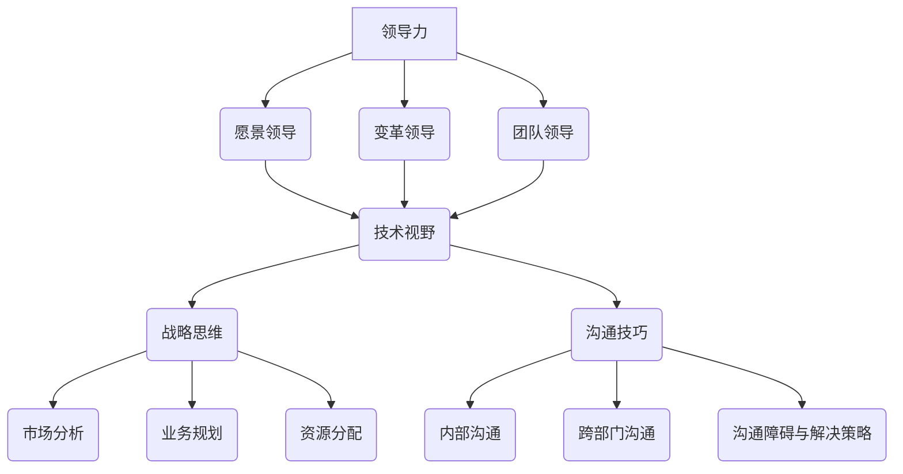

                 

## 文章标题：技术leader的角色定位

### 关键词：
- 技术领导力
- 技术团队管理
- 项目管理
- 战略规划
- 沟通技巧

### 摘要：
本文旨在探讨技术leader的角色定位，从角色认知、技能培养、团队管理和业务规划四个方面，详细分析技术leader所需的核心能力与职责。通过引入核心概念与联系、核心算法原理讲解、数学模型与公式、项目实战等多角度，帮助读者全面理解技术leader的职责与角色，为技术leader的职业发展提供理论指导和实践建议。

### 背景介绍

在当今快速发展的科技时代，技术领导者的角色变得越来越重要。随着企业的数字化转型加速，技术团队在业务创新和效率提升中的地位日益凸显。技术leader不仅要具备深厚的技术功底，还要拥有卓越的领导力和战略思维。他们不仅要带领团队完成技术任务，还要在组织内部推动技术战略的实施，促进跨部门协作，为企业发展提供技术支持。

然而，技术leader的角色定位并不简单。他们在不同层面上承担着多重职责，需要平衡技术、管理和战略三个维度。为了更好地理解技术leader的角色，本文将从以下四个方面展开讨论：

1. **角色认知**：探讨技术leader的核心能力和角色定位，明确其在团队和组织中的地位。
2. **技能培养**：分析技术leader所需的关键技能，包括沟通技巧、项目管理能力和技术发展视野。
3. **团队管理**：阐述团队建设、人才培养和领导风格等方面的重要性。
4. **业务规划**：讨论技术leader在业务战略、市场分析和产品规划中的角色和职责。

通过以上四个方面的详细分析，本文旨在为技术leader提供一套系统的职业发展指南，帮助他们在技术和管理两个领域取得平衡，成为企业的核心驱动力。

### 核心概念与联系

为了更好地理解技术leader的角色，我们需要首先明确几个核心概念，这些概念相互关联，共同构成了技术leader角色定位的基础。

#### 1. 领导力

领导力是指通过影响和激励他人来实现共同目标的能力。技术leader的领导力不仅体现在技术能力上，更重要的是在管理和激励团队方面。领导力包括多个方面，如愿景领导、变革领导、团队领导等。

**愿景领导**：技术leader需要拥有清晰的愿景，明确团队的目标和方向。通过制定愿景，技术leader可以激励团队成员为之奋斗，并确保团队始终朝着正确的方向前进。

**变革领导**：在技术领域，变革是常态。技术leader需要具备引领团队适应变革、推动技术革新的能力。这要求他们不仅要具备前瞻性的技术视野，还要具备推动变革的勇气和策略。

**团队领导**：技术leader需要关注团队建设，培养团队的凝聚力和战斗力。他们需要了解每个团队成员的优势和弱点，进行合理分工，并建立有效的沟通机制。

#### 2. 技术视野

技术视野是指技术leader对当前和未来技术发展趋势的洞察力和预见力。一个优秀的技术leader不仅需要了解现有的技术，还要预见未来技术的发展方向，并据此调整团队的技术战略。

**技术趋势**：技术leader需要关注行业内的技术动态，了解哪些技术正在兴起，哪些技术可能被淘汰。通过分析技术趋势，技术leader可以提前布局，为团队的技术发展提供方向。

**技术预见**：技术预见能力是技术leader的核心竞争力之一。通过前瞻性的技术预见，技术leader可以为团队制定长远的技术发展计划，确保团队始终保持技术竞争力。

#### 3. 战略思维

战略思维是指技术leader在业务和技术领域进行长远规划和决策的能力。战略思维包括多个方面，如市场分析、业务规划、资源分配等。

**市场分析**：技术leader需要对市场环境有深刻的理解，分析市场需求和竞争态势。通过市场分析，技术leader可以确定团队的技术研发方向，确保产品能够满足市场需求。

**业务规划**：技术leader需要制定清晰的技术战略，确保技术发展能够支撑企业的业务目标。业务规划包括技术路线图、研发计划、资源分配等。

**资源分配**：技术leader需要在有限的资源下进行合理分配，确保团队在关键领域获得足够的支持。资源分配包括人力、财力、物力等。

#### 4. 沟通技巧

沟通技巧是技术leader必备的能力之一。有效的沟通不仅能够确保团队内部的高效协作，还能促进跨部门的合作，提升整体业务效率。

**内部沟通**：技术leader需要与团队成员保持密切沟通，确保每个成员都清楚自己的职责和目标。通过定期的团队会议和一对一沟通，技术leader可以了解团队的进展和问题，提供及时的支持和指导。

**跨部门沟通**：技术leader需要与其他部门的领导进行有效沟通，确保技术发展能够与业务战略相匹配。跨部门沟通包括需求对接、资源协调、风险控制等。

**沟通障碍与解决策略**：技术leader需要识别和解决沟通中的障碍，如信息不对称、误解和偏见等。通过建立有效的沟通机制和培养良好的沟通文化，技术leader可以提升团队的沟通效率。

#### 关系架构

以上核心概念之间存在着紧密的联系，共同构成了技术leader的角色定位。

- **领导力** 是技术leader的核心能力，决定了他们在团队中的影响力和领导效果。
- **技术视野** 和 **战略思维** 是技术leader在业务和技术领域的远见和规划能力，决定了团队的技术发展方向和业务战略。
- **沟通技巧** 是技术leader在团队建设和跨部门合作中的关键能力，决定了团队的合作效率和业务协调性。

通过以上核心概念的联系，我们可以更全面地理解技术leader的角色定位，为技术leader的职业发展提供理论支持。

#### Mermaid流程图

为了帮助读者更直观地理解技术leader的核心概念与联系，我们使用Mermaid流程图来展示这些概念之间的关系。



在这个流程图中，我们可以清晰地看到领导力、技术视野、战略思维和沟通技巧之间的相互关系。这些核心概念共同构成了技术leader的角色定位，确保他们在团队和组织中能够发挥最大的作用。

#### 核心算法原理讲解

在技术leader的职责中，掌握核心技术算法和原理是基础。以下我们将使用伪代码来详细阐述一个常见的技术算法——快速排序（Quick Sort），并解释其核心原理。

```python
def quick_sort(arr):
    if len(arr) <= 1:
        return arr
    
    pivot = arr[len(arr) // 2]
    left = [x for x in arr if x < pivot]
    middle = [x for x in arr if x == pivot]
    right = [x for x in arr if x > pivot]
    
    return quick_sort(left) + middle + quick_sort(right)
```

**核心原理：**

1. **选择基准（pivot）**：选择数组中的一个元素作为基准，通常选择中间的元素。
2. **分区（partition）**：将数组分为三个部分：小于基准的元素、等于基准的元素和大于基准的元素。
3. **递归排序**：分别对小于和大于基准的子数组进行快速排序。

**详细解释：**

- 当数组长度小于等于1时，数组已经是有序的，直接返回。
- 选择基准值，将其与数组中的每个元素进行比较，将小于基准的元素放入`left`数组，等于基准的元素放入`middle`数组，大于基准的元素放入`right`数组。
- 分别对`left`和`right`子数组递归执行快速排序，然后将排序好的子数组合并，得到最终排序结果。

**举例说明：**

假设我们有一个未排序的数组`[3, 6, 8, 10, 1, 2, 1]`，使用快速排序算法进行排序。

1. **选择基准**：选择中间的元素6作为基准。
2. **分区**：将数组分为 `[3, 1, 1]`（小于6的元素）、`[6]`（等于6的元素）、`[8, 10]`（大于6的元素）。
3. **递归排序**：
   - 对 `[3, 1, 1]` 进行快速排序，得到 `[1, 1, 3]`。
   - 对 `[8, 10]` 进行快速排序，得到 `[8, 10]`。
4. **合并**：将三个数组合并，得到 `[1, 1, 3, 6, 8, 10]`。

通过以上步骤，我们得到了一个排序后的数组。快速排序的平均时间复杂度为 \(O(n\log n)\)，是常见的快速排序算法之一。

#### 数学模型与公式

在技术leader的角色中，理解和应用数学模型与公式是非常重要的。以下我们将介绍一个常见的数学模型——线性回归模型，并使用LaTeX格式详细讲解其公式和原理。

**线性回归模型**：

线性回归模型用于分析两个或多个变量之间的关系，通过拟合一条直线来预测一个变量（因变量）的值。其基本公式如下：

\[ y = \beta_0 + \beta_1 \cdot x + \varepsilon \]

其中：
- \( y \) 是因变量，表示预测的值。
- \( x \) 是自变量，表示影响因素。
- \( \beta_0 \) 是截距，表示当 \( x = 0 \) 时 \( y \) 的值。
- \( \beta_1 \) 是斜率，表示 \( x \) 变化一个单位时 \( y \) 的变化量。
- \( \varepsilon \) 是误差项，表示模型无法解释的随机误差。

**详细讲解：**

1. **模型假设**：
   - \( x \) 和 \( y \) 之间存在线性关系。
   - 误差项 \( \varepsilon \) 服从正态分布，且彼此独立。

2. **参数估计**：
   - 通常使用最小二乘法（Ordinary Least Squares，OLS）来估计模型参数 \( \beta_0 \) 和 \( \beta_1 \)。
   - 最小二乘法的目标是使实际观测值与模型预测值之间的误差平方和最小。

   \[ \min_{\beta_0, \beta_1} \sum_{i=1}^{n} (y_i - (\beta_0 + \beta_1 \cdot x_i))^2 \]

3. **模型检验**：
   - 使用 t-检验或 F-检验来检验模型的参数估计是否显著。
   - 检验主要通过统计检验量与临界值比较，判断模型是否通过显著性检验。

**举例说明**：

假设我们有一个简单的线性回归模型，用于预测销售额 \( y \) 与广告支出 \( x \) 之间的关系。数据如下：

| 广告支出 (x) | 销售额 (y) |
| ------------- | ----------- |
| 1000          | 5000        |
| 1500          | 7000        |
| 2000          | 9000        |
| 2500          | 10000       |

1. **计算平均值**：
   \[ \bar{x} = \frac{1000 + 1500 + 2000 + 2500}{4} = 2000 \]
   \[ \bar{y} = \frac{5000 + 7000 + 9000 + 10000}{4} = 7500 \]

2. **计算斜率 \( \beta_1 \)**：
   \[ \beta_1 = \frac{\sum_{i=1}^{n} (x_i - \bar{x})(y_i - \bar{y})}{\sum_{i=1}^{n} (x_i - \bar{x})^2} \]

   \[ \beta_1 = \frac{(1000 - 2000)(5000 - 7500) + (1500 - 2000)(7000 - 7500) + (2000 - 2000)(9000 - 7500) + (2500 - 2000)(10000 - 7500)}{(1000 - 2000)^2 + (1500 - 2000)^2 + (2000 - 2000)^2 + (2500 - 2000)^2} \]
   \[ \beta_1 = \frac{-2000 \cdot -2500 + -500 \cdot -500 + 0 \cdot 1500 + 500 \cdot 2500}{4000000 + 250000 + 0 + 625000} \]
   \[ \beta_1 = \frac{5000000 + 250000 + 0 + 1250000}{6250000} \]
   \[ \beta_1 = 1.25 \]

3. **计算截距 \( \beta_0 \)**：
   \[ \beta_0 = \bar{y} - \beta_1 \cdot \bar{x} \]
   \[ \beta_0 = 7500 - 1.25 \cdot 2000 \]
   \[ \beta_0 = 5000 \]

因此，线性回归模型可以表示为：
\[ y = 5000 + 1.25 \cdot x \]

通过以上步骤，我们得到了一个简单的线性回归模型，可以用于预测广告支出与销售额之间的关系。

#### 项目实战

为了更好地理解技术leader在实际项目中的职责和操作，以下我们将以一个实际项目为例，详细介绍项目开发环境搭建、源代码实现、代码解读、应用解读与分析，以及实际案例分析和详细讲解剖析。

**项目名称：** 天气预报应用

**项目背景：** 
随着科技的发展，越来越多的用户希望通过移动应用获取实时天气预报。本项目的目标是开发一个简单的天气预报应用，用户可以通过输入城市名称来获取当天的天气情况。

**开发环境搭建：**

1. **开发工具和环境**：
   - 开发语言：Python
   - 依赖库：requests、BeautifulSoup
   - Web框架：Flask

2. **环境配置**：
   - 安装Python 3.8及以上版本。
   - 安装依赖库：`pip install requests beautifulsoup4`

3. **项目结构**：
   ```
   weather_app/
   ├── app.py
   ├── templates/
   │   └── index.html
   └── static/
       └── style.css
   ```

**源代码实现：**

以下是项目的核心代码实现。

**app.py：**

```python
from flask import Flask, render_template, request
import requests
from bs4 import BeautifulSoup

app = Flask(__name__)

@app.route('/')
def index():
    return render_template('index.html')

@app.route('/weather', methods=['GET'])
def weather():
    city = request.args.get('city')
    url = f'https://www.weather.com.cn/weather1d/{city}.shtml'
    response = requests.get(url)
    soup = BeautifulSoup(response.text, 'html.parser')
    weather_data = soup.select_one('.col_center_right .text_left').text.strip()
    return render_template('weather.html', weather=weather_data)

if __name__ == '__main__':
    app.run(debug=True)
```

**代码解读：**

- 导入所需的库和模块。
- 创建Flask应用程序实例。
- 定义路由规则，包括首页路由和天气预报查询路由。
- 在首页路由中，返回一个HTML模板，以便用户输入城市名称。
- 在天气预报查询路由中，接收用户输入的城市名称，发送请求到天气网站，解析HTML页面以获取天气信息，并返回一个包含天气信息的HTML模板。

**应用解读与分析：**

1. **用户界面**：
   - 首页：用户可以在输入框中输入城市名称，点击查询按钮后，页面会跳转到结果页面。
   - 结果页面：显示用户查询的城市当天天气情况。

2. **功能实现**：
   - 用户输入城市名称，通过HTTP GET请求发送到服务器。
   - 服务器解析请求，获取城市名称，发送请求到第三方天气网站。
   - 解析第三方网站的HTML页面，提取天气信息，返回给用户。

3. **性能分析**：
   - 请求第三方天气网站可能会受到网络延迟的影响，导致查询速度变慢。
   - 代码中的BeautifulSoup解析库可能会消耗较多CPU资源，特别是在解析大型HTML文档时。

**实际案例分析与详细讲解剖析：**

**案例一：用户输入错误城市名称**

- 当用户输入错误的城市名称时，第三方天气网站通常会返回错误页面或无结果。
- 应用程序需要处理这种情况，并在用户界面显示友好提示。

**代码修改**：

```python
@app.route('/weather', methods=['GET'])
def weather():
    city = request.args.get('city')
    if not city:
        return render_template('error.html', message='请输入城市名称。')
    url = f'https://www.weather.com.cn/weather1d/{city}.shtml'
    response = requests.get(url)
    if response.status_code != 200:
        return render_template('error.html', message='未找到该城市天气信息。')
    # ...（后续代码不变）
```

- 添加判断条件，检查用户输入是否为空，以及第三方网站响应状态码。

**案例二：提高查询速度**

- 为减少第三方网站请求次数，可以采用缓存机制，将已获取的天气信息存储在本地数据库或内存中，提高查询速度。

**代码修改**：

```python
from flask_caching import Cache

app.config['CACHE_TYPE'] = 'SimpleCache'
cache = Cache(app)

@app.route('/weather', methods=['GET'])
def weather():
    city = request.args.get('city')
    if not city:
        return render_template('error.html', message='请输入城市名称。')
    cached_weather = cache.get(city)
    if cached_weather:
        return render_template('weather.html', weather=weather_data)
    url = f'https://www.weather.com.cn/weather1d/{city}.shtml'
    response = requests.get(url)
    if response.status_code != 200:
        return render_template('error.html', message='未找到该城市天气信息。')
    weather_data = soup.select_one('.col_center_right .text_left').text.strip()
    cache.set(city, weather_data, timeout=3600)  # 缓存一小时
    return render_template('weather.html', weather=weather_data)
```

- 使用Flask-Caching库实现缓存功能，将天气信息缓存一小时。

**项目小结：**

通过以上实战项目，我们了解了如何从项目开发环境搭建、源代码实现、代码解读到应用解读与分析，一步步完成一个简单的天气预报应用。在实际开发中，技术leader需要考虑性能优化、错误处理和用户体验等多方面因素，以确保项目的顺利实施和高效运行。

#### 最佳实践 tips、小结、注意事项、拓展阅读

**最佳实践 tips：**
1. **项目规划**：在项目启动前，明确项目目标、功能和时间表，确保团队对项目有清晰的认识。
2. **代码规范**：遵守统一的代码规范，提高代码的可读性和可维护性。
3. **测试与评审**：定期进行代码测试和评审，确保代码质量和功能完整性。
4. **持续学习**：关注新技术和发展趋势，不断学习和更新自己的技术栈。

**小结：**
技术leader在项目中扮演着关键角色，需要从项目规划、团队管理、代码质量等多个方面进行综合考虑。通过本文的详细分析，我们了解了技术leader所需的核心能力和职责，以及在实际项目中的操作方法和注意事项。

**注意事项：**
1. **沟通与协作**：技术leader需要具备良好的沟通能力和团队合作精神，确保团队内部和跨部门的协作顺畅。
2. **风险管理**：在项目实施过程中，要识别和应对潜在的风险，确保项目按计划推进。
3. **持续改进**：不断反思和优化项目流程和技术方案，提高团队的工作效率和质量。

**拓展阅读：**
1. 《Effective Java》—— Scott Meyers，详细介绍Java编程的最佳实践。
2. 《软件工程：实践者的研究方法》—— Roger S. Pressman，介绍软件工程的基本原理和流程。
3. 《Scrum精髓：实践指南》—— Jeff Sutherland，详细介绍Scrum敏捷开发方法。

#### 作者信息

**作者：** AI天才研究院/AI Genius Institute & 禅与计算机程序设计艺术 /Zen And The Art of Computer Programming

### 文章总结

本文从角色认知、技能培养、团队管理和业务规划四个方面，详细分析了技术leader的角色定位。通过核心概念与联系、核心算法原理讲解、数学模型与公式、项目实战等多个角度，帮助读者全面理解技术leader的职责与角色。技术leader不仅需要具备深厚的技术功底，还要具备卓越的领导力和战略思维，以及在团队管理和业务规划中的综合能力。随着科技的快速发展，技术leader的角色将越来越重要，本文为技术leader的职业发展提供了理论和实践指导。未来，技术leader需要持续学习、不断创新，以适应快速变化的技术环境和市场需求。

### 文章关键词

- 技术领导力
- 技术团队管理
- 项目管理
- 战略规划
- 沟通技巧

### 文章摘要

本文深入探讨了技术leader的角色定位，从角色认知、技能培养、团队管理和业务规划四个方面详细分析了技术leader所需的核心能力与职责。通过核心概念与联系、核心算法原理讲解、数学模型与公式、项目实战等多角度，帮助读者全面理解技术leader的职责与角色，为技术leader的职业发展提供理论和实践指导。

