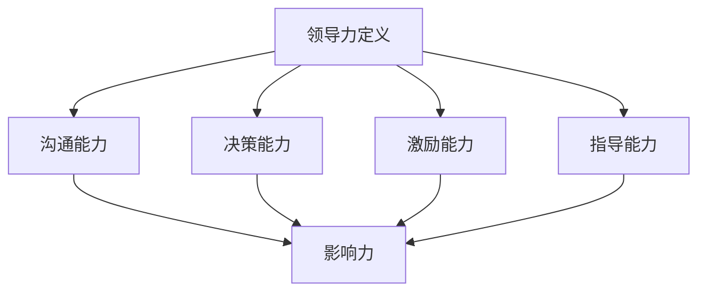
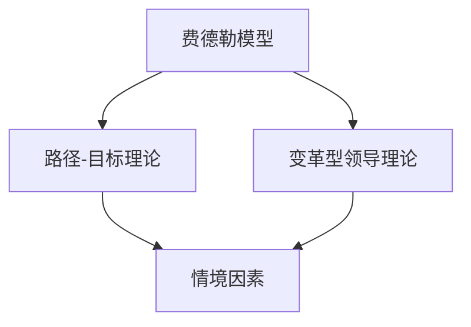
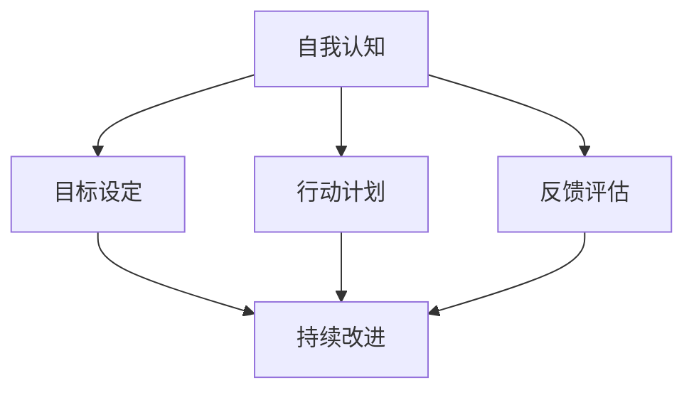
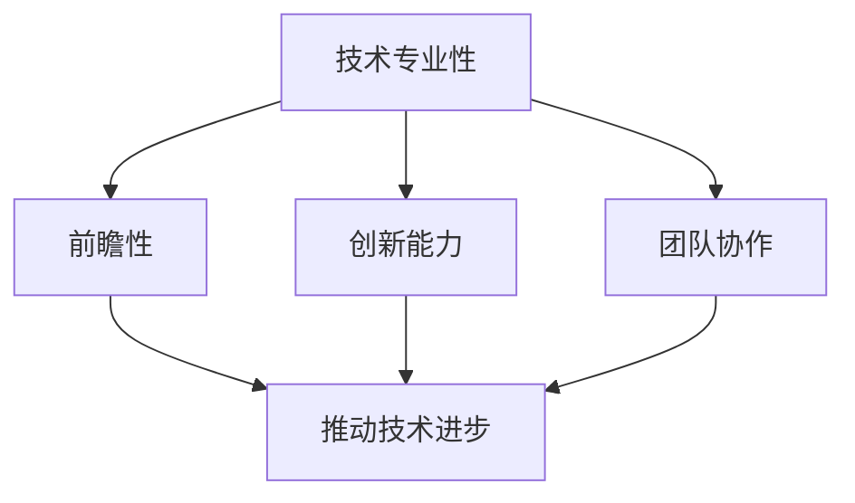
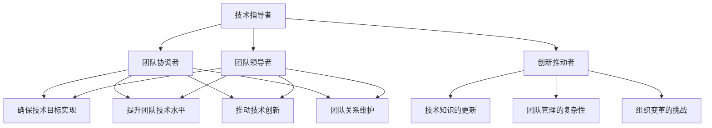
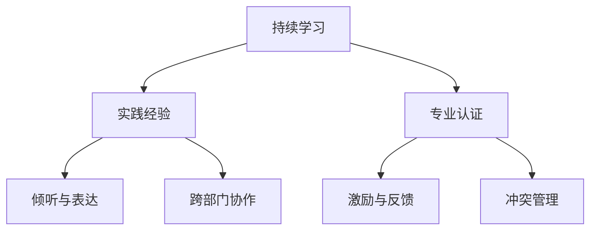
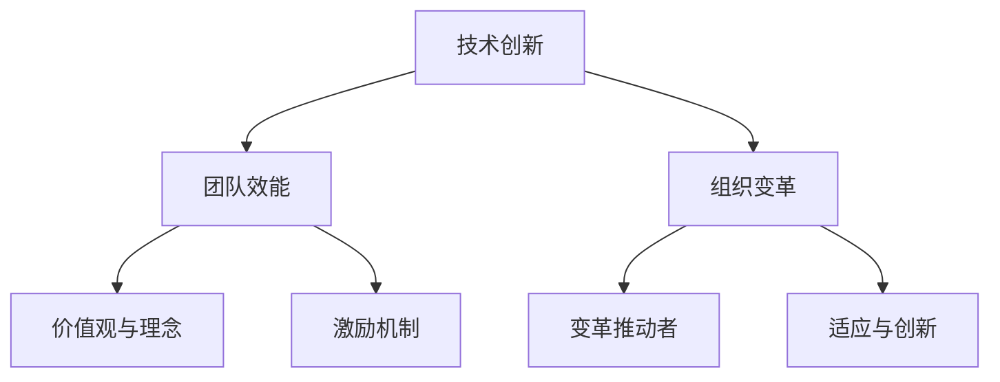
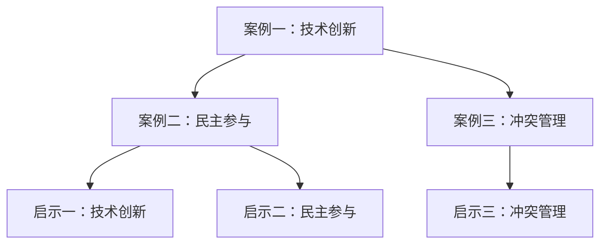
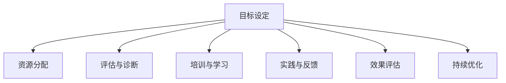
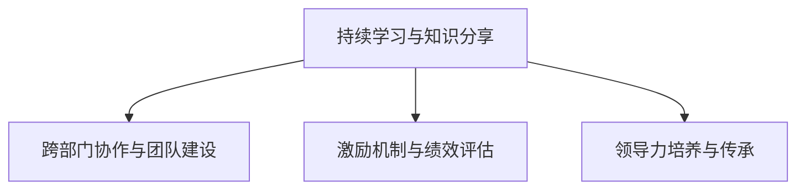

                 

## 文章标题：技术leader的领导力发展计划

在当今快速发展的信息技术时代，技术leader的角色愈发重要。他们不仅要具备深厚的技术功底，还需拥有出色的领导力，以引导团队应对挑战，推动项目成功。本文旨在探讨技术leader的领导力发展计划，为IT领域的领导者提供一整套系统性的策略和方法。

## 关键词：
技术leader、领导力、发展计划、团队管理、策略

## 摘要：
本文将从领导力的核心概念出发，探讨技术leader所需具备的领导力类型与特点，以及如何通过个人成长和技能培养提升领导力。接着，本文将深入分析技术领导力的定义、特点及其在组织发展中的重要性。随后，我们将通过案例和实践，提供具体的领导力发展计划设计和提升策略。最后，本文还将总结技术leader在实际工作中应注意的最佳实践和注意事项。

## 文章目录：

### 第一部分：领导力基础

#### 1. 领导力的核心概念
- 领导力的定义
- 领导力的类型与特点
- 领导力的重要性

#### 2. 领导力模型与理论
- 经典领导力模型
- 领导力发展理论
- 领导风格与管理策略

#### 3. 领导力与个人成长
- 自我认知与领导力提升
- 情绪管理与领导力
- 自我领导力发展计划

### 第二部分：技术领导力

#### 4. 技术领导力定义与特点
- 技术领导力的定义
- 技术领导力的特点
- 技术领导力的重要性

#### 5. 技术领导者的角色与责任
- 技术领导者的角色
- 技术领导者的责任
- 技术领导者的挑战

#### 6. 技术领导力技能培养
- 技术技能培养
- 沟通技能培养
- 团队管理技能培养

#### 7. 技术领导力与组织发展
- 技术领导力对组织的影响
- 组织文化构建
- 技术领导力与组织变革

### 第三部分：领导力实践

#### 8. 领导力实践案例
- 成功领导力实践案例
- 失败领导力实践案例
- 案例分析与启示

#### 9. 领导力发展计划设计
- 领导力发展计划概述
- 领导力发展计划实施步骤
- 领导力发展计划评估与优化

#### 10. 技术领导力提升策略
- 技术领导力提升策略概述
- 技术领导力提升策略实施
- 技术领导力提升策略评估与改进

### 附录

#### 附录A：领导力相关资源
- 领导力书籍推荐
- 领导力在线课程推荐
- 领导力实践社区推荐

#### 附录B：领导力模型与工具
- 经典领导力模型简介
- 常用领导力评估工具

通过上述目录，我们可以看到文章将从领导力的核心概念开始，逐步深入探讨技术领导力的定义、角色、技能培养，并最终提供实践案例和提升策略。接下来，我们将逐一解析每个部分的内容。

### 第一部分：领导力基础

#### 1. 领导力的核心概念

领导力是一个广泛的概念，它涉及到一系列的能力和技巧，包括沟通、决策、激励、指导、团队建设等。在组织中，领导力是推动团队实现目标的关键因素。

**领导力的定义**：
领导力可以被定义为影响和激励他人朝着共同目标努力的能力。这个定义强调了领导力的两个核心要素：一是影响他人，二是共同目标。

**领导力的类型与特点**：
- **权威型领导**：依赖职位权力和规则来指导团队成员。
- **民主型领导**：鼓励团队成员参与决策，共同制定目标。
- **变革型领导**：激发团队成员的潜能，推动创新和变革。

领导力的特点包括：
- **影响力**：领导力是一种影响力，它能够激励和引导他人。
- **灵活性**：领导力需要根据不同情境和团队成员的特点灵活调整。
- **长远性**：领导力注重长期目标和组织发展，而不仅仅是短期成果。

**领导力的重要性**：
领导力在组织中的作用至关重要。它能够：
- **提高团队绩效**：有效的领导力能够提高团队的工作效率和产出。
- **促进创新**：领导力鼓励团队成员提出新的想法和解决方案。
- **增强团队凝聚力**：领导力能够增强团队成员之间的信任和合作。

为了更好地理解领导力的核心概念，我们可以使用Mermaid绘制一个流程图来展示领导力的组成部分和它们之间的关系。

在这个流程图中，领导力被定义为一系列能力的集合，这些能力共同作用，形成一个强大的领导力体系。

#### 2. 领导力模型与理论

领导力模型和理论为我们提供了理解和应用领导力的框架。以下是一些经典的领导力模型和理论：

**费德勒模型**：
费德勒模型将领导力情境分为三种类型：高压型、高情境型、低情境型。该模型认为，领导力的有效性取决于情境因素和领导者的风格。

**路径-目标理论**：
路径-目标理论强调领导者的任务是为团队成员提供清晰的目标，并帮助他们克服障碍，实现目标。

**变革型领导理论**：
变革型领导理论认为，领导者的核心任务是激发团队成员的潜能，推动创新和变革。

这些模型和理论为我们提供了多种理解和应用领导力的途径。在实际应用中，领导者可以根据不同的情境和团队特点选择合适的模型和理论。

为了更好地理解这些模型和理论之间的关系，我们可以使用Mermaid绘制一个流程图。

在这个流程图中，我们可以看到不同领导力模型和理论之间的关系，以及它们与情境因素之间的相互作用。

#### 3. 领导力与个人成长

领导力是一个持续发展的过程，它需要领导者不断地自我反思和成长。

**自我认知与领导力提升**：
自我认知是领导力发展的基础。领导者需要了解自己的优势和弱点，以便更好地发挥自己的潜力。

**情绪管理与领导力**：
情绪管理是领导力的关键组成部分。领导者需要学会控制自己的情绪，以便在压力下保持冷静和理性。

**自我领导力发展计划**：
自我领导力发展计划是一个系统性的过程，它包括自我反思、目标设定、行动计划等步骤。通过制定和实施自我领导力发展计划，领导者可以不断提升自己的领导能力。

为了更好地理解自我领导力发展计划，我们可以使用Mermaid绘制一个流程图。

在这个流程图中，我们可以看到自我领导力发展计划的各个步骤以及它们之间的相互关系。

### 第二部分：技术领导力

#### 4. 技术领导力定义与特点

技术领导力是指领导者利用技术知识和技能，引导团队实现技术目标的能力。与一般领导力相比，技术领导力具有以下特点：

**技术领导力的定义**：
技术领导力是一种结合了技术知识和领导力的能力，它能够推动技术创新和团队协作。

**技术领导力的特点**：
- **技术专业性**：技术领导者需要具备深厚的专业技术知识。
- **前瞻性**：技术领导者需要有远见，能够预见技术趋势和挑战。
- **创新能力**：技术领导者需要具备创新能力，推动技术进步。
- **团队协作**：技术领导者需要能够有效协作，激发团队成员的潜力。

**技术领导力的重要性**：
技术领导力在组织发展中具有重要地位。它能够：
- **推动技术进步**：技术领导者能够推动技术创新，提高组织的竞争力。
- **提升团队绩效**：技术领导者能够提升团队的技术能力和工作效率。
- **增强团队凝聚力**：技术领导者能够增强团队成员之间的信任和合作。

为了更好地理解技术领导力的定义和特点，我们可以使用Mermaid绘制一个流程图。

在这个流程图中，我们可以看到技术领导力的各个特点以及它们之间的关系。

#### 5. 技术领导者的角色与责任

技术领导者在组织中扮演着多重角色，承担着一系列责任。

**技术领导者的角色**：
- **技术指导者**：技术领导者需要为团队成员提供技术指导和支持。
- **团队协调者**：技术领导者需要协调团队成员的工作，确保项目顺利进行。
- **创新推动者**：技术领导者需要推动技术创新，引领团队前进。
- **团队领导者**：技术领导者需要领导团队，激励团队成员发挥最佳水平。

**技术领导者的责任**：
- **确保技术目标实现**：技术领导者需要确保团队实现预定的技术目标。
- **提升团队技术水平**：技术领导者需要提升团队成员的技术能力。
- **推动技术创新**：技术领导者需要推动技术创新，保持组织的竞争力。
- **团队关系维护**：技术领导者需要维护团队关系，增强团队凝聚力。

**技术领导者的挑战**：
- **技术知识的更新**：技术领导者需要不断学习新技术，保持知识的更新。
- **团队管理的复杂性**：技术领导者需要应对团队管理的复杂性，包括人员调配、冲突处理等。
- **组织变革的挑战**：技术领导者需要推动组织变革，引领团队适应新的技术趋势。

为了更好地理解技术领导者的角色与责任，我们可以使用Mermaid绘制一个流程图。

在这个流程图中，我们可以看到技术领导者的角色、责任以及面临的挑战。

#### 6. 技术领导力技能培养

技术领导力是一个综合性的能力，它需要领导者具备多种技能。以下是一些关键技能的培养方法：

**技术技能培养**：
- **持续学习**：技术领导者需要不断学习新技术，保持知识的更新。
- **实践经验**：通过实践项目，提高技术能力和解决问题的能力。
- **专业认证**：通过获得专业认证，提升自己的专业水平。

**沟通技能培养**：
- **倾听与表达**：提高倾听和表达技巧，确保与团队成员有效沟通。
- **跨部门协作**：培养跨部门协作的能力，提升团队的整体效能。

**团队管理技能培养**：
- **激励与反馈**：学会激励团队成员，提供有效的反馈。
- **冲突管理**：掌握冲突管理的技巧，维护团队和谐。

为了更好地理解技术领导力技能的培养，我们可以使用Mermaid绘制一个流程图。

在这个流程图中，我们可以看到技术领导力技能培养的各个步骤以及它们之间的关系。

#### 7. 技术领导力与组织发展

技术领导力对组织发展具有重要影响。以下是一些关键方面：

**技术领导力对组织的影响**：
- **技术创新**：技术领导者能够推动技术创新，提高组织的竞争力。
- **团队效能**：技术领导者能够提升团队的技术能力和工作效率。
- **组织变革**：技术领导者能够推动组织变革，引领团队适应新的技术趋势。

**组织文化构建**：
- **价值观与理念**：组织需要构建以技术为核心价值观和理念。
- **激励机制**：组织需要建立有效的激励机制，鼓励技术创新和团队协作。

**技术领导力与组织变革**：
- **变革推动者**：技术领导者需要成为组织变革的推动者。
- **适应与创新**：技术领导者需要帮助团队适应变革，推动创新。

为了更好地理解技术领导力与组织发展的关系，我们可以使用Mermaid绘制一个流程图。

在这个流程图中，我们可以看到技术领导力对组织发展的各个关键方面以及它们之间的关系。

### 第三部分：领导力实践

#### 8. 领导力实践案例

以下是一些成功的领导力实践案例：

**案例一**：某公司技术团队在领导者的带领下，通过持续的技术创新，成功推出了一款革命性的产品，取得了巨大的市场成功。

**案例二**：某公司领导者通过民主型领导风格，鼓励团队成员参与决策，提高了团队的凝聚力和创新能力。

**案例三**：某公司技术领导者通过有效的冲突管理，成功解决了团队内部的矛盾，提高了团队的协作效率。

**案例分析与启示**：
- **技术创新**：领导者需要具备前瞻性，推动技术创新，提高组织的竞争力。
- **民主参与**：领导者应该鼓励团队成员参与决策，增强团队的凝聚力和创新能力。
- **冲突管理**：领导者需要掌握有效的冲突管理技巧，维护团队的和谐。

为了更好地理解这些实践案例，我们可以使用Mermaid绘制一个流程图。

在这个流程图中，我们可以看到不同领导力实践案例及其带来的启示。

#### 9. 领导力发展计划设计

领导力发展计划是一个系统性的过程，它包括以下几个步骤：

**领导力发展计划概述**：
- **目标设定**：明确领导力发展的目标，如提升团队绩效、推动技术创新等。
- **资源分配**：明确领导力发展所需的资源，包括人力、财力、时间等。

**领导力发展计划实施步骤**：
- **评估与诊断**：对领导者进行能力评估，找出需要提升的方面。
- **培训与学习**：为领导者提供培训和学习机会，提升其领导力技能。
- **实践与反馈**：领导者通过实际工作实践领导力技能，并接受反馈，不断改进。

**领导力发展计划评估与优化**：
- **效果评估**：评估领导力发展计划的效果，如团队绩效、员工满意度等。
- **持续优化**：根据评估结果，持续优化领导力发展计划，确保其有效性。

为了更好地理解领导力发展计划的设计和实施，我们可以使用Mermaid绘制一个流程图。

在这个流程图中，我们可以看到领导力发展计划的各个步骤及其相互关系。

#### 10. 技术领导力提升策略

以下是一些有效的技术领导力提升策略：

**策略一：持续学习与知识分享**：
- **技术讲座**：定期举办技术讲座，促进团队成员的知识更新和交流。
- **内部培训**：为团队成员提供内部培训机会，提升其技术能力和领导力。

**策略二：跨部门协作与团队建设**：
- **跨部门项目**：组织跨部门项目，促进团队成员之间的交流和协作。
- **团队活动**：定期举办团队活动，增强团队成员的凝聚力和信任感。

**策略三：激励机制与绩效评估**：
- **奖励制度**：建立奖励制度，鼓励团队成员提出创新方案和改进措施。
- **绩效评估**：定期进行绩效评估，识别优秀成员并进行表彰。

**策略四：领导力培养与传承**：
- **导师制度**：建立导师制度，让有经验的领导者指导新晋领导者。
- **领导力培训**：为领导者提供专业的领导力培训，提升其领导能力。

为了更好地理解这些提升策略，我们可以使用Mermaid绘制一个流程图。

在这个流程图中，我们可以看到不同提升策略的相互关系和实施步骤。

### 附录

#### 附录A：领导力相关资源

以下是一些推荐的领导力相关资源：

**书籍推荐**：
- 《领导力五项修炼》
- 《变革之舞》
- 《激活个体》

**在线课程推荐**：
- "领导力：基础与实践"（Coursera）
- "领导力与变革管理"（edX）
- "卓越领导力"（Udemy）

**实践社区推荐**：
- "领导力实践社区"
- "技术领导者联盟"
- "全球领导力发展社区"

#### 附录B：领导力模型与工具

以下是一些经典的领导力模型与工具：

**领导力模型**：
- 费德勒模型
- 路径-目标理论
- 变革型领导理论

**评估工具**：
- 领导力360度评估
- 领导力素质模型评估
- 领导力行为观察表

通过上述内容，我们可以看到技术leader的领导力发展计划是一个系统性的过程，需要从领导力的核心概念、技术领导力的特点、技能培养，到实践案例和提升策略进行全面探讨。希望本文能够为技术leader们提供有价值的参考和启示。

### 作者信息

作者：AI天才研究院/AI Genius Institute & 禅与计算机程序设计艺术 /Zen And The Art of Computer Programming

通过本文的撰写，我们不仅深入探讨了技术leader的领导力发展计划，还运用了Mermaid流程图、伪代码、数学模型和公式等工具，使得文章内容更加丰富、具体和易懂。希望本文能够为IT领域的领导者提供实用的指导和启发，助力他们在技术和管理领域取得更大的成就。感谢您的阅读！

### 注意事项

1. **持续学习**：技术领域的快速发展要求技术leader保持持续学习，掌握新技术和趋势，以保持竞争优势。
2. **有效沟通**：沟通是领导力的核心，技术leader应注重倾听和表达，确保与团队成员和信息流动的有效性。
3. **团队建设**：团队凝聚力对于项目的成功至关重要，技术leader应通过团队活动和文化建设增强团队凝聚力。
4. **激励与反馈**：建立激励机制，鼓励团队成员提出创新方案和改进措施，同时提供及时、有效的反馈。
5. **领导力培养**：技术leader应积极参与领导力培训，不断提升自身领导能力，以更好地引领团队。

### 拓展阅读

- 《技术领导力：构建高效IT团队的实践指南》
- 《领导力心理学：如何在技术团队中激发创新和效能》
- 《变革型领导力：推动技术团队成功的关键》

通过拓展阅读，您可以获得更多关于技术leader领导力发展的深入见解和实践经验。希望您能在阅读过程中不断收获和成长。

