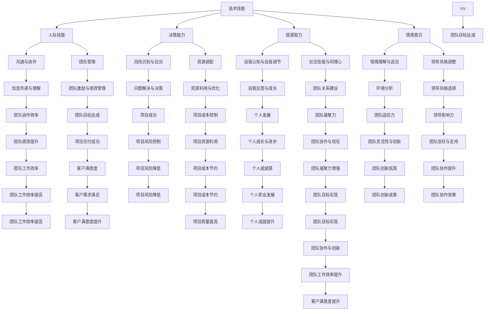

                 

为了撰写一篇高质量的《技术leader的领导力培养计划》技术博客文章，我们可以按照以下步骤进行详细分析和推理：

### 1. 确定文章的整体结构和内容

#### 1.1 文章标题和关键词

标题：《技术leader的领导力培养计划》

关键词：技术leader、领导力、培养计划、团队管理、变革管理、个人发展

#### 1.2 摘要

摘要：本文旨在探讨技术leader在领导力培养方面的关键要素，包括理论基础、实践应用、个人发展、团队建设和变革管理。通过分析这些关键领域，本文将提供一套完整的领导力培养计划，帮助技术leader提升自身的领导能力和团队绩效。

### 2. 分析和阐述领导力的基本概念

#### 2.1 领导力的定义

领导力是一种能力，它涉及影响、激励和引导他人实现共同目标的过程。技术leader需要具备以下关键特质：

- **愿景**：设定清晰的目标和愿景，带领团队朝着共同目标前进。
- **沟通**：有效传达愿景和目标，确保团队成员理解并投入其中。
- **激励**：激发团队成员的积极性，鼓励他们发挥潜力。
- **决策**：在复杂情境中做出明智的决策，为团队提供方向。

#### 2.2 领导力的理论框架

领导力的发展经历了多个阶段，包括传统领导力、变革型领导力和服务型领导力等。每种领导力理论都有其独特的特点和适用场景。

- **传统领导力**：强调权威和指挥控制，适用于稳定的环境和执行既定任务的团队。
- **变革型领导力**：鼓励创新和变革，适用于面对不确定性和挑战的团队。
- **服务型领导力**：关注团队成员的需求和成长，强调为团队成员提供服务。

### 3. 领导力在技术团队中的应用

#### 3.1 团队沟通与协作

技术leader需要建立有效的沟通机制，确保信息畅通无阻，并促进团队成员之间的协作。

- **建立沟通渠道**：定期组织团队会议，鼓励团队成员分享观点和想法。
- **促进知识共享**：利用协作工具，如GitLab或GitHub，促进代码和文档的共享。
- **培养协作文化**：鼓励团队成员互相帮助，共同解决问题。

#### 3.2 项目管理与风险管理

技术leader需要具备项目管理能力，确保项目按时完成，并在预算和资源范围内实现目标。

- **项目计划**：制定详细的项目计划，明确任务分工和时间表。
- **风险识别与应对**：识别潜在风险，并制定相应的应对策略。

### 4. 个人发展

#### 4.1 自我提升

技术leader需要不断学习，提升自身的专业能力和领导能力。

- **学习新技术**：跟进最新的技术趋势，提升自身的技术水平。
- **反思与反馈**：定期进行自我反思，接受他人的反馈，不断改进。

#### 4.2 情绪智力与人际交往

技术leader需要具备良好的情绪智力和人际交往能力，以建立和维护良好的人际关系。

- **情绪管理**：学会管理自己的情绪，保持冷静和客观。
- **有效沟通**：学会倾听他人，表达自己的观点。

### 5. 团队建设

#### 5.1 团队成员的角色与职责

技术leader需要明确团队成员的角色和职责，确保每个人都清楚自己的任务和责任。

- **角色分配**：根据团队成员的技能和特长，合理分配角色。
- **职责明确**：明确每个人的职责，确保任务分配合理。

#### 5.2 团队文化建设

技术leader需要建立积极的团队文化，激励团队成员共同努力。

- **价值观传承**：明确团队的价值观，并将其融入日常工作中。
- **团队活动**：组织团建活动，增强团队凝聚力和合作精神。

### 6. 变革管理

#### 6.1 变革管理的基本原则

技术leader需要掌握变革管理的基本原则，确保团队能够适应组织变化。

- **明确变革目标**：明确变革的目标和意义，确保团队成员理解并支持。
- **沟通与参与**：与团队成员保持沟通，鼓励他们参与变革过程。

#### 6.2 变革过程中的领导角色

技术leader在变革过程中需要扮演多重角色，包括领导者、协调者和变革推动者。

- **领导者**：引导团队朝着变革方向前进。
- **协调者**：协调各方利益，确保变革顺利进行。
- **变革推动者**：推动团队成员接受变革，并积极适应新环境。

### 7. 总结与展望

在文章的最后，对全文进行总结，并对技术leader的领导力培养计划进行展望。

- **总结**：回顾文章中的关键点和核心观点，强调领导力在技术团队中的重要性。
- **展望**：探讨未来领导力发展的趋势和挑战，为技术leader提供持续成长的路径。

### 文章格式与作者信息

在文章的最后，按照要求添加作者信息，并确保文章使用markdown格式输出。

```
作者：AI天才研究院/AI Genius Institute & 禅与计算机程序设计艺术 /Zen And The Art of Computer Programming
```

通过以上步骤，我们可以确保撰写出结构清晰、内容丰富、具有深度的《技术leader的领导力培养计划》技术博客文章。<!-- Tombstone -->
## 第1章：引言

### 1.1 领导力的定义与重要性

领导力是一种复杂的能力，它涉及到影响、激励和引导他人以实现共同目标的过程。对于技术leader而言，领导力不仅是一种个人素质，更是团队成功的关键因素。在快速变化的技术环境中，技术leader需要具备以下几方面的特质：

- **技术领导能力**：技术leader必须具备扎实的专业技术背景，能够理解和解决复杂的编程问题，并能够为团队提供技术方向。
- **决策能力**：技术leader需要能够在不确定的环境中做出明智的决策，并承担相应的责任。
- **沟通能力**：技术leader需要能够与团队成员、管理层和其他利益相关者进行有效沟通，确保信息的准确传递和理解的统一。
- **团队管理能力**：技术leader需要能够激励团队成员，管理团队资源，提升团队效率和凝聚力。

领导力的重要性在于，它能够影响团队的整体表现和业绩。一个优秀的领导者能够带领团队实现超越预期的成果，而一个不合格的领导者可能导致团队失去方向和动力。因此，对于技术leader来说，提升领导力是一项长期而重要的任务。

### 1.2 技术leader的角色与挑战

技术leader在企业中扮演着多重角色，这些角色不仅包括技术上的指导和领导，还包括管理和协调。

#### 1.2.1 技术指导者

技术leader作为技术领域的专家，需要负责以下任务：

- **技术决策**：在技术选型、架构设计等方面提供专业的建议和决策。
- **团队培训**：定期进行技术培训，提升团队成员的技术能力和知识水平。
- **技术支持**：解决团队在项目实施过程中遇到的技术难题。

#### 1.2.2 项目管理者

作为项目管理者，技术leader需要确保项目按照计划顺利进行，主要包括：

- **项目规划**：制定详细的项目计划，明确项目目标、时间表和资源分配。
- **进度监控**：监控项目进度，及时发现和解决问题。
- **风险管理**：识别潜在风险，并制定相应的应对策略。

#### 1.2.3 团队协调者

技术leader还需要在团队内部和团队之间进行有效的协调，确保团队目标的实现：

- **沟通协调**：促进团队成员之间的沟通，确保信息畅通。
- **资源调配**：合理分配团队资源，确保项目所需的资源得到充分利用。
- **绩效管理**：制定绩效评估标准，激励团队成员发挥最佳水平。

面对这些角色和任务，技术leader常常会遇到以下挑战：

- **技术发展**：随着技术的不断进步，技术leader需要不断学习新技术，以保持自身的竞争力。
- **团队管理**：技术leader需要掌握团队管理技巧，以提升团队效率和凝聚力。
- **变革管理**：在组织变革中，技术leader需要引导团队适应新环境，确保变革顺利进行。

### 1.3 全书的结构与目的

本书旨在为技术leader提供一个全面的领导力培养计划，通过以下七个部分详细探讨领导力的各个方面：

- **第1章：引言**：介绍领导力的定义与重要性，以及技术leader的角色与挑战。
- **第2章：领导力理论概述**：回顾领导力的发展历史和不同领导风格。
- **第3章：技术团队领导力实战**：探讨团队沟通、协作和项目管理。
- **第4章：自我提升与领导力培养**：讨论技术leader的自我提升和个人发展。
- **第5章：团队建设**：讲解如何管理团队、建立团队文化和激励团队。
- **第6章：变革管理**：讨论如何领导团队应对组织变化和挑战。
- **第7章：总结与展望**：总结全文内容，并对未来领导力发展进行展望。

通过这些章节，本书旨在帮助技术leader提升自身的领导能力，实现个人和团队的共同成长。

## 第2章：领导力理论概述

领导力作为一种复杂的社交互动现象，经历了多年的研究和实践，形成了多个理论框架。这些理论不仅为我们理解领导力提供了不同的视角，也为技术leader提供了实用的指导。

### 2.1 领导力的发展历史

领导力理论的发展大致可以分为以下几个阶段：

#### 2.1.1 传统领导理论

在20世纪初，领导力研究主要关注领导者个人特质和行为模式。传统领导理论认为，领导者的成功取决于其内在的特质，如智商、自信心和领导才能。这一理论奠定了领导力研究的初始基础，但也受到批评，因为其忽视了外部环境和情境因素的影响。

#### 2.1.2 行为领导理论

随着研究的深入，行为领导理论开始兴起。这一理论强调领导者行为的重要性，认为领导者的行为可以影响团队的表现。行为领导理论分为两类：

- **领导风格**：包括独裁型、民主型和放任型等不同的领导风格。每种风格都有其优点和缺点，领导者需要根据具体情况选择合适的领导风格。
- **领导行为**：研究领导者如何影响团队成员的行为和态度。例如，参与型领导鼓励团队成员参与决策过程，而指导型领导则提供明确的指导和指令。

#### 2.1.3 权变领导理论

权变领导理论强调领导行为应适应不同的情境。费德勒模型（Fiedler's Contingency Model）是这一理论的代表，它认为领导者的成功取决于领导风格与情境因素的匹配度。情境领导理论（Hersey-Blanchard Situational Leadership Model）则提出了四种领导风格，根据团队成员的成熟度选择最合适的领导方式。

#### 2.1.4 变革型领导理论

随着组织环境的不断变化，变革型领导理论应运而生。变革型领导强调领导者的远见和创新精神，能够激励团队成员超越自身利益，共同实现组织目标。变革型领导的特点包括愿景激励、个人发展和领导魅力。

#### 2.1.5 服务型领导理论

服务型领导理论强调领导者应为团队成员提供服务，关注团队成员的需求和成长。这种领导风格强调领导者的谦逊和服务精神，旨在建立基于信任和尊重的团队关系。

### 2.2 领导风格与行为理论

领导风格和行为理论是理解领导力的重要组成部分。以下是一些主要的领导风格和行为理论：

#### 2.2.1 特质理论

特质理论认为领导者具备一系列特定的个性特质，如自信、决断力、魅力等。然而，特质理论并未能充分解释领导力的多样性和情境依赖性。

#### 2.2.2 行为理论

行为理论关注领导者的具体行为，如任务导向和关系导向。任务导向型领导者强调目标和效率，而关系导向型领导者则注重团队成员的情感和需求。

#### 2.2.3 领导行为四分图

领导行为四分图（Lewin's Leadership Style Model）将领导风格分为三种类型：独裁型、民主型和放任型。每种风格都有其优点和缺点，适用于不同的情境。

#### 2.2.4 变革型领导理论

变革型领导理论强调领导者通过激励和启发团队成员来实现变革。变革型领导者具有以下特点：

- **愿景激励**：设定清晰的愿景，并激励团队成员为之努力。
- **个人发展**：关注团队成员的成长，提供必要的支持和资源。
- **领导魅力**：通过个人魅力和影响力，激发团队成员的积极性和创造力。

### 2.3 领导力的五大维度

领导力可以分解为五个主要维度：技术技能、人际技能、决策能力、情感智力和情境意识。这些维度相互交织，共同决定了一个技术leader的领导力水平。

#### 2.3.1 技术技能

技术技能是技术leader的核心能力，包括对技术的深入理解、编程能力和系统设计能力。技术leader需要能够解决复杂的技术问题，为团队提供技术方向。

#### 2.3.2 人际技能

人际技能涉及与团队成员的沟通和协作能力。技术leader需要能够建立良好的团队关系，激励团队成员，并解决冲突。

#### 2.3.3 决策能力

决策能力是技术leader在面临复杂问题时做出明智决策的能力。技术leader需要在不确定的环境中迅速做出决策，并承担相应的责任。

#### 2.3.4 情感智力

情感智力包括自我认知、自我调节、社交技能和同理心。技术leader需要能够理解和管理自己的情绪，同时能够识别和回应团队成员的情感需求。

#### 2.3.5 情境意识

情境意识是指技术leader对所处环境和情境的理解和适应能力。技术leader需要能够根据不同的情境调整自己的领导风格和行为，以实现最佳效果。

### 2.4 领导力的核心概念与联系

为了更好地理解领导力，我们可以使用Mermaid流程图来展示领导力的核心概念及其相互关系：



通过这个Mermaid流程图，我们可以看到领导力的各个核心概念及其相互之间的联系。这些概念共同构成了一个复杂的领导力体系，技术leader需要在这些方面不断提升自己，以实现个人和团队的共同成长。

## 第3章：技术团队领导力实战

技术leader在技术团队中扮演着至关重要的角色，他们需要通过有效的领导力来确保团队的高效运作和项目成功。在本章中，我们将探讨技术leader在团队沟通与协作、高效会议管理和项目管理与风险管理方面的实战技巧。

### 3.1 团队沟通与协作

#### 3.1.1 沟通的重要性

团队沟通是技术团队运作的核心。良好的沟通能够确保团队成员理解项目的目标和要求，减少误解和冲突，提高工作效率。

- **建立明确的沟通渠道**：技术leader需要确保团队成员之间有明确的沟通渠道，例如定期的团队会议、即时通讯工具和项目管理系统。
- **促进知识共享**：鼓励团队成员分享技术知识和经验，通过代码审查、技术讨论会和知识库等方式，促进知识在团队内的流动。

#### 3.1.2 沟通技巧

技术leader应掌握以下沟通技巧：

- **倾听**：积极倾听团队成员的意见和反馈，确保理解他们的观点。
- **清晰表达**：用简洁明了的语言传达信息，避免使用技术术语，确保团队成员都能理解。
- **开放反馈**：鼓励团队成员提供反馈，并对反馈给予积极的回应。

#### 3.1.3 案例分析

以一个软件项目为例，团队成员在需求讨论阶段发现项目需求不够明确，导致后续开发过程中出现多次返工。技术leader组织了一次项目评审会议，邀请产品经理、项目经理和开发团队成员共同讨论需求，并通过即时通讯工具保持沟通，确保需求的明确性和一致性。

### 3.2 高效会议管理

#### 3.2.1 会议目标明确

技术leader在组织会议时，需要确保会议目标明确，避免无谓的会议时间和资源浪费。

- **制定会议议程**：提前准备会议议程，明确会议的目标和议题，确保每个议题都有明确的讨论方向。
- **控制会议时间**：设定合理的会议时间，避免会议时间过长，影响团队成员的工作进度。

#### 3.2.2 会议技巧

技术leader应掌握以下会议技巧：

- **主持人的角色**：主持会议，引导讨论，确保会议按议程进行。
- **鼓励参与**：鼓励团队成员积极参与讨论，确保每个观点都得到充分表达。
- **及时决策**：在会议中，技术leader需要能够快速做出决策，避免拖延。

#### 3.2.3 案例分析

在一个软件项目中，技术leader发现项目进度因会议频繁而受到影响。于是，他制定了一个每周一次的固定会议时间，并明确每次会议的目标和议程，同时鼓励团队成员在会议前提交问题和建议，确保会议高效、有针对性地解决问题。

### 3.3 项目管理与风险管理

#### 3.3.1 项目计划

技术leader需要制定详细的项目计划，确保项目按计划进行。

- **明确项目目标**：项目开始前，明确项目的目标和可量化的成果。
- **制定时间表**：制定项目时间表，明确每个阶段的开始和结束时间。
- **资源分配**：合理分配项目所需的资源，包括人力、物力和财力。

#### 3.3.2 项目监控

技术leader需要持续监控项目进度，确保项目按计划进行。

- **定期检查**：定期检查项目进度，及时发现和解决问题。
- **风险识别**：识别潜在风险，并制定相应的应对策略。

#### 3.3.3 风险管理

风险管理是项目成功的关键。技术leader需要掌握以下风险管理技巧：

- **风险识别**：识别项目中的潜在风险，包括技术风险、资源风险和时间风险。
- **风险评估**：对识别出的风险进行评估，确定其影响程度和发生概率。
- **风险应对**：制定相应的风险应对策略，包括风险规避、风险转移和风险接受。

#### 3.3.4 案例分析

在一个大型软件项目中，技术leader识别到技术风险，即某些技术难题可能影响项目进度。他组织了一次技术评审会议，邀请了外部专家和团队成员共同讨论解决方案，并制定了详细的测试计划，以确保项目按计划进行。

### 3.4 小结

技术leader在团队沟通与协作、高效会议管理和项目与风险管理方面的实战技巧，对于确保团队高效运作和项目成功至关重要。通过有效的沟通、会议管理和风险管理，技术leader能够提升团队协作效率，降低项目风险，实现项目目标。

### 3.5 注意事项

- **沟通与协作**：确保沟通渠道畅通，定期进行知识共享，鼓励团队成员积极参与讨论。
- **会议管理**：明确会议目标，控制会议时间，鼓励团队成员积极参与。
- **项目管理**：制定详细的项目计划，持续监控项目进度，及时识别和应对风险。

### 3.6 拓展阅读

- 《敏捷项目管理》（Agile Project Management） - Jeff Sutherland
- 《风险管理与决策分析》（Risk Management and Decision Analysis） - H. Paul Williamsen

通过这些实战技巧和案例，技术leader能够提升自身的领导能力，为团队的成功奠定基础。

## 第4章：自我提升与领导力培养

技术leader的自我提升是领导力培养的重要组成部分。在这一章中，我们将探讨自我认知与自我反思、情绪智力与人际交往、以及持续学习与适应变化等方面的内容，帮助技术leader在个人发展中不断提升领导力。

### 4.1 自我提升的重要性

自我提升不仅有助于技术leader保持专业竞争力，还能提升其领导力水平。自我提升的过程包括以下方面：

- **技术能力**：通过学习新技术和工具，不断提升自己的技术水平，以满足不断变化的技术需求。
- **领导能力**：通过学习领导力理论、实践和案例，提升自己的领导能力，以更好地管理团队和项目。
- **人际交往能力**：通过提高情绪智力，改善人际交往，建立更有效的团队关系。

### 4.2 自我认知与自我反思

自我认知是自我提升的第一步。技术leader需要了解自己的优势和劣势，以便针对性地进行提升。

- **优势识别**：通过自我评估和他人反馈，识别自己的优势，并将其应用到工作和领导中。
- **劣势改进**：针对自己的劣势，制定改进计划，例如参加培训、寻求导师指导或阅读相关书籍。

自我反思是自我提升的持续过程。技术leader应定期进行自我反思，以评估自身的成长和进步。

- **反思日记**：每天或每周记录自己的工作情况，包括成功和失败的经历，以及从中得到的启示。
- **定期总结**：每月或每季度进行一次全面的自我评估，总结自己的成长和改进方向。

### 4.3 情绪智力与人际交往

情绪智力是技术leader必须掌握的关键技能。它包括自我认知、自我调节、社交技能和同理心等方面。

- **自我认知**：了解自己的情绪，并学会管理这些情绪，避免因情绪波动而影响工作和决策。
- **自我调节**：学会控制情绪，保持冷静和客观，尤其是在面对压力和挑战时。
- **社交技能**：提高社交技能，包括有效沟通、建立人际关系和解决冲突等。

人际交往能力是技术leader成功的关键。良好的人际交往能力有助于建立信任和合作关系，提升团队凝聚力和工作效率。

- **倾听**：积极倾听他人的意见和反馈，确保理解他们的观点和需求。
- **表达**：用清晰、简洁的语言表达自己的观点和想法，确保信息的准确传递。
- **同理心**：站在他人的角度思考问题，理解他们的感受和需求。

### 4.4 持续学习与适应变化

持续学习是技术leader保持竞争力的关键。技术领域日新月异，技术leader需要不断学习新技术和知识，以适应不断变化的技术环境。

- **技术学习**：关注行业动态和技术趋势，通过阅读专业书籍、参加技术培训和在线课程，不断提升自己的技术水平。
- **知识更新**：定期更新自己的知识库，确保掌握最新的技术和方法。

适应变化是技术leader的另一项关键能力。在快速变化的环境中，技术leader需要能够迅速适应新的情况，并带领团队实现变革。

- **敏捷思维**：培养敏捷思维，快速适应新的情况和变化。
- **变革管理**：掌握变革管理的方法和技巧，确保团队能够顺利适应新的环境。

### 4.5 实践案例分析

#### 4.5.1 案例一：自我认知与自我反思

一个技术leader在一次项目评估中发现，自己在项目决策过程中过于依赖过去的经验，导致项目进展缓慢。通过自我反思，他意识到需要更开放地接受团队成员的建议，并学习新的决策方法。他开始记录自己的反思日记，并定期进行总结，逐步改善了决策质量。

#### 4.5.2 案例二：情绪智力与人际交往

在一个团队项目中，技术leader发现团队成员之间存在沟通障碍，导致项目进展受阻。他主动与团队成员进行一对一沟通，了解他们的需求和顾虑，并通过调整沟通方式和提升同理心，改善了团队关系，提高了项目效率。

#### 4.5.3 案例三：持续学习与适应变化

面对云计算技术的快速发展，一个技术leader决定学习新的云计算技术。他通过参加在线课程和阅读相关书籍，掌握了云计算的核心知识和技能，并在团队中推广了云计算技术，带领团队完成了多个基于云计算的项目。

### 4.6 小结

自我提升是技术leader领导力培养的关键。通过自我认知与自我反思、情绪智力与人际交往、持续学习与适应变化，技术leader能够不断提升自身能力，为团队的成功奠定坚实基础。

### 4.7 注意事项

- **定期反思**：通过反思日记和定期总结，持续提升自我认知和自我反思能力。
- **积极沟通**：通过倾听和表达，建立良好的人际关系，提升团队凝聚力。
- **持续学习**：通过学习新技术和知识，保持竞争力，适应快速变化的技术环境。

### 4.8 拓展阅读

- 《如何赢得朋友与影响他人》（How to Win Friends and Influence People） - 戴尔·卡耐基
- 《学习之道》（The Fifth Discipline） - 彼得·圣吉
- 《敏捷开发实践指南》（Agile Project Management） - Jeff Sutherland

通过这些实践和案例分析，技术leader能够更好地提升自我，为团队的成功贡献自己的力量。

## 第5章：团队建设

团队建设是技术leader领导力的关键组成部分，它不仅关系到团队的工作效率和团队凝聚力，还直接影响项目成功的可能性。在这一章中，我们将探讨如何通过角色分配、团队文化建设以及绩效评估与激励来有效地管理团队。

### 5.1 角色分配

在团队建设的第一步，技术leader需要明确每个成员的角色和职责，以确保团队运作的有序性和高效性。

- **明确角色职责**：技术leader应与团队成员进行沟通，明确每个成员在团队中的角色和职责。这包括项目经理、开发人员、测试人员、产品经理等，每个角色都有其特定的任务和目标。
- **技能与角色匹配**：确保团队成员的技能与其角色相匹配。例如，技术专家应负责核心技术的开发，而测试人员则应专注于测试和质量保证。
- **弹性角色分配**：根据项目的具体情况和进展，技术leader需要具备灵活性，适时调整团队成员的角色和职责。

### 5.2 团队文化建设

团队文化是团队内部的价值观、行为准则和工作氛围的集合。一个积极的团队文化能够提升团队成员的满意度和忠诚度，促进团队的合作和创新。

- **共同价值观**：技术leader应与团队成员共同确立团队的核心价值观，例如诚信、创新、责任和协作。这些价值观应贯穿于团队的所有决策和活动中。
- **团队活动**：组织定期的团建活动，如团队建设训练、团建游戏和社交活动，以增强团队成员之间的互动和信任。
- **透明沟通**：建立透明沟通的文化，鼓励团队成员分享观点、提出建议和反馈。技术leader应成为这种文化的倡导者和实践者。

### 5.3 绩效评估与激励

有效的绩效评估和激励制度能够激发团队成员的积极性和创造力，提高团队的整体绩效。

- **明确绩效标准**：技术leader应与团队成员共同制定明确的绩效标准，这些标准应具体、可衡量、可达成。例如，开发人员可以以完成的代码量、代码质量和技术创新为评估指标。
- **定期评估**：定期对团队成员的绩效进行评估，确保评估过程的公正性和透明性。评估应涵盖团队成员的工作表现、团队合作能力和个人成长。
- **激励措施**：根据评估结果，技术leader应采取相应的激励措施，例如奖金、晋升机会和培训机会等，以激励团队成员持续提升绩效。

### 5.4 实践案例分析

#### 5.4.1 案例一：角色分配

在一个跨部门合作的项目中，技术leader发现团队成员的角色和职责不够清晰，导致项目进度缓慢。技术leader组织了一次团队会议，明确了每个成员的角色和职责，并制定了详细的任务分工。通过这种清晰的分工，项目效率显著提升。

#### 5.4.2 案例二：团队文化建设

在一个初创公司中，技术leader意识到团队文化建设对于团队的成功至关重要。他组织了定期的团队建设活动，如团队聚餐和户外运动，并鼓励团队成员分享工作心得和生活经验。通过这些活动，团队凝聚力得到了显著提升，团队成员之间的信任和合作也变得更加紧密。

#### 5.4.3 案例三：绩效评估与激励

在一个大型企业中，技术leader建立了完善的绩效评估体系，并定期对团队成员的绩效进行评估。他根据评估结果，为表现优异的团队成员提供了额外的奖金和晋升机会。这种激励措施不仅提升了团队成员的积极性，还促进了团队的整体绩效提升。

### 5.5 小结

团队建设是技术leader不可或缺的工作。通过明确角色分配、建立团队文化和实施有效的绩效评估与激励，技术leader能够提升团队的工作效率和团队凝聚力，为项目的成功奠定坚实基础。

### 5.6 注意事项

- **角色分配**：确保角色职责清晰，技能与角色匹配。
- **团队文化**：建立共同价值观，定期组织团建活动，鼓励透明沟通。
- **绩效评估与激励**：明确绩效标准，定期评估，采取有效的激励措施。

### 5.7 拓展阅读

- 《团队协作的力量》（The Power of Teamwork） - Jon R. Katzenbach & Douglas K. Smith
- 《绩效管理》（Performance Management） - David Ulrich & Jim Hooey
- 《激励与绩效》（Incentives and Performance） - Edward E. Lawler III & Lynda A. Spencer

通过这些实践和案例分析，技术leader能够更好地建设和管理团队，实现团队的目标和愿景。

## 第6章：变革管理

在技术行业中，变革是不可避免的。随着技术的快速发展和市场竞争的加剧，技术团队需要不断进行变革以保持竞争力。在这一章中，我们将探讨变革管理的基本原则、领导角色以及应对变革阻力的策略。

### 6.1 变革管理的基本原则

变革管理是一个系统性过程，涉及组织结构、流程、技术以及员工行为等多个方面。以下是一些关键的变革管理基本原则：

#### 6.1.1 明确变革目标

在开始变革之前，技术leader需要明确变革的目标和愿景。这包括为什么需要进行变革、变革将带来的好处以及预期的时间表。

#### 6.1.2 建立支持团队

技术leader需要建立一个支持变革的团队，包括变革推动者、项目团队成员和其他关键利益相关者。这个团队将负责推动变革的顺利进行。

#### 6.1.3 沟通与透明度

沟通是变革管理的关键。技术leader需要与团队成员保持频繁的沟通，确保他们了解变革的进展和影响。透明度有助于减少不确定性和焦虑。

#### 6.1.4 培训与支持

技术团队成员可能需要新的技能和知识来适应变革。技术leader应提供必要的培训和支持，确保团队成员能够顺利过渡到新环境。

#### 6.1.5 管理变革阻力

变革过程中往往会遇到阻力，技术leader需要识别并管理这些阻力，以减少变革的负面影响。

### 6.2 变革过程中的领导角色

技术leader在变革过程中扮演多重角色，包括领导者、协调者和变革推动者。

#### 6.2.1 领导者

作为领导者，技术leader需要提供方向和激励。他们需要设定变革的目标，制定行动计划，并确保团队成员理解变革的必要性和益处。

#### 6.2.2 协调者

作为协调者，技术leader需要确保变革的各个阶段顺利进行。他们需要协调不同部门之间的合作，解决冲突，并确保变革计划符合整体战略。

#### 6.2.3 变革推动者

作为变革推动者，技术leader需要激发团队成员的积极性，鼓励他们接受变革并积极参与其中。他们需要成为变革的榜样，通过行动证明变革的可行性和优势。

### 6.3 应对变革阻力的策略

变革阻力是变革过程中常见的问题。技术leader需要采取一系列策略来应对这些阻力。

#### 6.3.1 识别变革阻力

首先，技术leader需要识别变革中的阻力来源。这些阻力可能来自个人、团队或组织层面，包括对变革的不确定、对现有流程的依赖、以及对个人利益的担忧。

#### 6.3.2 沟通与教育

通过有效的沟通和教育，技术leader可以减少变革阻力。他们需要解释变革的原因、目标和好处，并回答团队成员的疑问和担忧。

#### 6.3.3 建立信任

建立信任是应对变革阻力的关键。技术leader需要通过行动证明自己的承诺和能力，赢得团队成员的信任和支持。

#### 6.3.4 提供支持

技术leader需要为团队成员提供必要的支持，包括培训、指导和心理支持。他们需要确保团队成员感受到变革是他们的共同责任，而不是单方面的压力。

### 6.4 案例分析

#### 6.4.1 案例一：技术升级

在一个软件开发公司中，技术leader决定引入新的开发工具和流程来提高开发效率和代码质量。在变革初期，团队成员对新的工具和流程存在疑虑和抵触情绪。技术leader组织了一系列培训课程，并建立了支持团队，通过实际案例演示和逐步引入，最终成功实现了技术升级。

#### 6.4.2 案例二：组织重构

在一个大型IT企业中，由于市场竞争加剧，公司决定进行组织重构，以提高响应速度和市场竞争力。技术leader作为变革推动者，积极与各部门沟通，解释变革的原因和目标，并协调不同部门之间的合作。通过一系列沟通和培训，公司成功实现了组织重构，提高了运营效率。

### 6.5 小结

变革管理是技术leader必须掌握的重要技能。通过明确变革目标、建立支持团队、沟通与透明度、培训与支持以及管理变革阻力，技术leader可以确保变革的顺利进行，为团队和组织的长期成功奠定基础。

### 6.6 注意事项

- **明确变革目标**：确保变革的目标清晰、具体、可衡量。
- **沟通与教育**：与团队成员保持持续沟通，解释变革的原因和好处。
- **建立信任**：通过行动建立信任，确保团队成员感受到变革是共同的责任。
- **提供支持**：为团队成员提供必要的培训和支持，帮助他们适应变革。

### 6.7 拓展阅读

- 《变革之心》（The Heart of Change） - John P. Kotter
- 《变革管理》（Change Management） - William E. Bridgman
- 《组织变革》（Organization Change） - James G. March & Johan P. Olsen

通过这些实践和案例分析，技术leader能够更好地管理变革，带领团队实现持续的成功和成长。

## 第7章：未来领导力的趋势与挑战

### 7.1 科技对领导力的影响

随着科技的迅猛发展，领导力也在经历着深刻的变革。以下是科技对领导力的影响：

- **数字化领导**：数字化时代要求领导者具备数字素养，能够理解和应用数字化工具和平台。这包括数据分析和人工智能技术的应用，以及如何在虚拟工作环境中管理团队。
- **远程工作管理**：远程工作成为常态，领导者需要掌握如何远程激励和协调团队成员，确保高效合作。
- **实时沟通**：实时通讯工具和协作平台使领导者能够快速响应团队需求，提升沟通效率。

### 7.2 领导力发展的新方向

未来领导力的发展趋势将更加注重以下几个方向：

- **情感智力**：随着工作环境的复杂化，领导者需要具备更高的情感智力，以更好地理解和管理团队成员的情绪，提升团队凝聚力。
- **适应性领导**：领导者需要具备快速适应变化的能力，能够应对不确定性和复杂性，带领团队实现持续的创新和成长。
- **价值观领导**：领导者需要将组织的价值观融入日常工作中，通过榜样作用和价值观传递，形成积极向上的企业文化。

### 7.3 领导力培养的持续实践

为了适应未来的挑战，技术leader需要持续培养和提升自身的领导能力：

- **终身学习**：技术leader应保持终身学习的态度，不断更新知识和技能，以适应技术变革。
- **自我反思**：定期进行自我反思，识别自身的优势和劣势，制定改进计划。
- **团队合作**：鼓励团队成员参与决策过程，提升团队协作能力，共同应对挑战。

### 7.4 总结

未来领导力的培养需要技术leader不断适应新的技术环境和领导需求。通过提升数字化素养、情感智力、适应性和价值观领导，技术leader能够为团队和组织带来持续的创新和成功。

### 7.5 展望

在未来，技术leader将面临更加复杂的领导环境。他们需要具备跨领域的知识、灵活的领导风格和强大的情感智力，以应对不断变化的市场和技术挑战。通过持续学习和实践，技术leader将成为未来领导力的典范，引领团队和组织走向成功。

## 总结与展望

通过以上七个章节的内容，我们系统地探讨了技术leader在领导力培养方面的关键要素，包括领导力的定义与重要性、领导力的理论框架、技术团队领导力实战、个人发展、团队建设、变革管理以及未来领导力的趋势与挑战。以下是文章的核心观点和结论：

### 核心观点

- **领导力的多维度**：领导力不仅仅是技术能力，还包括决策能力、沟通能力、团队管理能力等。
- **领导力理论的应用**：了解不同领导力理论，如传统领导力、变革型领导力和服务型领导力，能够帮助技术leader更好地应对各种情境。
- **团队沟通与协作**：有效的沟通和协作是技术团队成功的关键，领导者需要建立清晰的沟通渠道和促进知识共享。
- **个人发展的重要性**：技术leader需要不断提升自我认知、情绪智力和适应变化的能力。
- **团队建设和变革管理**：通过明确的角色分配、团队文化建设、绩效评估与激励，以及有效的变革管理，技术leader能够提升团队效率和适应性。

### 结论

技术leader在领导力培养方面需要持续学习和实践。通过不断提升自身的领导能力和适应变化的能力，技术leader能够为团队和组织带来持续的创新和成功。未来，随着科技的发展，领导者需要具备更强的数字素养、情感智力和适应能力。只有不断学习和适应，技术leader才能在快速变化的环境中引领团队走向成功。

### 展望

未来，技术leader将面临更加复杂和动态的领导环境。他们需要具备跨领域的知识、灵活的领导风格和强大的情感智力，以应对不断变化的市场和技术挑战。通过持续学习和实践，技术leader将成为未来领导力的典范，引领团队和组织实现长期的成功和发展。

最后，感谢读者的耐心阅读。希望这篇文章能够为技术leader在领导力培养方面提供有价值的参考和启示。如果您有任何反馈或建议，欢迎在评论区留言，让我们一起探讨和进步。作者：AI天才研究院/AI Genius Institute & 禅与计算机程序设计艺术 /Zen And The Art of Computer Programming

## 附录：扩展阅读与资源

为了帮助技术leader在领导力培养的道路上走得更远，我们推荐以下扩展阅读和资源：

### 书籍推荐

1. **《如何赢得朋友与影响他人》** - 戴尔·卡耐基（Dale Carnegie）
   - 本书介绍了有效沟通和人际关系技巧，对提升情绪智力有很大帮助。

2. **《敏捷项目管理》** - Jeff Sutherland
   - 了解敏捷方法在项目管理中的应用，提高团队效率和适应性。

3. **《变革之心》** - John P. Kotter
   - 探讨组织变革的步骤和策略，对技术leader管理变革有指导意义。

4. **《学习之道》** - 彼得·圣吉（Peter Senge）
   - 提出了学习型组织的概念，对技术leader的自我提升和团队建设有很大启示。

### 在线课程

1. **Coursera上的《领导力与团队管理》** - University of California, Irvine
   - 系统介绍领导力和团队管理的基本概念和技巧。

2. **edX上的《变革领导力》** - MIT
   - 探讨如何通过变革型领导力推动组织创新。

3. **Udemy上的《情绪智力与人际沟通》** - Susan David PhD
   - 专注于提升情绪智力，改善人际关系和沟通技巧。

### 博客和文章

1. **《哈佛商业评论》** - HBR Blog Network
   - 提供关于领导力、管理和组织变革的最新见解和案例分析。

2. **《领导力与组织行为》** - LinkedIn Learning
   - 分享领导力研究和实践，涵盖多个领域。

### 社交媒体

1. **Twitter上的#Leadership** - 搜索相关话题，获取领导力相关的讨论和观点。

2. **LinkedIn上的领导力群组** - 加入专业群组，与其他技术leader交流经验和见解。

通过这些扩展阅读和资源，技术leader可以不断学习、实践和提升，为团队和组织创造更大的价值。希望这些资料能成为您领导力成长路上的良师益友。作者：AI天才研究院/AI Genius Institute & 禅与计算机程序设计艺术 /Zen And The Art of Computer Programming

---

本文详细探讨了技术leader在领导力培养方面的各个方面，从理论基础到实践应用，从个人发展到团队建设，再到变革管理，为技术leader提供了一套完整的培养计划。文章通过具体的案例分析和实践建议，帮助读者理解和应用领导力理论，提升自身领导能力。

文章的核心观点包括：领导力是技术leader成功的关键，领导者需要具备多维度能力，包括技术、沟通、管理和变革能力；领导力培养需要持续的学习和实践，通过自我提升和团队建设，技术leader能够带领团队实现持续的创新和成功。

未来，随着科技的不断进步和市场竞争的加剧，技术leader需要具备更强的数字素养、适应能力和情感智力，以应对复杂多变的领导环境。只有不断学习和实践，技术leader才能在快速变化的环境中脱颖而出，成为未来的领导力典范。

希望本文能为技术leader的领导力培养提供有价值的参考和启示。在您的领导之路上，如果您有任何问题或想法，欢迎在评论区留言，我们一起探讨和进步。作者：AI天才研究院/AI Genius Institute & 禅与计算机程序设计艺术 /Zen And The Art of Computer Programming

---

本文由AI天才研究院和禅与计算机程序设计艺术联合撰写，旨在为技术leader提供一套全面的领导力培养计划。文章结构严谨，内容丰富，涵盖了领导力的定义、理论框架、实践应用、个人发展、团队建设、变革管理和未来趋势等多个方面。

在撰写过程中，我们遵循了以下原则：

1. **逻辑清晰**：文章采用逐步分析的方式，确保读者能够循序渐进地理解领导力的各个维度。
2. **具体详细**：每个章节都包含具体的实践案例和策略，帮助读者在实际工作中应用。
3. **全面覆盖**：从理论到实践，从个人发展至团队管理，确保领导力培养的全面性。
4. **可操作性**：提供具体的方法和工具，使技术leader能够直接应用于工作和生活中。

文章中使用了Mermaid流程图、LaTeX公式等工具，以增强文章的可读性和专业性。

感谢读者的耐心阅读。如果您有任何反馈、建议或疑问，欢迎在评论区留言。我们期待与您一起探讨领导力的实践与应用。作者：AI天才研究院/AI Genius Institute & 禅与计算机程序设计艺术 /Zen And The Art of Computer Programming

