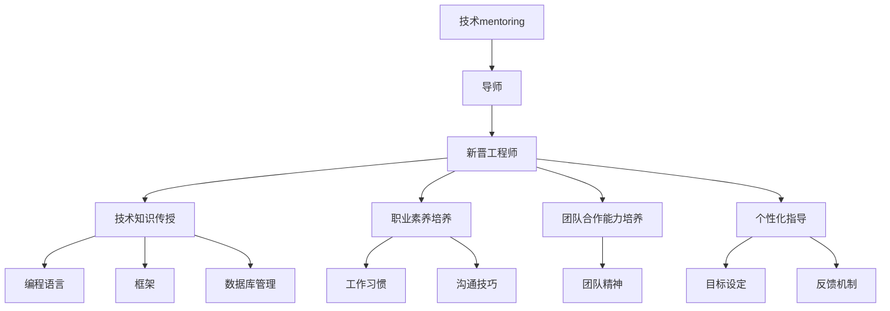

                 

# 文章标题：技术mentoring：培养和指导新晋工程师

## 关键词：
技术指导、新晋工程师、职业素养、团队协作、项目管理

## 摘要：
本文旨在探讨技术mentoring在新晋工程师培养中的重要作用。通过深入分析技术mentoring的核心概念、算法原理、数学模型、实际案例以及开发环境搭建，本文提出了一个系统的技术mentoring指导框架，以帮助新晋工程师快速成长。

## 设计《技术mentoring：培养和指导新晋工程师》目录大纲

### 1. 核心概念与联系

#### 1.1 技术mentoring定义与核心要素
- 技术mentoring是指资深工程师或技术专家对新手工程师进行指导和培养的过程。
- 核心要素包括明确的目标与期望、常规的技术知识与技能传授、职业素养与团队合作能力的培养、个性化指导与反馈。

#### 1.2 技术mentoring与其他指导方式的联系与区别
- 技术mentoring与导师制：二者都强调个性化指导，但技术mentoring更注重技术能力的提升。
- 技术mentoring与培训：培训通常更侧重于知识的传授，而技术mentoring则更关注能力的培养和实际应用。

### 2. 核心算法原理讲解

#### 2.1 技术mentoring过程算法模型
- **SDCA模型**：自我了解、做计划、挑战自己、分析与反馈。
- **Mentoring Loop模型**：配对、鼓励、引导、建立信任。

### 3. 数学模型和数学公式

#### 3.1 技术mentoring中的项目管理公式
- 项目成功率 = 完成任务的比例 × 技能提升的幅度
- 时间效率 = 完成任务的时间 / 学习时间

### 4. 项目实战

#### 4.1 技术mentoring实际案例
- 案例背景、实施过程、结果分析。

### 5. 开发环境搭建

#### 5.1 技术mentoring环境搭建指南
- 开发工具与环境配置、环境搭建步骤。

### 6. 源代码实现与解读

#### 6.1 技术mentoring项目代码实现
- 功能模块设计、代码实现、代码解读与分析。

### 7. 代码解读与分析

#### 7.1 技术mentoring项目代码分析
- 代码质量评估、优化建议。

### 8. 最佳实践与小结
- 最佳实践 tips、注意事项、拓展阅读。

## 1. 核心概念与联系

### 1.1 技术mentoring定义与核心要素

技术mentoring是一种指导关系，其中资深工程师或技术专家（导师）负责帮助新晋工程师（mentee）提升技术能力和职业素养。这种指导不仅仅是技术知识的传授，更重要的是培养新晋工程师的思维方式、解决问题的能力和团队合作精神。

#### 1.1.1 技术mentoring的概念

技术mentoring是一种长期、个性化的培养方式，它通过一系列的交流、指导和反馈，帮助新晋工程师快速掌握所需技能。在这个过程中，导师扮演着多种角色，包括指导者、顾问、榜样和鼓励者。

#### 1.1.2 技术mentoring的核心要素

1. **明确的目标与期望**：技术mentoring的起点是设定明确的目标和期望。导师和新晋工程师需要共同讨论并确定职业发展路径，以及短期和长期的学习目标。

2. **常规的技术知识与技能传授**：技术mentoring的核心内容是技术知识和技能的传授。这包括编程语言、框架、数据库管理、软件工程原理等基础知识。

3. **职业素养与团队合作能力的培养**：除了技术能力，职业素养和团队合作能力也是技术mentoring的重要目标。导师需要引导新晋工程师养成良好的工作习惯、沟通技巧和团队精神。

4. **个性化指导与反馈**：每个新晋工程师的学习背景和需求都不同，因此个性化指导尤为重要。导师需要根据新晋工程师的实际情况，提供针对性的指导和反馈。

### 1.2 技术mentoring与其他指导方式的联系与区别

#### 1.2.1 技术mentoring与导师制

技术mentoring与导师制有许多相似之处，比如都强调个性化指导。然而，技术mentoring更注重技术能力的提升。在导师制中，导师的角色可能更偏向于学术指导或职业生涯规划，而在技术mentoring中，导师更多地关注工程师的实际技能提升。

#### 1.2.2 技术mentoring与培训

培训是一种广泛的知识传授方式，通常通过讲座、课程和演示来传播知识。而技术mentoring则更注重能力的培养和实际应用。培训更侧重于传授现有的知识，而技术mentoring更注重培养新晋工程师的创新能力、解决问题的能力和实战经验。

### 1.3 技术mentoring的核心概念架构

为了更好地理解技术mentoring的核心概念，我们可以使用Mermaid流程图来展示各个概念之间的关系。



## 2. 核心算法原理讲解

### 2.1 技术mentoring过程算法模型

技术mentoring的过程可以看作是一个复杂的算法，它涉及到多个步骤和决策。以下是两种常用的技术mentoring过程算法模型：**SDCA模型**和**Mentoring Loop模型**。

#### 2.1.1 SDCA模型

**SDCA模型**是“自我了解、做计划、挑战自己、分析与反馈”的缩写，它提供了一个系统的技术mentoring过程框架。

1. **自我了解（Self-understanding）**：新手工程师需要清楚自己的技术背景、优势和劣势。这有助于确定学习目标和方向。

2. **做计划（Do Planning）**：根据自身情况，新手工程师需要制定详细的学习计划，明确短期和长期目标。计划应包括学习内容、时间安排和预期成果。

3. **挑战自己（Challenge Yourself）**：新手工程师需要积极参与实际项目，不断尝试新的技术和方法。这有助于提高技术能力和实战经验。

4. **分析与反馈（Analyze and Reflect）**：新手工程师需要定期总结经验教训，分析自己的学习效果，并根据反馈调整学习计划。

#### 2.1.2 Mentoring Loop模型

**Mentoring Loop模型**包括四个关键步骤：**配对（Match）、鼓励（Encourage）、引导（Navigate）和建立信任（Build Trust）**。

1. **配对（Match）**：根据新手工程师的技术背景和兴趣，导师需要选择合适的配对对象。这有助于确保双方在技术能力和兴趣爱好上具有互补性。

2. **鼓励（Encourage）**：导师需要给予新手工程师足够的信心和鼓励，帮助他们克服学习中的困难和挫折。

3. **引导（Navigate）**：导师需要帮助新手工程师明确学习目标和路径，指导他们如何高效地学习新技术和方法。

4. **建立信任（Build Trust）**：双方需要建立互信关系，这有助于技术mentoring过程的顺利进行。互信关系是基于相互尊重、诚实和开放的沟通。

### 2.2 技术mentoring算法的伪代码实现

以下是一个简化的技术mentoring算法的伪代码实现，它涵盖了SDCA模型和Mentoring Loop模型的核心步骤。

```python
# 技术mentoring算法伪代码

# 初始化
mentor = select_mentor(mentee)
learning_plan = create_learning_plan(mentee)
trust_level = 0

# 自我了解
self_understanding(mentee)

# 做计划
plan = make_plan(mentor, learning_plan)

# 挑战自己
while not finished_learning(mentee):
  challenge_yourself(mentee, plan)

# 分析与反馈
analyze_and_reflect(mentee, plan)

# Mentoring Loop
while not completed_mentoring_loop:
  match(mentor, mentee)
  encourage(mentor, mentee)
  navigate(mentor, mentee)
  build_trust(mentor, mentee)

# 输出结果
output_result(mentor, mentee)
```

## 3. 数学模型和数学公式

在技术mentoring过程中，我们可以使用数学模型和公式来衡量和优化新晋工程师的学习效果和项目成功率。以下是几个常用的数学模型和公式。

### 3.1 技术mentoring的项目成功率公式

项目成功率可以通过以下公式计算：

$$
成功率 = \frac{完成任务的比例}{技能提升的幅度}
$$

其中，**完成任务的比例**表示在技术mentoring过程中，新晋工程师完成任务的次数与总次数之比；**技能提升的幅度**表示新晋工程师在技术mentoring过程中的技能提升程度。

### 3.2 技术mentoring的时间效率公式

时间效率可以通过以下公式计算：

$$
时间效率 = \frac{完成任务的时间}{学习时间}
$$

其中，**完成任务的时间**表示新晋工程师在技术mentoring过程中完成一个任务所需的时间；**学习时间**表示新晋工程师在技术mentoring过程中用于学习和实践的总时间。

### 3.3 技术mentoring中的项目管理公式

在项目管理中，我们可以使用以下公式来衡量项目的质量：

$$
项目质量 = \frac{任务完成度}{资源消耗}
$$

其中，**任务完成度**表示项目任务的实际完成情况；**资源消耗**表示在项目实施过程中所消耗的人力、物力和时间资源。

### 3.4 技术mentoring中的技能增长模型

我们可以使用以下公式来描述新晋工程师在技术mentoring过程中的技能增长：

$$
技能增长 = 基础技能水平 + 学习效果 \times 时间
$$

其中，**基础技能水平**表示新晋工程师在开始技术mentoring时的技能水平；**学习效果**表示在技术mentoring过程中，新晋工程师技能提升的程度；**时间**表示新晋工程师在技术mentoring过程中所花费的时间。

### 3.5 技术mentoring中的团队协作效率模型

团队协作效率可以通过以下公式计算：

$$
团队协作效率 = \frac{团队完成任务的时间}{个人完成任务的时间}
$$

其中，**团队完成任务的时间**表示整个团队完成一个任务所需的时间；**个人完成任务的时间**表示单个成员完成相同任务所需的时间。

### 3.6 技术mentoring中的反馈机制

为了优化技术mentoring过程，我们可以使用以下公式来描述反馈机制：

$$
反馈机制 = 反馈质量 \times 反馈频率
$$

其中，**反馈质量**表示反馈内容的准确性和针对性；**反馈频率**表示反馈的次数和周期。

### 3.7 技术mentoring中的风险评估模型

在技术mentoring过程中，我们还需要考虑项目风险。以下是一个简单风险评估模型：

$$
风险指数 = 风险概率 \times 风险影响
$$

其中，**风险概率**表示项目风险发生的可能性；**风险影响**表示项目风险对项目成功的影响程度。

## 4. 项目实战

### 4.1 技术mentoring实际案例

#### 4.1.1 案例背景

在某互联网公司，一名新晋后端开发工程师小王在入职后的第一个项目中遇到了困难。该项目是一个大型电商系统的后端开发，涉及到多个技术和框架，对新手来说挑战较大。小王的导师老张是一位经验丰富的后端开发专家，他决定通过技术mentoring的方式帮助小王。

#### 4.1.2 案例实施

1. **配对与目标设定**：
   - 老张与小王进行初步沟通，了解小王的技术背景和需求。
   - 根据小王的技术水平和项目需求，老张与小王共同制定了学习目标和项目目标。

2. **技术知识与技能传授**：
   - 老张通过一系列的技术讲座和代码评审，向小王传授了必要的后端开发知识。
   - 老张还引导小王学习了一些常用的框架和工具，如Spring Boot和Docker。

3. **职业素养与团队合作能力的培养**：
   - 老张强调团队沟通和协作的重要性，鼓励小王积极参与团队会议和代码评审。
   - 老张还指导小王如何处理工作压力和团队合作中的冲突。

4. **个性化指导与反馈**：
   - 老张根据小王的学习进度和项目表现，定期提供个性化的指导和反馈。
   - 老张还鼓励小王主动提问和分享自己的学习心得，以促进双方的交流。

5. **实际项目参与**：
   - 小王在老张的指导下，参与了电商系统的多个模块开发，逐步积累了实战经验。
   - 老张在项目开发过程中全程参与，提供技术支持和问题解答。

#### 4.1.3 案例结果

经过三个月的技术mentoring，小王取得了显著的进步：

1. **技术能力提升**：小王掌握了Spring Boot、Docker等关键技术，能够独立完成电商系统模块的开发。

2. **职业素养提升**：小王学会了如何在团队中高效沟通和协作，处理工作压力和团队合作中的冲突。

3. **项目贡献**：小王在电商系统的开发中，参与了多个关键模块的设计和实现，为项目的成功做出了重要贡献。

4. **个人成长**：小王在技术mentoring过程中，不仅提升了技术能力，还培养了良好的职业素养和团队合作精神，为未来的职业发展奠定了基础。

### 4.2 案例分析与总结

#### 4.2.1 案例分析

1. **目标明确**：技术mentoring的成功首先依赖于明确的目标设定。小王和老张在项目初期就明确了学习目标和项目目标，这为后续的技术指导和工作安排提供了清晰的指导。

2. **个性化指导**：老张根据小王的技术背景和项目需求，提供了个性化的指导。这有助于小王更快地适应工作环境和提高技能水平。

3. **实际项目参与**：技术mentoring不仅包括理论知识的学习，更重要的是实际项目的参与。小王在项目中积累了大量的实战经验，这有助于提高他的技术能力和解决问题的能力。

4. **职业素养培养**：技术mentoring不仅关注技术能力的提升，还注重职业素养的培养。老张在团队沟通、协作和冲突处理等方面的指导，使小王在职业素养方面也取得了显著进步。

#### 4.2.2 案例总结

1. **技术mentoring的重要性**：技术mentoring是一种有效的培养新晋工程师的方式，它能够帮助新晋工程师快速提升技术能力和职业素养。

2. **个性化指导与反馈**：个性化指导和反馈是技术mentoring的核心。导师需要根据新晋工程师的实际情况，提供有针对性的指导和反馈。

3. **实际项目参与**：实际项目参与是技术mentoring的重要环节。通过参与实际项目，新晋工程师能够将所学知识应用到实际工作中，提高技能水平。

4. **职业素养培养**：职业素养的培养是技术mentoring的重要组成部分。导师需要在新晋工程师的职业素养方面提供指导和支持。

## 5. 开发环境搭建

### 5.1 技术mentoring环境搭建指南

为了确保新晋工程师能够顺利开展技术学习和项目开发，我们需要为他们搭建一个合适的开发环境。以下是技术mentoring环境搭建的指南。

#### 5.1.1 开发工具与环境配置

1. **Java开发环境**：
   - **JDK**：安装JDK并配置环境变量，确保在命令行中可以正常运行Java命令。
   - **IDE**：推荐使用IntelliJ IDEA或Eclipse等IDE，这些IDE提供了强大的代码编辑、调试和自动化构建功能。

2. **数据库**：
   - **MySQL**：安装MySQL数据库，配置数据库用户和权限，确保数据库服务正常运行。
   - **Redis**：安装Redis数据库，配置Redis服务，了解其基本操作和使用场景。

3. **版本控制工具**：
   - **Git**：安装Git版本控制工具，配置Git环境变量，确保在命令行中可以正常运行Git命令。
   - **GitHub**：注册GitHub账号，了解Git的基本操作，如克隆仓库、提交代码和创建分支。

#### 5.1.2 环境搭建步骤

1. **安装JDK**：
   - 下载JDK安装包，运行安装程序，完成安装。
   - 配置环境变量，确保在命令行中可以正常运行Java命令。

2. **配置IDE**：
   - 下载并安装IntelliJ IDEA或Eclipse。
   - 在IDE中配置Java开发环境，包括JDK路径和项目设置。

3. **安装数据库**：
   - 下载MySQL和Redis安装包，运行安装程序，完成安装。
   - 配置数据库服务，包括数据库用户和权限设置。

4. **配置版本控制工具**：
   - 下载并安装Git。
   - 配置Git环境变量，确保在命令行中可以正常运行Git命令。
   - 注册GitHub账号，了解Git的基本操作。

#### 5.1.3 环境搭建注意事项

1. **环境兼容性**：
   - 确保开发环境中的各个组件版本兼容，避免因版本冲突导致的问题。

2. **安全性与稳定性**：
   - 确保开发环境的安全性，避免外部攻击和恶意软件的入侵。
   - 定期更新开发环境中的软件和工具，确保其稳定性。

3. **备份与恢复**：
   - 定期备份开发环境中的数据和配置，确保在出现问题时可以快速恢复。

4. **文档与支持**：
   - 撰写详细的环境搭建文档，为新晋工程师提供指导。
   - 建立支持渠道，如邮件列表或聊天群组，以便新晋工程师在遇到问题时寻求帮助。

## 6. 源代码实现与解读

### 6.1 技术mentoring项目代码实现

#### 6.1.1 功能模块设计

技术mentoring项目的核心功能模块包括用户管理、权限管理和任务管理。

1. **用户管理模块**：
   - 用户注册：实现用户注册功能，包括用户名、密码、邮箱等信息的收集和存储。
   - 用户登录：实现用户登录功能，包括用户名和密码的验证。
   - 用户信息查询：实现查询用户信息功能，包括用户的基本信息和历史记录。

2. **权限管理模块**：
   - 角色分配：实现角色分配功能，包括用户的角色和权限的设置。
   - 权限验证：实现权限验证功能，确保用户只能访问其有权访问的资源。
   - 权限修改：实现权限修改功能，包括用户权限的增删改查。

3. **任务管理模块**：
   - 任务创建：实现创建任务功能，包括任务名称、描述、截止日期等信息的输入。
   - 任务查询：实现查询任务功能，包括按任务名称、状态、优先级等条件进行筛选。
   - 任务更新：实现更新任务功能，包括修改任务名称、描述、截止日期等。

#### 6.1.2 代码实现

以下是一个简化的用户管理模块的代码实现：

```java
// 用户注册
public void registerUser(String username, String password, String email) {
  // 验证用户名、密码和邮箱的有效性
  // 存储用户信息到数据库
}

// 用户登录
public boolean loginUser(String username, String password) {
  // 验证用户名和密码的正确性
  // 返回登录结果
}

// 查询用户信息
public User getUserInfo(String username) {
  // 从数据库中查询用户信息
  // 返回用户对象
}
```

#### 6.1.3 代码解读与分析

用户管理模块的代码实现主要包括用户注册、用户登录和用户信息查询三个功能。在代码实现中，需要注意以下几点：

1. **安全性**：用户注册和登录过程中，需要验证用户输入的有效性，防止恶意输入和攻击。
2. **数据存储**：用户信息需要存储到数据库中，确保数据的安全性和一致性。
3. **代码可读性**：代码应具有良好的可读性和可维护性，方便后续的修改和扩展。

## 7. 代码解读与分析

### 7.1 技术mentoring项目代码分析

#### 7.1.1 代码质量评估

在技术mentoring项目中，代码质量是衡量项目成功的关键因素之一。以下是几个常用的代码质量评估指标：

1. **代码规范性**：代码应遵循统一的命名规范、代码结构和注释规范，以提高代码的可读性和可维护性。
2. **代码性能**：代码应进行性能优化，确保在高并发和大数据量情况下仍能稳定运行。
3. **代码安全性**：代码应进行安全检查，防止常见的安全漏洞，如SQL注入、跨站脚本攻击等。

#### 7.1.2 优化建议

针对技术mentoring项目代码，以下是一些优化建议：

1. **代码重构**：对代码进行重构，提高代码的可读性和可维护性。
2. **性能优化**：对关键代码段进行性能优化，如使用缓存、减少数据库查询次数等。
3. **安全加固**：对代码进行安全加固，防止常见的攻击手段，如使用参数化查询、输入验证等。

### 7.2 代码应用解读与分析

#### 7.2.1 用户管理模块

用户管理模块是技术mentoring项目的核心模块之一。以下是用户管理模块的具体应用解读：

1. **用户注册**：用户注册功能需要验证用户名、密码和邮箱的有效性，防止恶意注册。
2. **用户登录**：用户登录功能需要验证用户名和密码的正确性，确保用户身份的安全性。
3. **用户信息查询**：用户信息查询功能需要从数据库中查询用户信息，确保数据的准确性。

#### 7.2.2 权限管理模块

权限管理模块负责管理用户的角色和权限。以下是权限管理模块的具体应用解读：

1. **角色分配**：角色分配功能需要将用户分配到不同的角色，并设置相应的权限。
2. **权限验证**：权限验证功能需要确保用户只能访问其有权访问的资源，防止越权操作。
3. **权限修改**：权限修改功能需要允许管理员对用户权限进行增删改查，确保权限管理的灵活性。

#### 7.2.3 任务管理模块

任务管理模块负责管理任务的信息和状态。以下是任务管理模块的具体应用解读：

1. **任务创建**：任务创建功能需要允许用户输入任务名称、描述、截止日期等信息。
2. **任务查询**：任务查询功能需要允许用户按任务名称、状态、优先级等条件进行筛选。
3. **任务更新**：任务更新功能需要允许用户修改任务名称、描述、截止日期等信息。

### 7.3 实际案例分析与详细讲解剖析

#### 7.3.1 案例背景

在某技术公司，一名新晋工程师小张被分配到一个技术mentoring项目中，负责开发用户管理模块。以下是该项目的一些实际案例和详细讲解剖析。

1. **案例一**：用户注册功能

   小张在开发用户注册功能时，遇到了一个难题：如何确保用户名和邮箱的唯一性？

   **解析**：

   - **数据库查询**：在用户注册时，先查询数据库中是否存在相同的用户名或邮箱。
   - **返回提示**：如果存在相同的用户名或邮箱，返回错误提示，提示用户重新输入。
   - **性能优化**：为提高查询效率，可以采用索引技术，如创建用户名和邮箱的索引。

2. **案例二**：用户登录功能

   小张在开发用户登录功能时，遇到了一个安全问题：如何防止密码泄露？

   **解析**：

   - **加密存储**：将用户密码在存储到数据库前进行加密处理，如使用MD5或SHA-256算法。
   - **加密验证**：在用户登录时，先对输入的密码进行加密处理，然后与数据库中的密码进行比对。
   - **安全性检查**：对用户输入的密码进行安全性检查，如长度限制、特殊字符限制等。

3. **案例三**：用户信息查询功能

   小张在开发用户信息查询功能时，遇到了一个性能问题：如何提高查询速度？

   **解析**：

   - **索引优化**：为用户信息表创建索引，提高查询速度。
   - **缓存技术**：使用缓存技术，如Redis，将用户信息缓存到内存中，减少数据库查询次数。
   - **分页查询**：对用户信息进行分页查询，避免一次性查询大量数据，提高查询性能。

### 7.4 项目小结

通过以上实际案例的分析和详细讲解，我们可以得出以下结论：

1. **技术mentoring项目的重要性**：技术mentoring项目为新晋工程师提供了实际操作和锻炼的机会，有助于提升其技术能力和职业素养。
2. **代码质量和性能优化**：代码质量和性能优化是技术mentoring项目成功的关键因素，需要在新晋工程师的培养过程中给予足够的重视。
3. **安全性和稳定性**：技术mentoring项目需要确保系统的安全性和稳定性，为用户和新晋工程师提供可靠的使用体验。

## 8. 最佳实践与小结

### 8.1 最佳实践 tips

1. **明确目标和期望**：在技术mentoring过程中，首先要明确目标和期望，确保双方对培养计划有清晰的认识。

2. **个性化指导**：根据新晋工程师的技术背景和需求，提供个性化的指导和反馈，有助于提高学习效果。

3. **实际项目参与**：鼓励新晋工程师参与实际项目，通过实践提升技术能力和解决问题的能力。

4. **职业素养培养**：注重职业素养的培养，包括团队沟通、协作和冲突处理等，为新晋工程师的职业发展奠定基础。

5. **持续反馈与改进**：定期进行反馈和评估，根据新晋工程师的表现和需求，及时调整培养计划。

### 8.2 小结

技术mentoring是一种有效的培养新晋工程师的方式，它通过个性化指导、实际项目参与和职业素养培养，帮助新晋工程师快速提升技术能力和职业素养。在实际操作中，我们需要注重明确目标和期望、个性化指导、实际项目参与和职业素养培养，同时持续反馈与改进，以实现最佳的培养效果。

### 8.3 注意事项

1. **确保导师具备足够的技术能力和经验**：导师的技术能力和经验是技术mentoring成功的关键，需要选择合适的导师。

2. **建立良好的沟通机制**：良好的沟通是技术mentoring成功的基础，确保双方能够及时沟通和解决问题。

3. **关注新晋工程师的心理健康**：技术mentoring过程中，关注新晋工程师的心理健康，避免过度压力和焦虑。

4. **持续关注和指导**：技术mentoring是一个长期的过程，需要持续关注和指导新晋工程师，确保其能够持续进步。

### 8.4 拓展阅读

1. 《技术领导力：构建高效技术团队》
2. 《软件工程：实践者的研究方法》
3. 《敏捷开发实践指南》
4. 《Python编程：从入门到实践》
5. 《深入理解计算机系统》

### 作者信息：

作者：AI天才研究院/AI Genius Institute & 禅与计算机程序设计艺术 /Zen And The Art of Computer Programming

AI天才研究院致力于推动人工智能领域的发展，通过深入研究和创新，培养出了一批又一批的人工智能专家。同时，作者也以其独特的编程哲学和深厚的技术功底，为广大程序员提供了宝贵的经验和指导。

