                 

### 文章标题

# 技术mentor计划：培养下一代技术领袖

### 文章关键词

- 技术领袖
- 培养策略
- 个人发展
- 组织内部培养
- 外部培养
- 沟通与团队管理
- 技术决策
- 创新与适应性
- 自我认知
- 领导力实践

### 文章摘要

本文旨在探讨技术mentor计划的重要性，以及如何培养下一代技术领袖。通过分析技术领导力的核心概念、技能和挑战，本文提出了组织内部和外部培养策略，并详细阐述了技术领袖的个人发展路径。文章还结合实际案例，提供了具体的项目实战和最佳实践，以帮助读者更好地理解和应用这些培养方法。最终，本文总结了注意事项和拓展阅读，为技术从业者和希望成为技术领袖的人提供全面的指导。

## 引言

在当今快速发展的科技时代，技术领袖不仅需要具备深厚的专业知识和技能，还需要具备卓越的领导力和战略思维。然而，随着技术的不断进步和市场竞争的日益激烈，许多企业面临着技术人才短缺和领导力不足的挑战。为了应对这一挑战，建立有效的技术mentor计划成为培养下一代技术领袖的重要途径。

技术mentor计划，也称为导师培养计划，旨在通过资深技术人员的指导和培养，帮助新晋技术人才快速成长，提高其专业技能和领导力。通过这种形式，企业不仅能够培养出更多合格的技术领导者，还能够提升整个团队的技术水平和创新能力。本文将围绕技术mentor计划，详细探讨其定义、重要性以及培养策略。

首先，本文将介绍技术领导力的核心概念和重要性，分析技术领导者所需的核心技能和面临的挑战。接着，我们将分别讨论组织内部和外部培养技术领袖的策略，重点介绍如何建立导师制度、提供职业发展机会以及参加行业会议等。随后，本文将探讨技术领袖的个人发展，包括自我认知、优势和持续学习的方法。最后，我们将结合实际案例，提供具体的项目实战和最佳实践，以帮助读者更好地理解和应用这些培养方法。

通过本文的阅读，读者将全面了解技术mentor计划的各个方面，掌握培养下一代技术领袖的方法和策略，从而为自身职业发展奠定坚实基础。在接下来的章节中，我们将一步步深入分析，帮助读者建立清晰、系统的技术领导力认知。

## 技术领导力的定义与重要性

技术领导力，是指技术领域中的领导者具备的能够指导和影响团队、推动技术进步和实现业务目标的能力。它不仅包括技术知识和技能，还涵盖了领导力、战略思维和沟通能力。技术领导者不仅需要精通技术，还需要具备良好的管理能力和领导才能，能够带领团队迎接挑战、克服困难，实现组织的目标。

技术领导力的重要性不言而喻。首先，技术领导者是组织创新和发展的关键驱动力。在快速变化的科技时代，技术是企业竞争的核心。一个优秀的技术领导者能够引领团队进行技术创新，推动产品和服务的前沿发展，从而在市场中占据优势地位。其次，技术领导力能够提升团队的凝聚力和工作效率。一个具备卓越领导力的技术领导者，能够激发团队成员的潜力，营造积极的工作氛围，提高团队的协作能力和执行力。最后，技术领导力有助于塑造企业的文化。技术领导者的价值观和行为方式，会对整个团队产生深远的影响，从而形成企业独特的文化氛围。

为了更好地理解技术领导力的核心概念，我们可以通过一个Mermaid流程图展示其构成和各部分之间的关系：

```mermaid
graph TD
    A[技术知识] --> B[领导力技能]
    A --> C[战略思维]
    A --> D[沟通能力]
    B --> E[团队管理]
    B --> F[决策能力]
    C --> G[创新能力]
    C --> H[市场洞察]
    D --> I[协作能力]
    D --> J[影响能力]
    E --> K[任务分配]
    E --> L[绩效评估]
    F --> M[风险管理]
    F --> N[资源管理]
    G --> O[技术前瞻性]
    G --> P[问题解决能力]
    H --> Q[市场趋势分析]
    H --> R[客户需求理解]
    I --> S[跨部门合作]
    I --> T[团队激励]
    J --> U[愿景传达]
    J --> V[价值观塑造]
    K --> W[目标设定]
    K --> X[优先级排序]
    L --> Y[反馈与改进]
    L --> Z[员工发展]
    M --> AA[风险规避]
    M --> BB[危机管理]
    N --> CC[预算控制]
    N --> DD[资源优化]
    O --> EE[技术趋势洞察]
    O --> FF[创新推动]
    P --> GG[问题识别]
    P --> HH[解决方案设计]
    Q --> II[市场变化预测]
    Q --> JJ[竞争策略]
    R --> KK[客户反馈收集]
    R --> LL[市场需求分析]
    S --> MM[知识共享]
    S --> NN[跨职能协作]
    T --> OO[个人激励]
    T --> PP[团队氛围建设]
    U --> QQ[目标明确性]
    U --> RR[团队愿景规划]
    V --> SS[价值观传递]
    V --> TT[企业文化塑造]
    W --> UU[目标设定清晰]
    W --> VV[目标实现路径]
    X --> WW[优先级合理]
    X --> XX[任务分配公平]
    Y --> YY[持续改进]
    Y --> ZZ[反馈机制完善]
    Z --> AAA[技能提升]
    Z --> BBB[职业发展]
    AAA --> CCC[个人成长]
    BBB --> CCC
    EE --> CCC
    FF --> CCC
    GG --> CCC
    HH --> CCC
    II --> CCC
    JJ --> CCC
    KK --> CCC
    LL --> CCC
    MM --> CCC
    NN --> CCC
    OO --> CCC
    PP --> CCC
    QQ --> CCC
    RR --> CCC
    SS --> CCC
    TT --> CCC
    UU --> CCC
    VV --> CCC
    WW --> CCC
    XX --> CCC
    YY --> CCC
    ZZ --> CCC
```



通过上述Mermaid流程图，我们可以清晰地看到技术领导力的各个核心要素及其相互关系。技术知识是基础，领导力技能、战略思维和沟通能力则是技术领导力的关键支柱。这些技能和思维能力相互交织，共同作用于团队管理和决策过程中，最终实现技术进步和业务目标。

### 技术领导者的核心技能

技术领导者需要具备一系列核心技能，这些技能不仅涵盖技术领域，还包括领导力、团队管理和战略思维等方面。以下是技术领导者需掌握的关键技能及其具体作用：

#### 沟通与团队管理

沟通能力是技术领导者的一项核心技能。在技术环境中，沟通不仅涉及技术细节的传达，还包括与团队成员、利益相关者和客户之间的互动。有效的沟通能够确保团队成员对项目目标、进度和期望有清晰的理解，减少误解和冲突，提高团队的协作效率。

- **沟通能力：** 技术领导者需要能够清晰、准确地传达信息，无论是书面报告、会议讨论还是一对一沟通。此外，他们还需具备倾听和反馈能力，以便更好地理解团队成员的需求和意见。
- **团队管理：** 技术领导者不仅要管理技术项目，还要管理团队。这包括任务分配、目标设定、绩效评估和员工发展等方面。有效的团队管理能够激发团队成员的潜力，提高团队的整体效率和创新能力。

#### 技术决策与战略规划

技术领导者必须在复杂多变的环境中做出明智的技术决策，并制定相应的战略规划。

- **技术决策：** 技术领导者需要评估各种技术选项的优缺点，选择最适合组织需求和目标的技术解决方案。这要求他们具备深厚的专业知识和技术洞察力。
- **战略规划：** 技术领导者需要从长期角度出发，制定组织的技术战略。这包括确定技术方向、投资优先级和资源分配，确保技术发展与业务目标保持一致。

#### 创新与适应性

在技术快速发展的时代，创新能力和适应性是技术领导者不可或缺的技能。

- **创新能力：** 技术领导者应具备推动技术创新的能力，通过探索新的技术和方法，保持组织的竞争力。他们需要鼓励团队成员提出创意，并提供资源和支持，以实现这些创意。
- **适应性：** 技术领导者需要具备快速适应环境变化的能力，能够灵活调整技术和战略规划，以应对市场和技术的发展。这种适应性有助于组织在动态的市场中保持敏捷和竞争力。

#### 案例分析

以某大型互联网公司的技术部门为例，该部门的技术领导者张明（化名）在多个关键项目中展现了出色的领导力。在一次重要的系统升级项目中，张明首先组织了多次技术研讨会，确保所有团队成员对项目目标和技术方案有清晰的理解。在项目执行过程中，他不仅亲自参与技术讨论，还定期与团队成员进行一对一沟通，了解他们的进展和问题，提供及时的指导和支持。通过这种有效的沟通和团队管理，项目在预定时间内顺利完成，并实现了预期效果。

在制定战略规划方面，张明分析了公司当前的市场和技术趋势，确定了优先投资于云计算和人工智能的方向。他不仅制定了详细的技术发展路线图，还确保了资源的高效分配，以支持这些战略目标。在创新方面，张明鼓励团队成员提出新的创意，并亲自参与评估和实施这些创意。例如，他支持一个团队开发了一款基于人工智能的客户服务系统，大幅提升了客户满意度，为公司带来了显著的商业价值。

总的来说，技术领导者通过沟通、团队管理、技术决策、战略规划和创新能力等多方面的核心技能，带领团队实现技术突破和业务目标。他们不仅是技术的专家，更是团队的领导者，通过有效的领导力和战略思维，推动组织的持续发展和成功。

### 技术领导力的挑战

尽管技术领导力在推动技术创新和实现业务目标方面发挥着至关重要的作用，但技术领导者也面临着诸多挑战。理解并有效应对这些挑战，是技术领导者成功的关键。

#### 技术复杂性

技术复杂性是技术领导者面临的首要挑战。现代技术的快速发展和不断演变，使得技术系统变得越来越复杂。这不仅仅体现在底层硬件和软件技术上，还包括复杂的软件架构、庞大的数据处理和高度互联的系统。技术领导者需要具备深厚的技术背景和广泛的视野，以便理解和应对这些复杂性。

- **解决方案：** 技术领导者应通过持续学习和培训，保持对最新技术的了解。此外，他们还可以借助外部专家和合作伙伴，共同应对技术复杂性。通过模块化设计和逐步迭代的方法，技术领导者可以将复杂的系统分解为可管理的部分，从而降低复杂性。

#### 人员管理

技术领导者不仅要管理技术项目，还要管理团队。这包括招聘、培训、绩效评估和员工关系等方面。人员管理的复杂性在于每个团队成员都有不同的背景、技能和工作风格，需要个性化的关注和培养。

- **解决方案：** 技术领导者应建立有效的沟通机制，确保团队成员之间的信息流畅和透明。此外，他们还应提供职业发展机会，激励团队成员不断学习和成长。通过定期的绩效评估和反馈，技术领导者可以及时发现和解决问题，提高团队的整体绩效。

#### 领导力的可持续性

领导力的可持续性是技术领导者面临的长期挑战。一个成功的技术领导者不仅要具备当前所需的技能和知识，还需要具备持续学习和自我提升的能力，以适应快速变化的技术环境和市场需求。

- **解决方案：** 技术领导者应制定长期职业发展规划，持续学习和更新自己的知识和技能。他们还应培养团队的文化和价值观，确保团队的持续发展。通过建立导师制度和知识共享平台，技术领导者可以促进团队成员之间的学习和成长，增强团队的凝聚力。

#### 实际案例分析

以某知名科技公司的技术部门为例，该部门的技术领导者李华（化名）在面对技术复杂性时，采取了多种策略。首先，他组织了内部培训，帮助团队成员了解最新的技术趋势和工具。其次，他建立了跨部门合作机制，通过与产品、市场和运营部门的紧密合作，确保技术解决方案能够满足业务需求。此外，他还推行了模块化设计和逐步迭代的方法，将复杂的系统分解为多个可管理的部分，从而降低项目风险和复杂性。

在人员管理方面，李华注重团队成员的职业发展和成长。他定期组织团队建设活动和技能培训，帮助团队成员提升技能和知识。此外，他还建立了透明的绩效评估机制，通过定期的反馈和讨论，帮助团队成员找到改进的方向。通过这些措施，李华成功地提升了团队的凝聚力和工作效率。

在领导力的可持续性方面，李华制定了长期职业发展规划，并鼓励团队成员也制定个人发展计划。他积极鼓励团队成员参加外部培训和行业会议，拓展视野，学习最新的技术和管理理念。通过这些措施，李华不仅保持了自身的领导力，还促进了整个团队的持续成长。

综上所述，技术领导者面临的挑战虽然多样且复杂，但通过有效的策略和持续的努力，可以克服这些挑战，实现技术领导力的不断提升。在接下来的章节中，我们将探讨技术领袖的培养策略，帮助读者更好地应对这些挑战。

### 组织内部的培养策略

在培养技术领袖的过程中，组织内部培养策略发挥着至关重要的作用。通过建立导师制度、提供职业发展机会和培养领导力的文化，企业可以为技术人才提供全面的成长和支持，帮助他们成为未来的技术领导者。

#### 建立导师制度

导师制度是一种有效的培养机制，通过资深技术人员的指导和培养，帮助新晋技术人才快速成长。导师不仅能在技术层面上提供指导，还能在职业发展和个人成长方面给予支持。

- **导师选拔：** 选择具有丰富经验和卓越领导力的技术人员作为导师，确保他们具备足够的知识和技能，能够有效指导新晋技术人才。
- **导师职责：** 导师应定期与新晋技术人员进行一对一沟通，了解他们的工作进展、遇到的困难和职业发展需求。导师需要提供具体的建议和反馈，帮助新晋技术人员解决实际问题，提升技能。
- **辅导计划：** 制定详细的辅导计划，包括技术培训、项目参与和职业规划等内容。辅导计划应具有针对性和灵活性，以适应不同技术人才的需求。

#### 提供职业发展机会

职业发展机会是激励技术人才成长的重要手段。通过提供多样化的职业发展路径和机会，企业可以激发技术人才的潜力，帮助他们实现职业目标。

- **职业路径规划：** 为技术人才制定明确的职业发展路径，包括初级技术岗位、中级技术岗位和高级技术岗位等。每个岗位应具有清晰的职责和晋升标准，确保技术人才在职业发展过程中有明确的方向。
- **培训与发展：** 提供系统的培训和发展计划，包括技术培训、管理培训和专业认证等。通过这些培训，技术人才可以不断提升自身的专业技能和知识水平。
- **项目参与：** 给予技术人才参与关键项目和挑战性任务的机会，通过实践锻炼他们的能力和经验。项目参与不仅有助于技术人才积累实战经验，还可以提升他们的领导力和决策能力。

#### 培养领导力的文化

领导力的文化是企业培养技术领袖的重要土壤。通过营造积极、开放和包容的工作环境，企业可以激发技术人才的领导潜力，培养他们的领导能力。

- **激励与认可：** 建立完善的激励机制，对在领导力和技术创新方面表现出色的技术人才给予奖励和认可。激励措施可以包括奖金、晋升和荣誉称号等，以激发技术人才的积极性和创造力。
- **开放沟通：** 建立开放的沟通渠道，鼓励技术人才提出建议和意见，促进信息共享和团队协作。通过定期的团队会议、项目讨论和反馈机制，企业可以增强团队凝聚力和领导力。
- **知识共享：** 鼓励技术人才分享经验和知识，通过内部培训和研讨会等形式，促进知识传递和团队学习。知识共享不仅有助于提高技术人才的专业能力，还可以培养他们的领导力和协作精神。

#### 实际案例分析

以某国际知名科技公司为例，该公司通过实施全面的内部培养策略，成功培养了一批技术领袖。首先，公司建立了完善的导师制度，为每位新晋技术人员分配了一位经验丰富的导师。导师不仅在技术层面上提供指导，还在职业规划和个人发展方面给予支持。通过定期的沟通和辅导，导师帮助新晋技术人员解决了实际问题，提升了他们的技能和信心。

其次，公司提供了丰富的职业发展机会。公司为技术人才设计了明确的职业路径，包括初级、中级和高级技术岗位，每个岗位都有明确的职责和晋升标准。此外，公司还提供了多种培训和发展计划，包括技术培训、管理培训和行业认证等。通过这些培训和发展计划，技术人才不断提升自己的专业技能和知识水平，为职业发展奠定了坚实基础。

最后，公司注重培养领导力的文化。公司鼓励技术人才开放沟通，通过定期的团队会议、项目讨论和反馈机制，促进信息共享和团队协作。公司还建立了完善的激励机制，对在领导力和技术创新方面表现出色的技术人才给予奖励和认可，激发了技术人才的积极性和创造力。

通过这些内部培养策略，该公司不仅成功培养了一批技术领袖，还提升了整个团队的技术水平和创新能力，实现了企业的长期发展。

总之，组织内部的培养策略对于技术人才的成长和发展至关重要。通过建立导师制度、提供职业发展机会和培养领导力的文化，企业可以为技术人才提供全面的成长支持，帮助他们成为未来的技术领导者。

### 外部培养策略

在培养技术领袖的过程中，除了组织内部的培养策略，外部培养策略同样至关重要。通过参加行业会议、获取专业认证和合作与交流，技术人才可以拓宽视野、提升专业技能，从而更好地应对技术挑战和领导力需求。

#### 参加行业会议

行业会议是技术人才获取行业最新动态、交流经验和拓展人脉的重要平台。通过参加行业会议，技术人才可以：

- **了解前沿技术：** 行业会议通常会邀请领域内的知名专家和研究者分享最新的技术趋势和研究成果。技术人才可以借此机会了解前沿技术，把握行业发展的方向。
- **交流经验：** 行业会议提供了一个交流经验的平台，技术人才可以与同行分享自己的项目经验和解决方法，学习他人的成功案例和失败教训。
- **建立人脉：** 行业会议是建立和维护人脉的重要途径。通过结识业界精英和合作伙伴，技术人才可以拓展自己的人脉网络，为未来的职业发展奠定基础。

#### 获取专业认证

专业认证是提升技术人才专业能力和公信力的有效途径。通过获取专业认证，技术人才可以：

- **证明专业能力：** 专业认证是技术人才专业能力的权威证明，可以帮助他们在职场上脱颖而出，获得更多的职业机会和更高的薪酬。
- **提升技能：** 通过准备专业认证考试，技术人才需要系统学习相关领域的知识和技能，这不仅提升了他们的专业知识，还提高了实际操作能力。
- **增强信誉：** 获得专业认证后，技术人才在客户和合作伙伴中的信誉度会得到提升，这有助于他们在职业发展中建立良好的声誉。

#### 合作与交流

合作与交流是技术人才提升领导力和创新能力的重要手段。通过合作与交流，技术人才可以实现以下目标：

- **跨领域合作：** 技术人才可以通过与不同领域的专家和团队合作，共同解决复杂的技术问题，这不仅拓宽了他们的视野，还提高了他们的协作能力和创新能力。
- **知识共享：** 合作与交流提供了一个知识共享的平台，技术人才可以与合作伙伴分享经验和知识，互相学习，共同进步。
- **创新能力：** 通过与不同背景的人才合作，技术人才可以激发新的创意和想法，推动技术的创新和发展。

#### 实际案例分析

以某知名科技公司的技术团队为例，该公司通过外部培养策略，成功培养了一批技术领袖。首先，公司鼓励技术人才参加各类行业会议。每年，公司都会为技术人才安排参加国际和国内的知名技术会议，如Google I/O、Microsoft Build等。这些会议不仅帮助技术人才了解最新的技术趋势，还让他们有机会与行业内的顶尖专家面对面交流，学习先进的技术和实践经验。

其次，公司鼓励技术人才获取专业认证。公司为技术人才提供资金和时间的支持，帮助他们参加专业认证考试。例如，公司有专门的培训计划，为技术人才提供相关的学习资源和指导。通过这些努力，技术团队中有多名技术人员获得了微软认证工程师（MCSE）、思科认证网络工程师（CCNA）等专业认证。

最后，公司注重跨领域合作和知识共享。公司鼓励技术人才与产品、市场和运营团队密切合作，共同解决复杂的技术问题。公司还定期举办内部技术分享会，技术人才可以在会上分享自己的项目经验和心得，促进团队间的知识传递和协作。此外，公司还与其他企业和技术机构建立了合作关系，通过项目合作和技术交流，不断提升技术团队的创新能力和专业水平。

通过这些外部培养策略，该公司不仅培养了技术人才的专业能力和领导力，还提升了整个团队的技术水平和创新能力，为公司的持续发展提供了强有力的支持。

总之，外部培养策略是培养技术领袖不可或缺的一部分。通过参加行业会议、获取专业认证和合作与交流，技术人才可以不断提升自己的专业技能和领导能力，为成为未来的技术领导者奠定坚实基础。

### 技术领袖的个人发展

技术领袖的个人发展是一个持续不断的过程，涉及自我认知、发展个人优势和持续学习等方面。通过这些努力，技术领袖不仅能够提升自身的专业能力和领导力，还能在职业发展中保持竞争力和前瞻性。

#### 自我认知

自我认知是个人发展的第一步，技术领袖需要深刻了解自己的优点和缺点，明确自己的兴趣和职业目标。以下是一些关键步骤：

- **反思与自我评估：** 定期进行自我反思，评估自己在工作中的表现和取得的成就。通过记录和分析自己的行为和结果，技术领袖可以更清楚地了解自己的强项和需要改进的领域。
- **获取反馈：** 向同事、上级和客户等获取反馈，了解他们在自己工作中的看法和建议。这些反馈可以帮助技术领袖更全面地了解自己的表现，并找到改进的方向。
- **职业咨询：** 如果可能，寻求专业的职业咨询，通过职业测试和评估工具，深入了解自己的职业兴趣和潜在发展方向。

#### 发展个人优势

发展个人优势是技术领袖成功的关键。通过识别和强化自己的优势，技术领袖可以在工作中脱颖而出，并实现更高的职业目标。以下是一些具体方法：

- **技能提升：** 技术领袖应不断学习和提升自己的专业技能。这不仅包括最新的技术知识和工具，还包括项目管理和沟通技巧等软技能。通过参加培训课程、自学和实际项目经验，技术领袖可以不断提升自己的技能水平。
- **经验积累：** 通过参与不同类型的项目和任务，技术领袖可以积累丰富的经验，增强自己的问题解决能力和决策能力。特别是面对复杂和挑战性任务时，经验积累尤为重要。
- **目标设定：** 设定清晰的职业目标，并制定实现这些目标的计划和步骤。这些目标可以是短期的，如完成一个重要项目或获得某个专业认证，也可以是长期的，如成为某个技术领域的专家或领导者。

#### 持续学习

在技术快速发展的时代，持续学习是技术领袖保持竞争力的重要手段。以下是一些持续学习的策略：

- **主动学习：** 技术领袖应主动学习最新的技术趋势和行业动态，通过阅读专业书籍、订阅行业杂志和参加在线课程等途径，不断更新自己的知识库。
- **实践应用：** 知识只有在实际应用中才能真正体现其价值。技术领袖应积极参与实际项目，将所学知识应用到实践中，通过解决实际问题来提升自己的能力。
- **知识共享：** 技术领袖不仅自己要持续学习，还应带动团队成员一起进步。通过内部培训、技术分享会和团队讨论等形式，技术领袖可以促进知识在团队内部的传递和共享。

#### 案例分析

以某知名科技公司的首席技术官（CTO）张伟（化名）为例，他在个人发展过程中展现了出色的自我认知、优势发展和持续学习。

首先，张伟通过定期的自我反思和评估，清晰地了解了自己的优势和不足。他意识到自己在项目管理方面有较大的提升空间，于是积极参加项目管理相关的培训课程，并通过实际项目锻炼自己的管理能力。

其次，张伟注重发展个人优势。他发现自己对新兴技术有浓厚的兴趣，并在这些领域有较强的学习能力。为了进一步发挥这一优势，他主动参与了多个与新兴技术相关的项目，积累了丰富的实践经验。此外，他还通过参加行业会议和研讨会，了解最新的技术趋势，为自己的职业发展提供方向。

最后，张伟非常重视持续学习。他定期阅读专业书籍和行业杂志，订阅了多个技术类在线课程，不断更新自己的知识库。同时，他还积极参与公司内部的知识共享活动，通过技术分享会和团队讨论，带动团队成员一起进步。

通过自我认知、优势发展和持续学习，张伟不仅在技术上取得了显著的进步，还成功提升了自身的领导力，成为公司的重要技术领袖。

总之，技术领袖的个人发展是一个综合性的过程，需要通过自我认知、优势发展和持续学习等多方面的努力，不断提升自身的专业能力和领导力。只有不断进步，才能在快速变化的科技领域中保持竞争优势，成为下一代技术领袖。

### 领导力实践

技术领导力不仅体现在理论知识和战略规划上，更需要在实际工作中得以实践和验证。技术领袖的领导力实践包括建立影响力、管理变化和带领团队实现目标等方面，这些实践不仅直接影响团队的工作效率和创新能力，还决定着技术领袖在组织中的影响力。

#### 建立影响力

技术领袖的影响力和领导力是相辅相成的。一个技术领袖如果不能在团队和整个组织中建立影响力，就难以发挥其领导作用。以下是一些关键步骤：

- **明确愿景和目标：** 技术领袖需要明确自己的愿景和目标，并将这些愿景和目标传达给团队成员。通过清晰、明确的愿景和目标，技术领袖可以统一团队的方向和努力，增强团队的凝聚力和动力。
- **积极沟通和互动：** 技术领袖应保持积极沟通和互动，倾听团队成员的意见和反馈，鼓励他们提出建议和想法。通过有效的沟通，技术领袖可以建立信任，增强团队的互动和协作。
- **身体力行：** 技术领袖需要通过实际行动来展示自己的专业能力和领导力。他们在面对挑战时需要保持冷静和果断，以实际行动为团队树立榜样。

#### 管理变化

技术领域的变化速度极快，技术领袖需要具备管理变化的能力，以适应环境的变化并带领团队迎接挑战。以下是一些关键策略：

- **预见变化：** 技术领袖应具备前瞻性，能够预见未来可能出现的变化，并提前做好准备。通过持续关注行业动态、技术趋势和市场需求，技术领袖可以更好地应对变化。
- **灵活调整策略：** 技术领袖应具备灵活调整策略的能力，当环境发生变化时，能够迅速调整团队的目标和计划，确保团队始终朝着正确的方向前进。
- **培养团队适应性：** 技术领袖需要培养团队的适应性，帮助团队成员适应变化。这可以通过定期的培训、团队建设活动和实际项目锻炼来实现。

#### 带领团队实现目标

技术领袖的核心任务是带领团队实现组织的目标。以下是一些关键步骤：

- **目标设定：** 技术领袖应与团队成员共同设定明确、可衡量的目标，并确保每个成员都清楚自己的职责和期望。
- **资源分配：** 技术领袖需要合理分配资源，确保团队能够高效地完成任务。这包括技术资源、人力资源和财务资源等。
- **激励和反馈：** 技术领袖应激励团队成员，通过正面的反馈和奖励机制，提高团队成员的积极性和工作热情。同时，定期进行绩效评估和反馈，帮助团队成员找到改进的方向。

#### 案例分析

以某知名互联网公司的首席技术官（CTO）李明（化名）为例，他在领导力实践中展现了出色的能力。

首先，李明在建立影响力方面做得非常出色。他明确公司的愿景和目标，并通过多次内部会议和团队讨论，将愿景和目标传达给每个团队成员。他不仅自己身体力行，还鼓励团队成员提出自己的想法和建议，建立了开放、透明的沟通渠道，增强了团队的凝聚力和信任感。

在管理变化方面，李明展现了出色的前瞻性和灵活性。他经常参加行业会议和技术研讨会，了解最新的技术趋势和市场动态。当公司面临技术变革时，他迅速调整了团队的策略和目标，确保团队能够迅速适应新环境。他通过定期的培训和团队建设活动，提高了团队的适应能力和创新能力。

最后，李明在带领团队实现目标方面也表现出色。他设定了明确的目标，并为每个团队成员分配了具体的任务和职责。他通过定期检查项目的进展，及时提供反馈和支持，确保项目能够按计划进行。在项目遇到困难时，他鼓励团队成员积极应对，通过团队合作和资源调配，最终实现了项目目标。

通过建立影响力、管理变化和带领团队实现目标，李明成功提升了整个团队的技术水平和创新能力，为公司的发展做出了重要贡献。他的领导力实践为其他技术领袖提供了宝贵的经验和启示。

总之，技术领导力实践是技术领袖成功的关键。通过建立影响力、管理变化和带领团队实现目标，技术领袖可以在实际工作中展现卓越的领导能力，推动团队的持续发展和进步。

### 项目实战：技术mentor计划的实施与成效

为了更好地理解和应用技术mentor计划，我们将结合一个实际案例，详细描述技术mentor计划的实施过程及其成效。本案例将涵盖开发环境搭建、源代码实现、代码解读、应用分析以及项目小结等内容，旨在为读者提供全面的实战经验。

#### 项目背景

某大型互联网公司决定实施技术mentor计划，旨在培养一批具备高级技术能力和领导潜力的技术人才。公司选择了一批具有潜力的新晋技术员工，为他们分配了经验丰富的技术导师，并制定了一系列培养措施。通过这一计划，公司希望提升技术团队的整体水平，并确保未来技术项目的顺利实施。

#### 开发环境搭建

首先，公司为每位新晋技术员工搭建了开发环境，包括：

1. **硬件设备：** 提供高性能的笔记本电脑和服务器，以满足技术项目开发的需求。
2. **软件工具：** 安装了编程开发环境（如Visual Studio Code、IntelliJ IDEA）、版本控制系统（如Git）和数据库工具（如MySQL）。
3. **云计算服务：** 为技术员工提供云计算资源，以支持分布式计算和大数据处理。

通过这些硬件和软件资源的配备，技术员工能够快速进入项目开发阶段。

#### 源代码实现

在技术导师的指导下，新晋技术员工开始参与实际项目的开发。以下是项目的一个关键模块的实现过程：

**核心算法原理讲解：**

```plaintext
1. 数据预处理：读取和清洗原始数据，确保数据质量。
2. 特征提取：从数据中提取关键特征，用于模型训练。
3. 模型训练：使用机器学习算法（如决策树、随机森林）训练模型。
4. 模型评估：通过交叉验证和测试集，评估模型性能。
5. 模型优化：根据评估结果，调整模型参数，提升性能。

伪代码：
```

```python
# 数据预处理
data = read_data('raw_data.csv')
cleaned_data = preprocess_data(data)

# 特征提取
features = extract_features(cleaned_data)

# 模型训练
model = train_model(features, labels)

# 模型评估
performance = evaluate_model(model, test_data)

# 模型优化
optimized_model = optimize_model(model, performance)
```

**数学模型和公式详细讲解与举例说明：**

```latex
$$
\text{特征提取公式：} \\
f(x) = \sum_{i=1}^{n} w_i x_i
$$`

举例：
```plaintext
w1 = 0.5, w2 = 0.3, x1 = 2, x2 = 3
f(x) = 0.5 * 2 + 0.3 * 3 = 1.5 + 0.9 = 2.4
```

#### 代码解读与应用分析

在代码实现过程中，技术导师对新晋技术员工进行了详细的指导。以下是关键代码部分的解读：

```python
def preprocess_data(data):
    # 数据清洗和归一化
    # ...
    return cleaned_data

def extract_features(data):
    # 特征提取逻辑
    # ...
    return features

def train_model(features, labels):
    # 模型训练逻辑
    # ...
    return model

def evaluate_model(model, test_data):
    # 模型评估逻辑
    # ...
    return performance

def optimize_model(model, performance):
    # 模型优化逻辑
    # ...
    return optimized_model
```

在应用分析方面，技术员工使用这一模型对实际数据进行预测和分析，结果表明模型的准确性和稳定性均达到了预期。通过这一实战项目，技术员工不仅提升了编程和算法能力，还加深了对模型训练和优化的理解。

#### 项目小结

通过技术mentor计划的实施，新晋技术员工在导师的指导下，完成了多个实际项目的开发，并取得了显著的成果。以下是项目小结：

1. **技能提升：** 技术员工通过实际项目的开发，大幅提升了编程能力、算法能力和项目管理能力。
2. **知识共享：** 导师和新晋员工通过共同开发项目，实现了知识的传递和共享，提升了团队的整体技术水平。
3. **领导力培养：** 新晋员工在项目中积累了宝贵的经验，增强了领导力和团队管理能力，为未来的职业发展奠定了基础。
4. **成效显著：** 技术mentor计划在培养技术人才方面取得了显著成效，为公司的技术发展和创新提供了强有力的支持。

总之，技术mentor计划通过系统的培养措施和实际项目的锻炼，不仅提升了技术员工的技能和领导力，还为公司培养了下一代技术领袖，为公司的持续发展注入了新的活力。

### 最佳实践 Tips、小结与注意事项

在实施技术mentor计划时，以下是一些最佳实践、小结以及需要注意的事项，这些内容将帮助企业和技术人才更有效地进行培养和提升：

#### 最佳实践 Tips

1. **定制化培养方案：** 根据技术人才的个人背景和职业目标，制定个性化的培养方案。这样可以确保培养过程更具针对性和有效性。
2. **持续反馈与评估：** 定期与技术人才和导师进行反馈和评估，及时调整培养策略。通过持续的反馈，可以及时发现和解决问题，促进技术人才的成长。
3. **跨领域合作：** 鼓励技术人才参与跨领域项目和合作，拓宽视野，提升跨学科解决问题的能力。跨领域合作有助于培养技术人才的综合素质和创新能力。
4. **创新激励机制：** 建立创新激励机制，对在技术创新和项目中表现突出的技术人才给予奖励和认可。这种激励机制可以激发技术人才的积极性和创造力。

#### 小结

技术mentor计划的实施，对于培养下一代技术领袖具有重要意义。通过导师的指导和实际项目的锻炼，技术人才不仅提升了专业技能和领导力，还增强了团队协作和创新能力。这一培养模式在提升企业整体技术水平和创新能力方面，发挥了重要作用。

#### 注意事项

1. **平衡导师资源：** 在实施技术mentor计划时，需要确保导师资源的充足和平衡。避免导师数量不足或导师能力不匹配，影响培养效果。
2. **注重实际应用：** 技术培养不仅要关注理论知识，更要注重实际应用。确保技术人才在实际项目中得到充分的锻炼和提升。
3. **持续跟踪与支持：** 在技术人才成长过程中，需要持续跟踪和提供支持。通过定期的反馈和评估，帮助技术人才不断提升自我。
4. **文化塑造：** 建立积极、开放和包容的企业文化，鼓励技术人才勇于创新和分享。良好的企业文化有助于培养技术人才的领导力和团队合作精神。

### 拓展阅读

对于希望深入了解技术mentor计划的读者，以下资源将提供更多有价值的参考：

1. **书籍推荐：** 《技术领导力：从技术专家到领导者》（Tech Leadership: From Tech Expert to Leader）和《技术团队的领导力》（Tech Team Leadership）等书籍，详细介绍了技术领导力和团队管理的实践方法和策略。
2. **在线课程：** Coursera、Udemy和edX等在线教育平台提供了丰富的技术领导力和管理课程，可以帮助读者系统地学习相关知识和技能。
3. **行业报告：** 参考行业报告和研究，如Gartner的《技术领导力报告》（Gartner's Tech Leadership Report），了解行业趋势和技术领导力的最佳实践。

通过以上拓展阅读，读者可以进一步加深对技术mentor计划的理解，并将其应用到实际工作中。

## 结束语

本文详细探讨了技术mentor计划的重要性及其在培养下一代技术领袖中的作用。通过分析技术领导力的核心概念、技能和挑战，我们提出了组织内部和外部培养策略，并介绍了技术领袖的个人发展路径。结合实际项目，我们展示了技术mentor计划的实施过程和成效。通过这些讨论，我们希望读者能够深刻理解技术领导力的本质和培养下一代技术领袖的方法，从而在实际工作中发挥更大的作用。

在快速变化的科技时代，技术领导力已成为企业竞争的关键因素。技术mentor计划不仅有助于提升技术人才的专业能力和领导力，还能推动组织的创新和发展。我们鼓励企业和个人积极实施技术mentor计划，为培养下一代技术领袖贡献力量。

展望未来，随着人工智能、大数据和云计算等技术的不断进步，技术领域将面临更多的挑战和机遇。技术领袖需要不断更新知识、提升技能，以适应未来的发展。让我们共同努力，通过技术mentor计划，培养出更多具备卓越领导力和专业能力的技术领袖，推动科技事业的繁荣与发展。

