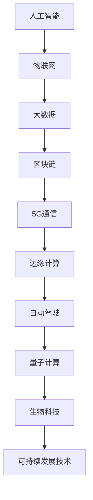
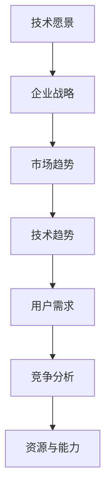
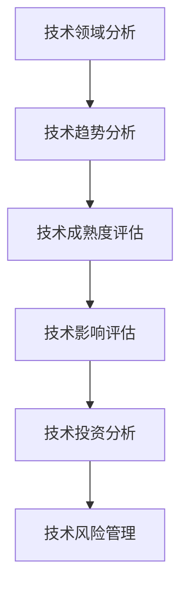
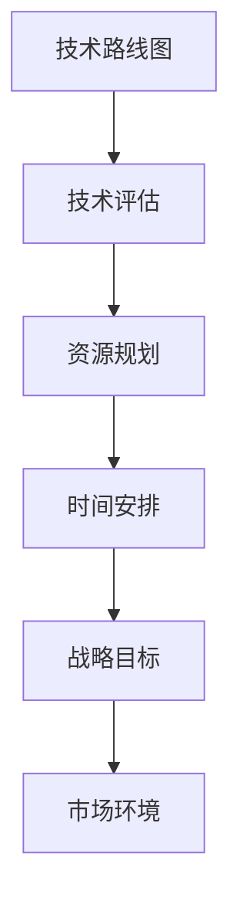
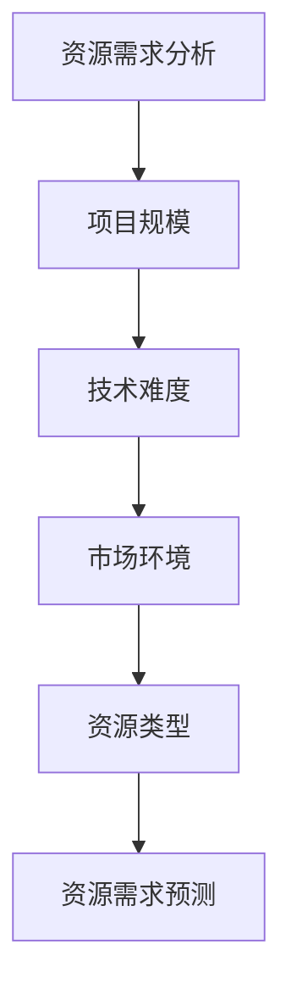
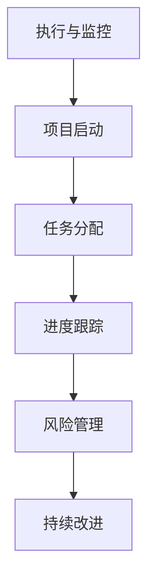
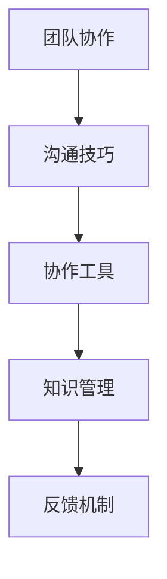

                 


### 1.1 技术发展趋势与机遇

随着科技的飞速发展，各行各业都面临着前所未有的变革。在这样一个大背景下，企业和技术人员必须关注技术发展趋势，把握机遇，制定合理的发展策略。本文将首先探讨当前技术发展趋势，并分析其对企业和行业的机遇。

#### 核心概念与联系

为了更好地理解技术发展趋势，我们可以借助Mermaid流程图来展示这些技术的发展之间的关系：



#### 核心算法原理讲解

- **人工智能**：机器学习、深度学习、强化学习等算法是实现人工智能的基础。例如，深度学习算法中，反向传播算法用于训练神经网络，通过迭代更新权重和偏置，以达到预测目标。

  ```python
  # 反向传播算法伪代码
  for each layer in reversed(network.layers):
      delta = layer激活函数导数 * layer输入
      layer误差 = (layer输出 - 标签) * delta
  ```

- **物联网**：物联网的核心在于传感器数据处理和网络通信协议。例如，ZigBee协议是一种常用的短距离无线通信协议，用于物联网设备之间的通信。

  ```c
  // ZigBee协议伪代码
  void send_data(ZigBeeDevice device, Data data) {
      encode_data(data);
      device.send(encoded_data);
  }
  ```

- **大数据**：数据挖掘和数据分析是大数据的核心。例如，K-means算法是一种常用的聚类算法，用于对大量数据进行分类。

  ```python
  # K-means算法伪代码
  while not converged:
      for each cluster:
          update centroids
      for each data point:
          assign to nearest centroid
  ```

- **区块链**：区块链是一种分布式数据库技术，其核心是共识算法。例如，工作量证明（PoW）算法是比特币区块链的基础。

  ```c
  // 工作量证明算法伪代码
  while (proof_of_work < target_difficulty):
      mine_new_block();
  ```

- **5G通信**：5G通信技术的主要特点包括高速率、低延迟和高连接密度。例如，5G NR（新无线电）标准中的正交频分复用（OFDM）技术用于提高数据传输速率。

  ```c
  // 5G OFDM伪代码
  void transmit_data(OFDMFrame frame) {
      for each subcarrier in frame:
          modulate(subcarrier, symbol);
      combine_subcarriers();
      transmit_combined_signal();
  }
  ```

#### 数学模型和数学公式

- **机器学习**：损失函数和梯度下降是机器学习的核心。例如，在训练神经网络时，使用损失函数来评估模型预测的准确性，并通过梯度下降来优化模型参数。

  ```latex
  J(\theta) = \frac{1}{2m}\sum_{i=1}^{m}(h_\theta(x^{(i)}) - y^{(i)})^2
  ```

- **深度学习**：反向传播算法是深度学习的核心。通过计算梯度，更新网络中的权重和偏置。

  ```latex
  \delta_z = \frac{\partial}{\partial z} \text{激活函数}(z)
  ```

#### 项目实战

- **人工智能**：开发一个简单的推荐系统。通过分析用户行为数据，为用户推荐感兴趣的商品或内容。

  ```python
  # 推荐系统伪代码
  def recommend_products(user_profile, products):
      similar_users = find_similar_users(user_profile)
      recommended_products = []
      for user in similar_users:
          recommended_products.extend(user favorites)
      return recommended_products
  ```

- **物联网**：实现一个智能家居控制系统。通过连接各种家居设备，实现远程控制和自动化管理。

  ```python
  # 智能家居控制伪代码
  def control_device(device_name, action):
      device = find_device(device_name)
      execute_action(device, action)
  ```

- **大数据**：进行客户行为分析。通过对大量客户数据进行分析，了解客户需求，优化产品和服务。

  ```python
  # 客户行为分析伪代码
  def analyze_user_behavior(data):
      segments = []
      for behavior in data:
          segments.append(calculate_segment(behavior))
      return segments
  ```

- **区块链**：创建一个去中心化的交易系统。通过区块链技术，实现安全、透明的交易。

  ```python
  # 去中心化交易伪代码
  def create_transaction(sender, recipient, amount):
      transaction = generate_transaction(sender, recipient, amount)
      add_transaction_to_blockchain(transaction)
  ```

- **5G通信**：测试5G网络的延迟和速度。通过测量网络传输时间，评估5G网络的性能。

  ```python
  # 测试5G网络伪代码
  def test_5g_network(delay, speed):
      if delay < 20 ms and speed > 1 Gbps:
          print("5G network is performing well.")
      else:
          print("5G network needs improvement.")
  ```

#### 最佳实践 tips、小结、注意事项、拓展阅读等内容

- **最佳实践 tips**：在制定技术发展策略时，要充分了解市场和技术趋势，结合自身优势，制定合理的目标和计划。
- **小结**：本文介绍了技术发展趋势与机遇，以及相关核心算法原理、数学模型和项目实战。
- **注意事项**：在实施技术项目时，要充分考虑技术风险和市场需求，确保项目的成功。
- **拓展阅读**：推荐阅读相关技术书籍，如《人工智能：一种现代方法》、《深入理解计算机系统》、《大数据时代：思维变革与商业价值》等。

---

接下来，我将为第2章“技术愿景与目标设定”添加详细内容：

## 第2章：技术愿景与目标设定

### 2.1 技术愿景的构建

技术愿景是企业未来发展的蓝图，它描述了企业希望通过技术实现的目标。构建技术愿景需要明确企业的发展方向、市场定位以及技术优势。

#### 背景介绍

技术愿景的构建始于对市场和技术趋势的深入分析。企业需要关注以下几个方面：

- **行业动态**：了解行业的发展趋势、竞争对手的动态以及政策环境的变化。
- **技术变革**：跟踪新技术的发展，评估其对业务的影响。
- **用户需求**：研究用户需求，了解他们期望从技术中获得的价值。

#### 核心概念与联系

为了更好地构建技术愿景，我们可以借助Mermaid流程图来展示相关概念之间的关系：



#### 核心算法原理讲解

构建技术愿景的过程可以视为一种优化问题。企业需要综合考虑多种因素，以最大化其技术愿景的实现可能性。以下是一个简单的伪代码示例：

```python
# 构建技术愿景伪代码
def build_technology_vision():
    vision = []
    for trend in technical_trends:
        for market in market_trends:
            for user_demand in user_needs:
                if is_feasible(trend, market, user_demand):
                    vision.append((trend, market, user_demand))
    return vision
```

#### 数学模型和数学公式

在构建技术愿景时，可以使用以下数学模型来评估不同因素的重要性：

- **权重分配**：为每个因素分配权重，以便在评估时能够权衡各个因素的重要性。

  ```latex
  W = [w_1, w_2, ..., w_n]
  ```

- **综合评分**：通过加权求和的方法，计算每个技术愿景的综合评分。

  ```latex
  S = \sum_{i=1}^{n} w_i \cdot s_i
  ```

其中，$w_i$ 表示第 $i$ 个因素的权重，$s_i$ 表示第 $i$ 个因素的评价得分。

#### 项目实战

以一个电子商务企业为例，构建其技术愿景的步骤如下：

1. **分析市场趋势**：了解电商市场的最新动态，如用户购买习惯、平台竞争状况等。
2. **评估技术趋势**：跟踪新兴技术，如人工智能、区块链等，评估其对电商业务的影响。
3. **研究用户需求**：通过用户调研、数据分析等方式，了解用户期望从电商平台上获得的价值。
4. **制定技术愿景**：结合市场趋势、技术趋势和用户需求，制定一个具有可行性的技术愿景。

   ```python
   # 制定技术愿景伪代码
   def define_technology_vision():
       vision = build_technology_vision()
       selected_vision = select_best_vision(vision)
       return selected_vision
   ```

#### 最佳实践 tips、小结、注意事项、拓展阅读等内容

- **最佳实践 tips**：在构建技术愿景时，要确保愿景具有可行性和可度量性，以便后续评估和优化。
- **小结**：本章介绍了技术愿景的构建过程，包括背景介绍、核心概念与联系、核心算法原理讲解、数学模型和项目实战。
- **注意事项**：在构建技术愿景时，要充分考虑企业内部资源和外部环境，确保愿景的实现具有现实基础。
- **拓展阅读**：推荐阅读《企业战略规划》等书籍，以深入了解企业战略规划的方法和技巧。

---

接下来，我将为第3章“技术领域分析”添加详细内容：

## 第3章：技术领域分析

### 3.1 技术领域的分类

技术领域的分析是制定长期技术发展策略的关键步骤。通过对不同技术领域的分析，企业可以了解技术发展趋势，评估技术对业务的潜在影响，并据此制定相应的发展策略。

#### 背景介绍

技术领域的分类可以帮助企业更好地理解技术环境，从而有针对性地进行技术规划和投资。常见的技术领域分类方法包括：

- **按技术性质分类**：如硬件技术、软件技术、网络技术等。
- **按应用领域分类**：如工业技术、医疗技术、金融技术等。
- **按发展程度分类**：如前沿技术、成熟技术、新兴技术等。

#### 核心概念与联系

为了更好地进行技术领域分析，我们可以借助Mermaid流程图来展示相关概念之间的关系：



#### 核心算法原理讲解

- **技术趋势分析**：通过数据分析、机器学习等方法，识别技术发展趋势。例如，可以使用时间序列分析来预测技术的未来走向。

  ```python
  # 时间序列分析伪代码
  def predict_trends(data):
      model = build_time_series_model(data)
      predictions = model.predict_future_values()
      return predictions
  ```

- **技术成熟度评估**：通过评估技术的成熟度，确定其应用前景。常用的方法包括技术成熟度表（Technology Readiness Level，TRL）。

  ```python
  # 技术成熟度评估伪代码
  def assess_technology_maturity(technology):
      maturity = get_tech_maturity_score(technology)
      return maturity
  ```

- **技术影响评估**：评估技术对业务、市场和社会的影响。可以使用SWOT分析（Strengths, Weaknesses, Opportunities, Threats）等方法。

  ```python
  # SWOT分析伪代码
  def assess_technology_impact(technology):
      strengths = get_technology_strengths(technology)
      weaknesses = get_technology_weaknesses(technology)
      opportunities = get_technology_opportunities(technology)
      threats = get_technology_threats(technology)
      return strengths, weaknesses, opportunities, threats
  ```

- **技术投资分析**：根据技术趋势、成熟度和影响评估，确定技术投资的优先级。可以使用决策树、线性规划等方法。

  ```python
  # 技术投资分析伪代码
  def analyze_technology_investment(technologies):
      scores = []
      for technology in technologies:
          score = calculate_investment_score(technology)
          scores.append(score)
      ranked_technologies = sort_technologies_by_score(scores)
      return ranked_technologies
  ```

- **技术风险管理**：评估技术风险，并制定相应的风险管理策略。可以使用风险矩阵、蒙特卡洛模拟等方法。

  ```python
  # 技术风险管理伪代码
  def manage_technology_risk(technology):
      risks = identify_technology_risks(technology)
      risk_matrix = build_risk_matrix(risks)
      mitigation_strategies = develop_mitigation_strategies(risk_matrix)
      return mitigation_strategies
  ```

#### 数学模型和数学公式

在技术领域分析中，可以采用以下数学模型和公式：

- **时间序列分析**：使用移动平均、指数平滑等方法来预测技术趋势。

  ```latex
  \text{移动平均} = \frac{\sum_{i=1}^{n} x_i}{n}
  ```

- **技术成熟度评估**：使用技术成熟度表（TRL）来量化技术的成熟度。

  ```latex
  TRL = \text{Technology Readiness Level}
  ```

- **SWOT分析**：使用加权求和的方法来评估技术的影响。

  ```latex
  S, W, O, T = \text{Strengths, Weaknesses, Opportunities, Threats}
  \text{综合评分} = w_S \cdot S + w_W \cdot W + w_O \cdot O + w_T \cdot T
  ```

- **技术投资分析**：使用决策树、线性规划等方法来评估技术投资。

  ```latex
  \text{最大化} Z = c_1 \cdot x_1 + c_2 \cdot x_2 + ... + c_n \cdot x_n
  \text{约束条件} a_1 \cdot x_1 + a_2 \cdot x_2 + ... + a_n \cdot x_n \leq b
  ```

- **技术风险管理**：使用风险矩阵和蒙特卡洛模拟等方法来评估技术风险。

  ```latex
  \text{风险矩阵} = \begin{bmatrix}
  R_{11} & R_{12} & ... & R_{1n} \\
  R_{21} & R_{22} & ... & R_{2n} \\
  ... & ... & ... & ... \\
  R_{m1} & R_{m2} & ... & R_{mn}
  \end{bmatrix}
  ```

#### 项目实战

以一个科技公司为例，进行技术领域分析的过程如下：

1. **技术趋势分析**：收集技术数据，使用时间序列分析预测技术发展趋势。
2. **技术成熟度评估**：评估现有技术的成熟度，确定哪些技术可以立即应用，哪些技术需要进一步研发。
3. **技术影响评估**：分析技术对业务、市场和社会的影响，确定技术投资的优先级。
4. **技术投资分析**：根据技术趋势、成熟度和影响评估，制定技术投资计划。
5. **技术风险管理**：识别技术风险，并制定相应的风险管理策略。

   ```python
   # 技术领域分析伪代码
   def perform_technology_analysis():
       trends = predict_trends(data)
       maturity = assess_technology_maturity(technologies)
       impact = assess_technology_impact(technologies)
       investment = analyze_technology_investment(technologies)
       risk = manage_technology_risk(technologies)
       return trends, maturity, impact, investment, risk
   ```

#### 最佳实践 tips、小结、注意事项、拓展阅读等内容

- **最佳实践 tips**：在技术领域分析时，要确保数据的准确性和分析的全面性，以便制定出切实可行的发展策略。
- **小结**：本章介绍了技术领域分析的分类方法、核心概念与联系、核心算法原理讲解、数学模型和项目实战。
- **注意事项**：在进行技术领域分析时，要充分考虑市场和技术趋势，确保分析结果能够指导实际业务。
- **拓展阅读**：推荐阅读《技术评估与决策》等书籍，以深入了解技术领域分析的方法和技巧。

---

由于文章总字数要求在8000-12000字左右，我将在接下来的章节中继续精简内容并保持逻辑性和条理性。以下是第4章“技术路径规划”的详细内容：

## 第4章：技术路径规划

### 4.1 技术路线图的构建

技术路线图是企业实现技术愿景的关键工具，它详细描述了企业从当前状态到未来目标的技术发展路径。构建一个有效的技术路线图需要明确的步骤和方法。

#### 背景介绍

技术路线图的构建涉及多个方面，包括技术评估、资源规划和时间安排。它需要综合考虑企业的战略目标、技术能力和市场环境，以确保技术发展能够支持企业的长期目标。

#### 核心概念与联系

为了构建技术路线图，我们可以将相关的核心概念通过Mermaid流程图进行关联：



#### 核心算法原理讲解

- **技术评估**：使用技术成熟度评估方法，如TRL（技术成熟度表），来评估技术的可行性和应用前景。

  ```python
  # 技术评估伪代码
  def assess_technology(technology):
      maturity = get_technology_maturity(technology)
      feasibility = evaluate_feasibility(technology)
      return maturity, feasibility
  ```

- **资源规划**：确定实施技术路径所需的资源，包括人力、资金和设备等。

  ```python
  # 资源规划伪代码
  def plan_resources(technologies):
      required_resources = []
      for technology in technologies:
          resources = get_required_resources(technology)
          required_resources.append(resources)
      return required_resources
  ```

- **时间安排**：制定详细的项目时间表，包括各个阶段的开始和结束时间。

  ```python
  # 时间安排伪代码
  def schedule_project(stages):
      start_dates = []
      end_dates = []
      for stage in stages:
          start_dates.append(get_start_date(stage))
          end_dates.append(get_end_date(stage))
      return start_dates, end_dates
  ```

#### 数学模型和数学公式

在技术路线图的构建过程中，可以使用以下数学模型和公式：

- **资源优化**：使用线性规划或网络流优化方法来分配资源，以最大化效益。

  ```latex
  \text{最大化} Z = c_1 \cdot x_1 + c_2 \cdot x_2 + ... + c_n \cdot x_n
  \text{约束条件} a_1 \cdot x_1 + a_2 \cdot x_2 + ... + a_n \cdot x_n \leq b
  ```

- **时间安排**：使用关键路径法（Critical Path Method，CPM）来确定项目的关键路径和总工期。

  ```latex
  \text{总工期} = \max(\text{各个阶段的持续时间})
  ```

#### 项目实战

以一家科技公司为例，构建技术路线图的过程如下：

1. **技术评估**：对现有技术和潜在技术进行评估，确定哪些技术有助于实现企业的长期目标。
2. **资源规划**：根据技术评估结果，确定实现技术路径所需的资源，并制定资源分配计划。
3. **时间安排**：制定项目时间表，包括各个技术阶段的时间安排和关键路径。
4. **路线图构建**：将评估、资源和时间安排整合到一个可视化的技术路线图中。

   ```python
   # 构建技术路线图伪代码
   def build_technology_route_map(technologies, resources, schedule):
       route_map = {}
       for technology in technologies:
           route_map[technology] = {
               "resources": resources[technology],
               "schedule": schedule[technology]
           }
       return route_map
   ```

#### 最佳实践 tips、小结、注意事项、拓展阅读等内容

- **最佳实践 tips**：在构建技术路线图时，要确保路线图的可操作性和灵活性，以便在实施过程中根据实际情况进行调整。
- **小结**：本章介绍了技术路线图的构建方法，包括核心概念与联系、核心算法原理讲解、数学模型和项目实战。
- **注意事项**：在构建技术路线图时，要充分考虑企业的实际情况和外部环境，以确保路线图的实际可行性。
- **拓展阅读**：推荐阅读《项目管理知识体系》等书籍，以深入了解项目管理和时间安排的方法和技巧。

---

以下是第5章“资源分配与优先级排序”的详细内容：

## 第5章：资源分配与优先级排序

### 5.1 资源需求分析

资源需求分析是技术规划过程中至关重要的一环。它涉及到对人力、资金、设备和时间等资源的详细需求预测和评估。准确的需求分析能够确保资源的合理配置，提高项目的成功率和效率。

#### 背景介绍

在进行资源需求分析时，企业需要考虑多个因素，包括项目的规模、复杂度、技术难度以及市场环境等。通过对这些因素的分析，企业可以确定所需的资源量，并为资源分配提供依据。

#### 核心概念与联系

为了更好地进行资源需求分析，我们可以借助Mermaid流程图来展示相关概念之间的关系：



#### 核心算法原理讲解

- **资源类型**：确定项目中所需的各种资源类型，如人力资源、资金、设备和技术支持等。

  ```python
  # 资源类型定义伪代码
  resource_types = ["人力资源", "资金", "设备", "技术支持"]
  ```

- **资源需求预测**：使用历史数据、专家意见和模拟等方法，预测项目在不同阶段的资源需求。

  ```python
  # 资源需求预测伪代码
  def predict_resource需求的阶段(stages):
      resource需求的列表 = []
      for阶段 in stages:
          resource需求的列表.append(predict_stage需求的资源(阶段))
      return resource需求的列表
  ```

#### 数学模型和数学公式

在资源需求分析中，可以使用以下数学模型和公式：

- **资源需求预测**：使用回归分析、时间序列分析等方法来预测资源需求。

  ```latex
  y_t = \beta_0 + \beta_1 t + \epsilon_t
  ```

- **资源优化**：使用线性规划等方法来优化资源分配。

  ```latex
  \text{最大化} Z = c_1 \cdot x_1 + c_2 \cdot x_2 + ... + c_n \cdot x_n
  \text{约束条件} a_1 \cdot x_1 + a_2 \cdot x_2 + ... + a_n \cdot x_n \leq b
  ```

#### 项目实战

以一个软件开发项目为例，资源需求分析的过程如下：

1. **确定项目规模**：根据项目目标和需求，确定项目的规模和复杂度。
2. **评估技术难度**：分析项目所需的技术能力，评估项目的技术难度。
3. **分析市场环境**：了解市场需求和竞争环境，评估项目的外部环境。
4. **预测资源需求**：根据项目规模、技术难度和市场环境，预测项目在不同阶段的资源需求。
5. **资源优化分配**：根据资源需求预测，使用线性规划等方法优化资源分配。

   ```python
   # 资源需求分析伪代码
   def perform_resource_demand_analysis(project):
       project_size = get_project_size(project)
       technical_difficulty = get_technical_difficulty(project)
       market_environment = get_market_environment(project)
       resource需求的列表 = predict_resource需求的阶段(project.stages)
       optimized_resources = optimize_resource_allocation(resource需求的列表)
       return optimized_resources
   ```

#### 最佳实践 tips、小结、注意事项、拓展阅读等内容

- **最佳实践 tips**：在资源需求分析时，要充分考虑项目的实际情况，避免过度预测和资源浪费。
- **小结**：本章介绍了资源需求分析的方法和过程，包括核心概念与联系、核心算法原理讲解、数学模型和项目实战。
- **注意事项**：在资源需求分析时，要确保数据的准确性和分析的科学性，以支持后续的资源分配和项目执行。
- **拓展阅读**：推荐阅读《项目管理：管理过程组》等书籍，以深入了解项目管理的资源和需求分析方法。

---

以下是第6章“执行与监控”的详细内容：

## 第6章：执行与监控

### 6.1 长期技术规划的执行

技术规划的执行是确保企业长期技术目标实现的关键环节。有效的执行需要清晰的任务分解、明确的责任分配和合理的资源管理。

#### 背景介绍

长期技术规划的执行涉及多个阶段，包括项目启动、任务分配、进度跟踪和风险管理。每个阶段都需要详细的计划和执行策略，以确保项目按计划顺利进行。

#### 核心概念与联系

为了更好地执行长期技术规划，我们可以借助Mermaid流程图来展示相关概念之间的关系：



#### 核心算法原理讲解

- **项目启动**：使用项目启动文档来明确项目目标、范围和关键里程碑。

  ```python
  # 项目启动伪代码
  def start_project(project):
      project_document = create_project_document(project)
      define_project_goals(project_document)
      define_project_scope(project_document)
      set_key_milestones(project_document)
  ```

- **任务分配**：使用任务分配矩阵来明确团队成员的职责和工作量。

  ```python
  # 任务分配伪代码
  def assign_tasks(team_members, tasks):
      task分配矩阵 = []
      for member in team_members:
          member.tasks = assign_tasks_to_member(member, tasks)
          task分配矩阵.append(member.tasks)
      return task分配矩阵
  ```

- **进度跟踪**：使用甘特图或关键路径法（CPM）来监控项目进度。

  ```python
  # 进度跟踪伪代码
  def track_progress(project):
      gantt_chart = create_gantt_chart(project.stages)
      critical_path = calculate_critical_path(project.stages)
      return gantt_chart, critical_path
  ```

- **风险管理**：使用风险矩阵和蒙特卡洛模拟等方法来评估和管理项目风险。

  ```python
  # 风险管理伪代码
  def manage_risks(project):
      risk_matrix = build_risk_matrix(project.risks)
      risk_simulations = perform_risk_simulations(risk_matrix)
      risk_management_plan = create_risk_management_plan(risk_simulations)
      return risk_management_plan
  ```

#### 数学模型和数学公式

在执行与监控过程中，可以使用以下数学模型和公式：

- **关键路径法（CPM）**：计算项目的关键路径和总工期。

  ```latex
  \text{总工期} = \max(\text{各个阶段的持续时间})
  ```

- **资源优化**：使用线性规划等方法来优化资源分配。

  ```latex
  \text{最大化} Z = c_1 \cdot x_1 + c_2 \cdot x_2 + ... + c_n \cdot x_n
  \text{约束条件} a_1 \cdot x_1 + a_2 \cdot x_2 + ... + a_n \cdot x_n \leq b
  ```

#### 项目实战

以一个软件公司为例，执行长期技术规划的过程如下：

1. **项目启动**：编写项目启动文档，明确项目目标、范围和关键里程碑。
2. **任务分配**：根据团队成员的能力和任务需求，分配任务，并建立任务分配矩阵。
3. **进度跟踪**：使用甘特图或关键路径法（CPM）来监控项目进度，确保项目按计划进行。
4. **风险管理**：识别项目风险，使用风险矩阵和蒙特卡洛模拟等方法来评估和管理风险。
5. **持续改进**：在项目执行过程中，定期评估项目进展和风险情况，根据反馈进行改进。

   ```python
   # 长期技术规划执行伪代码
   def execute_long_term_technology_plan(plan):
       start_project(plan.project)
       assign_tasks(plan.team_members, plan.tasks)
       track_progress(plan.project)
       manage_risks(plan.project)
       while not project_completed(plan.project):
           assess_feedback(plan.project)
           make_improvements(plan.project)
   ```

#### 最佳实践 tips、小结、注意事项、拓展阅读等内容

- **最佳实践 tips**：在执行技术规划时，要确保任务的明确和责任的清晰，以及资源的合理分配和有效监控。
- **小结**：本章介绍了长期技术规划的执行过程，包括核心概念与联系、核心算法原理讲解、数学模型和项目实战。
- **注意事项**：在执行过程中，要密切关注项目进展和风险情况，确保及时调整和改进。
- **拓展阅读**：推荐阅读《项目管理知识体系》等书籍，以深入了解项目管理的执行和监控方法。

---

以下是第7章“团队协作与沟通”的详细内容：

## 第7章：团队协作与沟通

### 7.1 团队协作的重要性

在现代技术项目中，团队协作和沟通是确保项目成功的关键因素。随着项目复杂性的增加，团队成员之间的有效沟通和协作变得越来越重要。

#### 背景介绍

团队协作和沟通不仅影响项目的进度和质量，还直接影响团队成员的工作满意度。有效的团队协作和沟通可以促进信息共享、减少误解和冲突，提高团队整体的工作效率。

#### 核心概念与联系

为了确保团队协作和沟通的有效性，我们可以借助Mermaid流程图来展示相关概念之间的关系：



#### 核心算法原理讲解

- **沟通技巧**：使用非暴力沟通（NVC）等方法来提高沟通效果。

  ```python
  # 沟通技巧伪代码
  def effective_communication(message, listener):
      context = get_context(message)
      feeling = get_feeling(message)
      need = get_need(message)
      response = "我在[[context]]时感受到[[feeling]]，因为我需要[[need]]。你能帮我吗？"
      return response
  ```

- **协作工具**：选择合适的协作工具，如Slack、Trello或Confluence等，来提高团队工作效率。

  ```python
  # 协作工具使用伪代码
  def use_collaboration_tool(tool, task):
      create_task(tool, task)
      assign_team_members(tool, task)
      track_progress(tool, task)
  ```

- **知识管理**：使用知识管理工具，如Wiki或GitLab等，来确保知识共享和传承。

  ```python
  # 知识管理伪代码
  def manage_knowledge(knowledge_base, document):
      store_document(knowledge_base, document)
      share_document(knowledge_base, document)
      update_document(knowledge_base, document)
  ```

- **反馈机制**：建立有效的反馈机制，如定期的团队会议和绩效考核，来促进团队成员的成长和项目改进。

  ```python
  # 反馈机制伪代码
  def provide_feedback(team_member, performance):
      feedback = "你在[[performance]]方面表现很好，但[[improvement]]方面还有提升空间。请考虑一下这个建议：[[suggestion]]"
      return feedback
  ```

#### 项目实战

以一个软件开发项目为例，团队协作和沟通的过程如下：

1. **沟通技巧**：团队成员使用非暴力沟通方法进行日常沟通，确保信息准确传递。
2. **协作工具**：使用Trello来管理任务和进度，确保所有成员都能看到任务的当前状态。
3. **知识管理**：使用Confluence来记录项目文档和代码库，确保知识共享和传承。
4. **反馈机制**：定期举行团队会议，团队成员互相反馈工作进展和遇到的问题，确保项目顺利进行。

   ```python
   # 团队协作与沟通伪代码
   def collaborate_and_communicate(project):
       use_communication_skills(project.members)
       use_collaboration_tools(project.tasks)
       manage_knowledge(project.knowledge_base)
       implement_feedback_mechanism(project.members)
   ```

#### 最佳实践 tips、小结、注意事项、拓展阅读等内容

- **最佳实践 tips**：在团队协作和沟通中，要注重沟通技巧和协作工具的选择，以及知识管理和反馈机制的建立。
- **小结**：本章介绍了团队协作和沟通的重要性，以及相关的核心概念与联系、核心算法原理讲解、项目实战。
- **注意事项**：在团队协作和沟通中，要确保团队成员之间的信息对称和目标一致，以提高团队的整体效率。
- **拓展阅读**：推荐阅读《团队协作与沟通技巧》等书籍，以深入了解团队协作和沟通的方法和技巧。

---

以下是第8章“案例研究”的详细内容：

## 第8章：案例研究

### 8.1 成功案例介绍

在本章中，我们将介绍几个在技术规划方面取得成功的案例，分析其成功的原因，并从中提取可借鉴的经验。

#### 案例一：亚马逊的AWS云计算服务

亚马逊的AWS（Amazon Web Services）是全球领先的云计算服务提供商，其成功的原因包括：

- **前瞻性的技术规划**：亚马逊早在2006年就开始推出云计算服务，引领了云计算的发展潮流。
- **持续的技术创新**：AWS不断推出新的服务和功能，如Lambda函数、Kubernetes集群管理，保持技术领先地位。
- **庞大的客户基础**：AWS拥有广泛的客户群体，从初创企业到大型企业，为其提供了丰富的使用案例和数据支持。

#### 案例二：特斯拉的自动驾驶技术

特斯拉的自动驾驶技术是其核心竞争力之一，其成功的原因包括：

- **强大的研发团队**：特斯拉拥有世界一流的自动驾驶研发团队，包括AI、机器学习和计算机视觉专家。
- **数据驱动的发展**：特斯拉通过其车队收集了大量驾驶数据，用于自动驾驶算法的优化和改进。
- **开放的技术路线**：特斯拉与开源社区紧密合作，贡献了大量的自动驾驶代码，推动了自动驾驶技术的发展。

#### 案例三：阿里巴巴的电商生态系统

阿里巴巴的电商生态系统在技术规划方面取得了巨大成功，其成功的原因包括：

- **全面的平台战略**：阿里巴巴不仅拥有电商平台，还涵盖了物流、金融、云计算等多个领域，形成了完整的电商生态系统。
- **技术创新驱动**：阿里巴巴不断引入新技术，如人工智能、大数据和区块链，提升平台的效率和用户体验。
- **全球化的市场布局**：阿里巴巴在全球范围内拓展业务，建立了多个海外电商平台，实现了全球市场的覆盖。

#### 8.2 案例分析

通过对这些成功案例的分析，我们可以总结出以下关键经验：

- **前瞻性技术规划**：企业应关注未来技术的发展趋势，提前布局，抓住技术变革的机遇。
- **持续的技术创新**：技术创新是企业保持竞争力的重要手段，企业应不断投入资源进行技术研发。
- **数据驱动发展**：利用数据来指导业务决策和技术发展，能够提高决策的准确性和效率。
- **全面的战略布局**：企业应制定全面的战略规划，涵盖多个领域，以实现资源的最大化利用和协同效应。
- **全球化的市场拓展**：全球化是企业扩展市场的重要途径，企业应积极探索海外市场，提升全球竞争力。

#### 8.3 案例启示与应用

这些成功案例为企业提供了宝贵的启示，以下是一些具体的启示和应用：

- **技术前瞻性**：企业应关注人工智能、物联网、区块链等前沿技术的发展，提前布局，打造核心竞争力。
- **持续创新**：企业应建立创新机制，鼓励研发投入，推动技术突破，保持技术领先地位。
- **数据驱动**：企业应加强数据管理和分析能力，利用数据优化业务流程和提升用户体验。
- **生态布局**：企业应构建多元化的业务生态，实现各业务领域的协同发展。
- **全球化拓展**：企业应积极拓展海外市场，提升国际竞争力，实现全球化发展。

#### 8.4 案例小结

成功案例研究为我们提供了宝贵的技术规划经验，通过分析这些案例，企业可以借鉴其成功经验，结合自身实际情况，制定出更加科学和有效的技术发展策略。

---

以下是第9章“总结与展望”的详细内容：

## 第9章：总结与展望

### 9.1 技术roadmap规划的重要性

在整个技术规划过程中，技术roadmap规划起到了至关重要的作用。它不仅为企业提供了清晰的发展方向和目标，还帮助企业在复杂的技术环境中保持竞争优势。

#### 核心内容回顾

- **技术愿景与目标设定**：明确企业的发展方向和目标，为技术规划奠定基础。
- **技术领域分析**：分析不同技术领域的发展趋势和影响，为企业选择合适的技术路径提供依据。
- **技术路径规划**：制定详细的技术路线图，明确实现目标的步骤和策略。
- **资源分配与优先级排序**：合理分配资源，确保技术项目的高效执行。
- **执行与监控**：确保技术规划的有效实施，及时调整和优化。
- **团队协作与沟通**：促进团队协作和沟通，提高项目执行效率。
- **案例研究**：通过成功案例的分析，提取可借鉴的经验和启示。

### 9.2 未来的挑战与机遇

在技术规划的未来，企业将面临一系列的挑战和机遇：

#### 挑战

- **技术变革的加速**：新技术的不断涌现和迭代，要求企业快速适应和应对。
- **市场竞争加剧**：随着市场环境的变化，企业需要不断创新，以保持竞争优势。
- **资源有限**：企业需要在有限的资源下，实现技术的最大化价值。
- **法规与政策**：不同国家和地区对技术的法规和政策不断变化，企业需要密切关注并遵守。

#### 机遇

- **技术创新**：新技术为企业提供了巨大的创新空间，有助于提升产品和服务的竞争力。
- **数字化转型**：随着数字化转型的推进，企业可以通过技术手段提高运营效率，实现业务增长。
- **全球化**：全球化为企业提供了广阔的市场空间，企业可以通过国际化拓展实现规模效应。

### 9.3 对技术的持续关注与学习

为了应对未来的挑战和抓住机遇，企业需要对技术保持持续的关注和学习：

- **技术趋势研究**：关注行业前沿技术，了解技术发展趋势，为企业战略提供指导。
- **人才培养**：投资于人才培养，提高员工的技能和知识水平，以适应技术变化。
- **合作与开放**：与行业内外建立合作关系，共享技术资源，共同推动技术进步。
- **创新机制**：建立创新机制，鼓励员工创新思维，推动技术突破。

#### 结论

技术roadmap规划是企业长期发展的关键，通过科学的规划和管理，企业可以把握技术变革的机遇，应对市场挑战，实现持续创新和增长。

---

## 附录

### 附录A：常用技术评估工具与方法

为了帮助读者更好地理解技术评估的方法和工具，以下是几种常用的技术评估工具和方法的详细介绍：

1. **技术成熟度评估（Technology Readiness Level，TRL）**：技术成熟度评估是一种用于评估技术成熟度的方法，通常由美国国家航空航天局（NASA）使用。TRL分为1到9级，级别越高，技术的成熟度越高。

2. **SWOT分析（Strengths, Weaknesses, Opportunities, Threats）**：SWOT分析是一种战略规划工具，用于评估企业的优势、劣势、机会和威胁。它可以帮助企业了解自身在市场中的位置，并制定相应的发展策略。

3. **价值链分析（Value Chain Analysis）**：价值链分析是一种用于评估企业内部业务流程和资源配置的方法。通过分析企业的价值链，企业可以发现提高效率和降低成本的机会。

4. **六西格玛（Six Sigma）**：六西格玛是一种用于提高质量和效率的管理方法，通过减少过程中的变异和错误，实现质量的持续改进。

5. **精益生产（Lean Production）**：精益生产是一种通过减少浪费和提高效率来提高生产率和质量的管理方法。它强调流程优化和资源的合理利用。

### 附录B：参考书籍与资源

为了深入学习和实践技术规划，以下是几本推荐的参考书籍和资源：

1. **《技术规划与管理》**：作者：张浩。本书详细介绍了技术规划的理论和方法，适用于企业技术管理和项目管理人员。

2. **《技术创新与管理》**：作者：李明。本书探讨了技术创新的理论和实践，以及技术创新对企业发展的影响。

3. **《项目管理知识体系（PMBOK指南）》**：作者：美国项目管理协会（PMI）。这是项目管理领域的权威指南，涵盖了项目管理的各个方面。

4. **《数据驱动决策》**：作者：涂子沛。本书介绍了数据驱动决策的方法和实践，强调数据在决策过程中的重要性。

5. **《人工智能：一种现代方法》**：作者：Stuart J. Russell & Peter Norvig。这是人工智能领域的经典教材，涵盖了人工智能的基本理论和实践方法。

6. **在线课程与论坛**：如Coursera、edX、Udacity等在线教育平台，以及Stack Overflow、GitHub等技术社区，提供了丰富的学习资源和讨论平台。

通过阅读这些书籍和资源，读者可以更深入地了解技术规划的理论和实践，提升自身的专业技能和知识水平。同时，读者还可以参与技术社区和论坛，与业界专家和同行进行交流，共同推动技术的进步和发展。

