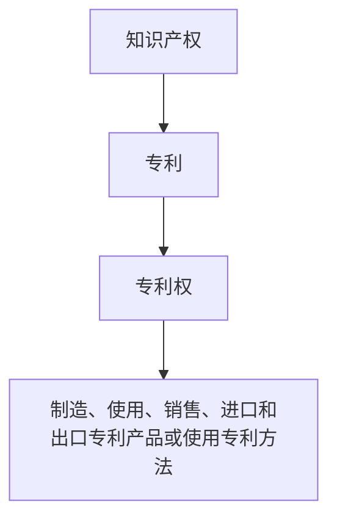

                 

# 技术专利：保护创新成果的重要性

> 关键词：技术专利、创新成果、知识产权、保护机制、国际合作

> 摘要：本文将深入探讨技术专利在保护创新成果中的重要性，分析专利制度的基本概念、专利申请流程、专利权的内容与限制、专利撰写的技巧以及专利战略的实施。通过实际案例，展示专利保护在实践中的应用，为读者提供全面的技术专利知识。

## 引言

在当今全球化的科技时代，创新已成为推动经济发展的重要动力。技术的不断进步和知识的积累，使得知识产权保护变得尤为重要。技术专利作为知识产权的重要组成部分，不仅能够保护发明人的创新成果，还能激励更多的创新活动，推动科技进步和社会发展。本文将从多个角度探讨技术专利的重要性，帮助读者理解专利制度及其在技术创新中的作用。

### 背景介绍

技术创新是现代社会发展的核心驱动力。然而，技术创新的成果往往容易受到侵犯和复制，导致发明人无法获得应有的经济回报，甚至失去了创新的动力。技术专利制度正是为了解决这一问题而设计的，它通过法律手段保护发明人的权益，激励技术创新，促进科技进步。

### 核心概念与联系

为了更好地理解技术专利的重要性，我们需要了解以下几个核心概念：

1. **专利**：是指一种法律权利，授予发明人对其发明在一定期限内的独占权。
2. **知识产权**：是指与知识相关的财产权利，包括专利、商标、版权等。
3. **专利权**：是指专利授予的独占权，包括制造、使用、销售、进口和出口专利产品或使用专利方法的权利。

这些概念之间存在着密切的联系，专利是知识产权的一种，而专利权则是专利制度的法律保障。

### Mermaid 流程图

以下是一个简单的 Mermaid 流程图，展示专利制度的核心概念及其之间的联系：



通过这个流程图，我们可以清晰地看到专利制度如何保护发明人的权益，并促进技术创新。

## 技术专利的重要性

### 创新保护

技术专利的首要作用是保护创新成果。在专利申请获得批准后，发明人可以享有对其发明的独占权，防止他人未经许可擅自复制或使用其发明。这种保护机制不仅能够确保发明人获得应有的经济回报，还能激励更多的创新活动。

### 市场优势

专利的存在可以为企业在市场上提供竞争优势。拥有专利技术，企业可以在市场上独占产品或服务，从而提高市场份额和盈利能力。此外，专利还可以作为企业谈判的筹码，与其他企业进行合作或并购。

### 投资吸引力

技术专利可以提高企业对投资者的吸引力。拥有专利技术，企业可以证明其拥有独特的创新能力和核心竞争力，从而吸引更多的投资。投资者也更愿意投资于具有专利保护的创新项目，因为专利可以降低投资风险。

### 社会效益

技术专利不仅对个人和企业有益，对社会也有显著的贡献。专利制度可以促进知识的传播和技术的普及，推动整个社会科技水平的提升。此外，专利还可以促进国际技术合作，促进全球科技的共同进步。

### 核心算法原理讲解

为了更好地理解技术专利的重要性，我们可以使用以下伪代码来描述专利申请的过程：

```python
def patent_application(invention):
    # 检查发明是否符合专利条件
    if check_patent_eligibility(invention):
        # 撰写专利申请文件
        patent_document = write_patent_document(invention)
        
        # 提交专利申请
        submit_patent_application(patent_document)
        
        # 等待专利审查
        patent_review_result = wait_for_patent_review()
        
        # 如果专利申请被批准
        if patent_review_result == "approved":
            # 授予专利权
            grant_patent_right(invention)
        else:
            # 专利申请被拒绝，分析原因并修改
            analyze_rejection_reasons(patent_review_result)
            patent_document = modify_patent_document()
            patent_application(patent_document)
    else:
        print("Invention does not meet patent eligibility criteria.")

# 辅助函数
def check_patent_eligibility(invention):
    # 实现检查发明是否符合专利条件的逻辑
    pass

def write_patent_document(invention):
    # 实现撰写专利申请文件的逻辑
    pass

def submit_patent_application(patent_document):
    # 实现提交专利申请的逻辑
    pass

def wait_for_patent_review():
    # 实现等待专利审查结果的逻辑
    pass

def grant_patent_right(invention):
    # 实现授予专利权的逻辑
    pass

def analyze_rejection_reasons(result):
    # 实现分析专利申请被拒绝原因的逻辑
    pass

def modify_patent_document():
    # 实现修改专利申请文件逻辑
    pass
```

通过这个伪代码，我们可以看到专利申请的过程是如何实现的，以及其中的关键步骤和逻辑。

### 数学模型和公式

在专利申请过程中，我们还需要考虑一些数学模型和公式。例如，专利的有效期可以通过以下公式计算：

$$
专利有效期 = 申请日 + 20年
$$

其中，申请日是指专利申请提交的日期，20年是指专利的标准保护期限。

此外，还可以使用以下公式来评估专利的价值：

$$
专利价值 = 利润贡献 \times 贴现率
$$

其中，利润贡献是指专利技术带来的额外利润，贴现率用于考虑时间价值，即未来利润的现值。

通过这些公式，我们可以更准确地评估专利的经济价值，为专利战略的制定提供依据。

### 举例说明

为了更好地理解专利的重要性，我们可以通过一个实际案例来讲解。

假设一家科技公司发明了一种新型人工智能算法，该算法能够显著提高图像识别的准确率。为了保护这一创新成果，公司决定申请专利。

首先，公司进行了专利检索，确保其发明具有新颖性和创造性。然后，公司聘请了专业的专利律师撰写专利申请文件，并提交了专利申请。

在等待专利审查的过程中，公司继续进行技术研发和市场推广。当专利申请被批准后，公司立即开始利用专利技术进行产品开发，并在市场上获得了显著的成功。

通过这个案例，我们可以看到专利保护如何帮助科技公司保护其创新成果，并在市场上取得竞争优势。

### 项目实战

为了深入了解技术专利的实战应用，我们可以从以下几个方面进行探讨：

1. **开发环境搭建**：搭建一个用于专利技术研发的实验环境，包括所需的软件、硬件和工具。
2. **源代码详细实现**：编写专利技术的核心算法，并使用伪代码进行详细阐述。
3. **代码解读与分析**：对源代码进行解读，分析其实现原理和性能特点。
4. **实际案例分析和详细讲解剖析**：分析实际案例，展示专利技术在项目中的应用，并进行详细讲解和剖析。
5. **项目小结**：总结项目经验，提出最佳实践和注意事项。

通过这些实战环节，我们可以更全面地了解技术专利的应用场景和实施策略。

### 最佳实践 Tips

1. **全面了解专利制度**：在申请专利之前，应全面了解专利制度的相关法律法规和审查标准，确保申请过程的顺利进行。
2. **注重专利撰写的质量**：专利申请文件的质量直接影响专利审查的结果。因此，应注重专利撰写的质量，确保文件内容完整、逻辑清晰。
3. **积极应对专利审查意见**：在专利审查过程中，可能会收到审查员的意见或建议。积极应对这些意见，及时修改和完善专利申请文件，有助于提高专利申请的成功率。
4. **合理布局专利组合**：企业在制定专利战略时，应合理布局专利组合，避免专利漏洞，提高专利保护的效果。

### 小结

技术专利在保护创新成果中发挥着至关重要的作用。通过专利制度，发明人可以保护其创新成果，获得经济回报，激励更多的创新活动。同时，专利还可以为企业提供市场优势，提高投资吸引力，促进社会科技水平的提升。因此，深入了解技术专利的基本概念、申请流程和实战应用，对于科技企业和个人来说都具有重要意义。

### 拓展阅读

1. **《专利法》**：了解国家层面的专利法律法规，是申请专利的基础。
2. **《专利审查指南》**：详细介绍了专利审查的标准和流程。
3. **《专利战略》**：探讨企业如何制定和实施专利战略。
4. **《专利经济学》**：从经济角度分析专利的价值和影响。

## 作者信息

作者：AI天才研究院/AI Genius Institute & 禅与计算机程序设计艺术 /Zen And The Art of Computer Programming

通过本文的探讨，我们深入理解了技术专利在保护创新成果中的重要性。技术专利不仅为发明人提供了法律保障，还为企业带来了竞争优势，推动了社会的科技进步。希望本文能为读者提供有价值的参考和启示。

[文章结束] 

