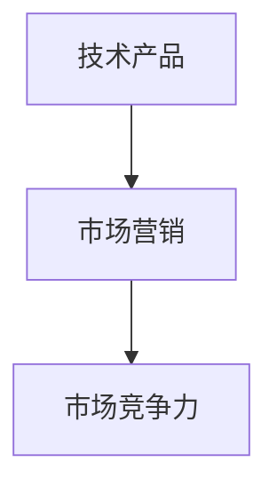
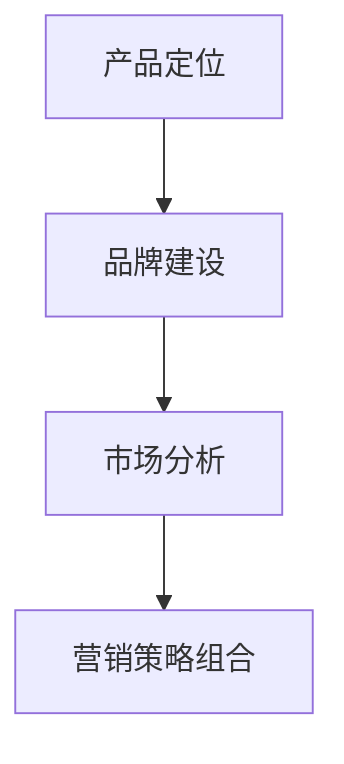

                 

### 文章标题：技术产品营销：提升技术产品市场竞争力的策略

> 关键词：技术产品营销、市场竞争力、营销策略、营销案例、营销效果评估

> 摘要：本文深入探讨了技术产品营销的核心概念、提升市场竞争力的策略，以及营销策略的实施和评估。通过理论分析与实际案例，旨在为技术产品企业提供有效的营销策略参考，以提升市场竞争力和企业效益。

---

### 引言

在当今高度竞争的市场环境中，技术产品企业面临诸多挑战。一方面，技术进步日新月异，新产品层出不穷；另一方面，消费者需求多样化，市场环境瞬息万变。如何在激烈的市场竞争中脱颖而出，成为众多企业关注的焦点。技术产品营销作为一种特殊的营销模式，旨在通过有效的策略，提升技术产品的市场竞争力和企业效益。

本文将从以下几个方面进行探讨：

1. 技术产品营销的定义及其重要性
2. 提升市场竞争力的策略
3. 营销策略的实施和评估
4. 营销案例研究
5. 总结与展望

通过以上探讨，本文旨在为技术产品企业提供一套完整的营销策略框架，以应对市场挑战，实现可持续发展。

#### 核心概念与联系

在探讨技术产品营销之前，我们需要明确几个核心概念及其相互关系：

1. **技术产品**：指运用先进技术研制开发的具有独特功能和性能的产品。
2. **市场营销**：指企业通过市场调研、产品定位、品牌建设、渠道选择、促销活动等手段，实现产品销售的过程。
3. **市场竞争力**：指企业在市场竞争中所具有的优势和能力。

以上三个概念之间的关系可以简化为一个流程图，如下所示：

在技术产品营销中，企业首先需要开发具有竞争力的技术产品，然后通过有效的市场营销手段，提升产品的市场竞争力，从而实现企业的市场目标。这一过程是一个持续迭代和优化的过程，需要企业不断地调整和改进营销策略。

#### 背景介绍

技术产品营销的背景可以追溯到20世纪末，随着信息技术和互联网的迅猛发展，技术产品在企业中的应用越来越广泛。传统的营销模式已经无法满足技术产品企业的需求，因此，一种新的营销模式——技术产品营销应运而生。

技术产品营销与传统营销相比，具有以下特点：

1. **高技术性**：技术产品营销注重产品技术特性和功能，强调技术创新和领先优势。
2. **强专业性**：技术产品营销需要具备一定的专业知识和技能，以应对复杂的客户需求和市场竞争。
3. **多元化渠道**：技术产品营销采用多种渠道进行推广，包括线上和线下，以满足不同客户群体的需求。
4. **持续迭代**：技术产品营销强调持续改进和优化，以适应市场变化和客户需求。

随着技术产品市场的不断扩大和成熟，技术产品营销的重要性日益凸显。对于企业来说，成功的技术产品营销不仅能够提升产品的市场竞争力，还能为企业带来可观的经济效益。因此，企业必须重视技术产品营销，制定科学的营销策略，以应对市场竞争的挑战。

#### 核心概念与联系

为了更好地理解技术产品营销的原理，我们首先需要明确几个核心概念及其相互关系：

1. **产品定位**：产品定位是指企业根据市场需求和自身优势，确定产品的市场地位和目标客户群体。
2. **品牌建设**：品牌建设是指企业通过塑造品牌形象、提升品牌价值，增强品牌竞争力。
3. **市场分析**：市场分析是指企业通过对市场环境、竞争对手、客户需求等进行调研和分析，为制定营销策略提供依据。
4. **营销策略组合**：营销策略组合是指企业根据产品定位、品牌建设和市场分析结果，制定的一整套营销手段和策略。

以上四个核心概念之间的关系可以用以下流程图表示：

在这个流程中，产品定位是基础，决定了品牌建设和市场分析的导向；品牌建设是核心，提升了产品的市场竞争力；市场分析是依据，为营销策略组合提供了数据支持；营销策略组合是实施手段，将产品定位、品牌建设和市场分析转化为实际操作。

#### 提升市场竞争力的策略

提升市场竞争力的策略是技术产品营销的核心内容，主要包括以下几个方面：

1. **产品创新**：产品创新是提升市场竞争力的重要手段。企业需要持续投入研发，不断推出具有独特功能和性能的新产品，以满足客户需求，抢占市场先机。具体策略包括：

   - **技术创新**：通过研发新技术、新工艺，提高产品性能和品质。
   - **产品多样化**：开发不同类型、不同规格的产品，满足不同客户群体的需求。
   - **产品差异化**：通过产品功能和性能的差异化，提高产品的市场竞争力。

2. **市场定位**：市场定位是提升市场竞争力的关键。企业需要根据市场需求和自身优势，选择合适的市场细分领域，精准定位目标客户群体。具体策略包括：

   - **目标市场选择**：根据产品特点和市场需求，确定目标市场。
   - **目标客户分析**：深入了解目标客户的需求、偏好和行为，为产品开发和营销策略提供依据。
   - **市场定位策略**：根据目标市场和客户特点，制定差异化市场定位策略。

3. **品牌建设**：品牌建设是提升市场竞争力的长期战略。企业需要通过品牌塑造、品牌传播，提升品牌知名度和美誉度，增强品牌竞争力。具体策略包括：

   - **品牌定位**：确定品牌的市场定位和核心价值，为品牌建设提供方向。
   - **品牌形象设计**：设计独特的品牌标识、视觉形象，提升品牌识别度。
   - **品牌传播**：通过广告、公关、社交媒体等多种渠道，提升品牌知名度和影响力。

4. **营销策略组合**：营销策略组合是将产品定位、品牌建设和市场分析转化为实际操作的关键。企业需要根据市场环境和客户需求，制定合理的营销策略组合，包括产品策略、价格策略、渠道策略和促销策略。具体策略包括：

   - **产品策略**：根据市场需求和客户偏好，制定产品线策略、产品定价策略和产品包装策略。
   - **价格策略**：根据产品成本、市场竞争状况和客户需求，制定合理的价格策略。
   - **渠道策略**：根据产品特性、市场环境和客户需求，选择合适的渠道模式，提高产品覆盖率和市场渗透率。
   - **促销策略**：通过广告、公关、促销活动等方式，吸引客户关注，提高产品销量。

#### 实施步骤

要提升技术产品的市场竞争力，企业需要采取一系列具体的实施步骤。以下是一个简化的实施步骤：

1. **市场调研**：通过问卷调查、访谈、焦点小组等方式，了解市场需求、客户需求、竞争态势等，为产品开发和营销策略提供数据支持。

2. **产品定位**：根据市场调研结果，结合企业自身优势，确定产品定位。产品定位应明确产品的市场地位、目标客户群体和核心价值。

3. **产品开发**：根据产品定位，进行产品设计和开发。在开发过程中，注重技术创新和差异化，确保产品具有竞争力。

4. **品牌建设**：制定品牌战略，进行品牌定位、品牌形象设计和品牌传播。通过多种渠道提升品牌知名度和美誉度。

5. **营销策略制定**：根据产品定位和品牌建设结果，制定产品策略、价格策略、渠道策略和促销策略。确保营销策略组合合理、有效。

6. **营销策略实施**：按照制定的营销策略，进行市场推广和产品销售。通过广告、公关、促销活动等方式，提高产品知名度和市场占有率。

7. **效果评估**：定期对营销策略实施效果进行评估，包括市场占有率、品牌知名度、客户满意度等。根据评估结果，调整和优化营销策略。

#### 数学模型和公式

在提升市场竞争力的过程中，企业可以使用一些数学模型和公式来分析和评估市场竞争力。以下是一些常用的模型和公式：

1. **市场占有率（Market Share）**：

   $$\text{市场占有率} = \frac{\text{企业销售额}}{\text{市场总销售额}} \times 100\%$$

   市场占有率反映了企业在市场中的地位和竞争力。

2. **客户满意度（Customer Satisfaction）**：

   $$\text{客户满意度} = \frac{\text{满意客户数}}{\text{总客户数}} \times 100\%$$

   客户满意度反映了企业产品和服务在客户心中的地位，是提升市场竞争力的关键。

3. **品牌知名度（Brand Awareness）**：

   $$\text{品牌知名度} = \frac{\text{知道品牌的人数}}{\text{总人口数}} \times 100\%$$

   品牌知名度反映了企业在市场上的影响力，是品牌建设的重要指标。

4. **价格竞争力（Price Competitiveness）**：

   $$\text{价格竞争力} = \frac{\text{企业产品价格}}{\text{市场平均价格}} \times 100\%$$

   价格竞争力反映了企业产品在价格上的竞争优势。

通过这些模型和公式，企业可以定量地评估市场竞争力，制定和调整营销策略。

#### 举例说明

为了更好地理解提升市场竞争力的策略，我们可以通过一个实际的案例来讲解。

**案例：华为技术有限公司**

华为是一家全球领先的信息与通信技术（ICT）解决方案提供商，其技术产品包括手机、平板电脑、路由器、交换机等。以下是如何提升华为技术产品市场竞争力的几个步骤：

1. **市场调研**：华为定期进行市场调研，了解客户需求、市场趋势和竞争对手情况。

2. **产品定位**：根据市场调研结果，华为将产品分为高端、中端和低端三个市场，分别针对不同的目标客户群体。

3. **产品开发**：华为注重技术创新和差异化，不断推出具有独特功能和性能的新产品，如华为Mate系列手机和P30系列手机。

4. **品牌建设**：华为通过品牌定位、品牌形象设计和品牌传播，提升品牌知名度和美誉度。例如，华为的口号是“科技以人为本”，强调用户体验和科技创新。

5. **营销策略制定**：华为根据产品定位和品牌建设结果，制定产品策略、价格策略、渠道策略和促销策略。例如，华为的高端产品采用高价位策略，以凸显其技术优势和品质保证。

6. **营销策略实施**：华为通过线上和线下渠道进行产品推广，包括广告、公关活动、促销活动等。

7. **效果评估**：华为定期对营销策略实施效果进行评估，包括市场占有率、品牌知名度、客户满意度等。根据评估结果，华为会调整和优化营销策略。

通过以上策略，华为在技术产品市场取得了显著的市场竞争力，成为全球知名的科技企业。

#### 案例分析与启示

通过华为的案例，我们可以得出以下启示：

1. **重视市场调研**：市场调研是制定有效营销策略的基础。企业需要定期进行市场调研，了解客户需求和市场竞争状况。

2. **明确产品定位**：产品定位是提升市场竞争力的关键。企业应根据市场需求和自身优势，确定产品的市场定位和目标客户群体。

3. **注重技术创新**：技术创新和差异化是提升市场竞争力的重要手段。企业应不断进行技术创新，开发具有独特功能和性能的新产品。

4. **加强品牌建设**：品牌建设是提升市场竞争力的长期战略。企业需要通过品牌塑造、品牌传播，提升品牌知名度和美誉度。

5. **实施有效的营销策略**：企业应根据产品定位和品牌建设结果，制定和实施有效的营销策略组合，包括产品策略、价格策略、渠道策略和促销策略。

6. **持续优化策略**：营销策略需要根据市场变化和客户需求进行持续优化。企业应定期对营销策略实施效果进行评估，根据评估结果调整和优化策略。

通过以上启示，企业可以更好地提升技术产品的市场竞争力，实现可持续发展。

### 营销策略的实施

要提升技术产品的市场竞争力，企业需要将营销策略有效地实施和执行。以下是营销策略实施的关键步骤：

#### 营销计划制定

营销计划是实施营销策略的蓝图。它包括以下内容：

1. **目标设定**：明确营销目标，如市场占有率、品牌知名度、销售额等。
2. **预算分配**：根据营销目标，制定预算分配方案，确保各项营销活动的顺利进行。
3. **策略选择**：选择合适的营销策略组合，包括产品策略、价格策略、渠道策略和促销策略。
4. **时间安排**：制定详细的时间表，明确各项营销活动的时间节点。
5. **执行团队**：组建执行团队，明确各成员的职责和任务。

#### 营销渠道选择

选择合适的营销渠道是提升产品市场覆盖率和销售效果的关键。企业可以根据产品特性、目标客户和市场环境，选择以下渠道：

1. **线上渠道**：包括电子商务平台、社交媒体、电子邮件营销等。这些渠道具有低成本、高覆盖率和快速响应的特点。
2. **线下渠道**：包括实体店铺、经销商、代理商等。这些渠道适合销售高端和复杂的技术产品。
3. **多渠道整合**：将线上和线下渠道整合，实现无缝连接，提高客户购物体验和满意度。

#### 营销活动执行

营销活动执行是营销策略实施的核心。以下是营销活动执行的关键步骤：

1. **策划活动**：根据营销策略，制定具体的活动方案，包括活动主题、内容、时间和地点等。
2. **宣传推广**：利用各种宣传手段，如广告、公关、社交媒体等，提高活动知名度和参与度。
3. **活动执行**：按照活动方案，组织相关人员执行各项任务，确保活动顺利进行。
4. **现场管理**：活动现场管理包括现场布置、人员安排、设备调试等，确保活动质量。
5. **客户服务**：提供优质的客户服务，解答客户疑问，收集客户反馈，提高客户满意度。

#### 营销效果评估

营销效果评估是检验营销策略实施效果的重要环节。以下是营销效果评估的方法和指标：

1. **销售指标**：包括销售额、销售增长率等。通过比较实际销售额和预期销售额，评估营销活动的销售效果。
2. **市场份额**：通过比较企业在市场中的占有率，评估营销活动的市场占有率效果。
3. **品牌知名度**：通过问卷调查、社交媒体监测等手段，评估品牌知名度和美誉度。
4. **客户满意度**：通过客户满意度调查，评估营销活动的客户满意度。
5. **活动参与度**：通过活动参与人数、互动次数等指标，评估营销活动的参与度。

#### 营销效果分析

通过对营销效果的评估，企业可以分析以下问题：

1. **策略有效性**：哪些策略有效，哪些策略需要调整。
2. **执行效率**：营销活动执行过程中是否存在效率问题，如何优化。
3. **客户反馈**：客户对产品和服务的反馈，哪些方面需要改进。
4. **市场竞争**：竞争对手的营销策略和效果，如何应对竞争。

通过营销效果分析，企业可以不断优化和调整营销策略，提升市场竞争力。

### 营销案例研究

为了更好地理解技术产品营销的实际应用，我们通过两个案例来分析成功和失败的技术产品营销策略。

#### 案例一：成功技术产品营销案例——苹果公司

苹果公司是一家全球领先的技术产品企业，其iPhone系列手机在全球范围内取得了巨大的成功。以下是其成功的技术产品营销策略：

1. **市场调研**：苹果公司定期进行市场调研，了解客户需求和市场竞争态势。
2. **产品定位**：苹果公司将iPhone定位为高端智能手机，目标客户群体为追求高品质和高端体验的消费者。
3. **品牌建设**：苹果公司通过品牌塑造，强调创新、品质和用户体验，提升品牌知名度和美誉度。
4. **营销策略组合**：苹果公司采用产品策略、价格策略、渠道策略和促销策略的组合，包括：

   - **产品策略**：持续推出具有创新功能和性能的新产品。
   - **价格策略**：采用高价位策略，凸显产品的高端定位。
   - **渠道策略**：在线上和线下渠道同步推广，提高产品覆盖率和市场渗透率。
   - **促销策略**：通过广告、公关、促销活动等方式，提高产品知名度和销售量。

5. **营销效果评估**：苹果公司定期对营销策略实施效果进行评估，包括市场占有率、品牌知名度、客户满意度等。

通过以上策略，苹果公司在智能手机市场中取得了显著的市场竞争力，成为全球领先的科技企业。

#### 案例二：失败技术产品营销案例——诺基亚公司

诺基亚公司曾是一家全球知名的技术产品企业，但在智能手机市场转型过程中遭遇了失败。以下是其失败的技术产品营销策略：

1. **市场调研不足**：诺基亚在智能手机市场初期，没有充分了解客户需求和市场竞争态势。
2. **产品定位错误**：诺基亚将智能手机定位为高端产品，但未能准确把握消费者的需求。
3. **品牌建设不足**：诺基亚的品牌形象未能及时转型，无法满足消费者对智能手机的新需求。
4. **营销策略组合不当**：诺基亚在营销策略组合上缺乏创新，未能有效应对竞争对手。

5. **营销效果评估缺失**：诺基亚在营销策略实施过程中，未能对营销效果进行及时评估和调整。

由于以上原因，诺基亚在智能手机市场中逐渐失去了竞争力，市场份额大幅下滑。

### 案例分析与启示

通过以上两个案例，我们可以得出以下启示：

1. **重视市场调研**：市场调研是制定有效营销策略的基础。企业应充分了解客户需求和市场竞争态势，以制定符合市场需求的营销策略。

2. **明确产品定位**：产品定位是提升市场竞争力的关键。企业应根据市场需求和自身优势，确定产品的市场定位和目标客户群体。

3. **加强品牌建设**：品牌建设是提升市场竞争力的长期战略。企业需要通过品牌塑造、品牌传播，提升品牌知名度和美誉度。

4. **创新营销策略**：企业应根据市场环境和客户需求，不断创新营销策略，以应对激烈的市场竞争。

5. **及时评估和调整**：营销策略需要根据市场变化和客户需求进行持续优化。企业应定期对营销策略实施效果进行评估，根据评估结果调整和优化策略。

通过以上启示，企业可以更好地提升技术产品的市场竞争力，实现可持续发展。

### 总结与展望

本文通过理论分析和实际案例，探讨了技术产品营销的核心概念、提升市场竞争力的策略，以及营销策略的实施和评估。主要结论如下：

1. **技术产品营销的定义**：技术产品营销是一种特殊的营销模式，注重产品技术特性和功能，强调技术创新和领先优势。

2. **提升市场竞争力的策略**：包括产品创新、市场定位、品牌建设和营销策略组合。

3. **营销策略的实施**：包括营销计划制定、营销渠道选择、营销活动执行和营销效果评估。

4. **营销效果评估**：通过销售指标、市场份额、品牌知名度、客户满意度等指标，评估营销策略的实施效果。

未来，随着技术产品的不断发展和市场环境的变迁，技术产品营销将面临新的挑战和机遇。企业需要持续创新，不断优化营销策略，以应对市场竞争。同时，数字化营销和社交媒体的兴起，也将为技术产品营销带来新的发展机遇。

总之，技术产品营销是提升企业市场竞争力和企业效益的重要手段。企业应重视技术产品营销，制定科学的营销策略，以实现可持续发展。作者：AI天才研究院/AI Genius Institute & 禅与计算机程序设计艺术/Zen And The Art of Computer Programming。

