                 

### 文章标题：技术人才培养的系统方法

#### 关键词：
- 技术人才培养
- 系统方法论
- 教学实践
- 评估体系
- 未来展望

#### 摘要：
本文围绕“技术人才培养的系统方法”这一核心主题，深入探讨了技术人才培养的基本概念、理论基础、教学实践、培养体系与评估，以及未来展望。通过详细阐述每个环节的关键要素、实践策略与评估方法，为技术人才培养提供了系统性、可操作性的指导方案。

## 第一部分：理论基础

### 第1章 核心概念与联系

技术人才培养是现代信息技术高速发展背景下的一项重要任务。在这一章中，我们将详细探讨技术人才培养的基本概念、重要性以及面临的挑战，并构建一个全面的理论框架。

#### 1.1 技术人才培养的基本概念

技术人才是指具备一定的技术知识、技能和实践经验，能够在信息技术领域发挥重要作用的专业人员。技术人才培养则是指通过系统化的教育、培训和实践，培养出具备高技术素质的人才。

**技术人才的定义与分类**

技术人才可以按照不同的维度进行分类：

- **按技术领域分类**：可分为计算机科学、数据科学、人工智能、网络安全、软件工程等。
- **按技能水平分类**：可分为初级、中级、高级技术人才。
- **按职业角色分类**：可分为研发人员、技术支持、项目经理等。

**技术人才培养的重要性**

技术人才培养的重要性体现在以下几个方面：

- **推动技术创新**：技术人才的积累和创新精神是推动技术进步的关键因素。
- **满足产业需求**：随着信息技术产业的快速发展，对技术人才的需求日益增长。
- **提升国家竞争力**：技术人才的培养是提升国家科技水平和国际竞争力的重要手段。

**技术人才培养的挑战**

- **技术快速更新**：技术更新速度快，使得人才培养面临持续学习的挑战。
- **教育资源分配不均**：不同地区和学校的教育资源分配存在差异，影响人才培养质量。
- **产业需求与教育的脱节**：部分教育内容与实际产业需求存在脱节，导致人才培养无法满足产业需求。

#### 1.2 技术人才培养的理论框架

技术人才培养的理论框架应包括以下几个方面：

- **教育心理学在技术人才培养中的应用**：研究学习动机、学习策略等对学生学习效果的影响。
- **学习动机与学习策略**：通过激发学习兴趣和提供有效的学习策略，提升学习效果。
- **技术技能培养的理论基础**：研究技术技能的培养路径和方法，确保人才培养的系统性。

#### 1.3 技术人才培养的架构设计

技术人才培养的架构设计是确保人才培养效果的关键。以下是一个简化的技术人才培养系统架构设计：

```
[学生] --> [课程设计] --> [教学方法与策略] --> [实践项目与反馈] --> [评估与改进]
```

- **学生**：技术人才培养的起点和核心。
- **课程设计**：根据技术发展趋势和产业需求，设计符合实际需求的技术课程。
- **教学方法与策略**：采用多样化的教学方法，如项目驱动教学、反思性教学等，提高教学效果。
- **实践项目与反馈**：通过实践项目，让学生在实际操作中提升技能，并通过反馈机制不断优化教学。
- **评估与改进**：对教学质量进行评估，根据评估结果进行改进。

#### 1.4 技术人才培养的系统方法

技术人才培养的系统方法包括以下几个方面：

- **成功案例分析**：通过分析成功案例，总结出有效的人才培养方法。
- **系统方法论**：结合教育学、心理学、技术学等多学科知识，构建系统的人才培养方法。

通过以上分析，我们可以看到，技术人才培养是一个系统性、多层次、多方面的工程。理解并掌握这些核心概念和理论框架，对于有效地开展技术人才培养至关重要。

### 1.4.1 成功案例分析

在技术人才培养领域，许多企业和教育机构都取得了显著的成果。以下是一些成功案例分析：

- **谷歌的人才培养计划**：谷歌通过内部培训和外部合作，不断提升员工的技术能力和创新能力。其成功的秘诀在于建立了一个开放、创新、持续学习的文化。
- **麻省理工学院（MIT）的技术人才培养**：MIT以其卓越的教育质量和研究成果而闻名。其技术人才培养体系注重跨学科合作和实际应用，培养了大批优秀的技术人才。
- **阿里巴巴的“阿里云大学”**：阿里巴巴通过“阿里云大学”这一平台，提供系统化的技术培训和认证，为企业和个人提供持续学习的机会。

这些成功案例表明，系统化、持续化、创新化的技术人才培养方法对于提升技术人才素质具有重要意义。

### 1.4.2 技术人才培养的系统方法论

技术人才培养的系统方法论应包括以下几个关键步骤：

1. **需求分析**：了解产业需求和技术发展趋势，明确人才培养的目标和方向。
2. **课程设计**：根据需求分析结果，设计符合实际需求的技术课程。
3. **教学方法与策略**：采用多样化的教学方法，提高教学效果。
4. **实践项目与反馈**：通过实践项目，让学生在实际操作中提升技能。
5. **评估与改进**：对教学质量进行评估，根据评估结果进行改进。

以下是一个简化的技术人才培养系统方法论流程图：

```
[需求分析] --> [课程设计] --> [教学方法与策略] --> [实践项目与反馈] --> [评估与改进]
```

通过以上分析，我们可以看到，技术人才培养是一个复杂而系统的过程。理解并掌握这些核心概念、理论框架和系统方法论，对于有效地开展技术人才培养具有重要意义。

## 第二部分：教学实践

### 第2章 教学方法与策略

在技术人才培养过程中，教学方法与策略的选择和实施是关键环节。本章将介绍多种教学方法与策略，并分析其在实际教学中的应用与效果。

#### 2.1 教学方法的多样性

教学方法的多样性是提高教学效果的重要保障。以下是一些常用的教学方法：

- **传统教学方法**：包括讲授、讨论、问答等，适用于基础知识传授。
- **现代教学方法**：如项目驱动教学、案例教学、合作学习等，强调实践与应用。
- **混合教学方法**：结合传统与现代教学方法，形成更加丰富多样的教学体系。

**传统教学方法**

传统教学方法主要包括讲授和讨论等，适用于基础知识传授。例如，在计算机编程课程中，教师可以通过讲授来介绍编程语言的基础语法和编程范式。

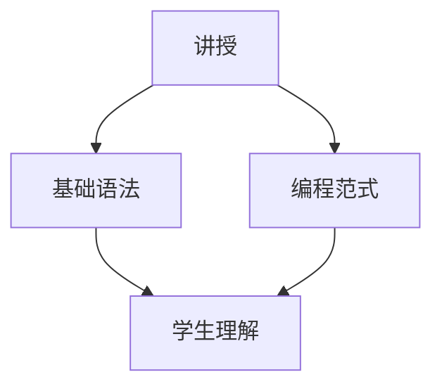

**现代教学方法**

现代教学方法更加注重实践与应用。项目驱动教学是一种常见的方法，通过实际项目，让学生在实践中掌握知识。例如，在数据分析课程中，学生可以参与数据分析项目，从数据收集、清洗、分析到结果展示。

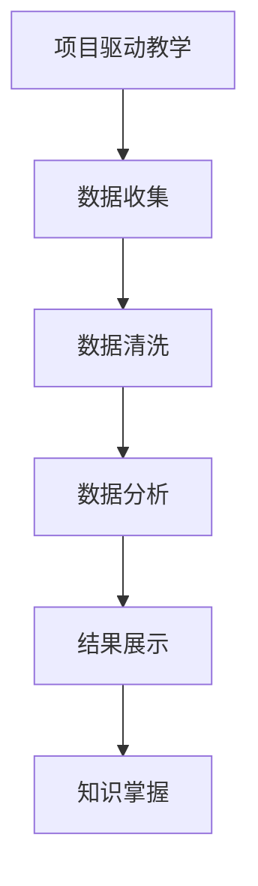

**混合教学方法**

混合教学方法结合了传统与现代教学方法的优点，通过线上线下相结合，形成更加灵活和高效的教学模式。例如，在人工智能课程中，教师可以通过线上讲座介绍基础知识，线下实践课程进行项目开发。

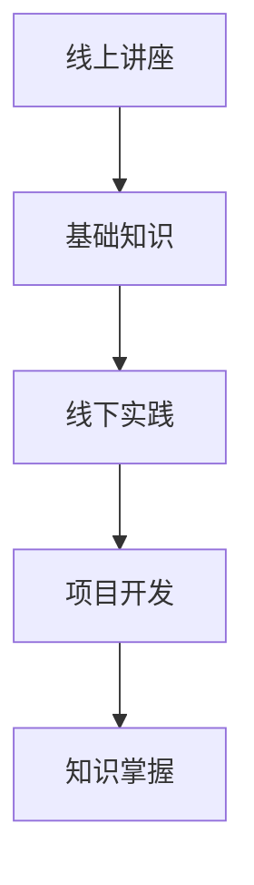

#### 2.2 教学策略与实践

教学策略是教学方法的具体实施过程。以下介绍几种常见的教学策略：

- **设计思维教学**：通过引导学生进行设计思考，培养其创新能力和解决问题的能力。
- **项目驱动教学**：通过实际项目，让学生在解决实际问题的过程中掌握知识。
- **反思性教学**：通过反思和总结，提高学生的学习效果。

**设计思维教学**

设计思维教学是一种以用户需求为中心的创新方法。在教学过程中，教师可以引导学生进行设计思考，例如：

1. **用户研究**：了解用户需求。
2. **原型设计**：设计初步解决方案。
3. **迭代改进**：根据用户反馈进行优化。

以下是一个设计思维教学示例：

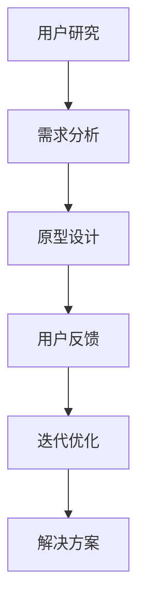

**项目驱动教学**

项目驱动教学是一种以项目为核心的教学方法。通过实际项目，学生可以在实践中掌握知识。以下是一个项目驱动教学示例：

1. **项目设计**：明确项目目标和任务。
2. **项目实施**：学生分组进行项目开发。
3. **项目评审**：教师对项目进行评审和反馈。

以下是一个项目驱动教学示例：

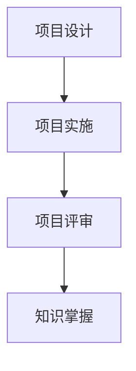

**反思性教学**

反思性教学是一种通过反思和总结，提高学习效果的教学方法。以下是一个反思性教学示例：

1. **课前反思**：学生总结课前学习内容。
2. **课后反思**：学生总结课后学习体会。
3. **教师反馈**：教师根据学生反思进行指导和反馈。

以下是一个反思性教学示例：

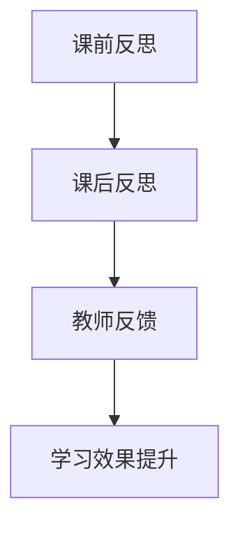

#### 2.3 教学实践案例分析

以下是一些教学实践案例分析，通过实际案例，我们可以看到不同教学方法与策略在技术人才培养中的应用与效果。

**案例一：计算机编程课程教学**

在计算机编程课程中，教师采用了项目驱动教学和设计思维教学相结合的方法。通过实际项目，学生不仅掌握了编程语言的基础知识，还培养了创新能力和解决问题的能力。

1. **项目设计**：教师设计了一个模拟电商平台的项目，学生需要从需求分析、系统设计、编码实现到测试和部署。
2. **项目实施**：学生分组进行项目开发，教师提供指导。
3. **项目评审**：教师对项目进行评审，学生进行反思和总结。

**案例二：数据分析课程教学**

在数据分析课程中，教师采用了项目驱动教学和反思性教学相结合的方法。通过实际数据分析项目，学生不仅掌握了数据分析的基本技能，还培养了实践能力和团队协作精神。

1. **项目设计**：教师设计了一个数据分析项目，学生需要从数据收集、数据清洗、数据分析到结果展示。
2. **项目实施**：学生分组进行项目开发，教师提供指导。
3. **项目评审**：教师对项目进行评审，学生进行反思和总结。

**案例三：人工智能课程教学**

在人工智能课程中，教师采用了设计思维教学和项目驱动教学相结合的方法。通过实际人工智能项目，学生不仅掌握了人工智能的基础知识，还培养了创新思维和解决问题的能力。

1. **项目设计**：教师设计了一个人工智能应用项目，学生需要从需求分析、算法设计、模型训练到应用部署。
2. **项目实施**：学生分组进行项目开发，教师提供指导。
3. **项目评审**：教师对项目进行评审，学生进行反思和总结。

通过以上案例分析，我们可以看到，不同的教学方法与策略在技术人才培养中可以发挥重要作用。教师应根据具体课程和学生的特点，灵活选择和运用不同的教学方法与策略，以提高教学效果。

## 第三部分：培养体系与评估

### 第3章 技术人才培养体系设计

技术人才培养体系的设计是确保技术人才培养质量的关键环节。本章将详细介绍技术人才培养体系的设计原则、构建过程和关键要素。

#### 3.1 培养体系构建

技术人才培养体系的构建应遵循以下原则：

1. **系统化**：确保培养体系覆盖从基础知识到实际应用的各个层面。
2. **多样性**：结合不同教学方法与策略，满足不同学生的学习需求。
3. **持续性**：培养体系应具备持续性，确保学生能够在整个学习过程中不断提升。

**培养体系构建步骤**

1. **需求分析**：了解产业需求和学生需求，明确培养目标。
2. **课程设计**：根据需求分析结果，设计符合实际需求的技术课程。
3. **教学方法与策略**：选择合适的教学方法与策略，提高教学效果。
4. **实践项目与反馈**：通过实践项目，让学生在实际操作中提升技能。
5. **评估与改进**：对教学质量进行评估，根据评估结果进行改进。

以下是一个简化的技术人才培养体系构建流程图：

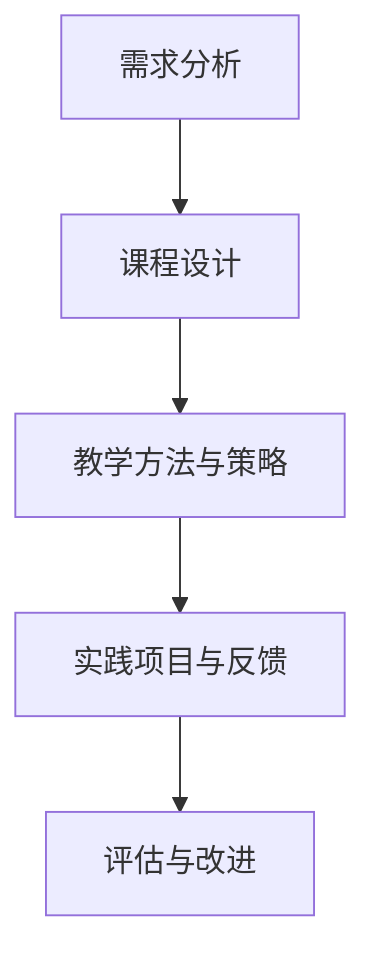

**技能培养模块设计**

技能培养模块是技术人才培养体系的核心组成部分。技能培养模块的设计应包括以下内容：

1. **基础知识模块**：包括计算机科学、数据科学、人工智能等基础知识。
2. **技术技能模块**：包括编程技能、数据分析技能、人工智能应用技能等。
3. **软技能模块**：包括沟通能力、团队协作能力、项目管理能力等。

以下是一个简化的技能培养模块设计：

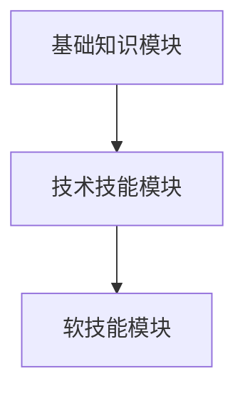

**知识体系构建**

知识体系构建是技术人才培养体系的重要环节。知识体系的构建应包括以下内容：

1. **基础知识体系**：包括计算机科学、数据科学、人工智能等基础知识。
2. **专业技能体系**：包括编程技能、数据分析技能、人工智能应用技能等。
3. **跨学科知识体系**：包括经济学、心理学、社会学等跨学科知识。

以下是一个简化的知识体系构建：

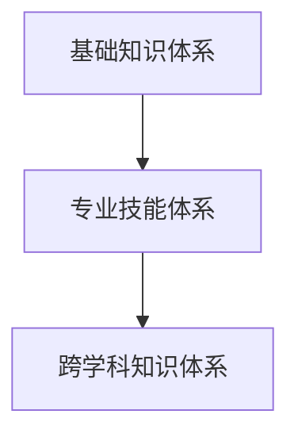

**软技能培养**

软技能培养是技术人才培养体系的重要组成部分。软技能培养应包括以下内容：

1. **沟通能力**：包括有效沟通、团队协作、演讲能力等。
2. **团队协作能力**：包括团队合作、冲突管理、领导力等。
3. **项目管理能力**：包括项目规划、风险管理、进度控制等。

以下是一个简化的软技能培养：

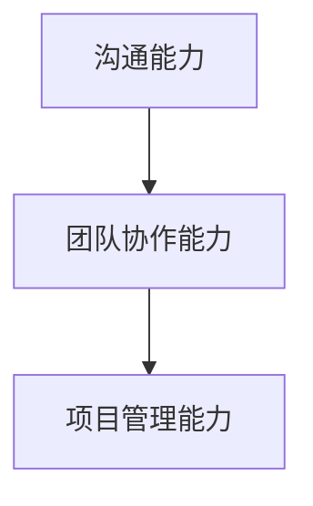

#### 3.2 培养体系实施与监控

技术人才培养体系的实施与监控是确保培养效果的关键环节。以下是一个简化的技术人才培养体系实施与监控流程图：

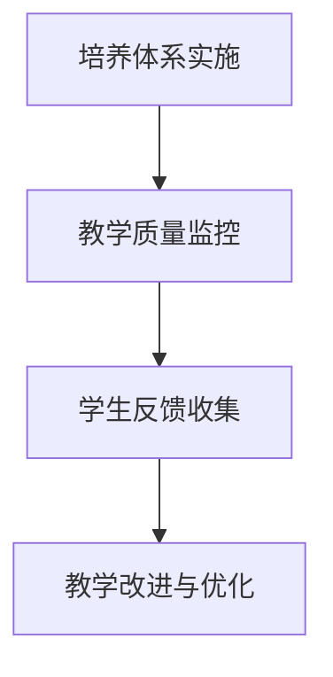

**教学质量监控**

教学质量监控是培养体系实施与监控的重要环节。教学质量监控应包括以下内容：

1. **教学过程监控**：对教学过程进行实时监控，确保教学计划的顺利实施。
2. **学生学习效果评估**：通过考试、作业、项目等评估学生学习效果。
3. **教学质量评估**：定期对教学质量进行评估，根据评估结果进行改进。

**学生反馈机制**

学生反馈机制是培养体系实施与监控的重要环节。学生反馈机制应包括以下内容：

1. **学生满意度调查**：定期进行学生满意度调查，了解学生对教学的满意度。
2. **学生建议收集**：鼓励学生提出改进意见和建议，为教学改进提供依据。
3. **反馈处理与回应**：对学生的反馈进行及时处理和回应，确保学生的意见和建议得到落实。

**教学质量评估**

教学质量评估是培养体系实施与监控的关键环节。教学质量评估应包括以下内容：

1. **学生成绩评估**：通过考试成绩、作业成绩等评估学生的学习成绩。
2. **能力评估**：通过项目、实践等评估学生的实际能力。
3. **综合评估**：结合学生成绩和能力评估，进行综合评估，确保评估结果的全面性和准确性。

#### 3.3 技术人才培养评估方法

技术人才培养评估方法包括以下几种：

1. **定量评估方法**：通过量化指标进行评估，如考试成绩、项目完成度等。
2. **定性评估方法**：通过描述性评估，如教师评语、学生自我评估等。
3. **综合评估方法**：结合定量和定性评估方法，进行综合评估。

以下是一个简化的技术人才培养评估方法：

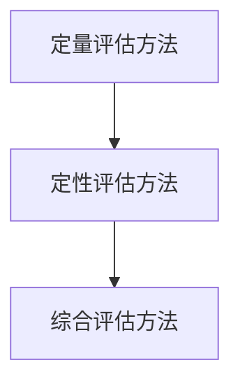

通过以上分析，我们可以看到，技术人才培养体系的设计与实施是一个复杂而系统的过程。只有通过科学的设计、有效的实施和持续的评估，才能确保技术人才培养的质量。

### 第三部分：培养体系与评估

#### 3.1 培养体系构建

**技能培养模块设计**

技能培养模块是技术人才培养体系的核心组成部分。设计技能培养模块时，应考虑以下几个方面：

1. **基础知识模块**：包括计算机科学、数据科学、人工智能等基础知识。这些基础知识是学生进行技术学习和创新的基础。
    ```mermaid
    graph TB
    A[计算机科学] --> B[数据科学]
    B --> C[人工智能]
    ```

2. **技术技能模块**：包括编程技能、数据分析技能、人工智能应用技能等。这些技能模块直接关系到学生能否在实际工作中发挥作用。
    ```mermaid
    graph TB
    A[编程技能] --> B[数据分析技能]
    B --> C[人工智能应用技能]
    ```

3. **软技能模块**：包括沟通能力、团队协作能力、项目管理能力等。这些软技能是学生在职业生涯中能否成功的关键因素。
    ```mermaid
    graph TB
    A[沟通能力] --> B[团队协作能力]
    B --> C[项目管理能力]
    ```

**知识体系构建**

知识体系的构建应涵盖以下几个层次：

1. **基础知识体系**：这是学生掌握技术技能的基石，包括计算机科学、数据科学、人工智能等基础理论。
    ```mermaid
    graph TB
    A[计算机科学基础] --> B[数据科学基础]
    B --> C[人工智能基础]
    ```

2. **专业技能体系**：这是学生在特定技术领域的深入学习和应用，如编程语言、算法、数据分析方法等。
    ```mermaid
    graph TB
    A[编程语言] --> B[算法与数据结构]
    B --> C[数据分析方法]
    ```

3. **跨学科知识体系**：这是学生在多个学科领域的交叉融合，如经济学、心理学、社会学等，以培养综合素质。
    ```mermaid
    graph TB
    A[经济学] --> B[心理学]
    B --> C[社会学]
    ```

**软技能培养**

软技能的培养不仅仅是技术的延伸，更是综合素质的提升。以下是一个软技能培养的框架：

1. **沟通能力**：包括口头和书面沟通技巧，以及有效的交流策略。
    ```mermaid
    graph TB
    A[口头沟通] --> B[书面沟通]
    B --> C[交流策略]
    ```

2. **团队协作能力**：包括团队合作、冲突解决、领导力等，以培养团队精神和协作能力。
    ```mermaid
    graph TB
    A[团队合作] --> B[冲突解决]
    B --> C[领导力]
    ```

3. **项目管理能力**：包括项目规划、进度控制、风险管理等，以提升学生的项目管理水平。
    ```mermaid
    graph TB
    A[项目规划] --> B[进度控制]
    B --> C[风险管理]
    ```

#### 3.2 培养体系实施与监控

**教学计划制定**

制定科学合理的教学计划是培养体系实施的基础。以下是一个教学计划制定的过程：

1. **需求分析**：通过调研和分析，明确学生的学习需求和技术发展趋势。
2. **课程设计**：根据需求分析，设计涵盖基础知识和技能培养的课程。
3. **教学方法与策略**：选择适合的教学方法，如项目驱动、案例教学等，以提升教学效果。
4. **教学资源整合**：整合线上线下教学资源，包括教材、视频、实验平台等。
5. **教学计划评审**：对教学计划进行评审，确保其科学性和可操作性。

以下是一个简化的教学计划制定流程图：

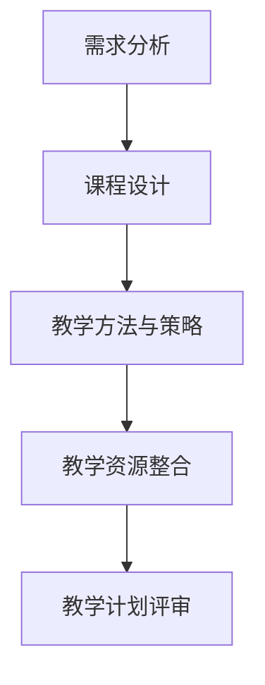

**学生反馈机制**

建立有效的学生反馈机制，是培养体系实施与监控的重要环节。以下是一个学生反馈机制的框架：

1. **定期反馈**：通过定期的问卷调查、座谈会等形式，收集学生对教学内容的反馈。
2. **即时反馈**：通过课堂互动、在线讨论等方式，及时收集学生对教学的即时反馈。
3. **反馈处理**：对收集到的反馈进行分类处理，并制定改进措施。
4. **反馈回应**：将处理结果和改进措施及时反馈给学生，以提高教学效果。

以下是一个简化的学生反馈机制流程图：

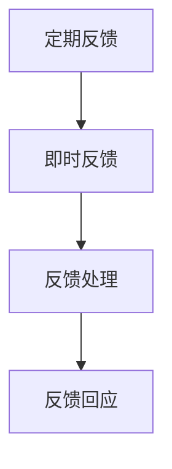

**教学质量评估**

教学质量评估是确保培养体系实施效果的关键环节。以下是一个教学质量评估的框架：

1. **学生成绩评估**：通过考试、作业、项目等对学生学习成绩进行评估。
2. **能力评估**：通过实际项目、实验操作等方式，评估学生的实际能力。
3. **综合评估**：结合学生成绩和能力评估，进行综合评估，以全面了解学生的技术能力和综合素质。

以下是一个简化的教学质量评估流程图：

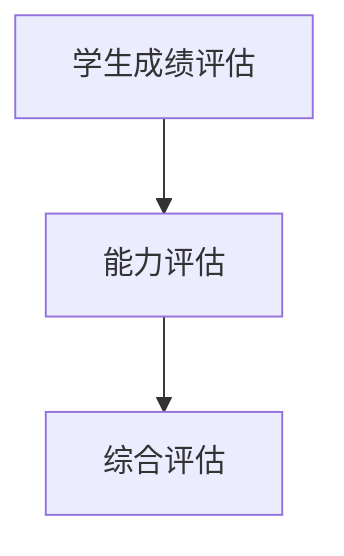

通过以上分析，我们可以看到，技术人才培养体系的构建与实施是一个系统工程，需要科学规划、有效执行和持续评估。只有这样，才能确保培养出适应技术发展需求的高素质技术人才。

### 第4章 技术人才培养的未来展望

在快速发展的信息技术时代，技术人才培养面临着前所未有的挑战和机遇。未来，技术人才培养将朝着更加智能化、个性化、跨学科融合的方向发展。

#### 4.1 技术人才培养面临的挑战

**技术快速发展带来的挑战**

随着技术的快速迭代更新，传统的技术人才培养模式难以适应新的技术需求。例如，人工智能、区块链、云计算等新兴技术的出现，要求技术人才不断更新知识和技能。这对教育体系和人才培养模式提出了新的要求。

**教育资源分配不均**

全球范围内，教育资源的分配存在显著不均衡现象。一些发达国家和地区拥有丰富的教育资源和先进的教学设施，而许多发展中国家和地区则面临着教育资源匮乏的问题。这种不均衡不仅影响了技术人才的培养质量，也导致了全球技术人才分布的不平衡。

**技术人才培养与产业需求的脱节**

在许多情况下，教育机构培养出的技术人才与产业实际需求之间存在一定程度的脱节。这可能导致毕业生在就业时面临困难，同时也使得企业难以找到符合岗位需求的人才。因此，如何使人才培养更加贴合产业需求，成为技术人才培养的重要课题。

#### 4.2 技术人才培养的发展趋势

**跨学科融合**

未来的技术人才培养将更加注重跨学科融合。信息技术与其他领域的交叉融合，如生物信息学、计算社会科学、数据医学等，将催生出更多新的技术领域和应用场景。跨学科融合不仅有助于培养具有全面知识和技能的技术人才，也有助于推动技术创新和应用。

**个性化教育与定制化培养**

随着教育技术的进步，个性化教育和定制化培养将成为技术人才培养的重要趋势。通过大数据分析和人工智能技术，教育机构可以更好地了解学生的学习需求和特点，提供个性化的学习方案和资源，从而提高学习效果。

**智能技术在技术人才培养中的应用**

智能技术，如人工智能、机器学习、虚拟现实等，将在技术人才培养中发挥越来越重要的作用。通过智能教学系统，教师可以根据学生的学习情况自动调整教学内容和进度，提供个性化的辅导和支持。此外，虚拟现实技术可以为学生提供沉浸式的学习体验，提高学习效果。

#### 4.3 未来技术人才培养的展望

**持续学习与终身教育**

在技术快速发展的背景下，持续学习和终身教育将成为技术人才培养的重要理念。教育机构和企业应共同努力，为学生和员工提供持续学习的机会和资源，以应对不断变化的技术环境。

**国际合作与交流**

全球范围内的技术合作与交流将促进技术人才的培养和发展。通过国际学术交流、跨国项目合作等方式，技术人才可以分享经验和知识，共同应对全球性技术挑战。

**注重软技能培养**

在未来，技术人才不仅需要具备扎实的技术能力，还需要具备良好的沟通能力、团队协作能力和创新能力。因此，软技能培养将成为技术人才培养的重要组成部分。

通过以上分析，我们可以看到，技术人才培养的未来充满挑战和机遇。只有不断适应技术发展趋势，创新人才培养模式，才能培养出适应未来社会发展需求的高素质技术人才。

## 附录

### 附录A：技术人才培养工具与资源

在技术人才培养过程中，使用合适的工具和资源可以大大提高教学效果和学生的学习体验。以下是一些主流的教育技术平台、技术技能学习资源以及教育研究机构与期刊。

**主流教育技术平台**

1. **Coursera**：提供全球顶尖大学和企业的在线课程，涵盖计算机科学、数据科学、人工智能等多个领域。
2. **edX**：由哈佛大学和麻省理工学院共同创办，提供高质量的在线课程和学位项目。
3. **Udacity**：专注于提供实用的技术技能培训，涵盖人工智能、数据科学、机器学习等领域。
4. **Khan Academy**：提供免费的在线课程，涵盖数学、科学、计算机科学等多个领域。

**技术技能学习资源**

1. **GitHub**：全球最大的代码托管平台，学生和教师可以在此分享和交流代码。
2. **Stack Overflow**：程序员社区，提供丰富的编程问题解答和技术讨论。
3. **LeetCode**：提供大量编程面试题，帮助学生提升编程技能。
4. **DataCamp**：提供数据科学和数据分析的互动课程和实践项目。

**教育研究机构与期刊**

1. **ACM（Association for Computing Machinery）**：计算机科学领域的重要学术组织，出版多种学术期刊。
2. **IEEE（Institute of Electrical and Electronics Engineers）**：电气和电子工程领域的重要学术组织，出版多种学术期刊。
3. **ACM Transactions on Computer Systems**：计算机系统领域的顶级期刊。
4. **IEEE Transactions on Software Engineering**：软件工程领域的顶级期刊。

通过使用这些工具和资源，教师和学生可以更好地进行技术学习和教学，提升技术人才培养的效果。

## 总结与展望

通过对技术人才培养的系统方法的全面探讨，我们可以看到，技术人才培养是一个复杂而系统的过程，涉及多个环节和要素。本文从理论基础、教学实践、培养体系与评估，以及未来展望等方面，系统地分析了技术人才培养的关键要素和方法。

**背景介绍**：技术人才培养是信息技术高速发展背景下的一项重要任务，对推动技术创新、满足产业需求、提升国家竞争力具有重要意义。

**核心概念与联系**：本文详细介绍了技术人才培养的基本概念、重要性、面临的挑战，并构建了技术人才培养的理论框架，为后续内容提供了基础。

**教学实践**：介绍了多种教学方法和策略，如传统教学方法、现代教学方法、混合教学方法等，并通过实际案例展示了这些方法在技术人才培养中的应用。

**培养体系与评估**：详细阐述了技术人才培养体系的构建、实施与监控，以及评估方法，确保技术人才培养的科学性和有效性。

**未来展望**：分析了技术人才培养面临的挑战和未来发展趋势，如跨学科融合、个性化教育与定制化培养、智能技术在技术人才培养中的应用等。

在总结本文的核心内容后，我们提出以下**最佳实践 tips**：

1. **注重跨学科融合**：技术人才培养应注重跨学科知识的融合，培养综合素质。
2. **个性化教育与定制化培养**：根据学生的特点和学习需求，提供个性化的教育和培养方案。
3. **持续学习与终身教育**：鼓励学生和教师持续学习，不断提升自身能力。

**注意事项**：

1. **确保教学内容与产业需求对接**：教学内容应紧密贴合产业需求，提高毕业生的就业竞争力。
2. **加强实践环节**：通过实践项目，让学生在实际操作中提升技能。
3. **注重软技能培养**：软技能是技术人才成功的重要因素，应加强培养。

**拓展阅读**：

1. 《人工智能：一种现代的方法》（Russell & Norvig）
2. 《数据科学：概念与技术》（Heinrich & Giraldo）
3. 《教育心理学：理论与实践》（Ainsworth & Tippins）

通过本文的探讨，我们希望为技术人才培养提供有益的参考和指导，助力培养出更多适应未来发展的高素质技术人才。

