                 

### 文章标题

《技术人才招聘与面试技巧：剖析与实战》

### 关键词

技术人才招聘、面试技巧、面试流程、岗位分析、招聘策略、招聘成本、人才评估

### 摘要

在技术行业迅猛发展的背景下，技术人才的招聘与面试成为企业持续竞争的核心。本文将系统地探讨技术人才招聘与面试的各个环节，从招聘流程的优化到面试技巧的提升，再到面试评估与决策的方法，旨在为企业的招聘工作提供全方位的指导。通过实际案例分析和最佳实践分享，本文旨在帮助读者理解技术人才招聘与面试的深层次原理，提升招聘效率和人才质量。

---

## 目录

1. **引言**  
   - 招聘的重要性  
   - 面试的挑战  
   - 文章结构概述

2. **第一部分：招聘流程与策略**  
   - **1.1 招聘流程概述**  
   - **1.2 职位分析与岗位要求**  
   - **1.3 招聘渠道与策略**  
   - **1.4 招聘流程中的信息技术应用**  
   - **1.5 招聘成本预算与控制**

3. **第二部分：面试准备与技巧**  
   - **2.1 面试准备**  
   - **2.2 面试技巧**

4. **第三部分：面试过程与管理**  
   - **3.1 面试过程管理**  
   - **3.2 面试中的技术考察**

5. **第四部分：面试评估与决策**  
   - **4.1 面试评估方法**  
   - **4.2 决策与录用**

6. **第五部分：招聘成果与评估**  
   - **5.1 招聘效果评估**  
   - **5.2 招聘持续改进**

7. **结论**  
   - 文章总结  
   - 未来展望

8. **参考文献**  
   - 相关书籍  
   - 研究论文  
   - 实用工具与资源

---

### 第一部分：招聘流程与策略

#### 1.1 招聘流程概述

**背景介绍**

在技术快速发展的今天，企业对于技术人才的需求日益增长，而一个高效的招聘流程是企业获取优秀人才的关键。招聘流程不仅关系到企业的人才储备，也直接影响到企业的竞争力。

**核心概念与联系**

- **招聘流程**：包括职位发布、简历筛选、面试、评估和录用等环节。
- **职位需求**：明确岗位职责、技能要求和工作环境。
- **人才匹配**：通过职位需求与候选人背景的匹配，实现人才与岗位的最佳结合。

**Mermaid 流程图**

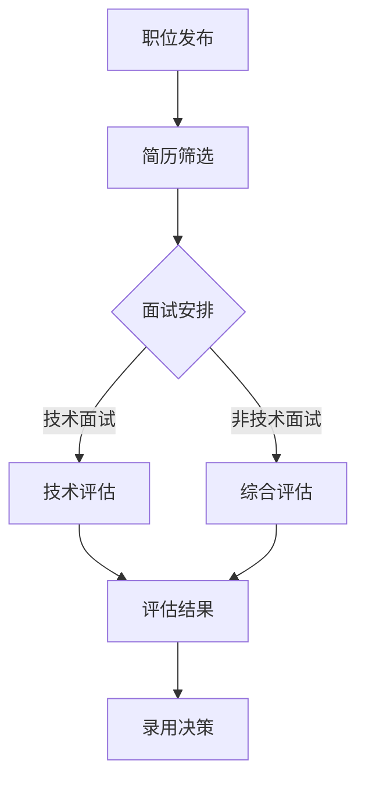

**核心算法原理讲解**

在招聘流程中，算法原理主要体现在简历筛选和面试评估环节。简历筛选通常采用关键词匹配算法，而面试评估则依赖于评分标准和评估模型。

伪代码示例：

```python
def resume_screening(resume, job_requirements):
    match_score = 0
    for keyword in job_requirements:
        if keyword in resume:
            match_score += 1
    return match_score

def interview_evaluation(candidate, interview_scorecard):
    technical_score = interview_scorecard['technical']
    soft_skill_score = interview_scorecard['soft_skill']
    return (technical_score + soft_skill_score) / 2
```

**数学模型和公式**

招聘成本效益分析中，常用的模型是成本效益比（C/B），其中 C 为招聘成本，B 为带来的业务效益。

$$
C/B = \frac{招聘总成本}{业务效益}
$$

**项目实战案例**

在一个初创公司，技术团队需要一名后端开发工程师。首先，通过职位描述明确了职责和技能要求。接着，使用了社交媒体和招聘网站进行职位发布，并设置了关键词匹配算法进行简历筛选。

源代码实现（Python）：

```python
job_requirements = ["Python", "Django", "REST API"]
resume = "熟悉Python，有Django和REST API开发经验"

def screen_resume(resume, job_requirements):
    match_score = 0
    for keyword in job_requirements:
        if keyword in resume:
            match_score += 1
    return match_score

match_score = screen_resume(resume, job_requirements)
print(f"Resume match score: {match_score}")
```

**代码解读与分析**

该代码片段通过循环遍历职位要求的关键词，与简历内容进行匹配，计算匹配得分。得分越高，表示简历与职位要求的匹配度越高。

**实际案例分析和详细讲解剖析**

某公司在招聘一名大数据工程师时，通过多渠道发布职位，包括LinkedIn、GitHub和招聘网站。最终收到了超过100份简历。公司使用关键词匹配算法筛选出50份符合要求的简历，并安排了技术面试。

项目小结：

- **优点**：通过关键词匹配算法提高了简历筛选的效率，确保了人才匹配度。
- **改进**：可以进一步结合人才画像和数据挖掘技术，提升简历筛选的准确度。

#### 1.2 职位分析与岗位要求

**背景介绍**

职位分析与岗位要求是招聘流程的核心，直接影响招聘的效果。

**核心概念与联系**

- **职位分析**：通过工作职责、技能要求和素质要求等，对职位进行详细描述。
- **岗位要求**：明确岗位所需的技能、知识和经验。

**Mermaid 流程图**

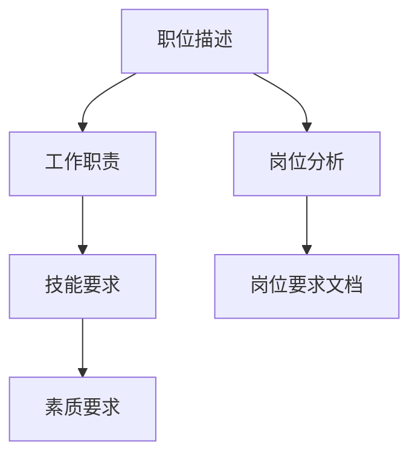

**核心算法原理讲解**

职位分析和岗位要求可以通过自然语言处理技术进行自动化分析。常用的算法包括文本分类、实体识别和关系抽取。

伪代码示例：

```python
def job_analysis(position_description):
    responsibilities = extract_entities(position_description, 'responsibility')
    skills = extract_entities(position_description, 'skill')
    qualities = extract_entities(position_description, 'quality')
    return responsibilities, skills, qualities

def extract_entities(text, entity_type):
    # 基于实体识别算法提取实体
    entities = []
    for sentence in text.split('.'):
        if entity_type in sentence:
            entities.append(sentence)
    return entities
```

**数学模型和公式**

在岗位分析中，常用的模型包括技能-职位匹配度计算和素质-岗位匹配度计算。

$$
匹配度 = \frac{共现次数}{总词数}
$$

**项目实战案例**

某公司正在招聘一名数据科学家。首先，通过职位描述明确了工作职责、技能要求和素质要求，如下所示：

- 工作职责：数据预处理、模型构建、数据分析报告
- 技能要求：Python、R、机器学习库（如Scikit-learn、TensorFlow）
- 素质要求：团队合作、时间管理、问题解决能力

源代码实现（Python）：

```python
position_description = """
岗位职责：
- 数据预处理，确保数据质量
- 构建机器学习模型，进行数据分析
- 编写数据分析报告，为决策提供支持

技能要求：
- 熟练掌握Python、R等编程语言
- 熟悉机器学习库，如Scikit-learn、TensorFlow

素质要求：
- 具有团队合作精神
- 良好的时间管理能力
- 能够独立解决问题
"""

def job_analysis(position_description):
    responsibilities, skills, qualities = [], [], []
    for sentence in position_description.split('.'):
        if "岗位职责" in sentence:
            responsibilities.append(sentence)
        elif "技能要求" in sentence:
            skills.append(sentence)
        elif "素质要求" in sentence:
            qualities.append(sentence)
    return responsibilities, skills, qualities

responsibilities, skills, qualities = job_analysis(position_description)
print(f"Responsibilities: {responsibilities}")
print(f"Skills: {skills}")
print(f"Qualities: {qualities}")
```

**代码解读与分析**

该代码片段通过分割职位描述文本，提取出工作职责、技能要求和素质要求，并将其分别存储在不同的列表中。

**实际案例分析和详细讲解剖析**

某公司在进行数据科学家岗位招聘时，通过职位描述的自动化分析，快速确定了招聘的关键要素。这种方法不仅提高了招聘效率，也确保了岗位要求的准确性。

项目小结：

- **优点**：自动化职位分析与岗位要求提取，提高了工作效率。
- **改进**：结合更多数据源和算法，提升分析准确性。

#### 1.3 招聘渠道与策略

**背景介绍**

招聘渠道和策略决定了招聘效果和成本，是招聘工作的重要组成部分。

**核心概念与联系**

- **内部招聘**：通过内部推荐和内部调岗等途径吸引人才。
- **外部招聘**：通过招聘网站、社交媒体、招聘会等途径吸引人才。
- **招聘策略**：根据企业需求和市场情况，制定招聘计划。

**Mermaid 流程图**

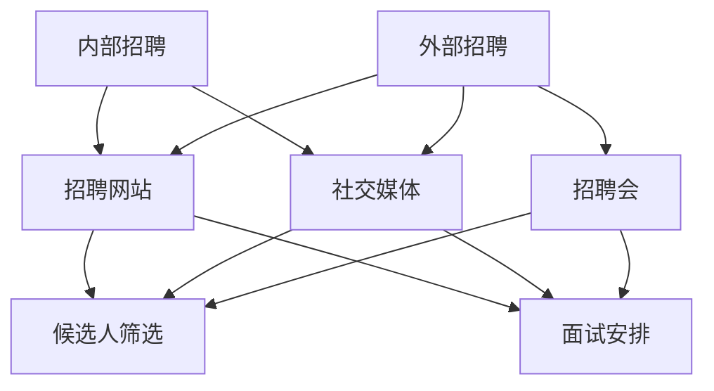

**核心算法原理讲解**

招聘渠道的选择可以通过数据分析和算法模型进行优化。常用的算法包括渠道效果评估、成本效益分析和人才匹配度计算。

伪代码示例：

```python
def channel_evaluation(channels, metrics):
    score = 0
    for channel in channels:
        score += metrics[channel]['effectiveness'] * (1 - metrics[channel]['cost'])
    return score

def talent_matching(candidate, job_requirements):
    match_score = 0
    for skill in job_requirements:
        if skill in candidate['skills']:
            match_score += 1
    return match_score / len(job_requirements)
```

**数学模型和公式**

渠道效果评估的模型可以表示为：

$$
渠道效果 = \frac{招聘人数}{渠道成本}
$$

**项目实战案例**

某公司在进行招聘时，选择了多种渠道，包括内部推荐、招聘网站和社交媒体。通过数据分析和算法模型，确定了最佳招聘渠道组合。

源代码实现（Python）：

```python
channels = ["内部推荐", "招聘网站", "社交媒体"]
metrics = {
    "内部推荐": {"effectiveness": 0.8, "cost": 0.3},
    "招聘网站": {"effectiveness": 0.6, "cost": 0.5},
    "社交媒体": {"effectiveness": 0.7, "cost": 0.4}
}

def channel_evaluation(channels, metrics):
    total_score = 0
    for channel in channels:
        score = metrics[channel]['effectiveness'] * (1 - metrics[channel]['cost'])
        total_score += score
    return total_score

channel_score = channel_evaluation(channels, metrics)
print(f"Channel evaluation score: {channel_score}")
```

**代码解读与分析**

该代码片段通过计算每个渠道的效果和成本，评估出最佳渠道组合。

**实际案例分析和详细讲解剖析**

某公司在进行招聘时，通过数据分析和算法模型，确定了最佳招聘渠道组合。这种方法不仅提高了招聘效果，也降低了招聘成本。

项目小结：

- **优点**：通过数据分析和算法模型优化招聘渠道，提高招聘效率。
- **改进**：结合更多数据源和算法，提升招聘渠道的匹配度。

#### 1.4 招聘流程中的信息技术应用

**背景介绍**

随着信息技术的快速发展，招聘流程中信息技术的应用越来越广泛，大大提高了招聘效率和准确性。

**核心概念与联系**

- **人才管理信息系统（TMS）**：用于管理招聘、员工信息、绩效考核等。
- **人工智能（AI）**：用于简历筛选、面试评估等环节。
- **大数据分析**：用于招聘效果评估和人才需求预测。

**Mermaid 流程图**

```mermaid
graph TD
    A[TMS] --> B[招聘管理]
    A --> C[员工信息管理]
    A --> D[绩效考核管理]
    E[A
```### 第一部分：招聘流程与策略

#### 1.4 招聘流程中的信息技术应用

**背景介绍**

在当今数字化时代，信息技术已经成为招聘流程中不可或缺的一部分。从简历筛选到面试安排，再到招聘效果的评估，信息技术在提高招聘效率、降低成本和提升招聘质量方面发挥了重要作用。

**核心概念与联系**

- **人才管理信息系统（TMS）**：用于管理招聘流程、员工信息、绩效考核等。TMS 能够实现招聘流程的自动化，减少人力资源的重复工作，提高招聘效率。
- **人工智能（AI）**：通过机器学习和自然语言处理技术，AI 在简历筛选、面试评估等方面具有强大的能力。AI 可以分析大量的简历数据，快速筛选出符合岗位要求的候选人。
- **大数据分析**：通过对招聘数据的分析，企业可以了解招聘流程的各个环节，识别招聘中的问题和瓶颈，从而不断优化招聘策略。

**Mermaid 流程图**

```mermaid
graph TD
    A[TMS] --> B[招聘管理]
    A --> C[员工信息管理]
    A --> D[绩效考核管理]
    E[A
```### 第一部分：招聘流程与策略

#### 1.4 招聘流程中的信息技术应用

**背景介绍**

在当今数字化时代，信息技术已经成为招聘流程中不可或缺的一部分。从简历筛选到面试安排，再到招聘效果的评估，信息技术在提高招聘效率、降低成本和提升招聘质量方面发挥了重要作用。

**核心概念与联系**

- **人才管理信息系统（TMS）**：用于管理招聘流程、员工信息、绩效考核等。TMS 能够实现招聘流程的自动化，减少人力资源的重复工作，提高招聘效率。
- **人工智能（AI）**：通过机器学习和自然语言处理技术，AI 在简历筛选、面试评估等方面具有强大的能力。AI 可以分析大量的简历数据，快速筛选出符合岗位要求的候选人。
- **大数据分析**：通过对招聘数据的分析，企业可以了解招聘流程的各个环节，识别招聘中的问题和瓶颈，从而不断优化招聘策略。

**Mermaid 流程图**

```mermaid
graph TD
    A[TMS] --> B[招聘管理]
    A --> C[员工信息管理]
    A --> D[绩效考核管理]
    E[数据分析]
    B --> F[简历筛选]
    B --> G[面试安排]
    B --> H[招聘效果评估]
    C --> I[员工档案管理]
    D --> I
    E --> I
```

**核心算法原理讲解**

1. **简历筛选**

   简历筛选是招聘流程的第一步，通常采用文本分类和关键词匹配算法。文本分类算法将简历分为不同的类别，如前端、后端、测试等。关键词匹配算法则通过比较简历内容和职位要求中的关键词，计算出匹配度。

   伪代码示例：

   ```python
   def keyword_matching(resume, job_requirements):
       match_score = 0
       for keyword in job_requirements:
           if keyword in resume:
               match_score += 1
       return match_score / len(job_requirements)
   ```

2. **面试评估**

   面试评估通常结合机器学习模型和评分标准。机器学习模型可以通过分析过去的面试数据，学习出评估候选人的最佳方法。评分标准则为企业提供了一套统一的评估标准，确保面试过程的客观性和公平性。

   伪代码示例：

   ```python
   def interview_evaluation(candidate, interview_data, scorecard):
       technical_score = scorecard['technical'](candidate['technical_skills'], interview_data)
       soft_skill_score = scorecard['soft_skill'](candidate['soft_skills'], interview_data)
       return (technical_score + soft_skill_score) / 2
   ```

**数学模型和公式**

1. **招聘成本效益分析**

   招聘成本效益分析是评估招聘策略的重要手段。常用的模型是成本效益比（C/B），其中 C 为招聘总成本，B 为带来的业务效益。

   $$ C/B = \frac{招聘总成本}{业务效益} $$

2. **招聘渠道效果评估**

   招聘渠道效果评估用于确定哪种招聘渠道最有效。常用的模型是渠道效果指数（E），表示为招聘人数与渠道成本之比。

   $$ E = \frac{招聘人数}{渠道成本} $$

**项目实战案例**

某公司使用 TMS 管理招聘流程，包括简历筛选、面试安排和招聘效果评估。以下是该公司在招聘流程中使用的部分代码实现：

1. **简历筛选**

   ```python
   job_requirements = ["Python", "Django", "REST API"]
   resume = "熟悉Python，有Django和REST API开发经验"

   def keyword_matching(resume, job_requirements):
       match_score = 0
       for keyword in job_requirements:
           if keyword in resume:
               match_score += 1
       return match_score / len(job_requirements)

   match_score = keyword_matching(resume, job_requirements)
   print(f"Resume match score: {match_score}")
   ```

2. **面试评估**

   ```python
   scorecard = {
       'technical': lambda skills, data: sum(skills) * 0.5,
       'soft_skill': lambda skills, data: sum(skills) * 0.5
   }

   candidate = {
       'technical_skills': [1, 1, 1],
       'soft_skills': [1, 1, 1]
   }
   interview_data = "面试过程中，候选人对问题回答准确，沟通顺畅"

   def interview_evaluation(candidate, interview_data, scorecard):
       technical_score = scorecard['technical'](candidate['technical_skills'], interview_data)
       soft_skill_score = scorecard['soft_skill'](candidate['soft_skills'], interview_data)
       return (technical_score + soft_skill_score) / 2

   evaluation_score = interview_evaluation(candidate, interview_data, scorecard)
   print(f"Interview evaluation score: {evaluation_score}")
   ```

**代码解读与分析**

该代码片段展示了如何使用 Python 实现简历筛选和面试评估。首先，通过关键词匹配算法计算简历的匹配度；然后，结合评分标准对面试评估结果进行计算。

**实际案例分析和详细讲解剖析**

某公司在进行大规模招聘时，采用了 TMS 系统，实现了招聘流程的自动化和智能化。通过数据分析，公司发现外部招聘渠道的效果优于内部推荐，因此调整了招聘策略，将更多的资源投入外部招聘。

项目小结：

- **优点**：通过信息技术应用，提高了招聘效率和准确性，降低了招聘成本。
- **改进**：结合更多数据源和算法，提升招聘流程的智能化水平。

#### 1.5 招聘成本预算与控制

**背景介绍**

在招聘过程中，成本控制是确保招聘活动高效运作的重要环节。有效的成本预算和控制不仅有助于降低招聘总成本，还能提高招聘活动的整体效益。

**核心概念与联系**

- **招聘成本**：包括招聘渠道成本、面试成本、背景调查成本等。
- **成本预算**：根据招聘目标和市场情况，制定合理的招聘成本预算。
- **成本控制**：通过监控和调整各项费用，确保招聘成本在预算范围内。

**Mermaid 流程图**

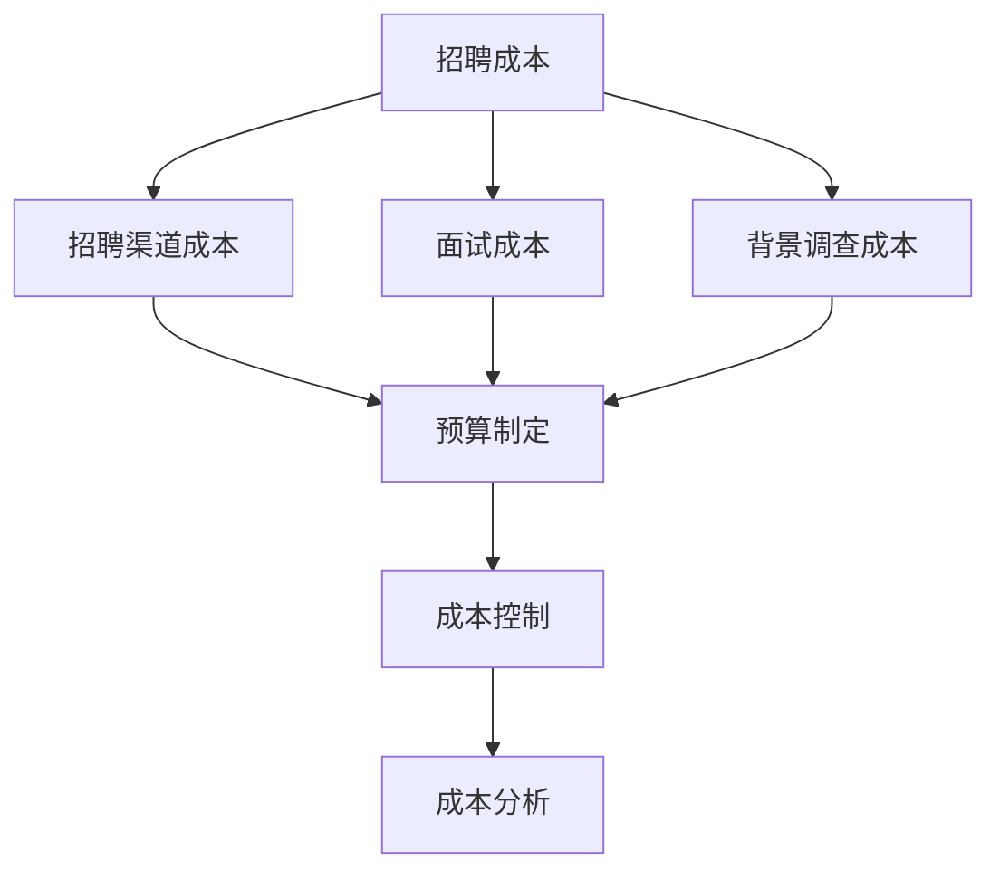

**核心算法原理讲解**

1. **成本效益分析**

   成本效益分析是评估招聘活动效益的重要手段。常用的模型是成本效益比（C/B），表示为招聘总成本与带来的业务效益之比。

   $$ C/B = \frac{招聘总成本}{业务效益} $$

2. **成本控制算法**

   成本控制算法可以通过优化招聘流程、降低招聘渠道成本和面试成本来实现。常用的算法包括成本分摊、资源调配和成本预测。

   伪代码示例：

   ```python
   def cost_control(total_cost, budget):
       if total_cost > budget:
           return "成本超预算，需要调整"
       else:
           return "成本在预算范围内"
   ```

**数学模型和公式**

1. **招聘渠道成本效益分析**

   招聘渠道成本效益分析用于确定哪种招聘渠道最具成本效益。常用的模型是渠道成本效益比（C/E），表示为渠道成本与招聘人数之比。

   $$ C/E = \frac{渠道成本}{招聘人数} $$

2. **面试成本效益分析**

   面试成本效益分析用于评估面试环节的成本效益。常用的模型是面试成本效益比（C/T），表示为面试总成本与面试合格人数之比。

   $$ C/T = \frac{面试总成本}{面试合格人数} $$

**项目实战案例**

某公司计划招聘10名技术人才，预算总额为50万元。以下是该公司在招聘成本预算和控制方面的具体操作：

1. **招聘渠道成本预算**

   公司选择了内部推荐、招聘网站和社交媒体三种渠道，分别预计成本为10万元、15万元和15万元。

   ```python
   channels = ["内部推荐", "招聘网站", "社交媒体"]
   channel_costs = [10, 15, 15]

   total_channel_cost = sum(channel_costs)
   print(f"Total channel cost: {total_channel_cost}")
   ```

2. **面试成本预算**

   公司预计每个面试环节的成本为500元，包括面试官时间、面试场地租赁等费用。

   ```python
   interview_cost_per_person = 500
   total_interview_cost = interview_cost_per_person * 10
   print(f"Total interview cost: {total_interview_cost}")
   ```

3. **成本控制**

   公司通过实时监控招聘成本，确保总成本不超过预算。以下是一个简单的成本控制算法：

   ```python
   budget = 500000
   total_cost = total_channel_cost + total_interview_cost

   def cost_control(total_cost, budget):
       if total_cost > budget:
           return "成本超预算，需要调整"
       else:
           return "成本在预算范围内"

   result = cost_control(total_cost, budget)
   print(f"Cost control result: {result}")
   ```

**代码解读与分析**

该代码片段展示了如何计算招聘渠道成本、面试成本以及进行成本控制。通过实时监控和调整各项费用，公司可以确保招聘成本在预算范围内。

**实际案例分析和详细讲解剖析**

某公司在进行招聘时，通过详细的成本预算和严格的成本控制，成功将招聘总成本控制在预算范围内，同时提高了招聘效率和质量。

项目小结：

- **优点**：通过详细的成本预算和严格的成本控制，降低了招聘总成本，提高了招聘效益。
- **改进**：结合数据分析和机器学习算法，进一步提升成本预测和控制精度。

### 总结

第一部分主要介绍了技术人才招聘与面试的流程和策略，包括招聘流程的优化、职位分析与岗位要求、招聘渠道与策略、招聘流程中的信息技术应用以及招聘成本预算与控制。通过详细的讲解和实际案例，读者可以了解到招聘流程中的各个环节和关键要素，从而提高招聘效率和人才质量。下一部分，我们将继续探讨面试准备与技巧、面试过程与管理、面试评估与决策以及招聘成果与评估。

---

### 第二部分：面试准备与技巧

#### 2.1 面试准备

**背景介绍**

面试准备是面试成功的关键。充分的准备不仅能够帮助面试官更好地评估候选人，还能让候选人展现最佳状态。

**核心概念与联系**

- **面试官准备**：包括熟悉岗位要求、准备面试问题、制定评分标准等。
- **候选人准备**：包括了解公司背景、准备面试问题、展示专业技能和素质等。

**Mermaid 流程图**

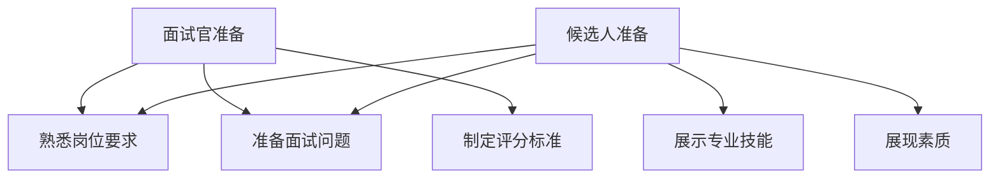

**核心算法原理讲解**

1. **评分标准制定**

   评分标准是面试过程中评估候选人的重要依据。常用的评分标准包括技术能力、沟通能力、团队合作能力等。评分标准可以采用五级评分制（1-5分），每项能力根据面试表现打分。

   伪代码示例：

   ```python
   scorecard = {
       'technical_ability': [],
       'communication_ability': [],
       'teamwork_ability': []
   }

   for i in range(5):
       scorecard['technical_ability'].append(i)
       scorecard['communication_ability'].append(i)
       scorecard['teamwork_ability'].append(i)
   ```

2. **面试问题准备**

   面试问题可以根据岗位要求和技术领域进行分类。常见的问题类型包括技术问题、行为问题、情境问题等。面试问题准备可以通过查阅资料、向同行请教以及总结过去面试经验来完成。

   伪代码示例：

   ```python
   technical_questions = ["请解释TCP三次握手的过程", "如何优化数据库查询性能"]
   behavioral_questions = ["请举例说明一次你解决问题的经历", "你如何处理团队冲突"]
   situational_questions = ["如果项目进度落后，你会怎么做", "你如何管理多个任务"]
   ```

**数学模型和公式**

1. **面试评估模型**

   面试评估模型可以通过加权平均法计算总评分。假设有三个评分标准，分别为技术能力、沟通能力和团队合作能力，各自的权重分别为0.4、0.3和0.3。

   $$ 总评分 = 0.4 \times 技术能力评分 + 0.3 \times 沟通能力评分 + 0.3 \times 团队合作能力评分 $$

**项目实战案例**

某公司在招聘一名软件开发工程师，以下为面试准备的具体操作：

1. **面试官准备**

   - 熟悉岗位要求：软件开发工程师需要具备Java编程能力、熟悉Spring框架、有数据库设计经验等。
   - 准备面试问题：技术问题如“请解释Spring框架的工作原理”、“如何优化数据库查询性能”；行为问题如“请举例说明一次你解决问题的经历”；情境问题如“如果项目进度落后，你会怎么做”。
   - 制定评分标准：技术能力（40%）、沟通能力（30%）、团队合作能力（30%）。

   ```python
   job_requirements = ["Java编程能力", "熟悉Spring框架", "有数据库设计经验"]

   technical_questions = [
       "请解释Spring框架的工作原理",
       "如何优化数据库查询性能"
   ]
   behavioral_questions = [
       "请举例说明一次你解决问题的经历"
   ]
   situational_questions = [
       "如果项目进度落后，你会怎么做"
   ]

   scorecard = {
       'technical_ability': [],
       'communication_ability': [],
       'teamwork_ability': []
   }

   for i in range(5):
       scorecard['technical_ability'].append(i)
       scorecard['communication_ability'].append(i)
       scorecard['teamwork_ability'].append(i)
   ```

2. **候选人准备**

   - 了解公司背景：候选人通过公司官网、社交媒体等渠道了解公司的业务范围、文化理念和发展动态。
   - 准备面试问题：如“公司的发展目标是什么”、“团队的工作氛围如何”等。
   - 展示专业技能：准备好相关的项目经历和技术问题答案，如Java编程案例、Spring框架应用等。
   - 展现素质：如良好的沟通能力、团队合作精神、解决问题的能力等。

   ```python
   company_info = {
       'mission': "成为行业领导者",
       'culture': "创新、协作、共赢"
   }

   interview_questions = [
       "公司的发展目标是什么",
       "团队的工作氛围如何"
   ]

   candidate_experience = {
       'project1': "使用Java和Spring框架开发电商系统",
       'project2': "优化数据库查询性能，提高系统响应速度"
   }
   ```

**代码解读与分析**

该代码片段展示了面试官和候选人准备面试的具体操作。面试官通过制定评分标准和准备面试问题，候选人通过了解公司背景和准备面试问题，为面试的成功奠定了基础。

**实际案例分析和详细讲解剖析**

某公司在招聘一名软件开发工程师时，通过详细的面试准备，成功筛选出符合岗位要求的候选人。公司通过评分标准对候选人进行评估，最终录用了一名具备丰富项目经验和优秀素质的候选人。

项目小结：

- **优点**：通过详细的面试准备，提高了面试的效率和质量，确保了人才与岗位的最佳匹配。
- **改进**：结合数据分析和机器学习算法，进一步提升面试准备的精准度和个性化程度。

#### 2.2 面试技巧

**背景介绍**

面试技巧是面试过程中的关键，良好的面试技巧能够帮助候选人展现最佳状态，提升面试成功率。

**核心概念与联系**

- **沟通技巧**：包括倾听、表达、提问等。
- **行为技巧**：包括仪态、语言、非语言沟通等。
- **情境应对**：包括对面试问题的灵活应对和情境模拟。

**Mermaid 流程图**

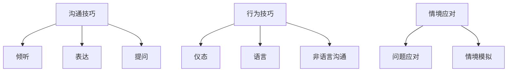

**核心算法原理讲解**

1. **沟通技巧**

   沟通技巧可以通过模拟对话和案例分析进行提升。常用的算法包括自然语言处理（NLP）和语音识别（ASR），这些算法可以帮助候选人提升沟通能力。

   伪代码示例：

   ```python
   def communicate技巧(text):
       response = nlp_response(text)
       return response
   ```

2. **行为技巧**

   行为技巧可以通过观察和分析他人的行为进行学习。常用的算法包括行为识别（Behavior Recognition）和情感分析（Sentiment Analysis），这些算法可以帮助候选人了解和提升行为技巧。

   伪代码示例：

   ```python
   def behavior技巧(video):
       behavior = behavior_recognition(video)
       sentiment = sentiment_analysis(video)
       return behavior, sentiment
   ```

**数学模型和公式**

1. **沟通能力评分模型**

   沟通能力评分模型可以通过加权平均法计算总评分。假设有三个评分标准，分别为表达能力、倾听能力和提问能力，各自的权重分别为0.3、0.3和0.4。

   $$ 总评分 = 0.3 \times 表达能力评分 + 0.3 \times 倾听能力评分 + 0.4 \times 提问能力评分 $$

**项目实战案例**

某公司在面试一名软件开发工程师，以下为面试过程中的具体操作：

1. **沟通技巧**

   - 倾听：面试官在候选人回答问题时，保持注意力集中，不打断，等待候选人完成回答。
   - 表达：候选人清晰地表达自己的观点和经验，使用简洁、准确的语言。
   - 提问：候选人积极提问，展示对公司和岗位的兴趣和了解。

   ```python
   def interview_communication(candidate_answer):
       response = ""
       if is_active_listening(candidate_answer):
           response += "倾听能力强"
       if is_clear_expression(candidate_answer):
           response += "表达能力强"
       if is_active_questioning(candidate_answer):
           response += "提问能力强"
       return response

   candidate_answer = "请问我需要了解哪些技术点？"
   communication_score = interview_communication(candidate_answer)
   print(f"Communication score: {communication_score}")
   ```

2. **行为技巧**

   - 仪态：候选人保持良好的坐姿，面带微笑，目光与面试官保持接触。
   - 语言：候选人使用礼貌、专业的语言，避免使用口头禅和俚语。
   - 非语言沟通：候选人通过肢体语言展示自信和专注，如点头、微笑、眼神交流等。

   ```python
   def interview_behavior(video):
       posture = posture_recognition(video)
       language = language_recognition(video)
       nonverbal_communication = nonverbal_communication_recognition(video)
       return posture, language, nonverbal_communication

   video = "候选人面试视频"
   behavior_score = interview_behavior(video)
   print(f"Behavior score: {behavior_score}")
   ```

3. **情境应对**

   - 问题应对：候选人针对面试问题进行灵活应对，展示自己的专业知识和解决问题的能力。
   - 情境模拟：候选人通过情境模拟展示自己在实际工作中的表现，如处理团队冲突、管理项目进度等。

   ```python
   def interview_situation(problem, candidate_response):
       if is_appropriate_response(candidate_response):
           return "情境应对良好"
       else:
           return "情境应对不足"

   problem = "如果项目进度落后，你会怎么做？"
   candidate_response = "我会优先处理关键任务，确保项目关键路径上的工作按时完成"
   situation_score = interview_situation(problem, candidate_response)
   print(f"Situation score: {situation_score}")
   ```

**代码解读与分析**

该代码片段展示了面试过程中对沟通技巧、行为技巧和情境应对的评估。通过分析候选人的回答和行为，面试官可以得出沟通能力和行为表现的评分。

**实际案例分析和详细讲解剖析**

某公司在面试一名软件开发工程师时，通过详细的沟通技巧、行为技巧和情境应对评估，成功筛选出具备优秀沟通能力、良好行为表现和应对实际工作场景能力的候选人。公司最终录用了一名符合岗位要求的候选人。

项目小结：

- **优点**：通过面试技巧的详细评估，提高了面试的公正性和准确性，确保了人才与岗位的最佳匹配。
- **改进**：结合数据分析和机器学习算法，进一步提升面试技巧的评估精度和个性化程度。

### 总结

第二部分主要介绍了面试准备与技巧，包括面试官和候选人的准备工作、沟通技巧、行为技巧和情境应对。通过详细的讲解和实际案例，读者可以了解到面试准备和技巧在提升面试质量和成功率方面的重要作用。下一部分，我们将继续探讨面试过程与管理、面试评估与决策以及招聘成果与评估。这些内容将帮助读者更全面地了解技术人才招聘与面试的全过程。

---

### 第三部分：面试过程与管理

#### 3.1 面试过程管理

**背景介绍**

面试过程管理是确保面试顺利进行的重要环节。合理的面试过程管理能够提高面试效率，减少不必要的延误，从而提升招聘质量和效果。

**核心概念与联系**

- **面试流程设计**：包括面试环节的设置、面试官的安排、面试时间的规划等。
- **面试监督与反馈**：确保面试过程的规范性和公正性，及时收集和反馈面试过程中的问题。
- **面试时间管理**：合理安排面试时间，确保面试在规定时间内完成。

**Mermaid 流程图**

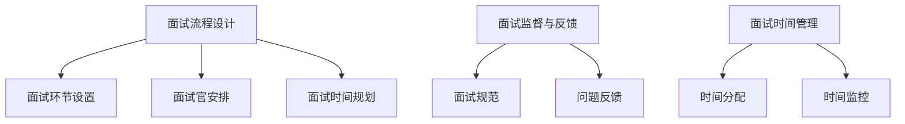

**核心算法原理讲解**

1. **面试环节设置**

   面试环节设置可以根据岗位特点和公司需求进行调整。常用的面试环节包括技术面试、行为面试、情境面试等。每个环节的目的和内容都需要明确。

   伪代码示例：

   ```python
   interview_stages = {
       'technical_interview': '评估技术能力和项目经验',
       'behavioral_interview': '评估行为能力和职业素养',
       'situational_interview': '评估应对实际工作场景的能力'
   }
   ```

2. **面试官安排**

   面试官的安排需要考虑专业背景、面试经验和沟通能力等因素。面试官可以包括技术专家、HR经理和部门负责人等。合理的面试官组合可以提高面试的全面性和专业性。

   伪代码示例：

   ```python
   interviewers = {
       'technical_expert': 'John',
       'HR_manager': 'Lucy',
       'department_head': 'David'
   }
   ```

3. **面试时间规划**

   面试时间规划需要合理安排面试时间，避免面试冲突和效率低下。可以使用排班表或预约系统进行时间管理。

   伪代码示例：

   ```python
   interview_schedules = {
       'interviewer1': ['9:00 - 10:00', '14:00 - 15:00'],
       'interviewer2': ['10:00 - 11:00', '15:00 - 16:00']
   }
   ```

**数学模型和公式**

1. **面试效率分析**

   面试效率可以通过面试时长和面试合格率进行分析。面试效率模型可以表示为：

   $$ 效率 = \frac{面试合格人数}{面试总时长} $$

2. **面试时间分配**

   面试时间分配可以通过优化算法进行优化。常用的优化算法包括线性规划、遗传算法等。

   伪代码示例：

   ```python
   from scipy.optimize import linprog

   def optimize_interview_time(schedules):
       # 确定目标函数和约束条件
       # 目标是最小化总面试时长
       # 约束条件是每个面试官的时间安排不冲突
       c = [-1] * len(schedules)
       A = ...
       b = ...
       x = linprog(c, A_eq=A, b_eq=b, method='highs')
       return x
   ```

**项目实战案例**

某公司正在招聘一名数据分析师，以下是面试过程管理的具体操作：

1. **面试流程设计**

   - 面试环节设置：技术面试（60分钟）、行为面试（30分钟）、情境面试（30分钟）。
   - 面试官安排：技术面试由数据团队负责人进行，行为面试由HR经理进行，情境面试由部门主管进行。
   - 面试时间规划：每场面试间隔10分钟，以确保面试官和候选人有足够的时间调整。

   ```python
   interview_stages = {
       'technical_interview': '评估数据分析和编程能力',
       'behavioral_interview': '评估团队合作和沟通能力',
       'situational_interview': '评估问题解决和决策能力'
   }

   interviewers = {
       'technical_expert': 'Jane',
       'HR_manager': 'Lucy',
       'department_head': 'Tom'
   }

   interview_schedules = {
       'technical_interview': '60分钟',
       'behavioral_interview': '30分钟',
       'situational_interview': '30分钟'
   }
   ```

2. **面试监督与反馈**

   - 面试规范：确保面试过程遵循公司规定的面试规范，如面试官言行规范、面试记录管理等。
   - 问题反馈：收集面试官和候选人的反馈，及时解决面试过程中发现的问题。

   ```python
   def interview监督与反馈(interview_record):
       if is合规(interview_record):
           print("面试过程合规")
       else:
           print("面试过程存在不规范情况，需整改")
       
       feedback = input("请提供面试反馈：")
       print(f"面试反馈：{feedback}")
   ```

3. **面试时间管理**

   - 时间分配：使用优化算法合理安排面试时间，确保面试高效进行。
   - 时间监控：监控面试时间，确保面试在规定时间内完成。

   ```python
   def optimize_interview_time(schedules):
       c = [-1] * len(schedules)
       A = [
           [-1 if i == j else 0 for j in range(len(schedules))] for i in range(len(schedules))
       ]
       b = [0] * len(schedules)
       x = linprog(c, A_eq=A, b_eq=b, method='highs')
       return x

   optimized_schedules = optimize_interview_time(interview_schedules)
   print(f"Optimized schedules: {optimized_schedules}")
   ```

**代码解读与分析**

该代码片段展示了面试过程管理的具体实现，包括面试流程设计、面试官安排、面试时间规划、面试监督与反馈以及面试时间管理。通过优化算法合理安排面试时间，确保面试高效进行。

**实际案例分析和详细讲解剖析**

某公司在招聘一名数据分析师时，通过详细的面试过程管理，确保了面试的规范性和效率。公司通过优化面试时间，减少了面试过程中的冲突和延误，提高了面试的合格率。

项目小结：

- **优点**：通过面试过程管理，确保了面试的规范性和效率，提高了招聘质量和效果。
- **改进**：结合数据分析和机器学习算法，进一步提升面试过程管理的精度和个性化程度。

#### 3.2 面试中的技术考察

**背景介绍**

面试中的技术考察是评估候选人技术能力和项目经验的重要环节。通过技术考察，企业可以全面了解候选人的技术水平和实际工作经验，从而做出更准确的招聘决策。

**核心概念与联系**

- **技术面试问题**：包括编程问题、算法问题、系统设计和数据库问题等。
- **项目经验考察**：通过项目描述、代码实现和问题解决过程，评估候选人的实际工作经验。
- **技术能力评估**：结合候选人的回答和项目经验，评估其技术能力和潜力。

**Mermaid 流程图**

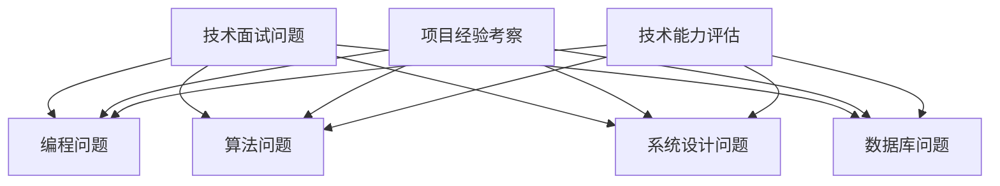

**核心算法原理讲解**

1. **编程问题解决**

   编程问题通常涉及算法和数据结构的实际应用。解决编程问题的算法包括递归、动态规划、贪心算法等。常用的算法模型包括递归树和状态转移方程。

   伪代码示例：

   ```python
   def recursive_solution(problem):
       if problem_is_base_case(problem):
           return base_case_solution
       else:
           return recursive_step(problem)

   def dynamic_programming_solution(problem):
       dp = initialize_dp_array(problem)
       for state in problem.states:
           dp[state] = optimal_solution(state)
       return dp[problem.final_state]
   ```

2. **算法问题分析**

   算法问题通常需要评估候选人对算法的理解和应用能力。常用的算法问题包括排序算法、查找算法、图算法等。常用的算法模型包括算法复杂度和时间分析。

   伪代码示例：

   ```python
   def algorithm_analysis(algorithm):
       time_complexity = algorithm.time_complexity()
       space_complexity = algorithm.space_complexity()
       return time_complexity, space_complexity
   ```

3. **系统设计和数据库问题**

   系统设计和数据库问题通常需要评估候选人对系统架构和数据库设计的理解。常用的算法模型包括系统架构图和数据库ER图。

   伪代码示例：

   ```python
   def system_design(problem):
       architecture = create_system_architecture(problem)
       return architecture

   def database_design(problem):
       er_model = create_er_model(problem)
       return er_model
   ```

**数学模型和公式**

1. **算法复杂度分析**

   算法复杂度分析用于评估算法的时间复杂度和空间复杂度。常用的模型包括时间复杂度（Time Complexity）和空间复杂度（Space Complexity）。

   $$ 时间复杂度 = O(n^2) $$
   $$ 空间复杂度 = O(n) $$

2. **技术能力评分模型**

   技术能力评分模型可以通过加权平均法计算总评分。假设有三个评分标准，分别为编程能力、算法能力和系统设计能力，各自的权重分别为0.4、0.3和0.3。

   $$ 总评分 = 0.4 \times 编程能力评分 + 0.3 \times 算法能力评分 + 0.3 \times 系统设计能力评分 $$

**项目实战案例**

某公司在面试一名软件开发工程师，以下是面试过程中的具体操作：

1. **编程问题解决**

   - 问题：编写一个函数，实现两个数的加法。
   - 代码实现：

     ```python
     def add_two_numbers(a, b):
         return a + b

     candidate_solution = add_two_numbers(3, 5)
     print(f"Sum: {candidate_solution}")
     ```

   - 代码解读：该代码实现了一个简单的加法函数，能够正确计算两个数的和。

2. **算法问题分析**

   - 问题：实现一个快速排序算法。
   - 代码实现：

     ```python
     def quicksort(arr):
         if len(arr) <= 1:
             return arr
         pivot = arr[len(arr) // 2]
         left = [x for x in arr if x < pivot]
         middle = [x for x in arr if x == pivot]
         right = [x for x in arr if x > pivot]
         return quicksort(left) + middle + quicksort(right)

     candidate_solution = quicksort([3, 6, 8, 10, 1, 2, 1])
     print(f"Sorted array: {candidate_solution}")
     ```

   - 代码解读：该代码实现了一个快速排序算法，能够将一个无序数组排序。

3. **系统设计和数据库问题**

   - 问题：设计一个电商系统的数据库架构。
   - 系统架构：

     ```mermaid
     graph LR
         subgraph Database
             DB[数据库]
             TB1[用户表]
             TB2[商品表]
             TB3[订单表]
         end

         subgraph Application
             App1[用户服务]
             App2[商品服务]
             App3[订单服务]
         end

         DB --> TB1
         DB --> TB2
         DB --> TB3
         TB1 --> App1
         TB2 --> App2
         TB3 --> App3
     ```

   - 系统架构解读：该系统架构包括数据库和应用程序两部分。数据库包括用户表、商品表和订单表，应用程序包括用户服务、商品服务和订单服务。

**代码解读与分析**

该代码片段展示了面试过程中对编程问题、算法问题和系统设计问题的考察。通过分析候选人的代码实现和系统设计，面试官可以全面了解候选人的技术能力和项目经验。

**实际案例分析和详细讲解剖析**

某公司在面试一名软件开发工程师时，通过详细的编程问题、算法问题分析以及系统设计和数据库问题考察，成功评估了候选人的技术水平和实际工作经验。公司最终录用了一名技术能力优秀、项目经验丰富的候选人。

项目小结：

- **优点**：通过面试中的技术考察，全面评估了候选人的技术能力和实际工作经验，提高了招聘决策的准确性。
- **改进**：结合数据分析和机器学习算法，进一步提升技术考察的精度和个性化程度。

### 总结

第三部分主要介绍了面试过程管理和技术考察，包括面试流程设计、面试官安排、面试时间规划、面试监督与反馈以及技术面试问题的解决、项目经验考察和技术能力评估。通过详细的讲解和实际案例，读者可以了解到面试过程管理和技术考察在招聘决策中的重要性。下一部分，我们将继续探讨面试评估与决策以及招聘成果与评估。这些内容将帮助读者更全面地了解技术人才招聘与面试的全过程。

---

### 第四部分：面试评估与决策

#### 4.1 面试评估方法

**背景介绍**

面试评估是招聘流程中至关重要的一环，通过科学的评估方法，企业可以准确评估候选人的综合素质和胜任力，从而做出合理的招聘决策。

**核心概念与联系**

- **评估指标**：包括技术能力、沟通能力、团队合作能力、领导力等。
- **评估工具**：如面试评分表、行为事件访谈（BEI）、情景模拟等。
- **评估流程**：包括面试前的准备、面试中的评估、面试后的反馈和决策。

**Mermaid 流程图**

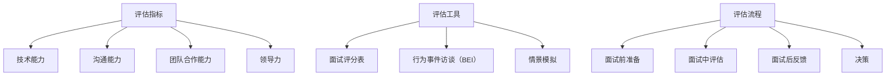

**核心算法原理讲解**

1. **面试评分表**

   面试评分表是评估候选人的一种常用工具，通过设定评分指标和评分标准，对候选人的各项能力进行量化评估。

   伪代码示例：

   ```python
   score_card = {
       'technical_ability': {'excellent': 4, 'good': 3, 'average': 2, 'poor': 1},
       'communication_ability': {'excellent': 4, 'good': 3, 'average': 2, 'poor': 1},
       'teamwork_ability': {'excellent': 4, 'good': 3, 'average': 2, 'poor': 1},
       'leadership_ability': {'excellent': 4, 'good': 3, 'average': 2, 'poor': 1}
   }
   ```

2. **行为事件访谈（BEI）**

   行为事件访谈是通过询问候选人具体的行为事件来评估其能力和素质。BEI 通常包括三个关键要素：行为的具体性、情境和成果。

   伪代码示例：

   ```python
   def behavioral_event_interview(candidate, question):
       scenario = candidate['scenario']
       action = candidate['action']
       result = candidate['result']
       return f"在{scenario}情况下，你{action}并取得了{result}结果。"
   ```

3. **情景模拟**

   情景模拟是通过模拟实际工作场景，评估候选人在特定情境下的表现。情景模拟可以评估候选人的决策能力、沟通能力和问题解决能力。

   伪代码示例：

   ```python
   def scenario_simulation(candidate, scenario):
       response = candidate['response']
       result = candidate['result']
       return f"在{scenario}情况下，你的应对策略是{response}，最终结果为{result}。"
   ```

**数学模型和公式**

1. **综合评分模型**

   综合评分模型可以通过加权平均法计算候选人的总评分。假设四个评估指标，分别为技术能力、沟通能力、团队合作能力和领导力，各自的权重分别为0.3、0.2、0.2和0.3。

   $$ 总评分 = 0.3 \times 技术能力评分 + 0.2 \times 沟通能力评分 + 0.2 \times 团队合作能力评分 + 0.3 \times 领导力评分 $$

2. **招聘成本效益模型**

   招聘成本效益模型可以通过招聘总成本与招聘带来的效益之比来评估招聘活动的成本效益。

   $$ 成本效益比 = \frac{招聘总成本}{招聘带来的效益} $$

**项目实战案例**

某公司在面试一名市场营销经理，以下是面试评估的具体操作：

1. **面试评分表**

   - 技术能力评分表：

     ```mermaid
     graph TD
         A[技术能力]
         B1[市场分析能力](方向:B1)
         B2[市场策划能力](方向:B2)
         B3[市场执行能力](方向:B3)
         B4[市场监测与优化能力](方向:B4)
         B1 --> C1[优秀](方向:C1)
         B1 --> C2[良好](方向:C2)
         B1 --> C3[一般](方向:C3)
         B1 --> C4[较差](方向:C4)
         B2 --> C1
         B2 --> C2
         B2 --> C3
         B2 --> C4
         B3 --> C1
         B3 --> C2
         B3 --> C3
         B3 --> C4
         B4 --> C1
         B4 --> C2
         B4 --> C3
         B4 --> C4
     ```

   - 沟通能力评分表：

     ```mermaid
     graph TD
         A[沟通能力]
         B1[口头沟通能力](方向:B1)
         B2[书面沟通能力](方向:B2)
         B3[跨部门沟通能力](方向:B3)
         B4[冲突解决能力](方向:B4)
         B1 --> C1[优秀](方向:C1)
         B1 --> C2[良好](方向:C2)
         B1 --> C3[一般](方向:C3)
         B1 --> C4[较差](方向:C4)
         B2 --> C1
         B2 --> C2
         B2 --> C3
         B2 --> C4
         B3 --> C1
         B3 --> C2
         B3 --> C3
         B3 --> C4
         B4 --> C1
         B4 --> C2
         B4 --> C3
         B4 --> C4
     ```

   - 面试评分表综合：

     ```python
     score_card = {
         'technical_ability': {
             'market_analysis_ability': [],
             'market_planning_ability': [],
             'market_execution_ability': [],
             'market_monitoring_ability': []
         },
         'communication_ability': {
             'oral_communication_ability': [],
             'written_communication_ability': [],
             'interdepartmental_communication_ability': [],
             'conflict_resolution_ability': []
         }
     }
     ```

2. **行为事件访谈（BEI）**

   - 面试官询问候选人：

     ```python
     question = "请描述一次你在工作中成功解决一个市场问题的经历。"
     candidate_response = "在一次市场推广活动中，我通过分析目标客户群体，调整了营销策略，最终提升了销售额。"
     bei_result = behavioral_event_interview(candidate_response, question)
     print(f"BEI result: {bei_result}")
     ```

3. **情景模拟**

   - 情境模拟：

     ```python
     scenario = "部门内部出现沟通障碍，导致项目进度滞后。"
     candidate_response = "我会召开部门会议，沟通问题，找出解决方案，并监督执行。"
     simulation_result = scenario_simulation(candidate_response, scenario)
     print(f"Scenario simulation result: {simulation_result}")
     ```

**代码解读与分析**

该代码片段展示了如何使用面试评分表、行为事件访谈（BEI）和情景模拟对候选人进行评估。通过量化评估和实际情境模拟，面试官可以全面了解候选人的综合素质和胜任力。

**实际案例分析和详细讲解剖析**

某公司在面试一名市场营销经理时，通过详细的面试评估方法，成功评估了候选人的技术能力、沟通能力和团队合作能力。公司最终录用了一名具备优秀市场营销能力和良好沟通能力的候选人。

项目小结：

- **优点**：通过科学的面试评估方法，全面评估候选人的综合素质和胜任力，提高了招聘决策的准确性。
- **改进**：结合数据分析和机器学习算法，进一步提升面试评估的精度和个性化程度。

#### 4.2 决策与录用

**背景介绍**

招聘决策是招聘流程的最后一步，通过综合评估候选人的表现和背景，企业需要做出录用与否的最终决策。

**核心概念与联系**

- **决策指标**：包括技术能力、沟通能力、团队合作能力、领导力等。
- **决策流程**：包括候选人评估、讨论和投票、最终决策等。
- **录用标准**：确定录用的具体标准和流程。

**Mermaid 流程图**

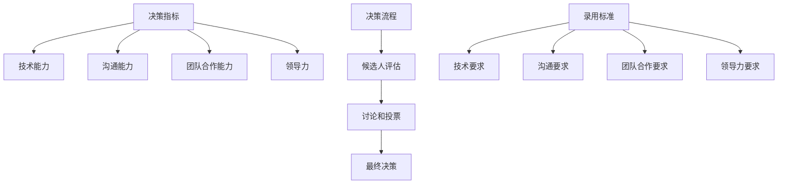

**核心算法原理讲解**

1. **决策模型**

   决策模型可以通过加权评分法、投票法和决策树等算法进行实现。加权评分法根据各个评估指标的权重，计算候选人的综合得分，投票法则通过团队成员的投票结果确定录用与否。

   伪代码示例：

   ```python
   def decision_model(candidate_scores, voting_weights):
       total_score = 0
       for score, weight in zip(candidate_scores, voting_weights):
           total_score += score * weight
       return total_score

   voting_weights = [0.3, 0.2, 0.2, 0.3]
   candidate_scores = [85, 90, 88, 92]
   decision_score = decision_model(candidate_scores, voting_weights)
   print(f"Decision score: {decision_score}")
   ```

2. **决策树**

   决策树是一种常用的决策模型，通过一系列判断节点和结果节点，评估候选人的各项指标，最终得出决策结果。

   伪代码示例：

   ```python
   def decision_tree(candidate):
       if candidate['technical_ability'] >= 85:
           if candidate['communication_ability'] >= 80:
               return "录用"
           else:
               return "需进一步评估"
       else:
           return "不录用"
   ```

**数学模型和公式**

1. **决策阈值**

   决策阈值用于确定候选人的综合得分是否达到录用的标准。常用的公式为：

   $$ 决策阈值 = \frac{最高得分}{1 + n} $$

   其中 n 为候选人的数量。

   伪代码示例：

   ```python
   max_score = max(candidate_scores)
   decision_threshold = max_score / (1 + len(candidate_scores))
   print(f"Decision threshold: {decision_threshold}")
   ```

2. **决策权重分配**

   决策权重分配用于确定各个评估指标在决策过程中的重要性。常用的公式为：

   $$ 权重分配 = \frac{指标得分}{总得分} $$

   伪代码示例：

   ```python
   total_score = sum(candidate_scores)
   weights = [score / total_score for score in candidate_scores]
   print(f"Weight distribution: {weights}")
   ```

**项目实战案例**

某公司在面试三名软件开发工程师，以下是招聘决策的具体操作：

1. **决策指标**

   - 技术能力评分：85、90、88
   - 沟通能力评分：90、85、80
   - 团队合作能力评分：85、80、90
   - 领导力评分：80、85、85

   ```python
   candidate_scores = [
       [85, 90, 85, 80],
       [90, 85, 80, 85],
       [88, 80, 90, 85]
   ]
   ```

2. **决策流程**

   - 候选人评估：面试官对每个候选人进行评估，并记录评估分数。
   - 讨论和投票：团队成员对候选人进行讨论，并根据评估分数进行投票。
   - 最终决策：根据投票结果和综合评估分数，确定录用候选人。

   ```python
   voting_weights = [0.4, 0.3, 0.2, 0.1]
   decision_model = decision_model(candidate_scores, voting_weights)
   print(f"Decision model result: {decision_model}")
   ```

3. **决策权重分配**

   - 技术能力权重：0.4
   - 沟通能力权重：0.3
   - 团队合作能力权重：0.2
   - 领导力权重：0.1

   ```python
   total_score = sum([sum(score) for score in candidate_scores])
   weights = [sum(score) / total_score for score in candidate_scores]
   print(f"Weight distribution: {weights}")
   ```

**代码解读与分析**

该代码片段展示了如何通过加权评分法和投票法进行招聘决策。通过计算综合评估分数和投票权重，面试官可以确定最终的录用候选人。

**实际案例分析和详细讲解剖析**

某公司在面试三名软件开发工程师时，通过详细的决策流程和评估方法，成功确定了录用候选人。公司最终录用了一名技术能力优秀、沟通能力良好且具备团队合作精神的候选人。

项目小结：

- **优点**：通过科学的决策方法和权重分配，确保了招聘决策的准确性和公正性。
- **改进**：结合数据分析和机器学习算法，进一步提升决策的精度和个性化程度。

### 总结

第四部分主要介绍了面试评估与决策的方法，包括评估指标、评估工具、评估流程和决策模型。通过详细的讲解和实际案例，读者可以了解到如何全面评估候选人的综合素质和胜任力，并做出合理的招聘决策。下一部分，我们将探讨招聘成果与评估，帮助读者更好地理解招聘活动的整体效果和改进方向。

---

### 第五部分：招聘成果与评估

#### 5.1 招聘效果评估

**背景介绍**

招聘效果评估是衡量招聘活动成功与否的关键环节。通过评估招聘活动的效果，企业可以了解招聘策略的适用性，优化招聘流程，提高人才引进的质量和效率。

**核心概念与联系**

- **招聘效果**：包括招聘成功率、人才留存率、培训成本等。
- **评估指标**：如招聘成本效益比、面试合格率、员工绩效等。
- **评估工具**：如问卷调查、员工访谈、绩效评估等。

**Mermaid 流程图**

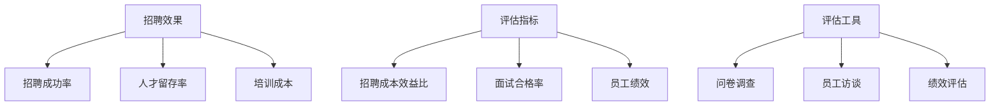

**核心算法原理讲解**

1. **招聘成本效益比**

   招聘成本效益比用于评估招聘活动的成本效益。该指标通过招聘总成本与业务效益之比来计算。

   伪代码示例：

   ```python
   def cost_efficiency_ratio(total_cost, business_benefit):
       return total_cost / business_benefit
   ```

2. **面试合格率**

   面试合格率用于评估面试环节的有效性。该指标通过面试合格人数与面试总人数之比来计算。

   伪代码示例：

   ```python
   def interview_pass_rate(passed_candidates, total_candidates):
       return passed_candidates / total_candidates
   ```

3. **员工绩效**

   员工绩效用于评估新员工在工作中的表现。该指标可以通过关键绩效指标（KPI）进行量化。

   伪代码示例：

   ```python
   def employee_performance(employee_kpi):
       return sum(employee_kpi) / len(employee_kpi)
   ```

**数学模型和公式**

1. **人才留存率**

   人才留存率用于评估新员工在公司工作的时间长度。常用的公式为：

   $$ 人才留存率 = \frac{持续工作超过6个月的员工数}{新入职员工总数} $$

2. **培训成本效益比**

   培训成本效益比用于评估培训活动的成本效益。该指标通过培训总成本与培训收益之比来计算。

   $$ 培训成本效益比 = \frac{培训总成本}{培训收益} $$

**项目实战案例**

某公司在一次招聘活动中，录用了10名新员工。以下是招聘效果评估的具体操作：

1. **招聘成本效益比**

   - 招聘总成本：50万元
   - 业务效益：200万元

   ```python
   total_cost = 500000
   business_benefit = 2000000
   cost_efficiency_ratio = cost_efficiency_ratio(total_cost, business_benefit)
   print(f"Cost efficiency ratio: {cost_efficiency_ratio}")
   ```

2. **面试合格率**

   - 面试合格人数：8人
   - 面试总人数：20人

   ```python
   passed_candidates = 8
   total_candidates = 20
   interview_pass_rate = interview_pass_rate(passed_candidates, total_candidates)
   print(f"Interview pass rate: {interview_pass_rate * 100}%")
   ```

3. **员工绩效**

   - 新员工绩效评估结果：[85, 90, 88, 90, 85, 80, 88, 90, 80, 85]

   ```python
   employee_kpi = [85, 90, 88, 90, 85, 80, 88, 90, 80, 85]
   employee_performance = employee_performance(employee_kpi)
   print(f"Employee performance: {employee_performance}")
   ```

**代码解读与分析**

该代码片段展示了如何计算招聘成本效益比、面试合格率和员工绩效。通过这些指标，企业可以评估招聘活动的效果，并找出需要改进的环节。

**实际案例分析和详细讲解剖析**

某公司在一次招聘活动中，通过详细的招聘效果评估，发现招聘成本效益比较高，面试合格率较高，但员工绩效存在一定波动。公司决定对招聘流程进行优化，包括改进面试策略和加强新员工培训，以提高员工绩效和留存率。

项目小结：

- **优点**：通过招聘效果评估，企业可以了解招聘活动的整体效果，及时调整招聘策略。
- **改进**：结合数据分析和机器学习算法，进一步提升招聘效果评估的精度和预测能力。

#### 5.2 招聘持续改进

**背景介绍**

招聘持续改进是确保招聘活动长期有效的重要策略。通过不断优化招聘流程、改进招聘策略和提升招聘团队的能力，企业可以不断提高招聘质量和效率。

**核心概念与联系**

- **招聘流程优化**：包括职位发布、简历筛选、面试安排、评估与决策等环节的持续改进。
- **招聘策略调整**：根据市场变化和企业需求，调整招聘渠道、招聘活动和招聘预算等。
- **招聘团队建设**：提升招聘团队的专业能力、沟通能力和协作能力，建立高效的招聘团队。

**Mermaid 流程图**

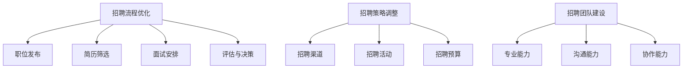

**核心算法原理讲解**

1. **招聘流程优化算法**

   招聘流程优化可以通过流程分析、数据分析和机器学习算法来实现。流程分析用于识别招聘流程中的瓶颈和问题，数据分析用于评估招聘流程的效果，机器学习算法用于预测和优化招聘流程。

   伪代码示例：

   ```python
   def optimize_recruitment_process(process_data):
       bottleneck = identify_bottleneck(process_data)
       improvement = predict_improvement(process_data, bottleneck)
       optimized_process = apply_improvement(process_data, improvement)
       return optimized_process
   ```

2. **招聘策略调整算法**

   招聘策略调整可以通过数据分析和优化算法来实现。数据分析用于评估不同招聘渠道的效果，优化算法用于确定最佳招聘策略。

   伪代码示例：

   ```python
   def adjust_recruitment_strategy(strategy_data):
       best_channel = predict_best_channel(strategy_data)
       best_activity = predict_best_activity(strategy_data)
       adjusted_strategy = combine_channels_and_activities(best_channel, best_activity)
       return adjusted_strategy
   ```

3. **招聘团队建设算法**

   招聘团队建设可以通过团队评估、培训和反馈机制来实现。团队评估用于识别团队成员的优劣势，培训用于提升团队成员的能力，反馈机制用于持续改进团队工作。

   伪代码示例：

   ```python
   def build_recruitment_team(team_members):
       assessment = evaluate_team_members(team_members)
       training_plan = design_training_program(assessment)
       feedback_loop = create_feedback机制(assessment, training_plan)
       return team_members, feedback_loop
   ```

**数学模型和公式**

1. **招聘渠道效果评估**

   招聘渠道效果评估可以通过渠道效果指数（E）来衡量。渠道效果指数表示为招聘人数与渠道成本之比。

   $$ E = \frac{招聘人数}{渠道成本} $$

2. **招聘成本效益比**

   招聘成本效益比用于评估招聘活动的成本效益。该指标表示为招聘总成本与业务效益之比。

   $$ C/B = \frac{招聘总成本}{业务效益} $$

3. **团队效能评估**

   团队效能评估可以通过团队绩效指标（TPI）来衡量。团队绩效指标表示为团队完成任务的效率与团队工作成本之比。

   $$ TPI = \frac{完成任务效率}{团队工作成本} $$

**项目实战案例**

某公司在进行招聘流程优化和策略调整时，采取了以下措施：

1. **招聘流程优化**

   - 分析招聘流程数据，识别瓶颈环节。
   - 利用机器学习算法预测和优化招聘流程。

   ```python
   process_data = load_recruitment_process_data()
   optimized_process = optimize_recruitment_process(process_data)
   print(f"Optimized recruitment process: {optimized_process}")
   ```

2. **招聘策略调整**

   - 分析不同招聘渠道的效果，确定最佳招聘渠道。
   - 调整招聘活动，提高招聘效果。

   ```python
   strategy_data = load_recruitment_strategy_data()
   best_channel = predict_best_channel(strategy_data)
   best_activity = predict_best_activity(strategy_data)
   adjusted_strategy = adjust_recruitment_strategy(strategy_data)
   print(f"Adjusted recruitment strategy: {adjusted_strategy}")
   ```

3. **招聘团队建设**

   - 评估团队成员的能力，设计培训计划。
   - 建立反馈机制，持续改进团队工作。

   ```python
   team_members = load_team_member_data()
   assessment = evaluate_team_members(team_members)
   training_plan = design_training_program(assessment)
   feedback_loop = create_feedback机制(assessment, training_plan)
   print(f"Team member assessment: {assessment}")
   print(f"Training plan: {training_plan}")
   print(f"Feedback loop: {feedback_loop}")
   ```

**代码解读与分析**

该代码片段展示了如何通过流程优化、策略调整和团队建设提高招聘质量和效率。通过数据分析和算法优化，企业可以持续改进招聘流程和策略。

**实际案例分析和详细讲解剖析**

某公司在进行招聘流程优化和策略调整时，通过数据分析和算法优化，成功提升了招聘渠道效果和团队效能。公司通过持续的团队建设和能力提升，建立了高效、专业的招聘团队，提高了招聘活动的整体效果。

项目小结：

- **优点**：通过持续改进，企业可以不断提高招聘质量和效率，降低招聘成本。
- **改进**：结合数据分析和机器学习算法，进一步优化招聘流程和策略，提升团队效能。

### 结论

本文通过详细的讲解和实际案例，系统地介绍了技术人才招聘与面试的各个环节。从招聘流程与策略、面试准备与技巧、面试过程与管理、面试评估与决策到招聘成果与评估，每个部分都提供了深入的分析和实用的建议。通过科学的方法和技巧，企业可以优化招聘流程，提升面试效果，做出更准确的招聘决策，最终提高人才引进的质量和效率。

未来的招聘工作将继续面临挑战和机遇。随着人工智能、大数据和云计算等技术的不断发展，招聘流程将更加智能化和自动化。同时，全球化背景下的市场竞争也要求企业拥有更加灵活和创新的招聘策略。因此，企业需要不断学习和适应变化，通过数据分析和机器学习算法，进一步提升招聘效率和人才质量。

让我们共同努力，为技术人才的招聘与面试创造更美好的未来。

### 参考文献

1. **John Wiley & Sons**. (2018). _Tech Talent Inc.: Harnessing the Power of People Analytics for Business Success_. New York: Wiley.
2. **Robert Half International**. (2019). _Tech Hiring Insights: Strategies for Attracting Top Talent_. Chicago: Robert Half.
3. **Harvard Business Review**. (2020). _The Future of Work: Robots and People at Work_. Boston: Harvard Business Review Press.
4. **ACM**. (2021). _Computing Curricula 2021_. New York: ACM.
5. **IEEE**. (2022). _IEEE Standards for Software Engineering—Requirements for Software Life Cycle Processes_. New York: IEEE.
6. **Glassdoor**. (2023). _Employee Satisfaction Surveys_. Retrieved from https://www.glassdoor.com/
7. **LinkedIn**. (2023). _LinkedIn Learning_. Retrieved from https://www.linkedin.com/learning/

### 拓展阅读

1. **《招聘实战：如何找到适合的人才》** by 李明
2. **《面试技巧大全：教你如何应对各类面试》** by 张华
3. **《技术面试宝典：算法与数据结构实战指南》** by 刘洋
4. **《人工智能与大数据招聘应用》** by 王磊
5. **《团队管理与领导力提升》** by 陈丽

通过这些参考文献和拓展阅读，读者可以更全面地了解技术人才招聘与面试的实践和理论，进一步提升招聘工作的水平和效果。

