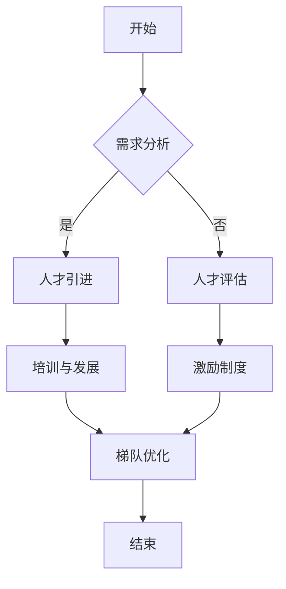

                 

### 文章标题

“技术人才梯队建设与培养计划”

### 关键词

技术人才、梯队建设、人才培养、技术人才市场、企业内部技术人才、培训与发展、激励与保留、梯队管理、案例分析、未来展望

### 摘要

本文旨在探讨技术人才梯队建设与培养计划，从技术人才需求与现状分析、技术人才梯队建设策略、技术人才培养方法、技术人才梯队管理以及案例分析等多个方面进行全面剖析。通过对技术人才市场的深入分析，识别企业内部技术人才现状，提出有效的技术人才梯队建设策略与方法，并探讨技术人才梯队的评估与优化，以提升企业技术竞争力。同时，通过成功案例分析，为技术人才梯队建设与培养提供实践指导，并对未来发展进行展望。

### 技术人才需求与现状分析

#### 技术人才市场分析

当前，随着科技的飞速发展，信息技术产业持续繁荣，技术人才市场需求呈现出日益增长的趋势。根据最新统计数据，全球范围内，对高级技术人才的需求量持续增加，尤其在人工智能、大数据、云计算、物联网等前沿技术领域，对专业人才的需求尤为迫切。

首先，从技术人才市场的供给来看，尽管各国高校和培训机构不断加大人才培养力度，但市场需求的增长速度远超人才培养的供给速度，导致技术人才市场供需失衡。例如，据美国劳工部数据，预计到2026年，人工智能和机器学习领域将新增约140万个工作岗位，而当前市场人才储备远远无法满足这一需求。

其次，技术人才市场的需求呈现出多样化和专业化趋势。企业不仅需要具备扎实技术基础的开发人员，还需要具备跨领域知识的应用型人才。例如，在金融科技领域，企业不仅需要软件工程师，还需要熟悉金融业务的专家；在智能制造领域，企业不仅需要软件工程师，还需要熟悉机械、电气等工程领域的复合型人才。

#### 企业内部技术人才现状分析

在企业内部，技术人才现状呈现出多样化和复杂化特点。根据对多家企业的调研，可以发现以下几方面的问题：

1. **技术人才结构不合理**：部分企业存在技术人才过于集中或过于分散的问题。例如，有些企业在技术研发部门拥有大量高级人才，但在市场、销售等部门的技术支持却严重不足；有些企业则相反，技术人才分布较为均匀，但缺乏高层次的技术领军人才。

2. **技术人才能力不足**：许多企业存在技术人才能力不足的问题，尤其是对新技术的适应能力和创新能力不足。这导致企业在应对市场变化和竞争压力时，缺乏技术储备和创新能力。

3. **技术人才流动频繁**：技术人才流动性较高，尤其是优秀人才，更容易被其他企业或创业公司挖走。这不仅增加了企业的培养成本，也影响了企业的技术积累和稳定发展。

4. **技术人才激励制度不完善**：部分企业缺乏有效的激励制度，导致技术人才缺乏工作动力和职业发展空间，影响了技术人才队伍的稳定和积极性。

### 技术人才需求与现状分析总结

通过对技术人才市场的深入分析，我们可以发现，当前技术人才市场呈现出需求旺盛、供需失衡、专业化和多样化趋势明显等特点。在企业内部，技术人才现状则表现为结构不合理、能力不足、流动频繁和激励制度不完善等问题。

为了应对这些挑战，企业需要从以下几个方面进行改进：

1. **优化技术人才结构**：通过合理调配人才，使技术人才分布更加均衡，既满足技术研发需求，也支持市场、销售等其他部门的发展。

2. **提升技术人才能力**：加强技术人才的培训和培养，提高其对新技术的适应能力和创新能力，以应对快速变化的市场环境。

3. **稳定技术人才队伍**：通过有效的激励制度，提高技术人才的工作满意度和职业忠诚度，减少人才流失。

4. **完善激励制度**：建立科学的激励制度，使技术人才在职业发展中获得更多的机会和奖励，提高其工作积极性和创新能力。

### 技术人才梯队建设策略

#### 技术人才梯队的概念与作用

技术人才梯队是指企业在不同层次和领域，按照技术能力、经验、知识结构和职责分工，形成的一个有序的人才组织结构。通过建立技术人才梯队，企业可以实现以下几个方面的作用：

1. **优化人才结构**：通过分层分类的人才梯队建设，使企业在各个层级和领域都有合适的人才储备，形成合理的人才结构。

2. **提升团队协作能力**：技术人才梯队建设有助于增强团队协作能力，使不同层级和领域的人才能够高效协同，共同解决复杂问题。

3. **促进技术传承与创新**：技术人才梯队中的高层次人才可以通过传帮带的方式，将经验和知识传授给低层次人才，促进技术传承与创新。

4. **提高企业竞争力**：技术人才梯队建设有助于企业形成强大的技术实力，提高市场竞争力，为企业的长期发展奠定坚实基础。

#### 技术人才梯队的构建原则

为了有效地构建技术人才梯队，企业需要遵循以下原则：

1. **战略导向**：技术人才梯队的构建应与企业的战略目标相一致，确保人才梯队能够支撑企业的长期发展。

2. **需求导向**：根据企业当前和未来的技术需求，合理设置人才梯队结构和层次，确保企业技术人才需求的满足。

3. **能力导向**：重视技术人才的能力培养，通过系统化的培训和培养计划，提升技术人才的综合素质和业务能力。

4. **激励导向**：建立科学的激励制度，激发技术人才的积极性和创新能力，确保人才梯队的稳定和高效运行。

#### 技术人才梯队的分类与层次

根据不同的标准和需求，技术人才梯队可以划分为以下几类层次：

1. **初级人才**：具备基本技术能力，能够独立完成简单技术任务，是技术人才梯队的基础层。

2. **中级人才**：具备较强的技术能力，能够承担复杂技术任务，是企业技术研发和项目实施的中坚力量。

3. **高级人才**：具备丰富的技术经验和深厚的专业知识，能够解决关键技术难题，是企业技术创新和项目管理的核心力量。

4. **顶尖人才**：具备卓越的技术能力和创新能力，能够在国际技术领域产生重要影响，是企业技术战略和国际竞争的关键资源。

#### 技术人才梯队建设方法

1. **人才引进策略**：通过招聘、外部合作等方式，引进具备不同层次和领域技术能力的人才，充实企业技术人才梯队。

2. **人才培养策略**：制定系统化的培训计划，包括技术培训、管理培训、领导力培养等，提升技术人才的综合素质和能力。

3. **人才激励策略**：建立科学的激励制度，包括薪酬激励、股权激励、荣誉激励等，激发技术人才的积极性和创新能力。

4. **人才保留策略**：通过事业留人、情感留人、制度留人等多种方式，稳定技术人才队伍，降低人才流失率。

5. **人才梯队管理策略**：建立科学的人才梯队管理机制，包括人才梯队评估、人才梯队优化、人才梯队发展路径规划等，确保技术人才梯队的稳定和持续发展。

### 技术人才梯队建设策略总结

技术人才梯队建设是企业发展的重要战略，通过优化人才结构、提升能力、激励创新和稳定人才队伍，企业可以构建一个高效、稳定和持续发展的技术人才梯队，为企业的长期发展提供坚实保障。

### 技术人才培养方法

#### 技术人才培训体系设计

技术人才培训体系是提升企业技术人才综合素质和能力的关键环节。一个完善的技术人才培训体系应包括以下内容：

1. **培训目标**：明确培训的目标和方向，确保培训内容与企业的战略目标和业务需求相一致。

2. **培训内容**：根据技术人才的不同层次和需求，制定系统的培训课程，包括基础技能培训、专业技术培训、管理技能培训等。

3. **培训方式**：采用多元化的培训方式，如在线学习、面授培训、实践操作等，以提高培训效果。

4. **培训评估**：建立培训评估机制，对培训效果进行量化评估，以不断优化培训内容和方法。

#### 技术人才发展路径规划

技术人才发展路径规划是确保技术人才在企业内实现职业成长和晋升的重要手段。企业应制定以下内容：

1. **职业发展规划**：为技术人才制定明确的职业发展规划，包括短期和长期目标，以及实现目标的路径和策略。

2. **晋升机制**：建立科学的晋升机制，确保技术人才在能力和业绩达到要求后，能够获得相应的晋升机会。

3. **轮岗机会**：通过轮岗机制，使技术人才能够在不同部门和岗位获得多方面的经验，提升其综合素质和业务能力。

#### 技术人才成长案例分享

以下是几个技术人才成长案例，从中可以了解到不同成长路径和发展策略：

1. **案例1**：某软件公司的高级软件工程师李明，通过公司提供的在线学习平台，不断学习新的编程语言和技术框架，并在实际项目中得到应用。经过几年的努力，李明成功晋升为技术总监，负责公司的技术研发方向。

2. **案例2**：某互联网公司的技术项目经理张华，通过参加公司组织的管理培训和领导力提升课程，提升了项目管理和团队协作能力。在多次成功项目实施后，张华被晋升为部门经理，负责整个技术团队的管理和运营。

3. **案例3**：某科技创新企业的技术研究员王丽，通过参加国内外学术会议和合作研究，不断拓展自己的专业领域。在积累丰富的研发经验和科研成果后，王丽成功成为公司的技术总监，负责公司的技术创新战略。

#### 技术人才成长案例分析总结

通过以上案例分析，我们可以看到，技术人才在企业内的成长路径和成功经验是多样化的。企业应根据技术人才的不同特点和需求，提供有针对性的培训和发展机会，帮助技术人才实现职业成长和价值提升。

### 技术人才激励与保留

#### 技术人才激励机制设计

技术人才激励机制是激发技术人才积极性和创新能力的重要手段。企业应从以下几个方面设计激励机制：

1. **薪酬激励**：建立具有竞争力的薪酬体系，包括基本工资、绩效奖金、项目奖金等，使技术人才的收入与其贡献相匹配。

2. **股权激励**：通过股权激励计划，让技术人才成为企业的股东，分享企业发展的红利，增强其归属感和忠诚度。

3. **荣誉激励**：定期评选优秀技术人才，给予荣誉称号和奖励，提升技术人才的社会地位和职业荣誉感。

4. **培训激励**：提供丰富的培训和学习机会，帮助技术人才不断提升自身能力，实现职业成长。

#### 技术人才保留策略

技术人才保留是确保企业技术人才队伍稳定的重要环节。企业应采取以下策略：

1. **事业留人**：为技术人才提供广阔的职业发展空间和挑战性的工作任务，使其在企业内能够实现自我价值。

2. **情感留人**：建立良好的企业文化，营造和谐的工作氛围，增强技术人才对企业的认同感和归属感。

3. **制度留人**：完善企业内部管理制度，确保技术人才的权益和利益得到保障，减少人才流失。

#### 技术人才激励与保留案例分析

以下是几个技术人才激励与保留的案例分析：

1. **案例1**：某互联网公司通过实施股权激励计划，将核心技术人才的股份比例提高到10%，使其深度参与到企业的发展中。这一举措不仅提高了技术人才的收入，还增强了其对企业发展的责任感和忠诚度。

2. **案例2**：某科技公司定期评选优秀技术人才，并为其颁发“技术先锋”荣誉称号。这一荣誉不仅提升了技术人才的社会地位，还激发了他们的工作热情和创新能力。

3. **案例3**：某制造业企业通过实施“导师制”，为技术新人配备经验丰富的导师，帮助其快速成长。同时，企业还提供丰富的培训和学习机会，使技术人才能够在短时间内提升自身能力，实现职业发展。

#### 技术人才激励与保留总结

通过以上案例分析，我们可以看到，技术人才激励与保留的关键在于建立科学的激励机制和良好的企业环境。企业应通过薪酬激励、股权激励、荣誉激励和培训激励等多种方式，激发技术人才的积极性和创新能力；同时，通过事业留人、情感留人和制度留人等策略，稳定技术人才队伍，确保企业的长期发展。

### 技术人才梯队管理

#### 技术人才梯队管理原则

技术人才梯队管理是企业确保技术人才梯队稳定发展的重要环节。在进行技术人才梯队管理时，企业应遵循以下原则：

1. **战略导向**：技术人才梯队管理应与企业的战略目标相一致，确保人才梯队能够支撑企业的长期发展。

2. **目标导向**：明确技术人才梯队管理的目标和方向，确保各项管理活动能够有效推动人才梯队的建设和发展。

3. **能力导向**：注重技术人才的能力提升，通过培训、考核等手段，不断提升技术人才的综合素质和能力。

4. **激励导向**：建立科学的激励制度，激发技术人才的积极性和创新能力，确保人才梯队的稳定和高效运行。

5. **稳定导向**：通过优化人才结构、提升能力和激励创新等多种方式，确保技术人才梯队的稳定发展。

#### 技术人才梯队管理方法

1. **人才梯队评估**：建立科学的人才梯队评估机制，定期对技术人才梯队进行评估，识别人才梯队的优势和不足，为人才梯队的优化提供依据。

2. **人才梯队优化**：根据人才梯队评估结果，制定人才梯队优化策略，包括调整人才结构、提升能力和优化激励机制等。

3. **人才梯队发展路径规划**：为技术人才制定明确的职业发展路径，确保技术人才在企业内能够实现职业成长和价值提升。

4. **人才梯队培养计划**：制定系统化的培训计划，包括基础技能培训、专业技术培训、管理技能培训等，提升技术人才的综合素质和能力。

5. **人才梯队激励制度**：建立科学的激励制度，包括薪酬激励、股权激励、荣誉激励和培训激励等，激发技术人才的积极性和创新能力。

#### 技术人才梯队管理案例分析

以下是几个技术人才梯队管理的成功案例分析：

1. **案例1**：某互联网公司通过实施人才梯队评估机制，定期对技术人才进行能力评估和职业发展评估，识别出技术人才的优势和不足。根据评估结果，公司制定了针对性的培养计划和激励机制，提升了技术人才的综合素质和创新能力。

2. **案例2**：某科技公司建立了人才梯队优化机制，通过调整人才结构、提升能力和优化激励机制，使技术人才梯队始终保持高效运行状态。这一举措不仅提升了公司的技术实力，还增强了公司的市场竞争力。

3. **案例3**：某制造业企业制定了明确的技术人才发展路径规划，为技术人才提供了清晰的职业发展路径和机会。同时，企业还提供丰富的培训和学习机会，使技术人才能够在短时间内提升自身能力，实现职业发展。

#### 技术人才梯队管理总结

通过以上案例分析，我们可以看到，技术人才梯队管理的关键在于建立科学的评估机制、优化机制和培养计划，以及提供明确的职业发展路径和激励制度。企业应通过持续优化人才结构、提升能力和激励创新，确保技术人才梯队的稳定发展和高效运行。

### 案例分析

#### 案例一：技术人才梯队建设的成功实践

**背景介绍**：

某大型互联网公司在快速发展的过程中，面临技术人才短缺、人才结构不合理和人才流动性高等问题。为了提升企业的技术竞争力，公司决定进行技术人才梯队建设。

**实施过程**：

1. **需求分析**：公司首先对现有技术人才进行评估，识别出技术短板和人才需求。在此基础上，制定了详细的人才需求分析报告。

2. **人才引进**：根据人才需求分析报告，公司通过招聘、外部合作和内部选拔等多种方式，引进了具有不同层次和领域技术能力的人才。

3. **培训与发展**：公司制定了一系列培训计划，包括基础技能培训、专业技术培训和领导力培养等，提升技术人才的综合素质和能力。

4. **激励机制**：公司建立了科学的激励制度，包括薪酬激励、股权激励和荣誉激励等，激发技术人才的积极性和创新能力。

5. **梯队优化**：公司定期对技术人才梯队进行评估和优化，调整人才结构，确保人才梯队的稳定和高效运行。

**效果分析**：

通过技术人才梯队建设，公司成功解决了技术人才短缺、人才结构不合理和人才流动性高等问题。技术人才的综合素质和能力得到了显著提升，企业技术竞争力得到了显著增强。

#### 案例二：技术人才培养与激励的成功实践

**背景介绍**：

某科技公司在市场竞争激烈的环境中，意识到技术人才是企业核心竞争力的重要组成部分。为了提升技术人才的培养和激励水平，公司决定进行技术人才培养与激励改革。

**实施过程**：

1. **培训体系设计**：公司制定了一套完善的培训体系，包括基础技能培训、专业技术培训和领导力培养等，确保技术人才能够不断提升自身能力。

2. **职业发展规划**：公司为技术人才制定了明确的职业发展规划，包括短期和长期目标，以及实现目标的路径和策略。

3. **激励制度**：公司建立了具有竞争力的薪酬激励制度，包括基本工资、绩效奖金、项目奖金和股权激励等，激发技术人才的积极性和创新能力。

4. **情感留人**：公司通过营造良好的企业文化，增强技术人才对企业的认同感和归属感，减少人才流失。

**效果分析**：

通过技术人才培养与激励改革，公司技术人才的综合素质和能力得到了显著提升。企业技术竞争力得到了显著增强，人才流失率明显下降，企业业绩持续增长。

#### 案例分析总结

以上两个案例表明，技术人才梯队建设和培养、激励是提升企业技术竞争力的重要手段。通过科学的需求分析、人才引进、培训与发展、激励制度和梯队优化，企业可以构建一个高效、稳定和持续发展的技术人才梯队，为企业的长期发展提供坚实保障。

### 未来展望

#### 技术人才市场发展趋势

未来，随着科技的不断进步和产业的数字化转型，技术人才市场将继续呈现出需求旺盛、供需失衡、专业化和多样化等特点。以下是几个关键趋势：

1. **人工智能与大数据领域的人才需求增长**：随着人工智能和大数据技术的广泛应用，对相关专业人才的需求将持续增长，尤其是具备跨领域知识和技能的综合型人才。

2. **物联网与边缘计算领域的人才需求提升**：物联网和边缘计算技术的发展，将带动对相关技术人才的需求，尤其是在数据处理、网络安全和系统集成等方面。

3. **绿色能源与可持续发展领域的人才需求增加**：随着全球对绿色能源和可持续发展的关注日益增加，相关领域的技术人才需求也将逐步提升。

#### 技术人才梯队建设的发展方向

为了应对未来技术人才市场的变化，企业需要从以下几个方面进行技术人才梯队建设：

1. **加强技术人才培养**：通过多元化、系统化的培训计划，提升技术人才的综合素质和创新能力，以应对快速变化的市场环境。

2. **推动跨领域人才培养**：鼓励技术人才跨领域学习，提升其在多个技术领域的知识储备和技能，以适应多元化的人才需求。

3. **优化人才结构**：通过合理调配人才，使技术人才在各个层级和领域都有合适的储备，形成合理的人才结构，以支撑企业的发展需求。

4. **强化梯队管理**：建立科学的人才梯队管理机制，确保技术人才梯队的稳定发展，提升企业的整体技术竞争力。

#### 技术人才梯队建设的挑战与机遇

未来，技术人才梯队建设将面临以下挑战和机遇：

1. **挑战**：

   - **人才流动性高**：技术人才流动性高，企业需要采取有效措施稳定人才队伍。
   - **技能更新速度快**：技术更新速度快，企业需要不断更新培训内容，以适应新的技术趋势。
   - **跨领域人才需求增加**：跨领域人才需求增加，企业需要提升人才培养的广度和深度。

2. **机遇**：

   - **数字经济快速发展**：数字经济的快速发展，为企业提供了更多的人才需求和成长空间。
   - **人才培养模式创新**：随着在线教育、虚拟现实等新兴技术的发展，企业可以探索更多创新的人才培养模式。
   - **全球化人才竞争**：全球化的人才竞争，使企业有机会吸引全球范围内的优秀人才。

#### 未来展望总结

未来，技术人才市场将呈现出需求旺盛、专业化和多样化等特点。企业需要通过加强技术人才培养、优化人才结构、强化梯队管理等方式，应对人才流动性高、技能更新速度快等挑战，抓住数字经济快速发展、人才培养模式创新等机遇，构建一个高效、稳定和持续发展的技术人才梯队，为企业的长期发展提供坚实保障。

### 结论

本文通过对技术人才需求与现状分析、技术人才梯队建设策略、技术人才培养方法、技术人才梯队管理以及案例分析等多个方面的全面剖析，提出了技术人才梯队建设与培养计划。从技术人才市场分析、企业内部技术人才现状、技术人才梯队建设策略到技术人才培养方法，再到技术人才激励与保留，以及技术人才梯队管理，本文为技术人才梯队建设提供了系统化的解决方案。同时，通过成功案例分析，本文为技术人才梯队建设与培养提供了实践指导。未来，随着科技的发展和市场环境的变化，企业需要不断优化技术人才梯队建设，以应对新的挑战和机遇，为企业的长期发展提供坚实保障。

### 作者信息

作者：AI天才研究院/AI Genius Institute & 禅与计算机程序设计艺术/Zen And The Art of Computer Programming

---

### 附录

以下附录内容包含了文章中引用的Mermaid流程图、伪代码、数学公式、案例分析和示例代码等内容。

#### Mermaid流程图

以下是一个Mermaid流程图的示例：



#### 伪代码

以下是一个伪代码的示例，用于描述一个简单的排序算法：

```plaintext
function bubbleSort(array):
    n = length(array)
    for i from 0 to n-1:
        for j from 0 to n-i-1:
            if array[j] > array[j+1]:
                swap(array[j], array[j+1])
    return array
```

#### 数学公式

以下是一个数学公式的示例，使用LaTeX格式表示：

$$
E = mc^2
$$

以下是一个段落内的数学公式示例：

$
1 + 1 = 2
$

#### 案例分析

以下是一个案例分析的内容，用于描述一个实际项目的情况：

**案例背景**：某互联网公司需要开发一个实时数据分析系统，用于处理海量用户数据，并提供实时报表和分析功能。

**项目实施**：

1. **需求分析**：公司首先对项目需求进行详细分析，明确了系统功能、性能和安全等方面的要求。

2. **技术选型**：根据需求分析结果，公司选择了分布式计算框架Spark和大数据处理平台Hadoop作为主要技术架构。

3. **团队组建**：公司组建了一个由数据工程师、开发人员和测试人员组成的项目团队，确保项目的高效实施。

4. **项目实施**：项目团队按照既定计划，逐步完成了需求分析、设计、开发和测试等阶段，最终成功上线了实时数据分析系统。

**效果分析**：

1. **性能提升**：通过分布式计算框架Spark，系统在数据处理速度和性能上得到了显著提升。

2. **功能完善**：系统提供了丰富的报表和分析功能，满足了公司业务需求。

3. **安全可靠**：系统采用了大数据平台Hadoop的分布式存储和计算技术，确保了数据的安全性和可靠性。

#### 示例代码

以下是一个示例代码，用于描述一个简单的Python程序：

```python
# 导入所需的库
import numpy as np

# 创建一个10x10的矩阵，并初始化为0
matrix = np.zeros((10, 10))

# 填充矩阵中的元素
for i in range(10):
    for j in range(10):
        matrix[i][j] = i + j

# 打印矩阵
print(matrix)
```

通过附录部分，读者可以更好地理解文章中涉及的技术概念、算法原理和实际案例，从而加深对文章内容的理解。这些内容为读者提供了更加具体的指导，有助于其在实际工作中应用和借鉴。

