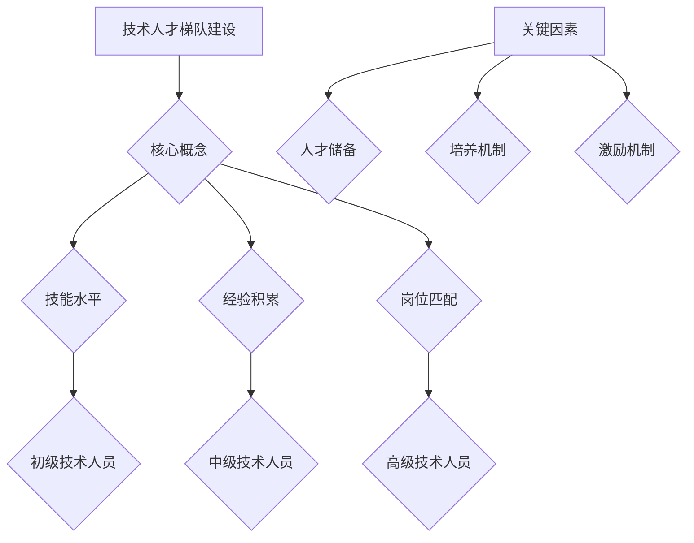
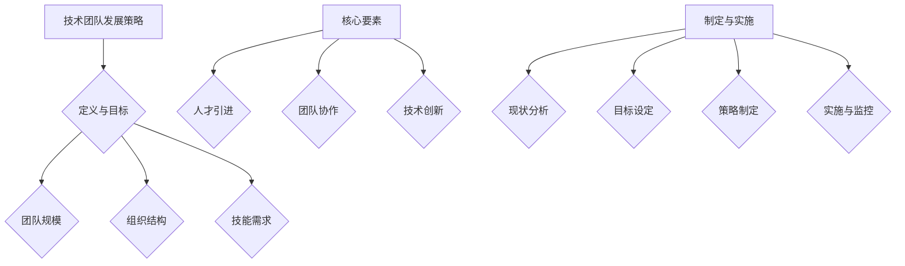
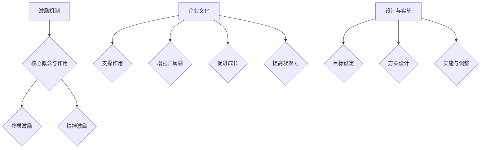
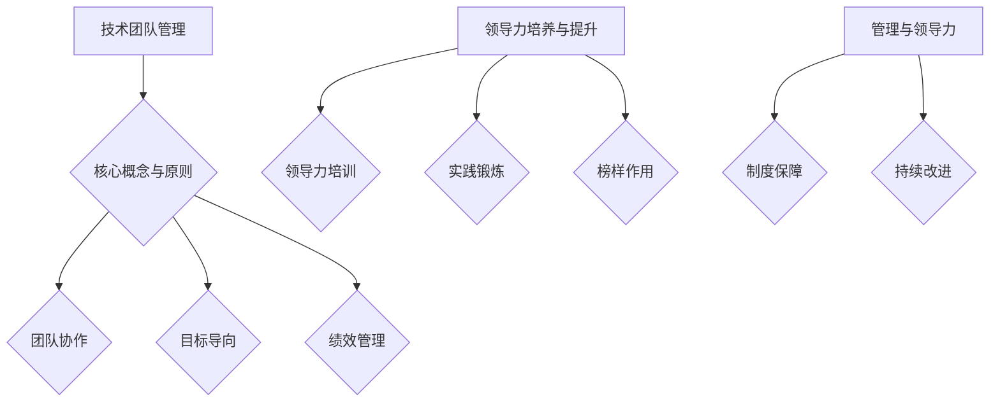

                 

### 文章标题：技术人才梯队建设：打造可持续发展的技术团队

#### 关键词：技术团队、人才梯队建设、可持续发展、激励机制、领导力

#### 摘要：
本文围绕技术人才梯队建设的核心概念和实践方法展开，详细分析了技术团队的发展策略、人才识别与培养、激励机制与文化建设等方面。通过阐述技术人才梯队的定义、重要性以及建设过程中面临的关键挑战，本文旨在为IT企业打造一个可持续发展的技术团队提供理论指导和实践案例。

### 一、引言

在当今快速发展的信息技术时代，技术团队作为企业创新和发展的核心力量，其人才梯队建设显得尤为重要。技术人才梯队建设不仅关乎企业的短期发展，更影响其长期竞争力和可持续发展。本文将从以下几个方面进行探讨：

1. 技术人才梯队建设概述
2. 技术团队发展策略
3. 人才识别与培养
4. 激励机制与文化建设
5. 技术团队管理与领导力
6. 技术团队项目实战

### 二、技术人才梯队建设概述

#### 1. 技术人才梯队的定义与重要性

技术人才梯队是指按照技能水平、经验和岗位需求进行分层分类，形成有序的人才结构。它不仅包括技术专家和工程师，还涵盖了项目管理、产品管理和业务支持等多元化角色。技术人才梯队建设的重要目标是确保企业具备持续创新能力和应对市场变化的能力。

#### 2. 技术人才梯队的核心概念

技术人才梯队的核心概念包括：

- **技能水平**：从初级、中级到高级，不同层次的技术人员具备不同的技能和知识。
- **经验积累**：通过项目实战和持续学习，技术人员不断提升自身经验水平。
- **岗位匹配**：根据岗位需求和技术人员的技能匹配度，实现人岗匹配优化。

#### 3. 技术人才梯队建设的关键因素

技术人才梯队建设的关键因素包括：

- **人才储备**：建立完善的人才储备体系，确保企业具备足够的后备力量。
- **培养机制**：制定科学的培养计划，促进技术人员技能提升和经验积累。
- **激励机制**：通过激励机制激发技术人员的积极性和创造力。

#### 4. 技术人才梯队建设的Mermaid流程图

### 三、技术团队发展策略

#### 1. 技术团队发展策略的定义与目标

技术团队发展策略是指企业在特定时期内，为了实现技术人才梯队建设和持续发展而制定的一系列行动方案。其目标包括：

- **团队规模**：根据企业需求和市场变化，合理规划团队规模。
- **组织结构**：建立适应企业战略需求的组织架构。
- **技能需求**：明确不同层级技术人员的技能需求，确保团队整体能力提升。

#### 2. 技术团队发展策略的核心要素

技术团队发展策略的核心要素包括：

- **人才引进**：通过招聘、培训等方式引进优秀技术人才。
- **团队协作**：建立高效的协作机制，提升团队整体战斗力。
- **技术创新**：鼓励技术人员参与技术创新，推动企业技术进步。

#### 3. 技术团队发展策略的制定与实施

技术团队发展策略的制定与实施分为以下几个步骤：

- **现状分析**：分析企业现有技术团队的结构、技能水平和创新成果。
- **目标设定**：根据企业战略需求，设定团队发展目标。
- **策略制定**：制定具体的发展策略，包括团队规模、组织结构、技能需求等。
- **实施与监控**：落实发展策略，定期进行评估和调整。

#### 4. 技术团队发展策略的Mermaid流程图

### 四、人才识别与培养

#### 1. 人才识别算法

人才识别算法是指通过分析技术人员的技能水平、经验积累和岗位匹配度，识别出具有潜力和价值的人才。常用的算法包括：

- **技能评估模型**：根据技术人员的技能指标，如编程能力、项目经验等，进行评估。
- **人才图谱**：构建技术人才图谱，通过多维度的数据进行分析，识别出潜在人才。

#### 2. 技术人才培养算法

技术人才培养算法是指通过数据分析和预测，制定出科学合理的培养计划。常用的算法包括：

- **人才成长模型**：根据技术人员的成长路径，预测其未来发展和能力提升。
- **培养计划优化**：通过算法优化，制定出最优的培养计划，提升人才培养效果。

#### 3. 技术人才评估与反馈机制

技术人才评估与反馈机制是指通过定期评估和技术人员反馈，了解其成长情况和问题，并制定相应的改进措施。常用的机制包括：

- **技能考核**：定期对技术人员进行技能考核，评估其技能水平。
- **反馈机制**：建立技术人员与上级、同事之间的反馈渠道，及时了解其工作情况和需求。

#### 4. 人才识别与培养的数学模型和公式

- **技能评估模型**：

  $$ skill\_score = \sum_{i=1}^{n} (weight_i \cdot skill_i) $$

  其中，$skill\_score$ 为技能总分，$weight_i$ 为第 $i$ 个技能的权重，$skill_i$ 为第 $i$ 个技能的得分。

- **人才成长模型**：

  $$ growth\_rate = \alpha \cdot (1 - e^{-\beta \cdot time}) $$

  其中，$growth\_rate$ 为成长率，$\alpha$ 和 $\beta$ 为模型参数，$time$ 为时间。

### 五、激励机制与文化建设

#### 1. 激励机制的核心概念与作用

激励机制是指通过物质激励和精神激励，激发技术人员的积极性和创造力。激励机制的核心概念包括：

- **物质激励**：通过奖金、股票期权等物质奖励，提高技术人员的收入水平。
- **精神激励**：通过认可、晋升等精神奖励，提升技术人员的职业成就感。

激励机制的作用包括：

- **提高工作效率**：通过激励，提高技术人员的工作积极性和主动性。
- **促进创新能力**：通过激励，鼓励技术人员参与技术创新和项目研发。
- **增强团队凝聚力**：通过激励，增强团队内部的协作和信任。

#### 2. 激励机制的设计与实施

激励机制的设计与实施分为以下几个步骤：

- **目标设定**：明确激励机制的总体目标，如提高工作效率、促进创新能力等。
- **方案设计**：根据目标，设计具体的激励方案，包括物质激励和精神激励。
- **实施与调整**：落实激励方案，并根据实际情况进行适时调整。

#### 3. 企业文化对激励机制的支撑作用

企业文化是激励机制的支撑和保障。优秀的企业文化能够：

- **增强员工归属感**：通过企业文化，增强技术人员对企业的认同感和归属感。
- **促进员工成长**：通过企业文化，引导技术人员追求卓越，不断提升自身能力和素质。
- **提高团队凝聚力**：通过企业文化，增强团队内部的协作和信任，提高整体战斗力。

#### 4. 激励机制与文化建设Mermaid流程图

#### 5. 激励机制与文化建设数学模型和公式

- **物质激励模型**：

  $$ reward\_amount = base\_salary \cdot (1 + bonus\_rate) $$

  其中，$reward\_amount$ 为奖励金额，$base\_salary$ 为基本工资，$bonus\_rate$ 为奖金比例。

- **精神激励模型**：

  $$ recognition\_score = \alpha \cdot (1 - e^{-\beta \cdot time}) $$

  其中，$recognition\_score$ 为认可度，$\alpha$ 和 $\beta$ 为模型参数，$time$ 为时间。

### 六、技术团队管理与领导力

#### 1. 技术团队管理的核心概念与原则

技术团队管理是指通过科学的管理方法和领导力，确保技术团队高效运行和持续发展。核心概念包括：

- **团队协作**：通过协作，实现技术人员的优势互补，提升团队整体战斗力。
- **目标导向**：明确团队目标，确保团队成员朝同一方向努力。
- **绩效管理**：通过绩效管理，评估技术人员的表现，提供改进和激励。

技术团队管理的原则包括：

- **以人为本**：关注技术人员的需求，提升其职业成就感和归属感。
- **制度保障**：建立完善的制度，确保技术团队的管理规范和有序。
- **持续改进**：通过持续改进，提升技术团队的整体素质和创新能力。

#### 2. 技术团队领导力的培养与提升

技术团队领导力是指通过领导能力和管理技能，带领技术团队实现共同目标的能力。培养和提升技术团队领导力包括：

- **领导力培训**：通过培训，提高技术人员的领导能力和管理技能。
- **实践锻炼**：通过实际项目管理，锻炼技术人员的领导力和执行力。
- **榜样作用**：树立榜样，激发技术人员的学习和进步。

#### 3. 技术团队管理与领导力的Mermaid流程图

#### 4. 技术团队管理与领导力的数学模型和公式

- **团队协作模型**：

  $$ collaboration\_score = \alpha \cdot (1 + \beta \cdot team\_efficiency) $$

  其中，$collaboration\_score$ 为协作得分，$\alpha$ 和 $\beta$ 为模型参数，$team\_efficiency$ 为团队效率。

- **绩效管理模型**：

  $$ performance\_score = \alpha \cdot (1 - e^{-\beta \cdot time}) $$

  其中，$performance\_score$ 为绩效得分，$\alpha$ 和 $\beta$ 为模型参数，$time$ 为时间。

### 七、技术团队项目实战

#### 1. 项目实战

以某IT企业开发一款高性能数据库项目为例，详细讲解项目开发过程。

#### 2. 开发环境搭建

- **硬件环境**：配置高性能服务器，确保项目运行稳定性。
- **软件环境**：安装数据库管理系统、开发工具和测试工具，搭建开发环境。

#### 3. 源代码详细实现

- **需求分析**：明确项目需求和功能模块。
- **设计阶段**：设计数据库架构、接口和模块。
- **编码阶段**：根据设计文档，编写源代码。
- **测试阶段**：对源代码进行功能测试和性能测试。

#### 4. 代码解读与分析

- **代码实现**：分析关键代码的实现逻辑和算法原理。
- **性能优化**：分析代码性能瓶颈，提出优化方案。

#### 5. 项目小结

- **项目总结**：总结项目开发过程中的经验教训。
- **改进措施**：提出项目改进措施，提升项目质量和效率。

### 八、最佳实践 tips、小结、注意事项、拓展阅读等内容

#### 最佳实践 tips：

1. **注重团队协作**：建立高效的协作机制，提升团队整体战斗力。
2. **定期培训与学习**：鼓励技术人员参加培训和学习，提升技能水平。
3. **激励机制**：制定合理的激励机制，激发技术人员的积极性和创造力。

#### 小结：

技术人才梯队建设是企业发展的重要基础，通过科学的发展策略、人才识别与培养、激励机制和团队管理，企业可以打造一个可持续发展的技术团队，提升整体竞争力和创新能力。

#### 注意事项：

1. **重视人才储备**：建立完善的人才储备体系，确保企业具备足够的人才储备。
2. **持续改进**：通过持续改进，不断提升技术团队的整体素质和创新能力。

#### 拓展阅读：

1. 《技术领导力：打造高效技术团队的实践指南》
2. 《敏捷开发：实践指南》
3. 《软件工程：实践者的研究方法》

### 九、作者信息

作者：AI天才研究院/AI Genius Institute & 禅与计算机程序设计艺术 /Zen And The Art of Computer Programming

本文由AI天才研究院与禅与计算机程序设计艺术联合出品，旨在为技术人才梯队建设提供理论指导和实践案例。我们致力于推动人工智能技术的发展，助力企业实现可持续发展。如需了解更多信息，请访问我们的官方网站。

