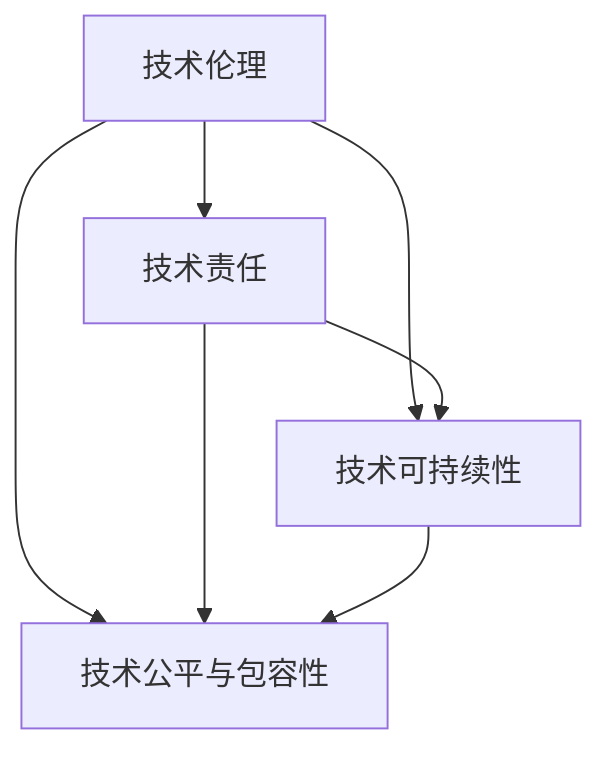

                 

### 文章标题

# 技术价值观：建立团队共同的价值观

> 关键词：技术价值观、团队共识、价值观评估、项目实践、未来趋势

> 摘要：本文深入探讨了技术价值观在团队中的重要性，从定义、历史演变、核心概念到实际应用，全面解析了如何建立和维系一个团队的共同价值观。文章通过详细的分析和实例，为技术人员和团队管理者提供了实用的指导和建议。

---

## 引言

技术价值观是指导技术人员和团队在项目开发和运营过程中做出决策的重要原则。一个拥有共同价值观的团队不仅能够提高工作效率，还能够增强团队成员之间的信任和协作。然而，如何建立和维系这样的价值观，仍然是一个挑战。

本文将分为以下几个部分：

1. 技术价值观的定义与重要性
2. 技术价值观的历史与演变
3. 技术价值观的核心概念与联系
4. 技术价值观的评估与衡量
5. 团队沟通与价值观的融合
6. 技术项目的价值观实践
7. 技术价值观的未来趋势

通过这些部分的详细探讨，希望能够为读者提供一套完整的建立团队共同价值观的指南。

### 第一部分：技术价值观概述

## 第1章：技术价值观的定义与重要性

### 1.1 技术价值观的定义

技术价值观是指一组指导技术人员和团队在项目开发和运营过程中做出决策的基本原则。这些原则包括但不限于技术伦理、技术责任、技术可持续性、技术公平与包容性等。

### 1.2 技术价值观的重要性

技术价值观在团队中具有至关重要的地位。首先，它为团队成员提供了一个共同的行为准则，有助于减少冲突和误解。其次，它能够提高团队的工作效率和协作能力，从而提升项目的成功率。最后，技术价值观还能够塑造团队的文化和氛围，为团队成员提供一个积极、健康的工作环境。

### 1.3 技术价值观的核心原则

技术价值观的核心原则包括以下几个方面：

1. **技术伦理**：在项目开发过程中，始终遵循道德和法律标准，确保技术的应用不会对社会和人类造成负面影响。
2. **技术责任**：技术人员应对自己的工作负责，确保技术的质量和稳定性，并对技术可能带来的风险进行充分评估。
3. **技术可持续性**：在项目开发过程中，考虑技术的可持续性，包括能源消耗、环境影响等方面。
4. **技术公平与包容性**：确保技术的开发和应用能够惠及所有人，避免技术带来的不公平和歧视。

### 1.4 技术价值观的演变历程

技术价值观的演变与技术的发展密切相关。从早期的计算机科学到现代的人工智能和大数据，技术的应用场景和复杂性不断增加，技术价值观也在不断演变。早期的技术价值观主要集中在技术的安全和可靠性上，而现代的技术价值观则更加注重社会责任和可持续发展。

### 1.5 技术价值观的挑战

随着技术的快速发展，技术价值观也面临着一系列挑战。首先，技术的应用越来越广泛，如何确保技术伦理和技术责任的实施成为一个难题。其次，技术的复杂性和多样性使得技术价值观的评估和衡量变得更加困难。最后，技术价值观的融合和传播也是一个重要挑战，特别是在多元文化和技术背景的团队中。

## 第二部分：技术价值观的核心概念

## 第2章：技术价值观的核心概念与联系

### 2.1 技术伦理

技术伦理是指技术在应用过程中所应遵循的道德和法律标准。技术伦理的核心问题是：技术是否应该用于对社会和人类有益的领域，以及如何避免技术带来的负面影响。技术伦理的主要内容包括隐私保护、信息安全、公正性、透明性等。

### 2.2 技术责任

技术责任是指技术人员在项目开发和运营过程中应承担的责任。技术责任主要包括以下几个方面：

1. **质量责任**：确保技术的质量和稳定性，避免因技术故障导致的事故和损失。
2. **安全责任**：确保技术的安全性和可靠性，防止技术被恶意利用。
3. **社会责任**：考虑技术的应用对社会和人类的影响，确保技术的正面影响大于负面影响。

### 2.3 技术可持续性

技术可持续性是指技术在开发和应用过程中应遵循的可持续性原则。技术可持续性的主要内容包括：

1. **能源消耗**：减少技术的能源消耗，降低对环境的影响。
2. **环境影响**：考虑技术的环境影响，确保技术的开发和应用不会对生态环境造成破坏。
3. **资源利用**：提高资源的利用效率，减少资源的浪费。

### 2.4 技术公平与包容性

技术公平与包容性是指技术在开发和应用过程中应确保的公平性和包容性。技术公平与包容性的主要内容包括：

1. **公平性**：确保技术的开发和应用不会造成不公平的现象，如歧视、排斥等。
2. **包容性**：确保技术的开发和应用能够惠及所有人，包括不同年龄、性别、地域和文化背景的人。

### 2.5 技术价值观的核心概念关系架构

技术价值观的核心概念之间存在着密切的联系。技术伦理和技术责任是技术可持续性和技术公平与包容性的基础，而技术可持续性和技术公平与包容性则是技术伦理和技术责任的具体体现。

下面是技术价值观核心概念之间的关系架构图：



### 2.6 技术价值观的评估与衡量

技术价值观的评估与衡量是确保技术价值观在实践中得到有效执行的关键。技术价值观的评估与衡量可以从以下几个方面进行：

1. **技术伦理评估**：通过伦理审查和风险评估，确保技术的开发和应用符合道德和法律标准。
2. **技术责任评估**：通过质量管理和安全评估，确保技术的质量和安全性。
3. **技术可持续性评估**：通过环境影响评估和资源利用率评估，确保技术的可持续性。
4. **技术公平与包容性评估**：通过社会影响评估和用户满意度评估，确保技术的公平性和包容性。

下面是技术价值观评估与衡量框架的伪代码：

```python
def assess_technical_values():
    # 伦理评估
    ethical_assessment = ethics_review() and risk_assessment()
    
    # 责任评估
    responsibility_assessment = quality_management() and safety_evaluation()
    
    # 可持续性评估
    sustainability_assessment = environmental_impact_assessment() and resource_utilization_evaluation()
    
    # 公平与包容性评估
    fairness_and_inclusivity_assessment = social_impact_assessment() and user_satisfaction_evaluation()
    
    return ethical_assessment and responsibility_assessment and sustainability_assessment and fairness_and_inclusivity_assessment
```

### 2.7 技术价值观评估案例

以下是一个技术价值观评估的案例：

#### 案例背景

某公司开发了一款智能家居系统，旨在为用户提供更加便捷、智能的生活体验。然而，在系统上线后，一些用户反馈系统存在隐私泄露的问题，引起了广泛关注。

#### 评估过程

1. **伦理评估**：公司组织了伦理审查委员会，对智能家居系统的隐私保护措施进行了审查。审查发现，系统在用户数据收集、存储和使用过程中存在一定的隐私风险。

2. **责任评估**：公司对智能家居系统的质量和安全性进行了全面评估。评估结果显示，系统在数据加密、访问控制和异常检测等方面存在一定的问题。

3. **可持续性评估**：公司对智能家居系统的能源消耗和环境影响进行了评估。评估结果显示，系统在能耗方面表现较好，但在环境影响方面还有改进空间。

4. **公平与包容性评估**：公司对智能家居系统的用户满意度进行了调查。调查结果显示，系统在用户满意度方面表现良好，但在不同文化背景和年龄段的用户中存在一定的差异。

#### 评估结果

基于上述评估，公司决定对智能家居系统进行优化和改进。具体措施包括：

1. **加强隐私保护**：改进用户数据的收集、存储和使用方法，确保用户的隐私安全。

2. **提升质量和安全性**：加强系统的质量管理和安全评估，确保系统的稳定性和安全性。

3. **降低能耗**：优化系统的能耗管理，降低对环境的影响。

4. **提高公平与包容性**：改进系统的用户界面和功能设计，确保不同文化背景和年龄段的用户都能方便地使用系统。

### 2.8 技术价值观的未来趋势

随着技术的不断发展，技术价值观也在不断演变。以下是一些技术价值观的未来趋势：

1. **技术伦理的加强**：随着技术的应用场景越来越广泛，技术伦理的重要性将日益凸显。未来的技术伦理将更加关注技术的道德和社会影响。

2. **技术责任的深化**：技术人员和团队将承担更多的责任，确保技术的质量和安全性。

3. **技术可持续性的重视**：随着可持续发展理念的普及，技术可持续性将成为评估技术价值的重要指标。

4. **技术公平与包容性的提升**：随着社会对公平和包容性的关注增加，技术公平与包容性将成为技术发展的重要方向。

### 2.9 最佳实践 tips

1. **建立明确的技术价值观**：明确团队的技术价值观，确保团队成员在项目开发和运营过程中有共同的目标和行为准则。

2. **定期进行技术价值观评估**：定期对技术价值观进行评估，及时发现和解决问题，确保技术价值观在实践中得到有效执行。

3. **加强团队沟通与协作**：加强团队成员之间的沟通与协作，确保技术价值观能够在团队中得到有效传播和执行。

4. **关注技术伦理和社会责任**：在项目开发和运营过程中，始终关注技术伦理和社会责任，确保技术的应用对社会和人类有益。

5. **持续学习和改进**：随着技术的不断发展和变化，团队成员应持续学习和改进，不断提升技术价值观的实践能力。

### 2.10 小结

技术价值观是团队在项目开发和运营过程中不可或缺的一部分。通过明确的技术价值观，团队能够提高工作效率、增强协作能力、提升项目的成功率。同时，技术价值观还能够塑造团队的文化和氛围，为团队成员提供一个积极、健康的工作环境。因此，建立和维系一个团队共同的技术价值观是非常重要的。

在未来的技术发展中，技术价值观将发挥越来越重要的作用。技术人员和团队管理者应不断学习和改进，确保技术价值观在实践中得到有效执行，为社会的可持续发展做出贡献。

### 作者信息

作者：AI天才研究院/AI Genius Institute & 禅与计算机程序设计艺术 /Zen And The Art of Computer Programming

---

通过本文的详细探讨，我们希望能够为技术人员和团队管理者提供一套完整的建立团队共同价值观的指南。技术价值观不仅能够提高团队的工作效率和协作能力，还能够塑造团队的文化和氛围，为团队成员提供一个积极、健康的工作环境。让我们共同努力，建立和维护一个充满活力和共识的团队！## 第1章：技术价值观的定义与重要性

### 1.1 技术价值观的定义

技术价值观是指一组指导技术人员和团队在项目开发和运营过程中做出决策的基本原则。这些原则旨在确保技术应用于对社会和人类有益的领域，同时避免技术带来的负面影响。技术价值观不仅涵盖了技术本身，还包括技术对社会、环境和文化的影响。

技术价值观的定义可以从以下几个方面进行理解：

1. **技术伦理**：技术伦理是技术价值观的核心内容，涉及在技术设计和应用过程中应遵循的道德和法律标准。技术伦理旨在确保技术不会对社会和人类造成伤害，同时保护用户的隐私和信息安全。

2. **技术责任**：技术责任是指技术人员和团队在项目开发和运营过程中应承担的责任。这包括确保技术的质量和稳定性，对可能带来的风险进行充分评估，并在技术出现问题时及时采取补救措施。

3. **技术可持续性**：技术可持续性是指在技术设计和应用过程中应考虑的环境、社会和经济可持续性。这意味着技术应尽量减少对环境的负面影响，提高资源的利用效率，同时促进社会的可持续发展。

4. **技术公平与包容性**：技术公平与包容性强调技术在开发和应用过程中应确保所有人都能公平、无歧视地受益。这包括确保技术产品和服务对不同的用户群体（如不同年龄、性别、文化背景等）都是可访问、可理解和可使用的。

### 1.2 技术价值观的重要性

技术价值观在团队中具有至关重要的地位，原因如下：

1. **提高工作效率**：明确的技术价值观能够为团队成员提供一个共同的目标和行为准则，减少因意见不一致而产生的冲突和犹豫，从而提高工作效率。

2. **增强协作能力**：共同的技术价值观能够增强团队成员之间的信任和协作，促进团队内部的知识共享和技能互补，提高团队的总体效能。

3. **提升项目成功率**：技术价值观能够确保项目在开发和运营过程中始终遵循正确的方向，减少因偏离目标而产生的风险，提高项目的成功率。

4. **塑造团队文化**：技术价值观不仅影响项目的开发过程，还能够塑造团队的文化和氛围。一个拥有共同价值观的团队往往更加和谐、积极和有活力。

5. **增强社会责任感**：技术价值观强调技术的伦理和社会责任，有助于技术人员和团队更好地理解技术对社会的影响，从而增强社会责任感，为社会的发展做出贡献。

### 1.3 技术价值观的核心原则

技术价值观的核心原则包括以下几个方面：

1. **技术伦理**：技术伦理是技术价值观的基石，要求技术人员在项目开发和运营过程中始终遵守道德和法律标准。这包括尊重用户的隐私权、保护信息安全、避免技术滥用等。

2. **技术责任**：技术责任要求技术人员和团队对技术应用的后果负责。这包括确保技术的质量和稳定性、对可能的风险进行充分评估和防范、以及在技术出现问题时及时采取补救措施。

3. **技术可持续性**：技术可持续性强调技术应考虑环境、社会和经济可持续性。这包括减少技术对环境的负面影响、提高资源的利用效率、促进社会的可持续发展等。

4. **技术公平与包容性**：技术公平与包容性要求技术在开发和应用过程中应确保所有人都能公平、无歧视地受益。这包括确保技术产品和服务对不同的用户群体都是可访问、可理解和可使用的。

### 1.4 技术价值观的历史与演变

技术价值观的演变与技术的发展密切相关。从早期的计算机科学到现代的人工智能和大数据，技术的应用场景和复杂性不断增加，技术价值观也在不断演变。

1. **计算机科学初期**：在计算机科学初期，技术价值观主要集中在技术的安全和可靠性上。这个时期的代表性价值观包括“计算机应该可靠”、“代码应该简洁”等。

2. **互联网时代**：随着互联网的普及，技术价值观逐渐扩展到技术对社会的影响上。这个时期的代表性价值观包括“数据是新的石油”、“互联网应该开放”等。

3. **大数据与人工智能时代**：在人工智能和大数据时代，技术价值观进一步强调技术的可持续性和社会责任。这个时期的代表性价值观包括“数据应被负责任地使用”、“人工智能应促进社会的公平与包容性”等。

### 1.5 技术价值观的挑战

随着技术的快速发展，技术价值观也面临着一系列挑战：

1. **伦理和责任**：随着技术的复杂性和应用场景的多样化，如何在技术设计和应用过程中平衡伦理和责任成为一大挑战。

2. **可持续性**：如何在技术设计和应用过程中充分考虑环境、社会和经济的可持续性，减少技术对环境的负面影响，是一个重要挑战。

3. **公平与包容性**：如何确保技术产品和服务对所有用户都是公平、无歧视的，特别是在多元文化和不同社会背景的团队中，是一个挑战。

4. **技术伦理的适应**：随着技术的发展，如何及时更新技术价值观，确保其适应新的技术环境和应用场景，是一个持续的挑战。

### 1.6 技术价值观的实践

为了在实践中贯彻技术价值观，技术人员和团队可以采取以下措施：

1. **建立明确的价值观**：明确团队的技术价值观，并将其纳入项目管理和决策过程中。

2. **培训和教育**：对团队成员进行技术价值观的培训和教育，提高他们的价值观意识和责任感。

3. **伦理审查**：在项目开发和运营过程中，定期进行伦理审查，确保技术应用的道德和法律合规性。

4. **持续改进**：根据技术价值观的实践效果，不断改进和调整，确保其适应不断变化的技术环境。

### 1.7 小结

技术价值观是指导技术人员和团队在项目开发和运营过程中做出决策的基本原则。它不仅影响工作效率和项目成功率，还能够塑造团队的文化和氛围。通过明确的技术价值观，团队能够更好地应对技术挑战，为社会的发展做出贡献。

在未来的技术发展中，技术价值观将发挥越来越重要的作用。技术人员和团队管理者应不断学习和改进，确保技术价值观在实践中得到有效执行，为社会的可持续发展做出贡献。

### 作者信息

作者：AI天才研究院/AI Genius Institute & 禅与计算机程序设计艺术 /Zen And The Art of Computer Programming

---

在本文中，我们详细探讨了技术价值观的定义、重要性、核心原则、历史与演变，以及实践方法。通过这些内容，希望读者能够对技术价值观有更深入的理解，并能够在实际工作中加以应用。建立和维护一个共同的技术价值观，不仅有助于提高团队的工作效率和项目成功率，还能够塑造团队的文化和氛围，为社会的可持续发展做出贡献。让我们共同努力，推动技术价值观的实践和传播！## 第2章：技术价值观的历史与演变

### 2.1 技术价值观的起源

技术价值观的起源可以追溯到计算机科学的早期阶段。在这个时期，计算机技术刚刚开始发展，技术社区的主要关注点是如何让计算机更高效、更可靠地运行。这个时期的代表性价值观包括“计算机应该可靠”和“代码应该简洁”。这些价值观强调了技术的基本原则，即确保技术的高质量和简洁性。

随着计算机技术的不断进步，技术价值观也逐渐发生了变化。在20世纪60年代和70年代，计算机科学开始进入一个新的发展阶段，即“软件工程时代”。在这个时期，软件的规模和复杂性显著增加，软件工程成为了一个专门的领域。这个时期的代表性价值观包括“软件应该可维护”和“代码应该模块化”。这些价值观强调了软件的可维护性和可扩展性，使得软件能够更好地适应不断变化的需求。

### 2.2 技术价值观的演变历程

技术价值观的演变历程可以分为以下几个阶段：

1. **早期计算机科学（1950s-1960s）**：在这个阶段，计算机技术主要集中在计算机硬件和操作系统。技术价值观主要关注计算机的可靠性和性能。代表性的价值观包括“计算机应该高效”和“代码应该简洁”。

2. **软件工程时代（1960s-1980s）**：随着软件规模的增加，软件工程成为一个专门的领域。技术价值观开始关注软件的可维护性和可扩展性。代表性的价值观包括“软件应该可维护”和“代码应该模块化”。

3. **互联网时代（1990s-2000s）**：随着互联网的普及，技术价值观进一步扩展到技术对社会的影响。代表性的价值观包括“数据是新的石油”和“互联网应该开放”。这个时期的价值观强调了技术的创新和开放性。

4. **大数据与人工智能时代（2010s-至今）**：在这个阶段，技术价值观更加注重可持续性和社会责任。代表性的价值观包括“数据应被负责任地使用”和“人工智能应促进社会的公平与包容性”。这个时期的价值观强调了技术的伦理和社会影响。

### 2.3 现代技术价值观的挑战

随着技术的快速发展，现代技术价值观面临着一系列挑战：

1. **技术伦理**：技术的快速发展和广泛应用带来了新的伦理问题。如何在技术设计和应用过程中平衡个人隐私、信息安全和社会责任成为一大挑战。

2. **技术责任**：随着技术的复杂性和应用场景的多样化，如何确保技术人员和团队对技术的应用后果负责成为一个重要挑战。

3. **技术可持续性**：如何在技术设计和应用过程中充分考虑环境、社会和经济可持续性，减少技术对环境的负面影响，是一个重要挑战。

4. **技术公平与包容性**：如何确保技术产品和服务对所有用户都是公平、无歧视的，特别是在多元文化和不同社会背景的团队中，是一个挑战。

### 2.4 技术价值观的演变趋势

展望未来，技术价值观将继续演变，主要趋势如下：

1. **技术伦理的深化**：随着技术的复杂性和应用场景的多样化，技术伦理将变得更加重要。未来，技术伦理将更加注重技术的道德和法律合规性，以及技术对社会和人类的影响。

2. **技术责任的强化**：技术人员和团队将承担更多的责任，确保技术的质量和安全性。未来，技术责任将不仅限于项目的开发和运营过程，还包括技术的全生命周期管理。

3. **技术可持续性的重视**：随着可持续发展理念的普及，技术可持续性将成为评估技术价值的重要指标。未来，技术设计和应用将更加注重环境、社会和经济的可持续性。

4. **技术公平与包容性的提升**：随着社会对公平和包容性的关注增加，技术公平与包容性将成为技术发展的重要方向。未来，技术产品和服务将更加注重满足不同用户群体的需求，确保所有人都能公平、无歧视地受益。

### 2.5 案例分析：技术价值观在项目中的应用

以下是一个关于技术价值观在项目中的应用案例：

#### 案例背景

某科技公司正在开发一款智能医疗诊断系统，旨在通过大数据分析和人工智能技术，提高医疗诊断的准确性和效率。然而，在项目开发和运营过程中，团队面临了多个技术价值观的挑战。

#### 挑战

1. **隐私保护**：医疗数据属于高度敏感信息，如何确保用户的隐私保护成为首要问题。

2. **数据安全**：由于医疗数据的重要性，如何确保系统的数据安全性成为一个关键问题。

3. **公平与包容性**：如何确保系统对各种用户（包括不同年龄、性别和健康状况的人）都是公平、无歧视的，成为一个挑战。

#### 解决方案

1. **隐私保护**：团队采取了多种措施来保护用户的隐私，包括数据加密、匿名化处理和用户权限控制等。

2. **数据安全**：团队采用了先进的安全技术和措施，如数据备份、访问控制和异常检测等，确保系统的数据安全性。

3. **公平与包容性**：团队在系统设计过程中充分考虑了不同用户群体的需求，通过用户测试和反馈，确保系统对各种用户都是公平、无歧视的。

#### 结果

通过上述措施，团队成功地克服了技术价值观的挑战，开发出了一款既高效又安全的智能医疗诊断系统。该系统不仅提高了医疗诊断的准确性和效率，还受到了用户的高度评价。

### 2.6 技术价值观的未来趋势

展望未来，技术价值观将继续演变，主要趋势如下：

1. **技术伦理的深化**：随着技术的复杂性和应用场景的多样化，技术伦理将变得更加重要。未来，技术伦理将不仅关注技术的道德和法律合规性，还包括技术对社会和人类的影响。

2. **技术责任的强化**：技术人员和团队将承担更多的责任，确保技术的质量和安全性。未来，技术责任将不仅限于项目的开发和运营过程，还包括技术的全生命周期管理。

3. **技术可持续性的重视**：随着可持续发展理念的普及，技术可持续性将成为评估技术价值的重要指标。未来，技术设计和应用将更加注重环境、社会和经济的可持续性。

4. **技术公平与包容性的提升**：随着社会对公平和包容性的关注增加，技术公平与包容性将成为技术发展的重要方向。未来，技术产品和服务将更加注重满足不同用户群体的需求，确保所有人都能公平、无歧视地受益。

### 2.7 最佳实践 tips

为了在实践中更好地贯彻技术价值观，以下是一些建议：

1. **建立明确的价值观**：明确团队的技术价值观，并将其纳入项目管理和决策过程中。

2. **培训和教育**：对团队成员进行技术价值观的培训和教育，提高他们的价值观意识和责任感。

3. **伦理审查**：在项目开发和运营过程中，定期进行伦理审查，确保技术应用的道德和法律合规性。

4. **持续改进**：根据技术价值观的实践效果，不断改进和调整，确保其适应不断变化的技术环境。

### 2.8 小结

技术价值观的历史与演变展示了技术在不断进步的过程中，其价值观的演变过程。现代技术价值观面临着新的挑战，如技术伦理、技术责任、技术可持续性和技术公平与包容性。通过案例分析和未来趋势的探讨，我们可以看到技术价值观在项目中的重要性以及如何在未来更好地实践技术价值观。

### 作者信息

作者：AI天才研究院/AI Genius Institute & 禅与计算机程序设计艺术 /Zen And The Art of Computer Programming

---

在本文中，我们通过历史与演变的视角，探讨了技术价值观的起源、演变以及现代面临的挑战。通过案例分析和未来趋势的探讨，我们希望能够为技术人员和团队管理者提供实用的指导和建议，帮助他们在实际工作中更好地贯彻技术价值观。技术价值观不仅影响项目的成功，更关乎社会的可持续发展。让我们共同努力，推动技术价值观的实践和传播，为构建一个更加美好的未来贡献力量！## 第3章：技术价值观的核心概念

### 3.1 技术伦理

技术伦理是技术价值观的核心组成部分，涉及在技术设计和应用过程中应遵循的道德和法律标准。技术伦理的核心目标是确保技术不会对社会和人类造成伤害，同时保护用户的隐私和信息安全。

#### 技术伦理的关键概念：

1. **隐私保护**：技术伦理要求在收集、存储和使用用户数据时，尊重用户的隐私权。这包括对用户数据的加密、匿名化处理和访问控制。

2. **信息安全**：技术伦理要求确保技术系统的安全性和可靠性，防止数据泄露、篡改和滥用。这包括实施有效的安全措施，如防火墙、加密和访问控制。

3. **责任与透明性**：技术伦理要求技术人员和团队对其技术的应用后果负责，并向公众透明地披露技术的潜在风险和影响。

#### 技术伦理的实践：

1. **伦理审查**：在项目启动前，进行伦理审查，评估技术可能带来的道德和法律问题，确保技术应用符合伦理标准。

2. **隐私政策**：制定明确的隐私政策，告知用户其数据如何被收集、使用和共享，并尊重用户的选择和权利。

3. **安全培训**：对团队成员进行定期安全培训，提高他们对技术伦理和安全意识的认识。

### 3.2 技术责任

技术责任是指技术人员和团队在项目开发和运营过程中应承担的责任。技术责任不仅涉及技术的质量和安全性，还包括对技术应用的后果负责。

#### 技术责任的关键概念：

1. **质量责任**：确保技术产品的质量和可靠性，避免因技术故障导致的事故和损失。

2. **安全责任**：确保技术的安全性，防止技术被恶意利用，保护用户的隐私和安全。

3. **持续责任**：即使技术项目已经完成，技术人员和团队也应负责技术的后续维护和更新，确保其持续的安全性和质量。

#### 技术责任的实践：

1. **质量管理和测试**：实施严格的质量管理流程和测试，确保技术产品的稳定性和可靠性。

2. **安全评估与更新**：定期进行安全评估，及时修复安全漏洞，确保技术的安全性。

3. **用户反馈与改进**：积极收集用户反馈，对技术进行持续改进，以更好地满足用户需求。

### 3.3 技术可持续性

技术可持续性是指技术在设计、开发和应用过程中应遵循的可持续性原则，包括环境、社会和经济可持续性。

#### 技术可持续性的关键概念：

1. **环境影响**：减少技术对环境的负面影响，如碳排放、资源消耗和废弃物处理。

2. **社会影响**：确保技术对社会的影响是积极的，包括促进教育、医疗和社会福利等。

3. **经济影响**：确保技术具有经济效益，能够为企业和社会创造价值。

#### 技术可持续性的实践：

1. **绿色技术**：采用环保技术和材料，减少能源消耗和环境污染。

2. **社会责任**：关注技术对社会的影响，确保技术的开发和应用能够促进社会进步。

3. **经济评估**：对技术的经济效益进行评估，确保技术具有可持续的商业模型。

### 3.4 技术公平与包容性

技术公平与包容性是技术价值观的重要组成部分，强调技术应确保所有人都能公平、无歧视地受益。

#### 技术公平与包容性的关键概念：

1. **公平性**：确保技术产品和服务对不同的用户群体都是公平的，无论其性别、年龄、文化背景或经济状况如何。

2. **包容性**：确保技术能够满足不同用户群体的需求，包括残障人士、老年人等。

3. **多样性**：鼓励团队成员的多样性，以促进创新和更好地理解用户需求。

#### 技术公平与包容性的实践：

1. **用户研究**：进行多样化的用户研究，确保技术设计能够满足不同用户群体的需求。

2. **可访问性**：确保技术产品和服务对所有人都是可访问的，包括残障人士和老年人。

3. **文化敏感性**：在设计过程中考虑不同文化背景的用户需求，确保技术产品的文化适应性。

### 3.5 技术价值观的核心概念关系架构

技术价值观的核心概念之间存在着紧密的联系。以下是一个简单的 Mermaid 流程图，展示了这些概念之间的关系：


### 3.6 技术价值观评估与衡量

对技术价值观的评估与衡量是确保技术价值观在实践中得到有效执行的关键。以下是一个简化的技术价值观评估与衡量框架：

```python
def assess_technical_values():
    # 伦理评估
    ethical_assessment = ethics_review() and privacy_protection()
    
    # 责任评估
    responsibility_assessment = quality_management() and security_evaluation()
    
    # 可持续性评估
    sustainability_assessment = environmental_impact_evaluation() and social_impact_evaluation()
    
    # 公平与包容性评估
    fairness_and_inclusivity_assessment = accessibility_evaluation() and cultural_sensitivity_evaluation()
    
    return ethical_assessment and responsibility_assessment and sustainability_assessment and fairness_and_inclusivity_assessment
```

### 3.7 案例分析：技术价值观在项目中的应用

以下是一个关于技术价值观在项目中的应用案例：

#### 案例背景

某科技公司开发了一款智能健康监测设备，旨在通过收集和分析用户数据，提供个性化的健康建议。然而，在项目开发和运营过程中，团队面临了多个技术价值观的挑战。

#### 挑战

1. **隐私保护**：如何确保用户的健康数据不被未经授权的人员访问？

2. **数据安全**：如何确保用户数据在传输和存储过程中的安全性？

3. **公平与包容性**：如何确保设备对各种用户群体（包括不同健康状况的人）都是公平和有效的？

#### 解决方案

1. **隐私保护**：团队采用了先进的加密技术和访问控制机制，确保用户的健康数据在传输和存储过程中得到充分保护。

2. **数据安全**：团队实施了严格的安全措施，包括数据备份、异常检测和用户权限管理，确保用户数据的安全。

3. **公平与包容性**：团队进行了广泛的用户研究，确保设备的设计和功能能够满足不同健康状况的用户需求，并通过用户反馈不断改进。

#### 结果

通过上述措施，团队成功地克服了技术价值观的挑战，开发出了一款既安全又公平的智能健康监测设备。该设备不仅受到了用户的欢迎，还获得了行业的高度评价。

### 3.8 小结

技术价值观的核心概念包括技术伦理、技术责任、技术可持续性、技术公平与包容性。这些概念相互关联，共同构成了一个全面的技术价值观体系。通过明确的评估与衡量，技术人员和团队可以确保技术价值观在实践中得到有效执行。案例分析和最佳实践提示为我们提供了具体的应用指导，帮助我们在实际工作中更好地贯彻技术价值观。

### 作者信息

作者：AI天才研究院/AI Genius Institute & 禅与计算机程序设计艺术 /Zen And The Art of Computer Programming

---

通过本章的详细探讨，我们深入理解了技术价值观的核心概念，并看到了其在项目中的应用和重要性。技术价值观不仅影响项目的结果，还关乎社会的可持续发展和人类的福祉。作为技术人员和团队管理者，我们有责任在实践中贯彻技术价值观，共同构建一个更加美好、公正和可持续的技术世界。让我们携手努力，推动技术价值观的实践和传播！## 第4章：技术价值观的评估与衡量

### 4.1 技术价值观评估框架

技术价值观的评估与衡量是一个复杂的过程，需要综合考虑多个方面。一个全面的技术价值观评估框架应包括以下几个关键组成部分：

1. **伦理评估**：评估技术在设计和应用过程中是否遵循了道德和法律标准，包括隐私保护、数据安全、责任承担等方面。
2. **责任评估**：评估技术人员和团队在项目开发和运营过程中是否承担了相应的责任，确保技术的质量和安全性。
3. **可持续性评估**：评估技术在环境、社会和经济方面的影响，确保其可持续性。
4. **公平与包容性评估**：评估技术产品和服务是否对所有人都是公平、无歧视的，确保其包容性。

### 4.2 技术价值观量化方法

为了更准确地评估技术价值观，可以使用一些量化方法。以下是一些常用的量化方法：

1. **伦理指标**：例如，隐私保护得分、数据泄露次数、用户投诉率等。
2. **责任指标**：例如，质量缺陷率、安全漏洞数、用户满意度等。
3. **可持续性指标**：例如，碳排放量、资源消耗率、废物处理效率等。
4. **公平与包容性指标**：例如，用户满意度、市场份额、用户反馈等。

以下是一个简化的量化评估框架：

```python
def quantify_technical_values(ethics_score, responsibility_score, sustainability_score, fairness_score):
    # 伦理得分
    ethics_score = calculate_ethics_score()
    
    # 责任得分
    responsibility_score = calculate_responsibility_score()
    
    # 可持续性得分
    sustainability_score = calculate_sustainability_score()
    
    # 公平与包容性得分
    fairness_score = calculate Fairness_and_Inclusivity_score()
    
    # 总得分
    total_score = (ethics_score + responsibility_score + sustainability_score + fairness_score) / 4
    
    return total_score
```

### 4.3 技术价值观评估案例

以下是一个关于技术价值观评估的具体案例：

#### 案例背景

某科技公司开发了一款智能家居系统，旨在提高用户的生活质量。然而，在系统上线后，用户反馈了一些关于隐私保护和安全性的问题。

#### 评估过程

1. **伦理评估**：团队对系统的隐私保护措施进行了全面评估。评估发现，系统在用户数据收集、存储和使用过程中存在一定的隐私风险。

2. **责任评估**：团队对系统的质量和安全性进行了评估。评估结果显示，系统在数据加密、访问控制和异常检测等方面存在一定的问题。

3. **可持续性评估**：团队对系统的能源消耗和环境影响进行了评估。评估结果显示，系统在能耗方面表现较好，但在环境影响方面还有改进空间。

4. **公平与包容性评估**：团队对系统的用户满意度进行了调查。调查结果显示，系统在用户满意度方面表现良好，但在不同文化背景和年龄段的用户中存在一定的差异。

#### 评估结果

基于上述评估，团队决定对智能家居系统进行优化和改进。具体措施包括：

1. **加强隐私保护**：改进用户数据的收集、存储和使用方法，确保用户的隐私安全。

2. **提升质量和安全性**：加强系统的质量管理和安全评估，确保系统的稳定性和安全性。

3. **降低能耗**：优化系统的能耗管理，降低对环境的影响。

4. **提高公平与包容性**：改进系统的用户界面和功能设计，确保不同文化背景和年龄段的用户都能方便地使用系统。

### 4.4 持续改进与反馈循环

技术价值观的评估与衡量是一个持续的过程，需要不断地进行改进和反馈。以下是一些关键步骤：

1. **定期评估**：定期对技术价值观进行评估，确保其在实践中得到有效执行。

2. **用户反馈**：积极收集用户的反馈，了解技术价值观在实践中的效果，并根据反馈进行改进。

3. **团队培训**：对团队成员进行技术价值观的培训，提高他们的意识和责任感。

4. **跨部门协作**：促进跨部门的协作，确保技术价值观在各个层面得到贯彻。

5. **透明沟通**：确保技术价值观的评估和改进过程透明，让团队成员了解当前的进展和未来的计划。

### 4.5 最佳实践 tips

1. **建立明确的价值观**：明确团队的技术价值观，并将其纳入项目管理和决策过程中。

2. **定期进行评估**：定期对技术价值观进行评估，及时发现和解决问题。

3. **用户参与**：在项目开发和运营过程中，积极引入用户参与，确保技术价值观能够真正满足用户需求。

4. **跨部门协作**：促进跨部门的协作，确保技术价值观在各个层面得到贯彻。

5. **持续改进**：根据评估结果和用户反馈，持续改进技术价值观的实践。

### 4.6 小结

技术价值观的评估与衡量是确保技术价值观在实践中得到有效执行的关键。通过明确的评估框架和量化方法，技术人员和团队能够准确地评估技术价值观的实施效果。案例分析和最佳实践提示为我们提供了具体的应用指导，帮助我们在实际工作中更好地贯彻技术价值观。持续改进和反馈循环是确保技术价值观不断进步的关键，让我们共同努力，推动技术价值观的实践和传播。

### 作者信息

作者：AI天才研究院/AI Genius Institute & 禅与计算机程序设计艺术 /Zen And The Art of Computer Programming

---

在本文中，我们详细探讨了技术价值观的评估与衡量方法，包括评估框架、量化方法和实践案例。通过这些内容，我们希望能够为技术人员和团队管理者提供实用的指导，帮助他们在实际工作中更好地贯彻技术价值观。技术价值观不仅影响项目的成功，还关乎社会的可持续发展。让我们共同努力，推动技术价值观的实践和传播，为构建一个更加美好、公正和可持续的技术世界贡献力量！## 第5章：团队沟通与价值观的融合

### 5.1 团队沟通的重要性

团队沟通是团队协作和项目成功的关键因素。良好的团队沟通能够确保信息准确传递，促进团队成员之间的理解和信任，从而提高工作效率和项目成功率。

#### 团队沟通的关键作用：

1. **信息传递**：确保团队成员能够及时、准确地了解项目进展、目标和任务分配。
2. **协作与协调**：促进团队成员之间的协作，确保不同职能和角色能够有效地配合，提高项目的整体效率。
3. **冲突解决**：通过及时的沟通，及时发现和解决团队内部的冲突和问题，避免影响项目进展。
4. **共同愿景**：建立共同的目标和愿景，增强团队成员的凝聚力和归属感，提高团队的士气和工作动力。

### 5.2 价值观融合的障碍与解决方法

在团队沟通的过程中，价值观的融合是一个重要的挑战。不同成员可能来自不同的文化背景、教育经历和职业背景，他们对技术和工作的理解、期望和态度可能存在差异。这些差异可能导致沟通障碍，影响团队的效率和协作效果。

#### 价值观融合的障碍：

1. **文化差异**：不同文化背景的成员可能在价值观、沟通方式和行为习惯上存在差异。
2. **个人经验**：团队成员的个人经验可能影响他们对技术问题的看法和解决方案的选择。
3. **利益冲突**：团队成员可能因为个人目标、项目利益或职责分工的不同而产生冲突。
4. **沟通渠道不畅**：缺乏有效的沟通渠道和机制，可能导致信息传递不及时或不准确。

#### 解决方法：

1. **建立共同目标**：明确团队的目标和愿景，确保所有成员都朝着共同的目标努力。
2. **文化适应性**：鼓励团队成员理解和尊重彼此的文化差异，提高跨文化沟通的技巧和意识。
3. **培训和辅导**：对团队成员进行沟通技巧和文化适应性的培训，提高他们的沟通效果和协作能力。
4. **建立反馈机制**：建立有效的反馈机制，鼓励团队成员表达自己的想法和意见，及时解决冲突和问题。
5. **促进开放沟通**：创造一个开放、包容和尊重的沟通环境，鼓励团队成员自由表达意见，促进价值观的融合。

### 5.3 案例分析：成功融合价值观的团队实践

以下是一个关于成功融合价值观的团队实践案例：

#### 案例背景

某科技公司的研发团队由来自不同国家和地区的成员组成，他们有着不同的文化背景和工作经验。在项目开发过程中，团队面临了价值观融合的挑战，但最终通过有效的沟通和协作，成功地完成了项目。

#### 解决方案

1. **共同目标设定**：团队在项目启动时，明确了一个共同的目标，即开发一款具有国际竞争力的智能移动应用。
2. **文化适应性培训**：团队组织了文化适应性培训，帮助成员了解不同文化背景的沟通方式和行为习惯。
3. **定期团队会议**：团队建立了定期团队会议制度，确保团队成员能够及时沟通项目进展和遇到的问题。
4. **开放沟通文化**：团队鼓励成员在会议中自由发言，表达自己的观点和意见，尊重彼此的差异。
5. **跨文化协作**：团队在项目分工时，充分考虑了成员的文化背景和专业能力，确保任务的合理分配和协作。

#### 结果

通过上述措施，团队成功地克服了价值观融合的障碍，提高了项目的效率和质量。项目最终按时完成，并获得了客户和市场的认可。

### 5.4 团队沟通与价值观融合的最佳实践

为了在团队中实现有效的沟通和价值观融合，以下是一些建议和最佳实践：

1. **建立沟通渠道**：确保团队成员能够通过多种渠道（如邮件、即时通讯、电话会议等）进行有效的沟通。
2. **定期团队建设活动**：组织定期的团队建设活动，增强团队成员之间的相互了解和信任。
3. **跨部门协作**：鼓励跨部门的协作和沟通，促进不同职能和角色之间的理解和合作。
4. **反馈与改进**：鼓励团队成员提供反馈，及时解决问题和改进沟通方式。
5. **文化多样性培训**：对团队成员进行文化多样性培训，提高他们的跨文化沟通技巧和意识。

### 5.5 小结

团队沟通与价值观融合是确保团队高效协作和项目成功的关键。通过有效的沟通和价值观融合，团队成员能够更好地理解彼此，减少冲突和误解，提高工作效率和项目成功率。案例分析和最佳实践提示为我们提供了具体的应用指导，帮助我们在实际工作中更好地实现团队沟通与价值观的融合。让我们共同努力，构建一个充满活力和共识的团队，推动项目的成功和团队的持续发展。

### 作者信息

作者：AI天才研究院/AI Genius Institute & 禅与计算机程序设计艺术 /Zen And The Art of Computer Programming

---

在本文中，我们探讨了团队沟通与价值观融合的重要性、障碍及解决方案，并通过案例分析和最佳实践，提供了具体的指导和建议。有效的团队沟通与价值观融合不仅能够提高项目效率，还能够塑造团队的文化和氛围，为团队的持续发展奠定基础。让我们共同努力，打造一个充满活力和共识的团队，推动项目的成功和团队的成长！## 第6章：技术项目的价值观实践

### 6.1 项目策划与价值观的结合

在技术项目的策划阶段，将技术价值观融入项目计划是至关重要的。这一过程不仅有助于确保项目目标的实现，还能够为团队成员提供一个明确的方向和行为准则。

#### 结合方法：

1. **价值观明确化**：在项目启动会议中，将团队的技术价值观进行明确化，确保所有成员都了解并认同这些价值观。

2. **价值观纳入项目目标**：将技术价值观作为项目目标的一部分，确保项目决策和执行过程中始终遵循这些价值观。

3. **风险评估与伦理审查**：在项目策划阶段，对可能涉及的技术伦理和风险进行评估，确保项目的实施不会违背技术价值观。

#### 举例说明：

假设一个团队正在开发一款智能医疗诊断系统。在项目策划阶段，团队可以将以下价值观纳入项目目标：

- **伦理**：确保用户隐私得到保护，遵守医疗数据的相关法律法规。
- **责任**：确保系统的稳定性和可靠性，对可能出现的问题进行及时修复。
- **可持续性**：采用节能技术，减少对环境的影响。
- **公平与包容性**：确保系统对各种用户群体（如不同年龄、健康状况的人）都是公平和有效的。

### 6.2 项目执行中的价值观考量

在项目执行过程中，技术价值观的考量至关重要。团队成员需要在日常工作中不断评估和反思，确保项目始终遵循既定的价值观。

#### 考量方法：

1. **价值观培训**：定期对团队成员进行技术价值观的培训，提高他们的价值观意识和责任感。

2. **日常工作评估**：在项目执行过程中，定期评估团队成员的工作是否遵循技术价值观，及时发现和解决问题。

3. **跨部门沟通**：促进跨部门的沟通与协作，确保不同部门在项目执行过程中都能遵循技术价值观。

#### 举例说明：

在一个开发智能医疗诊断系统的项目中，团队成员在项目执行过程中可以采取以下措施来考量技术价值观：

- **隐私保护**：在数据处理和存储过程中，严格执行隐私保护措施，如数据加密和访问控制。
- **责任**：在系统上线前，进行多次测试和验证，确保系统的稳定性和可靠性。
- **可持续性**：优化系统的算法，减少计算资源的消耗，降低能耗。
- **公平与包容性**：通过用户调研和反馈，不断改进系统的界面和功能，确保其对不同用户群体都是公平和有效的。

### 6.3 项目评估与价值观反馈

项目评估阶段是验证技术价值观是否得到有效实践的关键环节。通过评估，团队可以了解技术价值观在项目中的实际效果，并据此进行改进。

#### 评估方法：

1. **用户反馈**：收集用户对项目的反馈，评估技术价值观在用户满意度、系统性能等方面的效果。

2. **内部评估**：由团队成员对项目的各个方面进行自我评估，包括技术伦理、责任、可持续性和公平与包容性。

3. **第三方评估**：邀请独立的第三方机构对项目进行评估，提供客观、公正的反馈。

#### 举例说明：

在一个智能医疗诊断系统的项目评估中，团队可以采取以下方法：

- **用户反馈**：通过问卷调查和用户访谈，了解用户对隐私保护、系统性能和用户界面的满意度。
- **内部评估**：由团队成员对系统的稳定性、安全性、能耗和用户反馈等方面进行评估。
- **第三方评估**：邀请医疗行业的专家对系统的临床效果和用户满意度进行评估。

### 6.4 技术价值观在项目中的成功实践

以下是一个关于技术价值观在技术项目中成功实践的案例：

#### 案例背景

某科技公司开发了一款智能交通管理系统，旨在通过大数据分析和人工智能技术，提高城市交通的效率和安全性。在项目实施过程中，团队高度重视技术价值观的实践。

#### 实践措施：

1. **伦理**：团队在数据处理和存储过程中，严格执行隐私保护措施，确保用户的个人信息安全。
2. **责任**：团队在系统设计时，充分考虑了系统的稳定性和可靠性，确保其在不同交通场景下都能正常运行。
3. **可持续性**：团队采用了节能技术，优化了算法，减少了计算资源的消耗，降低了系统的能耗。
4. **公平与包容性**：团队在系统设计过程中，充分考虑了不同用户群体的需求，确保系统能够公平地服务于所有人。

#### 结果：

通过上述措施，智能交通管理系统在提高交通效率和安全性方面取得了显著成效，受到了用户和政府的高度评价。

### 6.5 小结

技术项目的价值观实践是确保项目成功和团队协作的关键环节。通过将技术价值观融入项目策划、执行和评估，团队可以确保项目在道德、责任、可持续性和公平性等方面达到预期目标。案例分析和最佳实践提示为我们提供了具体的应用指导，帮助我们在实际工作中更好地实践技术价值观。让我们共同努力，推动技术价值观在项目中的有效实践，为项目的成功和团队的成长贡献力量。

### 作者信息

作者：AI天才研究院/AI Genius Institute & 禅与计算机程序设计艺术 /Zen And The Art of Computer Programming

---

在本文中，我们探讨了技术项目的价值观实践，包括策划、执行和评估阶段的具体方法。通过案例分析和最佳实践提示，我们希望能够为技术人员和团队管理者提供实用的指导，帮助他们在实际工作中更好地实践技术价值观。技术价值观不仅影响项目的成功，还关乎社会的可持续发展。让我们携手努力，共同推动技术价值观的实践和传播，为构建一个更加美好、公正和可持续的技术世界贡献力量！## 第7章：技术价值观的未来趋势

### 7.1 技术价值观的未来发展方向

随着技术的快速发展，技术价值观也在不断演变。未来，技术价值观将更加注重以下几个方面的发展：

1. **伦理与责任**：技术伦理和技术责任将成为技术价值观的核心内容。随着人工智能、大数据等技术的广泛应用，如何在技术设计和应用过程中平衡伦理和责任将成为关键挑战。未来，技术伦理和技术责任的要求将更加严格，要求技术人员和团队在项目开发和运营过程中始终坚持道德和法律标准。

2. **可持续性**：随着全球对环境保护和可持续发展的重视，技术可持续性将成为技术价值观的重要组成部分。未来，技术在设计、开发和应用过程中将更加注重环境、社会和经济的可持续性，减少对环境的负面影响，提高资源的利用效率。

3. **公平与包容性**：技术公平与包容性将越来越受到关注。未来，技术产品和服务的开发将更加注重满足不同用户群体的需求，确保技术对所有人都是公平、无歧视的。同时，鼓励多元文化和不同背景的人才参与技术项目，促进技术创新和多样性的发展。

4. **透明性与可解释性**：随着人工智能和自动化技术的发展，如何确保技术的透明性和可解释性将成为重要议题。未来，技术人员和团队将需要更多地关注技术决策过程的透明性，确保用户和监管机构能够理解技术的运作原理和潜在风险。

### 7.2 技术价值观与社会责任

技术价值观不仅影响技术本身，还与社会责任密切相关。未来，技术价值观将更加注重以下几个方面：

1. **社会责任**：技术团队将在项目开发和运营过程中更加关注技术对社会的影响。这包括确保技术能够促进社会的进步和发展，减少技术带来的负面影响，如隐私侵犯、数据滥用和社会不公。

2. **企业社会责任**：企业将更加注重企业社会责任（CSR），将技术价值观纳入企业的战略规划和发展目标中。未来，企业将更加关注技术的社会价值，努力实现商业成功和社会责任的平衡。

3. **公共政策**：政府和企业将在技术价值观方面加强合作，制定和推广相关政策，确保技术的应用符合社会伦理和法律规定。未来，公共政策将在技术价值观的制定和实施中发挥更大的作用。

### 7.3 技术价值观在教育中的应用

技术价值观在教育中的应用将日益广泛，对培养未来技术人才具有重要意义。以下是一些技术价值观在教育中的应用方向：

1. **课程设计**：将技术价值观纳入计算机科学、人工智能等课程的设计中，培养学生的伦理意识和责任感。通过案例分析、项目实践等方式，让学生深入了解技术价值观的重要性。

2. **师资培训**：对教育工作者进行技术价值观培训，提高他们的价值观意识和教育能力。教育工作者需要具备指导学生正确理解和实践技术价值观的能力。

3. **校园文化**：营造一个重视技术价值观的校园文化，鼓励学生参与技术伦理和社会责任的讨论和实践。通过举办研讨会、讲座、比赛等活动，增强学生对技术价值观的认识和兴趣。

### 7.4 技术价值观的未来趋势展望

展望未来，技术价值观将在以下几个方面继续发展：

1. **技术创新与伦理平衡**：技术将在不断创新的同时，更加注重伦理和社会责任的平衡。技术人员和团队将在技术设计和应用过程中，更加关注技术可能带来的道德和法律问题。

2. **可持续性与包容性**：技术将更加注重环境、社会和经济可持续性，同时推动技术的公平与包容性。未来，技术产品和服务的开发将更加注重满足不同用户群体的需求，确保技术对所有人都是公平、无歧视的。

3. **透明性与可解释性**：技术决策过程的透明性和可解释性将成为重要议题。技术人员和团队将努力提高技术的透明度，确保用户和监管机构能够理解技术的运作原理和潜在风险。

4. **社会责任与公共政策**：技术团队和企业将更加关注技术的社会责任，政府和企业将加强合作，制定和推广相关政策，确保技术的应用符合社会伦理和法律规定。

### 7.5 小结

技术价值观的未来发展趋势将更加注重伦理、责任、可持续性、公平与包容性。技术价值观不仅影响技术本身，还与社会责任密切相关。在教育中的应用将有助于培养未来技术人才的伦理意识和责任感。通过技术创新与伦理平衡、可持续性与包容性、透明性与可解释性以及社会责任与公共政策的推动，技术价值观将不断发展和完善，为构建一个更加美好、公正和可持续的技术世界贡献力量。

### 作者信息

作者：AI天才研究院/AI Genius Institute & 禅与计算机程序设计艺术 /Zen And The Art of Computer Programming

---

在本文中，我们探讨了技术价值观的未来发展趋势，包括技术创新与伦理平衡、可持续性与包容性、透明性与可解释性以及社会责任与公共政策。我们相信，通过持续关注和实践技术价值观，技术人员和团队将能够在不断变化的技术环境中，为社会的可持续发展做出积极的贡献。让我们共同努力，推动技术价值观的实践和传播，为构建一个更加美好、公正和可持续的技术世界而努力！## 总结与展望

### 6.1 文章核心内容回顾

本文系统地探讨了技术价值观在团队中的重要性，从定义、历史演变、核心概念到实际应用，全面解析了如何建立和维系一个团队的共同价值观。主要内容包括：

1. **技术价值观的定义与重要性**：介绍了技术价值观的定义和重要性，以及其核心原则，如技术伦理、技术责任、技术可持续性和技术公平与包容性。
2. **技术价值观的历史与演变**：回顾了技术价值观的起源和演变历程，以及现代技术价值观面临的挑战。
3. **技术价值观的核心概念**：详细介绍了技术伦理、技术责任、技术可持续性和技术公平与包容性的关键概念和联系。
4. **技术价值观的评估与衡量**：提出了技术价值观的评估与衡量框架，以及具体的量化方法。
5. **团队沟通与价值观融合**：探讨了团队沟通在价值观融合中的重要性，以及如何克服融合障碍。
6. **技术项目的价值观实践**：分析了技术价值观在项目策划、执行和评估中的具体应用。
7. **技术价值观的未来趋势**：展望了技术价值观的未来发展方向，包括伦理与责任、可持续性、公平与包容性、透明性与可解释性以及社会责任与公共政策。

### 6.2 文章的贡献与意义

本文的贡献和意义主要体现在以下几个方面：

1. **理论与实践结合**：通过结合理论分析和实际案例，提供了全面、系统的技术价值观指导。
2. **实用性**：为技术人员和团队管理者提供了具体的实施建议和最佳实践，有助于在实际工作中贯彻技术价值观。
3. **前瞻性**：展望了技术价值观的未来发展趋势，为未来的技术发展和团队管理提供了有益的参考。
4. **社会价值**：强调技术价值观的社会责任，促进了技术对社会的积极影响，有助于构建一个更加美好、公正和可持续的技术世界。

### 6.3 展望未来：技术价值观的实践与传播

展望未来，技术价值观的实践和传播将面临新的机遇和挑战。以下是一些建议：

1. **教育培训**：加强技术价值观的教育和培训，提高技术人员和团队管理者的价值观意识和责任感。
2. **政策引导**：政府和企业应制定和推广相关政策，鼓励和规范技术价值观的实践。
3. **跨学科合作**：促进不同学科和领域的合作，共同研究和解决技术价值观相关的复杂问题。
4. **国际交流**：加强国际间的技术价值观交流和合作，借鉴全球最佳实践，推动技术价值观的全球化发展。
5. **持续改进**：根据技术发展的新趋势和社会需求，不断更新和完善技术价值观的理论和实践。

通过这些努力，我们相信技术价值观将在未来发挥更加重要的作用，为构建一个更加和谐、公正和可持续的技术世界做出贡献。

### 作者信息

作者：AI天才研究院/AI Genius Institute & 禅与计算机程序设计艺术 /Zen And The Art of Computer Programming

---

在本文中，我们详细探讨了技术价值观的各个方面，从定义到实际应用，再到未来趋势，力图为技术人员和团队管理者提供一套完整的价值观实践指南。技术价值观不仅影响项目的成功，更关乎社会的可持续发展。让我们携手努力，共同推动技术价值观的实践和传播，为构建一个更加美好、公正和可持续的技术世界贡献力量！## 附录：拓展阅读

### 6.1 关键文献与资料

1. **《计算机伦理导论》（Introduction to Computer Ethics）** by Henry J. Evans
   - 内容概要：本书详细介绍了计算机伦理的基本概念、原则和案例，为理解技术伦理提供了基础。
   - 下载链接：[Introduction to Computer Ethics](https://www.amazon.com/Introduction-Computer-Ethics-First-Edition/dp/0130363421)

2. **《可持续信息技术》（Sustainable Information Technology）** by Robin Kerrod
   - 内容概要：本书探讨了信息技术在环境、社会和经济方面的可持续性，为理解技术可持续性提供了深入分析。
   - 下载链接：[Sustainable Information Technology](https://www.amazon.com/Sustainable-Information-Technology-Principles-Applications/dp/0123747831)

3. **《技术公平与包容性：设计与实践》（Technological Justice and Inclusive Design）** by Deborah G. Johnson
   - 内容概要：本书分析了技术公平与包容性的关键概念，并提供了实际设计案例，帮助理解如何确保技术对所有人都是公平和包容的。
   - 下载链接：[Technological Justice and Inclusive Design](https://www.amazon.com/Technological-Justice-Inclusive-Design-Disabilities/dp/0190220308)

### 6.2 在线资源与工具

1. **Code of Conduct GitHub Repository**
   - 内容概要：GitHub上的多个Code of Conduct模板，可供团队参考和定制。
   - 访问链接：[Code of Conduct GitHub Repository](https://github.com/jsonline/code-of-conduct)

2. **IEEE Global Initiative for Ethical Considerations in Artificial Intelligence and Autonomous Systems**
   - 内容概要：IEEE的伦理指南和资源，为技术人员提供关于人工智能和自主系统的伦理指导。
   - 访问链接：[IEEE Global Initiative](https://www.ieeeglobalinitiative.org/)

3. **The Sustainability Consortium**
   - 内容概要：致力于推动可持续消费和生产的全球联盟，提供有关可持续性的最新研究和工具。
   - 访问链接：[The Sustainability Consortium](https://www.sustainabilityconsortium.org/)

### 6.3 专业会议与研讨会

1. **Association for Computing Machinery (ACM) Conference on Computer and Communications Security (CCS)**
   - 内容概要：年度会议，专注于计算机安全和隐私保护的最新研究。
   - 访问链接：[CCS Conference](https://www.acm.org/conferences/ccs)

2. **International Conference on Sustainable Computing (ICSC)**
   - 内容概要：专注于信息技术在环境、社会和经济方面的可持续性的国际会议。
   - 访问链接：[ICSC Conference](https://www.icsc-conf.org/)

3. **International Conference on Human-Computer Interaction with Mobile Devices and Services (MobileHCI)**
   - 内容概要：专注于移动设备和服务的用户体验、设计和技术发展的国际会议。
   - 访问链接：[MobileHCI Conference](https://www.mobilehci.org/)

### 6.4 拓展阅读建议

- **《技术伦理学：理论与实践》（Technology and Ethics: An Introduction to and Survey of Contemporary Issues）** by Adamphi Rosencwaig-Lynn
  - 为初学者提供关于技术伦理的全面概述，适合对技术伦理感兴趣的新手阅读。

- **《人工智能伦理学：原则、实践与政策》（Artificial Intelligence Ethics: A Philosophical Approach）** by Luciano Floridi
  - 从哲学角度探讨了人工智能伦理，为理解和实践人工智能伦理提供了深刻见解。

- **《可持续性工程：原则、方法和应用》（Sustainable Engineering: Principles, Methods, and Applications）** by Michael E. Porter and Mark R. Kramer
  - 详细介绍了可持续性工程的原则和应用方法，为理解技术可持续性提供了实用的指南。

通过这些文献、在线资源和会议，读者可以进一步深入研究和了解技术价值观的各个方面，从而在实践和传播技术价值观方面取得更好的成果。希望这些拓展阅读资源能够为读者提供有价值的参考和支持。

