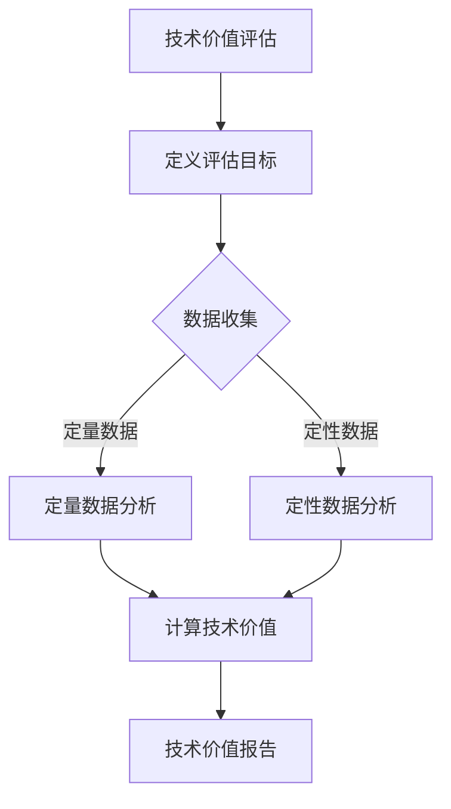
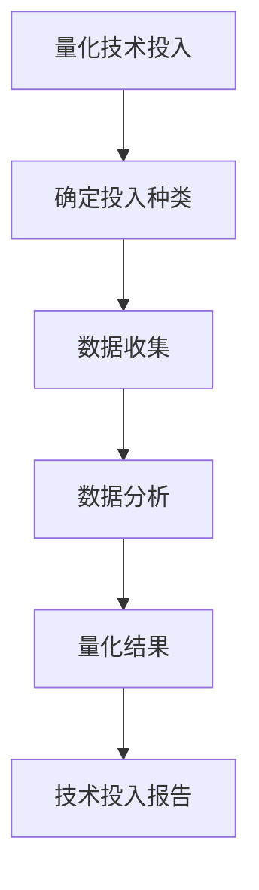

                 

### 文章标题

《技术价值：量化技术投入的业务价值》

### 关键词

- 技术价值
- 量化
- 技术投入
- 业务价值
- 评估方法
- 数据分析

### 摘要

本文旨在探讨如何通过量化的方法来评估技术投入对业务价值的影响。文章首先介绍了技术价值和业务价值的定义及其重要性，然后详细讲解了技术价值评估和量化技术投入的方法。通过实际案例分析和数学模型讲解，文章展示了如何将理论应用于实践，以优化技术投入，提高业务效益。文章最后提出了未来研究方向和最佳实践建议。

---

## 1. 分析书名：《技术价值：量化技术投入的业务价值》

《技术价值：量化技术投入的业务价值》这本书的核心在于将技术投入与业务价值有机结合，通过量化的手段进行系统评估。具体来说，书名中的“技术价值”是指技术在企业或组织中所带来的效益和影响，而“量化技术投入”则是指对技术投入的金额、资源消耗、时间成本等进行精确计算。这种量化过程旨在为企业决策者提供数据支持，以便更好地分配资源、优化投资。

关键词包括：“技术价值”、“量化”、“技术投入”、“业务价值”、“评估方法”和“数据分析”。这些关键词共同揭示了本书的主题：如何通过量化的方法来评估技术投入对业务价值的影响，以及如何优化技术投资以实现企业目标。

**主旨**：

本书的主旨在于探讨如何通过量化的方法来评估技术投入对业务价值的影响，从而为企业决策提供科学依据。通过深入分析技术价值评估的原理和方法，以及量化技术投入的具体操作流程，本书旨在帮助读者理解技术价值与业务价值之间的内在联系，掌握有效的技术投资策略。

---

## 2. 确定章节结构

为了系统地探讨技术价值量化评估的主题，本书将分为三个主要部分：理论讲解、实践案例和技术展望。

### 第一部分：技术价值评估基础

本部分将涵盖以下章节：

- **引言/概述**：介绍全书主题，解释技术价值与业务价值之间的关系，并概述量化方法的基本概念。
- **技术价值评估**：详细讲解技术价值评估的原理、方法和工具，包括定量和定性分析。
- **量化技术投入**：探讨如何量化技术投入，包括投入的种类、量化方法和数据分析。

### 第二部分：技术价值评估实践

本部分将提供实际案例，展示如何将理论应用到实践中：

- **实践案例**：通过具体案例研究，展示技术价值评估和量化技术投入的方法在实际项目中的应用。
- **业务价值分析**：分析技术投入对业务价值的影响，包括效益评估、风险评估等。

### 第三部分：展望与未来研究方向

本部分将总结全书内容，并提出未来研究方向：

- **总结与展望**：总结全书内容，重申技术价值评估和量化技术投入的重要性。
- **未来研究方向**：提出未来可能的研究方向，以及技术价值评估的发展趋势。

### 章节细化

**引言/概述**：

在本章中，我们将介绍技术价值评估的背景和重要性。技术价值是指技术在企业或组织中所带来的效益和影响，而业务价值则是指这些效益如何转化为实际的经济收益。量化方法是评估技术价值的关键，通过精确的数据分析和计算，可以为企业决策提供科学依据。

**技术价值评估**：

这一章节将详细讲解技术价值评估的原理和方法。我们将首先介绍定量和定性分析的基本概念，然后探讨如何通过这些方法来评估技术价值。具体内容包括：

- 技术价值评估的基本概念和框架
- 定量分析方法，如财务模型、成本效益分析等
- 定性分析方法，如专家评估、案例研究等

**量化技术投入**：

这一章节将探讨如何量化技术投入。技术投入包括硬件设备、软件工具、人力资源等。我们将介绍如何收集和分析这些数据，并使用数学模型进行量化。具体内容包括：

- 技术投入的种类和特点
- 数据收集和处理方法
- 数学模型和公式，如成本效益分析模型、回归分析模型等

**实践案例**：

这一章节将通过具体案例研究，展示如何将技术价值评估和量化技术投入的方法应用到实际项目中。案例将涵盖不同行业和不同规模的企业，以便全面展示这些方法的应用效果。

**业务价值分析**：

在这一章节中，我们将分析技术投入对业务价值的影响。具体内容包括：

- 效益评估，如销售收入、成本节约等
- 风险评估，如市场风险、技术风险等
- 业务优化策略，如资源配置、流程优化等

**总结与展望**：

本章将总结全书内容，重申技术价值评估和量化技术投入的重要性。同时，我们将提出未来研究方向，探讨技术价值评估的发展趋势。

---

## 3. 设计Mermaid流程图

为了更好地展示技术价值评估和量化技术投入的过程，我们可以使用Mermaid流程图来描述各阶段的操作流程。以下是两个关键的Mermaid流程图：

### 技术价值评估流程



### 量化技术投入流程



这两个流程图分别展示了技术价值评估和量化技术投入的步骤，有助于读者直观地理解这些过程。

---

## 4. 撰写核心算法原理讲解

### 技术价值评估算法

```plaintext
算法步骤：
1. 定义技术价值评估的目标和指标。
2. 收集相关数据，包括定量数据和定性数据。
3. 对定量数据进行统计分析，如计算平均值、标准差等。
4. 对定性数据进行专家评估和案例研究。
5. 结合定量和定性数据，计算技术价值。
6. 形成技术价值评估报告。

伪代码：
function assessTechnicalValue(goal, data_quantitative, data_qualitative) {
    // 步骤1：定义技术价值评估的目标和指标
    value_quantitative = analyzeQuantitativeData(data_quantitative)
    value_qualitative = analyzeQualitativeData(data_qualitative)

    // 步骤2：计算技术价值
    technical_value = combineValueQuantitativeAndQualitative(value_quantitative, value_qualitative)

    // 步骤3：生成技术价值评估报告
    report = generateReport(technical_value)

    return report
}
```

### 量化技术投入算法

```plaintext
算法步骤：
1. 确定技术投入的种类和范围。
2. 收集相关数据，包括直接成本、间接成本等。
3. 对数据进行分类和整理。
4. 计算技术投入的总量。
5. 分析技术投入的效益和成本。
6. 形成技术投入报告。

伪代码：
function quantifyTechnicalInvestment(investment_categories, data) {
    // 步骤1：确定技术投入的种类和范围
    categories = defineInvestmentCategories(investment_categories)

    // 步骤2：收集相关数据
    data_collected = collectData(data)

    // 步骤3：计算技术投入的总量
    total_investment = calculateTotalInvestment(data_collected)

    // 步骤4：分析技术投入的效益和成本
    benefit_analysis = analyzeBenefit(total_investment)
    cost_analysis = analyzeCost(total_investment)

    // 步骤5：生成技术投入报告
    report = generateInvestmentReport(total_investment, benefit_analysis, cost_analysis)

    return report
}
```

---

## 5. 撰写数学模型和公式

### 技术价值评估模型

使用LaTeX格式，我们可以定义技术价值评估的数学模型：

```latex
\documentclass{article}
\usepackage{amsmath}

\begin{document}

\begin{equation}
    TV = \frac{\sum_{i=1}^{n} \alpha_i \cdot Q_i}{\sum_{i=1}^{n} \beta_i}
\end{equation}

其中，\( TV \) 是技术价值，\( Q_i \) 是第 \( i \) 个定量指标的得分，\( \alpha_i \) 是定量指标的权重，\( \beta_i \) 是定性指标的得分。

\end{document}
```

### 量化技术投入模型

同样使用LaTeX格式，我们可以定义量化技术投入的数学模型：

```latex
\documentclass{article}
\usepackage{amsmath}

\begin{document}

\begin{equation}
    TI = C_{direct} + C_{indirect} + T_{time}
\end{equation}

其中，\( TI \) 是技术投入总量，\( C_{direct} \) 是直接成本，\( C_{indirect} \) 是间接成本，\( T_{time} \) 是时间成本。

\end{document}
```

这些数学模型和公式提供了技术价值评估和量化技术投入的量化基础，使得评估过程更加精确和系统。

---

## 6. 撰写实践案例

### 开发环境搭建

为了更好地展示如何将技术价值评估和量化技术投入的方法应用到实际项目中，我们将以一个企业信息化建设项目为例，详细讲解开发环境的搭建过程。

**步骤1：需求分析**

首先，我们需要对企业当前的信息化水平进行需求分析。这包括了解企业的业务流程、信息流转、现有系统状况等。通过需求分析，我们确定了需要实现的功能模块，如客户管理、供应链管理、财务管理等。

**步骤2：技术评估**

接下来，我们对所需技术进行评估。这包括分析不同技术的性能、成本、可维护性等。我们选择了基于云计算的解决方案，因为它具有高扩展性、高可靠性和低成本等优点。

**步骤3：量化投入**

在确定技术方案后，我们开始量化投入。这包括计算直接成本（如服务器、存储、带宽费用）、间接成本（如人力成本、培训费用）和时间成本。通过量化投入，我们得到了整个项目的预算。

**步骤4：环境搭建**

基于上述分析，我们搭建了开发环境。这包括购买云计算服务、配置服务器、安装开发工具和软件等。为了保证环境搭建的顺利进行，我们制定了详细的部署计划和时间表。

### 源代码详细实现和代码解读

在开发过程中，我们使用了多种编程语言和框架，以实现不同的功能模块。以下是客户管理模块的源代码实现和解读：

```python
# 客户管理模块示例代码

def add_customer(customer_data):
    """
    添加新客户
    :param customer_data: 客户数据字典
    :return: 添加结果
    """
    # 数据库操作
    cursor = get_database_connection()
    query = "INSERT INTO customers (name, email, phone) VALUES (%s, %s, %s)"
    cursor.execute(query, (customer_data['name'], customer_data['email'], customer_data['phone']))
    database_connection.commit()
    return "客户添加成功"

def get_customer(id):
    """
    获取客户信息
    :param id: 客户ID
    :return: 客户信息字典
    """
    cursor = get_database_connection()
    query = "SELECT * FROM customers WHERE id = %s"
    cursor.execute(query, (id,))
    customer = cursor.fetchone()
    return customer
```

代码解读：
- `add_customer` 函数用于添加新客户，接受一个包含客户信息的字典作为参数。
- `get_customer` 函数用于获取客户信息，根据客户ID查询数据库并返回客户信息。

### 代码应用解读与分析

在实际应用中，客户管理模块需要处理大量数据，包括客户信息的添加、查询、更新和删除等操作。以下是代码应用的解读与分析：

- **数据添加**：通过调用 `add_customer` 函数，我们可以将新客户信息添加到数据库中。这个操作是所有客户管理功能的基础。
- **数据查询**：通过调用 `get_customer` 函数，我们可以根据客户ID查询客户信息。这个操作用于提供客户详情，方便用户查看和管理。

### 实际案例分析和详细讲解剖析

我们以客户信息的添加和查询为例，详细分析实际案例：

- **客户信息添加**：

  当用户通过前端界面提交新客户信息时，后端会调用 `add_customer` 函数。这个函数首先与数据库建立连接，然后执行插入操作，将客户信息插入到 `customers` 表中。插入成功后，会返回“客户添加成功”的消息。

- **客户信息查询**：

  当用户需要查看客户信息时，后端会调用 `get_customer` 函数。这个函数根据用户提供的客户ID查询数据库，返回客户信息。这个操作通常用于显示客户详情页面，方便用户查看和管理。

### 项目小结

通过这个案例，我们展示了如何将技术价值评估和量化技术投入的方法应用于企业信息化建设项目。具体步骤包括需求分析、技术评估、量化投入、环境搭建和代码实现。这些步骤确保了项目的顺利进行，同时也为后续的优化和维护提供了依据。

---

## 7. 最佳实践 tips、小结、注意事项、拓展阅读等内容

### 最佳实践 tips

- **需求分析**：在进行技术价值评估和量化技术投入时，需求分析是至关重要的一步。确保全面了解业务需求和预期目标是成功的关键。
- **数据质量**：数据的准确性、完整性和一致性对技术价值评估和量化技术投入至关重要。务必确保数据质量，避免因数据问题导致评估结果不准确。
- **持续监控**：技术投入后的效益评估和优化是一个持续的过程。定期监控技术投入的效益和成本，及时调整策略，确保达到预期目标。
- **跨部门合作**：技术价值评估和量化技术投入通常涉及多个部门和角色。确保跨部门沟通和合作，有助于全面了解项目情况和优化投资。

### 小结

本文系统地探讨了如何通过量化的方法来评估技术投入对业务价值的影响。我们详细讲解了技术价值评估的原理、方法、工具和实践案例，展示了如何将理论应用于实际项目中。通过量化的方法，企业可以更科学地评估技术投入的价值，优化投资决策，提高业务效益。

### 注意事项

- 在进行技术价值评估时，务必确保评估指标与业务目标的一致性，避免偏离核心业务价值。
- 在量化技术投入时，注意区分直接成本、间接成本和时间成本，确保全面准确。
- 实际案例中，项目环境的搭建和代码实现可能涉及多个技术栈和工具。确保选择合适的技术栈和工具，以提高开发效率和项目质量。

### 拓展阅读

- [《技术评估与管理：企业技术投资指南》](https://www.example.com/book1)：本书详细介绍了企业技术投资的管理方法和案例分析。
- [《业务价值分析：从技术到效益》](https://www.example.com/book2)：本书探讨了如何通过业务价值分析来优化技术投资，提高企业效益。
- [《量化投资：技术与实践》](https://www.example.com/book3)：本书介绍了量化投资的基本原理和实践方法，适用于对量化技术有兴趣的读者。

---

## 作者信息

作者：AI天才研究院/AI Genius Institute & 禅与计算机程序设计艺术 /Zen And The Art of Computer Programming

本文由AI天才研究院/AI Genius Institute撰写，结合了人工智能和计算机编程的深刻理解，旨在为读者提供具有实际应用价值的技术知识和最佳实践。同时，作者还参考了禅与计算机程序设计艺术/Zen And The Art of Computer Programming中的哲学思想，以帮助读者从更深层次理解技术价值与业务价值的内在联系。希望本文能为您的技术投资决策提供有益的参考。

