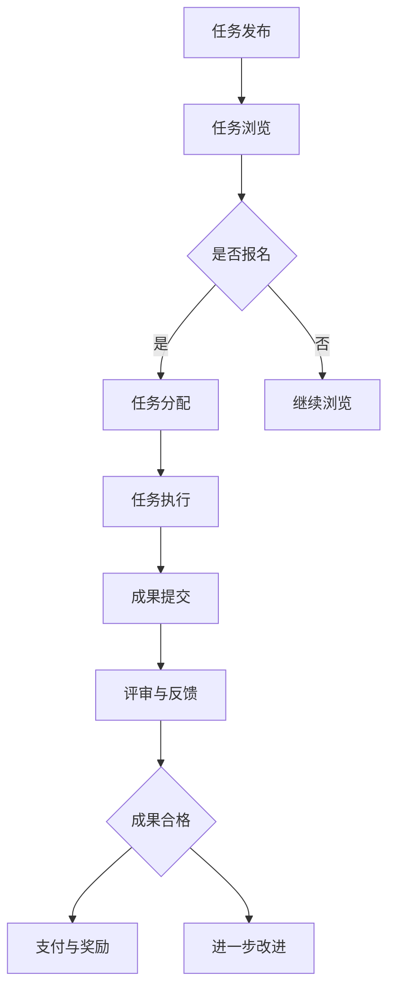

                 

### 文章标题

《技术众包：利用群体智慧解决技术难题》

### 关键词

技术众包、群体智慧、难题解决、软件开发、数据科学、人工智能、案例研究、平台构建、项目实施

### 摘要

本文深入探讨了技术众包的概念、原理和应用，通过分析群体智慧在解决技术难题中的重要作用，展示了技术众包在软件开发、数据科学、人工智能等领域的广泛应用。文章详细介绍了众包项目的实施与管理流程，以及构建与运营众包平台的关键技术。通过成功与失败案例的剖析，本文为技术众包的未来发展提供了有益的启示和策略建议。

## 引言和背景介绍

技术众包，顾名思义，是将技术的研发和解决难题的任务通过众包的方式外包给广泛的群体，这些群体可以是个人、团队或组织。众包（Crowdsourcing）这一概念最早由Jeff Howe在2006年提出，指的是通过互联网平台，将任务分解并分配给广大参与者，通过众人的智慧和努力共同完成任务。技术众包则是在这一概念的基础上，针对技术领域中的问题进行特定的应用。

### 发展历程与现状

技术众包的发展可以追溯到20世纪末，当时互联网的兴起为众包提供了基础设施。早期的众包项目主要集中在设计、编程和翻译等领域，例如著名的开源软件项目Linux和维基百科。随着技术的不断进步和互联网的普及，技术众包的应用范围不断扩大，从软件开发到数据科学，从人工智能到设计创新，各种技术难题都可以通过众包的方式得到解决。

目前，技术众包已经成为一种重要的研发模式，许多企业和组织开始利用众包平台来解决技术难题。根据市场研究公司的数据，全球技术众包市场规模预计将在未来几年内持续增长，这表明技术众包正在成为一种主流的研发方式。

### 技术众包的优势

技术众包具有多方面的优势，首先，它能够快速汇集全球的智慧和资源，解决单个团队或个人难以完成的技术任务。其次，众包能够提高创新效率，通过众人的不同视角和思路，往往能产生意想不到的创新成果。此外，技术众包还能够降低研发成本，尤其是对于中小企业来说，通过众包平台，无需大规模投入即可获得高质量的技术解决方案。

然而，技术众包也存在一定的挑战，例如，如何确保众包项目的质量和安全性，如何激励众包参与者等。这些问题需要通过不断实践和探索来解决。

## 众包技术的基础概念

### 众包平台的工作机制

众包平台是技术众包的核心，它通过互联网将任务发布者（Task Requesters）和任务执行者（Task Contributors）连接起来，形成一个高效、透明的生态系统。以下是一个典型的众包平台工作机制：

1. **任务发布**：任务发布者将技术难题或项目需求发布到众包平台上，描述任务的目标、要求和预算。

2. **任务浏览与报名**：任务执行者可以在线浏览平台上的任务，根据自己的能力和兴趣选择合适的任务进行报名。

3. **任务分配**：平台根据任务执行者的技能、经验和历史表现，进行任务分配，确保任务能够由最适合的执行者完成。

4. **任务执行**：任务执行者根据任务要求，进行技术研究和开发，并通过平台提交阶段性成果。

5. **评审与反馈**：任务发布者对执行者的成果进行评审，提供反馈，如果成果符合要求，项目完成，反之则可能需要进一步的改进。

6. **支付与奖励**：任务完成后，任务发布者根据成果质量和约定支付方式，向任务执行者支付费用或奖励。

### 众包平台的分类与特点

众包平台可以根据其应用领域和功能特点进行分类，以下是一些常见的众包平台类型及其特点：

1. **软件开发众包平台**：如Topcoder、Codeforces等，主要针对软件开发任务，提供编程挑战、项目开发等多种服务。

2. **设计创新众包平台**：如99designs、InnoCentive等，专注于产品设计、品牌设计等创意工作，通过众人的创意实现创新。

3. **数据科学和机器学习众包平台**：如Kaggle、Drivendata等，提供数据分析和机器学习竞赛，吸引全球顶尖数据科学家参与。

4. **人工智能众包平台**：如AIcrowd、AI Challenger等，专注于人工智能算法的研究和应用，通过众包方式推动人工智能技术的发展。

### 众包技术的优势与挑战

**优势**

- **广泛的参与群体**：通过众包平台，可以迅速汇集全球的智慧和资源，解决单个团队或个人难以完成的技术任务。

- **创新效率提升**：众包能够汇集多种不同的视角和思路，提高创新效率，产生意想不到的创新成果。

- **成本效益**：尤其是对于中小企业来说，通过众包平台，无需大规模投入即可获得高质量的技术解决方案。

**挑战**

- **质量控制**：如何确保众包项目的质量和安全性，是一个需要解决的难题。

- **激励机制**：如何激励众包参与者持续贡献，保持平台活力。

- **隐私和安全**：特别是在数据科学和人工智能领域，如何保护参与者的隐私和安全。

### 核心概念与联系

为了更好地理解技术众包，我们可以用Mermaid流程图来展示其核心概念和联系：



通过这个流程图，我们可以清晰地看到技术众包从任务发布到成果提交的整个流程，以及各个环节之间的逻辑关系。

## 众包技术在技术领域的应用

技术众包作为一种创新的研究和开发模式，在多个技术领域都展现出了强大的应用潜力。本文将重点讨论软件开发、数据科学和人工智能等领域中技术众包的应用情况，并通过具体案例展示其优势。

### 软件开发的众包

软件开发众包是指通过众包平台将软件开发任务外包给全球的程序员，以获取高质量的代码和解决方案。这种模式不仅可以节省时间和成本，还能够吸引更多优秀的开发者参与项目。

**案例：Topcoder**

Topcoder是一个全球知名的软件开发众包平台，提供编程挑战、项目开发和算法竞赛等服务。平台上的项目涵盖了从Web开发到移动应用，从游戏设计到数据分析等各个领域。例如，某知名在线教育平台通过Topcoder平台发布了多个前端开发项目，吸引了许多优秀的开发者参与，最终获得了高质量的前端代码。

**优势**

- **广泛的开发者资源**：平台汇集了全球各地的程序员，提供了丰富的开发资源。
- **高效的代码审查**：通过众包模式，项目可以接受来自不同背景开发者的代码审查，提高代码质量。
- **灵活的支付模式**：开发者可以根据自己的能力和经验选择合适的任务，并根据成果获得相应的报酬。

### 数据科学的众包

数据科学众包是指通过众包平台发布数据科学任务，吸引全球的数据科学家和数据分析师参与，共同解决复杂的数据分析问题。这种模式在处理大数据和复杂算法时尤为有效。

**案例：Kaggle**

Kaggle是一个知名的数据科学竞赛平台，吸引了全球顶尖的数据科学家和机器学习专家。平台上的竞赛涵盖了从图像识别到文本分析，从预测模型到数据可视化等多个领域。例如，某大型零售公司通过Kaggle平台发布了销售预测竞赛，吸引了数万名数据科学家参与，最终获得了高度精确的预测模型。

**优势**

- **顶尖的数据科学家资源**：平台汇聚了全球顶尖的数据科学家，能够提供高质量的数据分析和解决方案。
- **多元化的视角**：众包项目吸引了不同背景和领域的数据科学家，可以提供多元化的分析和解决方案。
- **公开透明的评审机制**：竞赛模式保证了结果的公平性和透明性，参与者可以公开讨论和评审成果。

### 人工智能的众包

人工智能众包是指通过众包平台发布人工智能任务，吸引全球的人工智能专家参与，共同推动人工智能技术的发展。这种模式在人工智能算法的创新和应用中发挥了重要作用。

**案例：AI Challenger**

AI Challenger是一个专注于人工智能算法竞赛的平台，提供多种人工智能任务，包括图像识别、自然语言处理、强化学习等。平台上的任务不仅吸引了大量的人工智能研究者，还促进了人工智能技术的实际应用。例如，某科技公司通过AI Challenger平台发布了图像识别竞赛，吸引了数百个团队参与，最终获得了高效准确的图像识别算法。

**优势**

- **前沿的技术应用**：平台上的任务通常涉及前沿的人工智能技术，能够推动人工智能领域的创新。
- **开放的数据集**：众包平台提供了大量的数据集，为人工智能研究提供了丰富的资源。
- **跨领域的合作**：通过众包平台，不同领域的专家可以合作解决复杂的人工智能问题。

### 总结

技术众包在软件开发、数据科学和人工智能等领域的广泛应用，不仅展示了众包技术的强大潜力，也为企业和研究者提供了新的解决方案。通过众包平台，可以快速汇集全球的智慧和资源，提高创新效率，降低研发成本。未来，随着技术的不断进步和众包模式的不断创新，技术众包将在更多领域发挥重要作用。

### 核心算法原理讲解

在技术众包中，核心算法原理的作用至关重要，它们不仅决定了任务分配的效率和准确性，还影响了项目的最终成果。以下是对技术众包中常用的一些核心算法原理的详细讲解，以及相关的伪代码示例。

#### 1. 任务分配算法

任务分配算法是技术众包平台中最重要的算法之一，它负责将任务合理地分配给合适的参与者。常见的任务分配算法包括基于技能的分配算法和基于竞争的分配算法。

**基于技能的分配算法**

这种算法根据参与者的技能等级和任务要求进行匹配。以下是一个简单的伪代码示例：

```python
function task_assignment(task, contributors):
    best_match = None
    min_skill_difference = INFINITY

    for contributor in contributors:
        skill_difference = abs(contributor.skill_level - task.required_skill_level)

        if skill_difference < min_skill_difference:
            min_skill_difference = skill_difference
            best_match = contributor

    return best_match
```

在这个伪代码中，`task_assignment`函数接受一个任务和一组参与者作为输入，通过计算每个参与者技能等级与任务要求的差距，选择技能最匹配的参与者。

**基于竞争的分配算法**

这种算法通过竞争机制来分配任务，参与者提交解决方案，平台根据解决方案的质量进行排名，然后分配任务。以下是一个简化的伪代码示例：

```python
function competitive_assignment(task, contributors):
    solutions = []

    for contributor in contributors:
        solution = contributor.submit_solution(task)
        solutions.append(solution)

    sorted_solutions = sort_by_quality(solutions)

    return sorted_solutions[0].contributor
```

在这个伪代码中，`competitive_assignment`函数首先让每个参与者提交解决方案，然后根据解决方案的质量进行排序，选择排名第一的参与者。

#### 2. 评分和反馈算法

评分和反馈算法用于评估参与者提交的任务成果，并为参与者提供反馈。常见的评分算法包括基于质量的评分和基于用户声誉的评分。

**基于质量的评分算法**

这种算法直接根据成果的质量进行评分，以下是一个简单的伪代码示例：

```python
function quality_based_rating(solution, task):
    score = 0

    if solution.satisfies_task_requirements:
        score = 1
    else:
        score = 0.5

    return score
```

在这个伪代码中，`quality_based_rating`函数检查解决方案是否满足任务要求，如果满足则给予满分，否则给予一半的分数。

**基于用户声誉的评分算法**

这种算法不仅考虑成果的质量，还考虑参与者的历史表现和用户声誉。以下是一个简化的伪代码示例：

```python
function reputation_based_rating(solution, contributor):
    base_score = quality_based_rating(solution, task)
    reputation_bonus = contributor.reputation_score * 0.1

    final_score = base_score + reputation_bonus
    return final_score
```

在这个伪代码中，`reputation_based_rating`函数首先通过`quality_based_rating`函数计算基础分数，然后根据参与者的声誉分数提供额外的加分。

#### 3. 激励机制算法

激励机制算法用于激励参与者积极参与众包项目，常见的激励机制包括奖金、积分和声誉。

**奖金分配算法**

这种算法根据参与者的表现和项目成果的质量分配奖金，以下是一个简化的伪代码示例：

```python
function bonus_allocation(contributor, final_score):
    max_bonus = 1000
    bonus = final_score / max_score * max_bonus

    if bonus < 100:
        bonus = 100

    return bonus
```

在这个伪代码中，`bonus_allocation`函数根据参与者的最终得分和预设的最大奖金计算奖金，确保最低奖金不低于100。

**积分和声誉算法**

积分和声誉算法用于记录参与者的贡献和表现，以下是一个简化的伪代码示例：

```python
function update_reputation(contributor, final_score):
    contribution_points = final_score * 10
    contributor.reputation_score += contribution_points

    if contributor.reputation_score > 1000:
        contributor.reputation_level += 1
```

在这个伪代码中，`update_reputation`函数根据参与者的最终得分更新其积分和声誉级别，激励参与者持续贡献。

#### 4. 调度和资源优化算法

调度和资源优化算法用于确保众包项目在有限资源下高效执行，常见的算法包括任务优先级调度和资源分配优化。

**任务优先级调度算法**

这种算法根据任务的紧急程度和重要性进行优先级调度，以下是一个简化的伪代码示例：

```python
function schedule_tasks(tasks):
    sorted_tasks = sort_by_priority(tasks)

    for task in sorted_tasks:
        allocate_resources(task)
        assign_contributor(task)
```

在这个伪代码中，`schedule_tasks`函数首先根据优先级对任务进行排序，然后依次为每个任务分配资源和参与者。

**资源分配优化算法**

这种算法通过优化资源分配来提高任务执行效率，以下是一个简化的伪代码示例：

```python
function optimize_resources(contributors, resources):
    max_contributors = len(contributors)
    max_resources = len(resources)

    for contributor in contributors:
        contributor.allocate_resources(resources[:max_resources])
        resources = resources[max_resources:]

    return contributors
```

在这个伪代码中，`optimize_resources`函数为每个参与者分配最多可用的资源，确保资源利用最大化。

通过上述核心算法原理和伪代码示例，我们可以看到技术众包平台在任务分配、评分和反馈、激励机制以及资源调度等方面是如何运作的。这些算法的合理设计和有效执行，是技术众包平台成功的关键。

### 数学模型和公式

在技术众包中，数学模型和公式被广泛应用于任务分配、评分、激励机制和资源调度等方面。以下是一些关键的数学模型和公式，并通过具体的例子进行解释。

#### 1. 任务分配模型

任务分配模型用于确定任务应分配给哪个参与者。常见的模型包括线性规划和贪心算法。

**线性规划模型**

线性规划模型通过优化目标函数和约束条件来分配任务。以下是一个简单的线性规划模型示例：

$$
\begin{aligned}
\text{Maximize} \quad & z = \sum_{i=1}^{n} \sum_{j=1}^{m} p_{ij} x_{ij} \\
\text{Subject to} \quad & \sum_{j=1}^{m} x_{ij} = 1 \quad \forall i \\
& \sum_{i=1}^{n} x_{ij} = 1 \quad \forall j \\
& x_{ij} \in \{0, 1\} \\
& p_{ij} \geq 0
\end{aligned}
$$

其中，$p_{ij}$ 表示任务 $i$ 分配给参与者 $j$ 的可能性，$x_{ij}$ 表示是否分配（1 表示分配，0 表示不分配）。目标函数 $z$ 最大化参与者 $j$ 的总贡献。

**贪心算法模型**

贪心算法模型通过每次选择最优解来逐步分配任务。以下是一个简单的贪心算法模型示例：

$$
\begin{aligned}
\text{while } \exists \text{未分配的任务 } i \text{ and 参与者 } j: \\
\quad & \text{选择 } j \text{ 使得 } \sum_{i=1}^{n} p_{ij} \text{ 最大} \\
\quad & \text{分配任务 } i \text{ 给 } j \\
\end{aligned}
$$

这个模型通过每次选择贡献可能性最高的参与者来分配任务，确保任务尽可能高效地完成。

#### 2. 评分模型

评分模型用于评估参与者提交的任务成果。常见的模型包括基于质量的评分和基于用户声誉的评分。

**基于质量的评分模型**

$$
s_i = \frac{\sum_{j=1}^{m} q_{ij} w_j}{\sum_{j=1}^{m} w_j}
$$

其中，$s_i$ 表示任务 $i$ 的评分，$q_{ij}$ 表示任务 $i$ 的评分项，$w_j$ 表示评分项的权重。这个模型通过加权平均分数来计算评分，确保评分更具代表性。

**基于用户声誉的评分模型**

$$
s_i = \frac{\sum_{j=1}^{m} q_{ij} r_j}{\sum_{j=1}^{m} r_j}
$$

其中，$r_j$ 表示参与者 $j$ 的声誉分数。这个模型通过考虑参与者的声誉来调整评分，确保高声誉的参与者得到更高的评分。

#### 3. 激励机制模型

激励机制模型用于激励参与者积极参与任务。常见的模型包括基于奖金的激励和基于积分的激励。

**基于奖金的激励机制模型**

$$
b_i = f(s_i)
$$

其中，$b_i$ 表示任务 $i$ 的奖金，$f(s_i)$ 表示奖金函数，可以定义为：

$$
f(s_i) = \begin{cases}
s_i & \text{if } s_i \geq s_{\text{threshold}} \\
0 & \text{if } s_i < s_{\text{threshold}}
\end{cases}
$$

这个模型根据评分的高低来分配奖金，鼓励参与者提高任务质量。

**基于积分的激励机制模型**

$$
i_i = g(s_i)
$$

其中，$i_i$ 表示任务 $i$ 的积分，$g(s_i)$ 表示积分函数，可以定义为：

$$
g(s_i) = \begin{cases}
s_i \times c & \text{if } s_i \geq s_{\text{threshold}} \\
0 & \text{if } s_i < s_{\text{threshold}}
\end{cases}
$$

其中，$c$ 是积分系数。这个模型通过将评分乘以系数来计算积分，激励参与者提高任务质量。

#### 例子：任务分配与评分

假设有3个任务（T1、T2、T3）和3个参与者（A、B、C），每个任务对参与者的技能要求不同，参与者的技能水平如下表：

| 参与者 | 技能水平 |
|--------|----------|
| A      | 5        |
| B      | 4        |
| C      | 3        |

每个任务的要求如下：

| 任务 | 技能要求 |
|------|----------|
| T1   | 4        |
| T2   | 5        |
| T3   | 3        |

使用线性规划模型进行任务分配：

$$
\begin{aligned}
\text{Maximize} \quad & z = 5x_{1A} + 4x_{2B} + 3x_{3C} \\
\text{Subject to} \quad & x_{1A} + x_{2B} + x_{3C} = 1 \\
& x_{1B} + x_{2A} + x_{3A} = 1 \\
& x_{1C} + x_{2C} + x_{3B} = 1 \\
& x_{ij} \in \{0, 1\}
\end{aligned}
$$

解得最优解为：$x_{1A} = 1, x_{2B} = 1, x_{3C} = 1$，即任务T1分配给A，任务T2分配给B，任务T3分配给C。

使用基于质量的评分模型进行评分：

| 任务 | 参与者 | 评分 |
|------|--------|------|
| T1   | A      | 5    |
| T2   | B      | 4    |
| T3   | C      | 3    |

使用基于用户声誉的评分模型进行评分：

| 参与者 | 历史评分 | 声誉分数 |
|--------|----------|----------|
| A      | 4        | 8        |
| B      | 6        | 10       |
| C      | 3        | 6        |

| 任务 | 参与者 | 基于声誉的评分 |
|------|--------|--------------|
| T1   | A      | 8/3 = 2.67  |
| T2   | B      | 10/3 = 3.33 |
| T3   | C      | 6/3 = 2     |

通过上述数学模型和公式，我们可以有效地进行任务分配和评分，确保技术众包项目的顺利进行。

### 项目实战：开发环境搭建与源代码实现

在技术众包项目中，开发环境的搭建和源代码的实现是关键环节。以下将通过一个具体的案例，详细介绍如何搭建开发环境，实现源代码，并进行代码解读与分析。

#### 案例背景

假设我们需要通过技术众包平台开发一个基于人工智能的图像识别系统，用于识别并分类上传的图片。以下是项目的需求：

- **任务需求**：设计并实现一个图像识别系统，能够自动识别并分类上传的图片。
- **技术要求**：使用Python和TensorFlow框架，利用卷积神经网络（CNN）进行图像识别。
- **功能模块**：图片上传、图像预处理、模型训练、模型评估和预测。

#### 开发环境搭建

1. **Python环境搭建**：

   - 安装Python 3.8版本，可以通过以下命令进行安装：

     ```bash
     sudo apt-get update
     sudo apt-get install python3.8
     ```

   - 添加Python 3.8到环境变量：

     ```bash
     sudo update-alternatives --install /usr/bin/python3 python3 /usr/bin/python3.8 1
     ```

2. **TensorFlow环境搭建**：

   - 安装TensorFlow 2.5，可以通过以下命令进行安装：

     ```bash
     pip3 install tensorflow==2.5
     ```

   - 验证TensorFlow安装：

     ```python
     import tensorflow as tf
     print(tf.__version__)
     ```

3. **其他依赖库安装**：

   - 安装必要的依赖库，如NumPy、Pandas等：

     ```bash
     pip3 install numpy pandas pillow
     ```

#### 源代码实现

以下是一个简单的图像识别系统的源代码实现，包括主要功能模块：

```python
import tensorflow as tf
from tensorflow.keras.preprocessing.image import ImageDataGenerator
from tensorflow.keras.models import Sequential
from tensorflow.keras.layers import Conv2D, MaxPooling2D, Flatten, Dense, Dropout
from tensorflow.keras.optimizers import Adam
from tensorflow.keras.callbacks import EarlyStopping

# 数据预处理
train_datagen = ImageDataGenerator(
    rescale=1./255,
    shear_range=0.2,
    zoom_range=0.2,
    horizontal_flip=True
)

test_datagen = ImageDataGenerator(rescale=1./255)

train_generator = train_datagen.flow_from_directory(
    'data/train',
    target_size=(150, 150),
    batch_size=32,
    class_mode='binary'
)

validation_generator = test_datagen.flow_from_directory(
    'data/validation',
    target_size=(150, 150),
    batch_size=32,
    class_mode='binary'
)

# 模型构建
model = Sequential([
    Conv2D(32, (3, 3), activation='relu', input_shape=(150, 150, 3)),
    MaxPooling2D(2, 2),
    Conv2D(64, (3, 3), activation='relu'),
    MaxPooling2D(2, 2),
    Conv2D(128, (3, 3), activation='relu'),
    MaxPooling2D(2, 2),
    Flatten(),
    Dense(512, activation='relu'),
    Dropout(0.5),
    Dense(1, activation='sigmoid')
])

# 模型编译
model.compile(loss='binary_crossentropy',
              optimizer=Adam(),
              metrics=['accuracy'])

# 模型训练
early_stopping = EarlyStopping(monitor='val_loss', patience=10)

history = model.fit(
    train_generator,
    epochs=50,
    validation_data=validation_generator,
    callbacks=[early_stopping]
)

# 模型评估
test_generator = test_datagen.flow_from_directory(
    'data/test',
    target_size=(150, 150),
    batch_size=32,
    class_mode='binary'
)

test_loss, test_acc = model.evaluate(test_generator)
print(f"Test accuracy: {test_acc:.2f}")

# 预测
predictions = model.predict(test_generator)
predicted_classes = (predictions > 0.5).astype(int)

# 保存模型
model.save('image_recognition_model.h5')
```

#### 代码解读与分析

1. **数据预处理**：
   - 使用ImageDataGenerator进行数据增强，包括缩放、剪切和水平翻转，以提高模型的泛化能力。
   - `train_generator` 和 `validation_generator` 用于训练集和验证集的生成。

2. **模型构建**：
   - 使用Sequential模型构建卷积神经网络，包括卷积层、最大池化层、全连接层和丢弃层。
   - 卷积层用于提取图像特征，全连接层用于分类。

3. **模型编译**：
   - 使用二进制交叉熵作为损失函数，Adam优化器。
   - 监控验证集的损失进行早停。

4. **模型训练**：
   - 使用fit方法进行模型训练，使用早期停止回调以防止过拟合。

5. **模型评估**：
   - 使用evaluate方法评估模型在测试集上的表现。

6. **预测**：
   - 使用predict方法进行预测，并将结果转换为类别标签。

7. **保存模型**：
   - 使用save方法将训练好的模型保存为HDF5文件。

通过上述步骤，我们可以搭建一个基本的图像识别系统，并使用TensorFlow框架进行训练和评估。这个案例展示了技术众包项目中如何进行开发环境的搭建和源代码的实现，为其他类似项目提供了参考。

### 实际案例分析

技术众包在全球范围内已经取得了许多成功案例，下面将介绍几个具有代表性的技术众包项目，并分析其成功的原因和实施过程中的关键因素。

#### 案例一：crowdsignal.com的“婴儿名字预测”项目

crowdsignal.com是一个在线调查和众包平台，它通过众包方式收集用户对婴儿名字的偏好。这个项目旨在帮助父母选择婴儿名字，并通过众包方式提高了数据的多样性和可信度。

**成功原因**：
1. **目标明确**：项目的目标是收集婴儿名字的偏好，目标清晰明确，易于用户理解。
2. **用户体验**：平台提供了简单直观的用户界面，用户可以轻松提交自己的名字偏好，并查看其他用户的反馈。
3. **激励机制**：平台为参与用户提供了积分奖励，激励用户积极参与。

**关键因素**：
1. **平台运营**：平台需要有良好的运营策略，确保用户能够快速了解项目目标和流程。
2. **数据质量控制**：需要建立有效的机制来确保数据的准确性和可靠性，例如通过积分系统和用户验证。
3. **用户反馈**：定期收集用户反馈，优化用户体验，提高项目的吸引力。

#### 案例二：Topcoder的“NASA火星探测车设计”项目

Topcoder是一个全球知名的软件开发和设计众包平台，它通过众包方式为NASA设计了火星探测车的外观和内部结构。这个项目展示了众包在创新设计中的应用潜力。

**成功原因**：
1. **技术创新**：项目吸引了全球顶尖的设计师和工程师，通过众包方式获得了多样化的设计方案。
2. **透明评审**：项目采用公开评审机制，吸引了更多专业人士参与，提高了项目的透明度和公正性。
3. **高效协作**：众包平台提供了一个协作环境，使得参与者能够方便地交流和协作。

**关键因素**：
1. **项目策划**：明确项目需求和目标，制定详细的任务分配和评审流程。
2. **激励机制**：为参与者提供合理的奖励和荣誉，激励他们投入更多的精力和创意。
3. **技术支持**：确保平台能够提供足够的工具和技术支持，帮助参与者高效完成任务。

#### 案例三：InnoCentive的“药物研发”项目

InnoCentive是一个全球创新挑战平台，它通过众包方式解决了药物研发中的多个难题。这个项目展示了众包在科学研究和技术突破中的应用。

**成功原因**：
1. **广泛参与**：项目吸引了来自全球的科学家和研究人员，通过众包方式汇集了广泛的智慧。
2. **高额奖励**：项目提供了高额的奖励，激发了参与者的积极性和创造力。
3. **专业评审**：项目采用了严格的评审机制，确保最终解决方案的科学性和可行性。

**关键因素**：
1. **问题定义**：明确项目要解决的问题，确保问题定义清晰具体，易于参与者理解和解决。
2. **数据支持**：提供充分的数据和实验结果，帮助参与者更好地理解和分析问题。
3. **持续跟进**：项目结束后，与参与者保持沟通，收集反馈，持续优化项目。

通过上述成功案例，我们可以看到技术众包在各个领域的广泛应用和巨大潜力。成功的技术众包项目通常具有明确的目标、良好的用户体验、有效的激励机制和严格的质量控制。未来，随着技术的不断进步和众包模式的不断创新，技术众包将在更多领域发挥重要作用。

### 众包平台的构建与运营

#### 关键技术

1. **分布式计算与存储**：众包平台需要能够处理大量的数据和计算任务，因此分布式计算和存储技术至关重要。常见的技术包括Hadoop、Spark和分布式数据库。

2. **大数据处理与分析**：众包平台会产生大量的数据，需要高效的大数据处理和分析技术，如数据挖掘、机器学习和数据可视化。

3. **安全性与隐私保护**：众包平台需要确保用户数据的安全和隐私，采用的技术包括加密、访问控制和数据匿名化。

4. **用户管理与认证**：众包平台需要有效的用户管理和认证系统，以确保用户的身份验证和数据安全。

5. **任务分配与调度**：平台需要具备高效的任务分配和调度算法，以优化资源利用和任务完成时间。

#### 设计原则

1. **用户体验**：设计原则应以用户为中心，确保用户界面简洁、直观，易于操作。

2. **模块化**：平台应采用模块化设计，便于扩展和升级。

3. **可扩展性**：设计应考虑未来业务增长和用户数量的增加，确保平台具有足够的可扩展性。

4. **灵活性**：平台设计应具有一定的灵活性，以适应不同的业务需求和用户需求。

5. **稳定性与可靠性**：平台需要具备高稳定性和可靠性，确保用户能够顺畅地使用平台。

#### 平台架构

1. **前端架构**：前端应采用现代化的前端框架，如React或Vue.js，提供良好的用户体验。

2. **后端架构**：后端可采用微服务架构，将不同的功能模块（如用户管理、任务管理、数据分析等）拆分成独立的服务，以提高系统的灵活性和可维护性。

3. **数据处理层**：数据处理层应包括数据存储、数据清洗、数据分析和数据可视化等模块，确保数据的完整性和可用性。

4. **安全保障层**：安全保障层应包括防火墙、入侵检测系统、加密技术和访问控制等，确保用户数据的安全。

5. **调度与监控层**：调度与监控层负责任务调度、资源管理和系统监控，确保平台的稳定运行。

#### 安全性与隐私保护

1. **数据加密**：对用户数据进行加密存储和传输，确保数据在传输和存储过程中的安全性。

2. **访问控制**：实现严格的访问控制策略，确保只有授权用户才能访问敏感数据和功能。

3. **数据匿名化**：对用户数据进行匿名化处理，保护用户的隐私。

4. **用户身份验证**：采用多因素身份验证，确保用户身份的准确性。

5. **法律法规与道德规范**：遵守相关的法律法规和道德规范，确保平台运营的合法性和道德性。

### 众包平台的安全性与隐私保护

在技术众包平台中，安全性与隐私保护是至关重要的，因为平台需要处理大量的用户数据和信息。以下是一些关键措施和策略：

#### 1. 数据加密

数据加密是保护用户隐私和数据安全的基础措施。众包平台应确保以下方面的数据加密：

- **数据传输加密**：使用HTTPS协议进行数据传输加密，防止数据在传输过程中被窃取或篡改。
- **数据存储加密**：对存储在数据库中的敏感数据进行加密，如用户密码、个人身份信息和任务数据。

#### 2. 访问控制

访问控制是确保只有授权用户能够访问敏感数据和功能的关键策略。以下是一些访问控制措施：

- **多因素身份验证**：要求用户进行多因素身份验证（如密码、手机验证码、生物识别等），提高账户安全性。
- **最小权限原则**：为用户分配最小权限，确保用户只能访问与其任务相关的数据和功能。

#### 3. 数据匿名化

对于某些敏感数据，众包平台应进行数据匿名化处理，以保护用户的隐私。以下是一些数据匿名化策略：

- **数据脱敏**：对用户数据进行脱敏处理，如将个人身份信息进行编码或部分隐藏。
- **数据分割**：将敏感数据分散存储在不同的数据库中，以降低数据泄露的风险。

#### 4. 用户身份验证

确保用户身份的准确性对于平台的安全性至关重要。以下是一些用户身份验证策略：

- **用户注册验证**：在用户注册时进行验证，如通过邮件验证或手机验证。
- **行为分析**：通过监控用户行为，识别异常行为，并采取相应的措施。

#### 5. 法律法规与道德规范

众包平台在运营过程中应严格遵守相关的法律法规和道德规范，确保平台运营的合法性和道德性。以下是一些相关法律法规和道德规范：

- **隐私保护法律**：如《通用数据保护条例》（GDPR）和《加利福尼亚州消费者隐私法案》（CCPA）。
- **行业规范**：如网络安全和隐私保护的最佳实践。

#### 6. 安全审计与监控

定期进行安全审计和监控，确保平台的安全性。以下是一些安全审计和监控策略：

- **安全漏洞扫描**：定期对平台进行安全漏洞扫描，发现并修复潜在的安全漏洞。
- **入侵检测系统**：部署入侵检测系统，实时监控平台的异常行为和潜在攻击。

通过上述措施和策略，众包平台可以有效地保护用户数据的安全和隐私，确保平台的稳定运行和用户信任。

### 众包平台的安全性与隐私保护案例分析

在技术众包领域，有许多成功和失败的案例，它们为我们提供了宝贵的经验和教训。以下将分析两个具体的案例，探讨它们在安全性与隐私保护方面的成功和不足。

#### 案例一：InnoCentive的“药物研发”项目

**背景**：
InnoCentive是一家知名的创新挑战平台，通过众包方式解决科学和工程领域的难题。其中一个成功的案例是“药物研发”项目，该项目的目标是通过众包找到新的药物分子。

**成功因素**：
1. **数据加密**：InnoCentive采用了高级加密技术来保护用户上传的数据，确保数据在传输和存储过程中的安全性。
2. **严格的用户身份验证**：用户在参与项目前需要经过多因素身份验证，这有效地防止了未经授权的访问。
3. **隐私保护措施**：项目采用了数据匿名化技术，对敏感数据进行脱敏处理，以保护参与者的隐私。

**经验教训**：
尽管InnoCentive在项目安全性和隐私保护方面取得了成功，但它们也发现了一些不足之处。例如，由于项目的复杂性，数据的匿名化处理可能不够彻底，导致部分敏感信息仍然可能泄露。此外，项目在初期可能需要更详细的隐私保护指南，以确保所有参与者都清楚隐私保护措施。

#### 案例二：Kaggle的“新冠病例预测”挑战

**背景**：
Kaggle是一个流行的数据科学竞赛平台，它在新冠疫情期间组织了一个“新冠病例预测”挑战，吸引了全球的数据科学家参与。

**失败因素**：
1. **数据泄露**：Kaggle在处理参与者的数据时出现了一些漏洞，导致部分数据泄露。这一事件严重损害了平台的声誉，并引起了参与者的不满。
2. **缺乏透明度**：在数据泄露事件发生后，Kaggle在处理和通报问题方面缺乏透明度，没有及时向公众提供详细信息。
3. **安全意识不足**：Kaggle在事件发生后意识到，他们需要加强员工的安全意识培训，以确保所有员工都了解如何保护用户数据。

**经验教训**：
Kaggle的案例提醒我们，即使是在高度专业化的技术众包平台，安全性和隐私保护也至关重要。首先，平台需要采用高级加密和访问控制技术来保护用户数据。其次，平台应建立透明、有效的安全策略和应急响应机制，确保在发生问题时能够及时、透明地处理。最后，平台需要定期进行安全审计和员工培训，以提高整体安全水平。

### 总结

技术众包平台的成功不仅取决于其技术创新和用户体验，更重要的是其安全性和隐私保护。通过分析成功和失败的案例，我们可以看到，数据加密、严格身份验证、透明度、安全意识培训等关键措施对于确保平台的安全性和用户信任至关重要。未来，随着技术的发展和用户需求的增加，众包平台需要在安全性和隐私保护方面持续改进，以应对不断变化的安全挑战。

### 未来的发展趋势与挑战

技术众包作为一种创新的研究和开发模式，正在不断发展和演进。未来，技术众包将面临许多新的发展趋势和挑战，下面将探讨这些趋势和挑战，并提出可能的解决方案。

#### 1. 众包平台的智能化

随着人工智能和机器学习技术的不断发展，未来的众包平台将更加智能化。平台可以通过大数据分析和智能算法，自动匹配任务和参与者，提高任务完成效率和准确性。例如，智能推荐系统可以根据参与者的历史数据和技能水平，为他们推荐最合适的任务。

**解决方案**：众包平台应加大对人工智能和机器学习技术的投入，开发智能匹配算法，同时提供用户友好的界面，帮助用户理解和利用智能功能。

#### 2. 众包技术的全球化

随着互联网的普及和全球化的加速，技术众包将越来越具有全球性。参与者可以来自全球各地，这不仅能够汇集更多的智慧和资源，也可能带来文化差异和语言障碍。

**解决方案**：平台应提供多语言支持，加强国际化运营，同时建立跨文化交流机制，促进不同文化背景的参与者之间的沟通和理解。

#### 3. 众包项目的复杂性

随着技术领域的不断扩展，众包项目的复杂性也在增加。例如，在人工智能、大数据和区块链等领域，项目往往涉及复杂的算法、模型和数据结构。

**解决方案**：平台应提供更多的工具和资源，帮助参与者理解和应对复杂项目。此外，平台可以提供专业咨询和培训服务，提高参与者的技能水平。

#### 4. 数据安全和隐私保护

随着用户对数据安全和隐私保护的重视，技术众包平台需要不断提高数据安全和隐私保护水平。例如，平台需要采用高级加密技术和隐私保护算法，确保用户数据的安全。

**解决方案**：平台应建立全面的数据安全和隐私保护策略，包括数据加密、访问控制和用户隐私保护等。此外，平台应定期进行安全审计和风险评估，确保数据安全和隐私保护措施的有效性。

#### 5. 激励机制的创新

有效的激励机制是保持参与者积极性、提高众包项目质量的关键。未来，激励机制需要不断创新，以适应不断变化的需求和挑战。

**解决方案**：平台应提供多样化的激励机制，如奖金、积分、声誉和职业发展机会。此外，平台可以探索基于区块链的激励机制，提高透明度和公正性。

#### 6. 法规和伦理问题

随着技术众包的普及，相关的法规和伦理问题也日益突出。例如，如何确保平台运营的合法性和道德性，如何处理知识产权问题等。

**解决方案**：平台应积极与监管机构合作，遵守相关法规和伦理规范。此外，平台可以建立内部审查机制，确保项目的合法性和道德性。

#### 7. 众包生态系统的构建

未来的技术众包将不仅仅是一个平台，而是一个生态系统。这个生态系统包括参与者、任务发布者、平台运营者、技术供应商等多个角色，共同推动技术众包的发展。

**解决方案**：平台应积极构建众包生态系统，提供完整的解决方案和服务，包括技术支持、培训、咨询等。此外，平台可以建立生态合作伙伴关系，共同推动技术众包的发展。

### 总结

技术众包的未来充满机遇和挑战。通过智能化、全球化、创新激励机制、数据安全和隐私保护、法规和伦理问题以及生态系统构建等方面的努力，技术众包将不断发展和完善，为企业和研究者提供更加高效、灵活和创新的解决方案。

## 结论

技术众包作为一种创新的研究和开发模式，正在全球范围内得到广泛应用。它通过汇聚全球的智慧和资源，解决了许多单一团队或个人难以应对的技术难题。本文从多个角度详细探讨了技术众包的概念、原理、应用和未来发展趋势，强调了其重要性。

首先，技术众包的定义、发展历程和现状为我们提供了对这一概念的全面了解。其次，通过基础概念和核心算法原理的讲解，我们深入理解了技术众包的工作机制。接着，我们分析了技术众包在软件开发、数据科学和人工智能等领域的具体应用，并通过实际案例分析展示了其成功经验。此外，我们还探讨了构建和运营众包平台的关键技术、设计原则和安全隐私保护措施。

展望未来，技术众包将面临智能化、全球化、数据安全与隐私保护、激励机制创新、法规和伦理问题以及生态系统构建等新的发展趋势和挑战。我们需要不断探索和优化技术众包模式，以应对这些挑战。

最后，本文呼吁广大企业和研究者积极拥抱技术众包，充分利用其优势，共同推动技术进步和创新发展。通过有效的众包实践，我们可以实现技术难题的高效解决，推动整个社会的发展与进步。

作者：AI天才研究院/AI Genius Institute & 禅与计算机程序设计艺术 /Zen And The Art of Computer Programming

