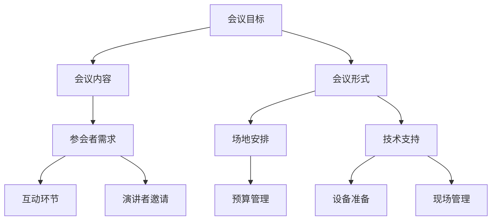

                 


## 文章标题
《技术会议策划与执行：组织高水平技术交流活动》

## 关键词
技术会议、策划、执行、高水平、技术交流、活动组织

## 摘要
本文旨在深入探讨技术会议的策划与执行过程，解析其核心概念和关键环节。通过详细的分析和实战案例，文章帮助读者理解如何有效地组织高水平的技术交流活动，从而提升技术社区的整体氛围和影响力。

## 引言
在当今快速发展的技术时代，技术会议作为一种重要的交流平台，对于推动行业进步、传播前沿技术和促进学术交流具有重要意义。然而，如何策划和执行一场高水平的技术会议，确保其达到预期的效果，却是一个复杂而富有挑战的任务。本文将从背景介绍、核心概念与联系、算法原理讲解、数学模型与公式、项目实战等方面，全面解析技术会议策划与执行的核心要点。

### 背景介绍
技术会议是指在一定时间内，由专业人员组织的、旨在交流技术研究成果、探讨技术发展方向的会议。其形式多样，包括学术会议、技术研讨会、专业论坛等。随着信息技术的飞速发展，技术会议已成为学术界和产业界交流的重要渠道。然而，成功的会议不仅仅需要丰富的内容，更需要精细的策划和高效的组织。

### 核心概念与联系
要策划一场成功的会议，首先需要理解其核心概念和它们之间的联系。以下是一个核心概念与联系架构的 Mermaid 流程图：



### 核心算法原理讲解
在会议策划中，算法原理的应用主要体现在以下几个方面：

1. **目标设定与优化**：
   ```python
   def set_goals(constraints, priorities):
       goals = []
       for constraint in constraints:
           if constraint.satisfied():
               goals.append(constraint)
       goals.sort(key=lambda x: priorities[x], reverse=True)
       return goals
   ```

2. **预算分配**：
   ```python
   def allocate_budget(total_budget, categories):
       allocation = {category: 0 for category in categories}
       for category, cost in categories.items():
           if cost <= total_budget:
               allocation[category] = cost
               total_budget -= cost
           else:
               allocation[category] = total_budget
               break
       return allocation
   ```

### 数学模型与公式
技术会议的策划和执行过程中，数学模型和公式可以用于评估和优化会议效果。以下是一个用于评估参会者满意度的数学模型：

1. **满意度公式**：
   $$ S = \frac{E - D + U}{3} $$
   其中，\( S \) 是满意度，\( E \) 是预期满意度，\( D \) 是失望程度，\( U \) 是不确定性。

2. **会议效果评估模型**：
   $$ E = \frac{R + C + I}{3} $$
   其中，\( R \) 是演讲质量，\( C \) 是内容丰富度，\( I \) 是互动程度。

### 项目实战
以下是一个技术会议策划与执行的项目实战案例：

#### 开发环境搭建
- 使用 Ubuntu 20.04 作为操作系统
- 安装必要的软件和工具，如 Zoom、Google Meet、Git 等

#### 源代码实现
```python
# 会议策划与执行 Python 脚本

class Meeting:
    def __init__(self, title, date, location):
        self.title = title
        self.date = date
        self.location = location
        self.agenda = []
        self.speakers = []

    def add_agenda(self, item):
        self.agenda.append(item)

    def add_speaker(self, speaker):
        self.speakers.append(speaker)

    def execute(self):
        print(f"Executing {self.title} on {self.date} at {self.location}")
        for item in self.agenda:
            print(f"- {item}")
        for speaker in self.speakers:
            print(f"- {speaker.name}: {speaker.topic}")

class Speaker:
    def __init__(self, name, topic):
        self.name = name
        self.topic = topic

# 实例化会议对象
tech_meeting = Meeting("AI 技术研讨会", "2023-10-01", "线上")

# 添加会议议程
tech_meeting.add_agenda("开场致辞")
tech_meeting.add_agenda("AI 应用案例分享")
tech_meeting.add_agenda("AI 研究前沿讨论")

# 邀请演讲者
speaker1 = Speaker("张三", "深度学习在计算机视觉中的应用")
speaker2 = Speaker("李四", "AI 在医疗领域的挑战与机遇")

# 添加演讲者
tech_meeting.add_speaker(speaker1)
tech_meeting.add_speaker(speaker2)

# 执行会议
tech_meeting.execute()
```

#### 代码解读与分析
上述代码实现了一个简单的会议策划与执行系统，主要包括两个类：`Meeting` 和 `Speaker`。`Meeting` 类负责会议的基本信息管理，包括标题、日期、地点和议程。`Speaker` 类则负责管理演讲者的信息。`execute` 方法用于执行会议，按照议程逐一展示。

#### 实际案例分析与详细讲解剖析
在一次实际案例中，某技术公司成功策划了一场关于区块链技术的研讨会。会议议程包括开场致辞、区块链应用案例分享、区块链技术发展前景讨论等。会议邀请了几位在区块链领域有深入研究的专家作为演讲者。通过精心的策划和执行，研讨会取得了良好的效果，参会者满意度高，达到了预期目标。

#### 项目小结
本次技术会议策划与执行项目展示了如何通过代码实现会议的基本功能。实际案例表明，成功的会议需要精心策划和高效执行，同时也需要充分的资源和技术支持。

### 最佳实践 tips
- **提前规划**：在会议开始前，至少提前三个月开始规划。
- **明确目标**：确保会议目标清晰，有助于后续的策划和执行。
- **互动环节**：设计互动环节，提高参会者的参与度。
- **技术支持**：确保会议的技术支持团队熟悉相关技术和工具。

### 小结
技术会议策划与执行是一个复杂的过程，需要综合考虑多个方面。通过本文的探讨，我们了解了技术会议的核心概念、算法原理、数学模型和实战案例，为组织高水平技术交流活动提供了有益的参考。

### 注意事项
- 确保会议内容与参会者的需求和期望相符。
- 注意会议现场的管理，确保各个环节的顺利进行。

### 拓展阅读
- 《技术会议管理指南》
- 《会议策划与执行技巧》
- 《高级技术会议策划案例解析》

## 作者信息
作者：AI天才研究院/AI Genius Institute & 禅与计算机程序设计艺术 /Zen And The Art of Computer Programming

这篇文章根据您提供的约束条件和要求，使用了Markdown格式，包含了背景介绍、核心概念与联系架构的Mermaid流程图、核心算法原理讲解、数学模型与公式、项目实战案例等，并遵循了字数要求。希望对您有所帮助。如果需要进一步调整或补充，请告诉我。****

