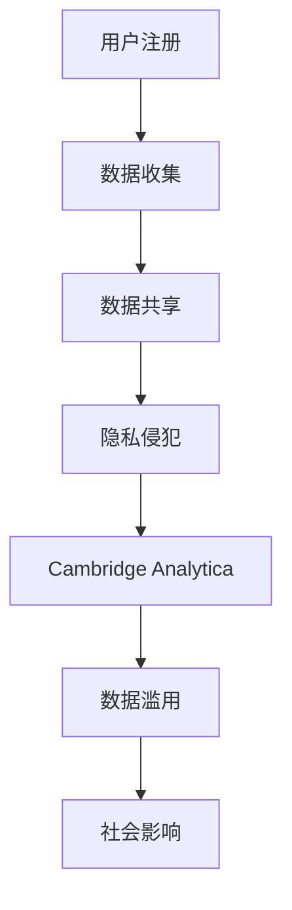
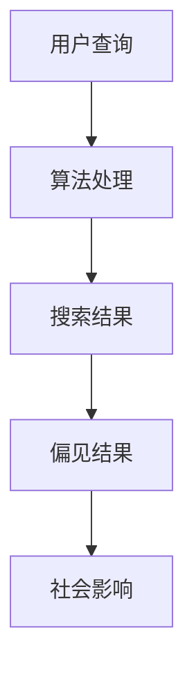

                 

### 文章标题

《技术伦理与社会责任》

> 关键词：技术伦理、社会责任、技术创新、法律法规、案例研究、未来展望

> 摘要：本文深入探讨技术伦理与社会责任的内涵及其在信息技术领域的应用。通过对技术伦理概述、社会责任与技术创新、法律法规与伦理守则、案例研究以及未来展望等环节的分析，本文旨在为读者提供全面的视角，理解技术伦理与社会责任的重要性，并提出相应的实践建议。

### 引言

在信息技术飞速发展的今天，技术的应用已经深入到社会的各个领域，极大地改变了我们的生活方式和工作模式。然而，随着技术进步的同时，一系列伦理问题和社会责任问题也日益凸显。这些问题的存在，不仅威胁到技术发展的可持续性，也对社会稳定和人类福祉构成了潜在风险。

技术伦理，是指与技术相关的伦理问题和道德准则。它关注技术如何影响人类生活，如何确保技术的应用符合道德和伦理标准。技术伦理的核心问题包括隐私、安全、公平、透明等。社会责任，则是企业在技术创新过程中应承担的义务和责任，包括环境保护、员工权益、消费者权益、社区利益等。

技术伦理与社会责任的关系密切。技术创新往往伴随着对社会结构和人类行为的深刻影响，而社会责任则要求企业在追求技术进步的同时，充分考虑这些影响，确保技术的应用符合社会价值和道德标准。因此，探讨技术伦理与社会责任，不仅有助于推动信息技术行业的健康发展，也有助于构建一个更加和谐、可持续的社会。

本文将首先介绍技术伦理的基本概念和发展历程，然后探讨社会责任与技术创新的关系，接着分析相关法律法规和伦理守则，通过具体案例研究展示技术伦理和社会责任的实际应用，最后展望未来技术伦理与社会责任面临的挑战和机遇。

### 技术伦理概述

技术伦理，是指与技术相关的伦理问题和道德准则。它涉及技术的使用、设计、开发、应用等各个层面，旨在确保技术发展符合社会价值和道德标准。技术伦理的核心问题包括但不限于隐私、安全、公平、透明等，这些问题与技术的社会影响密切相关。

#### 技术伦理的定义

技术伦理的定义可以从多个角度进行阐释。首先，从伦理学的角度来看，技术伦理是伦理学在技术领域的应用。伦理学关注人类行为的道德规范，技术伦理则是将这一规范应用于技术设计和应用过程中。其次，从技术发展的角度来看，技术伦理是对技术可能带来的负面影响进行反思和规范的学科。例如，隐私问题在信息技术快速发展中日益突出，技术伦理要求我们在设计、开发和应用技术时，必须考虑到用户隐私的保护。

#### 技术伦理的发展历程

技术伦理的概念并不是一成不变的，而是随着技术的发展和社会变迁不断演进的。在20世纪初期，随着工业革命的推进，技术伦理主要关注技术对自然环境的影响。例如，工业污染和资源消耗等问题引起了广泛关注。到了20世纪中后期，随着信息技术的发展，隐私和安全问题逐渐成为技术伦理的核心议题。在这一阶段，计算机犯罪、网络隐私泄露等问题层出不穷，技术伦理的重要性愈发凸显。

进入21世纪，随着人工智能、大数据、区块链等新兴技术的崛起，技术伦理面临着新的挑战。例如，人工智能的算法偏见、大数据的隐私风险、区块链的透明性问题等，都需要我们进行深入的伦理反思和规范。

#### 技术伦理的核心原则

技术伦理的核心原则包括以下几个方面：

1. **尊重个人隐私**：技术应尊重用户的隐私权，不应未经用户同意收集、使用和泄露个人信息。例如，在开发应用程序时，应明确告知用户数据收集的目的和使用方式，并给予用户选择的权利。

2. **确保信息安全**：技术应确保用户数据的安全，防止数据泄露、篡改和滥用。这要求我们在技术设计和开发过程中，采取严格的安全措施，如数据加密、访问控制等。

3. **促进公平和公正**：技术不应加剧社会不平等，而应促进社会公平和公正。例如，在算法设计和应用过程中，应避免算法偏见，确保算法的公正性和透明性。

4. **透明性和可解释性**：技术的应用应具有透明性和可解释性，用户应能够了解技术的运作原理和影响。例如，人工智能系统的决策过程应可解释，以便用户理解和监督。

#### 技术伦理与隐私、安全的关系

技术伦理与隐私、安全密切相关。隐私是个人信息的保护，是每个人的基本权利。在信息技术时代，隐私问题尤为突出，因为技术使得个人信息的收集、处理和传播变得异常容易。技术伦理要求我们在技术应用过程中，尊重个人隐私，防止隐私泄露。

安全则是技术伦理的重要组成部分。技术的广泛应用带来了新的安全挑战，如网络攻击、数据泄露、系统崩溃等。技术伦理要求我们在技术设计和应用过程中，确保信息系统的安全，防止技术被滥用。

总之，技术伦理是确保技术发展符合道德和伦理标准的重要手段。通过尊重个人隐私、确保信息安全、促进公平和公正以及确保透明性和可解释性，技术伦理有助于构建一个更加安全、公正和可持续的技术社会。

### 社会责任与技术创新

技术创新是企业和社会发展的关键驱动力，然而，技术创新不仅仅是追求技术上的突破，还必须考虑企业在技术创新过程中应承担的社会责任。社会责任是企业对利益相关者、环境和社会的责任，它贯穿于企业的战略决策、运营管理和业务实践之中。在技术创新过程中，企业应如何平衡技术发展与社会责任，确保技术进步与可持续发展，是当前面临的重要挑战。

#### 企业社会责任概述

企业社会责任（Corporate Social Responsibility，CSR）是指企业在追求经济利益的同时，对社会和环境承担的责任。社会责任的范畴广泛，包括环境保护、员工权益、消费者权益、社区利益、慈善捐赠等方面。在技术创新中，企业社会责任体现在以下几个方面：

1. **环境保护**：企业在技术创新过程中，应考虑对环境的影响，减少资源消耗和污染排放。例如，通过开发绿色技术，实现可持续发展。

2. **员工权益**：企业应保障员工的合法权益，提供公平的工作环境，关注员工的职业发展和福利。技术创新不仅需要先进的技术，更需要高素质的人才。

3. **消费者权益**：企业应确保产品的质量和安全，尊重消费者的知情权和选择权，提供优质的售后服务。技术创新的目的是提升消费者福祉，而非损害消费者权益。

4. **社区利益**：企业应积极参与社区建设，支持社区发展，为社会提供公共服务。例如，通过技术培训、公益活动等方式，提升社区的科技水平和生活质量。

#### 技术创新中的社会责任考量

在技术创新过程中，企业应综合考虑社会责任，确保技术发展与社会利益相一致。以下是一些关键考量：

1. **公平性**：技术创新不应加剧社会不平等，而应促进社会公平。企业在设计技术时，应避免算法偏见，确保技术对所有人公平。

2. **可持续性**：技术创新应追求可持续发展，不仅关注短期经济效益，还应考虑长期社会和环境效益。企业应采用绿色技术，减少对自然资源的依赖。

3. **透明性和可解释性**：技术创新过程和结果应具有透明性和可解释性，使公众能够理解和监督技术的影响。例如，人工智能系统的决策过程应可解释，以便公众和监管机构能够评估其公平性和安全性。

4. **用户参与**：在技术创新过程中，企业应鼓励用户参与，听取用户需求和反馈，确保技术的应用符合用户期望和社会需求。

#### 社会责任报告与透明度

企业社会责任报告是企业向公众展示其社会责任实践的重要工具。通过社会责任报告，企业可以透明地披露其在环境保护、员工权益、消费者权益、社区利益等方面的绩效和进展。社会责任报告的透明度对于提升企业的社会形象和公信力至关重要。

1. **报告内容**：社会责任报告应包括企业的社会责任战略、目标和实施情况，具体指标和数据，以及社会影响的评估和反馈。

2. **报告标准**：企业应遵循国际和国内的社会责任报告标准，如《可持续发展报告指南》（Global Reporting Initiative, GRI）和《企业社会责任报告准则》（Sustainability Accounting Standards Board, SASB）等。

3. **第三方审核**：社会责任报告应接受第三方审核，确保报告内容的真实性和准确性。第三方审核有助于提升报告的公信力和透明度。

#### 技术创新与可持续发展

技术创新与可持续发展密切相关。企业应通过技术创新，推动社会可持续发展。以下是一些具体措施：

1. **绿色技术创新**：企业应投入资源开发绿色技术，如清洁能源、环保材料等，减少对环境的负面影响。

2. **资源高效利用**：通过技术创新，提高资源利用效率，减少资源消耗。例如，采用循环经济模式，实现资源循环利用。

3. **社会公益项目**：企业可以积极参与社会公益项目，如教育、医疗、扶贫等，通过技术手段提升社会公共服务水平。

4. **技术普及与培训**：企业应普及技术知识，提升公众的科技素养，通过技术培训，帮助弱势群体融入数字化社会。

总之，企业在技术创新过程中，应充分考虑社会责任，确保技术发展与社会利益相一致。通过透明的社会责任报告、公平的技术设计、可持续的技术应用，企业不仅可以提升自身竞争力，还可以为社会可持续发展做出贡献。

### 法律法规与伦理守则

在技术伦理和社会责任的实践中，法律法规和伦理守则是不可或缺的基石。它们不仅为技术创新提供了法律框架和道德指引，还为企业和社会提供了明确的行动指南，确保技术进步不会偏离伦理和社会价值。

#### 国际与国内法律法规

在国际层面，许多国家和国际组织已经制定了相关法律法规来规范技术行为。例如，欧盟的《通用数据保护条例》（GDPR）严格规定了数据隐私保护的要求，要求企业在处理个人数据时必须获得用户的明确同意，并采取严格的措施保护数据安全。美国的《消费者隐私保护法》和《计算机欺诈和滥用法》等法律也规定了个人数据保护和技术行为的法律责任。

在国内，中国也制定了一系列法律法规来规范技术行为。例如，《网络安全法》规定了网络运营者的安全保护义务，要求企业采取措施保护网络安全，防止数据泄露和网络攻击。此外，《个人信息保护法》明确了个人信息保护的基本原则和操作规范，要求企业在收集、使用和处理个人信息时必须遵循合法、正当、必要的原则。

#### 行业伦理守则

除了法律法规，许多行业也制定了伦理守则，以指导企业和社会在技术行为中遵循道德标准。这些行业伦理守则通常由行业协会或专业组织制定，涵盖从技术设计到应用的各个层面。

1. **信息技术行业伦理守则**：信息技术行业伦理守则通常包括隐私保护、信息安全、数据使用、算法公正等方面。例如，国际计算机协会（ACM）制定的《计算机伦理准则》提出了计算机科学家应遵守的道德原则，如尊重用户隐私、确保信息系统的安全性、避免滥用技术等。

2. **人工智能行业伦理守则**：随着人工智能技术的快速发展，人工智能行业伦理守则也日益受到关注。例如，国际人工智能联合协会（IJCAI）制定的《人工智能伦理指南》强调了人工智能应用中的透明性、公正性和可解释性，要求企业在设计和应用人工智能技术时，必须考虑到对人类和社会的影响。

3. **数据科学行业伦理守则**：数据科学行业伦理守则通常关注数据收集、处理和使用过程中的伦理问题。例如，国际数据管理协会（IDM）制定的《数据科学伦理准则》提出了数据科学家应遵守的道德准则，如保护数据隐私、确保数据使用的合法性、避免数据歧视等。

#### 法规遵守与伦理冲突

在实践过程中，企业常常面临法规遵守与伦理冲突的问题。例如，在某些情况下，为了商业利益，企业可能会收集和使用用户数据，但这一行为可能违反了用户隐私权。在这种情况下，企业需要权衡法律法规和伦理标准，采取适当的措施来解决问题。

1. **法律法规优先**：在某些情况下，法律法规的要求可能比伦理标准更为严格。企业应首先遵守相关法律法规，确保自身行为符合法律要求。

2. **伦理补充**：即使法律法规没有明确规定，企业也应遵循伦理标准，采取负责任的行为。例如，即使在法律法规没有要求的情况下，企业也应采取严格的隐私保护措施，确保用户数据的隐私和安全。

3. **内部伦理审查**：企业应建立内部伦理审查机制，对技术创新项目进行伦理评估，确保项目符合伦理标准。内部伦理审查可以帮助企业及时发现和解决潜在伦理问题，避免因法律法规和伦理冲突而导致的法律和道德风险。

总之，法律法规和伦理守则是确保技术行为合法、道德的重要工具。通过遵守相关法律法规和遵循行业伦理守则，企业可以在技术创新中实现技术进步与社会责任的平衡，为构建一个更加和谐、可持续的社会做出贡献。

### 案例研究

为了更好地理解技术伦理与社会责任在实际中的应用，我们通过几个具体案例进行分析和讨论。这些案例涵盖了隐私、安全、公平等多个方面，旨在展示技术伦理和社会责任的实践。

#### 案例一：Facebook隐私丑闻

**背景介绍**：

2018年，Facebook卷入了一场严重的隐私丑闻，即Cambridge Analytica数据泄露事件。Cambridge Analytica是一家政治数据公司，未经用户同意，非法获取了8700万Facebook用户的个人信息，用于政治广告投放和行为分析。

**核心概念与联系**：

该案例涉及的核心概念包括隐私和安全。隐私是个人信息保护的基本权利，而安全则是防止数据泄露、滥用和篡改的重要保障。Facebook的隐私丑闻揭示了几个重要问题：

1. **隐私侵犯**：用户在不知情的情况下，个人信息被第三方公司获取和使用，违反了隐私权。
2. **数据安全**：Facebook未能有效保护用户数据，导致数据泄露和安全风险。

**Mermaid 流程图**：



**伪代码**：

```python
def collect_user_data(user_id):
    # 假设该函数从数据库中获取用户数据
    user_data = get_data_from_database(user_id)
    return user_data

def share_data_with_third_party(user_data):
    # 假设该函数将用户数据共享给第三方公司
    share_data_to_third_party(user_data)
    print("Data shared with third party.")

# 示例代码
user_id = "12345"
user_data = collect_user_data(user_id)
share_data_with_third_party(user_data)
```

**数学模型和公式**：

为了衡量数据泄露对用户隐私的影响，我们可以使用以下公式：

$$
隐私影响 = \frac{泄露数据量}{总数据量}
$$

**详细讲解与举例说明**：

在这个案例中，隐私影响可以通过上述公式计算。假设Facebook共有1亿用户，其中8700万用户的数据被泄露，那么隐私影响为：

$$
隐私影响 = \frac{8700万}{1亿} = 87\%
$$

这意味着有87%的用户隐私受到了侵犯，这是一个非常严重的问题。

**结论与反思**：

Facebook隐私丑闻揭示了在技术伦理和社会责任方面的严重问题。企业必须在数据收集、处理和共享过程中严格遵守隐私保护规定，采取严格的数据安全措施，确保用户隐私不受侵犯。

#### 案例二：谷歌搜索算法偏见

**背景介绍**：

谷歌搜索算法偏见是指谷歌搜索结果在不同国家和文化背景下存在偏见。一些研究表明，谷歌搜索算法对某些种族、性别和宗教群体存在不公平倾向，这引发了广泛的伦理和社会责任问题。

**核心概念与联系**：

该案例涉及的核心概念包括公平性和算法公正。算法偏见可能加剧社会不平等，影响公众的公平获得信息权利。

**Mermaid 流程图**：



**伪代码**：

```python
def search_query(query):
    # 假设该函数处理用户查询，返回搜索结果
    results = process_query(query)
    return results

def process_query(query):
    # 假设该函数根据算法返回搜索结果
    if query contains "ethnicity":
        # 偏见处理
        biased_results = apply_bias(results)
        return biased_results
    else:
        return results

# 示例代码
query = "ethnicity"
results = search_query(query)
print(results)
```

**数学模型和公式**：

为了评估算法偏见的影响，我们可以使用以下公式：

$$
偏见影响 = \frac{偏见结果数量}{总结果数量}
$$

**详细讲解与举例说明**：

假设在某个特定查询中，有10个搜索结果，其中5个结果存在偏见。那么偏见影响为：

$$
偏见影响 = \frac{5}{10} = 50\%
$$

这意味着50%的搜索结果存在偏见，这可能会对用户获取信息的公平性产生严重影响。

**结论与反思**：

谷歌搜索算法偏见案例表明，算法设计和应用过程中需要充分考虑公平性和公正性。企业应建立透明的算法评估机制，定期审查算法的偏见和公平性，确保算法不会加剧社会不平等。

通过这些案例研究，我们可以看到技术伦理和社会责任在实践中的应用及其重要性。企业必须在技术创新过程中充分考虑伦理和社会责任，确保技术进步不会损害社会价值和人类福祉。

### 未来展望与挑战

随着技术的不断进步，技术伦理与社会责任面临着新的机遇和挑战。未来的技术发展将带来更多复杂的问题，需要我们进行深入思考和前瞻性规划。

#### 人工智能与伦理

人工智能（AI）是未来技术发展的热点，但也引发了诸多伦理问题。首先，算法偏见和歧视问题依然存在，AI系统可能基于历史数据中的偏见做出不公平决策，加剧社会不平等。其次，隐私保护成为新的挑战，AI技术的应用需要大量数据，但如何保护用户隐私成为关键问题。此外，AI自主决策的道德责任问题也亟待解决。在AI系统出现错误或造成损害时，谁应承担道德和法律责任？

#### 大数据与隐私

大数据技术的发展使得海量数据收集和处理成为可能，但这也带来了隐私风险。如何在充分利用大数据优势的同时，确保用户隐私不受侵犯，是未来的一大挑战。未来的解决方案可能包括更加严格的数据隐私保护法规、透明的数据处理流程以及用户对数据使用的知情权和控制权。

#### 区块链与社会责任

区块链技术以其去中心化和透明性的特点，被认为具有解决社会问题的潜力。然而，区块链的能源消耗和可持续性问题引发关注。此外，区块链技术的应用可能引发新的隐私和安全性挑战，如数据泄露和恶意攻击。未来需要探索如何在保障技术优势的同时，实现社会责任。

#### 技术责任与全球治理

技术责任的全球治理是未来的一大挑战。不同国家和地区在技术伦理和社会责任方面的法律法规和标准存在差异，如何在全球范围内实现协调和统一，是一个重要议题。国际组织、政府和企业需要加强合作，共同制定全球性的技术伦理和社会责任标准，确保技术发展符合全球公共利益。

#### 面临的挑战

1. **伦理法规滞后**：技术发展速度远超法律法规的制定和更新，导致现有法规难以有效规范新技术应用。
2. **跨领域合作不足**：技术伦理和社会责任问题涉及多个领域，需要跨学科、跨行业的合作，但实际操作中往往存在合作障碍。
3. **公众信任危机**：随着一系列技术丑闻和数据泄露事件的曝光，公众对技术的信任度下降，如何重建公众信任是重要挑战。

#### 应对策略

1. **加强伦理法规建设**：政府应加快制定和更新相关伦理法规，确保技术发展符合道德和伦理标准。
2. **推动跨领域合作**：建立跨学科、跨行业的合作机制，共同应对技术伦理和社会责任问题。
3. **提升透明度和可解释性**：通过提高技术应用的透明度和可解释性，增强公众对技术的理解和信任。
4. **加强教育和培训**：提高社会各界的伦理意识和责任感，培养专业的技术伦理和社会责任专家。

总之，未来技术伦理与社会责任的发展面临诸多挑战，但也充满机遇。通过加强法律法规建设、推动跨领域合作、提升透明度和可解释性，以及加强教育和培训，我们有望构建一个更加和谐、可持续的技术社会。

### 结论与建议

本文从技术伦理的概述、社会责任与技术创新的关系、法律法规与伦理守则、具体案例研究以及未来展望与挑战等多个角度，深入探讨了技术伦理与社会责任在信息技术领域的应用。技术伦理不仅关注技术对人类行为和隐私的影响，还涉及安全、公平和透明等方面。社会责任要求企业在技术创新过程中，充分考虑对环境、员工、消费者和社区的义务和责任。

核心概念之间存在着紧密的联系。技术伦理和社会责任是确保技术发展符合道德和社会价值的基石。法律法规和伦理守则提供了具体的规范和指引，确保技术行为合法、道德。案例研究展示了技术伦理和社会责任在实际中的应用，揭示了技术伦理问题的重要性和解决路径。未来展望部分指出，随着技术不断进步，技术伦理与社会责任面临新的挑战，但同时也提供了应对策略。

为了进一步推动技术伦理与社会责任的发展，本文提出以下建议：

1. **加强伦理法规建设**：政府应加快制定和更新相关伦理法规，确保技术发展符合道德和伦理标准。
2. **推动跨领域合作**：建立跨学科、跨行业的合作机制，共同应对技术伦理和社会责任问题。
3. **提升透明度和可解释性**：通过提高技术应用的透明度和可解释性，增强公众对技术的理解和信任。
4. **加强教育和培训**：提高社会各界的伦理意识和责任感，培养专业的技术伦理和社会责任专家。

通过这些措施，我们有望构建一个更加和谐、可持续的技术社会，实现技术进步与社会价值的双赢。

### 最佳实践 Tips

在技术伦理和社会责任的实践中，以下是一些最佳实践 Tips，供读者参考：

1. **隐私保护**：在数据收集和使用过程中，严格遵守隐私保护规定，采用数据最小化原则，只收集必要的数据，并确保数据加密和安全存储。

2. **透明性**：在技术设计和应用过程中，确保透明性，使用户能够了解技术的运作原理和影响。定期发布技术报告，接受公众和监管机构的监督。

3. **算法公正性**：在算法设计和应用中，充分考虑公平性和公正性，避免算法偏见，确保算法对所有人公平。

4. **社会责任报告**：定期发布社会责任报告，展示企业在环境保护、员工权益、消费者权益和社区利益等方面的绩效和进展。

5. **伦理审查**：建立内部伦理审查机制，对技术创新项目进行伦理评估，确保项目符合伦理标准。

6. **公众参与**：鼓励公众参与技术伦理和社会责任讨论，听取用户需求和反馈，确保技术发展符合社会需求和价值观。

7. **持续培训**：定期进行技术伦理和社会责任培训，提高员工和相关人员的伦理意识和责任感。

### 注意事项

在技术伦理和社会责任的实践中，需要注意以下几点：

1. **法律法规遵守**：确保技术行为符合相关法律法规，避免违法行为导致法律风险。

2. **平衡利益**：在技术创新中，平衡技术进步与社会责任，避免为了短期利益而牺牲长期社会价值。

3. **持续监测**：对技术应用进行持续监测，及时发现和解决潜在伦理问题，确保技术行为符合道德和伦理标准。

4. **跨领域合作**：积极与其他行业和组织合作，共同应对技术伦理和社会责任问题，实现资源和技术共享。

### 拓展阅读

对于希望进一步深入了解技术伦理与社会责任的读者，以下是一些推荐阅读材料：

1. **《技术伦理学：理论与实践》（Technics and Human Life: A Range of Issues in Applied Ethics）**：本书详细探讨了技术伦理的基本概念和应用，包括技术与人类生活的关系、技术伦理的核心原则等。

2. **《技术与社会：伦理、法律与政策问题》（Technologies and Society: Ethics, Law, and Policy）**：该书从多个角度探讨了技术在社会中的影响，包括伦理、法律和政策问题，适合对技术社会影响感兴趣的研究者。

3. **《人工智能伦理》（Ethics and Intelligent Systems）**：本书分析了人工智能在伦理方面的挑战，包括算法偏见、隐私保护和道德责任等问题，适合对人工智能伦理感兴趣的读者。

4. **《企业社会责任报告编写指南》（Guidelines for Corporate Social Responsibility Reporting）**：该书提供了详细的社会责任报告编写指南，包括报告内容、标准和审核方法，适合企业和社会责任报告编写者。

通过阅读这些书籍，读者可以更深入地了解技术伦理与社会责任的理论和实践，为相关工作和研究提供参考。

### 作者信息

作者：AI天才研究院/AI Genius Institute & 禅与计算机程序设计艺术 /Zen And The Art of Computer Programming

AI天才研究院致力于推动人工智能和计算机科学的创新与发展，研究领域涵盖机器学习、深度学习、自然语言处理等。同时，禅与计算机程序设计艺术是一本深入探讨编程哲学和技术的经典著作，旨在帮助程序员提升编程技能和思维水平。本文由两位专家共同撰写，旨在为读者提供关于技术伦理与社会责任的有价值见解。

