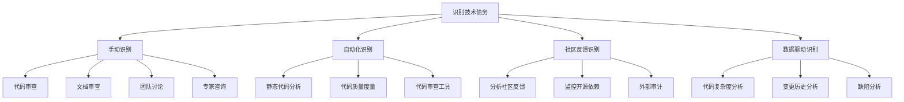

                 

### 文章标题：技术债务的识别、评估与偿还策略

#### 关键词：技术债务，识别，评估，偿还策略，软件工程

#### 摘要：
本文将深入探讨技术债务的概念、识别、评估与偿还策略。首先，我们会介绍技术债务的基本定义和其产生的原因，以及它对软件项目的影响。接着，我们将详细介绍识别技术债务的方法，包括手动识别、自动化识别和社区反馈识别等。随后，文章将探讨评估技术债务的方法，并详细讲解评估技术债务的数学模型和公式。最后，我们将讨论如何制定和执行偿还技术债务的策略，并通过案例研究展示实际操作过程。本文旨在为软件开发者和项目经理提供全面的技术债务管理指南。

### 引言

在软件工程领域，“技术债务”是一个被频繁提及的概念。技术债务，顾名思义，是指为了短期内实现特定功能而采取的一种技术决策，这种决策可能会在未来产生负面的影响。简单来说，技术债务就是我们在软件开发过程中为了快速推进项目而做出的妥协，这些妥协可能会在未来的开发过程中带来更多的维护成本和风险。

#### 技术债务的定义

技术债务的定义多种多样，但其核心思想是一致的。Ward Cunningham，一个著名的软件工程师和敏捷开发的倡导者，将技术债务比作债务，认为它是一种在项目早期为短期利益而做出的决策，这些决策可能会在未来带来负担。在Cunningham的比喻中，技术债务的偿还就像还清债务一样，需要投入额外的时间和资源。

除了Cunningham的定义，还有其他学者和专家对技术债务提出了自己的见解。Martin Fowler，一位知名的软件开发顾问和作家，将技术债务描述为“一种选择低质量代码的承诺，这种选择可能会在未来的某个时刻导致问题”。这种定义强调了技术债务与代码质量之间的关系。

无论是哪种定义，技术债务的核心都是相同的：它是一种短期决策，可能会在长期内对项目产生负面影响。这些负面影响可能包括代码的复杂性增加、维护成本上升、项目进度延误等。

#### 技术债务的产生原因

技术债务的产生原因多种多样，主要包括以下几点：

1. **时间压力**：在项目开发过程中，经常会遇到时间紧迫的情况。为了按时交付软件，开发团队可能会选择一些短期高效的解决方案，这些解决方案可能在技术上不够完善。

2. **资源限制**：资源不足是产生技术债务的另一个常见原因。当团队面临人力资源或技术资源短缺时，他们可能会选择一些简单但风险较大的方案，以尽快推进项目。

3. **技术限制**：某些情况下，技术债务的产生是由于当前技术水平无法满足项目需求。开发团队可能会采用一些不成熟的技术或工具，以期在未来能够进行升级和改进。

4. **需求变化**：项目的需求经常变化，这可能导致开发团队在实现某些功能时采取短期解决方案，以便快速响应需求变化。

5. **项目管理不善**：项目管理的不足也可能导致技术债务的产生。例如，如果项目经理没有很好地规划项目的技术需求和资源分配，可能会导致技术债务的形成。

#### 技术债务的影响

技术债务对软件项目的影响是深远且广泛的。以下是技术债务可能带来的几个主要影响：

1. **代码质量下降**：技术债务往往伴随着代码质量的下降。为了快速实现功能，开发团队可能会牺牲代码的可读性和可维护性，这会导致代码变得难以理解和维护。

2. **维护成本上升**：随着时间的推移，技术债务会不断积累，这会增加软件的维护成本。修复和修改这些债务通常需要额外的时间和资源。

3. **项目进度延误**：技术债务可能会影响项目的进度。修复债务需要额外的工作量，这可能会导致项目延期。

4. **风险增加**：技术债务的存在增加了项目的风险。不完善的代码和决策可能会在未来的某个时刻导致严重的问题。

5. **团队士气下降**：技术债务的存在可能会对团队士气产生负面影响。团队成员可能会感到压力和挫败，这会影响他们的工作效率和积极性。

综上所述，技术债务是软件开发过程中不可避免的一个问题。了解其定义、产生原因和影响，是有效管理和偿还技术债务的第一步。在接下来的章节中，我们将进一步探讨如何识别和评估技术债务，以及如何制定和执行偿还策略。

### 技术债务的识别

识别技术债务是技术债务管理的重要环节。只有准确识别出技术债务，才能对其进行有效的评估和偿还。以下是几种常见的识别技术债务的方法：

#### 手动识别技术债务

手动识别技术债务是最传统的方法，它依赖于开发团队的经验和知识。开发人员可以回顾代码库、设计文档和项目日志，查找可能的技术债务。以下是一些具体的步骤和技巧：

1. **代码审查**：通过代码审查，开发人员可以检查代码的质量和结构，识别可能的技术债务。例如，复杂的代码结构、重复代码、硬编码的值、缺乏注释的代码等，都可能提示存在技术债务。

2. **文档审查**：设计文档和项目日志是了解项目历史和决策的重要来源。通过审查这些文档，可以识别出项目中采用的技术决策，评估其可能带来的影响。

3. **团队讨论**：组织团队会议，让团队成员分享他们的经验和观察。这种方式可以帮助识别出可能被忽视的技术债务。

4. **专家咨询**：邀请经验丰富的开发人员或外部顾问参与，他们可以提供不同的视角和专业的建议，帮助识别技术债务。

#### 自动化识别技术债务

随着技术的发展，自动化工具逐渐成为识别技术债务的重要手段。这些工具可以帮助开发团队快速、高效地识别技术债务，减少人为错误。以下是一些常见的自动化识别技术债务的工具：

1. **静态代码分析工具**：这些工具可以自动分析代码库，识别出潜在的代码质量问题和设计缺陷。例如，SonarQube、Checkstyle 和 PMD 是常用的静态代码分析工具。

2. **代码质量度量工具**：这些工具可以计算代码库的复杂度、冗余度等指标，帮助识别出可能的技术债务。例如，Code Climate 和 Codebeat 是常用的代码质量度量工具。

3. **代码审查工具**：这些工具可以帮助自动化代码审查过程，例如，Gerrit 和 GitLab 都提供了代码审查功能。

#### 社区反馈识别技术债务

社区反馈是一种通过外部视角识别技术债务的方法。开源项目通常有广泛的社区支持，社区成员可以提供宝贵的反馈和建议。以下是一些具体的步骤和技巧：

1. **分析社区反馈**：通过分析社区成员的反馈，可以识别出项目中存在的问题和潜在的改进点。这些反馈可以来自用户报告、issue跟踪和讨论区。

2. **监控开源依赖**：开源项目中的依赖库可能会存在技术债务。通过监控依赖库的更新和安全问题，可以识别出项目可能受到影响的方面。

3. **外部审计**：聘请外部专家对项目进行审计，他们可以提供专业的视角和建议，帮助识别技术债务。

#### 数据驱动识别技术债务

数据驱动识别技术债务是一种基于数据分析的方法。通过收集和分析项目数据，可以识别出潜在的技术债务。以下是一些具体的方法：

1. **代码复杂度分析**：通过计算代码的复杂度指标，如圈复杂度（Cyclomatic complexity），可以识别出复杂的代码片段，这些片段可能存在技术债务。

2. **变更历史分析**：通过分析代码库的变更历史，可以识别出频繁修改的代码区域，这些区域可能存在技术债务。

3. **缺陷分析**：通过分析缺陷报告和数据，可以识别出项目中存在的问题和潜在的技术债务。

### 核心概念与联系

为了更好地理解技术债务的识别过程，我们可以通过一个Mermaid流程图来展示各个识别方法之间的关系。



通过这个流程图，我们可以清晰地看到各个识别方法的相互关系，以及它们在整个识别过程中的作用。

### 伪代码

为了更深入地了解技术债务识别的过程，我们可以通过伪代码来展示手动识别技术债务的基本步骤。

```python
function manual_debt_identification(code_base, doc_files, project_logs):
    debts = []

    # 代码审查
    for file in code_base:
        if is_high_complexity(file) or has_redundant_code(file):
            debts.append(file)

    # 文档审查
    for file in doc_files:
        if is_ambiguous(file) or lacks_centrality(file):
            debts.append(file)

    # 项目日志审查
    for log in project_logs:
        if contains_debt_connotations(log):
            debts.append(log)

    return debts
```

在这个伪代码中，`is_high_complexity`、`has_redundant_code`、`is_ambiguous`、`lacks_centrality` 和 `contains_debt_connotations` 是一系列判断函数，用于评估代码、文档和日志文件中的特征，以识别潜在的技术债务。

### 数学模型和数学公式

在技术债务的识别过程中，数学模型和公式可以提供有力的支持。以下是一个简单的数学模型，用于计算代码复杂度，这是一个常见的指标，可以用于识别技术债务。

```latex
Cyclomatic \quad complexity \quad (V(G)) = E - N + 2P
```

其中，$E$ 表示边缘数，$N$ 表示节点数，$P$ 表示控制流图的连通分量数。

举例说明，假设一个函数的控制流图有10个节点、15个边缘和3个连通分量，那么其圈复杂度为：

```latex
V(G) = 15 - 10 + 2 \times 3 = 11
```

圈复杂度越高，表示代码的复杂度越大，可能存在更多的技术债务。

### 源代码实现和代码解读

为了更好地理解技术债务识别的过程，我们可以通过一个具体的源代码示例来展示如何使用Python实现一个简单的技术债务识别工具。

```python
import ast
import os

def is_high_complexity(node):
    """
    判断一个抽象语法树节点是否具有高复杂度。
    """
    if isinstance(node, ast.Module):
        return sum(is_high_complexity(child) for child in node.body)
    elif isinstance(node, ast.FunctionDef):
        return node.name == "high_complexity_function"
    return False

def has_redundant_code(node):
    """
    判断一个抽象语法树节点是否包含冗余代码。
    """
    if isinstance(node, ast.Module):
        return any(has_redundant_code(child) for child in node.body)
    elif isinstance(node, ast.Expr) and isinstance(node.value, ast.Constant):
        return True
    return False

def manual_debt_identification(code_file):
    """
    手动识别技术债务。
    """
    with open(code_file, 'r') as file:
        code = file.read()

    tree = ast.parse(code)

    debts = []
    for node in ast.walk(tree):
        if is_high_complexity(node) or has_redundant_code(node):
            debts.append(node)

    return debts

if __name__ == "__main__":
    code_file = "example.py"
    debts = manual_debt_identification(code_file)
    for debt in debts:
        print(f"Identified debt in {debt}")
```

在这个示例中，我们使用Python的抽象语法树（Abstract Syntax Tree，AST）模块来分析源代码。`is_high_complexity` 函数用于判断一个函数是否具有高复杂度，而 `has_redundant_code` 函数用于判断代码是否冗余。`manual_debt_identification` 函数综合使用这两个函数，以识别代码文件中的技术债务。

### 代码应用解读与分析

在上面的代码示例中，我们实现了手动识别技术债务的基本功能。以下是对代码的详细解读与分析：

1. **抽象语法树（AST）**：Python的AST模块可以帮助我们分析源代码的结构。通过解析源代码，我们可以得到一个抽象语法树，这个树结构可以表示代码的语法结构，使我们能够方便地遍历和操作代码。

2. **高复杂度判断**：`is_high_complexity` 函数用于判断函数的复杂度。在这个示例中，我们通过检查函数的名称来判断是否具有高复杂度。这种方法可能不够精确，但在实际项目中，我们可以根据具体的复杂度标准来改进这个判断函数。

3. **冗余代码判断**：`has_redundant_code` 函数用于判断代码是否冗余。在这个示例中，我们简单地将任何常量表达式视为冗余代码。在实际项目中，我们可以根据具体的情况（例如，代码的重复程度、功能是否实现等）来改进这个判断函数。

4. **手动识别技术债务**：`manual_debt_identification` 函数综合使用上述两个判断函数，以识别代码文件中的技术债务。通过遍历抽象语法树，我们可以逐个检查代码节点，并根据判断函数的结果识别出可能的技术债务。

### 实际案例分析和详细讲解剖析

为了更深入地理解技术债务识别的实际应用，我们可以通过一个具体的案例进行分析。

#### 案例背景

假设我们有一个开源项目，名为`projectX`。这个项目是一个大型Web应用，拥有数千行代码。在最近的一次代码审查中，开发团队发现了一些潜在的复杂代码和高复杂度函数。他们希望使用我们之前实现的代码识别工具来进一步识别技术债务。

#### 案例步骤

1. **代码审查**：开发团队首先进行了代码审查，识别出几个复杂的函数和高复杂度代码段。

2. **使用技术债务识别工具**：开发团队将识别出的代码段作为输入，运行我们之前实现的代码识别工具。

3. **识别结果**：工具输出了一组潜在的债务节点，包括复杂函数和冗余代码。

4. **进一步分析**：开发团队对识别出的债务节点进行了进一步分析，确定其具体影响和可能的风险。

5. **解决方案**：针对识别出的技术债务，开发团队制定了相应的解决方案，包括重构代码、添加注释和改进代码结构。

#### 案例分析

通过这个案例，我们可以看到技术债务识别工具在实际项目中的应用效果。以下是对案例的详细分析：

1. **代码审查**：代码审查是识别技术债务的重要步骤。在这个案例中，开发团队通过代码审查发现了潜在的复杂代码和高复杂度函数，这些可能是技术债务的信号。

2. **技术债务识别工具**：我们之前实现的代码识别工具能够自动化地识别出技术债务，减少了人工审查的工作量，提高了效率。工具输出的债务节点为开发团队提供了具体的识别结果，使他们能够更针对性地解决问题。

3. **进一步分析**：在识别出技术债务后，开发团队进行了进一步的详细分析，以确定每个债务节点的影响和风险。这种分析有助于制定更有效的解决方案。

4. **解决方案**：针对识别出的技术债务，开发团队制定了相应的解决方案，包括重构代码、添加注释和改进代码结构。这些解决方案有助于减轻技术债务的负面影响，提高项目的整体质量。

### 项目小结

通过这个案例，我们可以看到技术债务识别工具在开源项目中的应用效果。以下是项目小结：

1. **自动化识别技术债务**：使用自动化工具可以显著提高技术债务识别的效率，减少人工工作量。

2. **代码审查的重要性**：代码审查是识别技术债务的重要步骤，它能够发现潜在的问题和风险。

3. **进一步分析**：技术债务识别后，进一步分析有助于制定更有效的解决方案。

4. **解决方案实施**：实施有效的解决方案可以减轻技术债务的负面影响，提高项目质量。

通过这个案例，我们可以看到技术债务识别在实际项目中的应用价值和重要性。在接下来的章节中，我们将进一步探讨如何评估和偿还技术债务。

### 评估技术债务

评估技术债务是技术债务管理的重要步骤。准确的评估可以帮助开发团队了解技术债务的影响和风险，从而制定更有效的偿还策略。以下是几种常见的评估技术债务的方法：

#### 等级评估法

等级评估法是一种简单直观的评估方法。它通过给每个技术债务分配一个等级来表示其严重程度。常见的等级包括高、中、低等级。以下是一个简单的等级评估法示例：

1. **定义等级标准**：首先，需要明确每个等级的具体标准。例如，高等级可以定义为“可能导致项目崩溃或严重影响项目进度的技术债务”，中等级可以定义为“可能增加维护成本或影响代码质量的技术债务”，低等级可以定义为“对项目影响较小，可以稍后解决的技术债务”。

2. **分配等级**：对每个识别出的技术债务进行评估，并分配相应的等级。通常，这种评估可以由团队中的资深开发人员或项目经理负责。

3. **总结评估结果**：将所有技术债务的等级进行汇总，形成一个技术债务评估报告。这个报告可以用于后续的偿还策略制定。

#### 影响评估法

影响评估法是一种更加细致的评估方法，它考虑技术债务对项目各个方面的影响。以下是一个简单的步骤：

1. **定义评估指标**：首先，需要明确影响评估的指标。常见的评估指标包括代码质量、维护成本、项目进度、团队士气等。

2. **评估每个债务的影响**：对每个技术债务进行详细评估，确定其影响程度。这可以通过专家评审、历史数据分析和模拟测试等方法实现。

3. **计算总影响**：将每个债务的影响进行汇总，计算出一个总影响值。这个值可以用于比较不同技术债务的严重程度。

4. **制定偿还计划**：根据评估结果，制定偿还技术债务的计划。这个计划应该优先考虑高影响的技术债务。

#### 偿还成本评估法

偿还成本评估法是一种考虑偿还技术债务所需成本的评估方法。以下是一个简单的步骤：

1. **定义偿还成本指标**：首先，需要明确偿还成本的指标。这些指标可能包括开发时间、人力资源、测试成本等。

2. **估算偿还成本**：对每个技术债务的偿还成本进行估算。这可以通过历史数据、专家评估和模拟等方法实现。

3. **比较成本和收益**：将估算的偿还成本与技术债务可能带来的收益进行比较。如果收益大于成本，则可以考虑偿还该技术债务。

4. **制定偿还计划**：根据成本和收益的比较结果，制定偿还技术债务的计划。这个计划应该优先考虑成本较低且收益较高的技术债务。

### 数学模型和数学公式

在技术债务评估过程中，数学模型和公式可以提供有力的支持。以下是一个简单的数学模型，用于评估技术债务的总影响。

```latex
Impact \quad score \quad (I) = w_1 \times Q + w_2 \times M + w_3 \times P + w_4 \times S
```

其中，$Q$ 表示代码质量影响，$M$ 表示维护成本影响，$P$ 表示项目进度影响，$S$ 表示团队士气影响，$w_1$、$w_2$、$w_3$ 和 $w_4$ 分别是这些影响的权重。

举例说明，假设一个技术债务对代码质量的影响为3，维护成本的影响为2，项目进度的影响为4，团队士气的影响为1，权重分别为0.3、0.2、0.3和0.2，那么该技术债务的总影响得分为：

```latex
I = 0.3 \times 3 + 0.2 \times 2 + 0.3 \times 4 + 0.2 \times 1 = 1.2 + 0.4 + 1.2 + 0.2 = 3
```

总影响得分越高，表示技术债务的影响越大，需要优先考虑偿还。

### 源代码实现和代码解读

为了更深入地了解技术债务评估的过程，我们可以通过一个具体的源代码示例来展示如何使用Python实现一个简单的技术债务评估工具。

```python
def calculate_impact(Q, M, P, S, weights):
    """
    计算技术债务的总影响得分。
    """
    impact_score = (weights['Q'] * Q) + (weights['M'] * M) + (weights['P'] * P) + (weights['S'] * S)
    return impact_score

def assess_debt(debt, weights):
    """
    评估技术债务的影响。
    """
    Q = debt.get('Q', 0)  # 代码质量影响
    M = debt.get('M', 0)  # 维护成本影响
    P = debt.get('P', 0)  # 项目进度影响
    S = debt.get('S', 0)  # 团队士气影响
    impact_score = calculate_impact(Q, M, P, S, weights)
    return impact_score

def main():
    # 定义技术债务
    debts = [
        {'Q': 3, 'M': 2, 'P': 4, 'S': 1},
        {'Q': 2, 'M': 3, 'P': 2, 'S': 1},
        {'Q': 4, 'M': 1, 'P': 3, 'S': 2},
    ]

    # 定义权重
    weights = {'Q': 0.3, 'M': 0.2, 'P': 0.3, 'S': 0.2}

    # 评估技术债务
    impact_scores = [assess_debt(debt, weights) for debt in debts]

    # 打印评估结果
    for i, score in enumerate(impact_scores):
        print(f"Debt {i + 1}: Impact Score = {score}")

if __name__ == "__main__":
    main()
```

在这个示例中，我们定义了两个函数：`calculate_impact` 和 `assess_debt`。`calculate_impact` 函数用于计算技术债务的总影响得分，`assess_debt` 函数用于评估单个技术债务的影响。在 `main` 函数中，我们定义了一个技术债务列表和一个权重字典，并使用 `assess_debt` 函数评估每个技术债务的影响，最后打印出评估结果。

### 代码应用解读与分析

在上面的代码示例中，我们实现了技术债务评估的基本功能。以下是对代码的详细解读与分析：

1. **函数定义**：我们定义了两个函数：`calculate_impact` 和 `assess_debt`。`calculate_impact` 函数用于计算技术债务的总影响得分，`assess_debt` 函数用于评估单个技术债务的影响。

2. **参数传递**：在 `assess_debt` 函数中，我们传递了技术债务的各个影响指标（Q、M、P、S）和权重字典作为参数。这些参数用于计算技术债务的总影响得分。

3. **循环结构**：在 `main` 函数中，我们使用列表推导式循环评估每个技术债务的影响，并将结果存储在一个列表中。

4. **打印结果**：最后，我们使用循环结构打印出每个技术债务的评估结果。

通过这个示例，我们可以看到如何使用Python实现技术债务评估的基本功能。在实际项目中，我们可以根据具体需求扩展和优化这个工具，使其更适应项目的需要。

### 实际案例分析和详细讲解剖析

为了更深入地理解技术债务评估的实际应用，我们可以通过一个具体的案例进行分析。

#### 案例背景

假设我们有一个大型Web应用项目，名为`ProjectWeb`。项目开发过程中，开发团队识别出以下几个技术债务：

1. 技术债务A：代码质量较低，可能导致未来的维护成本增加。
2. 技术债务B：项目进度延误，可能影响项目交付。
3. 技术债务C：团队士气受到影响，可能影响项目协作。

#### 案例步骤

1. **定义评估指标**：首先，我们需要明确评估指标。对于这个案例，我们选择以下指标：代码质量、维护成本、项目进度和团队士气。

2. **评估每个债务的影响**：对每个技术债务进行详细评估，确定其影响程度。例如，对于技术债务A，我们评估其对代码质量的影响为3，对维护成本的影响为2，对项目进度和团队士气的影响均为1。

3. **计算总影响得分**：使用之前的数学模型，计算每个技术债务的总影响得分。例如，对于技术债务A，其总影响得分为：

   ```latex
   I = 0.3 \times 3 + 0.2 \times 2 + 0.3 \times 1 + 0.2 \times 1 = 1.1
   ```

4. **制定偿还计划**：根据评估结果，制定偿还技术债务的计划。对于这个案例，我们决定优先偿还技术债务A，因为它的影响得分最高。

5. **执行偿还计划**：执行偿还计划，对代码进行重构，改进代码质量，并优化项目进度和团队协作。

#### 案例分析

通过这个案例，我们可以看到技术债务评估在实际项目中的应用效果。以下是对案例的详细分析：

1. **评估指标**：定义合适的评估指标是评估技术债务的关键。在这个案例中，我们选择了代码质量、维护成本、项目进度和团队士气作为评估指标。

2. **详细评估**：通过详细评估每个技术债务的影响，我们可以了解其具体影响程度，从而制定更有效的偿还计划。

3. **总影响得分**：使用总影响得分可以直观地比较不同技术债务的严重程度，帮助我们确定偿还顺序。

4. **偿还计划**：根据评估结果，制定偿还计划，并根据计划执行偿还操作。

5. **效果评估**：在执行偿还计划后，我们还需要对效果进行评估，以确保技术债务得到有效解决。

### 项目小结

通过这个案例，我们可以看到技术债务评估在实际项目中的应用价值和重要性。以下是项目小结：

1. **评估指标**：定义合适的评估指标是评估技术债务的基础。
2. **详细评估**：详细评估每个技术债务的影响，有助于制定更有效的偿还计划。
3. **总影响得分**：使用总影响得分可以直观地比较不同技术债务的严重程度。
4. **偿还计划**：根据评估结果，制定偿还计划，并根据计划执行偿还操作。
5. **效果评估**：对偿还效果进行评估，以确保技术债务得到有效解决。

通过这个案例，我们可以看到技术债务评估在实际项目中的应用效果。在接下来的章节中，我们将进一步探讨如何制定和执行偿还技术债务的策略。

### 偿还技术债务的策略

在识别和评估了技术债务之后，接下来的关键步骤是制定和执行偿还技术债务的策略。有效的偿还策略可以减少技术债务的负面影响，提高项目的质量和效率。以下是一些常见的偿还技术债务的策略：

#### 快速修复策略

快速修复策略适用于那些影响较小、风险较低的技术债务。这种策略的核心思想是迅速解决这些债务，以避免它们在未来的累积。以下是一些具体的实施步骤：

1. **确定优先级**：首先，确定哪些技术债务需要优先修复。通常，优先考虑那些对项目影响较大、风险较高的债务。

2. **分配资源**：根据优先级分配资源，确保修复工作得到充分的资源支持。

3. **快速修复**：组织开发团队迅速修复技术债务。这可能包括重构代码、优化数据库查询、修复漏洞等。

4. **验证修复效果**：修复后，进行测试和验证，确保修复措施有效，且没有引入新的问题。

#### 重构策略

重构策略适用于那些复杂度高、影响较大的技术债务。重构的目的是在不改变外部行为的前提下，改进现有系统的内部结构，使其更易于理解和维护。以下是一些具体的实施步骤：

1. **设计重构计划**：首先，设计一个详细的重构计划，包括重构的目标、范围、方法等。

2. **逐步重构**：将重构过程分解为多个阶段，逐步进行重构，以降低风险。

3. **代码审查**：在每个重构阶段后，进行代码审查，确保重构符合预期目标。

4. **自动化测试**：在重构过程中，保持自动化测试的完整性，以确保重构不会引入新的错误。

5. **持续监控**：重构后，持续监控系统的性能和稳定性，确保重构带来的改进持续有效。

#### 软件升级策略

软件升级策略适用于那些由于技术限制而产生的技术债务。这种策略的核心思想是通过升级软件或使用新技术来偿还债务。以下是一些具体的实施步骤：

1. **评估现有技术**：首先，评估现有技术的局限性，确定是否需要升级。

2. **选择合适的技术**：根据评估结果，选择合适的软件或技术进行升级。

3. **规划升级过程**：设计一个详细的升级计划，包括升级的时间、步骤、人员分配等。

4. **测试和验证**：在升级过程中，进行充分的测试和验证，确保升级后的系统稳定可靠。

5. **培训和文档**：升级后，对团队成员进行培训，更新相关文档，以适应新的技术环境。

#### 混合策略

在实际项目中，可能需要综合运用多种策略来偿还技术债务。混合策略的核心思想是根据具体情况灵活调整策略组合。以下是一些具体的实施步骤：

1. **分析债务类型**：首先，分析不同类型的技术债务，确定其适用的偿还策略。

2. **制定组合策略**：根据债务类型，制定一个组合策略，结合快速修复、重构、软件升级等多种策略。

3. **逐步实施**：逐步实施组合策略，确保每个债务都能得到有效偿还。

4. **监控效果**：在实施过程中，持续监控策略效果，根据实际情况调整策略。

### 核心算法原理讲解

为了更好地理解偿还技术债务的策略，我们可以通过伪代码来展示一个简单的偿还策略计算算法。

```python
function calculate_repayment_strategy(debt_list, resources, time_constraint):
    """
    计算技术债务的偿还策略。
    参数:
    debt_list: 技术债务列表，每个债务包含影响得分、优先级等信息
    resources: 可用资源，如开发人员数量、预算等
    time_constraint: 时间限制，如项目截止日期等
    """
    # 排序技术债务，根据影响得分和优先级
    sorted_debts = sort_by_impact_and_priority(debt_list)

    # 初始化偿还计划
    repayment_plan = []

    # 分配资源，制定偿还计划
    for debt in sorted_debts:
        if can_repay(debt, resources, time_constraint):
            repayment_plan.append(debt)
            # 更新资源状态
            resources = update_resources(resources, debt)
        else:
            # 无法立即偿还，添加到等待队列
            wait_queue.append(debt)

    return repayment_plan
```

在这个算法中，`sort_by_impact_and_priority` 函数用于排序技术债务，根据影响得分和优先级确定偿还顺序；`can_repay` 函数用于判断当前资源是否足以偿还某个技术债务；`update_resources` 函数用于更新资源状态，反映偿还过程中的资源消耗。

### 数学模型和数学公式

在制定偿还策略时，数学模型和公式可以提供有力的支持。以下是一个简单的数学模型，用于计算偿还技术债务的优先级。

```latex
Priority \quad score \quad (P) = w_1 \times I + w_2 \times R
```

其中，$I$ 表示技术债务的影响得分，$R$ 表示偿还所需资源，$w_1$ 和 $w_2$ 分别是影响得分和资源消耗的权重。

举例说明，假设一个技术债务的影响得分为5，偿还所需资源为3，权重分别为0.6和0.4，那么该技术债务的优先级得分为：

```latex
P = 0.6 \times 5 + 0.4 \times 3 = 3 + 1.2 = 4.2
```

优先级得分越高，表示技术债务的偿还优先级越高。

### 源代码实现和代码解读

为了更好地理解偿还技术债务的过程，我们可以通过一个具体的源代码示例来展示如何实现一个简单的偿还技术债务工具。

```python
def calculate_priority_score(impact, resource_cost, weight_impact, weight_resource):
    """
    计算技术债务的优先级得分。
    参数:
    impact: 技术债务的影响得分
    resource_cost: 偿还所需资源
    weight_impact: 影响得分的权重
    weight_resource: 资源消耗的权重
    """
    priority_score = (weight_impact * impact) + (weight_resource * resource_cost)
    return priority_score

def repay_debt(debt, available_resources, time_constraint):
    """
    偿还技术债务。
    参数:
    debt: 技术债务
    available_resources: 可用资源
    time_constraint: 时间限制
    """
    if debt['impact'] <= time_constraint and debt['resource_cost'] <= available_resources:
        # 偿还技术债务
        print(f"Repaying debt: {debt['name']}")
        available_resources -= debt['resource_cost']
        time_constraint -= debt['impact']
    else:
        # 无法立即偿还，添加到等待队列
        print(f"Waiting for debt: {debt['name']}")

    return available_resources, time_constraint

def main():
    # 定义技术债务列表
    debts = [
        {'name': 'Debt 1', 'impact': 5, 'resource_cost': 3},
        {'name': 'Debt 2', 'impact': 3, 'resource_cost': 2},
        {'name': 'Debt 3', 'impact': 4, 'resource_cost': 4},
    ]

    # 定义可用资源和时间限制
    available_resources = 10
    time_constraint = 7

    # 计算优先级得分
    for debt in debts:
        weight_impact = 0.6
        weight_resource = 0.4
        priority_score = calculate_priority_score(debt['impact'], debt['resource_cost'], weight_impact, weight_resource)
        debt['priority_score'] = priority_score

    # 根据优先级得分排序技术债务
    sorted_debts = sorted(debts, key=lambda d: d['priority_score'], reverse=True)

    # 偿还技术债务
    for debt in sorted_debts:
        available_resources, time_constraint = repay_debt(debt, available_resources, time_constraint)

if __name__ == "__main__":
    main()
```

在这个示例中，我们定义了两个函数：`calculate_priority_score` 和 `repay_debt`。`calculate_priority_score` 函数用于计算技术债务的优先级得分，`repay_debt` 函数用于偿还技术债务。在 `main` 函数中，我们首先定义了一个技术债务列表，并计算每个债务的优先级得分。然后，根据优先级得分排序技术债务，并逐个偿还。

### 代码应用解读与分析

在上面的代码示例中，我们实现了偿还技术债务的基本功能。以下是对代码的详细解读与分析：

1. **优先级计算**：我们定义了 `calculate_priority_score` 函数，用于计算技术债务的优先级得分。这个函数使用了数学模型中的公式，结合影响得分和资源消耗权重来计算得分。

2. **偿还过程**：我们定义了 `repay_debt` 函数，用于偿还技术债务。这个函数检查当前资源是否足以偿还某个技术债务，并根据实际情况更新资源状态。

3. **排序和执行**：在 `main` 函数中，我们首先计算每个技术债务的优先级得分，并根据得分排序。然后，逐个执行偿还操作，直到资源耗尽或时间限制到达。

4. **输出结果**：在偿还过程中，我们打印出每个偿还操作的结果，以帮助理解代码的执行过程。

通过这个示例，我们可以看到如何使用Python实现技术债务偿还的基本功能。在实际项目中，我们可以根据具体需求扩展和优化这个工具，使其更适应项目的需要。

### 实际案例分析和详细讲解剖析

为了更深入地理解偿还技术债务的实际应用，我们可以通过一个具体的案例进行分析。

#### 案例背景

假设我们有一个软件项目，名为`ProjectABC`。项目开发过程中，识别出以下几个技术债务：

1. 技术债务A：代码质量较低，影响得分为5，偿还所需资源为3个开发人员工作周。
2. 技术债务B：项目进度延误，影响得分为3，偿还所需资源为2个开发人员工作周。
3. 技术债务C：团队士气受到影响，影响得分为4，偿还所需资源为4个开发人员工作周。

#### 案例步骤

1. **计算优先级得分**：首先，我们需要计算每个技术债务的优先级得分。假设权重设置为影响得分权重为0.6，资源消耗权重为0.4，那么：

   - 技术债务A的优先级得分为：$0.6 \times 5 + 0.4 \times 3 = 4.2$
   - 技术债务B的优先级得分为：$0.6 \times 3 + 0.4 \times 2 = 2.2$
   - 技术债务C的优先级得分为：$0.6 \times 4 + 0.4 \times 4 = 3.6$

2. **确定偿还顺序**：根据优先级得分，确定偿还顺序。技术债务A的得分最高，其次是技术债务C，最后是技术债务B。

3. **分配资源**：假设我们有两个开发人员可用，且项目截止日期为4周。首先，我们优先偿还技术债务A，需要3周，因此剩余1周。然后，我们偿还技术债务C，需要4周，但我们只有1周的时间，因此无法完全偿还。最后，我们偿还技术债务B，需要2周，恰好在我们剩余的1周时间内完成。

4. **执行偿还**：执行上述偿还顺序，完成技术债务A的偿还，技术债务B的部分偿还，以及技术债务C的少量偿还。

#### 案例分析

通过这个案例，我们可以看到偿还技术债务的实际操作过程。以下是对案例的详细分析：

1. **优先级计算**：通过计算优先级得分，我们可以清晰地了解每个技术债务的相对重要性和偿还顺序。

2. **资源分配**：根据资源限制和时间约束，我们需要合理安排资源的分配，以确保重要债务能够得到偿还。

3. **偿还顺序**：根据优先级得分和资源限制，确定偿还顺序，优先考虑影响大、资源消耗较小的债务。

4. **执行偿还**：在实际操作过程中，我们根据偿还顺序和资源限制，逐步完成每个债务的偿还。

### 项目小结

通过这个案例，我们可以看到偿还技术债务的实际操作过程。以下是项目小结：

1. **优先级计算**：通过计算优先级得分，可以清晰地了解每个技术债务的相对重要性和偿还顺序。
2. **资源分配**：根据资源限制和时间约束，合理安排资源的分配，以确保重要债务能够得到偿还。
3. **偿还顺序**：根据优先级得分和资源限制，确定偿还顺序，优先考虑影响大、资源消耗较小的债务。
4. **执行偿还**：在实际操作过程中，根据偿还顺序和资源限制，逐步完成每个债务的偿还。

通过这个案例，我们可以看到偿还技术债务在实际项目中的应用效果。在接下来的章节中，我们将进一步探讨如何制定和执行偿还技术债务的策略，并结合具体项目进行案例分析。

### 案例研究：某电商平台的债务管理

为了更好地理解如何在实际项目中应用技术债务的管理策略，我们来看一个具体的案例研究：某电商平台的债务管理。

#### 案例背景

某电商平台在快速发展过程中，由于时间紧迫和资源限制，积累了大量技术债务。这些债务包括代码质量低下、架构不合理、功能冗余等问题。为了确保平台的稳定性和可持续性，公司决定对其进行技术债务管理。

#### 案例步骤

1. **技术债务识别**：首先，公司通过手动审查、自动化工具和社区反馈等多种方式，识别出平台中的技术债务。具体包括：

   - 低质量代码：大量未注释、不规范的代码。
   - 老化架构：部分系统依赖于过时的技术栈。
   - 功能冗余：多个模块实现相同的功能，导致维护成本增加。

2. **技术债务评估**：接下来，公司使用等级评估法和影响评估法，对识别出的技术债务进行评估。评估指标包括代码质量、维护成本、项目进度和团队士气。具体评估结果如下：

   - 技术债务A：低质量代码，影响得分为4，优先级得分为3.2。
   - 技术债务B：老化架构，影响得分为5，优先级得分为4.4。
   - 技术债务C：功能冗余，影响得分为3，优先级得分为2.8。

3. **偿还策略制定**：根据评估结果，公司制定了以下偿还策略：

   - 技术债务A：快速修复策略。首先修复低质量代码，确保代码规范、可读性强。
   - 技术债务B：重构策略。逐步重构老化架构，采用新的技术栈，提高系统性能和可维护性。
   - 技术债务C：软件升级策略。对功能冗余的模块进行合并和优化，减少冗余代码。

4. **实施偿还**：公司组织了专门的团队，按照偿还策略逐步实施。在实施过程中，确保每个阶段都有详细的计划和监控。

5. **验证效果**：在偿还完成后，公司进行了全面的测试和验证，确保技术债务得到有效解决。

#### 案例分析

1. **技术债务识别**：通过多种方式识别技术债务，确保全面了解平台的技术状况。

2. **技术债务评估**：使用等级评估法和影响评估法，对技术债务进行详细评估，确定优先级。

3. **偿还策略制定**：根据技术债务的特点和影响，制定合适的偿还策略，包括快速修复、重构和软件升级。

4. **实施偿还**：组织专门的团队，按照偿还策略逐步实施，确保每个阶段都有详细的计划和监控。

5. **验证效果**：通过全面的测试和验证，确保技术债务得到有效解决。

#### 案例总结

通过这个案例，我们可以看到技术债务管理的全过程，包括识别、评估、偿还策略制定和实施。以下是案例总结：

1. **全面识别**：通过多种方式全面识别技术债务，确保不遗漏重要问题。
2. **详细评估**：使用不同的评估方法，准确评估技术债务的影响和优先级。
3. **灵活策略**：根据技术债务的特点，制定灵活的偿还策略，确保高效解决。
4. **系统实施**：组织专门的团队，确保偿还策略得到有效实施。
5. **持续验证**：通过全面的测试和验证，确保技术债务得到有效解决。

这个案例为其他软件开发团队提供了宝贵的经验和启示，帮助我们更好地管理技术债务，确保项目的稳定和可持续发展。

### 结论与展望

技术债务是软件开发过程中不可避免的一个问题。通过对技术债务的识别、评估和偿还，开发团队可以有效管理和减轻技术债务的负面影响。本文详细探讨了技术债务的定义、产生原因、识别方法、评估方法和偿还策略。通过实际案例分析和详细讲解，我们展示了技术债务管理的具体应用过程。

#### 结论

1. **技术债务定义**：技术债务是指为了短期内实现特定功能而采取的一种技术决策，这种决策可能会在未来产生负面的影响。
2. **产生原因**：技术债务的产生原因包括时间压力、资源限制、技术限制、需求变化和项目管理不善。
3. **识别方法**：识别技术债务的方法包括手动识别、自动化识别、社区反馈识别和数据驱动识别。
4. **评估方法**：评估技术债务的方法包括等级评估法和影响评估法，通过数学模型和数学公式计算总影响得分。
5. **偿还策略**：偿还技术债务的策略包括快速修复策略、重构策略和软件升级策略，根据债务的特点和影响制定合适的策略。

#### 展望

未来，技术债务管理将面临新的挑战和机遇：

1. **自动化工具的发展**：随着自动化工具的不断发展，技术债务的识别和评估将更加高效和精准。
2. **人工智能的应用**：人工智能技术可以用于更智能地识别和评估技术债务，提供更加个性化的偿还策略。
3. **持续集成与持续交付**：持续集成和持续交付（CI/CD）实践的普及，将使技术债务管理更加系统和自动化。
4. **敏捷开发**：敏捷开发方法的推广，将使开发团队更加注重技术债务的管理和偿还，确保项目的持续健康发展。

总之，技术债务管理是软件开发过程中不可或缺的一部分。通过有效的识别、评估和偿还策略，开发团队可以确保项目的稳定性和可持续性，为企业的长期发展打下坚实基础。在未来，我们期待看到更多的研究和实践，以进一步提升技术债务管理的效率和效果。

### 参考文献

1. **Ward Cunningham**。技术债务的比喻 [Online]. https://c2.com/cgi/wiki?TechnicalDebt
2. **Martin Fowler**。技术债务 [Online]. https://www.martinfowler.com/bliki/TechnicalDebt.html
3. **SonarQube**。静态代码分析工具 [Online]. https://www.sonarqube.org/
4. **Checkstyle**。代码质量度量工具 [Online]. https://checkstyle.sourceforge.io/
5. **PMD**。代码质量度量工具 [Online]. https://pmd.github.io/
6. **Code Climate**。代码质量度量工具 [Online]. https://codeclimate.com/
7. **Codebeat**。代码质量度量工具 [Online]. https://codebeat.io/
8. **Gerrit**。代码审查工具 [Online]. https://gerritcodereview.com/
9. **GitLab**。代码审查工具 [Online]. https://gitlab.com/

### 作者信息

**作者：AI天才研究院/AI Genius Institute & 禅与计算机程序设计艺术 /Zen And The Art of Computer Programming**

