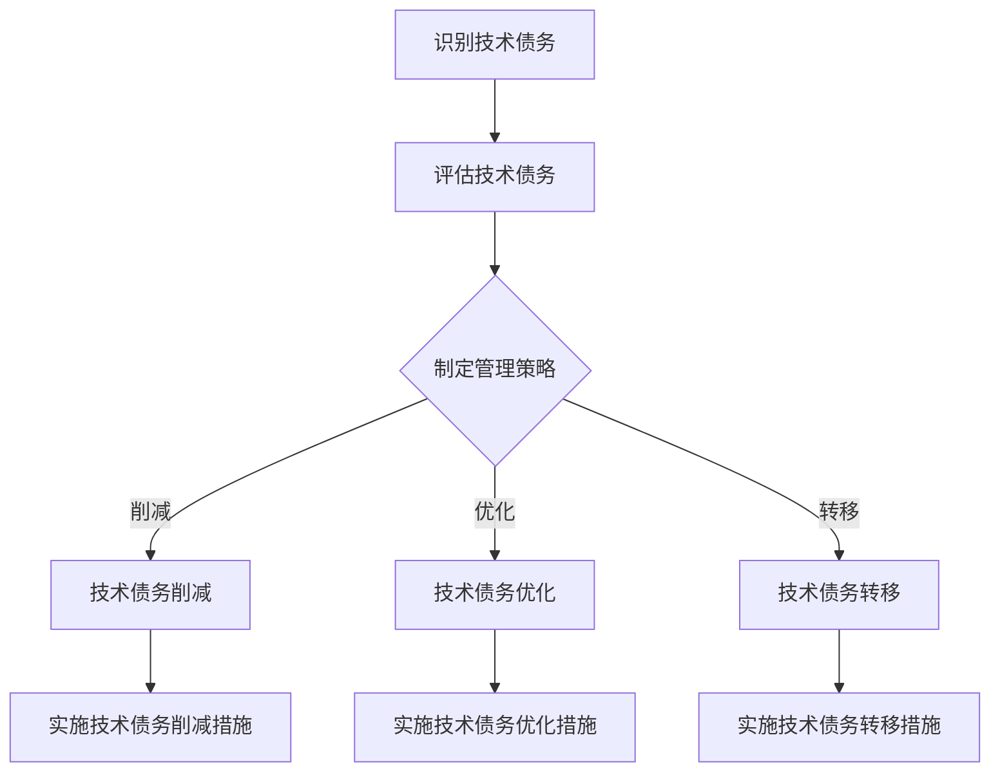

                 

### 文章标题

技术债务管理：平衡短期目标与长期健康

> 关键词：技术债务、短期目标、长期健康、债务评估、管理策略

> 摘要：本文旨在探讨技术债务管理的核心概念、方法与实践，帮助读者理解如何平衡短期目标和长期健康，以实现软件项目的可持续发展。

### 引言

在现代软件开发中，技术债务已成为一种不可避免的现象。技术债务，简而言之，是指在软件项目中由于选择快速开发而未能及时解决的技术问题、设计缺陷和遗留问题。这些债务如果不加以管理，会逐渐积累，最终导致项目成本上升、质量下降，甚至影响到项目的长期健康。

然而，面对技术债务，如何在不牺牲短期目标的情况下，确保项目的长期健康，成为每个开发者和管理者必须面对的挑战。本文将详细探讨技术债务管理的核心概念、方法与实践，为读者提供一套行之有效的解决方案。

### 核心概念与联系

首先，我们需要明确几个核心概念：

1. **技术债务**：技术债务指的是在软件开发过程中，为了加快开发进度而选择性地忽视某些技术问题或设计缺陷，导致的问题积累。技术债务可以来源于多种因素，如技术选择不当、时间压力、资源限制等。

2. **短期目标**：短期目标通常是指项目在短期内需要达成的目标，如产品发布、功能交付等。这些目标往往直接关系到项目的市场表现和客户满意度。

3. **长期健康**：长期健康是指项目在未来的可持续发展能力，包括技术稳定性、可维护性、可扩展性等。长期健康直接影响到项目的生命周期和企业的核心竞争力。

接下来，我们使用Mermaid流程图来展示技术债务管理中的关键环节：



### 核心算法原理讲解

在技术债务评估环节，我们需要使用一系列算法来量化技术债务的影响。以下是一个简化的伪代码，用于评估技术债务：

```pseudo
function assessTechnicalDebt(debtList):
    riskScore = 0
    for debt in debtList:
        riskScore += debt.severity * debt.frequency
    return riskScore
```

在这个算法中，`debtList` 是一个包含所有技术债务项的列表，每个债务项都有 `severity`（严重程度）和 `frequency`（发生频率）两个属性。`assessTechnicalDebt` 函数通过计算每个债务项的严重程度和发生频率的乘积，来评估整个项目的风险得分。

### 数学模型和数学公式

技术债务管理中常用的数学模型是风险模型。以下是一个简化的风险模型公式：

$$
R = P \times E
$$

其中，\( R \) 表示风险得分，\( P \) 表示技术债务的概率，\( E \) 表示技术债务的影响程度。这个公式表示技术债务的风险是由其发生的概率和影响程度共同决定的。

#### 示例

假设某个技术债务项发生的概率是 0.5，其影响程度是 5，那么该债务的风险得分为：

$$
R = 0.5 \times 5 = 2.5
$$

这个得分表明该债务项具有一定的风险，需要引起关注。

### 项目实战

#### 开发环境搭建

为了演示技术债务管理，我们假设一个简单的Web应用项目。首先，我们需要搭建开发环境：

```bash
# 安装Node.js
npm install -g node

# 安装数据库
sudo apt-get install mysql

# 安装前端框架
npm install -g create-react-app
```

#### 源代码实现

以下是项目的源代码实现：

```javascript
// index.js
const express = require('express');
const app = express();

app.get('/', (req, res) => {
  res.send('Hello, World!');
});

app.listen(3000, () => {
  console.log('Server is running on port 3000');
});
```

#### 代码解读

在这个项目中，我们使用Node.js和Express框架来搭建一个简单的Web服务器。这个项目在短期内看起来是高效的，但是长期来看，可能存在以下技术债务：

1. **性能问题**：没有使用负载均衡和缓存策略，可能导致在高并发情况下性能不佳。
2. **安全性问题**：没有进行SQL注入和XSS攻击的防护，存在安全风险。
3. **维护性问题**：代码结构简单，但缺乏模块化和文档化，不利于长期维护。

#### 实际案例分析和详细讲解剖析

假设在项目中我们发现了一个SQL注入漏洞。以下是漏洞检测、修复和验证的过程：

1. **漏洞检测**：使用自动化工具（如SQLMap）对Web应用进行安全扫描，发现SQL注入漏洞。

2. **漏洞修复**：修改后端代码，使用预处理语句（Prepared Statements）来防止SQL注入。

3. **漏洞验证**：再次使用SQLMap进行扫描，验证漏洞是否已被修复。

#### 项目小结

通过这个实际案例，我们可以看到技术债务管理的重要性。即使是一个简单的Web应用项目，也可能存在潜在的技术债务。通过及时发现、评估和管理这些债务，我们能够确保项目的长期健康，避免因技术债务而导致的性能和安全问题。

### 最佳实践 tips

1. **定期审查**：定期审查项目中的技术债务，确保债务不过度积累。

2. **透明沟通**：与团队成员保持透明沟通，让每个人都知道项目的债务情况。

3. **持续优化**：持续优化代码结构和设计，减少新债务的产生。

### 小结

技术债务管理是确保软件项目长期健康的重要手段。通过本文的探讨，我们了解了技术债务的基本概念、评估方法、管理策略和实践应用。希望读者能够将这些知识应用到实际项目中，实现短期目标与长期健康的平衡。

### 注意事项

1. 技术债务管理不是一蹴而就的过程，需要持续的努力和关注。
2. 技术债务管理工具和方法的选用应结合项目的实际情况。

### 拓展阅读

1. 《技术债务：如何度量和管理你的代码债务》（Martin Fowler著）
2. 《软件架构：实践者的研究方法》（Len Bass、Paul Clements、Rick Kazman著）

### 作者信息

作者：AI天才研究院/AI Genius Institute & 禅与计算机程序设计艺术 /Zen And The Art of Computer Programming

本文旨在为读者提供关于技术债务管理的全面知识和实践指南，帮助他们在软件开发过程中实现短期目标与长期健康的平衡。希望本文能够为您的项目带来实质性的改进。感谢您的阅读！

