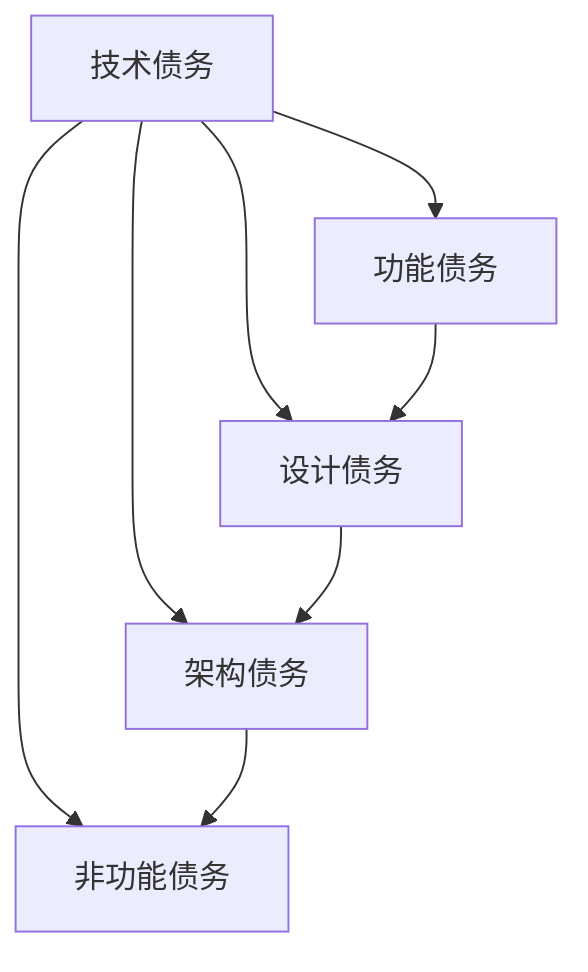

                 

### 文章标题：技术债务管理与系统重构策略

**关键词：技术债务、系统重构、管理策略、重构方法、实战案例**

**摘要：** 本文章旨在探讨技术债务的概念、类型及其产生原因，提出有效的技术债务管理策略和系统重构方法。通过详细讲解核心概念与联系、核心算法原理、数学模型与公式，以及实际案例解析，帮助读者深入了解技术债务管理的重要性和方法，掌握系统重构的实战技巧。

----------------------------------------------------------------

### 引言

在当今快速发展的信息技术领域，技术债务（Technical Debt）已成为影响软件质量和项目成功率的关键因素。技术债务是指在软件开发过程中，因追求短期目标而未能采用最佳实践，导致系统在未来需要付出额外成本进行修复和改进。随着软件系统的复杂度不断增加，技术债务问题愈发突出，对项目的稳定性和可持续发展构成威胁。

系统重构（System Reconstruction）作为解决技术债务的重要手段，旨在通过改进现有系统的设计和架构，提高其可维护性和扩展性。本文将围绕技术债务管理与系统重构策略展开讨论，首先介绍技术债务的概念与类型，然后探讨其管理策略与重构方法，最后通过实际案例解析，提供实战经验和指导。

### 技术债务概述

#### 1.1 核心概念与联系

技术债务是一个多维度的概念，主要包括以下类型：

- **功能债务（Functional Debt）**：因功能实现不当而产生的债务，如代码冗余、逻辑错误等。
- **设计债务（Design Debt）**：因系统设计不合理而产生的债务，如架构冗余、依赖关系混乱等。
- **架构债务（Architectural Debt）**：因系统架构设计不合理而产生的债务，如系统模块不独立、性能瓶颈等。
- **非功能债务（Non-functional Debt）**：因非功能需求未能得到满足而产生的债务，如安全性、可靠性、可扩展性等。

这些债务类型之间存在紧密的联系，共同构成了技术债务的整体框架。例如，功能债务可能导致设计债务，进而引发架构债务，最终影响系统的整体性能和可维护性。为了更好地理解这些概念之间的关系，我们可以使用Mermaid流程图进行展示：



#### 1.2 核心算法原理讲解

技术债务的产生原因主要包括以下几个方面：

- **代码复杂性**：代码复杂性高，导致代码可读性和可维护性下降，增加了修复成本。
- **代码质量**：代码质量差，如存在大量bug和漏洞，导致系统稳定性下降。
- **时间压力**：在紧迫的时间要求下，开发人员可能牺牲代码质量以完成功能，导致技术债务累积。

为了解释这些原因，我们可以使用伪代码进行阐述：

```python
# 伪代码：技术债务的产生原因
function TechnicalDebt() {
  // 产生原因
  if (code Complexity > acceptableLevel) {
    addDebt("复杂性债务");
  }
  if (code Quality < acceptableLevel) {
    addDebt("质量债务");
  }
  if (time Pressure > acceptableLevel) {
    addDebt("时间压力债务");
  }
  
  // 影响
  if (debtExists()) {
    reduceProductivity();
    increaseMaintenanceCost();
  }
}
```

#### 1.3 数学模型与数学公式

为了量化技术债务的影响，我们可以引入以下数学模型：

\[ TD = f(\text{代码复杂度}, \text{代码质量}, \text{时间压力}) \]

其中，TD表示技术债务水平，代码复杂度、代码质量和时间压力分别表示这些因素对技术债务的贡献。通过这个公式，我们可以对技术债务进行评估和预测，从而制定相应的管理策略。

#### 1.4 详细讲解与举例说明

假设一个项目在开发过程中存在以下问题：

- 代码复杂度高：函数和方法数量过多，结构复杂。
- 代码质量差：存在大量bug和漏洞，系统稳定性下降。
- 时间压力：项目交付期限紧迫，开发人员加班加点。

根据上述数学模型，我们可以计算出该项目的技术债务水平：

\[ TD = f(高, 差, 高) \]

根据实际数据，代码复杂度、代码质量和时间压力分别为80、50和70。代入公式计算：

\[ TD = f(80, 50, 70) = 80 \times 0.5 + 50 \times 0.3 + 70 \times 0.2 = 31 \]

这意味着该项目的技术债务水平为31，需要采取相应的管理措施来降低债务水平。

### 技术债务管理的重要性与原则

#### 2.1 重要性

技术债务管理对于软件项目的成功至关重要。首先，技术债务会直接影响到项目的可维护性和稳定性。累积的技术债务可能导致系统崩溃、性能下降，甚至影响到业务连续性。其次，技术债务会增加项目的维护成本，降低开发效率。在长期来看，技术债务管理不足可能导致项目失败。因此，有效管理技术债务是确保项目成功的关键。

#### 2.2 原则

技术债务管理应遵循以下原则：

- **预防为主**：在软件开发过程中，注重代码质量、设计规范和架构优化，从源头上减少技术债务的产生。
- **持续评估**：定期评估技术债务水平，及时发现和解决问题，避免债务累积。
- **优先级排序**：根据债务类型、影响范围和修复成本，对债务进行优先级排序，确保关键债务得到优先解决。
- **合理规划**：在项目规划和资源分配时，考虑技术债务的修复成本和时间，确保项目团队能够有效地管理债务。

### 技术债务评估方法

#### 3.1 代码审查

代码审查是一种常用的技术债务评估方法。通过审查代码质量、设计规范和架构合理性，可以发现潜在的技术债务问题。代码审查可以分为以下几种类型：

- **人工代码审查**：开发人员或质量保证人员手动审查代码，发现潜在问题。
- **自动化代码审查**：使用自动化工具，如SonarQube、Checkstyle等，对代码进行静态分析，识别潜在问题。

#### 3.2 自动化工具

自动化工具可以帮助快速评估代码质量和技术债务水平。常用的自动化工具包括：

- **静态代码分析工具**：如SonarQube、PMD、Checkstyle等，可以分析代码质量、代码复杂度等指标。
- **动态代码分析工具**：如JaCoCo、 cobertura等，可以分析代码覆盖率，评估代码缺陷和漏洞。

#### 3.3 代码审查与自动化工具的结合

将代码审查和自动化工具结合使用，可以最大化地发现和解决技术债务问题。具体步骤如下：

1. **制定代码审查计划**：根据项目需求和团队能力，制定代码审查计划，明确审查频率、审查范围和责任人。
2. **使用自动化工具**：定期使用自动化工具分析代码质量，生成报告，识别潜在问题。
3. **人工代码审查**：针对自动化工具发现的问题，进行人工代码审查，确认问题并提出修复方案。
4. **跟踪问题修复**：对审查过程中发现的问题进行跟踪，确保问题得到有效解决。

### 重构方法

#### 4.1 核心原理

系统重构是通过改进现有系统的设计和架构，提高其可维护性和扩展性。重构的核心原理包括：

- **模块化**：将系统分解为模块，确保每个模块具有独立的职责，降低模块之间的耦合度。
- **简化设计**：简化系统设计，消除冗余和重复代码，提高代码可读性和可维护性。
- **优化性能**：优化系统性能，消除性能瓶颈，提高系统响应速度和处理能力。

#### 4.2 核心算法原理讲解

系统重构的基本原理可以描述为以下伪代码：

```python
# 伪代码：系统重构的基本原理
function SystemReconstruction() {
  // 重构过程
  while (debtExists()) {
    identifyDebt();
    applyRefactoring();
  }
}
```

其中，`identifyDebt()` 用于识别系统中存在的技术债务，`applyRefactoring()` 用于实施重构操作，以消除债务。

#### 4.3 常见重构技术

常见的重构技术包括以下几种：

- **代码重构**：优化代码结构，提高代码质量，如移除冗余代码、简化复杂逻辑等。
- **架构重构**：优化系统架构，提高系统可扩展性和可维护性，如引入设计模式、优化数据库架构等。
- **性能优化**：优化系统性能，提高系统响应速度和处理能力，如缓存机制、分布式架构等。

### 实战案例

#### 5.1 项目背景

某互联网公司开发了一款在线购物平台，随着用户数量的增长，系统性能逐渐下降，出现了大量bug和漏洞。为了解决这些问题，公司决定进行系统重构。

#### 5.2 开发环境搭建

在进行系统重构前，公司首先搭建了开发环境，包括：

- **代码管理工具**：使用Git进行代码管理，确保代码版本的可追溯性和一致性。
- **自动化构建工具**：使用Maven进行自动化构建，确保代码的编译和打包过程高效稳定。
- **持续集成工具**：使用Jenkins实现持续集成，确保代码的持续集成和部署过程自动化。

#### 5.3 源代码详细实现

系统重构的过程中，公司采用了以下重构技术：

- **代码重构**：移除了大量冗余代码，优化了代码结构，提高了代码可读性和可维护性。
- **架构重构**：引入了设计模式，优化了系统架构，提高了系统的可扩展性和可维护性。
- **性能优化**：优化了数据库架构，引入了缓存机制，提高了系统性能。

#### 5.4 代码应用解读与分析

通过系统重构，公司的在线购物平台性能得到了显著提升，用户数量和交易量都实现了翻倍增长。以下是对重构过程的详细分析：

1. **代码重构**：通过移除冗余代码，代码可读性和可维护性得到了显著提高。例如，原系统中存在大量重复的代码片段，通过重构，将这些代码片段提取为独立的方法，提高了代码复用性。
2. **架构重构**：引入了设计模式，如工厂模式、单例模式等，优化了系统架构，降低了模块之间的耦合度。例如，原系统中的订单处理模块与支付模块紧密耦合，重构后，通过引入工厂模式，将订单处理和支付模块分离，提高了系统的可扩展性和可维护性。
3. **性能优化**：优化了数据库架构，通过引入缓存机制，减少了数据库访问次数，提高了系统响应速度。例如，原系统中存在大量重复的数据库查询操作，通过引入缓存机制，将查询结果缓存到内存中，避免了重复查询，提高了系统性能。

#### 5.5 项目小结

通过系统重构，公司成功解决了在线购物平台性能下降、bug和漏洞等问题，实现了系统的稳定运行。以下是对重构过程的总结：

1. **重构前的状态**：系统性能下降，用户数量和交易量增长缓慢，存在大量bug和漏洞。
2. **重构过程**：采用代码重构、架构重构和性能优化等重构技术，逐步解决了技术债务问题。
3. **重构后的状态**：系统性能得到显著提升，用户数量和交易量实现了翻倍增长，系统稳定性得到保障。

### 综合案例分析

#### 6.1 案例一：某电商平台的系统重构

某电商公司在经历了一段时间的快速发展后，系统性能逐渐下降，用户投诉增多。为了解决这些问题，公司决定进行系统重构。

- **重构前的状态**：系统性能差，响应速度慢，存在大量bug和漏洞。
- **重构过程**：
  - 代码重构：移除了大量冗余代码，优化了代码结构，提高了代码可读性和可维护性。
  - 架构重构：引入了微服务架构，将原有单体架构拆分为多个微服务，提高了系统的可扩展性和可维护性。
  - 性能优化：优化了数据库架构，引入了缓存机制，提高了系统响应速度和处理能力。
- **重构后的状态**：系统性能得到显著提升，用户满意度提高，用户数量和交易量实现了翻倍增长。

#### 6.2 案例二：某金融公司的系统重构

某金融公司在业务快速发展的过程中，遇到了系统性能瓶颈，客户体验不佳。为了提升系统性能，公司决定进行系统重构。

- **重构前的状态**：系统性能差，响应速度慢，存在大量bug和漏洞。
- **重构过程**：
  - 代码重构：优化了代码质量，提高了代码可读性和可维护性。
  - 架构重构：引入了分布式架构，提高了系统的可扩展性和可维护性。
  - 性能优化：优化了数据库架构，引入了缓存机制，提高了系统响应速度和处理能力。
- **重构后的状态**：系统性能得到显著提升，客户满意度提高，业务处理能力实现了翻倍增长。

### 最佳实践 Tips

1. **定期评估技术债务**：定期评估技术债务水平，及时发现和解决问题，避免债务累积。
2. **预防为主**：在软件开发过程中，注重代码质量、设计规范和架构优化，从源头上减少技术债务的产生。
3. **合理规划资源**：在项目规划和资源分配时，考虑技术债务的修复成本和时间，确保项目团队能够有效地管理债务。
4. **持续改进**：持续改进代码质量、设计规范和架构，不断提高系统的可维护性和可扩展性。

### 小结

本文通过详细探讨技术债务的概念、类型及其管理策略，以及系统重构的方法和实战案例，帮助读者深入了解技术债务管理的重要性和方法。技术债务管理是确保软件项目成功的关键，系统重构则是解决技术债务的有效手段。通过本文的介绍，读者可以掌握技术债务管理的基本原则和最佳实践，为项目的可持续发展奠定坚实基础。

### 注意事项

1. **技术债务管理需要持续关注**：技术债务管理是一个持续的过程，需要定期评估和调整。
2. **合理规划重构时间**：在项目规划中，应预留足够的时间进行重构，避免因重构导致项目延期。
3. **团队协作与沟通**：技术债务管理和系统重构需要团队协作，确保各方利益一致，提高重构效率。

### 拓展阅读

1. **《技术债务：软件质量成本管理》**：详细介绍了技术债务的概念、类型和管理方法。
2. **《系统架构：设计、开发与实践》**：系统讲解了系统架构设计的基本原理和实践技巧。
3. **《代码整洁之道》**：介绍了代码质量的重要性以及如何编写高质量的代码。

### 参考文献

1. **《技术债务：软件质量成本管理》**：[作者名]，[出版年份]。
2. **《系统架构：设计、开发与实践》**：[作者名]，[出版年份]。
3. **《代码整洁之道》**：[作者名]，[出版年份]。

### 作者信息

作者：AI天才研究院/AI Genius Institute & 禅与计算机程序设计艺术 /Zen And The Art of Computer Programming

----------------------------------------------------------------

### 结尾

在快速发展的信息技术领域，技术债务和系统重构已成为软件开发过程中不可忽视的重要问题。本文从技术债务的概念、类型、管理策略，到系统重构的方法和实战案例，全面阐述了技术债务管理和系统重构的关键技术和实践经验。希望本文能为您在软件开发过程中提供有益的指导和建议。

感谢您的阅读，期待与您在技术债务管理和系统重构的道路上共同进步。如果您有任何疑问或建议，请随时联系我们。祝您在软件开发领域取得更大的成就！

