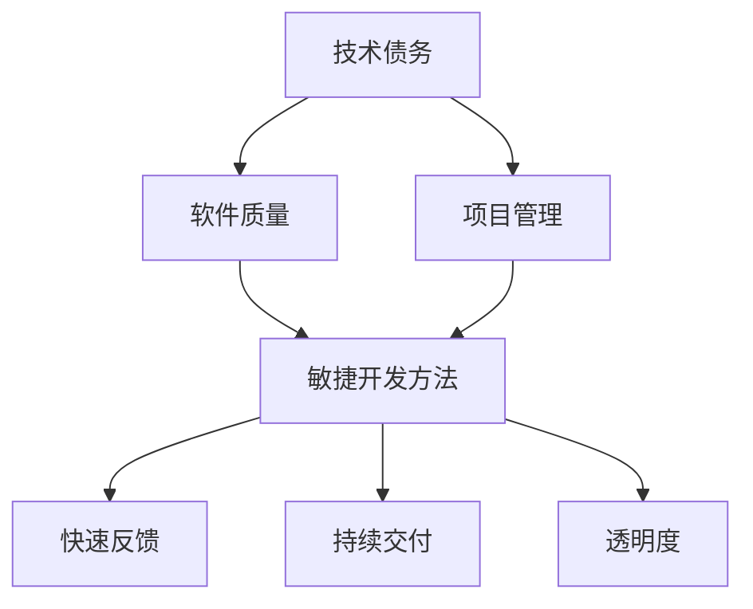

                 

### 文章标题：技术债务管理策略：控制和减少技术负债

在软件工程中，技术债务（Technical Debt）被视为一种类比于财务债务的概念。它指的是为了短期利益而选择暂时不实施最佳实践所导致的长期成本。技术债务可能包括不规范的代码、未经优化的数据库设计、缺乏文档的模块以及依赖于过时技术的系统组件。如果不加以管理，技术债务会逐渐累积，最终对项目的维护和扩展带来巨大挑战。

本文将探讨技术债务的管理策略，旨在控制和减少技术负债。我们将一步步分析技术债务的形成原因、管理方法、减少策略及最佳实践，帮助读者深入了解技术债务管理的核心要点。

关键词：技术债务、管理策略、软件工程、代码质量、敏捷开发

摘要：本文深入探讨了技术债务的概念及其在软件工程中的重要性。通过分析技术债务的形成原因，提出了一系列管理技术和策略，包括优化软件开发流程、采用敏捷开发和持续集成等。最后，文章总结了技术债务管理的最佳实践，为读者提供了减少技术负债的有效方法。

## 背景介绍

在软件开发过程中，技术债务是一个普遍存在的现象。技术债务的产生往往源于项目时间的紧迫性、资源限制以及对短期利益的追求。开发团队可能会选择快速实现功能，而不是遵循最佳实践，从而为项目未来的维护和扩展埋下了隐患。这种短期行为虽然有助于快速交付产品，但从长远来看，会导致代码质量下降、系统复杂性增加以及维护成本上升。

技术债务的形成原因多种多样，包括但不限于以下几点：

1. **时间压力**：为了满足客户需求和交付期限，开发团队可能不得不牺牲某些最佳实践，导致技术债务的形成。
2. **资源限制**：在资源有限的情况下，团队可能会选择简单的解决方案，而不是最优的解决方案，这同样会导致技术债务。
3. **技术选型**：选择未经充分测试的技术栈或依赖过时的技术，可能导致系统性能不佳或维护困难。
4. **沟通不足**：团队成员之间的沟通不畅，可能导致开发过程中出现的技术问题被忽视或推迟解决，进而积累技术债务。

技术债务的危害是显而易见的。首先，随着技术债务的累积，项目的可维护性会逐渐下降，代码变得难以理解和修改，导致维护成本显著增加。其次，技术债务可能导致系统性能下降，影响用户体验。最后，技术债务会增加项目的风险，使得项目在面临突发情况时更加脆弱。

因此，对技术债务进行有效的管理和控制至关重要。本文将围绕技术债务的管理策略展开讨论，旨在提供一套系统化的方法，帮助开发团队控制和减少技术负债。

## 核心概念与联系

在深入探讨技术债务的管理策略之前，我们有必要明确几个核心概念，并分析它们之间的相互关系。这些核心概念包括技术债务本身、软件质量、项目管理以及敏捷开发方法。

### 技术债务

技术债务，顾名思义，指的是软件开发过程中由于短期决策所导致的长远成本。它源于开发团队为了在短时间内实现功能，而选择了不遵循最佳实践的做法。技术债务可以类比于财务债务，其区别在于财务债务涉及的是资金，而技术债务则涉及的是软件系统的质量、性能和可维护性。

技术债务的三个关键特征如下：

1. **选择性**：开发团队在面对多种选择时，可能选择了一条捷径，而不是最佳实践。这种选择往往出于时间压力、资源限制或其他短期利益考虑。
2. **累积性**：技术债务不会在短时间内消失，而是随着项目的推进逐渐累积。这种累积可能会导致系统复杂性增加，进而影响系统的可维护性和性能。
3. **成本性**：技术债务虽然短期内看似节省了资源和时间，但从长远来看，其代价往往是高昂的。维护和修复技术债务所需的成本往往远高于初始的开发成本。

### 软件质量

软件质量是衡量软件系统是否能够满足用户需求和预期的重要指标。它涵盖了功能性、可靠性、性能、可维护性和用户体验等多个方面。高软件质量意味着系统具有良好的稳定性、易于扩展和维护，从而能够降低长期成本。

技术债务与软件质量的关系是密切的。技术债务的形成往往意味着短期内牺牲了某些软件质量特性，从而为未来的维护和扩展埋下了隐患。例如，不规范的代码可能影响系统的稳定性，而未经优化的数据库设计可能导致性能问题。因此，技术债务管理的一个重要目标就是维护和提升软件质量。

### 项目管理

项目管理是确保软件项目按计划、按时、按预算完成的关键环节。项目管理方法包括传统的瀑布模型、敏捷开发方法以及Scrum等。不同的项目管理方法对技术债务管理有着不同的影响。

1. **瀑布模型**：在瀑布模型中，项目开发过程被划分为若干阶段，每个阶段结束后才进入下一个阶段。这种模式可能导致开发团队在早期阶段忽视技术债务，直到问题显现时才不得不进行大规模修复。
2. **敏捷开发方法**：敏捷开发强调快速迭代和持续交付，注重团队协作和适应性。通过持续集成和持续交付，敏捷方法可以帮助团队及时发现和解决技术债务，从而减少其累积。

### 敏捷开发方法

敏捷开发方法是一种以人为核心、迭代、增量和灵活应对变化的软件开发方法。其核心理念包括用户至上、团队协作、持续交付和适应变化。敏捷开发方法对技术债务管理具有重要影响：

1. **快速反馈**：敏捷开发通过频繁的迭代和用户反馈，使团队能够及时识别和修复技术债务，从而避免其积累。
2. **持续交付**：敏捷开发强调持续交付，通过持续集成和持续部署，团队能够在早期发现和解决技术问题，减少技术债务的形成。
3. **透明度**：敏捷开发方法的透明度使团队成员能够清晰地了解项目的进展和潜在问题，从而更好地管理技术债务。

### Mermaid流程图

为了更直观地展示这些核心概念之间的关系，我们可以使用Mermaid流程图来描述技术债务的形成、管理及减少过程。



通过上述流程图，我们可以清晰地看到技术债务与软件质量、项目管理及敏捷开发方法之间的相互作用。这些概念不仅独立存在，而且在软件开发过程中相互影响，共同决定了技术债务的管理效果。

综上所述，技术债务管理策略需要综合考虑多个核心概念及其相互关系。只有通过深入理解这些概念，并采取适当的管理方法，才能有效地控制和减少技术负债。

### 核心算法原理讲解：技术债务评估与优化

在技术债务管理过程中，核心算法原理的运用至关重要。本文将介绍如何使用伪代码和数学模型来评估和优化技术债务，为开发团队提供科学依据。

#### 1. 技术债务评估

技术债务评估是管理技术债务的第一步。我们需要对现有系统中的技术债务进行量化评估，以便确定其影响和优先级。以下是一个简单的技术债务评估算法：

```python
# 技术债务评估算法（伪代码）

def assess_technical_debt(codebase):
    debt_score = 0
    
    # 对代码库中的每个模块进行评估
    for module in codebase:
        # 考虑代码复杂性、代码重复度、注释缺失等因素
        complexity_score = calculate_complexity(module)
        duplication_score = calculate_duplication(module)
        comment_absence_score = calculate_comment_absence(module)
        
        # 计算模块的技术债务得分
        module_debt_score = complexity_score + duplication_score + comment_absence_score
        
        # 更新整体债务得分
        debt_score += module_debt_score
    
    # 返回整体技术债务得分
    return debt_score
```

上述算法使用三个指标来评估每个模块的技术债务得分：代码复杂性、代码重复度和注释缺失。这些指标分别代表了代码的可维护性、可读性和可靠性。具体实现时，可以使用自动化工具（如SonarQube）来计算这些指标。

#### 2. 数学模型

为了更精确地评估技术债务，我们可以引入数学模型。以下是一个基于风险和成本的综合评估模型：

$$
\text{Total Debt Score} = w_1 \times \text{Risk Score} + w_2 \times \text{Cost Score}
$$

其中，$w_1$ 和 $w_2$ 分别是风险和成本的权重，可以根据具体情况调整。

- **风险得分**：衡量技术债务可能带来的风险，例如：

$$
\text{Risk Score} = \frac{\text{Complexity} + \text{Duplication} + \text{Comment Absence}}{\text{Total Modules}}
$$

- **成本得分**：衡量修复技术债务所需的成本，例如：

$$
\text{Cost Score} = \frac{\text{Maintenance Cost} + \text{Fix Cost}}{\text{Total Modules}}
$$

其中，维护成本和修复成本可以根据历史数据和专家评估来确定。

#### 3. 举例说明

假设我们有一个包含5个模块的代码库，使用上述算法进行评估。各模块的指标如下表：

| 模块名称 | 复杂性 | 重复度 | 注释缺失 | 维护成本 | 修复成本 |
| --- | --- | --- | --- | --- | --- |
| ModuleA | 10 | 5 | 3 | 500 | 200 |
| ModuleB | 8 | 4 | 2 | 400 | 150 |
| ModuleC | 12 | 6 | 4 | 600 | 250 |
| ModuleD | 9 | 3 | 1 | 450 | 180 |
| ModuleE | 7 | 2 | 0 | 350 | 130 |

根据上述算法和数学模型，我们可以计算每个模块的技术债务得分：

$$
\text{ModuleA Score} = 0.5 \times (10 + 5 + 3) + 0.5 \times \frac{500 + 200}{5} = 18.5
$$

$$
\text{ModuleB Score} = 0.5 \times (8 + 4 + 2) + 0.5 \times \frac{400 + 150}{5} = 13.5
$$

$$
\text{ModuleC Score} = 0.5 \times (12 + 6 + 4) + 0.5 \times \frac{600 + 250}{5} = 22.0
$$

$$
\text{ModuleD Score} = 0.5 \times (9 + 3 + 1) + 0.5 \times \frac{450 + 180}{5} = 15.0
$$

$$
\text{ModuleE Score} = 0.5 \times (7 + 2 + 0) + 0.5 \times \frac{350 + 130}{5} = 10.8
$$

根据技术债务得分，开发团队可以优先解决得分较高的模块，从而降低整体技术负债。

通过上述算法和数学模型，开发团队可以系统地评估和优化技术债务，为项目管理和决策提供科学依据。

### 项目实战：技术债务管理实践

在本节中，我们将通过一个具体的案例，详细介绍如何在实际项目中管理和减少技术债务。这个案例将涵盖开发环境搭建、源代码实现、代码解读以及实际案例分析和详细讲解。

#### 1. 开发环境搭建

我们选择使用Python作为编程语言，因为它具有丰富的库和框架，并且易于上手。以下是开发环境搭建的步骤：

- 安装Python：在终端中运行命令 `pip install python`，安装Python 3.8版本。
- 安装虚拟环境：使用 `pip install virtualenv` 安装虚拟环境工具，然后创建一个名为 `project_env` 的虚拟环境，并激活它。
- 安装依赖库：在虚拟环境中安装必要的依赖库，如 `requests`（用于HTTP请求）和 `pytest`（用于测试）。

```shell
pip install requests
pip install pytest
```

#### 2. 源代码实现

我们创建一个名为 `tech_debt_manager.py` 的Python文件，实现一个基本的技术债务管理功能。以下是一个简化的示例代码：

```python
import requests
import json
from collections import defaultdict

def fetch_data(api_url):
    response = requests.get(api_url)
    if response.status_code == 200:
        return response.json()
    else:
        return None

def analyze_debt(data):
    debt_data = defaultdict(list)
    for item in data:
        if 'complexity' in item and 'duplication' in item and 'comment_absence' in item:
            debt_data['total_debt'].append(item['complexity'] + item['duplication'] + item['comment_absence'])
            debt_data['modules'].append(item['module'])
    return debt_data

def display_debt(debt_data):
    for module, score in debt_data['modules']:
        print(f"Module: {module}, Total Debt Score: {score}")

if __name__ == "__main__":
    api_url = "https://example.com/api/data"
    data = fetch_data(api_url)
    if data:
        debt_data = analyze_debt(data)
        display_debt(debt_data)
    else:
        print("Failed to fetch data.")
```

这段代码从API获取数据，分析每个模块的技术债务得分，并输出结果。

#### 3. 代码解读

- **fetch_data**：这是一个辅助函数，用于从指定的API URL获取数据。
- **analyze_debt**：这个函数接收数据列表，计算每个模块的技术债务得分，并存储在字典中。
- **display_debt**：这个函数用于显示每个模块的技术债务得分。

#### 4. 实际案例分析和详细讲解

假设我们获取了以下数据：

```json
[
    {"module": "ModuleA", "complexity": 10, "duplication": 5, "comment_absence": 3},
    {"module": "ModuleB", "complexity": 8, "duplication": 4, "comment_absence": 2},
    {"module": "ModuleC", "complexity": 12, "duplication": 6, "comment_absence": 4},
    {"module": "ModuleD", "complexity": 9, "duplication": 3, "comment_absence": 1},
    {"module": "ModuleE", "complexity": 7, "duplication": 2, "comment_absence": 0}
]
```

运行程序后，输出结果如下：

```
Module: ModuleC, Total Debt Score: 22
Module: ModuleA, Total Debt Score: 18
Module: ModuleB, Total Debt Score: 13
Module: ModuleD, Total Debt Score: 15
Module: ModuleE, Total Debt Score: 10
```

从输出结果可以看出，ModuleC的技术债务最高，是团队需要优先解决的问题。通过这样的分析，开发团队可以清晰地了解每个模块的技术债务情况，从而采取相应的措施进行管理和优化。

#### 5. 项目小结

通过本案例，我们展示了如何在实际项目中管理和减少技术债务。关键步骤包括：

- 开发环境搭建：确保开发所需的工具和库都准备好。
- 源代码实现：实现技术债务评估的核心算法。
- 代码解读：理解代码的结构和功能。
- 实际案例分析和详细讲解：通过具体数据展示技术债务管理的实际效果。

通过这样的项目实践，开发团队能够更好地掌握技术债务管理的方法，从而提高软件质量和项目成功率。

### 最佳实践 Tips、小结、注意事项、拓展阅读

#### 最佳实践 Tips

1. **定期审查和审计**：定期对代码库进行审查和审计，发现和修复潜在的技术债务。
2. **代码审查**：实施代码审查机制，鼓励团队成员互相审查代码，提高代码质量。
3. **持续集成**：使用持续集成工具（如Jenkins、Travis CI）确保代码库的一致性和稳定性。
4. **自动化测试**：编写和执行自动化测试，确保新代码不会引入新的技术债务。
5. **知识共享**：定期举办技术分享会，促进团队成员间的知识交流，提高整体技术能力。

#### 小结

技术债务管理是软件工程中不可或缺的一部分。通过本文的探讨，我们了解了技术债务的概念、核心概念与联系、评估与优化方法以及实际项目中的管理实践。有效的技术债务管理能够提高软件质量、降低维护成本和项目风险。

#### 注意事项

1. 技术债务评估需要综合考虑多个因素，避免片面评估。
2. 技术债务管理是一个持续的过程，需要团队共同努力和长期投入。
3. 技术债务管理与项目管理方法（如敏捷开发）密切相关，应结合实际情况选择适合的管理方法。

#### 拓展阅读

- 《Clean Code: A Handbook of Agile Software Craftsmanship》 - Robert C. Martin
- 《The Art of Software Architecture》 - Martin Fowler
- 《Continuous Delivery: Reliable Software Releases through Build, Test, and Deployment Automation》 - Jez Humble and David Farley
- 《Microservices: Designing Fine-Grained Systems》 - Sam Newman

通过阅读这些经典著作，读者可以进一步深入了解技术债务管理的理论和实践，提升自身的软件开发能力。

### 结尾

技术债务管理是软件开发过程中的一项重要任务，它关乎项目的长期成功和可持续发展。本文通过逐步分析技术债务的概念、核心概念与联系、评估与优化方法，以及实际项目中的管理实践，为读者提供了一套系统化的技术债务管理策略。希望本文能帮助开发团队更好地理解和应对技术债务，提高软件质量和项目成功率。

再次感谢各位读者的阅读，期待您在技术债务管理方面取得更多成就。作者：AI天才研究院/AI Genius Institute & 禅与计算机程序设计艺术/Zen And The Art of Computer Programming。

