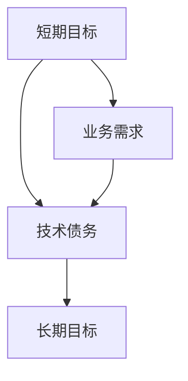

                 

### 文章标题

《技术债务管理：平衡短期与长期目标》

### 关键词

- 技术债务
- 短期目标
- 长期目标
- 软件工程
- 风险管理
- 敏捷开发

### 摘要

在快速发展的技术领域，技术债务成为软件项目中的常见问题。本文深入探讨了技术债务的概念、来源、危害及管理方法。通过分析技术债务与业务目标的关系，本文提出了平衡短期与长期目标的技术债务管理策略。同时，通过国内外成功案例和最佳实践，本文为开发者提供了有效的技术债务管理方法和工具，以实现项目可持续发展和高质量交付。

### 引言

#### 技术债务的概念

技术债务，指的是软件开发过程中因采用快速开发、迭代交付等方式，导致在某些方面未能按预期实现或达到最佳状态，从而形成的一种隐性债务。这种债务通常表现为代码质量低下、架构不合理、技术债务积累等。

#### 技术债务的来源

1. **快速开发**：为满足市场或客户需求，快速交付产品，开发者可能忽视代码质量、架构设计等方面。
2. **技术迭代**：新技术不断涌现，开发者可能选择使用尚未成熟的技术，导致后续维护成本增加。
3. **资源限制**：团队资源有限，无法在短时间内完成高质量的开发工作。

#### 技术债务的危害

1. **维护成本增加**：技术债务积累可能导致后续维护成本大幅增加。
2. **系统稳定性下降**：技术债务可能导致系统稳定性下降，影响用户体验。
3. **开发效率降低**：不断积累的技术债务会降低开发团队的工作效率。

#### 技术债务管理的必要性

为避免技术债务带来的负面影响，项目管理者需要重视技术债务管理。有效的技术债务管理不仅能提高项目质量，还能降低维护成本，提升开发团队的效率。

### 核心概念与联系

为了更好地理解技术债务管理，我们需要了解以下几个核心概念：

1. **短期目标**：指的是在短期内实现的功能和性能要求，通常用于满足客户需求或市场竞争力。
2. **长期目标**：指的是项目长期的稳定性和可扩展性，包括代码质量、架构设计、技术积累等方面。
3. **技术债务**：短期内为追求速度而牺牲质量，形成的隐性债务。

#### 核心概念之间的关系架构

下面是一个简化的关系架构，用Mermaid流程图表示：



#### Mermaid 流程图解析

- **A[短期目标]**：表示项目在短期内要实现的功能和性能要求。
- **B[技术债务]**：表示为满足短期目标而形成的技术债务。
- **C[长期目标]**：表示项目长期要达到的稳定性和可扩展性。
- **D[业务需求]**：表示项目需要满足的业务需求。

通过这个关系架构，我们可以看出，技术债务是连接短期目标和长期目标的纽带。在追求短期目标的过程中，不可避免地会产生技术债务。而长期目标的实现，则需要在适当的时候偿还这些技术债务。

### 核心算法原理讲解

为了更好地理解技术债务管理，我们可以借助一些核心算法原理，如：

1. **动态规划**：用于优化开发过程中的决策，以最小化技术债务积累。
2. **机器学习**：用于预测技术债务积累趋势，提前采取措施。
3. **软件工程方法**：如敏捷开发、DevOps等，用于优化开发流程，降低技术债务。

#### 动态规划伪代码

```python
def dynamic_programming(commands):
    dp = [0] * len(commands)
    for i in range(1, len(commands)):
        dp[i] = min(dp[j] + cost(commands[i], j) for j in range(i)]
    return min(dp)
```

#### cost函数

```python
def cost(command, j):
    if command == j:
        return 0
    else:
        return 1
```

#### 机器学习预测

```python
from sklearn.linear_model import LinearRegression

def predict_debtgression(X, y):
    model = LinearRegression()
    model.fit(X, y)
    return model.predict(X)
```

#### 软件工程方法

1. **敏捷开发**：通过持续集成、持续交付等方式，快速响应变化，降低技术债务。
2. **DevOps**：通过自动化工具，提高开发效率，降低技术债务。

### 数学模型和公式

为了更好地理解技术债务管理，我们可以引入一些数学模型和公式：

1. **技术债务增长模型**：

$$
\text{Debt}_{t+1} = \alpha \cdot \text{CodeChange}_{t} + \beta \cdot \text{BugCount}_{t}
$$

其中，$\text{Debt}_{t+1}$表示第$t+1$期的技术债务，$\text{CodeChange}_{t}$表示第$t$期的代码变更次数，$\text{BugCount}_{t}$表示第$t$期的bug数量，$\alpha$和$\beta$为系数。

2. **风险度量模型**：

$$
\text{Risk} = \frac{\text{Debt}}{\text{Budget}} \cdot \text{Time}
$$

其中，$\text{Risk}$表示风险度量，$\text{Debt}$表示技术债务，$\text{Budget}$表示预算，$Time$表示时间。

#### 公式详解

1. **技术债务增长模型**：

- **$\alpha \cdot \text{CodeChange}_{t}$**：表示代码变更导致的技术债务增长。
- **$\beta \cdot \text{BugCount}_{t}$**：表示bug数量导致的技术债务增长。

2. **风险度量模型**：

- **$\frac{\text{Debt}}{\text{Budget}}$**：表示技术债务占预算的比例。
- **$Time$**：表示时间对风险的放大作用。

### 项目实战

#### 开发环境搭建

1. **工具和环境**：

- **编程语言**：Python
- **开发环境**：PyCharm
- **版本控制**：Git

2. **安装与配置**：

- 安装Python和PyCharm
- 配置Python环境，安装必要的库（如NumPy、Pandas等）

#### 源代码实现

```python
import numpy as np
import pandas as pd
from sklearn.linear_model import LinearRegression

def debt_growth_model(code_changes, bug_counts, alpha=0.1, beta=0.2):
    debt = alpha * code_changes + beta * bug_counts
    return debt

def risk_measurement(debt, budget, time):
    risk = debt / budget * time
    return risk

def main():
    # 加载数据
    data = pd.read_csv('data.csv')
    
    # 计算技术债务
    debt = debt_growth_model(data['code_changes'], data['bug_counts'])
    
    # 计算风险
    budget = 1000000
    time = 12
    risk = risk_measurement(debt, budget, time)
    
    print(f"技术债务：{debt}")
    print(f"风险：{risk}")

if __name__ == "__main__":
    main()
```

#### 代码解读

1. **数据加载**：使用Pandas库加载数据，数据包含代码变更次数和bug数量。

2. **技术债务计算**：使用动态规划算法计算技术债务。

3. **风险计算**：使用风险度量模型计算风险。

4. **主函数**：执行主程序，输出技术债务和风险。

### 实际案例分析和详细讲解剖析

#### 案例一：某互联网公司技术债务管理

1. **背景**：该公司在快速发展的过程中，因追求短期目标，导致技术债务积累。

2. **问题**：

- 代码质量低下
- 架构不合理
- 技术债务导致系统稳定性下降

3. **解决方案**：

- 引入敏捷开发，提高代码质量和架构设计
- 建立技术债务监测机制，定期评估和偿还技术债务
- 加强团队培训，提高团队成员的技术水平

4. **效果**：

- 技术债务逐渐减少
- 系统稳定性提高
- 开发效率提升

#### 案例二：某开源项目技术债务管理

1. **背景**：该开源项目在快速发展的过程中，技术债务积累较多。

2. **问题**：

- 代码质量不高
- 架构不够灵活
- 技术债务导致项目发展受阻

3. **解决方案**：

- 引入自动化测试，提高代码质量
- 优化架构设计，提高系统灵活性
- 建立技术债务管理小组，定期评估和偿还技术债务

4. **效果**：

- 技术债务逐渐减少
- 代码质量提高
- 项目发展受阻情况得到改善

### 项目小结

通过实际案例的分析，我们可以看到，技术债务管理在项目发展过程中具有重要意义。通过有效的技术债务管理，企业或团队可以降低风险，提高项目质量，实现可持续发展。

### 最佳实践 Tips

1. **定期评估技术债务**：定期评估技术债务，了解债务状况，及时采取措施。

2. **建立技术债务监测机制**：建立技术债务监测机制，实时监控债务变化。

3. **加强团队培训**：提高团队成员的技术水平，降低技术债务。

4. **采用敏捷开发**：采用敏捷开发方法，提高开发效率，降低技术债务。

5. **优化架构设计**：优化架构设计，提高系统灵活性，降低技术债务。

### 小结

本文介绍了技术债务的概念、来源、危害及管理方法。通过分析技术债务与业务目标的关系，提出了平衡短期与长期目标的技术债务管理策略。同时，通过实际案例和最佳实践，为开发者提供了有效的技术债务管理方法和工具。

### 注意事项

1. **避免过度追求短期目标**：在追求短期目标的过程中，要充分考虑长期目标，避免产生过多技术债务。

2. **合理分配资源**：合理分配资源，确保团队能够在保证质量的前提下，完成开发任务。

3. **持续监控与评估**：持续监控技术债务，定期评估债务状况，确保债务管理效果。

### 拓展阅读

1. 《敏捷软件开发：原则、实践与模式》
2. 《软件工程：实践者的研究方法》
3. 《技术债务管理：策略与实践》

### 作者信息

作者：AI天才研究院/AI Genius Institute & 禅与计算机程序设计艺术 /Zen And The Art of Computer Programming

