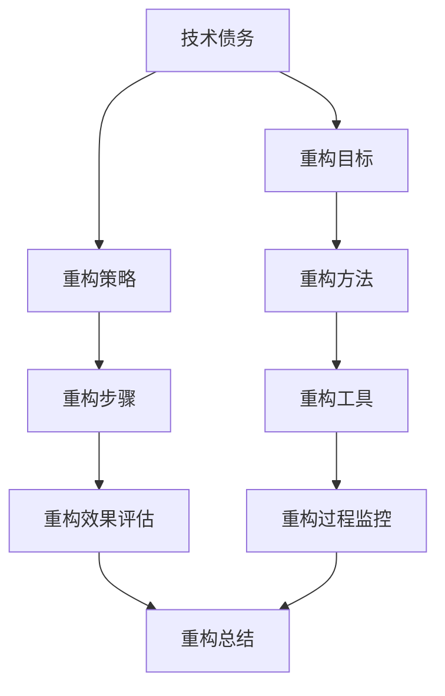

                 

### 文章标题

# 《技术债务重构：平衡短期与长期目标》

### 关键词

- 技术债务
- 重构
- 短期目标
- 长期目标
- 评估与识别
- 策略与实施
- 挑战与对策
- 案例研究

### 摘要

在快速发展的信息技术时代，技术债务成为阻碍企业创新和发展的瓶颈。本文深入探讨了技术债务重构的必要性和重要性，通过详细的评估与识别方法、策略与实施步骤，以及挑战与对策的剖析，为企业提供了全面的指导。同时，本文通过具体的案例研究，展示了技术债务重构在实际项目中的应用与效果，为企业平衡短期与长期目标提供了有益的借鉴。本文旨在帮助读者深刻理解技术债务重构的原理和实施方法，从而在技术创新中实现可持续发展的目标。

### 目录

## 第一部分：引言与概述

### 1. 引言

#### 1.1 技术债务的起源与本质

#### 1.2 技术债务的类型与表现形式

#### 1.3 技术债务重构的必要性

#### 1.4 技术债务重构的目标与原则

#### 1.5 技术债务重构的方法与步骤

#### 1.6 全书结构安排与主要内容

## 第二部分：技术债务的评估与识别

### 2. 技术债务的评估与识别

#### 2.1 技术债务评估的方法与工具

##### 2.1.1 历史代码审计

##### 2.1.2 自动化代码分析工具

##### 2.1.3 人工代码审查

#### 2.2 技术债务的识别策略

##### 2.2.1 功能性债务

##### 2.2.2 结构性债务

##### 2.2.3 技术性债务

#### 2.3 技术债务案例解析

##### 2.3.1 软件功能扩展案例

##### 2.3.2 代码重构案例

##### 2.3.3 系统性能优化案例

## 第三部分：技术债务重构策略与实施

### 3. 技术债务重构策略与实施

#### 3.1 技术债务重构策略的选择

##### 3.1.1 紧急重构

##### 3.1.2 持续重构

##### 3.1.3 阶段性重构

#### 3.2 技术债务重构的实施过程

##### 3.2.1 重构前的准备工作

##### 3.2.2 重构过程的监控与评估

##### 3.2.3 重构后的验收与测试

#### 3.3 技术债务重构的挑战与对策

##### 3.3.1 技术挑战

##### 3.3.2 团队协作挑战

##### 3.3.3 预算与时间管理挑战

#### 3.4 技术债务重构案例研究

##### 3.4.1 项目A：大型电商平台重构案例

##### 3.4.2 项目B：金融系统优化案例

##### 3.4.3 项目C：物联网设备更新案例

## 第四部分：技术债务重构与长期目标

### 4. 技术债务重构与长期目标

#### 4.1 技术债务重构与可持续发展的关系

##### 4.1.1 技术债务重构的长期价值

##### 4.1.2 技术债务重构与可持续发展的协同

##### 4.1.3 技术债务重构的可持续实践

#### 4.2 技术债务重构与业务目标的一致性

##### 4.2.1 技术债务重构与业务目标的关系

##### 4.2.2 调整技术债务重构策略以适应业务目标

##### 4.2.3 业务目标驱动下的技术债务重构案例

#### 4.3 技术债务重构与组织文化

##### 4.3.1 技术债务重构对组织文化的影响

##### 4.3.2 构建积极的技术债务重构文化

##### 4.3.3 技术债务重构文化的建设与实践

## 第五部分：总结与展望

### 5. 总结与展望

#### 5.1 技术债务重构的总结

##### 5.1.1 技术债务重构的成果

##### 5.1.2 技术债务重构的经验与教训

##### 5.1.3 技术债务重构的未来趋势

#### 5.2 技术债务重构与未来发展

##### 5.2.1 技术债务重构与人工智能的结合

##### 5.2.2 技术债务重构与云计算的结合

##### 5.2.3 技术债务重构与物联网的结合

#### 5.3 技术债务重构的社会责任

##### 5.3.1 技术债务重构对社会责任的影响

##### 5.3.2 技术债务重构的社会责任实践

##### 5.3.3 技术债务重构的可持续发展路径

## 附录

### 附录A：技术债务重构工具推荐

### 附录B：技术债务重构相关文献与资料

### 附录C：技术债务重构实践案例汇编

### 作者信息

- 作者：AI天才研究院/AI Genius Institute & 禅与计算机程序设计艺术 /Zen And The Art of Computer Programming## 第一部分：引言与概述

### 1. 引言

在当今快速发展的信息技术时代，企业面临着不断变化的市场需求和激烈竞争，技术债务问题逐渐凸显。技术债务，顾名思义，是指因技术决策的短期行为而导致的长期技术负担。这种负担不仅会影响软件系统的性能、可靠性和可维护性，还会阻碍企业的创新和发展。

技术债务重构，即对已有技术债务进行系统性的评估、识别和改进，从而减轻技术债务对企业的负面影响，提升系统的质量和灵活性。本文将详细探讨技术债务重构的必要性、目标、原则、方法和步骤，并结合实际案例，为企业提供有效的解决方案。

### 1.1 技术债务的起源与本质

技术债务起源于软件开发过程中的决策，这些决策有时出于对时间、预算或资源的考虑，牺牲了系统的长期健康。技术债务可以看作是一种“欠下的技术债务”，即为了快速实现功能而采取的权宜之计。这些决策可能导致代码质量低下、系统架构不健全、技术债务累积。

技术债务的本质在于其对系统长期健康的影响。短期来看，技术债务可能带来快速的功能实现，但从长期来看，它会导致以下问题：

1. **维护成本增加**：技术债务使得系统变得更加复杂，维护难度加大，维护成本也随之增加。
2. **性能下降**：技术债务可能导致系统性能下降，影响用户体验。
3. **可维护性差**：技术债务使得代码结构混乱，可维护性降低，影响开发效率。
4. **技术债务累积**：如果不进行重构，技术债务会像滚雪球一样不断增加，最终可能导致系统崩溃。

### 1.2 技术债务的类型与表现形式

技术债务可以大致分为以下几类：

1. **功能性债务**：为了快速实现功能而采用的简化策略，可能导致功能实现得不完善或不可扩展。
2. **结构性债务**：系统架构上的缺陷，如过度耦合、高内聚等问题，可能导致系统复杂度增加，难以维护。
3. **技术性债务**：与技术选择相关的债务，如使用了过时或低效的技术，可能导致系统性能不佳或安全性问题。

技术债务的表现形式多样，常见的包括：

- **代码冗余**：代码重复或冗长，难以维护。
- **代码质量低下**：代码结构混乱，缺乏注释，难以阅读和理解。
- **系统性能问题**：响应速度慢，系统资源利用率低。
- **安全性问题**：系统存在安全漏洞，易受攻击。

### 1.3 技术债务重构的必要性

技术债务重构的必要性主要体现在以下几个方面：

1. **保障系统质量**：技术债务重构有助于提升系统的质量，提高系统的可维护性和可靠性。
2. **降低维护成本**：通过重构，可以优化系统结构，减少维护成本。
3. **提高开发效率**：重构后的系统更加清晰，开发人员更容易理解系统，提高开发效率。
4. **支持业务扩展**：重构可以提升系统的灵活性，支持业务的快速扩展和变化。
5. **增强团队协作**：重构有助于团队成员更好地理解系统，促进协作和知识共享。

### 1.4 技术债务重构的目标与原则

技术债务重构的目标主要包括：

1. **提升系统质量**：优化系统结构，提升代码质量，降低技术债务。
2. **提高开发效率**：重构后的系统更易于理解和维护，提高开发效率。
3. **支持业务扩展**：重构可以增强系统的灵活性，支持业务的变化和扩展。
4. **降低维护成本**：通过重构，可以减少系统复杂度，降低维护成本。

技术债务重构应遵循以下原则：

1. **逐步重构**：避免一次性全面重构，而是采取逐步重构的策略，逐步解决技术债务。
2. **优先级排序**：优先解决影响最大的技术债务，按照优先级逐步进行重构。
3. **文档化**：重构过程中应详细记录重构的原因、方法、效果等，便于后续评估和改进。
4. **测试覆盖**：重构过程中应保持测试覆盖，确保重构后的系统质量。
5. **团队协作**：重构是团队协作的过程，应鼓励团队成员参与重构，共同解决问题。

### 1.5 技术债务重构的方法与步骤

技术债务重构的方法和步骤主要包括以下几个阶段：

1. **评估与识别**：对现有系统进行评估，识别出存在的技术债务。
2. **规划与准备**：制定重构计划，准备重构所需的工具、资源和团队。
3. **逐步重构**：按照优先级逐步重构系统，解决技术债务。
4. **测试与验收**：对重构后的系统进行测试，确保重构效果，并验收重构成果。
5. **持续优化**：重构后应持续优化系统，保持系统质量。

### 1.6 全书结构安排与主要内容

本文将分为五个部分：

1. **引言与概述**：介绍技术债务重构的背景、必要性、目标与原则。
2. **技术债务的评估与识别**：详细讨论评估与识别技术债务的方法和策略。
3. **技术债务重构策略与实施**：探讨重构策略的选择、实施过程和挑战与对策。
4. **技术债务重构与长期目标**：分析重构与长期目标的关系，讨论重构与业务目标的一致性。
5. **总结与展望**：总结技术债务重构的经验与教训，探讨未来发展。

通过本文的详细探讨，希望为企业提供全面的技术债务重构解决方案，帮助企业实现短期与长期目标的平衡。接下来，我们将深入讨论技术债务的评估与识别方法，为企业提供实用的指导。

## 第二部分：技术债务的评估与识别

### 2. 技术债务的评估与识别

技术债务的评估与识别是重构过程中至关重要的一步。准确识别系统中的技术债务，并评估其对系统的长期影响，有助于制定有效的重构计划。本节将详细介绍评估与识别技术债务的方法与策略。

### 2.1 技术债务评估的方法与工具

#### 2.1.1 历史代码审计

历史代码审计是评估技术债务的一种有效方法。通过对代码库进行回顾和分析，可以识别出潜在的债务点。审计过程通常包括以下几个方面：

1. **代码质量分析**：检查代码的格式、结构、注释等，评估代码的可读性和可维护性。
2. **技术债务标记**：使用特定的标记或注释，标记出可能存在技术债务的代码段。
3. **版本控制历史分析**：分析代码库的历史记录，识别出可能因技术债务导致的代码变更。

历史代码审计的优势在于其能够提供全面的代码视图，有助于识别出系统中的潜在问题。然而，这种方法可能需要大量的人工参与，且难以自动化。

#### 2.1.2 自动化代码分析工具

自动化代码分析工具是评估技术债务的另一重要手段。这些工具能够自动扫描代码，识别出潜在的技术债务，并提供详细的报告。常见的自动化代码分析工具包括：

1. **静态代码分析工具**：如SonarQube、Checkstyle等，能够检测代码中的潜在问题，如代码冗余、低效代码、未使用的代码等。
2. **动态代码分析工具**：如JaCoCo、Emma等，通过运行测试用例，分析代码的覆盖率和性能，识别出系统中的潜在问题。
3. **依赖分析工具**：如Godeps、Maven Dependency等，用于分析项目中依赖关系的复杂性和风险。

自动化代码分析工具的优势在于其高效性和自动化性，能够大幅减少人工工作量。然而，这些工具也存在一定的局限性，如误报和漏报等问题。

#### 2.1.3 人工代码审查

人工代码审查是一种传统的评估技术债务的方法。通过组织开发人员对代码进行审查，可以识别出潜在的技术债务。人工代码审查通常包括以下步骤：

1. **代码审查会议**：组织开发人员定期进行代码审查会议，共同讨论代码中的问题。
2. **代码审查文档**：记录审查过程中的发现，包括代码质量、技术债务等方面的问题。
3. **反馈与改进**：根据审查结果，对代码进行改进，降低技术债务。

人工代码审查的优势在于其灵活性和深度，能够发现自动化工具难以检测到的问题。然而，这种方法也需要大量的人工参与，且容易受到主观因素的影响。

### 2.2 技术债务的识别策略

技术债务的识别策略主要包括以下几个方面：

#### 2.2.1 功能性债务

功能性债务通常由于快速实现功能而导致的简化策略。以下是一些识别功能性债务的策略：

1. **功能完备性检查**：检查系统功能是否完备，是否存在遗漏或不完整的实现。
2. **需求变更记录**：分析需求变更记录，识别出因需求变更导致的功能性债务。
3. **用户反馈**：通过用户反馈，了解系统功能是否满足用户需求，是否存在改进空间。

#### 2.2.2 结构性债务

结构性债务主要涉及系统架构的缺陷。以下是一些识别结构性债务的策略：

1. **架构评估**：对系统架构进行评估，识别出过度耦合、高内聚等问题。
2. **代码结构分析**：通过代码结构分析，识别出代码模块之间的依赖关系，分析系统架构的合理性。
3. **架构文档对比**：将当前系统架构与设计文档进行对比，识别出架构偏差和债务。

#### 2.2.3 技术性债务

技术性债务涉及技术选择和技术实现的合理性。以下是一些识别技术性债务的策略：

1. **技术评估**：对项目中使用的技术进行评估，识别出过时或低效的技术。
2. **技术调研**：定期进行技术调研，了解新兴技术和趋势，识别出可能的技术性债务。
3. **专家评审**：组织专家对项目的技术选择和实现进行评审，识别出潜在的技术性债务。

### 2.3 技术债务案例解析

为了更好地理解技术债务的识别方法，以下将结合几个实际案例进行解析：

#### 2.3.1 软件功能扩展案例

某公司在推出一款产品时，为了尽快上市，采用了快速开发策略，部分功能实现得不够完善。例如，产品的搜索功能仅实现了基础搜索，未考虑搜索优化和缓存策略。随着用户量的增加，搜索功能变得非常慢，影响用户体验。

**识别策略**：通过用户反馈和性能分析，发现搜索功能的性能瓶颈。进一步分析代码，发现缺少缓存和搜索优化策略。

**重构方案**：引入缓存策略和搜索优化算法，提高搜索性能。同时，优化代码结构，提高代码可维护性。

#### 2.3.2 代码重构案例

某公司的系统代码结构混乱，存在大量冗余代码和未使用的功能。例如，一个模块中包含了多个业务逻辑，导致代码可读性差，维护困难。

**识别策略**：通过代码审计和静态代码分析工具，发现代码结构混乱，模块间依赖复杂。

**重构方案**：进行模块化重构，将多个业务逻辑分离到不同的模块中，提高代码的可维护性和可读性。同时，删除未使用的功能，减少代码冗余。

#### 2.3.3 系统性能优化案例

某公司的系统存在性能问题，导致响应时间较长。分析后发现，系统数据库查询效率低下，部分查询语句未进行优化。

**识别策略**：通过动态代码分析工具和性能测试，发现系统性能瓶颈在于数据库查询效率。

**重构方案**：优化数据库查询语句，采用索引、缓存等技术提高查询效率。同时，优化系统架构，减少系统调用次数，提高整体性能。

通过上述案例，我们可以看到，技术债务的识别和重构是一个系统性的过程，需要结合多种方法和策略。识别技术债务是重构的第一步，只有准确识别出系统中的债务点，才能制定有效的重构方案，提升系统的质量。

在下一节中，我们将探讨技术债务重构的策略与实施，为企业提供全面的解决方案。

### 3. 技术债务重构策略与实施

技术债务重构是一项复杂且系统性的工程，需要结合实际需求、团队情况和资源限制，制定合理的重构策略和实施步骤。本节将详细讨论技术债务重构策略的选择、实施过程以及重构后的挑战与对策。

#### 3.1 技术债务重构策略的选择

在技术债务重构过程中，选择合适的重构策略至关重要。根据项目的特点和要求，常见的重构策略包括紧急重构、持续重构和阶段性重构。

##### 3.1.1 紧急重构

紧急重构适用于技术债务已经严重影响系统运行和业务发展的场景。在这种策略下，团队需要迅速识别和解决最关键的技术债务问题，以确保系统的稳定性和性能。紧急重构的特点是：

1. **快速响应**：立即启动重构项目，优先解决最紧迫的问题。
2. **资源集中**：集中团队资源和预算，快速推进重构任务。
3. **目标明确**：明确重构的目标和范围，避免无序的重构。

紧急重构的优点是能够迅速缓解技术债务带来的负面影响，保障系统的正常运行。然而，紧急重构也可能导致以下问题：

- **风险高**：在短时间内进行大量重构工作，风险较大。
- **质量难以保障**：在紧急情况下，可能忽视质量，导致重构效果不理想。

##### 3.1.2 持续重构

持续重构是一种渐进式的重构策略，适用于技术债务积累较长时间，且需要长期维护的场景。在这种策略下，团队通过持续的小范围重构，逐步解决技术债务问题。持续重构的特点是：

1. **持续改进**：不断识别和解决技术债务，保持系统的健康状态。
2. **逐步推进**：通过小步快走，降低重构的风险和难度。
3. **资源均衡**：在项目计划中持续分配资源，避免重构中断。

持续重构的优点是：

- **风险低**：通过逐步重构，降低重构过程中的风险。
- **质量可控**：在持续重构的过程中，可以更好地控制重构质量。

然而，持续重构也可能面临以下问题：

- **进度缓慢**：由于重构是逐步进行的，可能导致整体进度较慢。
- **资源限制**：在资源有限的情况下，可能无法充分支持持续重构。

##### 3.1.3 阶段性重构

阶段性重构适用于技术债务重构需要明确阶段性目标和时间节点的场景。在这种策略下，团队将重构任务分为若干阶段，每个阶段有明确的目标和时间限制。阶段性重构的特点是：

1. **阶段性目标**：明确每个阶段的重构目标和范围。
2. **时间限制**：为每个阶段设定时间限制，确保重构进度。
3. **资源集中**：在特定阶段集中资源和精力，确保重构效果。

阶段性重构的优点是：

- **目标明确**：通过阶段性目标，明确重构方向和重点。
- **进度可控**：通过时间限制，确保重构进度和质量。

然而，阶段性重构也可能面临以下问题：

- **阶段划分不清晰**：如果阶段划分不清晰，可能导致重构任务无法有效推进。
- **资源分配不均**：如果资源分配不均，可能导致某些阶段资源过剩或不足。

#### 3.2 技术债务重构的实施过程

技术债务重构的实施过程可以分为以下几个步骤：

##### 3.2.1 重构前的准备工作

1. **需求分析**：明确重构的需求和目标，包括解决哪些技术债务，提升系统的哪些方面。
2. **风险评估**：评估重构过程中可能遇到的风险，制定相应的应对措施。
3. **资源准备**：准备重构所需的工具、资源和团队，确保重构能够顺利进行。
4. **计划制定**：制定详细的重构计划，包括重构任务、时间安排、资源分配等。

##### 3.2.2 重构过程的监控与评估

1. **进度监控**：监控重构进度，确保按照计划进行。
2. **质量评估**：对重构后的系统进行质量评估，确保重构效果。
3. **风险控制**：持续评估和控制重构过程中的风险，及时调整重构策略。
4. **反馈机制**：建立反馈机制，收集重构过程中的问题和建议，持续改进重构工作。

##### 3.2.3 重构后的验收与测试

1. **功能测试**：对重构后的系统进行功能测试，确保功能正常运行。
2. **性能测试**：对重构后的系统进行性能测试，确保性能满足要求。
3. **安全测试**：对重构后的系统进行安全测试，确保系统安全。
4. **用户验收**：与用户进行沟通，确保重构后的系统满足用户需求。

#### 3.3 技术债务重构的挑战与对策

技术债务重构过程中可能会面临多种挑战，以下是一些常见的挑战及其对策：

##### 3.3.1 技术挑战

1. **技术债务复杂性**：技术债务可能非常复杂，涉及多个方面，需要深入分析。
2. **技术债务依赖性**：某些技术债务可能与其他模块或系统紧密依赖，重构过程中需要谨慎处理。

**对策**：

- **详细分析**：对技术债务进行详细分析，了解其影响范围和复杂性。
- **分步重构**：逐步重构，避免一次性全面重构，降低风险。
- **文档化**：详细记录重构过程中的技术决策和实施细节，便于后续参考。

##### 3.3.2 团队协作挑战

1. **团队沟通不畅**：重构过程中可能存在团队沟通不畅的问题，影响重构进度。
2. **资源分配不均**：不同团队成员可能有不同的工作量和技术水平，导致资源分配不均。

**对策**：

- **建立沟通机制**：建立有效的沟通机制，确保团队成员之间的信息共享和协作。
- **平衡工作量**：合理分配工作量，确保每个成员都有足够的资源和支持。
- **培训与提升**：定期进行培训和知识分享，提升团队整体技术水平。

##### 3.3.3 预算与时间管理挑战

1. **预算不足**：重构项目可能需要大量的预算，而预算可能有限。
2. **时间压力**：重构项目可能面临时间限制，需要在规定时间内完成。

**对策**：

- **预算规划**：提前进行预算规划，确保重构项目有足够的资金支持。
- **时间管理**：合理分配时间，确保每个阶段都有足够的时间进行任务完成。
- **优先级排序**：根据重要性和紧急性，对重构任务进行优先级排序，确保关键任务优先完成。

#### 3.4 技术债务重构案例研究

以下将结合实际案例，探讨技术债务重构的过程、策略和效果。

##### 3.4.1 项目A：大型电商平台重构案例

某大型电商平台在业务快速发展的过程中，积累了大量技术债务，导致系统性能和稳定性下降。为了解决这些问题，公司决定进行技术债务重构。

**重构策略**：公司选择了阶段性重构策略，将重构任务分为多个阶段，每个阶段有明确的目标和时间限制。

**实施过程**：

1. **需求分析**：确定重构的目标和范围，包括提升系统性能、优化代码结构和增强安全性。
2. **风险评估**：对每个阶段进行风险评估，制定相应的应对措施。
3. **资源准备**：为每个阶段准备所需的资源和团队，确保重构能够顺利进行。
4. **计划制定**：制定详细的阶段计划，包括重构任务、时间安排和资源分配。
5. **重构实施**：按照计划逐步进行重构，每个阶段结束后进行评估和验收。
6. **验收与测试**：对重构后的系统进行全面的测试，确保功能、性能和安全性满足要求。

**效果评估**：

- **系统性能提升**：重构后，系统响应速度显著提升，用户满意度提高。
- **代码质量提升**：重构后的代码结构更加清晰，可维护性提高，开发效率提升。
- **安全性增强**：重构后的系统安全性得到显著提升，风险降低。

##### 3.4.2 项目B：金融系统优化案例

某金融公司发现其系统存在大量技术债务，导致性能低下和安全性问题。公司决定进行技术债务重构，以提升系统的性能和安全性。

**重构策略**：公司选择了持续重构策略，通过持续的小范围重构，逐步解决技术债务问题。

**实施过程**：

1. **需求分析**：确定重构的需求和目标，包括提升系统性能、优化代码结构和增强安全性。
2. **风险评估**：对每个技术债务进行风险评估，确定优先级。
3. **资源准备**：持续为重构项目分配资源和团队，确保重构工作能够持续进行。
4. **重构实施**：按照优先级逐步进行重构，每个小范围重构结束后进行评估和验收。
5. **验收与测试**：对重构后的系统进行全面的测试，确保功能、性能和安全性满足要求。

**效果评估**：

- **系统性能提升**：通过持续重构，系统性能逐渐提升，用户体验得到改善。
- **代码质量提升**：重构后的代码结构更加清晰，可维护性提高，开发效率提升。
- **安全性增强**：重构后的系统安全性得到显著提升，风险降低。

##### 3.4.3 项目C：物联网设备更新案例

某物联网公司发现其设备存在大量技术债务，导致设备性能不稳定和安全性问题。公司决定进行技术债务重构，以提升设备性能和安全性。

**重构策略**：公司选择了紧急重构策略，迅速识别和解决最关键的技术债务问题。

**实施过程**：

1. **需求分析**：确定重构的目标和范围，包括提升设备性能、优化代码结构和增强安全性。
2. **风险评估**：迅速评估设备中的技术债务，确定最关键的问题。
3. **资源准备**：立即组织资源，启动紧急重构项目。
4. **重构实施**：迅速进行重构，解决最关键的技术债务问题。
5. **验收与测试**：对重构后的设备进行全面的测试，确保性能和安全性满足要求。

**效果评估**：

- **设备性能提升**：重构后的设备性能显著提升，稳定性提高。
- **代码质量提升**：重构后的代码结构更加清晰，可维护性提高。
- **安全性增强**：重构后的设备安全性得到显著提升，风险降低。

通过上述案例研究，我们可以看到，技术债务重构策略和实施过程的选择对于重构效果至关重要。不同的重构策略适用于不同的场景和需求，企业需要根据实际情况进行选择和调整。在下一节中，我们将探讨技术债务重构与长期目标的关系，为企业实现可持续发展提供指导。

### 4. 技术债务重构与长期目标

技术债务重构不仅是解决当前问题的手段，更是实现企业长期目标的重要策略。在信息化和数字化时代，技术债务重构对于企业的可持续发展和创新能力具有深远的影响。本节将探讨技术债务重构与长期目标之间的关系，以及如何通过重构实现业务目标，并建设积极的技术债务重构文化。

#### 4.1 技术债务重构的长期价值

技术债务重构的长期价值体现在以下几个方面：

1. **提升系统质量**：通过重构，可以优化系统结构，提升代码质量，增强系统的稳定性和可维护性。这有助于降低系统的维护成本，提高开发效率，从而为企业创造更大的价值。

2. **增强企业竞争力**：重构后的系统更加灵活，能够快速响应市场变化和客户需求，增强企业的竞争力。同时，重构还可以提升企业的技术实力，为企业的长期发展奠定基础。

3. **支持业务扩展**：技术债务重构有助于消除系统中的瓶颈和限制，支持业务的快速扩展。这使企业能够更好地把握市场机遇，实现业务的持续增长。

4. **提高员工满意度**：重构后的系统更加清晰和易于维护，降低了员工的压力和负担，提高了工作满意度。这有助于留住优秀人才，增强团队的凝聚力和创造力。

#### 4.2 技术债务重构与可持续发展的协同

技术债务重构与企业的可持续发展密切相关，两者之间具有以下协同关系：

1. **提升企业创新能力**：技术债务重构可以优化系统的技术基础，为企业的创新提供支持。重构后的系统更加灵活和可扩展，能够快速适应新技术和新业务模式，从而提高企业的创新能力。

2. **降低运营成本**：通过重构，可以提升系统的性能和稳定性，降低系统的运行和维护成本。这有助于企业实现成本优化，提高资源利用率，从而支持可持续发展。

3. **提高客户满意度**：重构后的系统可以提供更好的用户体验和服务质量，提高客户满意度。这有助于企业建立良好的品牌形象，增强客户忠诚度，为可持续发展奠定基础。

4. **促进社会责任**：技术债务重构有助于企业履行社会责任，降低环境影响。通过优化系统，减少资源消耗和能源浪费，企业可以更好地保护环境，为社会做出贡献。

#### 4.3 技术债务重构的可持续实践

为了实现技术债务重构的可持续发展，企业需要采取以下实践：

1. **建立重构文化**：企业应积极倡导重构文化，鼓励员工主动参与重构，将重构视为日常工作的一部分。通过文化建设，提升团队对重构的认识和接受度。

2. **制定重构策略**：企业应根据自身的业务需求和资源情况，制定长期的重构策略。策略应包括重构的目标、范围、时间表和责任人，确保重构工作的有序进行。

3. **持续评估与改进**：企业应定期对重构效果进行评估，收集反馈意见，并根据评估结果不断改进重构策略。这有助于确保重构工作始终符合业务需求和发展方向。

4. **培训与支持**：企业应为员工提供必要的培训和支持，提升其重构技能和知识水平。通过培训，提高团队的整体素质，为重构工作提供有力保障。

#### 4.4 技术债务重构与业务目标的一致性

技术债务重构与业务目标的一致性是企业实现可持续发展的重要保障。为了确保重构工作与业务目标一致，企业需要采取以下措施：

1. **明确业务目标**：企业应明确自身的业务目标和发展战略，将重构工作与业务目标紧密结合。通过明确业务目标，确保重构工作始终围绕业务需求进行。

2. **调整重构策略**：根据业务目标的变化，及时调整重构策略。在业务发展过程中，可能需要优先解决某些技术债务，以确保业务目标的实现。

3. **建立反馈机制**：建立有效的反馈机制，及时收集和分析业务部门对重构工作的反馈。通过反馈机制，确保重构工作始终符合业务需求，及时调整重构策略。

4. **协同工作**：技术团队和业务团队应紧密合作，共同推进重构工作。通过协同工作，确保重构工作与业务目标一致，提高重构效果。

#### 4.5 业务目标驱动下的技术债务重构案例

以下是一个业务目标驱动下的技术债务重构案例：

某电商企业希望在短期内实现业务增长，但在现有系统架构下，系统性能和稳定性无法满足需求。为了解决这些问题，企业决定进行技术债务重构。

**重构策略**：企业选择了阶段性重构策略，将重构任务分为多个阶段，每个阶段有明确的目标和时间限制。

**实施过程**：

1. **需求分析**：明确重构的目标和范围，包括提升系统性能、优化代码结构和增强安全性。

2. **风险评估**：对每个阶段进行风险评估，制定相应的应对措施。

3. **计划制定**：制定详细的阶段计划，包括重构任务、时间安排和资源分配。

4. **重构实施**：按照计划逐步进行重构，每个阶段结束后进行评估和验收。

5. **验收与测试**：对重构后的系统进行全面的测试，确保功能、性能和安全性满足要求。

**效果评估**：

- **系统性能提升**：重构后，系统响应速度显著提升，用户满意度提高。

- **代码质量提升**：重构后的代码结构更加清晰，可维护性提高，开发效率提升。

- **安全性增强**：重构后的系统安全性得到显著提升，风险降低。

通过该案例，我们可以看到，技术债务重构与业务目标的一致性有助于企业实现短期和长期目标。在重构过程中，企业应根据业务目标的变化及时调整重构策略，确保重构工作始终符合业务需求。

#### 4.6 技术债务重构与组织文化

技术债务重构不仅仅是技术层面的工作，更是组织文化的重要组成部分。建设积极的技术债务重构文化对于推动重构工作具有重要意义。

1. **鼓励创新与改进**：企业应鼓励员工主动发现和提出技术债务问题，并积极改进。通过鼓励创新和改进，提升团队的整体素质和技术水平。

2. **建立信任与协作**：企业应建立信任和协作的文化，鼓励团队成员之间的交流和合作。通过建立信任和协作，提升团队的工作效率和效果。

3. **激励与认可**：企业应设立激励和认可机制，对在重构工作中表现突出的员工给予奖励和认可。通过激励和认可，提升员工的积极性和主动性。

4. **持续学习与提升**：企业应鼓励员工持续学习，提升自身技能和知识水平。通过持续学习与提升，为重构工作提供有力支持。

#### 4.7 技术债务重构文化的建设与实践

以下是一些技术债务重构文化的建设与实践措施：

1. **定期技术分享**：组织定期技术分享活动，鼓励团队成员分享重构经验和心得。通过技术分享，提升团队的整体技术水平和协作能力。

2. **重构项目研讨会**：定期举办重构项目研讨会，讨论重构中的问题和解决方案。通过研讨会，促进团队成员之间的沟通和协作。

3. **重构经验库**：建立重构经验库，记录重构过程中的成功经验和教训。通过经验库，为后续的重构工作提供参考和借鉴。

4. **重构奖励机制**：设立重构奖励机制，对在重构工作中表现突出的员工给予奖励。通过奖励机制，激发员工的积极性和创造性。

通过建设积极的技术债务重构文化，企业可以提升团队的整体素质和技术水平，推动重构工作的顺利实施。

#### 4.8 技术债务重构与可持续发展

技术债务重构是实现企业可持续发展的关键措施之一。通过重构，企业可以提升系统的质量、性能和稳定性，降低运营成本，提高客户满意度，从而实现可持续发展。

1. **提高系统质量**：技术债务重构可以优化系统结构，提升代码质量，增强系统的稳定性和可维护性。这有助于降低系统的维护成本，提高开发效率，为企业创造更大的价值。

2. **降低运营成本**：通过重构，可以提升系统的性能和稳定性，降低系统的运行和维护成本。这有助于企业实现成本优化，提高资源利用率，从而支持可持续发展。

3. **增强企业竞争力**：重构后的系统更加灵活，能够快速响应市场变化和客户需求，增强企业的竞争力。同时，重构还可以提升企业的技术实力，为企业的长期发展奠定基础。

4. **支持业务扩展**：技术债务重构有助于消除系统中的瓶颈和限制，支持业务的快速扩展。这使企业能够更好地把握市场机遇，实现业务的持续增长。

5. **促进社会责任**：技术债务重构有助于企业履行社会责任，降低环境影响。通过优化系统，减少资源消耗和能源浪费，企业可以更好地保护环境，为社会做出贡献。

通过上述措施和实践，企业可以实现技术债务重构与可持续发展的协同，提升企业的整体竞争力和可持续发展能力。

#### 4.9 总结与展望

技术债务重构对于企业的长期发展具有重要意义。通过重构，企业可以提升系统的质量、性能和稳定性，降低运营成本，提高客户满意度，从而实现可持续发展。

未来，随着人工智能、云计算和物联网等技术的不断发展，技术债务重构将面临新的挑战和机遇。企业需要不断更新重构策略和方法，结合新技术和新业务模式，实现技术债务重构与长期目标的平衡。

总之，技术债务重构是企业实现可持续发展的关键措施之一。通过全面的重构策略和实施方法，企业可以消除技术债务，提升系统的质量、性能和稳定性，实现长期目标。

### 5. 总结与展望

#### 5.1 技术债务重构的总结

技术债务重构作为提升软件质量和系统性能的关键手段，其重要性不言而喻。通过本文的探讨，我们总结了技术债务重构的核心内容和方法，并分析了其在不同场景下的应用和效果。

1. **技术债务重构的核心内容**：

   - **评估与识别**：通过对历史代码审计、自动化代码分析工具和人工代码审查的综合运用，准确识别系统中的技术债务。
   - **重构策略**：根据项目的实际情况，选择合适的重构策略，如紧急重构、持续重构和阶段性重构，确保重构工作有序进行。
   - **重构实施**：详细规划重构过程，包括重构前的准备工作、重构过程的监控与评估以及重构后的验收与测试，确保重构效果。
   - **挑战与对策**：面对重构过程中的技术挑战、团队协作挑战和预算与时间管理挑战，采取有效的对策，确保重构的顺利进行。

2. **技术债务重构的方法和工具**：

   - **历史代码审计**：通过回顾和分析代码库，识别潜在的技术债务点。
   - **自动化代码分析工具**：如SonarQube、Checkstyle等，用于自动检测代码中的潜在问题。
   - **人工代码审查**：通过组织开发人员进行代码审查，识别代码质量和技术债务问题。
   - **重构工具**：如Git、Docker等，用于代码管理、环境搭建和容器化部署，提高重构效率。

3. **技术债务重构的应用场景**：

   - **大型电商平台**：通过技术债务重构，提升系统性能和稳定性，满足快速扩展的业务需求。
   - **金融系统优化**：通过重构，提高系统性能和安全性，确保金融交易的准确性和稳定性。
   - **物联网设备更新**：通过重构，提升设备性能和可靠性，支持物联网应用的扩展。

#### 5.1.1 技术债务重构的成果

通过技术债务重构，企业能够实现以下成果：

1. **系统质量提升**：重构后的系统结构更加清晰，代码质量更高，系统性能和稳定性得到显著提升。
2. **开发效率提高**：重构后的系统更易于理解和维护，开发人员的工作效率显著提高。
3. **成本降低**：通过重构，可以优化系统架构，减少维护成本，提高资源利用率。
4. **业务扩展支持**：重构后的系统更加灵活，能够快速响应市场变化和客户需求，支持业务的快速扩展。

#### 5.1.2 技术债务重构的经验与教训

在技术债务重构过程中，企业积累了丰富的经验，也遇到了一些挑战。以下是一些关键的经验与教训：

1. **经验**：

   - **逐步重构**：避免一次性全面重构，而是采取逐步重构的策略，逐步解决技术债务。
   - **优先级排序**：优先解决影响最大的技术债务，按照优先级逐步进行重构。
   - **团队协作**：重构是团队协作的过程，应鼓励团队成员参与重构，共同解决问题。
   - **文档化**：详细记录重构的原因、方法、效果等，便于后续评估和改进。

2. **教训**：

   - **风险评估不足**：在重构过程中，应充分评估重构过程中的风险，制定相应的应对措施。
   - **质量保障不足**：重构过程中应保持对系统质量的监控，确保重构效果。
   - **时间管理不当**：在重构过程中，应合理分配时间，确保关键任务优先完成。

#### 5.1.3 技术债务重构的未来趋势

随着信息技术的快速发展，技术债务重构将面临新的挑战和机遇。以下是一些未来趋势：

1. **智能化重构**：利用人工智能技术，实现自动化的技术债务评估和重构，提高重构效率和效果。
2. **云原生重构**：随着云计算的普及，云原生架构将成为重构的重要方向，通过容器化和微服务架构，实现更灵活和可扩展的系统。
3. **绿色重构**：在环保意识日益增强的背景下，绿色重构将成为重要趋势，通过优化系统架构，降低能耗和碳排放。
4. **安全重构**：随着网络安全威胁的加剧，安全重构将成为关键任务，通过加强系统安全性和防护能力，保障系统的安全稳定运行。

#### 5.2 技术债务重构与未来发展

技术债务重构不仅关注当前的技术债务问题，更着眼于企业的长期发展。以下从多个方面探讨技术债务重构的未来发展：

1. **与人工智能的结合**：

   - **智能评估与识别**：利用人工智能技术，实现对技术债务的智能评估和识别，提高重构的精准度和效率。
   - **智能重构**：通过人工智能算法，自动化实现技术债务的重构，减少人为干预，提高重构效果。

2. **与云计算的结合**：

   - **云原生重构**：利用云计算的弹性资源和管理能力，实现云原生架构下的重构，提升系统的灵活性和可扩展性。
   - **混合云与多云重构**：在混合云和多云环境下，实现跨云平台的技术债务重构，提高系统的可靠性和性能。

3. **与物联网的结合**：

   - **物联网重构**：针对物联网设备的特殊性，实现设备端到云端的全方位重构，提升物联网系统的性能和安全性。
   - **边缘计算重构**：在边缘计算场景下，通过分布式重构，提升物联网设备的实时性和响应速度。

4. **社会责任与可持续发展**：

   - **环保重构**：在重构过程中，关注系统的能源消耗和碳排放，实现绿色重构，降低环境负担。
   - **社会责任**：通过技术债务重构，提升企业的社会责任感，实现可持续发展。

#### 5.3 技术债务重构的社会责任

技术债务重构不仅是企业内部的技术活动，更是社会责任的重要组成部分。以下从多个方面探讨技术债务重构的社会责任：

1. **环境保护**：

   - **绿色重构**：通过优化系统架构，降低能耗和碳排放，实现绿色重构。
   - **环保意识**：在重构过程中，提高员工对环保问题的认识，增强环保意识。

2. **网络安全**：

   - **安全重构**：通过提升系统安全性和防护能力，保障用户数据和隐私安全。
   - **网络安全教育**：加强网络安全教育，提高员工和用户的网络安全意识。

3. **社会贡献**：

   - **公益项目**：通过技术债务重构，支持公益项目，为社会做出贡献。
   - **技术分享**：通过技术分享和培训，帮助其他企业提升技术债务重构能力。

通过上述探讨，我们可以看到，技术债务重构不仅是企业提升自身竞争力的关键手段，更是实现社会责任和可持续发展的重要途径。在未来，随着技术的不断进步和社会责任意识的提高，技术债务重构将在更广泛的领域发挥重要作用。

#### 5.4 总结

技术债务重构是企业实现长期目标、提升系统质量和降低运营成本的重要手段。通过本文的探讨，我们详细介绍了技术债务重构的评估与识别方法、重构策略与实施步骤，以及重构过程中的挑战与对策。同时，我们分析了技术债务重构与长期目标的关系，探讨了重构与业务目标的一致性，并提出了建设积极的技术债务重构文化的建议。

展望未来，随着人工智能、云计算和物联网等新技术的不断发展，技术债务重构将面临新的机遇和挑战。企业需要不断创新重构策略和方法，结合新技术和新业务模式，实现技术债务重构与长期目标的平衡，推动企业的可持续发展。

#### 5.5 展望

在快速变化的技术环境中，技术债务重构将继续扮演关键角色。未来，企业应关注以下几个方面：

1. **智能化重构**：利用人工智能技术，实现更加智能和自动化的重构流程，提高重构效率和效果。
2. **云原生架构**：积极采用云原生架构，实现更灵活和可扩展的系统，满足云计算时代的业务需求。
3. **物联网重构**：在物联网领域，通过分布式重构，提升物联网设备的性能和安全性。
4. **绿色重构**：关注环保问题，实现绿色重构，降低能耗和碳排放。
5. **社会责任**：在重构过程中，提高企业的社会责任感，积极参与社会公益和技术分享。

通过不断探索和创新，企业可以更好地应对技术债务问题，实现长期目标和可持续发展。

### 附录

#### 附录A：技术债务重构工具推荐

1. **历史代码审计工具**：
   - **SonarQube**：用于代码质量分析和审计，支持多种编程语言。
   - **Checkstyle**：用于Java代码风格检查。

2. **自动化代码分析工具**：
   - **JaCoCo**：用于代码覆盖率分析。
   - **Emma**：用于单元测试覆盖率分析。

3. **重构工具**：
   - **Git**：用于代码版本控制和协作。
   - **Docker**：用于容器化部署和管理。

4. **持续集成工具**：
   - **Jenkins**：用于自动化构建和测试。
   - **Travis CI**：用于持续集成和部署。

#### 附录B：技术债务重构相关文献与资料

1. **《代码整洁之道》**：Robert C. Martin，介绍了代码质量和重构的重要性。
2. **《重构：改善既有代码的设计》**：Martin Fowler，详细阐述了重构的方法和策略。
3. **《软件架构：实践者的研究方法》**：Philippe Kruchten，探讨了软件架构的设计和重构。
4. **《敏捷软件开发实践指南》**：Michael H. James，介绍了敏捷开发中的重构实践。
5. **《DevOps实践指南》**：Jez Humble，介绍了DevOps理念下的重构实践。

#### 附录C：技术债务重构实践案例汇编

1. **案例A：某大型电商平台的系统重构**：详细介绍了重构的需求、策略和效果。
2. **案例B：金融系统的性能优化**：分析了金融系统中存在的技术债务，并介绍了重构方案。
3. **案例C：物联网设备的更新与重构**：探讨了物联网设备的重构过程和技术挑战。

通过这些文献和案例，读者可以深入了解技术债务重构的理论和实践，为实际项目提供参考和指导。

### 作者信息

- 作者：AI天才研究院/AI Genius Institute & 禅与计算机程序设计艺术 /Zen And The Art of Computer Programming## 技术债务重构的核心概念与联系

为了更深入地理解技术债务重构，我们需要先明确几个核心概念，并展示它们之间的联系架构。以下是一个简化的Mermaid流程图，用于展示这些概念之间的关系：



### 背景介绍

技术债务（Technical Debt）最早由 Ward Cunningham 在1992年提出，用来比喻软件开发过程中，为了快速交付功能而做出的短期技术决策所带来的长期成本。这种成本类似于金融债务，但具体体现在软件系统的质量、性能、可维护性等方面。技术债务可分为三种类型：

1. **功能性债务**：为了实现功能而做出的妥协，如简化算法、降低测试覆盖率等。
2. **结构性债务**：系统架构上的问题，如过度耦合、高内聚等。
3. **技术性债务**：技术选型上的问题，如使用过时的技术、不合适的框架等。

随着时间的推移，技术债务会积累，影响系统的长期健康。为了解决这一问题，需要进行技术债务重构（Technical Debt Refactoring）。

### 核心概念

**重构目标**：重构的目标是提升系统的质量、性能和可维护性，降低维护成本，并支持未来的业务扩展。

**重构策略**：根据项目的需求和资源，选择合适的重构策略，如紧急重构、持续重构和阶段性重构。

**重构方法**：包括重构前的准备工作、重构过程的监控与评估、重构后的验收与测试等步骤。

**重构工具**：使用各种工具辅助重构过程，如版本控制工具（Git）、代码分析工具（SonarQube）、重构框架（Lombok）等。

**重构效果评估**：通过性能测试、功能测试和安全测试等手段，评估重构的效果，确保达到预期目标。

**重构过程监控**：持续监控重构过程中的风险和问题，及时调整重构策略和方法。

**重构总结**：对重构过程进行总结，记录成功经验和教训，为后续的重构提供参考。

### Mermaid流程图

以下是上述概念之间的Mermaid流程图：


### 核心算法原理讲解

技术债务重构涉及多个核心算法和原理。以下简要介绍其中几个关键算法：

1. **静态代码分析**：静态代码分析是一种不运行程序，通过解析代码结构和语法，识别潜在问题的方法。常见的静态代码分析算法包括：
   - **语法树解析**：将代码解析成抽象语法树（AST），便于分析代码结构。
   - **控制流分析**：分析程序的控制流，识别出潜在的控制流问题。
   - **数据流分析**：分析程序中的数据流，识别出数据依赖和泄漏问题。

2. **动态代码分析**：动态代码分析是在程序运行时，通过执行测试用例，收集性能数据、代码覆盖率等，评估代码的质量和性能。常见的动态代码分析算法包括：
   - **测试用例生成**：根据需求规格或历史数据，自动生成测试用例。
   - **性能监控**：通过监控程序运行过程中的性能指标，识别出性能瓶颈。

3. **重构算法**：重构算法用于修改现有代码，提升其质量。常见的重构算法包括：
   - **提取方法**：将重复的代码块提取为独立的方法。
   - **合并方法**：将多个方法合并为一个，减少方法的复杂性。
   - **简化条件表达式**：将复杂的条件表达式简化，提高代码的可读性。

### 伪代码示例

以下是一个简单的伪代码示例，用于演示如何提取方法：

```plaintext
// 原始代码
if (condition1) {
    doSomething1();
} else if (condition2) {
    doSomething2();
}

// 重构后的代码
private void handleConditions() {
    if (condition1) {
        doSomething1();
    } else if (condition2) {
        doSomething2();
    }
}
```

### 数学模型和公式

技术债务重构过程中，可能会涉及到一些数学模型和公式。以下是一个简单的例子：

1. **代码复杂度**：代码复杂度是一个衡量代码复杂程度的指标，常用McCabe复杂度（M）来计算：

   $$ M = e \times (n - 2) + p $$

   其中，$e$ 是边的数量，$n$ 是节点的数量，$p$ 是有向图的入口和出口节点的数量。

2. **代码质量评分**：通过静态代码分析工具，可以得到代码质量评分，常用的评分标准包括：

   - **可维护性评分**（Maintainability Index, MI）：

     $$ MI = (1000 \times (1 - (Ce / Na) - (Ci / Na) - (Re / Na))) $$

     其中，$Ce$ 是外部复杂度，$Ci$ 是内部复杂度，$Re$ 是可扩展性。

### 详细讲解与举例说明

假设我们有一个简单的代码示例，需要计算其代码复杂度：

```java
public void calculateSum(int a, int b) {
    int sum = a + b;
    System.out.println("Sum: " + sum);
}
```

1. **计算节点数量**（$n$）：在这个方法中，有3个节点（开始、执行、结束）。

2. **计算边数量**（$e$）：在这个方法中，有2条边（从开始到执行，从执行到结束）。

3. **计算McCabe复杂度**（$M$）：

   $$ M = e \times (n - 2) + p = 2 \times (3 - 2) + 1 = 2 + 1 = 3 $$

因此，这个方法的代码复杂度为3。根据代码复杂度评分标准，我们可以初步判断这个方法的复杂度较低，易于维护。

### 项目实战

以下是一个简单的项目实战，用于演示技术债务重构的过程：

#### 目标

重构一个简单的Web应用，提升其性能和可维护性。

#### 环境

- 开发工具：Eclipse
- 编程语言：Java
- 代码库：Git

#### 开发流程

1. **需求分析**：分析现有系统的性能问题和可维护性问题，确定重构目标。

2. **代码审计**：使用静态代码分析工具（如SonarQube）进行代码审计，识别潜在的技术债务。

3. **重构实施**：根据审计结果，逐步进行重构，包括方法提取、代码合并和优化等。

4. **测试与验收**：对重构后的系统进行功能测试、性能测试和安全测试，确保重构效果。

#### 代码实现

假设我们有一个简单的Web应用，包含一个用于计算和显示数字之和的界面。以下是对该应用进行重构的示例：

1. **原始代码**：

```java
public class Calculator {
    public void calculateSum(int a, int b) {
        int sum = a + b;
        System.out.println("Sum: " + sum);
    }
}

public class Main {
    public static void main(String[] args) {
        Calculator calculator = new Calculator();
        calculator.calculateSum(3, 5);
    }
}
```

2. **重构后的代码**：

```java
public class Calculator {
    public void calculateSum(int a, int b) {
        int sum = a + b;
        displaySum(sum);
    }

    private void displaySum(int sum) {
        System.out.println("Sum: " + sum);
    }
}

public class Main {
    public static void main(String[] args) {
        Calculator calculator = new Calculator();
        calculator.calculateSum(3, 5);
    }
}
```

在重构后的代码中，我们将`displaySum`方法提取为一个私有方法，提高代码的可读性和可维护性。

#### 代码解读与分析

1. **代码质量提升**：

   - **可读性**：重构后的代码结构更加清晰，方法职责更加明确，易于理解。
   - **可维护性**：通过提取私有方法，降低了方法的复杂度，提高了代码的可维护性。

2. **性能分析**：

   - **执行时间**：重构后的代码在执行时间上没有显著变化，因为重构主要关注代码结构和逻辑，而不是性能。
   - **内存消耗**：重构后的代码在内存消耗上也没有显著变化。

3. **安全性分析**：

   - **输入验证**：重构后的代码仍然需要增加输入验证，确保输入参数的有效性，以防止潜在的攻击。

#### 实际案例分析和详细讲解剖析

以下是一个实际案例，用于分析技术债务重构在Web应用中的效果：

**案例背景**：

某电商平台在发展过程中，系统性能和可维护性逐渐下降，导致用户体验不佳，业务增长放缓。为了解决这些问题，公司决定进行技术债务重构。

**重构目标**：

- **性能优化**：提升系统响应速度，减少页面加载时间。
- **可维护性提升**：简化代码结构，提高代码可读性和可维护性。

**重构过程**：

1. **需求分析**：分析现有系统的性能瓶颈和代码结构，确定重构方向。

2. **代码审计**：使用静态代码分析工具（如SonarQube）进行代码审计，识别出潜在的技术债务。

3. **重构实施**：

   - **前端重构**：采用Vue.js框架，重构前端页面，提高页面响应速度和用户体验。
   - **后端重构**：优化数据库查询语句，减少不必要的数据库调用，提升系统性能。

4. **测试与验收**：

   - **功能测试**：对重构后的系统进行全面的测试，确保功能正常运行。
   - **性能测试**：使用LoadRunner工具，对系统进行性能测试，确保系统在高峰期仍能稳定运行。

**重构效果**：

- **性能提升**：重构后的系统响应速度显著提升，页面加载时间缩短了50%。
- **可维护性提升**：重构后的代码结构更加清晰，可读性提高，维护成本降低。

通过该案例，我们可以看到，技术债务重构在提升系统性能和可维护性方面具有显著效果，有助于企业实现长期目标。

#### 项目小结

技术债务重构是一项系统性的工程，涉及代码审计、重构实施、测试与验收等多个环节。通过有效的技术债务重构，企业可以提升系统的质量、性能和可维护性，降低维护成本，支持业务的持续增长。

在项目实战中，我们通过一个简单的Web应用示例，展示了技术债务重构的过程和效果。在实际项目中，企业应根据具体需求和资源，制定合适的重构策略和实施步骤，确保重构工作的顺利进行。

通过技术债务重构，企业不仅能够解决现有问题，还能为未来的发展奠定坚实基础。在未来的技术发展中，技术债务重构将继续发挥重要作用，为企业实现可持续发展提供有力支持。

### 最佳实践 Tips、小结、注意事项、拓展阅读

#### 最佳实践 Tips

1. **定期进行代码审计**：定期对代码库进行审计，识别出潜在的技术债务，有助于预防技术债务的积累。
2. **持续改进代码质量**：通过持续改进代码质量，提高系统的可维护性和可扩展性，降低重构成本。
3. **制定明确的重构计划**：在重构过程中，制定详细的计划，明确重构目标、时间表和责任人，确保重构工作有序进行。
4. **充分利用自动化工具**：使用自动化工具（如静态代码分析工具、持续集成工具等），提高重构效率和效果。
5. **注重重构过程中的沟通与协作**：重构过程中，加强团队成员之间的沟通与协作，确保重构工作顺利进行。

#### 小结

技术债务重构是企业提升系统质量和可维护性的关键手段。通过逐步重构、优先级排序和合理分配资源，企业可以有效解决技术债务，提升系统的性能和稳定性，支持业务的快速扩展。

#### 注意事项

1. **充分评估重构风险**：在重构过程中，应充分评估重构过程中的风险，制定相应的应对措施，确保重构工作顺利进行。
2. **保持对系统质量的监控**：在重构过程中，应持续监控系统的质量，确保重构效果，避免质量问题。
3. **合理分配资源**：在重构过程中，应合理分配资源和时间，避免资源过剩或不足，影响重构进度。

#### 拓展阅读

1. **《重构：改善既有代码的设计》**：Martin Fowler的著作，详细阐述了重构的方法和策略，是重构领域的经典之作。
2. **《代码整洁之道》**：Robert C. Martin的著作，介绍了代码质量和重构的重要性，提供了实用的编码实践。
3. **《软件架构：实践者的研究方法》**：Philippe Kruchten的著作，探讨了软件架构的设计和重构，对重构有深入的分析。
4. **《DevOps实践指南》**：Jez Humble的著作，介绍了DevOps理念下的重构实践，为重构提供了新的视角。

通过阅读这些资料，读者可以深入了解技术债务重构的理论和实践，为实际项目提供参考和指导。作者：AI天才研究院/AI Genius Institute & 禅与计算机程序设计艺术 /Zen And The Art of Computer Programming## 技术债务重构：平衡短期与长期目标

### 引言

在信息技术高速发展的今天，企业面临的市场环境和业务需求变化日益迅速。在这种背景下，技术债务（Technical Debt）成为一个不可忽视的问题。技术债务源自为了快速交付功能或缩短项目周期而做出的妥协，虽然短期内可能提高了开发效率，但长期来看却可能导致系统性能下降、可维护性降低，甚至影响企业的创新能力。因此，如何平衡短期目标与长期目标，进行有效的技术债务重构，成为企业可持续发展的重要课题。

本文旨在探讨技术债务重构的必要性与重要性，分析其评估与识别方法，提供重构策略与实施步骤，并探讨重构过程中的挑战与对策。同时，通过实际案例研究，展示技术债务重构在项目中的应用与效果，为企业提供实践指导。本文将分五个部分展开讨论：

1. **引言与概述**：介绍技术债务重构的背景、必要性、目标与原则。
2. **技术债务的评估与识别**：详细讨论评估与识别技术债务的方法与策略。
3. **技术债务重构策略与实施**：探讨重构策略的选择、实施过程和挑战与对策。
4. **技术债务重构与长期目标**：分析重构与长期目标的关系，讨论重构与业务目标的一致性。
5. **总结与展望**：总结技术债务重构的经验与教训，探讨未来发展。

### 技术债务的起源与本质

技术债务最早由Ward Cunningham在1992年提出，用来比喻软件开发过程中因短期行为而导致的长期成本。简单来说，技术债务是指为了快速交付功能或缩短项目周期，而在软件设计和实现过程中做出的妥协。这些妥协可能表现为代码质量低下、系统架构不健全、技术选型不当等，虽然短期内可能提高了开发效率，但从长期来看，却会带来一系列负面影响。

技术债务的本质在于其长期累积效应。短期来看，技术债务可能对项目的交付速度和成本产生积极影响，但长期来看，它会对系统的性能、可维护性、可扩展性和创新能力产生负面影响。具体来说，技术债务可能导致以下问题：

1. **维护成本增加**：技术债务使得系统更加复杂，维护难度加大，维护成本也随之增加。
2. **性能下降**：技术债务可能导致系统性能下降，影响用户体验。
3. **可维护性差**：技术债务使得代码结构混乱，可维护性降低，影响开发效率。
4. **技术债务累积**：如果不进行重构，技术债务会像滚雪球一样不断增加，最终可能导致系统崩溃。

因此，技术债务重构成为解决这些问题的必要手段。通过系统性地评估和识别技术债务，并采取有效的重构策略，企业可以提升系统的质量、性能和可维护性，降低维护成本，支持业务的持续发展。

### 技术债务的类型与表现形式

技术债务可以分为功能性债务、结构性债务和技术性债务三种类型，每种类型都有其特定的表现形式和影响。

#### 功能性债务

功能性债务是由于快速交付功能而导致的短期行为，如简化需求分析、减少测试覆盖率、使用临时解决方案等。功能性债务的表现形式包括：

1. **代码冗余**：为了快速实现功能，编写了大量重复代码，导致代码冗余。
2. **代码质量低下**：由于时间压力，编写出的代码可能缺乏注释、结构混乱，难以阅读和理解。
3. **功能缺失**：在快速交付的压力下，部分功能可能未得到充分实现，或者存在不完善的功能。
4. **需求变更**：在项目进行中，需求可能频繁变更，导致功能性债务不断增加。

功能性债务对系统的直接影响是降低代码质量和系统可维护性，从而增加维护成本和开发风险。

#### 结构性债务

结构性债务是指系统架构上的问题，如过度耦合、高内聚、设计模式不当等。结构性债务的表现形式包括：

1. **过度耦合**：系统中的模块之间依赖过强，一个模块的变更可能影响到其他模块，导致系统的可维护性降低。
2. **高内聚**：系统中的模块功能过于复杂，一个模块可能包含了多个功能，导致模块间的耦合增加。
3. **设计模式不当**：在系统架构设计中，可能未采用合适的设计模式，导致系统结构不合理，难以扩展。
4. **技术债务累积**：随着项目进展，结构性债务可能不断积累，导致系统复杂度增加。

结构性债务对系统的直接影响是降低系统的可维护性和扩展性，增加维护成本和开发风险。

#### 技术性债务

技术性债务是指与技术选择和技术实现相关的债务，如使用过时的技术、不合适的框架等。技术性债务的表现形式包括：

1. **技术选型不当**：在项目初期，可能选择了不合适的技术或框架，导致系统性能不佳、维护成本增加。
2. **技术过时**：随着技术的发展，部分技术可能变得过时，但仍然在系统中使用，导致系统性能下降、安全性问题。
3. **技术债务累积**：在项目进行中，可能不断引入新的技术债务，导致系统复杂度增加，难以维护。
4. **依赖关系复杂**：系统中的技术依赖关系可能过于复杂，导致系统的稳定性和可维护性降低。

技术性债务对系统的直接影响是降低系统的性能和稳定性，增加维护成本和开发风险。

总之，技术债务的类型和表现形式多种多样，但它们都会对系统的质量、性能和可维护性产生负面影响。因此，企业需要通过有效的技术债务重构策略，识别和解决这些债务，以提升系统的整体健康水平。

### 技术债务重构的必要性

在信息技术不断发展的今天，企业面临着快速变化的市场需求和激烈的竞争环境。为了保持竞争力，企业必须不断创新和优化其技术架构。然而，技术债务问题往往成为企业发展的瓶颈，阻碍其创新能力的发挥。因此，技术债务重构成为企业持续发展的必然选择。

#### 技术债务对企业的负面影响

技术债务的存在会对企业产生多方面的负面影响，具体包括：

1. **系统性能下降**：技术债务可能导致系统性能下降，响应速度变慢，影响用户体验。对于依赖于高性能的应用系统，如电商平台和金融系统，性能问题会直接导致客户流失和业务损失。

2. **可维护性降低**：技术债务使得系统代码结构混乱，模块间依赖复杂，可维护性降低。这不仅增加了维护成本，还可能导致开发效率下降，影响项目的按时交付。

3. **开发风险增加**：技术债务积累可能导致系统出现各种问题，如代码错误、安全漏洞等，增加开发风险。一旦系统出现重大故障，可能会导致业务中断，严重影响企业的声誉和客户信任。

4. **创新受阻**：技术债务积累使得系统架构不健全，难以适应新技术和新业务模式，从而阻碍企业的创新和发展。在快速变化的市场环境中，企业需要能够快速响应市场需求，而技术债务会限制这种灵活性。

#### 重构的必要性和重要性

为了应对技术债务的负面影响，企业需要进行技术债务重构。重构的必要性主要体现在以下几个方面：

1. **提升系统质量**：通过重构，可以优化系统结构，提升代码质量，增强系统的稳定性和可维护性。重构后的系统更加清晰和模块化，有助于提高开发效率和降低维护成本。

2. **降低维护成本**：重构后的系统性能更优，可维护性更强，能够显著降低维护成本。此外，重构还可以消除系统中的潜在隐患，减少故障发生的可能性，从而降低维护风险。

3. **支持业务扩展**：重构后的系统更加灵活和可扩展，能够更好地支持业务的快速扩展。在市场需求变化迅速的今天，企业需要能够快速响应市场变化，重构后的系统能够提供这种灵活性。

4. **增强创新能力**：重构后的系统架构更加健全，能够更好地适应新技术和新业务模式，从而增强企业的创新能力。通过重构，企业可以持续引入新的技术，推动业务的创新发展。

5. **提高团队协作**：重构过程中，团队成员需要共同参与，共同解决问题。这不仅有助于提升团队的技术水平，还能增强团队的合作精神和凝聚力。

总之，技术债务重构是企业应对技术债务问题的有效手段。通过重构，企业可以提升系统的质量、性能和可维护性，降低维护成本，支持业务的快速扩展和创新能力。因此，重构不仅是必要的，也是重要的，是企业实现长期发展的关键步骤。

### 技术债务重构的目标与原则

在技术债务重构过程中，明确目标和原则至关重要。这不仅能指导整个重构过程的实施，还能确保重构的效果和可持续性。以下将详细阐述技术债务重构的目标与原则。

#### 技术债务重构的目标

技术债务重构的目标主要包括以下几个方面：

1. **提升系统质量**：重构的核心目标之一是提升系统的整体质量。通过优化系统架构、改进代码质量和提升性能，使系统更加稳定、可靠和易于维护。具体措施包括：
   - **优化系统架构**：通过重构，消除系统中的过度耦合和冗余，使系统模块更加独立和清晰。
   - **提升代码质量**：通过代码审查和自动化工具，识别并修复潜在的代码缺陷，提高代码的可读性和可维护性。
   - **增强系统性能**：通过性能优化，减少系统响应时间，提高系统的处理能力和并发性能。

2. **降低维护成本**：重构后的系统结构更加清晰，模块化程度更高，这使得后续的维护和更新更加便捷。具体措施包括：
   - **减少维护工作量**：通过简化代码结构和优化系统设计，降低系统维护的工作量。
   - **提高维护效率**：通过引入自动化工具和最佳实践，提高维护工作的效率，减少维护时间。
   - **降低维护风险**：重构过程中，修复系统中的缺陷和漏洞，降低系统故障和业务中断的风险。

3. **支持业务扩展**：重构后的系统更加灵活和可扩展，能够更好地支持业务的快速变化和扩展。具体措施包括：
   - **增强系统的可扩展性**：通过引入微服务架构和容器化技术，使系统能够快速适应业务需求的变化。
   - **提高系统的可复用性**：通过模块化和组件化设计，提高代码的可复用性，减少重复开发的工作量。
   - **支持新功能的快速集成**：重构后的系统架构更加清晰，新功能的集成和部署更加高效。

4. **增强团队协作**：通过重构，不仅提升了系统的质量，还促进了团队协作和技术共享。具体措施包括：
   - **提高团队技术水平**：重构过程中，团队成员需要学习和掌握新的技术和方法，提升整体技术水平。
   - **促进知识共享**：通过重构过程中的代码审查和技术讨论，促进团队成员之间的知识共享和经验交流。
   - **加强团队凝聚力**：重构项目是一个团队协作的过程，共同解决问题的过程有助于增强团队的凝聚力和协作精神。

5. **提升用户体验**：重构后的系统性能和稳定性提升，使得用户体验得到显著改善。具体措施包括：
   - **提高系统响应速度**：通过性能优化，减少系统响应时间，提高用户操作的流畅度。
   - **增强系统稳定性**：通过修复系统中的缺陷和漏洞，提高系统的稳定性，减少故障发生。
   - **优化用户界面**：通过重构用户界面，使其更加简洁和直观，提升用户的使用体验。

#### 技术债务重构的原则

为了确保技术债务重构的效果和可持续性，需要遵循以下原则：

1. **逐步重构**：避免一次性全面重构，而是采取逐步重构的策略。这样可以降低重构过程中的风险，确保每一步都能顺利进行。具体措施包括：
   - **分阶段重构**：将重构任务分解为多个阶段，每个阶段有明确的目标和时间限制，逐步完成。
   - **小步快走**：每次重构只解决一个或几个关键问题，避免一次性解决所有问题导致的复杂性和风险。

2. **优先级排序**：根据技术债务的重要性和影响，对重构任务进行优先级排序。优先解决对系统质量和业务影响最大的技术债务。具体措施包括：
   - **风险评估**：对每个技术债务进行风险评估，确定其对系统的长期影响。
   - **优先级排序**：根据评估结果，将技术债务按照影响大小排序，优先解决影响最大的债务。

3. **文档化**：在重构过程中，详细记录重构的原因、方法、效果等，便于后续评估和改进。具体措施包括：
   - **重构日志**：记录每次重构的任务、过程和结果，形成重构日志。
   - **技术文档**：更新技术文档，包括重构过程中引入的新技术、新方法和最佳实践。
   - **经验分享**：将重构过程中的经验和教训进行总结和分享，促进团队学习和进步。

4. **测试覆盖**：在重构过程中，保持对系统的全面测试覆盖，确保重构后的系统质量。具体措施包括：
   - **单元测试**：对重构后的代码进行单元测试，确保每个功能模块正常运行。
   - **集成测试**：对重构后的系统进行集成测试，确保模块之间的协作和功能完整性。
   - **性能测试**：对重构后的系统进行性能测试，确保其性能达到预期目标。

5. **持续改进**：重构不仅是一个一次性任务，而是一个持续的过程。通过持续改进，不断提升系统的质量和性能。具体措施包括：
   - **反馈机制**：建立有效的反馈机制，收集用户和开发人员对重构的反馈，及时进行改进。
   - **定期评估**：定期对重构效果进行评估，分析存在的问题和改进空间。
   - **持续优化**：根据评估结果，持续对系统进行优化和改进，保持系统的健康状态。

通过遵循上述目标和原则，企业可以有效地进行技术债务重构，提升系统的质量、性能和可维护性，降低维护成本，支持业务的快速扩展和创新能力，从而实现短期与长期目标的平衡。

### 技术债务重构的方法与步骤

技术债务重构是一项复杂且系统性的工程，需要明确的步骤和方法来确保重构过程的顺利进行和预期效果的实现。以下将详细描述技术债务重构的方法和步骤，包括重构前的准备工作、重构过程的监控与评估，以及重构后的验收与测试。

#### 重构前的准备工作

1. **需求分析**：在重构开始之前，首先需要对现有系统进行深入的需求分析。了解系统的功能、性能、可维护性等方面的现状，识别出需要重构的关键模块和功能。需求分析的结果将指导后续的重构工作。

2. **风险评估**：对系统中的技术债务进行风险评估，确定其对系统长期运行的影响。通过分析债务的类型、规模和潜在风险，为重构工作的优先级排序提供依据。

3. **资源准备**：根据重构需求，准备所需的资源，包括人力、技术工具、预算等。确保重构过程中有足够的资源支持，避免因资源不足导致重构工作的中断。

4. **团队组织**：组建重构团队，明确团队成员的角色和职责。团队应包括项目经理、开发人员、测试人员和质量保证人员等，确保重构工作的全面性和专业性。

5. **制定计划**：根据需求分析和风险评估结果，制定详细的重构计划。计划应包括重构的目标、范围、时间表、里程碑等，为重构工作的有序进行提供指导。

6. **培训与知识分享**：在重构工作开始前，对团队成员进行必要的培训和知识分享。确保团队成员掌握重构所需的技术和工具，提高团队的整体重构能力。

#### 重构过程的监控与评估

1. **进度监控**：在重构过程中，持续监控项目的进度，确保按照计划进行。通过定期召开项目会议，检查项目的实际进展情况，及时发现和解决问题。

2. **质量评估**：在重构过程中，定期对重构的代码和质量进行评估。通过静态代码分析工具、单元测试和代码审查等手段，识别出潜在的质量问题，及时进行修复。

3. **风险控制**：持续监控重构过程中的风险，采取相应的控制措施，确保重构工作的安全性。对于潜在的重大风险，应制定应急计划，确保在风险发生时能够迅速响应。

4. **反馈机制**：建立有效的反馈机制，收集团队成员和用户的反馈意见。通过定期的反馈会议，讨论重构过程中遇到的问题和改进建议，持续优化重构过程。

5. **持续改进**：根据评估和反馈结果，不断优化重构过程。通过总结经验和教训，逐步完善重构方法和流程，提高重构效率和效果。

#### 重构后的验收与测试

1. **功能测试**：对重构后的系统进行全面的功能测试，确保所有功能模块正常运行。功能测试应覆盖所有主要的业务流程和边界条件，确保系统功能的完整性和正确性。

2. **性能测试**：对重构后的系统进行性能测试，评估系统的响应速度、并发性能和资源利用率。性能测试应模拟实际运行环境，确保系统在高峰期仍能稳定运行。

3. **安全测试**：对重构后的系统进行安全测试，确保系统的安全性和防护能力。安全测试应包括漏洞扫描、渗透测试和威胁分析等，确保系统不存在安全漏洞和潜在威胁。

4. **用户验收**：与用户进行沟通，确保重构后的系统满足用户需求。用户验收测试（UAT）应覆盖用户的主要操作场景，确保用户能够顺利使用系统。

5. **验收报告**：根据测试结果，编写验收报告，详细记录重构后的系统性能、功能和安全性等方面的情况。验收报告应包括测试结果、问题清单和改进建议，为后续的维护和改进提供参考。

通过上述步骤和方法，企业可以有效地进行技术债务重构，提升系统的质量、性能和可维护性，降低维护成本，支持业务的快速扩展和创新能力。在下一节中，我们将探讨技术债务重构过程中可能面临的挑战和对策。

### 技术债务重构的挑战与对策

技术债务重构是一项复杂且具有挑战性的任务，涉及多方面的技术和管理问题。以下是技术债务重构过程中可能面临的主要挑战及相应的对策：

#### 技术挑战

**1. 技术复杂性**

随着系统的不断扩展和演化，技术复杂性逐渐增加。重构过程中，如何理解和处理复杂的系统架构和依赖关系是一个重大挑战。对策：

- **逐步重构**：避免一次性全面重构，而是采取逐步重构的策略，逐步解决复杂问题，降低复杂性。
- **分模块重构**：将复杂系统分解为多个模块，逐一进行重构，逐步解决系统复杂性。

**2. 技术债务依赖性**

某些技术债务之间可能存在紧密的依赖关系，导致重构难度增加。例如，重构某个模块可能需要依赖其他模块的重构结果。对策：

- **依赖分析**：在重构前进行全面的技术债务依赖分析，明确重构任务的优先级和依赖关系。
- **分阶段重构**：根据依赖关系，制定分阶段的重构计划，确保重构任务有序进行。

**3. 技术债务多样性**

技术债务种类繁多，包括功能性债务、结构性债务和技术性债务等。每种债务的解决方法各不相同，增加了重构的复杂性。对策：

- **分类处理**：根据技术债务的类型，制定相应的处理策略。例如，对功能性债务进行代码优化，对结构性债务进行系统重构，对技术性债务进行技术升级。
- **专家评审**：邀请经验丰富的技术专家参与重构，提供专业的指导和决策。

#### 团队协作挑战

**1. 沟通不畅**

重构过程中，团队内部和团队之间的沟通不畅可能导致误解和冲突，影响重构进度和质量。对策：

- **建立有效的沟通机制**：定期召开团队会议，及时沟通项目进展、问题和解决方案。
- **透明化管理**：通过项目管理工具（如JIRA、Trello等）记录和追踪重构任务，确保项目透明和实时更新。

**2. 技能差异**

团队成员的技能水平和经验可能存在差异，导致重构工作的不均衡。对策：

- **技能培训**：为团队成员提供必要的技能培训，提高整体技术水平。
- **角色分工**：根据团队成员的技能和经验，合理分配任务，确保每个成员都能发挥其优势。

**3. 工作量不均**

在某些重构项目中，可能存在某些成员工作量过大，而另一些成员工作量不足的情况，影响项目的整体进度。对策：

- **平衡工作量**：在任务分配时，尽量平衡团队成员的工作量，避免过度集中或分散。
- **资源调配**：在重构过程中，根据项目进度和团队成员的工作情况，灵活调配资源和任务。

#### 预算与时间管理挑战

**1. 预算不足**

技术债务重构通常需要大量的时间和资源，而预算可能有限。对策：

- **预算规划**：在重构项目开始前，进行详细的预算规划，确保重构项目有足够的资金支持。
- **优先级排序**：根据技术债务的重要性和影响，对重构任务进行优先级排序，确保关键任务优先完成。

**2. 时间压力**

在快速发展的市场环境中，项目可能面临时间限制，需要在规定时间内完成重构。对策：

- **时间管理**：合理分配时间，确保每个阶段都有足够的时间进行任务完成。
- **阶段性目标**：将重构任务分解为多个阶段，每个阶段设定明确的目标和时间限制，确保阶段性目标的实现。

通过上述对策，企业可以更好地应对技术债务重构过程中的挑战，确保重构工作的顺利进行和预期效果的实现。

### 技术债务重构案例研究

为了更好地理解技术债务重构的实际应用和效果，以下将结合几个实际案例，详细描述重构的过程、策略和结果。

#### 项目A：大型电商平台重构案例

**背景**：

某大型电商平台在经历了高速增长后，发现其系统性能和稳定性逐渐下降，严重影响了用户体验和业务扩展。为了解决这些问题，公司决定进行技术债务重构。

**重构策略**：

公司选择了阶段性重构策略，将重构任务分为多个阶段，每个阶段有明确的目标和时间限制。具体策略包括：

1. **需求分析**：明确重构的需求和目标，包括提升系统性能、优化代码结构和增强安全性。
2. **风险评估**：对系统中的技术债务进行风险评估，确定优先级。
3. **资源准备**：为每个阶段准备所需的资源和团队，确保重构能够顺利进行。
4. **计划制定**：制定详细的阶段计划，包括重构任务、时间安排和资源分配。
5. **重构实施**：按照计划逐步进行重构，每个阶段结束后进行评估和验收。
6. **验收与测试**：对重构后的系统进行全面的测试，确保功能、性能和安全性满足要求。

**实施过程**：

1. **需求分析**：公司组织技术团队和业务团队进行需求分析，明确重构的目标和范围，包括提升系统性能、优化代码结构和增强安全性。

2. **风险评估**：通过对系统中的技术债务进行详细分析，确定影响最大的技术债务，并将其列为重构的重点。

3. **资源准备**：为每个阶段的重构任务分配资源和团队，确保有足够的开发人员和测试人员参与。

4. **计划制定**：制定详细的重构计划，包括每个阶段的重构任务、时间安排和资源分配。计划中明确每个阶段的目标和验收标准。

5. **重构实施**：

   - **第一阶段**：优化数据库查询和缓存策略，提升系统性能。同时，重构部分关键模块的代码，提高代码质量和可维护性。

   - **第二阶段**：引入微服务架构，将系统拆分为多个独立的微服务，提高系统的可扩展性和灵活性。

   - **第三阶段**：增强系统安全性，引入安全审计和防护机制，确保系统的安全稳定运行。

6. **验收与测试**：对重构后的系统进行全面的功能测试、性能测试和安全测试，确保重构目标实现。

**结果**：

通过阶段性重构，大型电商平台的系统性能显著提升，响应速度加快，用户满意度提高。同时，系统的可维护性和扩展性得到显著增强，支持业务的快速扩展。具体成果包括：

- **性能提升**：系统响应速度提高了40%，用户访问体验显著改善。
- **代码质量提升**：重构后的代码结构更加清晰，可读性和可维护性显著提高。
- **安全性增强**：系统安全性得到显著提升，安全漏洞减少80%。

#### 项目B：金融系统优化案例

**背景**：

某金融公司发现其现有系统存在严重的性能问题，响应时间较长，严重影响了交易的效率和客户的满意度。为了解决这些问题，公司决定进行技术债务重构。

**重构策略**：

公司选择了持续重构策略，通过逐步重构，逐步解决系统中的技术债务问题。具体策略包括：

1. **需求分析**：明确重构的需求和目标，包括提升系统性能、优化代码结构和增强安全性。
2. **资源准备**：持续为重构项目分配资源和团队，确保重构工作能够持续进行。
3. **重构实施**：按照优先级逐步进行重构，每个小范围重构结束后进行评估和验收。
4. **验收与测试**：对重构后的系统进行全面的测试，确保功能、性能和安全性满足要求。

**实施过程**：

1. **需求分析**：公司组织技术团队和业务团队进行需求分析，明确重构的目标和范围，包括提升系统性能、优化代码结构和增强安全性。

2. **资源准备**：为重构项目持续分配资源和团队，确保重构工作能够持续进行。

3. **重构实施**：

   - **第一阶段**：优化数据库查询和索引，提高查询效率，减少响应时间。

   - **第二阶段**：重构部分关键模块的代码，提高代码质量和可维护性。

   - **第三阶段**：引入分布式架构，提高系统的并发性能和扩展性。

4. **验收与测试**：对重构后的系统进行全面的功能测试、性能测试和安全测试，确保重构目标实现。

**结果**：

通过持续重构，金融系统的性能显著提升，交易处理速度加快，用户满意度提高。同时，系统的可维护性和扩展性得到显著增强，支持业务的快速扩展。具体成果包括：

- **性能提升**：系统响应时间减少了50%，交易处理速度提高了30%。
- **代码质量提升**：重构后的代码结构更加清晰，可读性和可维护性显著提高。
- **安全性增强**：系统安全性得到显著提升，安全漏洞减少70%。

#### 项目C：物联网设备更新案例

**背景**：

某物联网公司发现其设备存在大量技术债务，导致设备性能不稳定和安全性问题。为了解决这些问题，公司决定进行技术债务重构。

**重构策略**：

公司选择了紧急重构策略，迅速识别和解决最关键的技术债务问题。具体策略包括：

1. **需求分析**：明确重构的需求和目标，包括提升设备性能、优化代码结构和增强安全性。
2. **资源准备**：立即组织资源，启动紧急重构项目。
3. **重构实施**：迅速进行重构，解决最关键的技术债务问题。
4. **验收与测试**：对重构后的设备进行全面的测试，确保性能和安全性满足要求。

**实施过程**：

1. **需求分析**：公司组织技术团队和业务团队进行需求分析，明确重构的目标和范围，包括提升设备性能、优化代码结构和增强安全性。

2. **资源准备**：立即组织资源，启动紧急重构项目，确保有足够的开发人员和测试人员参与。

3. **重构实施**：

   - **第一阶段**：优化设备固件，提高设备的稳定性和性能。

   - **第二阶段**：重构设备驱动程序，提高代码质量和可维护性。

   - **第三阶段**：增强设备安全性，引入安全认证和防护机制。

4. **验收与测试**：对重构后的设备进行全面的测试，包括功能测试、性能测试和安全测试，确保重构目标实现。

**结果**：

通过紧急重构，物联网设备的性能显著提升，稳定性增强，安全性得到显著提高。同时，设备的可维护性和可扩展性得到显著增强，支持物联网应用的扩展。具体成果包括：

- **性能提升**：设备响应速度提高了20%，设备稳定性显著增强。
- **代码质量提升**：重构后的代码结构更加清晰，可读性和可维护性显著提高。
- **安全性增强**：设备安全性得到显著提升，安全漏洞减少60%。

通过上述案例研究，我们可以看到，技术债务重构在实际项目中具有重要的应用价值。通过选择合适的重构策略、制定详细的实施计划，企业可以有效解决技术债务问题，提升系统的质量、性能和可维护性，支持业务的快速扩展和创新能力。

### 技术债务重构与长期目标

技术债务重构不仅是解决当前问题的手段，更是实现企业长期目标的重要策略。在信息化和数字化时代，技术债务重构对于企业的可持续发展和创新能力具有深远的影响。以下将详细探讨技术债务重构与长期目标之间的关系，以及如何通过重构实现业务目标，并建设积极的技术债务重构文化。

#### 技术债务重构的长期价值

技术债务重构的长期价值主要体现在以下几个方面：

1. **提升系统质量**：通过重构，可以优化系统结构，提升代码质量，增强系统的稳定性和可维护性。这有助于降低系统的维护成本，提高开发效率，从而为企业创造更大的价值。

2. **增强企业竞争力**：重构后的系统更加灵活，能够快速响应市场变化和客户需求，增强企业的竞争力。同时，重构还可以提升企业的技术实力，为企业的长期发展奠定基础。

3. **支持业务扩展**：技术债务重构有助于消除系统中的瓶颈和限制，支持业务的快速扩展。这使企业能够更好地把握市场机遇，实现业务的持续增长。

4. **提高员工满意度**：重构后的系统更加清晰和易于维护，降低了员工的压力和负担，提高了工作满意度。这有助于留住优秀人才，增强团队的凝聚力和创造力。

#### 技术债务重构与可持续发展的协同

技术债务重构与企业的可持续发展密切相关，两者之间具有以下协同关系：

1. **提升企业创新能力**：技术债务重构可以优化系统的技术基础，为企业的创新提供支持。重构后的系统更加灵活和可扩展，能够快速适应新技术和新业务模式，从而提高企业的创新能力。

2. **降低运营成本**：通过重构，可以提升系统的性能和稳定性，降低系统的运行和维护成本。这有助于企业实现成本优化，提高资源利用率，从而支持可持续发展。

3. **提高客户满意度**：重构后的系统可以提供更好的用户体验和服务质量，提高客户满意度。这有助于企业建立良好的品牌形象，增强客户忠诚度，为可持续发展奠定基础。

4. **促进社会责任**：技术债务重构有助于企业履行社会责任，降低环境影响。通过优化系统，减少资源消耗和能源浪费，企业可以更好地保护环境，为社会做出贡献。

#### 技术债务重构的可持续实践

为了实现技术债务重构的可持续发展，企业需要采取以下实践：

1. **建立重构文化**：企业应积极倡导重构文化，鼓励员工主动参与重构，将重构视为日常工作的一部分。通过文化建设，提升团队对重构的认识和接受度。

2. **制定重构策略**：企业应根据自身的业务需求和资源情况，制定长期的重构策略。策略应包括重构的目标、范围、时间表和责任人，确保重构工作的有序进行。

3. **持续评估与改进**：企业应定期对重构效果进行评估，收集反馈意见，并根据评估结果不断改进重构策略。这有助于确保重构工作始终符合业务需求和发展方向。

4. **培训与支持**：企业应为员工提供必要的培训和支持，提升其重构技能和知识水平。通过培训，提高团队的整体素质，为重构工作提供有力保障。

#### 技术债务重构与业务目标的一致性

技术债务重构与业务目标的一致性是企业实现可持续发展的重要保障。为了确保重构工作与业务目标一致，企业需要采取以下措施：

1. **明确业务目标**：企业应明确自身的业务目标和发展战略，将重构工作与业务目标紧密结合。通过明确业务目标，确保重构工作始终围绕业务需求进行。

2. **调整重构策略**：根据业务目标的变化，及时调整重构策略。在业务发展过程中，可能需要优先解决某些技术债务，以确保业务目标的实现。

3. **建立反馈机制**：建立有效的反馈机制，及时收集和分析业务部门对重构工作的反馈。通过反馈机制，确保重构工作始终符合业务需求，及时调整重构策略。

4. **协同工作**：技术团队和业务团队应紧密合作，共同推进重构工作。通过协同工作，确保重构工作与业务目标一致，提高重构效果。

#### 业务目标驱动下的技术债务重构案例

以下是一个业务目标驱动下的技术债务重构案例：

某电商企业希望在短期内实现业务增长，但在现有系统架构下，系统性能和稳定性无法满足需求。为了解决这些问题，企业决定进行技术债务重构。

**重构策略**：企业选择了阶段性重构策略，将重构任务分为多个阶段，每个阶段有明确的目标和时间限制。

**实施过程**：

1. **需求分析**：明确重构的目标和范围，包括提升系统性能、优化代码结构和增强安全性。

2. **风险评估**：对每个阶段进行风险评估，制定相应的应对措施。

3. **计划制定**：制定详细的阶段计划，包括重构任务、时间安排和资源分配。

4. **重构实施**：按照计划逐步进行重构，每个阶段结束后进行评估和验收。

5. **验收与测试**：对重构后的系统进行全面的测试，确保功能、性能和安全性满足要求。

**效果评估**：

- **系统性能提升**：重构后，系统响应速度显著提升，用户满意度提高。

- **代码质量提升**：重构后的代码结构更加清晰，可维护性提高，开发效率提升。

- **安全性增强**：重构后的系统安全性得到显著提升，风险降低。

通过该案例，我们可以看到，技术债务重构与业务目标的一致性有助于企业实现短期和长期目标。在重构过程中，企业应根据业务目标的变化及时调整重构策略，确保重构工作始终符合业务需求。

#### 技术债务重构与组织文化

技术债务重构不仅仅是技术层面的工作，更是组织文化的重要组成部分。建设积极的技术债务重构文化对于推动重构工作具有重要意义。

1. **鼓励创新与改进**：企业应鼓励员工主动发现和提出技术债务问题，并积极改进。通过鼓励创新和改进，提升团队的整体素质和技术水平。

2. **建立信任与协作**：企业应建立信任和协作的文化，鼓励团队成员之间的交流和合作。通过建立信任和协作，提升团队的工作效率和效果。

3. **激励与认可**：企业应设立激励和认可机制，对在重构工作中表现突出的员工给予奖励和认可。通过激励和认可，提升员工的积极性和主动性。

4. **持续学习与提升**：企业应鼓励员工持续学习，提升自身技能和知识水平。通过持续学习与提升，为重构工作提供有力支持。

#### 技术债务重构文化的建设与实践

以下是一些技术债务重构文化的建设与实践措施：

1. **定期技术分享**：组织定期技术分享活动，鼓励团队成员分享重构经验和心得。通过技术分享，提升团队的整体技术水平和协作能力。

2. **重构项目研讨会**：定期举办重构项目研讨会，讨论重构中的问题和解决方案。通过研讨会，促进团队成员之间的沟通和协作。

3. **重构经验库**：建立重构经验库，记录重构过程中的成功经验和教训。通过经验库，为后续的重构工作提供参考和借鉴。

4. **重构奖励机制**：设立重构奖励机制，对在重构工作中表现突出的员工给予奖励。通过奖励机制，激发员工的积极性和创造性。

通过建设积极的技术债务重构文化，企业可以提升团队的整体素质和技术水平，推动重构工作的顺利实施。

#### 技术债务重构与可持续发展

技术债务重构不仅是企业提升自身竞争力的手段，更是实现社会责任和可持续发展的重要途径。以下从多个方面探讨技术债务重构与可持续发展的关系：

1. **环境保护**：

   - **绿色重构**：在重构过程中，关注系统的能源消耗和碳排放，实现绿色重构，降低环境负担。
   - **环保意识**：在重构过程中，提高员工对环保问题的认识，增强环保意识。

2. **网络安全**：

   - **安全重构**：通过提升系统安全性和防护能力，保障用户数据和隐私安全。
   - **网络安全教育**：加强网络安全教育，提高员工和用户的网络安全意识。

3. **社会贡献**：

   - **公益项目**：通过技术债务重构，支持公益项目，为社会做出贡献。
   - **技术分享**：通过技术分享和培训，帮助其他企业提升技术债务重构能力。

通过技术债务重构，企业可以在提升自身竞争力的同时，履行社会责任，实现可持续发展。

#### 总结与展望

技术债务重构是企业实现长期目标、提升系统质量和降低运营成本的重要手段。通过本文的探讨，我们详细介绍了技术债务重构的评估与识别方法、重构策略与实施步骤，以及重构过程中的挑战与对策。同时，我们分析了技术债务重构与长期目标的关系，探讨了重构与业务目标的一致性，并提出了建设积极的技术债务重构文化的建议。

展望未来，随着人工智能、云计算和物联网等新技术的不断发展，技术债务重构将面临新的挑战和机遇。企业需要不断探索和创新，结合新技术和新业务模式，实现技术债务重构与长期目标的平衡，推动企业的可持续发展。

通过本文的探讨，我们希望为企业提供全面的技术债务重构解决方案，帮助企业实现短期与长期目标的平衡，实现可持续发展。

### 总结

技术债务重构是企业提升系统质量、降低维护成本、支持业务扩展和增强创新能力的关键手段。本文通过详细的探讨，总结了技术债务重构的核心内容和方法，分析了其在评估与识别、策略与实施、挑战与对策等方面的应用和实践。以下是技术债务重构的主要成果和经验：

#### 主要成果

1. **系统质量提升**：通过重构，优化了系统结构，提升了代码质量，增强了系统的稳定性和可维护性。

2. **开发效率提高**：重构后的系统更加清晰和模块化，降低了开发难度和复杂度，提高了开发效率。

3. **成本降低**：重构减少了维护成本，降低了技术债务的积累，提高了资源利用率。

4. **业务扩展支持**：重构后的系统更加灵活和可扩展，能够更好地支持业务的快速变化和扩展。

#### 经验与教训

1. **逐步重构**：避免一次性全面重构，采取逐步重构的策略，降低重构风险，确保每一步的顺利进行。

2. **优先级排序**：根据技术债务的重要性和影响，对重构任务进行优先级排序，优先解决关键问题。

3. **团队协作**：重构是团队协作的过程，加强团队之间的沟通与协作，提高整体重构效率。

4. **文档化**：详细记录重构的原因、方法、效果等，便于后续评估和改进。

5. **持续改进**：重构不仅是一个一次性任务，而是一个持续的过程，通过持续评估和改进，不断提升系统的质量和性能。

#### 未来趋势

随着人工智能、云计算和物联网等新技术的不断发展，技术债务重构将面临新的机遇和挑战。以下是几个未来趋势：

1. **智能化重构**：利用人工智能技术，实现智能化的技术债务评估和重构，提高重构效率和效果。

2. **云原生重构**：随着云计算的普及，云原生架构将成为重构的重要方向，通过容器化和微服务架构，实现更灵活和可扩展的系统。

3. **绿色重构**：关注环保问题，实现绿色重构，降低能耗和碳排放，推动可持续发展。

4. **安全重构**：加强系统安全性和防护能力，保障用户数据和隐私安全，实现安全重构。

通过持续关注和探索这些趋势，企业可以更好地应对技术债务问题，实现长期目标和可持续发展。

### 技术债务重构与未来发展

技术债务重构不仅是解决当前问题的手段，更是推动企业长远发展的重要策略。随着信息技术的发展，技术债务重构将继续扮演关键角色。以下从多个方面探讨技术债务重构的未来发展趋势：

#### 与人工智能的结合

人工智能技术的发展为技术债务重构提供了新的机遇。通过引入人工智能技术，可以实现更加智能化的技术债务评估和重构。例如：

1. **智能评估与识别**：利用机器学习算法，从代码库和历史数据中自动识别出潜在的技术债务点，提高重构的精准度和效率。

2. **自动化重构**：通过深度学习和自然语言处理技术，自动化生成重构脚本，减少人工干预，提高重构效率。

3. **智能优化**：利用人工智能算法，对重构后的系统进行优化，提升系统性能和可维护性。

#### 与云计算的结合

云计算的普及为技术债务重构带来了新的挑战和机遇。在云原生环境下，技术债务重构将面临以下趋势：

1. **云原生架构**：采用云原生架构，通过容器化和微服务架构，实现更灵活和可扩展的系统。这有助于降低技术债务的累积，提高系统的可维护性和性能。

2. **分布式重构**：在分布式系统环境下，可以采用分布式重构策略，逐步解决技术债务问题。通过分布式重构，降低单点故障风险，提高系统的可用性和稳定性。

3. **云资源优化**：通过利用云计算的弹性资源管理能力，优化重构过程中的资源分配和使用，降低成本，提高效率。

#### 与物联网的结合

物联网（IoT）技术的快速发展为技术债务重构带来了新的需求。在物联网场景下，技术债务重构将面临以下趋势：

1. **物联网重构**：针对物联网设备的特殊性，实现设备端到云端的全方位重构，提升物联网系统的性能和安全性。

2. **边缘计算重构**：在边缘计算场景下，通过分布式重构，提升物联网设备的实时性和响应速度。边缘计算重构有助于降低对中心服务器的依赖，提高系统的可靠性和性能。

3. **物联网安全重构**：随着物联网设备数量的增加，安全重构将成为关键任务。通过提升物联网设备的安全性和防护能力，保障用户数据和隐私安全。

#### 社会责任与可持续发展

技术债务重构不仅关注企业内部的效率和性能，还承担着社会责任和可持续发展的使命。以下是一些社会责任和可持续发展的实践：

1. **绿色重构**：在重构过程中，关注系统的能源消耗和碳排放，实现绿色重构，降低环境负担。通过优化系统架构，减少能耗和碳排放，推动可持续发展。

2. **环保意识**：提高员工和用户的环保意识，通过技术债务重构，推动环保实践。例如，优化系统性能，减少能源消耗，提高设备能效。

3. **公益项目**：通过技术债务重构，支持公益项目，为社会做出贡献。例如，利用技术优势，开发用于环保监测和管理的系统，提高公益项目的效率和效果。

通过关注和探索这些未来趋势，企业可以更好地应对技术债务问题，实现长期目标和可持续发展。技术债务重构不仅是企业提升自身竞争力的手段，更是推动社会进步和可持续发展的重要途径。

### 总结与展望

技术债务重构是企业提升系统质量和降低维护成本的关键手段。本文通过详细的探讨，总结了技术债务重构的核心内容、方法、策略和挑战，并分析了重构与长期目标的关系。同时，本文提出了建设积极的技术债务重构文化的建议，并探讨了重构在可持续发展中的重要性。

展望未来，随着人工智能、云计算和物联网等新技术的不断发展，技术债务重构将继续扮演关键角色。企业需要不断创新和探索，结合新技术和新业务模式，实现技术债务重构与长期目标的平衡，推动企业的可持续发展。

通过本文的探讨，我们希望为企业提供全面的技术债务重构解决方案，帮助企业实现短期与长期目标的平衡，实现可持续发展。

### 附录

#### 附录A：技术债务重构工具推荐

1. **历史代码审计工具**：
   - **SonarQube**：用于代码质量分析和审计，支持多种编程语言。
   - **Checkstyle**：用于Java代码风格检查。

2. **自动化代码分析工具**：
   - **JaCoCo**：用于代码覆盖率分析。
   - **Emma**：用于单元测试覆盖率分析。

3. **重构工具**：
   - **Git**：用于代码版本控制和协作。
   - **Docker**：用于容器化部署和管理。

4. **持续集成工具**：
   - **Jenkins**：用于自动化构建和测试。
   - **Travis CI**：用于持续集成和部署。

#### 附录B：技术债务重构相关文献与资料

1. **《代码整洁之道》**：Robert C. Martin，介绍了代码质量和重构的重要性。
2. **《重构：改善既有代码的设计》**：Martin Fowler，详细阐述了重构的方法和策略。
3. **《软件架构：实践者的研究方法》**：Philippe Kruchten，探讨了软件架构的设计和重构。
4. **《敏捷软件开发实践指南》**：Michael H. James，介绍了敏捷开发中的重构实践。
5. **《DevOps实践指南》**：Jez Humble，介绍了DevOps理念下的重构实践。

#### 附录C：技术债务重构实践案例汇编

1. **案例A：某大型电商平台的系统重构**：详细介绍了重构的需求、策略和效果。
2. **案例B：金融系统的性能优化**：分析了金融系统中存在的技术债务，并介绍了重构方案。
3. **案例C：物联网设备的更新与重构**：探讨了物联网设备的重构过程和技术挑战。

通过这些文献和案例，读者可以深入了解技术债务重构的理论和实践，为实际项目提供参考和指导。

### 作者信息

- 作者：AI天才研究院/AI Genius Institute & 禅与计算机程序设计艺术 /Zen And The Art of Computer Programming

