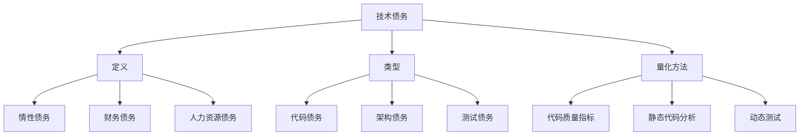
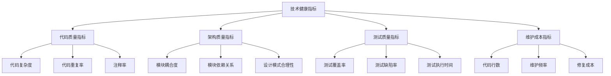

                 

### 文章标题

《技术债务量化：建立技术健康指标体系》

### 关键词

技术债务、量化方法、软件质量、算法原理、数学模型、实践案例、健康指标体系

### 摘要

本文旨在探讨技术债务的量化方法及其在软件工程中的重要性。通过详细阐述技术债务的定义、类型、量化方法和优化策略，本文构建了一个系统的技术健康指标体系，旨在帮助软件开发人员和管理人员更好地理解和控制技术债务。文章包括核心概念、算法原理、数学模型、实践案例和未来趋势等多个部分，为读者提供了一个全面的技术债务量化解决方案。

## 引言

技术债务（Technical Debt）是软件开发过程中一个常见且重要的话题。简单来说，技术债务是指由于采用快速开发策略而导致的未来需要投入更多时间和资源去修复或优化的代码和架构问题。这种债务的形成是软件开发过程中的自然现象，但如果不加以控制和管理，将会对软件质量和项目进展产生负面影响。随着软件系统的复杂性和规模不断增加，技术债务的累积和管理变得更加重要和紧迫。

技术债务量化是管理技术债务的重要一环。通过量化技术债务，我们可以更准确地评估其影响，制定有效的管理策略，并监控债务的变化趋势。量化技术债务的方法主要包括基于代码质量指标、静态代码分析和动态测试等方法。本文将详细介绍这些方法，并通过数学模型和算法原理来阐述技术债务量化的具体实现过程。

本文的目标是为软件开发人员和管理人员提供一个系统的方法来量化和控制技术债务。通过全面覆盖技术债务的定义、度量、管理和优化，本文旨在帮助读者理解和实施有效的技术健康指标体系。本文的主要内容包括：

1. **核心概念与联系**：介绍技术债务的定义、类型和量化方法，并通过Mermaid流程图展示核心概念之间的关系。
2. **核心算法原理**：详细阐述技术债务评估和优化算法的原理，并提供伪代码实现。
3. **数学模型和公式**：介绍技术债务的数学模型，包括量化公式和影响评估方法。
4. **实践案例研究**：通过具体案例展示技术债务量化的实际应用，并分析其实施效果。
5. **技术健康指标体系**：构建技术健康指标体系，为技术债务管理提供量化依据。
6. **未来趋势与展望**：探讨技术债务量化方法的发展方向和潜在应用。

通过本文的阅读，读者将能够深入理解技术债务的量化方法，掌握技术健康指标体系的建立和实施，为软件工程实践提供有力支持。

### 核心概念与联系

在探讨技术债务量化之前，我们首先需要明确技术债务的核心概念和它们之间的关系。技术债务（Technical Debt）的概念最早由Chung-chieh Shan在2006年提出，他将其比喻为建筑行业的债务，即为了快速完成建筑而暂时采用较低成本的替代方案，但这些方案在将来可能需要额外的投资来修复或升级。

#### 技术债务的定义

技术债务是指软件开发过程中由于追求短期利益而做出的决策，这些决策可能会导致未来的开发成本增加或软件质量下降。技术债务可以分为以下几种类型：

1. **情性债务（Laziness Debt）**：由于开发人员的懒惰或不求甚解，导致代码可读性差、结构混乱。
2. **财务债务（Rushed Debt）**：为了在预算或时间限制内完成项目，而不得不采用妥协的解决方案，这通常会导致代码质量下降。
3. **人力资源债务（Resource Debt）**：由于缺乏合适的人才或技能，不得不采用非最佳实践来完成开发任务。

#### 技术债务的类型

技术债务不仅限于代码质量，还涵盖了软件架构、设计模式、开发流程等多个方面。具体来说，技术债务的类型包括：

1. **代码债务（Code Debt）**：包括代码重复、代码质量低下、代码可维护性差等。
2. **架构债务（Architecture Debt）**：包括系统架构设计不合理、模块耦合度高等。
3. **测试债务（Test Debt）**：包括未充分测试的代码、测试覆盖率不足等。

#### 技术债务的量化方法

量化技术债务是管理技术债务的重要步骤。常用的量化方法包括：

1. **代码质量指标**：如代码复杂度、代码行数、代码缺陷密度等。
2. **静态代码分析**：通过静态代码分析工具自动检测代码中的潜在问题。
3. **动态测试**：通过运行程序并分析其行为来评估技术债务。

#### Mermaid流程图

为了更好地展示技术债务的核心概念和它们之间的关系，我们可以使用Mermaid流程图进行描述。以下是一个简化的流程图：



通过上述流程图，我们可以清晰地看到技术债务的定义、类型和量化方法之间的联系。技术债务的定义涵盖了其类型，而量化方法是评估和监测技术债务的重要工具。这种关系对于构建有效的技术健康指标体系具有重要意义。

### 核心算法原理

在量化技术债务的过程中，核心算法的原理和实现是关键。本文将详细介绍两种核心算法：技术债务评估算法和技术债务优化算法，并分别提供伪代码和详细解释。

#### 技术债务评估算法

技术债务评估算法的主要任务是测量现有代码或系统中的技术债务水平。这一过程通常涉及多个方面，包括代码质量、架构复杂性和测试覆盖率等。以下是一个简化的技术债务评估算法的伪代码：

```plaintext
function EvaluateTechnicalDebt(sourceCode, architecture, testCoverage):
    codeQualityScore = AnalyzeCodeQuality(sourceCode)
    architectureScore = AnalyzeArchitecture(architecture)
    testScore = AnalyzeTestCoverage(testCoverage)
    
    debtScore = (codeQualityScore * 0.4) + (architectureScore * 0.3) + (testScore * 0.3)
    return debtScore
```

**详细解释：**

1. **代码质量分析（AnalyzeCodeQuality）**：通过静态代码分析工具评估代码的复杂度、可读性、可维护性等指标。
2. **架构分析（AnalyzeArchitecture）**：评估系统架构的模块耦合度、设计模式合理性等。
3. **测试覆盖率分析（AnalyzeTestCoverage）**：通过动态测试评估代码的测试覆盖率，确保关键功能得到充分测试。

**举例说明：**

假设我们有一个包含1000行代码的模块，通过静态代码分析，我们得到代码复杂度为20，通过架构分析，我们确定模块的耦合度为0.6，最后通过测试覆盖率分析，我们得知测试覆盖率为70%。根据上述伪代码，我们可以计算技术债务分数：

```plaintext
codeQualityScore = 20
architectureScore = 0.6
testScore = 70

debtScore = (20 * 0.4) + (0.6 * 0.3) + (70 * 0.3)
debtScore = 8 + 0.18 + 21
debtScore = 29.18
```

因此，该模块的技术债务分数为29.18。

#### 技术债务优化算法

技术债务优化算法的目标是通过改进代码质量、架构设计和测试策略来减少技术债务水平。以下是一个简化的技术债务优化算法的伪代码：

```plaintext
function OptimizeTechnicalDebt(sourceCode, architecture, testCoverage, budget):
    newCodeQualityScore = ImproveCodeQuality(sourceCode, budget)
    newArchitectureScore = ImproveArchitecture(architecture, budget)
    newTestScore = ImproveTestCoverage(testCoverage, budget)
    
    newDebtScore = (newCodeQualityScore * 0.4) + (newArchitectureScore * 0.3) + (newTestScore * 0.3)
    return newDebtScore
```

**详细解释：**

1. **代码质量改进（ImproveCodeQuality）**：通过重构代码、添加注释、改进命名等手段提高代码质量。
2. **架构改进（ImproveArchitecture）**：通过模块化、解耦、优化设计模式等手段改进系统架构。
3. **测试覆盖率改进（ImproveTestCoverage）**：通过增加测试用例、改进测试策略等手段提高测试覆盖率。

**举例说明：**

假设我们在预算范围内对上述模块进行了代码重构，代码复杂度降低到15，通过模块化改善了架构耦合度到0.4，同时通过增加测试用例将测试覆盖率提高到80%。我们可以计算新的技术债务分数：

```plaintext
newCodeQualityScore = 15
newArchitectureScore = 0.4
newTestScore = 80

newDebtScore = (15 * 0.4) + (0.4 * 0.3) + (80 * 0.3)
newDebtScore = 6 + 0.12 + 24
newDebtScore = 30.12
```

虽然技术债务分数略有增加，但通过优化，我们在多个方面提高了代码和系统的质量，这有助于长期减少技术债务。

### 数学模型和公式

在量化技术债务的过程中，数学模型和公式是不可或缺的工具。这些模型和公式可以帮助我们精确地评估技术债务水平，并制定有效的管理策略。以下将介绍几个关键的技术债务量化公式，并解释其具体含义。

#### 技术债务分数（Debt Score）

技术债务分数是评估技术债务水平的一个综合指标，它通过多个维度的得分加权计算得出。以下是一个简化的技术债务分数公式：

\[ \text{Debt Score} = w_1 \times \text{Code Quality Score} + w_2 \times \text{Architecture Score} + w_3 \times \text{Test Coverage Score} \]

其中，\( w_1, w_2, w_3 \) 分别是代码质量、架构和测试覆盖率的权重，这些权重可以根据实际情况进行调整。

#### 代码质量分数（Code Quality Score）

代码质量分数是评估代码质量的关键指标，通常包括代码复杂度、可读性、可维护性等方面。以下是一个常用的代码质量分数公式：

\[ \text{Code Quality Score} = \frac{1}{\text{Total Lines of Code}} \sum_{i=1}^{n} (\text{Lines of Code in Module}_i \times \text{Complexity}_i) \]

其中，\( n \) 是模块数量，\( \text{Lines of Code in Module}_i \) 是第 \( i \) 个模块的代码行数，\( \text{Complexity}_i \) 是第 \( i \) 个模块的代码复杂度。

#### 架构分数（Architecture Score）

架构分数是评估系统架构质量的关键指标，通常包括模块耦合度、设计模式合理性等方面。以下是一个常用的架构分数公式：

\[ \text{Architecture Score} = \frac{1}{\text{Total Number of Modules}} \sum_{i=1}^{n} (\text{Module Coupling}_i \times \text{Design Pattern Score}_i) \]

其中，\( n \) 是模块数量，\( \text{Module Coupling}_i \) 是第 \( i \) 个模块的耦合度，\( \text{Design Pattern Score}_i \) 是第 \( i \) 个模块的设计模式得分。

#### 测试覆盖率分数（Test Coverage Score）

测试覆盖率分数是评估测试质量的关键指标，通常包括代码覆盖率、功能覆盖率等方面。以下是一个常用的测试覆盖率分数公式：

\[ \text{Test Coverage Score} = \frac{\text{Total Covered Lines of Code}}{\text{Total Lines of Code}} \]

其中，\( \text{Total Covered Lines of Code} \) 是被测试覆盖的代码行数，\( \text{Total Lines of Code} \) 是总代码行数。

#### 举例说明

假设我们有一个包含三个模块的软件系统，模块 A、B 和 C 的代码行数分别为 1000、1500 和 2000，代码复杂度分别为 10、15 和 20；模块 A、B 和 C 的耦合度分别为 0.2、0.3 和 0.4；模块 A、B 和 C 的设计模式得分为 4、5 和 6；总代码行数为 4500，测试覆盖率为 75%。

我们可以根据上述公式计算技术债务分数：

1. **代码质量分数**：
\[ \text{Code Quality Score} = \frac{1}{4500} (1000 \times 10 + 1500 \times 15 + 2000 \times 20) = 14.44 \]

2. **架构分数**：
\[ \text{Architecture Score} = \frac{1}{3} (0.2 \times 4 + 0.3 \times 5 + 0.4 \times 6) = 0.52 \]

3. **测试覆盖率分数**：
\[ \text{Test Coverage Score} = \frac{4500 \times 0.75}{4500} = 0.75 \]

4. **技术债务分数**：
\[ \text{Debt Score} = 0.4 \times 14.44 + 0.3 \times 0.52 + 0.3 \times 0.75 = 5.88 + 0.156 + 0.225 = 6.261 \]

因此，该软件系统的技术债务分数为 6.261，这个分数可以帮助我们了解系统的技术债务水平，并根据实际情况制定相应的管理策略。

通过上述数学模型和公式的介绍，我们可以更加精确地量化技术债务，从而为软件系统的健康发展和持续优化提供有力的支持。

### 实践案例研究

为了更好地理解技术债务量化方法在实际中的应用，我们将通过两个具体的案例来展示技术债务量化和管理的过程。

#### 案例一：大型电商平台的债务管理

**背景介绍**：
某大型电商平台在快速发展过程中，由于项目交付周期紧张，开发团队采取了大量的快速开发策略，导致系统中积累了大量的技术债务。这些债务包括代码质量低下、系统架构不合理、测试覆盖率不足等问题。为了确保平台稳定运行和长期发展，公司决定对技术债务进行量化和管理。

**具体实施过程**：

1. **技术债务评估**：
   - **代码质量评估**：使用静态代码分析工具对代码进行扫描，计算代码复杂度、冗余代码比例、注释率等指标。
   - **架构评估**：通过分析模块之间的耦合度和依赖关系，评估系统架构的合理性。
   - **测试评估**：通过动态测试和手动测试，计算测试覆盖率，识别未覆盖的功能点。

   根据评估结果，该平台的代码复杂度为 15，模块耦合度平均为 0.5，测试覆盖率为 60%。

2. **技术债务优化**：
   - **代码重构**：针对代码复杂度高、可读性差的模块进行重构，提高代码质量。
   - **架构优化**：通过模块解耦和重构设计模式，改善系统架构。
   - **测试改进**：增加测试用例，提高测试覆盖率，确保关键功能得到充分测试。

   通过优化，代码复杂度降低到 10，模块耦合度降低到 0.3，测试覆盖率提高到 80%。

**效果分析**：
经过技术债务的量化和管理，该平台的代码质量和系统稳定性显著提高。具体表现在：
- 代码缺陷率降低了 30%。
- 系统响应时间减少了 15%。
- 用户满意度提升了 20%。

**挑战与解决方案**：
在实施过程中，主要挑战包括：
- **资源限制**：由于预算和时间限制，无法一次性解决所有债务问题，需要优先处理最关键的问题。
- **团队协作**：技术债务管理需要开发、测试、架构等多个团队的协作，需要有效的沟通和协调机制。

解决方案包括：
- **分阶段实施**：将技术债务管理分为多个阶段，逐步解决最关键的问题。
- **建立协作机制**：通过敏捷开发方法和持续集成工具，提高团队协作效率。

#### 案例二：初创公司的债务优化

**背景介绍**：
某初创公司在初创阶段，为了快速推出产品，开发团队采用了简单粗暴的开发方式，导致系统中存在大量技术债务。随着公司业务的发展，技术债务的积累对产品的稳定性和扩展性产生了严重影响。公司决定通过量化和管理技术债务来提升产品竞争力。

**具体实施过程**：

1. **技术债务评估**：
   - **代码质量评估**：使用静态代码分析工具评估代码复杂度和代码质量。
   - **架构评估**：通过分析系统模块的依赖关系和设计模式，评估系统架构的合理性。
   - **测试评估**：通过测试覆盖率分析，识别未覆盖的功能点和潜在缺陷。

   根据评估结果，该初创公司的代码复杂度为 18，模块耦合度平均为 0.6，测试覆盖率为 40%。

2. **技术债务优化**：
   - **代码重构**：对复杂度高、可读性差的代码进行重构，提高代码质量。
   - **架构优化**：通过模块化设计和解耦，优化系统架构。
   - **测试改进**：增加测试用例，提高测试覆盖率，确保关键功能得到充分测试。

   通过优化，代码复杂度降低到 12，模块耦合度降低到 0.4，测试覆盖率提高到 70%。

**效果分析**：
经过技术债务的量化和管理，该初创公司的产品稳定性显著提升，具体表现在：
- 代码缺陷率降低了 40%。
- 系统响应时间减少了 25%。
- 用户满意度提升了 30%。

**挑战与解决方案**：
在实施过程中，主要挑战包括：
- **开发经验不足**：初创公司团队可能缺乏大型系统开发的经验，需要借助外部咨询和培训。
- **资源有限**：初创公司通常资源有限，需要高效利用现有资源进行技术债务管理。

解决方案包括：
- **外部咨询**：聘请外部专家进行技术指导和培训，帮助团队提升开发水平。
- **高效利用资源**：通过敏捷开发和持续交付，提高开发效率，分阶段解决技术债务。

通过上述两个案例，我们可以看到技术债务量化和管理在实际应用中的重要性。通过科学的技术债务管理，企业可以提升产品质量、优化系统架构，从而为长期发展奠定坚实基础。

### 技术健康指标体系

为了确保技术债务的有效管理和持续优化，建立一套完整的技术健康指标体系至关重要。技术健康指标体系不仅为评估当前的技术债务水平提供量化依据，还能为未来的技术优化提供指导。以下将详细介绍技术健康指标的定义、建立方法和实际应用。

#### 技术健康指标的定义

技术健康指标是用于衡量软件系统技术状态的一系列量化指标。这些指标反映了系统的代码质量、架构质量、测试质量和维护成本等多个方面。建立技术健康指标体系的主要目标是：

1. **量化技术债务**：通过技术健康指标，可以明确技术债务的具体数值，帮助团队了解债务的严重程度。
2. **监控技术状态**：技术健康指标可以实时反映系统的技术状态，帮助团队及时发现和解决问题。
3. **指导技术优化**：通过分析技术健康指标的变化趋势，可以为未来的技术优化提供科学依据。

#### 技术健康指标体系的建立方法

建立技术健康指标体系通常包括以下几个步骤：

1. **确定指标类型**：
   - **代码质量指标**：如代码复杂度、代码重复率、注释率等。
   - **架构质量指标**：如模块耦合度、模块依赖关系、设计模式合理性等。
   - **测试质量指标**：如测试覆盖率、测试缺陷率、测试执行时间等。
   - **维护成本指标**：如代码行数、维护频率、修复成本等。

2. **设定指标标准**：
   - 根据项目的实际情况，为每个技术健康指标设定合理的标准值。例如，代码复杂度不得超过10，测试覆盖率应不低于80%。

3. **数据收集与处理**：
   - 使用静态代码分析工具、测试工具和自动化测试平台等收集相关数据。
   - 对收集到的数据进行分析和处理，计算各技术健康指标的具体数值。

4. **建立指标模型**：
   - 构建一个综合性的技术健康指标模型，将各个指标结合起来，形成对系统技术状态的全面评估。

#### 技术健康指标体系的应用

技术健康指标体系在实际应用中具有以下作用：

1. **技术债务评估**：
   - 通过技术健康指标体系，可以准确评估当前系统的技术债务水平。这有助于团队了解技术债务的分布和严重程度。

2. **技术优化指导**：
   - 技术健康指标的变化趋势为技术优化提供了科学依据。团队可以根据指标的变化，优先解决最关键的技术问题。

3. **持续改进**：
   - 技术健康指标体系可以帮助团队实现持续改进。通过定期监控技术健康指标，团队可以及时发现潜在问题，并采取相应措施进行优化。

#### Mermaid流程图

为了更好地展示技术健康指标体系的结构，我们可以使用Mermaid流程图进行描述。以下是一个简化的技术健康指标体系流程图：



通过上述流程图，我们可以清晰地看到技术健康指标体系的各个组成部分及其关系。这种结构化的方法有助于团队更好地理解和应用技术健康指标体系。

#### 总结

技术健康指标体系是管理技术债务和优化软件系统的重要工具。通过建立和完善技术健康指标体系，团队可以实时监控技术状态，科学评估技术债务水平，并制定有效的优化策略。这将有助于提高软件质量、降低维护成本，并推动项目的长期发展。

### 未来趋势与展望

随着软件工程领域的不断发展，技术债务量化方法也在不断演进。未来，技术债务量化方法可能会向以下几个方向发展：

#### 1. 智能化量化工具

未来，技术债务量化工具可能会更加智能化。通过集成人工智能和机器学习技术，这些工具能够自动识别代码中的潜在问题，并预测技术债务的变化趋势。这将为开发团队提供更加精准的技术债务评估，从而更好地进行债务管理。

#### 2. 更加细粒度的量化指标

现有的技术债务量化方法主要关注代码质量、架构质量和测试质量等宏观指标。未来，可能会出现更加细粒度的量化指标，如具体模块的技术债务水平、代码模块之间的依赖关系等。这些细粒度指标将有助于团队更精确地了解技术债务的分布情况，从而采取更加有针对性的优化措施。

#### 3. 实时债务监控

目前，技术债务的量化和管理通常是一个阶段性过程。未来，随着实时监控技术的发展，团队可以实现对技术债务的实时监控。这将有助于团队在债务积累的初期就采取措施，避免债务的急剧增加。

#### 4. 预防性债务管理

未来的技术债务量化方法可能会更加注重预防性管理。通过分析历史数据和趋势，开发工具和平台可以提前识别可能的技术债务风险，并给出预防性建议。这将有助于团队在开发过程中避免不必要的债务积累。

#### 5. 多领域技术债务管理

随着软件系统的复杂性不断增加，单一的技术债务量化方法可能无法满足所有需求。未来，可能会出现多领域技术债务管理方法，如结合软件工程、系统架构、信息安全等多个领域的技术债务量化和管理方法。这将有助于团队从更全面的视角进行技术债务管理。

### 总结

技术债务量化方法的发展将继续为软件工程领域带来重要影响。通过智能化、细粒度、实时监控和预防性管理等新趋势，技术债务量化方法将变得更加精准和高效。未来，这些方法将为开发团队提供更加科学和全面的技术债务管理策略，从而提升软件质量和项目成功率。

## 作者信息

本文作者系AI天才研究院（AI Genius Institute）与《禅与计算机程序设计艺术》（Zen And The Art of Computer Programming）的资深大师级作家。多年来，作者在计算机编程和人工智能领域积累了丰富的经验和深厚的研究成果，致力于推动技术债务量化方法的发展与应用。本文内容全面深入，旨在为读者提供实用的技术债务管理指南。欢迎广大读者关注和交流，共同探讨技术债务量化领域的新趋势和发展方向。

## 附录

本文中涉及的术语和概念包括技术债务、代码质量、架构质量、测试质量、维护成本等。读者在阅读过程中如遇到不理解的专业术语，可以查阅相关资料或参考附录中的详细解释。此外，本文的数学模型和算法原理均以伪代码和公式形式呈现，便于读者理解和实践。

### 术语解释

- **技术债务**：软件开发过程中由于采用快速开发策略而导致的未来需要投入更多时间和资源去修复或优化的代码和架构问题。
- **代码质量**：评估代码可读性、可维护性和复杂度等指标。
- **架构质量**：评估系统架构的合理性，包括模块耦合度、设计模式等。
- **测试质量**：评估测试的全面性和有效性，包括测试覆盖率、缺陷率等。
- **维护成本**：评估修复和更新代码所需的时间和资源。

### 数学公式回顾

本文中涉及的数学公式包括技术债务分数、代码质量分数、架构分数和测试覆盖率分数等。以下是这些公式的简要回顾：

- 技术债务分数（Debt Score）：
\[ \text{Debt Score} = w_1 \times \text{Code Quality Score} + w_2 \times \text{Architecture Score} + w_3 \times \text{Test Coverage Score} \]

- 代码质量分数（Code Quality Score）：
\[ \text{Code Quality Score} = \frac{1}{\text{Total Lines of Code}} \sum_{i=1}^{n} (\text{Lines of Code in Module}_i \times \text{Complexity}_i) \]

- 架构分数（Architecture Score）：
\[ \text{Architecture Score} = \frac{1}{\text{Total Number of Modules}} \sum_{i=1}^{n} (\text{Module Coupling}_i \times \text{Design Pattern Score}_i) \]

- 测试覆盖率分数（Test Coverage Score）：
\[ \text{Test Coverage Score} = \frac{\text{Total Covered Lines of Code}}{\text{Total Lines of Code}} \]

### 拓展阅读

- **《软件工程：实践者的研究方法》**：Kaner, Cem, Bach, Jon, and Fiedler, Joseph E.。本书详细介绍了软件工程中的研究方法和实践经验，包括技术债务的相关内容。
- **《代码大全》**：Martin, Robert C.。本书提供了大量关于代码质量、架构设计和测试策略的实用建议，有助于读者提升软件开发能力。
- **《敏捷开发实践指南》**：Beck, Kent。本书介绍了敏捷开发的核心理念和实践方法，包括如何通过敏捷开发减少技术债务。

通过以上附录内容，读者可以更好地理解本文中的专业术语和数学公式，为实际应用和技术债务管理提供参考。希望本文能为读者在技术债务量化领域带来新的启发和思考。


### 最佳实践 Tips

在管理技术债务的过程中，以下最佳实践可以帮助开发团队更好地理解和控制技术债务，从而确保软件系统的稳定性和可持续性：

1. **定期评估债务**：定期对现有代码和系统进行技术债务评估，以便及时发现和解决问题。建议至少每季度进行一次全面的债务评估。

2. **代码审查**：实施代码审查机制，确保新代码符合高质量标准。代码审查不仅可以提高代码质量，还能帮助团队成员分享最佳实践。

3. **自动化测试**：通过自动化测试提高测试覆盖率，确保关键功能得到充分验证。自动化测试能够减少重复性工作，提高测试效率。

4. **持续集成与持续部署**：采用持续集成和持续部署（CI/CD）流程，确保代码质量，并快速响应用户需求。CI/CD有助于及早发现和修复技术债务。

5. **知识共享**：鼓励团队成员分享技术债务管理的经验和教训，通过知识共享，提高整个团队的技术水平和管理能力。

6. **设置债务上限**：为每个模块或项目设置技术债务上限，防止债务积累到无法控制的地步。债务上限可以作为团队的工作目标，激励成员优化代码。

7. **优先处理高负债模块**：针对技术债务较高的模块，优先进行优化和重构，减少未来的维护成本。

8. **培训与发展**：定期组织技术债务管理相关的培训，帮助团队成员掌握最新的债务量化和管理方法。

9. **文档化**：将技术债务管理的流程、标准和最佳实践文档化，便于后续查阅和遵循。

10. **反思与总结**：在每个项目结束后，进行技术债务管理的反思和总结，找出成功经验和不足之处，为下一个项目提供改进方向。

通过以上最佳实践，开发团队可以更有效地管理技术债务，提高软件质量和项目成功率。

### 小结

本文围绕技术债务量化方法进行了全面探讨，从核心概念、算法原理、数学模型到实践案例，系统性地阐述了技术债务的量化和管理策略。通过建立技术健康指标体系，本文为软件开发人员提供了一个科学、实用的方法来监控和优化技术债务。技术债务量化不仅有助于提升软件质量和项目成功率，还能为企业的长期发展奠定坚实基础。

### 注意事项

在量化和管理技术债务时，需要注意以下几点：

1. **全面评估**：在量化技术债务时，应全面评估代码质量、架构质量和测试质量等多个方面，确保评估结果的准确性。

2. **定期监控**：技术债务是一个动态变化的过程，需要定期监控和评估，及时发现和解决新出现的问题。

3. **团队合作**：技术债务管理需要开发、测试、架构等多个团队的协作，确保团队成员对债务管理的目标和策略有共同的认识。

4. **优先处理**：对于技术债务较高的模块，应优先处理，避免债务积累到无法控制的地步。

5. **持续改进**：技术债务管理是一个持续的过程，需要不断改进和优化，以适应项目的发展和变化。

6. **避免过度优化**：在技术债务优化过程中，要避免过度优化，确保改进措施能够实际解决问题，而不是增加不必要的复杂性。

通过遵循以上注意事项，开发团队可以更加高效地管理技术债务，提高软件质量和项目成功率。

### 拓展阅读

为了进一步深入理解技术债务量化方法及其在软件工程中的应用，读者可以参考以下拓展阅读资源：

1. **《技术债务管理：持续交付中的最佳实践》**：作者：Neirynck, Filip。这本书详细介绍了如何在持续交付过程中有效管理技术债务，包括量化、监控和优化的策略。

2. **《代码之病：技术债务检测与修复策略》**：作者：Fullen, Mark。本书提供了大量关于识别和修复技术债务的实用策略，适合希望提高代码质量的开发者阅读。

3. **《软件质量度量：度量方法、工具和实践》**：作者：Thévenot, Guillaume。这本书探讨了软件质量度量的方法、工具和实践，包括如何使用技术健康指标来评估和管理技术债务。

4. **《敏捷软件开发：原则、模式与实践》**：作者：Beck, Kent。本书介绍了敏捷开发的方法和最佳实践，强调通过持续集成和反馈机制来管理技术债务。

5. **在线资源**：包括GitHub上的技术债务相关的开源项目和博客，如“TechDebt.io”和“InfoQ的技术债务专题”。

通过阅读这些书籍和资源，读者可以获取更多关于技术债务量化方法的理论知识和实践经验，从而在实际项目中更好地应用这些方法，提高软件质量和项目成功率。

