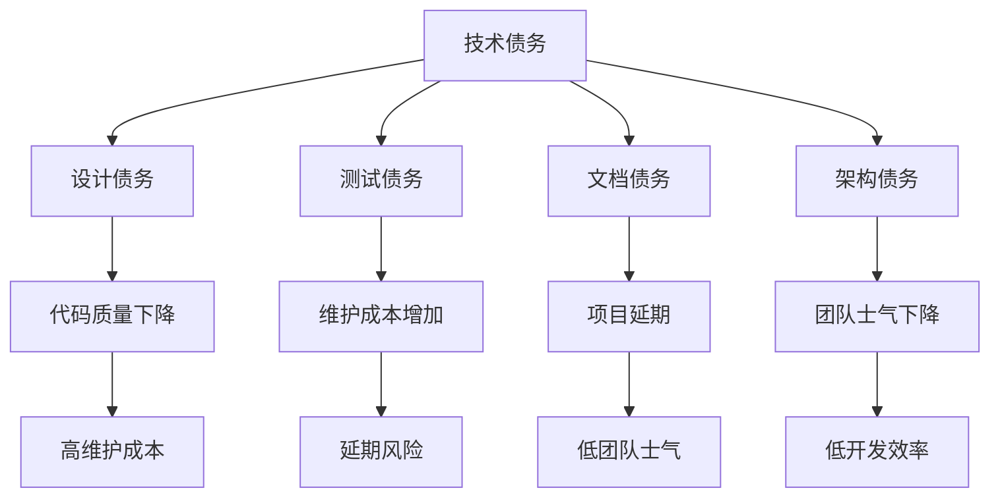

                 

### 技术债务的定义与类型

#### 技术债务的基本概念

技术债务（Technical Debt）是软件工程中的一个术语，指的是在软件开发过程中，由于时间或资源限制而做出的短期优化或妥协，这些妥协可能会影响软件的长期可维护性和扩展性。这种债务并非实际的财务债务，而是一种比喻，用来描述软件开发中的各种决策所带来的长期影响。

技术债务的来源多种多样，例如：

1. **快速迭代的需求变更**：在项目开发过程中，客户需求可能会频繁变更，为了快速响应需求，开发者可能会选择简单的解决方案，这可能导致后期维护成本增加。
2. **时间限制**：在项目紧迫的情况下，团队可能会牺牲代码的质量和架构的合理性，以缩短开发时间。
3. **资源限制**：在资源有限的情况下，开发者可能会选择使用已有组件或工具，而不是花费时间去开发更合适的解决方案。
4. **技术不熟悉**：开发者可能会因为对新技术的不熟悉，选择使用他们更熟悉的工具或库，这可能导致技术债务的积累。

#### 技术债务的类型

技术债务可以根据其来源和影响，分为多种类型：

- **设计债务**：指代码结构不合理、架构设计不合理等情况。设计债务可能会导致系统的扩展性差、维护困难。
  
- **测试债务**：指缺乏足够的自动化测试、手工测试覆盖率低等问题。测试债务可能会导致系统在部署后出现大量问题，增加维护成本。

- **文档债务**：指缺乏足够的代码注释、文档不完整或不及时更新等问题。文档债务会使得后续的开发和维护变得更加困难。

- **架构债务**：指系统架构设计不合理、系统复杂性增加等问题。架构债务可能会影响系统的性能、可扩展性和可维护性。

#### 技术债务的影响

技术债务的影响是累积性的，随着时间的推移，其负面影响会逐渐显现：

- **代码质量下降**：随着技术债务的积累，代码质量会逐渐下降，这可能导致更多的缺陷和bug。
  
- **维护成本增加**：技术债务会导致系统的维护成本增加，修复技术债务可能需要更多的时间和资源。

- **项目延期**：技术债务可能会导致项目无法按时交付，甚至可能需要重新设计系统。

- **团队士气下降**：长期的技术债务会降低团队的工作效率和士气。

#### 技术债务的管理原则

为了有效管理和偿还技术债务，以下是一些管理原则：

- **及时识别**：及时发现技术债务是管理的关键。开发者应该定期检查代码和系统，识别潜在的技术债务。
  
- **优先级排序**：根据债务的影响和成本，对债务进行优先级排序，重点关注高影响和高成本的技术债务。

- **持续监控**：技术债务不是一次性的问题，需要持续监控和偿还。开发者应该建立一套监控机制，定期检查技术债务的积累情况。

- **定期偿还**：定期偿还技术债务，避免债务累积。开发者可以设定定期的时间节点，进行技术债务的偿还工作。

### 技术债务的核心概念与联系

为了更好地理解技术债务，我们可以通过一个Mermaid流程图来展示其核心概念与联系：

这个流程图展示了技术债务的各种类型以及它们之间的关联，帮助我们更好地理解技术债务的核心概念与联系。

### 结论

技术债务是软件开发中不可避免的问题，但通过有效的管理和偿还，可以降低其对项目的负面影响。开发者应该认识到技术债务的存在，并采取一系列措施来管理和偿还技术债务，以确保软件项目的长期成功。接下来，我们将进一步探讨技术债务的产生原因，帮助读者更深入地了解这一重要概念。 

### 1.1 技术债务的基本概念

技术债务（Technical Debt）这一概念最早由软件工程师Martin Fowler提出，用以比喻软件开发过程中因追求短期目标而牺牲长期利益的行为。类似于财务管理中的债务，技术债务是指由于开发团队在追求快速交付和满足客户需求的过程中，采用了低质量、不规范的解决方案，这些妥协会带来潜在的问题，需要在未来的某个时间点进行修复和改进。

#### 技术债务的定义

技术债务可以简单定义为：“为了更快地交付软件产品而选择的一种短期解决方案，这种解决方案可能会在将来带来额外的维护成本和复杂性。”

具体来说，技术债务的几个关键要素包括：

- **短期优化**：在开发过程中，为了满足时间或资源限制，团队可能会选择快速实现的方案，而不是最优的解决方案。
- **长期成本**：这些短期优化在未来的维护和扩展过程中，可能会带来额外的成本，例如更复杂的代码、性能问题、安全漏洞等。
- **可偿还性**：技术债务是可以被偿还的，即通过未来的工作来修复或替换这些低质量的解决方案。

#### 技术债务的分类

技术债务可以根据其来源和影响，分为多种类型：

1. **设计债务**：由于系统架构或代码设计不合理导致的债务。这种债务可能使得系统在扩展性、可维护性方面存在缺陷。
    - **示例**：硬编码配置、不合理的分层结构、过多的全局变量等。

2. **测试债务**：由于缺乏足够的自动化测试和测试覆盖率导致的债务。这种债务可能导致在发布产品后出现未发现的缺陷。
    - **示例**：只有单元测试，缺乏集成测试或系统测试、测试覆盖率低、测试用例不全面等。

3. **文档债务**：由于缺乏或未及时更新的文档导致的债务。这种债务会使得未来的开发者难以理解系统的工作原理。
    - **示例**：缺乏注释、代码文档不完整、API文档不清晰、架构文档缺失等。

4. **架构债务**：由于系统架构设计不合理导致的债务。这种债务可能会影响系统的性能、可扩展性和可维护性。
    - **示例**：过度耦合的系统组件、不合理的数据库设计、不灵活的部署架构等。

#### 技术债务的影响

技术债务的影响是累积性的，其负面影响在项目生命周期内逐渐显现：

- **代码质量下降**：技术债务会导致代码复杂性增加，使得代码质量下降，维护成本上升。
- **维护成本增加**：随着技术债务的累积，系统维护和修复的难度和成本会逐渐增加。
- **项目延期**：技术债务可能会阻碍项目的进展，导致项目延期或超支。
- **团队士气下降**：长期的技术债务会降低团队的工作效率和士气，增加团队成员的挫败感。

#### 技术债务的管理策略

为了有效管理和偿还技术债务，以下是一些管理策略：

- **及时识别**：定期审查代码和系统，及时发现潜在的技术债务。
- **优先级排序**：根据债务的影响和成本，对债务进行优先级排序，重点关注高影响和高成本的技术债务。
- **持续监控**：建立技术债务的监控机制，定期检查债务的积累情况。
- **定期偿还**：设定时间节点，进行技术债务的偿还工作，避免债务累积。

通过上述策略，开发团队可以更好地控制技术债务，确保软件项目的长期成功。

### 1.2 技术债务的危害

技术债务的积累对软件项目来说是一个隐性的威胁，它不仅影响项目的当前状态，还会对未来产生深远的负面影响。以下是技术债务对软件项目的具体危害：

#### 代码质量下降

技术债务最常见的危害之一就是导致代码质量的下降。在为了快速交付而采取的短期解决方案中，开发者可能会牺牲代码的整洁性、可读性和可维护性。这种情况下，代码变得难以理解和修改，增加了后期的维护成本。

- **复杂性增加**：随着技术债务的积累，系统的复杂性会逐渐增加。这可能导致代码路径变得复杂，增加了理解代码的难度。
- **可读性下降**：由于缺乏规范的编码习惯和注释，代码的可读性会下降，使得后续的开发者难以理解代码的功能和意图。
- **可维护性差**：低质量的代码在出现bug或需求变更时，修复和修改的难度会大大增加，导致维护成本上升。

#### 维护成本增加

技术债务会导致项目的维护成本逐渐增加。随着时间的推移，未偿还的技术债务会积累成更多的bug和问题，需要更多的时间和资源来解决。

- **修复成本上升**：未解决的技术债务可能会在未来的维护过程中暴露出来，修复这些债务所需的成本往往高于最初的解决方案成本。
- **资源浪费**：由于技术债务的存在，开发团队可能会花费大量的时间和精力来处理代码中的问题，而不是专注于新的功能开发。
- **效率降低**：低质量的代码和高复杂性系统会降低开发团队的效率，使得项目进度受到影响。

#### 项目延期

技术债务可能会对项目的进度产生负面影响，导致项目延期。以下是几个可能导致项目延期的情况：

- **计划不周**：在项目初期，如果未能有效识别和计划偿还技术债务，可能会导致在后期发现大量问题，从而需要额外的时间来解决。
- **优先级错误**：如果开发团队错误地将资源投入到新功能开发而非技术债务的修复，可能会导致项目在后续阶段陷入困境。
- **资源短缺**：技术债务可能会导致团队在后期需要更多的资源来修复问题，而资源短缺会进一步推迟项目的完成时间。

#### 团队士气下降

长期的技术债务会对团队的士气产生负面影响。以下是几个可能导致团队士气下降的情况：

- **挫败感**：团队成员可能会因为频繁遇到技术债务而感到挫败，影响他们的工作积极性。
- **效率低下**：低质量的代码和高复杂性系统会降低开发团队的效率，使得成员感到工作压力。
- **信任危机**：技术债务的积累可能会导致团队成员对项目和管理层失去信任，影响团队的合作氛围。

#### 如何减轻技术债务的危害

为了减轻技术债务的危害，开发团队可以采取以下措施：

- **定期审查**：定期对代码和系统进行审查，及时发现和修复潜在的技术债务。
- **优先级排序**：将技术债务的修复工作纳入项目计划，并设定明确的优先级。
- **持续集成**：通过持续集成和持续交付（CI/CD）实践，确保代码质量的持续提升。
- **培训与指导**：对团队成员进行编码规范和最佳实践的培训，提高整体代码质量。
- **增加测试覆盖率**：通过增加自动化测试和测试覆盖率，降低技术债务的风险。

### 结论

技术债务虽然是在软件开发过程中不可避免的，但通过合理的管理和控制，可以最大限度地减轻其对项目的负面影响。开发者应该重视技术债务，采取有效的管理策略，确保软件项目的长期成功。

### 1.3 技术债务的管理策略

#### 技术债务的管理原则

为了有效地管理和偿还技术债务，开发团队需要遵循一系列的管理原则：

1. **及时识别**：技术债务的早期识别至关重要。通过定期代码审查、静态代码分析工具以及持续集成系统，团队可以及时发现潜在的技术债务。

2. **优先级排序**：在识别出多个技术债务后，需要根据债务的影响和成本对其进行优先级排序。高影响、高成本的技术债务应优先解决，以确保项目能够持续稳定地发展。

3. **持续监控**：技术债务不是一次性问题，需要持续监控。建立监控机制，定期检查技术债务的积累情况，确保债务不会在项目过程中累积到不可控的程度。

4. **定期偿还**：为了防止技术债务的累积，团队需要设定定期的时间节点，进行技术债务的偿还工作。通过定期的代码重构、优化和修复，保持代码的健康状态。

5. **团队协作**：技术债务的管理需要团队的共同努力。团队成员应该相互协作，共同识别和解决技术债务，确保整个团队能够高效地工作。

#### 技术债务的监控与评估

技术债务的监控与评估是管理过程中的关键环节。以下是一些具体的方法和工具：

1. **代码审查**：定期进行代码审查，可以帮助团队识别潜在的债务问题。代码审查可以通过手动代码检查或自动化工具来完成。

2. **静态代码分析工具**：使用静态代码分析工具，如SonarQube、Checkstyle等，可以自动识别代码中的技术债务，提供详细的报告和建议。

3. **自动化测试**：通过自动化测试，尤其是单元测试和集成测试，可以确保代码的稳定性和质量。测试覆盖率越高，技术债务的风险越低。

4. **技术债务度量**：使用技术债务度量工具，如TechDebt、Chromium's Debt Clock等，可以帮助团队量化技术债务的积累情况，提供可视化的反馈。

#### 技术债务的管理流程

技术债务的管理流程可以概括为以下步骤：

1. **识别**：通过代码审查、静态代码分析、测试覆盖率等手段，识别出潜在的技术债务。

2. **评估**：对识别出的债务进行详细评估，分析其影响和成本，确定优先级。

3. **规划**：根据债务的优先级，制定偿还计划，将债务修复工作纳入项目计划。

4. **执行**：按照偿还计划，执行技术债务的修复工作，如代码重构、性能优化、安全修复等。

5. **监控**：在执行过程中，持续监控技术债务的偿还进度，确保按时完成。

6. **反馈**：在技术债务偿还后，进行回顾和总结，评估效果，改进管理流程。

通过上述管理策略和流程，开发团队可以有效地控制技术债务，确保项目的长期成功。

### 1.2 技术债务的产生原因

技术债务的产生并非偶然，它通常是由多种因素共同作用的结果。理解这些原因有助于我们更好地预防和控制技术债务的积累。以下是技术债务产生的几个主要原因：

#### 项目时间与资源的限制

在软件开发过程中，时间与资源的限制是最常见的原因之一。为了在紧迫的时间内交付软件产品，开发团队可能会采取以下策略：

1. **快速迭代**：快速迭代开发可以快速响应客户需求，但可能导致忽视代码质量和架构设计，从而产生技术债务。
2. **时间压缩**：在项目时间紧迫的情况下，团队可能会牺牲质量，选择更快的开发路径，这往往会导致技术债务的积累。
3. **资源限制**：资源限制，如人员不足或硬件资源不足，也会迫使团队采取妥协方案，从而导致技术债务的产生。

#### 技术更新与变革

技术的快速更新与变革是产生技术债务的另一个重要原因。随着新技术的不断涌现，旧的技术和方法可能变得过时，但为了保持项目的进度，开发团队可能选择继续使用这些旧技术：

1. **技术落后**：使用过时的技术，虽然可能短期内节省成本，但长期来看，可能会增加维护成本和风险。
2. **技术趋势变动**：技术趋势的频繁变动，如云计算、大数据、人工智能等，可能会导致团队在技术选型和架构设计上犹豫不决，从而产生技术债务。
3. **技术债务积累**：在新技术的引入过程中，由于缺乏经验或时间限制，团队可能会选择不完善的解决方案，这些解决方案在未来的开发中可能需要重构和修复。

#### 项目团队与管理的问题

项目团队和管理方面的问题也是导致技术债务的重要因素。以下是一些具体的问题：

1. **团队协作不力**：团队内部缺乏有效的沟通和协作，可能导致技术债务的产生。例如，开发人员和测试人员之间缺乏合作，可能导致测试债务。
2. **管理不善**：项目管理层在制定计划和分配资源时可能存在不足，导致团队在开发过程中面临压力，不得不采取妥协方案。
3. **缺乏专业培训**：团队成员可能缺乏必要的技能和培训，导致在开发过程中无法采用最佳实践，产生技术债务。

#### 短期目标与长期利益的冲突

在软件开发中，短期目标和长期利益的冲突是一个常见问题。为了在短期内获得客户的认可和市场的份额，团队可能会选择一些快速实现的功能，而牺牲系统的长期可维护性和扩展性：

1. **快速交付**：为了快速交付软件产品，团队可能会忽略代码的质量和架构设计，导致技术债务。
2. **忽视维护**：在项目初期，团队可能更关注新功能的开发，而忽视系统的维护和重构，从而积累技术债务。
3. **资源分配不合理**：资源分配可能倾向于新功能的开发，而忽视技术债务的修复，导致债务不断累积。

#### 代码质量与快速迭代的矛盾

快速迭代开发是现代软件开发的一种常见模式，它强调快速交付和持续改进。然而，快速迭代与代码质量之间存在一定的矛盾：

1. **代码质量下降**：为了满足快速交付的需求，团队可能会采取一些简化的开发方法，如减少代码审查、忽视代码规范等，这些都会降低代码质量。
2. **技术债务积累**：快速迭代可能会导致技术债务的快速积累，特别是在代码重构和优化方面缺乏足够的时间和资源。

#### 总结

技术债务的产生原因是多方面的，包括项目时间与资源的限制、技术更新与变革、团队与管理问题、短期目标与长期利益的冲突以及代码质量与快速迭代之间的矛盾。理解这些原因有助于开发团队更好地预防和控制技术债务，确保项目的长期成功。在接下来的章节中，我们将进一步探讨如何管理和偿还技术债务，以减轻其对项目的影响。

### 1.3 技术债务的管理流程

技术债务的管理是一个持续的过程，涉及从债务的识别、评估、优先级排序到最终偿还的各个环节。以下详细描述技术债务的管理流程，并提供相关的策略和工具：

#### 技术债务的识别

技术债务的识别是管理流程的第一步，至关重要。以下是一些识别技术债务的方法：

1. **代码审查**：定期进行代码审查，是识别技术债务的重要手段。通过手动审查或使用自动化工具，审查代码中的设计问题、编码不规范、测试覆盖率不足等潜在债务。

2. **静态代码分析**：使用静态代码分析工具，如SonarQube、Checkstyle、PMD等，可以自动识别代码中的潜在债务。这些工具能够检测代码质量、代码风格、潜在的安全漏洞等问题。

3. **自动化测试**：通过执行自动化测试，尤其是单元测试和集成测试，可以识别测试债务。测试覆盖率的不足、测试用例的不完整等都可能是技术债务的表现。

4. **文档检查**：检查文档的完整性、更新频率和准确性，可以发现文档债务。缺乏注释的代码、不完整的API文档等都可能表明存在文档债务。

#### 技术债务的评估

在识别出技术债务后，需要进行详细的评估，以便了解其影响和成本。以下是评估技术债务的几个方面：

1. **影响分析**：评估技术债务对项目的具体影响，包括代码质量、系统稳定性、性能、安全性等方面。

2. **成本评估**：评估偿还技术债务所需的资源，包括时间、人力、资金等。这有助于确定哪些债务需要优先解决。

3. **风险分析**：分析技术债务带来的风险，如项目延期、维护成本增加、团队士气下降等。

#### 技术债务的优先级排序

在评估完成后，需要对技术债务进行优先级排序，以便团队可以集中精力解决最重要的问题。以下是一些排序策略：

1. **影响优先级**：根据技术债务对项目的影响程度进行排序。影响越大的债务应优先解决。

2. **成本优先级**：考虑偿还每个技术债务所需的资源和成本，优先解决成本较低、收益较高的债务。

3. **风险优先级**：根据技术债务带来的风险大小进行排序。风险越大的债务应优先解决。

4. **紧急性优先级**：根据债务的紧急性进行排序，优先解决那些可能导致项目严重延误或失败的债务。

#### 技术债务的偿还策略

在确定优先级后，需要制定具体的偿还策略。以下是一些常用的偿还策略：

1. **逐步偿还**：将技术债务的偿还工作分配到每个迭代或版本中，逐步解决。这种方法有助于避免债务的累积，同时确保项目的持续交付。

2. **集中偿还**：在某些特定的时期，如项目低谷期或大版本发布前，集中时间和资源进行技术债务的偿还。这种方法可以在短时间内显著降低债务水平。

3. **优化与重构**：通过代码优化和重构，改进代码质量和架构设计。重构可以是局部的，也可以是全面的，取决于债务的具体情况。

4. **引入最佳实践**：引入编码规范、测试驱动开发（TDD）、持续集成（CI）等最佳实践，从源头上减少技术债务的产生。

#### 技术债务的监控与反馈

技术债务的管理是一个持续的过程，需要定期监控和反馈。以下是一些监控与反馈的方法：

1. **持续监控**：通过自动化工具和定期代码审查，持续监控技术债务的积累情况。

2. **定期评估**：定期评估技术债务的偿还效果，调整偿还策略。

3. **团队反馈**：鼓励团队成员提供反馈，分享他们在开发过程中遇到的问题和技术债务，以便及时解决。

通过上述管理流程和策略，开发团队可以有效地识别、评估、排序和偿还技术债务，确保项目的长期成功。在接下来的章节中，我们将进一步探讨如何通过架构设计和代码优化来管理技术债务。

### 1.4 技术债务与代码质量的关系

技术债务与代码质量之间存在着密切的关系。技术债务通常是由于在追求短期目标时牺牲了代码的整洁性、可读性和可维护性而产生的。这些牺牲虽然在短期内可能提高了开发效率，但长期来看，会严重影响代码质量。以下是技术债务对代码质量的影响以及代码质量对技术债务的反馈作用：

#### 技术债务对代码质量的影响

1. **复杂性增加**：技术债务会导致代码复杂性增加。例如，为了快速完成一个功能，开发者可能会编写大量的临时代码或使用不合理的临时解决方案。这些代码可能难以理解，增加了后续维护的难度。

2. **可读性下降**：技术债务可能会导致代码的可读性下降。开发者可能会忽视编码规范，导致代码风格不统一，变量命名不规范，注释缺失等问题。这些都会使得代码难以阅读和理解。

3. **可维护性差**：技术债务会影响代码的可维护性。随着时间的推移，代码中的问题会逐渐累积，使得修复和修改变得更加复杂和困难。例如，由于缺乏适当的测试，修复一个bug可能会导致其他部分的代码出现问题。

4. **性能下降**：技术债务可能会导致系统性能下降。为了快速完成功能，开发者可能会选择不合理的算法或数据结构，导致系统在高负载下出现性能瓶颈。

5. **安全性漏洞**：技术债务可能会引入安全漏洞。在追求快速交付的过程中，开发者可能忽视了安全性，导致代码中存在潜在的漏洞，例如SQL注入、跨站脚本攻击等。

#### 代码质量对技术债务的反馈作用

1. **提高维护成本**：高质量的代码通常更容易维护。良好的编码习惯和规范的代码风格可以降低bug的出现频率，减少维护成本。相反，低质量的代码会导致维护成本增加，加剧技术债务的积累。

2. **缩短修复时间**：高质量的代码具有更好的可读性和可维护性，使得修复技术债务所需的时间更短。良好的测试覆盖率和清晰的文档可以快速定位问题，提高修复效率。

3. **增强团队协作**：高质量的代码可以提高团队协作效率。一致的代码风格、详细的注释和完善的文档有助于团队成员之间更好地理解代码，减少沟通成本，降低技术债务的产生。

4. **促进技术债务偿还**：高质量的代码可以为技术债务的偿还提供支持。通过代码优化和重构，可以逐步解决技术债务，提高系统的整体质量。

#### 如何在代码开发中控制技术债务

1. **坚持编码规范**：遵循统一的编码规范，保持代码风格的一致性，有助于提高代码质量，减少技术债务的产生。

2. **编写清晰的注释**：为代码编写清晰的注释，有助于提高代码的可读性，减少后续维护的难度。

3. **进行充分的单元测试**：通过编写单元测试，确保代码的正确性和稳定性。良好的测试覆盖率为技术债务的偿还提供了保障。

4. **持续集成与交付**：使用持续集成和持续交付（CI/CD）实践，确保代码质量和及时反馈，及时发现和修复技术债务。

5. **定期代码审查**：定期进行代码审查，及时发现和解决潜在的技术债务。代码审查可以是手动进行的，也可以使用自动化工具辅助。

6. **关注性能优化**：在代码开发过程中，关注性能优化，选择合适的算法和数据结构，提高系统性能。

7. **培训与指导**：对团队成员进行编码规范和最佳实践的培训，提高整体代码质量。

通过上述措施，开发团队可以在代码开发过程中有效地控制技术债务，确保软件项目的长期成功。在下一章中，我们将进一步探讨技术债务的量化方法，帮助读者更好地理解和衡量技术债务。

### 1.5 技术债务的量化方法

技术债务的量化是管理技术债务的重要环节，它有助于我们更准确地识别、评估和监控技术债务。以下是一些常用的技术债务量化方法和工具：

#### 技术债务度量指标

1. **代码复杂性度量**：代码复杂性是衡量技术债务的一个重要指标。常用的复杂性度量方法包括：

   - **圈复杂度（Cyclomatic Complexity）**：用于衡量程序中的决策点数量，公式为 $C_{ Cyclomatic} = E - N + 2P$，其中E是边缘数，N是节点数，P是圈的数量。圈复杂度越高，代码越复杂，技术债务的风险越大。

   - **操作强度（Length of Operations）**：用于衡量函数或方法的操作数，操作数越多，代码越复杂。

   - **函数调用深度（Function Call Depth）**：用于衡量函数调用的层次深度，深度越大，代码越复杂。

2. **代码质量度量**：代码质量可以通过多个指标来衡量，包括代码覆盖率、代码重复率、代码冗余度等。

   - **代码覆盖率**：用于衡量测试用例对代码的覆盖程度，覆盖率越高，技术债务的风险越低。

   - **代码重复率**：用于衡量代码中的重复部分，重复率越高，代码质量越差。

   - **代码冗余度**：用于衡量代码中的冗余部分，冗余度越高，代码质量越差。

3. **文档质量度量**：文档质量可以通过文档的完整性、更新频率和准确性来衡量。

   - **文档覆盖率**：用于衡量代码文档对代码的覆盖程度。

   - **文档更新频率**：用于衡量文档更新的频率。

   - **文档准确性**：用于衡量文档的准确性。

#### 技术债务量化工具

1. **SonarQube**：SonarQube是一个流行的开源平台，用于代码质量管理。它支持多种编程语言，提供丰富的代码分析功能，包括代码复杂性度量、代码质量度量、静态代码分析等。

2. **Checkstyle**：Checkstyle是一个用于Java代码风格的检查工具，它可以帮助识别代码中的不规范之处，如不合适的命名、缺少注释等。

3. **PMD**：PMD是一个通用的Java代码分析工具，用于识别可能引起代码问题的不良编程实践。它支持多种度量指标，如复杂性度量、重复代码检测等。

4. **Code Climate**：Code Climate是一个用于代码质量管理的服务，提供代码复杂性度量、代码重复率、代码质量评分等功能。

#### 技术债务量化模型

1. **技术债务评分模型**：基于代码复杂性和代码质量度量，可以建立一个技术债务评分模型。该模型可以通过加权的方式对代码的不同方面进行评分，从而得到一个总的技术债务得分。得分越高，技术债务的风险越大。

2. **技术债务成本模型**：基于技术债务对项目的影响和成本，可以建立一个技术债务成本模型。该模型可以估算偿还技术债务所需的资源，包括时间、人力和资金等。

通过上述方法和工具，开发团队可以更好地量化技术债务，从而更有效地管理和偿还技术债务。在下一章中，我们将探讨技术债务的管理模型和框架，帮助读者深入理解技术债务的管理方法。

### 1.6 技术债务的模型与框架

在管理技术债务的过程中，建立有效的模型和框架至关重要。以下介绍几种常用的技术债务管理模型与框架，以及它们的特点和适用场景：

#### IEEE技术债务模型

IEEE技术债务模型是较早提出的一种技术债务管理模型。它将技术债务分为设计债务、测试债务和文档债务三类，并提出了相应的管理策略。

- **设计债务**：关注系统架构和代码设计问题，如不合理的分层结构、过多的全局变量等。
- **测试债务**：关注自动化测试覆盖率、测试用例完整性等问题。
- **文档债务**：关注代码注释、API文档、架构文档等的完整性。

IEEE技术债务模型的特点是简单易懂，适合初学者和中小型项目。然而，它主要关注技术债务的类别，缺乏具体的量化和管理策略。

#### Microsoft技术债务模型

Microsoft技术债务模型是一种基于软件生命周期管理的技术债务模型。它将技术债务管理分为需求管理、设计管理、开发管理和维护管理四个阶段。

- **需求管理**：在项目初期，通过需求分析和需求管理，识别潜在的技术债务。
- **设计管理**：在设计阶段，通过系统架构设计和代码设计，减少技术债务的产生。
- **开发管理**：在开发阶段，通过代码审查、单元测试等手段，发现和修复技术债务。
- **维护管理**：在维护阶段，通过定期审查和修复，保持系统的健康状态。

Microsoft技术债务模型的特点是系统化、阶段化，适合大型项目和复杂系统。然而，它的实施过程较为复杂，需要较多的资源和时间。

#### 经验驱动的技术债务模型

经验驱动的技术债务模型是基于团队经验和最佳实践建立的管理模型。它通常包括以下步骤：

1. **识别技术债务**：通过代码审查、静态代码分析等手段，识别现有技术债务。
2. **评估技术债务**：根据债务的影响和成本，评估技术债务的优先级。
3. **制定管理策略**：根据债务类型和优先级，制定相应的管理策略，如代码重构、优化、测试覆盖率提升等。
4. **实施管理策略**：执行技术债务的偿还工作，如修复bug、重构代码、增加测试等。
5. **监控和反馈**：持续监控技术债务的偿还进度，及时调整管理策略。

经验驱动的技术债务模型的特点是灵活性和适应性较强，适合不同规模和类型的团队。然而，它依赖于团队的经验和最佳实践，实施效果可能因团队差异而有所不同。

#### 敏捷技术债务模型

敏捷技术债务模型是结合敏捷开发方法和技术债务管理的一种模型。它强调在敏捷迭代中识别、评估和偿还技术债务，确保项目的持续交付和系统质量。

1. **迭代识别**：在每个迭代开始时，团队识别出潜在的技术债务。
2. **迭代评估**：根据债务的影响和成本，评估技术债务的优先级。
3. **迭代偿还**：将技术债务的偿还工作纳入迭代计划，确保在迭代过程中逐步解决。
4. **迭代监控**：在每个迭代结束时，评估技术债务的偿还效果，调整管理策略。

敏捷技术债务模型的特点是灵活、高效，适合快速迭代的敏捷开发项目。然而，它要求团队具备较高的敏捷实践能力，否则可能难以有效实施。

#### 总结

不同技术债务模型与框架各有优缺点，适用场景也有所不同。开发团队可以根据项目规模、复杂度和开发方法选择合适的模型和框架。在实际应用中，也可以结合多种模型和框架，形成一套适合自己团队的技术债务管理体系。

### 1.7 技术债务在架构设计中的应用

在软件架构设计中，技术债务是一个不可忽视的重要因素。合理的架构设计可以减少技术债务的产生，提高系统的可维护性和可扩展性。以下将探讨技术债务在架构设计中的应用，包括识别技术债务、优化架构设计和技术债务管理策略。

#### 识别技术债务

1. **代码审查**：通过定期进行代码审查，开发团队可以识别出潜在的架构设计问题。例如，不合理的分层结构、过多的全局变量、不适当的依赖关系等。

2. **架构审计**：架构审计是一种系统性的方法，用于评估系统架构的健壮性、灵活性和可扩展性。通过架构审计，可以发现技术债务，如不合理的模块设计、不充分的抽象层等。

3. **静态代码分析工具**：使用静态代码分析工具，如SonarQube、Checkstyle等，可以帮助识别出代码中的架构设计问题。这些工具可以分析代码复杂性、依赖关系、模块独立性等指标。

4. **架构设计文档**：检查架构设计文档的完整性、更新频率和准确性，可以发现技术债务。例如，文档中可能存在不明确的模块职责、不合理的组件关系等。

#### 优化架构设计

1. **模块化设计**：通过模块化设计，将系统划分为多个独立的模块，每个模块负责特定的功能。模块化设计可以提高系统的可维护性和可扩展性，减少技术债务的产生。

2. **层次化设计**：层次化设计是一种常见的架构设计方法，通过将系统划分为多个层次，每个层次负责特定的功能。层次化设计有助于降低系统的复杂性，减少技术债务的风险。

3. **依赖管理**：合理管理组件之间的依赖关系，减少不必要的依赖。通过降低组件之间的耦合度，可以提高系统的可维护性和可扩展性。

4. **代码重构**：在架构设计过程中，定期进行代码重构，优化代码结构和设计模式。代码重构有助于消除技术债务，提高系统的质量。

5. **持续集成**：采用持续集成（CI）实践，确保代码和架构的持续优化。通过自动化构建和测试，及时发现和修复架构设计中的问题。

#### 技术债务管理策略

1. **架构评审**：定期进行架构评审，评估系统架构的健壮性和灵活性。通过架构评审，可以发现和解决潜在的技术债务。

2. **优先级排序**：根据技术债务的影响和成本，对债务进行优先级排序。重点关注高影响、高成本的技术债务，确保关键部分的安全性和稳定性。

3. **定期优化**：制定定期架构优化计划，包括代码重构、设计模式改进、性能优化等。通过持续优化，保持系统的高质量状态。

4. **培训与指导**：对开发团队进行架构设计培训，提高团队成员的架构设计能力。通过培训，帮助团队更好地识别和解决技术债务。

5. **文档管理**：确保架构设计文档的完整性和准确性，及时更新和维护。通过完善的文档，降低技术债务对团队协作和系统维护的影响。

通过上述策略，开发团队可以在架构设计中有效地识别、优化和管理技术债务，提高系统的质量，确保项目的长期成功。

### 1.8 技术债务的代码优化策略

技术债务的代码优化是管理技术债务的重要环节。通过优化代码，可以降低系统复杂性，提高代码质量和可维护性，减少技术债务的产生。以下介绍几种常见的代码优化策略，包括重构、性能优化和代码规范化。

#### 代码重构

1. **功能重构**：通过重构代码功能，使代码更加模块化和独立。例如，将复杂的函数拆分为多个小函数，每个函数负责一个简单的任务。

2. **数据重构**：优化数据结构，使其更加简洁和高效。例如，使用适合当前需求的更优的数据结构，如哈希表、树结构等。

3. **接口重构**：重构接口设计，使其更加清晰和易于使用。例如，将复杂的接口拆分为多个简单的接口，或者通过抽象类和接口实现多态。

4. **依赖重构**：减少组件之间的依赖关系，降低系统的复杂性。例如，通过解耦组件，减少直接的依赖，提高系统的可维护性。

#### 性能优化

1. **算法优化**：选择更高效的算法和数据结构，提高系统的性能。例如，使用更快的排序算法、更高效的搜索算法等。

2. **缓存策略**：通过引入缓存机制，减少系统的重复计算和访问。例如，使用内存缓存、分布式缓存等。

3. **并行处理**：利用多线程或分布式计算，提高系统的并发性能。例如，将任务分解为多个子任务，并行执行。

4. **数据库优化**：优化数据库查询和索引，提高数据库的访问速度。例如，使用合适的索引、优化查询语句等。

#### 代码规范化

1. **编码规范**：遵循统一的编码规范，保持代码的一致性和可读性。例如，使用统一的命名规范、代码缩进等。

2. **注释规范**：为代码编写清晰的注释，帮助后续开发者理解代码的逻辑和功能。例如，在关键代码段添加注释，说明其用途和注意事项。

3. **文档规范**：编写详细的文档，包括代码注释、API文档、架构文档等。例如，使用Markdown编写文档，确保文档的格式和内容清晰易懂。

#### 工具和方法

1. **代码审查工具**：使用代码审查工具，如SonarQube、Checkstyle等，自动检测代码中的不规范之处，提供改进建议。

2. **静态代码分析工具**：使用静态代码分析工具，如PMD、FindBugs等，自动识别代码中的潜在问题，如代码冗余、性能瓶颈等。

3. **自动化测试**：通过编写和执行自动化测试，确保代码的正确性和稳定性。例如，使用JUnit、TestNG等编写单元测试和集成测试。

4. **持续集成工具**：使用持续集成工具，如Jenkins、GitLab CI等，确保代码在集成过程中的质量和稳定性。例如，通过自动化构建和测试，及时发现和修复代码问题。

通过上述代码优化策略和工具，开发团队可以有效地减少技术债务，提高代码质量和系统性能。在下一章中，我们将探讨技术债务在测试策略中的应用。

### 1.9 技术债务的测试策略

技术债务不仅体现在代码质量和架构设计上，还会影响测试策略的制定和执行。有效的测试策略可以帮助我们识别和缓解技术债务，确保软件系统的稳定性和可靠性。以下将详细探讨技术债务对测试策略的影响以及如何通过测试来管理和缓解技术债务。

#### 技术债务对测试策略的影响

1. **测试覆盖不足**：技术债务可能导致测试覆盖率不足。为了快速交付功能，开发团队可能会忽视对部分关键代码路径的测试，这会导致系统在部署后暴露出未发现的缺陷。

2. **测试质量下降**：技术债务会影响测试质量。在代码质量较低的情况下，测试用例可能不够全面，无法充分覆盖潜在的缺陷，从而影响测试结果的真实性和可靠性。

3. **回归测试难度增加**：随着技术债务的积累，每次功能迭代和修复都可能引入新的bug，导致回归测试的难度增加。这会消耗大量时间和资源，增加维护成本。

4. **测试资源紧张**：技术债务的积累可能导致测试团队面临资源紧张的情况。为了完成测试任务，团队可能会削减测试时间，降低测试的深度和广度，从而影响测试效果。

#### 如何通过测试管理技术债务

1. **全面测试覆盖**：确保测试覆盖率达到预期水平，特别是对于高风险区域。通过自动化测试工具，如Selenium、JUnit等，执行单元测试、集成测试和系统测试，全面覆盖代码的关键路径和功能。

2. **持续集成与交付**：采用持续集成（CI）和持续交付（CD）实践，确保每次代码提交和变更都经过全面测试。通过自动化测试和持续集成，及时发现和修复技术债务，减少其累积。

3. **回归测试**：建立完善的回归测试流程，确保每次功能迭代和修复后的版本都经过全面的回归测试。通过自动化回归测试，快速识别和修复由于技术债务引入的新bug。

4. **性能测试**：定期进行性能测试，评估系统的响应时间和吞吐量，发现潜在的瓶颈和性能问题。通过性能优化，降低系统的复杂性和资源消耗。

5. **安全测试**：加强安全测试，确保系统不受恶意攻击和漏洞的侵害。通过安全测试，识别和修复由于技术债务引入的安全隐患，提高系统的安全性。

6. **测试质量保证**：建立测试质量保证机制，确保测试用例的全面性和有效性。通过代码审查、测试用例审查等手段，提高测试的质量和覆盖率。

#### 如何通过测试缓解技术债务

1. **逐步修复**：将技术债务的修复工作纳入测试计划，逐步解决。通过逐步修复，减少技术债务的积累，提高系统的稳定性。

2. **优先级排序**：根据技术债务的影响和成本，对债务进行优先级排序，优先解决高风险的技术债务。通过优先级排序，确保关键区域的债务得到及时修复。

3. **测试优化**：优化测试策略，提高测试效率和效果。通过引入新的测试方法、工具和技术，提高测试的深度和广度，降低技术债务的风险。

4. **培训与指导**：对测试团队进行培训，提高测试技能和知识水平。通过培训，帮助测试团队更好地识别和解决技术债务，提高整体测试能力。

5. **文档管理**：确保测试文档的完整性和准确性，为后续测试和修复提供参考。通过完善测试文档，降低技术债务对测试工作的干扰。

通过上述测试策略，开发团队可以有效地管理技术债务，确保软件系统的稳定性和可靠性。在下一章中，我们将探讨技术债务在持续集成与交付中的应用。

### 1.10 持续集成在技术债务管理中的应用

持续集成（CI）是现代软件开发中不可或缺的一环，它通过自动化构建和测试，确保代码的持续健康状态，减少技术债务的积累。以下将详细探讨持续集成在技术债务管理中的应用，包括其流程、如何减少技术债务的积累以及持续集成工具的介绍。

#### 持续集成的流程

持续集成的主要流程包括以下步骤：

1. **代码提交**：开发人员将代码提交到版本控制系统中。

2. **自动化构建**：持续集成服务器接收代码提交后，自动构建项目，包括编译代码、运行构建脚本等。

3. **单元测试**：构建完成后，执行单元测试，确保代码的每个模块都能正常运行。

4. **集成测试**：在单元测试通过后，进行集成测试，验证不同模块之间的交互是否正常。

5. **代码分析**：使用代码分析工具，如SonarQube，对代码质量进行评估，识别潜在的代码问题和技术债务。

6. **部署**：如果所有测试通过，将代码部署到预生产环境或生产环境。

#### 如何减少技术债务的积累

1. **早期检测**：持续集成能够及时发现代码中的问题，如编译错误、测试失败等。通过早期检测，可以快速修复问题，避免技术债务的积累。

2. **持续反馈**：持续集成提供了一个持续反馈的机制，开发人员可以在每次提交后立即看到代码的质量反馈，从而及时调整和改进代码。

3. **自动化测试**：通过自动化测试，可以确保每次代码变更都经过全面的测试，减少由于手动测试遗漏问题而导致的技术债务。

4. **代码质量监控**：使用代码分析工具，持续监控代码质量，识别潜在的技术债务，如代码冗余、复杂性增加等。

5. **快速修复**：持续集成环境可以帮助团队快速修复代码中的问题，避免问题积累成技术债务。

#### 持续集成工具的介绍

1. **Jenkins**：Jenkins是一个开源的持续集成工具，具有高度可定制性和丰富的插件生态。它支持多种构建工具和版本控制系统，可以轻松集成到各种开发流程中。

2. **GitLab CI/CD**：GitLab CI/CD是GitLab提供的持续集成和持续交付解决方案。它内置在GitLab仓库中，支持自动化构建、测试和部署，具有直观的界面和强大的功能。

3. **CircleCI**：CircleCI是一个云端的持续集成工具，支持多种编程语言和框架。它提供即时的反馈和优化建议，帮助团队快速识别和修复问题。

4. **Travis CI**：Travis CI是一个基于云的持续集成服务，主要用于开源项目。它支持多种编程语言，可以自动化构建、测试和部署，确保代码质量。

通过引入持续集成，开发团队可以更好地管理技术债务，确保软件项目的长期成功。在下一章中，我们将探讨持续交付在技术债务管理中的应用。

### 1.11 持续交付在技术债务管理中的应用

持续交付（CD）是软件开发中的一项关键实践，它通过自动化和流程优化，确保软件的快速、可靠地交付。持续交付不仅有助于提高开发效率和产品质量，还能有效管理技术债务。以下将详细探讨持续交付在技术债务管理中的应用，包括其流程、如何减少技术债务的积累以及持续交付工具的介绍。

#### 持续交付的流程

持续交付的主要流程包括以下步骤：

1. **代码库同步**：开发人员将代码提交到版本控制系统，持续交付系统会自动同步代码库。

2. **自动化构建**：持续交付系统根据配置脚本自动构建项目，包括编译代码、打包依赖等。

3. **自动化测试**：构建完成后，执行自动化测试，包括单元测试、集成测试和性能测试，确保代码的稳定性。

4. **环境部署**：通过自动化脚本将代码部署到测试环境、预生产环境和生产环境。

5. **用户反馈**：部署后，系统会收集用户的反馈和监控数据，用于进一步优化和改进。

#### 如何减少技术债务的积累

1. **快速反馈**：持续交付提供了快速反馈机制，开发人员可以在每次部署后立即了解到代码的质量和稳定性问题，从而快速修复，避免技术债务的积累。

2. **自动化测试**：通过自动化测试，可以确保每次代码变更都经过全面的测试，减少手动测试的遗漏，降低技术债务的风险。

3. **持续监控**：持续交付系统会持续监控软件的性能、稳定性和用户体验，及时发现潜在的问题，防止技术债务的累积。

4. **持续优化**：通过不断优化部署流程、测试策略和监控机制，减少技术债务的产生，提高系统的整体质量。

#### 持续交付工具的介绍

1. **Jenkins**：Jenkins是一个开源的持续集成和持续交付工具，支持多种构建脚本和测试工具。它可以通过插件扩展，满足各种开发需求。

2. **GitLab CI/CD**：GitLab CI/CD是GitLab提供的持续集成和持续交付解决方案，内置在GitLab仓库中，支持自动化构建、测试和部署。

3. **CircleCI**：CircleCI是一个云端的持续集成和持续交付工具，支持多种编程语言和框架。它提供即时反馈和优化建议，帮助团队快速识别和修复问题。

4. **Travis CI**：Travis CI是一个基于云的持续集成服务，主要用于开源项目。它支持多种编程语言，可以自动化构建、测试和部署，确保代码质量。

通过引入持续交付，开发团队可以更好地管理技术债务，确保软件项目的长期成功。在下一章中，我们将探讨技术债务的实际案例与经验分享。

### 1.12 技术债务管理的成功案例

在软件开发的实践中，成功管理技术债务的案例并不少见。以下将分析几个成功管理技术债务的案例，总结其主要经验和教训，为其他项目提供借鉴。

#### 案例一：大型电商平台的代码重构

某大型电商平台在经历多年的快速发展后，其代码库变得混乱，技术债务大量积累。为了解决这一问题，团队决定进行全面的代码重构。

**主要经验**：

1. **逐步重构**：团队制定了详细的代码重构计划，分阶段、分模块地重构代码，避免了因大规模重构导致的风险。

2. **自动化测试**：在重构过程中，团队加强了自动化测试，确保每次重构后系统的稳定性。

3. **团队协作**：重构过程中，团队建立了良好的协作机制，确保每个成员都能及时了解重构进度和遇到的问题。

4. **持续反馈**：重构过程中，团队不断收集用户反馈，根据反馈调整重构策略，确保重构后的系统满足用户需求。

**教训**：

- **计划不足**：虽然团队制定了详细的计划，但实际操作中，部分模块的重构时间比预期长，导致项目进度受到影响。
- **沟通不畅**：在重构初期，部分团队成员对重构的重要性认识不足，导致沟通不畅，影响了重构的效率。

#### 案例二：金融系统的性能优化

某金融系统在业务高峰期出现性能瓶颈，系统响应速度缓慢，用户体验差。为了解决这一问题，团队决定进行性能优化。

**主要经验**：

1. **需求分析**：在优化前，团队对系统进行了全面的需求分析，明确了优化目标和优先级。

2. **逐步优化**：团队分阶段、分模块地进行性能优化，确保每次优化都能带来明显的性能提升。

3. **代码重构**：部分性能问题源于代码质量不佳，团队通过代码重构，提高了代码的执行效率。

4. **监控与反馈**：团队在优化过程中持续监控系统的性能，根据监控数据调整优化策略。

**教训**：

- **测试不足**：在优化过程中，部分优化措施未经过充分的测试，导致在优化后出现新的性能问题。
- **资源分配**：优化过程中，团队对资源和时间的分配不足，导致部分优化工作拖延。

#### 案例三：开源项目的文档管理

某开源项目因文档缺失和更新不及时，导致新加入的开发者难以理解系统架构和工作原理。为了改善这一问题，团队决定加强文档管理。

**主要经验**：

1. **规范文档编写**：团队制定了统一的文档编写规范，确保文档的格式和内容一致。

2. **自动化更新**：通过自动化工具，团队实现了文档的自动更新，确保文档与代码保持同步。

3. **社区协作**：团队鼓励社区成员参与文档的编写和更新，提高了文档的质量和覆盖面。

4. **定期审查**：团队定期审查文档，确保其准确性和及时性。

**教训**：

- **文档内容**：虽然团队加强了文档管理，但部分文档的内容仍不够详细，难以满足开发者的需求。
- **文档更新**：部分文档更新频率较低，未能及时反映系统的最新变化。

#### 总结

成功管理技术债务的关键在于：

- **详细的计划**：制定详细的重构、优化和文档管理计划，确保各项工作有序进行。
- **自动化测试**：加强自动化测试，确保每次变更后系统的稳定性。
- **团队协作**：建立良好的团队协作机制，确保团队成员能够有效沟通和协作。
- **持续监控**：持续监控系统的性能和稳定性，根据监控数据调整管理策略。

通过这些经验和教训，开发团队可以更好地管理技术债务，提高软件项目的质量和效率。

### 1.13 技术债务管理的失败案例

在软件开发的实践中，管理技术债务的失败案例同样不少。以下将分析几个管理技术债务失败的案例，探讨导致失败的原因，并总结从中吸取的教训。

#### 案例一：遗留系统的大规模重构失败

某企业为了解决遗留系统的技术债务，决定进行大规模的重构。然而，在重构过程中，项目遭遇了多次失败，最终不得不暂停。

**原因分析**：

1. **计划不周**：在重构初期，团队未能充分评估重构的复杂性和工作量，导致计划过于乐观。

2. **沟通不畅**：在重构过程中，团队内部沟通不畅，部分成员对重构目标和策略存在分歧。

3. **测试不足**：重构过程中，团队未能充分进行测试，导致重构后的系统稳定性较差。

4. **资源不足**：重构过程中，团队对资源的投入不足，特别是在测试和验证方面。

**教训**：

- **详细规划**：在进行大规模重构前，应进行详细的规划，包括风险评估、资源需求和时间安排。
- **充分沟通**：确保团队内部对重构目标和策略达成一致，避免因沟通不畅导致的问题。
- **加强测试**：在重构过程中，加强测试，确保重构后的系统稳定性和性能。
- **合理分配资源**：确保有足够的资源投入，特别是在测试和验证阶段。

#### 案例二：金融系统的性能优化失败

某金融系统在经历业务高峰期后，性能问题频发。为了优化系统性能，团队决定进行一系列的性能优化措施。然而，优化后系统性能并未提升，反而更加不稳定。

**原因分析**：

1. **需求分析不足**：在优化前，团队未能充分分析系统性能瓶颈，导致优化措施无效。

2. **代码质量差**：系统代码质量差，优化措施未能有效提升性能，反而引入了新的问题。

3. **测试不足**：在优化过程中，团队未能充分进行测试，导致优化后的系统存在潜在问题。

4. **缺乏监控**：优化过程中，团队未能持续监控系统的性能，导致问题未能及时发现。

**教训**：

- **充分需求分析**：在性能优化前，应充分分析系统性能瓶颈，明确优化目标和方向。
- **提高代码质量**：在优化过程中，注重提高代码质量，避免因代码问题导致优化无效。
- **加强测试**：在优化过程中，加强测试，确保每次优化都能带来性能提升。
- **持续监控**：优化过程中，持续监控系统的性能，及时发现问题并调整优化策略。

#### 案例三：开源项目的文档管理失败

某开源项目因文档缺失和更新不及时，导致新加入的开发者难以理解系统架构和工作原理。为了改善这一问题，团队决定加强文档管理。然而，项目进展缓慢，文档质量依然不佳。

**原因分析**：

1. **缺乏规范**：团队在文档编写过程中缺乏统一的规范，导致文档格式和内容不一致。

2. **更新不及时**：部分文档更新频率较低，未能及时反映系统的最新变化。

3. **缺乏激励机制**：团队成员缺乏编写和更新文档的积极性，缺乏相应的激励机制。

4. **文档管理工具不足**：团队未能有效使用文档管理工具，导致文档管理效率低下。

**教训**：

- **制定规范**：在文档编写过程中，应制定统一的规范，确保文档的格式和内容一致。
- **及时更新**：确保文档及时更新，反映系统的最新变化。
- **激励机制**：建立激励机制，鼓励团队成员参与文档编写和更新。
- **使用工具**：选择合适的文档管理工具，提高文档管理效率。

通过分析这些失败案例，开发团队可以从中吸取教训，避免在技术债务管理过程中重蹈覆辙。合理的规划、充分的测试、持续的监控和良好的团队协作是成功管理技术债务的关键。

### 1.14 技术债务管理经验分享

在技术债务管理的过程中，成功的管理经验和有效的实践方法对于项目的长期成功至关重要。以下将分享一些技术债务管理的成功经验，以期为其他项目提供参考。

#### 经验一：制定详细的技术债务管理计划

成功的项目通常都会在项目初期制定详细的技术债务管理计划。这个计划应包括以下内容：

- **技术债务识别**：确定哪些是当前项目中存在的技术债务，包括设计债务、测试债务、文档债务等。
- **债务优先级排序**：根据债务的影响和成本，对债务进行优先级排序，确保团队可以集中资源和精力解决最重要的问题。
- **偿还时间表**：制定具体的偿还时间表，将技术债务的修复工作分配到不同的迭代或里程碑中，确保技术债务的逐步偿还。
- **资源分配**：明确在技术债务偿还过程中所需的资源，包括人力、时间和资金等。

通过详细的计划，团队可以有条不紊地进行技术债务的管理和偿还，避免债务的累积。

#### 经验二：加强自动化测试和代码质量检查

自动化测试和代码质量检查是管理技术债务的有效手段。通过以下实践，可以显著降低技术债务的风险：

- **编写全面测试用例**：确保测试用例能够覆盖关键功能和边界条件，及时发现潜在的问题。
- **持续集成**：采用持续集成（CI）实践，确保每次代码提交后都经过全面测试，及早发现问题并修复。
- **静态代码分析**：使用静态代码分析工具，如SonarQube、Checkstyle等，识别代码中的潜在问题，如代码冗余、设计债务等。

#### 经验三：建立良好的沟通和协作机制

技术债务的管理不仅仅是技术问题，还涉及到团队协作和沟通。以下实践有助于建立良好的沟通和协作机制：

- **定期代码审查**：定期组织代码审查会议，让团队成员共同审查代码，发现和解决技术债务。
- **共享知识**：鼓励团队成员分享技术债务管理的经验和最佳实践，提高整体团队的技术水平。
- **反馈机制**：建立有效的反馈机制，确保团队成员可以及时反馈技术债务的问题，并共同解决。

#### 经验四：持续监控和调整

技术债务管理是一个持续的过程，需要定期监控和调整。以下实践有助于实现这一目标：

- **定期评估**：定期对技术债务的偿还情况进行评估，确保技术债务按照计划逐步偿还。
- **监控工具**：使用技术债务监控工具，如TechDebt、Chromium's Debt Clock等，实时监控技术债务的积累情况。
- **持续改进**：根据评估结果，持续改进技术债务管理策略和流程，提高管理效果。

#### 经验五：加强文档管理

文档债务是技术债务的重要组成部分。以下实践有助于加强文档管理：

- **编写清晰文档**：确保文档内容清晰、完整，能够帮助其他开发者理解系统架构和工作原理。
- **及时更新文档**：随着项目的进展，及时更新文档，确保文档与代码保持同步。
- **规范文档格式**：制定统一的文档格式规范，提高文档的可读性和一致性。

#### 经验六：培训和学习

团队成员的技能和知识水平对技术债务管理具有重要影响。以下实践有助于提升团队的整体技能：

- **定期培训**：定期组织技术债务管理的培训，帮助团队成员了解最新的管理方法和工具。
- **鼓励自学**：鼓励团队成员自学新技术和管理方法，提高个人的技术水平和解决问题的能力。
- **经验分享**：定期组织经验分享会议，让团队成员分享自己在技术债务管理中的经验和教训。

通过上述经验分享，开发团队可以更好地管理技术债务，确保软件项目的长期成功。在下一章节中，我们将介绍一些常用的技术债务管理工具。

### 附录 A：技术债务管理工具推荐

在技术债务管理过程中，选择合适的工具对于提高管理效率和效果至关重要。以下推荐几种常用的技术债务管理工具，并简要介绍它们的特点、使用方法和评价。

#### SonarQube

**特点**：SonarQube 是一个强大的开源平台，用于代码质量管理。它支持多种编程语言，提供代码审计、漏洞检测、代码质量度量等功能。

**使用方法**：通过集成SonarQube，开发团队可以自动化地分析代码库，识别出潜在的技术债务，如代码复杂性、代码重复率、安全漏洞等。

**评价**：SonarQube 具有丰富的功能，界面友好，易于配置和集成。它可以帮助团队持续监控代码质量，有效管理技术债务。

#### Checkstyle

**特点**：Checkstyle 是一个用于 Java 代码风格检查的工具。它可以帮助团队保持一致的编码规范，减少代码中的不规范之处。

**使用方法**：将 Checkstyle 集成到项目的构建过程中，每次提交代码时都会自动运行 Checkstyle 检查，确保代码符合规范。

**评价**：Checkstyle 简单易用，配置灵活。它可以快速识别代码风格问题，有助于团队保持高质量的代码。

#### PMD

**特点**：PMD 是一个通用的 Java 代码分析工具，用于识别可能引起代码问题的不良编程实践。它支持多种度量指标，如复杂性度量、重复代码检测等。

**使用方法**：与 Checkstyle 类似，PMD 可以集成到项目的构建过程中，自动化地分析代码库，提供详细的报告和建议。

**评价**：PMD 功能强大，能够深入分析代码质量。它可以帮助团队及时发现和修复潜在的技术债务。

#### Code Climate

**特点**：Code Climate 是一个云端的代码质量分析服务，提供代码质量评分和详细报告。它支持多种编程语言，包括 Java、Python、JavaScript 等。

**使用方法**：将 Code Climate 集成到项目的持续集成系统中，每次提交代码时都会自动进行分析，提供代码质量评分和改进建议。

**评价**：Code Climate 界面友好，易于使用。它提供了一个全面的代码质量评估框架，有助于团队持续提升代码质量。

#### TechDebt

**特点**：TechDebt 是一个开源的技术债务管理工具，用于跟踪和监控技术债务。它支持多种度量指标，如复杂性、测试覆盖率、文档完整性等。

**使用方法**：将 TechDebt 集成到项目的持续集成系统中，定期运行分析，生成技术债务报告，帮助团队了解技术债务的积累情况。

**评价**：TechDebt 功能丰富，易于集成。它提供了一个直观的界面，方便团队跟踪和管理技术债务。

#### Chromium's Debt Clock

**特点**：Chromium's Debt Clock 是一个用于可视化技术债务的工具，它以时钟的形式显示技术债务的积累情况。

**使用方法**：将 Chromium's Debt Clock 集成到项目的持续集成系统中，每次构建完成后更新债务时钟，直观展示技术债务的变化。

**评价**：Chromium's Debt Clock 界面直观，易于理解。它可以帮助团队直观地看到技术债务的积累情况，提高对技术债务管理的关注度。

通过上述工具，开发团队可以更好地识别、评估和管理技术债务，确保软件项目的长期健康和稳定。

### 附录 B：技术债务相关的文献与资源

技术债务是一个广泛的领域，涉及多个方面，包括软件工程、项目管理、代码质量和架构设计等。以下推荐一些与技术债务相关的文献、论文、书籍和网站，帮助读者进一步了解和深入探讨这一主题。

#### 书籍推荐

1. **《软件债务：为何我们不能逃避技术债务？》**（"Technical Debt: Why You Need to Care"） - Michael Stump和Rickard Oberg
   - 这本书详细讨论了技术债务的概念、影响和管理方法，为开发团队提供了实用的指导。

2. **《代码质量：一种基于风险的软件工程方法》**（"Code Quality: The Open Source Approach to Delivering Defect Free Software"） - Dhan Patel
   - 本书介绍了如何通过代码质量保证来减少技术债务，提供了实用的工具和技术。

3. **《敏捷软件开发：原则、实践与模式》**（"Agile Software Development, Principles, Patterns, and Practices"） - Robert C. Martin
   - 这本书虽然主要讨论敏捷开发，但其中包含了许多关于如何管理技术债务的实践和经验。

#### 论文推荐

1. **"Managing Technical Debt in Large-Scale Software Development"** - Klaus P. J. Kamp and Timo Kuehnl
   - 该论文探讨了在大型软件项目中管理技术债务的方法和挑战，提出了相应的解决方案。

2. **"Technical Debt as a Project Risk"** - David W. Randell和Michael D. Randell
   - 这篇论文将技术债务视为项目风险的一种，分析了技术债务对项目进展和质量的影响。

3. **"The Challenges of Managing Technical Debt"** - Christian Gruber等
   - 该论文详细讨论了管理技术债务所面临的挑战，并提出了一些有效的管理策略。

#### 网站和社区推荐

1. **[Martin Fowler的博客](https://martinfowler.com/bliki/TechDebt.html)**
   - Martin Fowler是一位知名的软件工程师和作家，他的博客中包含了许多关于技术债务的文章和见解。

2. **[IEEE软件工程](https://www.computer.org/publications/ieee-software)**
   - IEEE软件工程是一本著名的软件工程杂志，其中经常发表关于技术债务的研究论文和实践经验。

3. **[InfoQ技术债务专题](https://www.infoq.com/topics/technical-debt)**
   - InfoQ提供了丰富的技术债务相关内容，包括文章、视频和讨论，适合不同层次的读者。

4. **[GitHub技术债务开源项目](https://github.com/topics/technical-debt)**
   - GitHub上有很多开源项目和技术债务相关的工具和资源，可以帮助开发人员更好地管理技术债务。

通过阅读这些书籍、论文和访问相关网站，读者可以更深入地了解技术债务的概念、原理和管理方法，为实际项目中的技术债务管理提供有力的支持。

### 资源链接

为了帮助读者进一步了解技术债务和相关实践，以下提供了一些在线课程、研讨会、会议以及开源项目与代码库的链接：

#### 在线课程

1. **Coursera - "软件工程：设计与实现"**（"Software Engineering: Foundations"）
   - 课程链接：[https://www.coursera.org/learn/software-engineering-foundations](https://www.coursera.org/learn/software-engineering-foundations)

2. **Udacity - "敏捷开发工程师纳米学位"**（"Agile Development Engineer Nanodegree"）
   - 课程链接：[https://www.udacity.com/course/agile-development-engineer-nanodegree--nd940](https://www.udacity.com/course/agile-development-engineer-nanodegree--nd940)

#### 研讨会与会议

1. **IEEE软件工程国际会议（ICSE）**（"IEEE International Conference on Software Engineering"）
   - 会议链接：[https://2023.icse-conference.org/](https://2023.icse-conference.org/)

2. **敏捷和软件工程国际会议（XP 2023）**（"International Conference on Agile Software Development"）
   - 会议链接：[https://xp2023.agilealliance.org/](https://xp2023.agilealliance.org/)

#### 开源项目与代码库

1. **GitHub - SonarQube**（"Quality profile for Java with default rules"）
   - 代码库链接：[https://github.com/SonarQube/sonar-java](https://github.com/SonarQube/sonar-java)

2. **GitHub - Checkstyle**（"Main repository for Checkstyle"）
   - 代码库链接：[https://github.com/checkstyle/checkstyle](https://github.com/checkstyle/checkstyle)

3. **GitHub - PMD**（"PMD is a source code analyzer."）
   - 代码库链接：[https://github.com/pmd/pmd](https://github.com/pmd/pmd)

通过这些资源，读者可以进一步学习和实践技术债务管理的方法和工具，提升自己在软件工程领域的技能和知识。

## 摘要

技术债务是软件开发中不可避免的一个问题，它指的是因短期优化或妥协而产生的长期维护成本和复杂性。本文首先介绍了技术债务的基本概念、类型和危害，接着探讨了技术债务的产生原因和管理策略。通过详细的代码优化、测试策略、架构设计优化以及持续集成与交付实践，开发团队可以有效地管理和偿还技术债务。文章还通过成功和失败的案例分享，提供了实用的经验和方法。最后，本文推荐了一些技术债务管理工具和相关资源，帮助读者进一步深入学习和实践。通过有效管理技术债务，开发团队可以确保软件项目的长期成功和高质量交付。

## 文章关键词

技术债务、代码质量、架构设计、测试策略、持续集成、持续交付、软件工程、项目管理、敏捷开发

## 摘要

技术债务（Technical Debt）是软件开发中的一个关键概念，它源于软件工程中的隐喻，用来描述为了快速交付而做出短期优化或妥协所带来的长期维护成本和复杂性。本文首先深入探讨了技术债务的定义、类型及其对项目质量的负面影响。接着，文章详细分析了技术债务的产生原因，包括项目时间与资源的限制、技术更新与变革、以及项目团队与管理问题等。为了有效管理和偿还技术债务，文章提出了详细的管理策略，涵盖识别、评估、优先级排序、以及具体的偿还策略。此外，文章还介绍了技术债务与代码质量之间的关系，并探讨了量化技术债务的方法。通过实际案例与经验分享，文章展示了成功和失败的管理实践，为读者提供了宝贵的借鉴。最后，文章推荐了多种技术债务管理工具和资源，包括在线课程、研讨会、开源项目等，帮助开发团队进一步提升技术债务管理的实践能力。通过本文，读者可以全面理解技术债务的概念和重要性，并掌握有效的管理方法，确保软件项目的长期成功。

