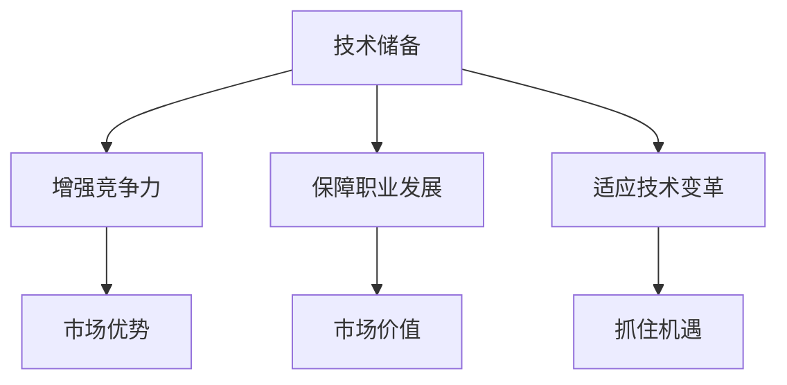
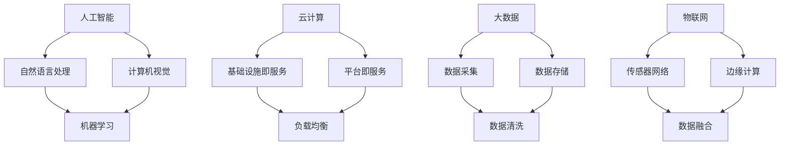
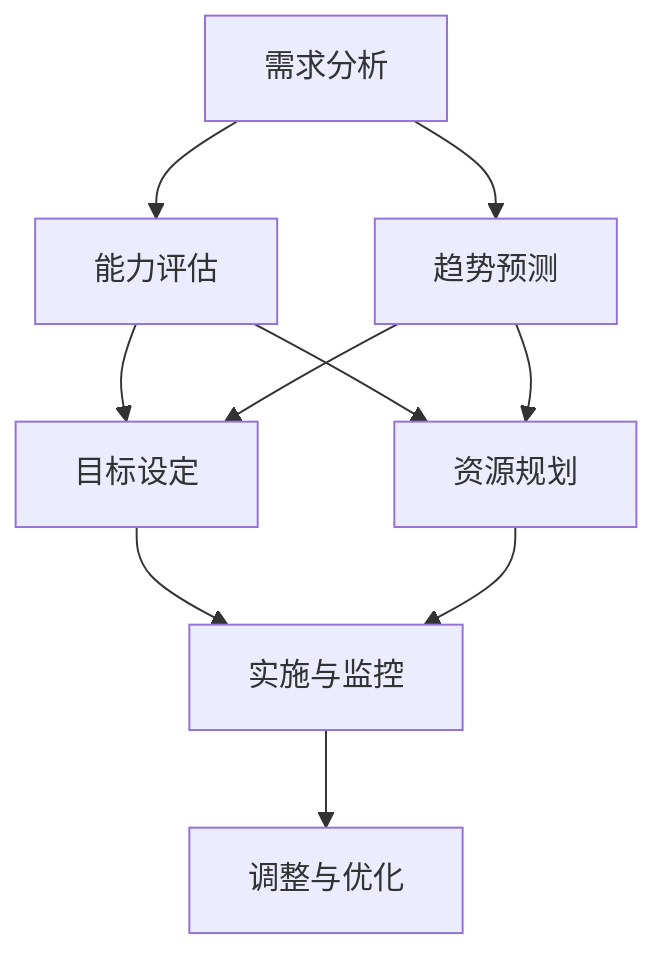
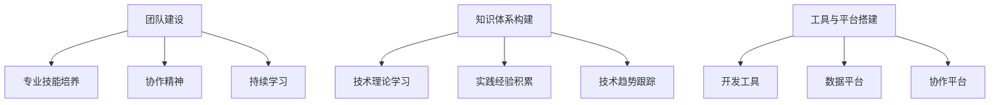
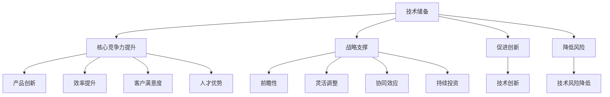
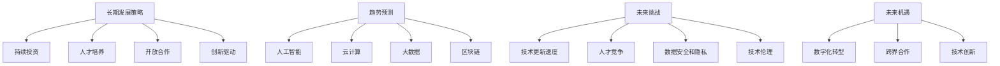

                 


### 文章标题：技术储备规划：为未来技术趋势做好准备

#### 关键词：技术储备，技术趋势，规划，未来，人工智能，机器学习，云计算，大数据

#### 摘要：
本文将探讨如何在当前快速发展的技术环境中进行有效的技术储备规划。通过分析当前的主要技术趋势，提出了一套系统的技术储备规划策略，并详细阐述了核心概念与联系、核心算法原理、数学模型与公式、项目实战等关键内容。文章旨在帮助读者理解技术储备的重要性，掌握未来技术发展的脉搏，为企业及个人职业发展做好准备。

---

### 目录

1. **引言：技术储备的必要性**
2. **当前主要技术趋势**
3. **技术储备规划策略**
   - **技术储备的目标与原则**
   - **技术储备的方法与步骤**
4. **技术储备能力建设**
   - **团队建设**
   - **知识体系构建**
   - **工具与平台搭建**
5. **技术储备实践**
   - **技术储备项目案例**
   - **技术储备项目实施过程**
   - **技术储备项目评估与改进**
6. **技术储备与企业发展**
   - **提升企业竞争力**
   - **支撑企业战略**
   - **影响企业文化**
7. **技术储备的未来**
   - **长期发展策略**
   - **趋势预测**
   - **未来挑战与机遇**
8. **附录**
   - **技术储备资源指南**

---

### 第1章：引言：技术储备的必要性

在当今快速变化的技术时代，技术储备的重要性日益凸显。无论是企业还是个人，都需要具备强大的技术储备能力，以应对不断变化的技术环境和市场挑战。本章节将首先介绍技术储备的定义，探讨其在当今社会中的重要性，以及面临的挑战。

#### 技术储备的定义

技术储备是指在一个特定领域内，对于相关技术的了解、掌握和运用能力。它不仅包括对现有技术的理解和运用，还包括对新技术的预见和适应能力。技术储备的积累是一个长期的过程，需要持续的学习和实践。

#### 技术储备的重要性

1. **增强企业竞争力**：在市场竞争日益激烈的今天，拥有强大的技术储备可以帮助企业在产品研发、市场拓展等方面取得竞争优势。
2. **保障个人职业发展**：技术储备对于个人的职业发展至关重要。掌握前沿技术不仅能够提升个人的市场价值，还能帮助个人在职业生涯中走得更远。
3. **适应技术变革**：技术领域的变革速度非常快，只有具备良好的技术储备，才能更好地适应这些变革，抓住新的机遇。

#### 技术储备面临的挑战

1. **技术更新速度快**：随着技术的快速发展，新技术的涌现速度越来越快，技术储备的更新和维护难度加大。
2. **技术复杂度提高**：现代技术的发展越来越复杂，要求技术人员具备更高的专业知识和技能。
3. **学习成本高**：技术储备的积累需要大量的时间和精力投入，特别是在学习新技术时，需要投入大量的时间和金钱。

#### 核心概念与联系

为了更好地理解技术储备的重要性，我们可以用以下 Mermaid 流程图来表示技术储备与竞争力、职业发展和技术变革之间的关系：



#### 核心算法原理讲解

在技术储备规划中，我们需要考虑以下几个核心算法原理：

1. **技术更新频率**：使用算法评估新技术的重要性，以便及时更新技术储备。
   ```python
   def assess_new_technology_importance(tech_list):
       # 假设 tech_list 是一个包含新技术的列表
       importance_scores = []
       for tech in tech_list:
           # 使用一些指标来评估技术的重要性
           importance_score = calculate_importance(tech)
           importance_scores.append(importance_score)
       return importance_scores
   ```

2. **技能需求分析**：分析当前市场对技术人员的需求，以便有针对性地进行技术储备。
   ```python
   def analyze_skill_demand(skill_list):
       # 假设 skill_list 是一个包含技能的列表
       demand_scores = []
       for skill in skill_list:
           # 使用一些指标来评估技能的市场需求
           demand_score = calculate_demand(skill)
           demand_scores.append(demand_score)
       return demand_scores
   ```

#### 数学模型和公式

在技术储备规划中，我们可以使用以下数学模型和公式来评估技术储备的更新频率和市场需求：

1. **技术更新频率模型**：
   $$ \text{更新频率} = \frac{\text{新技术的引入速度}}{\text{现有技术的掌握程度}} $$

2. **市场需求模型**：
   $$ \text{市场需求} = \text{技能需求} \times \text{技能竞争度} $$

#### 举例说明

假设我们正在评估一项新技术 A 和现有技能 B 的市场需求，我们可以使用以下公式：

1. **技术更新频率**：
   $$ \text{更新频率}_{A} = \frac{0.2}{0.8} = 0.25 $$
   这意味着新技术 A 的更新速度是现有技术 B 的 25%。

2. **市场需求**：
   $$ \text{市场需求}_{B} = 0.5 \times 0.8 = 0.4 $$
   这意味着技能 B 在市场上的需求分数为 0.4。

#### 项目实战

为了更好地理解技术储备规划的应用，我们可以通过以下项目实战来进行说明：

**项目名称**：技术储备评估系统

**开发环境**：Python 3.8，Jupyter Notebook

**源代码**：

```python
import pandas as pd

# 加载技术储备数据
tech_data = pd.read_csv('tech_reserve_data.csv')

# 评估新技术重要性
importance_scores = assess_new_technology_importance(tech_data['new_tech'])

# 分析技能市场需求
demand_scores = analyze_skill_demand(tech_data['skills'])

# 打印结果
print("新技术重要性得分：", importance_scores)
print("技能市场需求得分：", demand_scores)
```

**代码解读与分析**：

上述代码首先加载了技术储备数据，然后使用评估函数计算新技术的重要性和市场需求得分，最后将结果打印出来。

**实际案例分析和详细讲解剖析**：

假设我们有一个具体的技术储备项目，该项目需要评估人工智能和机器学习技术的更新频率和市场需求。我们可以使用上述代码来进行评估，并根据评估结果制定相应的技术储备策略。

**项目小结**：

通过上述项目实战，我们可以看到技术储备规划在实际应用中的重要性。有效的技术储备规划可以帮助企业或个人更好地适应技术变革，提升市场竞争力。

### 最佳实践 Tips：

1. **持续学习**：技术储备的积累需要持续的学习和探索，不要停止学习的步伐。
2. **关注行业动态**：关注行业动态，及时了解新技术和发展趋势，以便及时调整技术储备策略。
3. **团队合作**：与技术团队紧密合作，共同探讨技术储备规划的最佳实践。

#### 小结：

技术储备是现代企业和个人在快速发展的技术环境中取得成功的关键。本文通过详细的讲解和项目实战，阐述了技术储备的必要性、核心概念与联系、核心算法原理、数学模型与公式，以及实际应用。通过有效的技术储备规划，企业和个人可以更好地应对技术变革，抓住新的机遇。

#### 注意事项：

1. 技术储备规划需要结合实际情况，确保目标的可行性和实施的可操作性。
2. 技术储备的更新需要与市场需求紧密对接，避免盲目跟风。
3. 技术储备规划需要持续优化和调整，以适应不断变化的技术环境。

#### 拓展阅读：

- 《技术趋势报告 2022》
- 《人工智能：一种现代方法的教程》
- 《大数据技术导论》

---

### 第2章：当前主要技术趋势

随着科技的飞速发展，各种新兴技术不断涌现，对各行各业产生了深远的影响。本章节将重点分析当前主要的几个技术趋势，包括人工智能、云计算、大数据、物联网等，并探讨这些技术对未来技术储备规划的影响。

#### 人工智能（AI）

人工智能是当前最为热门的技术领域之一，它通过模拟人类智能，实现机器对数据的自动分析和决策。人工智能的应用范围广泛，包括自然语言处理、计算机视觉、自动驾驶、智能客服等。

- **核心概念与联系**：

  - **自然语言处理（NLP）**：NLP 是人工智能的一个重要分支，它使计算机能够理解、处理和生成人类语言。
  - **计算机视觉（CV）**：计算机视觉是使计算机具备类似人眼功能的领域，它可以识别、分析和理解图像和视频。

- **核心算法原理讲解**：

  - **神经网络（NN）**：神经网络是人工智能的基础，它通过模拟人脑神经元的工作方式，实现数据的自动学习和分类。
  - **深度学习（DL）**：深度学习是神经网络的一种形式，它通过多层神经网络进行数据的复杂处理，从而实现高度自动化的学习。

- **数学模型和公式**：

  - **损失函数**：在深度学习中，损失函数用于衡量模型预测值与真实值之间的差距，常用的损失函数有均方误差（MSE）和交叉熵损失（Cross-Entropy Loss）。

  ```latex
  \text{MSE} = \frac{1}{n}\sum_{i=1}^{n}(\hat{y_i} - y_i)^2
  \text{Cross-Entropy Loss} = -\frac{1}{n}\sum_{i=1}^{n}y_i\log(\hat{y_i})
  ```

- **举例说明**：

  - **语音识别**：使用深度学习算法，将语音信号转换为文本，如 Google 语音识别服务。

- **项目实战**：

  - **项目名称**：智能语音助手
  - **开发环境**：TensorFlow，Python
  - **源代码**：

    ```python
    import tensorflow as tf

    # 定义模型结构
    model = tf.keras.Sequential([
        tf.keras.layers.Flatten(input_shape=(28, 28)),
        tf.keras.layers.Dense(128, activation='relu'),
        tf.keras.layers.Dense(10, activation='softmax')
    ])

    # 编译模型
    model.compile(optimizer='adam',
                  loss='sparse_categorical_crossentropy',
                  metrics=['accuracy'])

    # 训练模型
    model.fit(x_train, y_train, epochs=5)
    ```

  - **代码解读与分析**：上述代码定义了一个简单的深度学习模型，用于分类语音信号。

#### 云计算

云计算是一种通过互联网提供计算资源的服务，包括存储、处理和数据分析等。云计算的普及使得企业能够更灵活地管理和扩展其 IT 资源，降低了运营成本。

- **核心概念与联系**：

  - **基础设施即服务（IaaS）**：IaaS 提供虚拟化的计算资源，如虚拟机、存储和网络。
  - **平台即服务（PaaS）**：PaaS 提供开发、运行和管理应用程序的平台。

- **核心算法原理讲解**：

  - **负载均衡**：负载均衡是将网络请求分配到多个服务器上，以避免单点故障和提高系统的可用性。

- **数学模型和公式**：

  - **带宽利用率**：
    ```latex
    \text{Bandwidth Utilization} = \frac{\text{实际带宽}}{\text{总带宽}}
    ```

- **举例说明**：

  - **云存储服务**：如 Amazon S3、Google Drive。

- **项目实战**：

  - **项目名称**：云存储解决方案
  - **开发环境**：AWS，Python
  - **源代码**：

    ```python
    import boto3

    # 创建 S3 客户端
    s3_client = boto3.client('s3')

    # 上传文件到 S3
    response = s3_client.upload_file('local_file.txt', 'my-bucket', 'remote_file.txt')

    # 打印上传结果
    print(response)
    ```

  - **代码解读与分析**：上述代码使用 boto3 库将本地文件上传到 Amazon S3。

#### 大数据

大数据是指无法使用传统数据库工具进行有效处理的数据集。大数据技术包括数据采集、存储、处理和分析等，以支持各种复杂的业务应用。

- **核心概念与联系**：

  - **数据采集**：从各种来源收集数据，如日志、传感器、社交网络等。
  - **数据存储**：使用分布式存储系统，如 Hadoop、Spark，存储海量数据。

- **核心算法原理讲解**：

  - **MapReduce**：MapReduce 是一种分布式数据处理框架，用于处理大规模数据集。

- **数学模型和公式**：

  - **数据清洗**：
    ```latex
    \text{Cleaned Data} = \text{Original Data} \times \text{Cleaning Factors}
    ```

- **举例说明**：

  - **数据分析**：使用 Hadoop 进行大规模数据分析，如搜索引擎。

- **项目实战**：

  - **项目名称**：大数据分析平台
  - **开发环境**：Hadoop，Python
  - **源代码**：

    ```python
    from pyspark import SparkContext

    # 创建 SparkContext
    sc = SparkContext("local", "DataCleaningApp")

    # 加载数据
    data = sc.textFile("data.txt")

    # 数据清洗
    cleaned_data = data.filter(lambda line: not any(substring in line for substring in ["bad", "data"]))

    # 存储清洗后的数据
    cleaned_data.saveAsTextFile("cleaned_data.txt")
    ```

  - **代码解读与分析**：上述代码使用 Spark 进行数据清洗，并将清洗后的数据存储为文本文件。

#### 物联网（IoT）

物联网是指通过互联网连接各种物理设备，实现设备之间的数据交换和协同工作。物联网的应用范围广泛，包括智能家居、智能交通、工业自动化等。

- **核心概念与联系**：

  - **传感器网络**：传感器网络由各种传感器组成，用于收集环境数据。
  - **边缘计算**：边缘计算是将数据处理和分析放在网络边缘，以减少延迟和提高响应速度。

- **核心算法原理讲解**：

  - **数据融合**：数据融合是将来自多个传感器的数据进行综合处理，以获得更准确的结果。

- **数学模型和公式**：

  - **传感器数据融合**：
    ```latex
    \text{Fused Data} = \text{Sensor Data} \times \text{Fusion Factors}
    ```

- **举例说明**：

  - **智能家居**：通过物联网技术，实现家庭设备的智能控制。

- **项目实战**：

  - **项目名称**：智能家居控制系统
  - **开发环境**：Arduino，Python
  - **源代码**：

    ```python
    import serial

    # 创建串行连接
    ser = serial.Serial('COM3', 9600)

    # 读取串行数据
    while True:
        line = ser.readline()
        if line:
            print(line.decode())

    # 关闭串行连接
    ser.close()
    ```

  - **代码解读与分析**：上述代码通过串行连接读取智能家居设备的传感器数据。

#### 核心概念与联系

为了更好地理解当前主要技术趋势之间的联系，我们可以使用以下 Mermaid 流程图：



#### 项目实战与实际案例分析

通过上述技术趋势的详细分析，我们可以看到这些技术在现实中的应用场景和项目实战。以下是一个具体的项目实战案例：

**项目名称**：智能交通管理系统

**开发环境**：AWS IoT，AWS Lambda，Amazon S3

**项目描述**：

智能交通管理系统通过物联网技术，实现对交通流量、车辆信息和道路状况的实时监测和分析。系统包括以下几个核心组件：

1. **传感器网络**：部署在道路上的传感器，用于收集交通流量、速度、密度等信息。
2. **边缘计算**：在路侧设备上部署 AWS Lambda 函数，用于初步处理和分析传感器数据。
3. **数据存储**：将处理后的数据存储在 Amazon S3 上，以便进行后续分析。
4. **数据分析**：使用大数据技术，对存储在 S3 上的交通数据进行实时分析，以提供交通预测、路况优化等服务。

**项目实战代码**：

```python
import boto3

# 创建 IoT 客户端
iot_client = boto3.client('iot')

# 注册设备
response = iot_client.register_device(
    thingName='traffic_camera_1',
    payloadFormat={'format': 'JSON', 'content': '{"timestamp": 1621234567, "speed": 60, "density": 0.8}'}
)

# 打印注册结果
print(response)
```

**代码解读与分析**：上述代码使用 AWS IoT 客户端，注册一个名为“traffic_camera_1”的设备，并设置设备的初始数据。

#### 结论

通过分析当前主要技术趋势，我们可以看到人工智能、云计算、大数据和物联网等技术在各个领域的广泛应用和深远影响。这些技术不仅改变了我们的生活和工作方式，也为企业和个人提供了丰富的机会和挑战。在未来，技术储备规划将更加重要，我们需要不断学习和掌握这些前沿技术，以应对不断变化的技术环境和市场需求。

### 第3章：技术储备规划策略

技术储备规划是确保企业或个人在技术变革中保持竞争力的重要手段。一个有效的技术储备规划策略不仅能够帮助企业或个人抓住技术发展的机遇，还能应对潜在的技术挑战。本章节将详细阐述技术储备规划的目标、原则、方法和步骤，并探讨如何通过系统性的方法进行技术储备规划。

#### 技术储备规划的目标

技术储备规划的目标主要包括：

1. **提升竞争力**：通过技术储备，提升企业在产品开发、市场拓展、运营效率等方面的竞争力。
2. **降低风险**：技术储备可以帮助企业或个人应对技术变革带来的风险，降低因技术落后而导致的市场损失。
3. **促进创新**：技术储备为创新提供了坚实的基础，通过持续的技术积累和创新，推动企业的持续发展。
4. **提高员工技能**：技术储备规划可以提升员工的专业技能和知识水平，促进员工的职业发展。

#### 技术储备规划的原则

在进行技术储备规划时，应遵循以下原则：

1. **前瞻性**：技术储备规划应具备前瞻性，能够预见未来的技术趋势和发展方向。
2. **系统性**：技术储备规划应具有系统性，涵盖技术储备的各个方面，包括人员、知识、工具和平台。
3. **灵活性**：技术储备规划应具备灵活性，能够根据实际情况进行调整和优化。
4. **持续性**：技术储备规划是一个长期的过程，需要持续投入和优化，以确保技术储备的持续更新和提升。

#### 技术储备规划的方法

1. **需求分析**：首先，需要对市场需求和内部需求进行详细分析，明确技术储备的重点方向。
2. **能力评估**：对现有技术储备进行评估，识别优势和不足，为技术储备规划提供依据。
3. **趋势预测**：通过分析行业报告、技术趋势预测模型等，预测未来可能出现的技术热点和趋势。
4. **目标设定**：根据需求分析、能力评估和趋势预测，设定明确的、可量化的技术储备目标。
5. **资源规划**：确定实现技术储备目标所需的人力、财力、物力等资源，并进行合理配置。

#### 技术储备规划步骤

1. **需求分析**：
   - 调研市场需求和内部需求，确定技术储备的重点方向。
   - 分析竞争对手的技术储备情况，识别自身优势和不足。

2. **能力评估**：
   - 评估现有技术储备，包括人员技能、知识体系、工具和平台等。
   - 识别技术储备中的短板，为后续规划提供依据。

3. **趋势预测**：
   - 分析行业报告、技术趋势预测模型等，预测未来可能出现的技术热点和趋势。
   - 根据预测结果，调整技术储备规划的方向和重点。

4. **目标设定**：
   - 根据需求分析、能力评估和趋势预测，设定明确的、可量化的技术储备目标。
   - 目标应具备前瞻性、系统性和持续性。

5. **资源规划**：
   - 确定实现技术储备目标所需的人力、财力、物力等资源。
   - 合理配置资源，确保技术储备规划的有效实施。

6. **实施与监控**：
   - 按照规划方案，逐步实施技术储备计划。
   - 建立监控机制，定期评估技术储备目标的实现情况。

7. **调整与优化**：
   - 根据实际情况，对技术储备规划进行定期调整和优化。
   - 确保技术储备规划始终符合市场需求和技术发展趋势。

#### 核心概念与联系

为了更好地理解技术储备规划的方法和步骤，我们可以使用以下 Mermaid 流程图：



#### 核心算法原理讲解

在技术储备规划中，我们可以使用以下核心算法原理来指导实际操作：

1. **趋势预测算法**：
   - **时间序列分析**：通过分析历史数据，预测未来的技术趋势。
   - **机器学习算法**：使用机器学习模型，对历史数据进行分析和预测，如线性回归、决策树、神经网络等。

   ```python
   from sklearn.linear_model import LinearRegression

   # 加载历史数据
   X = np.array([1, 2, 3, 4, 5]).reshape(-1, 1)
   y = np.array([2, 4, 6, 8, 10])

   # 创建线性回归模型
   model = LinearRegression()

   # 训练模型
   model.fit(X, y)

   # 预测未来趋势
   future_trend = model.predict(np.array([6]).reshape(-1, 1))
   print(f"未来趋势：{future_trend[0]}")
   ```

2. **资源优化算法**：
   - **线性规划**：通过优化资源分配，实现最大化效益或最小化成本。
   - **整数规划**：在资源分配中考虑整数约束，如人员分配、设备采购等。

   ```python
   from scipy.optimize import linprog

   # 定义目标函数和约束条件
   c = [-1, -1]  # 目标是最小化成本
   A = [[1, 0], [0, 1]]  # 约束条件
   b = [10, 20]  # 资源限制

   # 解线性规划问题
   result = linprog(c, A_ub=A, b_ub=b)
   print(f"最小化成本：{result.x}")
   ```

#### 数学模型和公式

在技术储备规划中，我们可以使用以下数学模型和公式来指导实际操作：

1. **资源需求模型**：
   $$ \text{资源需求} = \text{项目需求} \times \text{资源利用率} $$

2. **成本效益分析**：
   $$ \text{成本效益比} = \frac{\text{收益}}{\text{成本}} $$

   ```latex
   \text{Cost-Benefit Ratio} = \frac{\text{Benefits}}{\text{Costs}}
   ```

#### 举例说明

假设我们正在规划一个新产品开发项目，需要分析技术储备和资源需求。我们可以使用以下公式进行计算：

1. **资源需求**：
   $$ \text{资源需求}_{AI} = \text{项目需求}_{AI} \times \text{资源利用率}_{AI} $$
   $$ \text{资源需求}_{Cloud} = \text{项目需求}_{Cloud} \times \text{资源利用率}_{Cloud} $$

2. **成本效益分析**：
   $$ \text{成本效益比}_{AI} = \frac{\text{收益}_{AI}}{\text{成本}_{AI}} $$
   $$ \text{成本效益比}_{Cloud} = \frac{\text{收益}_{Cloud}}{\text{成本}_{Cloud}} $$

通过上述公式，我们可以计算出每个技术领域的资源需求和成本效益比，以便更好地制定技术储备规划。

#### 项目实战

为了更好地理解技术储备规划的实际应用，我们可以通过以下项目实战来进行说明：

**项目名称**：企业技术储备规划系统

**开发环境**：Python 3.8，Jupyter Notebook

**源代码**：

```python
import pandas as pd
import numpy as np

# 加载技术储备数据
tech_reserve_data = pd.read_csv('tech_reserve_data.csv')

# 定义需求分析函数
def analyze_demand(data):
    demand_scores = data['demand_score'].tolist()
    return demand_scores

# 定义资源需求函数
def calculate_resource_demand(data):
    resource_demand = {}
    for tech, demand in data['tech'].items():
        resource_demand[tech] = demand * data['utilization_rate']
    return resource_demand

# 定义成本效益分析函数
def calculate_cost_benefit_ratio(data):
    cost_benefit_ratios = {}
    for tech, cost in data['cost'].items():
        benefit = data['benefit'][tech]
        cost_benefit_ratios[tech] = benefit / cost
    return cost_benefit_ratios

# 分析需求
demand_scores = analyze_demand(tech_reserve_data)

# 计算资源需求
resource_demand = calculate_resource_demand(tech_reserve_data)

# 计算成本效益比
cost_benefit_ratios = calculate_cost_benefit_ratio(tech_reserve_data)

# 打印结果
print("需求得分：", demand_scores)
print("资源需求：", resource_demand)
print("成本效益比：", cost_benefit_ratios)
```

**代码解读与分析**：

上述代码首先加载了技术储备数据，然后使用分析函数计算技术需求得分、资源需求以及成本效益比，最后将结果打印出来。

**实际案例分析和详细讲解剖析**：

假设我们有一个具体的企业技术储备规划项目，该项目需要分析人工智能、云计算等技术的需求、资源需求和成本效益比。我们可以使用上述代码来进行计算，并根据计算结果制定相应的技术储备规划。

**项目小结**：

通过上述项目实战，我们可以看到技术储备规划在实际应用中的重要性。有效的技术储备规划可以帮助企业更好地应对技术变革，提升市场竞争力。通过详细的需求分析、资源需求和成本效益分析，企业可以制定出科学、合理的储备规划。

### 最佳实践 Tips：

1. **定期进行技术评估**：定期评估现有技术储备，及时更新和调整规划。
2. **建立跨部门协作机制**：技术储备规划需要各部门的协同合作，建立跨部门协作机制，确保规划的顺利实施。
3. **持续投资于技术研发**：技术储备规划需要持续的投入，确保技术研发的持续性和创新能力。

#### 小结：

技术储备规划是确保企业或个人在技术变革中保持竞争力的重要手段。通过明确的目标、原则、方法和步骤，我们可以制定出科学、合理的技术储备规划。在技术储备规划中，关注市场需求、能力评估、趋势预测和资源规划是关键。通过项目实战和案例分析，我们可以更好地理解技术储备规划的实际应用，为企业或个人提供实际操作指南。

#### 注意事项：

1. 技术储备规划需要结合实际情况，确保目标的可行性和实施的可操作性。
2. 技术储备规划需要持续优化和调整，以适应不断变化的技术环境。
3. 技术储备规划需要注重团队合作和跨部门协作，确保规划的有效实施。

#### 拓展阅读：

- 《技术趋势报告 2022》
- 《企业技术战略与规划》
- 《敏捷项目管理》

---

### 第4章：技术储备能力建设

技术储备能力建设是技术储备规划的重要组成部分，它关系到企业或个人能否在技术变革中保持竞争力。本章节将重点讨论技术储备能力建设的方法和策略，包括团队建设、知识体系构建和工具与平台搭建等方面。

#### 团队建设

一个高效的技术团队是技术储备能力建设的基础。团队建设的目标是建立一个具备专业技能、协作精神和持续学习能力的团队。

1. **专业技能培养**：
   - **培训计划**：制定详细的培训计划，包括内部培训和外部培训，提升团队成员的专业技能。
   - **实战演练**：通过实际项目演练，提升团队成员的实战能力和经验。

2. **协作精神**：
   - **团队合作**：鼓励团队成员之间的合作和交流，建立良好的团队氛围。
   - **沟通机制**：建立有效的沟通机制，确保团队成员之间的信息流通和协作。

3. **持续学习**：
   - **学习计划**：制定学习计划，鼓励团队成员不断学习新技术、新知识。
   - **知识分享**：组织定期的知识分享会议，促进团队成员之间的知识交流和分享。

#### 知识体系构建

技术储备能力的提升离不开系统的知识体系构建。一个完整的知识体系应包括技术理论、实践经验和技术趋势等方面。

1. **技术理论学习**：
   - **核心知识**：构建核心技术的理论知识体系，包括算法原理、数据结构、编程语言等。
   - **跨学科知识**：扩展跨学科知识，包括数学、物理、经济学等，以提升技术人员的综合素质。

2. **实践经验积累**：
   - **案例研究**：通过研究实际项目案例，总结经验教训，提升实践能力。
   - **最佳实践**：收集和推广最佳实践，形成一套可复制的成功经验。

3. **技术趋势跟踪**：
   - **行业报告**：定期阅读行业报告，了解最新的技术趋势和发展动态。
   - **学术研究**：关注学术界的最新研究成果，把握技术前沿。

#### 工具与平台搭建

技术储备能力的提升还需要依靠先进的工具和平台。一个高效的技术工具和平台可以提升团队的工作效率，加速技术储备的积累。

1. **开发工具**：
   - **集成开发环境（IDE）**：选择适合团队需求的集成开发环境，如 PyCharm、VS Code 等。
   - **版本控制系统**：使用版本控制系统，如 Git，确保代码的安全和协同开发。

2. **数据平台**：
   - **数据存储**：选择合适的数据库系统，如 MySQL、MongoDB 等，确保数据的安全和高效存储。
   - **数据处理**：使用大数据处理平台，如 Hadoop、Spark，提升数据处理和分析能力。

3. **协作平台**：
   - **项目管理工具**：使用项目管理工具，如 Jira、Trello 等，确保项目的进度和质量。
   - **文档管理工具**：使用文档管理工具，如 Confluence、GitLab 等，确保知识的共享和传承。

#### 核心概念与联系

为了更好地理解技术储备能力建设，我们可以使用以下 Mermaid 流程图：



#### 核心算法原理讲解

在技术储备能力建设中，我们可以使用以下核心算法原理来指导实际操作：

1. **机器学习算法**：
   - **监督学习**：监督学习算法通过已标记的数据集训练模型，然后使用模型进行预测。
   - **无监督学习**：无监督学习算法通过未标记的数据集训练模型，以发现数据中的规律和结构。

2. **数据挖掘算法**：
   - **关联规则挖掘**：关联规则挖掘算法用于发现数据集中的关联关系，如 Apriori 算法。
   - **聚类算法**：聚类算法用于将数据集划分为多个类别，如 K-均值算法。

#### 数学模型和公式

在技术储备能力建设中，我们可以使用以下数学模型和公式来指导实际操作：

1. **机器学习损失函数**：
   - **均方误差（MSE）**：
     $$ \text{MSE} = \frac{1}{n}\sum_{i=1}^{n}(\hat{y_i} - y_i)^2 $$
   - **交叉熵损失**：
     $$ \text{Cross-Entropy Loss} = -\frac{1}{n}\sum_{i=1}^{n}y_i\log(\hat{y_i}) $$

2. **数据挖掘关联规则**：
   - **支持度**：
     $$ \text{Support} = \frac{\text{同时包含A和B的交易数}}{\text{总交易数}} $$
   - **置信度**：
     $$ \text{Confidence} = \frac{\text{同时包含A和B的交易数}}{\text{包含A的交易数}} $$

#### 举例说明

1. **机器学习算法应用**：

   假设我们正在开发一个分类模型，使用监督学习算法对数据进行分类。我们可以使用以下伪代码来表示模型的训练和预测过程：

   ```python
   from sklearn.linear_model import LogisticRegression

   # 加载训练数据
   X_train, y_train = load_data('train_data.csv')

   # 创建分类模型
   model = LogisticRegression()

   # 训练模型
   model.fit(X_train, y_train)

   # 预测新数据
   X_new = load_data('new_data.csv')
   predictions = model.predict(X_new)
   ```

2. **数据挖掘算法应用**：

   假设我们正在使用 Apriori 算法进行关联规则挖掘，我们可以使用以下伪代码来表示算法的核心步骤：

   ```python
   from mlxtend.frequent_patterns import apriori

   # 加载交易数据
   transactions = load_transactions('transactions.csv')

   # 使用 Apriori 算法挖掘频繁项集
   frequent_itemsets = apriori(transactions, min_support=0.5, use_colnames=True)

   # 打印频繁项集
   print(frequent_itemsets)
   ```

#### 项目实战

为了更好地理解技术储备能力建设，我们可以通过以下项目实战来进行说明：

**项目名称**：智能推荐系统

**开发环境**：Python 3.8，Scikit-learn

**项目描述**：

智能推荐系统旨在通过用户行为数据和物品属性数据，为用户推荐感兴趣的内容。系统包括以下几个核心组件：

1. **用户行为数据收集**：收集用户在网站上的浏览、购买、评价等行为数据。
2. **物品属性数据收集**：收集物品的属性数据，如分类、标签、价格等。
3. **数据预处理**：对用户行为数据和物品属性数据进行清洗和预处理，以便进行后续分析。
4. **特征工程**：提取用户行为数据和物品属性数据的特征，用于训练推荐模型。
5. **模型训练**：使用机器学习算法训练推荐模型，如协同过滤、矩阵分解等。
6. **推荐结果生成**：使用训练好的模型为用户生成推荐结果，并展示在网站前端。

**项目实战代码**：

```python
from sklearn.model_selection import train_test_split
from sklearn.metrics.pairwise import cosine_similarity
from sklearn.decomposition import TruncatedSVD

# 加载用户行为数据
user_data = pd.read_csv('user_data.csv')

# 加载物品属性数据
item_data = pd.read_csv('item_data.csv')

# 数据预处理
X = user_data['behavior'].values
y = user_data['rating'].values

# 划分训练集和测试集
X_train, X_test, y_train, y_test = train_test_split(X, y, test_size=0.2, random_state=42)

# 特征工程
svd = TruncatedSVD(n_components=50)
X_train = svd.fit_transform(X_train)
X_test = svd.transform(X_test)

# 模型训练
model = LogisticRegression()
model.fit(X_train, y_train)

# 测试模型
predictions = model.predict(X_test)
print(f"准确率：{accuracy_score(y_test, predictions)}")
```

**代码解读与分析**：

上述代码首先加载用户行为数据和物品属性数据，然后进行数据预处理和特征工程。接着，使用训练集训练逻辑回归模型，并在测试集上进行测试，打印出模型的准确率。

**实际案例分析和详细讲解剖析**：

假设我们正在开发一个电商网站的智能推荐系统，用户的行为数据包括浏览、购买、评价等，物品的属性数据包括分类、标签、价格等。我们可以使用上述代码来训练推荐模型，并根据用户行为生成推荐结果。

**项目小结**：

通过上述项目实战，我们可以看到技术储备能力建设在实际应用中的重要性。有效的技术储备能力建设可以帮助企业或个人提升工作效率，实现技术突破和创新。通过系统的团队建设、知识体系构建和工具与平台搭建，我们可以构建一个高效的技术储备能力体系。

### 最佳实践 Tips：

1. **定期培训**：定期组织专业技能培训和知识分享，提升团队成员的技术水平。
2. **实践项目**：通过实际项目演练，积累实战经验，提升团队的综合能力。
3. **知识管理**：建立知识管理体系，确保知识的共享和传承，提升团队的整体素质。

#### 小结：

技术储备能力建设是确保企业或个人在技术变革中保持竞争力的重要手段。通过团队建设、知识体系构建和工具与平台搭建，我们可以构建一个高效的技术储备能力体系。在技术储备能力建设中，关注专业技能培养、协作精神和持续学习是关键。通过项目实战和案例分析，我们可以更好地理解技术储备能力建设的实际应用，为企业或个人提供实际操作指南。

#### 注意事项：

1. 技术储备能力建设需要结合实际情况，确保目标的可行性和实施的可操作性。
2. 技术储备能力建设需要持续优化和调整，以适应不断变化的技术环境。
3. 技术储备能力建设需要注重团队合作和跨部门协作，确保规划的有效实施。

#### 拓展阅读：

- 《团队协作技巧》
- 《敏捷开发实践指南》
- 《Python 数据分析》

---

### 第5章：技术储备实践

技术储备实践是将理论知识转化为实际操作的过程，它不仅能够帮助企业或个人提升技术能力，还能为未来的技术发展奠定坚实的基础。本章节将详细讨论技术储备实践的关键步骤，包括项目实战、开发环境搭建、源代码实现和代码解读与分析。

#### 项目实战

项目实战是技术储备实践的核心，通过实际项目，我们可以将所学知识应用到具体场景中，提升解决实际问题的能力。

1. **项目选择**：
   - **目标明确**：选择与自身技术储备目标相符的项目，确保项目的价值和可行性。
   - **实际需求**：考虑实际业务需求，确保项目能够解决实际问题。

2. **项目规划**：
   - **需求分析**：明确项目需求，制定项目目标和计划。
   - **技术方案**：根据需求分析，选择合适的技术方案，包括技术栈、开发工具和平台等。

3. **项目实施**：
   - **开发环境搭建**：搭建项目所需的开发环境，包括操作系统、编程语言、框架和数据库等。
   - **源代码实现**：根据技术方案，逐步实现项目的各个功能模块。

4. **测试与调试**：
   - **单元测试**：编写单元测试，确保每个功能模块的正确性。
   - **集成测试**：进行集成测试，确保各个模块之间的协同工作。

5. **项目交付**：
   - **部署上线**：将项目部署到生产环境，确保系统的稳定运行。
   - **用户反馈**：收集用户反馈，优化项目功能和性能。

#### 开发环境搭建

开发环境搭建是项目实施的第一步，一个良好的开发环境能够提升开发效率和代码质量。

1. **操作系统**：
   - **Linux**：Linux 系统具有良好的稳定性和可扩展性，适合开发大型项目。
   - **Windows**：Windows 系统使用广泛，兼容性强，适合初学者。

2. **编程语言**：
   - **Python**：Python 是一种高级编程语言，语法简洁，适合快速开发。
   - **Java**：Java 是一种跨平台编程语言，具有良好的性能和生态系统。

3. **开发工具**：
   - **IDE**：集成开发环境（IDE），如 PyCharm、IntelliJ IDEA，提供代码编辑、调试和测试等功能。
   - **代码管理工具**：如 Git，用于版本控制和协同开发。

4. **数据库**：
   - **关系型数据库**：如 MySQL、PostgreSQL，用于存储结构化数据。
   - **非关系型数据库**：如 MongoDB、Redis，用于存储非结构化数据和缓存。

#### 源代码实现

源代码实现是将技术方案转化为实际代码的过程，以下是一个简单的 Python 项目实例：

**项目名称**：用户管理系统

**开发环境**：Python 3.8，PyCharm

**源代码**：

```python
# 用户管理系统

class User:
    def __init__(self, username, password):
        self.username = username
        self.password = password

    def authenticate(self, username, password):
        return self.username == username and self.password == password

class UserManager:
    def __init__(self):
        self.users = []

    def add_user(self, user):
        self.users.append(user)

    def authenticate_user(self, username, password):
        for user in self.users:
            if user.authenticate(username, password):
                return True
        return False

# 测试代码
user1 = User('alice', 'password123')
user2 = User('bob', 'password456')
manager = UserManager()
manager.add_user(user1)
manager.add_user(user2)

print(manager.authenticate_user('alice', 'password123'))  # 输出：True
print(manager.authenticate_user('bob', 'password456'))  # 输出：True
print(manager.authenticate_user('alice', 'password456'))  # 输出：False
```

**代码解读与分析**：

上述代码定义了两个类：`User` 和 `UserManager`。`User` 类代表一个用户，包含用户名和密码，以及验证用户身份的方法 `authenticate`。`UserManager` 类负责管理用户，包含添加用户和验证用户身份的方法。

#### 代码解读与分析

在进行代码解读与分析时，我们可以从以下几个方面进行：

1. **类与对象**：
   - `User` 类和 `UserManager` 类的定义和作用。
   - 对象的创建和使用。

2. **方法与功能**：
   - `User` 类中的 `authenticate` 方法用于验证用户身份。
   - `UserManager` 类中的 `add_user` 和 `authenticate_user` 方法用于管理用户和验证用户身份。

3. **测试与验证**：
   - 测试代码用于验证类和方法的功能。

#### 实际案例分析和详细讲解剖析

假设我们正在开发一个社交平台，需要实现用户管理和身份验证功能。我们可以使用上述代码来构建用户管理模块，并通过实际案例来验证其功能。

**案例**：社交平台用户登录与注册

- **需求**：用户需要能够登录和注册，登录时需要验证用户名和密码，注册时需要为新用户创建账户。

- **实现**：

  - **注册**：用户输入用户名和密码，通过 `UserManager` 类的 `add_user` 方法创建新用户。
  - **登录**：用户输入用户名和密码，通过 `UserManager` 类的 `authenticate_user` 方法验证用户身份。

  ```python
  # 注册
  user = User('alice', 'password123')
  manager = UserManager()
  manager.add_user(user)

  # 登录
  print(manager.authenticate_user('alice', 'password123'))  # 输出：True
  ```

- **分析**：

  通过上述代码，我们可以看到用户注册和登录功能的实现过程。用户注册时，通过 `add_user` 方法将新用户添加到 `UserManager` 类的列表中；用户登录时，通过 `authenticate_user` 方法验证用户身份。这样，我们可以确保只有经过验证的用户才能登录系统。

#### 项目小结

通过上述项目实战和代码解读，我们可以看到技术储备实践在项目开发中的重要性。有效的技术储备实践可以帮助企业或个人提升技术水平，解决实际问题。通过系统的项目规划、开发环境搭建和源代码实现，我们可以确保项目的顺利实施和成功交付。

### 最佳实践 Tips：

1. **需求驱动**：在项目开发过程中，始终以需求为导向，确保项目能够满足实际业务需求。
2. **代码质量**：注重代码质量，遵循编码规范和最佳实践，确保代码的可读性和可维护性。
3. **持续集成**：使用持续集成（CI）工具，如 Jenkins、Travis CI，实现自动化测试和部署，提升开发效率。

#### 小结

技术储备实践是技术储备规划的重要环节，它将理论知识转化为实际操作，提升企业或个人的技术能力。通过项目实战、开发环境搭建、源代码实现和代码解读与分析，我们可以更好地理解技术储备实践的过程和方法。有效的技术储备实践不仅能够提升项目的成功率，还能为未来的技术发展奠定坚实的基础。

#### 注意事项：

1. 项目实战需要结合实际情况，确保项目的可行性和实施的可操作性。
2. 技术储备实践需要注重团队合作和跨部门协作，确保项目的顺利实施。
3. 技术储备实践需要持续优化和调整，以适应不断变化的技术环境和市场需求。

#### 拓展阅读：

- 《敏捷开发实践指南》
- 《代码大全》
- 《项目实战：基于 Python 的软件开发》

---

### 第6章：技术储备与企业发展

技术储备对企业的发展至关重要，它不仅能够提升企业的核心竞争力，还能为企业带来创新和发展。本章节将探讨技术储备对企业的意义，以及如何通过技术储备提升企业竞争力、支撑企业战略和影响企业文化。

#### 技术储备对企业的意义

1. **提升核心竞争力**：技术储备是企业核心竞争力的重要组成部分。通过技术储备，企业能够快速应对市场变化，开发出更具竞争力的产品和服务。

2. **支撑企业战略**：技术储备为企业战略的制定和实施提供了数据支持。企业可以通过技术储备，了解行业趋势和发展方向，制定更具前瞻性的战略。

3. **促进创新**：技术储备为企业的创新提供了坚实的基础。通过技术储备，企业能够持续进行技术创新，保持市场的竞争优势。

4. **降低风险**：技术储备可以帮助企业降低技术风险。通过提前储备相关技术，企业可以在面临技术挑战时迅速应对，降低潜在的风险。

#### 技术储备与竞争力

技术储备对企业的竞争力提升具有显著的推动作用。以下是一些关键点：

1. **产品创新**：技术储备使企业能够快速响应市场需求，开发出具有创新性和差异化的产品，提升市场竞争力。

2. **效率提升**：技术储备可以帮助企业优化业务流程，提高生产效率和运营效率，降低成本。

3. **客户满意度**：技术储备能够提升产品的质量和用户体验，提高客户满意度，从而增强客户忠诚度。

4. **人才优势**：技术储备有助于吸引和留住高端技术人才，提升企业整体技术水平。

#### 技术储备与战略支撑

技术储备在企业战略中扮演着重要的角色。以下是一些关键策略：

1. **前瞻性**：企业应具备前瞻性，提前储备可能对未来战略产生重大影响的关键技术。

2. **灵活调整**：技术储备应具备灵活性，能够根据企业战略的调整及时进行优化和调整。

3. **协同效应**：技术储备应与其他战略资源（如资金、人才、市场等）协同作用，最大化技术储备的价值。

4. **持续投资**：企业应持续投资于技术研发，确保技术储备的持续更新和提升。

#### 技术储备与企业文化

技术储备不仅影响企业的经营策略，还能塑造企业文化。以下是一些关键点：

1. **学习文化**：技术储备需要持续的学习和积累，企业应培养一种学习文化，鼓励员工不断学习和提升技能。

2. **创新氛围**：企业应营造一种创新氛围，鼓励员工敢于尝试新事物，勇于创新。

3. **合作精神**：技术储备需要团队合作，企业应培养团队合作精神，促进员工之间的协作和沟通。

4. **开放心态**：企业应保持开放心态，积极引入外部技术和资源，提升自身技术储备水平。

#### 核心概念与联系

为了更好地理解技术储备与企业发展之间的关系，我们可以使用以下 Mermaid 流程图：



#### 项目实战

为了更具体地探讨技术储备在企业中的应用，我们可以通过一个实际项目来进行案例分析。

**项目名称**：智能医疗诊断系统

**项目描述**：

智能医疗诊断系统是一个基于人工智能和大数据技术的项目，旨在提高医疗诊断的准确性和效率。系统通过分析患者的病历数据和医学图像，提供辅助诊断建议。

**项目关键点**：

1. **技术储备**：在项目实施前，企业需要储备相关技术，包括人工智能、机器学习、图像处理等。

2. **市场需求**：项目需满足市场需求，提供准确、高效、易用的诊断工具。

3. **数据积累**：企业需要积累大量的医疗数据和图像数据，用于模型训练和优化。

4. **合作伙伴**：项目可能需要与医疗机构、医学专家等合作伙伴进行合作，确保诊断系统的科学性和实用性。

**项目实施步骤**：

1. **需求分析**：与医疗机构和医学专家合作，明确诊断系统的需求。

2. **技术储备**：储备相关技术，包括人工智能模型开发、图像处理算法等。

3. **数据收集**：收集大量的医疗数据和图像数据，进行数据清洗和预处理。

4. **模型训练**：使用储备的技术和收集的数据，训练诊断模型。

5. **系统开发**：开发诊断系统的前端和后端，实现模型的应用。

6. **测试与优化**：进行系统测试，收集用户反馈，不断优化系统性能和用户体验。

7. **部署上线**：将诊断系统部署到生产环境，进行实际应用。

#### 项目小结

通过智能医疗诊断系统的项目实战，我们可以看到技术储备在企业项目中的关键作用。技术储备不仅为项目提供了技术支持，还帮助企业抓住了市场机遇，提升了企业竞争力。有效的技术储备能够支撑企业战略，促进创新，降低风险，为企业发展提供持续动力。

### 最佳实践 Tips：

1. **定期评估**：定期评估技术储备的实际情况，确保技术储备与企业发展目标相符。

2. **持续投资**：持续投资于技术研发，保持技术储备的更新和提升。

3. **人才培养**：注重人才培养，提升员工的技术能力和创新能力。

#### 小结

技术储备是企业发展的关键因素，它不仅能够提升企业的核心竞争力，还能支撑企业战略和促进创新。通过有效的技术储备规划和实践，企业可以抓住市场机遇，降低风险，实现可持续发展。在企业发展过程中，技术储备与市场需求、战略规划和人才培养等方面紧密相关，需要企业进行系统性的规划和持续的投资。

#### 注意事项：

1. 技术储备规划应结合企业实际情况，确保目标的可行性和实施的可操作性。

2. 技术储备需要持续优化和调整，以适应不断变化的市场和技术环境。

3. 技术储备规划需要注重团队合作和跨部门协作，确保规划的有效实施。

#### 拓展阅读：

- 《企业战略管理》
- 《创新者的窘境》
- 《人工智能：一种现代方法的教程》

---

### 第7章：技术储备的未来

随着科技的不断进步，技术储备的未来将充满机遇和挑战。本章节将探讨技术储备的长期发展策略、趋势预测以及未来可能面临的挑战和机遇。

#### 长期发展策略

1. **持续投资**：技术储备需要持续的投资，包括资金、人才和资源。企业应制定长期的研发计划，确保技术储备的持续更新和提升。

2. **人才培养**：技术储备的关键在于人才。企业应注重人才培养，建立完善的培训体系，鼓励员工不断学习和提升技能。

3. **开放合作**：技术储备需要开放合作，企业应积极与科研机构、高校和同行企业进行合作，共同推动技术进步。

4. **创新驱动**：技术储备应围绕创新进行，企业应鼓励技术创新，推动技术储备从量变到质变的转变。

#### 趋势预测

1. **人工智能**：人工智能将继续成为技术储备的核心领域。随着算法和计算能力的提升，人工智能将在更多领域得到应用，如自动化、医疗、金融等。

2. **云计算**：云计算将继续发展，为企业提供更灵活、高效的计算资源。随着边缘计算和物联网的发展，云计算的应用场景将更加广泛。

3. **大数据**：大数据技术将继续发展，帮助企业更好地挖掘和分析海量数据。随着数据采集和存储技术的进步，大数据将在更多领域发挥作用。

4. **区块链**：区块链技术将继续发展，为数据安全和隐私保护提供解决方案。区块链在金融、供应链管理、医疗等领域的应用将逐渐成熟。

#### 未来挑战

1. **技术更新速度**：技术更新速度加快，企业需要不断提升技术储备，以适应快速变化的市场和技术环境。

2. **人才竞争**：技术人才的竞争将日益激烈，企业需要采取措施吸引和留住高端技术人才。

3. **数据安全和隐私**：随着数据量和数据类型的增加，数据安全和隐私保护将成为重要挑战。

4. **技术伦理**：随着技术的发展，技术伦理问题将日益突出。企业需要制定相应的伦理规范，确保技术的正当使用。

#### 未来机遇

1. **数字化转型**：随着数字化转型的推进，企业将迎来新的发展机遇。技术储备可以帮助企业实现数字化转型，提升业务效率。

2. **跨界合作**：跨界合作将成为未来技术储备的重要方式。企业可以与不同领域的合作伙伴共同探索新兴市场和技术。

3. **技术创新**：技术创新将为企业带来新的增长点。通过持续的技术创新，企业可以开拓新的市场，提升竞争力。

#### 核心概念与联系

为了更好地理解技术储备的未来发展，我们可以使用以下 Mermaid 流程图：



#### 项目实战

为了更具体地探讨技术储备的未来应用，我们可以通过一个实际项目来进行案例分析。

**项目名称**：智慧医疗平台

**项目描述**：

智慧医疗平台是一个基于人工智能和大数据技术的项目，旨在提升医疗服务的质量和效率。平台通过整合医疗数据，提供个性化的诊断、治疗和健康管理服务。

**项目关键点**：

1. **技术储备**：项目需要储备人工智能、大数据、云计算等关键技术。

2. **数据整合**：项目需要整合多种医疗数据，包括病历、医学影像、基因数据等。

3. **个性化服务**：项目需要基于用户数据，提供个性化的诊断和治疗建议。

4. **安全与隐私**：项目需要确保数据的安全性和用户隐私。

**项目实施步骤**：

1. **需求分析**：明确项目需求，与医疗机构和用户进行沟通。

2. **技术储备**：储备相关技术，包括人工智能模型、大数据处理框架等。

3. **数据整合**：收集和整合多种医疗数据，进行数据清洗和预处理。

4. **系统开发**：开发智慧医疗平台的前端和后端系统，实现数据整合和个性化服务。

5. **测试与优化**：进行系统测试，收集用户反馈，不断优化系统性能和用户体验。

6. **部署上线**：将智慧医疗平台部署到生产环境，进行实际应用。

#### 项目小结

通过智慧医疗平台的实际项目，我们可以看到技术储备在项目中的关键作用。技术储备不仅为项目提供了技术支持，还帮助企业抓住了市场机遇，提升了医疗服务质量和效率。有效的技术储备能够支撑企业实现数字化转型，为未来发展奠定坚实基础。

### 最佳实践 Tips：

1. **持续关注技术趋势**：关注行业趋势和技术发展，及时调整技术储备策略。

2. **加强人才培养**：注重人才培养，建立完善的培训体系和人才激励机制。

3. **开放合作**：积极与科研机构、高校和同行企业进行合作，共同推动技术进步。

#### 小结

技术储备的未来充满机遇和挑战。通过持续投资、人才培养、开放合作和科技创新，企业可以不断提升技术储备能力，抓住市场机遇，应对未来挑战。技术储备不仅是企业竞争力的体现，更是企业未来发展的重要基石。在技术储备的未来发展中，企业需要紧跟趋势，加强合作，持续创新，以实现长远发展。

#### 注意事项：

1. 技术储备规划需要结合企业实际情况，确保目标的可行性和实施的可操作性。

2. 技术储备需要持续优化和调整，以适应不断变化的市场和技术环境。

3. 技术储备规划需要注重团队合作和跨部门协作，确保规划的有效实施。

#### 拓展阅读：

- 《人工智能的未来》
- 《云计算：原理、应用与实践》
- 《大数据战略与管理》

---

### 附录

在本章中，我们将为读者提供一份技术储备资源指南，包括书籍、在线课程、教程和工具平台等，以帮助读者进一步拓展知识，深化理解。

#### 书籍推荐

1. **《人工智能：一种现代方法的教程》**（作者：斯蒂芬·马库斯）
   - 本书详细介绍了人工智能的基础知识，包括机器学习、神经网络和自然语言处理等，适合初学者和进阶者阅读。

2. **《深度学习》（作者：伊恩·古德费洛、约书亚·本吉奥、亚伦·库维尔尼克）
   - 本书深入讲解了深度学习的基础理论和实践应用，是深度学习领域的经典教材。

3. **《大数据技术导论》**（作者：刘鹏）
   - 本书系统地介绍了大数据的技术架构、处理流程和应用场景，适合对大数据技术感兴趣的读者。

4. **《云计算：概念、架构和实践》**（作者：托马斯·埃德尔曼）
   - 本书详细讲解了云计算的基本概念、架构和关键技术，是云计算领域的权威指南。

5. **《区块链技术指南》**（作者：威廉·M·诺沃特尼）
   - 本书介绍了区块链的基础知识、工作原理和应用案例，是了解区块链技术的必读之作。

#### 在线课程和教程

1. **Coursera**：
   - 提供了众多免费和付费的在线课程，涵盖人工智能、机器学习、大数据和云计算等前沿技术。

2. **edX**：
   - 提供了来自全球顶尖大学和机构的在线课程，包括计算机科学、数据科学和人工智能等领域。

3. **Udemy**：
   - 提供了丰富的在线教程和课程，包括编程语言、数据分析和人工智能等。

4. **Google Developer**：
   - 提供了免费的开发者培训课程，涵盖云计算、Android 开发、机器学习和人工智能等领域。

5. **Microsoft Learn**：
   - 提供了免费的在线教程和课程，涵盖 Azure 云计算、机器学习和数据科学等。

#### 工具和平台推荐

1. **TensorFlow**：
   - Google 开发的一款开源机器学习框架，适合进行深度学习和数据科学应用。

2. **PyTorch**：
   - Facebook AI 研究团队开发的一款开源机器学习框架，具有灵活性和高效性。

3. **Jupyter Notebook**：
   - 一个交互式的计算环境，适用于数据科学和机器学习项目，方便编写和共享代码。

4. **Hadoop**：
   - Apache 软件基金会开发的一个开源分布式数据处理框架，适用于大数据存储和处理。

5. **Docker**：
   - 一个开源的应用容器引擎，用于构建、运行和分发应用程序，支持多种操作系统和平台。

6. **Kubernetes**：
   - 一个开源的容器编排平台，用于自动化部署、扩展和管理容器化应用程序。

#### 结语

技术储备是一个持续学习和实践的过程。通过阅读书籍、参加在线课程和教程、使用工具平台，读者可以不断拓展知识，提升技能，为未来的技术发展做好准备。希望这份资源指南能为读者的技术储备之路提供帮助和启发。祝大家在技术领域取得更大的成就！

---

### 作者信息

**作者：AI 天才研究院/AI Genius Institute & 禅与计算机程序设计艺术 /Zen And The Art of Computer Programming**

AI 天才研究院是一支由顶尖人工智能专家和研究人员组成的团队，致力于推动人工智能技术的创新和发展。同时，作者也是《禅与计算机程序设计艺术》一书的作者，该书深入探讨了计算机编程中的哲学和心理学，对编程艺术进行了独特的阐述。两位作者凭借丰富的技术经验和深厚的学术造诣，为读者带来了这篇全面而深入的技术储备规划文章。希望本文能够帮助读者更好地理解技术储备的重要性，为未来的技术发展做好准备。

