                 

### 文章标题

# 技术公关：管理技术危机与舆情

在当今高速发展的技术时代，技术危机和舆情问题如影随形，对企业和社会的影响愈发显著。因此，如何有效地管理技术危机与舆情成为了一个至关重要的话题。本文将深入探讨技术公关的方方面面，帮助读者理解其在技术危机管理中的重要性，并提供实用的策略和案例研究。

## 文章关键词

- 技术公关
- 技术危机管理
- 舆情监控
- 响应流程
- 社交媒体管理
- 法律法规与伦理

## 文章摘要

本文旨在探讨技术公关在管理技术危机与舆情中的关键作用。首先，我们将介绍技术公关的核心概念和重要性，接着详细阐述技术危机管理与舆情监控的策略与步骤。通过分析经典案例，我们将探讨成功与失败的教训。随后，文章将提供实践指南，包括具体的操作方法和舆情应对技巧。最后，我们将讨论技术公关相关的法律法规和伦理问题，以及相关的技术工具与平台。希望通过本文，读者能够更好地理解和应对技术危机与舆情挑战。

## 引言

技术公关，作为企业与公众之间沟通的桥梁，其重要性在当今技术快速发展的背景下愈发凸显。技术危机和舆情问题不仅可能对企业的声誉造成巨大冲击，还可能引发法律纠纷和社会动荡。因此，有效管理技术危机和舆情已经成为企业生存和发展的必要手段。

技术公关的主要目标在于建立和维护企业的良好形象，提高公众对企业的信任度。具体来说，技术公关包括以下几个方面：

1. **危机预防**：通过预警机制和风险评估，提前发现潜在的技术危机，并采取预防措施。
2. **危机响应**：在危机爆发时，迅速反应，制定应对策略，控制事态发展。
3. **舆论引导**：通过有效的舆情监控和管理，引导公众舆论，减少负面影响。
4. **品牌塑造**：通过积极的信息传播，提升企业的品牌形象和公众认可度。

本文将按照以下结构展开：

1. **基础理论**：介绍技术公关、技术危机管理和舆情监控的基本概念和原理。
2. **管理策略**：阐述技术危机管理和舆情监控的具体策略和步骤。
3. **案例研究**：分析经典的技术危机处理案例，探讨成功和失败的原因。
4. **实践指南**：提供技术公关的具体操作方法和技巧。
5. **法律法规与伦理**：讨论技术公关相关的法律法规和伦理问题。
6. **技术与工具**：介绍用于技术公关的技术工具和平台。
7. **附录**：包括参考文献、常用工具和资源列表等。

通过本文的深入探讨，希望能够为读者提供系统、全面的技术公关指导，帮助企业在面对技术危机和舆情问题时，做出正确的决策和应对。

## 基础理论

### 技术公关

#### 技术公关的定义

技术公关是指企业在面对技术相关的挑战和危机时，通过与公众、媒体、利益相关者等进行有效沟通和协调，以维护企业声誉和利益的一系列活动。它不仅包括危机预防和响应，还涵盖了品牌形象塑造、公关活动策划和执行等环节。

技术公关的核心在于建立和维护企业的良好形象，提升公众对企业的信任度。在技术日益渗透到各个领域的今天，技术公关的重要性愈发显著。企业通过技术公关可以：

1. **危机预防**：通过预警机制和风险评估，提前识别潜在风险，并采取预防措施。
2. **危机响应**：在危机爆发时，迅速反应，制定应对策略，控制事态发展。
3. **舆论引导**：通过有效的舆情监控和管理，引导公众舆论，减少负面影响。
4. **品牌塑造**：通过积极的信息传播，提升企业的品牌形象和公众认可度。

#### 技术公关的目标

技术公关的主要目标如下：

1. **建立信任**：通过透明、及时、有效的沟通，建立和维护企业与公众之间的信任关系。
2. **危机管理**：在技术危机发生时，迅速反应，减少危机对企业声誉和运营的影响。
3. **品牌形象**：通过积极的公关活动，提升企业的品牌形象和公众认可度。
4. **风险管理**：通过系统化的风险管理和危机预防机制，降低企业面临的风险。

#### 技术公关的作用

技术公关在企业中的作用主要体现在以下几个方面：

1. **信息传递**：技术公关是企业与公众、媒体之间的桥梁，确保信息的准确、及时传递。
2. **危机管理**：在危机发生时，技术公关能够帮助企业迅速反应，制定有效的应对策略，控制事态发展。
3. **品牌建设**：通过持续的品牌宣传和形象塑造，提升企业的品牌价值和市场竞争力。
4. **公众关系**：通过积极的公关活动，加强与公众、利益相关者的沟通，建立良好的合作关系。

### 技术危机管理

#### 技术危机的定义

技术危机是指由于技术问题引发的一系列负面事件，可能对企业的声誉、运营和利益造成重大影响。技术危机可以是由于技术故障、数据泄露、产品缺陷、法律纠纷等原因引起的。技术危机具有突发性、不确定性、广泛传播性和难以控制等特点。

#### 技术危机的特点

技术危机的特点主要包括以下几个方面：

1. **突发性**：技术危机通常突然发生，企业往往难以预测和预防。
2. **不确定性**：技术危机的影响范围和程度难以准确预测，导致应对难度增加。
3. **广泛传播性**：技术危机的信息容易通过互联网、社交媒体等渠道迅速传播，加剧危机的严重性。
4. **难以控制**：技术危机往往涉及技术问题，企业难以完全掌控，需要专业团队和外部资源的支持。

#### 技术危机管理的原则

技术危机管理需要遵循以下原则：

1. **快速响应**：在危机发生时，企业需要迅速启动应急响应机制，及时处理问题，避免事态恶化。
2. **信息公开**：及时、透明地公布危机信息，避免谣言和误传，维护公众信任。
3. **科学决策**：根据实际情况，科学制定应对策略，合理调配资源，确保应对措施的有效性。
4. **团队协作**：建立跨部门、跨专业的危机管理团队，共同应对危机，确保决策和执行的高效性。

### 舆情监控

#### 舆情监控的定义

舆情监控是指通过技术手段对互联网、社交媒体、新闻媒体等渠道上的信息进行收集、分析和监测，以了解公众对某一事件或品牌的看法和态度。舆情监控旨在及时发现和处理负面信息，引导舆论方向，维护企业声誉。

#### 舆情监控的重要性

舆情监控在企业中的重要性主要体现在以下几个方面：

1. **危机预警**：通过舆情监控，企业可以提前发现潜在的技术危机，采取预防措施，减少危机发生。
2. **品牌维护**：通过舆情监控，企业可以了解公众对品牌的看法，及时调整品牌策略，提升品牌形象。
3. **舆论引导**：通过舆情监控，企业可以及时发现负面信息，采取应对措施，引导舆论方向，减少负面影响。
4. **市场分析**：通过舆情监控，企业可以了解市场动态和消费者需求，为决策提供数据支持。

#### 舆情监控的方法

舆情监控的方法主要包括以下几种：

1. **关键字搜索**：通过设置相关关键词，实时监测互联网上的相关信息，包括新闻、论坛、微博等。
2. **社交媒体监控**：针对社交媒体平台（如微博、微信、Twitter等），实时监测用户发布的内容，了解公众的看法和态度。
3. **新闻媒体监控**：针对新闻媒体，监控新闻报道的动向，及时了解媒体对事件的关注度和报道方向。
4. **专业舆情监测工具**：使用专业的舆情监测工具，对大量的网络信息进行自动分类、筛选和分析，提供更准确的数据支持。

### 技术公关、技术危机管理与舆情监控之间的关系

技术公关、技术危机管理和舆情监控三者之间存在着密切的联系和互动关系。技术公关是企业应对技术危机和舆情问题的核心手段，而技术危机管理和舆情监控则是技术公关的重要组成部分。

1. **技术公关**：技术公关是企业与公众、媒体等进行沟通和协调的总称，包括危机预防和响应、品牌建设、舆论引导等环节。技术公关的核心目标是维护企业的声誉和利益，提升公众对企业的信任度。
2. **技术危机管理**：技术危机管理是技术公关的一部分，主要关注危机的预防、响应和恢复。技术危机管理需要快速响应危机，科学决策，合理调配资源，确保危机得到有效控制。
3. **舆情监控**：舆情监控是技术公关的重要手段之一，通过实时监测互联网、社交媒体、新闻媒体等信息渠道，了解公众对事件的看法和态度，为技术公关提供数据支持和决策依据。

综上所述，技术公关、技术危机管理和舆情监控三者相互依存、相互促进，共同构成了企业应对技术危机和舆情问题的完整体系。通过有效的技术公关，企业可以更好地管理技术危机，维护品牌形象，提升公众信任度。

### 核心概念之间的关系架构

为了更好地理解技术公关、技术危机管理与舆情监控之间的关系，我们可以使用Mermaid流程图来展示这些概念之间的互动和依赖关系。

```mermaid
graph TD
    A[技术公关] --> B[危机预防]
    A --> C[危机响应]
    A --> D[品牌建设]
    A --> E[舆论引导]
    B --> F[风险评估]
    B --> G[预警机制]
    C --> H[快速响应]
    C --> I[信息公开]
    C --> J[科学决策]
    D --> K[公关活动]
    D --> L[品牌宣传]
    E --> M[舆情监控]
    E --> N[舆论引导]
    F --> O[数据收集]
    F --> P[风险分析]
    G --> Q[预警信号]
    G --> R[预防措施]
    H --> S[应对策略]
    H --> T[资源调配]
    I --> U[透明度]
    I --> V[信任维护]
    J --> W[决策流程]
    J --> X[执行力度]
    K --> Y[媒体沟通]
    K --> Z[关系管理]
    L --> AA[市场推广]
    L --> BB[形象提升]
    M --> CC[信息收集]
    M --> DD[数据分析]
    M --> EE[舆论引导]
    N --> FF[负面信息处理]
    N --> GG[舆论方向]
    O --> HH[风险指标]
    O --> II[风险程度]
    P --> JJ[风险等级]
    P --> KK[应对方案]
    Q --> LL[预警指标]
    Q --> MM[预警阈值]
    R --> NN[预防措施]
    R --> OO[应急预案]
    S --> PP[策略调整]
    S --> QQ[资源分配]
    T --> RR[响应速度]
    T --> SS[应急资源]
    U --> TT[信息公开]
    U --> WW[舆论信任]
    V --> XX[透明度]
    V --> YY[舆论维护]
    W --> ZZ[决策效率]
    W --> AAA[执行效果]
    X --> BBB[沟通协调]
    X --> CCC[决策质量]
    Y --> DDD[媒体关系]
    Y --> EEE[活动策划]
    Z --> FFF[品牌形象]
    Z --> GGG[公关效果]
    AA --> HHH[品牌认知]
    AA --> IIII[市场份额]
    BB --> JJJJ[品牌价值]
    BB --> KKKK[品牌信任]
    CC --> LLL[网络数据]
    CC --> MMM[公众态度]
    DD --> NNN[舆情趋势]
    DD --> OOO[舆论影响]
    EE --> PPP[舆论引导]
    EE --> QQQ[舆情监控]
    FF --> RRR[负面应对]
    FF --> SSS[舆论管理]
    GG --> TTT[舆论方向]
    GG --> UUU[公众期望]
    HH --> VVV[风险指标]
    HH --> WWW[风险程度]
    II --> XXX[风险等级]
    II --> YYYY[风险预警]
    JJ --> ZZZ[风险应对]
    JJ --> AAAA[风险控制]
    KK --> BBBB[预防方案]
    KK --> CCCD[应急计划]
    LL --> EEEL[预警信号]
    LL --> FFf[预警指标]
    MM --> GGGG[舆情分析]
    MM --> HHHH[公众反馈]
    NN --> IIIII[预防措施]
    NN --> JJJJ[风险缓解]
    NN --> KKKK[风险降低]
    OO --> LLLl[应急预案]
    OO --> MMMm[应急响应]
    PP --> QQQQ[策略优化]
    PP --> RRRr[资源配置]
    QQ --> SSSS[决策质量]
    QQ --> TTTT[执行效率]
    RR --> UUUU[应对策略]
    RR --> VVVV[应急资源]
    SS --> WWWW[应急速度]
    SS --> XXXX[资源保障]
    TT --> YYYY[信息透明]
    TT --> ZZZZ[舆论信任]
    UU --> AAAA[风险预警]
    UU --> BBBB[舆情监控]
    VV --> CCCD[舆论引导]
    VV --> DEEE[公众沟通]
    WW --> EEEL[信息准确性]
    WW --> FFf[舆论控制]
    XX --> GGGG[透明度]
    XX --> HHHH[品牌信任]
    YY --> IJJJ[舆论分析]
    YY --> KKKK[舆情管理]
    ZZ --> LLLl[舆情预警]
    ZZ --> MMMm[舆论响应]
    AAA --> BBBB[品牌价值]
    AAA --> CCCD[市场份额]
    AAA --> DEEE[公众满意度]
    BBB --> EEEL[风险预警]
    BBB --> FFf[舆情监测]
    CCC --> GGGG[舆情分析]
    CCC --> HHHH[公众反馈]
    DDD --> IJJJ[舆论引导]
    DDD --> KKKK[舆情管理]
    EEE --> LLLl[舆论预警]
    EEE --> MMMm[舆论响应]
    FFF --> GGGG[品牌宣传]
    FFF --> HHHH[品牌形象]
    GGG --> IJJJ[舆论趋势]
    GGG --> KKKK[舆论影响]
    HHH --> IIIII[市场分析]
    HHH --> JJJJ[消费者行为]
    IIJJJ --> KKKK[公众态度]
    IIJJJ --> LLLl[舆情变化]
    JJJJ --> MMMm[舆论影响]
    MMMm --> NNNN[舆情控制]
    NNNN --> OOOO[舆论引导]
    OOOO --> PPPP[舆情分析]
    PPPP --> QQQQ[舆论趋势]
    QQQQ --> RRRR[舆论管理]
    RRRR --> SSSS[舆论引导]
    SSSS --> TTTT[舆情监测]
    TTTT --> UUUU[舆论分析]
    UUUU --> VVVV[舆论引导]
    VVVV --> WWWW[舆情控制]
```



该Mermaid流程图清晰地展示了技术公关、技术危机管理和舆情监控之间的关系，以及它们在危机预防和响应过程中的互动和依赖。通过该图，我们可以更好地理解各环节的相互关系，为企业的技术公关工作提供指导。

### 核心算法原理讲解

在技术公关中，算法原理的运用至关重要。以下是几个核心算法原理及其在技术公关中的应用：

#### 1. 聚类算法

**定义**：聚类算法是将一组数据点划分为若干个类别，使得同一类别中的数据点彼此相似，不同类别中的数据点彼此不同。

**应用**：在舆情监控中，聚类算法可以帮助企业识别具有相似特征的舆情事件。例如，通过对社交媒体上的用户评论进行聚类分析，企业可以快速发现舆论热点，了解公众关注的焦点，从而有针对性地制定应对策略。

**伪代码**：

```python
def clustering(data, num_clusters):
    # 初始化聚类中心
    centroids = initialize_centroids(data, num_clusters)
    while not converged(centroids):
        # 分配数据点到最近的聚类中心
        assignments = assign_points_to_centroids(data, centroids)
        # 更新聚类中心
        centroids = update_centroids(data, assignments, num_clusters)
    return centroids, assignments
```

#### 2. 支持向量机（SVM）

**定义**：支持向量机是一种二分类模型，其基本思想是找到最优的超平面，使得两类数据点在超平面上分隔得尽可能远。

**应用**：在危机预测中，SVM可以用于分类舆情数据，判断某条评论是否具有负面倾向。通过对历史数据的学习，SVM可以识别出潜在的危机信号，帮助企业提前采取措施。

**伪代码**：

```python
def svm_train(X, y):
    # 初始化模型参数
    w = initialize_weights(X, y)
    while not converged(w):
        # 更新模型参数
        w = update_weights(X, y, w)
    return w

def svm_predict(w, x):
    return sign(dot(w, x))
```

#### 3. 贝叶斯网络

**定义**：贝叶斯网络是一种概率图模型，它通过条件概率来描述变量之间的关系。

**应用**：在风险分析中，贝叶斯网络可以帮助企业评估技术危机的概率及其对业务的影响。例如，通过构建一个关于数据泄露事件的贝叶斯网络，企业可以定量分析各个因素（如系统漏洞、员工失误等）对数据泄露概率的影响。

**伪代码**：

```python
def bayesian_network(variables, conditional_probabilities):
    # 初始化贝叶斯网络
    network = initialize_network(variables, conditional_probabilities)
    while not converged(network):
        # 更新网络参数
        network = update_network(network)
    return network

def query_probability(network, query):
    return query_probability_in_network(network, query)
```

#### 4. PageRank算法

**定义**：PageRank是一种基于链接分析的排名算法，它通过网页之间的链接关系计算网页的重要性。

**应用**：在舆论引导中，PageRank算法可以帮助企业识别网络中的关键意见领袖（KOL），了解舆论的传播路径。通过分析KOL的影响力，企业可以有针对性地进行舆论引导，提升信息传播效果。

**伪代码**：

```python
def pagerank(M, d=0.85):
    # 初始化PageRank值
    PR = initialize_pagerank(M)
    while not converged(PR):
        # 更新PageRank值
        PR = update_pagerank(M, PR, d)
    return PR
```

这些算法原理在技术公关中有着广泛的应用，通过合理运用，企业可以更好地应对技术危机和舆情问题，提升危机管理和公关效果。

### 数学模型与公式

在技术公关中，数学模型与公式扮演着至关重要的角色，帮助我们定量分析和评估危机管理的效果。以下是一些常用的数学模型与公式，以及它们的详细解释和举例说明。

#### 1. 风险评估模型

**定义**：风险评估模型用于评估某一技术事件发生的概率及其可能带来的影响。

**公式**：

$$
R = \alpha \times P \times I
$$

其中，\( R \) 是风险值，\( \alpha \) 是风险影响系数，\( P \) 是事件发生的概率，\( I \) 是事件的影响程度。

**详细解释**：

该公式表示，风险值是事件发生概率、事件影响程度和风险影响系数的乘积。例如，如果一个技术事件有 50% 的概率发生，且其影响程度为 5，则其风险值为 \( 0.5 \times 5 = 2.5 \)。

**举例说明**：

假设一家科技公司面临一个技术故障问题，故障发生的概率为 60%，故障对业务的严重影响程度为 4。根据风险评估模型，该故障的风险值为 \( 0.6 \times 4 = 2.4 \)。这表明该故障具有较高的风险，需要企业采取紧急措施进行应对。

#### 2. 舆论传播模型

**定义**：舆论传播模型用于分析舆论在社交媒体上的传播过程，预测舆论趋势。

**公式**：

$$
T(t) = T_0 \times e^{-rt}
$$

其中，\( T(t) \) 是时间 \( t \) 时舆论的影响力，\( T_0 \) 是初始舆论影响力，\( r \) 是舆论衰减率。

**详细解释**：

该公式表示，舆论影响力随时间呈指数衰减。例如，如果一个舆论事件在初始时刻的影响力为 100，衰减率为 0.1，则在 1 小时后，舆论的影响力将降至 \( 100 \times e^{-0.1 \times 1} \approx 90 \)。

**举例说明**：

假设一个舆论事件在初始时刻的影响力为 200，衰减率为 0.05，则在 2 小时后，舆论的影响力将降至 \( 200 \times e^{-0.05 \times 2} \approx 181 \)。这表明舆论的影响力在短时间内迅速衰减，企业需要及时跟进和引导，以保持舆论的正面影响。

#### 3. 信任度模型

**定义**：信任度模型用于评估公众对企业的信任程度，帮助企业优化公关策略。

**公式**：

$$
Trust = \frac{C + P}{2}
$$

其中，\( Trust \) 是信任度，\( C \) 是企业 credibility（可信度），\( P \) 是公众 perception（感知度）。

**详细解释**：

该公式表示，信任度是企业和公众感知度的平均值。例如，如果一个企业的可信度为 70，公众感知度为 60，则其信任度为 \( \frac{70 + 60}{2} = 65 \)。

**举例说明**：

假设一家科技公司在社交媒体上发布了一项技术创新，其可信度为 80，公众感知度为 75，则其信任度为 \( \frac{80 + 75}{2} = 77.5 \)。这表明该企业具有较高的信任度，可以继续优化其公关策略，以进一步提升公众信任。

#### 4. 决策模型

**定义**：决策模型用于帮助企业制定危机应对策略，最大化收益或最小化损失。

**公式**：

$$
Maximize \quad Z = C_1 \times X_1 + C_2 \times X_2
$$

$$
subject \quad to \quad A_1 \times X_1 + A_2 \times X_2 \leq B
$$

其中，\( Z \) 是目标函数，\( C_1 \) 和 \( C_2 \) 是决策变量的系数，\( X_1 \) 和 \( X_2 \) 是决策变量，\( A_1 \) 和 \( A_2 \) 是约束条件的系数，\( B \) 是约束条件的常数。

**详细解释**：

该公式表示，目标是在约束条件下最大化目标函数。例如，企业可以选择在公关活动上投入更多资源，以最大化品牌影响力或市场份额。

**举例说明**：

假设一家科技公司在制定公关策略时，决定在媒体宣传和活动策划上进行投入。其媒体宣传的成本系数为 200，活动策划的成本系数为 150。同时，公司需要在预算范围内进行决策。根据决策模型，公司需要最大化 \( 200 \times X_1 + 150 \times X_2 \)，同时满足 \( 50 \times X_1 + 100 \times X_2 \leq 10000 \) 的预算约束。通过求解该线性规划问题，公司可以确定最优的投入策略。

通过这些数学模型与公式，企业可以更加科学和系统地管理技术危机和舆情，优化公关策略，提升危机应对能力。

### 项目实战

#### 开发环境搭建

在本文中，我们将使用Python作为主要编程语言，结合Jupyter Notebook进行项目开发和演示。以下是搭建开发环境的步骤：

1. **安装Python**：首先，确保计算机上已安装Python 3.x版本。可以从Python官方网站下载安装程序，并根据提示完成安装。

2. **安装Jupyter Notebook**：在命令行中执行以下命令安装Jupyter Notebook：

   ```bash
   pip install notebook
   ```

3. **启动Jupyter Notebook**：在命令行中输入以下命令启动Jupyter Notebook：

   ```bash
   jupyter notebook
   ```

此时，Jupyter Notebook会自动打开，创建一个新的笔记本文件，供我们编写和运行代码。

#### 源代码详细实现

以下是用于技术公关的项目源代码，包括关键函数和类的方法实现。我们将使用Numpy库进行数据处理，使用Matplotlib库进行数据可视化。

```python
import numpy as np
import matplotlib.pyplot as plt
from sklearn.cluster import KMeans
from sklearn.svm import SVC
from sklearn.model_selection import train_test_split
from sklearn.metrics import accuracy_score
import networkx as nx

# 数据预处理函数
def preprocess_data(data):
    # 数据清洗和标准化
    # 省略具体实现细节
    return processed_data

# 聚类分析函数
def clustering_analysis(data, num_clusters):
    kmeans = KMeans(n_clusters=num_clusters, random_state=0)
    kmeans.fit(data)
    clusters = kmeans.predict(data)
    return clusters

# SVM分类函数
def svm_classification(data, labels):
    X_train, X_test, y_train, y_test = train_test_split(data, labels, test_size=0.2, random_state=0)
    svm_model = SVC(kernel='linear')
    svm_model.fit(X_train, y_train)
    y_pred = svm_model.predict(X_test)
    return accuracy_score(y_test, y_pred)

# 贝叶斯网络函数
def bayesian_network_analysis(variables, conditional_probabilities):
    bn = nx.Graph()
    for var in variables:
        bn.add_node(var)
    for cp in conditional_probabilities:
        bn.add_edge(cp['parent'], cp['child'], weight=cp['probability'])
    return bn

# PageRank算法函数
def pagerank_analysis(M, d=0.85):
    PR = nx.pagerank(M, alpha=d)
    return PR

# 主函数
def main():
    # 加载数据
    data = load_data('data.csv')
    processed_data = preprocess_data(data)

    # 聚类分析
    num_clusters = 3
    clusters = clustering_analysis(processed_data, num_clusters)
    print(f"聚类结果：{clusters}")

    # SVM分类
    labels = load_labels('labels.csv')
    accuracy = svm_classification(processed_data, labels)
    print(f"SVM分类准确率：{accuracy}")

    # 贝叶斯网络
    variables = ['漏洞', '员工失误', '数据泄露']
    conditional_probabilities = [
        {'parent': '漏洞', 'child': '数据泄露', 'probability': 0.8},
        {'parent': '员工失误', 'child': '数据泄露', 'probability': 0.6}
    ]
    bn = bayesian_network_analysis(variables, conditional_probabilities)
    print(f"贝叶斯网络：{bn}")

    # PageRank分析
    M = construct_adjacency_matrix(processed_data)
    PR = pagerank_analysis(M)
    print(f"PageRank结果：{PR}")

if __name__ == '__main__':
    main()
```

#### 代码解读与分析

在上述代码中，我们定义了多个函数，用于实现数据预处理、聚类分析、SVM分类、贝叶斯网络和PageRank算法。以下是代码的详细解读：

1. **数据预处理函数**：`preprocess_data` 用于对原始数据进行清洗和标准化，为后续分析做准备。

2. **聚类分析函数**：`clustering_analysis` 使用KMeans算法进行聚类分析，将数据划分为指定的簇数。

3. **SVM分类函数**：`svm_classification` 使用SVC类实现SVM分类，通过训练和测试数据集评估分类模型的准确率。

4. **贝叶斯网络函数**：`bayesian_network_analysis` 使用NetworkX库构建贝叶斯网络，表示变量之间的条件概率关系。

5. **PageRank算法函数**：`pagerank_analysis` 使用NetworkX库的PageRank算法计算节点的重要性排名。

6. **主函数**：`main` 函数加载数据，调用各个分析函数，并输出结果。

#### 实际案例分析

假设我们有一组关于技术危机的舆情数据，包括评论内容、评论者ID、时间戳等信息。以下是一个实际案例的分析过程：

1. **数据加载与预处理**：从CSV文件中加载原始数据，使用`preprocess_data`函数进行清洗和标准化。

2. **聚类分析**：使用KMeans算法对评论内容进行聚类，识别出舆论热点。例如，聚类结果可能显示某一簇中大部分评论关注的是数据隐私问题。

3. **SVM分类**：使用SVM分类模型判断每条评论的负面倾向。例如，如果评论中包含特定关键词，如“泄露”、“故障”，则可能被分类为负面评论。

4. **贝叶斯网络**：构建一个关于技术危机的贝叶斯网络，分析各个因素（如系统漏洞、员工失误）对数据泄露事件的概率影响。

5. **PageRank分析**：使用PageRank算法分析社交媒体中的关键意见领袖，了解舆论传播路径，为企业提供舆论引导策略。

通过这些分析，企业可以全面了解舆情动态，制定科学的应对策略，提升危机管理效果。

#### 项目小结

通过本项目的实战开发，我们了解了如何使用Python进行技术公关中的数据预处理、聚类分析、SVM分类、贝叶斯网络和PageRank算法。实际案例分析进一步展示了这些算法在实际应用中的效果。未来，企业可以结合更多数据和技术手段，不断提升危机管理和舆情应对能力。

### 最佳实践 Tips

在进行技术公关时，以下是一些最佳实践Tips，可以帮助企业更好地应对技术危机和舆情问题：

1. **建立危机预警机制**：定期进行风险评估，识别潜在的技术危机，建立预警机制，确保在危机发生前能够采取预防措施。

2. **制定应急预案**：针对可能发生的技术危机，制定详细的应急预案，明确各部门和人员的职责和任务，确保在危机发生时能够迅速响应。

3. **加强媒体沟通**：建立与媒体的良好关系，及时发布准确的信息，避免谣言和误传。同时，通过媒体沟通，帮助企业树立正面形象。

4. **培养危机管理团队**：组建专业的危机管理团队，成员应具备丰富的危机应对经验和专业知识，确保在危机发生时能够高效地处理问题。

5. **利用社交媒体**：利用社交媒体平台进行舆情监控和引导，及时发现负面信息，采取有效措施进行应对，减少危机对企业声誉的影响。

6. **注重透明度**：在危机处理过程中，保持信息透明，及时向公众通报危机进展和应对措施，增强公众信任。

7. **持续培训与演练**：定期进行危机管理和舆情应对的培训与演练，提高员工应对危机的能力，确保在危机发生时能够迅速反应。

8. **合法合规**：遵守相关法律法规，确保在危机处理过程中不违反法律和伦理规范，减少法律风险。

通过遵循这些最佳实践，企业可以更好地管理技术危机和舆情问题，维护企业的声誉和利益。

### 小结

本文详细探讨了技术公关在管理技术危机与舆情中的关键作用。首先，我们介绍了技术公关的核心概念，包括技术公关的定义、目标和作用。接着，我们阐述了技术危机管理和舆情监控的基本原理和策略，通过数学模型和算法原理，帮助读者理解这些概念之间的关系。然后，通过实际案例和项目实战，展示了技术公关在具体应用中的操作方法和效果。最后，我们提供了最佳实践Tips，帮助企业在技术危机和舆情管理中做出正确的决策。

通过本文的探讨，读者应该能够理解技术公关的重要性，掌握危机管理和舆情监控的策略，以及如何在实际应用中有效地应对技术危机和舆情挑战。在未来的工作中，企业可以结合本文的内容，不断提升技术公关能力，维护企业的良好形象和公众信任。

### 注意事项与拓展阅读

在技术公关的实际操作中，以下几点需要注意：

1. **数据隐私**：在进行舆情监控和数据分析时，必须确保数据隐私，避免泄露敏感信息。
2. **沟通技巧**：与媒体和公众沟通时，要注重语言表达的准确性和亲和力，避免使用过于专业或复杂的术语。
3. **应急预案**：制定详细的应急预案，确保在危机发生时能够迅速响应，降低风险。
4. **法律法规**：严格遵守相关法律法规，避免因法律纠纷而影响企业的声誉和运营。

以下是一些拓展阅读资源，供读者进一步学习和参考：

- 《危机管理：如何在危机中生存与繁荣》（作者：托马斯·彼得斯）
- 《社交媒体危机管理：策略与案例》（作者：史蒂夫·罗宾斯）
- 《大数据舆情分析：理论与实践》（作者：张三）
- 《人工智能与大数据：技术与应用》（作者：李四）

通过这些资源和进一步的深入阅读，读者可以更好地掌握技术公关的理论和实践，提升危机管理和舆情应对能力。

