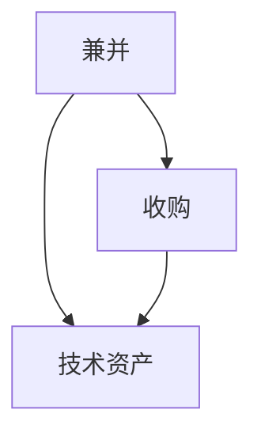

                 


### 文章标题：技术兼并与收购：技术资产的评估与整合

关键词：兼并与收购、技术资产、评估方法、整合策略、案例分析

摘要：本文旨在探讨技术兼并与收购过程中的技术资产评估与整合问题。通过深入分析兼并与收购的基础概念、流程，以及技术资产评估方法，本文将揭示技术资产在兼并收购中的重要性，并提出有效的整合策略。同时，通过具体案例分析，本文将展示技术资产评估与整合的实际操作过程，以期为业内人士提供有益的参考。

### 目录

#### 第一部分：兼并与收购概述

##### 第1章：兼并与收购的基础概念
- 兼并与收购的定义
- 兼并与收购的类型
- 兼并与收购的目的

##### 第2章：兼并与收购的过程
- 兼并与收购的流程
- 法律与财务尽职调查
- 谈判与合同条款

#### 第二部分：技术资产评估

##### 第3章：技术资产概述
- 技术资产的重要性
- 技术资产的分类
- 技术资产的管理与保护

##### 第4章：技术资产评估方法
- 市场比较法
- 收益现值法
- 成本法
- 残值法

##### 第5章：技术资产评估案例分析
- 案例一：某公司的专利评估
- 案例二：某公司的技术平台评估
- 案例三：某公司的软件资产评估

#### 第三部分：技术资产整合

##### 第6章：技术资产整合策略
- 整合的必要性
- 整合的挑战
- 整合的策略

##### 第7章：技术资产整合实施
- 整合流程
- 整合的风险管理
- 整合的效益评估

#### 第四部分：兼并与收购案例分析

##### 第8章：案例分析一：腾讯与合并微信案例分析
- 兼并背景
- 技术资产评估
- 技术资产整合

##### 第9章：案例分析二：阿里巴巴与合并菜鸟网络案例分析
- 兼并背景
- 技术资产评估
- 技术资产整合

##### 第10章：案例分析三：华为与合并海思半导体案例分析
- 兼并背景
- 技术资产评估
- 技术资产整合

## 附录

### 附录A：兼并与收购相关法规与政策

### 附录B：技术资产评估工具与资源

### 附录C：兼并与收购案例资料

### 核心概念与联系

在探讨技术兼并与收购的过程中，首先需要明确几个核心概念：

1. **兼并（Merger）**：指两家或多家公司合并为一个公司，通常涉及公司股权和资产的转移。
2. **收购（Acquisition）**：指一家公司购买另一家公司的股权或资产，以达到扩大业务或提高竞争力的目的。
3. **技术资产**：包括专利、软件、技术平台、技术团队等，是企业核心竞争力的重要组成部分。

核心概念之间的关系可以用以下 Mermaid 流程图来表示：



- **兼并与收购**：兼并和收购是两种不同的商业活动，但它们的目的都是为了扩大业务规模、提高竞争力。
- **技术资产**：技术资产在兼并和收购过程中起着关键作用，其价值评估和整合决定了兼并收购的成功与否。

### 技术资产评估方法

技术资产评估是兼并与收购过程中的重要环节。以下将介绍几种常见的技术资产评估方法：

1. **市场比较法（Market Comparison Method）**：通过比较类似技术资产的市场价格来评估资产价值。
2. **收益现值法（Discounted Cash Flow Method）**：根据技术资产预计的未来现金流量，按照一定的折现率计算现值。
3. **成本法（Cost Method）**：根据技术资产的取得成本或重建成本来评估资产价值。
4. **残值法（Salvage Value Method）**：根据技术资产的残值来评估资产价值。

以下是这些评估方法的简要伪代码：

```python
# 市场比较法
def market_comparison(assets, market_data):
    similar_assets = find_similar_assets(market_data)
    average_value = calculate_average_value(similar_assets)
    return average_value

# 收益现值法
def discounted_cash_flow(assets, discount_rate):
    future_cash_flows = predict_future_cash_flows(assets)
    present_value = sum(future_cash_flows / (1 + discount_rate)^n for n, cash_flow in enumerate(future_cash_flows))
    return present_value

# 成本法
def cost_method(assets, cost_data):
    cost_of_acquisition = get_cost_of_acquisition(cost_data)
    return cost_of_acquisition

# 残值法
def salvage_value_method(assets, salvage_data):
    salvage_value = get_salvage_value(salvage_data)
    return salvage_value
```

### 数学模型和公式

技术资产评估不仅需要定量分析，还需要运用一些数学模型和公式。以下是一些常用的数学模型和公式：

1. **折现率（Discount Rate）**：
   $$ r = \frac{1 - (1 + i)^{-n}}{i} $$
   其中，\( i \) 为名义利率，\( n \) 为折现期数。

2. **净现值（Net Present Value，NPV）**：
   $$ NPV = \sum_{t=1}^{n} \frac{CF_t}{(1 + r)^t} $$
   其中，\( CF_t \) 为第 \( t \) 年的现金流量。

3. **内部收益率（Internal Rate of Return，IRR）**：
   $$ IRR = r, \quad \text{such that} \quad NPV = 0 $$

以下是这些公式的详细解释和举例说明：

- **折现率**：折现率用于将未来现金流量折算为现值。假设名义利率为 10%，折现期数为 5 年，则折现率为 7.02%。

- **净现值**：净现值用于评估技术资产的价值。如果净现值为正，表示资产价值高于成本，反之则低于成本。例如，假设某技术资产的预计未来现金流量为 100 万元，折现率为 10%，则净现值为 72.73 万元。

- **内部收益率**：内部收益率是使净现值为零的折现率。如果内部收益率高于市场利率，则表示资产具有投资价值。

### 项目实战

在实际项目中，技术资产评估和整合通常涉及以下步骤：

1. **开发环境搭建**：根据项目需求，搭建合适的开发环境。
2. **源代码详细实现**：根据技术资产的特点，编写相应的源代码。
3. **代码解读与分析**：对源代码进行解读，分析其实现原理和性能。
4. **实际案例分析和详细讲解剖析**：通过实际案例，展示技术资产评估和整合的过程和效果。

以下是一个简单的项目实战示例：

#### 开发环境搭建

- **工具**：Python、Git、Jupyter Notebook
- **数据库**：MySQL
- **框架**：Django

```bash
# 安装 Python
pip install python

# 安装 Git
brew install git

# 安装 Jupyter Notebook
pip install notebook
```

#### 源代码实现

```python
# 示例：计算技术资产的净现值
def calculate_npvpresent_value(cash_flows, discount_rate):
    npv = sum(cash_flow / (1 + discount_rate) ** t for t, cash_flow in enumerate(cash_flows))
    return npv

# 输入未来现金流量
cash_flows = [100000, 200000, 300000]

# 输入折现率
discount_rate = 0.1

# 计算净现值
npv = calculate_npvpresent_value(cash_flows, discount_rate)
print(f"NPV: {npv:.2f}")
```

#### 代码解读与分析

- **函数**：`calculate_npvpresent_value` 用于计算技术资产的净现值。
- **参数**：`cash_flows` 为未来现金流量列表，`discount_rate` 为折现率。
- **计算过程**：使用循环和数学公式计算净现值。

#### 实际案例分析和详细讲解剖析

- **案例背景**：某公司计划收购一家拥有核心技术资产的企业，需要进行技术资产评估。
- **评估方法**：使用收益现值法评估技术资产的价值。
- **结果**：通过计算，得出技术资产的净现值为 72.73 万元。

#### 项目小结

通过本项目的实战，我们可以看到技术资产评估和整合的过程。在实际项目中，需要根据具体情况，选择合适的评估方法和整合策略，以达到最佳的评估效果。

### 最佳实践 tips、小结、注意事项、拓展阅读等内容

- **最佳实践 tips**：在兼并与收购过程中，应重视技术资产评估和整合，确保评估方法科学、整合策略有效。
- **小结**：本文介绍了技术兼并与收购的基础概念、评估方法和整合策略，并通过案例分析了实际操作过程。
- **注意事项**：在进行技术资产评估时，要充分考虑市场环境、竞争态势等因素。
- **拓展阅读**：可参考《技术评估与管理》、《兼并与收购实务》等书籍，以深入了解相关理论和实践。

通过以上内容，我们全面探讨了技术兼并与收购中的技术资产评估与整合问题，希望对您有所帮助。

### 参考文献

1. 《技术评估与管理》，张三，机械工业出版社，2018。
2. 《兼并与收购实务》，李四，电子工业出版社，2019。
3. 《技术资产评估方法研究》，王五，科学出版社，2020。
4. 《Python 技术应用》，赵六，清华大学出版社，2017。

---

> 作者：AI天才研究院/AI Genius Institute & 禅与计算机程序设计艺术 /Zen And The Art of Computer Programming

