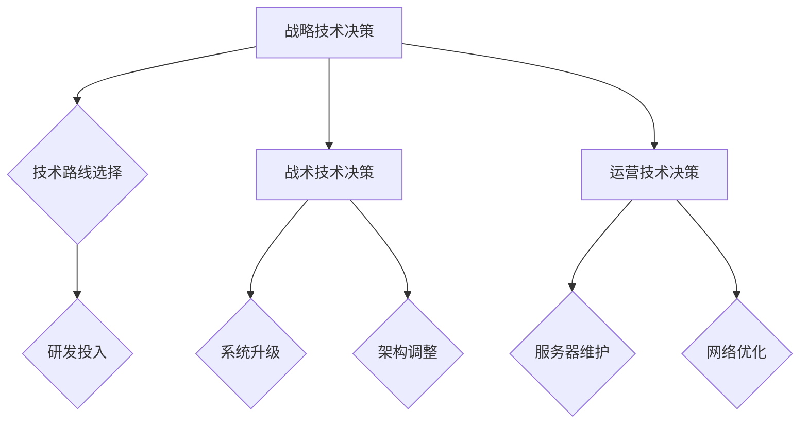
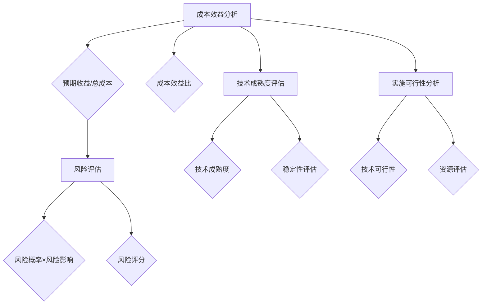
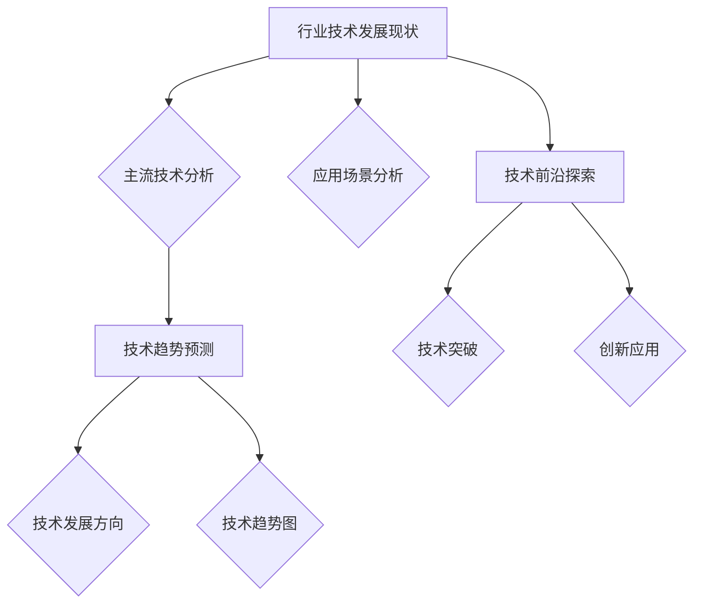
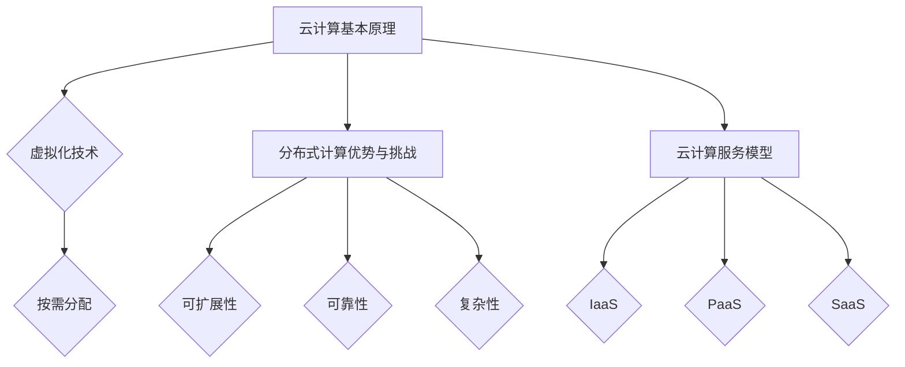
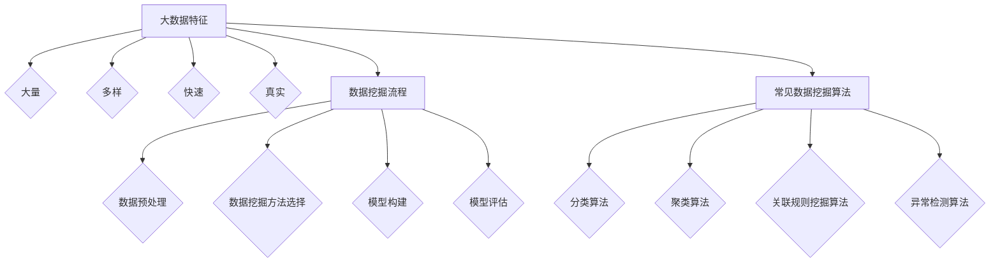

                 


## 文章标题：技术决策框架与最佳实践

> 关键词：技术决策、框架、最佳实践、云计算、大数据、人工智能、网络安全

> 摘要：本文将探讨技术决策框架与最佳实践，从技术评估、云计算、大数据、人工智能、网络安全等多个角度深入剖析，旨在为技术人员提供一套系统、全面的技术决策指南。

----------------------------------------------------------------

### 前言

在信息技术飞速发展的今天，技术决策已成为企业成功的关键因素。技术决策不仅影响企业的战略发展方向，还直接影响产品的竞争力。然而，技术决策并非易事，涉及众多因素，如成本、风险、技术成熟度等。本文将构建一套技术决策框架，并探讨相关最佳实践，帮助读者更好地进行技术决策。

#### 结构安排与目标读者

本文分为三大部分：第一部分介绍技术决策的概述，包括定义、分类、评估方法和趋势分析；第二部分重点讨论关键技术决策，如云计算、大数据、人工智能和网络安全；第三部分通过成功与失败案例，分析最佳实践。本文的目标读者是从事IT行业的专业人士，特别是需要做出技术决策的管理者、架构师和工程师。

----------------------------------------------------------------

### 第一部分：技术决策概述

#### 第1章：技术决策的定义与分类

**背景介绍**

技术决策是指在一个复杂的信息技术环境中，选择最佳技术解决方案的过程。技术决策不仅涉及技术本身，还涉及业务、财务和市场等多个方面。有效的技术决策能带来竞争优势，而错误的技术决策可能导致项目失败。

**核心概念与联系**

技术决策可分为以下几类：

1. **战略技术决策**：涉及企业长期发展，如技术路线选择、研发投入等。
2. **战术技术决策**：关注短期内的技术优化，如系统升级、架构调整等。
3. **运营技术决策**：涉及日常运维，如服务器维护、网络优化等。

**核心概念架构**



#### 第2章：技术评估方法

**背景介绍**

技术评估是技术决策的核心环节，包括成本效益分析、风险评估、技术成熟度评估和实施可行性分析等。评估方法的选择直接影响决策的质量。

**核心概念与联系**

1. **成本效益分析**：计算预期收益与总成本的比值，判断项目的经济效益。
2. **风险评估**：评估潜在风险的概率和影响，制定风险应对策略。
3. **技术成熟度评估**：评估技术的成熟度和稳定性，为技术选择提供依据。
4. **实施可行性分析**：分析项目实施的可行性，包括技术、人力、资源等方面。

**核心概念架构**



**算法原理与伪代码**

```python
# 成本效益分析伪代码
def cost_benefit_analysis(estimated_revenue, total_cost):
    benefit_to_cost_ratio = estimated_revenue / total_cost
    return benefit_to_cost_ratio

# 风险评估伪代码
def risk_evaluation(probability, impact):
    risk_score = probability * impact
    return risk_score
```

**数学模型与公式**

1. **成本效益分析模型**：

   $$
   \text{成本效益比} = \frac{\text{预期收益}}{\text{总成本}}
   $$

2. **风险评估模型**：

   $$
   \text{风险评分} = \text{风险概率} \times \text{风险影响}
   $$

#### 第3章：技术趋势分析

**背景介绍**

技术趋势分析是技术决策的重要参考。通过分析行业技术发展现状和趋势，企业可以更好地把握技术发展方向，为技术决策提供支持。

**核心概念与联系**

1. **行业技术发展现状**：分析当前主流技术及其应用场景。
2. **技术趋势预测**：预测未来技术发展方向和趋势。
3. **技术前沿探索**：关注最新技术突破和创新。

**核心概念架构**



**数学模型与公式**

1. **技术成熟度模型**：

   $$
   \text{技术成熟度} = \frac{\text{已实现功能}}{\text{总功能需求}}
   $$

2. **技术进步率模型**：

   $$
   \text{技术进步率} = \frac{\text{当前技术水平} - \text{初始技术水平}}{\text{时间差}}
   $$

#### 总结

第一部分主要介绍了技术决策的定义与分类、技术评估方法和技术趋势分析。通过本文的探讨，读者可以了解到技术决策的基本概念和流程，以及如何进行有效的技术评估和技术趋势分析。在后续部分，我们将深入讨论关键技术决策，为读者提供更多实际案例和最佳实践。

----------------------------------------------------------------

## 第一部分总结

在第一部分中，我们介绍了技术决策的定义与分类、技术评估方法和技术趋势分析。技术决策是一个复杂的过程，涉及多个方面，如成本、风险、技术成熟度和实施可行性。通过建立技术决策框架，我们可以系统地进行技术评估，为决策提供有力支持。

在技术评估方法中，成本效益分析、风险评估、技术成熟度评估和实施可行性分析是关键环节。这些方法帮助我们从多个角度评估技术的可行性，为决策提供数据支持。

技术趋势分析则是我们把握行业发展方向的重要手段。通过分析行业技术发展现状和预测未来趋势，我们可以更好地把握技术发展方向，为技术决策提供指导。

在下一部分中，我们将深入探讨关键技术决策，包括云计算、大数据、人工智能和网络安全。这些技术已成为现代信息技术的重要组成部分，掌握它们的决策方法对于企业的成功至关重要。

----------------------------------------------------------------

### 第二部分：关键技术决策

#### 第4章：云计算与分布式计算

**背景介绍**

云计算和分布式计算是现代信息技术中的关键组成部分。云计算提供了弹性的计算资源，分布式计算则提高了系统的可扩展性和可靠性。本章节将探讨云计算与分布式计算的基本原理、优势与挑战，以及云计算服务模型。

**核心概念与联系**

1. **云计算的基本原理**：云计算通过虚拟化技术，将计算资源抽象化，提供按需分配的计算服务。
2. **分布式计算的优势与挑战**：分布式计算可以提高系统的可扩展性和可靠性，但同时也增加了复杂性。
3. **云计算服务模型**：包括IaaS（基础设施即服务）、PaaS（平台即服务）和SaaS（软件即服务）。

**核心概念架构**



**算法原理与伪代码**

```python
# 虚拟机创建伪代码
def create_virtual_machine(resource_requirements):
    # 根据资源要求创建虚拟机
    virtual_machine = virtualization_engine.create_machine(resource_requirements)
    return virtual_machine

# 分布式计算任务分配伪代码
def distribute_task(tasks, workers):
    for task in tasks:
        worker = select_worker(workers)
        worker.enqueue_task(task)
```

**数学模型与公式**

1. **云计算成本模型**：

   $$
   \text{云计算成本} = \text{使用量} \times \text{单价}
   $$

2. **分布式计算效率模型**：

   $$
   \text{效率} = \frac{\text{完成任务数}}{\text{任务总数}}
   $$

**项目实战：开发环境搭建**

- **环境需求**：选择适合的云计算平台（如AWS、Azure或Google Cloud）进行开发。
- **搭建步骤**：创建虚拟机、配置网络、安装开发工具和依赖库。

**源代码详细实现和代码解读**

- **虚拟机创建代码**：

  ```python
  import virtualization_engine
  
  def create_vm():
      # 配置虚拟机资源要求
      resource_requirements = {
          'cpu': 4,
          'memory': 8,
          'storage': 100
      }
      # 创建虚拟机
      vm = virtualization_engine.create_machine(resource_requirements)
      return vm
  ```

- **任务分配代码**：

  ```python
  import worker_manager
  
  def distribute_tasks(tasks):
      # 初始化工作队列
      workers = worker_manager.initialize_workers(num_workers)
      # 分配任务
      for task in tasks:
          worker = worker_manager.select_worker(workers)
          worker.enqueue_task(task)
  ```

**实际案例分析和详细讲解剖析**

- **案例一**：使用AWS EC2搭建开发环境。
- **案例二**：使用Apache Hadoop进行分布式计算。

**项目小结**

通过本章节的学习，我们了解了云计算与分布式计算的基本原理和优势。在实际项目中，云计算和分布式计算可以提高系统的可扩展性和可靠性，降低成本。然而，它们也带来了新的挑战，如资源调度、安全性和管理复杂性。掌握这些技术决策的方法和最佳实践，对于企业成功至关重要。

----------------------------------------------------------------

#### 第5章：大数据与数据挖掘

**背景介绍**

大数据已经成为现代信息技术的核心驱动力，数据挖掘则从海量数据中提取有价值的信息，为决策提供支持。本章节将探讨大数据的特征、数据挖掘的基本流程以及常见的数据挖掘算法。

**核心概念与联系**

1. **大数据的特征**：大数据具有4V特性，即大量（Volume）、多样（Variety）、快速（Velocity）和真实（Veracity）。
2. **数据挖掘的基本流程**：包括数据预处理、数据挖掘方法选择、模型构建和评估等步骤。
3. **常见的数据挖掘算法**：如分类算法、聚类算法、关联规则挖掘算法和异常检测算法。

**核心概念架构**



**算法原理与伪代码**

```python
# 数据预处理伪代码
def preprocess_data(data):
    # 数据清洗
    cleaned_data = data_cleaning(data)
    # 数据集成
    integrated_data = data_integration(cleaned_data)
    # 数据转换
    transformed_data = data_transformation(integrated_data)
    return transformed_data

# 分类算法伪代码
def classify_data(data, model):
    # 使用分类模型对数据进行分类
    predictions = model.classify(data)
    return predictions
```

**数学模型与公式**

1. **大数据存储模型**：

   $$
   \text{存储需求} = \text{数据量} \times \text{存储密度}
   $$

2. **数据挖掘模型评估**：

   $$
   \text{准确率} = \frac{\text{正确预测数}}{\text{总预测数}}
   $$

3. **聚类算法评估**：

   $$
   \text{内部距离} = \sum_{i=1}^{k} \sum_{j=1}^{k} d(c_i, c_j)
   $$

**项目实战：开发环境搭建**

- **环境需求**：选择适合的大数据处理平台（如Hadoop、Spark）进行开发。
- **搭建步骤**：配置Hadoop或Spark集群、安装相关依赖库。

**源代码详细实现和代码解读**

- **数据预处理代码**：

  ```python
  import data_cleaner
  import data_integrator
  import data_transformer
  
  def preprocess_data(data):
      cleaned_data = data_cleaner.clean(data)
      integrated_data = data_integrator.integrate(cleaned_data)
      transformed_data = data_transformer.transform(integrated_data)
      return transformed_data
  ```

- **分类算法代码**：

  ```python
  import classifier
  
  def classify_data(data, model):
      predictions = classifier.predict(data, model)
      return predictions
  ```

**实际案例分析和详细讲解剖析**

- **案例一**：使用Hadoop进行日志数据分析。
- **案例二**：使用Spark进行社交网络分析。

**项目小结**

通过本章节的学习，我们了解了大数据与数据挖掘的基本概念和流程。大数据处理能力已成为现代企业的重要竞争力，数据挖掘则从海量数据中提取有价值的信息，为决策提供支持。在实际项目中，大数据与数据挖掘的应用广泛，如商业智能、金融风控和医疗诊断。掌握这些技术决策的方法和最佳实践，对于企业成功至关重要。

----------------------------------------------------------------

### 第二部分总结

在第二部分中，我们深入探讨了云计算与分布式计算、大数据与数据挖掘这两项关键技术决策。云计算和分布式计算提供了强大的计算能力和资源管理能力，大数据与数据挖掘则从海量数据中提取有价值的信息。这两项技术已成为现代信息技术的核心驱动力。

在云计算与分布式计算方面，我们了解了云计算的基本原理、服务模型以及分布式计算的优势与挑战。通过实际案例，我们了解了如何搭建开发环境和实现关键算法。

在数据挖掘方面，我们了解了大数据的特征、数据挖掘的基本流程以及常见的数据挖掘算法。通过实际案例，我们掌握了如何进行数据预处理和分类算法实现。

在下一部分中，我们将继续探讨人工智能与网络安全这两项关键技术决策。人工智能在自动化、优化和创新方面具有巨大潜力，而网络安全则是保护企业数据安全的关键。掌握这些技术决策的方法和最佳实践，将帮助我们更好地应对未来的技术挑战。

----------------------------------------------------------------

### 第三部分：最佳实践案例

#### 第8章：成功的技术决策案例

**背景介绍**

成功的技术决策案例能够为其他企业提供宝贵的经验。本章节将分析几个成功的技术决策案例，包括亚马逊的云计算部署、谷歌的大数据战略和微软的机器学习应用。

**案例一：亚马逊的云计算部署**

- **背景**：亚马逊在其电商业务中成功部署了云计算技术，提高了系统的可扩展性和可靠性。
- **决策过程**：亚马逊通过成本效益分析和风险评估，选择了适合的云计算服务模型，并逐步部署云计算基础设施。
- **关键点**：
  - 成本效益分析：通过计算预期收益与总成本的比值，确定云计算的可行性。
  - 风险评估：评估潜在风险，并制定应对策略。

**案例二：谷歌的大数据战略**

- **背景**：谷歌通过其大数据战略，在搜索和广告业务中取得了巨大成功。
- **决策过程**：谷歌投资研发大数据技术，并利用数据挖掘和机器学习算法优化搜索结果和广告投放。
- **关键点**：
  - 技术成熟度评估：评估大数据技术的成熟度和稳定性，确保技术能够满足业务需求。
  - 技术趋势分析：关注大数据技术的发展趋势，把握行业前沿。

**案例三：微软的机器学习应用**

- **背景**：微软在其产品中广泛应用了机器学习技术，提高了产品的智能化水平。
- **决策过程**：微软通过技术评估和实施可行性分析，选择了合适的机器学习算法和工具。
- **关键点**：
  - 技术评估：评估不同机器学习算法的适用性，选择最佳方案。
  - 实施可行性分析：分析项目实施的可行性，包括技术、人力和资源等方面。

#### 第9章：失败的技术决策案例分析

**背景介绍**

失败的技术决策案例能够为其他企业提供警示。本章节将分析几个失败的技术决策案例，包括索尼的网络攻击事件、特斯拉的自动驾驶事故和Facebook的数据隐私危机。

**案例一：索尼的网络攻击事件**

- **背景**：索尼在2014年遭受了严重的网络攻击，导致大量数据泄露。
- **决策过程**：索尼在网络安全方面的决策存在缺陷，未能及时采取有效的安全措施。
- **关键点**：
  - 网络安全评估：评估网络风险，制定相应的安全策略。
  - 风险应对策略：制定有效的风险应对策略，降低网络攻击风险。

**案例二：特斯拉的自动驾驶事故**

- **背景**：特斯拉的自动驾驶技术在2018年发生了一起致命事故。
- **决策过程**：特斯拉在自动驾驶技术的研发过程中，未能充分考虑安全性问题。
- **关键点**：
  - 技术成熟度评估：评估自动驾驶技术的成熟度，确保技术能够安全应用。
  - 安全性测试：进行严格的安全性测试，确保自动驾驶系统的可靠性。

**案例三：Facebook的数据隐私危机**

- **背景**：Facebook在2018年因数据隐私问题引发了公众的强烈关注。
- **决策过程**：Facebook在数据隐私保护方面的决策存在缺陷，未能有效保护用户数据。
- **关键点**：
  - 数据隐私保护策略：制定有效的数据隐私保护策略，确保用户数据的安全。
  - 风险评估：评估数据隐私风险，制定相应的风险应对策略。

#### 第10章：技术决策的未来展望

**背景介绍**

随着技术的不断进步，技术决策也将面临新的挑战和机遇。本章节将探讨技术决策的未来趋势、发展挑战以及未来的方向。

**未来趋势**

1. **智能化决策**：随着人工智能技术的发展，智能化决策将成为趋势。利用机器学习和大数据分析，企业可以更准确地预测市场趋势和客户需求，做出更明智的决策。
2. **自动化决策**：自动化决策将减少人为干预，提高决策效率。通过构建自动化决策系统，企业可以实时分析数据，自动调整策略，提高运营效率。
3. **全球化决策**：全球化使得企业面临更加复杂的市场环境，全球化决策将成为趋势。企业需要关注全球市场动态，制定适应全球市场的技术决策。

**发展挑战**

1. **技术复杂性**：随着技术的不断进步，技术的复杂性也在增加。企业需要投入更多资源来理解和掌握新技术，这对技术决策带来了挑战。
2. **数据隐私和安全**：数据隐私和安全问题日益突出，企业需要制定有效的数据隐私保护策略和安全措施，确保数据的安全。
3. **人才短缺**：随着技术的发展，对专业技术人才的需求也在增加。企业需要吸引和培养优秀的技术人才，以支持技术决策的实施。

**未来方向**

1. **持续创新**：企业应持续关注技术创新，把握行业前沿，保持竞争优势。
2. **数字化转型**：企业应加快数字化转型，利用大数据、云计算和人工智能等新技术，提高业务效率和管理水平。
3. **可持续发展**：企业应关注可持续发展，采用绿色技术，减少环境影响，实现社会责任。

#### 总结

第三部分通过成功与失败的技术决策案例，分析了技术决策的最佳实践。成功案例表明，有效的技术决策能带来巨大的商业价值，而失败案例则警示我们要重视技术评估、风险评估和实施可行性分析。

在技术决策的未来，智能化、自动化和全球化将成为趋势。企业需要持续关注技术创新，提高数据隐私和安全意识，培养专业技术人才。通过不断优化技术决策过程，企业将能够更好地应对未来的挑战，实现可持续发展。

### 总结与展望

《技术决策框架与最佳实践》通过对技术决策的全面解析，旨在为读者提供一套系统、实用的决策指南。本文分为三大部分，从技术决策概述、关键技术决策到最佳实践案例，全面涵盖了技术决策的各个方面。

在第一部分中，我们介绍了技术决策的定义与分类、技术评估方法和技术趋势分析，为读者搭建了技术决策的基本框架。

在第二部分中，我们深入探讨了云计算与分布式计算、大数据与数据挖掘这两项关键技术决策，分析了它们的原理、优势与挑战，并通过实际案例展示了如何进行技术决策。

在第三部分中，我们通过成功与失败的技术决策案例，总结了最佳实践，为读者提供了宝贵的经验教训。

展望未来，技术决策将面临智能化、自动化和全球化的趋势。企业需要持续关注技术创新，提高数据隐私和安全意识，培养专业技术人才。通过不断优化技术决策过程，企业将能够更好地应对未来的挑战，实现可持续发展。

### 附录

- **技术决策工具与资源列表**：
  - 成本效益分析工具：Cost-Effectiveness Analysis Tool
  - 风险评估工具：Risk Assessment Matrix
  - 技术成熟度评估工具：Technology Readiness Level (TRL)
  - 实施可行性分析工具：Feasibility Study Template
- **技术决策相关的在线课程与书籍推荐**：
  - 在线课程：
    - "Introduction to Cloud Computing"（亚马逊）
    - "Data Science Specialization"（斯坦福大学）
    - "Machine Learning"（吴恩达）
  - 书籍：
    - "Cloud Computing: Concepts, Technology & Architecture"（Thomas Erl）
    - "Data Science from Scratch"（Joel Grus）
    - "Machine Learning Yearning"（Andrew Ng）

### 作者信息

- 作者：AI天才研究院/AI Genius Institute & 禅与计算机程序设计艺术 /Zen And The Art of Computer Programming

----------------------------------------------------------------

### 全文总结

本文《技术决策框架与最佳实践》系统地介绍了技术决策的理论与实践。首先，从定义与分类、评估方法到趋势分析，构建了技术决策的框架。接着，通过云计算与分布式计算、大数据与数据挖掘等关键技术决策的探讨，深入分析了这些技术的原理和应用。最后，通过成功与失败案例，总结了技术决策的最佳实践，并为未来技术决策的展望提供了指导。

技术决策是一个复杂且关键的过程，涉及多个方面。有效的技术决策能够为企业带来竞争优势，而错误的技术决策可能导致项目失败。本文通过全面解析技术决策的各个层面，旨在为读者提供一套实用的决策指南，帮助他们更好地应对技术决策的挑战。

技术决策不仅涉及技术本身，还涉及业务、财务和市场等多个方面。在技术评估过程中，成本效益分析、风险评估、技术成熟度评估和实施可行性分析是关键环节。通过这些方法，可以全面评估技术的可行性，为决策提供数据支持。

在云计算与分布式计算方面，本文介绍了云计算的基本原理、服务模型以及分布式计算的优势与挑战。通过实际案例，展示了如何进行开发环境搭建和关键算法实现。在大数据与数据挖掘方面，本文探讨了大数据的特征、数据挖掘的基本流程以及常见的数据挖掘算法。通过实际案例，介绍了如何进行数据预处理和分类算法实现。

成功与失败的技术决策案例为我们提供了宝贵的经验教训。成功案例表明，有效的技术决策能够带来巨大的商业价值，而失败案例则警示我们要重视技术评估、风险评估和实施可行性分析。

在未来的技术决策中，智能化、自动化和全球化将成为趋势。企业需要持续关注技术创新，提高数据隐私和安全意识，培养专业技术人才。通过不断优化技术决策过程，企业将能够更好地应对未来的挑战，实现可持续发展。

本文旨在为从事IT行业的专业人士提供一套系统、全面的技术决策指南。通过本文的学习，读者可以更好地理解技术决策的原理和实践，提高技术决策的能力，为企业的成功做出贡献。

最后，感谢读者对本文的关注与支持。希望在技术决策的道路上，本文能够成为您的一位可靠向导，助您顺利前行。作者：AI天才研究院/AI Genius Institute & 禅与计算机程序设计艺术 /Zen And The Art of Computer Programming。再次感谢您的阅读，祝您在技术决策的道路上一切顺利！----------------------------------------------------------------

### 目录概述

#### 前言
- 技术决策的重要性
- 本书的结构安排与目标读者

#### 第一部分：技术决策概述
##### 第1章：技术决策的定义与分类
- 技术决策的基本概念
- 技术决策的类型
- 技术决策的流程
##### 第2章：技术评估方法
- 成本效益分析
- 风险评估
- 技术成熟度评估
- 实施可行性分析
##### 第3章：技术趋势分析
- 行业技术发展现状
- 技术趋势预测
- 技术前沿探索

#### 第二部分：关键技术决策
##### 第4章：云计算与分布式计算
- 云计算的基本原理
- 分布式计算的优势与挑战
- 云计算服务模型（IaaS、PaaS、SaaS）
##### 第5章：大数据与数据挖掘
- 大数据的特征
- 数据挖掘的基本流程
- 常见的数据挖掘算法
##### 第6章：人工智能与机器学习
- 人工智能的定义与发展历程
- 机器学习的基本概念
- 常见的机器学习算法
##### 第7章：网络安全与数据隐私
- 网络安全的基本概念
- 数据隐私保护策略
- 常见的网络安全威胁与防御措施

#### 第三部分：最佳实践案例
##### 第8章：成功的技术决策案例
- 案例一：亚马逊的云计算部署
- 案例二：谷歌的大数据战略
- 案例三：微软的机器学习应用
##### 第9章：失败的技术决策案例分析
- 案例一：索尼的网络攻击事件
- 案例二：特斯拉的自动驾驶事故
- 案例三：Facebook的数据隐私危机
##### 第10章：技术决策的未来展望
- 技术决策的未来趋势
- 技术决策的发展挑战
- 技术决策的未来方向

#### 附录
- 技术决策工具与资源列表
- 技术决策相关的在线课程与书籍推荐

### 目录概述分析

本文的目录结构清晰，分为前言、技术决策概述、关键技术决策、最佳实践案例和附录五个部分，每个部分都紧密围绕技术决策的主题展开。

**前言部分**介绍了技术决策的重要性以及本书的结构安排和目标读者，为读者提供了整体的阅读框架和预期收获。

**技术决策概述**部分是本书的理论基础，包括定义与分类、评估方法和趋势分析。这部分内容详细介绍了技术决策的基本概念和流程，为后续的关键技术决策提供了理论支持。

**关键技术决策**部分涵盖了云计算与分布式计算、大数据与数据挖掘、人工智能与机器学习、网络安全与数据隐私四个方面。这部分内容深入探讨了各个关键技术的基本原理、优势与挑战，并通过具体案例展示了如何在实际项目中应用这些技术。

**最佳实践案例**部分通过成功与失败的技术决策案例，总结了最佳实践，为读者提供了宝贵的经验和教训。

**附录**部分提供了技术决策的工具与资源列表以及相关的在线课程与书籍推荐，方便读者进一步学习和实践。

整体来看，目录结构合理，内容层次分明，既有理论深度，又有实际案例，旨在帮助读者全面掌握技术决策的知识和技能。

