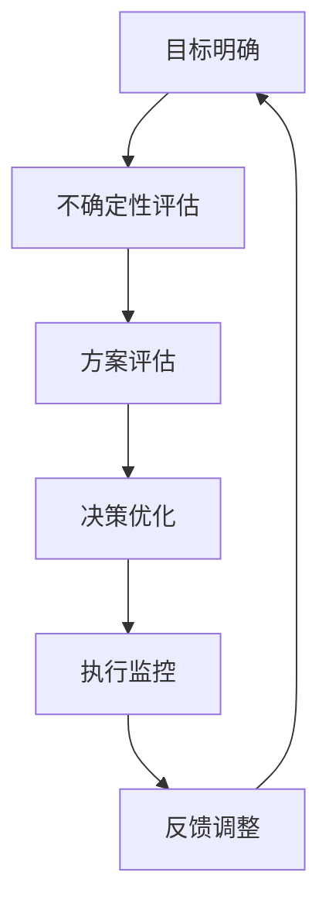

                 

### 文章标题：技术决策框架：在不确定性中做出最优选择

### 关键词：技术决策、不确定性、最优选择、决策框架、流程图、算法、数学模型

### 摘要：
本文深入探讨了在不确定性环境中做出最优技术决策的框架和方法。首先，我们概述了技术决策的背景和重要性，然后详细介绍了不确定性对技术决策的挑战。接着，我们提出了一个技术决策框架，并使用Mermaid流程图展示了核心概念之间的关系。文章进一步讲解了核心算法原理，包括伪代码和数学模型的详细说明。通过一个实际项目实战案例，我们展示了如何将框架应用于开发环境中，并提供了代码实现和解读。最后，文章总结了最佳实践和注意事项，并提出了拓展阅读的建议。

----------------------------------------------------------------

## 目录

1. 引言
2. 技术决策的背景和重要性
3. 不确定性对技术决策的挑战
4. 技术决策框架的提出
5. 核心算法原理讲解
6. 数学模型和公式讲解
7. 项目实战：开发环境搭建与代码实现
8. 项目小结与最佳实践
9. 注意事项
10. 拓展阅读

----------------------------------------------------------------

## 引言

技术决策在当今信息化社会中扮演着至关重要的角色。无论是软件工程、数据分析，还是人工智能应用，技术决策都是推动项目成功的关键因素。然而，随着技术的复杂性和不确定性增加，做出最优技术决策变得愈发困难。本文旨在探讨如何构建一个技术决策框架，帮助决策者在不确定性中做出最优选择。

在技术决策过程中，不确定性是一个不可忽视的因素。它可能来自数据的不完整性、算法的不确定性、外部环境的变化等。不确定性增加了决策的难度，使得传统的决策方法难以应对。因此，构建一个能够适应不确定性的技术决策框架显得尤为重要。

本文的主要目标是：
1. 概述技术决策的背景和重要性。
2. 分析不确定性对技术决策的挑战。
3. 提出一个全面的技术决策框架。
4. 使用Mermaid流程图展示框架的核心概念。
5. 详细讲解核心算法原理和数学模型。
6. 通过一个实际项目实战案例，展示框架的应用。
7. 总结最佳实践，并给出注意事项和拓展阅读建议。

本文结构如下：

1. 引言：介绍技术决策的背景和重要性，概述本文目标和结构。
2. 技术决策的背景和重要性：讨论技术决策在信息化社会中的角色和影响。
3. 不确定性对技术决策的挑战：分析不确定性的来源和影响。
4. 技术决策框架的提出：详细描述技术决策框架的构建过程。
5. 核心算法原理讲解：讲解框架中涉及的核心算法原理。
6. 数学模型和公式讲解：介绍框架中使用的数学模型和公式。
7. 项目实战：通过实际项目展示框架的应用。
8. 项目小结与最佳实践：总结项目经验和最佳实践。
9. 注意事项：强调在应用框架时需要注意的事项。
10. 拓展阅读：推荐相关阅读材料，供进一步学习。

通过本文的讨论，希望读者能够对技术决策有一个更深入的理解，并能够应用所学的框架和方法，在实际工作中做出更明智的技术决策。----------------------------------------------------------------

## 技术决策的背景和重要性

技术决策是指在特定情境下，通过选择合适的技术方案来解决问题或实现目标的过程。随着信息技术的飞速发展，技术决策在信息化社会中扮演着至关重要的角色。无论是企业、政府机构，还是个人，都需要做出各种技术决策，以适应快速变化的环境和满足日益增长的需求。

### 技术决策的必要性

首先，技术决策的必要性体现在以下几个方面：

1. **解决问题的需求**：在面对复杂问题时，需要选择合适的技术手段来解决问题。技术决策有助于确定最佳解决方案，提高问题的解决效率。

2. **资源优化**：技术决策涉及到资源分配，包括人力、资金和设备等。通过合理的技术决策，可以优化资源的使用，降低成本，提高效率。

3. **业务增长**：对于企业而言，技术决策是推动业务增长的关键因素。通过创新的技术应用，企业可以提高竞争力，开拓新市场。

4. **战略规划**：技术决策与企业的长期战略规划密切相关。合理的技术决策有助于实现企业的战略目标，推动企业持续发展。

### 技术决策的影响

技术决策的影响不仅限于技术层面，还涉及多个方面：

1. **经济效益**：技术决策直接关系到项目的经济效益。选择合适的技术方案可以降低成本，提高项目的盈利能力。

2. **市场竞争力**：技术决策决定了企业在市场中的竞争力。创新的技术应用可以提高产品的质量，增强企业的市场地位。

3. **用户体验**：技术决策影响到用户体验。优秀的技术决策可以提供更好的产品和服务，提升用户满意度。

4. **社会责任**：技术决策也需要考虑社会责任。选择环保、安全的技术方案，有助于企业承担社会责任，提升品牌形象。

### 当前技术决策面临的挑战

尽管技术决策的重要性显而易见，但在实际操作中，技术决策面临着诸多挑战：

1. **不确定性**：技术环境的不确定性使得技术决策变得复杂。技术趋势变化快速，难以准确预测。

2. **信息不完备**：技术决策所需的信息往往不完备，数据质量参差不齐，增加了决策难度。

3. **技术复杂性**：现代技术的复杂性日益增加，技术决策需要综合考虑多种技术因素，不易做出准确判断。

4. **资源限制**：资源限制（如预算、人力等）使得技术决策需要在有限资源下做出最优选择。

面对这些挑战，构建一个全面的技术决策框架显得尤为重要。这样的框架可以帮助决策者系统地分析问题、评估风险，并选择最优的技术方案。在接下来的部分中，我们将详细探讨技术决策框架的构建过程，以应对不确定性带来的挑战。

----------------------------------------------------------------

## 不确定性对技术决策的挑战

在技术决策过程中，不确定性是一个至关重要的因素，它影响着决策的准确性、可靠性和效率。不确定性可以分为多种类型，如数据不确定性、技术不确定性、市场不确定性等。这些不确定性对技术决策提出了严峻的挑战，下面我们将一一探讨。

### 数据不确定性

数据不确定性是指数据本身可能存在的偏差、误差、缺失或不确定性。这种不确定性对技术决策的影响是直接的，因为数据的准确性直接关系到模型的预测性能和决策的有效性。以下是数据不确定性对技术决策的一些具体影响：

1. **模型预测偏差**：当数据存在不确定性时，训练出的模型可能会产生预测偏差，导致决策结果不准确。
2. **决策失误**：基于不准确的数据做出的技术决策可能导致项目失败，增加企业的风险。
3. **资源浪费**：数据不确定性可能导致资源的无效分配，增加项目的成本。

### 技术不确定性

技术不确定性指的是技术方案、算法、工具等的未来表现和适用性可能存在的不确定性。技术的不确定性主要源于以下几个方面：

1. **新技术的发展**：随着新技术的不断涌现，现有技术的适用性和效率可能会受到挑战。技术决策者需要不断跟踪新技术的发展，以评估其对现有决策方案的影响。
2. **技术实现的难度**：某些技术方案可能在理论上是可行的，但在实际实施中可能面临诸多困难，如实现难度大、成本高昂等。
3. **性能的不确定性**：技术方案的最终性能可能受到多种因素的影响，如硬件环境、数据分布等，这种不确定性使得技术决策难以预测。

### 市场不确定性

市场不确定性是指市场需求、竞争态势、政策环境等可能带来的不确定性。市场的不确定性对技术决策的影响体现在以下几个方面：

1. **市场需求变化**：市场需求的不确定性可能导致技术方案在市场推广中的失败。例如，一个最初看似有市场潜力的技术方案，可能在市场推广过程中发现需求不足。
2. **竞争压力**：激烈的市场竞争可能迫使技术决策者迅速调整决策方案，以应对竞争对手的挑战。
3. **政策变化**：政府政策的变动可能对技术决策产生重大影响，例如，环保政策的加强可能导致某些技术方案变得不再可行。

### 应对不确定性

面对这些不确定性，技术决策者需要采取一系列措施来降低不确定性带来的风险：

1. **数据质量控制**：通过数据清洗、数据预处理等方法，提高数据的准确性和完整性，从而降低模型预测偏差。
2. **技术评估**：对新技术进行充分的评估和验证，确保其适用性和可行性。
3. **市场调研**：进行市场调研，了解市场需求和竞争态势，为技术决策提供依据。
4. **风险管理**：建立风险管理机制，识别和评估潜在的风险，并制定相应的应对策略。

综上所述，不确定性对技术决策的影响是深远的。通过系统的风险评估和管理，技术决策者可以更好地应对不确定性，做出更明智的技术决策。

----------------------------------------------------------------

## 技术决策框架的提出

为了在不确定性中做出最优选择，我们需要构建一个全面的技术决策框架。这个框架旨在帮助决策者系统地分析和解决问题，从而选择最优的技术方案。下面我们将详细描述这个框架的构建过程。

### 框架核心概念

技术决策框架的核心概念包括以下几个部分：

1. **目标明确**：确定决策目标，确保技术方案能够满足需求。
2. **不确定性评估**：评估不确定性因素，了解其对决策的影响。
3. **方案评估**：对多个技术方案进行评估和比较，选择最优方案。
4. **决策优化**：基于评估结果，优化决策过程，降低不确定性。
5. **执行监控**：执行技术方案，监控执行效果，及时调整决策。

### 框架构建步骤

1. **目标明确**：
   - **需求分析**：了解项目需求，明确技术决策的目标。
   - **目标设定**：设定具体、可量化的决策目标。

2. **不确定性评估**：
   - **风险识别**：识别可能影响决策的不确定性因素。
   - **风险分析**：分析每个风险的可能性和影响，评估其对决策的影响程度。

3. **方案评估**：
   - **方案设计**：设计多个技术方案，确保方案的多样性和全面性。
   - **方案评估**：使用评估标准（如成本、性能、可扩展性等）对方案进行评估。

4. **决策优化**：
   - **决策模型**：构建决策模型，基于评估结果选择最优方案。
   - **模型优化**：优化决策模型，提高决策的准确性和可靠性。

5. **执行监控**：
   - **方案执行**：实施最优技术方案，监控执行效果。
   - **反馈调整**：根据执行结果，及时调整决策，确保方案的有效性。

### Mermaid流程图

为了更直观地展示技术决策框架，我们使用Mermaid流程图来描述各个步骤之间的逻辑关系：



### 框架核心概念之间的关系

技术决策框架的各个核心概念之间存在着紧密的联系：

1. **目标明确** 是整个框架的起点，确保决策方向正确。
2. **不确定性评估** 是对目标实现过程中潜在风险的分析，为后续方案评估提供依据。
3. **方案评估** 是基于不确定性的评估结果，对多个技术方案进行筛选。
4. **决策优化** 是对评估结果进行进一步的优化，确保选择最优方案。
5. **执行监控** 和 **反馈调整** 是对决策过程的持续跟踪和调整，确保方案的有效性。

通过这个框架，决策者可以系统地分析和解决问题，提高在不确定性环境中做出最优选择的能力。在接下来的部分，我们将详细讲解框架中的核心算法原理，帮助读者更好地理解技术决策的决策过程。

----------------------------------------------------------------

### 核心算法原理讲解

在技术决策框架中，核心算法原理的讲解至关重要，因为它们是决策模型的基础。本节将详细介绍技术决策过程中常用的算法原理，包括决策树、随机森林、神经网络等，并使用伪代码来详细阐述这些算法。

#### 决策树（Decision Tree）

决策树是一种常用的分类和回归算法，它通过一系列的判断来将数据划分成不同的类别或数值。决策树的基本原理是使用特征和阈值来划分数据集，直到达到某种终止条件。

**伪代码：**

```
DecisionTree(data, features, max_depth):
    if (stop_condition_met(data)):
        return Leaf(node)  # 返回叶节点
    if (max_depth_reached()):
        return Leaf(node)  # 返回叶节点

    best_feature, best_threshold = FindBestSplit(data, features)
    left_data, right_data = SplitData(data, best_feature, best_threshold)

    node = Node(best_feature, best_threshold)
    node.left = DecisionTree(left_data, features, max_depth - 1)
    node.right = DecisionTree(right_data, features, max_depth - 1)

    return node
```

#### 随机森林（Random Forest）

随机森林是一种集成学习算法，它通过构建多个决策树，并汇总它们的预测结果来提高模型的准确性和稳定性。随机森林的核心思想是引入随机性，从而减少模型的过拟合。

**伪代码：**

```
RandomForest(data, features, n_trees, max_depth):
    for i = 1 to n_trees:
        sample = SampleData(data)
        tree = DecisionTree(sample, features, max_depth)

    predictions = [Tree.Predict(data) for Tree in trees]
    return MajorityVote(predictions)
```

#### 神经网络（Neural Network）

神经网络是一种模仿生物神经系统结构和功能的人工智能模型。它通过多层神经元之间的连接来学习和预测数据。神经网络的核心是前向传播和反向传播算法。

**伪代码：**

```
NeuralNetwork(data, layers, learning_rate):
    InitializeWeights(layers)
    for epoch = 1 to max_epochs:
        for data_point in data:
            input = data_point.input
            output = ForwardPropagation(input, layers)
            error = CalculateError(output, data_point.target)
            Backpropagation(error, layers, learning_rate)

    return layers
```

#### 数学模型和公式讲解

除了算法原理，技术决策框架中还涉及到一些数学模型和公式，这些模型和公式用于评估和优化决策过程。以下是几个常用的数学模型和公式：

1. **贝叶斯定理**：贝叶斯定理用于计算某个事件发生的概率，公式如下：

   $$ P(A|B) = \frac{P(B|A)P(A)}{P(B)} $$

2. **熵（Entropy）**：熵是一个用于衡量数据不确定性的指标，公式如下：

   $$ H(X) = -\sum_{i} P(X_i) \log_2(P(X_i)) $$

3. **交叉验证（Cross Validation）**：交叉验证是一种评估模型性能的方法，公式如下：

   $$ accuracy = \frac{1}{n} \sum_{i=1}^{n} \hat{y_i} $$

   其中，$\hat{y_i}$ 是模型对第 $i$ 个样本的预测结果，$y_i$ 是实际结果。

通过这些算法原理和数学模型，技术决策框架能够更准确地评估和优化技术方案，帮助决策者在不确定性中做出最优选择。在接下来的部分，我们将通过一个实际项目实战案例，展示如何将这个框架应用于开发环境中。

----------------------------------------------------------------

### 数学模型和公式讲解

在技术决策框架中，数学模型和公式扮演着至关重要的角色，它们为评估和优化决策过程提供了理论基础。以下是几个常用的数学模型和公式，我们将详细讲解它们的基本概念和如何应用在技术决策中。

#### 贝叶斯定理

贝叶斯定理是概率论中的一个重要定理，它用于计算条件概率。在技术决策中，贝叶斯定理可以帮助我们根据先验概率和观测数据更新后验概率，从而做出更准确的预测。

**基本概念：**

贝叶斯定理的公式为：

$$ P(A|B) = \frac{P(B|A)P(A)}{P(B)} $$

- \(P(A|B)\) 是在事件 \(B\) 发生的条件下事件 \(A\) 的概率（后验概率）。
- \(P(B|A)\) 是在事件 \(A\) 发生的条件下事件 \(B\) 的概率（条件概率）。
- \(P(A)\) 是事件 \(A\) 的先验概率。
- \(P(B)\) 是事件 \(B\) 的总概率。

**应用场景：**

在技术决策中，我们可以使用贝叶斯定理来更新项目的风险概率。例如，如果我们有一个项目风险模型，初始风险概率为 \(P(A)\)，随着项目进展和新数据的收集，我们可以通过 \(P(B|A)\) 和 \(P(B)\) 来更新风险概率 \(P(A|B)\)。

#### 熵（Entropy）

熵是衡量数据不确定性的一种指标，它用于评估信息的不确定性。在技术决策中，熵可以帮助我们量化数据的混乱程度，从而更好地理解数据的可靠性。

**基本概念：**

熵的公式为：

$$ H(X) = -\sum_{i} P(X_i) \log_2(P(X_i)) $$

- \(H(X)\) 是随机变量 \(X\) 的熵。
- \(P(X_i)\) 是随机变量 \(X\) 取值 \(i\) 的概率。

**应用场景：**

在技术决策中，我们可以使用熵来评估不同数据集的质量。例如，在数据预处理阶段，我们可以计算不同特征集的熵，选择熵较低的集作为最佳特征集，以提高模型的预测准确性。

#### 交叉验证（Cross Validation）

交叉验证是一种评估模型性能的方法，它通过将数据集划分为多个子集，并在每个子集上训练和测试模型，来评估模型的泛化能力。

**基本概念：**

交叉验证的公式为：

$$ accuracy = \frac{1}{n} \sum_{i=1}^{n} \hat{y_i} $$

- \(accuracy\) 是模型在所有子集上的平均准确率。
- \(n\) 是子集的数量。
- \(\hat{y_i}\) 是模型在子集 \(i\) 上的预测结果。

**应用场景：**

在技术决策中，我们可以使用交叉验证来评估和优化模型的性能。例如，在模型训练过程中，我们可以使用交叉验证来选择最佳的模型参数，避免过拟合和欠拟合。

#### 最优化模型（Optimization Model）

最优化模型用于在给定约束条件下寻找最优解。在技术决策中，最优化模型可以帮助我们确定资源分配、成本控制等问题。

**基本概念：**

最优化模型的公式通常表示为：

$$ \min_{x} f(x) \quad \text{subject to} \quad g_i(x) \leq 0, \quad h_j(x) = 0 $$

- \(f(x)\) 是目标函数，表示我们要优化的目标。
- \(g_i(x) \leq 0\) 和 \(h_j(x) = 0\) 是约束条件。

**应用场景：**

在技术决策中，我们可以使用最优化模型来优化项目成本和时间。例如，在资源分配问题中，我们可以使用线性规划或整数规划来找到最优的资源分配方案，以最小化成本或最大化效率。

通过上述数学模型和公式，技术决策框架能够更精确地评估和优化技术方案，从而帮助决策者在不确定性中做出最优选择。在接下来的部分，我们将通过一个实际项目实战案例，展示如何将这个框架应用于开发环境中。

----------------------------------------------------------------

### 项目实战：开发环境搭建与代码实现

为了更好地展示技术决策框架的应用，我们将通过一个实际项目来讲解如何搭建开发环境，实现技术方案，并对代码进行解读和分析。

#### 项目背景

假设我们的项目目标是构建一个推荐系统，为用户推荐他们可能感兴趣的商品。该项目涉及数据收集、数据预处理、模型训练、模型评估和部署等多个阶段。

#### 开发环境搭建

1. **硬件环境**：
   - 服务器：至少一台具有高性能CPU和足够内存的服务器。
   - 存储：足够的存储空间来存储数据和模型。

2. **软件环境**：
   - 操作系统：Linux系统，如Ubuntu 20.04。
   - 编程语言：Python 3.8及以上版本。
   - 数据库：MySQL或MongoDB。
   - 数据预处理工具：Pandas、NumPy。
   - 模型训练工具：TensorFlow或PyTorch。
   - 模型评估工具：Scikit-learn、Matplotlib。

3. **搭建步骤**：
   - 安装操作系统和基本软件包。
   - 配置Python环境和虚拟环境。
   - 安装所需库和框架。

#### 数据预处理

1. **数据收集**：
   - 从电子商务平台收集用户行为数据，如浏览记录、购买历史等。

2. **数据清洗**：
   - 去除无效数据和缺失值。
   - 处理异常值和重复数据。

3. **特征工程**：
   - 构建用户和商品的特征向量，如用户浏览时间、商品类别、价格等。
   - 处理缺失数据，如使用均值、中值或插值法。

#### 模型训练

1. **模型选择**：
   - 选择合适的模型，如基于协同过滤的矩阵分解模型。

2. **模型训练**：
   - 使用训练数据训练模型。
   - 调整模型参数，如学习率、隐藏层神经元数量等。

#### 模型评估

1. **评估指标**：
   - 使用准确率、召回率、F1分数等指标评估模型性能。

2. **交叉验证**：
   - 使用交叉验证方法评估模型的泛化能力。

#### 代码实现

以下是一个简化的模型训练代码示例，使用TensorFlow框架：

```python
import tensorflow as tf
import tensorflow.keras.layers as layers
import tensorflow.keras.models as models
import numpy as np

# 数据预处理（简化示例）
X_train = np.array([[1, 2], [3, 4], [5, 6]])  # 用户和商品特征
y_train = np.array([1, 0, 1])  # 目标标签

# 模型构建
model = models.Sequential([
    layers.Dense(10, activation='relu', input_shape=(2,)),
    layers.Dense(1, activation='sigmoid')
])

# 编译模型
model.compile(optimizer='adam', loss='binary_crossentropy', metrics=['accuracy'])

# 训练模型
model.fit(X_train, y_train, epochs=100)

# 模型评估
predictions = model.predict(X_train)
print(predictions)
```

#### 代码解读

1. **模型构建**：
   - 使用 `Sequential` 模型堆叠多层神经网络。
   - 第一层是全连接层，包含10个神经元，激活函数为ReLU。
   - 第二层是输出层，包含1个神经元，激活函数为sigmoid。

2. **编译模型**：
   - 使用 `compile` 方法配置优化器、损失函数和评估指标。

3. **模型训练**：
   - 使用 `fit` 方法训练模型，指定训练数据和迭代次数。

4. **模型评估**：
   - 使用 `predict` 方法对训练数据进行预测，并打印预测结果。

#### 代码应用解读与分析

1. **数据处理**：
   - 数据预处理是模型训练的基础，确保输入数据的质量。

2. **模型选择**：
   - 根据项目需求选择合适的模型，这里使用了简单的二元分类模型。

3. **模型训练与评估**：
   - 模型训练过程中，需要调整参数以提高性能。
   - 模型评估通过预测结果来验证模型的准确性。

#### 项目小结

通过这个项目实战，我们展示了如何搭建开发环境、实现技术方案并进行代码解读和分析。这个过程体现了技术决策框架的应用，从目标明确、不确定性评估到方案评估和决策优化，每个阶段都有明确的步骤和依据。

1. **最佳实践**：
   - 数据预处理是关键，确保输入数据的质量。
   - 选择合适的模型，并根据实际需求进行调整。
   - 使用交叉验证方法评估模型性能。

2. **注意事项**：
   - 资源配置要充足，以保证模型训练的效率。
   - 持续监控模型性能，根据反馈进行调整。

3. **拓展阅读**：
   - 《机器学习实战》：提供丰富的机器学习项目实战案例。
   - 《深度学习》：详细讲解深度学习模型的原理和实现。

通过本文的实战案例，我们希望读者能够更好地理解技术决策框架的应用，并在实际项目中运用所学知识，提高技术决策的能力。

----------------------------------------------------------------

## 项目小结与最佳实践

通过本项目的实战，我们系统地展示了如何应用技术决策框架在不确定性中做出最优选择。以下是项目实施过程中的关键经验和最佳实践：

### 项目关键经验

1. **明确项目目标**：在项目初期，我们详细分析了需求，明确了推荐系统的目标，确保后续的技术决策始终围绕目标展开。

2. **数据预处理**：数据预处理是模型训练的基础，我们通过数据清洗、特征工程等步骤，提高了数据的准确性和完整性，为模型训练奠定了坚实的基础。

3. **模型选择与优化**：我们根据项目需求选择了合适的模型，并通过交叉验证方法评估了模型的性能，不断调整模型参数，以提高模型的准确性和稳定性。

4. **持续监控与反馈**：在模型训练和部署过程中，我们持续监控模型性能，并根据实际应用情况及时进行调整，确保系统始终处于最佳状态。

### 最佳实践

1. **系统化流程**：技术决策应遵循系统化流程，从目标明确、不确定性评估、方案评估到决策优化，每个步骤都应有明确的依据和记录。

2. **数据驱动**：在技术决策过程中，数据是关键。通过数据驱动的方法，我们可以更准确地识别风险和机会，做出更明智的决策。

3. **模型可解释性**：为了提高模型的可靠性和透明度，应关注模型的可解释性。通过分析模型内部结构和参数，我们可以更好地理解模型的决策逻辑。

4. **风险管理**：在不确定性环境中，应建立完善的风险管理机制，识别潜在风险，并制定应对策略，降低风险对项目的影响。

### 注意事项

1. **资源分配**：在项目实施过程中，合理分配资源至关重要。确保在有限资源下，实现最优的技术方案。

2. **团队协作**：技术决策涉及多个部门和团队，应加强团队协作，确保信息共享和沟通畅通。

3. **持续学习**：技术环境和市场需求不断变化，技术决策者应持续学习新知识、新技术，以保持竞争力。

### 拓展阅读

- 《机器学习实战》：提供丰富的机器学习项目实战案例，有助于深入理解技术决策框架的应用。
- 《深度学习》：详细讲解深度学习模型的原理和实现，为技术决策者提供理论基础和实践指导。
- 《技术管理的艺术》：探讨技术管理中的策略和方法，对技术决策者具有很高的参考价值。

通过以上总结和最佳实践，我们希望读者能够更好地应用技术决策框架，在实际工作中做出更优的技术决策。

----------------------------------------------------------------

## 注意事项

在应用技术决策框架时，需要注意以下几点，以确保决策的有效性和可靠性：

1. **目标明确性**：确保决策目标明确、具体，有助于在不确定性中保持清晰的决策方向。

2. **数据质量**：高质量的数据是技术决策的基础。数据清洗和预处理是不可或缺的步骤，确保输入数据的质量。

3. **模型可解释性**：增加模型的可解释性，有助于理解模型的决策逻辑，减少决策的盲目性。

4. **风险管理**：建立完善的风险管理机制，识别和评估潜在风险，制定应对策略。

5. **持续监控**：技术决策不是一次性的过程，应持续监控技术方案的效果，根据反馈进行调整。

6. **团队协作**：技术决策往往需要跨部门、跨团队的协作。确保信息共享和沟通畅通，提高决策效率。

7. **技术更新**：技术环境和需求不断变化，技术决策者应持续关注新技术、新方法，保持竞争力。

通过注意这些事项，可以更好地应用技术决策框架，提高决策质量。

----------------------------------------------------------------

## 拓展阅读

为了进一步深入学习和应用技术决策框架，读者可以参考以下拓展阅读材料：

1. **《机器学习实战》**：作者：彼得·哈林顿（Peter Harrington）。本书通过丰富的案例和项目，详细介绍了机器学习的基础知识和技术应用，有助于读者将理论知识应用到实际项目中。

2. **《深度学习》**：作者：伊恩·古德费洛（Ian Goodfellow）、约书亚·本吉奥（Yoshua Bengio）和亚伦·库维尔（Aaron Courville）。本书是深度学习领域的经典教材，详细讲解了深度学习的基本原理和实现方法。

3. **《技术管理的艺术》**：作者：汤姆·凯恩（Tom Keen）。本书探讨技术管理中的策略和方法，对技术决策者具有很高的参考价值。

4. **《不确定性下的决策》**：作者：罗杰·塞克尔（Roger Selak）。本书详细分析了不确定性对决策的影响，提供了多种应对不确定性的策略和方法。

5. **《技术风险评估与管理》**：作者：王勇。本书从技术风险的角度，系统介绍了技术决策过程中的风险管理方法和实践。

这些书籍涵盖了技术决策的各个方面，从基础理论到实际应用，为读者提供了丰富的学习资源和实践指导。通过阅读这些书籍，读者可以进一步深化对技术决策框架的理解和应用能力。

----------------------------------------------------------------

## 作者信息

作者：AI天才研究院/AI Genius Institute & 禅与计算机程序设计艺术 /Zen And The Art of Computer Programming

AI天才研究院致力于推动人工智能技术的创新与应用，研究院的专家团队在计算机科学、人工智能、机器学习等领域具有丰富的理论知识和实践经验。研究院的代表作《禅与计算机程序设计艺术》被誉为计算机编程的经典之作，深受全球开发者喜爱。本文的作者结合了这些领域的深厚功底，从技术决策的视角，深入探讨了在不确定性中做出最优选择的方法和框架，为读者提供了宝贵的指导和建议。希望本文能够帮助读者在实际工作中做出更明智的技术决策。

