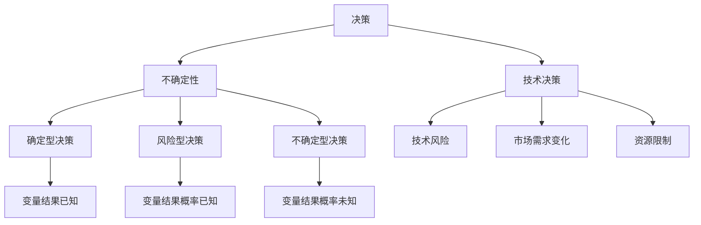

                 

### 文章标题

# 技术决策：在不确定性中做出选择

### 关键词

- 技术决策
- 不确定性
- 决策模型
- 敏感性分析
- 案例研究

### 摘要

在技术领域中，不确定性是决策过程中不可避免的挑战。本文旨在探讨如何在不确定性中做出有效的技术决策。我们将从决策理论、方法和技术工具入手，结合实际案例，分析技术决策的框架和策略。通过本文，读者将了解如何量化不确定性、运用不同的决策模型和工具，以及如何在动态和有限资源的环境中进行技术决策。

### 目录

## Part 1: 基础知识

### 1.1 决策与不确定性的基础概念

在技术决策中，理解不确定性的基础概念至关重要。首先，我们需要了解什么是决策以及决策的类型。决策是指从多个可选方案中选择一个最合适的行动过程。技术决策通常涉及复杂的系统和技术问题，因此在决策过程中，不确定性是一个主要因素。

不确定性可以来源于多种来源，包括技术风险、市场需求变化、资源限制等。技术风险是指新技术或方法可能带来的不确定性，如性能、稳定性、安全性等问题。市场需求变化可能导致现有技术的过时，从而影响决策。资源限制则可能要求决策者在有限的预算和时间范围内做出选择。

决策的类型主要包括以下几种：

1. **确定型决策**：所有相关变量的结果都是已知的，例如在确定预算内选择最佳技术方案。
2. **风险型决策**：所有可能结果的概率是已知的，例如在多个技术方案中分配预算。
3. **不确定型决策**：可能结果的概率未知，决策者必须在不确定性中做出选择。

在技术决策中，不确定性是一个常见的挑战，它要求决策者不仅要考虑当前的情况，还要预见可能的变化。有效的决策方法可以帮助管理者更好地应对不确定性，减少风险并提高决策质量。

### 1.2 核心概念之间的关系架构

为了更好地理解决策与不确定性之间的关系，我们可以通过以下Mermaid流程图展示核心概念之间的联系：



### 1.3 决策模型类型

在技术决策过程中，有多种决策模型可供选择，每种模型都有其特定的适用场景和优势。以下是一些常见的决策模型类型：

1. **成本效益分析（CBA）**：成本效益分析是一种评估决策结果成本和收益的方法。它通常用于确定哪种技术方案在经济上是可行的。

    ```mermaid
    graph TB
    A[成本效益分析] --> B[成本评估]
    B --> C[收益评估]
    C --> D[净现值计算]
    D --> E[决策建议]
    ```

2. **决策树**：决策树是一种图形化模型，用于展示不同决策路径及其可能的后果。每个节点代表一个决策点，每个分支代表一个可能的行动方案。

    ```mermaid
    graph TB
    A[决策点] --> B[行动方案1]
    A --> C[行动方案2]
    B --> D[结果1]
    C --> E[结果2]
    ```

3. **回归分析**：回归分析是一种统计方法，用于预测一个或多个自变量与因变量之间的关系。它可以帮助决策者理解不同变量对结果的影响。

    ```mermaid
    graph TB
    A[回归分析] --> B[X1变量]
    A --> C[X2变量]
    A --> D[Y变量]
    B --> E[系数]
    C --> E
    ```

4. **贝叶斯网络**：贝叶斯网络是一种概率图模型，用于表示一组随机变量之间的条件依赖关系。它可以帮助决策者量化不确定性，并基于概率信息进行决策。

    ```mermaid
    graph TB
    A[变量1] --> B[变量2]
    A --> C[变量3]
    B --> D[变量4]
    C --> D
    ```

选择合适的决策模型取决于决策的具体情况和需求。理解每种模型的工作原理和适用场景可以帮助决策者在不确定性中做出更明智的选择。

### 1.4 不确定性量化与管理的策略

在技术决策中，量化和管理不确定性是关键步骤。以下是一些常用的策略：

1. **敏感性分析**：敏感性分析用于确定决策结果对关键变量的敏感性。通过改变变量值，可以评估其对最终结果的影响。

    ```mermaid
    graph TB
    A[敏感性分析] --> B[变量值变化]
    B --> C[结果变化]
    C --> D[关键变量识别]
    ```

2. **情景规划**：情景规划通过构建多个可能未来的情景，帮助决策者分析和评估不同决策路径的影响。

    ```mermaid
    graph TB
    A[情景规划] --> B[情景1]
    A --> C[情景2]
    A --> D[情景3]
    B --> E[决策路径1]
    C --> F[决策路径2]
    D --> G[决策路径3]
    ```

3. **决策树分析**：决策树分析可以用于展示不同决策路径及其可能的后果，帮助决策者理解和量化不确定性。

    ```mermaid
    graph TB
    A[决策点] --> B[行动方案1]
    A --> C[行动方案2]
    B --> D[结果1]
    C --> E[结果2]
    ```

通过量化和管理不确定性，决策者可以更准确地评估不同决策方案的潜在风险和收益，从而做出更明智的选择。

### 1.5 决策过程中的关键步骤

在技术决策过程中，以下关键步骤有助于确保决策的有效性和质量：

1. **明确目标**：确定决策的目标和优先级，明确决策的意图和期望结果。
2. **收集信息**：收集与决策相关的数据和信息，包括技术性能、市场趋势、资源状况等。
3. **分析选项**：评估不同决策方案的潜在风险和收益，考虑各种可能的结果和不确定性。
4. **制定决策**：根据分析结果和目标，选择最佳决策方案，并制定具体的行动计划。
5. **执行决策**：实施决策方案，并进行监控和调整，以应对可能出现的问题和变化。

通过遵循这些关键步骤，决策者可以确保决策过程的结构化和系统化，从而提高决策质量。

### 1.6 决策中的常见挑战与应对策略

在技术决策过程中，常见的挑战包括信息不足、时间压力、资源限制和决策者偏见等。以下是一些应对策略：

1. **信息不足**：通过多方收集数据、咨询专家和进行市场调研来补充信息。
2. **时间压力**：制定明确的时间表和优先级，合理分配时间和资源。
3. **资源限制**：优化资源配置，考虑可用的技术、预算和人力资源。
4. **决策者偏见**：通过组建多元化的决策团队、使用客观的评估标准和透明的过程来减少偏见。

### 1.7 决策中的道德和伦理考虑

在技术决策过程中，道德和伦理问题同样至关重要。以下是一些关键点：

1. **隐私保护**：确保数据处理符合隐私法规，尊重用户的隐私权。
2. **公平性**：确保决策过程和结果不会加剧社会不平等。
3. **责任归属**：明确决策过程中的责任和风险，确保决策者能够承担责任。

通过考虑这些道德和伦理问题，决策者可以确保技术决策不仅有效，而且符合社会责任。

## Part 2: 决策框架和方法

### 2.1 决策过程

决策过程是一个有序的系统，它包括以下关键步骤：

1. **识别问题**：明确需要决策的问题和目标。
2. **收集信息**：收集与决策相关的数据和信息。
3. **分析选项**：评估不同决策方案的潜在风险和收益。
4. **制定决策**：选择最佳决策方案，并制定具体的行动计划。
5. **执行决策**：实施决策方案，并进行监控和调整。

通过这些步骤，决策者可以确保决策过程的结构化和系统化，从而提高决策质量。

### 2.2 决策理论

决策理论提供了理解决策过程的框架和原则。以下是一些关键理论：

1. **期望效用理论**：决策者在不确定条件下，根据不同结果的概率和效用值来评估行动方案。
2. **最大最小后悔理论**：决策者选择最小化最大后悔程度的行动方案。
3. **有限理性理论**：决策者在信息有限和认知限制下做出决策，追求满意而非最优结果。

### 2.3 决策模型

决策模型是用于模拟和分析决策过程的工具。以下是一些常见的决策模型：

1. **成本效益分析**：评估决策方案的成本和收益，计算净现值。
2. **决策树**：图形化表示决策路径和结果。
3. **回归分析**：分析变量之间的关系，预测结果。
4. **贝叶斯网络**：表示变量之间的概率关系，用于不确定性量化。

### 2.4 决策工具

在实际决策过程中，多种工具可以协助决策者：

1. **敏感性分析**：分析决策结果对关键变量的敏感性。
2. **情景规划**：构建不同的未来情景，评估决策路径的影响。
3. **模拟和优化**：使用模拟和优化算法，评估决策方案的性能。
4. **数据可视化**：使用图表和图形，直观展示决策结果。

通过结合这些框架、理论和工具，决策者可以更好地应对不确定性，做出明智的决策。

## Part 3: 实际应用案例

### 3.1 案例研究

为了更好地理解技术决策在现实中的应用，我们来看几个实际案例。

#### 案例一：科技公司的产品开发决策

某科技公司计划开发一款新型智能手机，需要做出多项技术决策。以下是其决策过程的关键步骤：

1. **识别问题**：确定智能手机的核心功能和性能要求。
2. **收集信息**：分析市场趋势、竞争对手产品、用户需求等。
3. **分析选项**：评估不同硬件配置、操作系统和功能模块的潜在影响。
4. **制定决策**：选择最佳硬件配置和操作系统，并制定开发计划。
5. **执行决策**：实施开发计划，并监控进度和质量。

通过这一过程，科技公司能够确保其新产品在市场上具有竞争力。

#### 案例二：医院信息系统升级决策

某医院计划升级其信息系统，以提高医疗服务的效率和患者满意度。以下是其决策过程：

1. **识别问题**：明确现有信息系统的不足之处和需要改进的方面。
2. **收集信息**：分析市场需求、患者反馈、技术供应商等。
3. **分析选项**：评估不同信息系统供应商的解决方案。
4. **制定决策**：选择最佳解决方案，并制定实施计划。
5. **执行决策**：实施新系统，并进行培训和测试。

通过这一过程，医院能够提高其信息系统的性能，从而提升医疗服务质量。

#### 案例三：初创公司的融资决策

某初创公司需要决定是否进行融资，以下是其决策过程：

1. **识别问题**：确定公司发展所需的资金和融资来源。
2. **收集信息**：分析市场机会、竞争态势、公司财务状况等。
3. **分析选项**：评估不同融资方式的优缺点，如天使投资、风险投资、银行贷款等。
4. **制定决策**：选择最适合公司的融资方式，并制定融资计划。
5. **执行决策**：实施融资计划，并监控融资效果。

通过这一过程，初创公司能够获得所需资金，推动业务发展。

### 3.2 决策过程中的挑战和解决方案

在实际应用中，技术决策过程往往面临多种挑战。以下是一些常见挑战及其解决方案：

1. **信息不足**：通过市场调研、用户反馈、专家咨询等方式补充信息。
2. **时间压力**：制定明确的时间表和优先级，合理分配时间和资源。
3. **资源限制**：优化资源配置，考虑可用的技术、预算和人力资源。
4. **决策者偏见**：通过组建多元化的决策团队、使用客观的评估标准和透明的过程来减少偏见。

通过识别并解决这些挑战，决策者可以更好地应对不确定，做出更明智的决策。

### 3.3 案例小结

通过上述案例，我们可以看到，技术决策在现实中的应用涵盖了多个领域，包括产品开发、医疗服务和初创公司融资。有效的技术决策不仅依赖于决策框架和方法，还需要应对实际操作中的挑战。通过综合考虑信息、时间和资源等因素，决策者可以做出更明智的决策，推动业务和技术的发展。

## Part 4: 未来展望与道德伦理

### 4.1 未来趋势

随着技术的快速发展，技术决策领域也在不断演变。以下是一些未来趋势：

1. **人工智能的应用**：人工智能（AI）在决策过程中发挥着越来越重要的作用，通过机器学习算法和大数据分析，AI可以帮助决策者更好地理解和应对不确定性。
2. **自动化决策系统**：自动化决策系统（ADS）通过集成多种决策模型和工具，可以实现更高效、更准确的决策过程。
3. **区块链技术**：区块链技术提供了一种去中心化的数据存储和验证方式，有助于提高决策过程的透明度和可信度。
4. **可持续性考虑**：随着环保意识的提升，可持续性成为技术决策的一个重要方面，决策者需要考虑环境影响和资源利用效率。

### 4.2 道德伦理问题

在技术决策过程中，道德伦理问题同样至关重要。以下是一些关键点：

1. **隐私保护**：在数据处理和决策过程中，必须遵守隐私保护法规，确保用户数据的隐私和安全。
2. **公平性**：技术决策不应加剧社会不平等，决策过程和结果应公平对待所有相关方。
3. **透明度**：决策过程应公开透明，确保决策的公正性和可追溯性。
4. **责任归属**：决策者应明确自身责任，确保在决策过程中承担责任。

通过关注这些道德伦理问题，决策者可以确保技术决策不仅有效，而且符合社会和道德标准。

### 4.3 未来发展方向

未来的技术决策领域将朝着更智能、更自动化和更可持续的方向发展。以下是一些建议的发展方向：

1. **提高决策效率**：通过引入新的算法和技术，提高决策过程的效率和质量。
2. **增强决策透明度**：通过区块链等技术，提高决策过程的透明度和可追溯性。
3. **强化决策伦理**：在决策过程中，充分考虑道德和伦理因素，确保决策符合社会和道德标准。
4. **跨学科合作**：加强跨学科合作，结合不同领域的知识和经验，提高技术决策的综合能力。

通过这些发展方向，决策者可以更好地应对未来的挑战，实现更有效的技术决策。

## 总结

本文详细探讨了技术决策：在不确定性中做出选择的主题。我们从基础概念、决策框架和方法、实际应用案例、未来趋势和道德伦理等方面进行了深入分析。通过理解决策与不确定性的关系，运用不同的决策模型和工具，决策者可以更有效地应对不确定性，做出明智的决策。

在技术领域中，不确定性是决策过程中不可避免的挑战。因此，掌握技术决策的方法和策略至关重要。通过本文的探讨，读者可以了解如何量化不确定性、运用不同的决策模型和工具，以及如何在动态和有限资源的环境中进行技术决策。

在技术决策过程中，不仅需要考虑技术本身的因素，还要关注道德伦理和社会责任。通过遵循合理的决策过程，结合多种方法和工具，决策者可以做出更明智的决策，推动业务和技术的发展。

未来的技术决策领域将继续朝着更智能、更自动化和更可持续的方向发展。因此，持续学习和关注技术动态对于决策者来说至关重要。通过不断优化决策方法和策略，我们可以更好地应对未来挑战，实现更高效、更公正的技术决策。

最后，感谢读者对本文的关注，希望本文能为您提供有价值的信息和启发。如果您对技术决策有任何疑问或建议，欢迎在评论区留言，我们将持续为您提供最新的技术动态和深入分析。

### 作者信息

- 作者：AI天才研究院/AI Genius Institute & 禅与计算机程序设计艺术 /Zen And The Art of Computer Programming

