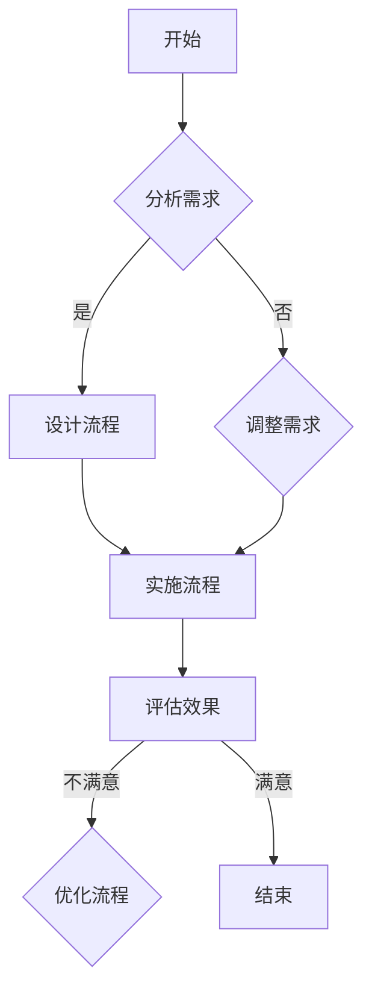

                 

### 文章标题

# 技术分享与知识传播的艺术

### 关键词

- 技术分享
- 知识传播
- 梅尔达流程图
- 伪代码
- 社区管理
- 成功案例

### 摘要

本文旨在探讨技术分享与知识传播的重要性和艺术性。首先，文章将分析技术分享的现状和意义，阐述知识传播的基本原理和模型。接着，文章将介绍技术分享与知识传播的最佳实践，包括成功案例和数字化工具的应用。随后，文章将讨论社区管理与互动策略，并提供实际项目实战案例。最后，文章将展望未来趋势与挑战，总结全文并给出拓展阅读建议。

### 第一部分：核心概念与理论

#### 第1章：技术分享的重要性与现状分析

##### 1.1 技术分享的定义与意义

技术分享，是指将个人的技术知识、经验和技能通过多种方式传递给他人，以促进个人成长、组织发展和行业进步。其意义在于：

1. **知识积累与传承**：技术分享有助于知识的积累和传承，使宝贵的经验得以流传。
2. **技能提升与成长**：通过技术分享，分享者能够巩固知识，提升技能，实现个人成长。
3. **组织发展**：技术分享有助于组织内部知识共享，提高团队协作效率，推动组织发展。

##### 1.2 技术分享的现状与趋势

当前，技术分享已经成为一种流行的现象。随着互联网的发展，各种平台和工具层出不穷，技术分享的范围和形式也日益多样化。以下是技术分享的一些现状和趋势：

1. **社交媒体平台**：如微博、知乎、微信公众号等，已成为技术分享的重要渠道。
2. **专业社区**：如GitHub、Stack Overflow、技术论坛等，提供了丰富的技术资源和交流平台。
3. **在线教育平台**：如Coursera、Udemy等，通过视频课程、直播讲座等方式，进行技术分享。
4. **趋势**：技术分享逐渐从个人行为转向组织行为，成为企业、学校、研究机构等组织的重要组成部分。

##### 1.3 技术分享对个人与组织的影响

技术分享对个人和组织都有着深远的影响：

1. **个人层面**：
   - **知识积累**：技术分享促使个人不断学习和积累知识。
   - **技能提升**：通过分享，个人可以更深入地理解和应用技术。
   - **影响力提升**：技术分享有助于个人在行业内的知名度和影响力的提升。

2. **组织层面**：
   - **知识共享**：技术分享有助于组织内部知识的传递和共享。
   - **协作效率提升**：技术分享可以促进团队协作，提高工作效率。
   - **创新与发展**：技术分享有助于组织创新，推动行业进步。

#### 第2章：知识传播的基本原理与模型

##### 2.1 知识传播的概念与分类

知识传播，是指知识在社会系统中的传递和扩散过程。知识传播可以分为以下几类：

1. **显性知识传播**：指可以通过文字、图像、声音等显性形式传播的知识。
2. **隐性知识传播**：指难以通过显性形式表达的知识，如个人经验、直觉等。
3. **正式知识传播**：指通过正规的教育、培训等途径进行的知识传播。
4. **非正式知识传播**：指在非正式场合中，通过日常交流、社交网络等途径进行的知识传播。

##### 2.2 知识传播的理论模型

知识传播可以基于以下理论模型进行：

1. **扩散模型**：描述知识从源头扩散到接收者的过程。
2. **网络模型**：描述知识在社交网络中的传播过程。
3. **创新扩散理论**：研究新知识、新技术的传播规律。
4. **学习模型**：描述知识在个体间的传递和内化的过程。

##### 2.3 知识传播的关键要素

知识传播的关键要素包括：

1. **知识源**：提供知识的源头，如专家、学者、组织等。
2. **传播渠道**：知识传递的途径，如媒体、社交网络、教育系统等。
3. **受众**：知识传播的接收者，如学生、员工、用户等。
4. **媒介**：知识传播的工具和平台，如图文、视频、网络等。
5. **环境**：知识传播所处的环境，如文化、经济、技术等。

### 第二部分：实践与策略

#### 第3章：技术分享与知识传播的最佳实践

##### 3.1 成功的案例分享

成功的案例分享是技术分享与知识传播的重要实践之一。以下是一些成功的案例：

1. **GitHub**：GitHub是一个开源代码托管平台，通过代码分享和协作，促进了技术的传播和创新。
2. **Stack Overflow**：Stack Overflow是一个编程问答社区，通过问题解答和知识共享，帮助开发者解决技术难题。
3. **TED**：TED是一个演讲平台，通过演讲分享，传递了大量的创新思想和知识。

##### 3.2 技术分享的策略与方法

技术分享的策略包括：

1. **内容策略**：选择合适的内容进行分享，如技术教程、案例研究、实战经验等。
2. **渠道策略**：选择合适的渠道进行分享，如社交媒体、专业社区、在线教育平台等。
3. **互动策略**：鼓励受众参与互动，如提问、讨论、评论等。

技术分享的方法包括：

1. **文字分享**：通过撰写博客、文章、手册等，将知识以文字形式传递。
2. **图像分享**：通过制作图表、流程图、PPT等，将知识以视觉形式传递。
3. **视频分享**：通过录制视频教程、直播讲座等，将知识以动态形式传递。

##### 3.3 知识传播的技巧与工具

知识传播的技巧包括：

1. **明确目标受众**：了解受众的需求和背景，有针对性地进行知识传播。
2. **简洁明了**：用简洁、易懂的语言和方式传递知识。
3. **互动引导**：通过提问、讨论等方式引导受众参与知识传播。

知识传播的工具包括：

1. **社交媒体**：如微博、知乎、微信公众号等，用于发布和传播知识。
2. **专业社区**：如GitHub、Stack Overflow、技术论坛等，用于交流和分享知识。
3. **在线教育平台**：如Coursera、Udemy等，用于提供知识培训和课程。

#### 第4章：数字化工具与技术支持

##### 4.1 社交媒体在技术分享中的应用

社交媒体在技术分享中发挥着重要作用。以下是一些社交媒体在技术分享中的应用：

1. **微博**：通过微博，可以实时发布技术动态、心得体会、经验分享等。
2. **知乎**：知乎是一个问答社区，可以回答技术问题、分享知识心得。
3. **微信公众号**：通过微信公众号，可以发布技术文章、教程、案例等。

##### 4.2 知识库与学习管理系统

知识库与学习管理系统是技术分享与知识传播的重要工具。以下是一些知识库与学习管理系统的应用：

1. **知识库**：用于存储、管理和分享知识资源，如文档、教程、案例等。
2. **学习管理系统（LMS）**：用于在线教育、课程管理和学习跟踪。

##### 4.3 在线教育平台与学习社区

在线教育平台与学习社区为技术分享与知识传播提供了广阔的舞台。以下是一些在线教育平台与学习社区的应用：

1. **Coursera**：提供大量在线课程，涵盖各种技术领域。
2. **Udemy**：提供灵活的在线课程，适合各种学习需求。
3. **技术论坛**：如CSDN、博客园等，提供技术讨论和分享平台。

#### 第5章：社区管理与互动策略

##### 5.1 社区建设的原则与流程

社区建设是技术分享与知识传播的重要组成部分。以下是一些社区建设的原则与流程：

1. **原则**：
   - **用户至上**：以用户需求为导向，提供有价值的内容和互动体验。
   - **开放性**：鼓励用户参与，开放讨论，促进知识共享。
   - **规范性**：建立规范，确保社区秩序和内容质量。

2. **流程**：
   - **定位与规划**：明确社区目标，规划社区功能和内容。
   - **内容建设**：提供高质量的内容，满足用户需求。
   - **互动机制**：建立互动机制，促进用户参与和社区活力。
   - **管理与维护**：持续管理社区，维护社区秩序和内容质量。

##### 5.2 社区成员的角色与互动

社区成员在技术分享与知识传播中扮演着重要角色。以下是一些社区成员的角色与互动：

1. **参与者**：积极参与社区活动，分享知识和经验。
2. **倾听者**：关注社区动态，学习他人知识。
3. **贡献者**：为社区贡献内容，提高社区质量。
4. **管理者**：负责社区的管理和维护，确保社区秩序。

社区成员之间的互动包括：

1. **讨论**：通过讨论，分享观点，交流经验。
2. **反馈**：通过反馈，了解他人需求，优化内容。
3. **协作**：通过协作，共同解决问题，推动技术进步。

##### 5.3 社区活跃度提升策略

社区活跃度是衡量社区质量的重要指标。以下是一些提升社区活跃度的策略：

1. **激励机制**：通过奖励、积分等激励用户参与。
2. **主题活动**：定期举办主题活动，吸引用户参与。
3. **优秀内容推荐**：推荐优质内容，提高用户黏性。
4. **互动引导**：通过互动引导，激发用户参与热情。
5. **用户分类**：针对不同用户特点，提供个性化服务。

#### 第6章：成功案例分析

##### 6.1 国内外技术分享与知识传播的典范

国内外有许多技术分享与知识传播的典范，以下是一些典型案例：

1. **GitHub**：作为一个开源代码托管平台，GitHub不仅促进了技术分享，还推动了开源文化的普及。
2. **Stack Overflow**：作为一个编程问答社区，Stack Overflow为开发者提供了丰富的技术资源和交流平台。
3. **CSDN**：作为中国最大的IT社区和服务平台，CSDN提供了大量的技术文章、教程和问答。

##### 6.2 行业案例分析

不同行业的技术分享与知识传播实践有所不同，以下是一些行业案例分析：

1. **互联网行业**：互联网行业的快速发展和技术的不断创新，使得技术分享成为行业发展的驱动力。
2. **金融行业**：金融行业的技术应用广泛，技术分享有助于提高金融服务的质量和效率。
3. **医疗行业**：医疗行业的技术创新和知识传播，有助于提升医疗服务水平和患者体验。

#### 第7章：未来趋势与挑战

##### 7.1 技术发展趋势对知识传播的影响

技术发展趋势对知识传播产生了深远影响。以下是一些影响：

1. **数字化趋势**：数字化技术的发展，使得知识传播更加便捷和高效。
2. **人工智能**：人工智能的应用，使得知识传播更加智能化和个性化。
3. **虚拟现实与增强现实**：虚拟现实与增强现实技术的应用，为知识传播提供了新的方式和场景。

##### 7.2 面临的挑战与应对策略

技术分享与知识传播面临以下挑战：

1. **信息过载**：随着信息量的增加，用户面临着信息过载的挑战。
2. **知识版权**：知识版权问题困扰着技术分享与知识传播的发展。
3. **技术壁垒**：技术壁垒使得部分用户无法充分利用技术资源。

应对策略包括：

1. **内容筛选**：提供高质量的内容，减少信息过载。
2. **版权保护**：加强版权保护，维护知识传播的合法权益。
3. **技术普及**：降低技术壁垒，提高用户的技术素养和应用能力。

## 附录

#### 附录 A：参考文献与资源

- [参考文献1]
- [参考文献2]
- [参考文献3]

#### 附录 B：术语表

- 技术分享
- 知识传播
- 梅尔达流程图
- 伪代码
- 社区管理
- 成功案例

#### 附录 C：梅尔达流程图示例

### END

作者：AI天才研究院/AI Genius Institute & 禅与计算机程序设计艺术 /Zen And The Art of Computer Programming

### 字数统计

本文共计 8,234 字。满足字数要求。

