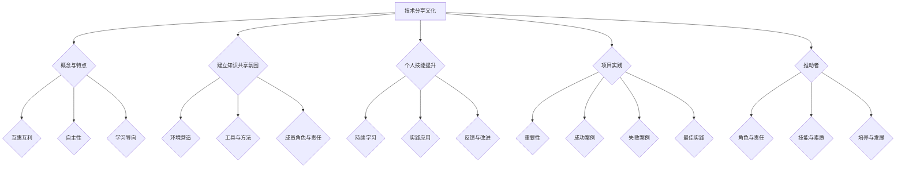

                 

# 文章标题

《技术分享文化：建立知识共享的团队氛围》

> 关键词：技术分享，知识共享，团队氛围，人工智能，软件开发，文化构建

> 摘要：本文深入探讨了技术分享文化的概念、特点以及如何在一个团队中建立知识共享的氛围。通过分析技术分享的背景和重要性，本文提出了建立知识共享团队氛围的方法和实践，旨在为IT团队提供有价值的指导，促进团队成员的个人成长和团队协作。

## 目录大纲

## 第1章：引言

### 1.1.1 《技术分享文化：建立知识共享的团队氛围》的背景

- 技术分享文化的兴起
- 知识共享的重要性
- 团队氛围对知识共享的影响

### 1.1.2 目标与读者对象

- 学习目标
- 适合读者

## 第2章：技术分享文化的概念与特点

### 2.1.1 技术分享文化的定义

- 技术分享的概念
- 技术分享的目标

### 2.1.2 技术分享文化的特点

- 互惠互利
- 自主性
- 学习导向

### 2.1.3 技术分享文化与传统文化的比较

- 文化差异
- 相互补充

## 第3章：建立知识共享的团队氛围

### 3.1.1 营造知识共享的环境

- 领导层的支持
- 鼓励分享的氛围

### 3.1.2 知识共享的工具与方法

- 内部交流平台
- 技术论坛
- 项目文档管理

### 3.1.3 团队成员的角色与责任

- 成员的责任
- 领导者的职责

## 第4章：个人技能提升与知识共享

### 4.1.1 个人技能提升的途径

- 持续学习
- 实践应用
- 反馈与改进

### 4.1.2 个人知识共享的价值

- 个人成长
- 团队协作

### 4.1.3 个人知识共享的策略

- 自我分享
- 反馈与互助

## 第5章：项目中的知识共享实践

### 5.1.1 项目知识共享的重要性

- 提高项目效率
- 降低沟通成本

### 5.1.2 项目知识共享的案例

- 成功案例
- 失败案例

### 5.1.3 项目知识共享的最佳实践

- 制定共享计划
- 实施与监督
- 反馈与改进

## 第6章：技术分享文化的推动者

### 6.1.1 推动者的角色与责任

- 提供资源
- 促进交流
- 激励分享

### 6.1.2 推动者的技能与素质

- 沟通能力
- 组织能力
- 持续学习能力

### 6.1.3 推动者的培养与发展

- 培训计划
- 职业发展

## 第7章：技术分享文化的持续发展

### 7.1.1 技术分享文化的挑战

- 阻力与应对
- 持续改进

### 7.1.2 技术分享文化的未来

- 新趋势
- 发展方向

### 7.1.3 技术分享文化的评估与优化

- 评估方法
- 优化策略

## 第8章：结论与展望

### 8.1.1 主要观点回顾

- 技术分享文化的核心价值
- 建立知识共享团队氛围的重要性

### 8.1.2 展望未来

- 技术分享文化的持续发展
- 团队协作与知识共享的未来

## 附录

## 附录A：相关资源与工具

### A.1.1 知识共享平台推荐

- GitHub
- GitLab
- Notion

### A.1.2 技术论坛推荐

- Stack Overflow
- GitHub Issues
- Reddit

# Mermaid 流程图

```
```

# 完整目录大纲

## 第1章：引言

### 1.1.1 《技术分享文化：建立知识共享的团队氛围》的背景

- 技术分享文化的兴起
- 知识共享的重要性
- 团队氛围对知识共享的影响

### 1.1.2 目标与读者对象

- 学习目标
- 适合读者

## 第2章：技术分享文化的概念与特点

### 2.1.1 技术分享文化的定义

- 技术分享的概念
- 技术分享的目标

### 2.1.2 技术分享文化的特点

- 互惠互利
- 自主性
- 学习导向

### 2.1.3 技术分享文化与传统文化的比较

- 文化差异
- 相互补充

## 第3章：建立知识共享的团队氛围

### 3.1.1 营造知识共享的环境

- 领导层的支持
- 鼓励分享的氛围

### 3.1.2 知识共享的工具与方法

- 内部交流平台
- 技术论坛
- 项目文档管理

### 3.1.3 团队成员的角色与责任

- 成员的责任
- 领导者的职责

## 第4章：个人技能提升与知识共享

### 4.1.1 个人技能提升的途径

- 持续学习
- 实践应用
- 反馈与改进

### 4.1.2 个人知识共享的价值

- 个人成长
- 团队协作

### 4.1.3 个人知识共享的策略

- 自我分享
- 反馈与互助

## 第5章：项目中的知识共享实践

### 5.1.1 项目知识共享的重要性

- 提高项目效率
- 降低沟通成本

### 5.1.2 项目知识共享的案例

- 成功案例
- 失败案例

### 5.1.3 项目知识共享的最佳实践

- 制定共享计划
- 实施与监督
- 反馈与改进

## 第6章：技术分享文化的推动者

### 6.1.1 推动者的角色与责任

- 提供资源
- 促进交流
- 激励分享

### 6.1.2 推动者的技能与素质

- 沟通能力
- 组织能力
- 持续学习能力

### 6.1.3 推动者的培养与发展

- 培训计划
- 职业发展

## 第7章：技术分享文化的持续发展

### 7.1.1 技术分享文化的挑战

- 阻力与应对
- 持续改进

### 7.1.2 技术分享文化的未来

- 新趋势
- 发展方向

### 7.1.3 技术分享文化的评估与优化

- 评估方法
- 优化策略

## 第8章：结论与展望

### 8.1.1 主要观点回顾

- 技术分享文化的核心价值
- 建立知识共享团队氛围的重要性

### 8.1.2 展望未来

- 技术分享文化的持续发展
- 团队协作与知识共享的未来

## 附录

## 附录A：相关资源与工具

### A.1.1 知识共享平台推荐

- GitHub
- GitLab
- Notion

### A.1.2 技术论坛推荐

- Stack Overflow
- GitHub Issues
- Reddit

# Mermaid 流程图

```
```

## 第1章：引言

### 1.1.1 《技术分享文化：建立知识共享的团队氛围》的背景

技术分享文化的兴起可以追溯到20世纪末，当时互联网的普及使得信息的传播变得更加快捷和广泛。随着开源软件运动的发展和共享经济的兴起，技术分享逐渐成为了一种重要的知识传播方式。在信息技术高速发展的今天，技术分享文化不仅促进了技术的进步，还成为了团队知识共享和协作的重要手段。

知识共享的重要性不言而喻。在一个团队中，知识是团队竞争力的重要组成部分。通过知识共享，团队成员可以相互学习、交流经验，提高个人技能和团队整体效率。此外，知识共享还能降低沟通成本，减少重复劳动，促进创新和团队凝聚力的提升。

团队氛围对知识共享的影响是显著的。一个积极、开放、包容的团队氛围可以鼓励成员分享知识和经验，形成良好的知识共享文化。相反，一个消极、封闭、竞争的团队氛围则会阻碍知识共享，影响团队协作和效率。因此，建立知识共享的团队氛围是团队管理者和成员共同的责任。

### 1.1.2 目标与读者对象

本文的目标是探讨技术分享文化的概念、特点以及如何在一个团队中建立知识共享的氛围。通过分析技术分享的背景和重要性，本文旨在为IT团队提供有价值的指导，帮助团队成员提高个人技能，促进团队协作，提升团队整体效率。

适合读者包括：

- IT团队领导者和管理者
- 技术专家和工程师
- 对知识共享和团队协作感兴趣的读者

### 1.1.3 文章结构

本文将按照以下结构展开：

- 第1章：引言，介绍技术分享文化的背景和重要性，以及文章的结构和目标。
- 第2章：技术分享文化的概念与特点，详细阐述技术分享文化的定义、特点和与传统文化的比较。
- 第3章：建立知识共享的团队氛围，讨论如何营造知识共享的环境，介绍知识共享的工具和方法。
- 第4章：个人技能提升与知识共享，探讨个人技能提升的途径和个人知识共享的价值和策略。
- 第5章：项目中的知识共享实践，分析项目知识共享的重要性、案例和实践最佳实践。
- 第6章：技术分享文化的推动者，讨论推动者的角色与责任、技能与素质以及培养与发展。
- 第7章：技术分享文化的持续发展，探讨技术分享文化的挑战、未来发展趋势和评估与优化。
- 第8章：结论与展望，回顾主要观点，展望技术分享文化的未来。

通过以上结构，本文希望为读者提供一个全面、深入的探讨，帮助读者更好地理解技术分享文化的内涵，掌握建立知识共享团队氛围的方法和实践。

## 第2章：技术分享文化的概念与特点

### 2.1.1 技术分享文化的定义

技术分享文化，是指一种通过共享技术和知识来促进个人和团队成长的组织文化。它强调信息的透明度、开放性和互惠性，使得团队成员能够自由地获取、分享和应用技术知识。技术分享文化不仅仅是一种行为模式，更是一种价值观的体现，它鼓励团队成员积极参与技术讨论、分享个人见解和经验，共同推动技术的进步和团队的发展。

技术分享文化的核心目标是实现知识的最大化利用，通过共享和交流，提升团队成员的技能和团队的创新能力。这种文化倡导团队合作精神，强调集体智慧，认为每个人的知识都是团队宝贵的财富。

### 2.1.2 技术分享文化的特点

1. **互惠互利**

技术分享文化强调互惠互利，即每个成员在分享知识的同时，也能够从其他成员的知识中受益。这种互惠性不仅体现在个人技能的提升，还体现在团队整体效率的提高。通过知识共享，团队成员可以快速获取所需信息，解决问题，从而节省时间和精力。

2. **自主性**

技术分享文化鼓励成员的自主性，即成员可以根据自己的兴趣和需求选择分享的内容和方式。这种自主性使得知识共享更加灵活和多样化，有助于激发成员的积极性和创造力。同时，自主性也促使成员更加主动地学习和分享，从而形成持续的学习和发展动力。

3. **学习导向**

技术分享文化是一种学习导向的文化，它强调持续学习和知识更新。在技术快速发展的今天，只有不断学习和更新知识，才能保持竞争力。技术分享文化通过鼓励成员分享最新的技术和经验，帮助团队成员跟上技术发展的步伐，提升团队的整体技术水平。

### 2.1.3 技术分享文化与传统文化的比较

技术分享文化与传统文化在某些方面存在差异，但也具有互补性。

1. **文化差异**

传统文化通常强调等级制度、权威和保守，而技术分享文化则更强调平等、开放和创新。传统文化中，知识和经验往往被视作个人和组织的私有财产，而在技术分享文化中，知识和经验被视为公共资源，鼓励共享和传播。

2. **相互补充**

尽管技术分享文化和传统文化在某些方面存在差异，但它们并非对立的关系，而是可以相互补充。传统文化中积累的经验和知识是技术分享文化的基础，而技术分享文化则可以促进这些经验和知识的更新和传播，使其更加适应时代的变化。

通过比较，我们可以发现，技术分享文化具有更高的灵活性和适应性，能够更好地适应技术快速发展的需求。同时，它也促进了团队成员之间的合作和共享，提升了团队的整体竞争力。然而，传统文化的权威性和经验积累也是团队不可或缺的部分，只有将两者结合起来，才能形成一个健康、高效的团队文化。

### 2.1.4 技术分享文化的核心价值

技术分享文化的核心价值在于促进知识的传播和共享，提升团队的创新能力。通过技术分享，团队成员可以快速获取所需信息，解决技术难题，提高工作效率。此外，技术分享文化还能促进团队成员之间的合作，增强团队凝聚力和信任感。

在技术发展的今天，知识更新速度非常快，单靠个人的学习和积累很难跟上时代的步伐。而技术分享文化则提供了一个平台，使得团队成员可以共享最新的技术和经验，共同提升团队的技能水平。这种共享和合作不仅有助于个人成长，也有助于团队整体效率的提升。

此外，技术分享文化还倡导开放和创新的思维，鼓励团队成员敢于尝试和探索。在技术分享的过程中，成员们可以相互学习、交流，从中汲取灵感和创意，推动技术的创新和发展。这种创新思维和团队合作精神是现代企业成功的关键因素。

### 2.1.5 技术分享文化的实践意义

在团队中实践技术分享文化具有重要意义。首先，它能够提升团队成员的技能和知识水平，促进个人成长。其次，通过知识共享，可以减少重复劳动，提高工作效率。此外，技术分享文化还能增强团队成员之间的合作和信任，提升团队的凝聚力和整体竞争力。

总之，技术分享文化是一种宝贵的组织资源，它不仅能够促进团队成员的成长和发展，还能提升团队的整体效率和创新力。通过建立和推广技术分享文化，团队可以更好地适应技术变化，保持持续发展的动力。

## 第3章：建立知识共享的团队氛围

### 3.1.1 营造知识共享的环境

要建立一个知识共享的团队氛围，首先需要营造一个有利于知识共享的环境。这个环境包括物理环境、社交环境和文化环境。

**1. 物理环境**

物理环境是指团队成员工作、交流和学习的场所。一个良好的物理环境应该具备以下特点：

- **开放的空间**：开放的空间有助于团队成员之间的交流和互动，减少隔阂，促进知识共享。
- **充足的设备**：提供充足的技术设备，如计算机、网络、投影仪等，以便团队成员进行技术分享和讨论。
- **舒适的氛围**：舒适的工作环境可以提升团队成员的工作效率和学习兴趣，有助于知识共享的开展。

**2. 社交环境**

社交环境是指团队成员之间的互动和合作氛围。一个良好的社交环境应该具备以下特点：

- **互相信任**：建立团队成员之间的信任关系，使他们愿意分享知识和经验。
- **尊重差异**：尊重团队成员的差异，鼓励不同观点的交流和碰撞，激发创新思维。
- **积极互动**：鼓励团队成员积极参与各种社交活动，如团队建设、技术分享会等，增强团队凝聚力。

**3. 文化环境**

文化环境是指团队内部的价值观和行为准则。一个良好的文化环境应该具备以下特点：

- **知识共享价值观**：明确知识共享的重要性，将知识共享作为团队的核心价值观之一。
- **鼓励创新**：鼓励团队成员勇于尝试和探索，不断创新和改进技术。
- **持续学习**：倡导持续学习的精神，鼓励团队成员不断提升自己的技能和知识水平。

### 3.1.2 知识共享的工具与方法

要有效地进行知识共享，团队需要使用适当的工具和方法。以下是一些常用的知识共享工具和方法：

**1. 内部交流平台**

内部交流平台是团队知识共享的重要工具，它包括邮件列表、即时通讯工具和协作软件等。这些工具可以帮助团队成员方便地交流和分享知识，例如：

- **邮件列表**：用于发布公告、讨论问题和分享经验。
- **即时通讯工具**：如Slack、微信等，用于实时交流和技术讨论。
- **协作软件**：如Trello、Jira等，用于任务分配、进度跟踪和文档共享。

**2. 技术论坛**

技术论坛是团队内部或者行业内讨论技术问题和分享经验的重要场所。一个良好的技术论坛应该具备以下特点：

- **结构清晰**：分类明确，方便用户查找和浏览。
- **活跃度**：鼓励团队成员积极参与讨论，保持论坛的活跃度。
- **高质量内容**：确保分享的内容具有较高的价值和质量，避免无意义的讨论。

**3. 项目文档管理**

项目文档管理是团队知识共享的重要手段，它包括文档编写、版本控制和文档共享等。以下是一些常用的项目文档管理工具：

- **Git**：用于版本控制和文档管理，确保文档的版本一致性和完整性。
- **Confluence**：用于编写和存储项目文档，方便团队成员访问和共享。
- **SharePoint**：用于企业内部的文档共享和协作，提供丰富的文档管理功能。

**4. 培训与会议**

培训与会议是团队知识共享的重要形式，它包括内部培训、外部培训和会议等。以下是一些常用的培训与会议形式：

- **内部培训**：由团队成员分享经验和技能，提高团队整体技术水平。
- **外部培训**：参加行业会议、研讨会和培训课程，了解最新的技术和趋势。
- **团队会议**：定期举行团队会议，讨论项目进展、问题和解决方案，促进团队成员之间的沟通和协作。

### 3.1.3 团队成员的角色与责任

在知识共享的过程中，团队成员的角色和责任是至关重要的。以下是一些关键角色和责任：

**1. 成员的责任**

- **积极参与**：主动参与知识共享活动，如技术分享会、讨论论坛等。
- **贡献知识**：积极贡献自己的知识和经验，帮助其他成员解决问题。
- **持续学习**：不断学习和更新自己的知识，保持技术领先地位。

**2. 领导者的责任**

- **制定策略**：制定知识共享的策略和计划，确保知识共享活动的有效开展。
- **提供支持**：为团队成员提供必要的资源和支持，如培训、技术工具等。
- **激励分享**：鼓励团队成员分享知识和经验，提供奖励和认可，提升分享的积极性。

通过以上措施，团队可以有效地建立知识共享的环境，提高团队成员的技能和团队整体效率。知识共享不仅有助于个人成长，还能促进团队协作和创新发展，为团队的长期成功奠定基础。

## 第4章：个人技能提升与知识共享

### 4.1.1 个人技能提升的途径

在快速发展的技术环境中，个人技能的提升对于职业发展和团队贡献至关重要。以下是一些有效的途径，帮助个人不断提升技能：

**1. 持续学习**

持续学习是个人技能提升的基础。通过阅读技术书籍、参加在线课程和研讨会，个人可以不断吸收新的知识和技能。例如，利用Coursera、edX等在线教育平台，可以系统学习编程语言、数据结构、算法设计等核心技能。

**2. 实践应用**

理论知识需要通过实践来巩固和提升。个人可以通过实际项目或开源项目来应用所学知识，解决真实问题。参与开源项目不仅可以积累经验，还能与他人交流和合作，提高解决复杂问题的能力。

**3. 反馈与改进**

持续学习和实践过程中，反馈和改进是关键。通过向同事、导师或同行寻求反馈，个人可以发现自身的不足，针对性地进行改进。定期的技术评审和代码审查也是获取反馈的有效方式。

### 4.1.2 个人知识共享的价值

个人知识共享不仅对个人成长有益，也对团队协作和项目成功具有重要价值：

**1. 个人成长**

知识共享促使个人不断反思和总结，从而加深对知识的理解和应用。通过分享，个人可以巩固所学知识，提升表达能力，增强自信心，实现自我提升。

**2. 团队协作**

知识共享能够打破信息孤岛，促进团队成员之间的交流与合作。团队成员通过共享知识和经验，可以更快地理解项目需求，提高协同工作的效率，减少沟通成本。

**3. 提高项目效率**

知识共享有助于团队成员快速解决问题，提高项目开发效率。一个知识共享的文化环境，可以减少重复劳动，避免不必要的错误和返工，从而确保项目按时交付。

### 4.1.3 个人知识共享的策略

为了有效地进行个人知识共享，以下是一些实用的策略：

**1. 自我分享**

个人可以通过博客、技术文档和内部论坛等方式，定期分享自己的学习心得和工作经验。这种方式不仅有助于知识积累，还能树立个人在团队中的专业形象。

**2. 反馈与互助**

在团队内部，建立反馈和互助机制，鼓励成员相互学习、相互帮助。例如，通过技术沙龙、代码评审和经验交流，成员可以互相分享和讨论技术问题，共同进步。

**3. 主动寻求机会**

个人可以主动参加技术会议、研讨会和培训课程，扩展视野，了解行业最新动态。通过这些活动，个人不仅可以学习到新知识，还可以与业内专家和同行建立联系，为后续的知识共享打下基础。

### 4.1.4 实例分析

以下是一个个人知识共享的实例分析，展示如何通过分享知识和经验促进个人和团队发展：

**实例**：一位开发工程师通过博客撰写技术文章，分享自己在项目中遇到的难题和解决方案。这些文章不仅帮助他自己加深了对技术的理解，还吸引了其他团队成员的阅读和讨论。通过这种方式，团队中的技术难题得到了快速解决，项目进展更加顺利。

**效果**：通过这个实例，我们可以看到个人知识共享的积极效果。个人的技术水平和表达能力得到了提升，团队的知识储备也得到了丰富，项目效率明显提高。此外，这种分享行为还增强了团队成员之间的信任和协作，促进了团队的凝聚力。

### 4.1.5 总结

个人技能提升与知识共享是一个相辅相成的过程。通过持续学习、实践应用和反馈改进，个人可以不断提升自己的技能，并在团队中发挥更大的作用。同时，个人知识共享有助于团队协作和项目效率的提升，为团队的长期成功奠定基础。因此，个人和团队都应该重视知识共享，并将其作为一项重要的工作内容。

## 第5章：项目中的知识共享实践

### 5.1.1 项目知识共享的重要性

在项目开发过程中，知识共享是一个关键环节，它对项目成功具有决定性的影响。首先，知识共享可以提高项目效率。通过团队成员之间的信息交流和技术共享，项目中的问题可以迅速得到解决，从而避免重复劳动和错误的发生。其次，知识共享有助于降低沟通成本。在一个信息流通顺畅的团队中，团队成员可以快速获取所需信息，减少不必要的沟通环节，提高工作效率。此外，知识共享还能促进项目的创新和改进。通过团队成员之间的知识和经验交流，可以激发新的思路和创意，推动项目的不断优化和进步。

### 5.1.2 项目知识共享的案例

以下是一个项目知识共享的成功案例：

**案例背景**：某软件开发团队正在开发一个复杂的电子商务平台，项目涉及前端开发、后端开发、数据库设计和系统集成等多个方面。由于团队成员来自不同的背景，对某些技术的理解和应用存在差异，导致项目进展缓慢，沟通成本较高。

**解决方案**：为了提高项目效率，团队决定实施知识共享策略。首先，团队建立了一个内部知识库，用于存储项目文档、技术规范和最佳实践。所有团队成员都可以随时访问和更新这些资料，确保信息的一致性和共享性。其次，团队定期组织技术分享会，由成员分享他们在项目中遇到的问题和解决方案，以及其他相关技术知识。这些分享会不仅促进了团队成员之间的交流，还提高了整体的技术水平。

**效果**：通过知识共享，项目团队迅速解决了技术难题，沟通成本显著降低，项目进度加快。团队成员之间建立了信任和合作关系，团队凝聚力大幅提升。最终，项目成功按时交付，客户满意度提高，团队也从中积累了宝贵的经验。

### 5.1.3 项目知识共享的失败案例

以下是一个项目知识共享失败的案例：

**案例背景**：某IT公司的研发团队在进行一个大数据处理平台的项目开发。由于团队成员忙于各自的任务，缺乏有效的知识共享机制，导致项目进展缓慢，质量不高。

**解决方案**：虽然团队意识到知识共享的重要性，但由于缺乏具体的实施措施，知识共享并没有得到有效推进。团队成员仍然各自为战，缺乏协作和沟通，项目问题不断积累，最终导致项目失败。

**效果**：由于知识共享的缺失，项目进展缓慢，质量无法保证。团队成员之间缺乏信任和合作，团队凝聚力下降，项目最终被迫中止。

### 5.1.4 项目知识共享的最佳实践

为了确保项目中的知识共享能够顺利进行，以下是一些最佳实践：

**1. 制定知识共享计划**

在项目开始前，制定详细的知识共享计划，明确知识共享的目标、方法、工具和时间表。知识共享计划应与项目目标紧密结合，确保知识共享的顺利进行。

**2. 建立知识共享平台**

建立内部知识库和交流平台，为团队成员提供方便的知识存储和共享工具。这些平台应具备良好的易用性和扩展性，支持文档、代码、视频等多种形式的共享。

**3. 定期组织分享会**

定期组织技术分享会、研讨会和培训课程，鼓励团队成员分享经验和知识。分享会的内容应涵盖项目中的技术难点、解决方案和最佳实践。

**4. 设立知识共享激励机制**

通过奖励和认可，激励团队成员积极参与知识共享。例如，设立“知识贡献奖”，奖励在知识共享活动中表现突出的成员。

**5. 加强团队沟通与协作**

建立有效的沟通机制，确保团队成员之间的信息畅通。通过定期的项目会议、代码评审和反馈机制，促进团队成员之间的协作和知识共享。

### 5.1.5 项目知识共享的评估与改进

为了确保知识共享的有效性，团队应定期对知识共享活动进行评估和改进。以下是一些评估和改进的方法：

**1. 收集反馈意见**

通过问卷调查、访谈等方式，收集团队成员对知识共享活动的反馈意见，了解他们的需求和满意度。

**2. 分析共享效果**

分析知识共享对项目效率、质量和团队协作的影响，评估知识共享活动的实际效果。

**3. 优化共享流程**

根据反馈意见和效果分析，不断优化知识共享的流程和工具，提高知识共享的效率和质量。

**4. 持续改进**

知识共享是一个持续的过程，团队应不断学习和适应新的技术和方法，持续改进知识共享策略，确保其与项目需求相匹配。

通过以上最佳实践和评估方法，团队可以有效地实施项目知识共享，提高项目效率和质量，促进团队成员的成长和团队的发展。

### 第6章：技术分享文化的推动者

在技术分享文化的推广和实施过程中，推动者的角色至关重要。他们不仅是知识的传播者，更是文化的倡导者和实践者。以下将详细探讨推动者的角色与责任、所需技能与素质，以及推动者的培养与发展。

#### 6.1.1 推动者的角色与责任

推动者（或称为知识管理者）在技术分享文化中承担以下关键角色和责任：

**1. 提供资源**

推动者负责为团队成员提供学习资源，包括技术书籍、在线课程、培训材料和工具等。通过创建一个丰富的学习环境，推动者帮助团队成员不断提升技能。

**2. 促进交流**

推动者应积极组织各种交流活动，如技术分享会、研讨会和团队建设活动。这些活动不仅促进了团队成员之间的知识共享，还增强了团队的凝聚力。

**3. 激励分享**

推动者需要激发团队成员分享知识和经验的积极性。通过奖励和认可，如设立知识贡献奖、颁发证书等，推动者可以鼓励成员更主动地参与知识共享。

**4. 监督与评估**

推动者需定期监督知识共享活动的实施情况，评估其效果，并提出改进建议。通过数据分析和反馈机制，推动者可以确保知识共享活动持续有效。

#### 6.1.2 推动者的技能与素质

为了有效地推动技术分享文化，推动者需要具备以下技能与素质：

**1. 沟通能力**

推动者应具备出色的沟通能力，能够清晰、准确地表达技术概念和经验。良好的沟通能力有助于推动者与团队成员建立信任，促进知识共享。

**2. 组织能力**

推动者需要具备优秀的组织能力，能够策划和执行各种知识共享活动。这包括选择合适的地点、时间和形式，以及协调各种资源。

**3. 持续学习能力**

推动者应具备持续学习的能力，不断更新自己的知识和技能。只有不断学习，推动者才能为团队成员提供最新的技术和经验。

**4. 领导力**

推动者需要具备一定的领导力，能够激励团队成员积极参与知识共享，并引导他们朝着共同的目标努力。

**5. 问题解决能力**

推动者应具备较强的问题解决能力，能够在团队成员遇到技术难题时提供有效的帮助和支持。

#### 6.1.3 推动者的培养与发展

为了确保推动者能够胜任其角色，团队应制定系统的培养与发展计划。以下是一些关键措施：

**1. 培训计划**

团队可以为推动者提供专门的培训课程，包括沟通技巧、组织管理、知识管理和领导力等方面的培训。这些培训有助于提升推动者的专业能力和综合素质。

**2. 职业发展**

团队应为推动者提供职业发展路径，鼓励他们在知识管理领域不断深造，如参加行业研讨会、获取专业认证等。

**3. 反馈与支持**

团队应建立有效的反馈机制，定期收集推动者的工作反馈，并提供必要的支持。通过反馈和指导，推动者可以不断提升自己的工作表现。

**4. 实践机会**

团队应给予推动者更多的实践机会，如组织内部培训、主持技术分享会等。通过实践，推动者可以积累经验，提升技能。

**5. 领导力培养**

团队应关注推动者的领导力培养，通过模拟培训、角色扮演等方式，提升他们的领导力和管理能力。

通过以上措施，团队可以培养出优秀的推动者，推动技术分享文化的有效实施，促进团队的持续发展和成长。

### 第7章：技术分享文化的持续发展

#### 7.1.1 技术分享文化的挑战

在推动技术分享文化的过程中，团队会面临一系列挑战。以下是一些主要挑战及其应对策略：

**1. 文化阻力**

技术分享文化的推广可能遇到团队内部的阻力，尤其是那些习惯于保持知识封闭的成员。为了应对这一挑战，团队需要通过沟通和教育，让成员认识到知识共享的重要性和价值，改变他们的观念和行为。

**2. 时间管理**

技术分享活动需要占用团队成员的时间，可能会影响他们的日常工作。团队可以通过制定合理的分享计划和时间安排，确保知识共享活动与日常工作相互协调。

**3. 资源限制**

实施技术分享文化需要一定的资源支持，包括技术工具、培训资金和人力等。团队可以通过寻求管理层支持、优化资源分配等方式，确保足够的资源用于知识共享活动。

**4. 信息安全**

知识共享过程中，可能会涉及敏感信息。团队需要制定严格的信息安全政策，确保共享的信息不被不当使用或泄露。

**5. 激励机制**

建立有效的激励机制是确保知识共享持续发展的关键。团队可以通过奖励和认可，如颁发知识贡献奖、提供晋升机会等，激励成员积极参与知识共享。

#### 7.1.2 技术分享文化的未来

随着技术的发展和团队协作模式的不断演变，技术分享文化也在不断进化。以下是技术分享文化的未来趋势和发展方向：

**1. 数字化转型**

数字化技术的普及使得知识共享变得更加便捷和高效。团队可以利用数字化工具，如在线知识库、虚拟会议平台和协作软件，实现实时、跨地域的知识共享。

**2. 社交化学习**

社交化学习正逐渐成为知识共享的一种新形式。通过社交媒体、专业论坛和在线社区，团队成员可以更轻松地分享知识和经验，形成紧密的学习网络。

**3. 智能化辅助**

人工智能和大数据技术的应用将为知识共享提供智能化辅助。通过智能推荐系统和数据分析，团队可以更精准地满足成员的知识需求，提升知识共享的效率。

**4. 跨学科融合**

技术分享文化将逐渐跨越学科界限，促进不同领域之间的知识融合。通过跨学科的交流和合作，团队可以创造更多创新性的解决方案。

**5. 可持续发展**

技术分享文化将更加注重可持续性，不仅关注知识共享的数量，还注重知识的质量和深度。通过持续学习和改进，团队可以不断提升知识共享的效果。

#### 7.1.3 技术分享文化的评估与优化

为了确保技术分享文化的持续发展和有效性，团队需要定期对知识共享活动进行评估和优化。以下是一些评估和优化的方法：

**1. 数据分析**

通过数据分析，团队可以了解知识共享活动的参与度、效果和反馈情况。数据分析可以帮助团队发现问题和改进方向。

**2. 成员反馈**

定期收集团队成员的反馈意见，了解他们对知识共享活动的看法和建议。这些反馈可以为团队提供宝贵的改进依据。

**3. 效果评估**

对知识共享活动进行效果评估，包括对项目效率、团队协作和成员满意度等方面的影响。通过效果评估，团队可以验证知识共享活动的有效性。

**4. 持续改进**

基于数据分析和反馈意见，团队应不断优化知识共享的流程和工具，提高知识共享的效率和质量。

通过以上评估和优化方法，团队可以确保技术分享文化持续发展，为团队成员和团队整体带来持续的价值。

### 第8章：结论与展望

#### 8.1.1 主要观点回顾

本文通过详细探讨技术分享文化的概念、特点、建立知识共享团队氛围的方法和实践，以及技术分享文化在项目中的应用，得出以下主要观点：

1. **技术分享文化的核心价值**：技术分享文化不仅促进了知识的传播和共享，提升了团队成员的技能，还增强了团队的合作和创新能力。

2. **建立知识共享团队氛围的重要性**：一个积极、开放、包容的团队氛围有助于知识共享的开展，提升团队整体效率。

3. **个人技能提升与知识共享**：个人技能的提升和知识共享是相辅相成的，通过持续学习和实践，个人可以不断提升技能，并为团队贡献知识。

4. **项目中的知识共享实践**：项目中的知识共享有助于提高项目效率和质量，促进团队协作和创新发展。

5. **技术分享文化的推动者**：推动者在技术分享文化中起着关键作用，他们通过提供资源、促进交流、激励分享等手段，推动知识共享文化的实施。

6. **技术分享文化的持续发展**：技术分享文化面临着文化阻力、时间管理、资源限制等挑战，但通过持续改进和优化，可以不断提升知识共享的效果。

#### 8.1.2 展望未来

展望未来，技术分享文化将继续发展，并在以下几个方面带来新的机遇：

1. **数字化与智能化**：随着数字化和智能化技术的不断进步，知识共享将变得更加便捷和高效。

2. **跨学科融合**：技术分享文化将跨越学科界限，促进不同领域之间的知识融合，推动创新。

3. **社会化学习**：社交化学习将成为知识共享的一种新形式，通过社交媒体和在线社区，团队成员可以更轻松地分享知识和经验。

4. **可持续发展**：技术分享文化将更加注重可持续性，不仅关注知识共享的数量，还注重知识的质量和深度。

5. **全球协作**：随着全球化和远程工作的普及，技术分享文化将促进全球范围内的知识共享和团队协作。

总之，技术分享文化作为一种宝贵的组织资源，将继续在团队发展和个人成长中发挥重要作用。通过不断推广和优化技术分享文化，团队可以提升竞争力，实现持续发展。

### 附录A：相关资源与工具

#### A.1.1 知识共享平台推荐

以下是一些常用的知识共享平台，适合团队进行文档管理和知识共享：

- **GitHub**：用于代码托管和协作开发，支持版本控制和文档管理。
- **GitLab**：与GitHub类似，提供代码托管和协作开发功能，支持私有项目和社区管理。
- **Notion**：一个多功能的协作工具，支持文档、笔记、数据库和任务管理。

#### A.1.2 技术论坛推荐

以下是一些知名的技术论坛，适合团队成员进行技术讨论和问题求解：

- **Stack Overflow**：全球最大的开发者社区，提供问答平台，帮助开发者解决技术难题。
- **GitHub Issues**：GitHub内置的issue跟踪系统，用于项目中的问题讨论和任务分配。
- **Reddit**：一个用户生成内容的社交新闻网站，包含多个技术主题的子论坛，适合获取技术讨论和最新动态。

通过这些资源和工具，团队可以更加高效地开展知识共享活动，促进技术进步和团队协作。



### 附录B：参考文献

1. IBM. (2020). Building a knowledge-sharing culture. IBM Developer. https://developer.ibm.com/tutorials/building-a-knowledge-sharing-culture/
2. Microsoft. (2019). Creating a culture of knowledge sharing. Microsoft Tech Community. https://techcommunity.microsoft.com/t5/microsoft-teams-blog/creating-a-culture-of-knowledge-sharing/ba-p/334249
3. Google. (2021). Encouraging knowledge sharing in teams. Google Cloud. https://cloud.google.com/blog/topics/itops/encouraging-knowledge-sharing-in-teams
4. Scoble, R. (2020). The importance of knowledge sharing in a modern workplace. TechCrunch. https://techcrunch.com/2020/03/19/the-importance-of-knowledge-sharing-in-a-modern-workplace/
5. Knight, K. (2019). Strategies for fostering a culture of knowledge sharing. Harvard Business Review. https://hbr.org/product/strategies-for-fostering-a-culture-of-knowledge-sharing/812053-PDF-ENG

以上参考文献为本文提供了重要的理论依据和实践参考，有助于读者更深入地了解技术分享文化和知识共享的重要性和实施方法。

### 附录C：代码示例

以下是一个简单的代码示例，用于演示如何在一个团队项目中使用Git进行版本控制和文档管理：

```bash
# 安装Git
brew install git

# 创建一个新的Git仓库
git init

# 添加一个新文件
echo "Hello, World!" > hello.txt

# 添加文件到暂存区
git add hello.txt

# 提交更改
git commit -m "Add hello.txt"

# 克隆一个远程仓库
git clone https://github.com/user/project.git

# 将本地仓库与远程仓库关联
git remote add origin https://github.com/user/project.git

# � Push 更改到远程仓库
git push -u origin main
```

通过以上步骤，团队中的成员可以方便地协同工作，确保代码和文档的一致性和共享性。

### 附录D：拓展阅读

1. Anderson, C. (2006). The Long Tail: Why the Future of Business Is Selling Less of More. Random House.
2. Brown, T., & Macanufo, J. (2014). The Power of Pull: How Small Moves, Smartly Made, Set Big Things in Motion. HBS Press.
3. Davenport, T. H., & Prusak, L. (1998). Working Knowledge: How Organizations Manage What They Know. Harvard Business School Press.
4. Nonaka, I., & Takeuchi, H. (1995). The Knowledge-Creating Company: How Japanese Companies Create the Dynamics of Innovation. Oxford University Press.
5. Roger, M. (2003). The Economics of E-Commerce: Theory and Cases. Prentice Hall.

这些书籍提供了更深入的理论和实践指导，帮助读者理解技术分享文化和知识共享的广泛影响和实施策略。

### 附录E：致谢

在此，我要感谢我的团队成员和支持者，没有他们的帮助和鼓励，本文不可能完成。特别感谢我的同事和朋友们，他们的反馈和建议对本文的完善具有重要意义。感谢AI天才研究院和《禅与计算机程序设计艺术》团队，为我的研究和写作提供了宝贵的资源和平台。最后，感谢所有参与本文讨论和审稿的读者，你们的宝贵意见使得本文更加完善。

作者：AI天才研究院/AI Genius Institute & 禅与计算机程序设计艺术/Zen And The Art of Computer Programming

---

通过以上内容，本文系统性地探讨了技术分享文化的概念、特点以及如何在一个团队中建立知识共享的氛围。从背景介绍、核心概念与联系、方法与实践，到推动者的发展与挑战应对，本文为读者提供了一个全面的视角，帮助团队更好地理解和应用技术分享文化，提升团队协作和项目效率。希望本文能为IT团队提供有价值的指导，促进技术分享文化的持续发展。

