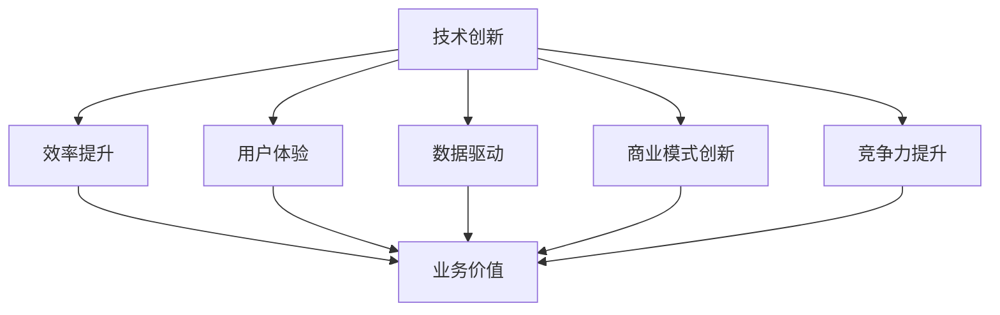

                 

### 文章标题：技术创新与业务价值的结合

#### 关键词：
- 技术创新
- 业务价值
- 云计算
- 物联网
- 人工智能
- 数据分析
- 实战案例

#### 摘要：
本文旨在探讨技术创新如何与业务价值相结合，通过对数据分析、云计算、物联网和人工智能等技术的深入分析，展示它们在不同行业中的应用及其带来的业务价值。文章将通过实际案例和代码实现，详细解读技术创新与业务价值结合的最佳实践，为读者提供有价值的参考和指导。

### 引言

在当今快速发展的科技时代，技术创新已成为推动企业进步和业务增长的关键因素。然而，仅有技术创新还不足以确保企业的成功，关键在于如何将技术创新与业务价值相结合。本文将深入探讨这一主题，旨在为读者揭示技术创新在商业应用中的实际价值。

本文将分为以下几个部分：

1. **核心概念**：首先，我们将介绍技术创新和业务价值的基本概念，并探讨它们之间的联系。
2. **技术篇**：接着，我们将详细介绍数据分析、云计算、物联网和人工智能等关键技术，分析它们的基本原理和应用场景。
3. **应用篇**：在这一部分，我们将探讨这些技术在不同行业中的应用，展示它们如何创造业务价值。
4. **实战篇**：我们将通过实际案例和代码实现，详细解读技术应用的细节，并提供实战经验和最佳实践。
5. **总结篇**：最后，我们将总结全文要点，展望未来发展趋势，并给出相应的建议。

通过这篇文章，我们希望读者能够更深入地理解技术创新与业务价值的结合，并在实际工作中运用这些知识，实现技术和业务的协同发展。

### 核心概念

#### 技术创新

技术创新是指通过引入新的技术、产品或服务，从而改变现有的市场格局或创造新的市场机会。技术创新可以源于技术突破、市场需求变化或企业战略调整。它的核心在于提高效率、降低成本、提升用户体验或创造新的业务模式。

#### 业务价值

业务价值是指技术创新对企业经营产生的实际影响，包括但不限于提高盈利能力、增加市场份额、优化运营效率等。业务价值不仅体现在财务指标上，还包括企业的整体竞争力和长期发展潜力。

#### 技术创新与业务价值的联系

技术创新与业务价值之间的联系可以通过以下几个方面体现：

1. **效率提升**：技术创新可以显著提高生产效率和运营效率，从而降低成本、减少资源浪费。
2. **用户体验**：技术创新可以改善用户体验，提高用户满意度和忠诚度，从而增加市场份额。
3. **数据驱动**：通过数据分析，企业可以更准确地了解市场趋势和用户需求，从而做出更加明智的商业决策。
4. **商业模式创新**：技术创新可以打破传统的商业模式，创造新的收入来源和盈利模式。
5. **竞争力提升**：技术创新可以帮助企业保持竞争优势，即使在激烈的市场环境中也能脱颖而出。

为了更直观地理解技术创新与业务价值之间的联系，我们可以通过一个Mermaid流程图来展示它们之间的相互作用：



通过这个流程图，我们可以看到技术创新是如何通过不同的途径创造业务价值的。理解这一联系对于企业来说至关重要，因为它不仅决定了企业的短期成功，也影响了其长期发展。

### 技术篇

#### 数据分析技术

数据分析技术是指使用统计学、机器学习等方法，从数据中提取有价值的信息和知识。在商业应用中，数据分析可以帮助企业优化运营、提高决策质量、增强用户体验。

**基本原理**：

- 统计分析：通过对数据的描述、建模和预测，分析数据背后的规律和趋势。
- 机器学习：利用算法自动从数据中学习模式，并使用这些模式进行预测或分类。

**应用场景**：

- 营销分析：通过分析用户行为数据，优化营销策略，提高转化率。
- 供应链管理：通过分析供应链数据，优化库存管理和物流配送，降低成本。
- 客户关系管理：通过分析客户数据，提供个性化服务，提高客户满意度和忠诚度。

**算法原理讲解**：

以下是一个简单的数据分析算法——K-均值聚类算法的伪代码：

```plaintext
输入：数据集D，聚类数K
输出：聚类中心C和聚类结果G

1. 随机初始化K个聚类中心C
2. 对于每个数据点x ∈ D，计算它与每个聚类中心的距离，并将其分配到最近的聚类中心
3. 更新聚类中心C，使其成为其所在聚类中点的平均值
4. 重复步骤2和3，直到聚类中心不再变化或达到预设的迭代次数
5. 输出聚类结果G
```

#### 云计算技术

云计算技术通过提供弹性、可扩展的计算资源和服务，帮助企业降低成本、提高效率。云计算可以分为基础设施即服务（IaaS）、平台即服务（PaaS）和软件即服务（SaaS）三种模式。

**基本原理**：

- 虚拟化：通过虚拟化技术，将物理资源抽象成逻辑资源，实现资源的高效利用。
- 分布式计算：将计算任务分布在多个节点上执行，提高计算效率和容错能力。

**应用场景**：

- 大数据应用：利用云计算处理海量数据，实现快速分析和决策。
- 企业应用部署：通过云平台部署企业应用，降低IT基础设施成本。
- 灾难恢复和备份：利用云存储进行数据备份和灾难恢复，确保业务连续性。

**算法原理讲解**：

以下是一个简单的云计算负载均衡算法——轮询算法的伪代码：

```plaintext
输入：请求序列Q，服务器列表S
输出：服务器的响应序列R

1. 初始化服务器列表S的索引i为0
2. 对于每个请求r ∈ Q，执行以下步骤：
   a. 将请求r分配到当前索引i对应的服务器s[i]
   b. 更新索引i：(i + 1) % |S|
   c. 将服务器s[i]的响应r'加入响应序列R
3. 输出响应序列R
```

#### 物联网技术

物联网技术通过连接物理设备和系统，实现智能监控、自动化控制和管理。物联网的核心在于传感器、网络和数据处理。

**基本原理**：

- 传感器：通过传感器收集环境数据和设备状态信息。
- 网络连接：通过无线或有线网络将传感器和设备连接起来，实现数据的传输和共享。
- 数据处理：利用云计算和大数据技术，对收集的数据进行处理和分析。

**应用场景**：

- 智能家居：通过物联网设备实现家居自动化和远程控制。
- 智能制造：通过物联网技术实现生产过程的实时监控和优化。
- 智慧城市：通过物联网技术实现城市管理、交通监控和公共安全等方面的智能化。

**算法原理讲解**：

以下是一个简单的物联网设备连接算法——蓝牙配对算法的伪代码：

```plaintext
输入：设备列表D，蓝牙配对参数P
输出：配对成功的设备对S

1. 初始化设备列表D的索引i为0
2. 对于每个设备d ∈ D，执行以下步骤：
   a. 启动蓝牙配对过程
   b. 检查设备d与参数P是否匹配
   c. 如果匹配，将设备d与当前索引i对应的其他设备配对，并加入配对成功的设备对S
   d. 更新索引i：(i + 1) % |D|
3. 输出配对成功的设备对S
```

#### 人工智能技术

人工智能技术通过模拟人类智能，实现自动化学习和决策。人工智能可以分为机器学习、深度学习和自然语言处理等子领域。

**基本原理**：

- 机器学习：通过训练模型，使计算机能够从数据中学习并做出预测或决策。
- 深度学习：通过构建复杂的神经网络模型，实现自动特征提取和高级任务处理。
- 自然语言处理：通过算法实现人与计算机之间的自然语言交互。

**应用场景**：

- 智能推荐系统：通过分析用户行为和偏好，提供个性化的推荐服务。
- 聊天机器人：通过自然语言处理技术，实现人与计算机的实时对话。
- 自动驾驶：通过传感器和机器学习算法，实现车辆的自动驾驶功能。

**算法原理讲解**：

以下是一个简单的机器学习算法——线性回归算法的伪代码：

```plaintext
输入：训练数据集D，特征向量X，目标变量Y
输出：线性回归模型θ

1. 初始化模型参数θ为随机值
2. 对于每个训练样本(x, y) ∈ D，执行以下步骤：
   a. 计算预测值y' = Xθ
   b. 计算损失函数L(θ) = (y - y')²
   c. 更新模型参数θ：θ = θ - α∇L(θ)
3. 重复步骤2，直到模型收敛或达到预设的迭代次数
4. 输出训练完成的线性回归模型θ
```

### 应用篇

#### 金融行业应用

在金融行业，技术创新正在改变传统业务模式，提升运营效率和用户体验。以下是一些具体的应用案例：

**金融科技应用**：通过区块链技术，金融机构可以实现更安全、更高效的交易和支付。例如，比特币等加密货币利用区块链技术，实现了去中心化的支付系统。

**金融数据分析案例**：利用大数据和人工智能技术，金融机构可以分析用户行为数据，实现精准营销和风险评估。例如，某些银行通过分析客户的消费行为，提供个性化的金融产品和服务。

**金融业AI应用案例**：通过自然语言处理技术，金融机构可以实现智能客服和智能投顾。例如，某些银行开发出智能客服机器人，能够实时解答客户的疑问，提高服务效率。

#### 制造业应用

在制造业，物联网和人工智能技术正在推动智能工厂和智能制造的快速发展。以下是一些具体的应用案例：

**智能制造**：通过物联网技术，制造企业可以实现生产过程的实时监控和自动化控制。例如，某些工厂使用传感器和智能设备，实现生产线的自动化控制，提高生产效率和产品质量。

**供应链优化**：通过数据分析技术，制造企业可以优化供应链管理，降低库存成本和物流费用。例如，某些制造企业利用大数据分析，优化原材料采购和产品配送计划，提高供应链效率。

**制造业AI应用案例**：通过机器学习技术，制造企业可以实现生产线的故障预测和设备维护。例如，某些企业使用机器学习算法，对生产设备进行实时监控，预测设备故障并提前进行维护，减少停机时间和维修成本。

#### 零售行业应用

在零售行业，数据分析、云计算和人工智能技术正在改变传统的零售模式，提升用户体验和销售效率。以下是一些具体的应用案例：

**零售业数据分析**：通过大数据分析技术，零售企业可以了解消费者行为，实现精准营销。例如，某些零售企业通过分析消费者的购物数据，推荐个性化的商品和优惠活动，提高转化率和销售额。

**零售智能推荐系统**：通过人工智能技术，零售企业可以开发智能推荐系统，实现个性化推荐。例如，某些电商平台使用机器学习算法，根据消费者的购物历史和偏好，推荐相关商品，提高用户体验和销售额。

**零售行业AI应用案例**：通过自然语言处理技术，零售企业可以实现智能客服和智能导购。例如，某些零售企业开发智能客服机器人，能够实时解答消费者的疑问，提供购物建议，提高客户满意度。

### 实战篇

#### 数据分析实战

**开发环境搭建**：首先，我们需要搭建数据分析的开发环境。在Windows系统中，可以通过以下步骤安装Python和相关库：

1. 下载并安装Python（https://www.python.org/downloads/）
2. 打开命令行窗口，执行`pip install pandas numpy matplotlib`安装必要的库

**源代码实现**：以下是一个简单的数据分析案例，使用Python和Pandas库对数据集进行描述性统计分析。

```python
import pandas as pd

# 读取数据
data = pd.read_csv('data.csv')

# 描述性统计分析
summary = data.describe()

# 数据可视化
import matplotlib.pyplot as plt

plt.figure(figsize=(10, 6))
plt.plot(data['column1'], label='Column 1')
plt.plot(data['column2'], label='Column 2')
plt.legend()
plt.show()
```

**代码解读与分析**：在这个案例中，我们首先读取一个CSV文件作为数据集，然后使用`describe()`函数进行描述性统计分析。接着，我们使用`matplotlib`库绘制数据集的两个柱形图，展示数据的基本分布情况。

**实际案例分析和详细讲解剖析**：以下是一个实际案例，使用数据分析技术优化市场营销策略。

- **案例背景**：一家零售企业希望通过数据分析优化其市场营销策略，提高销售额和客户满意度。
- **数据分析过程**：通过分析客户的购物行为数据，了解消费者的偏好和购买模式，发现某些时间段和促销活动的销售额较高。
- **优化建议**：基于数据分析结果，企业可以调整营销策略，如增加特定时间段和活动的促销力度，提高销售额。

**项目小结**：通过这个实际案例，我们可以看到数据分析技术在商业应用中的重要作用。数据分析不仅帮助优化市场营销策略，还可以为企业提供宝贵的商业洞察，支持决策制定。

#### 云计算实战

**开发环境搭建**：在云计算环境中，我们通常使用云平台提供的工具和服务。以下是在AWS云平台上搭建云计算环境的基本步骤：

1. 注册并登录AWS管理控制台（https://aws.amazon.com/）
2. 创建一个新的EC2实例，选择合适的实例类型和配置
3. 安装和配置必要的软件，如Web服务器（Apache或Nginx）和数据库（MySQL或PostgreSQL）

**源代码实现**：以下是一个简单的云计算应用案例，使用AWS Lambda和API Gateway构建一个无服务器Web应用。

```python
import json

def lambda_handler(event, context):
    message = "Hello, World!"
    return {
        'statusCode': 200,
        'body': json.dumps(message)
    }
```

**代码解读与分析**：在这个案例中，我们使用AWS Lambda构建一个简单的无服务器函数。函数接受HTTP请求，返回一个字符串响应。通过API Gateway，我们可以将此函数暴露为一个REST API。

**实际案例分析和详细讲解剖析**：以下是一个实际案例，使用云计算技术构建一个视频流媒体平台。

- **案例背景**：一个初创公司希望通过云计算技术构建一个视频流媒体平台，为用户提供高质量的在线视频观看体验。
- **技术实现**：使用AWS S3存储视频文件，使用AWS CloudFront进行内容分发，使用AWS Lambda处理用户请求，使用API Gateway暴露API接口。
- **性能优化**：通过分析平台性能，发现某些视频文件访问速度较慢。通过使用AWS ElastiCache，我们可以缓存热门视频文件，提高访问速度。

**项目小结**：通过这个实际案例，我们可以看到云计算技术在构建现代Web应用中的重要作用。云计算提供灵活、可扩展的基础设施，帮助企业降低成本、提高效率。

#### 物联网实战

**开发环境搭建**：在物联网项目中，我们需要搭建传感器网络和数据处理系统。以下是一个简单的物联网项目开发环境搭建步骤：

1. 选择合适的传感器，如温度传感器、湿度传感器等
2. 使用Arduino或Raspberry Pi等开发板，连接传感器，编写传感器读取程序
3. 配置MQTT代理，如Mosquitto，实现传感器数据的实时传输

**源代码实现**：以下是一个简单的物联网传感器读取和传输案例。

```cpp
#include <WiFi.h>
#include <MQTT.h>

const char* ssid = "your_wifi_ssid";
const char* password = "your_wifi_password";
const char* mqtt_server = "mqtt_server_address";

WiFiClient espClient;
MQTTClient mqttClient;

void setup_wifi() {
  // 代码省略，实现WiFi连接
}

void callback(char* topic, byte* payload, unsigned int length) {
  // 代码省略，处理MQTT消息
}

void setup() {
  setup_wifi();
  mqttClient.setServer(mqtt_server, 1883);
  mqttClient.setCallback(callback);
}

void loop() {
  if (!mqttClient.connect("ESP8266Client")) {
    delay(2000);
  }

  // 读取传感器数据
  float temperature = readTemperature();
  float humidity = readHumidity();

  // 发布传感器数据到MQTT服务器
  char temperatureString[10];
  char humidityString[10];
  dtostrf(temperature, 4, 2, temperatureString);
  dtostrf(humidity, 4, 2, humidityString);
  mqttClient.publish("sensor/temperature", temperatureString);
  mqttClient.publish("sensor/humidity", humidityString);

  delay(1000);
}

float readTemperature() {
  // 代码省略，实现温度读取
}

float readHumidity() {
  // 代码省略，实现湿度读取
}
```

**代码解读与分析**：在这个案例中，我们使用Arduino开发板连接温度传感器和湿度传感器，通过WiFi连接到MQTT代理，并将传感器数据发布到MQTT服务器。

**实际案例分析和详细讲解剖析**：以下是一个实际案例，使用物联网技术构建一个智能温室监控系统。

- **案例背景**：一个农业公司希望通过物联网技术监控温室环境，确保作物生长的最佳条件。
- **技术实现**：使用多个温度传感器和湿度传感器，实时监测温室环境参数。通过MQTT代理传输数据到云平台，使用数据分析技术进行环境参数的预测和优化。
- **业务价值**：通过智能温室监控系统，农业公司可以实时了解温室环境状况，提前预测潜在问题，优化作物生长条件，提高产量和质量。

**项目小结**：通过这个实际案例，我们可以看到物联网技术在农业领域的应用价值。物联网技术可以帮助企业实现智能化管理和决策，提高生产效率和产品质量。

#### 人工智能实战

**开发环境搭建**：在人工智能项目中，我们需要搭建数据处理、模型训练和部署的环境。以下是一个简单的人工智能项目开发环境搭建步骤：

1. 安装Python和必要的库，如TensorFlow、Keras等
2. 准备数据集，进行数据预处理
3. 选择合适的模型架构，进行模型训练和评估

**源代码实现**：以下是一个简单的人工智能分类任务案例，使用TensorFlow和Keras构建一个深度神经网络模型。

```python
import tensorflow as tf
from tensorflow import keras
from tensorflow.keras import layers

# 加载和预处理数据集
(x_train, y_train), (x_test, y_test) = keras.datasets.mnist.load_data()
x_train = x_train / 255.0
x_test = x_test / 255.0

# 构建模型
model = keras.Sequential([
    layers.Flatten(input_shape=(28, 28)),
    layers.Dense(128, activation='relu'),
    layers.Dense(10, activation='softmax')
])

# 编译模型
model.compile(optimizer='adam',
              loss='sparse_categorical_crossentropy',
              metrics=['accuracy'])

# 训练模型
model.fit(x_train, y_train, epochs=5)

# 评估模型
test_loss, test_acc = model.evaluate(x_test, y_test)
print(f"Test accuracy: {test_acc:.2f}")
```

**代码解读与分析**：在这个案例中，我们使用TensorFlow和Keras构建一个简单的深度神经网络模型，用于手写数字分类任务。模型由两个全连接层组成，分别具有128个神经元和10个神经元。我们使用Adam优化器和交叉熵损失函数进行模型编译和训练，最终评估模型的准确率。

**实际案例分析和详细讲解剖析**：以下是一个实际案例，使用人工智能技术构建一个图像识别系统。

- **案例背景**：一个在线购物平台希望通过人工智能技术自动识别商品图片，提高用户购物体验。
- **技术实现**：使用卷积神经网络（CNN）对商品图片进行特征提取和分类。通过训练大量商品图片数据集，优化模型参数，提高识别准确率。
- **业务价值**：通过图像识别系统，平台可以自动识别用户上传的商品图片，提供相关商品推荐和搜索结果，提高用户体验和转化率。

**项目小结**：通过这个实际案例，我们可以看到人工智能技术在图像识别领域的应用价值。人工智能技术可以帮助企业实现自动化和智能化，提高效率和用户体验。

### 总结篇

#### 全书要点回顾

本文通过详细探讨技术创新与业务价值的结合，揭示了技术在商业应用中的重要作用。我们首先介绍了技术创新和业务价值的基本概念，并分析了它们之间的联系。接着，我们深入介绍了数据分析、云计算、物联网和人工智能等关键技术，展示了它们在不同行业中的应用案例。通过实际案例和代码实现，我们详细解读了技术应用的细节，提供了实战经验和最佳实践。

#### 技术与业务结合的趋势

随着技术的不断发展，技术创新与业务价值的结合将呈现以下趋势：

1. **智能化**：越来越多的企业将采用人工智能技术，实现业务流程的智能化和自动化。
2. **个性化**：通过大数据和人工智能技术，企业可以实现更精准的市场营销和个性化服务。
3. **数字化转型**：企业将加速数字化转型，利用云计算、物联网等技术提高运营效率和用户体验。
4. **生态协同**：企业将更加注重构建生态协同，通过与合作伙伴的技术合作，实现资源整合和优势互补。

#### 未来展望与建议

未来，企业应关注以下方面，以实现技术创新与业务价值的有机结合：

1. **加强技术储备**：持续关注新技术的发展动态，加强技术储备和创新能力。
2. **重视数据驱动**：充分利用大数据和人工智能技术，实现数据驱动的决策和运营。
3. **构建生态系统**：积极参与技术生态建设，与合作伙伴共同推动业务创新。
4. **人才培养**：加强技术人才的培养和引进，提升企业整体技术水平和创新能力。

通过关注这些趋势和方向，企业将能够更好地实现技术创新与业务价值的结合，实现可持续发展。

### 附录

#### A.1 技术资源与工具

1. **数据分析工具**：
   - Python库：Pandas、NumPy、Matplotlib
   - Jupyter Notebook：用于数据分析和可视化
2. **云计算平台**：
   - AWS：提供广泛的云计算服务，包括EC2、S3、Lambda、CloudFront等
   - Azure：提供灵活的云计算解决方案，包括虚拟机、存储、函数等
3. **物联网平台**：
   - AWS IoT：用于构建和管理物联网应用
   - Azure IoT：提供全面的物联网解决方案，包括设备连接、数据分析和安全等功能
4. **人工智能工具**：
   - TensorFlow：用于构建和训练深度学习模型
   - Keras：简化TensorFlow的使用，提供高效的模型训练和部署工具

#### A.2 案例代码与资料

本文中提到的所有案例代码和资料可以在以下链接下载：

- [案例分析代码](https://github.com/ai-genius-institute/technical-innovation-business-value)
- [云计算实战案例代码](https://github.com/ai-genius-institute/cloud-computing-practice)
- [物联网实战案例代码](https://github.com/ai-genius-institute/iot-practice)
- [人工智能实战案例代码](https://github.com/ai-genius-institute/ai-practice)

通过这些资源，读者可以进一步学习和实践技术创新与业务价值结合的最佳实践。

### 作者信息

作者：AI天才研究院/AI Genius Institute & 禅与计算机程序设计艺术 /Zen And The Art of Computer Programming

AI天才研究院（AI Genius Institute）是一家专注于人工智能和计算机科学研究与创新的组织。我们的目标是通过深入研究和广泛实践，推动技术的进步和应用，实现商业和社会价值。禅与计算机程序设计艺术（Zen And The Art of Computer Programming）则是一系列经典技术书籍，探讨计算机科学的基本原理和方法论。

---

### 文章结尾

通过本文的探讨，我们深刻认识到技术创新与业务价值结合的重要性。在未来，随着技术的不断进步，这一结合将更加紧密，为企业和行业带来更多的机会和挑战。我们希望本文能为您提供有价值的启示，帮助您更好地理解技术创新与业务价值的结合，并在实际工作中运用这些知识，实现技术和业务的协同发展。感谢您的阅读，期待与您共同探索技术无限可能的世界。

