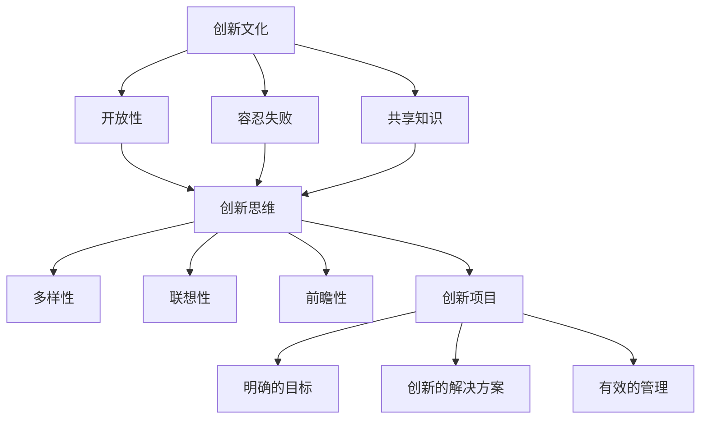

                 

### 文章标题：技术创新文化：在团队中培养创新思维

在当今迅速变化的技术时代，技术创新已经成为企业保持竞争力、推动业务增长的关键因素。而技术创新文化的构建和培养更是团队成功实现创新的核心。本文将深入探讨技术创新文化的概念、构建方法、创新思维的培养，以及创新项目的实践，旨在为读者提供一套系统、实用、高效的技术创新文化建设指南。

> 关键词：技术创新文化，创新思维，团队建设，创新项目实践，技术创新策略

摘要：本文首先介绍了技术创新文化的定义、重要性以及其在企业中的构建与实践；接着，详细阐述了创新思维的概述、培养方法和在团队中的应用；随后，探讨了创新项目的定义、流程、风险与应对策略，以及成功案例和经验总结；最后，提出了技术创新文化的评估与改进策略，并分析了其未来发展。本文通过逻辑清晰、结构紧凑的分析，旨在帮助读者深刻理解并有效实施技术创新文化，提升团队创新能力和竞争力。

### 引言

在全球化、信息化和科技化快速发展的背景下，企业面临的竞争压力与日俱增。技术创新已成为企业持续发展的动力源泉。然而，技术创新并非一蹴而就，它需要企业内部形成一种创新文化，这种文化不仅鼓励创新思维，更支持创新行为的实现。

技术创新文化是指企业在技术研发、产品开发、商业模式创新等方面所形成的一种共同价值观和行为模式。它不仅包括对创新的重视和鼓励，还涉及到企业内部的组织结构、管理制度、激励机制等各个方面。一个良好的技术创新文化能够激发员工的创造力，提升团队的整体创新能力，从而在激烈的市场竞争中脱颖而出。

本文将从以下几个方面展开讨论：

1. **技术创新文化的概念与重要性**：介绍技术创新文化的定义、核心要素以及其在企业中的重要性。
2. **创新文化的构建与实践**：探讨如何构建和实施一个有效的技术创新文化，包括具体的步骤和案例分析。
3. **创新思维的培养**：阐述创新思维的概述、培养方法以及在团队中的应用。
4. **创新项目的实践**：详细讨论创新项目的定义、流程、风险与应对策略，以及成功案例和经验总结。
5. **技术创新文化的持续发展**：提出技术创新文化的评估与改进策略，并分析其未来发展。

通过本文的深入探讨，希望能够为读者提供一套系统、实用、高效的技术创新文化建设方案，帮助团队在技术创新的道路上走得更远、更稳。

### 1.1 设计大纲结构

首先，我们需要为这本书设计一个大纲结构，这个结构将分为以下几个部分：

- **引言**：简要介绍技术创新文化的背景和重要性，引出本文的主题。
- **第一部分：技术创新文化概述**
  - **第1章：创新文化的定义与重要性**：介绍创新文化的概念、核心要素以及在企业中的重要性。
  - **第2章：创新文化的构建与实践**：探讨如何构建和实施一个有效的创新文化，包括具体的步骤和案例分析。
  - **第3章：创新文化在不同行业中的应用**：分析创新文化在科技、金融、制造业等不同行业中的应用。
- **第二部分：创新思维的培养**
  - **第4章：创新思维的概述**：阐述创新思维的含义、特点以及重要性。
  - **第5章：创新思维的培养方法**：介绍创新思维的培养方法和技巧。
  - **第6章：创新思维在团队中的应用**：讨论创新思维在团队协作、决策和创新项目中的应用。
- **第三部分：创新项目的实践**
  - **第7章：创新项目的定义与流程**：详细解释创新项目的定义、流程以及成功要素。
  - **第8章：创新项目的风险与应对**：探讨创新项目面临的风险和应对策略。
  - **第9章：创新项目的成功案例与经验总结**：分析成功案例，总结经验教训。
- **第四部分：技术创新文化的持续发展**
  - **第10章：技术创新文化的评估与改进**：介绍如何评估和改进技术创新文化。
  - **第11章：技术创新文化的持续发展策略**：探讨技术创新文化的持续发展策略。
  - **第12章：技术创新文化在未来的发展趋势**：分析技术创新文化的未来发展。

### 1.2 确定章节内容

根据大纲结构，为每个部分确定具体章节内容：

#### 第一部分：技术创新文化概述

- **第1章：创新文化的定义与重要性**
  - 创新文化的概念
  - 创新文化在组织中的重要性
  - 创新文化的核心要素

- **第2章：创新文化的构建与实践**
  - 创新文化构建的步骤
  - 创新文化实践的案例分析
  - 创新文化实践的效果评估

- **第3章：创新文化在不同行业中的应用**
  - 创新文化在科技行业的应用
  - 创新文化在金融行业的应用
  - 创新文化在制造业的应用

#### 第二部分：创新思维的培养

- **第4章：创新思维的概述**
  - 创新思维的含义
  - 创新思维的特点
  - 创新思维的重要性

- **第5章：创新思维的培养方法**
  - 创新思维培养的步骤
  - 创新思维训练的技巧
  - 创新思维培养的实践案例分析

- **第6章：创新思维在团队中的应用**
  - 创新思维在团队协作中的作用
  - 创新思维在团队决策中的应用
  - 创新思维在团队创新项目中的应用

#### 第三部分：创新项目的实践

- **第7章：创新项目的定义与流程**
  - 创新项目的定义
  - 创新项目的流程
  - 创新项目的成功要素

- **第8章：创新项目的风险与应对**
  - 创新项目风险的分类
  - 创新项目风险的管理方法
  - 创新项目风险的应对策略

- **第9章：创新项目的成功案例与经验总结**
  - 创新项目成功案例分析
  - 创新项目经验总结
  - 创新项目的发展趋势

#### 第四部分：技术创新文化的持续发展

- **第10章：技术创新文化的评估与改进**
  - 技术创新文化的评估方法
  - 技术创新文化的改进措施
  - 技术创新文化的持续改进机制

- **第11章：技术创新文化的持续发展策略**
  - 技术创新文化发展的战略规划
  - 技术创新文化发展的资源保障
  - 技术创新文化发展的关键因素

- **第12章：技术创新文化在未来的发展趋势**
  - 技术创新文化的发展趋势分析
  - 技术创新文化对未来社会的影响
  - 技术创新文化的未来发展方向

### 1.3 编写目录大纲

根据上述确定的章节内容，编写出完整的目录大纲：

```markdown
# 技术创新文化：在团队中培养创新思维

## 第一部分：技术创新文化概述
### 第1章：创新文化的定义与重要性
### 第2章：创新文化的构建与实践
### 第3章：创新文化在不同行业中的应用

## 第二部分：创新思维的培养
### 第4章：创新思维的概述
### 第5章：创新思维的培养方法
### 第6章：创新思维在团队中的应用

## 第三部分：创新项目的实践
### 第7章：创新项目的定义与流程
### 第8章：创新项目的风险与应对
### 第9章：创新项目的成功案例与经验总结

## 第四部分：技术创新文化的持续发展
### 第10章：技术创新文化的评估与改进
### 第11章：技术创新文化的持续发展策略
### 第12章：技术创新文化在未来的发展趋势

## 结论
```

以上就是我们为《技术创新文化：在团队中培养创新思维》这本书设计的完整目录大纲。接下来，我们将根据大纲内容，逐步细化每个章节的内容，确保书籍的完整性和逻辑性。

### 核心概念与联系

在讨论技术创新文化之前，我们需要明确几个核心概念，并了解它们之间的关系。以下是技术创新文化中几个关键概念的定义及相互联系：

#### 1. 创新文化

创新文化是一种价值观和行为模式，它强调创新的重要性，鼓励员工不断尝试新的想法和解决方案。创新文化不仅体现在企业内部的组织结构、管理制度和激励机制上，还渗透到企业的日常运营中。创新文化的核心要素包括：

- **开放性**：企业对内部和外部的新思想、新技术持开放态度，欢迎员工提出创新建议。
- **容忍失败**：企业对失败的容忍度较高，认为失败是创新过程中不可避免的一部分，从而鼓励员工勇于尝试。
- **共享知识**：企业内部建立知识共享机制，确保创新思想和技术能够在团队之间快速传播。

#### 2. 创新思维

创新思维是一种思考模式，它通过不同的方法和技术来产生新的想法和解决方案。创新思维的特点包括：

- **多样性**：创新思维鼓励从多个角度和维度思考问题，寻求多样化的解决方案。
- **联想性**：创新思维强调通过联想和类比，将不同领域的知识和技术结合起来。
- **前瞻性**：创新思维注重未来发展趋势和潜在机会，从而预见并抓住市场变化。

#### 3. 创新项目

创新项目是企业为实现创新目标而开展的具体活动。创新项目的核心要素包括：

- **明确的目标**：创新项目需要有清晰的目标，以确保团队的努力方向一致。
- **创新的解决方案**：创新项目需要提供新颖的解决方案，解决现有问题或创造新市场机会。
- **有效的管理**：创新项目需要有效的项目管理方法，确保项目按时、按质、按预算完成。

#### 关系架构

技术创新文化、创新思维和创新项目之间存在着密切的联系。以下是它们之间的关系架构：



通过上述关系架构，我们可以看到创新文化是创新思维和创新项目的基础，它通过开放性、容忍失败和共享知识等核心要素，激发和支撑创新思维的发展，进而推动创新项目的实施。创新思维则通过多样性、联想性和前瞻性等特征，为创新项目提供新的思路和解决方案。创新项目最终实现技术创新文化的目标，为企业的长期发展注入新动力。

理解这些核心概念及其相互联系，有助于我们更好地构建和实施技术创新文化，提升团队的创新能力和竞争力。

### 技术创新文化在团队中的作用与优势

技术创新文化在团队中的作用不可忽视，它是推动团队不断进步、保持竞争力的关键因素。以下是技术创新文化在团队中的具体作用和优势：

#### 1. 激发团队创造力

技术创新文化鼓励团队成员勇于提出新想法，不断探索未知的领域。在这种文化的熏陶下，团队成员不再满足于现状，而是主动寻找改进的机会。通过鼓励多样性和前瞻性的思考，团队成员能够打破传统思维模式，提出创新的解决方案。这种创造力的激发，不仅为团队带来了新的发展机遇，也提升了团队的创新能力。

#### 2. 提升团队凝聚力

技术创新文化强调团队合作和知识共享，通过共同的目标和任务，增强团队成员之间的联系。在创新文化中，团队成员不仅关注自己的职责，更关心整个团队的进步。他们通过合作解决问题，共同承担风险和挑战，从而建立了深厚的信任和合作关系。这种凝聚力的提升，不仅增强了团队的战斗力，也提高了团队的协作效率。

#### 3. 增强团队适应力

在快速变化的市场环境中，技术创新文化能够帮助团队更好地应对外部挑战。创新文化鼓励团队成员保持开放心态，对新技术和新趋势保持敏感。通过不断学习和适应，团队成员能够迅速调整策略，抓住市场机会，规避风险。这种适应力的增强，使团队在激烈的竞争中保持优势，确保企业的可持续发展。

#### 4. 提高团队创新能力

技术创新文化不仅鼓励创新思维，还提供了实施创新的环境和资源。在创新文化的支持下，团队可以开展各种创新实践活动，如头脑风暴、项目实验、技术竞赛等。这些活动不仅丰富了团队成员的创新经验，也提高了团队的创新能力。通过不断的实践和总结，团队可以不断完善和创新，形成独特的竞争优势。

#### 5. 促进企业持续发展

技术创新文化的核心目标是推动企业的持续发展。通过激发团队创造力、提升团队凝聚力、增强团队适应力和提高团队创新能力，技术创新文化为企业提供了源源不断的创新动力。这种创新动力不仅帮助企业在市场竞争中保持领先地位，也为企业的长期发展奠定了坚实基础。

总之，技术创新文化在团队中具有重要作用和优势。它不仅激发团队创造力，提升团队凝聚力，增强团队适应力，提高团队创新能力，还促进企业的持续发展。因此，构建和培养技术创新文化，是团队实现长期成功的关键。

### 构建技术创新文化的步骤

要构建一个有效的技术创新文化，企业需要采取一系列系统性的步骤，确保创新文化能够深入人心，成为组织运作的核心部分。以下是构建技术创新文化的具体步骤：

#### 1. 确立创新愿景和使命

首先，企业需要明确创新愿景和使命，这将是创新文化的核心驱动力。创新愿景应描述企业希望通过创新实现的长远目标，如成为行业领先的创新者、推动技术进步等。创新使命则应阐述企业为何要创新，以及创新对企业和社会的意义。通过确立明确的创新愿景和使命，企业可以统一员工的思想，形成共同的价值观。

#### 2. 建立创新价值观

创新价值观是企业创新文化的基石，它包括一系列指导原则和行为准则，如开放性、容忍失败、合作共享等。企业应明确创新价值观，并将其融入到日常运营和员工行为中。例如，企业可以通过内部宣传、培训、奖励机制等方式，强化创新价值观的传播和实践。

#### 3. 设计创新激励机制

激励机制是推动创新文化落地的重要手段。企业应设计合理的激励机制，鼓励员工积极参与创新活动。这些机制可以包括奖金、晋升机会、荣誉表彰等。例如，企业可以设立创新奖，对在创新项目中表现突出的员工进行奖励。此外，企业还可以通过股权激励等方式，让员工分享企业的创新成果，从而增强他们的创新动力。

#### 4. 创造创新环境

创新环境是创新文化的重要支撑。企业需要为员工提供一个宽松、自由、充满活力的创新环境。这包括物理环境和心理环境两个方面。在物理环境方面，企业可以设立创新实验室、讨论区等，为员工提供专门的创新空间。在心理环境方面，企业应鼓励员工勇于尝试、勇于表达自己的想法，并对创新失败持包容态度。

#### 5. 强化知识共享

知识共享是创新文化的重要组成部分。企业应建立有效的知识共享机制，鼓励员工分享自己的知识和经验。这可以通过内部培训、知识管理系统、团队会议等方式实现。例如，企业可以定期举办知识分享会，邀请员工分享自己的创新思路和实践经验。此外，企业还可以通过建立内部论坛、知识库等方式，方便员工随时查阅和交流知识。

#### 6. 培养创新型人才

创新型人才是创新文化的核心力量。企业应重视人才培养，特别是创新思维的培养。企业可以通过内部培训、外部培训、跨部门交流等方式，提高员工的专业技能和创新思维。例如，企业可以邀请外部专家进行创新培训，或者组织员工参加创新竞赛，以激发他们的创新潜力。

#### 7. 营造良好的沟通氛围

良好的沟通氛围是创新文化的基础。企业应建立开放、透明的沟通机制，鼓励员工之间进行坦诚的交流。例如，企业可以设立意见箱、定期召开员工会议等方式，让员工能够自由表达自己的想法和建议。此外，企业还可以通过在线协作工具、企业内部社交平台等，方便员工之间的实时沟通和协作。

#### 8. 持续改进和创新文化

创新文化不是一成不变的，企业需要持续改进和创新文化。这包括定期评估创新文化的效果，根据反馈进行调整和优化。例如，企业可以定期进行员工满意度调查，了解员工对创新文化的感受和建议。此外，企业还可以通过组织创新文化研讨会、创新工作坊等方式，激发员工的创新思维，推动创新文化的不断发展。

通过上述步骤，企业可以逐步构建起一个有效的技术创新文化，激发团队的创新能力，推动企业的持续发展。

### 创新文化在不同行业中的应用

创新文化在各个行业中扮演着至关重要的角色，它不仅帮助企业适应快速变化的市场环境，还推动行业的进步和技术的发展。以下是创新文化在科技、金融和制造业等行业中的应用情况：

#### 科技行业

科技行业是创新文化最为繁荣的领域之一。科技企业普遍高度重视技术创新，将其视为核心竞争力。以谷歌（Google）为例，该公司建立了独特的创新文化，鼓励员工进行内部创业，通过“20%时间政策”允许员工利用工作时间的20%来探索自己的创意项目。这一政策不仅激发了员工的创造力，还催生了多个成功的创新产品，如Gmail和Google News。

此外，科技行业还通过开放式创新，与其他企业、研究机构和高校合作，共同推动技术创新。例如，苹果公司（Apple）与高通（Qualcomm）合作开发移动通信技术，推动了智能手机的普及和性能提升。

#### 金融行业

金融行业在创新文化方面也逐渐展现出强大的动力。传统金融机构通过数字化转型，引入人工智能、区块链等新技术，提高运营效率和客户体验。以摩根大通（JPMorgan Chase）为例，该公司成立了创新实验室，专注于开发金融科技解决方案，如区块链平台“JPM Coin”，用于跨境支付和结算。

此外，金融行业的创新文化还体现在风险管理方面。金融机构通过大数据分析和人工智能技术，对市场风险进行实时监控和预测，提高风险管理的精确性和有效性。

#### 制造业

制造业也是创新文化的重要应用领域。随着智能制造和工业4.0的推进，制造业企业正在通过技术创新提升生产效率和产品质量。以西门子（Siemens）为例，该公司通过数字化双胞胎技术，实现了生产过程的实时监控和优化，大大提高了生产效率和产品一致性。

制造业的创新文化还体现在绿色制造和可持续发展方面。企业通过引入节能技术和环保材料，减少生产过程中的能源消耗和环境污染，实现可持续发展。

#### 共同特点

尽管不同行业在创新文化方面有不同的具体实践，但它们具有一些共同特点：

1. **开放性**：各个行业都鼓励开放思维，欢迎新的想法和技术。
2. **跨领域合作**：行业之间通过合作，共同推动技术创新。
3. **持续投资**：企业持续投资于研发和技术创新，确保持续竞争力。
4. **人才培养**：重视人才培养，特别是创新思维的培养。

通过创新文化的建设，各个行业不仅提升了自身的竞争力，也为整个社会的进步和发展做出了重要贡献。

### 创新思维的概述

创新思维是一种独特的思维方式，它通过非传统的、创造性的方法来解决问题和发现新机会。创新思维不仅关注问题的解决，更注重寻找新的、不同的解决方案，从而推动个人和组织的进步。以下是创新思维的定义、特点以及其重要性：

#### 1. 创新思维的定义

创新思维是指人们在解决问题、发现新机会或进行创造性活动时，所采用的一系列思考方式和策略。它不仅仅是一种思想活动，更是一种方法论，涵盖了从问题识别到解决方案生成的全过程。创新思维的核心在于突破常规、打破固有的思维模式，从而创造出新的价值。

#### 2. 创新思维的特点

- **多样性**：创新思维鼓励从多个角度和维度思考问题，寻找多样化的解决方案。多样性是创新思维的基础，它能够帮助人们跳出传统思维框架，发现新的可能性。
- **联想性**：创新思维强调通过联想和类比，将不同领域、不同背景的知识和技术结合起来，创造出新的思路和解决方案。联想性是创新思维的重要特征，它能够激发创造力和想象力。
- **前瞻性**：创新思维注重未来发展趋势和潜在机会，它能够帮助人们预见未来、把握机遇。前瞻性是创新思维的重要方向，它使创新活动具有预见性和战略导向。
- **灵活性**：创新思维强调思维的灵活性和开放性，它能够迅速适应变化，应对不确定性。灵活性是创新思维的重要保障，它使创新过程更加动态和有效。

#### 3. 创新思维的重要性

- **推动个人成长**：创新思维能够激发个人的创造力和潜能，帮助个人在职业发展中脱颖而出，实现个人价值。
- **提升团队效能**：创新思维在团队中的应用，能够激发团队的创造力和合作精神，提升团队的整体效能。
- **促进企业创新**：创新思维是企业持续创新的关键，它能够帮助企业开发新产品、改进现有产品，提高市场竞争力。
- **推动社会进步**：创新思维不仅对企业和个人有益，更对社会进步产生深远影响。通过创新思维，人们能够解决社会问题、改善生活质量，推动社会的可持续发展。

总之，创新思维是一种重要的思维能力，它通过多样、联想、前瞻和灵活的思考方式，推动个人、团队和企业的发展，促进社会的进步。理解和培养创新思维，是每个人和组织都应重视的重要课题。

### 创新思维的培养方法

要培养创新思维，需要从多个方面进行系统性的训练和实践。以下是一些具体的培养方法，这些方法可以帮助个人和团队在创新思维上取得显著进步：

#### 1. 头脑风暴

头脑风暴是一种常见的创新思维训练方法，它通过集中讨论、快速记录和自由联想，激发团队成员的创造力。在头脑风暴过程中，团队成员不受任何限制，畅所欲言，提出各种可能的解决方案。这种方法的关键在于自由、开放和多样性，通过大量的想法碰撞，往往能产生意想不到的创新点子。

**步骤**：
- **明确问题**：首先明确需要解决的问题或挑战。
- **设定时间限制**：通常设定为20-30分钟。
- **自由发言**：所有人都可以自由发言，不必担心自己的想法是否可行。
- **记录想法**：记录下每一个发言人的想法，无论其多么离奇或不切实际。
- **后续筛选**：头脑风暴结束后，对记录的想法进行筛选和评估，找出最具潜力的创新点子。

#### 2. 跨界思维

跨界思维是指通过将不同领域、不同行业或不同学科的知识和技术进行交叉融合，以产生新的创新思路。跨界思维能够打破传统的思维模式，激发创新灵感。

**方法**：
- **跨学科学习**：学习不同领域的知识，如艺术、历史、科学等，以拓宽思维视野。
- **行业交流**：与其他行业的企业或专家进行交流，了解他们的工作方式和创新实践。
- **项目合作**：在团队内部或跨部门进行项目合作，通过不同背景的团队成员共同探讨和解决问题。

#### 3. 联想思维

联想思维是通过将现有知识或经验与其他事物进行类比和联想，以发现新的思路和解决方案。这种方法强调思维的灵活性和创造性。

**步骤**：
- **寻找关联**：从当前问题出发，寻找与之相关的其他事物或问题。
- **自由联想**：不受任何限制，将所想到的事物或问题进行自由联想。
- **生成新点子**：通过联想，生成新的想法或解决方案。

#### 4. 6顶思考帽

6顶思考帽是一种结构性思考方法，由爱德华·德·波诺（Edward de Bono）提出。它通过将思考过程划分为不同的角色和角度，帮助人们全面、系统地分析问题。

**方法**：
- **白色思考帽**：关注事实和信息。
- **红色思考帽**：表达情感和直觉。
- **黑色思考帽**：进行批判和分析。
- **绿色思考帽**：提出创造性的想法。
- **黄色思考帽**：考虑积极的一面和好处。
- **蓝色思考帽**：控制思考过程和引导讨论。

#### 5. 平行思维

平行思维是一种系统性的思维方法，通过将问题分解成多个部分，分别进行思考和解决，从而找到最优解。这种方法强调问题的分解和综合。

**步骤**：
- **问题分解**：将复杂问题分解成多个子问题。
- **独立思考**：对每个子问题进行独立思考和解决。
- **综合分析**：将各个子问题的解决方案进行综合分析，找到最佳解决方案。

#### 6. 技能训练

除了以上方法，还可以通过一些专门的技能训练来培养创新思维，如：

- **快速写作**：通过快速写作，训练大脑快速生成想法。
- **绘画和艺术创作**：通过绘画和艺术创作，激发创造力和联想思维。
- **编程和设计**：通过编程和设计，提升解决问题的能力和技术思维。

总之，创新思维的培养需要多方面的努力和训练，通过多种方法相结合，可以逐步提升个人的创新思维水平，从而在工作和生活中取得更大的成就。

### 创新思维在团队中的应用

创新思维在团队中的应用至关重要，它能够激发团队的整体创造力，推动团队在复杂环境中找到创新的解决方案。以下讨论创新思维在团队协作、决策和创新项目中的应用，并通过具体案例进行详细解析。

#### 1. 团队协作中的创新思维

团队协作是创新过程中不可或缺的一部分。通过创新思维的运用，团队能够更加高效地共同解决问题。以下是创新思维在团队协作中的应用：

- **多元化团队**：组建具有多元化背景的团队，可以引入不同的观点和思维方式，从而激发更多的创新想法。例如，一个软件开发团队中，可以包括前端开发、后端开发、UI/UX设计、测试等不同角色，每个角色从不同的角度思考问题，有助于发现更全面的解决方案。

- **头脑风暴**：在项目启动阶段，通过头脑风暴会议，团队成员可以自由发表观点，提出各种创意。这种方法能够快速产生大量的想法，并通过团队的集体智慧筛选和优化。

- **角色扮演**：通过角色扮演，团队成员可以模拟不同角色，从不同角度分析问题，提高问题解决的多维度思考能力。例如，在产品开发中，团队成员可以扮演用户、竞争对手、市场分析师等角色，从而更全面地考虑产品的需求和市场策略。

**案例**：谷歌的“20%时间政策”就是一个成功的团队协作创新案例。在这个政策下，谷歌员工被允许将工作时间的20%用于自己感兴趣的项目。这个政策激发了员工的工作热情和创造力，产生了多个成功的产品，如Gmail和Google News。

#### 2. 决策中的创新思维

创新思维在团队决策过程中同样发挥着重要作用。以下是一些创新思维在决策中的应用方法：

- **多标准决策**：在制定决策时，使用多个标准进行分析，而不是仅仅依赖单一指标。这种方法能够避免决策的片面性，提高决策的科学性和全面性。

- **头脑风暴**：在决策前进行头脑风暴，收集团队成员的各种意见和建议，从而形成更加全面的决策方案。

- **模拟决策**：通过模拟决策过程，团队成员可以在实际做出决策之前，预演各种可能的结果和解决方案，从而更好地理解决策的影响和后果。

**案例**：特斯拉（Tesla）在产品决策中采用了创新思维。例如，在Model 3的开发过程中，特斯拉通过多次模拟和测试，优化了电池设计、整车重量分配和成本控制，最终推出了性能卓越且价格合理的电动汽车。

#### 3. 创新项目中的应用

创新思维在创新项目中的应用，是推动项目成功的关键。以下是创新思维在创新项目中的几个关键步骤：

- **问题定义**：在项目启动阶段，通过创新思维，明确项目的核心问题和目标，确保项目方向的准确性。

- **解决方案生成**：在解决方案生成阶段，团队成员运用创新思维，提出各种可能的解决方案。通过头脑风暴、联想思维等方法，产生多样化的解决方案。

- **方案评估与选择**：对各种解决方案进行评估，选择最具潜力的方案进行实施。在评估过程中，考虑方案的可行性、成本效益和风险等因素。

- **实施与监控**：在方案实施过程中，通过持续的创新思维，监控项目的进展，及时调整和优化方案。例如，通过定期回顾和反馈，确保项目按照既定目标顺利推进。

**案例**：苹果公司（Apple）在开发iPhone的过程中，运用了创新思维。从问题定义到解决方案生成，再到实施和优化，苹果团队不断挑战和突破传统手机的设计理念，最终推出了颠覆性的iPhone产品，改变了整个手机市场。

总之，创新思维在团队协作、决策和创新项目中的应用，是推动团队创新能力和项目成功的关键。通过多种创新思维方法和具体案例分析，可以更好地理解如何在实践中运用创新思维，实现团队和项目的创新目标。

### 创新项目的定义与流程

创新项目是企业为实现创新目标而开展的具体活动，通过系统化的流程和方法，将创新思维转化为实际成果。以下是对创新项目的定义、流程以及成功要素的详细解释：

#### 1. 创新项目的定义

创新项目是指企业为了实现新的产品、服务或业务模式，通过一定的资源和时间投入，进行系统性和有组织的研究、开发和实践的过程。创新项目不仅关注技术的突破，还涉及到市场策略、商业模式、用户体验等多个方面。

#### 2. 创新项目的流程

创新项目通常包括以下步骤：

- **问题定义**：明确项目要解决的问题或要达到的目标。这一步骤是创新项目的起点，需要深入分析和理解用户需求和市场趋势，以确保项目方向正确。

- **需求分析**：在问题定义的基础上，进行详细的需求分析。这一步骤包括市场调研、用户访谈、竞争分析等，目的是全面了解项目的需求背景，为后续的开发工作提供依据。

- **方案设计**：根据需求分析结果，制定创新方案。方案设计阶段需要考虑技术可行性、市场可行性、成本效益等因素，提出多个备选方案。

- **方案评估与选择**：对设计方案进行评估，选择最优方案进行实施。评估标准包括方案的可行性、创新性、成本、时间等。

- **开发与测试**：根据选定的方案进行具体开发和测试。开发阶段需要组建项目团队，明确任务分工，并严格按照项目计划进行。测试阶段则确保开发成果符合预期要求，发现并解决潜在问题。

- **实施与推广**：将创新成果推向市场，进行实际应用。推广阶段需要制定详细的推广策略，包括市场宣传、用户教育、渠道拓展等。

- **评估与反馈**：对创新项目进行效果评估，总结经验教训，为后续项目提供参考。

#### 3. 成功要素

一个成功的创新项目需要具备以下几个要素：

- **明确的目标**：项目目标应具体、可量化，确保团队成员对项目方向和目标有清晰的认识。

- **高效的团队**：创新项目需要高效的团队支持。团队成员应具备多样化的技能和背景，能够协同工作，共同推进项目。

- **创新的思维**：创新项目强调创新思维的应用，通过多样化的思维方法和技术，产生新的解决方案。

- **系统化的流程**：创新项目需要系统化的流程和方法，确保项目按照既定计划有序推进。

- **有效的资源管理**：项目资源包括人力、物力、财力等，有效的资源管理能够确保项目在有限的资源下取得最佳效果。

- **持续改进**：创新项目不是一次性的活动，而是一个持续改进的过程。通过不断评估和优化，项目能够不断进步，实现更高的目标。

通过明确创新项目的定义、流程以及成功要素，企业可以更好地规划和管理创新项目，推动技术创新和业务增长。

### 创新项目的风险与应对策略

在创新项目的实施过程中，不可避免地会遇到各种风险。这些风险可能来自技术、市场、资源、团队等多个方面，对项目的进展和成果产生不利影响。因此，了解和创新项目风险，并采取有效的应对策略，是确保项目成功的关键。

#### 1. 风险分类

创新项目风险可以大致分为以下几类：

- **技术风险**：包括技术不可行性、技术实现困难、技术更新迭代等。
- **市场风险**：包括市场需求不足、市场竞争激烈、用户接受度低等。
- **资源风险**：包括资源分配不足、资金短缺、人力资源不足等。
- **团队风险**：包括团队成员不稳定、沟通不畅、协作困难等。
- **法律和合规风险**：包括政策法规变化、知识产权问题、法律纠纷等。

#### 2. 风险管理方法

为了有效应对创新项目风险，企业可以采取以下几种风险管理方法：

- **风险识别**：在项目启动阶段，通过访谈、调查、数据分析等方法，识别可能的风险因素。风险识别是风险管理的第一步，有助于提前预警和制定应对策略。

- **风险评估**：对识别出的风险进行评估，确定其严重程度和发生概率。评估方法可以包括定性评估和定量评估，如风险矩阵法、概率分布法等。

- **风险应对策略**：根据风险评估结果，制定相应的风险应对策略。常见的应对策略包括风险规避、风险转移、风险减轻和风险接受。

  - **风险规避**：通过调整项目计划或方案，避免高风险的发生。例如，在技术风险较高时，可以暂时搁置或调整技术方案，寻找替代方案。
  - **风险转移**：通过合同、保险等方式将风险转移给第三方。例如，在市场风险较高时，可以通过外包或合作方式，将部分风险转移给合作伙伴。
  - **风险减轻**：通过改进方案、增加资源投入等方式，降低风险的严重程度。例如，在资源风险较高时，可以提前筹集资金，确保项目所需资源的充足。
  - **风险接受**：对一些无法规避或转移的风险，采取接受态度，并制定相应的应急预案。例如，在法律风险较高时，可以制定法律咨询和紧急应对方案。

- **风险监控**：在项目执行过程中，持续监控风险的发展状况，及时调整风险应对策略。风险监控可以通过定期评估、预警系统、实时数据分析等方法实现。

- **风险沟通**：建立有效的风险沟通机制，确保团队成员了解风险情况，并共同参与风险应对。通过定期会议、汇报、培训等方式，加强团队成员的风险意识和管理能力。

#### 3. 应对策略案例分析

以下是一些创新项目风险应对策略的案例：

- **技术风险**：在人工智能项目开发中，可能面临技术更新快速、实现难度高等问题。为了应对技术风险，企业可以与高校、研究机构合作，共享技术资源，确保技术方案的可行性。同时，通过持续的技术培训和学习，提高团队的技术水平和创新能力。

- **市场风险**：在推出新产品或服务时，可能面临市场需求不足、竞争对手激烈等问题。为了应对市场风险，企业可以进行详细的市场调研，了解目标市场的需求和市场趋势。同时，通过品牌建设和市场推广，提高产品的知名度和用户接受度。

- **资源风险**：在资源有限的条件下，企业可以通过优化资源配置、提高资源利用效率来应对资源风险。例如，通过项目管理工具和敏捷开发方法，提高开发效率，降低资源浪费。

- **团队风险**：在团队不稳定或沟通不畅的情况下，企业可以通过加强团队建设、提高沟通效率来应对团队风险。例如，通过团队建设活动、沟通培训、项目管理工具等手段，增强团队的凝聚力和协作能力。

通过上述风险识别和应对策略，企业可以更好地管理和控制创新项目中的风险，确保项目的顺利推进和成功实施。

### 创新项目的成功案例与经验总结

在技术创新领域，有许多成功的案例展示了如何通过有效的创新项目实现突破。以下将分析几个具有代表性的成功案例，并总结这些项目的经验教训。

#### 案例一：苹果公司的iPhone

苹果公司在2007年推出的iPhone，彻底颠覆了智能手机市场。iPhone的创新点在于其革命性的用户界面、强大的应用程序生态系统和卓越的硬件设计。以下是iPhone成功的关键因素：

1. **明确目标**：苹果公司在iPhone开发初期就明确了其目标，即创造一款不同于传统手机的产品，提供更加直观和高效的用户体验。
2. **持续创新**：苹果公司通过持续的技术研发和产品迭代，不断优化iPhone的功能和性能，使其始终保持市场领先地位。
3. **用户体验至上**：iPhone的设计和功能注重用户体验，从多点触控屏幕到简洁直观的图标，都体现了对用户需求的深刻理解。
4. **生态系统建设**：苹果公司通过建设iOS操作系统和App Store，为用户提供了丰富的应用程序，进一步巩固了其在智能手机市场的地位。

#### 案例二：谷歌的自动驾驶汽车

谷歌的自动驾驶汽车项目，也称为Waymo，是自动驾驶技术领域的领军企业。以下是Waymo成功的关键因素：

1. **技术积累**：谷歌在人工智能和机器学习领域拥有深厚的技术积累，为自动驾驶技术的开发提供了坚实的基础。
2. **数据驱动**：Waymo通过大量的数据收集和深度学习，不断优化其自动驾驶算法，提高系统的可靠性和安全性。
3. **开放合作**：Waymo与多个汽车制造商和科技公司合作，共同推动自动驾驶技术的发展，分享技术资源和市场机会。
4. **用户体验优先**：Waymo注重用户的舒适度和安全性，通过精心设计的服务流程和用户界面，提供优质的自动驾驶体验。

#### 案例三：特斯拉的电动跑车Model S

特斯拉的Model S是电动跑车领域的先驱，它的成功不仅改变了人们对电动汽车的看法，也推动了整个电动汽车行业的发展。以下是Model S成功的关键因素：

1. **高性能与续航里程**：Model S在性能和续航方面达到了当时电动车的最高水平，为消费者提供了强大的动力和长久的续航能力。
2. **技术创新**：特斯拉在电池技术和电机设计方面进行了多项创新，提高了电动车的性能和效率。
3. **品牌形象**：特斯拉通过强大的品牌形象和市场营销，成功地树立了其作为高端电动汽车品牌的地位。
4. **用户社区**：特斯拉建立了庞大的用户社区，通过车主活动和在线论坛，增强了用户对品牌的忠诚度和参与感。

#### 经验总结

从上述成功案例中，我们可以总结出以下几个关键经验：

1. **明确目标**：创新项目需要明确的目标和方向，确保团队成员对项目有清晰的认识。
2. **持续创新**：技术创新是一个持续的过程，需要不断投入资源和精力进行研发和改进。
3. **用户体验**：无论技术创新多么先进，最终的成功都取决于用户是否满意。因此，用户体验是创新项目的重要考量因素。
4. **生态系统建设**：构建良好的生态系统，包括技术合作、市场推广和用户社区，能够为创新项目提供持续的支持和发展动力。
5. **风险管理**：在创新项目中，需要识别和应对各种风险，确保项目的顺利进行和成功实施。

通过借鉴这些成功案例的经验，企业可以更好地规划和实施创新项目，推动技术创新和业务增长。

### 技术创新文化的评估与改进

技术创新文化的评估与改进是确保企业创新文化持续发展的重要环节。以下将介绍评估技术创新文化的方法、改进措施以及持续改进的机制。

#### 1. 评估技术创新文化的方法

要评估技术创新文化的效果，企业可以采用以下几种方法：

- **员工满意度调查**：通过问卷调查、访谈等方式，了解员工对创新文化的满意度和参与度。这可以帮助企业识别文化中的不足和需要改进的方面。
- **绩效评估**：分析企业在创新项目中的绩效表现，如创新项目的成功率、创新成果的市场表现等。绩效评估可以提供量化的数据，帮助企业衡量创新文化的实际效果。
- **外部评价**：邀请外部专家或合作伙伴对企业的创新文化进行评价，从外部视角提供反馈和建议。
- **案例分析**：对成功和失败的创新项目进行深入分析，总结经验教训，评估创新文化在项目中的实际应用。

#### 2. 改进措施

基于评估结果，企业可以采取以下改进措施：

- **加强培训与教育**：针对评估中发现的知识和技能短板，加强员工的培训和教育，提高他们的创新能力和文化素养。
- **优化激励机制**：调整激励机制，确保创新成果与奖励挂钩，激励员工积极参与创新活动。
- **改善沟通机制**：优化内部沟通机制，确保信息流畅，减少信息不对称，促进知识共享和创新思想的传播。
- **资源保障**：确保创新项目有充足的资源支持，包括资金、技术、人力等，为创新活动的开展提供保障。
- **文化氛围建设**：通过文化活动、团队建设等，营造积极向上的创新氛围，增强员工的归属感和创新动力。

#### 3. 持续改进的机制

要实现技术创新文化的持续改进，企业需要建立一套有效的机制：

- **定期评估**：制定定期评估计划，如每季度、每半年或每年进行一次全面的文化评估，确保创新文化的持续发展和优化。
- **反馈机制**：建立有效的反馈机制，鼓励员工和外部合作伙伴提供意见和建议，及时调整和改进创新文化。
- **创新实验室**：设立创新实验室，为员工提供实验和创新的空间，支持他们在实际项目中尝试新的想法和技术。
- **跨部门合作**：促进跨部门的合作和交流，通过项目合作、经验分享等方式，推动创新文化的普及和深化。
- **外部合作与学习**：与其他企业和研究机构建立合作关系，通过外部学习、合作项目等，借鉴其他企业的成功经验，不断提升自身的创新文化。

通过上述评估与改进方法、措施和机制，企业可以持续优化和创新文化，确保技术创新文化在企业发展中发挥最大的作用。

### 技术创新文化的持续发展策略

技术创新文化不仅是推动企业发展的动力，也是应对市场变化、保持竞争优势的关键。为了确保技术创新文化的持续发展，企业需要制定一系列有效的策略，并在实际操作中不断优化和调整。以下是技术创新文化的持续发展策略：

#### 1. 制定明确的发展目标

持续发展的首要任务是制定明确的发展目标。企业应结合自身的发展战略和市场趋势，明确技术创新的具体目标。这些目标可以是技术创新的数量、质量、市场影响力等方面。例如，企业可以设定每年推出若干个创新项目，或在特定领域达到技术领先地位。

**步骤**：
- **市场调研**：通过市场调研，了解客户需求和市场趋势，明确技术创新的方向。
- **战略规划**：将技术创新目标纳入企业整体发展战略中，确保目标与企业愿景一致。
- **目标分解**：将总体目标分解为具体的项目目标和里程碑，为技术创新提供明确的方向和路径。

#### 2. 强化创新资源的投入

创新资源的投入是技术创新文化持续发展的重要保障。企业需要确保有充足的资源支持创新项目，包括资金、技术、人力等。

**措施**：
- **资金保障**：设立专门的创新基金，确保创新项目有充足的资金支持。
- **技术支持**：投资于技术研发，引进先进的设备和工具，提升技术实力。
- **人才培养**：加强人才培养，特别是创新思维的培养，为技术创新提供人才支持。

#### 3. 建立灵活的决策机制

灵活的决策机制能够快速响应市场变化，推动创新项目的实施。企业应建立快速决策和反馈机制，确保创新项目能够及时启动和调整。

**方法**：
- **敏捷管理**：采用敏捷管理方法，如Scrum或Kanban，提高项目推进速度和灵活性。
- **跨部门协作**：促进跨部门协作，打破部门壁垒，提高决策效率。
- **决策培训**：对管理层和决策者进行决策培训，提高其决策能力和风险意识。

#### 4. 营造良好的创新环境

良好的创新环境是技术创新文化的基础。企业应营造一个开放、包容、鼓励创新的环境，让员工能够自由表达想法，勇于尝试新事物。

**措施**：
- **开放沟通**：建立开放的沟通渠道，鼓励员工之间的交流和意见分享。
- **容错文化**：建立容错机制，鼓励员工勇于尝试，宽容失败。
- **创新空间**：设立专门的创新空间，如创新实验室、讨论区等，为员工提供自由思考和实验的环境。

#### 5. 持续优化与创新文化

技术创新文化需要不断优化和更新，以适应不断变化的市场和技术环境。

**方法**：
- **定期评估**：定期对创新文化进行评估，了解其效果和存在的问题，及时进行调整和改进。
- **反馈机制**：建立反馈机制，鼓励员工和外部合作伙伴提供意见和建议，为创新文化的优化提供参考。
- **持续学习**：鼓励员工持续学习，不断提升自身的知识和技能，以适应技术创新的要求。

#### 6. 跨界合作与开放创新

跨界合作和开放创新是推动技术创新文化的重要手段。企业应积极与其他企业、高校、研究机构等进行合作，共享资源，共同推进技术创新。

**策略**：
- **合作网络**：建立广泛的合作网络，与其他企业、研究机构建立合作关系，共同开展创新项目。
- **开放式创新**：通过开放式创新，吸引外部创新资源，如技术、人才等，为企业创新提供更多可能性。

通过上述策略，企业可以确保技术创新文化的持续发展，推动企业的创新能力和竞争力不断提升。

### 技术创新文化在未来的发展趋势

技术创新文化在未来的发展中将呈现出若干显著的趋势，这些趋势将对企业和社会产生深远的影响。以下是技术创新文化在未来的发展趋势及其影响：

#### 1. **数字化与智能化深度融合**

随着大数据、云计算、人工智能等技术的迅猛发展，技术创新将更加依赖于数字化和智能化手段。未来，企业将更加注重利用数据驱动的决策支持和自动化技术，实现生产过程的智能化和效率提升。数字化与智能化的深度融合，将推动技术创新向更加高效、智能的方向发展。

**影响**：企业的生产效率和产品质量将得到显著提升，同时，智能化的应用将极大降低人力成本，提高劳动生产率。

#### 2. **跨界融合与创新生态**

在技术迅速迭代和行业融合的背景下，未来的技术创新文化将更加注重跨界合作和创新生态的构建。不同行业、不同领域的企业和机构将通过合作共享资源、知识和技术，共同推动技术创新。跨界融合将促进新的商业模式和产品的诞生，形成创新生态系统。

**影响**：创新生态系统的形成将加速创新成果的转化和应用，推动整个社会的技术进步和产业升级。

#### 3. **可持续发展与绿色创新**

随着全球环境问题的日益严峻，技术创新将更加关注可持续发展。企业将积极采用环保技术和绿色材料，研发低碳、节能的产品和服务。绿色创新将成为技术创新文化的重要组成部分，推动企业向环保、可持续发展的方向转型。

**影响**：绿色技术创新将有助于企业降低环境污染、减少资源消耗，提升企业的社会形象和竞争力，同时为全球可持续发展作出贡献。

#### 4. **全球视野与国际化发展**

在全球化背景下，技术创新文化将更加注重国际化视野和全球合作。企业将更加开放地吸收全球先进技术和创新理念，通过国际合作和竞争，提升自身的技术实力和创新能力。国际化发展将推动技术创新文化的全球扩散和融合。

**影响**：国际化的技术创新文化将促进全球技术交流和合作，加速全球技术进步，提高企业的国际竞争力。

#### 5. **用户驱动与个性化创新**

用户需求将成为未来技术创新的重要驱动力。企业将更加注重用户研究，深入了解用户需求和行为，开发个性化的产品和服务。用户驱动的创新将推动技术创新更加贴近用户实际需求，提升用户体验和满意度。

**影响**：个性化创新将增强用户对产品和服务的忠诚度，提高市场竞争力，推动整个行业的用户导向转型。

#### 6. **文化与组织的深度融合**

技术创新文化将更加深入地融入企业文化和组织管理中。企业将通过文化建设、领导力培养、激励机制等手段，全面推动创新文化的落地和实践。技术创新文化将成为企业核心竞争力的重要组成部分。

**影响**：创新文化的深度融合将提高企业的整体创新能力，推动企业的可持续发展，成为企业持续竞争优势的重要来源。

总之，技术创新文化在未来的发展中将朝着数字化、智能化、跨界融合、可持续发展、国际化、用户驱动和文化融合等多个方向演进。这些趋势将深刻影响企业和社会，推动技术进步和社会发展，为全球创新生态系统的构建提供强大的动力。

### 结论

通过本文的探讨，我们可以看到，技术创新文化在团队中培养创新思维的重要性不可忽视。技术创新文化不仅激发了团队创造力，提升了团队凝聚力和适应力，还提高了团队的创新能力，为企业带来了持续的发展动力。从构建创新文化、培养创新思维，到实施创新项目，每一个环节都体现了技术创新文化的核心价值。

未来，技术创新文化将继续在全球范围内发挥重要作用。随着数字化、智能化、跨界融合等趋势的发展，技术创新文化将更加注重用户需求、可持续发展以及国际化合作。企业需要不断适应这些变化，构建和优化创新文化，以保持竞争优势。

为了在技术创新的道路上走得更远，企业应采取以下措施：

1. **强化创新文化建设**：建立明确的创新愿景和使命，制定创新价值观和激励机制，营造开放、包容的创新环境。
2. **培养创新型人才**：重视人才培养，特别是创新思维的培养，通过培训、项目实践等方式提高员工创新能力。
3. **推动跨界合作**：积极与其他企业、高校、研究机构合作，共享资源，共同推动技术创新。
4. **关注可持续发展**：在创新过程中，注重环保、节能和可持续发展，推动企业社会责任的实现。
5. **持续改进与创新**：定期评估和优化创新文化，确保其与企业发展保持同步，不断提升创新能力和竞争力。

技术创新文化是企业持续发展的关键，只有不断培养和优化创新文化，企业才能在激烈的市场竞争中立于不败之地。让我们一起努力，推动技术创新文化的发展，共创美好未来。

### 作者信息

作者：AI天才研究院/AI Genius Institute & 禅与计算机程序设计艺术 /Zen And The Art of Computer Programming

AI天才研究院（AI Genius Institute）是一家专注于人工智能和科技创新的研究机构，致力于推动人工智能技术的普及和应用。研究院的研究领域涵盖了机器学习、深度学习、自然语言处理、计算机视觉等多个方向，为全球范围内的企业和学术机构提供了强大的技术支持和智力资源。

《禅与计算机程序设计艺术》是作者长期在计算机编程和人工智能领域研究和实践的总结。书中不仅介绍了计算机程序设计的哲学思想，还深入探讨了如何通过禅宗智慧提高编程效率和创新能力。该书在计算机编程和人工智能社区中受到了广泛关注和好评，成为众多程序员和人工智能从业者的必备读物。

通过本文，我们希望读者能够更好地理解和实践技术创新文化，提升团队的创新能力，为企业的发展注入新动力。感谢您的阅读，期待与您共同探索技术创新的无限可能。

