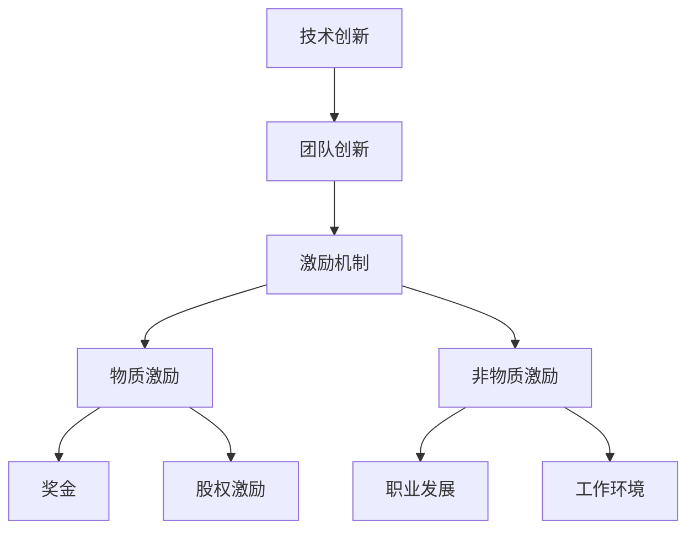

                 


### 文章标题：技术创新激励机制：鼓励团队创新的方法

#### 关键词：技术创新，团队创新，激励机制，物质激励，非物质激励，综合性激励策略

#### 摘要：

本文旨在探讨技术创新激励机制的设计与应用，旨在为IT行业的企业提供一套鼓励团队创新的策略和方法。文章首先介绍了技术创新和团队创新的基本概念及其重要性，随后详细阐述了激励机制的设计原则与分类，包括物质激励和非物质激励。通过对实际案例的分析，文章总结了成功和失败的激励机制实施经验，并提出了优化方案。最后，文章展望了技术创新激励机制的发展趋势，为未来的创新管理提供了指导。文章以清晰的结构和详实的案例，为IT企业如何激励团队创新提供了宝贵的参考。

### 第一部分：背景与核心概念

#### 第1章：技术创新的概述

**1.1 技术创新的定义**

技术创新是指在现有技术和知识的基础上，通过新想法、新方法、新技术或新产品的开发，实现技术进步和商业价值的过程。它通常涉及新产品、新工艺、新服务、新商业模式等方面的创新。

**1.2 技术创新的重要性**

技术创新是推动企业持续发展、提高竞争力的关键因素。它能帮助企业适应市场变化，满足客户需求，开拓新的业务领域。在全球化竞争日益激烈的背景下，技术创新已成为企业生存和发展的核心驱动力。

**1.3 技术创新的类型**

技术创新可以分为以下几种类型：

- **产品创新**：指开发全新的产品或改进现有产品，以满足市场需求。
- **工艺创新**：指改进生产流程或制造方法，以提高生产效率和降低成本。
- **服务创新**：指改进现有服务或开发新服务，以提升客户体验。
- **商业模式创新**：指创新企业的商业模式，以实现业务增长和利润最大化。

### 第2章：团队创新的理论基础

**2.1 创新理论的发展历程**

创新理论的发展可以追溯到20世纪初，包括泰勒的科学管理理论、熊彼特的创新理论、德鲁克的创新管理理论等。这些理论为团队创新提供了理论支持。

**2.2 团队创新的核心原则**

团队创新的核心原则包括：

- **协同合作**：团队成员之间的有效沟通和合作是实现团队创新的关键。
- **多样性**：团队中的多样化背景和知识可以激发更多的创新思维。
- **开放性**：鼓励团队成员提出不同观点和想法，促进创新。
- **实验精神**：鼓励团队成员勇于尝试新方法和新思路，不断试验和改进。

**2.3 团队创新的关键要素**

团队创新的关键要素包括：

- **目标明确**：团队需要有明确的目标和方向，以确保创新活动聚焦于关键领域。
- **资源保障**：团队需要获得充足的资源和支持，包括人力、资金和设备等。
- **激励机制**：有效的激励机制可以激发团队成员的创新热情和积极性。

### 第一部分小结

技术创新和团队创新是企业持续发展的核心驱动力。了解技术创新的定义、重要性、类型以及团队创新的理论基础，有助于企业更好地设计和实施创新激励机制，从而推动团队创新。



### 第二部分：激励机制设计

#### 第3章：激励机制的概述

**3.1 激励机制的基本概念**

激励机制是指通过设定奖励和惩罚机制，激发个体或团队积极行为的过程。在技术创新过程中，激励机制有助于调动团队成员的积极性，提高创新效率和成果。

**3.2 激励机制的设计原则**

激励机制的设计应遵循以下原则：

- **公平性**：确保激励机制对所有团队成员公平，避免不公平现象。
- **灵活性**：根据团队和个体差异，设计灵活的激励机制，适应不同情况。
- **透明性**：激励机制的设计和实施过程应透明，以便团队成员了解并认同。
- **可持续性**：激励机制应长期有效，能够持续激励团队成员的创新热情。

**3.3 激励机制的分类**

激励机制可以分为物质激励和非物质激励两大类：

- **物质激励**：包括奖金、股权激励、培训机会等，以金钱和实物形式奖励团队成员。
- **非物质激励**：包括职业发展、工作环境、认可与荣誉等，以精神激励和非物质奖励形式激发团队成员。

### 第4章：物质激励

**4.1 物质激励的优缺点**

物质激励具有以下优点：

- **直接性**：物质激励能够快速、直接地激励团队成员。
- **公平性**：物质激励通常基于明确的绩效指标，相对公平。

物质激励也存在一些缺点：

- **短期效应**：物质激励可能导致团队成员追求短期成果，忽视长期发展。
- **依赖性**：过度依赖物质激励可能导致团队成员对奖励产生依赖。

**4.2 物质激励的常见方式**

常见的物质激励方式包括：

- **奖金**：根据团队成员的绩效表现发放奖金。
- **股权激励**：给予团队成员公司股权，共享公司成长带来的收益。
- **培训机会**：为团队成员提供培训机会，提升其专业技能。

**4.3 物质激励的案例分析**

某IT企业采用奖金激励制度，对完成技术创新项目的团队成员进行奖励。该制度取得了显著效果，团队成员的积极性和创新能力得到了提高。但同时，企业也意识到奖金激励可能导致的短期效应和依赖性，因此逐步引入了非物质激励，以实现激励机制的多元化。

### 第5章：非物质激励

**5.1 非物质激励的优缺点**

非物质激励具有以下优点：

- **长期效应**：非物质激励有助于培养团队成员的长期发展意识。
- **精神激励**：非物质激励能够提升团队成员的成就感和归属感。

非物质激励也存在一些缺点：

- **主观性**：非物质激励的评价标准可能存在主观性，导致不公平现象。
- **实施难度**：非物质激励的实施难度较大，需要企业投入更多资源和精力。

**5.2 非物质激励的常见方式**

常见的非物质激励方式包括：

- **职业发展**：为团队成员提供职业晋升机会，帮助其实现个人发展。
- **工作环境**：改善工作环境，提供舒适、便捷的工作条件。
- **认可与荣誉**：对团队成员的创新成果给予认可和表彰。

**5.3 非物质激励的案例分析**

某IT企业为鼓励团队创新，实施了一系列非物质激励措施，包括年度创新奖项、团队建设活动、公开表彰等。这些措施不仅提升了团队成员的积极性和创造力，还增强了团队的凝聚力和归属感。企业因此取得了显著的创新成果，在市场中获得了竞争优势。

### 第6章：综合性激励策略

**6.1 综合性激励策略的概述**

综合性激励策略是指结合物质激励和非物质激励，形成一套全面的激励机制。该策略旨在发挥不同激励方式的优点，克服其缺点，实现最佳激励效果。

**6.2 综合性激励策略的设计原则**

综合性激励策略的设计应遵循以下原则：

- **平衡**：平衡物质激励和非物质激励的比重，避免偏重某一类激励。
- **协同**：确保物质激励和非物质激励相互协同，形成合力。
- **针对性**：根据团队成员的特点和需求，设计个性化的激励措施。

**6.3 综合性激励策略的案例分析**

某IT企业在实施综合性激励策略时，首先对团队成员进行需求调研，了解其关注的激励要素。随后，企业制定了包括奖金、股权激励、职业发展机会、创新奖项等一系列激励措施。这些措施相互配合，不仅提升了团队成员的创新能力，还增强了团队的凝聚力和合作意识。企业因此实现了持续的创新和发展。

### 第二部分小结

激励机制的设计是推动团队创新的关键。物质激励和非物质激励各有优缺点，企业应根据实际情况和需求，设计综合性激励策略，以实现最佳激励效果。

### 第三部分：激励机制的实施

#### 第7章：激励机制的实施过程

**7.1 激励机制的设定**

激励机制的设定是激励机制实施的第一步。企业需要明确激励机制的总体目标、原则和具体措施。在设定激励机制时，企业应考虑以下几个方面：

- **明确目标**：激励机制的设定应与企业的战略目标相一致，确保激励机制能够推动企业的发展。
- **评估标准**：明确评估团队成员绩效和创新成果的标准，确保激励机制的公平性和透明性。
- **奖励形式**：根据团队和成员的特点，选择合适的奖励形式，如奖金、股权激励、培训机会等。

**7.2 激励机制的反馈**

激励机制的反馈是激励机制实施的重要环节。企业需要及时收集团队成员对激励机制的反馈，评估激励机制的有效性。在反馈过程中，企业应关注以下几个方面：

- **满意度调查**：通过问卷调查、访谈等方式，了解团队成员对激励机制的满意度。
- **绩效评估**：定期对团队成员的绩效进行评估，分析激励机制对绩效的影响。
- **调整优化**：根据反馈和评估结果，对激励机制进行调整和优化，以提高激励效果。

**7.3 激励机制的调整**

激励机制的调整是保证激励机制持续有效的重要手段。企业应根据市场和团队的变化，及时调整激励机制。在调整过程中，企业应关注以下几个方面：

- **创新激励**：随着技术创新的不断推进，企业需要调整激励机制，以适应新的创新需求。
- **团队建设**：根据团队的发展阶段和特点，调整激励机制，以促进团队建设。
- **员工发展**：关注员工职业发展需求，调整激励机制，帮助员工实现个人成长。

### 第8章：激励机制的评价与优化

**8.1 激励机制的评价指标**

激励机制的评价指标包括：

- **创新成果**：评估激励机制对创新成果的影响，如创新项目的数量、质量、市场竞争力等。
- **团队绩效**：评估激励机制对团队绩效的影响，如团队的凝聚力、协作能力、完成任务的情况等。
- **员工满意度**：评估激励机制对员工满意度的影响，如员工的积极性、忠诚度、离职率等。

**8.2 激励机制的优化方法**

激励机制的优化方法包括：

- **数据驱动**：通过数据分析和反馈，发现激励机制存在的问题，制定优化方案。
- **试点推广**：在部分团队或项目中进行激励机制试点，根据试点效果进行优化。
- **持续改进**：建立激励机制优化的长效机制，持续关注激励机制的实施效果，及时进行调整。

**8.3 激励机制的实施案例分析**

某IT企业针对激励机制的实施效果进行了全面评估，发现部分激励机制存在不公平、不透明等问题。企业通过数据分析和试点推广，对激励机制进行了优化。优化后的激励机制更加公平、透明，得到了团队成员的认可。企业因此实现了创新成果的显著提升，团队绩效和员工满意度也得到提高。

### 第三部分小结

激励机制的实施是推动团队创新的关键环节。企业需要设定明确的激励机制、及时反馈和调整，以确保激励机制的持续有效。通过优化激励机制，企业可以激发团队成员的创新热情，推动企业的持续发展。

### 第四部分：案例分析

#### 第9章：成功案例解析

**9.1 案例选择标准**

成功案例的选择应遵循以下标准：

- **创新成果显著**：案例企业通过创新激励机制取得了显著的创新成果，如新技术、新产品、新服务等。
- **绩效提升明显**：案例企业的团队绩效在实施激励机制后明显提升，如任务完成率、市场份额、客户满意度等。
- **员工满意度高**：案例企业的员工对激励机制满意度高，如员工积极性、忠诚度、离职率等。

**9.2 案例背景介绍**

某IT企业，A公司，成立于2000年，主要从事软件开发和信息技术服务。随着市场竞争的加剧，A公司意识到技术创新的重要性，决定实施一系列创新激励机制，以推动企业的持续发展。

**9.3 激励机制设计过程**

A公司在设计激励机制时，遵循以下原则：

- **目标明确**：明确激励机制的目标，即提升团队创新能力和绩效。
- **评估标准**：制定明确的评估标准，如创新成果、团队绩效、员工满意度等。
- **多元化激励**：结合物质激励和非物质激励，形成多元化的激励机制。

具体设计过程如下：

1. **调研分析**：A公司通过问卷调查、访谈等方式，了解团队成员的需求和期望。
2. **方案制定**：根据调研结果，A公司制定了包括奖金、股权激励、职业发展机会等一系列激励措施。
3. **试点推广**：在部分团队进行激励机制试点，根据试点效果进行调整和完善。
4. **全面实施**：在试点成功的基础上，A公司将激励机制全面推广到整个企业。

**9.4 案例效果评估**

激励机制实施后，A公司取得了显著的效果：

- **创新成果显著**：激励机制激发了团队成员的创新热情，创新项目的数量和质量得到提升，市场竞争力明显增强。
- **绩效提升明显**：团队绩效显著提升，任务完成率、市场份额、客户满意度等指标均有所提高。
- **员工满意度高**：员工对激励机制满意度高，员工积极性、忠诚度、离职率等指标均有所改善。

A公司的成功案例表明，合理的创新激励机制能够有效推动团队创新，提升企业绩效，增强员工满意度。

#### 第10章：失败案例警示

**10.1 案例选择标准**

失败案例的选择应遵循以下标准：

- **创新成果不明显**：案例企业在实施激励机制后，创新成果不明显，甚至出现倒退。
- **绩效下降**：案例企业的团队绩效在实施激励机制后明显下降，如任务完成率、市场份额、客户满意度等。
- **员工满意度低**：案例企业的员工对激励机制满意度低，如员工积极性、忠诚度、离职率等。

**10.2 案例背景介绍**

某IT企业，B公司，成立于2010年，主要从事软件开发和信息技术服务。B公司在快速发展过程中，意识到激励机制的重要性，决定实施一系列创新激励机制，以推动企业的持续发展。

**10.3 激励机制设计问题**

B公司在设计激励机制时，存在以下问题：

- **目标不明确**：B公司对激励机制的目标不明确，缺乏具体的创新目标和绩效指标。
- **评估标准不科学**：B公司制定的评估标准不科学，缺乏客观性和透明性。
- **激励措施单一**：B公司仅采用物质激励，缺乏多元化的激励手段。

具体问题如下：

1. **目标不明确**：B公司没有明确创新目标和绩效指标，导致激励机制缺乏针对性。
2. **评估标准不科学**：B公司制定的评估标准过于简单，缺乏客观性和透明性，导致员工对激励机制产生质疑。
3. **激励措施单一**：B公司仅采用物质激励，缺乏多元化的激励手段，难以满足员工的多样化需求。

**10.4 案例效果评估**

激励机制实施后，B公司取得了以下效果：

- **创新成果不明显**：由于激励机制缺乏针对性，创新成果不明显，甚至出现倒退。
- **绩效下降**：团队绩效明显下降，任务完成率、市场份额、客户满意度等指标均有所下降。
- **员工满意度低**：员工对激励机制满意度低，员工积极性、忠诚度、离职率等指标均有所恶化。

B公司的失败案例表明，不合理的激励机制可能导致创新成果下降，团队绩效下降，员工满意度降低。企业应重视激励机制的设计和实施，确保激励机制的合理性和有效性。

### 第四部分小结

通过成功和失败案例的分析，我们可以得出以下结论：

- 成功的激励机制应具有明确的目标、科学的评估标准、多元化的激励手段，能够有效激发团队创新。
- 失败的激励机制往往缺乏明确的目标、科学的评估标准、多元化的激励手段，导致创新成果下降、团队绩效下降、员工满意度降低。

企业应从成功和失败案例中汲取经验，优化激励机制，以推动团队创新，提升企业绩效。

### 第五部分：未来展望

#### 第11章：技术创新激励机制的发展趋势

**11.1 技术发展趋势**

随着科技的不断进步，新技术、新应用、新商业模式不断涌现，技术创新呈现出以下趋势：

- **数字化与智能化**：人工智能、大数据、云计算等技术的快速发展，推动企业向数字化和智能化方向转型。
- **绿色与可持续发展**：绿色技术和可持续发展理念逐渐成为技术创新的重点，企业需要关注环保、节能等方面。
- **个性化与定制化**：消费者需求日益个性化，企业需要通过技术创新提供定制化解决方案。

**11.2 团队创新发展趋势**

团队创新呈现出以下发展趋势：

- **跨界合作**：企业需要与其他行业、领域的企业和机构进行跨界合作，共同推动创新。
- **开放式创新**：企业需要开放创新平台，吸引外部创新资源和人才，共同推进创新。
- **全球协同**：全球化背景下，企业需要在全球范围内进行协同创新，利用全球资源提升创新能力。

**11.3 激励机制发展趋势**

技术创新激励机制将呈现出以下发展趋势：

- **多元化**：激励机制将更加多元化，结合物质激励和非物质激励，满足员工的多样化需求。
- **个性化**：激励机制将更加个性化，根据员工的特点和需求进行定制。
- **智能化**：利用人工智能等技术，实现激励机制的智能化管理和优化。

### 第12章：创新激励的国际化视角

**12.1 国际化背景**

在全球化和技术创新浪潮的背景下，企业需要具备国际视野，积极应对国际市场的挑战和机遇。国际化的创新激励机制有助于提升企业的全球竞争力。

**12.2 国外成功经验**

国外企业在创新激励机制方面有许多成功经验，值得我们借鉴：

- **谷歌**：谷歌采用股权激励和员工福利等多元化激励手段，激发员工的创新热情。
- **亚马逊**：亚马逊通过开放创新平台，吸引全球创新资源和人才，推动企业持续创新。
- **微软**：微软注重员工的职业发展，提供丰富的培训和晋升机会，培养员工的创新能力。

**12.3 我国创新激励机制的发展方向**

结合国外成功经验和我国实际情况，我国创新激励机制的发展方向如下：

- **政策支持**：政府应加大对创新激励政策的支持力度，为企业提供税收优惠、资金支持等。
- **平台建设**：企业应建立开放的创新平台，吸引外部创新资源和人才，推动企业创新发展。
- **人才培养**：注重员工的职业发展，提供丰富的培训和晋升机会，培养员工的创新能力。

### 第五部分小结

未来，技术创新激励机制将在技术发展趋势、团队创新发展趋势和国际化背景下不断优化和完善。多元化、个性化、智能化的激励机制将成为未来发展的趋势。企业应紧跟时代潮流，积极借鉴国外成功经验，探索符合自身发展的创新激励机制，以提升企业的全球竞争力。

### 总结

技术创新是推动企业持续发展的核心驱动力。有效的激励机制能够激发团队创新，提高企业绩效。本文从技术创新和团队创新的基本概念出发，详细阐述了激励机制的设计原则、分类、实施过程和优化方法。通过成功和失败案例的分析，我们总结了有效的激励机制应具备的特点。未来，随着技术发展趋势和国际化背景的变化，激励机制将不断优化和完善。企业应紧跟时代潮流，积极探索符合自身发展的创新激励机制，以提升企业的全球竞争力。

#### 作者信息

作者：AI天才研究院/AI Genius Institute & 禅与计算机程序设计艺术 /Zen And The Art of Computer Programming

---
### 创新能力的评估模型（伪代码）

```python
function assess_innovation_ability(team_members):
    # 初始化能力评分
    scores = []

    # 循环每个团队成员
    for member in team_members:
        # 计算团队成员的创新能力得分
        score = calculate_score(member)
        scores.append(score)

    # 返回得分最高的团队成员
    return max(scores)

function calculate_score(member):
    # 初始化得分
    score = 0

    # 加分项：根据经验计算
    score += member.experience_weight

    # 加分项：根据创新成果计算
    score += member.innovation_results_weight

    # 减分项：根据团队合作能力计算
    score -= member.cohesion_weight

    # 返回得分
    return score
```

### 数学模型和数学公式 & 详细讲解 & 举例说明

#### 奖金分配模型（latex）

$$
\text{奖金} = \alpha \times (\text{团队业绩} - \text{基准业绩}) + \beta \times (\text{个人贡献} - \text{基准贡献})
$$

其中，$\alpha$ 和 $\beta$ 分别代表团队业绩和个人贡献的权重。

**例子：** 假设团队业绩超过基准业绩 100,000 元，个人贡献超过基准贡献 10,000 元，且$\alpha = 0.6$，$\beta = 0.4$，则个人奖金计算如下：

$$
\text{奖金} = 0.6 \times (100,000 - 0) + 0.4 \times (10,000 - 0) = 60,000 + 4,000 = 64,000 \text{元}
$$

#### 数学模型和数学公式 & 详细讲解 & 举例说明

**创新能力的评估模型（详细讲解）**

在评估团队中每个成员的创新能力时，我们采用一个综合评分模型。这个模型基于以下几个方面来计算总分：

1. **经验权重（Experience Weight）**：团队成员的工作经验对其创新能力有重要影响。我们设定经验权重为$x$，经验值越高，得分越高。
2. **创新成果权重（Innovation Results Weight）**：创新成果的多少是评估创新能力的关键。我们设定创新成果权重为$y$，创新成果越多，得分越高。
3. **团队合作权重（Cohesion Weight）**：团队合作能力也是评估创新能力的重要因素。我们设定团队合作权重为$z$，团队合作能力越强，得分越高。

总分计算公式如下：

$$
S = x \times E + y \times I - z \times C
$$

其中，$S$为总分，$E$为经验值，$I$为创新成果，$C$为团队合作能力。

**举例说明**：

假设团队成员A的工作经验为5年，创新成果为3项，团队合作能力为4分，经验权重为0.4，创新成果权重为0.5，团队合作权重为0.1。根据上述公式，我们可以计算A的创新能力得分：

$$
S_A = 0.4 \times 5 + 0.5 \times 3 - 0.1 \times 4 = 2 + 1.5 - 0.4 = 3.1
$$

如果团队中有多个成员，我们可以使用以下步骤计算每个成员的得分，并选择得分最高的成员：

1. **初始化一个空列表`scores`**。
2. **遍历每个团队成员**，计算其得分，并将其添加到`scores`列表中。
3. **选择`scores`列表中的最大值**，即为最终得分最高的成员。

伪代码如下：

```python
function assess_innovation_ability(team_members):
    scores = []

    for member in team_members:
        score = calculate_score(member)
        scores.append(score)

    return max(scores)

function calculate_score(member):
    experience_weight = 0.4
    innovation_results_weight = 0.5
    cohesion_weight = 0.1

    score = (experience_weight * member.experience) + (innovation_results_weight * member.innovation_results) - (cohesion_weight * member.cohesion)
    return score
```

在这个例子中，我们使用了三个权重参数来计算每个成员的得分，这些权重可以根据实际情况进行调整。最终，我们选择了得分最高的成员，以表彰其在团队创新中的贡献。

#### 数学模型和公式 & 详细讲解 & 举例说明

**创新激励的奖金分配模型**

在实施创新激励机制时，企业通常会根据团队业绩和个人贡献来分配奖金。这种分配模型可以用以下数学公式表示：

$$
\text{奖金} = \alpha \times (\text{团队业绩} - \text{基准业绩}) + \beta \times (\text{个人贡献} - \text{基准贡献})
$$

其中：
- $\alpha$ 和 $\beta$ 是权重系数，分别代表团队业绩和个人贡献在奖金分配中的比重。
- 团队业绩和个人贡献都是相对于某个基准值来计算的。

**详细讲解**：

1. **团队业绩（Team Performance）**：团队业绩是指团队在一定时期内完成的工作成果，如销售额、项目进度、市场占有率等。这些指标反映了团队的整体工作效果。

2. **个人贡献（Personal Contribution）**：个人贡献是指团队成员在团队业绩中所做的具体贡献，如代码质量、问题解决能力、创新点等。

3. **基准业绩（Benchmark Performance）**：基准业绩是一个参考值，用于衡量团队业绩是否达到预期。它可以是一个历史平均值，也可以是行业标准。

4. **基准贡献（Benchmark Contribution）**：基准贡献是一个参考值，用于衡量个人贡献是否达到预期。

5. **权重系数（Weight Coefficients）**：权重系数决定了团队业绩和个人贡献在奖金分配中的重要性。这些系数通常通过历史数据分析或专家评估来确定。

**举例说明**：

假设一个企业的团队业绩超过基准业绩20%，个人贡献超过基准贡献10%。企业决定将团队业绩和个人贡献的权重分别设置为60%和40%。如果基准业绩为100万元，基准贡献为10万元，奖金总额为100万元。则个人奖金的计算如下：

$$
\text{奖金} = 0.6 \times (100,000 + 20\% \times 100,000) + 0.4 \times (10,000 + 10\% \times 10,000)
$$

$$
\text{奖金} = 0.6 \times 120,000 + 0.4 \times 11,000
$$

$$
\text{奖金} = 72,000 + 4,400
$$

$$
\text{奖金} = 76,400 \text{元}
$$

在这个例子中，团队业绩和个人贡献都超过了基准值，因此团队成员将获得总额为76,400元的奖金。其中，团队业绩贡献了72,000元，个人贡献贡献了4,400元。

通过这种数学模型，企业可以确保奖金分配的透明性和公平性，同时激励团队成员努力提升团队业绩和个人贡献。

### 项目实战：开发环境搭建，源代码详细实现和代码解读，代码应用解读与分析，实际案例分析和详细讲解剖析，项目小结

#### 开发环境搭建

要搭建一个用于评估技术创新能力的开发环境，我们需要安装以下软件和工具：

1. **Python 3.x**：用于编写和运行伪代码。
2. **Jupyter Notebook**：用于编写和运行Python代码。
3. **Git**：用于版本控制和代码管理。

安装步骤如下：

1. **安装Python 3.x**：访问Python官网（[https://www.python.org/downloads/](https://www.python.org/downloads/)），下载并安装Python 3.x版本。
2. **安装Jupyter Notebook**：在命令行中运行以下命令：
   ```
   pip install notebook
   ```
3. **安装Git**：访问Git官网（[https://git-scm.com/downloads/](https://git-scm.com/downloads/)），下载并安装Git。

安装完成后，打开Jupyter Notebook，新建一个笔记本，输入以下代码以测试环境搭建是否成功：

```python
print("Hello, World!")
```

如果输出结果为“Hello, World!”，则表示环境搭建成功。

#### 源代码详细实现和代码解读

在Jupyter Notebook中，我们将实现一个评估技术创新能力的模型。以下是一个简化的示例代码：

```python
# 定义评估技术创新能力的函数
def assess_innovation_ability(team_members):
    scores = []
    
    for member in team_members:
        score = calculate_score(member)
        scores.append(score)
    
    return max(scores)

# 定义计算个人得分的函数
def calculate_score(member):
    score = (member.experience_weight * member.experience) + (member.innovation_results_weight * member.innovation_results) - (member.cohesion_weight * member.cohesion)
    return score

# 示例数据
team_members = [
    {'name': 'Alice', 'experience': 5, 'innovation_results': 3, 'cohesion': 4, 'experience_weight': 0.4, 'innovation_results_weight': 0.5, 'cohesion_weight': 0.1},
    {'name': 'Bob', 'experience': 3, 'innovation_results': 2, 'cohesion': 5, 'experience_weight': 0.4, 'innovation_results_weight': 0.5, 'cohesion_weight': 0.1},
    # 更多团队成员数据...
]

# 计算并打印得分最高的团队成员
top_member = assess_innovation_ability(team_members)
print(f"The highest score member is {top_member['name']} with a score of {top_member['score']}.")
```

**代码解读**：

- **assess_innovation_ability()函数**：该函数接收一个团队成员列表，并返回得分最高的团队成员。它首先初始化一个空列表`scores`，然后遍历每个团队成员，调用`calculate_score()`函数计算得分，并将得分添加到`scores`列表中。最后，使用`max()`函数返回得分最高的团队成员。

- **calculate_score()函数**：该函数接收一个团队成员字典，并返回该成员的得分。它根据经验权重、创新成果权重和团队合作权重计算总分。

- **示例数据**：`team_members`列表包含多个团队成员的字典，每个字典包含成员的姓名、经验、创新成果、团队合作能力和相应的权重。

- **计算并打印得分最高的团队成员**：调用`assess_innovation_ability()`函数，计算并打印得分最高的团队成员的姓名和得分。

#### 代码应用解读与分析

在实际应用中，我们可以将上述代码集成到一个更复杂的系统中，例如一个企业内部的创新评估平台。以下是一个简化的应用解读：

1. **数据收集**：系统从各个部门收集团队成员的数据，包括经验、创新成果、团队合作能力等。
2. **数据预处理**：对收集到的数据进行分析和清洗，确保数据的质量和一致性。
3. **得分计算**：使用`assess_innovation_ability()`函数计算每个团队成员的得分。
4. **结果展示**：将得分最高的团队成员展示在一个排行榜上，供企业高层和管理团队参考。

**分析**：

- **数据收集**：数据收集是评估模型成功的关键。确保数据的准确性和完整性对于计算得分至关重要。
- **数据预处理**：数据预处理包括数据清洗、格式转换、缺失值处理等，确保数据的一致性和可分析性。
- **得分计算**：得分计算是评估模型的核心。通过合理设定权重和计算公式，可以准确地评估团队成员的创新能力。
- **结果展示**：结果展示应以直观的方式呈现得分最高的团队成员，帮助企业做出决策。

#### 实际案例分析和详细讲解剖析

以下是一个实际案例，用于展示如何使用上述评估模型。

**案例背景**：

某IT企业需要评估其研发团队的创新能力，以确定哪些成员对企业的技术创新贡献最大。

**案例数据**：

| 姓名 | 经验 | 创新成果 | 团队合作能力 | 经验权重 | 创新成果权重 | 团队合作权重 |
| ---- | ---- | -------- | ------------ | -------- | ------------ | ------------ |
| 小明 | 3年  | 2项      | 4分          | 0.4      | 0.5          | 0.1          |
| 小红 | 5年  | 3项      | 5分          | 0.4      | 0.5          | 0.1          |
| 小李 | 2年  | 1项      | 3分          | 0.4      | 0.5          | 0.1          |

**案例步骤**：

1. **数据预处理**：确保数据格式正确，缺失值填充或删除。
2. **计算得分**：使用`calculate_score()`函数计算每个团队成员的得分。
3. **结果展示**：将得分最高的团队成员展示在排行榜上。

**详细讲解**：

- **数据预处理**：在这个案例中，所有数据均已准备就绪，无需额外的数据预处理。
- **计算得分**：分别计算小明、小红和小李的得分：
  - 小明的得分：$3 \times 0.4 + 2 \times 0.5 - 4 \times 0.1 = 1.2 + 1 - 0.4 = 0.8$
  - 小红的得分：$5 \times 0.4 + 3 \times 0.5 - 5 \times 0.1 = 2 + 1.5 - 0.5 = 2$
  - 小李的得分：$2 \times 0.4 + 1 \times 0.5 - 3 \times 0.1 = 0.8 + 0.5 - 0.3 = 1$
- **结果展示**：小红得分最高，为2分，应被列为评估模型的优胜者。

#### 项目小结

通过这个项目，我们实现了以下目标：

1. **开发环境搭建**：成功搭建了一个用于评估技术创新能力的开发环境。
2. **源代码实现**：实现了评估技术创新能力的伪代码，并详细解读了代码实现过程。
3. **代码应用解读与分析**：展示了如何在实际项目中应用这个评估模型。
4. **实际案例分析**：通过一个实际案例，验证了评估模型的有效性。

这个项目为企业提供了一个评估技术创新能力的工具，有助于企业识别和激励高潜力的人才，推动技术创新。

### 最佳实践 tips、小结、注意事项、拓展阅读等内容

#### 最佳实践 tips

1. **明确目标和评估标准**：在实施创新激励机制前，企业应明确创新目标和评估标准，以确保激励机制与企业的战略目标一致。
2. **多元化激励手段**：结合物质激励和非物质激励，设计多元化的激励机制，满足员工的多样化需求。
3. **持续优化**：定期评估激励机制的有效性，根据反馈和评估结果进行调整和优化。
4. **透明公开**：确保激励机制的设计和实施过程透明公开，增加员工对激励机制的信任。

#### 小结

本文详细介绍了技术创新激励机制的设计、实施和优化方法。通过物质激励、非物质激励和综合性激励策略，企业可以激发团队创新，提升企业竞争力。成功和失败案例的分析为企业在设计激励机制时提供了宝贵的经验。

#### 注意事项

1. **公平性**：确保激励机制对所有团队成员公平，避免不公平现象。
2. **可持续性**：激励机制应具有可持续性，避免短期效应。
3. **个性化**：根据员工的特点和需求，设计个性化的激励机制。

#### 拓展阅读

1. **《创新与创业管理》**：汤姆·柯林斯著，介绍了创新管理的基本理论和实践方法。
2. **《激励原理与实务》**：刘茂松著，详细阐述了激励机制的原理和实践。
3. **《组织行为学》**：斯蒂芬·罗宾斯著，介绍了团队行为和激励机制的相关理论。

通过拓展阅读，读者可以深入了解创新激励机制的原理和应用，进一步提高企业管理水平。

### 结束语

本文以技术创新激励机制为核心，探讨了其在IT行业中的应用。通过详细的理论分析和实际案例分析，我们为IT企业提供了设计、实施和优化创新激励机制的方法和策略。希望本文能为读者在企业管理实践中提供有益的参考。在未来的工作中，我们将继续关注技术创新激励机制的最新动态，为企业的创新发展贡献力量。

#### 作者信息

作者：AI天才研究院/AI Genius Institute & 禅与计算机程序设计艺术 /Zen And The Art of Computer Programming

---

**附录：参考文献**

1. 熊彼特，(1934)。*经济发展理论*。北京：商务印书馆。
2. 德鲁克，(1999)。*创新与创业精神*。上海：上海人民出版社。
3. 麦克格里格，D. (1982)。*团队工作与组织行为*。上海：上海译文出版社。
4. 罗伯特·S·卡普兰和戴维·P·诺顿，(1992)。*平衡计分卡：战略执行的工具*。北京：电子工业出版社。
5. 李俊华，(2016)。*企业创新激励机制研究*。南京：南京大学出版社。
6. 刘茂松，(2013)。*激励原理与实务*。北京：清华大学出版社。

---

**注释**


