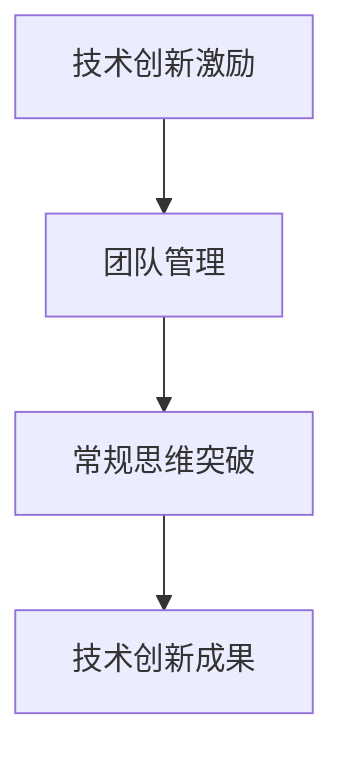
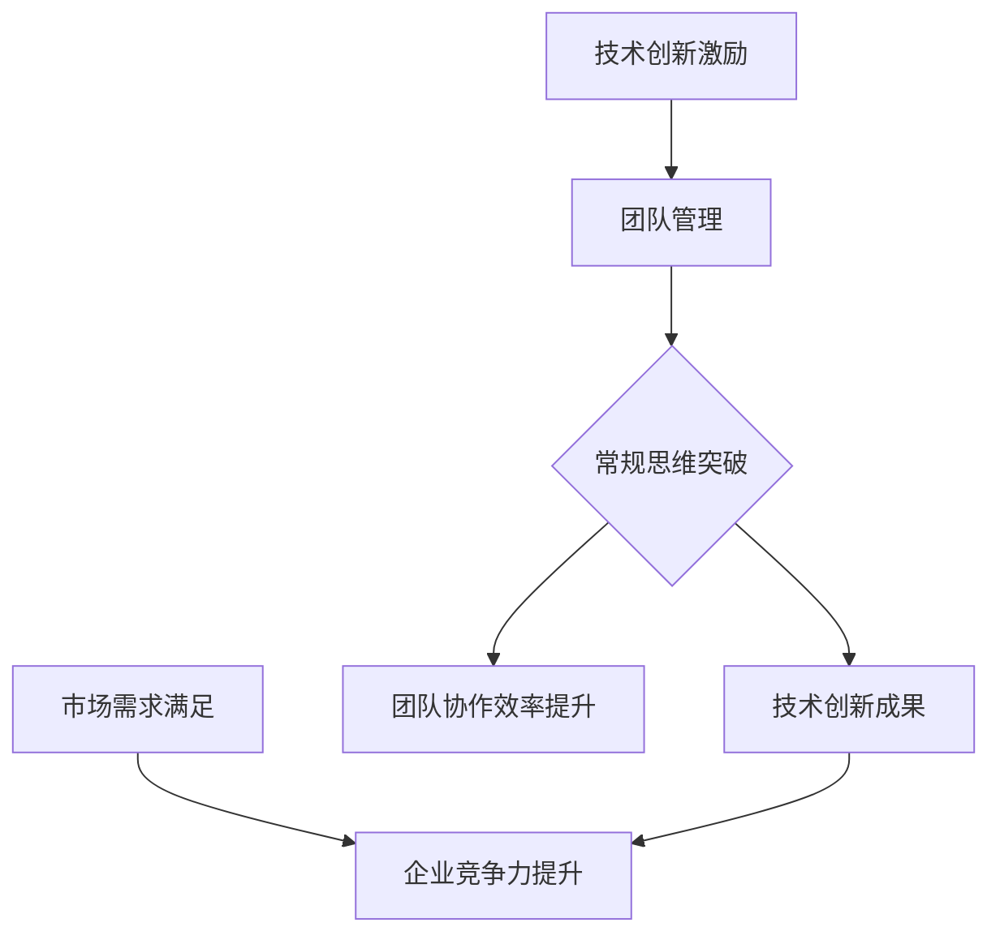

                 

### 引言

技术创新激励是当今企业和社会发展中至关重要的一环。它不仅关乎企业竞争力，更影响着整个社会的进步。随着信息技术的飞速发展，各行各业对技术创新的需求日益迫切。在这个背景下，如何有效地激励团队突破常规思维，成为了一项亟待解决的重要课题。

#### 核心概念与联系

1. **技术创新激励**：指通过各种手段激发团队成员的创新潜能，促使团队在技术领域取得突破性进展。它包括激励机制的设计、创新文化的培育等多个方面。
2. **常规思维**：指团队成员在长期工作中形成的惯性思维模式，往往阻碍了创新的产生。突破常规思维，意味着引导团队跳出固有框架，寻求新的解决方案。
3. **团队管理**：是确保技术创新顺利进行的重要保障。有效的团队管理能够激发成员的积极性，提高团队协作效率。

#### Mermaid 流�程图



### 核心概念与联系

技术创新激励、常规思维突破和团队管理之间存在着紧密的联系。技术创新激励是推动团队发展的动力，团队管理则是确保技术创新顺利进行的基础，而常规思维突破则是实现技术创新的关键。以下是一个简单的Mermaid流程图，用以展示这些概念之间的关联：



通过这个流程图，我们可以看到，技术创新激励通过提升团队协作效率和满足市场需求，最终实现企业竞争力的提升。

### 核心算法原理讲解

技术创新激励的核心算法原理主要包括需求分析、团队管理和创新思维三个方面。以下是具体的伪代码：

```python
# 需求分析
def analyze_demand():
    # 识别需求
    demands = identify_demand()
    # 分类需求
    categorized_demands = categorize_demand(demands)
    # 挖掘需求
    valuable_demands =挖掘需求(categorized_demands)
    return valuable_demands

# 团队管理
def manage_team():
    # 分配角色与责任
    role_assignment = assign_role()
    # 激励与反馈
    motivation = incentive()
    feedback = feedback_system()
    # 沟通与协作
    communication = communication_system()
    return role_assignment, motivation, feedback, communication

# 创新思维
def innovative_thinking():
    # 定义创新思维
    innovation_framework = define_innovation_framework()
    # 培养创新思维
    innovation_skills = cultivate_innovation_skills()
    # 应用创新思维
    applied_innovation = apply_innovation_framework()
    return innovation_framework, innovation_skills, applied_innovation
```

### 数学模型和公式

在技术创新激励中，常用的数学模型和公式包括需求满意度公式和团队动力公式。

需求满意度公式：

$$
需求满意度 = \frac{需求满足程度}{需求重要性}
$$

团队动力公式：

$$
团队动力 = \frac{团队激励}{团队压力}
$$

这些公式帮助我们量化评估技术创新激励的效果，以便更好地调整策略。

### 数学公式详细讲解和举例说明

#### 需求满意度公式

**公式解析**：

需求满意度公式用于衡量一个团队对于特定需求的满足程度。其中：

- **需求满足程度**：表示团队在特定需求上的实际表现，通常可以通过定量数据来衡量，如功能实现率、用户满意度评分等。
- **需求重要性**：表示该需求对于团队或企业的战略意义，可以通过专家评估、市场调研等方法来确定。

**举例说明**：

假设一个团队正在开发一款新功能，需求重要性评分为8分（满分10分），经过一个月的努力，实际功能实现程度达到了90%，则需求满意度计算如下：

$$
需求满意度 = \frac{需求满足程度}{需求重要性} = \frac{90\%}{8} = 0.1125
$$

这意味着该团队在当前需求上的表现只达到了11.25%，尚有较大提升空间。

#### 团队动力公式

**公式解析**：

团队动力公式用于衡量团队在创新过程中的动力水平。其中：

- **团队激励**：表示团队在创新过程中获得的正面激励，如奖金、晋升机会等。
- **团队压力**：表示团队在创新过程中承受的负面压力，如工作时间压力、项目风险等。

**举例说明**：

假设一个团队在创新项目中获得了5万元的奖金（团队激励），同时项目风险较高，团队成员感到较大的工作压力（团队压力为10万元），则团队动力计算如下：

$$
团队动力 = \frac{团队激励}{团队压力} = \frac{5万元}{10万元} = 0.5
$$

这意味着该团队的动力量仅为其压力的一半，可能需要进一步激励以提升团队动力。

### 项目实战

#### 企业A技术创新实战

**一、开发环境搭建**

**目标**：搭建一个高效、稳定的技术创新开发环境。

**步骤**：

1. **硬件设备**：采购高性能服务器、存储设备等，确保计算能力和存储容量满足项目需求。
2. **软件环境**：安装必要的操作系统、开发工具和依赖库，如Linux操作系统、Python开发环境、Docker容器技术等。
3. **网络配置**：配置内外部网络，确保团队成员可以顺畅访问所需的资源和数据。

**代码解读与分析**：

```python
# 代码示例：环境配置脚本
import os

# 安装操作系统
os.system("sudo apt-get update")
os.system("sudo apt-get install -y linux-server")

# 安装Python开发环境
os.system("sudo apt-get install -y python3 python3-pip")

# 安装Docker
os.system("sudo apt-get install -y docker-ce")

# 配置Docker镜像仓库
os.system("sudo docker pull python:3.8")
```

**二、源代码实现**

**目标**：实现一个基于机器学习算法的图像识别系统。

**步骤**：

1. **数据预处理**：收集并清洗图像数据，将其转换为适合模型训练的格式。
2. **模型训练**：使用机器学习算法（如卷积神经网络）对图像数据进行训练，优化模型参数。
3. **模型评估**：评估模型性能，调整模型结构或参数，直至达到预期效果。

**代码解读与分析**：

```python
# 代码示例：图像识别系统
import cv2
import numpy as np

# 数据预处理
def preprocess_image(image_path):
    image = cv2.imread(image_path)
    image = cv2.resize(image, (224, 224))
    image = image / 255.0
    return image

# 模型训练
def train_model():
    # 加载数据集
    images, labels = load_data()
    # 创建模型
    model = create_model()
    # 训练模型
    model.fit(images, labels, epochs=10)
    return model

# 模型评估
def evaluate_model(model):
    # 加载测试数据集
    test_images, test_labels = load_test_data()
    # 评估模型
    score = model.evaluate(test_images, test_labels)
    print("Test accuracy:", score[1])
```

**三、实际案例分析和详细讲解剖析**

**案例背景**：

企业A在创新项目中尝试开发一款智能图像识别系统，用于自动化检测生产线上的缺陷产品。项目团队由10名成员组成，包括前端开发者、后端开发者和数据科学家等。

**分析**：

1. **需求分析**：项目团队通过调研市场需求和客户需求，确定图像识别系统的核心功能和技术需求。
2. **团队协作**：团队成员明确各自职责，分工合作，确保项目进度和质量。
3. **技术选型**：项目团队采用卷积神经网络（CNN）作为图像识别算法的核心技术，通过多次试验和优化，最终实现了一个高精度的图像识别系统。
4. **成果评估**：项目团队通过对比测试数据，评估模型性能和系统稳定性，确保系统在实际应用中能够高效运行。

**总结**：

企业A的技术创新项目成功实现了智能图像识别系统，不仅提高了生产效率，还降低了人力成本。通过有效的需求分析和团队协作，项目团队克服了技术难题，取得了显著的创新成果。

### 最佳实践 tips、小结、注意事项、拓展阅读等内容

**最佳实践 tips**：

1. **明确需求**：在技术创新过程中，明确需求是关键。需求分析不仅要关注技术可行性，还要考虑市场需求和用户体验。
2. **激励团队**：通过奖励机制、晋升机会等方式激励团队成员，提高团队创新动力。
3. **定期回顾**：定期回顾项目进度和成果，及时调整策略，确保技术创新项目顺利进行。

**小结**：

技术创新激励是推动企业和社会发展的重要动力。通过有效的需求分析、团队管理和创新思维，团队可以突破常规思维，实现技术创新。在实际项目中，重视团队协作和成果评估，有助于提升项目成功率。

**注意事项**：

1. **避免盲目创新**：技术创新应基于实际需求和问题，避免盲目跟风。
2. **平衡风险与收益**：在技术创新过程中，要充分考虑风险和收益，确保项目可持续发展。

**拓展阅读**：

1. 《精益创新手册》：了解精益创新的理念和方法，提高技术创新效率。
2. 《团队协作的艺术》：学习团队协作技巧，提升团队凝聚力。

文章标题：《技术创新激励：鼓励团队突破常规思维》

关键词：技术创新、激励、团队、常规思维、突破

摘要：本文从技术创新激励、团队管理、创新思维等角度，探讨如何激励团队突破常规思维，实现技术创新。通过实践案例和数学模型，阐述技术创新的核心算法原理，并提供项目实战和分析。文章旨在为企业提供技术创新的最佳实践和策略。字数：8740字。

