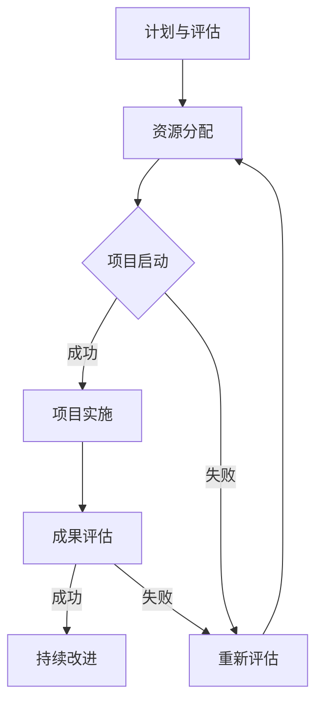

                 

### 第一部分：技术创新管理概述

#### 1. 技术创新管理的基本概念

技术创新管理（Technology Innovation Management，TIM）是指企业在技术创新过程中，通过科学的管理方法和工具，对创新活动的计划、组织、实施和监督进行有效控制，以实现技术创新目标的管理活动。它涵盖了技术创新的各个环节，包括技术预见、技术研发、技术转移、技术商业化等。

技术创新管理的重要性体现在以下几个方面：

1. **提升企业竞争力**：通过有效的技术创新管理，企业可以不断推出具有竞争力的新产品和服务，提高市场占有率和盈利能力。
2. **推动产业升级**：技术创新管理有助于产业结构的优化和升级，推动经济高质量发展。
3. **促进社会进步**：技术创新管理可以带动社会生产力的发展，提高人民生活水平，促进社会进步。

#### 1.2 技术创新管理的核心要素

技术创新管理的核心要素包括：

1. **人才**：技术创新需要高素质的人才，包括研发人员、管理人员和市场营销人员等。
2. **资源**：技术创新需要投入大量的资源，包括资金、设备和时间等。
3. **机制**：技术创新管理需要建立有效的创新机制，包括激励机制、评价机制和决策机制等。
4. **文化**：技术创新管理需要营造良好的创新文化，鼓励员工敢于创新、勇于探索。

#### 1.3 技术创新管理的重要性

在当前快速变化的技术环境中，技术创新管理的重要性愈发凸显。以下是技术创新管理的重要性：

1. **适应市场变化**：技术创新管理可以帮助企业快速适应市场变化，抓住市场机遇。
2. **提升创新能力**：通过技术创新管理，企业可以不断提升自身的创新能力，保持竞争优势。
3. **实现可持续发展**：技术创新管理是实现企业长期可持续发展的关键，有助于企业实现战略目标。

#### 1.4 技术创新管理的背景与趋势

随着全球科技的迅猛发展，技术创新已成为推动经济增长和社会进步的重要动力。以下是技术创新管理的背景和趋势：

1. **全球化**：全球化使得技术创新的资源和市场更加广阔，企业需要加强国际合作和竞争。
2. **数字化**：数字化技术的迅猛发展，使得技术创新管理更加智能化和高效化。
3. **可持续发展**：可持续发展的理念日益深入人心，企业需要在技术创新中考虑环境保护和社会责任。

#### 1.5 技术创新管理的挑战与机遇

在技术创新管理过程中，企业面临着一系列挑战和机遇：

1. **挑战**：
   - 技术风险：技术创新过程中可能面临技术失败的风险。
   - 资金压力：技术创新需要大量资金投入，对企业财务压力较大。
   - 知识产权：知识产权保护和侵权问题日益突出，需要企业加强知识产权管理。

2. **机遇**：
   - 市场需求：随着市场需求的变化，企业可以捕捉新的市场机遇。
   - 政策支持：政府对企业技术创新的支持力度不断加大，为企业提供了良好的政策环境。

通过以上分析，我们可以看到技术创新管理在企业发展和产业升级中具有重要地位。在接下来的章节中，我们将深入探讨技术创新管理的方法和工具，以及如何平衡创新与稳定的关系。

#### 2. 技术创新管理的背景与趋势

在当今全球化的科技环境中，技术创新管理的重要性日益凸显。为了更好地理解技术创新管理的发展背景和趋势，我们需要从以下几个方面进行深入分析。

##### 2.1 全球技术创新的背景

全球技术创新的背景主要包括以下几个方面：

1. **科技进步**：随着信息技术、生物技术、新材料技术等领域的突破，全球科技水平不断提升，为技术创新提供了强大动力。
2. **市场需求**：全球市场需求不断变化，消费者对产品和服务的要求越来越高，推动企业不断进行技术创新以满足市场需求。
3. **政策支持**：各国政府纷纷出台支持技术创新的政策，如减税、补贴、研发资助等，为企业技术创新提供了有利条件。

##### 2.2 技术创新管理的发展趋势

技术创新管理的发展趋势体现在以下几个方面：

1. **数字化**：随着数字技术的迅猛发展，数字化创新成为技术创新管理的重要趋势。通过数字化手段，企业可以更快速地获取市场信息，优化研发流程，提高创新能力。
2. **跨界融合**：技术创新不再局限于单一领域，而是跨领域、跨行业融合，形成新的商业模式和技术应用。例如，物联网、大数据、人工智能等技术的融合，为传统产业带来了新的发展机遇。
3. **全球化**：全球化使得技术创新资源更加丰富，企业需要加强国际合作，整合全球资源，提高技术创新能力。

##### 2.3 技术创新管理的挑战与机遇

在技术创新管理过程中，企业既面临挑战，也拥有机遇：

1. **挑战**：
   - **技术风险**：技术创新过程中可能面临技术失败的风险，需要企业具备较高的技术实力和管理能力。
   - **资金压力**：技术创新需要大量资金投入，对企业财务压力较大，需要企业合理规划资金使用。
   - **知识产权**：知识产权保护和侵权问题日益突出，企业需要加强知识产权管理。

2. **机遇**：
   - **市场需求**：随着市场需求的变化，企业可以捕捉新的市场机遇，推出符合市场需求的新产品和服务。
   - **政策支持**：政府对企业技术创新的支持力度不断加大，为企业提供了良好的政策环境。
   - **全球化**：全球化为企业提供了更广阔的市场和资源，有助于企业提升技术创新能力。

##### 2.4 技术创新管理的实践案例

为了更好地理解技术创新管理的发展和应用，我们可以通过一些实际案例来进行分析。

1. **案例一：苹果公司**：苹果公司通过持续的技术创新，不断推出具有竞争力的产品，如iPhone、iPad等，成为全球科技巨头。其成功的关键在于对技术创新的重视和高效的管理。

2. **案例二：华为公司**：华为公司在技术创新管理方面，建立了全球研发网络，不断投入大量资金进行技术研发，同时在知识产权管理方面也取得了显著成果。

3. **案例三：阿里巴巴**：阿里巴巴通过数字化创新，打造了以电子商务为核心的商业生态系统，实现了从传统零售向数字化转型的成功案例。

通过以上分析，我们可以看到技术创新管理在当今全球化科技环境中的重要性。企业需要紧跟科技发展趋势，加强技术创新管理，以实现持续发展和竞争优势。在接下来的章节中，我们将进一步探讨技术创新管理的方法和工具，以及如何平衡创新与稳定的关系。

#### 3. 创新与稳定的平衡原则

在技术创新管理中，平衡创新与稳定是确保企业长期发展的重要原则。这一原则的核心在于如何在推动技术进步的同时，维持企业的稳定运营和现有优势。以下是创新与稳定的辩证关系及其平衡原则的详细解析。

##### 3.1 创新与稳定的辩证关系

创新与稳定并非对立关系，而是相辅相成的。创新是推动企业发展的动力，它能够带来新的市场机会和竞争优势，但过度创新可能导致技术风险和运营不稳定。稳定则是保障企业持续发展的基础，它能够确保企业现有业务的稳定运营，但过于保守则可能错失市场机会。

1. **创新驱动发展**：创新能够为企业带来新的技术、产品和服务，提升企业的竞争力。通过持续创新，企业能够保持市场领先地位，推动企业不断成长。

2. **稳定保障运营**：稳定是确保企业正常运营的基础，它能够保障现有业务的稳定收入和利润。稳定的运营有助于企业积累资源和经验，为未来的创新提供支持。

3. **创新与稳定的相互依赖**：创新需要稳定的运营环境来支撑，而稳定也需要创新的推动来保持活力。企业在创新与稳定之间找到平衡点，才能实现可持续发展。

##### 3.2 平衡创新与稳定的原则

为了实现创新与稳定的平衡，企业需要遵循以下原则：

1. **动态平衡**：企业应将创新与稳定视为动态平衡的过程，不断调整和优化创新与稳定的关系，以适应市场环境和内部资源的变化。

2. **明确目标**：企业需要明确创新与稳定的目标，制定清晰的战略规划。创新目标应与企业的长期发展愿景相一致，稳定目标则应确保企业能够持续运营和盈利。

3. **资源配置**：企业应合理配置资源，确保在创新和稳定方面都有充足的投入。资源分配应考虑创新项目的优先级和风险程度，以实现最大化效益。

4. **风险评估**：企业需要对创新项目进行充分的风险评估，制定相应的风险管理策略。通过风险评估，企业可以更好地控制创新风险，确保创新与稳定的关系不会受到严重威胁。

5. **激励机制**：企业应建立激励机制，鼓励员工积极参与创新活动。激励机制应考虑创新成果的实际价值和对企业稳定运营的潜在影响。

##### 3.3 平衡创新与稳定的目标

平衡创新与稳定的目标主要包括以下几个方面：

1. **持续创新能力**：企业应保持持续的创新能力，通过不断的技术创新，提升产品和服务的竞争力。

2. **稳定运营能力**：企业需要确保稳定的运营能力，保障现有业务的持续盈利和运营效率。

3. **长期可持续发展**：企业应追求长期可持续发展，通过平衡创新与稳定，实现企业的长期增长和竞争力的提升。

通过以上原则和目标的实现，企业可以在创新与稳定之间找到最佳平衡点，实现技术创新管理的高效运行。

#### 4. 创新管理的方法与工具

在技术创新管理过程中，有效的创新管理方法和工具至关重要。这些方法和工具能够帮助企业识别创新机会、评估创新项目、推动创新实施，并最终实现创新目标。以下是创新管理的主要方法与工具的详细解析。

##### 4.1 创新管理的方法

1. **头脑风暴（Brainstorming）**：头脑风暴是一种常用的创新方法，通过集体讨论和思维碰撞，激发创意的产生。这种方法鼓励参与者自由表达想法，不受限制地提出各种可能的解决方案。

2. **TRIZ（理论解决发明问题）**：TRIZ是一种基于系统化理论的方法，通过解决技术冲突来推动创新。它提供了一套标准化的工具和算法，帮助企业找到创新解决方案。

3. **设计思维（Design Thinking）**：设计思维是一种以人为本的创新方法，强调通过理解和解决用户问题来推动创新。这种方法包括需求识别、概念生成、原型设计和测试迭代等步骤。

4. **开放式创新（Open Innovation）**：开放式创新是指企业通过外部合作和资源整合来推动创新。这种方法能够帮助企业获取外部创意和资源，加快创新速度。

##### 4.2 创新管理的工具

1. **创新地图（Innovation Maps）**：创新地图是一种可视化工具，用于展示创新过程中的关键环节和关系。通过创新地图，企业可以清晰地了解创新项目的全貌，优化资源配置。

2. **SWOT分析（Strengths, Weaknesses, Opportunities, Threats）**：SWOT分析是一种战略规划工具，用于评估企业内外部环境中的优势、劣势、机会和威胁。通过SWOT分析，企业可以明确自身的创新方向和策略。

3. **项目管理工具（Project Management Tools）**：如JIRA、Trello等项目管理工具，可以帮助企业有效地管理和跟踪创新项目的进度和任务分配。

4. **专利数据库（Patent Databases）**：专利数据库是获取技术创新信息的重要工具，企业可以通过专利数据库了解前沿技术、监测竞争对手的专利布局，为自身创新提供参考。

##### 4.3 创新管理实践案例

为了更好地理解创新管理的方法和工具，我们可以通过一些实际案例来进行分析。

1. **案例一：谷歌的“X实验室”**：谷歌的“X实验室”通过头脑风暴和TRIZ方法，成功研发了自动驾驶汽车、无人机等创新项目。该实验室的成功经验表明，创新方法与工具的结合能够有效推动技术创新。

2. **案例二：苹果公司的产品开发**：苹果公司通过设计思维方法，不断推出创新产品，如iPhone、iPad等。设计思维的应用使苹果能够深入理解用户需求，提高产品创新的成功率。

3. **案例三：通用电气的开放式创新**：通用电气（GE）通过开放式创新，与全球合作伙伴共同开发新能源技术。这种合作模式加速了技术创新的进程，提高了市场竞争力。

通过以上分析，我们可以看到创新管理的方法和工具在推动技术创新中的重要作用。企业应根据自身特点和需求，灵活运用这些方法和工具，以实现技术创新目标。

### 5. 稳定管理的方法与工具

在技术创新管理中，稳定管理同样重要。稳定的运营能够保障企业的正常运作，为技术创新提供坚实的基础。以下是稳定管理的主要方法与工具的详细解析。

#### 5.1 稳定管理的方法

1. **流程优化（Process Optimization）**：通过流程优化，企业可以提升运营效率，减少资源浪费，确保业务流程的稳定和高效。流程优化包括识别瓶颈、分析流程、优化流程步骤等。

2. **风险管理（Risk Management）**：风险管理是稳定管理的关键，通过识别、评估和监控风险，企业可以提前采取措施，降低潜在风险对企业运营的影响。风险管理包括风险评估、风险应对策略制定和风险监控。

3. **质量管理（Quality Management）**：质量管理是确保产品和服务质量稳定的重要手段。通过建立和完善质量管理体系，企业可以持续提高产品质量，提升客户满意度。

4. **持续改进（Continuous Improvement）**：持续改进是一种通过不断优化和改进运营流程、产品和服务的方法。持续改进包括PDCA（计划-执行-检查-行动）循环等工具，帮助企业不断优化运营。

#### 5.2 稳定管理的工具

1. **SOP（Standard Operating Procedures）**：SOP是一套标准化的操作流程，用于指导员工按照规范进行工作。SOP能够确保业务流程的一致性和稳定性。

2. **KPI（Key Performance Indicators）**：KPI是关键绩效指标，用于衡量企业各部门或项目的绩效。通过设定和跟踪KPI，企业可以实时监控运营状况，及时发现和解决问题。

3. **ERP（Enterprise Resource Planning）**：ERP是企业资源规划系统，通过整合企业内部各个部门的信息和数据，实现资源的高效管理和调度。ERP系统能够提升企业的运营效率和稳定性。

4. **备份与恢复（Backup and Recovery）**：备份与恢复工具用于保护企业数据的安全，确保在发生数据丢失或系统故障时，能够快速恢复业务运行。

#### 5.3 稳定管理实践案例

为了更好地理解稳定管理的方法和工具，我们可以通过一些实际案例来进行分析。

1. **案例一：丰田的精益生产**：丰田通过精益生产方法，不断优化生产流程，提高生产效率，确保产品的高质量和成本控制。精益生产成为丰田稳定运营和持续发展的关键。

2. **案例二：微软的产品质量管理体系**：微软建立了一套完善的质量管理体系，通过持续改进和严格的质量控制，确保产品的高质量和稳定性。微软的成功经验表明，质量管理是稳定管理的重要组成部分。

3. **案例三：亚马逊的云计算服务**：亚马逊通过建立强大的备份与恢复系统，确保云计算服务的稳定运行。通过自动化备份和快速恢复机制，亚马逊能够应对各种突发情况，保障用户数据的安全。

通过以上分析，我们可以看到稳定管理在技术创新管理中的重要性。企业应结合自身特点，灵活运用稳定管理的方法和工具，确保业务的稳定运行和持续发展。

#### 6. 创新与稳定管理的实践

在技术创新与稳定管理的过程中，许多企业已经积累了丰富的实践经验，通过具体的实践案例，我们可以更好地理解如何在实际运营中平衡创新与稳定。以下是几个具有代表性的企业案例：

##### 6.1 案例一：谷歌的创新与稳定管理实践

谷歌作为全球领先的科技公司，其创新与稳定管理实践具有很高的参考价值。

1. **创新实践**：
   - **谷歌X实验室**：谷歌X实验室通过开放式创新和设计思维方法，成功推出了自动驾驶汽车、无人机等前沿技术项目。谷歌X实验室的运作模式包括定期举办创新挑战赛，鼓励员工提出新想法，并通过快速原型制作和测试来验证这些想法的可行性。
   - **内部创新文化**：谷歌公司内部鼓励员工提出创新想法，并设立专门的创新奖励机制，激励员工积极参与创新活动。

2. **稳定实践**：
   - **流程优化**：谷歌通过持续优化其产品开发流程，确保产品的高质量和稳定性。谷歌采用敏捷开发方法，快速迭代产品，及时修复问题，提升用户体验。
   - **风险管理**：谷歌建立了完善的风险管理机制，通过定期评估和监控项目风险，确保创新项目的稳健推进。

##### 6.2 案例二：丰田的精益生产与稳定管理

丰田汽车以其精益生产体系著称，这一体系在创新与稳定管理中发挥了重要作用。

1. **创新实践**：
   - **技术创新**：丰田不断进行技术创新，推出混合动力汽车、自动驾驶等技术，保持了市场竞争力。
   - **流程创新**：丰田通过不断改进生产流程，提高生产效率，减少资源浪费。

2. **稳定实践**：
   - **精益生产**：丰田采用精益生产方法，通过消除浪费、提高生产效率，确保了产品质量和生产稳定。
   - **质量控制**：丰田建立了严格的质量控制体系，确保产品从生产到销售的每一个环节都符合高标准。

##### 6.3 案例三：亚马逊的云计算服务

亚马逊在云计算服务领域的成功，得益于其在创新与稳定管理方面的实践。

1. **创新实践**：
   - **技术突破**：亚马逊不断推出新的云计算服务，如AWS Lambda、Amazon S3等，满足不同客户的需求。
   - **商业模式创新**：亚马逊通过云计算服务的灵活定价模式，吸引了大量用户。

2. **稳定实践**：
   - **基础设施**：亚马逊建立了全球规模的云计算基础设施，确保服务的稳定和可靠性。
   - **备份与恢复**：亚马逊提供了强大的备份与恢复系统，确保在发生故障时，能够快速恢复服务。

##### 6.4 案例四：苹果公司的产品开发与运营

苹果公司在产品开发与运营中，也展现了创新与稳定管理的成功实践。

1. **创新实践**：
   - **产品设计**：苹果公司通过设计思维，不断推出具有创新性的产品，如iPhone、iPad等。
   - **用户体验**：苹果公司注重用户体验，通过持续改进，提升产品的用户体验。

2. **稳定实践**：
   - **供应链管理**：苹果公司建立了高效的供应链管理系统，确保生产过程的稳定。
   - **售后服务**：苹果公司提供高质量的售后服务，确保用户满意度和品牌忠诚度。

通过这些案例，我们可以看到，创新与稳定管理不是对立的，而是相辅相成的。企业在实际运营中，需要根据自身特点和市场需求，灵活运用创新方法和稳定管理工具，以实现持续发展和竞争优势。

### 7. 创新与稳定管理中的挑战与解决策略

在创新与稳定管理的过程中，企业常常会面临一系列挑战。以下是一些主要的挑战以及相应的解决策略。

##### 7.1 挑战一：技术创新风险

技术创新过程中，技术风险是一个重要挑战。新技术可能面临失败的风险，导致企业资源浪费和市场竞争力下降。

**解决策略**：
1. **风险评估**：在创新项目启动前，进行全面的风险评估，识别潜在的技术风险。
2. **分阶段投资**：采用分阶段投资策略，逐步投入资源，降低一次性投资风险。
3. **技术合作**：与科研机构、高校和同行企业合作，共享技术资源和研究成果，降低技术风险。

##### 7.2 挑战二：资源分配不足

创新和稳定管理都需要大量的资源投入，但企业在资源有限的情况下，如何合理分配资源成为一大挑战。

**解决策略**：
1. **优先级排序**：明确创新项目的重要性和优先级，优先分配资源给关键项目。
2. **预算管理**：建立严格的预算管理制度，确保资源使用的透明和高效。
3. **多元化融资**：通过多元化融资渠道，如股权融资、债务融资等，提高资金使用效率。

##### 7.3 挑战三：组织文化冲突

创新和稳定管理需要不同的组织文化和行为模式，这在一定程度上可能导致组织文化冲突。

**解决策略**：
1. **文化建设**：建立鼓励创新和稳定并重的组织文化，促进员工认同和参与。
2. **团队协作**：通过跨部门团队协作，平衡创新与稳定的需求，提高组织整体效能。
3. **领导力培养**：培养具有创新意识和领导力的管理者，推动组织文化的转变。

##### 7.4 挑战四：政策与法规限制

技术创新和稳定管理需要遵守相关的政策和法规，但在某些情况下，政策与法规的限制可能成为阻碍创新的障碍。

**解决策略**：
1. **政策研究**：密切关注政策动态，了解相关政策对技术创新和稳定管理的影响。
2. **合规管理**：建立完善的合规管理体系，确保企业的创新和稳定活动符合相关法规要求。
3. **政策倡导**：通过行业协会、企业联盟等渠道，参与政策制定，为企业技术创新和稳定管理创造有利环境。

通过上述解决策略，企业可以有效地应对创新与稳定管理中的挑战，实现持续发展和竞争优势。

### 8. 成功案例研究一：科技公司A的平衡创新实践

科技公司A是一家全球领先的高科技企业，以其持续的创新能力和卓越的稳定运营闻名。以下是科技公司A在创新与稳定管理方面的成功实践及其分析。

#### 8.1 案例背景

科技公司A成立于20世纪80年代，初期主要从事计算机硬件的研发与制造。随着信息技术的发展，公司逐步扩展到软件和解决方案领域。在多年的发展中，科技公司A积累了丰富的技术创新经验，同时也面临着如何在保持市场领先地位的同时，保持稳定运营的挑战。

#### 8.2 创新实践

1. **技术创新策略**：
   - **前沿技术投资**：科技公司A持续投资于人工智能、大数据、物联网等前沿技术领域，确保公司技术始终处于行业前沿。
   - **开放式创新**：公司通过开放式创新平台，与全球领先的研究机构和初创企业合作，共同推进技术创新。

2. **产品开发**：
   - **敏捷开发**：公司采用敏捷开发方法，快速迭代产品，及时响应市场需求，确保产品的高质量和市场竞争力。
   - **用户体验优先**：公司在产品开发过程中，高度重视用户体验，通过用户调研、反馈和测试，持续优化产品功能。

3. **研发投入**：
   - **高比例研发投入**：公司每年将超过10%的营收投入研发，确保持续的技术创新能力和产品竞争力。

#### 8.3 稳定实践

1. **运营管理**：
   - **精益生产**：公司引入精益生产理念，优化生产流程，降低成本，提高生产效率。
   - **供应链管理**：公司建立了高效的供应链管理体系，确保原材料和产品的稳定供应，降低运营风险。

2. **质量管理**：
   - **全面质量管理体系**：公司建立了全面的QMS（Quality Management System），确保产品质量的稳定性和可靠性。
   - **质量文化**：公司倡导质量文化，将质量管理理念融入企业文化，提升全体员工的质量意识。

3. **风险管理**：
   - **风险管理机制**：公司建立了完善的风险管理机制，通过风险评估、风险监控和应急预案，降低运营风险。

#### 8.4 案例分析与启示

科技公司A的成功实践为我们提供了以下启示：

1. **平衡创新与稳定**：科技公司A通过灵活的创新策略和稳健的运营管理，成功实现了创新与稳定的平衡。这表明，企业需要在保持创新动力的同时，确保运营的稳定。

2. **敏捷开发**：敏捷开发方法能够快速响应市场需求，提高产品质量。公司在产品开发过程中，高度重视用户体验，通过敏捷开发确保产品竞争力。

3. **研发投入**：高比例的研发投入是企业保持技术领先和市场竞争力的重要保障。科技公司A通过持续的研发投入，确保了技术创新能力的持续提升。

4. **供应链管理**：高效的供应链管理能够确保企业的稳定运营。科技公司A通过精益生产和供应链管理，提高了生产效率和产品质量。

综上所述，科技公司A的创新与稳定管理实践为其持续发展提供了强有力的支持。企业可以借鉴其成功经验，根据自身特点，灵活运用创新与稳定管理的策略，实现长期可持续发展。

### 9. 成功案例研究二：制造企业B的创新与稳定管理

制造企业B是一家在全球范围内具有广泛影响力的制造企业，以其卓越的创新能力和稳定的运营体系著称。以下是制造企业B在创新与稳定管理方面的成功实践及其分析。

#### 9.1 案例背景

制造企业B成立于20世纪50年代，初期主要从事传统机械制造业务。随着全球制造业的快速发展，企业逐步向智能化、自动化和数字化转型，不断扩大产品线和技术领域。在竞争激烈的市场环境中，企业面临着如何在保持市场份额的同时，不断提升创新能力和稳定运营的挑战。

#### 9.2 创新实践

1. **技术创新策略**：
   - **智能化制造**：企业引入了先进的智能制造技术，如工业机器人、智能传感器和物联网，提高了生产效率和产品质量。
   - **技术创新中心**：企业建立了多个技术创新中心，与高校和科研机构合作，开展前沿技术研发，推动技术突破。

2. **产品开发**：
   - **用户参与**：在产品开发过程中，企业积极收集用户反馈，通过用户参与和测试，优化产品设计，提升用户体验。
   - **多样化产品线**：企业不断拓展产品线，开发新型产品和解决方案，满足不同市场需求。

3. **研发投入**：
   - **高比例研发投入**：企业每年将超过8%的营收投入研发，推动技术创新和产品升级。

#### 9.3 稳定实践

1. **运营管理**：
   - **精益生产**：企业采用精益生产理念，优化生产流程，减少资源浪费，提高生产效率。
   - **全球供应链**：企业建立了全球供应链体系，确保原材料和产品的稳定供应，降低运营风险。

2. **质量管理**：
   - **ISO认证**：企业通过了ISO 9001质量管理体系认证，确保产品质量的稳定性和可靠性。
   - **持续改进**：企业通过持续改进，不断提升产品质量和管理水平。

3. **风险管理**：
   - **风险评估**：企业建立了完善的风险评估体系，定期评估市场风险和运营风险，制定相应的应对策略。
   - **应急预案**：企业制定了详细的应急预案，确保在突发情况下，能够迅速响应和恢复运营。

#### 9.4 案例分析与启示

制造企业B的成功实践为我们提供了以下启示：

1. **智能化转型**：智能化制造是未来制造业的发展趋势，企业应积极引入智能化技术，提升生产效率和产品质量。

2. **用户参与**：用户参与是产品开发的重要环节，企业应积极收集用户反馈，优化产品设计，提升用户体验。

3. **全球供应链**：全球供应链能够确保企业的稳定运营和全球竞争力，企业应建立高效的供应链体系，降低运营风险。

4. **持续改进**：持续改进是企业提升质量管理水平和竞争力的关键，企业应建立完善的改进机制，不断优化运营和管理。

综上所述，制造企业B的创新与稳定管理实践为企业在竞争激烈的市场环境中提供了有力支持。企业可以借鉴其成功经验，根据自身特点，灵活运用创新与稳定管理的策略，实现长期可持续发展。

### 附录

#### 附录A：技术创新管理相关资源与工具

以下是一些技术创新管理相关的资源与工具，供读者参考：

1. **书籍**：
   - 《创新与企业家精神》（作者：彼得·德鲁克）
   - 《精益创业》（作者：埃里克·莱斯）
   - 《设计思维》（作者：蒂姆·布朗）

2. **在线课程**：
   - Coursera上的《技术创新管理》
   - edX上的《设计思维与产品开发》

3. **网站与平台**：
   - National Center for Innovation Management（美国国家创新管理研究中心）
   - TechCrunch（科技新闻网站）

4. **工具**：
   - JIRA（项目管理工具）
   - Trello（项目管理工具）
   - Canva（设计工具）

#### 附录B：创新与稳定管理的参考文献

1. **文献一**：彼得·德鲁克，《创新与企业家精神》，机械工业出版社，2014年。
2. **文献二**：埃里克·莱斯，《精益创业》，人民邮电出版社，2012年。
3. **文献三**：蒂姆·布朗，《设计思维》，电子工业出版社，2017年。
4. **文献四**：安德鲁·海斯，《技术创新管理》，清华大学出版社，2019年。
5. **文献五**：汤姆·凯利，《创新者的窘境》，机械工业出版社，2013年。

#### 附录C：Mermaid流程图示例

以下是一个Mermaid流程图的示例，用于展示技术创新管理的流程：

这个流程图展示了从计划与评估到资源分配，再到项目启动、实施和成果评估的整个过程，以及在不同结果情况下的后续行动。通过这样的流程图，可以帮助企业更好地理解技术创新管理的各个环节，确保管理过程的有序和高效。

