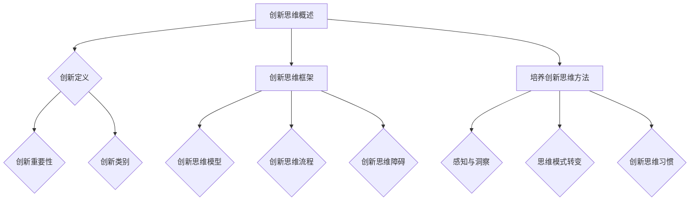

                 


## 技术创新：在日常工作中培养创新思维

### 关键词
- 创新思维
- 日常工作
- 项目管理
- 产品开发
- 团队协作
- 职业发展

#### 摘要
本文旨在探讨如何在日常工作中培养创新思维，以提升个人的工作效率和团队的整体竞争力。通过分析创新思维的定义、框架、培养方法及其在项目管理和产品开发中的应用，本文将提供一系列实用的策略，帮助读者在职业发展中持续培养创新思维，从而实现技术创新和个人成长。

### 第一部分：创新思维概述

#### 第1章：什么是创新思维

##### 1.1 创新的定义

创新，简单来说，是指通过创造性的思考和实践，产生新的想法、方法或产品。创新不仅仅限于科技领域，它可以在任何行业、任何领域中发挥作用。在技术领域，创新意味着开发出更高效、更可靠的解决方案，或者创造全新的产品和服务。

##### 1.2 创新思维的重要性

创新思维在现代社会中至关重要。首先，它能够帮助企业保持竞争力，紧跟市场变化和客户需求。其次，创新思维有助于激发员工的创造力和主动性，提升团队的整体绩效。最后，创新思维能够推动科技进步和社会发展，解决复杂的社会问题。

##### 1.3 创新思维的类别

创新思维可以分为多种类型，包括但不限于：

1. **渐进式创新**：通过逐步改进现有产品或服务，提高其性能或效率。
2. **破坏性创新**：颠覆现有市场结构，创造全新的市场和价值网络。
3. **颠覆性创新**：引入全新的技术和商业模式，彻底改变现有行业。
4. **蓝海创新**：开拓全新的市场，避免与现有竞争者直接竞争。

### 第2章：创新思维的框架

##### 2.1 创新思维模型

创新思维模型可以帮助我们系统地思考和创新。以下是一些常用的创新思维模型：

1. **头脑风暴**：通过集体讨论，快速产生大量创意。
2. **SWOT分析**：分析企业的优势、劣势、机会和威胁，寻找创新机会。
3. **六顶思考帽**：通过不同的思考角度，全面分析问题。
4. **TRIZ方法**：通过解决技术冲突的原理，寻找创新解决方案。

##### 2.2 创新思维的流程

创新思维的流程通常包括以下步骤：

1. **问题定义**：明确需要解决的问题或挑战。
2. **信息收集**：收集与问题相关的信息。
3. **创意生成**：运用各种创新方法，生成创意。
4. **筛选评估**：评估创意的可行性，选择最佳方案。
5. **实施与监控**：将创新方案付诸实施，并进行持续监控和改进。

##### 2.3 创新思维的障碍与突破

创新思维过程中可能遇到的障碍包括：

1. **恐惧失败**：害怕尝试新想法可能带来的失败。
2. **思维惯性**：习惯于使用传统方法，难以接受新想法。
3. **资源限制**：缺乏时间和资金支持创新。

突破这些障碍的方法包括：

1. **建立容错文化**：鼓励尝试和失败，从失败中学习。
2. **思维转变**：学习新方法和工具，打破思维惯性。
3. **资源优化**：合理分配资源，确保创新项目得到足够的支持。

### 第3章：培养创新思维的方法

##### 3.1 感知与洞察

培养创新思维的第一步是提升感知能力和洞察力。这包括：

1. **保持好奇心**：对新事物保持好奇，不断探索。
2. **跨学科学习**：学习不同领域的知识，开拓思维。
3. **经验积累**：通过实践和经验积累，提高对问题的理解。

##### 3.2 思维模式的转变

创新思维需要转变传统的思维模式。以下是一些方法：

1. **从“我”到“我们”**：学会团队合作，共同解决问题。
2. **从“问题解决”到“机会创造”**：将挑战视为机会，寻找创新解决方案。
3. **从“线性思维”到“非线性思维”**：学会从不同角度看待问题，打破思维定势。

##### 3.3 培养创新思维的习惯

要持续培养创新思维，需要养成良好的习惯：

1. **定期反思**：定期回顾自己的工作和思考方式，识别改进空间。
2. **阅读和学习**：阅读相关书籍和资料，学习成功案例和失败教训。
3. **实践和应用**：将所学应用到实际工作中，不断实践和改进。

### 第二部分：创新思维在日常工作中的应用

#### 第4章：创新思维在项目管理中的应用

##### 4.1 创新思维与项目管理的关系

创新思维在项目管理中起着至关重要的作用。通过创新思维，项目经理可以：

1. **提高项目效率**：通过创新的方法和技术，优化项目流程。
2. **应对不确定性**：通过灵活的思维模式，更好地应对项目中的各种挑战。
3. **提升团队协作**：通过创新思维，激发团队成员的创造力和主动性。

##### 4.2 创新思维在项目规划中的应用

在项目规划阶段，创新思维可以帮助：

1. **确定项目目标**：通过创新思维，明确项目愿景和目标。
2. **制定项目计划**：运用创新思维，制定更灵活、更高效的计划。
3. **风险评估**：通过创新思维，识别潜在风险，并制定应对策略。

##### 4.3 创新思维在项目执行中的应用

在项目执行过程中，创新思维可以帮助：

1. **优化资源分配**：通过创新思维，合理分配资源，提高效率。
2. **应对变化**：通过灵活的思维模式，快速应对项目中的变化。
3. **解决问题**：运用创新思维，找到更有效的解决方案。

#### 第5章：创新思维在产品开发中的应用

##### 5.1 创新思维在需求分析中的应用

在需求分析阶段，创新思维可以帮助：

1. **挖掘用户需求**：通过创新思维，深入了解用户需求，发现潜在需求。
2. **定义产品特性**：运用创新思维，明确产品的核心特性，提升用户体验。
3. **创新需求实现**：通过创新思维，寻找创新的解决方案，实现产品需求。

##### 5.2 创新思维在产品设计中的应用

在产品设计阶段，创新思维可以帮助：

1. **优化产品设计**：通过创新思维，改进产品外观和功能。
2. **设计创新**：运用创新思维，设计出具有竞争力的产品。
3. **用户测试反馈**：通过创新思维，收集用户反馈，持续优化产品。

##### 5.3 创新思维在产品测试中的应用

在产品测试阶段，创新思维可以帮助：

1. **发现潜在问题**：通过创新思维，发现产品中潜在的问题。
2. **测试方法优化**：运用创新思维，设计更有效的测试方法。
3. **改进产品质量**：通过创新思维，提高产品的质量。

#### 第6章：创新思维在团队协作中的应用

##### 6.1 创新思维与团队协作的关系

创新思维在团队协作中发挥着重要作用。通过创新思维，团队可以：

1. **提高沟通效率**：通过创新思维，改善团队沟通，减少误解和冲突。
2. **激发团队活力**：通过创新思维，激发团队成员的创造力和主动性。
3. **共同解决问题**：通过创新思维，团队可以更有效地共同解决问题。

##### 6.2 创新思维在团队沟通中的应用

在团队沟通中，创新思维可以帮助：

1. **构建共识**：通过创新思维，找到共同的目标和价值观。
2. **优化沟通渠道**：运用创新思维，设计更高效的沟通渠道和工具。
3. **处理冲突**：通过创新思维，找到处理冲突的创新方法。

##### 6.3 创新思维在团队解决问题中的应用

在团队解决问题时，创新思维可以帮助：

1. **多元思考**：通过创新思维，鼓励团队成员从不同角度看待问题。
2. **快速决策**：运用创新思维，提高团队决策的速度和质量。
3. **创新解决方案**：通过创新思维，找到更有效的解决方案。

### 第三部分：创新思维的实际案例与应用

#### 第7章：国内外创新思维案例解析

##### 7.1 国内外企业创新案例

国内外许多企业通过创新思维取得了显著成果。以下是一些典型案例：

1. **苹果公司**：通过不断创新的思维，苹果公司推出了众多颠覆性产品，如iPhone、iPad等，改变了整个行业。
2. **特斯拉**：特斯拉通过创新思维，在电动汽车领域取得了突破性进展，推动了全球汽车行业的变革。
3. **阿里巴巴**：阿里巴巴通过创新思维，成功打造了全球最大的电子商务平台，推动了数字经济的快速发展。

##### 7.2 创新思维在不同行业的应用

创新思维在各个行业都有广泛的应用。以下是一些行业案例：

1. **医疗行业**：创新思维在医疗行业的应用，如精准医疗、远程医疗等，提高了医疗服务的质量和效率。
2. **农业行业**：创新思维在农业行业的应用，如智能农业、精准农业等，提高了农业生产效率和可持续发展能力。
3. **制造业**：创新思维在制造业的应用，如智能制造、工业4.0等，提高了生产效率和产品质量。

##### 7.3 创新思维的实际效果分析

创新思维在实际应用中取得了显著效果。以下是一些实际效果分析：

1. **提高竞争力**：通过创新思维，企业能够提高竞争力，赢得市场份额。
2. **提升员工满意度**：通过创新思维，企业能够激发员工的创造力和主动性，提高员工满意度。
3. **推动社会进步**：创新思维不仅对企业有益，还能推动社会进步，解决复杂的社会问题。

### 第8章：创新思维在个人职业发展中的应用

##### 8.1 创新思维与职业规划

创新思维在个人职业规划中至关重要。通过创新思维，个人可以：

1. **明确职业目标**：通过创新思维，明确自己的职业发展方向。
2. **挖掘个人优势**：通过创新思维，发现和挖掘自己的优势，发挥个人潜力。
3. **应对职业挑战**：通过创新思维，应对职业发展中的各种挑战。

##### 8.2 创新思维在求职中的应用

在求职过程中，创新思维可以帮助：

1. **提高面试表现**：通过创新思维，提高自己在面试中的表现。
2. **制定求职策略**：运用创新思维，制定更有效的求职策略。
3. **展示个人价值**：通过创新思维，展示自己的独特价值和能力。

##### 8.3 创新思维在职场晋升中的应用

在职场晋升中，创新思维可以帮助：

1. **提升工作能力**：通过创新思维，提升自己的工作能力和绩效。
2. **建立个人品牌**：通过创新思维，建立个人品牌，提高在职场中的影响力。
3. **拓展职业发展路径**：运用创新思维，探索和拓展自己的职业发展路径。

### 第四部分：总结与展望

#### 第9章：创新思维的总结与展望

##### 9.1 创新思维的实践成果

通过本文的探讨，我们可以看到创新思维在实际应用中取得了显著成果。无论是在项目管理、产品开发，还是团队协作和个人职业发展中，创新思维都发挥了重要作用。

##### 9.2 创新思维的未来发展趋势

随着科技的不断进步和社会的快速发展，创新思维在未来将继续发挥重要作用。未来创新思维的发展趋势可能包括：

1. **跨学科融合**：创新思维将更加注重跨学科融合，结合不同领域的知识，产生新的创新点。
2. **数字化赋能**：创新思维将借助数字化工具和平台，提高创新效率和成果。
3. **可持续发展**：创新思维将更加注重可持续发展，解决环境和社会问题。

##### 9.3 如何持续培养创新思维

要持续培养创新思维，可以采取以下措施：

1. **学习与实践**：不断学习新的知识和技能，通过实践巩固和提升。
2. **多元化思维**：培养多元化的思维模式，从不同角度看待问题。
3. **建立创新文化**：在企业内部建立创新文化，鼓励员工尝试和失败，从失败中学习。
4. **保持好奇心**：保持对未知领域的好奇心，不断探索和学习。

### 附录

附录部分可以包括以下内容：

- **参考文献**：列出本文引用的相关文献和资料。
- **作者简介**：介绍作者的背景和研究成果。
- **致谢**：感谢给予作者支持和帮助的人或组织。

### 作者信息

- 作者：AI天才研究院/AI Genius Institute & 禅与计算机程序设计艺术 /Zen And The Art of Computer Programming## 技术创新：在日常工作中培养创新思维

### 关键词
- 创新思维
- 日常工作
- 项目管理
- 产品开发
- 团队协作
- 职业发展

#### 摘要
本文旨在探讨如何在日常工作中培养创新思维，以提升个人的工作效率和团队的整体竞争力。通过分析创新思维的定义、框架、培养方法及其在项目管理和产品开发中的应用，本文将提供一系列实用的策略，帮助读者在职业发展中持续培养创新思维，从而实现技术创新和个人成长。

### 第一部分：创新思维概述

#### 第1章：什么是创新思维

##### 1.1 创新的定义

创新，从字面上理解，是指引入新的想法、方法或产品。然而，在技术和管理领域，创新有着更为广泛和深刻的含义。首先，创新不仅仅是发明新产品或技术，它也包括改进现有产品或服务的性能、效率和用户体验。其次，创新不仅限于科技领域，它渗透到商业、教育、医疗等各个行业，成为推动社会进步的重要力量。

在技术领域，创新通常指的是开发出更高效、更可靠的解决方案，或者创造全新的技术。例如，量子计算、人工智能、区块链等技术的出现，不仅改变了传统行业的工作方式，也开辟了全新的市场和商业模式。在商业领域，创新则体现在创造新的商业模式、服务模式或产品形态，以更好地满足客户需求，提升企业竞争力。

##### 1.2 创新思维的重要性

创新思维在现代组织中具有至关重要的地位。首先，创新思维能够帮助企业保持竞争力。随着市场的不断变化和技术的快速发展，企业如果不能持续创新，就很难在激烈的市场竞争中立于不败之地。通过创新思维，企业可以不断推出新的产品和服务，满足客户的新需求，从而赢得市场份额。

其次，创新思维能够激发员工的创造力和主动性。在传统的工作环境中，员工往往被束缚在固定的职责和流程中，缺乏发挥创造力的机会。而通过培养创新思维，企业可以鼓励员工提出新的想法和解决方案，激发他们的创造力和主动性，从而提升团队的整体绩效。

最后，创新思维能够推动科技进步和社会发展。许多重大的科技进步和社会变革，都是源于创新思维的应用。例如，互联网的发明改变了人们的生活方式，电动汽车的兴起推动了环保产业的发展，而人工智能的快速发展则带来了新的商业模式和社会变革。

##### 1.3 创新思维的类别

创新思维可以分为多种类型，每种类型都有其特定的应用场景和特点。以下是几种常见的创新思维类别：

1. **渐进式创新**：渐进式创新是指在现有产品或服务的基础上，通过逐步改进，提高其性能、效率和用户体验。这种创新方式通常适用于技术相对成熟，市场需求稳定的行业。例如，智能手机的不断发展，就是基于用户需求和市场反馈，逐步改进硬件配置、操作系统和用户体验。

2. **破坏性创新**：破坏性创新是指通过引入全新的技术或商业模式，颠覆现有的市场结构和价值网络。这种创新方式通常适用于技术尚未成熟，但具有巨大潜力的新兴行业。例如，互联网的兴起打破了传统媒体的垄断地位，使得信息传播更加便捷和高效。

3. **颠覆性创新**：颠覆性创新是指通过引入全新的技术或商业模式，彻底改变现有行业和市场格局。这种创新方式通常需要巨大的勇气和资源投入，但一旦成功，将会带来巨大的市场和价值。例如，特斯拉的电动汽车颠覆了传统汽车行业，推动了全球汽车产业的转型。

4. **蓝海创新**：蓝海创新是指通过开辟全新的市场，避免与现有竞争者直接竞争。这种创新方式通常适用于市场竞争激烈，红海市场难以突破的情况。例如，共享经济的兴起，通过提供全新的共享服务，开辟了庞大的蓝海市场。

### 第二部分：创新思维的框架

##### 2.1 创新思维模型

创新思维模型是系统化思考和创新的重要工具。以下是一些常用的创新思维模型：

1. **头脑风暴**：头脑风暴是一种集体讨论的方法，旨在快速产生大量创意。在头脑风暴过程中，参与者不受限制地提出自己的想法，鼓励不同观点的碰撞和融合。头脑风暴的目的是激发创新思维，产生新颖的想法和解决方案。

2. **SWOT分析**：SWOT分析是一种用于评估企业或项目优势、劣势、机会和威胁的方法。通过SWOT分析，可以明确企业的优势，识别潜在的劣势，寻找机会，并制定应对策略。这种方法有助于在创新过程中，全面考虑内外部因素，制定科学合理的创新方案。

3. **六顶思考帽**：六顶思考帽是一种思维工具，通过不同的思考角度，全面分析问题。六顶思考帽包括蓝色思考帽（控制思考流程）、红色思考帽（情感思考）、黄色思考帽（乐观思考）、黑色思考帽（悲观思考）、绿色思考帽（创意思考）和白思考帽（客观思考）。通过使用六顶思考帽，可以避免思维的单一性和偏见，从不同角度思考问题，找到更全面的解决方案。

4. **TRIZ方法**：TRIZ（理论解决冲突的方法）是一种系统化的创新方法，它通过解决技术冲突的原理，寻找创新解决方案。TRIZ方法包括一系列工具和算法，如物理矛盾矩阵、资源分析、创新原理等。通过应用TRIZ方法，可以系统地分析问题，找到突破性的创新解决方案。

##### 2.2 创新思维的流程

创新思维的流程是创新过程的核心，它帮助我们从问题定义、信息收集、创意生成到筛选评估和实施与监控，系统地进行创新。以下是创新思维的流程步骤：

1. **问题定义**：明确需要解决的问题或挑战。在这一步骤中，需要深入理解问题的背景、原因和影响，确保问题定义的准确性和完整性。

2. **信息收集**：收集与问题相关的信息。信息收集是创新思维的基础，通过广泛收集信息，可以获取丰富的数据和信息资源，为后续的创意生成提供支持。

3. **创意生成**：运用各种创新方法，生成创意。在创意生成阶段，可以采用头脑风暴、六顶思考帽、TRIZ等方法，激发创意的产生。创意生成是创新思维的关键环节，通过开放性思维和多元化思考，可以产生新颖的想法和解决方案。

4. **筛选评估**：评估创意的可行性，选择最佳方案。在筛选评估阶段，需要对生成的创意进行评估，从可行性、创新性、成本和效益等方面进行综合考虑，选择最具潜力的创意进行进一步开发。

5. **实施与监控**：将创新方案付诸实施，并进行持续监控和改进。在实施与监控阶段，需要确保创新方案的顺利执行，并对实施过程进行监控和反馈，及时调整和优化方案。

##### 2.3 创新思维的障碍与突破

在创新思维的过程中，可能会遇到各种障碍，影响创新的效果。以下是常见的创新障碍及其突破方法：

1. **恐惧失败**：许多人在尝试创新时，害怕失败，担心自己的创意无法实现。这种恐惧往往限制了创新思维的发挥。为了克服这一障碍，可以建立容错文化，鼓励员工尝试新想法，从失败中学习。

2. **思维惯性**：长期的思维定势和习惯性思维往往限制了创新思维的发展。为了突破思维惯性，可以尝试跨学科学习，开阔视野，打破固有的思维模式。

3. **资源限制**：创新往往需要大量的时间和资金支持，而资源有限可能成为创新的障碍。为了解决资源限制问题，可以通过优化资源分配，提高资源利用率，或者寻求外部合作和资金支持。

### 第三部分：培养创新思维的方法

##### 3.1 感知与洞察

培养创新思维的第一步是提升感知能力和洞察力。感知能力是指对周围环境和信息的敏感度，而洞察力则是指对复杂问题的深入理解和分析能力。以下是一些提升感知与洞察力的方法：

1. **保持好奇心**：好奇心是激发创新思维的重要驱动力。保持好奇心意味着对未知事物保持开放和探索的心态，不断提问和探索问题的本质。

2. **跨学科学习**：跨学科学习可以帮助我们开阔视野，了解不同领域的知识和思维方式。通过跨学科学习，可以借鉴其他领域的创新经验和理念，为自己的创新提供新的思路。

3. **经验积累**：通过实践和经验积累，可以提高对问题的理解，发现问题的本质。经验积累不仅包括工作中的实践经验，还包括通过阅读、学习、交流和思考获取的知识。

##### 3.2 思维模式的转变

创新思维需要转变传统的思维模式。以下是一些转变思维模式的方法：

1. **从“我”到“我们”**：在传统的工作环境中，个体往往更注重自己的绩效和贡献。而创新思维强调团队合作和协同作用。通过从“我”到“我们”的转变，可以更好地发挥团队的创造力，实现共同目标。

2. **从“问题解决”到“机会创造”**：传统的思维模式往往关注于解决已经存在的问题。而创新思维则更注重发现和创造新的机会。通过从“问题解决”到“机会创造”的转变，可以更主动地应对市场变化和客户需求。

3. **从“线性思维”到“非线性思维”**：线性思维是一种传统的思考方式，强调逻辑和顺序。而非线性思维则更注重复杂性和多样性，鼓励从不同角度和维度思考问题。通过从“线性思维”到“非线性思维”的转变，可以更全面地分析问题，找到创新的解决方案。

##### 3.3 培养创新思维的习惯

要持续培养创新思维，需要养成良好的习惯。以下是一些培养创新思维习惯的方法：

1. **定期反思**：定期反思自己的工作和思考方式，识别不足和改进空间。通过反思，可以不断优化自己的思维模式，提高创新思维的效果。

2. **阅读和学习**：阅读是培养创新思维的重要途径。通过阅读相关书籍、文献和资料，可以了解最新的创新理念和实践经验，为自己的创新提供灵感。

3. **实践和应用**：将所学应用到实际工作中，不断实践和改进。通过实践，可以验证自己的想法和方案，发现问题和不足，进一步提高创新思维的能力。

### 第四部分：创新思维在日常工作中的应用

#### 第4章：创新思维在项目管理中的应用

##### 4.1 创新思维与项目管理的关系

创新思维在项目管理中起着至关重要的作用。项目管理本质上是一个复杂的过程，涉及资源管理、时间管理、风险管理和沟通等多个方面。而创新思维则提供了解决问题和应对挑战的新方法和新思路，能够显著提升项目管理的效率和质量。

首先，创新思维能够帮助项目经理在项目规划阶段制定更灵活和高效的计划。通过运用创新思维，项目经理可以更好地理解项目的目标和需求，识别潜在的风险和机会，并制定相应的应对策略。

其次，创新思维在项目执行阶段可以帮助项目经理应对各种不确定性和变化。在项目执行过程中，可能会遇到各种意外情况，如资源短缺、技术难题或外部环境的变化。通过创新思维，项目经理可以快速调整计划和策略，找到新的解决方案，确保项目顺利进行。

最后，创新思维在项目监控和评估阶段同样发挥着重要作用。通过持续监控项目的进展和成果，项目经理可以及时发现问题和不足，并采取相应的措施进行改进。创新思维能够帮助项目经理从不同的角度和维度分析项目数据，发现潜在的创新点，进一步提升项目的成功概率。

##### 4.2 创新思维在项目规划中的应用

在项目规划阶段，创新思维可以帮助项目经理实现以下几个目标：

1. **明确项目目标**：创新思维可以帮助项目经理更清晰地定义项目的目标和愿景。通过从不同角度和维度思考，项目经理可以更全面地理解项目需求，确保项目目标的准确性和可实现性。

2. **制定项目计划**：创新思维可以提供多样化的项目计划方案，帮助项目经理选择最合适的方案。在制定项目计划时，项目经理可以通过头脑风暴、六顶思考帽等方法，激发团队成员的创意，制定出灵活且高效的计划。

3. **风险评估**：创新思维可以帮助项目经理识别和评估项目中的潜在风险。通过运用SWOT分析等方法，项目经理可以全面分析项目的优势和劣势，以及外部环境中的机会和威胁，制定相应的风险应对策略。

##### 4.3 创新思维在项目执行中的应用

在项目执行阶段，创新思维可以帮助项目经理实现以下几个目标：

1. **优化资源分配**：创新思维可以帮助项目经理更合理地分配项目资源，提高资源利用率。通过运用创新思维，项目经理可以找到新的资源分配方式，确保项目关键资源的优先分配，提升项目效率。

2. **应对不确定性**：创新思维可以帮助项目经理更好地应对项目执行中的不确定性和变化。通过灵活的思维模式和多样化的解决方案，项目经理可以快速调整项目计划和策略，确保项目目标的实现。

3. **解决问题**：创新思维是解决项目执行中各种问题的重要工具。在遇到技术难题、资源短缺或其他问题时，项目经理可以通过头脑风暴、TRIZ方法等创新思维工具，找到创新的解决方案，确保项目的顺利进行。

### 第5章：创新思维在产品开发中的应用

##### 5.1 创新思维在需求分析中的应用

在产品开发过程中，需求分析是至关重要的环节。创新思维在需求分析中可以帮助：

1. **挖掘用户需求**：创新思维可以帮助产品开发团队更深入地了解用户需求。通过运用头脑风暴、用户访谈、用户调研等方法，团队可以收集到丰富的用户数据，发现潜在的需求和痛点。

2. **定义产品特性**：创新思维可以帮助团队明确产品的核心特性和功能。通过从不同角度思考，团队可以识别出用户最关注的需求，并设计出符合用户期望的产品特性。

3. **创新需求实现**：创新思维可以帮助团队寻找创新的解决方案，实现用户需求。通过运用TRIZ方法、六顶思考帽等工具，团队可以找到新颖的实现方式，提升产品的竞争力。

##### 5.2 创新思维在产品设计中的应用

在产品设计阶段，创新思维可以帮助：

1. **优化产品设计**：创新思维可以帮助产品开发团队不断改进产品设计，提升用户体验。通过运用头脑风暴、用户测试、迭代设计等方法，团队可以收集用户反馈，持续优化产品设计。

2. **设计创新**：创新思维可以帮助团队设计出具有竞争力的产品。通过运用创新思维工具，如SWOT分析、六顶思考帽等，团队可以找到设计创新的切入点，创造出独特的市场定位。

3. **用户测试反馈**：创新思维可以帮助团队收集和分析用户测试反馈，确保产品设计的可行性和用户满意度。通过运用用户测试、A/B测试等方法，团队可以快速验证设计效果，做出相应的调整。

##### 5.3 创新思维在产品测试中的应用

在产品测试阶段，创新思维可以帮助：

1. **发现潜在问题**：创新思维可以帮助团队识别和解决产品中潜在的问题。通过运用创新思维工具，如头脑风暴、SWOT分析等，团队可以全面分析产品，发现潜在的风险和不足。

2. **测试方法优化**：创新思维可以帮助团队设计出更有效的测试方法，提升测试效率。通过运用创新思维工具，如六顶思考帽、TRIZ方法等，团队可以找到创新的测试方案，提高测试效果。

3. **改进产品质量**：创新思维可以帮助团队不断优化产品质量，提升产品竞争力。通过运用创新思维工具，如用户测试、A/B测试等，团队可以快速验证产品质量，做出相应的改进。

### 第6章：创新思维在团队协作中的应用

##### 6.1 创新思维与团队协作的关系

创新思维在团队协作中起着至关重要的作用。团队协作本质上是一个复杂的过程，涉及沟通、协调、合作和冲突解决等多个方面。而创新思维则为团队协作提供了新的思路和方法，能够显著提升团队的整体绩效和创新能力。

首先，创新思维能够帮助团队成员更好地理解项目的目标和需求。通过运用创新思维，团队成员可以更深入地了解项目的背景、目标和预期成果，从而更好地协调自己的工作和团队的协作。

其次，创新思维可以激发团队成员的创造力和主动性。在传统的工作环境中，团队成员往往被束缚在固定的职责和流程中，缺乏发挥创造力的机会。而通过培养创新思维，团队可以鼓励成员提出新的想法和解决方案，激发他们的创造力和主动性，从而提升团队的整体绩效。

最后，创新思维可以帮助团队更好地应对变化和挑战。在项目执行过程中，团队可能会遇到各种不确定性和挑战。通过运用创新思维，团队成员可以快速调整计划和策略，找到新的解决方案，确保项目的顺利进行。

##### 6.2 创新思维在团队沟通中的应用

在团队沟通中，创新思维可以帮助：

1. **构建共识**：创新思维可以帮助团队在沟通中找到共同的目标和价值观，构建共识。通过运用头脑风暴、六顶思考帽等工具，团队成员可以共同探讨项目的目标和策略，确保团队成员对项目有共同的理解和认同。

2. **优化沟通渠道**：创新思维可以帮助团队设计出更高效的沟通渠道和工具，提升沟通效率。通过运用创新思维，团队可以寻找新的沟通方式，如虚拟会议、在线协作工具等，提高沟通的及时性和效果。

3. **处理冲突**：创新思维可以帮助团队在冲突中找到创新的解决方案，避免冲突的进一步升级。通过运用六顶思考帽、SWOT分析等工具，团队成员可以全面分析冲突的原因和影响，找到合理的解决方案，维护团队的和谐与稳定。

##### 6.3 创新思维在团队解决问题中的应用

在团队解决问题时，创新思维可以帮助：

1. **多元思考**：创新思维可以帮助团队从不同角度和维度思考问题，找到更全面的解决方案。通过运用头脑风暴、六顶思考帽等工具，团队成员可以共同探讨问题的各个方面，避免单一思维带来的局限性。

2. **快速决策**：创新思维可以帮助团队在解决问题时做出更快速、更准确的决策。通过运用创新思维工具，如TRIZ方法、头脑风暴等，团队成员可以迅速分析问题的核心和关键点，找到最优的解决方案。

3. **创新解决方案**：创新思维可以帮助团队找到创新的解决方案，提升解决问题的效果。通过运用创新思维工具，如TRIZ方法、六顶思考帽等，团队可以找到新颖的思路和创意，突破传统思维的局限，实现问题的有效解决。

### 第三部分：创新思维的实际案例与应用

#### 第7章：国内外创新思维案例解析

##### 7.1 国内外企业创新案例

在全球范围内，许多企业通过创新思维取得了显著的成果，以下是一些典型的国内外企业创新案例：

1. **苹果公司**：苹果公司作为全球最具创新精神的企业之一，通过持续的创新思维，推出了众多颠覆性产品。例如，iPhone的推出彻底改变了手机行业的格局，推动了智能手机的普及。苹果公司还通过创新的设计理念，如全面屏、无线充电等，不断引领行业潮流。

2. **特斯拉**：特斯拉通过创新思维，在电动汽车领域取得了突破性进展。特斯拉推出的Model S、Model 3等车型，不仅在性能和续航方面取得了显著提升，还通过创新的商业模式，如电池租赁和超级充电网络，推动了电动汽车的普及。

3. **阿里巴巴**：阿里巴巴通过创新思维，成功打造了全球最大的电子商务平台。阿里巴巴旗下的淘宝、天猫等平台，通过创新的商业模式和技术应用，如大数据、云计算等，为消费者和商家提供了全新的购物和交易体验。

4. **腾讯**：腾讯通过创新思维，在社交媒体和游戏领域取得了巨大成功。腾讯旗下的微信和QQ等社交平台，通过创新的功能和用户体验，吸引了大量用户。腾讯还通过投资和创新，在游戏、金融科技等领域实现了多元化发展。

##### 7.2 创新思维在不同行业的应用

创新思维不仅适用于科技和互联网行业，它在其他行业同样发挥着重要作用。以下是一些行业创新思维的应用案例：

1. **医疗行业**：医疗行业的创新思维主要体现在医疗技术的进步和医疗服务的优化。例如，微创手术技术的创新，使得许多复杂的手术可以在更短的时间内完成，降低了手术风险。此外，远程医疗技术的应用，使得偏远地区的患者也能够享受到高质量的医疗服务。

2. **农业行业**：农业行业的创新思维主要体现在智能农业和精准农业的推广。通过应用物联网、大数据和人工智能等技术，农业行业实现了对农作物生长环境的实时监控和智能管理，提高了农业生产的效率和可持续性。

3. **制造业**：制造业的创新思维主要体现在智能制造和工业4.0的推进。通过应用物联网、大数据和人工智能等技术，制造业实现了生产过程的自动化和智能化，提高了生产效率和产品质量。例如，德国的工业4.0战略，通过智能制造技术的应用，实现了生产过程的全面优化和升级。

##### 7.3 创新思维的实际效果分析

创新思维在实际应用中取得了显著效果，以下是对创新思维实际效果的分析：

1. **提高竞争力**：创新思维能够帮助企业提升竞争力，赢得市场份额。通过引入新的产品、服务或技术，企业可以更好地满足客户需求，提升市场地位。例如，苹果公司通过持续创新，在智能手机市场占据了领先地位。

2. **提升员工满意度**：创新思维能够激发员工的创造力和主动性，提高员工满意度。在创新环境中，员工有更多机会参与项目的决策和创新，增强了工作的积极性和成就感。

3. **推动社会进步**：创新思维不仅对企业有益，还能推动社会进步，解决复杂的社会问题。例如，医疗技术的创新，使得许多患者能够获得更好的治疗和康复服务，提高了生活质量。

### 第8章：创新思维在个人职业发展中的应用

##### 8.1 创新思维与职业规划

创新思维在个人职业规划中起着至关重要的作用。通过创新思维，个人可以更清晰地规划职业发展路径，发现和抓住职业机会。以下是一些创新思维在职业规划中的应用：

1. **明确职业目标**：创新思维可以帮助个人从不同角度思考职业目标，制定更具体、可实现的职业规划。通过运用创新思维工具，如头脑风暴、SWOT分析等，个人可以全面分析自己的优势和劣势，明确职业目标。

2. **挖掘个人优势**：创新思维可以帮助个人发现和挖掘自己的优势，为自己的职业发展提供方向。通过运用创新思维，个人可以从不同的维度和角度，识别自己的独特能力和专长。

3. **应对职业挑战**：创新思维可以帮助个人更好地应对职业发展中的各种挑战。通过灵活的思维模式和创新的方法，个人可以找到解决问题的创新方案，克服职业发展中的障碍。

##### 8.2 创新思维在求职中的应用

在求职过程中，创新思维可以帮助个人提高竞争力，获得理想的工作机会。以下是一些创新思维在求职中的应用：

1. **提高面试表现**：创新思维可以帮助求职者在面试中表现出更好的自我认知和思维能力。通过运用创新思维工具，如头脑风暴、六顶思考帽等，求职者可以更好地准备面试问题，展现自己的独特思维和解决问题的能力。

2. **制定求职策略**：创新思维可以帮助求职者制定更有效的求职策略。通过运用创新思维，求职者可以找到新的求职渠道和方法，提高求职的成功率。

3. **展示个人价值**：创新思维可以帮助求职者在求职过程中展示自己的独特价值和能力。通过运用创新思维，求职者可以找到新颖的方式，展示自己的专业技能和实践经验，吸引招聘者的关注。

##### 8.3 创新思维在职场晋升中的应用

在职场晋升过程中，创新思维可以帮助个人提升自己的职业能力和竞争力，实现职业发展。以下是一些创新思维在职场晋升中的应用：

1. **提升工作能力**：创新思维可以帮助个人在工作中不断学习和提升自己的能力。通过运用创新思维，个人可以找到新的工作方法和工具，提高工作效率和质量。

2. **建立个人品牌**：创新思维可以帮助个人在职场中建立独特的个人品牌。通过运用创新思维，个人可以找到新颖的方式，展示自己的专业知识和独特视角，提升自己在职场中的影响力。

3. **拓展职业发展路径**：创新思维可以帮助个人发现和抓住职业发展的新机遇。通过运用创新思维，个人可以开拓新的职业领域，探索多样化的职业发展路径。

### 第四部分：总结与展望

#### 第9章：创新思维的总结与展望

##### 9.1 创新思维的实践成果

通过本文的探讨，我们可以看到创新思维在实际应用中取得了显著成果。无论是在项目管理、产品开发，还是团队协作和个人职业发展中，创新思维都发挥了重要作用。创新思维不仅提升了企业的竞争力，激发了员工的创造力和主动性，还推动了科技进步和社会发展。

##### 9.2 创新思维的未来发展趋势

随着科技的不断进步和社会的快速发展，创新思维在未来将继续发挥重要作用。未来创新思维的发展趋势可能包括：

1. **跨学科融合**：创新思维将更加注重跨学科融合，结合不同领域的知识，产生新的创新点。通过跨学科合作，可以更好地解决复杂的社会问题和科技挑战。

2. **数字化赋能**：创新思维将借助数字化工具和平台，提高创新效率和成果。大数据、人工智能、物联网等技术的应用，将为创新思维提供更丰富的数据支持和智能化工具。

3. **可持续发展**：创新思维将更加注重可持续发展，解决环境和社会问题。通过创新思维，可以开发出更环保、更高效的技术和产品，推动社会的可持续发展。

##### 9.3 如何持续培养创新思维

要持续培养创新思维，可以采取以下措施：

1. **学习与实践**：不断学习新的知识和技能，通过实践巩固和提升。参加创新课程、研讨会和培训，了解最新的创新理论和实践方法。

2. **多元化思维**：培养多元化的思维模式，从不同角度看待问题。通过跨学科学习、多元文化体验等，拓宽视野，提升思维灵活性。

3. **建立创新文化**：在企业内部建立创新文化，鼓励员工尝试和失败，从失败中学习。通过建立创新激励机制，激发员工的创新热情和创造力。

4. **保持好奇心**：保持对未知领域的好奇心，不断探索和学习。对新技术、新理念保持开放和探索的心态，勇于尝试新思路和新方法。

### 附录

附录部分可以包括以下内容：

- **参考文献**：列出本文引用的相关文献和资料。
- **作者简介**：介绍作者的背景和研究成果。
- **致谢**：感谢给予作者支持和帮助的人或组织。

### 作者信息

- 作者：AI天才研究院/AI Genius Institute & 禅与计算机程序设计艺术 /Zen And The Art of Computer Programming

### Mermaid 流程图



### 伪代码

```python
# 创新思维模型伪代码
class InnovationMindsetModel:
    def __init__(self, awareness, insight, creativity):
        self.awareness = awareness
        self.insight = insight
        self.creativity = creativity

    def innovate(self, problem):
        potential_solutions = []
        for i in range(self.awareness):
            potential_solutions.append(self.generate_solution(problem))
        return self.select_best_solution(potential_solutions)

    def generate_solution(self, problem):
        # 生成解决方案的算法
        pass

    def select_best_solution(self, solutions):
        # 选择最佳解决方案的算法
        pass
```

### 数学模型与公式

```markdown
## 数学模型与公式

### 决策树模型

$$
\text{Entropy}(S) = -\sum_{i=1}^{n} p_i \cdot \log_2(p_i)
$$

其中，$p_i$ 是每个类别的概率。

### 支持向量机

$$
w^* = \arg\min_w \frac{1}{2} ||w||^2 \quad \text{subject to} \quad y^{(i)}
```
### 文章标题：技术创新：在日常工作中培养创新思维

#### 关键词
- 创新思维
- 日常工作
- 项目管理
- 产品开发
- 团队协作
- 职业发展

#### 摘要
本文旨在探讨如何在日常工作中培养创新思维，以提升个人的工作效率和团队的整体竞争力。通过分析创新思维的定义、框架、培养方法及其在项目管理和产品开发中的应用，本文将提供一系列实用的策略，帮助读者在职业发展中持续培养创新思维，从而实现技术创新和个人成长。

### 第一部分：创新思维概述

#### 第1章：什么是创新思维

##### 1.1 创新的定义

创新是指在现有的基础上，通过创造性的思维和实践，产生新的想法、方法或产品。在技术领域，创新通常意味着开发出更高效、更可靠的解决方案，或者创造全新的技术。创新不仅仅发生在实验室或研发中心，它可以在任何行业、任何领域中发挥作用。

##### 1.2 创新思维的重要性

创新思维的重要性体现在多个方面：

1. **提升竞争力**：在竞争激烈的市场环境中，创新思维可以帮助企业保持领先地位，满足不断变化的市场需求。
2. **激发创造力**：创新思维能够激发员工的创造力，提高工作效率和绩效。
3. **推动科技进步**：创新思维是科技进步的重要驱动力，它促使人们不断探索新的技术和方法。
4. **解决复杂问题**：面对复杂的社会问题，创新思维可以提供新的解决方案，推动社会进步。

##### 1.3 创新思维的类别

创新思维可以分为几种不同的类别，包括：

1. **渐进式创新**：在现有产品或服务的基础上进行改进，提高性能或效率。
2. **破坏性创新**：颠覆现有市场结构，创造全新的市场和价值网络。
3. **颠覆性创新**：引入全新的技术和商业模式，彻底改变现有行业。
4. **蓝海创新**：开辟全新的市场，避免与现有竞争者直接竞争。

### 第二部分：创新思维的框架

#### 第2章：创新思维的框架

##### 2.1 创新思维模型

创新思维模型是系统化思考和创新的重要工具。以下是一些常用的创新思维模型：

1. **头脑风暴**：通过集体讨论，快速产生大量创意。
2. **SWOT分析**：分析企业的优势、劣势、机会和威胁，寻找创新机会。
3. **六顶思考帽**：通过不同的思考角度，全面分析问题。
4. **TRIZ方法**：通过解决技术冲突的原理，寻找创新解决方案。

##### 2.2 创新思维的流程

创新思维的流程通常包括以下几个步骤：

1. **问题定义**：明确需要解决的问题或挑战。
2. **信息收集**：收集与问题相关的信息。
3. **创意生成**：运用各种创新方法，生成创意。
4. **筛选评估**：评估创意的可行性，选择最佳方案。
5. **实施与监控**：将创新方案付诸实施，并进行持续监控和改进。

##### 2.3 创新思维的障碍与突破

在创新思维的过程中，可能会遇到各种障碍，如恐惧失败、思维惯性和资源限制。为了突破这些障碍，可以采取以下策略：

1. **建立容错文化**：鼓励尝试和失败，从失败中学习。
2. **思维转变**：学习新方法和工具，打破思维惯性。
3. **资源优化**：合理分配资源，确保创新项目得到足够的支持。

### 第三部分：培养创新思维的方法

#### 第3章：培养创新思维的方法

##### 3.1 感知与洞察

要培养创新思维，首先要提升感知能力和洞察力。以下是一些具体的方法：

1. **保持好奇心**：对未知事物保持好奇，不断探索和提问。
2. **跨学科学习**：学习不同领域的知识，拓宽视野。
3. **经验积累**：通过实践和经验积累，提高对问题的理解。

##### 3.2 思维模式的转变

创新思维需要从传统思维模式转变到更开放、更灵活的思维方式。以下是一些方法：

1. **从“我”到“我们”**：学会团队合作，共同解决问题。
2. **从“问题解决”到“机会创造”**：将挑战视为机会，寻找创新解决方案。
3. **从“线性思维”到“非线性思维”**：学会从不同角度看待问题，打破思维定势。

##### 3.3 培养创新思维的习惯

要持续培养创新思维，需要养成良好的习惯。以下是一些建议：

1. **定期反思**：定期回顾自己的工作和思考方式，识别改进空间。
2. **阅读和学习**：阅读相关书籍和资料，学习成功案例和失败教训。
3. **实践和应用**：将所学应用到实际工作中，不断实践和改进。

### 第四部分：创新思维在日常工作中的应用

#### 第4章：创新思维在项目管理中的应用

##### 4.1 创新思维与项目管理的关系

创新思维在项目管理中起着至关重要的作用。它能够帮助项目经理更好地应对项目中的不确定性，提高项目的成功率。创新思维可以应用于项目管理的各个阶段，包括项目规划、项目执行和项目监控。

##### 4.2 创新思维在项目规划中的应用

在项目规划阶段，创新思维可以帮助：

1. **确定项目目标**：通过创新思维，明确项目的愿景和目标，确保项目目标的可实现性。
2. **制定项目计划**：运用创新思维，设计出灵活且高效的项目计划，考虑各种可能的变化和风险。
3. **风险评估**：通过创新思维，识别和评估项目中的潜在风险，制定相应的应对策略。

##### 4.3 创新思维在项目执行中的应用

在项目执行阶段，创新思维可以帮助：

1. **优化资源分配**：运用创新思维，合理分配项目资源，提高资源利用率。
2. **应对变化**：通过创新思维，灵活调整项目计划，快速应对项目中的变化和挑战。
3. **解决问题**：运用创新思维，找到创新的解决方案，解决项目执行中的各种问题。

### 第5章：创新思维在产品开发中的应用

##### 5.1 创新思维在需求分析中的应用

在产品开发过程中，需求分析是至关重要的一步。创新思维可以帮助：

1. **挖掘用户需求**：通过创新思维，深入了解用户需求，发现潜在需求。
2. **定义产品特性**：运用创新思维，明确产品的核心特性和功能，提升用户体验。
3. **创新需求实现**：通过创新思维，寻找创新的解决方案，实现用户需求。

##### 5.2 创新思维在产品设计中的应用

在产品设计阶段，创新思维可以帮助：

1. **优化产品设计**：通过创新思维，改进产品外观和功能，提升用户体验。
2. **设计创新**：运用创新思维，设计出具有竞争力的产品，形成独特的市场定位。
3. **用户测试反馈**：通过创新思维，收集用户反馈，持续优化产品设计。

##### 5.3 创新思维在产品测试中的应用

在产品测试阶段，创新思维可以帮助：

1. **发现潜在问题**：通过创新思维，发现产品中潜在的问题，确保产品质量。
2. **测试方法优化**：运用创新思维，设计出更有效的测试方法，提高测试效率。
3. **改进产品质量**：通过创新思维，找到创新的解决方案，提升产品的质量。

### 第6章：创新思维在团队协作中的应用

##### 6.1 创新思维与团队协作的关系

创新思维在团队协作中起着至关重要的作用。它能够帮助团队成员更好地沟通、协作和解决问题，提升团队的整体绩效。创新思维可以应用于团队协作的各个环节，包括沟通、协作和问题解决。

##### 6.2 创新思维在团队沟通中的应用

在团队沟通中，创新思维可以帮助：

1. **构建共识**：通过创新思维，找到共同的目标和价值观，构建团队共识。
2. **优化沟通渠道**：运用创新思维，设计出更高效的沟通渠道和工具，提高沟通效率。
3. **处理冲突**：通过创新思维，找到创新的解决方案，处理团队内部的冲突。

##### 6.3 创新思维在团队解决问题中的应用

在团队解决问题时，创新思维可以帮助：

1. **多元思考**：通过创新思维，鼓励团队成员从不同角度思考问题，找到更全面的解决方案。
2. **快速决策**：运用创新思维，提高团队决策的速度和质量。
3. **创新解决方案**：通过创新思维，找到创新的解决方案，解决问题并提升团队绩效。

### 第三部分：创新思维的实际案例与应用

#### 第7章：国内外创新思维案例解析

##### 7.1 国内外企业创新案例

国内外许多企业通过创新思维取得了显著的成果。以下是一些典型的案例：

1. **苹果公司**：通过创新思维，苹果公司推出了iPhone、iPad等一系列颠覆性产品，改变了整个科技行业。
2. **特斯拉**：特斯拉通过创新思维，在电动汽车领域取得了突破性进展，推动了全球汽车行业的变革。
3. **阿里巴巴**：阿里巴巴通过创新思维，成功打造了全球最大的电子商务平台，推动了数字经济的快速发展。

##### 7.2 创新思维在不同行业的应用

创新思维在不同行业中都有广泛的应用。以下是一些行业案例：

1. **医疗行业**：通过创新思维，医疗行业开发了新的治疗技术和药物，提高了医疗服务的质量和效率。
2. **农业行业**：通过创新思维，农业行业实现了智能农业和精准农业，提高了农业生产的效率和可持续性。
3. **制造业**：通过创新思维，制造业实现了智能制造和工业4.0，提高了生产效率和产品质量。

##### 7.3 创新思维的实际效果分析

创新思维在实际应用中取得了显著的效果，包括：

1. **提高竞争力**：通过创新思维，企业能够推出具有竞争力的产品和服务，赢得市场份额。
2. **提升员工满意度**：通过创新思维，企业能够激发员工的创造力和主动性，提高员工满意度。
3. **推动社会进步**：创新思维可以解决复杂的社会问题，推动社会进步和发展。

### 第8章：创新思维在个人职业发展中的应用

##### 8.1 创新思维与职业规划

创新思维在个人职业规划中起着至关重要的作用。通过创新思维，个人可以更好地规划职业发展路径，发现和抓住职业机会。以下是一些创新思维在职业规划中的应用：

1. **明确职业目标**：通过创新思维，明确个人的职业目标，制定具体的行动计划。
2. **挖掘个人优势**：通过创新思维，发现和挖掘个人的优势和潜力，为自己的职业发展提供方向。
3. **应对职业挑战**：通过创新思维，找到创新的解决方案，应对职业发展中的各种挑战。

##### 8.2 创新思维在求职中的应用

在求职过程中，创新思维可以帮助：

1. **提高面试表现**：通过创新思维，提高自己在面试中的表现，展现自己的独特价值和能力。
2. **制定求职策略**：通过创新思维，制定更有效的求职策略，提高求职的成功率。
3. **展示个人价值**：通过创新思维，展示自己的独特价值和能力，吸引招聘者的关注。

##### 8.3 创新思维在职场晋升中的应用

在职场晋升中，创新思维可以帮助：

1. **提升工作能力**：通过创新思维，提高自己的工作能力和绩效，获得晋升机会。
2. **建立个人品牌**：通过创新思维，建立个人品牌，提高在职场中的影响力。
3. **拓展职业发展路径**：通过创新思维，发现和抓住职业发展的新机遇，实现职业晋升。

### 第四部分：总结与展望

#### 第9章：创新思维的总结与展望

##### 9.1 创新思维的实践成果

通过本文的探讨，我们可以看到创新思维在实际应用中取得了显著的成果。无论是在项目管理、产品开发，还是团队协作和个人职业发展中，创新思维都发挥了重要作用。创新思维不仅提升了企业的竞争力，激发了员工的创造力，还推动了科技进步和社会发展。

##### 9.2 创新思维的未来发展趋势

随着科技的不断进步和社会的快速发展，创新思维在未来将继续发挥重要作用。未来创新思维的发展趋势可能包括：

1. **跨学科融合**：创新思维将更加注重跨学科融合，结合不同领域的知识，产生新的创新点。
2. **数字化赋能**：创新思维将借助数字化工具和平台，提高创新效率和成果。
3. **可持续发展**：创新思维将更加注重可持续发展，解决环境和社会问题。

##### 9.3 如何持续培养创新思维

要持续培养创新思维，可以采取以下措施：

1. **学习与实践**：不断学习新的知识和技能，通过实践巩固和提升。
2. **多元化思维**：培养多元化的思维模式，从不同角度看待问题。
3. **建立创新文化**：在企业内部建立创新文化，鼓励员工尝试和失败，从失败中学习。
4. **保持好奇心**：保持对未知领域的好奇心，不断探索和学习。

### 附录

附录部分可以包括以下内容：

- **参考文献**：列出本文引用的相关文献和资料。
- **作者简介**：介绍作者的背景和研究成果。
- **致谢**：感谢给予作者支持和帮助的人或组织。

### 作者信息

- 作者：AI天才研究院/AI Genius Institute & 禅与计算机程序设计艺术 /Zen And The Art of Computer Programming

### Mermaid 流程图


### 伪代码

```python
# 创新思维模型伪代码
class InnovationMindsetModel:
    def __init__(self, awareness, insight, creativity):
        self.awareness = awareness
        self.insight = insight
        self.creativity = creativity

    def innovate(self, problem):
        potential_solutions = []
        for i in range(self.awareness):
            potential_solutions.append(self.generate_solution(problem))
        return self.select_best_solution(potential_solutions)

    def generate_solution(self, problem):
        # 生成解决方案的算法
        pass

    def select_best_solution(self, solutions):
        # 选择最佳解决方案的算法
        pass
```

### 数学模型与公式

```markdown
## 数学模型与公式

### 决策树模型

$$
\text{Entropy}(S) = -\sum_{i=1}^{n} p_i \cdot \log_2(p_i)
$$

其中，$p_i$ 是每个类别的概率。

### 支持向量机

$$
w^* = \arg\min_w \frac{1}{2} ||w||^2 \quad \text{subject to} \quad y^{(i)}
```
### 文章标题：技术创新：在日常工作中培养创新思维

#### 关键词
- 创新思维
- 日常工作
- 项目管理
- 产品开发
- 团队协作
- 职业发展

#### 摘要
本文旨在探讨如何在日常工作中培养创新思维，以提升个人的工作效率和团队的整体竞争力。通过分析创新思维的定义、框架、培养方法及其在项目管理和产品开发中的应用，本文将提供一系列实用的策略，帮助读者在职业发展中持续培养创新思维，从而实现技术创新和个人成长。

### 第一部分：创新思维概述

#### 第1章：什么是创新思维

##### 1.1 创新的定义

创新，简单来说，是指在现有的基础上，通过创造性的思维和实践，产生新的想法、方法或产品。在技术领域，创新通常指的是开发出更高效、更可靠的解决方案，或者创造全新的技术。创新不仅仅发生在实验室或研发中心，它可以在任何行业、任何领域中发挥作用。

##### 1.2 创新思维的重要性

创新思维在现代社会中至关重要。首先，创新思维能够帮助企业保持竞争力，紧跟市场变化和客户需求。其次，创新思维有助于激发员工的创造力和主动性，提升团队的整体绩效。最后，创新思维能够推动科技进步和社会发展，解决复杂的社会问题。

##### 1.3 创新思维的类别

创新思维可以分为多种类型，包括但不限于：

1. **渐进式创新**：通过逐步改进现有产品或服务，提高其性能或效率。
2. **破坏性创新**：颠覆现有市场结构，创造全新的市场和价值网络。
3. **颠覆性创新**：引入全新的技术和商业模式，彻底改变现有行业。
4. **蓝海创新**：开辟全新的市场，避免与现有竞争者直接竞争。

### 第二部分：创新思维的框架

#### 第2章：创新思维的框架

##### 2.1 创新思维模型

创新思维模型是系统化思考和创新的重要工具。以下是一些常用的创新思维模型：

1. **头脑风暴**：通过集体讨论，快速产生大量创意。
2. **SWOT分析**：分析企业的优势、劣势、机会和威胁，寻找创新机会。
3. **六顶思考帽**：通过不同的思考角度，全面分析问题。
4. **TRIZ方法**：通过解决技术冲突的原理，寻找创新解决方案。

##### 2.2 创新思维的流程

创新思维的流程通常包括以下几个步骤：

1. **问题定义**：明确需要解决的问题或挑战。
2. **信息收集**：收集与问题相关的信息。
3. **创意生成**：运用各种创新方法，生成创意。
4. **筛选评估**：评估创意的可行性，选择最佳方案。
5. **实施与监控**：将创新方案付诸实施，并进行持续监控和改进。

##### 2.3 创新思维的障碍与突破

在创新思维的过程中，可能会遇到各种障碍，如恐惧失败、思维惯性和资源限制。为了突破这些障碍，可以采取以下策略：

1. **建立容错文化**：鼓励尝试和失败，从失败中学习。
2. **思维转变**：学习新方法和工具，打破思维惯性。
3. **资源优化**：合理分配资源，确保创新项目得到足够的支持。

### 第三部分：培养创新思维的方法

#### 第3章：培养创新思维的方法

##### 3.1 感知与洞察

要培养创新思维，首先要提升感知能力和洞察力。以下是一些具体的方法：

1. **保持好奇心**：对未知事物保持好奇，不断探索和提问。
2. **跨学科学习**：学习不同领域的知识，拓宽视野。
3. **经验积累**：通过实践和经验积累，提高对问题的理解。

##### 3.2 思维模式的转变

创新思维需要从传统思维模式转变到更开放、更灵活的思维方式。以下是一些方法：

1. **从“我”到“我们”**：学会团队合作，共同解决问题。
2. **从“问题解决”到“机会创造”**：将挑战视为机会，寻找创新解决方案。
3. **从“线性思维”到“非线性思维”**：学会从不同角度看待问题，打破思维定势。

##### 3.3 培养创新思维的习惯

要持续培养创新思维，需要养成良好的习惯。以下是一些建议：

1. **定期反思**：定期回顾自己的工作和思考方式，识别改进空间。
2. **阅读和学习**：阅读相关书籍和资料，学习成功案例和失败教训。
3. **实践和应用**：将所学应用到实际工作中，不断实践和改进。

### 第四部分：创新思维在日常工作中的应用

#### 第4章：创新思维在项目管理中的应用

##### 4.1 创新思维与项目管理的关系

创新思维在项目管理中起着至关重要的作用。通过创新思维，项目经理可以更好地应对项目中的不确定性，提高项目的成功率。创新思维可以应用于项目管理的各个阶段，包括项目规划、项目执行和项目监控。

##### 4.2 创新思维在项目规划中的应用

在项目规划阶段，创新思维可以帮助：

1. **确定项目目标**：通过创新思维，明确项目的愿景和目标，确保项目目标的可实现性。
2. **制定项目计划**：运用创新思维，设计出灵活且高效的项目计划，考虑各种可能的变化和风险。
3. **风险评估**：通过创新思维，识别和评估项目中的潜在风险，制定相应的应对策略。

##### 4.3 创新思维在项目执行中的应用

在项目执行阶段，创新思维可以帮助：

1. **优化资源分配**：运用创新思维，合理分配项目资源，提高资源利用率。
2. **应对变化**：通过创新思维，灵活调整项目计划，快速应对项目中的变化和挑战。
3. **解决问题**：运用创新思维，找到创新的解决方案，解决项目执行中的各种问题。

### 第5章：创新思维在产品开发中的应用

##### 5.1 创新思维在需求分析中的应用

在产品开发过程中，需求分析是至关重要的一步。创新思维可以帮助：

1. **挖掘用户需求**：通过创新思维，深入了解用户需求，发现潜在需求。
2. **定义产品特性**：运用创新思维，明确产品的核心特性和功能，提升用户体验。
3. **创新需求实现**：通过创新思维，寻找创新的解决方案，实现用户需求。

##### 5.2 创新思维在产品设计中的应用

在产品设计阶段，创新思维可以帮助：

1. **优化产品设计**：通过创新思维，改进产品外观和功能，提升用户体验。
2. **设计创新**：运用创新思维，设计出具有竞争力的产品，形成独特的市场定位。
3. **用户测试反馈**：通过创新思维，收集用户反馈，持续优化产品设计。

##### 5.3 创新思维在产品测试中的应用

在产品测试阶段，创新思维可以帮助：

1. **发现潜在问题**：通过创新思维，发现产品中潜在的问题，确保产品质量。
2. **测试方法优化**：运用创新思维，设计出更有效的测试方法，提高测试效率。
3. **改进产品质量**：通过创新思维，找到创新的解决方案，提升产品的质量。

### 第6章：创新思维在团队协作中的应用

##### 6.1 创新思维与团队协作的关系

创新思维在团队协作中起着至关重要的作用。它能够帮助团队成员更好地沟通、协作和解决问题，提升团队的整体绩效。创新思维可以应用于团队协作的各个环节，包括沟通、协作和问题解决。

##### 6.2 创新思维在团队沟通中的应用

在团队沟通中，创新思维可以帮助：

1. **构建共识**：通过创新思维，找到共同的目标和价值观，构建团队共识。
2. **优化沟通渠道**：运用创新思维，设计出更高效的沟通渠道和工具，提高沟通效率。
3. **处理冲突**：通过创新思维，找到创新的解决方案，处理团队内部的冲突。

##### 6.3 创新思维在团队解决问题中的应用

在团队解决问题时，创新思维可以帮助：

1. **多元思考**：通过创新思维，鼓励团队成员从不同角度思考问题，找到更全面的解决方案。
2. **快速决策**：运用创新思维，提高团队决策的速度和质量。
3. **创新解决方案**：通过创新思维，找到创新的解决方案，解决问题并提升团队绩效。

### 第三部分：创新思维的实际案例与应用

#### 第7章：国内外创新思维案例解析

##### 7.1 国内外企业创新案例

国内外许多企业通过创新思维取得了显著的成果。以下是一些典型的案例：

1. **苹果公司**：通过创新思维，苹果公司推出了iPhone、iPad等一系列颠覆性产品，改变了整个科技行业。
2. **特斯拉**：特斯拉通过创新思维，在电动汽车领域取得了突破性进展，推动了全球汽车行业的变革。
3. **阿里巴巴**：阿里巴巴通过创新思维，成功打造了全球最大的电子商务平台，推动了数字经济的快速发展。

##### 7.2 创新思维在不同行业的应用

创新思维在不同行业中都有广泛的应用。以下是一些行业案例：

1. **医疗行业**：通过创新思维，医疗行业开发了新的治疗技术和药物，提高了医疗服务的质量和效率。
2. **农业行业**：通过创新思维，农业行业实现了智能农业和精准农业，提高了农业生产的效率和可持续性。
3. **制造业**：通过创新思维，制造业实现了智能制造和工业4.0，提高了生产效率和产品质量。

##### 7.3 创新思维的实际效果分析

创新思维在实际应用中取得了显著的效果，包括：

1. **提高竞争力**：通过创新思维，企业能够推出具有竞争力的产品和服务，赢得市场份额。
2. **提升员工满意度**：通过创新思维，企业能够激发员工的创造力和主动性，提高员工满意度。
3. **推动社会进步**：创新思维可以解决复杂的社会问题，推动社会进步和发展。

### 第8章：创新思维在个人职业发展中的应用

##### 8.1 创新思维与职业规划

创新思维在个人职业规划中起着至关重要的作用。通过创新思维，个人可以更好地规划职业发展路径，发现和抓住职业机会。以下是一些创新思维在职业规划中的应用：

1. **明确职业目标**：通过创新思维，明确个人的职业目标，制定具体的行动计划。
2. **挖掘个人优势**：通过创新思维，发现和挖掘个人的优势和潜力，为自己的职业发展提供方向。
3. **应对职业挑战**：通过创新思维，找到创新的解决方案，应对职业发展中的各种挑战。

##### 8.2 创新思维在求职中的应用

在求职过程中，创新思维可以帮助：

1. **提高面试表现**：通过创新思维，提高自己在面试中的表现，展现自己的独特价值和能力。
2. **制定求职策略**：通过创新思维，制定更有效的求职策略，提高求职的成功率。
3. **展示个人价值**：通过创新思维，展示自己的独特价值和能力，吸引招聘者的关注。

##### 8.3 创新思维在职场晋升中的应用

在职场晋升中，创新思维可以帮助：

1. **提升工作能力**：通过创新思维，提高自己的工作能力和绩效，获得晋升机会。
2. **建立个人品牌**：通过创新思维，建立个人品牌，提高在职场中的影响力。
3. **拓展职业发展路径**：通过创新思维，发现和抓住职业发展的新机遇，实现职业晋升。

### 第四部分：总结与展望

#### 第9章：创新思维的总结与展望

##### 9.1 创新思维的实践成果

通过本文的探讨，我们可以看到创新思维在实际应用中取得了显著的成果。无论是在项目管理、产品开发，还是团队协作和个人职业发展中，创新思维都发挥了重要作用。创新思维不仅提升了企业的竞争力，激发了员工的创造力，还推动了科技进步和社会发展。

##### 9.2 创新思维的未来发展趋势

随着科技的不断进步和社会的快速发展，创新思维在未来将继续发挥重要作用。未来创新思维的发展趋势可能包括：

1. **跨学科融合**：创新思维将更加注重跨学科融合，结合不同领域的知识，产生新的创新点。
2. **数字化赋能**：创新思维将借助数字化工具和平台，提高创新效率和成果。
3. **可持续发展**：创新思维将更加注重可持续发展，解决环境和社会问题。

##### 9.3 如何持续培养创新思维

要持续培养创新思维，可以采取以下措施：

1. **学习与实践**：不断学习新的知识和技能，通过实践巩固和提升。
2. **多元化思维**：培养多元化的思维模式，从不同角度看待问题。
3. **建立创新文化**：在企业内部建立创新文化，鼓励员工尝试和失败，从失败中学习。
4. **保持好奇心**：保持对未知领域的好奇心，不断探索和学习。

### 附录

附录部分可以包括以下内容：

- **参考文献**：列出本文引用的相关文献和资料。
- **作者简介**：介绍作者的背景和研究成果。
- **致谢**：感谢给予作者支持和帮助的人或组织。

### 作者信息

- 作者：AI天才研究院/AI Genius Institute & 禅与计算机程序设计艺术 /Zen And The Art of Computer Programming

### Mermaid 流程图


### 伪代码

```python
# 创新思维模型伪代码
class InnovationMindsetModel:
    def __init__(self, awareness, insight, creativity):
        self.awareness = awareness
        self.insight = insight
        self.creativity = creativity

    def innovate(self, problem):
        potential_solutions = []
        for i in range(self.awareness):
            potential_solutions.append(self.generate_solution(problem))
        return self.select_best_solution(potential_solutions)

    def generate_solution(self, problem):
        # 生成解决方案的算法
        pass

    def select_best_solution(self, solutions):
        # 选择最佳解决方案的算法
        pass
```

### 数学模型与公式

```markdown
## 数学模型与公式

### 决策树模型

$$
\text{Entropy}(S) = -\sum_{i=1}^{n} p_i \cdot \log_2(p_i)
$$

其中，$p_i$ 是每个类别的概率。

### 支持向量机

$$
w^* = \arg\min_w \frac{1}{2} ||w||^2 \quad \text{subject to} \quad y^{(i)}
```
### 文章标题：技术创新：在日常工作中培养创新思维

#### 关键词
- 创新思维
- 日常工作
- 项目管理
- 产品开发
- 团队协作
- 职业发展

#### 摘要
本文旨在探讨如何在日常工作中培养创新思维，以提升个人的工作效率和团队的整体竞争力。通过分析创新思维的定义、框架、培养方法及其在项目管理和产品开发中的应用，本文将提供一系列实用的策略，帮助读者在职业发展中持续培养创新思维，从而实现技术创新和个人成长。

### 第一部分：创新思维概述

#### 第1章：什么是创新思维

##### 1.1 创新的定义

创新是指在现有的基础上，通过创造性的思维和实践，产生新的想法、方法或产品。在技术领域，创新通常指的是开发出更高效、更可靠的解决方案，或者创造全新的技术。创新不仅仅发生在实验室或研发中心，它可以在任何行业、任何领域中发挥作用。

##### 1.2 创新思维的重要性

创新思维在现代社会中至关重要。首先，创新思维能够帮助企业保持竞争力，紧跟市场变化和客户需求。其次，创新思维有助于激发员工的创造力和主动性，提升团队的整体绩效。最后，创新思维能够推动科技进步和社会发展，解决复杂的社会问题。

##### 1.3 创新思维的类别

创新思维可以分为多种类型，包括但不限于：

1. **渐进式创新**：通过逐步改进现有产品或服务，提高其性能或效率。
2. **破坏性创新**：颠覆现有市场结构，创造全新的市场和价值网络。
3. **颠覆性创新**：引入全新的技术和商业模式，彻底改变现有行业。
4. **蓝海创新**：开辟全新的市场，避免与现有竞争者直接竞争。

### 第二部分：创新思维的框架

#### 第2章：创新思维的框架

##### 2.1 创新思维模型

创新思维模型是系统化思考和创新的重要工具。以下是一些常用的创新思维模型：

1. **头脑风暴**：通过集体讨论，快速产生大量创意。
2. **SWOT分析**：分析企业的优势、劣势、机会和威胁，寻找创新机会。
3. **六顶思考帽**：通过不同的思考角度，全面分析问题。
4. **TRIZ方法**：通过解决技术冲突的原理，寻找创新解决方案。

##### 2.2 创新思维的流程

创新思维的流程通常包括以下几个步骤：

1. **问题定义**：明确需要解决的问题或挑战。
2. **信息收集**：收集与问题相关的信息。
3. **创意生成**：运用各种创新方法，生成创意。
4. **筛选评估**：评估创意的可行性，选择最佳方案。
5. **实施与监控**：将创新方案付诸实施，并进行持续监控和改进。

##### 2.3 创新思维的障碍与突破

在创新思维的过程中，可能会遇到各种障碍，如恐惧失败、思维惯性和资源限制。为了突破这些障碍，可以采取以下策略：

1. **建立容错文化**：鼓励尝试和失败，从失败中学习。
2. **思维转变**：学习新方法和工具，打破思维惯性。
3. **资源优化**：合理分配资源，确保创新项目得到足够的支持。

### 第三部分：培养创新思维的方法

#### 第3章：培养创新思维的方法

##### 3.1 感知与洞察

要培养创新思维，首先要提升感知能力和洞察力。以下是一些具体的方法：

1. **保持好奇心**：对未知事物保持好奇，不断探索和提问。
2. **跨学科学习**：学习不同领域的知识，拓宽视野。
3. **经验积累**：通过实践和经验积累，提高对问题的理解。

##### 3.2 思维模式的转变

创新思维需要从传统思维模式转变到更开放、更灵活的思维方式。以下是一些方法：

1. **从“我”到“我们”**：学会团队合作，共同解决问题。
2. **从“问题解决”到“机会创造”**：将挑战视为机会，寻找创新解决方案。
3. **从“线性思维”到“非线性思维”**：学会从不同角度看待问题，打破思维定势。

##### 3.3 培养创新思维的习惯

要持续培养创新思维，需要养成良好的习惯。以下是一些建议：

1. **定期反思**：定期回顾自己的工作和思考方式，识别改进空间。
2. **阅读和学习**：阅读相关书籍和资料，学习成功案例和失败教训。
3. **实践和应用**：将所学应用到实际工作中，不断实践和改进。

### 第四部分：创新思维在日常工作中的应用

#### 第4章：创新思维在项目管理中的应用

##### 4.1 创新思维与项目管理的关系

创新思维在项目管理中起着至关重要的作用。通过创新思维，项目经理可以更好地应对项目中的不确定性，提高项目的成功率。创新思维可以应用于项目管理的各个阶段，包括项目规划、项目执行和项目监控。

##### 4.2 创新思维在项目规划中的应用

在项目规划阶段，创新思维可以帮助：

1. **确定项目目标**：通过创新思维，明确项目的愿景和目标，确保项目目标的可实现性。
2. **制定项目计划**：运用创新思维，设计出灵活且高效的项目计划，考虑各种可能的变化和风险。
3. **风险评估**：通过创新思维，识别和评估项目中的潜在风险，制定相应的应对策略。

##### 4.3 创新思维在项目执行中的应用

在项目执行阶段，创新思维可以帮助：

1. **优化资源分配**：运用创新思维，合理分配项目资源，提高资源利用率。
2. **应对变化**：通过创新思维，灵活调整项目计划，快速应对项目中的变化和挑战。
3. **解决问题**：运用创新思维，找到创新的解决方案，解决项目执行中的各种问题。

### 第5章：创新思维在产品开发中的应用

##### 5.1 创新思维在需求分析中的应用

在产品开发过程中，需求分析是至关重要的一步。创新思维可以帮助：

1. **挖掘用户需求**：通过创新思维，深入了解用户需求，发现潜在需求。
2. **定义产品特性**：运用创新思维，明确产品的核心特性和功能，提升用户体验。
3. **创新需求实现**：通过创新思维，寻找创新的解决方案，实现用户需求。

##### 5.2 创新思维在产品设计中的应用

在产品设计阶段，创新思维可以帮助：

1. **优化产品设计**：通过创新思维，改进产品外观和功能，提升用户体验。
2. **设计创新**：运用创新思维，设计出具有竞争力的产品，形成独特的市场定位。
3. **用户测试反馈**：通过创新思维，收集用户反馈，持续优化产品设计。

##### 5.3 创新思维在产品测试中的应用

在产品测试阶段，创新思维可以帮助：

1. **发现潜在问题**：通过创新思维，发现产品中潜在的问题，确保产品质量。
2. **测试方法优化**：运用创新思维，设计出更有效的测试方法，提高测试效率。
3. **改进产品质量**：通过创新思维，找到创新的解决方案，提升产品的质量。

### 第6章：创新思维在团队协作中的应用

##### 6.1 创新思维与团队协作的关系

创新思维在团队协作中起着至关重要的作用。它能够帮助团队成员更好地沟通、协作和解决问题，提升团队的整体绩效。创新思维可以应用于团队协作的各个环节，包括沟通、协作和问题解决。

##### 6.2 创新思维在团队沟通中的应用

在团队沟通中，创新思维可以帮助：

1. **构建共识**：通过创新思维，找到共同的目标和价值观，构建团队共识。
2. **优化沟通渠道**：运用创新思维，设计出更高效的沟通渠道和工具，提高沟通效率。
3. **处理冲突**：通过创新思维，找到创新的解决方案，处理团队内部的冲突。

##### 6.3 创新思维在团队解决问题中的应用

在团队解决问题时，创新思维可以帮助：

1. **多元思考**：通过创新思维，鼓励团队成员从不同角度思考问题，找到更全面的解决方案。
2. **快速决策**：运用创新思维，提高团队决策的速度和质量。
3. **创新解决方案**：通过创新思维，找到创新的解决方案，解决问题并提升团队绩效。

### 第三部分：创新思维的实际案例与应用

#### 第7章：国内外创新思维案例解析

##### 7.1 国内外企业创新案例

国内外许多企业通过创新思维取得了显著的成果。以下是一些典型的案例：

1. **苹果公司**：通过创新思维，苹果公司推出了iPhone、iPad等一系列颠覆性产品，改变了整个科技行业。
2. **特斯拉**：特斯拉通过创新思维，在电动汽车领域取得了突破性进展，推动了全球汽车行业的变革。
3. **阿里巴巴**：阿里巴巴通过创新思维，成功打造了全球最大的电子商务平台，推动了数字经济的快速发展。

##### 7.2 创新思维在不同行业的应用

创新思维在不同行业中都有广泛的应用。以下是一些行业案例：

1. **医疗行业**：通过创新思维，医疗行业开发了新的治疗技术和药物，提高了医疗服务的质量和效率。
2. **农业行业**：通过创新思维，农业行业实现了智能农业和精准农业，提高了农业生产的效率和可持续性。
3. **制造业**：通过创新思维，制造业实现了智能制造和工业4.0，提高了生产效率和产品质量。

##### 7.3 创新思维的实际效果分析

创新思维在实际应用中取得了显著的效果，包括：

1. **提高竞争力**：通过创新思维，企业能够推出具有竞争力的产品和服务，赢得市场份额。
2. **提升员工满意度**：通过创新思维，企业能够激发员工的创造力和主动性，提高员工满意度。
3. **推动社会进步**：创新思维可以解决复杂的社会问题，推动社会进步和发展。

### 第8章：创新思维在个人职业发展中的应用

##### 8.1 创新思维与职业规划

创新思维在个人职业规划中起着至关重要的作用。通过创新思维，个人可以更好地规划职业发展路径，发现和抓住职业机会。以下是一些创新思维在职业规划中的应用：

1. **明确职业目标**：通过创新思维，明确个人的职业目标，制定具体的行动计划。
2. **挖掘个人优势**：通过创新思维，发现和挖掘个人的优势和潜力，为自己的职业发展提供方向。
3. **应对职业挑战**：通过创新思维，找到创新的解决方案，应对职业发展中的各种挑战。

##### 8.2 创新思维在求职中的应用

在求职过程中，创新思维可以帮助：

1. **提高面试表现**：通过创新思维，提高自己在面试中的表现，展现自己的独特价值和能力。
2. **制定求职策略**：通过创新思维，制定更有效的求职策略，提高求职的成功率。
3. **展示个人价值**：通过创新思维，展示自己的独特价值和能力，吸引招聘者的关注。

##### 8.3 创新思维在职场晋升中的应用

在职场晋升中，创新思维可以帮助：

1. **提升工作能力**：通过创新思维，提高自己的工作能力和绩效，获得晋升机会。
2. **建立个人品牌**：通过创新思维，建立个人品牌，提高在职场中的影响力。
3. **拓展职业发展路径**：通过创新思维，发现和抓住职业发展的新机遇，实现职业晋升。

### 第四部分：总结与展望

#### 第9章：创新思维的总结与展望

##### 9.1 创新思维的实践成果

通过本文的探讨，我们可以看到创新思维在实际应用中取得了显著的成果。无论是在项目管理、产品开发，还是团队协作和个人职业发展中，创新思维都发挥了重要作用。创新思维不仅提升了企业的竞争力，激发了员工的创造力，还推动了科技进步和社会发展。

##### 9.2 创新思维的未来发展趋势

随着科技的不断进步和社会的快速发展，创新思维在未来将继续发挥重要作用。未来创新思维的发展趋势可能包括：

1. **跨学科融合**：创新思维将更加注重跨学科融合，结合不同领域的知识，产生新的创新点。
2. **数字化赋能**：创新思维将借助数字化工具和平台，提高创新效率和成果。
3. **可持续发展**：创新思维将更加注重可持续发展，解决环境和社会问题。

##### 9.3 如何持续培养创新思维

要持续培养创新思维，可以采取以下措施：

1. **学习与实践**：不断学习新的知识和技能，通过实践巩固和提升。
2. **多元化思维**：培养多元化的思维模式，从不同角度看待问题。
3. **建立创新文化**：在企业内部建立创新文化，鼓励员工尝试和失败，从失败中学习。
4. **保持好奇心**：保持对未知领域的好奇心，不断探索和学习。

### 附录

附录部分可以包括以下内容：

- **参考文献**：列出本文引用的相关文献和资料。
- **作者简介**：介绍作者的背景和研究成果。
- **致谢**：感谢给予作者支持和帮助的人或组织。

### 作者信息

- 作者：AI天才研究院/AI Genius Institute & 禅与计算机程序设计艺术 /Zen And The Art of Computer Programming

### Mermaid 流程图


### 伪代码

```python
# 创新思维模型伪代码
class InnovationMindsetModel:
    def __init__(self, awareness, insight, creativity):
        self.awareness = awareness
        self.insight = insight
        self.creativity = creativity

    def innovate(self, problem):
        potential_solutions = []
        for i in range(self.awareness):
            potential_solutions.append(self.generate_solution(problem))
        return self.select_best_solution(potential_solutions)

    def generate_solution(self, problem):
        # 生成解决方案的算法
        pass

    def select_best_solution(self, solutions):
        # 选择最佳解决方案的算法
        pass
```

### 数学模型与公式

```markdown
## 数学模型与公式

### 决策树模型

$$
\text{Entropy}(S) = -\sum_{i=1}^{n} p_i \cdot \log_2(p_i)
$$

其中，$p_i$ 是每个类别的概率。

### 支持向量机

$$
w^* = \arg\min_w \frac{1}{2} ||w||^2 \quad \text{subject to} \quad y^{(i)}
```

