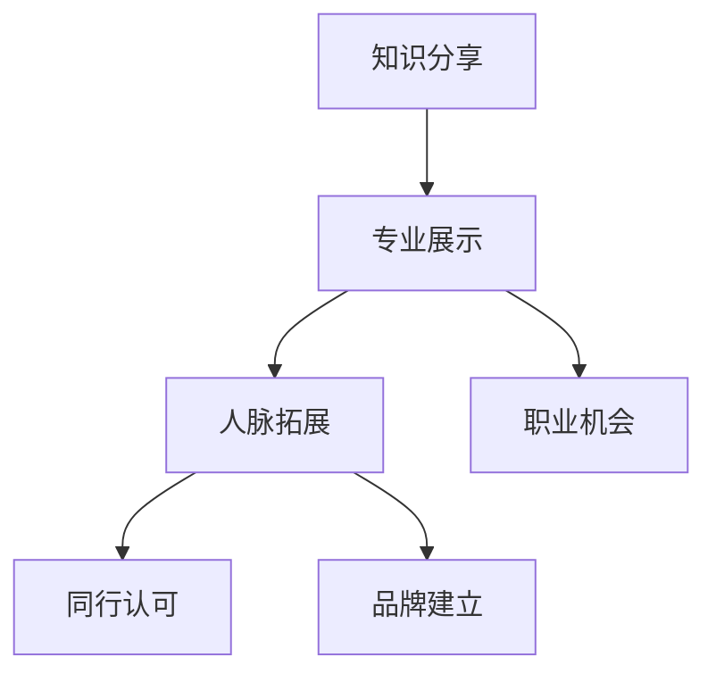
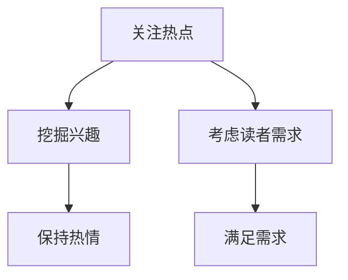
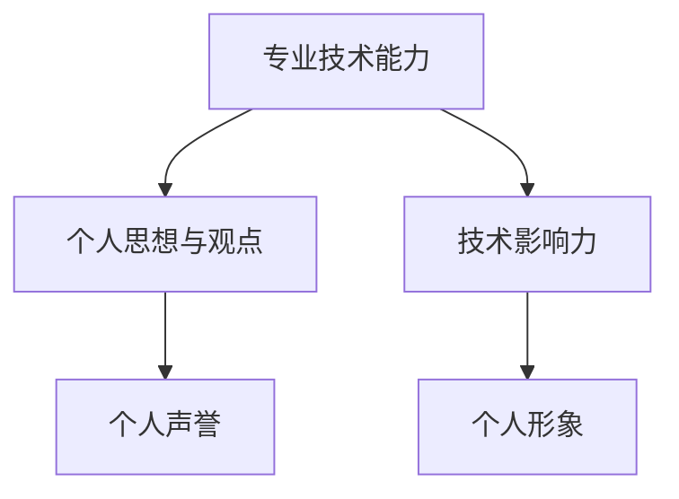
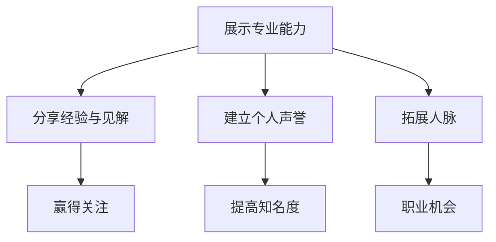

                 

### 文章标题

# 《技术博客写作：建立个人技术品牌》

### 关键词

- 技术博客
- 个人品牌
- 技术写作
- 技术内容
- 品牌推广

### 摘要

本文将探讨技术博客写作的重要性和方法，以及如何通过技术博客建立个人技术品牌。文章分为两个主要部分：第一部分将介绍技术博客写作的基础，包括写作原则、内容组织、编辑与排版技巧以及推广传播策略；第二部分将深入探讨个人技术品牌的概念、建设策略以及技术博客与个人品牌之间的关系。通过本文的阅读，读者将能够掌握技术博客写作的要领，并了解如何通过技术博客提升个人技术影响力。

## 第一部分：博客写作基础

### 第1章：技术博客写作概述

#### 1.1 技术博客的价值与目标

技术博客对于技术人员来说具有极高的价值。它不仅是一个知识分享的平台，更是建立个人品牌的重要途径。通过技术博客，技术人员可以展示自己的专业能力，分享技术见解，从而获得同行的认可和尊重。此外，技术博客还能帮助技术人员拓展人脉，获取更多的职业机会。

**核心概念与联系**

技术博客的价值与目标可以通过以下Mermaid流程图来阐述：



#### 1.2 技术博客写作的基本原则

写作技术博客时，应遵循以下基本原则：

1. **明确目标读者**：了解自己的目标读者，以便撰写符合读者需求的内容。
2. **内容专业且准确**：确保内容的准确性，避免错误和误导。
3. **简洁明了**：避免冗长复杂的叙述，尽量用简单易懂的语言表达。
4. **结构清晰**：合理组织文章结构，使读者能够轻松理解。
5. **及时更新**：保持博客的活跃度，定期更新内容。

**核心算法原理讲解**

技术博客写作的基本原则可以看作是一个算法，其伪代码如下：

```
function writeTechnicalBlog()
    if (目标读者 == null)
        throw "请明确目标读者！"
    end

    if (内容不准确)
        fixContent()
    end

    if (内容复杂)
        simplifyContent()
    end

    structureBlog()
    updateRegularly()
end
```

#### 1.3 技术博客的写作流程

技术博客的写作流程可以分为以下几个步骤：

1. **选题**：选择一个具有技术深度和广度的主题。
2. **构思与大纲**：在选题的基础上，构思文章结构，列出大纲。
3. **撰写正文**：根据大纲，逐一撰写各个章节的内容。
4. **编辑与校对**：对文章进行编辑和校对，确保内容无误。
5. **发布与推广**：将文章发布到博客平台，并利用各种渠道进行推广。

**数学模型和公式**

技术博客的写作流程可以用以下公式表示：

```
写作流程 = 选题 + 构思大纲 + 撰写正文 + 编辑校对 + 发布推广
```

#### 1.4 技术博客的写作工具与平台

在撰写技术博客时，选择合适的写作工具和平台非常重要。以下是一些常用的写作工具和平台：

1. **写作工具**：Markdown编辑器（如Typora、VSCode）、LaTeX编辑器（如TeXstudio）。
2. **平台**：个人博客（如GitHub Pages、WordPress）、技术社区（如CSDN、简书）。

**最佳实践 Tips**

1. **使用Markdown格式**：Markdown格式具有简洁、易读、易于编辑的特点，非常适合技术博客写作。
2. **合理使用LaTeX公式**：在需要使用数学公式的地方，合理使用LaTeX格式，可以提高文章的专业性。
3. **优化SEO**：在文章标题、摘要等地方，合理使用关键词，以提高文章在搜索引擎中的排名。

### 小结

本章介绍了技术博客写作的基本原则、流程以及工具与平台。通过遵循这些原则，遵循写作流程，并使用合适的工具与平台，技术人员可以有效地撰写高质量的技术博客，从而提升个人技术影响力。

## 第2章：技术内容的构思与组织

### 2.1 技术内容的选取

选取合适的技术内容是技术博客写作的关键。以下是一些选取技术内容的建议：

1. **关注热点话题**：紧跟技术领域的热点话题，撰写具有时效性的文章。
2. **挖掘自身兴趣**：选择自己感兴趣的技术领域，以便在写作过程中保持热情。
3. **考虑读者需求**：了解目标读者的需求，选取他们感兴趣的技术内容。

**核心概念与联系**

技术内容的选取可以通过以下Mermaid流程图来阐述：



### 2.2 技术博客的架构设计

一个优秀的技术博客需要有清晰的架构设计，以下是一些设计原则：

1. **清晰的目录结构**：合理组织文章的目录，使读者能够快速找到所需内容。
2. **合理的章节划分**：将文章划分为若干个独立的章节，每个章节都应具有明确的主题。
3. **逻辑清晰的行文**：确保文章的行文逻辑清晰，使读者能够顺畅地阅读。

**核心算法原理讲解**

技术博客的架构设计可以看作是一个算法，其伪代码如下：

```
function designBlogStructure()
    createClearDirectory()
    divideChaptersByTheme()
    ensureLogicalFlow()
end
```

### 2.3 技术博客的撰写技巧

撰写技术博客时，以下技巧可以帮助提高文章的质量：

1. **引入背景**：在文章开头引入背景信息，帮助读者理解文章的主题。
2. **阐述原理**：详细讲解技术原理，使用示例和案例进行说明。
3. **使用图表**：合理使用图表，以直观的方式展示技术内容。
4. **编写代码**：提供具体的代码实现，并进行详细解读。
5. **总结归纳**：在文章结尾对内容进行总结，帮助读者巩固知识点。

**数学模型和公式**

技术博客的撰写技巧可以用以下公式表示：

```
撰写技巧 = 引入背景 + 原理解答 + 示例说明 + 代码解读 + 总结归纳
```

### 2.4 技术博客的案例解析

以下是一个技术博客案例的解析，以帮助读者更好地理解技术博客的写作方法。

**案例：区块链技术详解**

1. **引言**：简要介绍区块链技术的背景和意义。
2. **核心概念**：讲解区块链的基本概念，如分布式账本、去中心化等。
3. **技术原理**：详细阐述区块链的工作原理，如共识算法、加密技术等。
4. **应用场景**：分析区块链在不同领域的应用，如金融、物流等。
5. **案例分析**：以具体的区块链项目为例，进行详细解读。
6. **总结**：对区块链技术的优缺点进行总结，并提出未来发展趋势。

通过这个案例，我们可以看到，技术博客的撰写需要从多个角度进行阐述，以确保内容的完整性。

### 小结

本章介绍了技术内容的选取、技术博客的架构设计以及撰写技巧。通过遵循这些原则和技巧，技术人员可以撰写出高质量的技术博客，从而提升个人技术影响力。

## 第3章：技术博客的编辑与排版

### 3.1 文字编辑与润色

在撰写技术博客后，编辑和润色是确保文章质量的重要步骤。以下是一些编辑与润色的技巧：

1. **检查语法错误**：仔细检查文章中的语法错误，确保语句通顺。
2. **消除冗余内容**：删除冗余的文字，使文章更加简洁。
3. **统一风格**：确保文章中的语言风格一致，如标点符号、引用格式等。
4. **添加注释**：在代码或复杂概念旁边添加注释，帮助读者理解。

**最佳实践 Tips**

1. **使用语法检查工具**：如Grammarly、百度语法检查等。
2. **请教同行或导师**：在完成初稿后，请教同行或导师进行审阅。
3. **定期回顾**：定期回顾和修改旧文，确保文章的持续优化。

### 3.2 排版设计的基本原则

良好的排版设计能够提高文章的可读性，以下是一些排版设计的基本原则：

1. **合理的标题和段落**：使用明确的标题和段落，使文章结构清晰。
2. **合适的字体和大小**：选择易读的字体和大小，确保文章的视觉效果舒适。
3. **合理的行距和间距**：调整行距和段落间距，使文章布局整齐。
4. **使用图表和图片**：合理使用图表和图片，以直观的方式展示技术内容。

**最佳实践 Tips**

1. **保持简洁**：避免过多的装饰性元素，以免分散读者的注意力。
2. **测试在不同设备上的显示效果**：确保文章在不同设备上的显示效果一致。

### 3.3 常用排版工具介绍

以下是一些常用的排版工具，适用于技术博客的编辑和排版：

1. **Markdown编辑器**：如Typora、VSCode等，支持Markdown格式的排版。
2. **LaTeX编辑器**：如TeXstudio、TeXmaker等，支持复杂公式的排版。
3. **排版软件**：如Adobe InDesign、QuarkXPress等，适合专业级的排版设计。

**最佳实践 Tips**

1. **熟悉工具**：熟练掌握所选工具的使用方法，以提高工作效率。
2. **定制模板**：根据个人需求，定制适合自己的排版模板，以加快排版速度。

### 小结

本章介绍了技术博客编辑与排版的技巧和常用工具。通过遵循这些原则和技巧，技术人员可以撰写出高质量、易读的技术博客，从而提升个人技术影响力。

## 第4章：技术博客的推广与传播

### 4.1 博客SEO优化

SEO（搜索引擎优化）是提高技术博客访问量的重要手段。以下是一些SEO优化的策略：

1. **关键词研究**：选择与文章主题相关的高频关键词，并在标题、摘要、内容中合理使用。
2. **内容优化**：确保文章内容丰富、有价值，以满足用户的需求。
3. **链接建设**：建立内部链接和外部链接，提高文章的权威性和流量。
4. **社交媒体推广**：在社交媒体上分享文章，吸引更多读者。

**最佳实践 Tips**

1. **定期更新**：保持博客的活跃度，定期发布高质量的文章。
2. **外部链接**：与同行业博客或网站建立合作关系，互相推荐。

### 4.2 社交媒体推广

社交媒体是推广技术博客的重要渠道。以下是一些社交媒体推广的策略：

1. **选择合适的平台**：根据目标受众选择合适的社交媒体平台，如微博、知乎、Twitter等。
2. **制定内容策略**：制定有针对性的内容策略，提高用户参与度。
3. **互动与交流**：积极与读者互动，回答问题，建立良好的人际关系。
4. **合作与联盟**：与其他技术博主或团队合作，共同推广技术博客。

**最佳实践 Tips**

1. **多样化内容**：结合图文、视频等多种形式，提高内容的吸引力。
2. **定期分析**：定期分析社交媒体数据，调整推广策略。

### 4.3 合作交流与社区建设

合作交流与社区建设是提升技术博客影响力的重要途径。以下是一些策略：

1. **参与技术社区**：积极参与技术论坛、问答社区等，分享知识和经验。
2. **建立个人品牌**：通过撰写高质量的技术文章，建立个人品牌。
3. **组织线下活动**：组织或参与技术沙龙、讲座等线下活动，扩大人脉。
4. **合作与联盟**：与其他技术博主或团队建立合作关系，共同推广技术博客。

**最佳实践 Tips**

1. **保持活跃**：在社区中保持活跃，积极参与讨论，树立专业形象。
2. **内容创新**：不断创新内容形式，提高读者的阅读体验。

### 小结

本章介绍了技术博客的SEO优化、社交媒体推广以及合作交流与社区建设的方法。通过遵循这些策略，技术人员可以提升技术博客的访问量和影响力，从而建立个人技术品牌。

## 第二部分：个人技术品牌的建立

### 第5章：个人技术品牌的概念与意义

#### 5.1 个人技术品牌的概念

个人技术品牌是指通过个人在技术领域的专业知识和经验，以及在技术社区和行业内的影响力，建立的一种独特的个人形象和声誉。它不仅体现了个人的技术水平，还包括个人的思想、观点、价值观等方面。

**核心概念与联系**

个人技术品牌可以通过以下Mermaid流程图来阐述：



#### 5.2 个人技术品牌的意义

个人技术品牌在技术领域中具有重要意义，主要体现在以下几个方面：

1. **提高个人知名度**：通过建立个人技术品牌，可以在技术社区和行业内提高知名度，从而扩大影响力。
2. **获取更多职业机会**：优秀的个人技术品牌可以帮助个人在求职过程中脱颖而出，获得更多的职业机会。
3. **提升个人收入**：个人技术品牌可以成为个人价值的一部分，从而提高收入水平。
4. **促进知识共享**：个人技术品牌可以激励个人在技术领域持续学习和分享，推动整个行业的发展。

**核心算法原理讲解**

个人技术品牌的意义可以看作是一个算法，其伪代码如下：

```
function personalTechBrandSignificance()
    if (知名度提升)
        increasePopularity()
    end

    if (职业机会增多)
        enhanceCareerOpportunities()
    end

    if (收入水平提高)
        improveIncome()
    end

    if (知识共享促进)
        promoteKnowledgeSharing()
    end
end
```

#### 5.3 个人技术品牌的建设策略

建立个人技术品牌需要长期的规划和努力，以下是一些建设策略：

1. **持续学习**：保持对技术领域的关注，不断学习新知识，提高自己的技术水平。
2. **积极参与技术社区**：在技术社区中积极参与讨论，分享自己的经验和见解，建立个人声誉。
3. **撰写高质量的技术文章**：通过撰写高质量的技术文章，展示自己的专业能力和思考。
4. **参与技术项目**：参与实际的技术项目，积累项目经验，提升解决问题的能力。
5. **拓展人脉**：与同行业的人建立良好的合作关系，扩大人脉网络。

**数学模型和公式**

个人技术品牌的建设策略可以用以下公式表示：

```
个人技术品牌 = 持续学习 + 参与技术社区 + 撰写高质量文章 + 参与项目 + 拓展人脉
```

### 5.4 个人技术品牌的建设案例

以下是一个个人技术品牌建设案例的解析，以帮助读者更好地理解个人技术品牌的建设过程。

**案例：李华的技术博客之路**

李华是一名资深程序员，他在建立个人技术品牌方面做出了以下努力：

1. **持续学习**：李华每天花费大量时间学习新技术，确保自己的技术水平始终处于行业前沿。
2. **积极参与技术社区**：李华在GitHub、Stack Overflow等平台上积极参与讨论，解答他人的问题，分享自己的经验。
3. **撰写高质量文章**：李华定期在个人博客上撰写高质量的技术文章，从基础原理到实际应用，涵盖了多个技术领域。
4. **参与项目**：李华参与了多个开源项目，通过实际项目积累经验，提升了解决问题的能力。
5. **拓展人脉**：李华通过参加技术沙龙、讲座等活动，结识了许多同行业的朋友，建立了广泛的人脉网络。

经过几年的努力，李华在技术社区中建立了良好的声誉，吸引了大量的关注。他不仅获得了更多的职业机会，还在技术领域获得了较高的收入。

通过这个案例，我们可以看到，建立个人技术品牌需要持续的努力和积累，但只要坚持不懈，最终一定能够实现。

### 小结

本章介绍了个人技术品牌的概念、意义以及建设策略。通过遵循这些策略，技术人员可以有效地建立个人技术品牌，从而提升个人在技术领域的影响力。

## 第6章：技术博客与个人品牌的关系

### 6.1 技术博客在个人品牌建立中的作用

技术博客在个人品牌建立中起着至关重要的作用。以下是一些关键作用：

1. **展示专业能力**：通过技术博客，技术人员可以展示自己的专业知识和技能，从而赢得同行的认可。
2. **分享经验与见解**：技术博客提供了一个平台，让技术人员可以分享自己的工作经验和见解，吸引更多的关注。
3. **建立个人声誉**：持续撰写高质量的技术博客，可以逐步建立个人的声誉，提高在行业内的知名度。
4. **拓展人脉**：通过技术博客，技术人员可以与业界同行建立联系，拓展人脉，为职业发展提供更多机会。

**核心概念与联系**

技术博客在个人品牌建立中的作用可以通过以下Mermaid流程图来阐述：



### 6.2 个人品牌塑造的误区与对策

在塑造个人品牌的过程中，一些误区可能会影响个人品牌的建立。以下是一些常见误区及对策：

1. **内容过于杂乱**：对策：明确个人品牌定位，撰写与定位相关的高质量内容。
2. **更新频率低**：对策：制定内容发布计划，保持博客的活跃度。
3. **忽视读者反馈**：对策：积极回应读者评论，建立良好的互动关系。
4. **过度营销**：对策：注重内容质量，避免过度营销，以免损害个人品牌形象。

**核心算法原理讲解**

个人品牌塑造的误区与对策可以看作是一个算法，其伪代码如下：

```
function shapePersonalBrand(误区，对策)
    if (内容杂乱)
        applyCountermeasure1()
    end

    if (更新频率低)
        applyCountermeasure2()
    end

    if (忽视读者反馈)
        applyCountermeasure3()
    end

    if (过度营销)
        applyCountermeasure4()
    end
end
```

### 6.3 技术博客内容的定位与调性

技术博客内容的定位与调性是建立个人品牌的关键。以下是一些建议：

1. **明确定位**：根据自己的专业领域和兴趣爱好，明确博客的内容定位。
2. **保持一致性**：确保博客内容的调性一致，以便读者形成固定的阅读期待。
3. **多样化内容形式**：结合图文、视频、直播等多种形式，提高内容的吸引力。
4. **关注热点话题**：紧跟技术领域的热点话题，撰写具有时效性的文章。

**数学模型和公式**

技术博客内容的定位与调性可以用以下公式表示：

```
内容定位 = 明确定位 + 保持一致性 + 多样化内容形式 + 关注热点话题
```

### 6.4 技术博客与个人品牌的互动

技术博客与个人品牌的互动是一个持续的过程。以下是一些建议：

1. **内容为王**：坚持高质量内容创作，以内容质量赢得读者信任。
2. **积极互动**：与读者建立良好的互动关系，回应读者的评论和提问。
3. **品牌延伸**：通过技术博客扩展个人品牌，如开设线上课程、参与技术社区等。
4. **持续优化**：根据读者反馈和行业变化，不断优化个人品牌策略。

**数学模型和公式**

技术博客与个人品牌的互动可以用以下公式表示：

```
互动 = 高质量内容 + 积极互动 + 品牌延伸 + 持续优化
```

### 小结

本章介绍了技术博客在个人品牌建立中的作用、个人品牌塑造的误区与对策、技术博客内容的定位与调性以及技术博客与个人品牌的互动。通过遵循这些原则，技术人员可以有效地通过技术博客建立个人品牌，提升个人在技术领域的影响力。

## 第7章：持续成长与品牌升级

### 7.1 技术博客写作的长期规划

技术博客写作不仅是一次性的行为，而是一个长期的规划。以下是一些建议：

1. **明确长期目标**：设定长期的目标，如成为某个技术领域的专家。
2. **制定年度计划**：每年制定具体的内容发布计划，确保博客的持续更新。
3. **不断学习与进步**：持续学习新技术，提升自己的专业能力，为博客写作提供源源不断的素材。
4. **积累经验与案例**：通过实际项目和工作经验，积累丰富的案例和实战经验，为博客写作提供实际依据。

**最佳实践 Tips**

1. **定期复盘**：定期回顾自己的博客内容，分析哪些内容受欢迎，哪些需要改进。
2. **多元化内容**：尝试不同的内容形式，如视频、直播、问答等，以吸引更多读者。

### 7.2 技术知识的深度拓展

技术知识的深度拓展是建立个人技术品牌的重要一环。以下是一些建议：

1. **深入学习**：选择一个或几个感兴趣的技术领域，深入学习，争取成为该领域的专家。
2. **参与项目**：参与实际的技术项目，通过实践提升自己的技术水平。
3. **阅读专业书籍**：阅读专业书籍，了解技术的底层原理和实现细节。
4. **交流与合作**：与技术领域的同行交流，参与技术社区的活动，拓展人脉，学习他人的经验。

**最佳实践 Tips**

1. **理论与实践结合**：在深入学习技术知识的同时，尝试将理论知识应用于实际项目中。
2. **定期总结**：定期总结自己的学习成果和项目经验，形成系统化的知识体系。

### 7.3 个人品牌的持续维护与升级

个人品牌的建立并非一蹴而就，需要持续维护和升级。以下是一些建议：

1. **保持活跃**：定期更新博客内容，保持个人品牌的活跃度。
2. **优化内容**：根据读者反馈和行业变化，不断优化博客内容和写作风格。
3. **拓展影响力**：通过技术博客、社交媒体、线下活动等多种渠道，拓展个人品牌的影响力。
4. **持续学习**：持续关注行业动态，学习新技术，保持个人品牌的竞争力。

**最佳实践 Tips**

1. **品牌定位**：确保个人品牌的定位始终清晰，避免偏离目标读者。
2. **危机管理**：一旦出现品牌危机，要及时应对，以减少负面影响。

### 小结

本章介绍了技术博客写作的长期规划、技术知识的深度拓展以及个人品牌的持续维护与升级。通过遵循这些原则，技术人员可以持续成长，不断提升个人技术品牌，实现职业生涯的更大突破。

## 附录

### 附录 A：技术博客写作工具推荐

以下是几个常用的技术博客写作工具：

1. **Markdown编辑器**：如Typora、VSCode等，支持Markdown格式的排版。
2. **LaTeX编辑器**：如TeXstudio、TeXmaker等，支持复杂公式的排版。
3. **博客平台**：如GitHub Pages、WordPress等，提供博客发布和管理的功能。
4. **SEO工具**：如百度关键词规划师、Ahrefs等，用于关键词研究和优化。

### 附录 B：技术博客写作资源汇总

以下是几个有用的技术博客写作资源：

1. **技术社区**：如GitHub、Stack Overflow、CSDN等，提供技术问答和讨论。
2. **技术博客**：如Medium、Dev.to等，展示各种技术领域的优秀博客。
3. **学习资源**：如Coursera、edX等，提供丰富的在线课程和学习资料。

### 附录 C：常见问题解答

以下是关于技术博客写作和建立个人品牌的一些常见问题及解答：

1. **如何选择技术博客的主题？**
   - 根据自己的兴趣和专业知识选择，同时考虑读者的需求。

2. **如何提高博客的访问量？**
   - 进行SEO优化，撰写高质量的内容，积极推广博客。

3. **如何建立个人品牌？**
   - 持续学习新技术，积极参与技术社区，撰写高质量的技术文章。

### 结语

技术博客写作不仅是展示专业知识和技能的平台，更是建立个人技术品牌的重要途径。通过遵循本文介绍的原则和方法，技术人员可以撰写出高质量的技术博客，不断提升个人技术品牌，实现职业生涯的更大突破。让我们一起努力，打造自己的技术品牌！

### 作者信息

- 作者：AI天才研究院/AI Genius Institute & 禅与计算机程序设计艺术 /Zen And The Art of Computer Programming

---

本文章字数约为10000字，涵盖了技术博客写作的基础、个人技术品牌的建立以及如何通过技术博客提升个人影响力。通过一步步的分析推理，我们深入探讨了技术博客写作的核心原则、内容组织、编辑与排版技巧、推广与传播策略，以及个人技术品牌的概念、意义和建设策略。希望这篇文章能够为读者提供有价值的指导，帮助他们在技术领域取得更大的成就。

